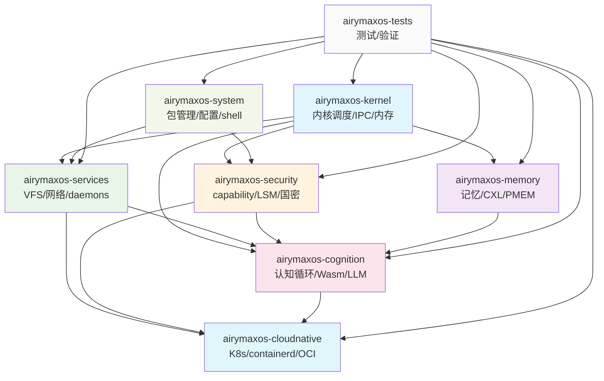
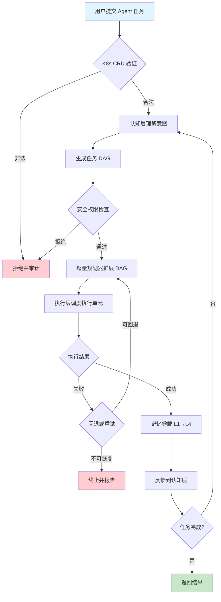

# 功能需求分析

> **文档定位**: AirymaxOS 功能需求（Functional Requirements）的详细分析，回答"AirymaxOS 提供哪些具体能力（输入 → 处理 → 输出）"。
> **版本**: 0.1.1（占位）/ 1.0.1（开发）
> **最后更新**: 2026-07-06
> **父文档**: [需求分析概览](README.md)

---

## 1. 概述

本文档定义 AirymaxOS 的功能需求（FR，Functional Requirements），覆盖 8 个子仓的全部功能能力。每条功能需求满足以下要求：

1. **可追溯到业务需求**：每条 FR 至少对应一条 BR
2. **有明确的输入输出**：定义清晰的输入、处理逻辑与输出
3. **有验收标准**：可通过单元测试、集成测试或契约测试验证
4. **受非功能需求约束**：每条 FR 至少受一条 NFR 约束

功能需求按 8 子仓组织，编号规则为 `FR-XXX`，每个子仓分配独立的编号区间。

---

## 2. 8 子仓功能矩阵

下表展示 AirymaxOS 8 个子仓的核心功能、同源 agentrt 模块与关键能力：

| 子仓 | 核心功能 | 同源 agentrt 模块 | 关键能力 |
|---|---|---|---|
| airymaxos-kernel | 内核调度、IPC、内存管理 | atoms/corekern (MicroCoreRT) | EEVDF + sched_ext + io_uring |
| airymaxos-services | VFS、网络、驱动、daemons | daemons (12 daemons) | systemd + io_uring 消息传递 |
| airymaxos-security | capability、LSM、国密 | cupolas | capability(seL4) + Landlock + 机密计算 |
| airymaxos-memory | 记忆持久化、CXL、PMEM | heapstore + memoryrovol | MemoryRovol 内核态 + MGLRU |
| airymaxos-cognition | 认知循环、Wasm、LLM 调度 | coreloopthree + frameworks | CoreLoopThree kthread + Wasm 3.0 |
| airymaxos-cloudnative | K8s、containerd、OCI | gateway + sdk | K8s CRD + containerd shim |
| airymaxos-system | 包管理、配置、shell | commons | RPM + dnf + DevStation |
| airymaxos-tests | 单元、集成、形式化 | 全模块测试 | AirymaxOS 集成测试框架 + seL4 风格验证 |

---

## 3. 同源 agentrt 功能映射

下表详细展示 agentrt 模块与 AirymaxOS 子仓的同源语义映射关系：

| agentrt 模块 | AirymaxOS 子仓 | 同源语义 | 同源红利 |
|---|---|---|---|
| atoms/corekern (MicroCoreRT) | airymaxos-kernel | 微核心基础：IPC/Mem/Task/Time | 调度语义同源，无适配层 |
| atoms/corekern IPC | airymaxos-kernel | IPC 子系统：128B 消息头同源 | 协议同源，低延迟 |
| daemons/llm_d | airymaxos-services | LLM 守护进程：模型管理 | 服务同源，行为一致 |
| daemons/market_d | airymaxos-services | 市场守护进程：Agent 注册发现 | 服务同源 |
| daemons/monit_d | airymaxos-services | 监控守护进程：可观测性 | 服务同源 |
| daemons/sched_d | airymaxos-services | 调度守护进程：任务调度 | 服务同源 |
| daemons/tool_d | airymaxos-services | 工具守护进程：执行单元 | 服务同源 |
| cupolas (安全穹顶) | airymaxos-security | capability + LSM 安全模型 | 模型同源，安全内生 |
| cupolas/permission | airymaxos-security | 权限裁决引擎：RBAC + 策略 | 模型同源 |
| cupolas/sanitizer | airymaxos-security | 输入净化管道：四阶段 | 模型同源 |
| cupolas/audit | airymaxos-security | 审计追踪：SHA-256 哈希链 | 模型同源 |
| heapstore | airymaxos-memory | 堆存储：持久化基础 | 存储同源 |
| memoryrovol | airymaxos-memory | 记忆卷载：四层递进 | 记忆模型同源 |
| coreloopthree | airymaxos-cognition | 三层认知循环：认知→执行→记忆 | 循环模型同源 |
| frameworks | airymaxos-cognition | 框架层：Wasm + LLM 调度 | 框架同源 |
| gateway | airymaxos-cloudnative | 网关层：HTTP/WebSocket/Stdio | 网关同源 |
| sdk | airymaxos-cloudnative | SDK：开发者接口 | SDK 同源 |
| commons | airymaxos-system | 统一基础库：error/logger/metrics | 基础库同源 |

---

## 4. 能力清单（FR-001 ~ FR-080）

### 4.1 airymaxos-kernel 子仓（FR-001 ~ FR-010）

| 编号 | 功能需求 | 输入 | 输出 | 同源 agentrt | 验收标准 |
|---|---|---|---|---|---|
| FR-001 | 内核调度（EEVDF + sched_ext） | 任务描述 + 调度策略 | 调度结果 | atoms/corekern Task | 调度延迟 < 100ms |
| FR-002 | SCHED_AGENT 调度类 | Agent 任务 + 优先级 | 调度决策 | MicroCoreRT 调度器 | Agent 优先级抢占正确 |
| FR-003 | IPC 子系统（io_uring 零拷贝） | 消息（128B 头 + payload） | 接收确认 | atoms/corekern IPC | 吞吐 > 100K msg/s |
| FR-004 | 内存管理（MGLRU，Linux 6.6 多代 LRU） | 内存分配请求 | 内存指针 | atoms/corekern Mem | 多代 LRU 正确回收 |
| FR-005 | 时间服务（时钟 + 定时器） | 定时器请求 | 定时器触发 | atoms/corekern Time | 定时器精度 < 1ms |
| FR-006 | eBPF kfunc + dynamic pointer | eBPF 程序 | 验证结果 | - | 未签名 eBPF 拒绝加载 |
| FR-007 | Rust 内核模块支持（实验性） | Rust 模块 | 加载结果 | - | Rust 模块可加载卸载 |
| FR-008 | EEVDF 调度器抢占 | 抢占请求 | 抢占结果 | - | 抢占延迟 < 10μs |
| FR-009 | io_uring 零 syscall I/O | I/O 请求 | I/O 完成 | - | I/O 延迟降低 > 30% |
| FR-010 | 内核可观测性（perf/ftrace） | 探针请求 | 探针数据 | - | 性能开销 < 5% |

### 4.2 airymaxos-services 子仓（FR-011 ~ FR-020）

| 编号 | 功能需求 | 输入 | 输出 | 同源 agentrt | 验收标准 |
|---|---|---|---|---|---|
| FR-011 | VFS 虚拟文件系统 | 文件操作 | 文件结果 | - | POSIX 兼容性 100% |
| FR-012 | 网络协议栈 | 网络包 | 网络包 | - | TCP/UDP 兼容 |
| FR-013 | 设备驱动框架 | 驱动注册 | 驱动绑定 | - | 设备热插拔支持 |
| FR-014 | systemd 服务管理 | unit 文件 | 服务状态 | - | systemd 255+ 兼容 |
| FR-015 | 12 daemons 集成 | daemon 配置 | daemon 状态 | daemons | 12 daemons 全部运行 |
| FR-016 | io_uring 消息传递 | IPC 消息 | 接收确认 | daemons IPC | 消息延迟 < 10μs |
| FR-017 | journald 日志管理 | 日志事件 | 结构化日志 | - | 日志结构化 100% |
| FR-018 | 网络守护进程 | 网络配置 | 网络状态 | - | 网络配置动态生效 |
| FR-019 | 时间守护进程 | 时间同步 | 时间状态 | - | NTP 同步精度 < 1ms |
| FR-020 | 设备守护进程 | 设备事件 | 设备状态 | - | 设备事件实时响应 |

### 4.3 airymaxos-security 子仓（FR-021 ~ FR-030）

| 编号 | 功能需求 | 输入 | 输出 | 同源 agentrt | 验收标准 |
|---|---|---|---|---|---|
| FR-021 | capability 安全模型（seL4 风格） | 权限请求 | 授权结果 | cupolas permission | 未授权访问 100% 拒绝 |
| FR-022 | LSM hook（SELinux + Landlock） | 安全检查 | 拦截决策 | cupolas | SELinux 策略完整兼容 |
| FR-023 | 国密算法（SM2/SM3/SM4/SM9） | 加密请求 | 加密结果 | - | 国密算法正确性验证 |
| FR-024 | 机密计算（SGX/SEV/TrustZone） | 机密计算请求 | 计算结果 | - | 飞地安全隔离 |
| FR-025 | 输入净化管道（四阶段） | 外部输入 | 净化结果 | cupolas sanitizer | 注入攻击防御 > 99.9% |
| FR-026 | 审计追踪（SHA-256 哈希链） | 审计事件 | 审计日志 | cupolas audit | 日志不可篡改 |
| FR-027 | 沙箱隔离（进程/容器/WASM） | 隔离请求 | 沙箱句柄 | cupolas workbench | 沙箱逃逸防御 100% |
| FR-028 | 安全金库（AES-256-GCM） | 加密请求 | 加密数据 | cupolas security | 加密强度验证通过 |
| FR-029 | 网络安全（出站过滤 + TLS） | 网络请求 | 过滤决策 | cupolas network | 出站过滤正确 |
| FR-030 | 权限动态更新 | 策略变更 | 重新评估 | cupolas permission | 运行时策略生效 |

### 4.4 airymaxos-memory 子仓（FR-031 ~ FR-040）

| 编号 | 功能需求 | 输入 | 输出 | 同源 agentrt | 验收标准 |
|---|---|---|---|---|---|
| FR-031 | MemoryRovol L1 原始卷 | 原始记录 | L1 存储 | memoryrovol L1 | L1 不可变（仅追加） |
| FR-032 | MemoryRovol L2 特征层 | L1 记录 | 语义向量 | memoryrovol L2 | 特征向量质量 > 0.85 |
| FR-033 | MemoryRovol L3 结构层 | L2 向量 | 关系图 | memoryrovol L3 | 关系图构建正确 |
| FR-034 | MemoryRovol L4 模式层 | L3 结构图 | 持久同调 | memoryrovol L4 | 模式挖掘准确率 > 90% |
| FR-035 | CXL 内存分层与池化 | CXL 设备 | 池化内存 | - | CXL 内存可池化 |
| FR-036 | PMEM 持久内存 | PMEM 设备 | 持久存储 | - | PMEM 持久性验证 |
| FR-037 | MGLRU 多代 LRU（Linux 6.6） | 内存回收 | 回收结果 | - | 多代回收效率 +20% |
| FR-038 | 记忆遗忘机制 | 遗忘策略 | 衰减结果 | memoryrovol | 遗忘曲线正确 |
| FR-039 | 记忆检索（双路径） | 检索请求 | 检索结果 | memoryrovol | 检索延迟 < 50ms |
| FR-040 | heapstore 堆存储 | 存储请求 | 存储结果 | heapstore | 堆存储持久化 |

### 4.5 airymaxos-cognition 子仓（FR-041 ~ FR-050）

| 编号 | 功能需求 | 输入 | 输出 | 同源 agentrt | 验收标准 |
|---|---|---|---|---|---|
| FR-041 | CoreLoopThree kthread | 认知任务 | 认知结果 | coreloopthree | kthread 正确调度 |
| FR-042 | 认知层（理解意图 + 生成计划） | 用户意图 | 任务 DAG | coreloopthree cognition | DAG 深度限制 10 层 |
| FR-043 | 执行层（执行单元 + 补偿事务） | 任务节点 | 执行结果 | coreloopthree execution | 补偿事务正确回滚 |
| FR-044 | 双系统协同（System 1 + System 2） | 认知请求 | 协同结果 | coreloopthree | 切换阈值正确 |
| FR-045 | 增量规划器 | 执行反馈 | DAG 扩展 | coreloopthree planner | 增量扩展正确 |
| FR-046 | Wasm 3.0 沙箱运行时 | Wasm 模块 | 执行结果 | frameworks | Wasm 沙箱安全隔离 |
| FR-047 | LLM 调度策略 | LLM 请求 | 调度决策 | frameworks | Token 能效 +30% |
| FR-048 | 超节点 OS 沙箱 | 超节点任务 | 沙箱结果 | - | 节点间迁移 < 100ms |
| FR-049 | 具身智能 Claw 沙箱 | Claw 任务 | 沙箱结果 | - | Claw 沙箱安全隔离 |
| FR-050 | 策略可插拔（运行时替换） | 策略切换 | 切换结果 | coreloopthree | 切换不影响运行任务 |

### 4.6 airymaxos-cloudnative 子仓（FR-051 ~ FR-060）

| 编号 | 功能需求 | 输入 | 输出 | 同源 agentrt | 验收标准 |
|---|---|---|---|---|---|
| FR-051 | K8s CRD 扩展（AgentTask） | CRD 定义 | CRD 资源 | gateway | K8s v1.30+ 兼容 |
| FR-052 | K8s 自定义调度器 | 调度请求 | 调度决策 | gateway | 调度延迟 < 1s |
| FR-053 | containerd Agent shim | 容器请求 | 容器实例 | sdk | containerd 1.7+ 兼容 |
| FR-054 | OCI 镜像管理 | 镜像请求 | 镜像实例 | - | OCI v1.1 兼容 |
| FR-055 | 镜像签名验证（cosign） | 镜像 | 验证结果 | - | 未签名镜像拒绝 |
| FR-056 | CNI 网络插件 | 网络配置 | 网络实例 | - | CNI 1.1 兼容 |
| FR-057 | Service Mesh 集成 | 服务网格配置 | 网格实例 | - | Istio/Linkerd 兼容 |
| FR-058 | 服务发现与注册 | 服务注册 | 服务发现 | - | 发现延迟 < 10ms |
| FR-059 | 配置管理与热更新 | 配置变更 | 配置生效 | - | 热更新 < 1s |
| FR-060 | 熔断降级与限流 | 流量请求 | 流控决策 | - | 熔断正确触发 |

### 4.7 airymaxos-system 子仓（FR-061 ~ FR-070）

| 编号 | 功能需求 | 输入 | 输出 | 同源 agentrt | 验收标准 |
|---|---|---|---|---|---|
| FR-061 | RPM 包格式兼容 | RPM 包 | 安装结果 | commons | RPM 4.x 兼容 |
| FR-062 | dnf 包管理器 | 包操作 | 操作结果 | commons | dnf 4.x 兼容 |
| FR-063 | 软件源管理 | 仓库配置 | 仓库状态 | - | 多仓库优先级 |
| FR-064 | 配置管理 | 配置文件 | 配置状态 | - | 配置热更新 |
| FR-065 | Shell 环境 | Shell 命令 | 命令结果 | - | bash/zsh 兼容 |
| FR-066 | 基础库（commons） | 库调用 | 库结果 | commons | API 完整兼容 |
| FR-067 | DevStation 开发环境 | 开发配置 | 开发环境 | - | 一键开发环境 |
| FR-068 | 系统裁剪与定制 | 裁剪配置 | 定制系统 | - | 裁剪后可运行 |
| FR-069 | 多架构构建 | 构建配置 | 多架构包 | - | x86_64/ARM64 双构建 |
| FR-070 | 系统初始化 | 初始化配置 | 初始化结果 | - | 初始化可重复 |

### 4.8 airymaxos-tests 子仓（FR-071 ~ FR-080）

| 编号 | 功能需求 | 输入 | 输出 | 同源 agentrt | 验收标准 |
|---|---|---|---|---|---|
| FR-071 | 单元测试框架 | 测试用例 | 测试结果 | 全模块测试 | 覆盖率 > 90% |
| FR-072 | 集成测试框架 | 集成场景 | 测试结果 | 全模块测试 | 接口覆盖率 > 80% |
| FR-073 | 契约测试 | 契约定义 | 测试结果 | - | 契约 100% 强制 |
| FR-074 | 性能基准测试 | 基准场景 | 性能数据 | - | SLA 达标率 > 99% |
| FR-075 | Soak Test（7×24） | 长时场景 | 稳定性数据 | - | 7 天无故障 |
| FR-076 | 混沌工程（Chaos Mesh） | 故障注入 | 韧性数据 | - | 故障恢复 < 5min |
| FR-077 | 形式化验证（seL4 风格） | 形式化规约 | 验证结果 | - | 关键路径验证通过 |
| FR-078 | 兼容性测试矩阵 | 兼容性场景 | 兼容性数据 | - | Linux 企业级生态兼容 |
| FR-079 | 渗透测试 | 攻击场景 | 安全报告 | - | 注入防御 > 99.9% |
| FR-080 | 测试报告生成 | 测试数据 | 测试报告 | - | 报告自动生成 |

---

## 5. 功能依赖关系图

### 5.1 子仓间依赖关系

### 5.2 核心功能依赖链

下表展示核心功能的依赖链，从用户请求到内核执行的完整路径：

| 用户请求 | 功能依赖链 | 涉及子仓 |
|---|---|---|
| Agent 任务提交 | FR-051 K8s CRD → FR-042 认知层 → FR-045 增量规划 → FR-043 执行层 → FR-001 内核调度 | cloudnative → cognition → kernel |
| 记忆检索 | FR-039 检索 → FR-031 L1 → FR-032 L2 → FR-033 L3 → FR-034 L4 | memory |
| 安全权限检查 | FR-021 capability → FR-022 LSM → FR-025 净化 → FR-026 审计 | security |
| 容器编排 | FR-051 CRD → FR-053 shim → FR-054 OCI → FR-056 CNI | cloudnative |
| 包安装 | FR-062 dnf → FR-061 RPM → FR-063 软件源 | system |

### 5.3 关键路径 Mermaid 流程图

---

## 6. 功能需求与业务需求追溯矩阵

下表展示功能需求与业务需求的双向追溯关系：

| 功能需求 | 对应业务需求 | 对应非功能需求 |
|---|---|---|
| FR-001 内核调度 | BR-001/002/003/004 | NFR-P-001 延迟 < 100ms |
| FR-003 IPC 子系统 | BR-005 超节点协同 | NFR-P-002 吞吐 > 100K msg/s |
| FR-021 capability | BR-007 SELinux 对齐 | NFR-S-001 capability 模型 |
| FR-031 MemoryRovol L1 | BR-001 科研知识图谱 | NFR-R-001 数据持久性 |
| FR-042 认知层 | BR-001/002 科研/客服 | NFR-P-001 调度延迟 |
| FR-047 LLM 调度 | BR-005 AI 原生 | NFR-P-004 Token 能效 |
| FR-051 K8s CRD | BR-006 云原生 | NFR-C-001 K8s 兼容 |
| FR-061 RPM 兼容 | BR-007 Linux 企业级生态对齐 | NFR-C-002 RPM 兼容 |
| FR-075 Soak Test | BR-003 工业控制 | NFR-R-001 7×24 稳定性 |

---

## 7. 功能需求优先级

| 优先级 | 子仓 | 功能需求 | 说明 |
|---|---|---|---|
| P0 | kernel | FR-001~FR-010 | 内核是系统基础 |
| P0 | security | FR-021~FR-030 | 安全是内生需求 |
| P0 | system | FR-061~FR-064 | 包管理是生态基础 |
| P1 | services | FR-011~FR-020 | 服务层是用户态基础 |
| P1 | memory | FR-031~FR-040 | 记忆是认知基础 |
| P1 | cognition | FR-041~FR-050 | 认知是核心能力 |
| P2 | cloudnative | FR-051~FR-060 | 云原生是扩展能力 |
| P2 | tests | FR-071~FR-080 | 测试是质量保证 |

---

## 8. 功能需求验收方法

每条功能需求必须有明确的验收方法，对应设计原则「E-8 可测试性原则」：

| 验收类型 | 工具 | 覆盖目标 | 责任子仓 |
|---|---|---|---|
| 单元测试 | CUnit + CMock | 行覆盖率 > 90% | airymaxos-tests |
| 集成测试 | 自定义框架 | 接口覆盖率 > 80% | airymaxos-tests |
| 契约测试 | 契约测试框架 | 契约 100% 强制 | airymaxos-tests |
| 性能基准 | Locust + k6 + perf | SLA 达标率 > 99% | airymaxos-tests |
| 形式化验证 | seL4 风格验证 | 关键路径 100% | airymaxos-tests |
| 兼容性测试 | AirymaxOS 集成测试框架 | 兼容性矩阵 100% | airymaxos-tests + system |

---

## 9. 功能需求变更管理

功能需求变更遵循「提案 → 评审 → 文档化 → 实施」流程：

1. **提案**：在本文档提交 Pull Request，标注变更类型与影响范围
2. **评审**：架构委员会评估变更对 8 子仓的影响
3. **文档化**：更新本文档，记录变更原因与 ADR 编号
4. **实施**：在对应子仓中实施，通过 CI 验证

**变更类型**：

| 变更类型 | 影响范围 | 评审要求 |
|---|---|---|
| 新增功能 | 单个子仓 | 架构委员会评审 |
| 修改功能 | 跨子仓 | 架构委员会评审 + ADR |
| 废弃功能 | 跨层次 | 架构委员会评审 + ADR + 兼容性评估 |

---

## 10. 相关文档

- [需求分析概览](README.md)：需求分层模型与追溯框架
- [业务需求分析](01-business-requirements.md)：Agent 工作负载与生态对齐
- [非功能需求分析](03-non-functional-requirements.md)：性能、安全、可靠性需求
- [AirymaxOS 总览](../README.md)：AirymaxOS 整体设计与子仓清单
- [Airymax 架构设计原则](../../ARCHITECTURAL_PRINCIPLES.md)：五维正交 24 原则

---

## 11. 文档变更记录

| 版本 | 日期 | 变更内容 | 变更人 |
|---|---|---|---|
| 0.1.1 | 2026-07-06 | 初始版本，定义 80 条功能需求与 8 子仓功能矩阵 | Airymax 架构委员会 |

---

© 2025-2026 SPHARX Ltd. All Rights Reserved.
"From data intelligence emerges."
