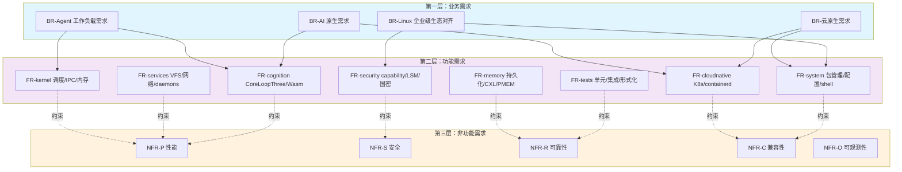
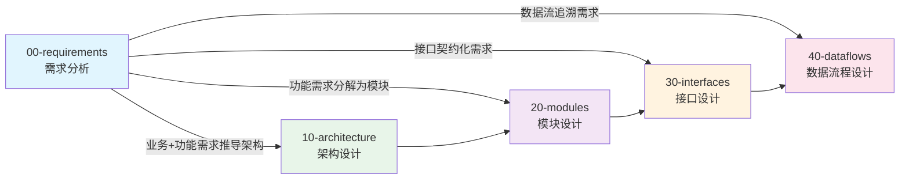

Copyright (c) 2025-2026 SPHARX Ltd. All Rights Reserved.

# agentrt-liunx（AirymaxOS）需求分析

> **文档定位**: agentrt-liunx（AirymaxOS）需求分析体系的总入口与纲领性文档，定义需求分层模型、需求来源、需求追溯关系，并向下展开为业务需求、功能需求、非功能需求三个子文档。
> **正式全称**: AirymaxAgentOS（极境智能体操作系统，简称 AirymaxOS）
> **仓库别名**: agentrt-linux（仓库名）
> **版本**: 0.1.1（文档体系完成）/ 1.0.1（开发）
> **最后更新**: 2026-07-06

---

## 1. 文档定位说明

本文档（`00-requirements/README.md`）是 agentrt-liunx 需求分析体系的**顶层纲领**，承担三项核心职责：

1. **统一需求语言**：为 agentrt-liunx 8 个子仓（airymaxos-kernel / services / security / memory / cognition / cloudnative / system / tests）提供一致的需求分类、编号与追溯框架。
2. **定义需求分层**：将 agentrt-liunx 的全部需求自顶向下分解为「业务需求 → 功能需求 → 非功能需求」三层，确保从用户场景到工程指标的可追溯性。
3. **链接下游设计**：作为需求层与架构设计层、模块设计层、接口设计层、数据流程设计层之间的桥梁，建立"需求 → 设计 → 实现 → 验证"的完整闭环。

本文档不重复具体需求的细节内容，具体需求分布于三个子文档：

| 子文档 | 关注维度 | 编号前缀 | 核心问题 |
|---|---|---|---|
| [业务需求](01-business-requirements.md) | 用户与生态维度 | BR- | agentrt-liunx 为谁解决什么问题？ |
| [功能需求](02-functional-requirements.md) | 能力与行为维度 | FR- | agentrt-liunx 提供哪些具体能力？ |
| [非功能需求](03-non-functional-requirements.md) | 质量属性维度 | NFR- | agentrt-liunx 的能力要做到多好？ |

---

## 2. 版本与状态信息

| 项 | 内容 |
|---|---|
| 文档版本 | 0.1.1（文档体系完成）/ 1.0.1（开发基线） |
| 最后更新 | 2026-07-06 |
| 文档状态 | 维护中 |
| 文档路径 | `OpenAirymax/docs/AirymaxAgentOS/00-requirements/README.md` |
| 适用范围 | agentrt-liunx 全部 8 个子仓 |
| 同源项目 | agentrt（AirymaxAgentRT） |

**版本演进规划**：

- **0.1.1（文档体系完成）**：仅仓库占位 + 设计草案 + Linux 内核基线参考声明，需求条目以"占位"形式列出，允许变更。
- **1.0.1（开发）**：需求条目冻结为基线，进入实际开发，需求变更需通过 ADR（架构决策记录）评审。
- **2.0.0（演进）**：基于下一代内核基线（Linux 6.15+）与未来 Linux 内核特性进行需求扩展。

---

## 3. 需求分层模型

agentrt-liunx 采用经典的**三层需求分层模型**，该模型借鉴 IEEE 830 与 ISO/IEC 25010 的需求工程思想，并结合 Airymax 的「五维正交 24 原则」中的「S-2 层次分解原则」与「E-8 可测试性原则」进行适配。

### 3.1 三层需求定义

```
+=====================================================================+
|                  第一层：业务需求（Business Requirements）            |
|                                                                       |
|   来源：Agent 工作负载 / AI 原生 / 云原生 / Linux 企业级生态           |
|   关注：agentrt-liunx 为谁解决什么问题，带来什么价值                       |
|   编号：BR-001 ~ BR-0XX                                              |
|   验证：用户场景验收测试（UAT）                                       |
+=====================================================================+
                              | 业务需求推导出
                              v
+=====================================================================+
|                  第二层：功能需求（Functional Requirements）           |
|                                                                       |
|   来源：8 子仓职责 / agentrt 同源模块 / agentrt-liunx 治理组模块对齐        |
|   关注：agentrt-liunx 提供哪些具体功能能力（输入 → 处理 → 输出）          |
|   编号：FR-001 ~ FR-0XX                                              |
|   验证：单元测试 + 集成测试 + 契约测试                                |
+=====================================================================+
                              | 功能需求受约束于
                              v
+=====================================================================+
|              第三层：非功能需求（Non-Functional Requirements）         |
|                                                                       |
|   来源：性能 / 安全 / 可靠性 / 兼容性 / 可观测性                      |
|   关注：功能需求的质量属性约束（延迟、吞吐、安全、可靠性）            |
|   编号：NFR-P/S/R/C/O-001 ~ NFR-XXX                                  |
|   验证：性能基准测试 + Soak Test + 形式化验证 + 渗透测试              |
+=====================================================================+
```

### 3.2 分层模型的核心特性

| 特性 | 说明 | 对应设计原则 |
|---|---|---|
| **可追溯性** | 每条功能需求可上溯到至少一条业务需求，每条非功能需求约束至少一条功能需求 | E-6 错误可追溯 |
| **正交性** | 三层需求相互独立，业务变更不影响功能编号，质量约束独立于业务逻辑 | 五维正交体系 |
| **可测试性** | 每条需求必须有明确的验收标准与验证方法 | E-8 可测试性 |
| **可演进性** | 需求条目通过版本号管理，变更需通过 ADR 评审 | K-2 接口契约化 |
| **可观测性** | 需求的执行状态通过 Metrics 持续监控 | E-2 可观测性 |

---

## 4. 三层需求关系图

### 4.1 Mermaid 关系图



### 4.2 文字版追溯关系

业务需求 → 功能需求的「一对多」追溯关系：

```
BR-001 科研 Agent 工作负载  ──>  FR-001 内核调度（EEVDF + sched_ext）
                            ──>  FR-005 认知循环 CoreLoopThree
                            ──>  FR-013 记忆持久化 MemoryRovol

BR-005 AI 原生认知循环      ──>  FR-021 Wasm 3.0 沙箱
                            ──>  FR-022 LLM 调度策略
                            ──>  FR-023 超节点 OS

BR-008 云原生 K8s 编排      ──>  FR-031 K8s CRD 扩展
                            ──>  FR-032 containerd shim
                            ──>  FR-033 OCI 镜像规范

BR-012 Linux 企业级生态 RPM 兼容 ──>  FR-041 RPM 包格式
                            ──>  FR-042 dnf 包管理器
                            ──>  FR-043 systemd 服务管理
```

非功能需求对功能需求的「约束」关系：

```
NFR-P-001 调度延迟 < 100ms  ──约束──>  FR-001 内核调度
NFR-S-001 capability 模型    ──约束──>  FR-011 安全子系统
NFR-R-001 Soak Test 7×24    ──约束──>  FR-081 测试体系
NFR-C-001 RPM 包格式兼容     ──约束──>  FR-041 包管理
NFR-O-001 Prometheus 指标   ──约束──>  全部功能需求
```

---

## 5. 需求来源

agentrt-liunx 的需求来源遵循**四源汇聚**原则，每个来源对应一项设计支柱：

### 5.1 来源一：agentrt 同源（设计同源性）

| 同源维度 | agentrt 侧 | agentrt-liunx 侧 | 同源红利 |
|---|---|---|---|
| 调度语义 | MicroCoreRT 调度器 | SCHED_AGENT 调度类（sched_ext） | 架构同源，无适配层 |
| IPC 协议 | AgentsIPC（128B 消息头） | IPC 子系统（io_uring 零拷贝） | 协议同源，低延迟 |
| 安全模型 | Cupolas 安全穹顶 | capability + LSM（seL4 风格） | 模型同源，安全内生 |
| 记忆模型 | MemoryRovol 四层卷载 | 记忆子系统（L1~L4） | 记忆同源，知识复用 |
| 认知循环 | CoreLoopThree 三层循环 | 认知 kthread（内核线程） | 循环同源，反馈闭环 |

**同源带来的需求推导**：agentrt 的设计假设直接成为 agentrt-liunx 的需求输入。例如，agentrt 的 MicroCoreRT 假设"任务调度延迟 < 100ms"，直接推导为 agentrt-liunx 的 `NFR-P-001`。

### 5.2 来源二：Linux 企业级生态标准规范

agentrt-liunx 全面参考 Linux 企业级生态标准，对齐其模块设计与技术规格：

| 内核版本基线 | 对齐领域 | 对应 agentrt-liunx 子仓 |
|---|---|---|
| Linux 6.6 内核基线 | 内核基线（Linux 6.6）、RPM 包格式、dnf、systemd、SELinux | airymaxos-kernel / system |
| Linux 6.6 内核基线（SP3 增强） | 认知循环系统、AI 原生特性 | airymaxos-cognition |
| 下一代内核基线（Linux 6.15+） | 具身智能 Claw、超节点 OS | airymaxos-cognition / cloudnative |
| agentrt-liunx Token 能效框架 | Token 能效优化 | airymaxos-cognition |
| Linux 企业级生态国密 | SM2/SM3/SM4 算法 | airymaxos-security |

### 5.3 来源三：微内核设计思想

微内核设计思想来源于 seL4 / Zircon / Minix3，对应设计原则中的「K-1 内核极简」「K-3 服务隔离」：

| 微内核机制 | 借鉴来源 | agentrt-liunx 落地 |
|---|---|---|
| capability 安全模型 | seL4 | airymaxos-security capability 子系统 |
| 消息传递 IPC | seL4 / Zircon | airymaxos-kernel io_uring 消息传递 |
| 服务用户态化 | Minix3 | airymaxos-services 12 daemons |
| 形式化验证 | seL4 | airymaxos-tests seL4 风格验证 |
| 最小特权态代码 | seL4 | airymaxos-kernel 内核极简 |

### 5.4 来源四：Agent 工作负载

agentrt-liunx 专为 Agent 工作负载优化，Agent 工作负载特性直接驱动需求：

| Agent 类型 | 工作负载特性 | 驱动的需求 |
|---|---|---|
| 科研 Agent | 长序列任务、知识图谱构建、论文分析 | BR-001、FR-005、FR-013 |
| 客服 Agent | 高并发对话、情感分析、多轮交互 | BR-002、FR-001、FR-031 |
| 工业控制 Agent | 实时控制、故障诊断、PLC 集成 | BR-003、NFR-P-001、NFR-R-001 |
| 具身智能 Agent | 传感器融合、运动控制、环境感知 | BR-004、FR-022、FR-023 |

---

## 6. 与其他设计层次的链接

需求层是整个 agentrt-liunx 文档体系的起点，向下驱动四个设计层次：



**层次链接关系说明**：

| 上游层次 | 下游层次 | 链接关系 | 追溯方式 |
|---|---|---|---|
| 00-requirements | 10-architecture | 业务需求与功能需求共同推导架构设计 | 架构 ADR 引用需求编号 |
| 00-requirements | 20-modules | 每条功能需求对应至少一个模块 | 模块文档的「需求追溯」章节 |
| 00-requirements | 30-interfaces | 非功能需求约束接口契约 | 接口文档的「SLA 约束」章节 |
| 00-requirements | 40-dataflows | 数据流路径验证业务场景 | 数据流文档的「场景追溯」章节 |

### 6.1 各设计层次的对应文档

| 设计层次 | 文档目录 | 与需求的关系 |
|---|---|---|
| 架构设计 | `10-architecture/` | 实现业务需求与功能需求的架构骨架 |
| 模块设计 | `20-modules/` | 8 子仓的模块详细设计，追溯 FR 编号 |
| 接口设计 | `30-interfaces/` | 系统调用与 SDK 接口契约，受 NFR 约束 |
| 数据流程设计 | `40-dataflows/` | Agent 任务执行的数据流路径，验证 BR 场景 |

---

## 7. 需求编号规则

agentrt-liunx 需求采用统一的「前缀-序号」编号规则：

| 需求层次 | 编号前缀 | 编号示例 | 数量预估 |
|---|---|---|---|
| 业务需求 | BR- | BR-001、BR-002 | 约 20 条 |
| 功能需求 | FR- | FR-001、FR-052 | 约 80 条 |
| 非功能需求-性能 | NFR-P- | NFR-P-001、NFR-P-005 | 约 10 条 |
| 非功能需求-安全 | NFR-S- | NFR-S-001、NFR-S-008 | 约 15 条 |
| 非功能需求-可靠性 | NFR-R- | NFR-R-001、NFR-R-006 | 约 10 条 |
| 非功能需求-兼容性 | NFR-C- | NFR-C-001、NFR-C-006 | 约 8 条 |
| 非功能需求-可观测性 | NFR-O- | NFR-O-001、NFR-O-005 | 约 8 条 |

**编号规则**：

1. 每条需求有唯一编号，编号一旦分配不可复用。
2. 需求变更通过版本号管理（如 `FR-001 v1.2` 表示第 1.2 版本）。
3. 需求废弃时保留编号并标记 `[DEPRECATED]`，不重新分配。
4. 新增需求追加到对应层次末尾，不插入中间编号。

---

## 8. 需求评审与变更管理

### 8.1 评审流程

需求变更遵循「提案 → 讨论 → 评审 → 文档化 → 实施」的五步流程，对应设计原则「S-3 总体设计部原则」与「E-7 文档即代码原则」：

1. **提案**：在对应需求文档中提交 Pull Request，标注变更类型（新增 / 修改 / 废弃）。
2. **讨论**：架构委员会组织讨论，评估变更对 8 子仓的影响。
3. **评审**：架构委员会投票决定是否采纳，需 2/3 多数通过。
4. **文档化**：更新本文档及相关子文档，记录变更原因与 ADR 编号。
5. **实施**：在对应子仓中实施变更，通过 CI 验证。

### 8.2 变更类型

| 变更类型 | 影响范围 | 评审要求 |
|---|---|---|
| 新增需求 | 单个子仓 | 架构委员会评审 |
| 修改需求 | 跨子仓 | 架构委员会评审 + ADR |
| 废弃需求 | 跨层次 | 架构委员会评审 + ADR + 兼容性评估 |

---

## 9. 需求验证体系

每条需求必须有明确的验证方法，对应设计原则「E-8 可测试性原则」：

| 需求层次 | 验证方法 | 验证工具 | 责任子仓 |
|---|---|---|---|
| 业务需求 | 用户场景验收测试（UAT） | Python + pytest | airymaxos-tests |
| 功能需求 | 单元测试 + 集成测试 + 契约测试 | CUnit + CMock + 自定义框架 | airymaxos-tests |
| 非功能需求-性能 | 性能基准测试 | Locust + k6 + perf | airymaxos-tests |
| 非功能需求-安全 | 渗透测试 + 形式化验证 | seL4 风格验证 + 静态分析 | airymaxos-tests + security |
| 非功能需求-可靠性 | Soak Test + 混沌工程 | Chaos Mesh + agentrt-liunx 系统级测试套件 | airymaxos-tests |
| 非功能需求-兼容性 | 兼容性测试矩阵 | agentrt-liunx 集成测试框架 | airymaxos-tests + system |
| 非功能需求-可观测性 | 可观测性覆盖检查 | Prometheus + OpenTelemetry | airymaxos-tests |

---

## 10. 与设计原则的映射

agentrt-liunx 的需求体系与「五维正交 24 原则」保持紧密映射，每条需求都应能追溯到至少一条设计原则：

| 设计原则维度 | 对应需求层次 | 映射示例 |
|---|---|---|
| S-1 反馈闭环 | 功能需求 + 可观测性需求 | FR-005 认知循环反馈、NFR-O-003 健康检查 |
| S-2 层次分解 | 功能需求（8 子仓分层） | FR-001~FR-008 子仓分层职责 |
| S-3 总体设计部 | 功能需求 | FR-005 认知层只做规划调度 |
| S-4 涌现性管理 | 可靠性需求 | NFR-R-005 故障隔离与熔断 |
| K-1 内核极简 | 功能需求 | FR-001 内核仅含 6 大子系统 |
| K-2 接口契约化 | 接口设计（下游） | NFR-O-002 接口契约完整性 |
| K-3 服务隔离 | 功能需求 + 安全需求 | FR-002 12 daemons 隔离 |
| K-4 可插拔策略 | 功能需求 | FR-005 策略可运行时替换 |
| C-1 双系统协同 | 功能需求 | FR-005 主辅模型协同 |
| C-2 增量演化 | 功能需求 | FR-005 增量规划器 |
| C-3 记忆卷载 | 功能需求 | FR-013 四层记忆 |
| C-4 遗忘机制 | 功能需求 | FR-013 遗忘策略 |
| E-1 安全内生 | 安全需求 | NFR-S-001~NFR-S-008 |
| E-2 可观测性 | 可观测性需求 | NFR-O-001~NFR-O-005 |
| E-3 资源确定性 | 可靠性需求 | NFR-R-004 资源泄漏检测 |
| E-4 跨平台一致性 | 兼容性需求 | NFR-C-005 架构支持 |
| E-5 命名语义化 | 全部需求（编号规则） | 需求编号规则 |
| E-6 错误可追溯 | 可观测性需求 | NFR-O-004 结构化日志 |
| E-7 文档即代码 | 全部需求 | 本文档与子文档同步更新 |
| E-8 可测试性 | 全部需求 | 每条需求有验收方法 |

---

## 11. 相关文档

### 11.1 需求分析子文档

- [业务需求分析](01-business-requirements.md)：Agent 工作负载、AI 原生、云原生、Linux 企业级生态对齐
- [功能需求分析](02-functional-requirements.md)：8 子仓功能矩阵、同源映射、能力清单
- [非功能需求分析](03-non-functional-requirements.md)：性能、安全、可靠性、兼容性、可观测性

### 11.2 上游参考文档

- [agentrt-liunx 总览](../README.md)：agentrt-liunx 整体设计与子仓清单
- [Airymax 架构设计原则](../../ARCHITECTURAL_PRINCIPLES.md)：五维正交 24 原则

### 11.3 下游设计文档

- [架构设计](../10-architecture/)：基于需求推导的架构骨架
- [模块设计](../20-modules/)：8 子仓的模块详细设计
- [接口设计](../30-interfaces/)：系统调用与 SDK 接口契约
- [数据流程设计](../40-dataflows/)：Agent 任务执行的数据流路径

---

## 12. 文档维护

| 维护项 | 责任人 | 频率 |
|---|---|---|
| 需求条目更新 | 架构委员会 | 随变更触发 |
| 需求追溯关系验证 | CI 自动化检查 | 每次提交 |
| 需求覆盖率统计 | 测试团队 | 每个版本发布前 |
| 需求文档版本同步 | 文档维护者 | 与代码版本同步 |

**文档变更记录**：

| 版本 | 日期 | 变更内容 | 变更人 |
|---|---|---|---|
| 0.1.1 | 2026-07-06 | 初始版本，建立需求分层模型与追溯框架 | Airymax 架构委员会 |

---

Copyright (c) 2025-2026 SPHARX Ltd. All Rights Reserved.
"From data intelligence emerges."
