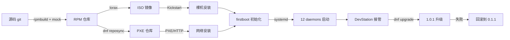
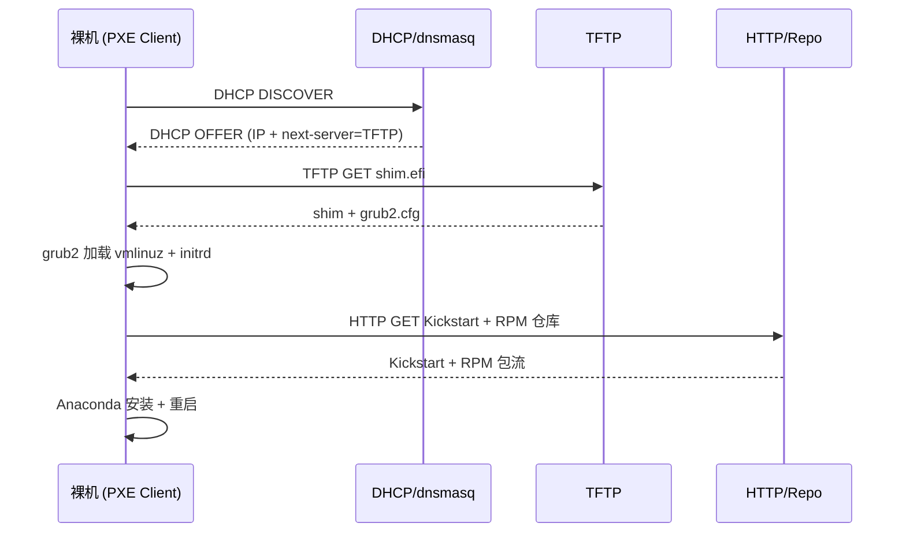
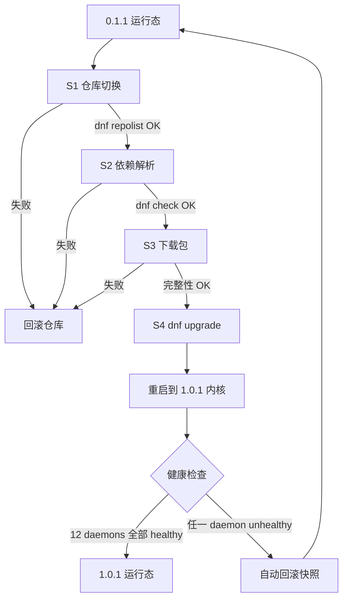

Copyright (c) 2025-2026 SPHARX Ltd. All Rights Reserved.

# agentrt-liunx（AirymaxOS）部署体系

> **文档定位**: agentrt-liunx（AirymaxOS，极境智能体操作系统）运维体系第 1 卷——部署工程。本文档规定从裸机到可用 Agent 工作负载的完整交付链路：RPM 包格式、dnf 包管理器、ISO 镜像制作、Kickstart 自动化安装、PXE 网络安装、系统初始化、12 daemons 部署、DevStation 部署、版本升级路径与回滚机制。
> **版本**: 0.1.1（文档体系完成）/ 1.0.1（开发）
> **最后更新**: 2026-07-06
> **同源映射**: agentrt daemons（12 个用户态服务）+ Linux 6.6 systemd 集成 + MicroCoreRT 极简内核契约
> **理论根基**: Linux 6.6 内核基线工程思想 + Airymax 五维正交 24 原则 + S-1 反馈闭环
> **核心约束**: IRON-9 v2 同源且部分代码共享——与 agentrt 同源语义，agentrt-liunx 独立承担发行版部署责任

---

## 第 1 章 部署体系概述

### 1.1 部署链路总览

agentrt-liunx 部署体系继承 Linux 6.6 内核基线沉淀的发行版交付哲学，并在其上扩展智能体操作系统的专属部署需求。完整链路覆盖五个阶段：**构建阶段**（源码 → RPM 包，rpmbuild + mock 隔离构建）→ **组装阶段**（RPM 仓库 → ISO 镜像，lorax + livemedia-creator）→ **交付阶段**（ISO / PXE / Kickstart → 裸机或虚拟机安装）→ **初始化阶段**（firstboot → sysctl 应用 → 12 daemons 启动）→ **运维阶段**（dnf 升级 + 回滚 + DevStation 接管）。

**OS-OPS-001**：所有部署产物（RPM、ISO、initramfs、Kickstart 文件、PXE 镜像）必须经 GPG 签名且签名校验为部署的前置条件，未签名产物禁止进入生产环境。

**OS-OPS-002**：部署过程必须可重放——同一份 Kickstart + 同一份仓库快照在任意时刻重放，必须产出字节级一致的已安装系统（除时间戳与机器 ID 外）。

### 1.2 部署体系与 MicroCoreRT 的关系

MicroCoreRT 是 Airymax 微核心运行时基座，在 agentrt-liunx 内核态对其保持同源语义。部署体系必须保证 MicroCoreRT 契约在内核包（`airymaxos-kernel`）与服务包（`airymaxos-services-*`）两端同时落地：内核包提供 MicroCoreRT 内核态实现，服务包提供 MicroCoreRT 用户态适配层。任何一端缺失即视为部署不完整。

**OS-OPS-003**：`airymaxos-kernel` 与 `airymaxos-services-core` 的版本号必须在安装时强一致，dnf 版本锁禁止解耦两者。这是 IRON-9 v2 同源且部分代码共享原则在部署层的硬约束——同源语义必须由同源版本承载。

### 1.3 部署流程图



---

## 第 2 章 RPM 包格式

### 2.1 包命名与分层

agentrt-liunx 采用 RPM 包格式作为唯一二进制交付单元。包命名遵循 `name-version-release.arch.rpm` 规范，并在 `name` 上分层：

| 层 | 包名前缀 | 内容 |
|----|---------|------|
| 内核层 | `airymaxos-kernel` | Linux 6.6 内核 + MicroCoreRT 内核态 |
| 服务层 | `airymaxos-services` | 12 daemons 用户态二进制 |
| SDK 层 | `airymaxos-sdk` | Agent 开发 SDK |
| 系统层 | `airymaxos-system` | 包管理 + 配置工具 + shell |
| 安全层 | `airymaxos-security` | LSM + capability |

**OS-STD-101**：每个 RPM 包的 `%changelog` 段必须引用对应的 `Fixes:` / `Closes:` 提交哈希，与 05 开发流程的可追溯性约束对齐（E-6 错误可追溯）。

**OS-STD-102**：RPM `Requires` 段必须显式声明版本依赖，禁止裸 `Requires: foo` 而不写版本；内核包与服务包的版本耦合通过 `Requires(pre)` / `Requires(post)` 强制。

### 2.2 spec 文件骨架

以下为 `airymaxos-services-core` 的 spec 骨架（节选）：

```specfile
Name:           airymaxos-services-core
Version:        0.1.1
Release:        1%{?dist}
Summary:        agentrt-liunx 12 daemons userspace core
License:        SPDX-License-Identifier-Apache-2.0
Requires(pre):  airymaxos-kernel%{?_isa} == %{version}
Requires(post): systemd
Requires:       airymaxos-services-common%{?_isa} == %{version}

%description
agentrt-liunx 12 daemons userspace core, IRON-9 v2 同源且部分代码共享于 agentrt daemons.

%install
install -D -m 0755 build/gateway_d %{buildroot}%{_libdir}/agentrt/gateway_d
install -D -m 0644 systemd/agentrt-gateway.service %{buildroot}%{_unitdir}/

%files
%{_libdir}/agentrt/gateway_d
%{_unitdir}/agentrt-gateway.service
%config(noreplace) %{_sysconfdir}/agentrt/gateway.conf
```

**OS-STD-103**：`%config(noreplace)` 必须用于所有 `/etc/agentrt/` 下的配置文件，保证 dnf 升级时本地配置不被覆盖（C-2 增量演化）。

**OS-STD-104**：所有二进制文件安装权限必须为 `0755`，配置文件 `0644`，密钥文件 `0600`，禁止 `0777` 与 world-writable。

**OS-OPS-004**：所有 RPM 包必须经 agentrt-liunx 构建密钥 GPG 签名，`rpm --checksig` 必须在安装前由 dnf 自动执行；未签名或签名不匹配的包禁止安装（E-1 安全内生）。

---

## 第 3 章 dnf 包管理器

### 3.1 仓库组织

agentrt-liunx 使用 dnf 作为唯一包管理器。仓库分为四类：

| 仓库 | 用途 | 启用条件 |
|------|------|---------|
| `airymaxos-base` | 稳定版包 | 默认启用 |
| `airymaxos-updates` | 安全与 bug 修复更新 | 默认启用 |
| `airymaxos-develop` | 预览集成分支包（等价 linux-next） | 仅测试环境 |
| `airymaxos-extras` | 可选组件（DevStation、额外 SDK） | 按需启用 |

**OS-OPS-005**：`airymaxos-develop` 仓库禁止在生产环境启用；生产环境仅允许 `base` + `updates`，违反此规则视为部署事故。

### 3.2 仓库配置文件

```ini
# /etc/yum.repos.d/airymaxos-base.repo
[airymaxos-base]
name=agentrt-liunx $releasever - Base
baseurl=https://repo.airymaxos.dev/$releasever/base/$basearch/
enabled=1
gpgcheck=1
repo_gpgcheck=1
gpgkey=file:///etc/pki/rpm-gpg/RPM-GPG-KEY-airymaxos
skip_if_unavailable=0
countme=1
```

**OS-STD-105**：`gpgcheck=1` 与 `repo_gpgcheck=1` 必须同时启用；`gpgkey` 必须由 `airymaxos-keyring` 包安装，禁止从网络裸获取。

### 3.3 版本锁与一致性

**OS-OPS-006**：生产环境必须启用 dnf versionlock 插件，锁定的版本集合必须包含 `airymaxos-kernel` + `airymaxos-services-core` + `airymaxos-security-lsm` 三者，且三者版本号必须一致。这是 MicroCoreRT 契约一致性在包管理层的强制。

**OS-OPS-007**：`dnf upgrade` 必须先在 staging 环境完成并通过 80-testing 定义的验收用例后，方可推进至生产环境；禁止 `dnf upgrade --skip-broken` 跳过依赖错误（S-1 反馈闭环）。

---

## 第 4 章 ISO 镜像制作

### 4.1 ISO 制作流程

ISO 镜像由 `lorax` + `livemedia-creator` 制作，产出可引导安装介质：从 `airymaxos-base` 仓库拉取 RPM 集合，lorax 生成 `boot.iso`（含内核 + initramfs + Anaconda 安装器），`livemedia-creator` 根据 Kickstart 模板组装完整 ISO，最后经 GPG 签名 + SHA-256 校验和发布。

**OS-STD-106**：ISO 制作必须基于固定版本仓库快照，禁止 `dnf install` 拉取最新包；每次构建必须记录仓库快照哈希到 ISO 元数据 `.discinfo`。

**OS-STD-107**：ISO 必须包含 `images/pxeboot/` 目录（vmlinuz + initrd.img）与 `images/efiboot.img`，同时支持 BIOS 与 UEFI 引导。

### 4.2 initramfs 与 MicroCoreRT

initramfs 承载早期用户态（内核启动后、根文件系统挂载前运行），必须包含 MicroCoreRT 早期探测模块，用于在 pivot_root 之前确认内核态 MicroCoreRT 契约可用。

**OS-KER-101**：initramfs 中 `airymaxos-early-init` 必须在挂载根文件系统前执行 `microcorert_probe()`，若探测失败则立即 panic 并输出诊断码，禁止继续启动（K-1 内核极简，fail fast）。
**OS-OPS-008**：ISO 安装前必须执行 SHA-256 + GPG 双重校验，任一失败禁止进入安装流程。

---

## 第 5 章 Kickstart 自动化安装

### 5.1 Kickstart 文件结构

Kickstart 是 agentrt-liunx 自动化安装的核心机制，文件由命令段、包段、脚本段构成：

```kickstart
# agentrt-liunx-0.1.1-aarch64.ks
text
lang en_US.UTF-8
timezone Asia/Shanghai --isUtc
network --bootproto=dhcp --device=link --activate
rootpw --iscrypted $6$...  # SHA-512 哈希
selinux --enforcing
bootloader --location=mbr --append="console=tty0 microcorert.probe=on"

# --- 分区段 ---
clearpart --all --initlabel
part /boot/efi --fstype=efi --size=512
part / --fstype=ext4 --size=20480 --label=root
part /var/lib/agentrt --fstype=ext4 --size=40960 --label=agentrt

# --- 包段 ---
%packages
@^airymaxos-server-environment
airymaxos-kernel
airymaxos-services-core
airymaxos-system
airymaxos-security-lsm
%end

# --- 安装后脚本 ---
%post --log=/var/log/airymaxos-ks-post.log
systemctl enable agentrt.target
sysctl --system
%end
```

**OS-OPS-009**：Kickstart `rootpw` 必须使用 `--iscrypted` SHA-512 哈希，禁止明文；生产 Kickstart 模板禁止包含任何明文密钥。

**OS-OPS-010**：Kickstart 必须显式 `systemctl enable agentrt.target`，该 target 是 12 daemons 的聚合启动单元；缺失该启用项视为部署不完整。

### 5.2 分区约定

agentrt-liunx 推荐分区方案将 Agent 记忆卷（L1 原始卷）独立挂载到 `/var/lib/agentrt`，与系统根分区隔离。这与 C-3 记忆卷载原则对齐——记忆数据独立于系统升级路径，便于回滚时不丢记忆。

**OS-STD-108**：`/var/lib/agentrt` 必须独立分区或独立逻辑卷，禁止与 `/` 共享；该分区在 dnf 升级与系统回滚期间必须保持不格式化。

---

## 第 6 章 PXE 网络安装

### 6.1 PXE 架构

PXE 网络安装用于批量裸机部署，由四组件构成：

| 组件 | 服务 | 端口 | 职责 |
|------|------|------|------|
| DHCP | dnsmasq | 67/UDP | 分配 IP + 指向 next-server |
| TFTP | tftp-server | 69/UDP | 传输 bootloader（grub2/shim） |
| HTTP | nginx | 80/TCP | 传输 vmlinuz + initrd + Kickstart |
| Repo | dnf reposync | 80/TCP | 提供 RPM 仓库 |

### 6.2 PXE 启动流程图



**OS-OPS-011**：PXE 链路必须全程启用签名校验——shim 必须验证 grub2 签名，grub2 必须验证 vmlinuz 签名，dnf 必须验证 RPM 签名；任一环节签名缺失即中止启动（E-1 安全内生）。

**OS-OPS-012**：PXE 仓库必须与 ISO 仓库快照一致，禁止 PXE 拉取 `airymaxos-updates` 之外的浮动版本；批量部署的版本一致性由仓库快照哈希保证。

---

## 第 7 章 系统初始化

### 7.1 firstboot 阶段

系统首次启动时，`airymaxos-firstboot.service` 执行以下初始化：生成唯一 `machine-id`（若 Kickstart 未固化）→ 应用 `/etc/sysctl.d/` 全部 sysctl 参数（详见 02-configuration）→ 加载 LSM 策略与 capability 令牌 → 触发 `agentrt.target` 拉起 12 daemons → 注册到 DevStation 注册中心（若配置）。

**OS-OPS-013**：firstboot 必须在 systemd `default.target` 之前完成 sysctl 应用与 LSM 加载；任何 daemon 在 firstboot 完成前启动视为初始化失败（S-1 反馈闭环，初始化是不可绕过的关卡）。

### 7.2 systemd target 依赖

```ini
# /etc/systemd/system/agentrt.target
[Unit]
Description=agentrt-liunx 12 daemons aggregated target
Requires=sysinit.target
After=sysinit.target network-online.target
Wants=agentrt-gateway.service agentrt-llm.service agentrt-tool.service
Wants=agentrt-sched.service agentrt-market.service agentrt-monit.service
Wants=agentrt-channel.service agentrt-info.service agentrt-notify.service
Wants=agentrt-observe.service agentrt-hook.service agentrt-plugin.service

[Install]
WantedBy=multi-user.target
```

**OS-STD-109**：`agentrt.target` 必须声明对 `sysinit.target` 的强依赖，禁止在 sysinit 完成前启动任何 daemon；daemon 之间的依赖通过 `After=` 表达，禁止循环依赖（K-1 内核极简的延伸：依赖图必须无环）。

---

## 第 8 章 12 daemons 部署

### 8.1 daemon 到 systemd unit 映射

agentrt 的 12 个 daemons 在 agentrt-liunx 中以 systemd 服务运行，遵循 IRON-9 v2 同源且部分代码共享原则——二进制名保持 `*_d` 后缀（同源），systemd 服务名采用 `agentrt-*.service` 格式（独立）。

| 二进制 | systemd unit | 职责 | 启动顺序 |
|--------|--------------|------|---------|
| `gateway_d` | `agentrt-gateway.service` | 网关，对外入口 | 1 |
| `llm_d` | `agentrt-llm.service` | LLM 推理 | 2 |
| `tool_d` | `agentrt-tool.service` | 工具执行 | 2 |
| `sched_d` | `agentrt-sched.service` | 调度 | 1 |
| `market_d` | `agentrt-market.service` | 市场（Agent 注册） | 3 |
| `monit_d` | `agentrt-monit.service` | 监控 | 4 |
| `channel_d` | `agentrt-channel.service` | 通道 | 2 |
| `info_d` | `agentrt-info.service` | 信息汇聚 | 4 |
| `notify_d` | `agentrt-notify.service` | 通知 | 5 |
| `observe_d` | `agentrt-observe.service` | 观测 | 4 |
| `hook_d` | `agentrt-hook.service` | 钩子 | 3 |
| `plugin_d` | `agentrt-plugin.service` | 插件 | 3 |

### 8.2 daemon systemd unit 模板

```ini
# /etc/systemd/system/agentrt-gateway.service
[Unit]
Description=agentrt-liunx Gateway Daemon (agentrt gateway_d)
Requires=agentrt-sched.service
After=network-online.target agentrt-sched.service
ConditionPathExists=/etc/agentrt/gateway.conf

[Service]
Type=simple
ExecStart=/usr/lib/agentrt/gateway_d --config=/etc/agentrt/gateway.conf
ExecReload=/bin/kill -HUP $MAINPID
Restart=on-failure
RestartSec=3
WatchdogSec=30
TimeoutStopSec=15
AmbientCapabilities=CAP_NET_BIND_SERVICE
MemoryMax=2G
TasksMax=512
StandardOutput=journal

[Install]
WantedBy=agentrt.target
```

**OS-OPS-014**：所有 12 daemons 的 systemd unit 必须设置 `WatchdogSec`，且 daemon 二进制必须实现 sd_notify watchdog 心跳；30 秒无心跳 systemd 自动重启（S-1 反馈闭环 + E-2 可观测性）。

**OS-OPS-015**：daemon 之间的通信必须通过 AgentsIPC 128B 定长消息头协议，禁止共享内存绕过 IPC；这是 AgentsIPC 契约在部署层的强制（K-2 接口契约化）。

**OS-STD-110**：每个 daemon 的 `MemoryMax` 与 `TasksMax` 必须在 unit 中显式声明，禁止依赖默认值；超限触发 OOM kill 后由 systemd 自动重启。

### 8.3 AgentsIPC 在部署层的约束

AgentsIPC 是 Airymax 智能体进程间通信协议，128B 定长消息头是其核心契约。部署时必须保证：12 daemons 共享同一份 AgentsIPC 协议库版本；协议库由 `airymaxos-services-common` 包提供，12 daemons 共同 `Requires`；升级时协议库与所有 daemons 必须同版本升级，禁止混合版本。

**OS-OPS-016**：`dnf upgrade` 涉及 `airymaxos-services-common` 时，必须一次性升级全部 12 daemons 包，禁止部分升级；部分升级导致 AgentsIPC 版本不一致视为部署故障。

---

## 第 9 章 DevStation 部署

### 9.1 DevStation 定位

DevStation 是 agentrt-liunx 提供的 AI 辅助开发运维环境，提升开发者体验（A-3 人文关怀）。它由 `devstation-core`（自然语言交互入口）、`devstation-tools`（开发工具集成）、`devstation-ops`（运维工具集成）三个组件构成。

### 9.2 DevStation 部署模式

DevStation 支持两种部署模式：**侧车模式**（与生产 agentrt-liunx 实例同机部署，仅监听 localhost）与**独立模式**（独立 agentrt-liunx 实例，作为开发集群的统一入口）。

**OS-OPS-017**：DevStation 侧车模式禁止监听非 loopback 地址；生产环境的 DevStation 必须部署在独立实例或通过 SSH 隧道访问（E-1 安全内生）。

**OS-STD-111**：DevStation 与 12 daemons 的通信必须经 AgentsIPC，禁止直接访问 daemon 私有内存或绕过 IPC 的调试后门（K-2 接口契约化）。

### 9.3 DevStation systemd unit

```ini
# /etc/systemd/system/airymaxos-devstation.service
[Unit]
Description=agentrt-liunx DevStation (AI dev/ops assistant)
After=agentrt.target network-online.target
Requires=agentrt-gateway.service

[Service]
Type=simple
ExecStart=/usr/lib/airymaxos/devstation-core --listen=127.0.0.1:8443
Restart=on-failure
MemoryMax=4G
IPAddressDeny=any
IPAddressAllow=127.0.0.1 ::1

[Install]
WantedBy=multi-user.target
```

---

## 第 10 章 升级路径 0.1.1 → 1.0.1

### 10.1 升级阶段划分

从 0.1.1 到 1.0.1 的升级分四个阶段，每个阶段都是独立可回滚的检查点：

| 阶段 | 操作 | 检查点 | 失败处理 |
|------|------|--------|---------|
| S1 | 仓库切换到 1.0.1 | dnf repolist | 回滚仓库配置 |
| S2 | 下载包 + 依赖解析 | dnf check | 中止，保持 0.1.1 |
| S3 | dnf upgrade --downloadonly | 包完整性 | 中止，清理缓存 |
| S4 | dnf upgrade + 重启 | 健康检查 | 自动回滚到 0.1.1 快照 |

### 10.2 升级流程图



**OS-OPS-018**：升级必须先在 staging 通过 80-testing 全部验收用例，方可推进生产；生产升级必须维护 7 天回滚窗口（S-1 反馈闭环 + E-6 错误可追溯）。

**OS-OPS-019**：升级前必须执行 `dnf system-upgrade download`，下载完整后才允许 `reboot` 触发原子切换；禁止在线边下载边升级。

### 10.3 MicroCoreRT 与 AgentsIPC 版本兼容

**OS-KER-102**：跨大版本升级（0.x → 1.x）必须验证 MicroCoreRT 内核态契约与 AgentsIPC 协议版本的兼容矩阵；兼容矩阵由 30-interfaces 维护，部署脚本必须读取该矩阵并拒绝不兼容组合（K-2 接口契约化）。

**OS-OPS-020**：升级若涉及 AgentsIPC 128B 消息头布局变更，必须遵循 L2 接口稳定性流程——保留旧协议至少 2 个版本周期，新旧协议通过版本号字段共存（E-7 文档即代码，协议变更必须同步文档）。

---

## 第 11 章 回滚机制

### 11.1 回滚层次

agentrt-liunx 回滚机制分三层，由浅入深：

| 层 | 机制 | 范围 | 耗时 |
|----|------|------|------|
| L1 | dnf history rollback | 单个包/事务 | 秒级 |
| L2 | systemd snapshot | unit 状态 | 秒级 |
| L3 | 根分区快照（btrfs/LVM） | 整个系统根 | 分钟级 |

### 11.2 根分区快照回滚

agentrt-liunx 推荐使用 btrfs 子卷或 LVM thin snapshot 实现根分区快照。升级前由 `airymaxos-upgrade-pre` 服务自动创建快照（`btrfs subvolume snapshot / /snapshots/pre-upgrade-<ts>`）；回滚时执行 `btrfs subvolume set-default` 指向旧快照并重启。

**OS-OPS-021**：生产环境必须启用根分区快照机制（btrfs 或 LVM 二选一），升级前自动快照，快照保留 7 天；7 天后自动清理（C-4 遗忘机制在运维层的体现）。

**OS-OPS-022**：回滚后必须验证 12 daemons 全部 healthy 且 Agent 记忆卷（`/var/lib/agentrt`）一致性未破坏；记忆卷不参与根分区回滚，保证记忆数据在回滚后仍可用（C-3 记忆卷载）。

**OS-OPS-023**：`dnf history rollback` 仅回滚包层，不回滚配置文件（因 `%config(noreplace)`）；配置回滚必须通过配置版本控制（详见 02-configuration §9）。

---

## 第 12 章 五维原则映射

agentrt-liunx 部署体系是 Airymax 五维正交 24 原则在交付链路的具体落地：

| 原则 | 在部署体系的体现 | 落地规则 |
|------|----------------|---------|
| **S-1 反馈闭环** | 升级健康检查失败即自动回滚；dnf 依赖错误即中止 | OS-OPS-007 / OS-OPS-018 |
| **S-2 层次分解 / S-4 涌现性管理** | 部署链路五阶段分层；升级四阶段检查点每阶段独立可回滚 | §1.1 / §10.1 |
| **K-1 内核极简** | MicroCoreRT 早期探测 fail fast；依赖图无环 | OS-KER-101 / OS-STD-109 |
| **K-2 接口契约化** | AgentsIPC 128B 消息头协议在部署层强制 | OS-OPS-015 / OS-OPS-016 / OS-KER-102 |
| **C-2 增量演化 / C-3 记忆卷载 / C-4 遗忘机制** | `%config(noreplace)` 保护配置；记忆卷独立分区回滚不丢；快照 7 天自动清理 | OS-STD-103 / OS-STD-108 / OS-OPS-021 / OS-OPS-022 |
| **E-1 安全内生 / E-2 可观测性** | GPG 签名贯穿 RPM/ISO/PXE 全链路；systemd watchdog + journald | OS-OPS-001 / OS-OPS-004 / OS-OPS-011 / OS-OPS-014 |
| **E-6 错误可追溯 / E-7 文档即代码** | RPM changelog 引用提交哈希；协议变更同步文档 | OS-STD-101 / OS-OPS-018 / OS-OPS-020 |
| **A-3 人文关怀** | DevStation 提升开发者体验 | §9 |
| **IRON-9 v2 同源且部分代码共享** | 12 daemons 同源二进制 + 独立 systemd unit | §8.1 |

---

## 第 13 章 同源 agentrt 映射

### 13.1 同源关系

agentrt-liunx 部署体系与 agentrt 遵循 IRON-9 v2 同源且部分代码共享原则：**同源**——12 daemons 二进制名（`*_d`）与 agentrt 完全一致，AgentsIPC 128B 消息头协议两端共享，MicroCoreRT 极简内核契约两端共享，配置目录 `/etc/agentrt/` 两端共享语义；**独立**——agentrt-liunx 独立承担发行版部署责任（RPM 打包、dnf 仓库、ISO 制作、Kickstart、PXE、systemd 集成、根分区快照回滚），这些都是 agentrt 用户态运行时不涉及的领域；**互操作**——agentrt 遵循其用户态部署（pip/npm 安装），agentrt-liunx 遵循其发行版部署（RPM/dnf），两端通过同源二进制名与 AgentsIPC 协议实现无适配层互操作。

### 13.2 同源映射表

| 维度 | agentrt（用户态运行时） | agentrt-liunx（发行版部署） |
|------|------------------------|------------------------|
| 二进制交付 / 服务管理 | pip wheel / npm tarball；自研 supervisor | RPM 包；systemd unit |
| 配置目录 | `~/.agentrt/` 或环境变量 | `/etc/agentrt/`（系统级） |
| IPC 协议 / 微核心契约 | AgentsIPC 128B 消息头；MicroCoreRT 用户态适配 | 同源，由 `airymaxos-services-common` 提供；MicroCoreRT 内核态实现（`airymaxos-kernel`） |
| 升级 / 回滚 | pip/npm upgrade；版本号回退 | dnf system-upgrade + 快照回滚；根分区快照 + dnf history |

**OS-OPS-024**：agentrt-liunx 部署的 12 daemons 必须与同版本 agentrt 用户态 SDK 的 AgentsIPC 协议版本一致；版本不一致时 daemon 拒绝接受 SDK 连接并输出诊断码（IRON-9 v2 同源且部分代码共享在协议层的强制）。

---

## 第 14 章 相关文档

**本模块内**：`100-operations/README.md`（运维主索引）、`02-configuration.md`（配置管理）、`07-systemd-integration.md`（systemd 集成，1.0.1）、`10-devstation.md`（DevStation，1.0.1）。

**跨模块**：`20-modules/02-services.md`（12 daemons 设计）、`20-modules/07-system.md`（包管理 + 配置工具）、`50-engineering-standards/04-engineering-philosophy.md`（双层稳定性哲学）、`50-engineering-standards/05-development-process.md`（补丁生命周期）、`30-interfaces/02-ipc-protocol.md`（AgentsIPC 协议）、`90-observability/README.md`（可观测性）、`110-security/README.md`（安全运维）。

**参考材料**：`Linux 6.6 内核源码 Documentation/admin-guide/initrd.rst`（initrd 机制）、`.../kernel-parameters.rst`（内核启动参数）、Linux 6.6 内核基线 systemd 集成实践。

---

## 第 15 章 文档版本与维护

- **当前版本**: 0.1.1（文档体系完成）/ 1.0.1（开发）
- **最后更新**: 2026-07-06
- **维护者**: agentrt-liunx 运维工程委员会（待成立，详见 50-engineering-standards/07-maintainers-and-governance.md）
- **变更流程**: 任何部署规则变更必须经 RFC → 评审 → ACC 验收流程，涉及 AgentsIPC 协议或 MicroCoreRT 契约的变更需额外经协议委员会签字
- **回顾周期与不变性**: 季度回顾 + 每次大版本升级后回顾；本文档所依据的 Linux 6.6 内核基线工程思想与 Airymax 五维正交 24 原则不随版本变更，具体规则编号（OS-OPS / OS-STD / OS-KER）可随版本演进并通过规则编号注册表追溯

---

> **文档结束** | 100-operations 第 1 卷 | 0.1.1 P0 优先完成
