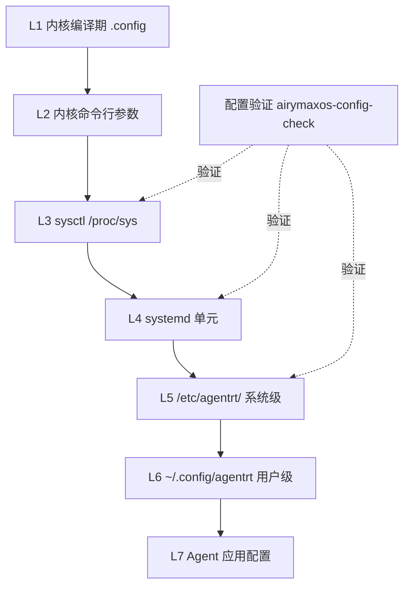
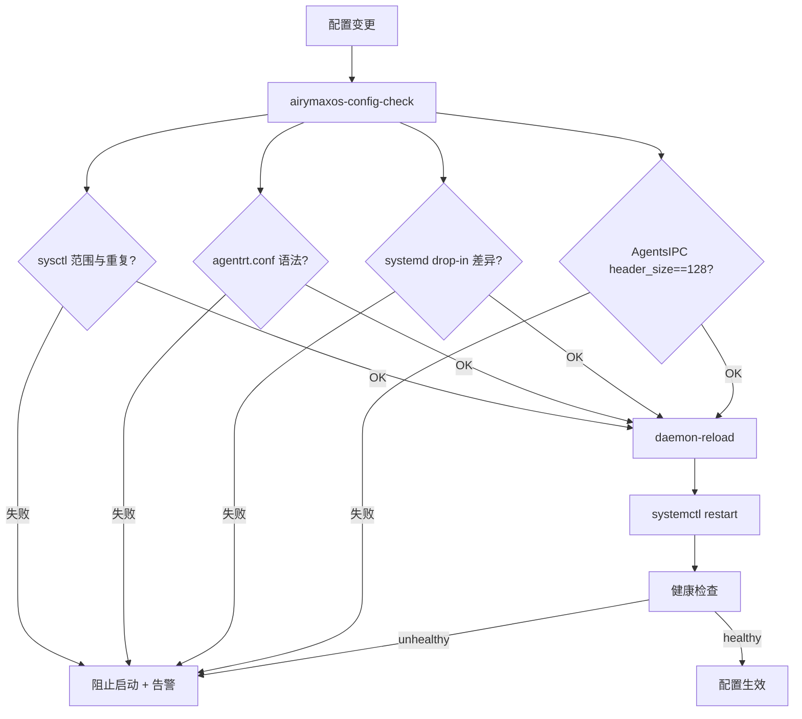
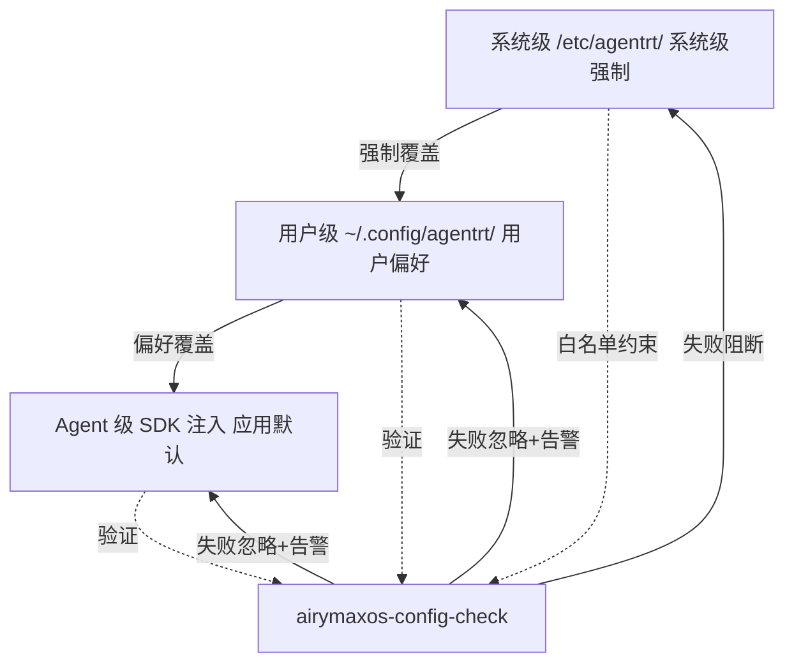

Copyright (c) 2025-2026 SPHARX Ltd. All Rights Reserved.

# agentrt-liunx（AirymaxOS）配置管理

> **文档定位**: agentrt-liunx（AirymaxOS，极境智能体操作系统）运维体系第 2 卷——配置工程。本文档规定从内核运行时参数到 Agent 级配置的完整配置栈：sysctl 内核运行时参数、`/etc/sysctl.d/` 组织、`/etc/agentrt/` 配置目录、systemd 单元配置、12 daemons 配置文件、环境变量、配置验证、配置版本控制、agentrt-liunx 三级配置分层（系统级 / 用户级 / Agent 级）。
> **版本**: 0.1.1（文档体系完成）/ 1.0.1（开发）
> **最后更新**: 2026-07-06
> **同源映射**: agentrt daemons（12 个用户态服务配置）+ Linux 6.6 sysctl + systemd 单元配置
> **理论根基**: Linux 6.6 内核基线工程思想 + Airymax 五维正交 24 原则 + S-1 反馈闭环
> **核心约束**: IRON-9 v2 同源且部分代码共享——与 agentrt 同源配置语义，agentrt-liunx 独立承担内核与系统级配置责任

---

## 第 1 章 配置管理概述

### 1.1 配置栈总览

agentrt-liunx 配置管理继承 Linux 6.6 内核基线沉淀的配置哲学——内核运行时参数（sysctl）+ 持久化配置目录（`/etc/`）+ 服务单元配置（systemd drop-in）——并在其上扩展智能体操作系统的专属配置层：`/etc/agentrt/`（12 daemons 配置）与 Agent 级配置（`~/.agentrt/`）。配置栈自底向上分七层：**L1** 内核编译期（`.config`，构建时固化）→ **L2** 内核启动期（内核命令行参数）→ **L3** 内核运行时（sysctl，`/proc/sys/` + `/etc/sysctl.d/`）→ **L4** 系统服务（systemd 单元）→ **L5** agentrt-liunx 系统级（`/etc/agentrt/`，12 daemons）→ **L6** 用户级（`~/.config/agentrt/`）→ **L7** Agent 级（Agent 应用自带，SDK 注入）。

**OS-OPS-101**：所有可运行时调整的配置必须落在 L3-L7，禁止依赖重新编译内核来调整运行时行为；L1/L2 仅用于不可运行时变更的硬约束（K-1 内核极简）。

**OS-OPS-102**：配置变更必须可验证、可回滚、可审计——这三者是 S-1 反馈闭环在配置层的硬约束，缺一不可。

### 1.2 配置管理与 MicroCoreRT 的关系

MicroCoreRT 是 Airymax 微核心运行时基座，其内核态行为受 sysctl 与内核命令行参数共同约束。配置管理必须保证 MicroCoreRT 契约相关的 sysctl 参数（如调度类、内存回收策略）在 `/etc/sysctl.d/` 中显式声明，禁止依赖默认值——默认值可能随内核版本漂移而破坏 MicroCoreRT 语义。

**OS-KER-201**：所有影响 MicroCoreRT 内核态行为的 sysctl 参数必须集中在 `/etc/sysctl.d/99-airymaxos-microcorert.conf`，并加注释说明每个参数与 MicroCoreRT 契约的对应关系（E-7 文档即代码）。

### 1.3 配置分层流程图



---

## 第 2 章 sysctl 内核运行时参数

### 2.1 sysctl 机制

sysctl 是 Linux 6.6 内核基线提供的运行时内核参数调整机制，通过 `/proc/sys/` 目录暴露可读可写的内核参数。agentrt-liunx 将 sysctl 作为内核运行时配置的唯一入口，覆盖调度、内存、网络、文件系统、IPC 五大子系统。

`/proc/sys/` 的子目录与子系统对应：`kernel/`（全局内核参数）、`vm/`（内存管理）、`net/`（网络）、`fs/`（文件系统）、`kernel/`（IPC 与调度）、`user/`（用户级限制）。

**OS-KER-202**：任何 agentrt-liunx 自定义内核参数（`kernel.airymaxos_*`）必须在 `Documentation/admin-guide/sysctl/kernel.rst` 等价文档中登记，并遵循 Linux sysctl 文档规范（E-7 文档即代码）。

**OS-STD-201**：sysctl 参数的读取与写入必须通过 `sysctl` 命令或 `/proc/sys/` 文件接口，禁止直接操作内核内部数据结构；这是 K-2 接口契约化在内核配置层的体现。

### 2.2 关键 sysctl 参数清单

agentrt-liunx 关心的 sysctl 参数按子系统分组：

| 子系统 | 参数 | 默认值 | 说明 |
|--------|------|--------|------|
| 调度 | `kernel.sched_latency_ns` | 6000000 | 调度延迟，影响 MicroCoreRT 调度类 |
| 调度 | `kernel.sched_rt_runtime_us` | 950000 | RT 调度运行时配额 |
| 内存 | `vm.swappiness` | 10 | 交换倾向（Agent 工作负载偏低） |
| 内存 | `vm.overcommit_memory` | 1 | 内存超分策略 |
| 内存 | `vm.max_map_count` | 262144 | 最大映射数（LLM 模型加载需要） |
| 内存 | `vm.watermark_scale_factor` | 150 | 多代 LRU 水位因子 |
| IPC | `kernel.msgmax` | 8192 | 消息最大长度（AgentsIPC 128B 头 + payload） |
| IPC | `kernel.msgmni` | 32768 | 消息队列最大数 |
| 网络 | `net.core.somaxconn` | 4096 | socket 最大连接数 |
| 网络 | `net.ipv4.tcp_max_syn_backlog` | 8192 | SYN backlog |
| 文件 | `fs.file-max` | 1048576 | 系统最大文件句柄 |
| 文件 | `fs.inotify.max_user_watches` | 524288 | inotify 监视数 |

**OS-OPS-103**：`vm.max_map_count` 必须 ≥ 262144，因 LLM 模型加载（`llm_d`）需要大量内存映射；低于此值将导致 LLM 加载失败（C-3 记忆卷载在内存层的体现）。

**OS-OPS-104**：`kernel.msgmni` 必须 ≥ 32768，因 AgentsIPC 消息队列依赖内核 IPC 机制；低于此值将导致 daemon 间通信队列创建失败。

---

## 第 3 章 /etc/sysctl.d/ 组织

### 3.1 目录组织规则

`/etc/sysctl.d/` 是 sysctl 持久化配置的标准目录，文件按数字前缀排序加载。agentrt-liunx 采用以下命名约定：

| 文件 | 范围 | 优先级 |
|------|------|--------|
| `00-system-default.conf` | 系统默认（airymaxos-system 包提供） | 最低 |
| `50-kernel-tuning.conf` | 内核调优（airymaxos-kernel 包提供） | 中 |
| `99-airymaxos-microcorert.conf` | MicroCoreRT 专属（OS-KER-201） | 高 |
| `99-local.conf` | 本地覆盖（管理员手动） | 最高 |

**OS-STD-202**：sysctl 文件命名必须遵循 `NN-name.conf` 格式（NN 为两位数字），数字越小优先级越低；同参数后加载覆盖先加载，`99-local.conf` 拥有最高覆盖权。

**OS-STD-203**：禁止在多个文件中重复声明同一 sysctl 参数；重复声明视为配置漂移，由 `airymaxos-config-check` 检测并告警（E-2 可观测性）。

### 3.2 sysctl 配置文件示例

```conf
# /etc/sysctl.d/99-airymaxos-microcorert.conf
# agentrt-liunx（AirymaxOS）MicroCoreRT 内核运行时参数
# 理论根基: Linux 6.6 内核基线 + MicroCoreRT 契约
# 维护: airymaxos-kernel 包，禁止手动覆盖

# --- 调度类（MicroCoreRT 调度器约束）---
kernel.sched_latency_ns = 6000000
kernel.sched_min_granularity_ns = 750000
kernel.sched_rt_runtime_us = 950000

# --- 内存管理（多代 LRU + Agent 工作负载）---
vm.swappiness = 10
vm.max_map_count = 262144
vm.watermark_scale_factor = 150
vm.overcommit_memory = 1

# --- IPC（AgentsIPC 128B 消息头依赖）---
kernel.msgmax = 8192
kernel.msgmni = 32768
kernel.shmmax = 68719476736

# --- 网络（gateway_d 高并发）---
net.core.somaxconn = 4096
net.ipv4.tcp_max_syn_backlog = 8192

# --- 文件系统（observe_d 日志 + 记忆卷）---
fs.file-max = 1048576
fs.inotify.max_user_watches = 524288
```

**OS-OPS-105**：`/etc/sysctl.d/99-airymaxos-microcorert.conf` 由 `airymaxos-kernel` 包以 `%config(noreplace)` 安装，dnf 升级时本地修改保留，但 `airymaxos-config-check` 会检测本地与包默认值的差异并告警（C-2 增量演化）。

### 3.3 sysctl 应用时机

**OS-OPS-106**：sysctl 必须在三个时机应用：(1) 安装时（Kickstart `%post` 执行 `sysctl --system`）；(2) 启动时（`systemd-sysctl.service` 在 `sysinit.target` 阶段）；(3) 升级后（dnf `%post` 触发 `systemctl restart systemd-sysctl`）。三时机缺一不可（S-1 反馈闭环）。

---

## 第 4 章 /etc/agentrt/ 配置目录

### 4.1 目录结构

`/etc/agentrt/` 是 agentrt-liunx 12 daemons 的系统级配置根目录，与 agentrt 用户态运行时同源（IRON-9 v2 同源且部分代码共享）。目录包含：`agentrt.conf`（全局配置，日志等级/IPC 端口/运行模式）、12 个 daemon 配置（`gateway.conf`/`llm.conf`/`tool.conf`/`sched.conf`/`market.conf`/`monit.conf`/`channel.conf`/`info.conf`/`notify.conf`/`observe.conf`/`hook.conf`/`plugin.conf`）、`agentsipc.conf`（AgentsIPC 协议参数）、`microcorert.conf`（MicroCoreRT 用户态适配参数）、`keys/`（密钥目录，`0600`）与 `conf.d/`（drop-in 覆盖目录）。

**OS-STD-204**：每个 daemon 必须有独立的 `<daemon>.conf`，禁止共用配置文件；配置文件名与二进制名（`*_d`）一一对应（K-1 内核极简的延伸：配置职责单一）。

**OS-STD-205**：`/etc/agentrt/agentrt.conf` 是全局配置，仅包含所有 daemon 共享的参数（日志等级、IPC 基础端口、运行模式）；daemon 专属参数必须放在各自的 `<daemon>.conf` 中。

### 4.2 配置文件格式

配置文件采用 INI 格式（键值对 + 分组），与 systemd unit 风格一致：

```conf
# /etc/agentrt/gateway.conf
# agentrt-liunx（AirymaxOS）gateway_d 配置（IRON-9 v2 同源且部分代码共享于 agentrt 用户态）
# 维护: airymaxos-services-core 包

[main]
listen = 0.0.0.0
port = 7400
workers = 4
log_level = info

[ipc]
protocol = agentsipc
header_size = 128
queue_size = 1024
timeout_ms = 5000

[sched]
upstream = agentrt-sched.service
retry = 3

[security]
capability = CAP_NET_BIND_SERVICE
tls_required = true
```

**OS-OPS-107**：所有 `/etc/agentrt/*.conf` 必须设置权限 `0640`，属主 `root:agentrt`，禁止 world-readable（E-1 安全内生；配置可能含密钥引用）。

**OS-STD-206**：配置文件中的密钥必须以引用形式（`tls_key_file = /etc/agentrt/keys/gateway.key`），禁止在配置文件中直接存储明文密钥；密钥文件独立管理且权限 `0600`。

### 4.3 conf.d drop-in 覆盖

`/etc/agentrt/conf.d/` 提供 drop-in 覆盖机制，允许在不修改包提供的配置文件前提下覆盖单个参数。加载顺序：`agentrt.conf` → `<daemon>.conf` → `conf.d/*.conf`（按文件名字典序）。

**OS-STD-207**：`conf.d/` 下的覆盖文件必须以 `NN-` 数字前缀命名（如 `99-local.conf`），禁止无前缀文件；覆盖文件优先级高于主配置（C-2 增量演化，本地覆盖不破坏包默认）。

---

## 第 5 章 systemd 单元配置

### 5.1 单元配置层级

systemd 单元配置分三层，优先级从低到高：**包提供单元**（`/usr/lib/systemd/system/agentrt-*.service`，RPM 安装只读）→ **系统级覆盖**（`/etc/systemd/system/agentrt-*.service.d/*.conf`，drop-in）→ **运行时覆盖**（`/run/systemd/system/agentrt-*.service.d/*.conf`，临时重启丢失）。

**OS-STD-208**：禁止直接修改 `/usr/lib/systemd/system/` 下的包提供单元；所有定制必须通过 `/etc/systemd/system/<unit>.d/*.conf` drop-in 实现，保证 dnf 升级不覆盖定制（C-2 增量演化）。

### 5.2 drop-in 配置示例

```ini
# /etc/systemd/system/agentrt-llm.service.d/override.conf
# agentrt-liunx（AirymaxOS）llm_d 资源限制覆盖（本地定制）
[Service]
MemoryMax=8G
TasksMax=2048
# LLM 推理需要更大的 fd 上限
LimitNOFILE=1048576
Environment=AGENTRT_LLM_CACHE_SIZE=8192
```

**OS-OPS-108**：任何对 12 daemons 的 systemd drop-in 修改必须执行 `systemctl daemon-reload && systemctl restart <unit>` 生效；未执行 daemon-reload 视为配置未应用（S-1 反馈闭环，配置生效必须可验证）。

**OS-OPS-109**：`MemoryMax` 与 `TasksMax` 的 drop-in 覆盖值不得低于包提供单元的默认值（防止误降导致 OOM）；`airymaxos-config-check` 检测并告警（E-2 可观测性）。

### 5.3 单元配置验证

单元配置验证使用 systemd 原生工具：`systemd-analyze verify /etc/systemd/system/agentrt-*.service` 校验语法，`systemctl cat agentrt-gateway.service` 查看 drop-in 生效后的最终单元，`systemd-analyze plot > boot.svg` 生成启动顺序依赖图。

**OS-STD-209**：所有自定义 drop-in 提交前必须通过 `systemd-analyze verify` 语法校验；CI 中 `make verify-units` 强制执行（E-8 可测试性）。

---

## 第 6 章 12 daemons 配置文件

### 6.1 daemon 配置矩阵

12 daemons 的配置文件统一在 `/etc/agentrt/` 下，每个 daemon 对应一个 `<daemon>.conf`。配置矩阵：

| daemon | 配置文件 | 关键参数 | 关联契约 |
|--------|---------|---------|---------|
| `gateway_d` | `gateway.conf` | listen, port, workers | AgentsIPC |
| `llm_d` | `llm.conf` | model_path, cache_size, batch | MicroCoreRT（内存映射） |
| `tool_d` | `tool.conf` | sandbox, timeout, allowed_tools | capability |
| `sched_d` | `sched.conf` | policy, quantum, preempt | MicroCoreRT（调度类） |
| `market_d` | `market.conf` | registry, ttl, max_agents | AgentsIPC |
| `monit_d` | `monit.conf` | metrics_interval, alert_rules | E-2 可观测性 |
| `channel_d` | `channel.conf` | buffer_size, backlog | AgentsIPC |
| `info_d` | `info.conf` | aggregation_window, retention | C-3 记忆卷载 |
| `notify_d` | `notify.conf` | channels, rate_limit | — |
| `observe_d` | `observe.conf` | trace_buffer, sample_rate | E-2 可观测性 |
| `hook_d` | `hook.conf` | hook_dirs, exec_policy | capability |
| `plugin_d` | `plugin.conf` | plugin_dirs, sandbox | capability |

**OS-OPS-110**：每个 daemon 启动时必须校验自身 `<daemon>.conf` 的关键字段，缺失或非法值时拒绝启动并输出诊断码（fail fast，S-1 反馈闭环）；禁止以默认值静默运行。

**OS-STD-210**：`agentsipc.conf` 中的 `header_size` 必须 == 128，与 AgentsIPC 128B 定长消息头契约严格一致；任何偏离视为协议破坏（K-2 接口契约化，IRON-9 同源约束）。

### 6.2 AgentsIPC 配置示例

```conf
# /etc/agentrt/agentsipc.conf
# agentrt-liunx（AirymaxOS）AgentsIPC 协议参数（与 agentrt 同源）
# 维护: airymaxos-services-common 包

[protocol]
version = 1
header_size = 128          # 固定 128B，禁止修改（OS-STD-210）
max_payload = 1048576      # 1 MiB
checksum = crc32c

[transport]
backend = io_uring         # 零拷贝传输
queue_depth = 1024
buffer_pool = 256

[security]
auth_required = true
token_file = /etc/agentrt/keys/agentsipc.token
```

**OS-OPS-111**：`agentsipc.conf` 的 `header_size` 与 `version` 字段由 `airymaxos-services-common` 包以 `%config(noreplace)` 管理；升级时若 `version` 变更，必须遵循 L2 接口稳定性流程（保留旧版本 2 个周期，详见 01-deployment §10.3）。

---

## 第 7 章 环境变量

### 7.1 环境变量分层

agentrt-liunx 环境变量分三层，优先级从低到高：**包默认环境变量**（systemd unit 中的 `Environment=`，`/usr/lib/systemd/system/`）→ **系统级环境变量**（`/etc/agentrt/agentrt.env`，由 `airymaxos-services-common` 提供）→ **单元级环境变量**（systemd drop-in 中的 `Environment=` 或 `EnvironmentFile=`）。

**OS-STD-211**：环境变量仅用于传递非敏感的运行时参数（日志级别、端口、缓存大小）；禁止通过环境变量传递密钥、令牌、密码——这些必须通过配置文件引用（OS-STD-206）。

### 7.2 环境变量文件示例

```bash
# /etc/agentrt/agentrt.env
# agentrt-liunx（AirymaxOS）12 daemons 全局环境变量（非敏感参数）
# 维护: airymaxos-services-common 包

AGENTRT_LOG_LEVEL=info
AGENTRT_IPC_BASE_PORT=7400
AGENTRT_RUNTIME_MODE=production
AGENTRT_CONFIG_DIR=/etc/agentrt
AGENTRT_DATA_DIR=/var/lib/agentrt
AGENTRT_LLM_CACHE_DIR=/var/cache/agentrt/llm
# 敏感参数走配置文件引用，不在此声明
```

**OS-OPS-112**：`AGENTRT_DATA_DIR` 必须指向 `/var/lib/agentrt`（独立分区，详见 01-deployment §5.2）；偏离此值将导致记忆卷与系统根混区，破坏回滚不丢记忆的保证（C-3 记忆卷载）。

**OS-STD-212**：systemd unit 通过 `EnvironmentFile=-/etc/agentrt/agentrt.env` 加载（前导 `-` 表示文件可选）；禁止在 unit 中硬编码环境变量值，所有环境变量必须集中在 `agentrt.env`（E-7 文档即代码，单一事实来源）。

### 7.3 环境变量与 AgentsIPC

**OS-OPS-113**：影响 AgentsIPC 行为的环境变量（如 `AGENTRT_IPC_BASE_PORT`）必须在 `agentrt.env` 中声明默认值，并通过 drop-in 覆盖；daemon 启动时读取并校验，与 `agentsipc.conf` 的 `transport` 段保持一致（K-2 接口契约化）。

---

## 第 8 章 配置验证

### 8.1 验证工具链

agentrt-liunx 提供 `airymaxos-config-check` 工具，对全栈配置执行静态验证。支持 `--all`（全栈）、`--sysctl`（仅 sysctl）、`--agentrt`（仅 agentrt 配置）、`--units`（仅 systemd 单元）四种模式。

验证内容覆盖：(1) sysctl 参数范围与重复声明检测（OS-STD-203）；(2) `/etc/agentrt/*.conf` 语法与必填字段；(3) systemd drop-in 与包默认值的差异检测（OS-OPS-109）；(4) AgentsIPC `header_size` 契约校验（OS-STD-210）。

**OS-OPS-114**：`airymaxos-config-check` 必须在以下时机执行：(1) 系统启动后（firstboot 阶段）；(2) dnf 升级 `%post` 之后；(3) 管理员手动修改配置后。任一验证失败必须阻止 daemon 启动并告警（S-1 反馈闭环）。

### 8.2 验证流程图



**OS-OPS-115**：配置验证失败的告警必须路由到 `monit_d` + Alertmanager，且告警消息中包含失败的具体规则编号（如 `OS-STD-210 violated: header_size=256`），便于追溯（E-6 错误可追溯）。

**OS-STD-213**：`airymaxos-config-check` 自身必须有单元测试覆盖，测试用例位于 `80-testing/` 下，覆盖率门槛 ≥ 90%（E-8 可测试性）。

---

## 第 9 章 配置版本控制

### 9.1 配置即代码

agentrt-liunx 推崇"配置即代码"（E-7 文档即代码的延伸）：`/etc/agentrt/`、`/etc/sysctl.d/`、`/etc/systemd/system/*.d/` 的全部配置必须纳入 git 仓库管理。仓库结构按配置类型分目录：`sysctl/`（sysctl 配置）、`agentrt/`（`agentrt.conf` + 12 daemons 配置）、`systemd/`（unit drop-in 覆盖）、`env/`（`agentrt.env`）。

**OS-OPS-116**：生产环境 `/etc/agentrt/`、`/etc/sysctl.d/99-*.conf`、`/etc/systemd/system/agentrt-*.service.d/` 必须纳入 git 管理，仓库托管在内网 GitLab；任何手工修改未提交 git 视为配置漂移（E-6 错误可追溯）。

**OS-STD-214**：配置仓库的每次提交必须包含变更原因（commit message 引用 issue 或 Fixes:），与 05 开发流程的可追溯性约束对齐。

### 9.2 配置部署与回滚

配置变更通过配置管理工具（Ansible/Puppet）从仓库部署到主机。部署命令 `ansible-playbook -i inventory playbooks/config-deploy.yml`；回滚命令追加 `--extra-vars "rev=HEAD~1"` 指定回退版本。

**OS-OPS-117**：配置部署必须先执行 `airymaxos-config-check --dry-run`，验证通过后方可执行实际部署；部署后必须执行 `systemctl restart agentrt.target` + 健康检查（S-1 反馈闭环）。

**OS-OPS-118**：配置回滚必须支持版本级回滚（`git checkout <rev>` + 重新部署）；回滚操作必须记录审计日志（who/when/what/from/to），审计日志保留 90 天（E-6 错误可追溯）。

### 9.3 配置与 MicroCoreRT 契约一致性

**OS-KER-203**：配置仓库中 `sysctl/99-airymaxos-microcorert.conf` 的任何变更必须经协议委员会签字（与 01-deployment §15 的变更流程一致），因 MicroCoreRT 契约变更影响内核态行为，不可随意调整（K-1 内核极简 + IRON-9 同源约束）。

---

## 第 10 章 agentrt-liunx 配置分层

### 10.1 三级配置分层

agentrt-liunx 配置自顶向下分三级，每级有明确的所有者与作用域：

| 级别 | 作用域 | 路径 | 所有者 | 优先级 |
|------|--------|------|--------|--------|
| **系统级** | 全系统 | `/etc/agentrt/`、`/etc/sysctl.d/` | root（运维团队） | 最高 |
| **用户级** | 单用户 | `~/.config/agentrt/` | 用户本人 | 中 |
| **Agent 级** | 单 Agent 应用 | Agent 应用自带 | Agent 开发者 | 最低 |

加载顺序：Agent 级 → 用户级 → 系统级（系统级覆盖用户级覆盖 Agent 级）。这与 systemd drop-in 的优先级方向一致——越靠近系统核心，优先级越高。

**OS-STD-215**：三级配置必须遵循"系统级强制、用户级偏好、Agent 级默认"的语义：系统级参数不可被用户级或 Agent 级覆盖（如 AgentsIPC `header_size`）；用户级参数可覆盖 Agent 级默认（如日志等级）；Agent 级仅提供默认值（如缓存大小）。

### 10.2 系统级强制参数

系统级强制参数是安全与契约的硬约束，禁止下层覆盖：

| 参数 | 强制原因 | 关联原则 |
|------|---------|---------|
| `agentsipc.header_size = 128` | AgentsIPC 协议契约 | K-2 / IRON-9 |
| `microcorert.probe = on` | MicroCoreRT 契约 | K-1 |
| `selinux = enforcing` | 强制访问控制 | E-1 |
| `gpgcheck = 1` | 包签名校验 | E-1 |
| `vm.max_map_count ≥ 262144` | LLM 加载保证 | C-3 |

**OS-OPS-119**：系统级强制参数清单由 `airymaxos-config-check` 维护为白名单；用户级或 Agent 级配置试图覆盖强制参数时，加载器拒绝加载并告警（K-2 接口契约化 + E-1 安全内生）。

### 10.3 用户级与 Agent 级配置

用户级配置（`~/.config/agentrt/`）允许用户自定义偏好，如默认 LLM 模型、日志等级、Token 预算阈值。Agent 级配置由 Agent 应用通过 SDK 注入，提供应用默认值。

```conf
# ~/.config/agentrt/user.conf
# 用户级偏好（覆盖 Agent 级默认，被系统级强制约束）
[llm]
default_model = airymax-large
max_tokens_per_turn = 8192

[logging]
level = debug
```

**OS-STD-216**：用户级与 Agent 级配置文件必须通过 `airymaxos-config-check --user` 验证；验证失败时用户级配置被忽略（不阻断系统启动），但告警通知用户（A-3 人文关怀，不让用户配置错误阻塞系统）。

**OS-OPS-120**：Agent 级配置通过 SDK 的 `agentrt_config_load()` API 注入，注入时必须声明配置来源（agent name + version）；系统级加载器记录注入日志便于审计（E-6 错误可追溯）。

### 10.4 配置分层关系图



---

## 第 11 章 五维原则映射

agentrt-liunx 配置管理是 Airymax 五维正交 24 原则在配置栈的具体落地：

| 原则 | 在配置管理的体现 | 落地规则 |
|------|----------------|---------|
| **S-1 反馈闭环 / S-2 层次分解** | 配置变更验证+重启+健康检查；配置栈七层+三级分层 | OS-OPS-106 / OS-OPS-114 / OS-OPS-117 / §1.1 / §10.1 |
| **K-1 内核极简 / K-2 接口契约化** | sysctl 集中管理 MicroCoreRT；AgentsIPC header_size=128 强制 | OS-KER-201 / OS-KER-203 / OS-STD-210 / OS-OPS-119 |
| **C-2 增量演化 / C-3 记忆卷载** | `%config(noreplace)`+drop-in；`vm.max_map_count` 保证 LLM 加载 + 独立分区 | OS-STD-207 / OS-STD-208 / OS-OPS-103 / OS-OPS-112 |
| **E-1 安全内生 / E-2 可观测性** | 配置 0640+密钥引用+强制白名单；配置漂移检测+告警路由 | OS-OPS-107 / OS-STD-206 / OS-OPS-119 / OS-STD-203 / OS-OPS-109 / OS-OPS-115 |
| **E-6 错误可追溯 / E-7 文档即代码 / E-8 可测试性** | git 版本控制+审计日志 90 天；sysctl 文档登记+配置即代码；config-check 覆盖率≥90% | OS-OPS-116 / OS-OPS-118 / OS-KER-202 / OS-STD-213 |
| **A-3 人文关怀** | 用户级配置错误不阻塞系统 | OS-STD-216 |
| **IRON-9 v2 同源且部分代码共享** | `/etc/agentrt/` 同源 + 系统级独立 | §4.1 / §12 |

---

## 第 12 章 同源 agentrt 映射

### 12.1 同源关系

agentrt-liunx 配置管理与 agentrt 遵循 IRON-9 v2 同源且部分代码共享原则：**同源**——`/etc/agentrt/` 配置目录与 agentrt 用户态 `~/.agentrt/` 共享配置文件名与语义（`gateway.conf`、`llm.conf` 等），AgentsIPC 128B 消息头协议参数两端共享，MicroCoreRT 用户态适配参数两端共享；**独立**——agentrt-liunx 独立承担内核 sysctl 配置（agentrt 无权调整内核参数）、systemd 单元配置、系统级强制白名单，这些是发行版的固有责任；**互操作**——agentrt SDK 通过 `agentrt_config_load()` 注入 Agent 级配置，agentrt-liunx 系统级加载器校验并记录，两端通过同源配置语义实现无适配层互操作。

### 12.2 同源映射表

| 维度 | agentrt（用户态运行时） | agentrt-liunx（发行版配置） |
|------|------------------------|------------------------|
| 配置根目录 | `~/.agentrt/` 或环境变量 | `/etc/agentrt/`（系统级） |
| 配置文件名 | `<daemon>.conf`（同源） | `<daemon>.conf`（同源，IRON-9） |
| IPC 协议参数 | `agentsipc.conf`（同源） | 同源 + 系统级强制 `header_size=128` |
| 微核心契约 | MicroCoreRT 用户态参数 | MicroCoreRT 内核态 sysctl（OS-KER-201） |
| 内核参数 | 无权调整 | sysctl 全权管理（OS-STD-201） |
| 配置验证 | 应用层校验 | `airymaxos-config-check` 全栈校验 |
| 版本控制 | 应用 git | 配置即代码仓库（OS-OPS-116） |

**OS-OPS-121**：agentrt-liunx 系统级配置的 `agentsipc.header_size` 必须与同版本 agentrt 用户态 SDK 的协议版本一致；版本不一致时 `airymaxos-config-check` 报错并阻止 daemon 启动（IRON-9 v2 同源且部分代码共享在配置层的强制）。

---

## 第 13 章 相关文档

**本模块内**：`100-operations/README.md`（运维主索引）、`01-deployment.md`（部署体系，含 sysctl 应用时机）、`07-systemd-integration.md`（systemd 集成，1.0.1）、`08-agent-operations.md`（Agent 运维，1.0.1）。

**跨模块**：`20-modules/02-services.md`（12 daemons 设计）、`20-modules/07-system.md`（配置工具子仓）、`30-interfaces/02-ipc-protocol.md`（AgentsIPC 协议）、`50-engineering-standards/04-engineering-philosophy.md`（双层稳定性 + K-2 接口契约化）、`90-observability/README.md`（配置漂移检测可观测性）、`110-security/README.md`（配置文件权限安全）。

**参考材料**：`Linux 6.6 内核源码 Documentation/admin-guide/sysctl/kernel.rst`（kernel sysctl）、`.../sysctl/vm.rst`（vm sysctl）、`.../sysctl/index.rst`（sysctl 总索引）、`Linux 6.6 内核源码 Documentation/admin-guide/kernel-parameters.rst`（内核启动参数）、Linux 6.6 内核基线 sysctl 与 systemd 配置实践。

---

## 第 14 章 文档版本与维护

- **当前版本**: 0.1.1（文档体系完成）/ 1.0.1（开发）
- **最后更新**: 2026-07-06
- **维护者**: agentrt-liunx 运维工程委员会（待成立，详见 50-engineering-standards/07-maintainers-and-governance.md）
- **变更流程**: 任何配置规则变更必须经 RFC → 评审 → ACC 验收流程，涉及 AgentsIPC 协议参数或 MicroCoreRT 契约的 sysctl 变更需额外经协议委员会签字
- **回顾周期与不变性**: 季度回顾 + 每次大版本升级后回顾；本文档所依据的 Linux 6.6 内核基线工程思想与 Airymax 五维正交 24 原则不随版本变更，具体规则编号（OS-OPS / OS-STD / OS-KER）可随版本演进并通过规则编号注册表追溯

---

> **文档结束** | 100-operations 第 2 卷 | 0.1.1 P0 优先完成
