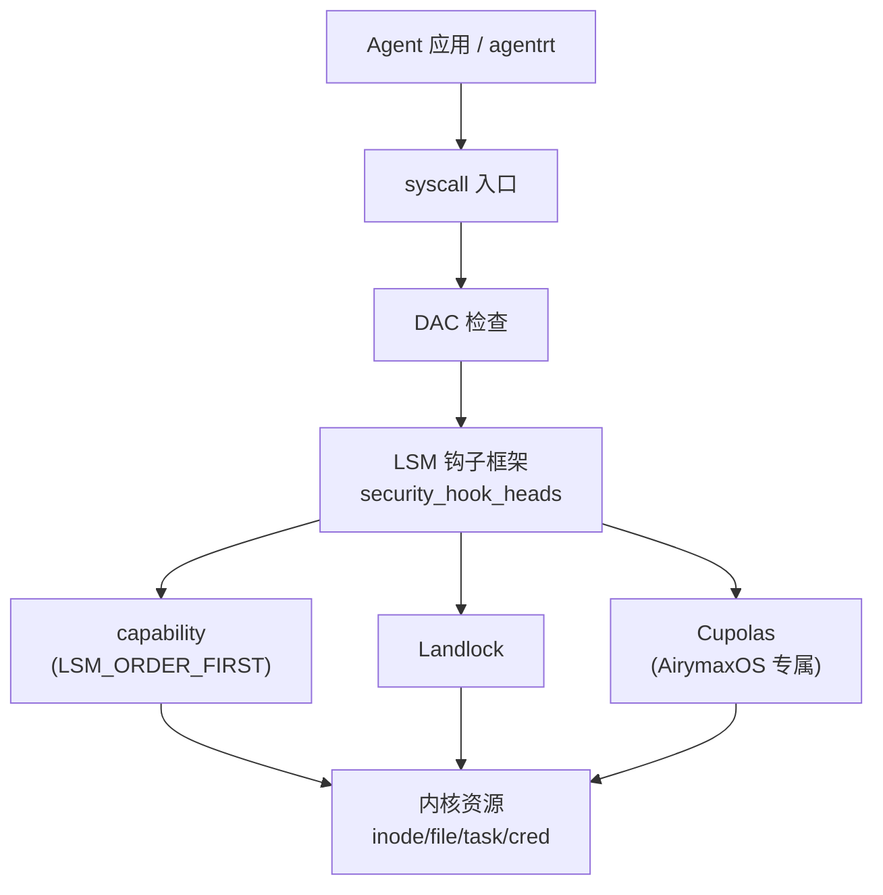
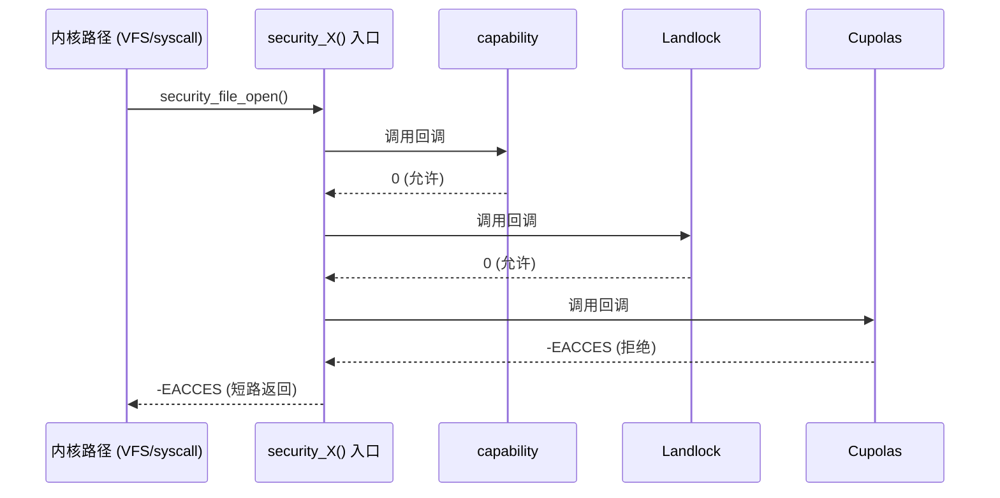

Copyright (c) 2025-2026 SPHARX Ltd. All Rights Reserved.

# LSM 框架详解

> **文档定位**: AirymaxOS（agentrt-linux）安全工程体系第 1 主题文档——Linux 安全模块（LSM）框架深度剖析
> **版本**: 0.1.1（占位）/ 1.0.1（开发）
> **最后更新**: 2026-07-06
> **同源映射**: agentrt Cupolas（安全穹顶）+ Linux 6.6 LSM/Landlock/capability
> **理论根基**: Linux 6.6 内核基线 + Airymax 五维正交 24 原则 + E-1 安全内生
> **核心约束**: IRON-9 v2 同源且部分代码共享

---

## 目录

- [第 1 章 LSM 框架总览](#第-1-章-lsm-框架总览)
- [第 2 章 security_hook_heads 钩子链表](#第-2-章-security_hook_heads-钩子链表)
- [第 3 章 lsm_blob_sizes 内存分配](#第-3-章-lsm_blob_sizes-内存分配)
- [第 4 章 LSM 排序机制](#第-4-章-lsm-排序机制)
- [第 5 章 LSM 初始化流程](#第-5-章-lsm-初始化流程)
- [第 6 章 LSM 钩子类型](#第-6-章-lsm-钩子类型)
- [第 7 章 LSM 与 capability 共存](#第-7-章-lsm-与-capability-共存)
- [第 8 章 AirymaxOS Cupolas 作为 LSM 模块集成](#第-8-章-airymaxos-cupolas-作为-lsm-模块集成)
- [第 9 章 LSM 钩子注册示例](#第-9-章-lsm-钩子注册示例)
- [第 10 章 五维原则映射](#第-10-章-五维原则映射)
- [第 11 章 同源 agentrt 映射](#第-11-章-同源-agentrt-映射)
- [第 12 章 规则编号集](#第-12-章-规则编号集)
- [第 13 章 相关文档](#第-13-章-相关文档)
- [第 14 章 文档版本与维护](#第-14-章-文档版本与维护)

---

## 第 1 章 LSM 框架总览

### 1.1 设计目标

LSM（Linux Security Module）是 Linux 6.6 内核基线提供的通用安全钩子框架，在不破坏既有 DAC/MAC 语义的前提下，为内核关键路径提供可插拔的策略注入点。LSM 不实现具体策略，只提供钩子骨架——具体策略由 SELinux、AppArmor、Smack、Tomoyo、Landlock、capability 等模块填充。AirymaxOS 将 LSM 视为整个安全体系的承重点：所有内核态安全决策都经 LSM 钩子入口路由到 Cupolas 安全穹顶的对应子系统。LSM 经过 20+ 年实战沉淀，其钩子覆盖面、并发安全、blob 共享、排序机制都已严格验证，符合 AirymaxOS 在 Linux 6.6 内核基线之上"不重造轮子"的工程哲学。

### 1.2 在 AirymaxOS 安全体系中的位置

| 层级 | 机制 | 由谁实现 |
|------|------|----------|
| L1 | LSM 框架 | Linux 6.6 `security/security.c` |
| L2 | capability | `LSM_ORDER_FIRST`，永远第一 |
| L3 | Landlock | 用户态可加载沙箱 |
| L4 | Yama / LoadPin / Lockdown | 内置可选模块 |
| L5 | Cupolas 安全穹顶 | AirymaxOS 专属 LSM |

AirymaxOS Cupolas 作为最后初始化的 LSM 注册到框架中，与 capability、Landlock、Yama 等共存。

### 1.3 与 MicroCoreRT 的关系

MicroCoreRT 是 AirymaxOS 内核的极简 RT 适配层，它把 LSM 的 200+ 钩子收敛为一份"内核安全契约"白名单，确保 Cupolas 只依赖被 MicroCoreRT 锁定的稳定入口，避免被 Linux 内部 API 漂移破坏。这是 IRON-9 v2 同源且部分代码共享原则在内核安全层的具体落地：同源在于 Cupolas 在 agentrt 用户态与 AirymaxOS 内核态两端语义一致；独立在于 AirymaxOS 端的 Cupolas 必须独立维护与 LSM 框架的 ABI 契约。



---

## 第 2 章 security_hook_heads 钩子链表

### 2.1 数据结构

`security_hook_heads` 是 LSM 框架的核心容器，由一组 `struct hlist_head` 链表头组成，每个钩子对应一个链表头。在 Linux 6.6 内核基线中它被声明为 `__ro_after_init`，意味着初始化完成后只读，运行时不可追加，从而保证 RCU 读者的安全。

```c
// security/security.c
struct security_hook_heads security_hook_heads __ro_after_init;
static struct kmem_cache *lsm_file_cache;
static struct kmem_cache *lsm_inode_cache;
char *lsm_names;
static struct lsm_blob_sizes blob_sizes __ro_after_init;
```

每个钩子链表头由宏 `LSM_HOOK()` 在编译期展开生成，定义于 `include/linux/lsm_hook_defs.h`：

```c
// include/linux/lsm_hook_defs.h（节选）
LSM_HOOK(int, 0, inode_alloc_security, struct inode *inode)
LSM_HOOK(int, 0, file_open, struct file *file)
LSM_HOOK(int, 0, task_alloc, struct task_struct *task, unsigned long clone_flags)
LSM_HOOK(int, 0, cred_prepare, struct cred *new, const struct cred *old, gfp_t gfp)
```

`early_security_init()` 在内核启动早期遍历该头文件，对每个钩子执行 `INIT_HLIST_HEAD(&security_hook_heads.NAME)`，从而把全部 200+ 钩子链表初始化为空。

### 2.2 钩子注册流程

`security_hook_list` 描述单个钩子实例：持有指向 `security_hook_heads.X` 链表头的指针、LSM 名字、以及钩子回调函数指针。LSM 模块通过 `security_add_hooks()` 将自身钩子批量追加到对应链表尾部，使用 `hlist_add_tail_rcu()` 保证 RCU 安全：

```c
// security/security.c
void __init security_add_hooks(struct security_hook_list *hooks, int count,
                               const char *lsm)
{
    int i;
    for (i = 0; i < count; i++) {
        hooks[i].lsm = lsm;
        hlist_add_tail_rcu(&hooks[i].list, hooks[i].head);
    }
    if (slab_is_available()) {
        if (lsm_append(lsm, &lsm_names) < 0)
            panic("%s - Cannot get early memory.\n", __func__);
    }
}
```

钩子调用入口（如 `security_file_open`）以 RCU 读侧临界区遍历链表，依次调用每个钩子的回调；任一钩子返回非零即终止链路。这一"短路"语义是 LSM 框架保证多 LSM 协同有序的核心契约。调用流程为：内核路径 → `security_X()` 入口 → `hlist_for_each_entry_rcu` 遍历 → capability（返回 0 放行）→ Landlock（返回 0 放行）→ Cupolas（返回 -EACCES 拒绝）→ 短路返回调用方。



---

## 第 3 章 lsm_blob_sizes 内存分配

### 3.1 blob 大小计算

LSM 框架允许每个模块在 `inode`、`file`、`cred`、`task`、`ipc`、`msg_msg`、`superblock` 等内核对象上挂接一份私有安全数据（blob）。为避免每个对象维护多个 LSM 各自的指针，Linux 6.6 内核基线采用"扁平 blob"方案：所有 LSM 共享一整块连续内存，各 LSM 通过偏移量访问自己那份。

```c
// security/security.c
static void __init lsm_set_blob_size(int *need, int *lbs)
{
    int offset;
    if (*need <= 0) return;
    offset = ALIGN(*lbs, sizeof(void *));
    *lbs = offset + *need;
    *need = offset;
}
```

注意 `lbs_inode` 隐式追加 `sizeof(struct rcu_head)`——这是为 inode 的 RCU 延迟释放预留的，所有 LSM 共享，由 `lsm_inode_cache` 池统一分配。

### 3.2 blob 偏移访问

每个 LSM 在 `prepare_lsm()` 阶段把自己的 `lsm_blob_sizes` 提交给框架，框架将其偏移写回模块自身的 `needed` 字段，作为运行时访问该 LSM blob 的索引。Landlock 的访问宏即基于此偏移：

```c
// security/landlock/cred.h
static inline struct landlock_cred_security *
landlock_cred(const struct cred *cred)
{
    return cred->security + landlock_blob_sizes.lbs_cred;
}
```

Cupolas 同样遵循此约定：定义 `cupolas_blob_sizes`，在 `prepare_lsm()` 阶段被框架合并进全局 `blob_sizes`，运行时通过 `cupolas_cred(cred)` / `cupolas_inode(inode)` 等内联函数取出自己的 blob 区。这种"扁平 blob + 偏移访问"模式是 AirymaxOS Cupolas 与 Landlock、capability 在同一对象上共存的关键机制。

---

## 第 4 章 LSM 排序机制

### 4.1 三个排序来源

Linux 6.6 内核基线通过三个变量共同决定 LSM 的初始化顺序：

```c
// security/security.c
static __initdata const char *chosen_lsm_order;       /* 来自 lsm= 引导参数 */
static __initdata const char *chosen_major_lsm;       /* 来自 security= 引导参数 */
static __initconst const char *const builtin_lsm_order = CONFIG_LSM;  /* 编译期默认 */
```

AirymaxOS 的 `CONFIG_LSM` 默认配置为：`landlock,yama,cupolas`（capability 与 integrity 分别以 `LSM_ORDER_FIRST` / `LSM_ORDER_LAST` 强制首尾）。

### 4.2 排序解析流程

`ordered_lsm_parse()` 按"FIRST → chosen → builtin → LAST → 其余禁用"的优先级解析：

```c
// security/security.c（节选）
static void __init ordered_lsm_parse(const char *order, const char *origin)
{
    struct lsm_info *lsm;
    char *sep, *name, *next;
    /* LSM_ORDER_FIRST (capability) 永远第一 */
    for (lsm = __start_lsm_info; lsm < __end_lsm_info; lsm++)
        if (lsm->order == LSM_ORDER_FIRST)
            append_ordered_lsm(lsm, "  first");
    /* 解析逗号分隔列表 (chosen_lsm_order 或 builtin_lsm_order) */
    sep = kstrdup(order, GFP_KERNEL);
    for (next = sep; (name = strsep(&next, ",")) != NULL; )
        for (lsm = __start_lsm_info; lsm < __end_lsm_info; lsm++)
            if (strcmp(lsm->name, name) == 0 && lsm->order == LSM_ORDER_MUTABLE)
                append_ordered_lsm(lsm, origin);
    /* LSM_ORDER_LAST (integrity) 永远最后，未列出者禁用 */
    for (lsm = __start_lsm_info; lsm < __end_lsm_info; lsm++) {
        if (lsm->order == LSM_ORDER_LAST)
            append_ordered_lsm(lsm, "   last");
        else if (!exists_ordered_lsm(lsm))
            set_enabled(lsm, false);
    }
    kfree(sep);
}
```

### 4.3 排他对齐

`LSM_FLAG_EXCLUSIVE` 标记的 LSM 互斥——SELinux/AppArmor/Smack 只能有一个被初始化。`prepare_lsm()` 在第一个 exclusive LSM 被选中后记录 `exclusive` 指针，后续 exclusive LSM 一律跳过。Cupolas 不打 EXCLUSIVE 标记，从而可以与任何 major LSM 共存，体现"穹顶叠加而非替代"的设计取向。

---

## 第 5 章 LSM 初始化流程

### 5.1 两阶段初始化

LSM 框架分两阶段初始化：

1. **early_security_init()**：在 slab 可用之前调用，初始化所有钩子链表头为空，并启动 `__early_lsm_info` 段中的 early LSM（如 lockdown、bpf-lsm 早期阶段）。
2. **security_init()**：在 slab 可用之后由 `start_kernel()` 末尾调用，执行 `ordered_lsm_init()`，依次 `prepare_lsm()` + `initialize_lsm()` 完成所有可延迟 LSM 的初始化。

```c
// security/security.c
int __init security_init(void)
{
    /* Load LSMs in specified order. */
    ordered_lsm_init();
    return 0;
}
```

### 5.2 blob 缓存创建

`ordered_lsm_init()` 在所有 LSM 的 blob 大小合并完成后，为 `lbs_file`、`lbs_inode` 创建专用 kmem_cache（`SLAB_PANIC` 保证分配失败即 panic）。启动完成后 `report_lsm_order()` 通过 `pr_info("initializing lsm=...")` 输出最终生效顺序，dmesg 中可读到形如 `LSM: initializing lsm=capability,landlock,yama,cupolas` 的串。

---

## 第 6 章 LSM 钩子类型

AirymaxOS Cupolas 主要消费以下五类钩子。

### 6.1 inode 钩子

`inode_alloc_security` 在 inode 分配时调用，LSM 在此为 inode 申请自己的 blob 区：

```c
// include/uapi/linux/lsm_hook_defs.h（节选）
LSM_HOOK(int, 0, inode_alloc_security, struct inode *inode)
LSM_HOOK(int, 0, inode_permission, struct inode *inode, int mask)
LSM_HOOK(int, 0, inode_setattr, struct dentry *dentry, struct iattr *iattr)
```

Cupolas 在 `inode_alloc_security` 中初始化 `cupolas_inode_security`，记录该 inode 所属 Agent 的命名空间标签；在 `inode_permission` 中校验跨 Agent 命名空间访问。

### 6.2 file 钩子

`file_open` 是 Landlock 与 Cupolas 共同使用的入口：

```c
// security/landlock/fs.c（节选）
static int hook_file_open(struct file *const file) {
    const struct landlock_ruleset *const dom = landlock_get_current_domain();
    layer_mask_t layer_masks[LANDLOCK_NUM_ACCESS_FS] = {};
    access_mask_t open_access_request, full_access_request, allowed_access;
    if (!dom) return 0;
    open_access_request = get_required_file_open_access(file);
    full_access_request = open_access_request | LANDLOCK_ACCESS_FS_TRUNCATE;
    /* is_access_to_paths_allowed() 校验各层后填充 allowed_access */
    landlock_file(file)->allowed_access = allowed_access;
    return ((open_access_request & allowed_access) == open_access_request) ? 0 : -EACCES;
}
```

Cupolas 在 `file_open` 之后追加一层 Agent 主体校验：先让 Landlock 完成 DAC/MAC 检查，再叠加 Cupolas 的 Agent 权限裁决。

### 6.3 task 钩子

`task_alloc` 在 `fork()`/`clone()` 路径触发，用于为新 task 准备安全上下文：

```c
LSM_HOOK(int, 0, task_alloc, struct task_struct *task, unsigned long clone_flags)
```

Cupolas 在此钩子中决定子 Agent 是否继承父 Agent 的 Cupolas 域，并在 `task_alloc` 后期通过 `AgentsIPC` 总线向 Workbench 虚拟工作台上报"Agent fork"事件。

### 6.4 cred 钩子

`cred_prepare` 与 `cred_transfer` 在凭据复制时调用：

```c
// security/landlock/cred.c
static int hook_cred_prepare(struct cred *const new, const struct cred *const old, const gfp_t gfp) {
    hook_cred_transfer(new, old); return 0;
}
static void hook_cred_transfer(struct cred *const new, const struct cred *const old) {
    struct landlock_ruleset *const old_dom = landlock_cred(old)->domain;
    if (old_dom) { landlock_get_ruleset(old_dom); landlock_cred(new)->domain = old_dom; }
}
```

Landlock 在此把父域引用计数 +1 并附加到新凭据，从而保证子进程继承父进程的 Landlock 域。Cupolas 在 `cred_prepare` 阶段执行"能力下沉"——按 IRON-9 v2 同源且部分代码共享原则，AirymaxOS 端的 capability 子集被复制到子进程，agentrt 端的运行时 capability 则由 agentrt 自行维护。

### 6.5 钩子类型小结

`inode_alloc_security`（inode 分配）→ SELinux/Smack/Cupolas；`file_open`（open 路径）→ Landlock/Cupolas；`task_alloc`（fork/clone）→ Yama/Cupolas；`cred_prepare`（凭据复制）→ Landlock/Cupolas；`sb_mount`（mount）→ Landlock/Cupolas。

## 第 7 章 LSM 与 capability 共存

capability 模块由 `LSM_ORDER_FIRST` 强制排在第一位，且不打 `LSM_FLAG_EXCLUSIVE`，从而可以与任何其他 LSM 并存。其职责是：在 DAC 检查通过之后、其他 LSM 检查之前，完成 POSIX capability 校验（`CAP_SYS_ADMIN` 等）。

Landlock 的 `landlock_restrict_self` 要求调用者要么具备 `CAP_SYS_ADMIN`，要么设置了 `no_new_privs`——这一约束正是依赖 capability 已先行初始化、其校验已生效：

```c
// security/landlock/syscalls.c
if (!task_no_new_privs(current) &&
    !ns_capable_noaudit(current_user_ns(), CAP_SYS_ADMIN))
    return -EPERM;
```

Cupolas 进一步把 capability 抽象为"主体能力位图"的一部分，主体校验时按 capability → Landlock 域 → Cupolas 域的顺序短路返回。这种分层短路正是 AirymaxOS 五维正交 24 原则中 E-1（安全内生）与 K-4（可插拔策略）的合奏：每一层只做自己最擅长的事，互不越界。

---

## 第 8 章 AirymaxOS Cupolas 作为 LSM 模块集成

### 8.1 Cupolas 的 LSM 注册

Cupolas 通过 `DEFINE_LSM` 宏在编译期注册自身：

```c
// security/cupolas/setup.c（AirymaxOS 专属）
struct lsm_blob_sizes cupolas_blob_sizes __ro_after_init = {
    .lbs_cred       = sizeof(struct cupolas_cred_security),
    .lbs_file       = sizeof(struct cupolas_file_security),
    .lbs_inode      = sizeof(struct cupolas_inode_security),
    .lbs_task       = sizeof(struct cupolas_task_security),
    .lbs_superblock = sizeof(struct cupolas_superblock_security),
};
static int __init cupolas_init(void) {
    cupolas_add_cred_hooks(); cupolas_add_inode_hooks();
    cupolas_add_file_hooks(); cupolas_add_task_hooks();
    cupolas_add_ipc_hooks();  /* 与 AgentsIPC 集成 */
    pr_info("Cupolas security dome up and running.\n");
    return 0;
}
DEFINE_LSM(cupolas) = { .name = "cupolas", .init = cupolas_init, .blobs = &cupolas_blob_sizes };
```

### 8.2 与 MicroCoreRT 的契约

Cupolas 注册的钩子集合必须在 MicroCoreRT 锁定的"内核安全契约"白名单内。任何新增钩子都需经 RFC 评审、ABI 稳定性确认（OS-IRON-001）、五维原则映射检查（OS-STD-007）三道关。这是 IRON-9 v2 同源且部分代码共享原则的硬性要求：agentrt 端的 Cupolas 用户态 API（`agentrt_cupolas_*`）在 AirymaxOS 内核态对应实现必须独立维护，但语义必须同源。

### 8.3 与 AgentsIPC 的桥接

Cupolas 在内核态除了消费 LSM 钩子，还通过 `AgentsIPC` 总线把"Agent 行为审计"事件推送到用户态的 Workbench 虚拟工作台。AgentsIPC 的 128B 消息头由 MicroCoreRT 锁定字段布局，保证两端无适配层互操作。事件流：LSM 钩子 → Cupolas 回调 → Cupolas blob（cred/file/inode/task）→ AgentsIPC 内核端 → agentrt → Audit/Workbench。

---

## 第 9 章 LSM 钩子注册示例

下面给出一个最小可用的 LSM 模块骨架，演示 `security_hook_list`、`LSM_HOOK_INIT`、`security_add_hooks`、`DEFINE_LSM` 四件套的真实用法：

```c
// security/cupolas/demo_lsm.c
#include <linux/lsm_hooks.h>
static int demo_inode_alloc(struct inode *i) { return 0; }
static int demo_file_open(struct file *f)    { return 0; }
static int demo_task_alloc(struct task_struct *t, unsigned long f) { return 0; }
static int demo_cred_prepare(struct cred *n, const struct cred *o, gfp_t g) { return 0; }

static struct security_hook_list demo_hooks[] __ro_after_init = {
    LSM_HOOK_INIT(inode_alloc_security, demo_inode_alloc),
    LSM_HOOK_INIT(file_open,            demo_file_open),
    LSM_HOOK_INIT(task_alloc,           demo_task_alloc),
    LSM_HOOK_INIT(cred_prepare,         demo_cred_prepare),
};
static int __init demo_init(void) {
    security_add_hooks(demo_hooks, ARRAY_SIZE(demo_hooks), "demo");
    return 0;
}
DEFINE_LSM(demo) = { .name = "demo", .init = demo_init };
```

### 9.1 钩子回调签名约定

所有钩子回调的签名严格由 `lsm_hook_defs.h` 中的 `LSM_HOOK(RET, DEFAULT, NAME, ARGS...)` 宏决定。Cupolas 必须按签名实现，禁止通过包装宏篡改签名——这是 OS-IRON-002（内核内部 API 不稳定但改动者需自行修复所有调用点）的延伸约束。错误码语义统一：`-EACCES`（权限拒绝，最常用）、`-EPERM`（操作不允许）、`-ENOMEM`（内存不足）、`-ENOSYS`（不支持）；Cupolas 在拒绝时优先返回 `-EACCES`，并在 `AgentsIPC` 总线上以 `CUPOLAS_DENY` 事件类型上报，由用户态 Audit 子系统落盘。

---

## 第 10 章 五维原则映射

AirymaxOS 五维正交 24 原则在 LSM 框架层的体现：

| 原则 | 编号 | 在 LSM 框架的体现 |
|------|------|-------------------|
| **E-1 安全内生** | OS-SEC-001 | 安全钩子内置于内核每一关键路径，无需外挂补丁 |
| **E-2 形式化验证** | OS-SEC-002 | LSM 钩子链表 RCU 不变量需通过形式化检查 |
| **K-2 接口契约化** | OS-KER-001 | `security_hook_heads` 字段集是稳定契约，跨版本 ABI 永不破坏 |
| **K-3 服务隔离** | OS-KER-002 | 不同 LSM 通过 `LSM_FLAG_EXCLUSIVE` 互斥；blob 偏移隔离 |
| **K-4 可插拔策略** | OS-KER-003 | `CONFIG_LSM` 决定启用顺序，运行时不可追加 |
| **K-6 内核契约化** | OS-KER-004 | MicroCoreRT 锁定 Cupolas 可消费的钩子白名单 |
| **C-1 编译期检查** | OS-STD-001 | `BUILD_BUG_ON` 校验 blob 大小与对齐 |
| **C-2 类型安全** | OS-STD-002 | `LSM_HOOK_INIT` 宏保证回调签名匹配 |
| **C-3 RAII** | OS-STD-003 | blob 由 kmem_cache 自动管理生命周期 |
| **A-1 诚实优先** | OS-STD-004 | `init_debug` 暴露内部状态供审计 |
| **A-3 人文关怀** | OS-STD-005 | 钩子拒绝路径需提供可读原因 |
| **IRON-9 v2 同源且部分代码共享** | OS-IRON-003 | Cupolas 与 agentrt 安全 API 同源但各自独立维护 |

---

## 第 11 章 同源 agentrt 映射

agentrt 的 `cupolas/` 模块与 AirymaxOS 内核态 Cupolas 同源，遵循 IRON-9 v2 同源且部分代码共享原则。Cupolas 的 7 大子系统在两端各自落地：

| Cupolas 子系统 | agentrt 端（用户态） | AirymaxOS 端（内核态 LSM） |
|----------------|----------------------|------------------------------|
| **Guards 守卫** | `agentrt_cupolas_guard_enter()` 入口防护 | `security_file_open` / `security_task_alloc` 钩子 |
| **Permission 权限裁决** | `agentrt_cupolas_perm_check()` 策略裁决 | `security_inode_permission` 钩子 + capability |
| **Sanitizer 输入净化** | `agentrt_cupolas_sanitize()` 输入验证 | `security_sb_mount` / `security_path_*` 钩子 |
| **Audit 审计追踪** | `agentrt_cupolas_audit_emit()` 行为审计 | LSM 钩子拒绝时通过 `AgentsIPC` 上报 |
| **Workbench 虚拟工作台** | `agentrt_cupolas_workbench_spawn()` 沙箱 | 配合 Landlock 实现进程级隔离 |
| **Security Vault 安全金库** | `agentrt_cupolas_vault_seal()` 密封 | TPM + 模块签名 + Lockdown |
| **Network Security 网络安全** | `agentrt_cupolas_net_filter()` 网络过滤 | `security_socket_*` 钩子 |

两端通过 `AgentsIPC` 总线（128B 消息头由 MicroCoreRT 锁定）传递安全策略与审计事件，无任何适配层。这是 IRON-9 v2 同源且部分代码共享原则的工程兑现：同源在语义层，独立在实现层。

---

## 第 12 章 规则编号集

| 规则编号 | 类型 | 描述 |
|----------|------|------|
| OS-IRON-001 | 铁律 | `security_hook_heads` 字段集为永久 ABI，导出后不可破坏 |
| OS-IRON-002 | 铁律 | `lsm_hook_defs.h` 钩子签名改动必须修复所有调用点 |
| OS-IRON-003 | 铁律 | Cupolas 与 agentrt 安全 API 同源且部分代码共享维护 |
| OS-KER-001 | 内核契约 | `security_hook_heads` 由 `__ro_after_init` 保护 |
| OS-KER-002 | 内核契约 | exclusive LSM 互斥语义不可绕过 |
| OS-KER-003 | 内核契约 | `CONFIG_LSM` 顺序在编译期固化，运行时不可追加 |
| OS-KER-004 | 内核契约 | MicroCoreRT 锁定 Cupolas 钩子白名单 |
| OS-STD-001 | 工程标准 | blob 大小变化必须配套 `BUILD_BUG_ON` 校验 |
| OS-STD-002 | 工程标准 | 钩子回调签名严格由 `LSM_HOOK` 宏决定 |
| OS-STD-003 | 工程标准 | blob 生命周期由 kmem_cache 自动管理 |
| OS-STD-004 | 工程标准 | `init_debug` 默认开启，便于启动审计 |
| OS-STD-005 | 工程标准 | 拒绝路径必须通过 `AgentsIPC` 上报可读原因 |
| OS-SEC-001 | 安全规范 | LSM 钩子内置每一关键路径，不可外挂补丁替代 |
| OS-SEC-002 | 安全规范 | 钩子链表 RCU 不变量需通过形式化检查 |
| OS-SEC-003 | 安全规范 | Cupolas 必须在 capability 之后初始化 |

---

## 第 13 章 相关文档

- `110-security/README.md`（安全加固体系主索引）
- `110-security/02-landlock-sandbox.md`（Landlock 用户态沙箱）
- `110-security/03-capability-model.md`（capability 模型）
- `110-security/07-cupolas-dome.md`（Cupolas 安全穹顶）
- `50-engineering-standards/04-engineering-philosophy.md`（双层稳定性哲学）
- `20-modules/03-security.md`（security 子仓设计）
- Linux 6.6 `security/security.c`、`include/linux/lsm_hooks.h`、`include/linux/lsm_hook_defs.h`

---

## 第 14 章 文档版本与维护

| 字段 | 值 |
|------|------|
| 文档定位 | LSM 框架详解 |
| 当前版本 | 0.1.1（占位）/ 1.0.1（开发） |
| 最后更新 | 2026-07-06 |
| 维护者 | AirymaxOS 安全工程组 |
| 同源映射 | agentrt Cupolas + Linux 6.6 LSM/Landlock/capability |
| 理论根基 | Linux 6.6 内核基线 + Airymax 五维正交 24 原则 + E-1 安全内生 |
| 核心约束 | IRON-9 v2 同源且部分代码共享 |

**变更历史**：

- v0.1.1（2026-07-06）：初版占位，覆盖 LSM 框架核心机制
- v1.0.1（开发中）：补充 Cupolas 钩子全集、形式化不变量、性能基准

**待办**：补充 MicroCoreRT 锁定契约最小子集；补充 Cupolas 钩子审计与 `AgentsIPC` 事件类型映射表；补充 LSM 顺序对 benchmark 的影响数据。

---

> **文档结束** | 0.1.1 P0 优先完成 LSM 框架核心机制
