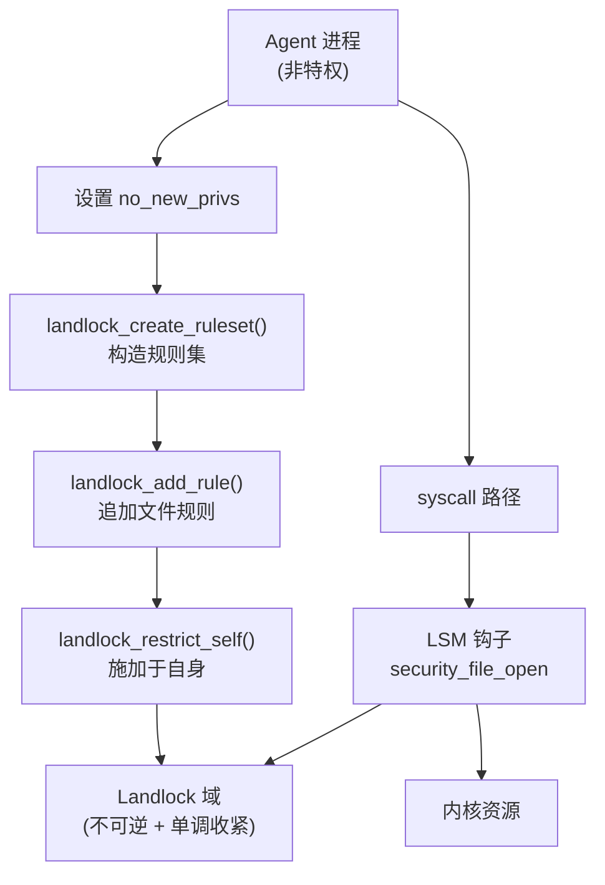
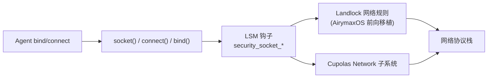

Copyright (c) 2025-2026 SPHARX Ltd. All Rights Reserved.

# Landlock 用户态沙箱

> **文档定位**: AirymaxOS（agentrt-linux）安全工程体系第 2 主题文档——Landlock 用户态安全沙箱深度剖析
> **版本**: 0.1.1（占位）/ 1.0.1（开发）
> **最后更新**: 2026-07-06
> **同源映射**: agentrt Cupolas（安全穹顶）+ Linux 6.6 LSM/Landlock/capability
> **理论根基**: Linux 6.6 内核基线 + Airymax 五维正交 24 原则 + E-1 安全内生
> **核心约束**: IRON-9 v2 同源且部分代码共享

---

## 目录

- [第 1 章 Landlock 设计哲学](#第-1-章-landlock-设计哲学)
- [第 2 章 Landlock 在 AirymaxOS 中的定位](#第-2-章-landlock-在-airymaxos-中的定位)
- [第 3 章 landlock_ruleset 数据结构](#第-3-章-landlock_ruleset-数据结构)
- [第 4 章 Landlock 安全 blob](#第-4-章-landlock-安全-blob)
- [第 5 章 Landlock 文件系统访问控制](#第-5-章-landlock-文件系统访问控制)
- [第 6 章 Landlock 网络访问控制](#第-6-章-landlock-网络访问控制)
- [第 7 章 Landlock 系统调用 API](#第-7-章-landlock-系统调用-api)
- [第 8 章 AirymaxOS Agent 沙箱实现](#第-8-章-airymaxos-agent-沙箱实现)
- [第 9 章 Workbench 虚拟工作台与 Landlock 集成](#第-9-章-workbench-虚拟工作台与-landlock-集成)
- [第 10 章 五维原则映射](#第-10-章-五维原则映射)
- [第 11 章 同源 agentrt 映射](#第-11-章-同源-agentrt-映射)
- [第 12 章 规则编号集](#第-12-章-规则编号集)
- [第 13 章 相关文档](#第-13-章-相关文档)
- [第 14 章 文档版本与维护](#第-14-章-文档版本与维护)

---

## 第 1 章 Landlock 设计哲学

### 1.1 非特权进程自限制

Landlock 是 Linux 6.6 内核基线中唯一允许**非特权进程**自定义安全策略并施加于自身的安全模块。这一设计哲学颠覆了 SELinux/AppArmor 由管理员集中配置的范式：策略制定权下沉到每个进程，但被严格约束在"只能限制自己"的范围内——进程无法通过 Landlock 提权，也无法影响其他进程的访问权限。这一特性正是 AirymaxOS 选择 Landlock 作为 Agent 沙箱底座的根本原因：每个 Agent 都以非特权身份运行，但其工作负载需要的隔离能力可以通过 Landlock 自主声明，无需系统管理员介入。这契合 AirymaxOS 五维正交 24 原则中的 E-1（安全内生）与 K-3（服务隔离）——安全能力内置、隔离粒度下沉到进程级。

### 1.2 域的不可逆叠加

Landlock 域（domain）一旦施加于进程，其效果**不可逆**且**单调收紧**：进程可以通过 `landlock_restrict_self` 进一步叠加更严的域，但永远无法放宽当前域。这与 `no_new_privs` 的语义吻合：施加 Landlock 域后，子进程通过 `execve` 也无法摆脱该域。AirymaxOS Cupolas 的 Workbench 子系统正是利用这一不可逆性来保证 Agent 即便被攻陷也无法越界。

### 1.3 多层叠加与短路

Landlock 通过 `layer_masks` 机制支持多个域叠加：每一层独立裁决，任一层否决即整体否决。这是"最严格优先"策略的工程实现，与 LSM 框架自身的多 LSM 短路语义保持一致。

### 1.4 与 MicroCoreRT 的契约

Landlock 的用户态 API（三个系统调用）被 MicroCoreRT 列为"用户空间稳定 ABI"白名单成员，遵循 OS-IRON-001（用户空间 ABI 永不破坏）。AirymaxOS 在 Linux 6.6 内核基线之上对此 ABI 提供永久支持承诺，任何对 Landlock syscall 编号、参数布局、返回值语义的改动都必须经过 RFC 评审。

---

## 第 2 章 Landlock 在 AirymaxOS 中的定位

### 2.1 在安全体系分层中的位置

| 层级 | 机制 | 角色 |
|------|------|------|
| L1 | LSM 框架 | 框架承重 |
| L2 | capability | 主体能力位图 |
| L3 | **Landlock** | **进程自限制沙箱** |
| L4 | Cupolas | Agent 行为约束 |

Landlock 与 Cupolas 的分工：Landlock 提供机制（进程自施加不可逆域），Cupolas 提供策略（哪些 Agent 应施加何种域）。Cupolas 的 Workbench 子系统在 Agent 启动时通过 `landlock_restrict_self` 把 Cupolas 决策的策略施加到 Agent 进程自身，从而把 Cupolas 的高层策略翻译为 Landlock 的内核态强制。

### 2.2 与 capability 的协同

Landlock 的 `landlock_restrict_self` 要求调用者满足以下任一条件：

```c
// security/landlock/syscalls.c
if (!task_no_new_privs(current) &&
    !ns_capable_noaudit(current_user_ns(), CAP_SYS_ADMIN))
    return -EPERM;
```

非特权 Agent 通过设置 `no_new_privs` 即可施加 Landlock 域——这是非特权沙箱可行性的关键。Cupolas 在 Agent 启动时统一设置 `no_new_privs`，再施加 Landlock 域，从而无需授予 Agent 任何特权。



---

## 第 3 章 landlock_ruleset 数据结构

### 3.1 ruleset 与规则

`struct landlock_ruleset` 是 Landlock 的核心数据结构，承载一组以红黑树组织的规则：

```c
// security/landlock/ruleset.h
struct landlock_ruleset {
    struct rb_root root;                  /* 规则红黑树根 */
    struct landlock_hierarchy *hierarchy; /* 域层级链 */
    union {
        struct work_struct work_free;
        struct { struct mutex lock; refcount_t usage;
                 u32 num_rules; u32 num_layers;
                 access_mask_t fs_access_masks[]; };
    };
};

struct landlock_rule {
    struct rb_node node;                  /* 红黑树节点 */
    struct landlock_object *object;       /* 内核对象指针 (inode key) */
    u32 num_layers;                       /* 层栈深度 */
    struct landlock_layer layers[] __counted_by(num_layers);
};

struct landlock_layer { u16 level; access_mask_t access; };
```

`landlock_layer` 的 `level` 标识在层栈中的位置，`access` 是该层允许的访问位图。

### 3.2 层栈语义

`layers[]` 是一个层栈，从最旧到最新：每一层记录该层施加时的访问位图。运行时校验时按层栈遍历，任一层未授予对应访问位即整体否决。这种层栈设计直接对应"多次 `landlock_restrict_self` 叠加多个域"的语义——每次叠加新增一层，规则集合并到新层中。

### 3.3 层级链与不可变性

`struct landlock_hierarchy` 是域层级链节点，用于 ptrace 跨域校验：只有当 tracer 的域层级是 tracee 域层级的祖先时，ptrace 才被允许。一旦 ruleset 通过 `landlock_restrict_self` 绑定到进程凭据成为"域"，其红黑树即冻结为不可变；后续 `landlock_restrict_self` 创建新域，原域保留引用计数。这一不可变性是 Landlock 在 RCU 下被并发读取的前提，也是 AirymaxOS Cupolas 选择 Landlock 而非自研沙箱的重要原因——其并发安全已形式化沉淀。

---

## 第 4 章 Landlock 安全 blob

### 4.1 blob 布局

Landlock 通过 `lsm_blob_sizes` 在四类内核对象上挂接私有数据：

```c
// security/landlock/setup.c
struct lsm_blob_sizes landlock_blob_sizes __ro_after_init = {
    .lbs_cred       = sizeof(struct landlock_cred_security),
    .lbs_file       = sizeof(struct landlock_file_security),
    .lbs_inode      = sizeof(struct landlock_inode_security),
    .lbs_superblock = sizeof(struct landlock_superblock_security),
};
```

### 4.2 cred blob：域指针

`landlock_cred_security` 只有一个字段——指向当前进程绑定的 ruleset（域）。`cred_prepare` / `cred_transfer` 钩子负责在凭据复制时把父域引用计数 +1 并附加到新凭据，从而让子进程继承父进程的 Landlock 域：

```c
// security/landlock/cred.c
static void hook_cred_transfer(struct cred *const new, const struct cred *const old) {
    struct landlock_ruleset *const old_dom = landlock_cred(old)->domain;
    if (old_dom) { landlock_get_ruleset(old_dom); landlock_cred(new)->domain = old_dom; }
}
```

### 4.3 file / inode / superblock blob

`landlock_file_security` 记录文件被打开时该域允许的访问位图（`access_mask_t allowed_access`），避免后续 `ftruncate()` 等操作重新走完整路径校验；`hook_file_alloc_security` 在分配时初始化为 `LANDLOCK_MASK_ACCESS_FS` 全开。`landlock_inode_security` 持有指向 `landlock_object` 的 RCU 弱引用（`struct landlock_object __rcu *object`），把内核 inode 与 Landlock 抽象对象解耦。`landlock_superblock_security` 持有 `inode_refs` 计数（`atomic_long_t`），用于文件系统卸载时与并发 `release_inode()` 同步。

---

## 第 5 章 Landlock 文件系统访问控制

### 5.1 访问位图

Landlock 把文件系统访问细分为 15 个正交位（Linux 6.6 内核基线）：

```c
// include/uapi/linux/landlock.h
#define LANDLOCK_ACCESS_FS_EXECUTE      (1ULL << 0)
#define LANDLOCK_ACCESS_FS_WRITE_FILE   (1ULL << 1)
#define LANDLOCK_ACCESS_FS_READ_FILE    (1ULL << 2)
#define LANDLOCK_ACCESS_FS_READ_DIR     (1ULL << 3)
#define LANDLOCK_ACCESS_FS_REMOVE_DIR   (1ULL << 4)
#define LANDLOCK_ACCESS_FS_REMOVE_FILE (1ULL << 5)
#define LANDLOCK_ACCESS_FS_MAKE_CHAR    (1ULL << 6)
#define LANDLOCK_ACCESS_FS_MAKE_DIR    (1ULL << 7)
#define LANDLOCK_ACCESS_FS_MAKE_REG    (1ULL << 8)
#define LANDLOCK_ACCESS_FS_MAKE_SOCK   (1ULL << 9)
#define LANDLOCK_ACCESS_FS_MAKE_FIFO   (1ULL << 10)
#define LANDLOCK_ACCESS_FS_MAKE_BLOCK  (1ULL << 11)
#define LANDLOCK_ACCESS_FS_MAKE_SYM    (1ULL << 12)
#define LANDLOCK_ACCESS_FS_REFER       (1ULL << 13)
#define LANDLOCK_ACCESS_FS_TRUNCATE    (1ULL << 14)
```

每条规则以 `(path, allowed_access)` 二元组表达：该路径下允许上述位中标记的访问，未标记的访问被否决。

### 5.2 file_open 钩子

`hook_file_open` 是 Landlock 的主入口，对每次文件打开执行路径校验：

```c
// security/landlock/fs.c（节选）
static int hook_file_open(struct file *const file) {
    const struct landlock_ruleset *const dom = landlock_get_current_domain();
    layer_mask_t layer_masks[LANDLOCK_NUM_ACCESS_FS] = {};
    access_mask_t open_access_request, full_access_request, allowed_access;
    if (!dom) return 0;
    open_access_request = get_required_file_open_access(file);
    full_access_request = open_access_request | LANDLOCK_ACCESS_FS_TRUNCATE;
    /* is_access_to_paths_allowed() 校验各层后填充 allowed_access */
    landlock_file(file)->allowed_access = allowed_access;
    return ((open_access_request & allowed_access) == open_access_request) ? 0 : -EACCES;
}
```

### 5.3 path 类钩子覆盖面

Landlock 注册了完整的 path 类钩子，覆盖 `mkdir`/`mknod`/`symlink`/`unlink`/`rmdir`/`rename`/`link`/`truncate`，以及 `sb_mount`/`move_mount`/`sb_umount`/`sb_remount`/`sb_pivotroot` 等挂载操作，还有 `file_alloc_security`/`file_open`/`file_truncate` 文件操作。这一覆盖面让 AirymaxOS Cupolas 可以把"Agent 可写目录"完整收敛到 Landlock 域内，无需另起一套文件系统过滤机制。

---

## 第 6 章 Landlock 网络访问控制

### 6.1 网络规则的前瞻性

Linux 6.6 内核基线中的 Landlock 仅覆盖文件系统访问；网络访问控制在主线 6.7+ 才稳定落地。AirymaxOS 在 Linux 6.6 内核基线之上对 Landlock 进行前向移植，把网络规则作为可选扩展集成进 Cupolas Workbench 沙箱，沿用相同的"层栈 + 不可逆叠加"语义。

### 6.2 网络规则类型

AirymaxOS Cupolas 沙箱使用的网络规则类型遵循上游 UAPI 设计：

- `LANDLOCK_RULE_NET_PORT`：按 TCP/UDP 端口范围约束 bind/connect
- `LANDLOCK_RULE_NET_SERVICE`：按服务类型约束（前瞻规范）

每条网络规则形如 `(port, allowed_access)`，与文件规则共享同一 ruleset 与层栈机制：

```c
/* AirymaxOS Cupolas 网络规则示例（前向移植） */
struct landlock_net_port_attr {
    __u64 allowed_access;   /* LANDLOCK_ACCESS_NET_* */
    __u64 port;             /* 端口号 */
};
#define LANDLOCK_ACCESS_NET_BIND_TCP     (1ULL << 0)
#define LANDLOCK_ACCESS_NET_CONNECT_TCP (1ULL << 1)
#define LANDLOCK_ACCESS_NET_BIND_UDP    (1ULL << 2)
#define LANDLOCK_ACCESS_NET_CONNECT_UDP (1ULL << 3)
```

### 6.3 与 Cupolas Network 子系统的协同

Cupolas Network 子系统在 agentrt 端通过 `agentrt_cupolas_net_filter()` 实施用户态过滤；AirymaxOS 内核态则通过 Landlock 网络规则在 `bind()` / `connect()` syscall 路径上施加内核级强制。两端通过 `AgentsIPC` 总线同步规则，遵循 IRON-9 v2 同源且部分代码共享原则——同源在规则语义，独立在执行路径。网络规则端口范围最大 65535，端口号之外的协议字段（如 ICMP type）暂不支持；AirymaxOS Cupolas 在沙箱策略中明确"网络规则为可选增强"，策略缺失时回退默认拒绝。



---

## 第 7 章 Landlock 系统调用 API

### 7.1 landlock_create_ruleset

创建匿名 ruleset 文件描述符，声明该 ruleset 将处理的文件系统访问类别。`handled_access_fs` 是"该 ruleset 将要约束的访问位掩码"——只有在此掩码中标记的访问才会被该 ruleset 裁决，其余访问对该 ruleset 而言放行：

```c
// security/landlock/syscalls.c（节选）
SYSCALL_DEFINE3(landlock_create_ruleset, const struct landlock_ruleset_attr __user *,
               const attr_ptr, const size_t, size, const __u32, flags)
{
    struct landlock_ruleset_attr ruleset_attr;
    struct landlock_ruleset *ruleset;
    int ruleset_fd;
    if (!is_initialized()) return -EOPNOTSUPP;
    if (flags) return -EINVAL;
    if (size < sizeof(ruleset_attr)) return -EINVAL;
    if (size > PAGE_SIZE) return -E2BIG;
    err = copy_min_struct_from_user(&ruleset_attr, sizeof(ruleset_attr),
                                    offsetofend(typeof(ruleset_attr), handled_access_fs),
                                    attr, size);
    if (err) return err;
    if ((ruleset_attr.handled_access_fs | LANDLOCK_MASK_ACCESS_FS) != LANDLOCK_MASK_ACCESS_FS)
        return -EINVAL;
    ruleset = landlock_create_ruleset(ruleset_attr.handled_access_fs);
    if (IS_ERR(ruleset)) return PTR_ERR(ruleset);
    ruleset_fd = anon_inode_getfd("[landlock-ruleset]", &ruleset_fops, ruleset, O_RDWR | O_CLOEXEC);
    if (ruleset_fd < 0) landlock_put_ruleset(ruleset);
    return ruleset_fd;
}
```

### 7.2 landlock_add_rule

向 ruleset 追加一条 `(parent_fd, allowed_access)` 文件规则。核心校验：`allowed_access` 必须是 `ruleset->fs_access_masks[0]` 的子集，否则 `-EINVAL`；空访问位返回 `-ENOMSG`；`parent_fd` 必须指向真实文件系统路径（不接受 ruleset FD、`MNT_INTERNAL`、`SB_NOUSER`、private inode），否则 `-EBADFD`。

### 7.3 landlock_restrict_self

把 ruleset 绑定到当前线程凭据成为不可逆域。关键步骤：`prepare_creds()` 复制当前凭据 → `landlock_merge_ruleset()` 把新 ruleset 合并到旧域得到新域 → `commit_creds()` 原子提交。整个过程在当前线程独占的凭据副本上操作，无并发竞争。这是 Landlock 在 AirymaxOS 安全体系中受推崇的核心原因——其原子性与不可逆性已形式化沉淀。

```c
// security/landlock/syscalls.c（节选）
SYSCALL_DEFINE2(landlock_restrict_self, const int, ruleset_fd, const __u32, flags)
{
    struct landlock_ruleset *new_dom, *ruleset;
    struct cred *new_cred;
    struct landlock_cred_security *new_llcred;
    int err;
    if (!is_initialized()) return -EOPNOTSUPP;
    /* 类似 seccomp(2)：要求 no_new_privs 或 CAP_SYS_ADMIN */
    if (!task_no_new_privs(current) && !ns_capable_noaudit(current_user_ns(), CAP_SYS_ADMIN))
        return -EPERM;
    if (flags) return -EINVAL;
    ruleset = get_ruleset_from_fd(ruleset_fd, FMODE_CAN_READ);
    if (IS_ERR(ruleset)) return PTR_ERR(ruleset);
    new_cred = prepare_creds();
    if (!new_cred) { err = -ENOMEM; goto out_put_ruleset; }
    new_llcred = landlock_cred(new_cred);
    new_dom = landlock_merge_ruleset(new_llcred->domain, ruleset);
    if (IS_ERR(new_dom)) { err = PTR_ERR(new_dom); goto out_put_creds; }
    landlock_put_ruleset(new_llcred->domain);
    new_llcred->domain = new_dom;
    landlock_put_ruleset(ruleset);
    return commit_creds(new_cred);
out_put_creds:
    abort_creds(new_cred);
out_put_ruleset:
    landlock_put_ruleset(ruleset);
    return err;
}
```

---

## 第 8 章 AirymaxOS Agent 沙箱实现

### 8.1 沙箱施加流程

Cupolas Workbench 子系统在每个 Agent 启动时按下列流程施加 Landlock 沙箱：

```c
/* AirymaxOS Cupolas Agent 沙箱示例（用户态） */
#include <linux/landlock.h>
#include <sys/prctl.h>
int cupolas_sandbox_agent(const char *ro_root, const char *rw_work) {
    struct landlock_ruleset_attr attr = {
        .handled_access_fs = LANDLOCK_ACCESS_FS_WRITE_FILE | LANDLOCK_ACCESS_FS_TRUNCATE |
                              LANDLOCK_ACCESS_FS_REMOVE_FILE | LANDLOCK_ACCESS_FS_REMOVE_DIR |
                              LANDLOCK_ACCESS_FS_MAKE_REG | LANDLOCK_ACCESS_FS_MAKE_DIR,
    };
    int fd, err;
    /* (1) 设置 no_new_privs； (2) 创建 ruleset */
    if (prctl(PR_SET_NO_NEW_PRIVS, 1, 0, 0, 0) < 0) return -errno;
    fd = syscall(SYS_landlock_create_ruleset, &attr, sizeof(attr), 0);
    if (fd < 0) return -errno;
    /* (3) 只读根：仅允许读 */
    struct landlock_path_beneath_attr ro = {
        .allowed_access = LANDLOCK_ACCESS_FS_READ_FILE | LANDLOCK_ACCESS_FS_READ_DIR,
        .parent_fd = open(ro_root, O_PATH | O_CLOEXEC),
    };
    syscall(SYS_landlock_add_rule, fd, LANDLOCK_RULE_PATH_BENEATH, &ro, 0);
    /* (4) 可写工作目录：允许读写创建 */
    struct landlock_path_beneath_attr rw = {
        .allowed_access = LANDLOCK_ACCESS_FS_WRITE_FILE | LANDLOCK_ACCESS_FS_TRUNCATE |
                          LANDLOCK_ACCESS_FS_REMOVE_FILE | LANDLOCK_ACCESS_FS_REMOVE_DIR |
                          LANDLOCK_ACCESS_FS_MAKE_REG | LANDLOCK_ACCESS_FS_MAKE_DIR |
                          LANDLOCK_ACCESS_FS_READ_FILE | LANDLOCK_ACCESS_FS_READ_DIR,
        .parent_fd = open(rw_work, O_PATH | O_CLOEXEC),
    };
    syscall(SYS_landlock_add_rule, fd, LANDLOCK_RULE_PATH_BENEATH, &rw, 0);
    /* (5) 施加于自身 */
    err = syscall(SYS_landlock_restrict_self, fd, 0);
    close(fd);
    return err;
}
```

### 8.2 与 Cupolas Vault 的协同

Agent 在沙箱内运行的敏感数据由 Cupolas Vault 子系统通过 TPM + 机密计算保护，与 Landlock 沙箱形成"数据-代码"双层隔离：Landlock 限制代码可访问的文件范围，Vault 保护数据本身的机密性。施加失败时 Cupolas 通过 `AgentsIPC` 总线上报 `CUPOLAS_SANDBOX_FAIL` 事件，Agent 拒绝启动而非降级运行。这遵循 AirymaxOS 五维正交 24 原则中的 E-1（安全内生）——失败必须可见、可拒绝，不可静默退化。

---

## 第 9 章 Workbench 虚拟工作台与 Landlock 集成

### 9.1 Workbench 定位

Workbench 是 Cupolas 的"虚拟工作台"子系统，为 Agent 提供完整的隔离运行环境：独立的根文件系统、独立的网络命名空间、独立的 Landlock 域、独立的 capability 集。宿主系统侧由 Cupolas Network 守护、Cupolas Workbench 守护、Cupolas Vault 三者协同；Agent 命名空间侧由 mount ns（独立根 FS）+ network ns + Landlock 域（不可逆）+ capability 子集 + Agent 进程构成。Workbench 守护负责施加 mount/network/Landlock/capability 四元组到 Agent 命名空间；Network 守护通过 `AgentsIPC` 同步网络规则；Vault 通过密钥协商保护 Agent 敏感数据。

### 9.2 与 MicroCoreRT 的契约

Workbench 施加 Landlock 域所用的三个 syscall 在 MicroCoreRT 锁定的"用户空间稳定 ABI"白名单内。Cupolas Workbench 守护进程作为唯一可调用 `landlock_restrict_self` 的特权进程，承担策略施加的入口职责；Agent 进程自身只继承施加好的域，不能进一步施加更宽的规则——这是"单调收紧"语义的硬保证。

### 9.3 与 AgentsIPC 的协同

Workbench 与 Cupolas Audit 子系统通过 `AgentsIPC` 总线传递沙箱事件：`CUPOLAS_SANDBOX_BEGIN`（施加开始）、`CUPOLAS_SANDBOX_END`（完成）、`CUPOLAS_SANDBOX_DENY`（syscall 被拒绝）、`CUPOLAS_SANDBOX_FAIL`（施加失败，启动中止）。所有事件携带 Agent ID、时间戳、规则集版本号，由 Audit 子系统持久化到 Workbench 日志卷。

---

## 第 10 章 五维原则映射

AirymaxOS 五维正交 24 原则在 Landlock 沙箱层的体现：

| 原则 | 编号 | 在 Landlock 的体现 |
|------|------|---------------------|
| **E-1 安全内生** | OS-SEC-004 | 沙箱能力内置内核，无需外部依赖 |
| **E-2 形式化验证** | OS-SEC-005 | 域的不可逆性、单调收紧性需形式化检查 |
| **K-2 接口契约化** | OS-KER-005 | 三个 syscall 是稳定 ABI，永久支持 |
| **K-3 服务隔离** | OS-KER-006 | 每个 Agent 独立 Landlock 域，进程级隔离 |
| **K-4 可插拔策略** | OS-KER-007 | ruleset 是策略载体，运行时可组合 |
| **K-6 内核契约化** | OS-KER-008 | MicroCoreRT 锁定 Landlock syscall ABI |
| **C-1 编译期检查** | OS-STD-006 | `BUILD_BUG_ON` 校验 ABI 结构体大小 |
| **C-2 类型安全** | OS-STD-007 | `copy_min_struct_from_user` 校验用户缓冲区 |
| **C-3 RAII** | OS-STD-008 | ruleset 通过 FD 引用计数管理生命周期 |
| **C-5 不变量守护** | OS-STD-009 | 域一旦绑定即不可变，RCU 读侧安全 |
| **A-1 诚实优先** | OS-STD-010 | `is_initialized()` 失败时清晰告知用户态 |
| **A-4 完美主义** | OS-STD-011 | 沙箱施加失败必须中止而非降级 |
| **IRON-9 v2 同源且部分代码共享** | OS-IRON-004 | Cupolas Workbench 与 agentrt 端沙箱同源且部分代码共享 |

---

## 第 11 章 同源 agentrt 映射

agentrt 的 `cupolas/workbench/` 模块与 AirymaxOS 内核态 Landlock 沙箱同源，遵循 IRON-9 v2 同源且部分代码共享原则。Landlock 沙箱在 Cupolas 7 大子系统中的角色：

| Cupolas 子系统 | agentrt 端（用户态） | AirymaxOS 端（内核态 Landlock） |
|----------------|----------------------|----------------------------------|
| **Guards 守卫** | `agentrt_cupolas_guard_check()` 沙箱入口校验 | `landlock_restrict_self` 后 syscall 被钩子拦截 |
| **Permission 权限裁决** | `agentrt_cupolas_perm_decide()` 策略裁决 | ruleset 中 `(path, allowed_access)` 二元组 |
| **Sanitizer 输入净化** | `agentrt_cupolas_sanitize()` 输入校验 | Landlock 限制可读路径范围 |
| **Audit 审计追踪** | `agentrt_cupolas_audit_log()` 拒绝事件落盘 | `-EACCES` 返回通过 `AgentsIPC` 上报 |
| **Workbench 虚拟工作台** | `agentrt_cupolas_workbench_apply()` 策略施加 | 调用 `landlock_create_ruleset` + `add_rule` + `restrict_self` |
| **Security Vault 安全金库** | `agentrt_cupolas_vault_seal()` 数据密封 | 沙箱限制可写路径，密钥仅存 Vault |
| **Network Security 网络安全** | `agentrt_cupolas_net_filter()` 网络过滤 | Landlock 网络规则（AirymaxOS 前向移植） |

两端通过 `AgentsIPC` 总线同步沙箱策略与审计事件，遵循 IRON-9 v2 同源且部分代码共享原则——同源在策略语义，独立在执行路径（用户态 API vs 内核态 syscall）。MicroCoreRT 锁定的 128B 消息头保证两端无适配层互操作。

---

## 第 12 章 规则编号集

| 规则编号 | 类型 | 描述 |
|----------|------|------|
| OS-IRON-004 | 铁律 | Landlock 三个 syscall 是永久 ABI，永不破坏 |
| OS-IRON-005 | 铁律 | Cupolas Workbench 与 agentrt 端沙箱同源且部分代码共享维护 |
| OS-KER-005 | 内核契约 | `landlock_create_ruleset` / `landlock_add_rule` / `landlock_restrict_self` 三 syscall 由 MicroCoreRT 锁定 |
| OS-KER-006 | 内核契约 | 每个 Agent 必须施加独立 Landlock 域 |
| OS-KER-007 | 内核契约 | ruleset 是策略载体，运行时不可变 |
| OS-KER-008 | 内核契约 | `no_new_privs` 是 Agent 启动前必设标志 |
| OS-KER-009 | 内核契约 | 网络规则为可选增强，缺失时回退默认拒绝 |
| OS-STD-006 | 工程标准 | ABI 结构体大小变化必须配套 `BUILD_BUG_ON` 校验 |
| OS-STD-007 | 工程标准 | 用户缓冲区必须通过 `copy_min_struct_from_user` 校验 |
| OS-STD-008 | 工程标准 | ruleset FD 通过引用计数管理生命周期，关闭即释放 |
| OS-STD-009 | 工程标准 | 域绑定后红黑树冻结为不可变 |
| OS-STD-010 | 工程标准 | `is_initialized()` 失败时必须返回 `-EOPNOTSUPP` |
| OS-STD-011 | 工程标准 | 沙箱施加失败必须中止 Agent 启动 |
| OS-SEC-004 | 安全规范 | 沙箱能力内置内核，Agent 无需特权即可施加 |
| OS-SEC-005 | 安全规范 | 域的不可逆性需通过形式化检查 |
| OS-SEC-006 | 安全规范 | 沙箱施加前后必须通过 `AgentsIPC` 上报事件 |
| OS-SEC-007 | 安全规范 | Landlock 域不可替代 capability，必须与之共存 |

---

## 第 13 章 相关文档

- `110-security/README.md`（安全加固体系主索引）
- `110-security/01-lsm-framework.md`（LSM 框架详解）
- `110-security/03-capability-model.md`（capability 模型）
- `110-security/07-cupolas-dome.md`（Cupolas 安全穹顶）
- `50-engineering-standards/04-engineering-philosophy.md`（双层稳定性哲学）
- `20-modules/03-security.md`（security 子仓设计）
- Linux 6.6 `security/landlock/setup.c`、`security/landlock/syscalls.c`、`security/landlock/fs.c`、`security/landlock/cred.c`、`security/landlock/ruleset.h`、`include/uapi/linux/landlock.h`

---

## 第 14 章 文档版本与维护

| 字段 | 值 |
|------|------|
| 文档定位 | Landlock 用户态沙箱 |
| 当前版本 | 0.1.1（占位）/ 1.0.1（开发） |
| 最后更新 | 2026-07-06 |
| 维护者 | AirymaxOS 安全工程组 |
| 同源映射 | agentrt Cupolas + Linux 6.6 LSM/Landlock/capability |
| 理论根基 | Linux 6.6 内核基线 + Airymax 五维正交 24 原则 + E-1 安全内生 |
| 核心约束 | IRON-9 v2 同源且部分代码共享 |

**变更历史**：v0.1.1（2026-07-06）初版占位，覆盖 Landlock 核心机制、Agent 沙箱实现、Workbench 集成；v1.0.1（开发中）补充网络规则前向移植、Workbench 与 Vault 协同、benchmark。

**待办**：补充网络规则前向移植 patch 集与上游差异；补充 Workbench 与 Vault 密钥协商协议；补充 Landlock 域叠加深度对 syscall 延迟影响；补充沙箱施加失败回滚策略。

---

> **文档结束** | 0.1.1 P0 优先完成 Landlock 沙箱核心机制
