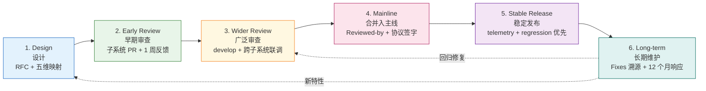
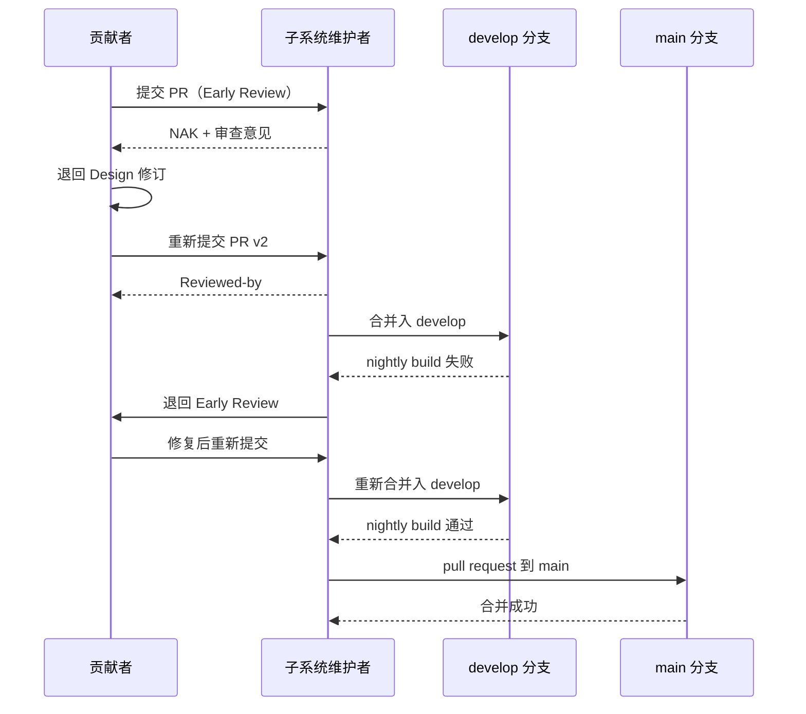
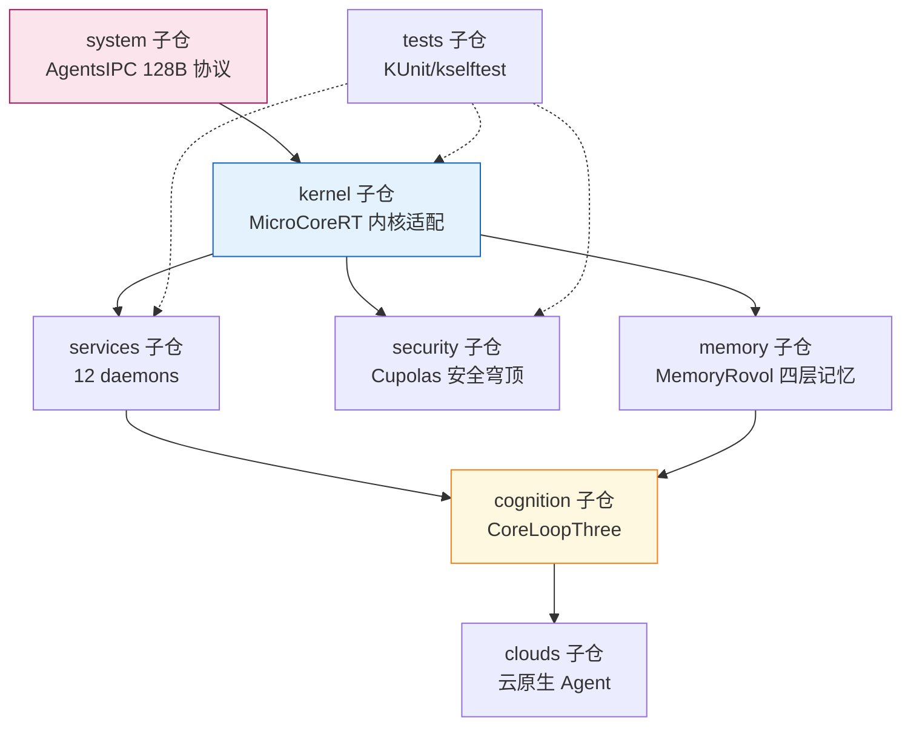

Copyright (c) 2025-2026 SPHARX Ltd. All Rights Reserved.

# AirymaxOS 补丁生命周期 6 阶段详解

> **文档定位**: AirymaxOS（agentrt-linux）120-development-process 模块第 1 卷——补丁生命周期。本文档详述代码从设计构想到主线、稳定版、长期维护的 6 阶段全生命周期，是工程标准层 `50-engineering-standards/05-development-process.md` 在模块设计层的展开。
> **版本**: 0.1.1（占位）/ 1.0.1（开发）
> **最后更新**: 2026-07-06
> **同源映射**: agentrt 开发流程 + Linux 6.6 内核开发流程（`Documentation/process/development-process.rst` 8 章）
> **理论根基**: Linux 6.6 内核基线 + Airymax 五维正交 24 原则 + S-4 涌现性管理 + C-2 增量演化
> **核心约束**: IRON-9 v2 同源且部分代码共享（agentrt 用户态运行时规范与 AirymaxOS 内核发行版规范并行演进，通过同源 API 保持互操作）

---

## 1. 模块定位与范围

本文档是 120-development-process 模块的第 1 卷，回答"一个补丁从立项到归档的完整路径是什么"。它继承 Linux 6.6 内核基线的 6 阶段补丁生命周期模型，并将其适配到 AirymaxOS 的 GitHub PR 工作流。

### 1.1 与工程标准层的关系

工程标准层 `50-engineering-standards/05-development-process.md` 定义"规则与编号"（OS-STD-XXX），本文档定义"流程在模块设计层的展开"（OS-DEV-XXX）。两层关系：

- **工程标准层**：定义阶段切换的硬性规则（如 OS-STD-107 合并入 main 需至少 1 个 Reviewed-by）。
- **模块设计层**（本文档）：定义阶段内工作流、跨仓协同、阶段间转换条件、失败回退路径。

### 1.2 适用范围

本文档适用于 AirymaxOS 全部 8 子仓（kernel/services/security/memory/cognition/clouds/system/tests）以及同源 agentrt 的协同变更流程。涉及 MicroCoreRT 与 AgentsIPC 同源 API 的改动遵循第 10 节的跨仓流程。

### 1.3 关键术语

| 术语 | 定义 |
|------|------|
| 补丁 | 一个 git commit，对应一个逻辑变更 |
| 补丁序列 | 一个 PR 内多个相互关联、按依赖顺序排列的补丁 |
| 子系统树 | 子系统维护者维护的分支，补丁进入主线的中间站 |
| `develop` 分支 | AirymaxOS 预览集成分支，等价 linux-next 树 |
| `release/*` 分支 | AirymaxOS 稳定版分支，等价 Linux -stable 树 |

---

## 2. 6 阶段生命周期总览

AirymaxOS 继承 Linux 6.6 内核基线的 6 阶段模型：Design → Early Review → Wider Review → Mainline → Stable Release → Long-term Maintenance。每个阶段有明确的输入、输出、责任人、SLA 与工具关卡。



### 2.1 阶段速查表

| 阶段 | 输入 | 输出 | 责任人 | SLA | 关卡工具 |
|------|------|------|--------|-----|---------|
| 1. Design | 需求/问题 | RFC issue | 贡献者 | 无强约束 | RFC 模板 |
| 2. Early Review | RFC + PR | 审查意见 | 子系统维护者 | 1 周 | CODEOWNERS + DCO bot |
| 3. Wider Review | 修订 PR | develop 集成 | 顶级子系统维护者 | 2 周 | nightly build + 7 层验证前 4 层 |
| 4. Mainline | PR + Reviewed-by | main 提交 | 总维护者 | Merge Window 内 | CI 全绿 + 协议委员会签字 |
| 5. Stable Release | main 提交 | release/* | 稳定版团队 | 48 小时 ACK | -rc 验证 |
| 6. Long-term | stable 反馈 | Fixes 补丁 | 原作者 + LTS 维护者 | 12 个月响应 | telemetry + bisect |

---

## 3. 阶段一：Design（设计 RFC）

设计阶段确定"做什么"和"为什么做"。本阶段可在社区内或社区外进行，但公开设计可节省后期返工——尤其是涉及 AgentsIPC 128B 协议、MicroCoreRT 内核适配、Agent SDK 接口的改动。

### 3.1 强制产出

- **RFC issue**：在对应子仓的 GitHub issue tracker 创建 RFC，使用 `rfc` 标签。
- **五维原则映射小节**：RFC 必须说明该设计涉及哪些五维正交 24 原则（如 S-4 涌现性管理、K-2 接口契约化）。
- **ABI 影响评估**：涉及 L1（Agent 应用 API）或 L2（AgentsIPC 协议）的设计必须遵循 4 层接口稳定性分级。

### 3.2 规则编号

- **OS-DEV-101**：任何影响 L1/L2 接口的设计，必须先创建 RFC issue 并至少获得 1 名顶级子系统维护者 ACK，方可进入早期审查。
- **OS-DEV-102**：RFC 必须包含"五维原则映射"小节，缺失此小节的 RFC 将被自动关闭。
- **OS-DEV-103**：RFC 必须量化预期影响（性能、内存、ABI 兼容性），禁止纯定性描述。

### 3.3 RFC 模板

```markdown
## RFC: <标题>

### 背景
<问题描述与用户可见影响>

### 设计方案
<技术方案，含数据流图>

### 五维原则映射
- S-4 涌现性管理: <如何体现>
- C-2 增量演化: <如何体现>

### ABI 影响
- L1/L2/L3/L4: <影响分级>
### 量化预期
- 性能: <数字> / 内存: <数字>
### Open Questions
- <待讨论问题>
```

---

## 4. 阶段二：Early Review（早期审查）

将补丁序列提交到相关子系统维护者的 GitHub PR。本阶段的目标是获得子系统维护者的初步反馈，而非最终 ACK。

### 4.1 目标审查者识别

由 `MAINTAINERS.md` 与 `CODEOWNERS` 自动识别。审查者识别失败（无人匹配）的 PR 将被路由到 `airymax-mm` 分支（详见第 11 节）。

### 4.2 SLA 与规则

- **SLA**：子系统维护者通常在 1 周内给出审查反馈；超过 1 周无反馈，贡献者可 ping 一次，再过 1 周仍无反馈应考虑发错地方。
- **OS-DEV-111**：早期审查 PR 必须包含完整的补丁描述（问题描述、用户可见影响、量化权衡），禁止"占位描述"。
- **OS-DEV-112**：早期审查阶段的所有审查意见必须在 PR 内联回复，禁止离线沟通。
- **OS-DEV-113**：不同意审查意见必须解释技术理由，沉默忽略视为致命错误。

### 4.3 PR 提交示例

```bash
# 创建特性分支
git checkout -b feature/cupolas-lsm-hook develop

# 编写 commit（含 DCO 签名）
git commit -s -m "security/cupolas: add agent capability hook for LSM

Add a new LSM hook that allows Cupolas to mediate agent capability
transitions. Logs transitions to the audit subsystem.
Performance impact: +0.3% syscall overhead (1M iterations, aarch64).

Signed-off-by: Author Name <author@example.com>"

# 推送并创建 PR
git push origin feature/cupolas-lsm-hook
gh pr create --base develop --title "security/cupolas: add agent capability hook for LSM"
```

---

## 5. 阶段三：Wider Review（广泛审查）

补丁通过子系统审查后，进入 `develop` 分支（等价 linux-next 树）进行跨子系统联调。本阶段暴露补丁在更大集成环境中的冲突与 regression。

### 5.1 可见性提升

进入 `develop` 后，补丁会暴露给更广泛的测试者与 CI 矩阵（x86_64 / aarch64 / riscv64 三架构 × allmodconfig / allnoconfig / defconfig 三配置）。

### 5.2 跨子系统冲突检测

`develop` 分支的 nightly build 检测：跨子系统符号冲突、ABI 漂移、AgentsIPC 协议契约违反、MicroCoreRT 同源语义偏离。

### 5.3 规则编号

- **OS-DEV-121**：补丁进入 `develop` 前必须通过 7 层自动化验证的前 4 层（编译期 / 静态分析 / 预提交 / CI 门禁）。
- **OS-DEV-122**：`develop` 分支禁止 force-push 历史，所有变更必须以 merge commit 或 rebase 后的提交形式进入。
- **OS-DEV-123**：`develop` 分支 nightly build 失败必须在 24 小时内修复或回滚；连续 3 天失败的子系统，其补丁将被冻结进入下一轮 Merge Window。
- **OS-DEV-124**：`develop` 分支每日至少运行 1 次 nightly build，覆盖三架构三配置。

### 5.4 develop 分支等价 linux-next

`develop` 分支是 AirymaxOS 对 Linux linux-next 树的等价物：

| Linux 概念 | AirymaxOS 等价物 | 同源语义 |
|-----------|-----------------|---------|
| linux-next 树 | `develop` 分支 | 下一 Merge Window 候选补丁汇聚 |
| -mm 树 | `airymax-mm` 分支 | 无明确子系统归属的补丁归宿 |
| staging 目录 | `staging/` 目录 | 质量未达主线标准的代码暂存 |
| -stable 树 | `release/*` 分支 | 稳定版维护 |

---

## 6. 阶段四：Mainline（合并入主线）

由顶级子系统维护者发起 pull request 到 `main` 分支。本阶段是补丁进入正式主线的关口。

### 6.1 Merge Window 与 RC 周期

AirymaxOS 采用 2 周 Merge Window + 6 周 RC 周期的发布节奏：Merge Window 接受新特性补丁；RC1 发布后仅接受修复补丁，新特性必须等待下一个 Merge Window。

### 6.2 规则编号

- **OS-DEV-131**：合并入 `main` 的补丁必须包含至少 1 个 `Reviewed-by:` 标签（来自非作者维护者）。
- **OS-DEV-132**：合并入 `main` 的补丁若修改 AgentsIPC 128B 消息头布局，必须由 AirymaxOS 协议委员会额外签字。
- **OS-DEV-133**：合并入 `main` 的补丁若修改 MicroCoreRT 同源语义，必须通过 agentrt 兼容性测试。
- **OS-DEV-134**：合并入 `main` 必须通过 GitHub Actions 全部检查；任一检查失败禁止合并。

### 6.3 pull request 模板

```markdown
## Pull Request: <子系统> merge for <版本>

### 包含的补丁序列
1. <commit sha> <subject>
2. <commit sha> <subject>

### 审查状态
- [x] 子系统维护者 Reviewed-by
- [x] develop nightly build 通过 + 7 层验证全绿
- [ ] 协议委员会签字（仅 ABI 改动需要）

### Conflict 解决说明
<如有冲突，说明解决方式>
### Regression 风险评估
<低/中/高，附理由>
```

---

## 7. 阶段五：Stable Release（稳定发布）

补丁随某个正式版本（如 1.0.1）发布。更多用户暴露更多 bug——regression 是本阶段最高优先级。

### 7.1 release/* 分支规则

`release/<version>` 分支等价 Linux -stable 树，遵循以下规则：补丁或其等价修复必须已存在于 `main` 分支；必须显然正确且已测试；不超过 100 行（含上下文）；必须修复真实 bug 或新增设备 ID——禁止理论性 race condition（除非附带可利用性说明）、禁止琐碎修复。

### 7.2 三种提交流径

| 选项 | 描述 | 适用场景 |
|------|------|---------|
| Option 1 | 主线 PR 添加 `Cc: release/1.0.x`，合并后自动 cherry-pick | 强烈推荐 |
| Option 2 | 主线合并后向稳定版维护者请求 | 主线合并时未考虑回溯 |
| Option 3 | 提交等价补丁到稳定版，标注 `[ Upstream commit <sha> ]` | API 变化需调整适配 |

### 7.3 规则编号

- **OS-DEV-141**：使用 Option 2/3 时必须确保修复已存在于所有更新的稳定版分支。
- **OS-DEV-142**：稳定版补丁审查委员会有 48 小时给出 ACK 或 NAK。
- **OS-DEV-143**：regression 报告必须在 48 小时内响应，7 天内提供修复或回滚方案。
- **OS-DEV-144**：稳定版发布后 30 天内，相关补丁作者需主动监控 telemetry 指标。

### 7.4 安全补丁例外

安全补丁不走常规稳定版审查流程，由 AirymaxOS 安全团队直接处理。严重安全漏洞可能进入短期 embargo；embargo 期间补丁禁止进入任何公开分支或 PR。

---

## 8. 阶段六：Long-term Maintenance（长期维护）

补丁作者需持续负责其合并入主线的代码。"the development community remembers developers who lose interest in their code after it's merged"——这是 Linux 内核社区的明确警告，AirymaxOS 完全继承。

### 8.1 LTS 版本维护

每 2 年一个 LTS 版本（如 1.0 LTS、3.0 LTS、5.0 LTS）。LTS 维护周期 5 年（含 2 年积极维护 + 3 年仅安全补丁）。LTS 版本必须每季度发布一个维护版本。

### 8.2 规则编号

- **OS-DEV-151**：补丁作者在代码合并后 12 个月内，须响应与其补丁相关的所有 bug 报告与审查请求；若长期无响应，维护者可将其代码标记为 `Orphaned` 并寻找新维护者。
- **OS-DEV-152**：长期维护期间发现的修复需通过 `Fixes:` 标签溯源到引入 bug 的原始提交。
- **OS-DEV-153**：LTS 维护者离职需提前 6 个月通知，启动继任者培养流程。
- **OS-DEV-154**：LTS 版本只接受 bug 修复与安全补丁，不接受新特性。

### 8.3 Fixes 标签格式

```
Fixes: 54a4f0239f2e ("KVM: MMU: make kvm_mmu_zap_page() return the number of pages it actually freed")
```

溯源必须使用引入 bug 的原始 commit 的 12 字符 SHA + 单行摘要，不要跨行拆分标签。AirymaxOS 仓库对象众多，6-8 字符 SHA 有碰撞风险。

---

## 9. 阶段间转换条件与失败回退

### 9.1 转换条件矩阵

| 从 → 到 | 转换条件 | 失败回退 |
|---------|---------|---------|
| Design → Early | RFC 获顶级维护者 ACK（OS-DEV-101） | RFC 重新设计或放弃 |
| Early → Wider | 子系统维护者 Reviewed-by + 7 层前 4 层通过 | 退回 Design 修订 RFC |
| Wider → Mainline | develop nightly build 通过 + Reviewed-by | 退回 Early Review 修订 |
| Mainline → Stable | 已在 main + 通过 -rc 验证 | 退回 Mainline 修复 |
| Stable → Long-term | 进入 LTS 候选名单 | 退回 Stable 补丁队列 |

### 9.2 失败回退原则

- **OS-DEV-161**：任何阶段失败的补丁必须明确标注回退目标阶段，禁止"原地重试"。
- **OS-DEV-162**：回退超过 2 次的补丁需重新进入 Design 阶段，重新评估必要性。
- **OS-DEV-163**：回退期间产生的所有审查意见必须转化为代码注释或 changelog 条目（Morton 原则）。

### 9.3 回退时序图



---

## 10. AirymaxOS 8 子仓跨仓 PR 流程

AirymaxOS 的 8 子仓（kernel/services/security/memory/cognition/clouds/system/tests）之间存在依赖关系。跨仓变更需通过 submodule 更新触发上游仓 PR。

### 10.1 8 子仓依赖关系



### 10.2 跨仓 PR 流程

当一个变更同时影响 AgentsIPC 协议（system 子仓）与 kernel 子仓：

```bash
# 1. 先在 system 子仓提交协议变更 PR
cd airymaxos-system
git checkout -b feature/agentsipc-new-field
git commit -s -m "system/agentsipc: add agent_priority field to 128B header

Add a new u8 agent_priority field at offset 120 of the AgentsIPC
128B message header. ABI impact: L2 (backward compatible, padding
bytes consumed).

Signed-off-by: Author Name <author@example.com>"
gh pr create --base develop --title "system/agentsipc: add agent_priority field"

# 2. system 子仓 PR 合并后，更新 kernel 子仓的 submodule 指针
cd ../airymaxos-kernel
git checkout -b feature/agentsipc-priority-support
git submodule update --remote airymaxos-system
git commit -s -m "kernel: consume agentsipc agent_priority field

Update MicroCoreRT IPC dispatch to read the new agent_priority
field and route high-priority messages to the fast path.

Signed-off-by: Author Name <author@example.com>"
gh pr create --base develop --title "kernel: consume agentsipc agent_priority field"
```

### 10.3 跨仓审查规则

- **OS-DEV-171**：跨仓 PR 必须在描述中标注所有依赖的下游仓 PR。
- **OS-DEV-172**：跨仓 PR 的 CI 必须触发上下游仓的兼容性测试。
- **OS-DEV-173**：AgentsIPC 协议变更的跨仓 PR 必须由协议委员会同步签字所有相关仓的 PR。

---

## 11. GitHub PR 工作流适配邮件补丁

AirymaxOS 将 Linux 内核的邮件 + `git send-email` 流程适配为 GitHub PR 流程，但保留同源语义。

### 11.1 适配映射表

| Linux 内核概念 | AirymaxOS 等价物 | 同源语义 |
|---------------|-----------------|---------|
| 邮件列表 | GitHub PR + 子仓 issue tracker | 公开讨论存档 |
| `git send-email` | GitHub PR 内联提交 | 补丁可被引用、逐行评论 |
| `MAINTAINERS` 文件 | `MAINTAINERS.md` + `CODEOWNERS` | 自动识别审查者 |
| patchwork | GitHub Projects 看板 | 补丁状态追踪 |
| `Cc: stable@vger.kernel.org` | PR 评论 `Cc: release/1.0.x` | 标记需回溯到稳定版 |
| `Signed-off-by:` 邮件签名 | DCO bot 自动验证 | Developer Certificate of Origin |
| `[PATCH NNN/total]` 标题 | GitHub PR 标题 + commit 序列 | 补丁序列追踪 |

### 11.2 commit 格式（适配 GitHub）

```
[PATCH 001/003] subsystem: summary phrase

详细描述正文，行宽 75 列。描述必须解释问题、用户可见影响、量化权衡。

Fixes: 54a4f0239f2e ("original commit summary")
Closes: #123
Link: https://github.com/AirymaxOS/airymaxos-kernel/pull/456#discussion_r789

Signed-off-by: Author Name <author@example.com>
Reviewed-by: Reviewer Name <reviewer@example.com>
---
实际 diff（GitHub 中为 commit diff）
```

### 11.3 规则编号

- **OS-DEV-181**：所有 commit 必须用 `git commit -s` 添加 DCO 签名。
- **OS-DEV-182**：禁止 `git push --force` 到 `main`/`develop`/`release/*` 分支。
- **OS-DEV-183**：`Reviewed-by:`/`Acked-by:`/`Tested-by:` 标签必须由对应人员本人添加，作者不得代签。
- **OS-DEV-184**：重发未修改补丁加 `[RESEND]`；修改版本用 `v2`/`v3`。

---

## 12. 五维原则映射

本文档开发流程与 Airymax 五维正交 24 原则的映射如下：

| 原则 | 含义 | 在本文档的体现 |
|------|------|--------------|
| **S-1 反馈闭环** | 感知-决策-执行-反馈闭环 | 6 阶段生命周期构成完整反馈闭环，develop nightly build 是关键反馈点 |
| **S-4 涌现性管理** | 简单规则引导有益整体行为 | 渐进式开发模型 + Merge Window + RC 管理涌现性 |
| **K-2 接口契约化** | 双层稳定性哲学 | L1-L4 接口分级 + AgentsIPC 128B 改动需协议委员会签字（OS-DEV-132） |
| **C-2 增量演化** | 渐进式演进每步可验证 | 补丁序列中点可编译 + git bisect 友好 |
| **E-6 错误可追溯** | 错误可溯源可追踪 | Fixes/Closes/Link 标签 + 12 字符 SHA + Signed-off-by DCO 链 |
| **E-7 文档即代码** | 文档与代码同源同审 | RFC issue + 五维原则映射小节（OS-DEV-102） |
| **A-3 人文关怀** | 不烧桥管理哲学 | 审查礼仪 + 感谢审查者 + Morton 原则（OS-DEV-163） |
| **IRON-9 v2 同源且部分代码共享** | 同源 API 并行演进 | MicroCoreRT 与 AgentsIPC 同源 API 变更需两端兼容性测试（OS-DEV-133） |

---

## 13. 同源 agentrt 映射

本文档的开发流程与 agentrt 用户态运行时规范同源且部分代码共享（IRON-9 v2 同源且部分代码共享）：

| 维度 | agentrt（用户态） | AirymaxOS（内核发行版） |
|------|------------------|----------------------|
| SCM | GitHub PR | GitHub PR（同源） |
| 预览分支 | develop | develop（同源语义） |
| 稳定分支 | release/* | release/*（同源语义） |
| 同源 API | MicroCoreRT/AgentsIPC/Cupolas/MemoryRovol/CoreLoopThree | 同源 API 在内核态保持语义一致 |
| 兼容性测试 | 两端双向兼容性测试 | 同源 API 变更必须通过两端兼容性测试 |
| 季度评审 | 同源 API 漂移评审 | 同源 API 漂移评审（同源） |

### 13.1 同源 API 变更流程

MicroCoreRT 与 AgentsIPC 同源 API 的变更必须遵循双向同步：agentrt 端 RFC 必须同步到 AirymaxOS 端，反之亦然；变更必须通过两端兼容性测试；季度评审同源 API 漂移。

---

## 14. 相关文档与参考材料

- `120-development-process/README.md`（模块主索引）/ `02-maintainer-hierarchy.md`（维护者层级制度）
- `50-engineering-standards/05-development-process.md`（开发流程规范层，OS-STD-XXX）/ `07-maintainers-and-governance.md`（维护者制度）/ `06-toolchain-and-automation.md`（7 层验证、CI/CD）
- `130-roadmap/README.md`（路线图与 Merge Window 节奏）/ `30-interfaces/`（AgentsIPC 128B 协议、4 层接口分级）
- 参考材料：Linux 6.6 `Documentation/process/development-process.rst`（开发流程主入口）、`1.Intro.rst` 至 `8.Conclusion.rst`（8 章）、`submitting-patches.rst`（提交补丁规范）、`stable-kernel-rules.rst`（稳定版规则）

---

## 15. 文档版本与维护

| 版本 | 日期 | 变更 | 维护者 |
|------|------|------|--------|
| 0.1.1 | 2026-07-06 | 初始占位版本，完成 6 阶段框架 | 120-development-process 模块维护者 |
| 1.0.1 | 开发中 | 补充跨仓 PR 详细流程、回退路径案例 | 120-development-process 模块维护者 |

### 15.1 维护规则

- 本文档由 120-development-process 模块维护者负责。任何对 6 阶段模型的修改必须先在 `50-engineering-standards/05-development-process.md` 同步。OS-DEV-XXX 规则编号的变更需同步到 `50-engineering-standards/07-maintainers-and-governance.md` 的规则编号注册表。

---

> **文档结束** | 120-development-process/01-patch-lifecycle.md | 版本 0.1.1（占位）
