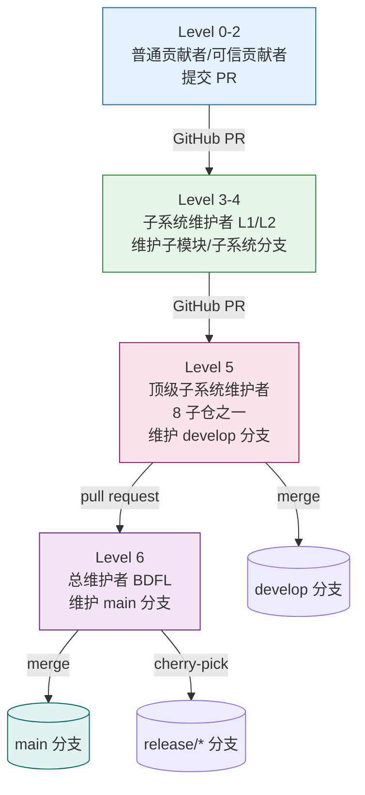
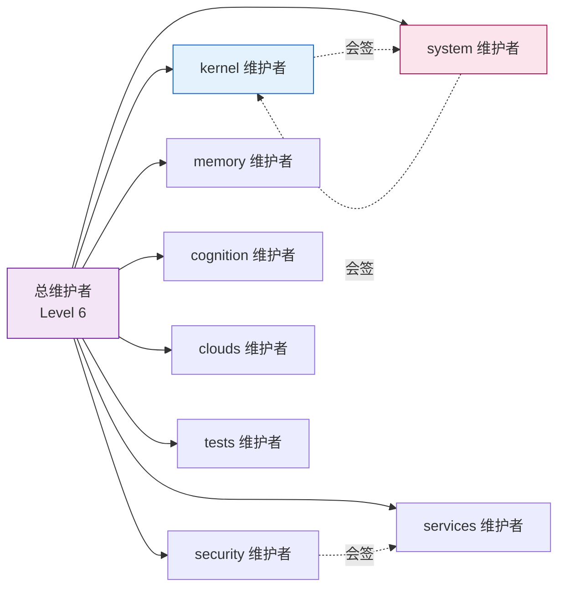
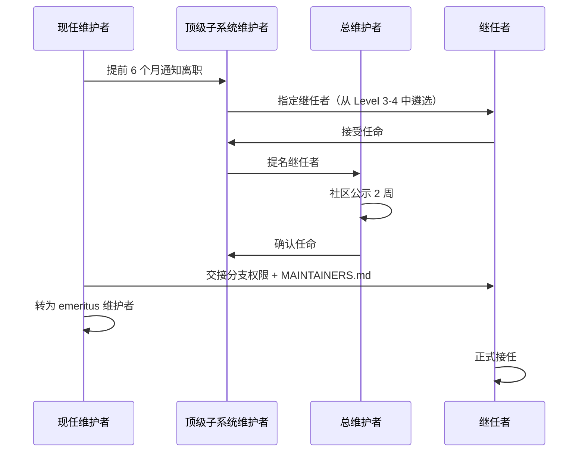

Copyright (c) 2025-2026 SPHARX Ltd. All Rights Reserved.

# AirymaxOS 维护者层级制度

> **文档定位**: AirymaxOS（agentrt-linux）120-development-process 模块第 2 卷——维护者层级制度（Lieutenant System）。本文档详述从普通贡献者到总维护者的信任链、MAINTAINERS 文件格式、8 子仓维护者分配、DCO 签名链条、6 级贡献者成熟度模型与维护者接班机制，是补丁生命周期（01 卷）在治理维度的展开。
> **版本**: 0.1.1（占位）/ 1.0.1（开发）
> **最后更新**: 2026-07-06
> **同源映射**: agentrt 维护者层级 + Linux 6.6 内核 MAINTAINERS 文件与 Lieutenant System
> **理论根基**: Linux 6.6 内核基线 + Airymax 五维正交 24 原则 + S-3 总体设计部 + A-3 人文关怀
> **核心约束**: IRON-9 v2 同源且部分代码共享（agentrt 用户态维护者层级与 AirymaxOS 内核发行版维护者层级并行，通过同源 API 变更评审保持协同）

---

## 1. 模块定位与 Lieutenant System 概述

本文档是 120-development-process 模块的第 2 卷，回答"谁有权合并什么、信任如何传递、维护者如何接班"。它继承 Linux 6.6 内核基线的 Lieutenant System（副手系统）——一条从普通贡献者到总维护者的信任链，并将其适配到 AirymaxOS 的 8 子仓 GitHub 治理结构。

### 1.1 与工程标准层的关系

工程标准层 `50-engineering-standards/07-maintainers-and-governance.md` 定义"治理规则与编号"（OS-STD-2XX），本文档定义"维护者层级在模块设计层的展开"（OS-DEV-2XX 与 OS-KER-2XX）。

### 1.2 Lieutenant System 核心理念

Linux 内核的 Lieutenant System 核心理念：每层 maintainer 信任下层 maintainer 的选择，但**信任不等于免责**。上层保留对下层补丁的最终否决权（NACK），且必须执行 CI 门禁验证。AirymaxOS 完全继承此理念。

### 1.3 关键术语

| 术语 | 定义 |
|------|------|
| Lieutenant System | 副手系统，从贡献者到总维护者的多级信任链 |
| MAINTAINERS.md | AirymaxOS 维护者清单文件，等价 Linux `MAINTAINERS` |
| DCO | Developer Certificate of Origin，开发者来源证明 v1.1 |
| Signed-off-by 链 | 补丁签名链，溯源补丁经过的每一层维护者 |
| emeritus | 荣誉维护者，已卸任但保留咨询身份 |
| MicroCoreRT | Airymax 微核心运行时基座，其维护者属 system/kernel 子仓交叉 |
| AgentsIPC | Airymax 智能体进程间通信协议，128B 定长消息头，协议改动需专门审查 |

---

## 2. 信任链层级（4 级 Chain of Trust）

AirymaxOS 信任链分为 4 级，对应 Linux 内核的 Contributor → Subsystem Maintainer → Top-level Maintainer → Chief Maintainer（Linus 角色等价物）。

### 2.1 信任链结构图



### 2.2 信任链长度约束

- **链可任意长，但很少超过 2-3 级**——超过 3 级通常意味着子系统拆分不合理。
- AirymaxOS 的 8 子仓各设 1 名顶级子系统维护者（Level 5），其下可有 2-3 层子系统维护者（Level 3-4）。

### 2.3 信任传递规则

- **OS-DEV-201**：上层 maintainer 拉取下层分支时，必须执行 7 层自动化验证的 CI 门禁层；CI 不通过的拉取请求禁止合并。
- **OS-DEV-202**：上层 maintainer 保留对下层补丁的最终否决权（NACK）；下层 maintainer 必须响应 NACK 并修改或撤回。
- **OS-DEV-203**：信任链中任意一层断裂（如某层 maintainer 失联超过 30 天），上层 maintainer 可越级接管其分支，并启动维护者补选流程（详见第 8 节）。
- **OS-KER-201**：涉及 MicroCoreRT 内核适配的补丁，必须额外经 system 子仓顶级维护者会签，因其影响同源 ABI。

---

## 3. MAINTAINERS 文件 14 字段格式

AirymaxOS 继承 Linux 6.6 内核 `MAINTAINERS` 文件的 14 字段格式，适配为 `MAINTAINERS.md`（每个子仓一份）。

### 3.1 14 字段定义

| 字段 | 含义 | AirymaxOS 适配 |
|------|------|---------------|
| `M:` | Mail patches to（维护者邮箱） | 子系统维护者 GitHub handle + 邮箱 |
| `R:` | Designated Reviewer（指定审查者） | 必须在 PR 中 CC 的审查者 |
| `L:` | Mailing list（邮件列表） | 子仓 GitHub issue tracker URL |
| `S:` | Status（状态） | Supported/Maintained/Odd Fixes/Orphan/Obsolete |
| `W:` | Web-page（状态网页） | 子系统 wiki 或文档路径 |
| `Q:` | Patchwork（补丁追踪） | GitHub Projects 看板 URL |
| `B:` | Bug tracker（缺陷追踪） | 子仓 issue tracker 的 bug 模板 URL |
| `C:` | Chat（即时通讯） | 子仓 Discord/Matrix 频道 |
| `P:` | Subsystem Profile（子系统手册） | 子系统提交手册的 in-tree 文件路径 |
| `T:` | SCM tree（源码树） | git 分支类型与位置（如 `git develop`） |
| `F:` | Files（文件匹配） | 通配符模式，尾斜杠含子目录 |
| `X:` | Excluded files（排除文件） | 与 `F:` 配合排除特定子目录 |
| `N:` | Files regex（正则匹配） | 路径正则，匹配时回溯 git log |
| `K:` | Content regex（内容正则） | 补丁/文件内容正则，匹配关键符号 |

### 3.2 MAINTAINERS.md 示例

```
AGENTSIPC PROTOCOL
M:	Alice Chen <alice@airymaxos.org>
R:	Bob Li <bob@airymaxos.org>
L:	https://github.com/AirymaxOS/airymaxos-system/issues
S:	Maintained
W:	docs/AirymaxAgentOS/30-interfaces/
Q:	https://github.com/orgs/AirymaxOS/projects/agentsipc
B:	https://github.com/AirymaxOS/airymaxos-system/issues/new?template=bug.md
C:	matrix:#agentsipc
P:	120-development-process/01-patch-lifecycle.md
T:	git https://github.com/AirymaxOS/airymaxos-system.git develop
F:	include/uapi/agentsipc/
F:	kernel/ipc/agentsipc.c
X:	kernel/ipc/agentsipc/test/
N:	[^a-z]agentsipc
K:	\b(agentsipc_send|agentsipc_recv)\b

MICROCORERT KERNEL ADAPTATION
M:	Carol Wang <carol@airymaxos.org>
R:	Dave Zhang <dave@airymaxos.org>
L:	https://github.com/AirymaxOS/airymaxos-kernel/issues
S:	Supported
T:	git https://github.com/AirymaxOS/airymaxos-kernel.git develop
F:	kernel/microcorert/
K:	\b(microcorert_init|microcorert_dispatch)\b
```

### 3.3 字段规则

- **OS-DEV-211**：每个子仓必须维护一份 `MAINTAINERS.md`，列出该子仓的所有维护者、审查者、文件路径映射、PR SLA。
- **OS-DEV-212**：`F:` 与 `X:` 模式必须可被 `get_maintainer.pl` 等价脚本解析；每模式一行，多 `F:` 行允许。
- **OS-DEV-213**：`S:` 状态变更（如 Maintained → Orphan）必须由顶级子系统维护者签字，并在 commit message 说明原因。
- **OS-DEV-214**：`K:` 内容正则用于自动识别补丁涉及的子系统；缺失 `K:` 的条目将无法被 CI 自动路由审查者。

---

## 4. AirymaxOS 8 子仓维护者分配

8 子仓各设 1 名顶级子系统维护者（Level 5），负责该子仓的 `develop` 分支与跨仓协同。

### 4.1 8 子仓维护者矩阵

| 子仓 | 顶级维护者角色 | 核心职责 | 同源 API |
|------|--------------|---------|---------|
| kernel | 内核子系统维护者 | MicroCoreRT 内核适配、驱动模型、调度 | MicroCoreRT |
| services | 服务子系统维护者 | 12 daemons（`*_d`）、用户态服务 | - |
| security | 安全子系统维护者 | Cupolas 安全穹顶、LSM、capability | Cupolas |
| memory | 内存子系统维护者 | MemoryRovol 四层记忆、MGLRU 2.0、CXL/PMEM | MemoryRovol |
| cognition | 认知子系统维护者 | CoreLoopThree 三层认知循环 | CoreLoopThree |
| clouds | 云子系统维护者 | 云原生 Agent 部署、容器化 | - |
| system | 系统接口子系统维护者 | 系统调用、ABI、AgentsIPC 128B 协议 | AgentsIPC |
| tests | 测试子系统维护者 | KUnit/kselftest/Agent 行为契约测试 | - |

### 4.2 跨子仓会签规则

- **OS-DEV-221**：影响 AgentsIPC 128B 消息头的补丁，必须由 system 子仓顶级维护者会签，并经协议委员会额外签字。
- **OS-DEV-222**：影响 MicroCoreRT 同源语义的补丁，必须由 kernel 子仓顶级维护者会签，并通知 agentrt 端同步评审。
- **OS-DEV-223**：跨 3 个及以上子仓的变更，必须由总维护者指派协调人，协调人负责跨仓 PR 的依赖排序。
- **OS-KER-211**：kernel 子仓的 ABI 改动必须同步知会 system 子仓维护者，因 AgentsIPC 协议依赖内核 syscall 语义。

### 4.3 子仓维护者分配图



---

## 5. DCO 1.1 + Signed-off-by 链条

AirymaxOS 继承 Linux 内核的 Developer Certificate of Origin v1.1，并将其适配为 GitHub DCO bot 自动验证。

### 5.1 DCO 1.1 文本（摘要）

> Developer Certificate of Origin Version 1.1
> Copyright (C) 2004, 2006 The Linux Foundation.
> By making a contribution to this project, I certify that:
> (a) The contribution was created in whole or in part by me ...
> (b) The contribution is based upon previous work ...
> (c) The contribution was provided directly to me by some other person ...

### 5.2 Signed-off-by 链条语义

每个 `Signed-off-by:` 表示签名者参与并背书该补丁。链条溯源补丁经过的每一层维护者：

```
Signed-off-by: Author Name <author@example.com>          # 原作者
Signed-off-by: Subsystem Maintainer <sm@airymaxos.org>   # 子系统维护者背书
Signed-off-by: Top-level Maintainer <tsm@airymaxos.org>  # 顶级维护者背书
```

### 5.3 DCO 规则

- **OS-DEV-231**：所有 commit 必须用 `git commit -s` 添加 `Signed-off-by:` 签名；无签名的 PR 由 DCO bot 自动阻塞合并。
- **OS-DEV-232**：`Signed-off-by:` 链条必须连续——下层维护者签名后，上层维护者追加签名时不得移除下层签名。
- **OS-DEV-233**：`Reviewed-by:`/`Acked-by:`/`Tested-by:`/`Suggested-by:` 标签必须由对应人员本人添加（GitHub 评论形式），作者不得代签。
- **OS-DEV-234**：DCO 签名者必须与 git author/committer 身份一致；身份不一致的 commit 将被 DCO bot 拒绝。

### 5.4 标签语义对照

| 标签 | 语义 | 谁可添加 |
|------|------|---------|
| `Signed-off-by:` | DCO 背书，证明来源合法 | 作者 + 每层传递维护者 |
| `Reviewed-by:` | 已进行完整技术审查（见第 6 节） | 审查者本人 |
| `Acked-by:` | 认可但未深入审查（常用于跨子系统） | 相关维护者 |
| `Tested-by:` | 已测试验证（含环境说明） | 测试者本人 |
| `Suggested-by:` | 提出原始思路 | 思路提出者 |
| `Reported-by:` | 报告 bug（含 bug tracker 链接） | bug 报告者 |

---

## 6. Reviewer's Statement of Oversight（审查者声明）

AirymaxOS 沿用 Linux 内核的 `Reviewed-by:` 标签语义——给出 `Reviewed-by:` 即声明以下四项承诺：

### 6.1 四项声明

> (a) 我已对该补丁进行了技术审查，评估其是否适合进入主线。
> (b) 任何与补丁相关的问题、疑虑或提问已反馈给提交者，且我对提交者的回应满意。
> (c) 虽然本提交可能仍有改进空间，但我认为它目前是对内核的有价值修改，且不存在已知阻碍合并的问题。
> (d) 我已审查该补丁并认为其健全，但我（除非另行明确声明）不对其达成既定目的或在任何场景下正常运行作任何担保。

### 6.2 审查者规则

- **OS-DEV-241**：`Reviewed-by:` 标签的给予者必须实际进行技术审查；流于形式的"橡皮图章"审查一经发现，审查者的 Reviewed-by 权限将被暂停。
- **OS-DEV-242**：审查者 NAK 必须附带技术理由，禁止"感觉不对"式的无理由 NAK。
- **OS-DEV-243**：审查者给予 `Reviewed-by:` 后，若发现遗漏问题，可主动撤销该标签（GitHub 评论 `Reviewed-by: withdraw`）。
- **OS-KER-221**：涉及 AgentsIPC 协议或 MicroCoreRT 内核适配的补丁，`Reviewed-by:` 必须来自该子系统顶级维护者或其指定审查者，普通审查者的标签不足以合并。

### 6.3 审查礼仪（A-3 人文关怀）

- 禁止在 PR 评论中人身攻击、贬低、或质疑审查者动机；违反者将被暂时禁言。
- 回复审查意见时使用 interleaved（inline）回复，禁止 top-posting；保留所有 Cc 收件人。
- 即使不同意审查意见，回复仍须礼貌，并明确说明修改内容——审查是耗时耗力的过程。
- 每条未导致代码改动的审查意见都应转化为代码注释或 changelog 条目（Andrew Morton 原则）。

---

## 7. 6 级贡献者成熟度模型（Level 0-5）

AirymaxOS 采用与 agentrt 同源的 6 级贡献者成熟度模型，Level 0 起步至 Level 5 顶级子系统维护者，Level 6 为总维护者（BDFL，特殊场景）。

### 7.1 6 级成熟度矩阵

| 级别 | 角色 | 能力 | 晋升条件 |
|------|------|------|---------|
| Level 0 | Newcomer（新人） | 提交首个 PR，需 mentor 指导 | 完成首个被合并 PR |
| Level 1 | Contributor（贡献者） | 独立提交符合规范的 PR | 1 个被合并 PR + 通过 DCO |
| Level 2 | Trusted Contributor（可信贡献者） | PR 可免 Early Review 直入 Wider Review | 5 个被合并 PR + 无 regression |
| Level 3 | Subsystem Maintainer L1（子模块维护者） | 维护子模块分支 | 20 个被合并 PR + 维护者面试 |
| Level 4 | Subsystem Maintainer L2（子系统维护者） | 维护子系统分支 | 维护子模块 1 年 + 无重大事故 |
| Level 5 | Top-level Subsystem Maintainer（顶级子系统维护者） | 维护 8 子仓之一 + develop 分支 | 由总维护者任命 + 社区 ACK |
| Level 6 | Chief Maintainer（总维护者） | 维护 main 分支 + BDFL | 特殊场景（继承或选举） |

### 7.2 晋升规则

- **OS-DEV-251**：从 Level 1 晋升 Level 2 需至少 5 个被合并的 PR，且无 regression 记录。
- **OS-DEV-252**：从 Level 2 晋升 Level 3 需至少 20 个被合并的 PR，且通过维护者面试（由顶级子系统维护者 + 1 名同级以上维护者主持）。
- **OS-DEV-253**：从 Level 3 晋升 Level 4 需维护子模块分支至少 1 年，且无重大事故（regression 漏检、安全漏洞等）。
- **OS-DEV-254**：Level 5 任命需总维护者提名 + 至少 3 名现有 Level 5 维护者 ACK + 社区公示 2 周无异议。

### 7.3 新人起步建议

继承 Andrew Morton 的建议：**新人从修复真实 bug 起步**，而非从拼写错误或风格修正开始。原因：真实 bug 修复让新人熟悉完整流程（设计、审查、测试、合并、维护）；真实 bug 修复有真实用户受益，社区会认真审查；风格修正和拼写修复被视为噪音——它们占用审查者时间但不带来用户价值。

---

## 8. 维护者接班机制与 emeritus

### 8.1 接班触发条件

- **OS-DEV-261**：维护者离职需提前 6 个月通知，启动继任者培养流程。
- **OS-DEV-262**：维护者失联超过 30 天（含 PR 不响应、issue 不处理），上层 maintainer 可越级接管其分支。
- **OS-DEV-263**：LTS 维护者离职需提前 6 个月通知，并完成至少 1 个 LTS 维护版本的交接。
- **OS-DEV-264**：连续 3 个 LTS 季度维护版本延期的维护者，自动触发接班评估。

### 8.2 接班流程



### 8.3 emeritus 维护者

emeritus（荣誉维护者）是已卸任但仍保留咨询身份的维护者：

- 保留 GitHub 仓库 read 权限与 issue/PR 评论权限。
- 不再拥有分支合并权限（merge 权限移交继任者）。
- 在 `MAINTAINERS.md` 中以 `S: Orphan` 标记其原辖区域，直至继任者接手后改为新维护者。
- emeritus 维护者的历史 `Reviewed-by:` 标签仍然有效，但其后续审查意见需由现任维护者确认。
- **OS-DEV-271**：emeritus 维护者不得阻塞继任者的合并决策；若 emeritus 与继任者产生分歧，以继任者决定为准。
- **OS-DEV-272**：emeritus 维护者可参与 Level 5 维护者任命的社区公示讨论，但不计入 ACK 法定人数。

### 8.4 Orphan 区域处理

- 当维护者离职且无继任者时，其辖区域标记为 `S: Orphan`。
- **OS-DEV-281**：`Orphan` 区域的 PR 由顶级子系统维护者直接处理，直至新维护者接手。
- **OS-DEV-282**：`Orphan` 区域连续 2 个发布周期无新维护者接手，由总维护者决定是否移除或合并到相邻子系统。

---

## 9. 五维原则映射

本文档维护者层级与 Airymax 五维正交 24 原则的映射如下：

| 原则 | 含义 | 在本文档的体现 |
|------|------|--------------|
| **S-1 反馈闭环** | 感知-决策-执行-反馈闭环 | 维护者层级构成反馈闭环，下层 PR 反馈到上层 merge 决策 |
| **S-3 总体设计部** | 统筹系统整体设计 | 总维护者 + 8 子仓顶级子系统维护者构成总体设计部 |
| **S-4 涌现性管理** | 简单规则引导有益整体行为 | Lieutenant System 通过简单信任传递规则引导社区涌现 |
| **K-2 接口契约化** | 双层稳定性哲学 | AgentsIPC 128B 改动需协议委员会签字 + 会签（OS-DEV-221） |
| **C-2 增量演化** | 渐进式演进每步可验证 | 6 级成熟度模型增量晋升 + Signed-off-by 链条逐层背书 |
| **E-6 错误可追溯** | 错误可溯源可追踪 | Signed-off-by 链条 + DCO 1.1 溯源每层维护者 |
| **E-7 文档即代码** | 文档与代码同源同审 | MAINTAINERS.md 14 字段 + 子系统手册（P: 字段） |
| **A-3 人文关怀** | 不烧桥管理哲学 | 审查礼仪 + emeritus 荣誉身份 + 接班 6 个月缓冲 |
| **IRON-9 v2 同源且部分代码共享** | 同源 API 并行演进 | MicroCoreRT/AgentsIPC 同源 API 变更需两端维护者协同评审 |

---

## 10. 同源 agentrt 映射

本文档的维护者层级与 agentrt 用户态运行时维护者层级同源且部分代码共享（IRON-9 v2 同源且部分代码共享）：

| 维度 | agentrt（用户态） | AirymaxOS（内核发行版） |
|------|------------------|----------------------|
| 维护者文件 | `MAINTAINERS.md` | `MAINTAINERS.md`（同源格式） |
| 信任链层级 | 4 级 | 4 级（同源） |
| DCO | DCO 1.1 + DCO bot | DCO 1.1 + DCO bot（同源） |
| 成熟度模型 | 6 级（Level 0-5） | 6 级（Level 0-5，同源） |
| 同源 API 维护者 | MicroCoreRT/AgentsIPC/Cupolas/MemoryRovol/CoreLoopThree 维护者 | 同源 API 在内核态维护者需与 agentrt 端协同评审 |
| 接班机制 | 6 个月缓冲 + emeritus | 6 个月缓冲 + emeritus（同源） |
| 季度评审 | 同源 API 维护者对齐 | 同源 API 维护者对齐（同源） |

### 10.1 同源 API 维护者协同

MicroCoreRT 与 AgentsIPC 同源 API 的维护者变更必须双向通知：agentrt 端维护者离职需通知 AirymaxOS 端对应维护者，反之亦然；继任者任命需经两端共同 ACK，确保同源 API 的一致性不因单端维护者变更而漂移。

---

## 11. 相关文档与参考材料

- `120-development-process/README.md`（模块主索引）/ `01-patch-lifecycle.md`（补丁生命周期 6 阶段）
- `50-engineering-standards/05-development-process.md`（开发流程规范层，OS-STD-XXX）/ `07-maintainers-and-governance.md`（维护者治理规则）
- `50-engineering-standards/06-toolchain-and-automation.md`（7 层验证、CI 门禁）/ `04-engineering-philosophy.md`（双层稳定性、S-3 总体设计部）
- `30-interfaces/`（AgentsIPC 128B 协议、4 层接口分级、协议委员会）
- 参考材料：Linux 6.6 `MAINTAINERS`（维护者文件 14 字段范本）、`Documentation/process/developing-process.rst`（Lieutenant System）、`Documentation/maintainer/maintainer-entry-profile.rst`（子系统手册）

---

## 12. 文档版本与维护

| 版本 | 日期 | 变更 | 维护者 |
|------|------|------|--------|
| 0.1.1 | 2026-07-06 | 初始占位版本，完成信任链 + MAINTAINERS + 成熟度模型 + 接班机制 | 120-development-process 模块维护者 |
| 1.0.1 | 开发中 | 补充 emeritus 案例库、维护者面试题库、跨子仓会签 SOP | 120-development-process 模块维护者 |

### 12.1 维护规则

- 本文档由 120-development-process 模块维护者负责。任何对维护者层级模型的修改必须先在 `50-engineering-standards/07-maintainers-and-governance.md` 同步。OS-DEV-2XX 与 OS-KER-2XX 规则编号的变更需同步到规则编号注册表。MAINTAINERS.md 的 14 字段格式与 Linux 6.6 内核基线 `MAINTAINERS` 保持字段级一致，新增字段需经总维护者审批。

---

> **文档结束** | 120-development-process/02-maintainer-hierarchy.md | 版本 0.1.1（占位）
