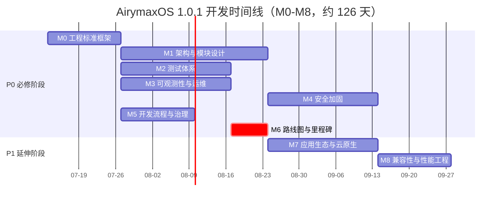
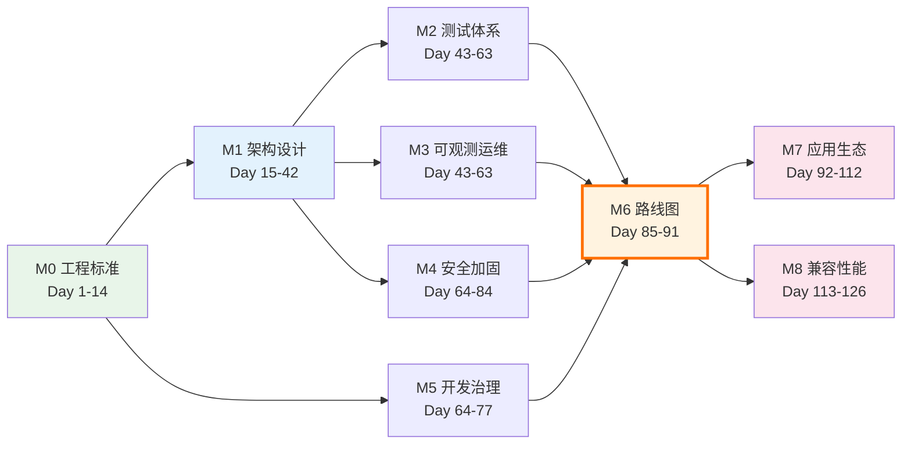

Copyright (c) 2025-2026 SPHARX Ltd. All Rights Reserved.

# AirymaxOS 里程碑与时间线

> **文档定位**: AirymaxOS（agentrt-linux，极境智能体操作系统）里程碑定义、时间线与关键路径
> **版本**: 0.1.1（占位）/ 1.0.1（开发）
> **最后更新**: 2026-07-06
> **同源映射**: agentrt `0.1.1技术全面改进方案v3.0.md`（v4.2，36 天路线图）
> **理论根基**: Linux 6.6 内核基线 + Airymax 五维正交 24 原则（S-4 涌现性管理 / E-6 错误可追溯 / A-4 完美主义）

---

## 1. 里程碑总览

AirymaxOS 开发方案拆分为 9 个里程碑（M0-M8），对应 9 个 Part。P0 包含 M0-M6（60-90 天），P1 包含 M7-M8（30-45 天），总计约 120 天。

| 里程碑 | 名称 | 对应 Part | 工期 | 完成标准 |
|--------|------|-----------|------|---------|
| M0 | 工程标准框架建立 | Part 1 | 2 周（14 天） | `50-engineering-standards/` 8 文档完成 + OS 规则编号注册表 |
| M1 | 架构与模块设计完善 | Part 2 | 4 周（28 天） | `10-architecture/` + `20-modules/` + `60-driver-model/` + `70-build-system/` 完善 |
| M2 | 测试体系建立 | Part 3 | 3 周（21 天） | `80-testing/` 10 文档完成 + KUnit/kselftest/fault injection 就位 |
| M3 | 可观测性与运维体系 | Part 4 | 3 周（21 天） | `90-observability/` + `100-operations/` 完成 + ftrace/eBPF/perf 就位 |
| M4 | 安全加固体系 | Part 5 | 3 周（21 天） | `110-security/` 完成 + capability + LSM + 机密计算就位 |
| M5 | 开发流程与治理 | Part 6 | 2 周（14 天） | `120-development-process/` + `50/07` 完成 + 维护者制度落地 |
| M6 | 路线图与里程碑 | Part 7 | 1 周（7 天） | `130-roadmap/` 7 文档完成（本模块） |
| M7 | 应用生态与云原生 | Part 8 | 3 周（21 天） | `140-application-development/` + `150-cloud-native/` 完成 |
| M8 | 兼容性与性能工程 | Part 9 | 2 周（14 天） | `160-compatibility/` + `170-performance/` 完成 |

### 1.1 里程碑分类

| 类别 | 里程碑 | 总工期 | 说明 |
|------|--------|--------|------|
| P0（必修） | M0-M6 | 91 天（13 周） | 工程标准 + 架构 + 测试 + 可观测 + 安全 + 治理 + 路线图 |
| P1（延伸） | M7-M8 | 35 天（5 周） | 应用生态 + 云原生 + 兼容性 + 性能 |
| **总计** | **M0-M8** | **126 天（18 周）** | 含并行重叠后的净工期 |

---

## 2. 时间线（Mermaid Gantt 图）

以下 Gantt 图展示 M0-M8 全部里程碑的时间线。起点设为 2026-07-13（1.0.1 开发启动），终点为 2026-11-08。

### 2.1 时间线说明

| 里程碑 | 开始日期 | 结束日期 | 工期 | 并行关系 |
|--------|---------|---------|------|---------|
| M0 | 2026-07-13 | 2026-07-26 | 14 天 | 前置（无依赖） |
| M1 | 2026-07-27 | 2026-08-23 | 28 天 | 与 M0 部分并行 |
| M2 | 2026-08-24 | 2026-09-13 | 21 天 | 依赖 M0+M1；与 M3/M5 并行 |
| M3 | 2026-08-24 | 2026-09-13 | 21 天 | 依赖 M0+M1；与 M2/M5 并行 |
| M4 | 2026-09-14 | 2026-10-04 | 21 天 | 依赖 M1；与 M5 后段并行 |
| M5 | 2026-09-14 | 2026-09-27 | 14 天 | 依赖 M0；与 M2/M3/M4 并行 |
| M6 | 2026-09-28 | 2026-10-04 | 7 天 | 依赖 M0-M5（关键路径收口） |
| M7 | 2026-10-05 | 2026-10-25 | 21 天 | 依赖 M2-M5 |
| M8 | 2026-10-26 | 2026-11-08 | 14 天 | 依赖 M2-M5 |

---

## 3. P0 详细时间线（60-91 天）

P0 阶段覆盖 M0-M6，净工期 91 天（13 周），其中多个里程碑并行推进。

### 3.1 Day 1-14: M0 工程标准框架

| 维度 | 内容 |
|------|------|
| **范围** | `50-engineering-standards/` 全部 8 文档 |
| **依赖** | 无 |
| **工时** | 240h |
| **并行** | 与 M1 部分并行（M1 Day 15 起） |
| **关键产出** | 8 文档 + OS 规则编号注册表 + IRON-9 同源但独立关系明确 |

**子任务**:
- Day 1-3: README + 01 代码规范 + 02 代码格式
- Day 4-7: 03 代码风格 + 04 工程思想（双层稳定性哲学）
- Day 8-11: 05 开发流程 + 06 工具链与自动化（7 层验证）
- Day 12-14: 07 维护者制度与治理 + OS 规则编号注册表

**验收标准**: 8 文档全部完成 + 与 agentrt IRON-9 同源但独立关系明确 + 4 层接口稳定性分级定义完成。

### 3.2 Day 15-42: M1 架构与模块设计

| 维度 | 内容 |
|------|------|
| **范围** | `10-architecture/` + `20-modules/` + `60-driver-model/` + `70-build-system/` |
| **依赖** | 无（与 M0 互不阻塞） |
| **工时** | 480h |
| **并行** | 与 M0 后段并行 |
| **关键产出** | 8 子仓设计完善 + 微内核化改造策略 + 驱动模型 + 构建系统 |

**子任务**:
- Day 15-21: `10-architecture/` 系统架构（微内核策略 + 工程哲学）
- Day 22-28: `20-modules/` 8 子仓模块设计（kernel/services/security/memory/cognition/clouds/system/tests）
- Day 29-35: `60-driver-model/` 驱动模型（驱动用户态化 + capability 隔离）
- Day 36-42: `70-build-system/` 构建系统（多语言 + 跨平台 + 7 层验证集成）

**验收标准**: 4 模块设计完善 + 微内核化改造策略（SCHED_AGENT / AgentsIPC / capability / MGLRU / CoreLoopThree kthread）明确 + 与 agentrt 同源 API 映射表完成。

### 3.3 Day 43-63: M2 测试体系（依赖 M0+M1）

| 维度 | 内容 |
|------|------|
| **范围** | `80-testing/` 10 文档 |
| **依赖** | M0（测试规范）+ M1（测试范围） |
| **工时** | 320h |
| **并行** | 与 M3、M5 并行 |
| **关键产出** | 10 文档 + KUnit + kselftest + fault injection + 覆盖率门槛 |

**子任务**:
- Day 43-49: 单元测试规范 + 集成测试规范
- Day 50-56: 形式化验证规范（seL4 范式）+ Soak 测试规范
- Day 57-63: 混沌工程规范 + 覆盖率门槛定义

**验收标准**: 10 文档完成 + 7 层验证中测试层就位 + 覆盖率门槛（单元 ≥80% / 集成 ≥70%）定义完成。

### 3.4 Day 43-63: M3 可观测性与运维（与 M2 并行，依赖 M1）

| 维度 | 内容 |
|------|------|
| **范围** | `90-observability/` 9 文档 + `100-operations/` 10 文档 |
| **依赖** | M1（可观测性接入点） |
| **工时** | 380h |
| **并行** | 与 M2、M5 并行 |
| **关键产出** | 19 文档 + ftrace + eBPF + perf + 4 层文件系统接口 |

**子任务**:
- Day 43-49: `90-observability/` 可观测性三支柱（Metrics + Logging + Tracing）
- Day 50-56: `90-observability/` eBPF 可观测性 + 4 层文件系统接口
- Day 57-63: `100-operations/` 运维体系（部署 + 升级 + 回滚 + 灾备）

**验收标准**: 19 文档完成 + eBPF kfunc + dynamic pointer + 签名验证就位 + 4 层文件系统接口（debugfs/tracefs/proc/sysfs）定义完成。

### 3.5 Day 64-84: M4 安全加固（依赖 M1）

| 维度 | 内容 |
|------|------|
| **范围** | `110-security/` 9 文档 |
| **依赖** | M1（安全模型） |
| **工时** | 320h |
| **并行** | 与 M5 后段并行 |
| **关键产出** | 9 文档 + capability + LSM + 机密计算 + 国密 |

**子任务**:
- Day 64-70: capability 安全模型（与 agentrt Cupolas 同源）+ LSM 钩子集成
- Day 71-77: 机密计算（TEE + 内存加密）+ 国密算法集成（SM2/SM3/SM4）
- Day 78-84: eBPF 签名验证 + 安全审计规范

**验收标准**: 9 文档完成 + capability 安全模型与 Cupolas 同源映射 + LSM 多 LSM 并存策略明确。

### 3.6 Day 64-77: M5 开发流程与治理（依赖 M0）

| 维度 | 内容 |
|------|------|
| **范围** | `120-development-process/` 9 文档 + `50-engineering-standards/07-maintainers-and-governance.md` |
| **依赖** | M0（治理框架） |
| **工时** | 240h |
| **并行** | 与 M2/M3/M4 并行 |
| **关键产出** | 9 文档 + 维护者制度 + 6 级成熟度模型 + DCO |

**子任务**:
- Day 64-70: 补丁生命周期 + 维护者制度（MAINTAINERS + Lieutenant System）
- Day 71-77: 6 级成熟度模型 + 治理流程（RFC → 评审 → ACC 验收）

**验收标准**: 9 文档完成 + MAINTAINERS 文件范本 + 6 级成熟度模型（Experimental → LTS）定义完成 + DCO bot 集成方案就位。

### 3.7 Day 85-91: M6 路线图（依赖 M0-M5）

| 维度 | 内容 |
|------|------|
| **范围** | `130-roadmap/` 7 文档（本模块） |
| **依赖** | M0-M5（前 6 里程碑提供输入） |
| **工时** | 80h |
| **并行** | 无（关键路径收口） |
| **关键产出** | 7 文档 + Gantt 图 + 关键路径 + 验收标准 |

**子任务**:
- Day 85-87: README + 01 开发策略 + 02 里程碑与时间线（本文件）
- Day 88-91: 03 资源估算 + 04 依赖图 + 05 风险缓解 + 06 验收标准

**验收标准**: 7 文档完成 + Gantt 图 + 关键路径图 + M0-M8 验收标准全部定义 + 与 agentrt 协同时序明确。

---

## 4. P1 详细时间线（30-45 天）

P1 阶段覆盖 M7-M8，净工期 35 天（5 周），在 P0 完成后启动。

### 4.1 Day 92-112: M7 应用生态与云原生（依赖 M2-M5）

| 维度 | 内容 |
|------|------|
| **范围** | `140-application-development/` 9 文档 + `150-cloud-native/` 8 文档 |
| **依赖** | M2（测试）+ M3（可观测）+ M4（安全）+ M5（治理） |
| **工时** | 200h |
| **并行** | 与 M8 部分并行（M8 Day 113 起） |
| **关键产出** | 17 文档 + 应用开发 SDK + 云原生部署 |

**子任务**:
- Day 92-98: `140-application-development/` 应用开发 SDK（与 agentrt SDK 同源，4 语言）
- Day 99-105: `150-cloud-native/` K8s + containerd + OCI 集成
- Day 106-112: agentctl 命令行工具 + 超节点 OS 集成

**验收标准**: 17 文档完成 + 应用开发 SDK 4 语言（Python/Rust/Go/TS）+ 与 agentrt SDK 同源映射 + 云原生部署方案就位。

### 4.2 Day 113-126: M8 兼容性与性能工程（依赖 M2-M5）

| 维度 | 内容 |
|------|------|
| **范围** | `160-compatibility/` 8 文档 + `170-performance/` 8 文档 |
| **依赖** | M2（测试）+ M3（可观测）+ M4（安全）+ M5（治理） |
| **工时** | 150h |
| **并行** | 与 M7 后段并行 |
| **关键产出** | 16 文档 + 兼容性矩阵 + 性能基准 |

**子任务**:
- Day 113-119: `160-compatibility/` 兼容性矩阵（硬件 / 软件 / ABI）
- Day 120-126: `170-performance/` 性能基准 + 调优指南 + Token 能效可观测性

**验收标准**: 16 文档完成 + 兼容性矩阵（硬件/软件/ABI）+ 性能基准（调度/内存/IPC/认知循环）+ Token 能效可观测性方案就位。

---

## 5. 0.1.1 版本范围

0.1.1 是 AirymaxOS 的"奠基占位版本"，目标是建立文档骨架与工程标准框架。

### 5.1 0.1.1 完成范围

| 模块 | 0.1.1 范围 | 里程碑 |
|------|-----------|--------|
| `50-engineering-standards/` | 全部 8 文档完成 | M0（提前完成） |
| `130-roadmap/` | 全部 7 文档完成 | M6（提前完成） |
| `10-architecture/` ~ `20-modules/` | 仅 README.md 占位 | — |
| `60-driver-model/` ~ `70-build-system/` | README + 01 + 02 占位 | — |
| `80-testing/` ~ `120-development-process/` | README + 01 + 02 占位 | — |
| `140-application-development/` ~ `170-performance/` | 仅 README.md 占位 | — |

### 5.2 0.1.1 不完成范围

- M1-M5、M7-M8 里程碑的**实际开发**（仅占位）
- 8 子仓的**实际代码开发**（仅设计草案）
- 7 层自动化验证的**实际实施**（仅规范定义）
- 维护者制度的**实际落地**（仅框架定义）

### 5.3 0.1.1 验收标准

- `50-engineering-standards/` 8 文档全部完成
- `130-roadmap/` 7 文档全部完成
- 其余 P0 模块 README.md 占位完成
- 与 agentrt IRON-9 同源但独立关系明确
- 总产出约 38 文档

---

## 6. 1.0.1 版本范围

1.0.1 是 AirymaxOS 的"实际开发版本"，目标是完成可投产的智能体操作系统。

### 6.1 1.0.1 完成范围

- 完成 M0-M8 全部 9 个里程碑
- 19 模块 ~140 文档全部产出
- 工程标准全面实施（7 层自动化验证全部就位）
- 8 子仓（kernel / services / security / memory / cognition / clouds / system / airymaxos-tests）实际开发
- 维护者制度与治理落地
- 与 agentrt 同源 API 端到端验证

### 6.2 1.0.1 验收标准

- M0-M8 全部里程碑验收通过
- 7 层自动化验证全部就位（checkpatch + 编译 + 单元 + 集成 + 性能 + Soak + 形式化）
- 8 子仓实际代码开发完成
- 维护者制度落地（MAINTAINERS + Lieutenant System + DCO）
- 与 agentrt 同源 API 端到端验证通过
- regression 零容忍（E-6 错误可追溯）

### 6.3 1.0.1 与 agentrt 协同

| 协同内容 | agentrt 侧 | AirymaxOS 侧 | 验证方式 |
|---------|-----------|--------------|---------|
| 调度 | MicroCoreRT 调度语义 | SCHED_AGENT 调度类 | 端到端调度延迟测试 |
| IPC | AgentsIPC 128B 消息头 | IPC 子系统 | 端到端消息吞吐测试 |
| 安全 | Cupolas 权限模型 | capability + LSM | 端到端权限验证测试 |
| 记忆 | MemoryRovol 四层 | 记忆子系统 MGLRU | 端到端记忆卷载测试 |
| 认知 | CoreLoopThree 三层 | 认知 kthread | 端到端认知循环测试 |

---

## 7. 关键路径

关键路径是决定项目最短工期的依赖链。AirymaxOS 关键路径为：M0 → M1 → (M2, M4) → M6 → M7 → M8。

### 7.1 关键路径分析

| 节点 | 关键路径 | 工期 | 说明 |
|------|---------|------|------|
| M0 → M1 | 工程标准 → 架构设计 | 42 天 | 前置依赖链 |
| M1 → M2 → M6 | 架构 → 测试 → 路线图 | 49 天 | 关键依赖链 |
| M6 → M7 → M8 | 路线图 → 应用生态 → 性能 | 35 天 | P1 延伸链 |
| **关键路径总工期** | M0 → M1 → M2 → M6 → M7 → M8 | **126 天** | 项目最短工期 |

### 7.2 关键路径管理（A-4 完美主义）

- **关键路径不可延期**: M0/M1/M2/M6/M7/M8 任一延期直接推迟项目交付。
- **非关键路径可吸收**: M3/M4/M5 有缓冲空间，可在 M6 收口前追赶。
- **关键路径节点每日跟踪**: M0/M1/M2/M6/M7/M8 节点每日 standup 跟踪进度。
- **缓冲分配**: 340h 管理与风险缓冲优先分配给关键路径节点。

---

## 8. 里程碑验收标准

每个里程碑的详细验收标准详见 `06-acceptance-criteria.md`。本节给出摘要：

| 里程碑 | 验收标准摘要 | 质量门禁 |
|--------|------------|---------|
| M0 | 8 文档完成 + IRON-9 关系明确 | 文档审查通过 |
| M1 | 4 模块设计完善 + 同源 API 映射 | 架构评审通过 |
| M2 | 10 文档 + 覆盖率门槛定义 | 测试规范评审通过 |
| M3 | 19 文档 + 4 层文件系统接口 | 可观测性评审通过 |
| M4 | 9 文档 + capability + LSM | 安全评审通过 |
| M5 | 9 文档 + 6 级成熟度模型 | 治理评审通过 |
| M6 | 7 文档 + Gantt + 关键路径 | 路线图评审通过 |
| M7 | 17 文档 + SDK 4 语言 | 应用生态评审通过 |
| M8 | 16 文档 + 兼容性矩阵 + 性能基准 | 性能评审通过 |

---

## 9. 风险与缓解

里程碑相关风险详见 `05-risk-mitigation.md`。本节给出摘要：

| 风险 | 概率 | 影响 | 缓解策略 |
|------|:---:|:---:|---------|
| M0 工程标准范围蔓延 | 中 | 高 | 严格限定 8 文档范围；新增需求延后到 1.1.x |
| M1 微内核化改造策略争议 | 中 | 高 | 架构委员会评审；保守方案优先（不追求激进目标） |
| M2 测试体系依赖 M0+M1 延期 | 中 | 中 | M0/M1 关键路径每日跟踪；M2 启动前确认依赖就绪 |
| M3/M4 与 M2 并行资源争用 | 高 | 中 | 人力分配优先 M2（关键路径）；M3/M4 可吸收缓冲 |
| M6 收口时 M3/M4/M5 未完成 | 中 | 高 | M6 启动前确认 M0-M5 全部完成；未完成项延后到 P1 |
| M7/M8 P1 延伸优先级降低 | 高 | 低 | P1 可在 1.0.1 后期或 1.1.x 持续完善 |
| 与 agentrt 同源 API 对齐成本 | 中 | 中 | 340h 缓冲吸收；agentrt 0.1.1 先完成奠基降低对齐成本 |

---

## 10. 五维原则映射

里程碑与时间线是五维正交 24 原则在"开发时序"维度的具体落地：

| 五维原则 | 在里程碑中的体现 | 落地里程碑 |
|---------|-----------------|-----------|
| **S-1 反馈闭环** | 每个里程碑验收即反馈闭环；M6 收口反馈到 M7/M8 | M0-M8 |
| **S-2 层次分解** | 9 里程碑 → 子任务 → 每日任务的三层分解 | M0-M8 |
| **S-3 总体设计部** | 总维护者统筹关键路径；里程碑优先级 | M6 |
| **S-4 涌现性管理** | 渐进式里程碑；缓冲吸收延期；抑制负面涌现（延期传染） | 全部 |
| **K-1 内核极简** | M1 微内核化改造优先 | M1 |
| **K-2 接口契约化** | 4 层接口稳定性分级贯穿 M0-M5 | M0-M5 |
| **E-1 安全内生** | M4 安全加固与 M2/M3 并行（前置） | M4 |
| **E-2 可观测性** | M3 可观测性体系 | M3 |
| **E-6 错误可追溯** | 里程碑验收标准可追溯；regression 不可接受 | M0-M8 |
| **E-7 文档即代码** | 里程碑本身是 Markdown 即代码；Gantt 图即代码 | 全部 |
| **E-8 可测试性** | M2 测试体系依赖 M0+M1 先行 | M2 |
| **A-3 人文关怀** | 审查优先文化；里程碑工时含审查与缓冲 | M0-M8 |
| **A-4 完美主义** | 关键路径管理；P0 不可妥协；关键路径每日跟踪 | M0-M6 |

---

## 11. 相关文档

### 11.1 本模块内部文档

- `README.md` — 路线图主索引与总纲
- `01-development-strategy.md` — 开发策略与三大支柱详解
- `03-resource-estimation.md` — 资源估算（待编写）
- `04-dependency-graph.md` — 依赖关系图（待编写）
- `05-risk-mitigation.md` — 风险识别与缓解（待编写，含本节 §9 详述）
- `06-acceptance-criteria.md` — 验收标准与质量门禁（待编写，含本节 §8 详述）

### 11.2 同源 Airymax 文档

- `docs/ARCHITECTURAL_PRINCIPLES.md` — 五维正交 24 原则（S-4 / E-6 / A-4）
- `docs-closed/0.1.1技术全面改进方案v3.0.md` — agentrt 36 天路线图（v4.2，对照参考）

### 11.3 AirymaxOS 设计文档

- `50-engineering-standards/` — 工程标准（M0 范围）
- `10-architecture/` + `20-modules/` — 架构与模块（M1 范围）
- `80-testing/` — 测试体系（M2 范围）
- `90-observability/` + `100-operations/` — 可观测与运维（M3 范围）
- `110-security/` — 安全加固（M4 范围）
- `120-development-process/` — 开发流程（M5 范围）

---

## 12. 文档版本与维护

- **当前版本**: v1.0（2026-07-06）
- **维护者**: AirymaxOS 工程标准委员会（待成立）
- **变更流程**: 任何里程碑变更必须经过 RFC → 评审 → ACC 验收流程
- **回顾周期**: 里程碑回顾（每 M 完成时）+ 季度时间线回顾

---

> **文档结束** | 里程碑与时间线是"什么时候做完"的总纲 | M0-M8 + Gantt 图 + 关键路径
