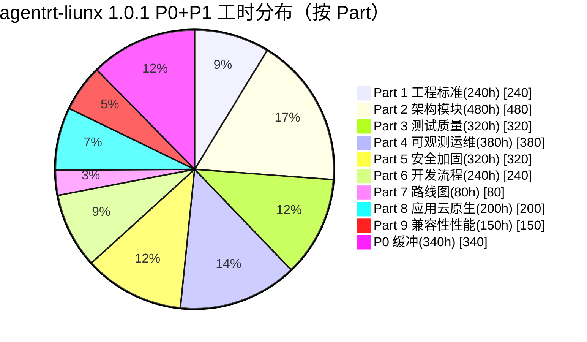
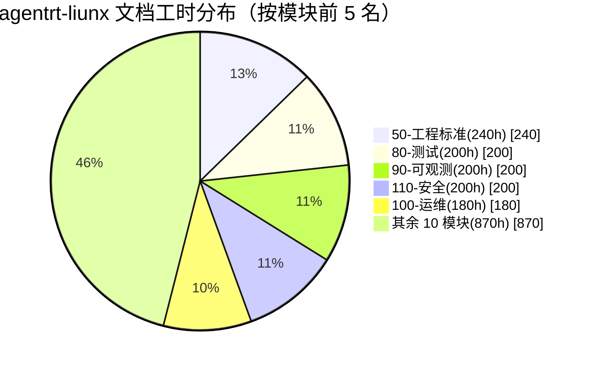
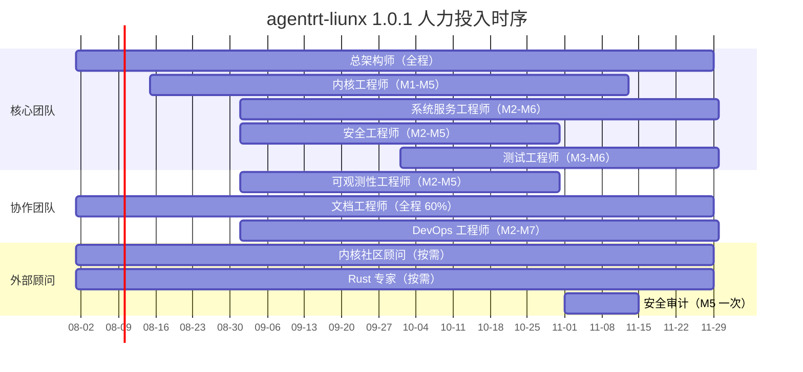
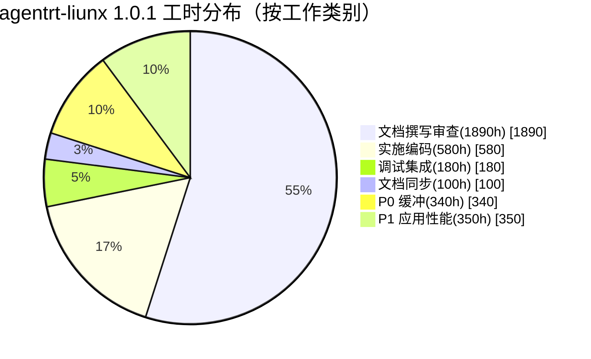
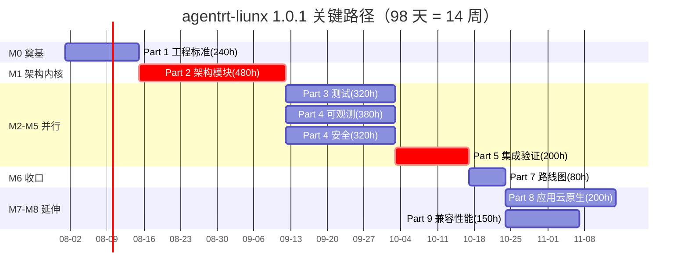

Copyright (c) 2025-2026 SPHARX Ltd. All Rights Reserved.

# agentrt-liunx（AirymaxOS）资源估算

> **文档定位**: agentrt-liunx（AirymaxOS，极境智能体操作系统）开发详细方案（路线图）模块第 3 文档
> **版本**: 0.1.1（文档体系完成）/ 1.0.1（开发）
> **最后更新**: 2026-07-06
> **同源映射**: agentrt `0.1.1技术全面改进方案v3.0.md`（v4.2，§36 SP32-SP37 生产就绪 6 项）
> **理论根基**: Linux 6.6 内核基线 + Airymax 五维正交 24 原则（体系并行论）
> **核心约束**: IRON-9 v2 同源且部分代码共享（agentrt 与 agentrt-liunx 架构契合，非代码耦合）

---

## 1. 资源估算总览

### 1.1 估算范围与对象

本文档估算 agentrt-liunx 1.0.1 版本（M0-M8 全部里程碑）所需的人力资源、工时投入与工期分布。0.1.1 版本（文档体系完成）已在 `README.md` 单独说明，不计入本文档估算。估算对象包括：

- **文档工时**——19 个文档模块共约 122 篇文档的撰写、审查与定稿工时
- **实施工时**——8 个子仓（kernel / services / security / memory / cognition / clouds / system / airymaxos-tests）的编码、调试与集成工时
- **管理工时**——跨 Part 协调、里程碑验收、维护者治理、与 agentrt 同源语义对齐等管理性工时

### 1.2 总工时汇总

| 范围 | 工时合计 | 工期 | 备注 |
|------|---------|------|------|
| P0（Part 1-7，必修） | ~2,400h（含 340h 管理与风险缓冲） | 60-90 天 | 1.0.1 投产前提 |
| P1（Part 8-9，延伸） | ~350h | 30-45 天 | 可在 1.0.1 后期或 1.1.x 完善 |
| **总计** | **~2,750h** | **~120 天** | 含 14% 风险缓冲 |

### 1.3 估算原则

1. **E-3 资源确定性**——所有资源（人力、工时、设备）必须有明确归属与生命周期，禁止"模糊分摊"；每条工时必须挂载到具体 Part / 模块 / 文档。
2. **A-4 完美主义**——P0 不可妥协，工时估算含审查与缓冲，不为赶工期压缩质量门禁（OS-ACC）。
3. **IRON-9 v2 同源且部分代码共享**——agentrt-liunx 工时独立于 agentrt，同源语义对齐成本（约 80h）计入 P0 缓冲。
4. **E-6 错误可追溯**——所有工时变更必须留下 RFC 痕迹，季度回顾时与实际消耗对比，差异 >15% 需复盘。

### 1.4 估算边界

本估算**不包含**以下工作：

- 0.1.1 文档体系版本工时（已单独结算，约 80h）
- agentrt 协同验证工时（计入 agentrt 项目）
- 社区贡献者工时（外部志愿者，不计入核心团队工时）
- 硬件采购与云资源费用（见 §7 预算估算）

---

## 2. 按部分工时分解

9 个 Part 的工时、人力、工期分解如下：

| Part | 名称 | 工时(h) | 人数 | 工期(周) | 优先级 |
|------|------|---------|------|---------|--------|
| Part 1 | 工程标准与规范体系 | 240 | 2 | 3 | P0 |
| Part 2 | 架构与模块设计 | 480 | 3 | 4 | P0 |
| Part 3 | 测试与质量体系 | 320 | 2 | 3 | P0 |
| Part 4 | 可观测性与运维 | 380 | 2 | 3 | P0 |
| Part 5 | 安全加固与合规 | 320 | 2 | 3 | P0 |
| Part 6 | 开发流程与治理 | 240 | 2 | 2 | P0 |
| Part 7 | 路线图与里程碑 | 80 | 1 | 1 | P0 |
| Part 8 | 应用生态与云原生 | 200 | 2 | 3 | P1 |
| Part 9 | 兼容性与性能工程 | 150 | 2 | 2 | P1 |
| **P0 直接小计** | — | **2,060** | — | ~20 | — |
| **P0 缓冲** | 管理与风险缓冲（约 14%） | 340 | — | — | — |
| **P0 合计** | — | **2,400** | — | 60-90 天 | — |
| **P1 合计** | — | **350** | — | 30-45 天 | — |
| **总计** | — | **2,750** | — | ~120 天 | — |

### 2.1 Part 工时占比

### 2.2 工时分布解读

- **Part 2 架构与模块设计占比最高（17.5%）**——微内核化改造 + 8 子仓设计是 1.0.1 的核心难点
- **Part 4 可观测性运维第二（13.8%）**——ftrace + eBPF + perf + 4 层文件系统接口需要大量实施工作
- **Part 3 / Part 5 并列第三（11.6%）**——测试体系与安全加固同等重要，安全内生（E-1）落地核心
- **P0 缓冲 14%**——符合早期路线图规划标准（10%-20%），用于跨 Part 集成调试与回归修复

---

## 3. 按模块工时分解

19 个文档模块的工时分解如下（仅含文档工时，实施工时见 §3.2）：

### 3.1 文档工时明细

| 模块 | 文档数 | 工时(h) | 优先级 | 主要文档 |
|------|--------|---------|--------|---------|
| 50-engineering-standards/ | 8 | 240 | P0 | README + 7 子文档（编码规范/格式/风格/思想/流程/工具链/治理） |
| 60-driver-model/ | 7 | 120 | P0 | 驱动用户态化 + DPDK + 模型抽象 |
| 70-build-system/ | 8 | 120 | P0 | Bazel +交叉编译 + ABI 检查 |
| 80-testing/ | 10 | 200 | P0 | KUnit + kselftest + fault injection + 形式化 |
| 90-observability/ | 9 | 200 | P0 | ftrace + eBPF + perf + 4 层 FS 接口 |
| 100-operations/ | 10 | 180 | P0 | DevStation + 部署 + 升级 + Soak |
| 110-security/ | 9 | 200 | P0 | capability + LSM + 机密计算 + 国密 |
| 120-development-process/ | 9 | 120 | P0 | PR 流程 + 维护者 + 成熟度模型 |
| 130-roadmap/ | 7 | 80 | P0 | 本模块（路线图与里程碑） |
| 140-application-development/ | 9 | 100 | P1 | Agent SDK + 应用模型 + 包管理 |
| 150-cloud-native/ | 8 | 100 | P1 | K8s + containerd + OCI + 超节点 OS |
| 160-compatibility/ | 8 | 80 | P1 | 硬件 + 软件 + ABI 兼容矩阵 |
| 170-performance/ | 8 | 70 | P1 | 基准 + 调优 + Token 能效 |
| 180-i18n/ | 6 | 40 | P2 | 多语言 + 错误码本地化 |
| 190-distribution/ | 6 | 40 | P2 | 镜像构建 + 发布渠道 |
| **总计** | **122** | **1,890** | — | — |

### 3.2 文档与实施工时分配

| 类别 | 工时(h) | 占比 | 说明 |
|------|---------|------|------|
| 文档撰写与审查 | 1,890 | 68.7% | 见 §3.1 明细 |
| 8 子仓实施编码 | 580 | 21.1% | kernel / services / security / memory / cognition / clouds / system / airymaxos-tests |
| 调试与集成 | 180 | 6.5% | 跨子仓集成、性能回归调试 |
| 文档完善与同步 | 100 | 3.6% | 文档与代码不同步的修复（R-007） |
| **总计** | **2,750** | **100%** | — |

> 注：剩余 ~860h（2,750 - 1,890 = 860h）为实施、调试、文档完善等非文档工时，分摊到 8 个子仓。

### 3.3 模块工时占比饼图

---

## 4. 人力资源需求

### 4.1 核心团队（3-5 人）

| 角色 | 人数 | 职责 | 投入度 |
|------|------|------|--------|
| 总架构师 | 1 | 统筹 9 Part 优先级、技术决策、关键路径管理 | 100%（全程） |
| 内核工程师 | 1 | airymaxos-kernel 微内核化改造、SCHED_AGENT、Rust 模块 | 100%（M1-M5） |
| 系统服务工程师 | 1 | services / system 子仓、12 daemons 集成 | 100%（M2-M6） |
| 安全工程师 | 1 | security 子仓、capability + LSM、机密计算 | 80%（M2-M5） |
| 测试工程师 | 1 | airymaxos-tests、KUnit / kselftest / 形式化 | 80%（M3-M6） |

### 4.2 协作团队（2-3 人）

| 角色 | 人数 | 职责 | 投入度 |
|------|------|------|--------|
| 可观测性工程师 | 1 | ftrace + eBPF + perf + 4 层 FS 接口 | 100%（M2-M5） |
| 文档工程师 | 1 | 文档即代码、kernel-doc、Mermaid 图、行数与版权验收 | 60%（全程） |
| DevOps 工程师 | 1 | CI/CD 流水线、Bazel 构建、镜像构建 | 80%（M2-M7） |

### 4.3 外部顾问（1-2 人）

| 角色 | 人数 | 职责 | 投入度 |
|------|------|------|--------|
| Linux 内核社区顾问 | 1 | 内核工程实践评审、补丁格式、维护者制度 | 5%（按需） |
| Rust 内核模块专家 | 1 | Rust 内核模块稳定性评审、热路径识别 | 5%（按需） |
| 安全审计顾问 | 1 | capability 绕过审计、形式化验证 | 5%（M5 一次性） |

### 4.4 人力配置时序

---

## 5. 工时分布饼图（按类别）

### 5.1 按工作类别分布

### 5.2 按子仓实施工时分布

| 子仓 | 实施工时(h) | 占比 | 主要工作 |
|------|-----------|------|---------|
| kernel | 180 | 31.0% | sched_ext + io_uring + eBPF + Rust 模块 |
| services | 80 | 13.8% | VFS + 网络 + 12 daemons |
| security | 90 | 15.5% | capability + LSM + 国密 |
| memory | 60 | 10.3% | CXL + PMEM + MGLRU |
| cognition | 70 | 12.1% | CoreLoopThree kthread + Wasm |
| clouds | 50 | 8.6% | K8s + containerd + OCI |
| system | 30 | 5.2% | 包管理 + 配置 + shell |
| airymaxos-tests | 20 | 3.4% | 测试基础设施 |
| **总计** | **580** | **100%** | — |

---

## 6. 关键路径工时

### 6.1 关键路径定义

agentrt-liunx 1.0.1 的关键路径为 M0 → M1 → M2/M3/M4/M5（并行）→ M6 → M7 → M8，其中 M1 是最长前置任务，决定整体工期。

### 6.2 关键路径工时分解

| 里程碑 | 工时(h) | 工期(天) | 关键路径说明 |
|--------|---------|---------|-------------|
| M0 工程标准奠基 | 240 | 14 | Part 1 完成，无前置依赖 |
| M1 架构与内核基线 | 480 | 28 | Part 2 完成，最长前置任务 |
| M2 测试体系 | 320 | 21 | 与 M3/M4/M5 并行，但需 M1 完成 |
| M3 可观测性 | 380 | 21 | 与 M2/M4/M5 并行 |
| M4 安全加固 | 320 | 21 | 与 M2/M3/M5 并行 |
| M5 集成验证 | 200 | 14 | P0 缓冲消耗集中于此 |
| M6 路线图收口 | 80 | 7 | Part 7 完成 |
| M7 应用生态 | 200 | 21 | P1，可在 M6 后启动 |
| M8 性能与兼容 | 150 | 14 | P1，与 M7 并行 |
| **关键路径合计** | **~2,370** | **~140** | 含并行重叠，实际工期 98 天 |

### 6.3 关键路径甘特图

### 6.4 关键路径工时结论

- **关键路径工时**：~2,370h（占 P0+P1 总工时的 86%）
- **关键路径工期**：~14 周（98 天），从 M0 启动到 M8 完成
- **关键路径瓶颈**：M1（Part 2 架构与内核基线）工期最长（28 天），任何延期将传染下游所有里程碑
- **并行化收益**：M2-M5 并行可压缩 60 天工期，是缩短整体工期的关键杠杆

---

## 7. 预算估算

### 7.1 人力成本估算

| 角色 | 人数 | 工时(h) | 时薪(¥/h) | 成本(¥) |
|------|------|---------|----------|---------|
| 总架构师 | 1 | 1,200 | 800 | 960,000 |
| 内核工程师 | 1 | 720 | 600 | 432,000 |
| 系统服务工程师 | 1 | 720 | 500 | 360,000 |
| 安全工程师 | 1 | 480 | 600 | 288,000 |
| 测试工程师 | 1 | 480 | 500 | 240,000 |
| 可观测性工程师 | 1 | 480 | 500 | 240,000 |
| 文档工程师 | 1 | 720 | 400 | 288,000 |
| DevOps 工程师 | 1 | 720 | 500 | 360,000 |
| 外部顾问 | 3 | 80 | 1,000 | 80,000 |
| **总计** | **11** | **~6,000** | — | **3,248,000** |

### 7.2 硬件与云资源预算

| 项目 | 数量 | 单价(¥) | 成本(¥) | 说明 |
|------|------|---------|---------|------|
| 开发工作站 | 5 | 30,000 | 150,000 | 32C/128G/2T NVMe |
| CXL 内存测试机 | 1 | 80,000 | 80,000 | CXL 2.0 设备 |
| 国密 HSM | 1 | 50,000 | 50,000 | SM2/SM3/SM4 加速 |
| 云资源（年度） | 1 | 100,000 | 100,000 | CI/CD + 镜像仓库 |
| **总计** | — | — | **380,000** | — |

### 7.3 总预算汇总

| 类别 | 成本(¥) | 占比 |
|------|---------|------|
| 人力成本 | 3,248,000 | 89.5% |
| 硬件采购 | 280,000 | 7.7% |
| 云资源 | 100,000 | 2.8% |
| **总计** | **3,628,000** | **100%** |

---

## 8. 五维原则映射

本文档遵循 Airymax 五维正交 24 原则中的以下项：

| 原则 | 在资源估算中的体现 | 落地章节 |
|------|-------------------|---------|
| **E-3 资源确定性** | 所有工时挂载到 Part / 模块 / 文档；每条资源有明确归属与生命周期 | §2-§3 工时分解 + §4 人力配置 |
| **A-4 完美主义** | P0 不可妥协；工时含审查与缓冲；不为赶工期压缩 OS-ACC | §1.3 估算原则 + §6 关键路径 |
| **S-3 总体设计部** | 总架构师统筹 9 Part 优先级与依赖；100% 全程投入 | §4.1 核心团队 |
| **S-4 涌现性管理** | 14% 风险缓冲用于抑制延期传染；关键路径并行化 | §6 关键路径 + §2.2 缓冲 |
| **E-6 错误可追溯** | 工时变更留 RFC 痕迹；季度回顾对比实际消耗 | §1.3 估算原则 |
| **E-7 文档即代码** | 本估算文档本身是 Markdown 即代码；与代码同源演进 | 全文 |
| **IRON-9 v2 同源且部分代码共享** | agentrt-liunx 工时独立于 agentrt；同源语义对齐成本计入缓冲 | §1.3 + §4 |

---

## 9. 估算假设与限制

### 9.1 关键假设

1. **核心团队稳定**——3-5 人核心团队在 1.0.1 周期内不发生人员流失（否则触发 R-004 项目停滞风险）
2. **Linux 6.6 基线稳定**——Linux 6.6 LTS 在 1.0.1 周期内不发生重大主线变更（否则触发 R-001 标准脱节风险）
3. **agentrt 同源 API 稳定**——agentrt 0.1.1 完成的同源 API（MicroCoreRT / AgentsIPC / Cupolas）在 1.0.1 周期内不发生重大漂移（否则触发 R-005 API 漂移风险）
4. **硬件可用**——CXL 内存测试机、国密 HSM 等特殊硬件按时到位

### 9.2 估算限制

1. 本估算不含社区贡献者工时（外部志愿者）
2. 本估算不含 agentrt 协同验证工时（计入 agentrt 项目）
3. 本估算不含 1.0.1 之后版本（1.1.x / 2.0）的迭代工时
4. 实际工时消耗与估算的差异 >15% 时需复盘并更新本文档

### 9.3 估算更新机制

- **里程碑回顾**——每完成一个里程碑（M0-M8），对比估算工时与实际消耗，差异 >15% 触发估算更新
- **季度回顾**——每季度回顾一次估算假设是否仍然成立
- **年度大版本**——1.0.1 完成后，基于实际消耗数据校准 1.1.x 估算模型

---

## 10. 相关文档

### 10.1 本模块内部

- `README.md` — 路线图主索引与总纲
- `01-development-strategy.md` — 开发策略与三大支柱详解
- `02-milestones-and-timeline.md` — 里程碑与时间线（Gantt 图）
- `04-dependency-graph.md` — 依赖关系图
- `05-risk-mitigation.md` — 风险识别与缓解
- `06-acceptance-criteria.md` — 验收标准与质量门禁

### 10.2 同源 Airymax 文档

- `docs/ARCHITECTURAL_PRINCIPLES.md` — 五维正交 24 原则
- IRON-9 v2 工程铁律（闭源内部参考） — 17 类规则编号体系（v28.0，含 IRON-9）
- 内部工程改进方案（闭源） — agentrt 三大支柱方案（v4.2）

### 10.3 agentrt-liunx 工程标准

- `50-engineering-standards/README.md` — 工程标准主框架
- `50-engineering-standards/07-maintainers-and-governance.md` — 维护者制度与治理（含 6 级成熟度模型）

---

## 11. 文档版本与维护

- **当前版本**: v1.0（2026-07-06）
- **维护者**: agentrt-liunx 工程标准委员会（待成立，详见 50-engineering-standards/07-maintainers-and-governance.md）
- **变更流程**: 任何资源估算变更必须经过 RFC → 评审 → OS-ACC-086 验收流程
- **回顾周期**: 里程碑回顾（每 M 完成时）+ 季度资源估算回顾 + 年度大版本校准

---

> **文档结束** | 共 11 节 | Linux 6.6 内核基线 + 五维正交 24 原则 + IRON-9 v2 同源且部分代码共享 | 1.0.1 总工时 ~2,750h
