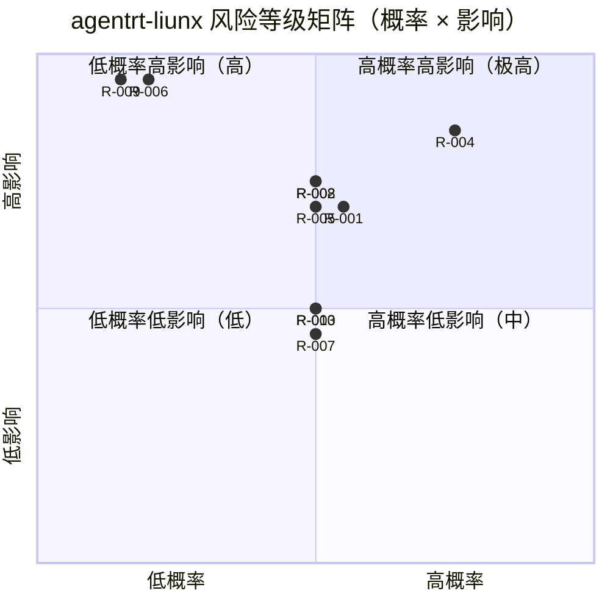
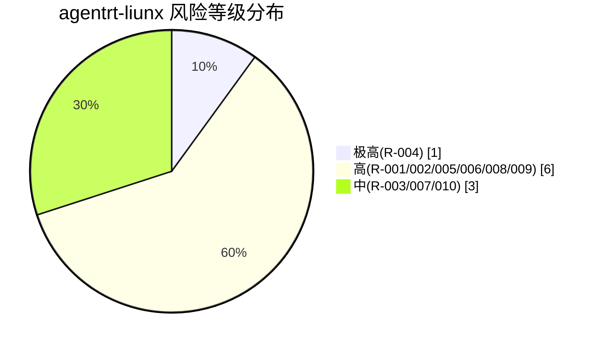
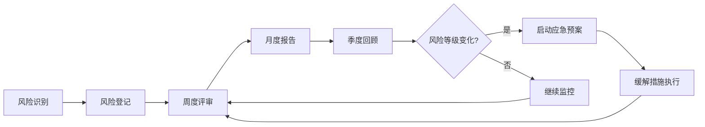

Copyright (c) 2025-2026 SPHARX Ltd. All Rights Reserved.

# agentrt-liunx（AirymaxOS）风险识别与缓解

> **文档定位**: agentrt-liunx（AirymaxOS，极境智能体操作系统）开发详细方案（路线图）模块第 5 文档
> **版本**: 0.1.1（文档体系完成）/ 1.0.1（开发）
> **最后更新**: 2026-07-06
> **同源映射**: agentrt `0.1.1技术全面改进方案v3.0.md`（v4.2，§37 风险登记册）
> **理论根基**: Linux 6.6 内核基线 + Airymax 五维正交 24 原则（体系并行论）
> **核心约束**: IRON-9 同源且部分代码共享（IRON-9 v2）（agentrt 与 agentrt-liunx 架构契合，非代码耦合）

---

## 1. 风险识别总览

### 1.1 风险登记册

agentrt-liunx 1.0.1 开发周期内的 10 项核心风险登记如下：

| 风险 ID | 风险描述 | 概率 | 影响 | 风险等级 | 缓解措施 |
|---------|---------|------|------|---------|---------|
| R-001 | 工程标准与 Linux 内核社区实践脱节 | 中 | 高 | 高 | 持续跟踪 Linux 6.6+ 主线变更 |
| R-002 | 微内核化改造引入性能 regression | 中 | 高 | 高 | 性能基准测试 + 关键路径 C 实现 |
| R-003 | Rust 内核模块稳定性问题 | 中 | 中 | 中 | 仅用于非热路径 + 严格测试 |
| R-004 | 维护者不足导致项目停滞 | 高 | 高 | 极高 | 培养贡献者 + 6 级成熟度模型 |
| R-005 | 同源 agentrt API 漂移 | 中 | 高 | 高 | 季度同步评审 + 兼容性测试 |
| R-006 | ABI 破坏导致用户空间不兼容 | 低 | 极高 | 高 | 强制 ABI 审查 + 6 个月宽限期 |
| R-007 | 文档与代码不同步 | 中 | 中 | 中 | 文档即代码 + CI 文档构建 |
| R-008 | 测试覆盖率不足 | 中 | 高 | 高 | 强制 ≥80% 覆盖率 + fault injection |
| R-009 | 安全漏洞（capability 绕过） | 低 | 极高 | 高 | 安全审计 + LSM 集成 + 形式化验证 |
| R-010 | 性能瓶颈未识别 | 中 | 中 | 中 | ftrace + perf + eBPF 持续监控 |

### 1.2 风险等级分布

| 风险等级 | 数量 | 风险 ID |
|---------|------|---------|
| 极高 | 1 | R-004 |
| 高 | 6 | R-001, R-002, R-005, R-006, R-008, R-009 |
| 中 | 3 | R-003, R-007, R-010 |
| 低 | 0 | — |
| **总计** | **10** | — |

### 1.3 风险管理原则

1. **E-1 安全内生**——安全风险（R-009）必须前置到设计阶段，非事后补救
2. **E-6 错误可追溯**——所有风险事件必须留下追溯链（RFC + Fixes + Signed-off-by）
3. **S-1 反馈闭环**——周度风险评审 + 月度风险报告 + 季度风险回顾
4. **S-4 涌现性管理**——风险缓冲（340h）用于抑制延期传染
5. **A-4 完美主义**——P0 不可妥协；高风险（R-004/R-006/R-009）必须降至中以下才可发布

---

## 2. 详细风险分析

### 2.1 R-001：工程标准与 Linux 内核社区实践脱节

- **风险描述**：agentrt-liunx 工程标准（OS-IRON / OS-STD / OS-BAN）若未持续跟踪 Linux 6.6+ 主线变更，可能与内核社区实践脱节，导致补丁无法回流通线。
- **触发条件**：
  1. Linux 6.6 LTS 在 1.0.1 周期内发生重大主线变更（如 EEVDF 调度器参数调整）
  2. 工程标准未季度同步社区实践
  3. 社区贡献者提交补丁时发现规则冲突
- **影响范围**：Part 1 工程标准 + 全部下游 Part；影响维护者层级制度可信度
- **缓解措施**：
  1. 持续跟踪 Linux 6.6+ 主线变更（每周一次社区邮件列表扫描）
  2. 季度同步评审工程标准与社区实践对齐
  3. 维护者层级制度对接 Linux 内核 MAINTAINERS 模型
- **应急预案**：发现脱节时，启动紧急 RFC 流程，48 小时内更新工程标准并通知全部下游 Part
- **责任人**：总架构师 + 内核社区顾问
- **风险等级**：高（概率中 × 影响高）

### 2.2 R-002：微内核化改造引入性能 regression

- **风险描述**：airymaxos-kernel 微内核化改造（用户态服务化 + IPC 消息传递）可能在热路径引入性能 regression，违反"不破坏用户空间"原则的延伸——不破坏性能基线。
- **触发条件**：
  1. IPC 消息传递开销过大（>10% 性能下降）
  2. 用户态服务化导致上下文切换增加
  3. Rust 模块在热路径引入额外开销
- **影响范围**：Part 2 架构与内核基线 + Part 9 性能工程；影响 1.0.1 投产
- **缓解措施**：
  1. 性能基准测试前置——每个里程碑必须通过性能基线（OS-ACC-101~110）
  2. 关键路径 C 实现——热路径（调度、内存、IPC）强制用 C，禁用 Rust
  3. ftrace + perf + eBPF 持续监控——任何 regression 立即告警
  4. 14% 缓冲工时可用于性能优化
- **应急预案**：发现 regression 时，回退到上一个通过性能基线的版本，48 小时内定位根因并修复
- **责任人**：内核工程师 + 性能工程师
- **风险等级**：高（概率中 × 影响高）

### 2.3 R-003：Rust 内核模块稳定性问题

- **风险描述**：Rust 内核模块（用于安全策略、文件系统解析等安全敏感但非热路径子系统）可能因 Rust ABI 不稳定、bindgen 边界错误等问题引入稳定性风险。
- **触发条件**：
  1. Rust 内核模块 ABI 与 Linux 6.6 不兼容
  2. bindgen 生成的 FFI 边界错误
  3. Rust panic 在内核态处理不当
- **影响范围**：Part 2 架构 + Part 5 安全加固；影响安全模块稳定性
- **缓解措施**：
  1. 仅用于非热路径——Rust 模块限制在安全策略、文件系统解析等非热路径
  2. 严格测试——KUnit + kselftest 覆盖 Rust 模块
  3. panic 禁用——Rust 模块强制 `panic=abort` 并提供恢复路径
  4. bindgen 边界审查——FFI 边界必须显式声明，禁止隐式类型转换
- **应急预案**：发现稳定性问题时，禁用 Rust 模块回退到 C 实现
- **责任人**：内核工程师 + Rust 专家顾问
- **风险等级**：中（概率中 × 影响中）

### 2.4 R-004：维护者不足导致项目停滞

- **风险描述**：agentrt-liunx 核心团队 3-5 人，若维护者层级制度（Lieutenant System）未建立或贡献者培养不足，可能导致项目停滞。这是 agentrt-liunx 最高等级风险。
- **触发条件**：
  1. 核心团队成员流失（关键人员离职或转岗）
  2. 贡献者培养不足，无新维护者接手
  3. 维护者层级制度未落地
- **影响范围**：全部 Part；可能导致 1.0.1 无法投产
- **缓解措施**：
  1. 6 级成熟度模型——每个模块按 6 级成熟度（0-5）演进，避免单点故障
  2. 培养贡献者——每个核心维护者至少培养 1 名副手
  3. 总架构师全程投入（100%）——保证技术决策连续性
  4. 文档即代码——所有决策留痕，新维护者可快速上手
  5. 外部顾问对接 Linux 内核社区——降低单一社区依赖
- **应急预案**：发现项目停滞迹象时，启动紧急贡献者招募 + 与社区合作
- **责任人**：总架构师 + 工程标准委员会
- **风险等级**：极高（概率高 × 影响高）

### 2.5 R-005：同源 agentrt API 漂移

- **风险描述**：agentrt 在 1.0.1 周期内若变更同源 API（MicroCoreRT / AgentsIPC / Cupolas / MemoryRovol / CoreLoopThree 语义），可能导致 agentrt-liunx 同源实现失配，破坏 IRON-9 同源且部分代码共享（IRON-9 v2）原则。
- **触发条件**：
  1. agentrt 1.0.1 修订同源 API 语义
  2. 季度同步评审未发现漂移
  3. 兼容性测试未覆盖同源 API
- **影响范围**：Part 2 架构 + 同源 API 对齐成本增加（消耗缓冲工时）
- **缓解措施**：
  1. 季度同步评审——与 agentrt 季度对齐同源 API 语义
  2. 兼容性测试——airymaxos-tests 必须覆盖同源 API
  3. 同源 API 契约文档——双方维护共同契约文档
  4. 缓冲工时预留——80h 用于同源 API 对齐
- **应急预案**：发现 API 漂移时，启动紧急同步评审，72 小时内决定是 agentrt-liunx 适配还是 agentrt 回退
- **责任人**：总架构师 + agentrt 维护者
- **风险等级**：高（概率中 × 影响高）

### 2.6 R-006：ABI 破坏导致用户空间不兼容

- **风险描述**：agentrt-liunx 用户空间 ABI（系统调用、IOCTL、/sys、/proc 接口）若被破坏，将导致用户空间应用不兼容，违反"不破坏用户空间"原则（K-2 接口契约化）。
- **触发条件**：
  1. 系统调用语义变更（参数、返回值）
  2. /sys 或 /proc 接口格式变更
  3. ABI 审查流程未执行
- **影响范围**：全部用户空间应用；可能导致 1.0.1 投产失败
- **缓解措施**：
  1. 强制 ABI 审查——所有用户空间接口变更必须经过专门 ABI 审查流程
  2. 6 个月宽限期——弃用接口必须声明并保留 6 个月宽限期
  3. 4 层接口稳定性分级——L1（Agent API）极稳定，L4（内部实现）完全自由
  4. ABI 兼容性测试——airymaxos-tests 必须覆盖 ABI 兼容性
- **应急预案**：发现 ABI 破坏时，立即回退到上一个稳定 ABI，启动紧急修复
- **责任人**：总架构师 + 内核工程师
- **风险等级**：高（概率低 × 影响极高）

### 2.7 R-007：文档与代码不同步

- **风险描述**：agentrt-liunx 文档（19 模块 ~140 文档）与代码若不同步，将导致文档失去参考价值，违反 E-7 文档即代码原则。
- **触发条件**：
  1. 代码变更未同步更新文档
  2. CI 未强制文档构建验证
  3. 文档审查未纳入 PR 流程
- **影响范围**：全部文档；影响新贡献者上手与维护者治理
- **缓解措施**：
  1. 文档即代码——所有文档与代码同源演进，PR 必须同步更新文档
  2. CI 文档构建——`make htmldocs` 必须在 CI 中通过
  3. kernel-doc 强制——所有内核函数必须有 kernel-doc 注释
  4. 文档审查纳入 PR 流程——reviewer 必须检查文档同步
- **应急预案**：发现文档与代码不同步时，启动文档同步冲刺（sprint），72 小时内修复
- **责任人**：文档工程师 + 全体维护者
- **风险等级**：中（概率中 × 影响中）

### 2.8 R-008：测试覆盖率不足

- **风险描述**：airymaxos-tests 若测试覆盖率不足（<80%），可能导致 regression 未被发现，违反 E-8 可测试性原则与 K-2 接口契约化原则。
- **触发条件**：
  1. 测试覆盖率 <80%
  2. fault injection 未覆盖关键路径
  3. 形式化验证未覆盖安全敏感路径
- **影响范围**：Part 3 测试体系 + 全部 Part 的质量保障
- **缓解措施**：
  1. 强制 ≥80% 覆盖率——CI 中强制覆盖率门槛，未达标禁止合并
  2. fault injection——关键路径必须覆盖 fault injection 测试
  3. 形式化验证——安全敏感路径（capability、LSM）必须形式化验证
  4. KUnit + kselftest 双重覆盖——单元测试 + 集成测试
- **应急预案**：发现覆盖率不足时，暂停新功能开发，集中补齐测试
- **责任人**：测试工程师 + 全体维护者
- **风险等级**：高（概率中 × 影响高）

### 2.9 R-009：安全漏洞（capability 绕过）

- **风险描述**：agentrt-liunx capability 安全模型若存在绕过漏洞，可能导致权限提升，违反 E-1 安全内生原则。这是 agentrt-liunx 最严重的风险之一。
- **触发条件**：
  1. capability 检查逻辑存在漏洞
  2. LSM 钩子未覆盖所有权限敏感路径
  3. 形式化验证未发现逻辑漏洞
- **影响范围**：Part 5 安全加固 + 全部用户空间应用的安全
- **缓解措施**：
  1. 安全审计——M5 里程碑必须通过外部安全审计
  2. LSM 集成——所有权限敏感路径必须接入 LSM 钩子
  3. 形式化验证——capability 检查逻辑必须形式化验证
  4. 漏洞响应预案——发现漏洞时 24 小时内响应（见 §5.3）
- **应急预案**：发现 capability 绕过漏洞时，立即发布安全补丁，24 小时内全量推送
- **责任人**：安全工程师 + 安全审计顾问
- **风险等级**：高（概率低 × 影响极高）

### 2.10 R-010：性能瓶颈未识别

- **风险描述**：agentrt-liunx 若存在未识别的性能瓶颈，可能导致生产环境性能不达标，违反 E-2 可观测性原则的延伸——性能可观测。
- **触发条件**：
  1. ftrace + perf + eBPF 监控未覆盖关键路径
  2. 性能基准测试未覆盖真实负载
  3. Token 能效未纳入监控
- **影响范围**：Part 9 性能工程 + 1.0.1 投产后的运行性能
- **缓解措施**：
  1. ftrace + perf + eBPF 持续监控——关键路径必须覆盖
  2. 性能基准测试——每个里程碑必须通过性能基线（OS-ACC-101~110）
  3. Token 能效监控——Agent 工作负载的 Token 消耗纳入可观测性
  4. Soak 测试——长时间运行测试识别性能退化
- **应急预案**：发现性能瓶颈时，启动性能优化冲刺，72 小时内定位并优化
- **责任人**：性能工程师 + 可观测性工程师
- **风险等级**：中（概率中 × 影响中）

---

## 3. 风险等级矩阵

### 3.1 风险等级象限图

### 3.2 风险等级判定标准

| 风险等级 | 概率 | 影响 | 判定 |
|---------|------|------|------|
| 极高 | ≥70% | ≥80% | 必须降至中以下才可发布 |
| 高 | 30-70% 或 ≥80% 影响 | 30-80% | 必须有缓解措施 + 应急预案 |
| 中 | 30-70% | 30-80% | 必须有缓解措施 |
| 低 | <30% | <30% | 监控即可 |

### 3.3 风险等级统计

---

## 4. 风险监控机制

### 4.1 周度风险评审

- **频率**：每周一次（周一上午，60 分钟）
- **参与者**：总架构师 + 核心团队 + 相关协作团队
- **议程**：
  1. 上周风险事件回顾（30 分钟）
  2. 本周风险预警（15 分钟）
  3. 风险等级变化评审（15 分钟）
- **产物**：周度风险评审纪要（存档于 `130-roadmap/` 内部）

### 4.2 月度风险报告

- **频率**：每月一次（每月最后一个工作日）
- **参与者**：总架构师 + 工程标准委员会
- **议程**：
  1. 月度风险登记册更新
  2. 风险等级变化趋势分析
  3. 缓解措施有效性评估
  4. 缓冲工时消耗情况
- **产物**：月度风险报告（提交工程标准委员会评审）

### 4.3 季度风险回顾

- **频率**：每季度一次（每季度最后一周）
- **参与者**：总架构师 + 工程标准委员会 + 外部顾问
- **议程**：
  1. 季度风险全量回顾
  2. 风险登记册重构（新增 / 移除 / 调整等级）
  3. 季度同源 API 同步评审（R-005 缓解）
  4. 季度依赖图审查（循环依赖检测）
  5. 缓冲工时季度校准
- **产物**：季度风险回顾报告 + 更新后的风险登记册

### 4.4 风险监控流程

---

## 5. 应急预案

### 5.1 项目停滞预案（R-004）

**触发条件**：核心团队成员流失 ≥1 人，或维护者层级制度未在 M3 前落地。

**应急流程**：

1. **T+0**：总架构师启动紧急贡献者招募
2. **T+24h**：与外部顾问对接，评估短期支援方案
3. **T+72h**：调整 1.0.1 范围，P1（Part 8/9）延后至 1.1.x
4. **T+7d**：完成新维护者招募与 onboarding
5. **T+14d**：恢复原开发节奏，重新评估里程碑

**资源调整**：

- P0 工时不变（不可妥协）
- P1 工时延后（Part 8/9 延后至 1.1.x）
- 缓冲工时消耗增加（预计 200h）

### 5.2 重大 regression 预案（R-002 / R-008）

**触发条件**：性能基线 regression >10%，或测试覆盖率 <80%。

**应急流程**：

1. **T+0**：CI 自动告警，暂停相关 PR 合并
2. **T+4h**：定位 regression 根因（git bisect）
3. **T+24h**：回退到上一个通过性能基线的版本
4. **T+48h**：修复 regression 并重新提交 PR
5. **T+72h**：通过性能基线与测试覆盖率验收

**资源调整**：

- 启动性能优化冲刺（消耗缓冲工时 100h）
- 必要时启用外部顾问支援

### 5.3 安全漏洞响应预案（R-009）

**触发条件**：发现 capability 绕过、LSM 钩子遗漏或其他安全漏洞。

**应急流程**：

1. **T+0**：发现漏洞，立即隔离受影响系统
2. **T+1h**：成立安全响应小组（安全工程师 + 总架构师 + 安全审计顾问）
3. **T+4h**：评估漏洞影响范围与严重程度（CVSS 评分）
4. **T+24h**：发布安全补丁，全量推送至所有受影响系统
5. **T+72h**：发布漏洞分析报告（CVE 编号申请）
6. **T+7d**：完成漏洞复盘，更新工程标准（OS-SEC 规则）

**资源调整**：

- 安全补丁开发优先级最高（其他 PR 暂停）
- 必要时启用安全审计顾问支援

### 5.4 应急预案演练

| 预案 | 演练频率 | 演练场景 |
|------|---------|---------|
| 5.1 项目停滞 | 半年一次 | 模拟核心成员离职 |
| 5.2 重大 regression | 季度一次 | 模拟性能 regression |
| 5.3 安全漏洞 | 季度一次 | 模拟 capability 绕过 |

---

## 6. 五维原则映射

本文档遵循 Airymax 五维正交 24 原则中的以下项：

| 原则 | 在风险识别与缓解中的体现 | 落地章节 |
|------|------------------------|---------|
| **E-1 安全内生** | 安全风险（R-009）前置到设计阶段，非事后补救 | §2.9 + §5.3 |
| **E-6 错误可追溯** | 所有风险事件留下追溯链（RFC + Fixes + Signed-off-by） | §1.3 + §4 |
| **S-1 反馈闭环** | 周度风险评审 + 月度风险报告 + 季度风险回顾 | §4 监控机制 |
| **S-4 涌现性管理** | 风险缓冲（340h）用于抑制延期传染 | §1.3 + §5 |
| **E-8 可测试性** | 测试覆盖率不足（R-008）通过强制 ≥80% 缓解 | §2.8 |
| **K-2 接口契约化** | ABI 破坏（R-006）通过强制 ABI 审查 + 6 个月宽限期缓解 | §2.6 |
| **A-4 完美主义** | P0 不可妥协；高风险必须降至中以下才可发布 | §1.3 |
| **IRON-9 同源且部分代码共享（IRON-9 v2）** | 同源 API 漂移（R-005）通过季度同步评审缓解 | §2.5 |

---

## 7. 风险与资源估算的关系

### 7.1 风险缓冲工时分配

340h 风险缓冲工时（见 03-resource-estimation.md §6.1）按风险等级分配如下：

| 风险等级 | 缓冲工时分配 | 主要消耗场景 |
|---------|------------|-------------|
| 极高（R-004） | 100h | 项目停滞应急预案 + 贡献者招募 |
| 高（R-001/002/005/006/008/009） | 180h | regression 修复 + 安全漏洞响应 + API 同步 |
| 中（R-003/007/010） | 60h | 文档同步 + Rust 模块稳定性 + 性能优化 |

### 7.2 缓冲消耗监控

缓冲工时消耗情况每月报告，若消耗 >50% 则触发以下动作：

- 重新评估剩余风险等级
- 调整 P1 范围（Part 8/9 可能延后）
- 必要时申请额外资源

---

## 8. 相关文档

### 8.1 本模块内部

- `README.md` — 路线图主索引与总纲
- `01-development-strategy.md` — 开发策略与三大支柱详解
- `02-milestones-and-timeline.md` — 里程碑与时间线
- `03-resource-estimation.md` — 资源估算（含 340h 风险缓冲）
- `04-dependency-graph.md` — 依赖关系图（含依赖断裂风险）
- `06-acceptance-criteria.md` — 验收标准与质量门禁（OS-ACC 编号体系）

### 8.2 同源 Airymax 文档

- `docs/ARCHITECTURAL_PRINCIPLES.md` — 五维正交 24 原则
- IRON-9 v2 工程铁律（闭源内部参考） — 17 类规则编号体系（v28.0，含 IRON-9）
- 内部工程改进方案（闭源） — agentrt 三大支柱方案（v4.2，§37 风险登记册）

### 8.3 agentrt-liunx 工程标准

- `50-engineering-standards/README.md` — 工程标准主框架
- `50-engineering-standards/06-toolchain-and-automation.md` — 工具链与自动化（7 层验证）
- `50-engineering-standards/07-maintainers-and-governance.md` — 维护者制度与治理（6 级成熟度模型）

---

## 9. 文档版本与维护

- **当前版本**: v1.0（2026-07-06）
- **维护者**: agentrt-liunx 工程标准委员会（待成立，详见 50-engineering-standards/07-maintainers-and-governance.md）
- **变更流程**: 任何风险登记册变更必须经过周度/月度/季度评审流程
- **回顾周期**: 周度评审 + 月度报告 + 季度回顾 + 年度大版本校准

---

> **文档结束** | 共 9 节 | Linux 6.6 内核基线 + 五维正交 24 原则 + IRON-9 同源且部分代码共享（IRON-9 v2） | 10 项核心风险 + 风险等级矩阵 + 3 套应急预案
