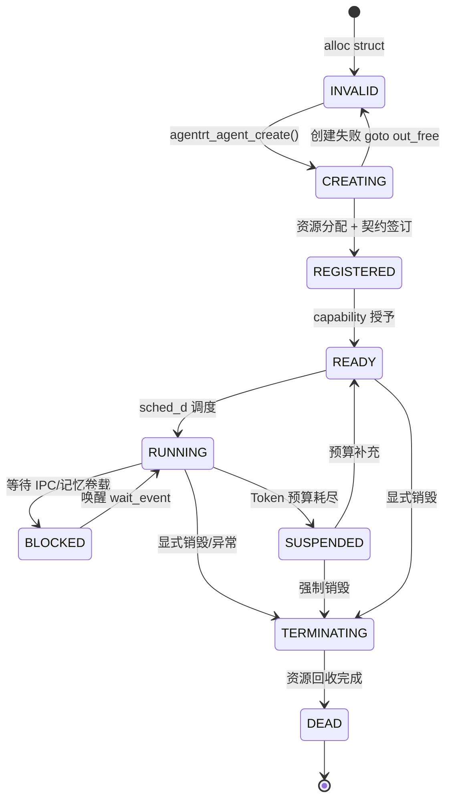

Copyright (c) 2025-2026 SPHARX Ltd. All Rights Reserved.

# Agent 生命周期管理设计

> **文档定位**: agentrt-liunx（AirymaxOS，极境智能体操作系统）Agent 应用开发体系核心子文档，定义 Agent 从创建到销毁的完整生命周期管理模型
> **版本**: 0.1.1（文档体系完成）/ 1.0.1（开发）
> **最后更新**: 2026-07-09
> **理论根基**: Linux 6.6 内核基线工程思想 + seL4 微内核设计思想 + Airymax 体系并行论
> **SPDX-License-Identifier**: AGPL-3.0-or-later OR Apache-2.0
> **同源映射**: agentrt 用户态运行时 Agent 生命周期模型（IRON-9 v2 [SS] 语义同源层）
> **IRON-9 v2 层次**: [SS] 语义同源层（API 签名同源，实现独立——agentrt-liunx 基于 sched_ext + capability 内核态，agentrt 基于用户态进程模型）

---

## 1. 设计目标与原则

### 1.1 设计目标

agentrt-liunx（AirymaxOS）作为智能体操作系统发行版，将 Agent 视为运行时租户而非传统应用程序。Agent 生命周期管理需达成以下工程目标：

1. **契约化创建**：Agent 创建即签订资源契约，Token 预算、CPU 配额、内存上限在创建时声明并由内核强制
2. **租户级隔离**：每个 Agent 受 cgroup v2 + Landlock + capability 三重隔离，禁止越权访问其他 Agent 资源
3. **认知阶段感知调度**：Agent 生命周期阶段（认知/执行/记忆）实时反馈给 SCHED_AGENT，获得差异化调度优先级
4. **优雅销毁**：销毁过程保证记忆卷载持久化完成、IPC 通道优雅关闭、租户资源全部回收
5. **可观测全链路**：TraceID 贯穿生命周期全程，每个状态转移可审计可追溯

### 1.2 五维原则映射

| 原则 | 在生命周期管理中的体现 |
|------|------------------------|
| K-2 接口契约化 | Token 预算契约 + 资源配额契约在创建时签订 |
| K-3 服务隔离 | cgroup v2 + Landlock + capability 三重租户隔离 |
| S-1 反馈闭环 | 认知阶段状态实时反馈调度器 |
| E-3 资源确定性 | 销毁过程保证资源全部回收（无泄漏） |
| E-6 错误可追溯 | 每个生命周期事件携带 TraceID |
| E-8 可测试性 | 状态机可注入测试用例验证 |

### 1.3 与 agentrt 同源关系

agentrt 用户态运行时的 Agent 生命周期模型与本设计遵循 IRON-9 v2 [SS] 语义同源层：

| 维度 | agentrt（微核心） | agentrt-liunx（微内核） |
|------|-------------------|------------------------|
| 创建 API | `agentrt_agent_create()` | `agentrt_agent_create()`（同源签名） |
| 隔离机制 | 进程级 + 用户态沙箱 | cgroup v2 + Landlock + capability |
| 调度 | 用户态调度器 | SCHED_AGENT（sched_ext + eBPF） |
| 通信 | 用户态消息队列 | AgentsIPC（io_uring 零拷贝） |
| 持久化 | HeapStore | MemoryRovol（CXL + MGLRU） |

两端 API 签名完全一致，但实现独立——这是 IRON-9 v2 [SS] 层的核心特征。

---

## 2. 生命周期状态机

### 2.1 状态定义

Agent 生命周期由 9 个状态构成，状态转移严格受内核状态机控制：

```c
/* include/uapi/agentrt/lifecycle.h（IRON-9 v2 [SC] 共享契约层） */
enum agentrt_agent_state {
	AGENTRT_AGENT_STATE_INVALID    = 0,  /* 未初始化 */
	AGENTRT_AGENT_STATE_CREATING   = 1,  /* 创建中：分配资源 */
	AGENTRT_AGENT_STATE_REGISTERED = 2,  /* 已注册：契约已签订 */
	AGENTRT_AGENT_STATE_READY      = 3,  /* 就绪：可被调度 */
	AGENTRT_AGENT_STATE_RUNNING    = 4,  /* 运行中：认知循环激活 */
	AGENTRT_AGENT_STATE_BLOCKED    = 5,  /* 阻塞：等待 IPC/IO */
	AGENTRT_AGENT_STATE_SUSPENDED  = 6,  /* 挂起：预算耗尽或显式挂起 */
	AGENTRT_AGENT_STATE_TERMINATING = 7,  /* 终止中：清理资源 */
	AGENTRT_AGENT_STATE_DEAD       = 8,  /* 已销毁：资源已回收 */
};
```

### 2.2 状态转移图



### 2.3 状态转移规则

| 当前状态 | 允许转移至 | 触发条件 | 执行者 |
|----------|-----------|----------|--------|
| CREATING | REGISTERED | 资源分配成功 + 契约签订 | 内核 `agentrt_core` |
| CREATING | INVALID | 资源分配失败 | 内核（goto out_free） |
| REGISTERED | READY | capability 令牌授予 | Cupolas |
| READY | RUNNING | sched_d 调度决策 | SCHED_AGENT |
| RUNNING | BLOCKED | IPC recv / 记忆卷载 I/O | io_uring 完成回调 |
| BLOCKED | RUNNING | IPC 消息到达 / I/O 完成 | `wake_up_interruptible` |
| RUNNING | SUSPENDED | Token 预算耗尽 | MicroCoreRT |
| SUSPENDED | READY | 预算补充（手动/定时） | Cupolas 审计通过 |
| RUNNING/READY/SUSPENDED | TERMINATING | `agentrt_agent_destroy()` / 致命错误 | 内核 |
| TERMINATING | DEAD | 资源回收完成 | 内核 |

---

## 3. 创建与注册流程

### 3.1 创建时序

Agent 创建是一个多阶段原子操作，任一阶段失败均触发回滚：

```
用户态 SDK -> syscall(AGENTRT_SYS_AGENT_CREATE)
   -> [1] 内核分配 agentrt_agent_t 结构（kzalloc）
   -> [2] 分配 agent_id（idr_alloc）
   -> [3] 创建 cgroup（/sys/fs/cgroup/agent/<agent_id>）
   -> [4] 应用 Landlock 规则
   -> [5] 授予 capability 令牌（Cupolas 审计）
   -> [6] 签订 Token 预算契约
   -> [7] 初始化 IPC 通道（io_uring 注册）
   -> [8] 挂载 MemoryRovol 卷（如声明）
   -> [9] 状态置为 REGISTERED
   -> 返回 agent_id
```

任一步骤失败，通过 `goto out_free_xxx` 模式回滚已分配资源。

### 3.2 Token 预算契约

Token 预算契约是 agentrt-liunx 独创的资源契约机制，在 Agent 创建时签订：

```c
/* include/uapi/agentrt/contract.h（IRON-9 v2 [SC] 共享契约层） */
struct agentrt_token_budget_contract {
	uint64_t total_budget;        /* 总 Token 预算 */
	uint64_t per_request_limit;  /* 单次请求上限 */
	uint64_t refill_rate;         /* 补充速率（tokens/秒） */
	uint32_t window_seconds;      /* 补充窗口（秒） */
	uint32_t burst_allowance;    /* 突发额度 */
	enum agentrt_budget_policy policy;  /* 超额策略 */
};

enum agentrt_budget_policy {
	AGENTRT_BUDGET_POLICY_THROTTLE = 0,  /* 降级：调度优先级降低 */
	AGENTRT_BUDGET_POLICY_SUSPEND = 1,   /* 挂起：状态转 SUSPENDED */
	AGENTRT_BUDGET_POLICY_HARD_FAIL = 2, /* 硬失败：销毁 Agent */
};
```

### 3.3 租户隔离机制

三重隔离在创建阶段配置：

```c
struct agentrt_tenant_isolation {
	/* cgroup v2 配置 */
	char cgroup_path[256];       /* /sys/fs/cgroup/agent/<id> */
	uint64_t cpu_max;            /* CPU 配额（微秒/秒） */
	uint64_t memory_max;         /* 内存上限（字节） */
	uint64_t pids_max;           /* 子进程上限 */

	/* Landlock 规则 */
	struct landlock_ruleset_attr landlock_attr;

	/* capability 集合 */
	uint64_t permitted_caps;     /* 允许的能力位图 */
	uint64_t inheritable_caps;   /* 可继承的能力位图 */
};
```

---

## 4. 完整生命周期示例（C 代码）

### 4.1 头文件与数据结构

```c
/* agent_lifecycle_demo.c */
#include <linux/kernel.h>
#include <linux/slab.h>
#include <linux/idr.h>
#include <linux/atomic.h>
#include <linux/wait.h>
#include <linux/kfifo.h>
#include <linux/cgroup.h>
#include <linux/landlock.h>
#include <uapi/agentrt/syscall.h>
#include <uapi/agentrt/lifecycle.h>
#include <uapi/agentrt/contract.h>
#include <uapi/agentrt/ipc.h>
#include <uapi/agentrt/error.h>

/* Agent 实例结构（内核态） */
struct agentrt_agent {
	uint32_t agent_id;
	enum agentrt_agent_state state;
	atomic64_t refcnt;
	struct agentrt_token_budget_contract budget;
	struct agentrt_tenant_isolation isolation;

	/* IPC 通道（kthread 间通信：kfifo + wait_event_interruptible） */
	DECLARE_KFIFO(ipc_rx_fifo, struct agentrt_ipc_msg_hdr_t, 64);
	wait_queue_head_t ipc_wq;

	/* MemoryRovol 卷句柄 */
	void *memoryrovol_handle;

	/* capability 令牌 */
	uint64_t capability_token;

	/* TraceID 链路追踪 */
	uint64_t trace_id;
	spinlock_t state_lock;
};

static DEFINE_IDR(agent_idr);
static DEFINE_SPINLOCK(agent_idr_lock);
```

### 4.2 创建函数（含 goto 集中错误处理）

```c
/**
 * agentrt_agent_create - 创建并注册一个 Agent 租户
 * @config: Agent 配置（预算 + 隔离 + 记忆卷载声明）
 * @trace_id: 链路追踪 ID
 *
 * 返回: 成功返回 agent_id（>0），失败返回负错误码
 *
 * 实现遵循 IRON-9 v2 [SS] 语义同源层——API 签名与 agentrt
 * 用户态运行时一致，但本实现为 OS 级（内核态）。
 */
int agentrt_agent_create(const struct agentrt_agent_config *config,
			 uint64_t trace_id)
{
	struct agentrt_agent *agent = NULL;
	int agent_id;
	int ret;

	if (!config || config->budget.total_budget == 0)
		return -AGENTRT_EINVAL;

	/* [1] 分配 agent 结构（kzalloc 保证零初始化） */
	agent = kzalloc(sizeof(*agent), GFP_KERNEL);
	if (!agent)
		return -AGENTRT_ENOMEM;

	agent->state = AGENTRT_AGENT_STATE_CREATING;
	atomic64_set(&agent->refcnt, 1);
	agent->trace_id = trace_id;
	spin_lock_init(&agent->state_lock);
	init_waitqueue_head(&agent->ipc_wq);
	INIT_KFIFO(agent->ipc_rx_fifo);

	/* [2] 分配 agent_id（idr 分配，保证全局唯一） */
	idr_preload(GFP_KERNEL);
	spin_lock(&agent_idr_lock);
	agent_id = idr_alloc(&agent_idr, agent, 1, INT_MAX, GFP_NOWAIT);
	spin_unlock(&agent_idr_lock);
	idr_preload_end();
	if (agent_id < 0) {
		ret = agent_id;
		goto out_free_agent;
	}
	agent->agent_id = agent_id;

	/* [3] 创建 cgroup（/sys/fs/cgroup/agent/<id>） */
	ret = agentrt_cgroup_create(agent, config->isolation.cpu_max,
				    config->isolation.memory_max,
				    config->isolation.pids_max);
	if (ret)
		goto out_free_idr;

	/* [4] 应用 Landlock 规则（文件系统访问限制） */
	ret = agentrt_landlock_apply(agent, &config->isolation.landlock_attr);
	if (ret)
		goto out_free_cgroup;

	/* [5] Cupolas 审计 + 授予 capability 令牌 */
	ret = cupolas_capability_grant(agent, config->isolation.permitted_caps,
				       &agent->capability_token);
	if (ret)
		goto out_free_landlock;

	/* [6] 签订 Token 预算契约 */
	ret = agentrt_budget_contract_sign(agent, &config->budget);
	if (ret)
		goto out_free_cap;

	/* [7] 初始化 IPC 通道（io_uring 注册固定 OP 码） */
	ret = agentrt_ipc_channel_init(agent);
	if (ret)
		goto out_free_budget;

	/* [8] 挂载 MemoryRovol 卷（如声明） */
	if (config->memoryrovol.enabled) {
		ret = agentrt_memoryrov_mount(agent,
					      config->memoryrovol.layers);
		if (ret)
			goto out_free_ipc;
	}

	/* [9] 状态转 REGISTERED */
	spin_lock(&agent->state_lock);
	agent->state = AGENTRT_AGENT_STATE_REGISTERED;
	spin_unlock(&agent->state_lock);

	pr_info("agentrt: agent %u created, trace_id=0x%llx\n",
		agent_id, trace_id);
	return agent_id;

out_free_ipc:
	agentrt_ipc_channel_destroy(agent);
out_free_budget:
	agentrt_budget_contract_revoke(agent);
out_free_cap:
	cupolas_capability_revoke(agent->capability_token);
out_free_landlock:
	agentrt_landlock_revoke(agent);
out_free_cgroup:
	agentrt_cgroup_destroy(agent);
out_free_idr:
	spin_lock(&agent_idr_lock);
	idr_remove(&agent_idr, agent_id);
	spin_unlock(&agent_idr_lock);
out_free_agent:
	kfree(agent);
	return ret;
}
```

### 4.3 调度与运行

```c
/**
 * agentrt_agent_run - 调度 Agent 进入运行态
 * @agent_id: Agent 标识
 *
 * 状态转移：READY -> RUNNING
 * 触发 SCHED_AGENT 调度类接管
 */
int agentrt_agent_run(int agent_id)
{
	struct agentrt_agent *agent;
	int ret = 0;

	rcu_read_lock();
	agent = idr_find(&agent_idr, agent_id);
	if (!agent) {
		rcu_read_unlock();
		return -AGENTRT_ENOENT;
	}
	if (!agentrt_agent_get(agent)) {
		rcu_read_unlock();
		return -AGENTRT_EBUSY;
	}
	rcu_read_unlock();

	spin_lock(&agent->state_lock);
	if (agent->state != AGENTRT_AGENT_STATE_READY) {
		ret = -AGENTRT_EINVAL;
		spin_unlock(&agent->state_lock);
		goto out_put;
	}
	agent->state = AGENTRT_AGENT_STATE_RUNNING;
	spin_unlock(&agent->state_lock);

	/* 提交至 SCHED_AGENT 调度类 */
	ret = agentrt_sched_agent_submit(agent);
	if (ret)
		goto out_revert_state;

	return 0;

out_revert_state:
	spin_lock(&agent->state_lock);
	agent->state = AGENTRT_AGENT_STATE_READY;
	spin_unlock(&agent->state_lock);
out_put:
	agentrt_agent_put(agent);
	return ret;
}
```

### 4.4 销毁流程

```c
/**
 * agentrt_agent_destroy - 销毁 Agent，回收全部资源
 * @agent_id: 待销毁的 Agent 标识
 *
 * 状态转移：* -> TERMINATING -> DEAD
 * 保证 MemoryRovol 持久化完成、IPC 优雅关闭、资源全部回收
 */
int agentrt_agent_destroy(int agent_id)
{
	struct agentrt_agent *agent;
	enum agentrt_agent_state old;

	rcu_read_lock();
	agent = idr_find(&agent_idr, agent_id);
	if (!agent) {
		rcu_read_unlock();
		return -AGENTRT_ENOENT;
	}
	if (!agentrt_agent_get(agent)) {
		rcu_read_unlock();
		return -AGENTRT_EBUSY;
	}
	rcu_read_unlock();

	/* 状态转 TERMINATING（防止重入） */
	spin_lock(&agent->state_lock);
	if (agent->state == AGENTRT_AGENT_STATE_TERMINATING ||
	    agent->state == AGENTRT_AGENT_STATE_DEAD) {
		spin_unlock(&agent->state_lock);
		agentrt_agent_put(agent);
		return -AGENTRT_EBUSY;
	}
	old = agent->state;
	agent->state = AGENTRT_AGENT_STATE_TERMINATING;
	spin_unlock(&agent->state_lock);

	/* 若运行中，先优雅停止 */
	if (old == AGENTRT_AGENT_STATE_RUNNING)
		agentrt_sched_agent_stop(agent);

	/* 唤醒所有阻塞的等待者 */
	wake_up_interruptible_all(&agent->ipc_wq);

	/* 1. 持久化 MemoryRovol（保证记忆不丢失） */
	if (agent->memoryrovol_handle)
		agentrt_memoryrov_flush_and_unmount(agent);

	/* 2. 优雅关闭 IPC 通道 */
	agentrt_ipc_channel_drain(agent);
	agentrt_ipc_channel_destroy(agent);

	/* 3. 撤销 Token 预算契约 */
	agentrt_budget_contract_revoke(agent);

	/* 4. 撤销 capability */
	cupolas_capability_revoke(agent->capability_token);

	/* 5. 撤销 Landlock */
	agentrt_landlock_revoke(agent);

	/* 6. 销毁 cgroup */
	agentrt_cgroup_destroy(agent);

	/* 7. 从 idr 移除 */
	spin_lock(&agent_idr_lock);
	idr_remove(&agent_idr, agent_id);
	spin_unlock(&agent_idr_lock);

	/* 状态转 DEAD */
	spin_lock(&agent->state_lock);
	agent->state = AGENTRT_AGENT_STATE_DEAD;
	spin_unlock(&agent->state_lock);

	pr_info("agentrt: agent %u destroyed, trace_id=0x%llx\n",
		agent_id, agent->trace_id);

	agentrt_agent_put(agent);  /* 创建时获取的引用 */
	agentrt_agent_put(agent);  /* 本函数获取的引用 */
	return 0;
}
```

---

## 5. Token 预算执行期管理

### 5.1 预算检查点

Token 预算在以下认知阶段检查点被扣减：

| 阶段 | 检查点 | 扣减来源 |
|------|--------|----------|
| Cognition.Engine 解析 | 输入 Token 计数完成 | 输入 Token 数 |
| LLM 推理 | 输出 Token 流式生成 | 输出 Token 数 |
| Memory 检索 | 向量检索 + BM25 | 检索 Token 等价折算 |
| 反思调整 | 元认知触发 | 反思 Token 折算 |

### 5.2 预算耗尽处理

```c
int agentrt_budget_consume(struct agentrt_agent *agent, uint64_t tokens)
{
	struct agentrt_token_budget_contract *c = &agent->budget;
	int64_t remaining;

	/* 原子扣减（内核态禁用 float，用 Q16.16 定点数 airymax_q16_t 折算突发额度） */
	remaining = atomic64_sub_return(tokens, &agent->budget_used);
	if (remaining >= 0)
		return 0;  /* 预算充足 */

	switch (c->policy) {
	case AGENTRT_BUDGET_POLICY_THROTTLE:
		/* 降级：SCHED_AGENT 优先级降低 */
		agentrt_sched_agent_throttle(agent);
		return -AGENTRT_EBUDGET_THROTTLE;
	case AGENTRT_BUDGET_POLICY_SUSPEND:
		/* 挂起：状态转 SUSPENDED */
		agentrt_agent_suspend(agent);
		return -AGENTRT_EBUDGET_SUSPEND;
	case AGENTRT_BUDGET_POLICY_HARD_FAIL:
		/* 硬失败：触发销毁 */
		agentrt_agent_destroy(agent->agent_id);
		return -AGENTRT_EBUDGET_EXHAUSTED;
	}
	return -AGENTRT_EINVAL;
}
```

---

## 6. 与 agentrt 同源的运行时互操作

### 6.1 跨运行时迁移

agentrt 用户态运行时的 Agent 可平滑迁移至 agentrt-liunx：

| 迁移场景 | 机制 | 兼容性 |
|----------|------|--------|
| agentrt -> agentrt-liunx | SDK 检测到 OS 级能力，自动切换至 syscall 路径 | 完全兼容 |
| agentrt-liunx -> agentrt | SDK 降级至用户态消息队列 | 功能受限（无 SCHED_AGENT） |

### 6.2 双向兼容保证

由于 IRON-9 v2 [SS] 层 API 签名同源，Agent 应用代码无需修改即可在两端运行。SDK 在运行时检测宿主环境：

```c
/* SDK 内部实现（伪代码） */
int agentrt_cognition_process(struct agentrt_cognition_req *req)
{
	if (agentrt_host_is_airymaxos()) {
		/* OS 级路径：syscall */
		return syscall(AGENTRT_SYS_COGNITION_PROCESS, req);
	}
	/* 用户态路径：通过 AgentsIPC 调用 llm_d */
	return agentrt_ipc_call(LLM_DAEMON_ID, "process", req);
}
```

---

## 7. 测试与验证

### 7.1 生命周期测试矩阵

| 测试用例 | 验证目标 | 预期结果 |
|----------|----------|----------|
| 正常创建销毁 | 资源全部回收 | DEAD 后 idr 无残留 |
| 创建中失败回滚 | goto out_free 模式 | 各阶段资源均释放 |
| 双重销毁 | 重入保护 | 第二次返回 -EBUSY |
| 预算耗尽挂起 | SUSPEND 状态转移 | Agent 挂起且记忆保留 |
| 预算耗尽硬失败 | HARD_FAIL 销毁 | Agent 被强制销毁 |
| 销毁中 IPC 等待者 | wake_up_all 唤醒 | 所有阻塞者收到 -ESHUTDOWN |

### 7.2 资源泄漏检测

通过 kmemleak + cgroup 内存统计双重验证销毁后无资源泄漏：

```bash
# 启用 kmemleak
echo scan | sudo tee /sys/kernel/debug/kmemleak

# 运行 1000 次创建销毁循环
./test_agent_lifecycle --iterations=1000

# 检查泄漏
cat /sys/kernel/debug/kmemleak
```

---

## 8. 相关文档

- `140-application-development/README.md`（应用开发主索引）
- `140-application-development/02-sdk-integration.md`（SDK 集成设计）
- `140-application-development/03-agent-orchestration.md`（Agent 编排设计）
- `30-interfaces/01-syscalls.md`（系统调用接口）
- `110-security/README.md`（Cupolas 安全穹顶）
- `170-performance/README.md`（生命周期性能调优）

---

## 9. 参考材料

- Linux 6.6 `kernel/cgroup/cgroup.c`（cgroup v2 实现）
- Linux 6.6 `security/landlock/`（Landlock 安全模块）
- seL4 项目（capability 系统设计参考）
- Linux 6.6 `Documentation/admin-guide/cgroup-v2.rst`
- Linux 6.6 `include/linux/idr.h`（IDR 分配器）
- agentrt 用户态运行时 Agent 生命周期规范（IRON-9 v2 [SS] 同源）

---

> **文档结束** | agentrt-liunx（AirymaxOS）Agent 生命周期管理设计 v0.1.1
> 遵循 IRON-9 v2 [SS] 语义同源层与 agentrt 用户态运行时同源
