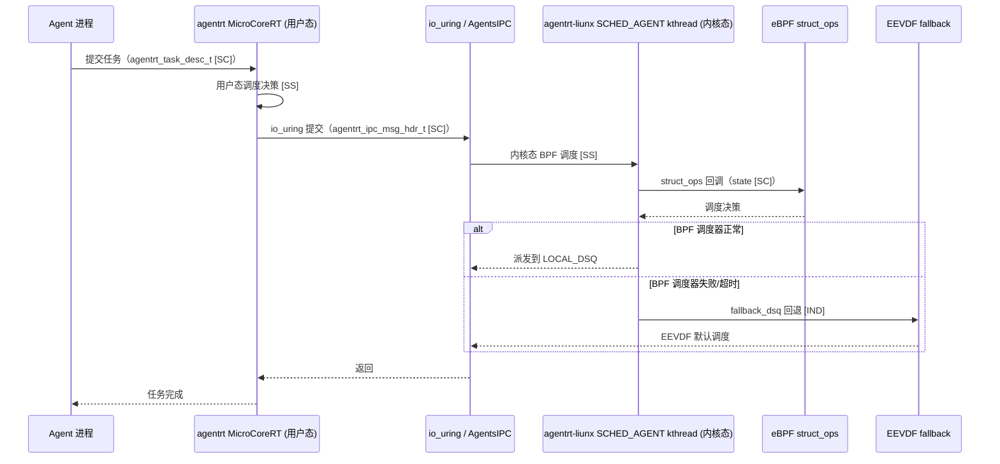
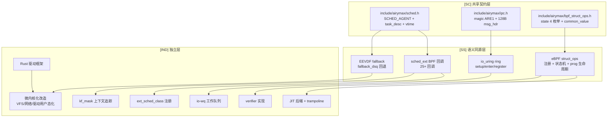

Copyright (c) 2025-2026 SPHARX Ltd. All Rights Reserved.

# agentrt-liunx（AirymaxOS）内核设计文档（airymaxos-kernel，极境内核）

> **子仓编号**：01
> **子仓代号**：极境内核（Airymax Kernel）
> **文档版本**：v1.1（2026-07-07）
> **设计基准**：Linux 6.6 内核基线 + 微内核化改造 + sched_ext + io_uring + eBPF
> **同源 agentrt**：atoms/corekern（MicroCoreRT）
> **核心约束**：IRON-9 v2 同源且部分代码共享——与 agentrt 用户态 atoms/corekern 通过 [SC] 共享契约层 + [SS] 语义同源层协作，[IND] 内核态 sched_ext/io_uring/eBPF/Rust 实现独立
> **横切关注点**：内核是横切关注点（cross-cutting concern），贯穿调度、IPC、eBPF、记忆卷载 4 大数据流，提供机制骨架

---

## 目录

- [1. 子仓职责](#1-子仓职责)
- [2. 同源关系（IRON-9 v2 三层共享模型）](#2-同源关系iron-9-v2-三层共享模型)
- [3. 目录结构](#3-目录结构)
- [4. 核心特性](#4-核心特性)
- [5. 微内核思想体现](#5-微内核思想体现)
- [6. IRON-9 v2 三层共享模型落地](#6-iron-9-v2-三层共享模型落地)
- [7. agentrt-liunx 工程基线](#7-agentrt-liunx-工程基线)
- [8. 前沿理论参考](#8-前沿理论参考)
- [9. 与其他子仓的协作](#9-与其他子仓的协作)
- [10. 里程碑（M1-M6）](#10-里程碑m1-m6)
- [11. agentrt 一致性检查](#11-agentrt-一致性检查)
- [12. 相关文档](#12-相关文档)
- [13. 参考](#13-参考)

---

## 1. 子仓职责

`airymaxos-kernel` 是 agentrt-liunx（AirymaxOS）的内核子仓，承担以下核心职责：

1. **Linux 6.6 内核维护 [IND]**：基于 Linux 6.6 内核基线，保持与上游社区同步演进，遵循 agentrt-liunx 多版本内核策略。
2. **微内核化改造 [IND]**：在保留 Linux 6.6 完整能力的前提下，遵循 Liedtke minimality principle，将 VFS、网络栈、设备驱动等子系统逐步用户态化，最小化特权态代码体积。
3. **Agent 感知调度（sched_ext）[SS]**：通过 sched_ext（agentrt-liunx 内核增强，主线 6.12+ 引入并持续演进）实现 SCHED_AGENT 调度类，允许 eBPF 程序在用户态定义调度策略。任务描述符与优先级语义 [SC] 与 agentrt 共享。
4. **高性能 IPC 基础（io_uring）[SS]**：基于 io_uring（2026 已成为默认高性能 I/O 路径）构建零 syscall、零拷贝的消息传递基础设施。IPC 消息头与操作码语义 [SC] 与 agentrt 共享。
5. **eBPF 可编程扩展 [SS]**：提供 struct_ops 注册机制 + kfunc 扩展 + ringbuf 上报，可观测/网络/安全/调度均可通过 eBPF 编程。struct_ops 状态机与 common_value 布局 [SC] 与 agentrt 共享。
6. **Rust 安全驱动 [IND]**：依托 Linux 6.6 中 Rust 实验性支持（持续演进中），构建安全驱动开发框架。
7. **同源传承 [SS]**：从 agentrt 的 atoms/corekern（MicroCoreRT）继承实时性与微内核化设计思想。

### 1.1 横切关注点声明

内核是横切关注点（cross-cutting concern），机制骨架贯穿 agentrt-liunx 全部 4 大数据流：

| 数据流 | 内核切入点 | 同源标注 |
|--------|-----------|----------|
| 调度数据流 | sched_ext BPF 调度类 + SCHED_AGENT + sub-scheduler | [SS] |
| IPC 数据流 | io_uring 零拷贝 ring + registered buffer + MSG_RING | [SS] |
| eBPF 数据流 | struct_ops 注册 + kfunc + ringbuf + verifier | [SS] |
| 记忆卷载数据流 | userfaultfd + MGLRU + CXL bus（与 airymaxos-memory 协作） | [IND] |

---

## 2. 同源关系（IRON-9 v2 三层共享模型）

依据 IRON-9 v2 决策，agentrt（用户态 atoms/corekern）与 agentrt-liunx（内核态 airymaxos-kernel）通过三层共享模型协作：

| 层次 | 共享程度 | 内核子系统内容 | 组织方式 |
|------|---------|---------------|---------|
| **[SC] 共享契约层** | 完全共享代码 | SCHED_AGENT 调度类编号、任务描述符（magic 0x41475453 'AGTS'）、vtime 类型与衰减公式、优先级范围、AIRYMAX_SLICE_DFL；IPC magic（0x41524531 'ARE1'）、128B 消息头、SQE/CQE 操作码与标志位；struct_ops 状态机 4 状态枚举、common_value 16B 布局 | `include/airymax/sched.h` + `include/airymax/ipc.h` + `include/airymax/bpf_struct_ops.h` |
| **[SS] 语义同源层** | API 签名同源，实现独立 | sched_ext 25+ BPF 回调（select_cpu/enqueue/dispatch/runnable/running/stopping/quiescent/init/exit 等）、io_uring ring 创建/提交/完成/注册、MSG_RING 跨环消息、SQPOLL 状态机、DEFER_TASKRUN、eBPF struct_ops 注册、bpf_prog 生命周期（load→attach→run→detach→unload）、bpf_link 生命周期、bpf_map_ops 回调表、ringbuf reserve/submit、kfunc 注册模式 等 30+ 项 | 各自独立实现 |
| **[IND] 完全独立层** | 完全独立 | ext_sched_class 注册、scx_ops_enable/disable、kf_mask 上下文追踪、fallback_dsq 回退、cgroup 集成、core-sched 集成、debug dump；io-wq 工作队列、NO_MMAP、REGISTERED_FD_ONLY、URING_CMD；JIT 后端、trampoline 本机码生成、verifier 实现、BPF_SCHED CFS 钩子（不移植）、cfi_stubs、KABI_RESERVE（不采用）；VFS/网络/驱动用户态化改造；Rust 驱动框架 | 各自独立仓库 |

### 2.1 维度对比

| 维度 | agentrt（atoms/corekern） | agentrt-liunx（airymaxos-kernel） | 同源标注 |
|------|--------------------------|------------------------------|----------|
| 设计目标 | RT 微内核 + Agent 调度 | Linux 6.6 + 微内核化 + Agent 调度 | [SS] |
| 调度模型 | MicroCoreRT 实时调度 | SCHED_AGENT（sched_ext + eBPF） | [SS] |
| 任务描述符 | `agentrt_task_desc_t`（用户态） | `agentrt_task_desc_t`（内核态） | [SC] |
| IPC | 用户态消息队列 | io_uring 零拷贝 IPC | [SS] |
| IPC 消息头 | `agentrt_ipc_msg_hdr_t`（128B） | `agentrt_ipc_msg_hdr_t`（128B） | [SC] |
| eBPF | 用户态策略引擎 | struct_ops + kfunc + ringbuf | [SS] |
| struct_ops 状态 | `airymax_struct_ops_state` | `enum bpf_struct_ops_state` | [SC] |
| 驱动模型 | 用户态驱动 + capability | Rust 驱动 + VFIO + capability | [IND] |
| 内存模型 | heapstore + memoryrovol | MemoryRovol + CXL + PMEM | [SS] |
| 跨平台 | Linux/macOS/Windows | Linux 6.6 专属 | [IND] |

### 2.2 同源传承要点

- 保留 agentrt 的"微内核化"哲学（最小化特权态代码）[SS]。
- 保留 agentrt 的"实时性"目标（通过 sched_ext 的 sub-scheduler 在 cgroup 上附加实时策略）[SS]。
- 保留 agentrt 的"消息传递"通信范式（升级为 io_uring 零拷贝实现）[SS]。
- 任务描述符与优先级语义 [SC] 共享，确保两端调度语义一致。
- IPC 消息头与操作码 [SC] 共享，确保两端通信协议一致。
- struct_ops 状态机 [SC] 共享，使 agentrt 用户态可解析 BPF 调度器在线状态。

---

## 3. 目录结构

```
airymaxos-kernel/
├── linux/                 # Linux 6.6 内核源码（Linux 6.6 内核基线，git subtree）[IND]
├── patches/               # agentrt-liunx 内核补丁
│   ├── sched_ext-agent/   # SCHED_AGENT 调度类（eBPF 程序）[SS]
│   ├── io_uring-ipc/      # 基于 io_uring 的 IPC 优化 [SS]
│   ├── bpf-struct-ops/   # eBPF struct_ops 扩展 [SS]
│   ├── rust-drivers/      # Rust 安全驱动 [IND]
│   └── microkernel/       # 微内核化改造（VFS/网络/驱动部分用户态化）[IND]
├── configs/               # 内核配置 [IND]
│   ├── defconfig          # 默认配置
│   ├── defconfig-agent    # Agent 优化配置
│   └── defconfig-micro     # 微内核化配置
├── docs/                  # 设计文档
└── tests/                 # 内核测试
```

### 3.1 patches/sched_ext-agent [SS]

存放 SCHED_AGENT 调度类的 eBPF 程序源码。任务描述符与优先级 [SC] 与 agentrt 共享：
- `sched_agent.bpf.c`：核心调度器逻辑（基于 sched_ext BPF 接口）[SS]。
- `sub-schedulers/`：按 cgroup 附加的子调度器（实时型、批处理型、交互型、Agent 认知型）[SS]。
- `tools/`：用户态控制器（scxctl 命令行工具）[IND]。

### 3.2 patches/io_uring-ipc [SS]

基于 io_uring 构建 IPC 通道的内核侧实现。IPC 消息头与操作码 [SC] 与 agentrt 共享：
- `io_uring_ipc.c`：注册固定 OP，支持零拷贝消息传递 [SS]。
- `ring_register.c`：跨进程 ring 共享注册 [SS]。
- `zerocopy.c`：基于 MSG_ZEROCOPY 与 page flipping 的零拷贝路径 [SS]。

### 3.3 patches/bpf-struct-ops [SS]

eBPF struct_ops 扩展，struct_ops 状态机与 common_value [SC] 与 agentrt 共享：
- `agent_struct_ops.c`：struct_ops 注册机制扩展 [SS]。
- `agent_kfunc.c`：自定义 kfunc 导出（`bpf_agent_decision_get` 等）[IND]。
- `agent_ringbuf.c`：ringbuf 事件格式与 agentrt AgentsIPC 128B 消息头同源 [SC]。

### 3.4 patches/rust-drivers [IND]

Rust 安全驱动框架：
- `rust/kernel/`：扩展的 Rust 内核绑定。
- `samples/rust_drivers/`：示例安全驱动（网卡、块设备、字符设备）。
- `frameworks/`：抽象框架（trait-based 驱动模型）。

### 3.5 patches/microkernel [IND]

微内核化改造补丁集：
- `vfs-userns/`：VFS 元数据操作下放至用户态服务。
- `net-userns/`：网络栈用户态化（与 `airymaxos-services/net` 协作）。
- `driver-split/`：设备驱动拆分至用户态（与 `airymaxos-services/drivers` 协作）。
- `capability/`：capability 令牌传递内核接口（与 `airymaxos-security/capability` 协作）。

---

## 4. 核心特性

### 4.1 sched_ext（agentrt-liunx 内核增强，主线 6.12+，2026 成熟）[SS]

**SCHED_AGENT 调度类**：
- 通过 sched_ext 提供的 BPF 调度接口，在用户态实现完整调度器 [SS]。
- 支持 sub-scheduler 机制：不同 cgroup 可附加不同调度策略 [SS]。
- Agent 认知型 sub-scheduler：识别 CoreLoopThree 的"感知-思考-行动"三阶段，动态调整时间片 [SS]。
- 任务描述符 magic 0x41475453 'AGTS' [SC] 与 agentrt 共享。

**调度策略矩阵**：

| Sub-scheduler | 适用 cgroup | 策略 | 同源标注 |
|---------------|------------|------|----------|
| `scx_realtime` | system.slice | 实时优先级 | [SS] |
| `scx_batch` | batch.slice | 批处理，吞吐优先 | [SS] |
| `scx_interactive` | user.slice | 交互响应优先 | [SS] |
| `scx_agent` | agent.slice | CoreLoopThree 三阶段感知 | [SS] |

**vtime 衰减公式** [SC]（`include/airymax/sched.h`）：

```c
/* vtime 衰减公式 [SC]——agentrt 与 agentrt-liunx 共享 */
static inline airymax_vtime_t
airymax_vtime_decay(airymax_vtime_t vtime, u64 consumed_slice, u32 weight) {
    return vtime + consumed_slice * 100 / weight;
}
```

### 4.2 io_uring（2026 默认高性能 I/O）[SS]

- 零 syscall：SQ/CQ ring 共享内存，减少陷入内核次数 [SS]。
- 零拷贝：MSG_ZEROCOPY + registered buffers + page flipping [SS]。
- 固定 OP 扩展：注册 IORING_OP_IPC_SEND / IORING_OP_IPC_RECV 等 IPC 专用 OP [SS]。
- 跨进程 ring 共享：通过 io_uring_register 注册 ring fd 给其他进程 [SS]。
- IPC magic 0x41524531 'ARE1' [SC] 与 agentrt 共享。
- 作为全 OS 消息传递基础（详见 `02-services.md`）。

### 4.3 eBPF（可编程内核）[SS]

- 观测：kprobe/uprobe/tracepoint 程序用于系统观测 [SS]。
- 网络：XDP/TC 程序用于高性能数据路径 [SS]。
- 安全：LSM BPF 程序用于安全策略（与 `airymaxos-security/ebpf-verify` 协作）[SS]。
- 调度：sched_ext 程序用于调度策略 [SS]。
- struct_ops 状态机 4 状态（INIT/INUSE/TOBEFREE/READY）[SC] 与 agentrt 共享。
- CO-RE（Compile Once - Run Everywhere）：跨内核版本可移植 [SS]。

### 4.4 Rust 实验性支持（Linux 6.6）[IND]

- Linux 6.6 中 Rust 持续作为实验性支持语言演进（agentrt-liunx 内核增强）。
- 安全驱动开发：通过类型系统消除 UAF、Buffer Overflow、Data Race。
- 与 `airymaxos-kernel/patches/rust-drivers` 配套。

### 4.5 EEVDF 调度器（Linux 6.6）[SS]

- 混合架构：PREEMPT_NONE（吞吐优先）与 PREEMPT_FULL（响应优先）之间新增"懒惰抢占"模式。
- 适用 Agent 工作负载：大部分时间高吞吐，关键路径可被快速抢占。
- 减少 cache 抖动，提升能效。
- 作为 sched_ext 失败时的 fallback 调度器（fallback_dsq 机制）[SS]。

### 4.6 微内核化改造 [IND]

遵循 **Liedtke minimality principle**（Jochen Liedtke，1995）：
> 微内核只应包含机制（mechanism），不应包含策略（policy）。

改造路径：
1. **VFS 用户态化**：保留虚拟文件系统层在内核，但具体文件系统（ext4、xfs、tmpfs）实现下放至用户态服务 [IND]。
2. **网络栈用户态化**：保留 socket 层在内核，协议栈（TCP/IP）下放至用户态服务（DPDK/AF_XDP）[IND]。
3. **驱动用户态化**：通过 VFIO/libvfio 将设备驱动下放至用户态进程 [IND]。
4. **capability 接口**：提供内核 capability 令牌传递接口，与 `airymaxos-security` 协作 [SS]。

### 4.7 不移植特性声明 [IND]

遵循 IRON-1（禁止新特性）与 IRON-9 v2（同源且部分代码共享）原则，以下 Euler 特有特性不移植到 AirymaxOS：

| 特性 | 不移植原因 | 替代方案 |
|------|-----------|---------|
| BPF_SCHED（CFS 钩子） | Euler 特有，与 struct_ops 重复 | 通过 struct_ops 提供等价能力 [SS] |
| KABI_RESERVE | 与 IRON-1 冲突（禁止新特性） | 通过包装结构实现 ABI 扩展 [IND] |
| KMSAN | 开销过大 | 不启用（开销过大） |

---

## 5. 微内核思想体现

### 5.1 Liedtke minimality principle [IND]

内核仅保留以下必要机制：
- 调度器（sched_ext 框架）[SS]。
- 中断/异常处理 [IND]。
- 地址空间管理（页表、TLB）[IND]。
- IPC 机制（io_uring 基础）[SS]。
- capability 令牌验证 [SS]。

### 5.2 机制与策略分离

- **机制在内核**：sched_ext 框架（机制）保留在内核 [SS]。
- **策略在用户态**：具体调度策略（scx_agent 等）以 eBPF 程序形式运行，可热替换 [SS]。

### 5.3 最小特权态代码 [IND]

目标：特权态代码体积控制在 5 万行以内（参考 seL4 的约 1 万行，Zircon 的约 8 万行，传统 Linux 的约 3000 万行）。

### 5.4 服务用户态化 [IND]

VFS/网络栈/驱动逐步用户态化，内核仅保留机制骨架，符合微内核"服务用户态化"设计思想。

---

## 6. IRON-9 v2 三层共享模型落地

### 6.1 [SC] 共享契约层——3 个头文件

内核模块涉及 3 个 [SC] 共享契约头文件，agentrt 用户态与 agentrt-liunx 内核态两端直接 include：

**6.1.1 `include/airymax/sched.h`**（sched_ext 契约）

| 内容 | 说明 |
|------|------|
| `SCHED_AGENT` 宏（值 7） | SCHED_AGENT 调度类编号 |
| `AGENTRT_TASK_DESC_MAGIC`（0x41475453 'AGTS'） | 任务描述符 magic（独立于 IPC 消息头） |
| `AIRYMAX_SLICE_DFL`（20ms） | 默认时间片 |
| `AIRYMAX_WEIGHT_MIN/MAX`（1/10000） | 任务权重范围 |
| `airymax_vtime_t`（u64） | vtime 数据类型 |
| `AIRYMAX_PRIO_*` 宏（0-139 分级） | 优先级范围（RT 0-49 / STD 50-99 / BG 100-139） |
| `agentrt_task_desc_t` 结构 | 任务描述符（magic/version/priority/flags/task_id/trace_id/deadline_ns/max_retries/cpu_affinity/role/reserved） |
| `airymax_vtime_decay()` 函数 | vtime 衰减公式（consumed_slice * 100 / weight） |

**6.1.2 `include/airymax/ipc.h`**（io_uring IPC 契约）

| 内容 | 说明 |
|------|------|
| `AGENTRT_IPC_MAGIC`（0x41524531 'ARE1'） | IPC 消息头 magic（同源 agentrt） |
| `AGENTRT_IPC_MSG_HDR_SIZE`（128） | 128B 消息头大小 |
| `AGENTRT_IPC_RING_DEF/MAX_ENTRIES`（256/32768） | ring 默认/最大条目数 |
| `AGENTRT_IPC_OP_*` 宏（NOP/SEND/RECV/MSG_RING/SEND_ZC） | SQE 操作码（同源 io_uring_op 子集） |
| `AGENTRT_IPC_SQE_*` 宏（FIXED_BUF/ASYNC/BUF_SELECT/SKIP_CQE） | SQE 标志位 |
| `AGENTRT_IPC_CQE_F_*` 宏（BUFFER/MORE/NOTIF） | CQE 标志位 |
| `agentrt_ipc_msg_hdr_t` 结构 | 128B 消息头（magic/version/type/payload_len/flags/src_pid/dst_pid/trace_id/timestamp_ns/reserved） |

**6.1.3 `include/airymax/bpf_struct_ops.h`**（eBPF struct_ops 契约）

| 内容 | 说明 |
|------|------|
| `airymax_struct_ops_state` 枚举 | struct_ops 状态机 4 状态（INIT=0/INUSE=1/TOBEFREE=2/READY=3） |
| `airymax_struct_ops_common_value` 结构 | struct_ops map value 公共头（refcnt/state/reserved，16B） |
| `AIRYMAX_STRUCT_OPS_VALUE_HEADER_SIZE`（16） | common_value 大小 |

### 6.2 [SS] 语义同源层——30+ 项 API 映射

API 签名同源，实现独立。三大子系统的同源 API：

**6.2.1 sched_ext 同源 API（17 项）**

| 序号 | API | 语义 | agentrt 实现 | agentrt-liunx 实现 |
|------|-----|------|-------------|---------------|
| 1 | `agent_select_cpu` | CPU 选择 | 用户态 NUMA 亲和 | 内核 BPF select_cpu 回调 |
| 2 | `agent_enqueue`/`agent_dequeue` | 入队/出队 | 用户态链表 | 内核 DSQ + BPF 回调 |
| 3 | `agent_dispatch` | 派发 | 用户态调度 | 内核 BPF dispatch 回调 |
| 4 | `agent_runnable`/`running`/`stopping`/`quiescent` | 状态通知 | 用户态状态机 | 内核 BPF 状态通知 |
| 5 | `agent_init`/`exit`/`enable`/`disable` | 生命周期 | 用户态注册 | 内核 BPF 生命周期 |
| 6 | `agent_tick`/`set_weight`/`set_cpumask` | 时钟/权重/亲和 | 用户态统计 | 内核 BPF 回调 |
| 7 | `agent_cpu_online`/`cpu_offline`/`update_idle` | SMP 回调 | 用户态模拟 | 内核 BPF SMP 回调 |

**6.2.2 io_uring 同源 API（8 项）**

| 序号 | API | 语义 | agentrt 实现 | agentrt-liunx 实现 |
|------|-----|------|-------------|---------------|
| 1 | `agentrt_ipc_ring_create()` | 环创建 | 用户态 mmap | 内核 io_uring_setup() |
| 2 | `agentrt_ipc_ring_enter()` | 提交/等待 | 用户态轮询 | 内核 io_uring_enter() |
| 3 | `agentrt_ipc_register()` | 资源注册 | 用户态注册 | 内核 io_uring_register() |
| 4 | `agentrt_ipc_submit_batch()` | 批量提交 | 用户态批处理 | 内核 io_submit_sqes() |
| 5 | `AGENTRT_IPC_OP_MSG_RING` | 跨 ring 消息 | 用户态消息路由 | 内核 IORING_OP_MSG_RING |
| 6 | SQPOLL 状态机 | 轮询线程 | 用户态轮询线程 | 内核 io_sq_data 线程 |
| 7 | DEFER_TASKRUN | 延迟 task_work | 用户态延迟回调 | 内核 DEFER_TASKRUN 模式 |
| 8 | `agentrt_ipc_double_lock()` | trylock 死锁避免 | 用户态 trylock | 内核 io_double_lock_ctx() |

**6.2.3 eBPF 同源 API（11 项）**

| 序号 | API | 语义 | agentrt 实现 | agentrt-liunx 实现 |
|------|-----|------|-------------|---------------|
| 1 | struct_ops 注册宏 | 注册回调 | 策略引擎注册 | 内核 register_bpf_struct_ops() |
| 2 | struct_ops 状态机 | 4 状态 | 策略引擎状态 | 内核 bpf_struct_ops_state |
| 3 | bpf_prog 生命周期 | load→attach→run→detach→unload | 策略引擎生命周期 | 内核 prog 生命周期 |
| 4 | bpf_link 生命周期 | create→update→detach | 策略引擎链接 | 内核 bpf_link 生命周期 |
| 5 | bpf_map_ops 回调表 | map 操作 | 策略引擎回调子集 | 内核完整回调表 |
| 6 | 程序类型枚举 | 30+ 类型 | 策略引擎类型 | 内核 bpf_prog_type |
| 7 | map 类型枚举 | 28+ 类型 | 策略引擎类型 | 内核 bpf_map_type |
| 8 | ringbuf reserve/submit | ringbuf 上报 | 策略引擎客户端 | 内核 ringbuf 实现 |
| 9 | kfunc 注册模式 | 函数导出 | 策略引擎导出 RPC | 内核 __bpf_kfunc + BTF_KFUNCS |
| 10 | 验证器两阶段 | 静态检查 | 策略引擎静态检查 | 内核 verifier.c |
| 11 | bpf() cmd | 系统调用 | 策略引擎调用 | 内核实现 bpf() |

### 6.3 [IND] 完全独立层——15 项独立实现

| 序号 | 内容 | 不共享原因 |
|------|------|-----------|
| 1 | ext_sched_class 注册 | 内核调度类注册仅 agentrt-liunx |
| 2 | scx_ops_enable/disable | BPF 加载内核态机制仅 agentrt-liunx |
| 3 | kf_mask 上下文追踪 | 内核态 kfunc 上下文掩码仅 agentrt-liunx |
| 4 | fallback_dsq 回退 | 内核态 fallback 机制仅 agentrt-liunx |
| 5 | cgroup 集成（CONFIG_EXT_GROUP_SCHED） | 内核 cgroup 仅 agentrt-liunx |
| 6 | core-sched 集成 | SMT 兄弟核排序仅 agentrt-liunx |
| 7 | io-wq 工作队列 | 内核异步工作队列仅 agentrt-liunx |
| 8 | JIT 后端 | x86_64/arm64 JIT 仅 agentrt-liunx 内核态 |
| 9 | trampoline 本机码生成 | arch_prepare_bpf_trampoline() 仅 agentrt-liunx |
| 10 | verifier 实现 | 内核 verifier.c（21091 行）仅 agentrt-liunx |
| 11 | BPF_SCHED CFS 钩子 | Euler 特有，不移植到 AirymaxOS |
| 12 | cfi_stubs | kCFI 桩函数表仅 agentrt-liunx |
| 13 | KABI_RESERVE | Euler kABI 兼容机制，AirymaxOS 不采用 |
| 14 | VFS/网络/驱动用户态化改造 | 微内核化改造仅 agentrt-liunx |
| 15 | Rust 驱动框架 | 内核 Rust 绑定仅 agentrt-liunx |

### 6.4 跨态协作流



### 6.5 组件架构图



---

## 7. agentrt-liunx 工程基线

- **agentrt-liunx 内核治理组**：内核社区贡献与最佳实践 [IND]。
- **agentrt-liunx 多版本内核策略**：支持 LTS 内核与演进内核并存 [IND]。
- **agentrt-liunx 内存管理**：MGLRU、CXL、THP 等特性贡献（详见 `04-memory.md`）[SS]。
- **agentrt-liunx 编译工具链**：GCC、Clang、Rust 工具链集成 [IND]。
- **Linux 6.6 内核基线**：sched_ext + io_uring + eBPF + EEVDF + MGLRU + userfaultfd + CXL bus + ZONE_DEVICE + DAX [SS]。

### 7.1 五维正交 24 原则映射

| 原则 | 在本模块的体现 |
|------|---------------|
| **K-1 微内核化** | VFS/网络/驱动用户态化，最小特权态代码 |
| **K-2 机制与策略分离** | sched_ext 框架在内核，策略以 eBPF 运行 |
| **K-3 服务隔离** | 子调度器按 cgroup 隔离 |
| **S-1 同源传承** | atoms/corekern → SCHED_AGENT 语义同源 |
| **C-1 跨态协作** | 用户态 io_uring + 内核态 ring |
| **E-1 安全内生** | capability + LSM hook + eBPF 签名验证 |
| **A-1 Agent 优先** | SCHED_AGENT 调度类 + CoreLoopThree 感知 |

---

## 8. 前沿理论参考

| 理论 | 来源 | 应用 | 同源标注 |
|------|------|------|----------|
| Liedtke minimality principle | seL4 / L4 | 微内核化改造哲学 | [IND] |
| Capability-based security | seL4 / Zircon | 内核 capability 接口 | [SS] |
| sched_ext | agentrt-liunx 内核增强（主线 6.12+） | SCHED_AGENT 调度类 | [SS] |
| io_uring zero-copy | Linux 5.x+ | IPC 基础设施 | [SS] |
| eBPF programmable kernel | Linux 6.x+ | 观测/网络/安全/调度 | [SS] |
| struct_ops registration | Linux 6.x+ | BPF 子系统集成 | [SS] |
| Rust in kernel | Linux 6.6（实验性） | 安全驱动开发 | [IND] |
| EEVDF 调度器 | Linux 6.6 | 混合抢占模式 + fallback | [SS] |
| Zircon capability | Google Zircon | capability 令牌设计 | [SS] |
| io_uring MSG_RING | Linux 6.x+ | 跨 ring 消息传递 | [SS] |

---

## 9. 与其他子仓的协作

| 协作子仓 | 协作内容 | 同源标注 |
|---------|---------|----------|
| `airymaxos-services` | 提供 VFS/网络/驱动用户态服务的内核侧接口 | [IND] |
| `airymaxos-security` | 提供 capability 令牌、LSM hook 的内核接口 | [SS] |
| `airymaxos-memory` | 提供 MemoryRovol、CXL、MGLRU 的内核实现 | [SS] |
| `airymaxos-cognition` | 提供 CoreLoopThree kthread、Wasm runtime 的内核支持 | [SS] |
| `airymaxos-cloudnative` | 提供 containerd shim、CNI 所需的内核特性 | [IND] |
| `airymaxos-system` | 提供配置工具（sysctl）所需的内核接口 | [IND] |
| `airymaxos-tests` | 提供内核测试所需的可观测性接口 | [SS] |

---

## 10. 里程碑（M1-M6）

| 阶段 | 目标 | 时间 | 同源标注 |
|------|------|------|----------|
| M1 | Linux 6.6 集成 + sched_ext 基础 | 2026 Q3 | [SS] |
| M2 | io_uring IPC OP 注册 + 零拷贝路径 | 2026 Q4 | [SS] |
| M3 | eBPF struct_ops 扩展 + ringbuf 上报 | 2027 Q1 | [SS] |
| M4 | Rust 驱动框架 + 示例驱动 | 2027 Q1 | [IND] |
| M5 | VFS 用户态化（Phase 1） | 2027 Q2 | [IND] |
| M6 | 网络栈用户态化（Phase 1） | 2027 Q3 | [IND] |

---

## 11. agentrt 一致性检查

### 11.1 命名一致性

| 维度 | agentrt | agentrt-liunx SCHED_AGENT | 一致性 |
|------|---------|------------------------|--------|
| 任务描述符 | `agentrt_task_desc_t` | `agentrt_task_desc_t` | ✅ [SC] 共享契约 |
| 调度类编号 | （用户态无） | `SCHED_AGENT 7` | ✅ AirymaxOS 专属 |
| 任务 magic | `0x41475453 'AGTS'` | `0x41475453 'AGTS'` | ✅ [SC] 共享契约 |
| IPC magic | `0x41524531 'ARE1'` | `0x41524531 'ARE1'` | ✅ [SC] 共享契约 |
| 优先级 | 0-139 | 0-139 | ✅ [SC] 共享契约 |
| vtime 类型 | `airymax_vtime_t` (u64) | `airymax_vtime_t` (u64) | ✅ [SC] 共享契约 |
| 衰减公式 | `airymax_vtime_decay()` | `airymax_vtime_decay()` | ✅ [SC] 共享契约 |
| struct_ops 状态 | `airymax_struct_ops_state` | `enum bpf_struct_ops_state` | ✅ [SC] 共享契约 |

### 11.2 语义一致性

| 语义 | agentrt MicroCoreRT | agentrt-liunx SCHED_AGENT | 一致 |
|------|---------------------|------------------------|------|
| 调度类 | 用户态调度协程 | 内核调度类 + BPF 策略 | ✅ [SS] 同源语义 |
| 入队/出队 | 用户态链表 | DSQ + BPF 回调 | ✅ [SS] 同源语义 |
| 优先级抢占 | 用户态软抢占 | 内核硬抢占 + SCX_KICK_PREEMPT | ✅ [SS] AirymaxOS 增强 |
| vtime 计算 | 用户态计算 | BPF 计算（同公式） | ✅ [SS] 同源公式 |
| 策略切换 | 用户态动态切换 | BPF 运行时替换 | ✅ [SS] 同源机制 |
| IPC 消息传递 | 用户态消息队列 | io_uring 零拷贝 | ✅ [SS] 同源语义 |
| BPF 策略加载 | 用户态策略引擎 | struct_ops + kfunc | ✅ [SS] 同源语义 |

### 11.3 IRON-9 v2 合规性

| IRON-9 v2 三层 | 本文档覆盖 | 合规 |
|---------------|-----------|------|
| 共享契约层 [SC] | §6.1 三个头文件完整定义（sched.h + ipc.h + bpf_struct_ops.h） | ✅ |
| 语义同源层 [SS] | §6.2 三大子系统 30+ 项 API 同源 | ✅ |
| 完全独立层 [IND] | §6.3 15 项独立实现明确划分 | ✅ |

### 11.4 不移植特性合规性

| 特性 | IRON 合规 | 处理 |
|------|-----------|------|
| BPF_SCHED | IRON-9 v2（不与 Euler 共享代码） | 不移植，struct_ops 替代 |
| KABI_RESERVE | IRON-1（禁止新特性） | 不采用，包装结构替代 |
| KMSAN | 开销过大 | 不启用 |

---

## 12. 相关文档

### 12.1 开源设计文档

- [调度数据流](../40-dataflows/04-scheduling-flow.md)：SCHED_AGENT 数据流
- [IPC 数据流](../40-dataflows/03-ipc-flow.md)：io_uring IPC 数据流
- [eBPF 可编程探针](../90-observability/02-ebpf-probes.md)：eBPF 观测探针
- [系统调用接口](../30-interfaces/01-syscalls.md)：agentrt_sys_task_submit
- [IPC 协议接口](../30-interfaces/02-ipc-protocol.md)：AgentsIPC 协议
- [工程基线](../10-architecture/04-engineering-baseline.md)：Linux 6.6 内核基线
- [IRON-9 v2 定义](../50-engineering-standards/README.md)：三层共享模型
- [合规检查清单](../50-engineering-standards/08-compliance-checklist.md)：STD-DOC-* 规则

### 12.2 同系列模块文档

- [服务模块](02-services.md)：airymaxos-services 子仓
- [安全模块](03-security.md)：airymaxos-security 子仓（Cupolas）
- [记忆模块](04-memory.md)：airymaxos-memory 子仓（MemoryRovol）
- [认知模块](05-cognition.md)：airymaxos-cognition 子仓（CoreLoopThree）

---

## 13. 参考

- Linux 6.6 release notes（Linux 6.6 内核基线）
- Liedtke, J. "On μ-Kernel Construction"（1995）
- seL4 项目文档
- Zircon 内核设计文档
- agentrt-liunx 内核治理组文档
- agentrt atoms/corekern 设计文档
- sched_ext 设计文档（Documentation/scheduler/sched-ext.rst）
- io_uring 设计文档（Documentation/io_uring/）
- eBPF 设计文档（Documentation/bpf/）
- struct_ops 注册机制（kernel/bpf/bpf_struct_ops.c）

---

> **文档结束** | agentrt-liunx（AirymaxOS）内核设计文档 v1.1 | 2026-07-07
