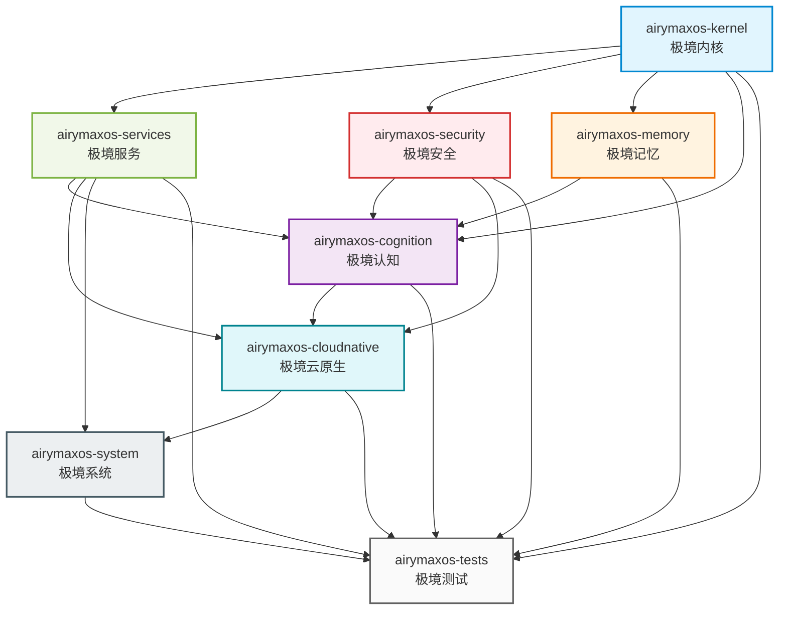

Copyright (c) 2025-2026 SPHARX Ltd. All Rights Reserved.

# agentrt-liunx 模块设计

> **文档定位**: agentrt-liunx（AirymaxOS）8 子仓模块设计的总览与索引
> **版本**: 0.1.1（文档体系完成）/ 1.0.1（开发）
> **最后更新**: 2026-07-07
> **父文档**: [agentrt-liunx 总览](../README.md)
> **核心约束**: IRON-9 v2 同源且部分代码共享——[SC] 共享契约层 6 个头文件（bpf_struct_ops.h/memory_types.h/security_types.h/cognition_types.h/sched.h/ipc.h）落地于 include/airymax/

---

## 1. 8 子仓矩阵

agentrt-liunx（AirymaxOS）划分为 8 个独立子仓，遵循微内核设计思想（机制与策略分离）+ Linux 6.6 内核基线规范 + Airymax 同源传承。下表给出 8 子仓的核心职责、同源 agentrt 模块、关键能力与仓库 URL。

| # | 子仓 | 中文 | 核心职责 | 同源 agentrt | 关键能力 | 仓库 URL |
|---|------|------|---------|--------------|---------|---------|
| 1 | airymaxos-kernel | 极境内核 | Linux 6.6 + 微内核化改造 | atoms/corekern（MicroCoreRT） | EEVDF + sched_ext + io_uring | git@atomgit.com:openairymax/kernel.git |
| 2 | airymaxos-services | 极境服务 | 用户态系统服务 | daemons（12 daemons） | systemd + io_uring 消息传递 | git@atomgit.com:openairymax/services.git |
| 3 | airymaxos-security | 极境安全 | capability + LSM + 国密 | cupolas | seL4 capability + Landlock | git@atomgit.com:openairymax/security.git |
| 4 | airymaxos-memory | 极境记忆 | 记忆持久化 + CXL + PMEM | heapstore + memoryrovol | MemoryRovol 内核态 + MGLRU | git@atomgit.com:openairymax/memory.git |
| 5 | airymaxos-cognition | 极境认知 | 认知循环 + Wasm + LLM | coreloopthree + frameworks | CoreLoopThree kthread + Wasm 3.0 | git@atomgit.com:openairymax/cognition.git |
| 6 | airymaxos-cloudnative | 极境云原生 | K8s + containerd + OCI | gateway + sdk | K8s CRD + containerd shim | git@atomgit.com:openairymax/cloud.git |
| 7 | airymaxos-system | 极境系统 | 包管理 + 配置 + shell | commons | RPM + dnf + DevStation | git@atomgit.com:openairymax/system.git |
| 8 | airymaxos-tests | 极境测试 | 单元 + 集成 + 形式化 | 全模块测试 | agentrt-liunx 集成测试框架 + seL4 风格验证 | git@atomgit.com:openairymax/airymaxos-tests.git |

**子仓划分原则**:

- **微内核最小化**：每个子仓对应一个独立的功能域，可独立演进、独立替换。
- **agentrt-liunx 工程规范对齐**：services/system/cloudnative 等子仓直接复用 agentrt-liunx 基础系统/云原生/QA 治理组的成熟实践。
- **Airymax 同源传承**：每个子仓都能追溯到 agentrt 对应模块，保留语义兼容性（详见第 3 章）。

---

## 2. 子仓依赖图

下图展示 8 子仓的依赖关系。箭头方向表示"被依赖 → 依赖者"（如 `KERNEL --> SERVICES` 表示 services 依赖 kernel）。

**依赖层次说明**（与 [10-architecture/README.md §3](../10-architecture/README.md) 7 层架构模型对齐）:

| 层次 | 子仓 | 依赖说明 |
|------|------|---------|
| L2 内核层 | kernel | 仅依赖 L1 硬件层，无上层依赖 |
| L3 服务层 | services / security / memory | 依赖 kernel，提供基础能力 |
| L4 认知层 | cognition | 依赖 kernel + services + security + memory |
| L5 云原生层 | cloudnative | 依赖 L3 + L4 全部 |
| L6 系统层 | system | 依赖 services + security + memory（发行版工具集） |
| L7 测试层（横向） | tests | 覆盖全部 7 个子仓，不构成运行时依赖 |

> **注**: L1 为硬件层（x86 / ARM / RISC-V / CXL / PMEM），非 agentrt-liunx 子仓。完整 7 层架构模型见 [10-architecture/README.md §3](../10-architecture/README.md)。

---

## 3. 同源 agentrt 模块映射表

agentrt-liunx 与 agentrt（AirymaxAgentRT）共享设计理念，每个子仓都能追溯到 agentrt 的对应模块。下表给出每个子仓的详细同源映射（5-8 个模块）。

### 3.1 airymaxos-kernel ← atoms/corekern（MicroCoreRT）

| agentrt-liunx 模块 | agentrt 同源模块 | 同源语义 |
|----------------|------------------|---------|
| patches/sched_ext-agent | MicroCoreRT 实时调度 | Agent 感知调度策略 |
| patches/io_uring-ipc | 用户态消息队列 | 零拷贝消息传递 |
| patches/rust-drivers | 用户态驱动 + capability | Rust 安全驱动 |
| patches/microkernel/capability | capability 令牌传递 | 内核 capability 接口 |
| patches/microkernel/vfs-userns | VFS 用户态化 | 文件系统下放 |
| patches/microkernel/net-userns | 网络栈用户态化 | 协议栈下放 |
| patches/microkernel/driver-split | 驱动拆分 | VFIO 用户态驱动 |
| eBPF programmable kernel | 观测/安全/调度 | eBPF kfunc + dynamic pointer |

### 3.2 airymaxos-services ← daemons（12 daemons）

| agentrt-liunx 模块 | agentrt 同源模块 | 同源语义 |
|----------------|------------------|---------|
| daemons/gateway_d | gateway daemon | 网关守护进程 |
| daemons/llm_d | llm daemon | LLM 推理守护进程 |
| daemons/tool_d | tool daemon | 工具守护进程 |
| daemons/sched_d | sched daemon | 调度守护进程 |
| daemons/market_d | market daemon | 市场守护进程 |
| daemons/monit_d | monit daemon | 监控守护进程 |
| daemons/channel_d | channel daemon | 通道守护进程 |
| daemons/info_d,notify_d,observe_d,hook_d,plugin_d | 其余 5 daemons | 辅助守护进程 |

### 3.3 airymaxos-security ← cupolas

| agentrt-liunx 模块 | agentrt 同源模块 | 同源语义 |
|----------------|------------------|---------|
| capability | capability 令牌系统 | seL4 风格不可伪造令牌 |
| lsm/agent_lsm | Cupolas LSM | LSM hook 策略注入 |
| sandbox/landlock | 进程沙箱 | 文件访问控制 |
| sandbox/seccomp | 系统调用过滤 | 系统调用白名单 |
| confidential-compute | TEE 机密计算 | SGX/SEV-SNP/TDX |
| crypto/sm2-sm4 | 国密算法 | SM2/SM3/SM4/SM9 |
| zero-trust | 零信任网络 | BeyondCorp 模型 |
| ebpf-verify | eBPF kfunc + dynamic pointer | eBPF 安全（6.6 原生） |

### 3.4 airymaxos-memory ← heapstore + memoryrovol

| agentrt-liunx 模块 | agentrt 同源模块 | 同源语义 |
|----------------|------------------|---------|
| memoryrovol/rovol-kmod | MemoryRovol（用户态） | 记忆卷载内核态升级 |
| memoryrovol/snapshot | 记忆快照 | fork + COW 快照 |
| memoryrovol/restore | 记忆恢复 | mmap + userfaultfd |
| memoryrovol/migrate | 记忆迁移 | 跨节点迁移 |
| cxl | CXL 内存分层 | CXL 3.0 池化 |
| pmem | 持久化内存 | PMEM 非易失 |
| mglru | MGLRU（多代 LRU） | Linux 6.6 内存回收 |
| vfs-persist | VFS 持久化层 | 多后端持久化 |

### 3.5 airymaxos-cognition ← coreloopthree + frameworks

| agentrt-liunx 模块 | agentrt 同源模块 | 同源语义 |
|----------------|------------------|---------|
| coreloopthree/clt-kmod | CoreLoopThree（用户态） | 三层认知循环内核态化 |
| thinkdual/system1-system2 | Thinkdual 双思考 | 快/慢思考切换 |
| wasm-runtime | 沙箱运行时 | Wasm 3.0 安全沙箱 |
| llm-scheduler | LLM 推理调度 | 推理感知调度 |
| gpu-npu | 算力调度 | GPU/NPU 池化 |
| token-efficiency | Token 能效 | KVC-Gateway + LMCache |
| super-node-sandbox | 超节点沙箱 | 镜像快照 |
| embodied-ai | 具身智能 | 传感器/运动控制 |

### 3.6 airymaxos-cloudnative ← gateway + sdk

| agentrt-liunx 模块 | agentrt 同源模块 | 同源语义 |
|----------------|------------------|---------|
| kubernetes/crds | gateway 网关 | Agent CRD 声明式 |
| containerd-shim | 进程隔离 | Agent 容器化 |
| oci | OCI 镜像规范 | 镜像分发 |
| cni | 网络插件 | 服务网格 |
| agentctl | sdk 管理接口 | 对标 kubectl |
| observability | 自研监控 | OpenTelemetry 标准化 |
| dpu-ipu | 硬件卸载 | DPU/IPU 卸载 |
| super-node-os | 超节点 OS | 超节点拓扑 |

### 3.7 airymaxos-system ← commons

| agentrt-liunx 模块 | agentrt 同源模块 | 同源语义 |
|----------------|------------------|---------|
| package-manager | 公共工具 | RPM + dnf 包管理 |
| config | 应用配置 | sysctl/systemd 配置 |
| shell | shell 环境 | bash + fish |
| base-libs | 公共库 | glibc + musl |
| monitoring | 应用监控 | top/htop/perf |
| devstation | 自研助手 | DevStation AI 助手 |

### 3.8 airymaxos-tests ← 全模块测试

| agentrt-liunx 模块 | agentrt 同源模块 | 同源语义 |
|----------------|------------------|---------|
| unit | 全模块单元测试 | cargo test/go test/googletest |
| integration | 模块间集成测试 | agentrt-liunx 集成测试框架 |
| formal-verification | 无（新增） | seL4 风格形式化验证 |
| soak | 长时间运行测试 | 72h 持续运行 |
| chaos | 无（新增） | Chaos Mesh 类混沌 |
| benchmark | 性能测试 | 微/宏基准 + 回归 |
| observability-verify | 无（新增） | eBPF 可观测性验证 |

**同源传承要点**: 保留 agentrt 模块的语义与 API 兼容性，底层实现升级为 OS 级（内核态加速、硬件感知、systemd 集成），遵循 IRON-9"同源且部分代码共享"原则。

---

## 4. 8 子仓设计文档索引

| 子仓 | 设计文档 | 核心内容 |
|------|---------|---------|
| airymaxos-kernel | [01-kernel.md](01-kernel.md) | Linux 6.6 + sched_ext + io_uring + Rust 实验性 + 微内核化 |
| airymaxos-services | [02-services.md](02-services.md) | 用户态 VFS/网络/驱动 + 12 daemons + io_uring IPC |
| airymaxos-security | [03-security.md](03-security.md) | capability + agent_lsm + Landlock + 国密 + 机密计算 |
| airymaxos-memory | [04-memory.md](04-memory.md) | MemoryRovol + CXL + PMEM + MGLRU + userfaultfd |
| airymaxos-cognition | [05-cognition.md](05-cognition.md) | CoreLoopThree kthread + Thinkdual + Wasm 3.0 + LLM 调度 |
| airymaxos-cloudnative | [06-cloudnative.md](06-cloudnative.md) | K8s CRD + containerd shim + OCI + agentctl + 超节点 |
| airymaxos-system | [07-system.md](07-system.md) | RPM + dnf + sysctl + DevStation + 监控工具 |
| airymaxos-tests | [08-tests.md](08-tests.md) | 单元/集成/形式化/Soak/混沌/基准/eBPF 验证 |

---

## 5. 子仓间接口契约

子仓间通过标准化的接口契约协作，遵循 K-2 接口契约化原则。下表给出高层接口概览，详细接口定义见 [30-interfaces/](../30-interfaces/README.md)。

| 源子仓 | 目标子仓 | 接口类型 | 契约概要 |
|--------|---------|---------|---------|
| kernel → services | 内核接口 | syscall | VFS/网络/驱动用户态服务的内核侧接口 |
| kernel → security | 内核接口 | syscall | capability 令牌、LSM hook 注册 |
| kernel → memory | 内核接口 | syscall | MemoryRovol/CXL/MGLRU 内核实现 |
| kernel → cognition | 内核接口 | syscall | CoreLoopThree kthread、Wasm runtime 支持 |
| services → cognition | IPC | io_uring | llm_d/sched_d 与认知循环协作（128B 消息头） |
| services → cloudnative | IPC | HTTP/gRPC | gateway_d 与 K8s API 集成 |
| security → cognition | IPC | capability | Wasm 沙箱 capability 授权 |
| security → cloudnative | IPC | capability | 容器沙箱、网络策略 |
| memory → cognition | IPC | syscall | MemoryRovol 快照、超节点迁移 |
| cognition → cloudnative | IPC | CRD | Agent 容器化运行 |
| system → services/security/memory | 配置 | sysctl/procfs | systemd unit、sysctl 配置 |
| tests → 全部子仓 | 验证 | 测试框架 | 单元/集成/形式化/Soak/混沌 |

**接口契约规范**:

- **C 接口**: 使用 `AGENTRT_API` 宏导出，Doxygen 注释（详见 [30-interfaces/01-syscalls.md](../30-interfaces/01-syscalls.md)）。
- **IPC 接口**: 128 字节定长消息头 + 5 种 payload 协议（详见 [30-interfaces/02-ipc-protocol.md](../30-interfaces/02-ipc-protocol.md)）。
- **SDK 接口**: 4 语言统一封装（Python/Rust/Go/TypeScript，详见 [30-interfaces/03-sdk-api.md](../30-interfaces/03-sdk-api.md)）。
- **编码规范**: 全部接口代码遵循 [30-interfaces/04-coding-standard.md](../30-interfaces/04-coding-standard.md)。

---

## 6. 模块版本与演进策略

### 6.1 版本号规则

agentrt-liunx 采用语义化版本（Semantic Versioning）：

| 版本段 | 含义 | 示例 |
|--------|------|------|
| MAJOR | 不兼容的接口变更 | 1.0.1 → 2.0.0 |
| MINOR | 向后兼容的功能新增 | 1.0.1 → 1.1.0 |
| PATCH | 向后兼容的缺陷修复 | 1.0.1 → 1.0.2 |

### 6.2 当前版本状态

| 版本 | agentrt-liunx 范围 | 状态 |
|------|---------------|------|
| 0.1.1 | 文档体系完成 + 设计草案 + agentrt-liunx 工程基线声明 | 文档体系 |
| 1.0.1 | 内核和 OS 实际开发 | 开发中 |

### 6.3 演进策略

1. **内核基线锁定**: 长期锁定 Linux 6.6 内核作为基线，跟随 agentrt-liunx LTS 演进节奏，避免主线版本快速迭代带来的稳定性风险。
2. **微内核化渐进**: 分 Phase 1（VFS 用户态化）/ Phase 2（网络栈、驱动用户态化）逐步推进，每个 Phase 通过 Soak Test + 形式化验证把关。
3. **同源 API 兼容**: 与 agentrt 同源的 API（MicroCoreRT 调度、AgentsIPC 128B 消息头、MemoryRovol、CoreLoopThree）保持语义兼容，仅升级底层实现。
4. **特性开关**: 新特性（CXL 池化、超节点沙箱、具身智能）通过 sysctl/kernel_config 开关控制，默认关闭，验证稳定后开放。
5. **ABI 稳定性**: 系统调用编号（`AGENTRT_SYS_` 前缀）、IPC 消息头布局（128B 定长）、capability 令牌格式在 MAJOR 版本内保持 ABI 稳定。
6. **子仓独立演进**: 8 个子仓独立版本号、独立发布节奏，通过接口契约解耦，符合微内核"模块化"原则。

### 6.4 里程碑概览

agentrt-liunx 1.0.1 采用 M0-M8 共 9 个里程碑，与 [130-roadmap/02-milestones-and-timeline.md](../130-roadmap/02-milestones-and-timeline.md) 保持一致。本节为概览，详细定义见路线图模块。

| 里程碑 | 名称 | 对应 Part | 工期 | 完成标准 |
|--------|------|-----------|------|---------|
| M0 | 工程标准框架建立 | Part 1 | 2 周（14 天） | `50-engineering-standards/` 8 文档完成 + OS 规则编号注册表 |
| M1 | 架构与模块设计完善 | Part 2 | 4 周（28 天） | `10-architecture/` + `20-modules/` + `60-driver-model/` + `70-build-system/` 完善 |
| M2 | 测试体系建立 | Part 3 | 3 周（21 天） | `80-testing/` 10 文档完成 + KUnit/kselftest/fault injection 就位 |
| M3 | 可观测性与运维体系 | Part 4 | 3 周（21 天） | `90-observability/` + `100-operations/ 完成 + ftrace/eBPF/perf 就位 |
| M4 | 安全加固体系 | Part 5 | 3 周（21 天） | `110-security/` 完成 + capability + LSM + 机密计算就位 |
| M5 | 开发流程与治理 | Part 6 | 2 周（14 天） | `120-development-process/` + `50/07` 完成 + 维护者制度落地 |
| M6 | 路线图与里程碑 | Part 7 | 1 周（7 天） | `130-roadmap/` 7 文档完成（本模块） |
| M7 | 应用生态与云原生 | Part 8 | 3 周（21 天） | `140-application-development/` + `150-cloudnative/` 完成 |
| M8 | 兼容性与性能工程 | Part 9 | 2 周（14 天） | `160-compatibility/` + `170-performance/` 完成 |

**关键路径**: M0 → M1 → M2 → M6 → M7 → M8，总工期 126 天。详细 Gantt 图、依赖关系、风险分析见 [130-roadmap/02-milestones-and-timeline.md](../130-roadmap/02-milestones-and-timeline.md)。

---

## 7. 相关文档

- [agentrt-liunx 总览](../README.md)
- [架构设计](../10-architecture/01-system-architecture.md)
- [微内核策略](../10-architecture/03-microkernel-strategy.md)
- [agentrt-liunx 工程基线](../10-architecture/04-engineering-baseline.md)
- [接口设计](../30-interfaces/README.md)
- [需求分析](../00-requirements/README.md)

---

© 2025-2026 SPHARX Ltd. All Rights Reserved.
