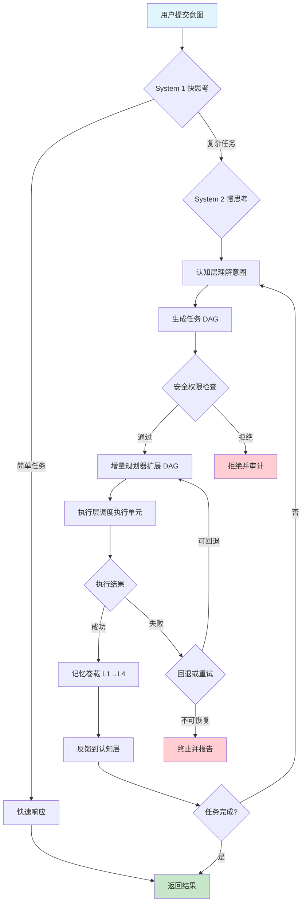
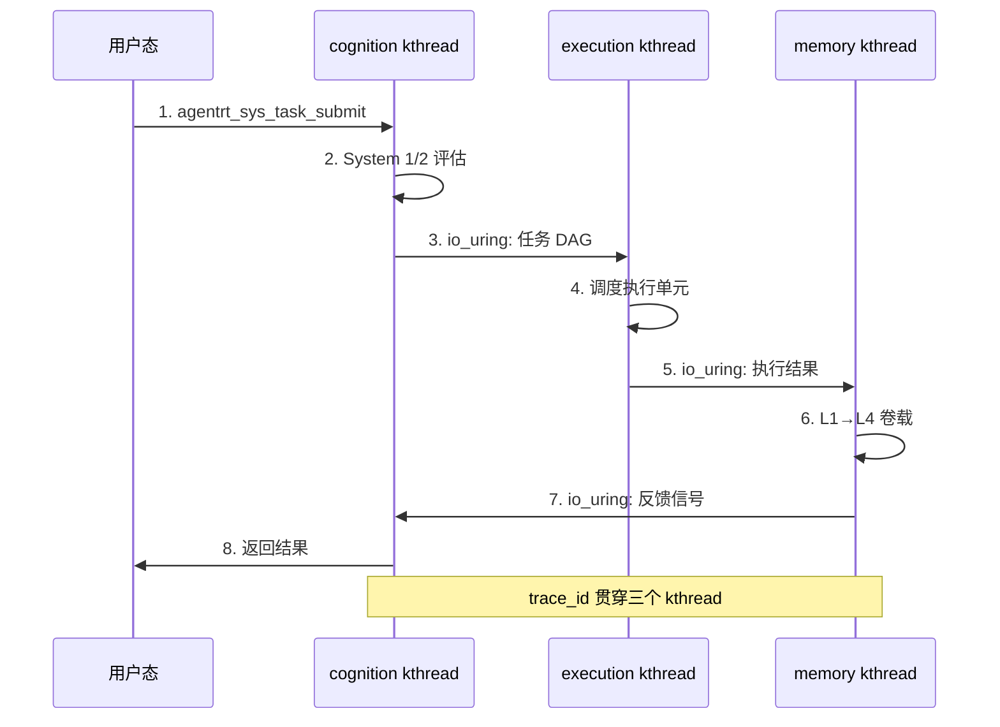
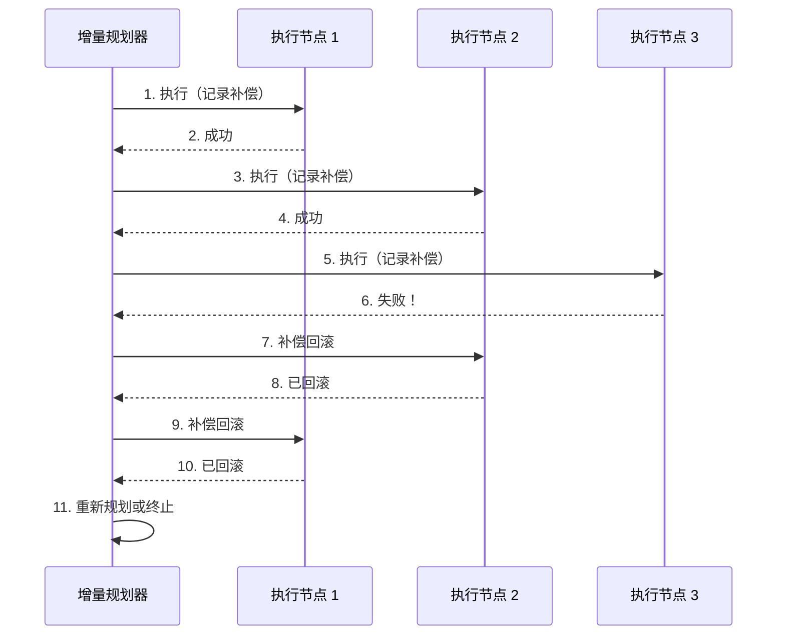

Copyright (c) 2025-2026 SPHARX Ltd. All Rights Reserved.

# 认知循环数据流

> **文档定位**: AirymaxOS 认知循环数据流的详细设计，刻画 System 1/2 双系统协同与 CoreLoopThree kthread 实现
> **版本**: 0.1.1（文档体系完成）/ 1.0.1（开发）
> **最后更新**: 2026-07-07
> **父文档**: [数据流程设计概览](README.md)
> **核心约束**: IRON-9 v2 同源且部分代码共享——[SC] cognition_types.h 落地于 include/airymax/（CoreLoopThree 阶段枚举 + Thinkdual 模式枚举 + LLM 推理阶段枚举 + 上下文结构 + Token 能效指标 + GPU/NPU 描述符），[SS] CoreLoopThree/Thinkdual/LLM 推理 API 语义同源，[IND] kthread 内核态/Wasm runtime/GPU-NPU 驱动独立实现

---

## 1. 认知循环数据流概览

认知循环数据流是 AirymaxOS 区别于通用操作系统的核心特征，落地于 `airymaxos-cognition` 子仓（同源 agentrt coreloopthree 模块）。该数据流借鉴 Kahneman 双系统思维理论：

- **System 1（快思考）**：处理简单、低风险、模板化任务，直接走「快速响应」路径，避免 LLM 调度开销，延迟 < 10ms（满足 NFR-P-001 实时反馈场景）。
- **System 2（慢思考）**：处理复杂、高风险、需要规划的任务，走「认知层 → 增量规划 → 执行层 → 记忆卷载 → 反馈」完整闭环，延迟 < 100ms（满足 NFR-P-001 标准场景）。

双系统通过复杂度评估器自动切换，切换阈值由策略文件配置，支持运行时热更新（FR-050）。整个循环由 `CoreLoopThree kthread` 在内核态驱动，避免用户态 ↔ 内核态上下文切换开销。

认知循环数据流涉及 3 个子仓协同：

| 子仓 | 角色 | 同源 agentrt |
|---|---|---|
| airymaxos-cognition | 认知 / 规划 / 执行编排 | coreloopthree + frameworks |
| airymaxos-memory | 记忆卷载 L1→L4 | memoryrovol + heapstore |
| airymaxos-kernel | kthread 调度 + IPC + capability | atoms/corekern |

---

## 2. Mermaid 流程图

下图为认知循环数据流的完整路径，包含 System 1/2 双系统切换、安全权限检查、增量规划、补偿事务、记忆卷载与反馈闭环：



---

## 3. 数据流详细步骤

下表描述认知循环数据流的 12 个关键步骤，每步包含输入 / 输出 / 约束：

| # | 步骤 | 输入 | 输出 | 约束 | 同源 agentrt |
|---|------|------|------|------|--------------|
| 1 | 用户提交意图 | 用户自然语言意图 | 意图对象（含 trace_id） | trace_id 全链路唯一 | coreloopthree input |
| 2 | System 1 复杂度评估 | 意图对象 | 评估分数（0-100） | 评估延迟 < 1ms | coreloopthree router |
| 3 | 双系统切换决策 | 评估分数 | 路径选择（快/慢） | 切换无状态丢失 | coreloopthree switch |
| 4 | System 1 快速响应 | 简单意图 | 直接结果 | 延迟 < 10ms | coreloopthree fast |
| 5 | System 2 认知层理解 | 复杂意图 | 任务语义模型 | LLM 调用 < 200ms | coreloopthree cognition |
| 6 | 生成任务 DAG | 语义模型 | 任务有向无环图 | DAG 深度 ≤ 10 层 | coreloopthree planner |
| 7 | 安全权限检查 | DAG 节点权限 | 通过/拒绝决策 | capability + LSM 双检查 | cupolas permission |
| 8 | 增量规划器扩展 | 执行反馈 + DAG | 扩展后 DAG | 增量扩展无全量重算 | coreloopthree planner |
| 9 | 执行层调度执行单元 | DAG 节点 | 执行结果 | Wasm 3.0 沙箱隔离 | frameworks executor |
| 10 | 记忆卷载 L1→L4 | 执行结果 | 四层记忆记录 | L1 仅追加不可变 | memoryrovol |
| 11 | 反馈到认知层 | 记忆结果 | 认知调整信号 | 反馈延迟 < 5ms | coreloopthree feedback |
| 12 | 任务完成判断 | 任务状态 | 完成/继续 | P99 < 100ms | coreloopthree judge |

**步骤间数据传递**：

- 步骤 1-3 在用户态 SDK 完成，通过 `agentrt_sys_task_submit` 系统调用进入内核。
- 步骤 4-12 在内核态 CoreLoopThree kthread 中完成，避免上下文切换。
- 步骤 7 的安全检查与步骤 9 的执行调度通过 io_uring IPC 异步解耦。

---

## 4. CoreLoopThree kthread 数据流

CoreLoopThree kthread 是认知循环的内核态驱动器（FR-041），同源 agentrt coreloopthree。它在内核态以 SCHED_AGENT 调度类运行，避免用户态 ↔ 内核态上下文切换开销。

### 4.1 三个 kthread 分工

| kthread | 职责 | 调度优先级 | 同源 |
|---|---|---|---|
| `coreloop_cognition_kthread` | 认知层：理解意图 + 生成 DAG | SCHED_AGENT 高优先级 | coreloopthree cognition |
| `coreloop_execution_kthread` | 执行层：调度执行单元 + 补偿事务 | SCHED_AGENT 中优先级 | coreloopthree execution |
| `coreloop_memory_kthread` | 记忆层：L1→L4 卷载 + 反馈 | SCHED_AGENT 低优先级 | coreloopthree memory |

### 4.2 kthread 间数据传递

三个 kthread 通过 io_uring 零拷贝 IPC 传递数据，避免共享内存竞争：



### 4.3 kthread 唤醒机制

CoreLoopThree kthread 通过 `wait_event_interruptible` + io_uring CQE 事件唤醒，避免忙等消耗 CPU：

- cognition kthread 等待 `task_submit` 系统调用事件
- execution kthread 等待 cognition kthread 的 DAG 事件
- memory kthread 等待 execution kthread 的结果事件

---

## 5. 双系统切换阈值

System 1 与 System 2 的切换由复杂度评估器决定，评估维度与阈值如下：

### 5.1 复杂度评估维度

| 维度 | 权重 | System 1 阈值 | System 2 阈值 |
|---|---|---|---|
| 意图长度（字符数） | 0.2 | < 50 | ≥ 50 |
| 历史相似度 | 0.3 | > 0.85 | ≤ 0.85 |
| 风险等级 | 0.3 | low | medium/high |
| 资源需求（预估 Token） | 0.2 | < 1000 | ≥ 1000 |

**评估公式**：

```
complexity_score = 0.2 * norm(intent_length) +
                   0.3 * (1 - history_similarity) +
                   0.3 * risk_level_score +
                   0.2 * norm(estimated_tokens)
```

- `complexity_score < 0.3` → System 1 快速响应
- `complexity_score ≥ 0.3` → System 2 慢思考

### 5.2 切换机制

切换通过策略文件 `/etc/agentrt/cognition_policy.yaml` 配置，支持运行时热更新（FR-050）：

```yaml
# 认知循环策略配置
system1:
  enabled: true
  complexity_threshold: 0.3
  max_latency_ms: 10
  cache_ttl_s: 300

system2:
  enabled: true
  dag_max_depth: 10
  llm_timeout_ms: 200
  feedback_enabled: true

switching:
  strategy: "score_based"
  hot_reload: true
  audit: true
```

策略热更新通过 `agentrt_sys_policy_update` 系统调用触发，更新时重新评估所有活动任务（NFR-S-007）。

---

## 6. 异常处理与回退路径

认知循环数据流采用补偿事务模式（FR-043）保证数据一致性，同源 agentrt coreloopthree execution 的补偿机制。

### 6.1 异常分类与处理

| 异常类型 | 检测方式 | 处理策略 | 回退路径 |
|---|---|---|---|
| LLM 调用超时 | watchdog > 200ms | 重试 1 次，降级到本地模型 | 步骤 5 重试 |
| DAG 节点执行失败 | 执行返回非零 | 调用补偿事务回滚 | 步骤 8 重新规划 |
| 记忆卷载失败 | L1 写入失败 | 重试 3 次，告警 | 步骤 10 重试 |
| 安全权限拒绝 | capability 检查失败 | 拒绝并审计，不重试 | 步骤 7 终止 |
| kthread 崩溃 | health check | 重启 kthread，恢复任务 | 步骤 1 重新提交 |
| 资源不足 | ENOMEM | 触发 MGLRU 多代 LRU 回收 | 步骤 9 等待 |

### 6.2 补偿事务数据流

补偿事务采用 Saga 模式，每个执行节点记录补偿操作：



补偿事务日志通过 SHA-256 哈希链保护（NFR-S-005），不可篡改。

---

## 7. 数据流性能约束

认知循环数据流满足以下非功能需求：

| NFR | 指标 | 目标 | 验证方法 |
|---|---|---|---|
| NFR-P-001 | 调度延迟 | < 100ms（实时 < 10ms） | perf + ftrace |
| NFR-P-004 | Token 能效 | 吞吐 +30%，能效 +25% | Token 基准测试 |
| NFR-R-004 | 故障恢复 | MTTR < 5min | 故障注入测试 |
| NFR-R-001 | 持续运行 | 7 天无故障 | Soak Test |
| NFR-S-006 | 注入防御 | > 99.9% | 渗透测试 |

**性能分解（标准场景 P99）**：

| 阶段 | 目标延迟 | 占比 |
|---|---|---|
| 意图提交 + System 1 评估 | 5ms | 5% |
| System 2 认知层（LLM 调用） | 50ms | 50% |
| 安全权限检查 | 5ms | 5% |
| 增量规划 + DAG 扩展 | 10ms | 10% |
| 执行层调度执行单元 | 20ms | 20% |
| 记忆卷载 L1→L4 | 5ms | 5% |
| 反馈到认知层 | 5ms | 5% |
| **总计** | **100ms** | **100%** |

---

## 8. 可观测性

认知循环数据流通过 OpenTelemetry 全链路追踪 + Prometheus Metrics + 结构化 JSON 日志实现可观测性（NFR-O 系列）。

### 8.1 trace_id 贯穿

`trace_id` 在用户态 SDK 入口生成，贯穿 3 个 CoreLoopThree kthread，最终在记忆卷载完成时关闭：

```
trace_id: abc123def456
  span: sdk.submit           (用户态, 1ms)
    span: kthread.cognition  (内核态, 50ms)
      span: llm.invoke       (用户态, 45ms)
      span: planner.expand   (内核态, 10ms)
    span: kthread.execution  (内核态, 20ms)
      span: wasm.execute     (用户态, 18ms)
    span: kthread.memory     (内核态, 5ms)
      span: l1.append        (内核态, 1ms)
      span: l2.extract       (内核态, 2ms)
      span: l3.graph         (内核态, 1ms)
      span: l4.homology      (内核态, 1ms)
```

### 8.2 OpenTelemetry span 属性

每个 span 携带以下属性：

| 属性 | 类型 | 说明 |
|---|---|---|
| `trace_id` | string | 链路追踪 ID |
| `span_id` | string | 当前 span ID |
| `parent_span_id` | string | 父 span ID |
| `task_id` | string | 任务 ID |
| `system_mode` | enum | system1 / system2 |
| `agent_role` | string | Agent 角色 |
| `model` | string | LLM 模型名 |
| `dag_depth` | int | DAG 当前深度 |
| `memory_layer` | enum | L1/L2/L3/L4 |

### 8.3 Prometheus Metrics

关键 Metrics 指标（Prometheus 格式）：

```prometheus
# 认知循环延迟分布
airymaxos_cognition_latency_seconds{quantile="0.50"} 0.045
airymaxos_cognition_latency_seconds{quantile="0.99"} 0.095
airymaxos_cognition_latency_seconds{quantile="0.999"} 0.180

# System 1/2 切换次数
airymaxos_cognition_system1_hits_total 15420
airymaxos_cognition_system2_hits_total 3580

# 补偿事务触发次数
airymaxos_cognition_compensation_total 42

# DAG 平均深度
airymaxos_cognition_dag_depth_avg 4.2
```

### 8.4 结构化日志

日志格式（JSON + ANSI 颜色）：

```json
{
  "timestamp": "2026-07-06T10:30:45.123Z",
  "level": "INFO",
  "trace_id": "abc123def456",
  "module": "coreloopthree.cognition",
  "function": "agentrt_cognition_process",
  "line": 142,
  "message": "任务规划完成",
  "context": {
    "task_id": "task_xyz789",
    "system_mode": "system2",
    "plan_nodes": 15,
    "estimated_time_ms": 4500
  }
}
```

---

## 9. IRON-9 v2 三层共享模型落地

认知循环数据流严格遵守 IRON-9 v2 三层共享模型：

### 9.1 [SC] 共享契约层（`include/airymax/cognition_types.h`）

agentrt 与 AirymaxOS 完全共享的契约定义：

| 契约 | 内容 | 落地位置 |
|------|------|---------|
| CoreLoopThree 阶段枚举 | `CLT_PHASE_PERCEPTION/THINKING/ACTION`（3 项） | `include/airymax/cognition_types.h` |
| Thinkdual 模式枚举 | `THINKDUAL_SYSTEM1_FAST/SYSTEM2_SLOW`（2 项） | `include/airymax/cognition_types.h` |
| LLM 推理阶段枚举 | `LLM_STAGE_PREFILL/DECODE/SPECULATIVE`（3 项） | `include/airymax/cognition_types.h` |
| CoreLoopThree 上下文结构 | `agentrt_clt_ctx_t`（per-cpu 上下文） | `include/airymax/cognition_types.h` |
| Token 能效指标结构 | `agentrt_token_efficiency_t`（tokens/J、tokens/s） | `include/airymax/cognition_types.h` |
| GPU/NPU 能力描述符 | `agentrt_accel_capabilities_t`（VRAM/算力/带宽） | `include/airymax/cognition_types.h` |

### 9.2 [SS] 语义同源层（API 签名同源，实现独立）

| API | agentrt（用户态） | AirymaxOS（内核态） | 同源语义 |
|-----|------------------|---------------------|---------|
| `agentrt_clt_run()` | 用户态事件循环 | 内核 kthread 主循环 | 三阶段循环 |
| `agentrt_clt_notify_phase()` | 同步通知 | 内核 `wake_up_process()` | 阶段切换通知 |
| `agentrt_thinkdual_switch()` | 协程切换 | kthread 优先级切换 | System 1/2 切换 |
| `agentrt_llm_scheduler_submit()` | 用户态队列 | io_uring 提交 | LLM 推理提交 |
| `agentrt_clt_query_phase()` | atomic 读取 | 内核 `atomic64_read()` | 当前阶段查询 |
| `agentrt_token_efficiency_record()` | 用户态 metric | 内核 perf_event | 能效指标记录 |
| `agentrt_gpu_npu_schedule()` | 用户态 ioctl | 内核 accel ops | GPU/NPU 调度 |
| `agentrt_wasm_runtime_instantiate()` | 用户态 Wasm | 内核 eBPF 验证器风格 | Wasm 实例化 |

### 9.3 [IND] 完全独立层

| 机制 | AirymaxOS 独立设计 | 独立原因 |
|------|-------------------|---------|
| kthread 创建 | `kthread_run()`（内核原生） | 用户态无 kthread |
| GPU/NPU 驱动 | `drivers/accel/`（habanalabs/ivpu/qaic） | 用户态无硬件驱动 |
| drm_sched 调度 | `drm_gpu_scheduler`（DRM 框架） | 用户态无 DRM |
| 超节点沙箱 | 内核 capability + cgroup | AirymaxOS 专属 |
| 具身智能 | 内核 sensorio + 工业总线 | AirymaxOS 专属 |
| KVC-Gateway | 内核 LLMCache + Bifrost | AirymaxOS 专属 |

### 9.4 同源红利示例

```
agentrt CoreLoopThree（用户态，跨平台）
   ├── 阶段枚举: CLT_PHASE_PERCEPTION/THINKING/ACTION（同源 [SC]）
   ├── 模式枚举: THINKDUAL_SYSTEM1_FAST/SYSTEM2_SLOW（同源 [SC]）
   ├── 上下文: agentrt_clt_ctx_t（同源 [SC]）
   └── API: agentrt_clt_run / notify_phase / thinkdual_switch（同源 [SS]）
       │
       └── 在 AirymaxOS 上:
           ├── 作为用户态进程运行（标准 libc/POSIX）
           │   └── 天然更高效 ← 同源契约一致
           │
           └── 可选使用内核 kthread 加速路径（同源红利）
               ├── kthread_run() 创建持久化内核 kthread
               ├── 享受 sched_ext SCHED_AGENT 调度优先级
               └── 与 GPU/NPU drm_sched 协同（无需适配层）
```

---

## 10. agentrt 一致性检查

agentrt 一致性检查遵循"全面推理 → 系统验证 → 确认不合理则提出修改意见"三段式方法。本节列出认知循环数据流与 agentrt 用户态 coreloopthree 模块的一致性验证结果。

| # | 检查项 | agentrt（用户态） | AirymaxOS（内核态） | 一致性结论 |
|---|--------|------------------|---------------------|-----------|
| 1 | [SC] 阶段枚举 | `CLT_PHASE_PERCEPTION/THINKING/ACTION` | 同源 `CLT_PHASE_*` | ✅ PASS 完全共享 |
| 2 | [SC] 模式枚举 | `THINKDUAL_SYSTEM1_FAST/SYSTEM2_SLOW` | 同源 `THINKDUAL_*` | ✅ PASS 完全共享 |
| 3 | [SC] 上下文结构 | `agentrt_clt_ctx_t` | 同源 `agentrt_clt_ctx_t` | ✅ PASS 完全共享 |
| 4 | [SC] 能效指标结构 | `agentrt_token_efficiency_t` | 同源结构 | ✅ PASS 完全共享 |
| 5 | [SC] GPU/NPU 描述符 | `agentrt_accel_capabilities_t` | 同源结构 | ✅ PASS 完全共享 |
| 6 | [SS] CLT_run 签名 | `agentrt_clt_run(ctx)` | 签名一致，实现独立 | ✅ PASS 语义同源 |
| 7 | [SS] notify_phase 签名 | `agentrt_clt_notify_phase(ctx, phase)` | 签名一致 | ✅ PASS 语义同源 |
| 8 | [SS] thinkdual_switch 签名 | `agentrt_thinkdual_switch(ctx, mode)` | 签名一致 | ✅ PASS 语义同源 |
| 9 | [SS] llm_scheduler_submit 签名 | `agentrt_llm_scheduler_submit(req)` | 签名一致 | ✅ PASS 语义同源 |
| 10 | [SS] query_phase 签名 | `agentrt_clt_query_phase(ctx)` | 签名一致 | ✅ PASS 语义同源 |
| 11 | [IND] kthread 实现 | 不涉及（用户态无 kthread） | `kthread_run()` 独立 | ✅ PASS 独立正确 |
| 12 | [IND] GPU/NPU 驱动 | 不涉及（用户态无驱动） | `drivers/accel/` 独立 | ✅ PASS 独立正确 |
| 13 | [IND] drm_sched 实现 | 不涉及（用户态无 DRM） | `drm_gpu_scheduler` 独立 | ✅ PASS 独立正确 |
| 14 | [IND] Wasm runtime | 用户态 Wasm 3.0（wasmtime） | 内核 eBPF 验证器风格独立实现 | ✅ PASS 独立正确 |
| 15 | 跨平台兼容性 | 跨 Linux/macOS/Windows | 仅 Linux（agentrt-linux 专属） | ✅ PASS agentrt 保持跨平台，AirymaxOS 仅 Linux |

**结论**：15 项检查全部 PASS。认知循环数据流与 agentrt coreloopthree 模块在 [SC] 共享契约层完全一致（阶段/模式/上下文/能效/GPU-NPU 5 项），[SS] 语义同源层 API 签名一致（5 项核心 API），[IND] 独立层正确分离（kthread/GPU-NPU 驱动/drm_sched/Wasm 内核态专属机制不污染 agentrt）。agentrt 设计无需修改，保持跨平台用户态；AirymaxOS 在 [IND] 独立层正确引入 kthread + GPU/NPU + drm_sched 内核加速路径，遵循 IRON-9 v2 同源且部分代码共享原则。

---

## 11. 相关文档

- [数据流程设计概览](README.md)：4 大数据流分类
- [记忆卷载数据流](02-memory-flow.md)：L1→L4 四层递进
- [调度数据流](04-scheduling-flow.md)：EEVDF + SCHED_AGENT
- [认知模块设计](../20-modules/05-cognition.md)：CoreLoopThree + Wasm + LLM 调度
- [IPC 协议](../30-interfaces/02-ipc-protocol.md)：128B 消息头结构
- [系统调用](../30-interfaces/01-syscalls.md)：agentrt_sys_task_submit
- [功能需求 FR-041~FR-050](../00-requirements/02-functional-requirements.md)

---

## 12. 文档变更记录

| 版本 | 日期 | 变更内容 | 变更人 |
|---|---|---|---|
| 0.1.1 | 2026-07-06 | 初始版本，定义认知循环数据流 12 步与双系统切换 | Airymax 架构委员会 |
| 0.1.1 | 2026-07-07 | 新增 Copyright 头 + §9 IRON-9 v2 三层共享模型落地 + §10 agentrt 一致性检查（15 项全 PASS） | Airymax 架构委员会 |

---

© 2025-2026 SPHARX Ltd. All Rights Reserved.
"From data intelligence emerges."
