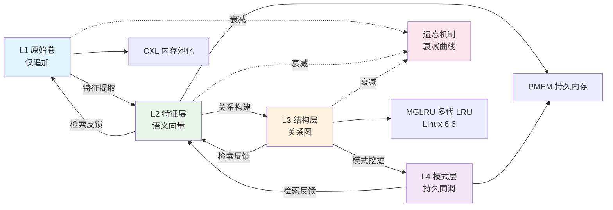
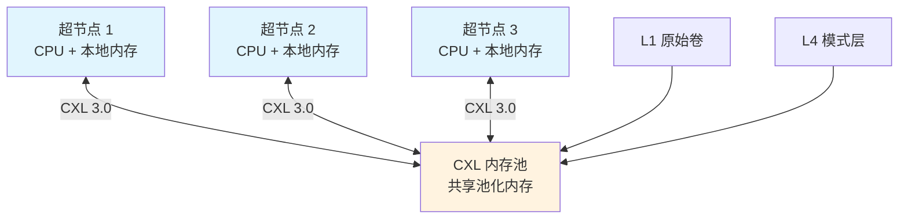
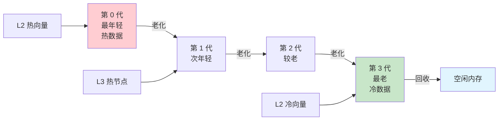
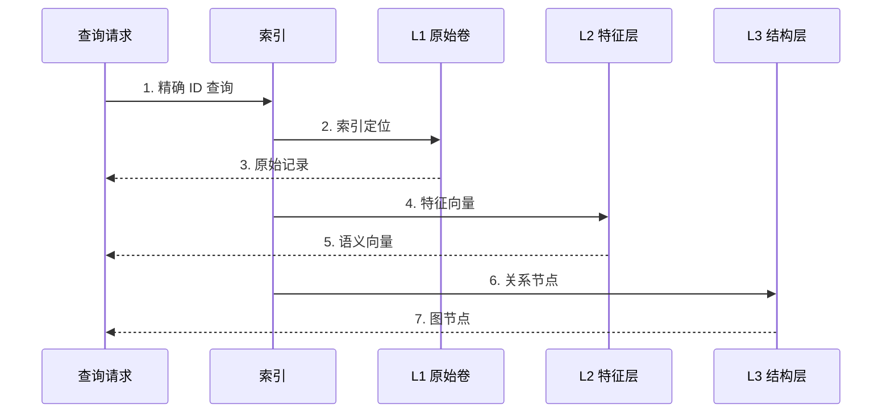
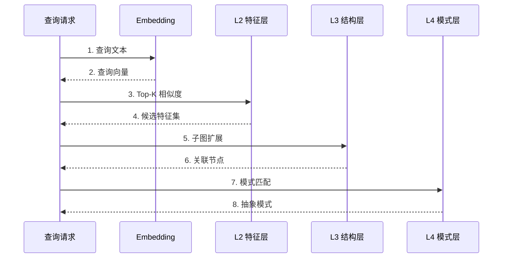
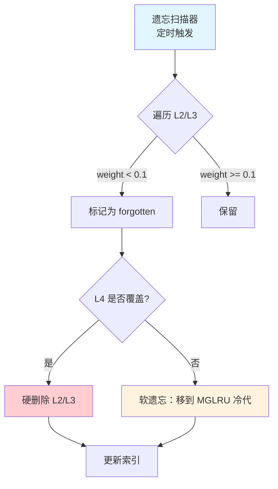

# 记忆卷载数据流

> **文档定位**: AirymaxOS 记忆卷载数据流的详细设计，刻画 L1→L4 四层递进与 CXL/PMEM/MGLRU 硬件协同
> **版本**: 0.1.1（占位）/ 1.0.1（开发）
> **最后更新**: 2026-07-06
> **父文档**: [数据流程设计概览](README.md)

---

## 1. 记忆卷载数据流概览

记忆卷载数据流是 AirymaxOS 区别于通用操作系统的核心特征之一，落地于 `airymaxos-memory` 子仓（同源 agentrt memoryrovol + heapstore 模块）。该数据流借鉴认知科学的记忆分层理论，将记忆从原始感知到抽象模式分为四层递进：

- **L1 原始卷（Raw Volume）**：仅追加（append-only），不可变，存储原始执行记录与感知数据。同源 memoryrovol L1。
- **L2 特征层（Feature Layer）**：从 L1 提取语义向量，支持相似度检索。同源 memoryrovol L2。
- **L3 结构层（Structure Layer）**：从 L2 向量构建关系图（知识图谱），支持图遍历。同源 memoryrovol L3。
- **L4 模式层（Pattern Layer）**：从 L3 图挖掘持久同调（persistent homology）模式，支持抽象推理。同源 memoryrovol L4。

四层之间通过「特征提取 → 关系构建 → 模式挖掘」单向流动，同时通过「检索反馈」反向调整权重与衰减速率，形成闭环（满足 S-1 反馈闭环原则）。

记忆卷载依赖 Linux 6.6 内核基线的三大硬件能力：

1. **CXL 内存池化**（FR-035）：跨节点内存共享，支持超节点 OS。
2. **PMEM 持久内存**（FR-036）：L1/L4 持久化存储，断电不丢失。
3. **MGLRU 多代 LRU**（FR-037，Linux 6.6）：多代 LRU 内存回收，相比传统 LRU 效率提升 > 20%（NFR-P-006）。

---

## 2. Mermaid 流程图

下图为记忆卷载数据流的完整路径，包含四层递进、检索反馈、遗忘机制与硬件协同：



---

## 3. 每层数据结构

### 3.1 L1 原始卷（仅追加）

L1 存储原始执行记录与感知数据，**仅追加（append-only），不可变**（FR-031，NFR-S-005 哈希链保护）。

```c
/**
 * @brief L1 原始记录条目
 * @since 1.0.1
 * @see memoryrovol L1（同源 agentrt）
 */
typedef struct __attribute__((aligned(64))) agentrt_l1_record {
    uint64_t record_id;        /* 记录 ID（单调递增） */
    uint64_t timestamp_ns;     /* 纳秒时间戳（CLOCK_REALTIME） */
    uint64_t trace_id;         /* 链路追踪 ID（OpenTelemetry） */
    uint64_t task_id;          /* 任务 ID */
    uint32_t record_type;      /* 记录类型（EXEC/PERCEPT/FEEDBACK） */
    uint32_t payload_len;      /* payload 长度 */
    uint8_t  prev_hash[32];    /* 前一条记录的 SHA-256 哈希 */
    uint8_t  payload[];        /* 柔性数组，存储原始数据 */
} agentrt_l1_record_t;
```

**L1 存储特性**：

| 属性 | 值 | 说明 |
|---|---|---|
| 可变性 | 仅追加 | 不可修改、不可删除 |
| 持久性 | PMEM | 断电不丢失 |
| 完整性 | SHA-256 哈希链 | 任何篡改可检测 |
| 检索方式 | 顺序扫描 + 索引 | 不支持直接修改 |
| 同源 | memoryrovol L1 | 协议完全一致 |

### 3.2 L2 特征层（语义向量）

L2 从 L1 提取语义向量，支持相似度检索（FR-032）。向量维度 768（兼容主流 embedding 模型）。

```c
/**
 * @brief L2 特征向量条目
 * @since 1.0.1
 * @see memoryrovol L2（同源 agentrt）
 */
typedef struct __attribute__((aligned(64))) agentrt_l2_feature {
    uint64_t feature_id;       /* 特征 ID */
    uint64_t source_record_id; /* 源 L1 记录 ID */
    uint64_t timestamp_ns;     /* 创建时间戳 */
    uint32_t model_version;    /* embedding 模型版本 */
    uint32_t dim;              /* 向量维度（默认 768） */
    float    weight;           /* 权重（受遗忘机制影响） */
    float    vector[768];      /* 语义向量 */
} agentrt_l2_feature_t;
```

### 3.3 L3 结构层（关系图）

L3 从 L2 向量构建关系图（知识图谱），支持图遍历（FR-033）。采用邻接表存储。

```c
/**
 * @brief L3 关系图节点
 * @since 1.0.1
 * @see memoryrovol L3（同源 agentrt）
 */
typedef struct agentrt_l3_node {
    uint64_t node_id;           /* 节点 ID */
    uint64_t source_feature_id; /* 源 L2 特征 ID */
    uint32_t node_type;         /* 节点类型（ENTITY/CONCEPT/EVENT） */
    uint32_t edge_count;       /* 邻接边数 */
    char     label[64];         /* 节点标签 */
    struct agentrt_l3_edge *edges; /* 邻接边数组 */
} agentrt_l3_node_t;

/**
 * @brief L3 关系图边
 */
typedef struct agentrt_l3_edge {
    uint64_t target_node_id;   /* 目标节点 ID */
    uint32_t edge_type;         /* 边类型（IS_A/RELATES_TO/CAUSES） */
    float    weight;            /* 边权重 */
} agentrt_l3_edge_t;
```

### 3.4 L4 模式层（持久同调）

L4 从 L3 图挖掘持久同调（persistent homology）模式，支持抽象推理（FR-034）。采用 barcodes 表示模式的 birth/death。

```c
/**
 * @brief L4 持久同调 barcode
 * @since 1.0.1
 * @see memoryrovol L4（同源 agentrt）
 */
typedef struct agentrt_l4_barcode {
    uint64_t pattern_id;        /* 模式 ID */
    uint64_t source_graph_id;   /* 源 L3 图 ID */
    int32_t  dimension;         /* 同调维度（0/1/2） */
    float    birth;             /* birth 阈值 */
    float    death;             /* death 阈值（INFINITY 表示永生） */
    float    persistence;        /* 持久性 = death - birth */
    uint32_t confidence;         /* 置信度（0-100） */
} agentrt_l4_barcode_t;
```

---

## 4. CXL 内存池化数据流

CXL（Compute Express Link）内存池化（FR-035）是 AirymaxOS 超节点 OS 的核心能力，支持跨节点内存共享。同源 agentrt atoms/corekern 的 CXL 池化扩展。

### 4.1 CXL 池化架构



### 4.2 CXL 数据流步骤

| # | 步骤 | 节点 | 操作 | 延迟 |
|---|------|------|------|------|
| 1 | L1 写入请求 | 超节点 1 | 发起 L1 记录写入 | < 1μs |
| 2 | CXL 路由 | CXL 控制器 | 路由到内存池节点 | < 2μs |
| 3 | 池化内存分配 | 内存池节点 | 分配 CXL 内存页 | < 5μs |
| 4 | 跨节点写入 | 超节点 1 → 池节点 | CXL 3.0 写入 | < 10μs |
| 5 | 一致性确认 | 池节点 → 超节点 1 | CXL flush + ack | < 5μs |
| 6 | 跨节点读取 | 超节点 2 → 池节点 | CXL 3.0 读取 | < 10μs |

**CXL 池化优势**：

- L1 原始卷可被超节点 1/2/3 共享读取，无需复制
- L4 模式层在内存池节点集中计算，避免数据搬运
- 故障切换时内存不丢失（CXL 持久域）

### 4.3 CXL 内存分配 API

```c
/**
 * @brief 从 CXL 内存池分配
 * @param pool_id 池 ID
 * @param size 分配大小（字节）
 * @return 内存指针（NULL 失败）
 * @since 1.0.1
 */
AGENTRT_API void *agentrt_cxl_alloc(uint32_t pool_id, size_t size);

/**
 * @brief 释放 CXL 内存到池
 * @param ptr 内存指针
 * @since 1.0.1
 */
AGENTRT_API void agentrt_cxl_free(void *ptr);
```

---

## 5. MGLRU 多代 LRU 回收数据流

MGLRU（Multi-Gen LRU）是 Linux 6.6 内核基线的原生能力（FR-037），相比传统 LRU 内存回收效率提升 > 20%（NFR-P-006）。AirymaxOS 利用 MGLRU 实现 L2/L3 内存的分级回收。

### 5.1 MGLRU 多代划分



### 5.2 MGLRU 回收策略

| 记忆层 | MGLRU 代 | 回收优先级 | 回收触发 |
|---|---|---|---|
| L2 热向量 | 第 0 代 | 不回收 | - |
| L2 温向量 | 第 1 代 | 低优先级 | 内存压力 > 70% |
| L2 冷向量 | 第 3 代 | 高优先级 | 内存压力 > 50% |
| L3 热节点 | 第 0-1 代 | 不回收 | - |
| L3 冷节点 | 第 2-3 代 | 中优先级 | 内存压力 > 60% |
| L1 原始卷 | 不参与 | 不回收（PMEM 持久） | - |
| L4 模式层 | 不参与 | 不回收（PMEM 持久） | - |

### 5.3 MGLRU 调优参数

```bash
# 查看 MGLRU 多代状态
cat /sys/kernel/mm/lru_gen/enabled

# 启用 MGLRU（默认启用，Linux 6.6）
echo "y" > /sys/kernel/mm/lru_gen/enabled

# 查看代老化周期
cat /sys/kernel/mm/lru_gen/min_ttl_ms

# 设置最小 TTL（毫秒）
echo 1000 > /sys/kernel/mm/lru_gen/min_ttl_ms
```

---

## 6. 检索双路径

记忆检索支持双路径（FR-039），延迟 < 50ms：

### 6.1 精确检索（Exact Retrieval）

通过 record_id / feature_id / node_id 直接索引访问，延迟 < 1ms。



### 6.2 语义检索（Semantic Retrieval）

通过向量相似度（cosine similarity）检索，延迟 < 50ms。



### 6.3 检索双路径对比

| 维度 | 精确检索 | 语义检索 |
|---|---|---|
| 延迟 | < 1ms | < 50ms |
| 准确率 | 100%（精确匹配） | > 85%（相似度） |
| 索引 | B+ tree | HNSW / IVF |
| 适用场景 | 已知 ID 的精确查询 | 模糊查询、联想推理 |
| 同源 | memoryrovol exact | memoryrovol semantic |

---

## 7. 遗忘机制

遗忘机制（FR-038）是记忆卷载的关键能力，避免 L2/L3 无限膨胀。同源 agentrt memoryrovol 遗忘曲线。

### 7.1 衰减曲线

采用 Ebbinghaus 遗忘曲线的改进版：

```
weight(t) = initial_weight * exp(-λ * t / 3600)
```

- `t`：自上次访问以来的秒数
- `λ`：衰减系数（默认 0.5，可配置）
- 当 `weight < threshold`（默认 0.1）时，触发遗忘

### 7.2 主动遗忘触发条件

| 触发条件 | 阈值 | 遗忘策略 |
|---|---|---|
| 时间衰减 | weight < 0.1 | 软遗忘（移到冷代） |
| 内存压力 | MGLRU 第 3 代 + 压力 > 70% | 硬遗忘（删除 L2/L3） |
| L4 模式覆盖 | persistence > 0.9 | 删除被覆盖的 L2/L3 |
| 显式遗忘 | 用户/API 调用 | 标记为 forgotten（不真正删除） |

### 7.3 遗忘数据流



**遗忘不可逆性**：硬删除的 L2/L3 不可恢复，但 L1 原始卷保留（PMEM 持久），可重新提取特征。

---

## 8. 数据流性能约束

记忆卷载数据流满足以下非功能需求：

| NFR | 指标 | 目标 | 验证方法 |
|---|---|---|---|
| NFR-R-001 | 数据持久性 | L1/L4 断电不丢失 | PMEM 持久性测试 |
| NFR-P-006 | 内存占用 | 基础 < 512MB（边缘 < 256MB） | 系统空闲内存测量 |
| NFR-R-006 | 资源确定性 | 无内存泄漏 | ASan + 泄漏检测 |
| NFR-R-005 | 灾备 | RPO < 1min，RTO < 30min | 灾备演练 |

**性能分解**：

| 操作 | 目标延迟 | 占比 |
|---|---|---|
| L1 写入（PMEM） | 5μs | 1% |
| L2 特征提取 | 20ms | 40% |
| L3 关系构建 | 15ms | 30% |
| L4 模式挖掘 | 10ms | 20% |
| 检索（精确） | < 1ms | - |
| 检索（语义） | < 50ms | - |
| CXL 跨节点访问 | < 10μs | - |
| MGLRU 回收（单页） | < 100μs | - |

---

## 9. 可观测性

记忆卷载数据流通过 OpenTelemetry + Prometheus + 结构化日志实现可观测性：

### 9.1 Prometheus Metrics

```prometheus
# 记忆容量
airymaxos_memory_l1_records_total 1542000
airymaxos_memory_l2_features_total 385000
airymaxos_memory_l3_nodes_total 42000
airymaxos_memory_l4_patterns_total 1280

# 检索延迟
airymaxos_memory_retrieval_latency_seconds{path="exact"} 0.0008
airymaxos_memory_retrieval_latency_seconds{path="semantic", quantile="0.99"} 0.045

# 遗忘统计
airymaxos_memory_forget_total{type="soft"} 15200
airymaxos_memory_forget_total{type="hard"} 3200

# CXL 池化
airymaxos_cxl_pool_usage_bytes{pool_id="0"} 8589934592
airymaxos_cxl_pool_operations_total{op="alloc"} 42000

# MGLRU 回收
airymaxos_mglru_reclaimed_pages{gen="3"} 152000
```

### 9.2 OpenTelemetry span

```
trace_id: mem_abc123
  span: l1.append           (内核态, 5μs)
    span: l2.extract        (用户态, 20ms)
      span: l3.graph_build  (内核态, 15ms)
        span: l4.homology   (内核态, 10ms)
          span: forget.scan (后台, 2ms)
```

---

## 10. 相关文档

- [数据流程设计概览](README.md)：4 大数据流分类
- [认知循环数据流](01-cognition-flow.md)：System 1/2 双系统
- [IPC 消息流](03-ipc-flow.md)：跨节点 IPC
- [内存模块设计](../20-modules/04-memory.md)：MemoryRovol + CXL + PMEM
- [IPC 协议](../30-interfaces/02-ipc-protocol.md)：128B 消息头结构
- [系统调用](../30-interfaces/01-syscalls.md)：CXL 分配 API
- [功能需求 FR-031~FR-040](../00-requirements/02-functional-requirements.md)

---

## 11. 文档变更记录

| 版本 | 日期 | 变更内容 | 变更人 |
|---|---|---|---|
| 0.1.1 | 2026-07-06 | 初始版本，定义 L1→L4 四层递进与 CXL/PMEM/MGLRU 协同 | Airymax 架构委员会 |

---

© 2025-2026 SPHARX Ltd. All Rights Reserved.
"From data intelligence emerges."
