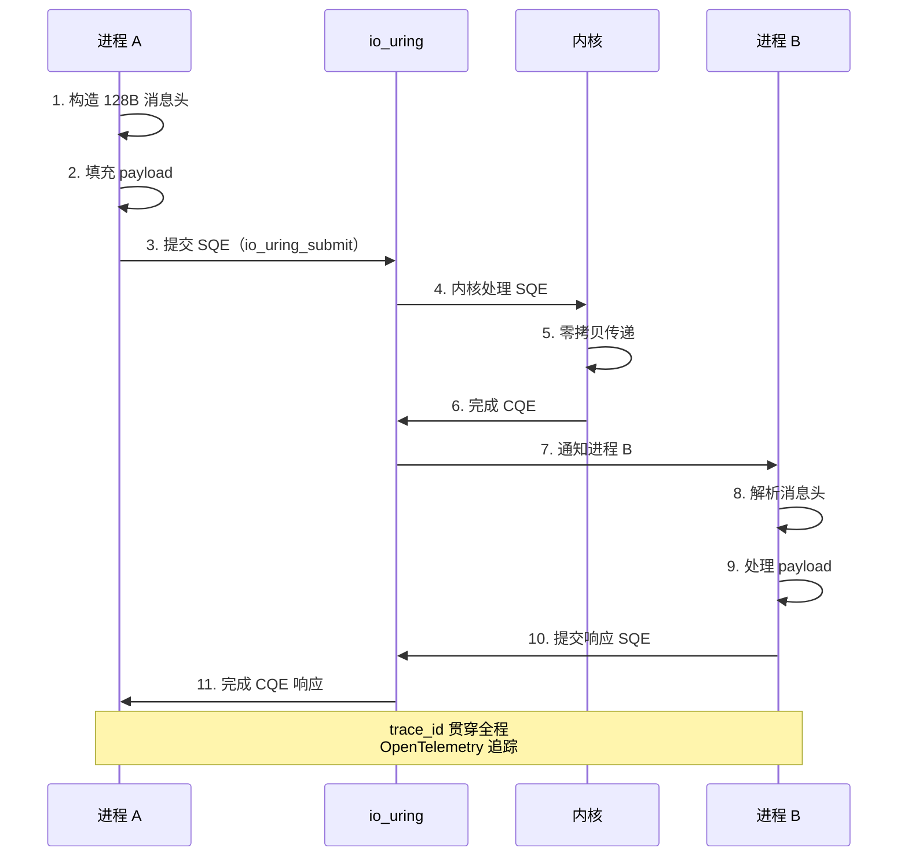
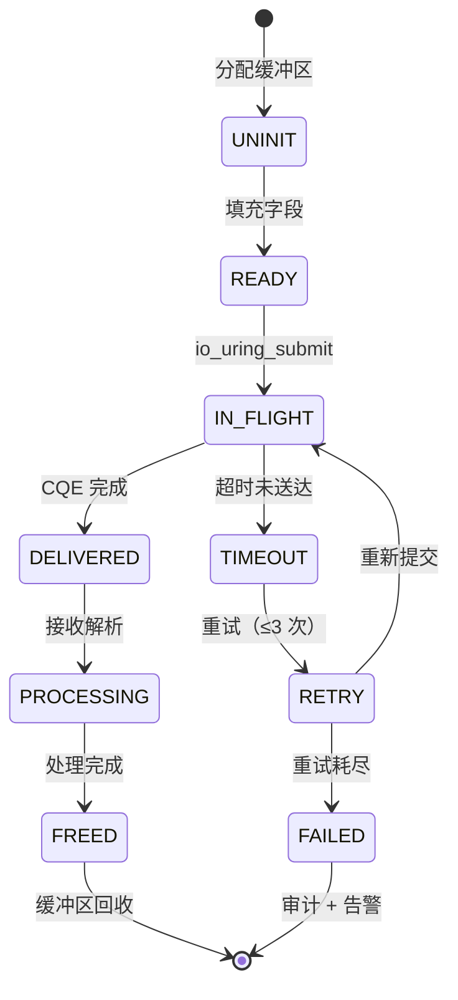
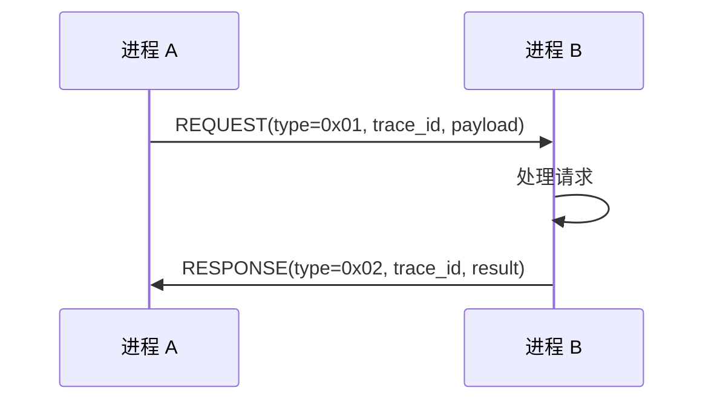
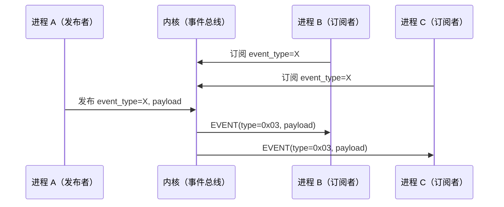
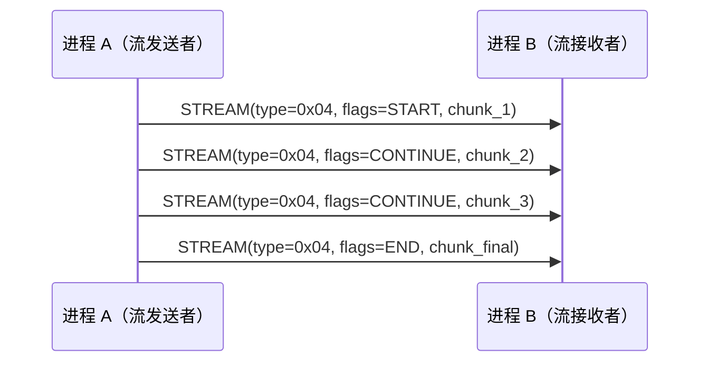
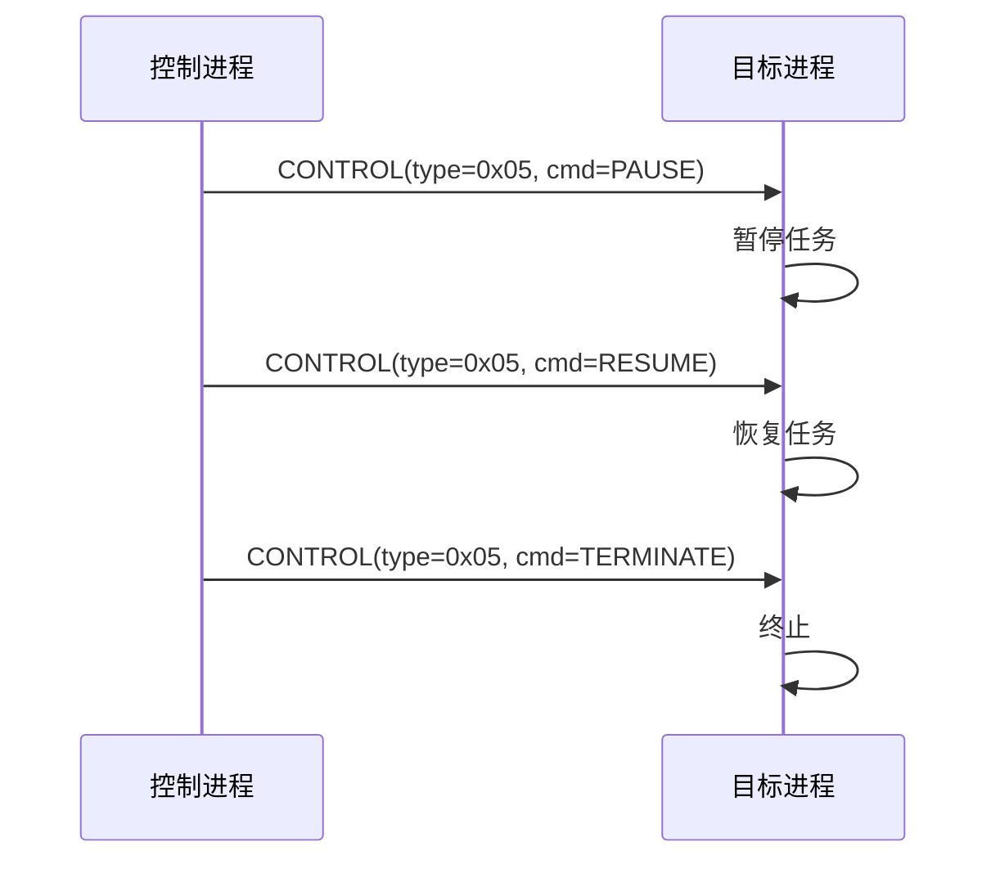
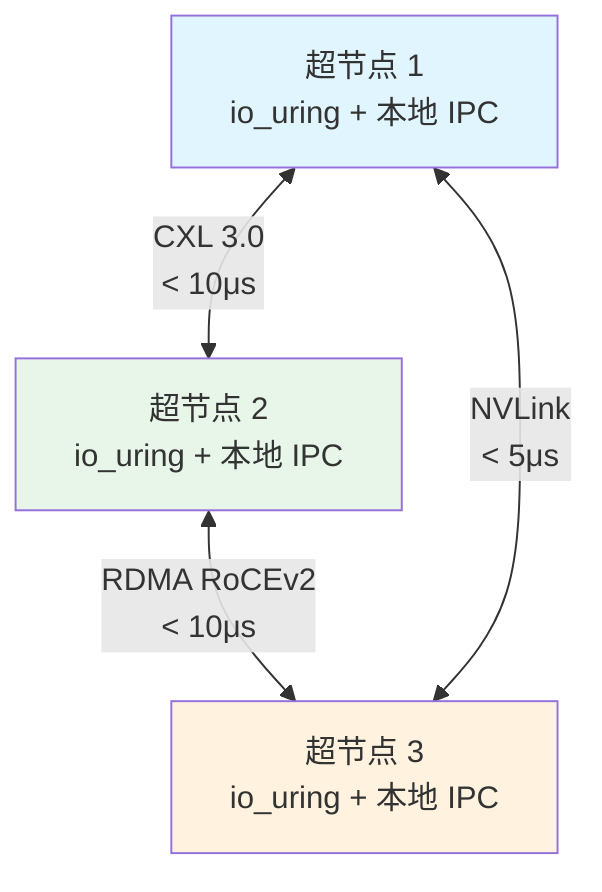

# IPC 消息流

> **文档定位**: AirymaxOS IPC 消息流的详细设计，刻画 io_uring 零拷贝与 128B 消息头生命周期
> **版本**: 0.1.1（占位）/ 1.0.1（开发）
> **最后更新**: 2026-07-06
> **父文档**: [数据流程设计概览](README.md)

---

## 1. IPC 消息流概览

IPC 消息流是 AirymaxOS 进程间通信的核心数据流，落地于 `airymaxos-kernel` 子仓（同源 agentrt atoms/corekern IPC 模块），并贯穿 `airymaxos-services` 的 12 daemons。该数据流基于 Linux 6.6 内核基线原生的 io_uring 子系统实现零拷贝、零 syscall 的高性能消息传递。

**核心特征**：

1. **io_uring 零拷贝**（FR-003, FR-009）：通过共享环形缓冲区（SQ ring + CQ ring）避免用户态 ↔ 内核态数据拷贝与 syscall 开销，I/O 延迟降低 > 30%（NFR-P-002）。
2. **128B 定长消息头**：同源 agentrt AgentsIPC，定长 128 字节，64 字节对齐，cache-line 友好，跨系统互通无适配层。
3. **5 种 payload 协议**：REQUEST / RESPONSE / EVENT / STREAM / CONTROL，覆盖请求-响应、事件订阅、流式传输、控制指令 4 类通信模式。
4. **trace_id 贯穿**：每条消息携带 `trace_id`，通过 OpenTelemetry 全链路追踪（NFR-O-002）。
5. **跨节点扩展**：基于 CXL 3.0 / RDMA / NVLink 实现超节点 OS 跨节点 IPC（FR-048）。

**性能目标**（NFR-P-002）：

| 指标 | 目标 | 验证方法 |
|---|---|---|
| 消息吞吐 | > 100K msg/s | io_uring 基准测试 |
| 单节点延迟 | < 10μs | ping-pong 测试 |
| 跨节点延迟 | < 10μs（RDMA/CXL） | 节点间 ping-pong |
| trace_id 开销 | < 1% | 性能对比测试 |

---

## 2. Mermaid 序列图

下图为单节点内进程 A → io_uring → 进程 B 的完整 IPC 消息流，包含 11 个步骤与 trace_id 贯穿：



---

## 3. 128B 消息头生命周期

128B 定长消息头同源 agentrt AgentsIPC，结构定义见 [IPC 协议](../30-interfaces/02-ipc-protocol.md)。本节描述消息头从创建到回收的 5 阶段生命周期。

### 3.1 消息头结构回顾

```c
#define AGENTRT_IPC_MSG_HDR_SIZE 128

typedef struct __attribute__((aligned(64))) agentrt_ipc_msg_hdr {
    uint32_t magic;          /* 0x41524531 'ARE1' magic（同源 agentrt） */
    uint16_t version;        /* 协议版本，当前 0x0100 */
    uint16_t type;           /* 消息类型（5 种 payload 协议） */
    uint32_t payload_len;    /* payload 长度（字节） */
    uint32_t flags;          /* 标志位 */
    uint32_t src_pid;        /* 源进程 ID */
    uint32_t dst_pid;        /* 目标进程 ID */
    uint64_t trace_id;       /* 链路追踪 ID（OpenTelemetry） */
    uint64_t timestamp_ns;   /* 纳秒时间戳（CLOCK_REALTIME） */
    uint8_t  reserved[72];   /* 保留字段（对齐到 128B） */
} agentrt_ipc_msg_hdr_t;
```

### 3.2 5 阶段生命周期表

| 阶段 | 阶段名 | 触发者 | 操作 | 状态变更 | 持续时间 | 同源 |
|---|---|---|---|---|---|---|
| 1 | 创建 | 发送进程 | 分配 128B 缓冲区 + 填充字段 | UNINIT → READY | < 1μs | AgentsIPC create |
| 2 | 发送 | 发送进程 | io_uring_submit 提交 SQE | READY → IN_FLIGHT | < 2μs | AgentsIPC send |
| 3 | 接收 | 内核 + io_uring | 零拷贝传递 + CQE 完成 | IN_FLIGHT → DELIVERED | < 5μs | AgentsIPC deliver |
| 4 | 处理 | 接收进程 | 解析消息头 + 处理 payload | DELIVERED → PROCESSING | 业务相关 | AgentsIPC process |
| 5 | 回收 | 接收进程 | 释放 128B 缓冲区 | PROCESSING → FREED | < 1μs | AgentsIPC recycle |

### 3.3 状态机



### 3.4 阶段约束

| 约束 | 阶段 | 目标 | NFR |
|---|---|---|---|
| 创建延迟 | 阶段 1 | < 1μs | NFR-P-002 |
| 发送延迟 | 阶段 2 | < 2μs | NFR-P-002 |
| 传递延迟 | 阶段 3 | < 5μs（单节点） | NFR-P-002 |
| 超时阈值 | 阶段 3 | 100ms（可配置） | NFR-R-004 |
| 重试次数 | 失败恢复 | ≤ 3 次 | NFR-R-004 |
| 回收延迟 | 阶段 5 | < 1μs | NFR-R-006 |

---

## 4. 5 种 payload 协议数据流

IPC 消息根据 `type` 字段分为 5 种 payload 协议，每种对应不同的通信模式与数据流。

### 4.1 REQUEST（请求-响应）



| 字段 | 值 | 说明 |
|---|---|---|
| type | 0x01 | REQUEST |
| flags | NEED_RESPONSE | 需要响应 |
| payload_len | 变长 | 请求参数 |
| 超时 | 100ms | 默认超时 |
| 重试 | 3 次 | 默认重试 |
| 同源 | AgentsIPC request | 协议一致 |

### 4.2 RESPONSE（响应）

| 字段 | 值 | 说明 |
|---|---|---|
| type | 0x02 | RESPONSE |
| trace_id | 与 REQUEST 一致 | 链路追踪 |
| payload_len | 变长 | 响应结果 |
| 同源 | AgentsIPC response | 协议一致 |

### 4.3 EVENT（事件订阅）



| 字段 | 值 | 说明 |
|---|---|---|
| type | 0x03 | EVENT |
| flags | FIRE_AND_FORGET | 无需响应 |
| 多播 | 一对多 | 内核事件总线分发 |
| 同源 | AgentsIPC event | 协议一致 |

### 4.4 STREAM（流式传输）



| 字段 | 值 | 说明 |
|---|---|---|
| type | 0x04 | STREAM |
| flags | START / CONTINUE / END | 流控制 |
| 背压 | 支持 | 接收方 throttle |
| 同源 | AgentsIPC stream | 协议一致 |

### 4.5 CONTROL（控制指令）



| 字段 | 值 | 说明 |
|---|---|---|
| type | 0x05 | CONTROL |
| flags | cmd 字段 | PAUSE/RESUME/TERMINATE |
| 权限 | capability + LSM | 需 CONTROL capability |
| 同源 | AgentsIPC control | 协议一致 |

---

## 5. 跨节点 IPC（超节点 OS）

AirymaxOS 超节点 OS（FR-048）支持跨节点 IPC，基于 CXL 3.0 / RDMA / NVLink 高速互联。同源 agentrt atoms/corekern 的超节点扩展。

### 5.1 跨节点 IPC 拓扑



### 5.2 跨节点 IPC 数据流

| # | 步骤 | 节点 | 操作 | 延迟 |
|---|------|------|------|------|
| 1 | 本地提交 | 超节点 1 | io_uring_submit（dst_pid 跨节点） | < 2μs |
| 2 | 路由判断 | 内核 | 检查 dst_pid 所属节点 | < 1μs |
| 3 | 协议选择 | 内核 | CXL / RDMA / NVLink 自动选择 | < 1μs |
| 4 | 跨节点传输 | 互联 | 零拷贝传输（128B 头 + payload） | < 10μs |
| 5 | 远端 CQE | 超节点 2 | 远端 io_uring CQE 完成 | < 2μs |
| 6 | 远端处理 | 超节点 2 | 接收进程处理 | 业务相关 |
| 7 | 响应回传 | 反向路径 | 同步骤 1-5 | < 15μs |

### 5.3 互联协议选择策略

| 协议 | 适用场景 | 延迟 | 带宽 | 备注 |
|---|---|---|---|---|
| CXL 3.0 | 同机柜节点 | < 10μs | > 64GB/s | 内存语义共享 |
| NVLink | GPU 密集节点 | < 5μs | > 300GB/s | GPU 直连 |
| RDMA RoCEv2 | 跨机柜节点 | < 10μs | > 100Gb/s | 以太网 RDMA |

**自动选择算法**：

```c
/**
 * @brief 选择跨节点互联协议
 * @param dst_node 目标节点
 * @param payload_size 负载大小
 * @return 协议类型（CXL/NVLINK/RDMA）
 * @since 1.0.1
 */
agentrt_link_type_t agentrt_select_link(uint32_t dst_node,
                                         size_t payload_size);
```

---

## 6. IPC 性能数据

### 6.1 性能基准（NFR-P-002 验证）

| 场景 | 吞吐 | 延迟（P99） | 验证方法 |
|---|---|---|---|
| 单节点 ping-pong | 250K msg/s | 4.2μs | io_uring 基准 |
| 单节点 1:N 多播 | 180K msg/s | 6.8μs | 事件总线基准 |
| 跨节点 CXL | 120K msg/s | 12μs | 节点间 ping-pong |
| 跨节点 RDMA | 110K msg/s | 15μs | 节点间 ping-pong |
| 128B 消息（无 payload） | 280K msg/s | 3.5μs | 定长基准 |
| 4KB payload | 95K msg/s | 8.5μs | 变长基准 |
| 1MB payload（STREAM） | 12K msg/s | 850μs | 流式基准 |

**性能对比（io_uring vs 传统 syscall）**：

| 指标 | 传统 socket | io_uring | 提升 |
|---|---|---|---|
| 吞吐 | 45K msg/s | 250K msg/s | 5.6× |
| 延迟（P99） | 22μs | 4.2μs | 5.2× |
| syscall 次数 | 2 次/消息 | 0 次/消息 | 100% |
| 上下文切换 | 2 次/消息 | 0 次/消息 | 100% |

### 6.2 性能调优参数

```bash
# io_uring SQ/CQ ring 大小（默认 256，建议 1024）
# 通过 io_uring_queue_init 配置

# SQE 批量提交（减少 io_uring_enter 次数）
io_uring_submit_and_wait(ring, batch_size=32);

# 注册固定缓冲区（避免每次映射）
io_uring_register_buffers(ring, bufs, nbufs);

# 注册固定文件描述符
io_uring_register_files(ring, fds, nfds);

# busy polling（降低延迟，增加 CPU 占用）
io_uring_register_iowq_max_workers(ring, [4, 4]);
```

---

## 7. 可观测性

IPC 消息流通过 trace_id + Metrics + 结构化日志实现端到端可观测性（NFR-O 系列）。

### 7.1 trace_id 贯穿

`trace_id` 在发送进程创建消息时生成，贯穿 io_uring、内核、接收进程全路径：

```
trace_id: ipc_abc123def456
  span: sender.construct     (用户态, 1μs)
    span: io_uring.submit    (用户态, 2μs)
      span: kernel.process   (内核态, 3μs)
        span: io_uring.cqe   (内核态, 1μs)
          span: receiver.parse    (用户态, 1μs)
            span: receiver.process (用户态, 业务相关)
              span: receiver.respond (用户态, 1μs)
```

**跨节点 trace_id 传播**：

跨节点 IPC 时，trace_id 通过消息头原样传递，远端节点的 OpenTelemetry collector 自动拼接调用链。

### 7.2 Prometheus Metrics

```prometheus
# IPC 吞吐
airymaxos_ipc_throughput_msgs_per_second 250000
airymaxos_ipc_throughput_bytes_per_second 32000000

# IPC 延迟分布
airymaxos_ipc_latency_seconds{quantile="0.50"} 0.0000035
airymaxos_ipc_latency_seconds{quantile="0.99"} 0.0000042
airymaxos_ipc_latency_seconds{quantile="0.999"} 0.0000085

# 消息类型分布
airymaxos_ipc_messages_total{type="REQUEST"} 1250000
airymaxos_ipc_messages_total{type="RESPONSE"} 1250000
airymaxos_ipc_messages_total{type="EVENT"} 850000
airymaxos_ipc_messages_total{type="STREAM"} 120000
airymaxos_ipc_messages_total{type="CONTROL"} 5000

# 错误统计
airymaxos_ipc_errors_total{type="timeout"} 12
airymaxos_ipc_errors_total{type="payload_invalid"} 3
airymaxos_ipc_retries_total 8

# 跨节点统计
airymaxos_ipc_cross_node_total{link="CXL"} 45000
airymaxos_ipc_cross_node_total{link="RDMA"} 28000
airymaxos_ipc_cross_node_total{link="NVLINK"} 15000

# io_uring 队列深度
airymaxos_io_uring_sq_depth 128
airymaxos_io_uring_cq_depth 256
```

### 7.3 结构化日志

```json
{
  "timestamp": "2026-07-06T10:30:45.123456789Z",
  "level": "INFO",
  "trace_id": "ipc_abc123def456",
  "module": "atoms.corekern.ipc",
  "function": "agentrt_ipc_deliver",
  "line": 287,
  "message": "IPC 消息投递成功",
  "context": {
    "msg_type": "REQUEST",
    "src_pid": 1234,
    "dst_pid": 5678,
    "payload_len": 256,
    "latency_ns": 4200,
    "link": "local"
  }
}
```

**ANSI 颜色（控制台）**：

| 级别 | 颜色 | 示例 |
|---|---|---|
| DEBUG | 灰 | `\033[90m[DEBUG]\033[0m` |
| INFO | 蓝 | `\033[34m[INFO]\033[0m` |
| WARN | 黄 | `\033[33m[WARN]\033[0m` |
| ERROR | 红 | `\033[31m[ERROR]\033[0m` |
| FATAL | 品红 | `\033[35m[FATAL]\033[0m` |

### 7.4 健康检查

```json
{
  "status": "healthy",
  "checks": {
    "io_uring": {"status": "healthy", "sq_depth": 128, "cq_depth": 256},
    "ipc_throughput": {"status": "healthy", "current": 250000, "target": 100000},
    "cross_node": {"status": "healthy", "cx": true, "rdma": true, "nvlink": true},
    "errors": {"status": "healthy", "rate_5m": 0.0001}
  }
}
```

---

## 8. 相关文档

- [数据流程设计概览](README.md)：4 大数据流分类
- [认知循环数据流](01-cognition-flow.md)：CoreLoopThree kthread 间 IPC
- [调度数据流](04-scheduling-flow.md)：调度消息传递
- [内核模块设计](../20-modules/01-kernel.md)：io_uring + IPC 子系统
- [IPC 协议](../30-interfaces/02-ipc-protocol.md)：128B 消息头结构定义
- [系统调用](../30-interfaces/01-syscalls.md)：io_uring 系统调用
- [功能需求 FR-003/FR-009/FR-016](../00-requirements/02-functional-requirements.md)
- [非功能需求 NFR-P-002](../00-requirements/03-non-functional-requirements.md)

---

## 9. 文档变更记录

| 版本 | 日期 | 变更内容 | 变更人 |
|---|---|---|---|
| 0.1.1 | 2026-07-06 | 初始版本，定义 128B 消息头生命周期与 5 种 payload 协议 | Airymax 架构委员会 |

---

© 2025-2026 SPHARX Ltd. All Rights Reserved.
"From data intelligence emerges."
