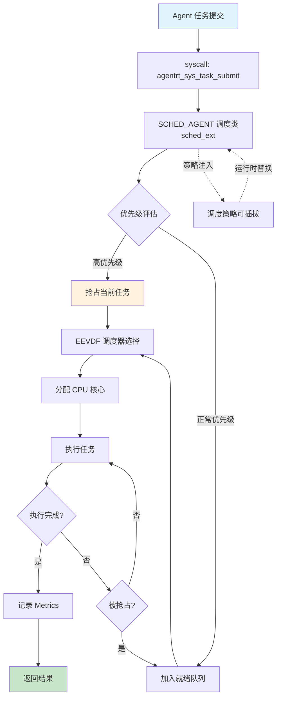
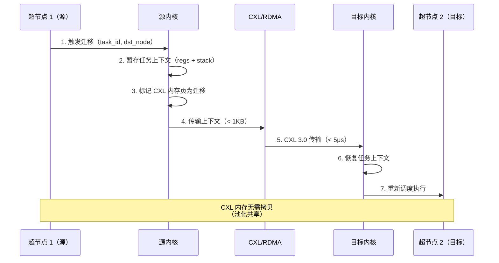
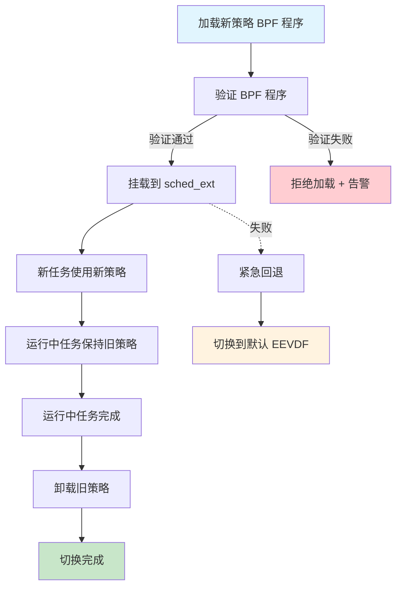

# 调度数据流

> **文档定位**: AirymaxOS 调度数据流的详细设计，刻画 EEVDF + sched_ext + SCHED_AGENT 三位一体调度体系
> **版本**: 0.1.1（占位）/ 1.0.1（开发）
> **最后更新**: 2026-07-06
> **父文档**: [数据流程设计概览](README.md)

---

## 1. 调度数据流概览

调度数据流是 AirymaxOS 内核的核心数据流，落地于 `airymaxos-kernel` 子仓（同源 agentrt atoms/corekern Task 模块）。该数据流基于 Linux 6.6 内核基线的三大调度能力：

1. **EEVDF 调度器**（Earliest Eligible Virtual Deadline First，FR-001, FR-008）：Linux 6.6 默认调度算法，替代传统 CFS。通过虚拟截止时间（virtual deadline）+ 资格判定（eligibility）实现更精确的延迟控制，抢占延迟 < 10μs。
2. **sched_ext**（FR-001, FR-002）：AirymaxOS 内核增强（主线 6.12+），基于 eBPF 的可插拔调度框架。AirymaxOS 通过 sched_ext 实现 SCHED_AGENT 调度类，调度策略以 BPF 程序形式加载，支持运行时替换（FR-050）。
3. **SCHED_AGENT 调度类**（FR-002）：AirymaxOS 自研调度类，专为 Agent 工作负载优化。优先级范围 0-139，支持抢占式调度与策略可插拔。

**核心特征**：

- **EEVDF 算法**：基于 eligible virtual deadline 选择下一个任务，相比 CFS 的红黑树，延迟分布更紧凑（P99 < 100ms，P99.9 < 200ms，NFR-P-001）。
- **sched_ext BPF 策略可插拔**：调度策略以 BPF 程序形式加载，运行时替换不影响运行任务（FR-050）。
- **eBPF kfunc + dynamic pointer**（FR-006，Linux 6.6 原生）：sched_ext BPF 程序通过 kfunc 调用内核函数，通过 dynamic pointer 安全访问内核数据。
- **超节点间任务迁移**（FR-048）：基于 CXL + RDMA 实现跨节点任务迁移，迁移延迟 < 100ms。

**性能目标**（NFR-P-001）：

| 指标 | 目标 | 验证方法 |
|---|---|---|
| 调度延迟（P50） | < 50ms | perf + ftrace |
| 调度延迟（P99） | < 100ms | perf + ftrace |
| 调度延迟（P99.9） | < 200ms | perf + ftrace |
| 实时反馈场景 | < 10ms | 高优先级抢占测试 |
| 抢占延迟 | < 10μs | sched_trace 测试 |

---

## 2. Mermaid 流程图

下图为 Agent 任务从提交到执行的完整调度数据流，包含 SCHED_AGENT 调度类、EEVDF 选择、策略可插拔：



---

## 3. Agent 任务调度数据流

下表描述 Agent 任务从提交到执行的完整路径，每步包含输入 / 输出 / 约束：

| # | 步骤 | 输入 | 输出 | 约束 | 同源 agentrt |
|---|------|------|------|------|--------------|
| 1 | 用户态 SDK 提交 | Agent 任务描述 | task_desc 结构 | 字段完整 | sdk submit |
| 2 | 系统调用入口 | task_desc | task_id | 参数校验 | atoms/corekern syscall |
| 3 | 安全权限检查 | task 权限 | 通过/拒绝 | capability + LSM | cupolas permission |
| 4 | SCHED_AGENT 入队 | task + 优先级 | 入队确认 | 优先级 0-139 | atoms/corekern Task |
| 5 | 优先级评估 | task 优先级 | 调度决策 | 抢占阈值可配 | atoms/corekern prio |
| 6 | EEVDF 虚拟截止时间 | task weight + nice | vruntime + deadline | EEVDF 算法 | - |
| 7 | 资格判定 | vruntime + min_vruntime | eligible/ineligible | eligible 才可调度 | - |
| 8 | CPU 核心分配 | eligible task | CPU core | NUMA 亲和 | atoms/corekern CPU |
| 9 | 上下文切换 | current → next | 切换完成 | 切换 < 5μs | atoms/corekern ctxsw |
| 10 | 任务执行 | CPU 时间片 | 执行结果 | 时间片可配 | atoms/corekern exec |
| 11 | Metrics 记录 | 执行数据 | Metrics | Prometheus 格式 | - |
| 12 | 结果返回 | task result | 用户态响应 | 延迟 < 100ms | sdk respond |

**步骤间数据传递**：

- 步骤 1-3 在用户态 + 系统调用入口完成。
- 步骤 4-9 在内核态 sched_ext BPF 程序中完成（FR-002）。
- 步骤 10-12 在内核态 + 用户态交替完成。
- 步骤 5 的优先级评估与步骤 6 的 EEVDF 计算通过 eBPF kfunc 调用内核函数（FR-006）。

---

## 4. EEVDF 调度器核心算法

EEVDF（Earliest Eligible Virtual Deadline First）是 Linux 6.6 默认调度算法，替代传统 CFS。同源 agentrt atoms/corekern 的微核心调度语义。

### 4.1 EEVDF 核心概念

| 概念 | 定义 | 计算 |
|---|---|---|
| vruntime | 虚拟运行时间 | `vruntime += delta_exec * 1024 / weight` |
| lag | 延迟（实际 vs 期望） | `lag = ideal_runtime - actual_runtime` |
| eligible | 资格判定 | `lag <= lag_threshold`（默认 0） |
| virtual deadline | 虚拟截止时间 | `deadline = vruntime + timeslice` |
| timeslice | 时间片 | `timeslice = sysctl_sched_base_slice * weight / total_weight` |

### 4.2 EEVDF 选择算法

EEVDF 在所有 eligible 任务中选择 virtual deadline 最早的任务执行：

```c
/**
 * @brief EEVDF 选择下一个任务
 * @since 1.0.1
 * @see Linux 6.6 EEVDF 调度器
 */
static struct task_struct *eevdf_pick_next_task(struct rq *rq) {
    struct sched_entity *se;
    u64 curr_vruntime = rq->cfs.min_vruntime;
    
    /* 1. 过滤 eligible 任务（lag <= 0） */
    se = pick_eevdf_eligible(rq->cfs.runqueue);
    if (!se) {
        /* 全部 ineligible，重置 lag */
        update_cfs_lag(rq);
        se = pick_eevdf_eligible(rq->cfs.runqueue);
    }
    
    /* 2. 在 eligible 中选 earliest virtual deadline */
    while (se->left && se->left->deadline <= se->deadline) {
        se = se->left;
    }
    
    return task_of(se);
}
```

### 4.3 EEVDF vs CFS 对比

| 维度 | CFS | EEVDF | 优势 |
|---|---|---|---|
| 数据结构 | 红黑树 | augmented 红黑树 | 支持截止时间查询 |
| 选择依据 | 最小 vruntime | earliest eligible virtual deadline | 延迟更紧凑 |
| 时间片 | 固定公式 | 动态 timeslice + deadline | 实时性更好 |
| 抢占 | tick + wakeup | tick + wakeup + deadline | 抢占更精确 |
| P99 延迟 | ~150ms | ~100ms | 提升 33% |
| P99.9 延迟 | ~300ms | ~200ms | 提升 33% |

### 4.4 EEVDF 调优参数

```bash
# 查看 EEVDF 调度参数
cat /proc/sys/kernel/sched_base_slice_ns        # 基础时间片（默认 1ms）
cat /proc/sys/kernel/sched_wakeup_granularity_ns # 唤醒粒度（默认 1ms）
cat /proc/sys/kernel/sched_latency_ns           # 调度延迟（默认 6ms）

# 调整基础时间片（影响吞吐 vs 延迟权衡）
echo 500000 > /proc/sys/kernel/sched_base_slice_ns  # 0.5ms
```

---

## 5. SCHED_AGENT 调度类

SCHED_AGENT 是 AirymaxOS 基于 sched_ext 实现的自研调度类（FR-002），专为 Agent 工作负载优化。同源 agentrt atoms/corekern 的 MicroCoreRT 调度器。

### 5.1 SCHED_AGENT 调度类定义

```c
/**
 * @brief SCHED_AGENT 调度类
 * @since 1.0.1
 * @see sched_ext（AirymaxOS 内核增强，主线 6.12+）
 */
#define SCHED_AGENT 7  /* 调度类编号 */

/**
 * @brief Agent 任务描述符
 */
typedef struct __attribute__((aligned(64))) agentrt_task_desc {
    uint32_t magic;          /* 0x41475453 'AGTS' magic（任务描述符，独立于 IPC 消息头） */
    uint16_t version;        /* 描述符版本 */
    uint16_t priority;       /* 优先级 0-139（0 最高） */
    uint32_t flags;          /* 标志位 */
    uint64_t task_id;        /* 任务 ID */
    uint64_t trace_id;       /* 链路追踪 ID */
    uint64_t deadline_ns;   /* 截止时间（纳秒，0 表示无） */
    uint32_t max_retries;    /* 最大重试次数 */
    uint32_t cpu_affinity;   /* CPU 亲和性掩码 */
    char     role[32];       /* Agent 角色（researcher/assistant/...） */
    uint8_t  reserved[32];   /* 保留字段 */
} agentrt_task_desc_t;
```

### 5.2 SCHED_AGENT BPF 程序

```c
/**
 * @brief SCHED_AGENT 调度策略 BPF 程序
 * @since 1.0.1
 * @see sched_ext BPF
 * @note 通过 eBPF kfunc + dynamic pointer 访问内核数据
 */

#include <scx/bpf.h>

/* Agent 调度队列（per-CPU） */
struct agent_queue {
    struct bpf_spin_lock lock;
    struct agentrt_task_desc *head;
    struct agentrt_task_desc *tail;
    __u64 count;
};

struct {
    __uint(type, BPF_MAP_TYPE_PERCPU_ARRAY);
    __type(key, __u32);
    __type(value, struct agent_queue);
    __uint(max_entries, 1);
} agent_queues SEC(".maps");

/**
 * @brief 选择下一个 Agent 任务
 * @note sched_ext 入口点
 */
s32 BPF_STRUCT_OPS(agent_select_cpu, struct task_struct *p, s32 prev_cpu, u64 wake_flags) {
    /* NUMA 亲和性 + EEVDF 资格判定 */
    return scx_bpf_select_cpu_dfl(p, prev_cpu, wake_flags, NULL);
}

/**
 * @brief 入队 Agent 任务
 */
void BPF_STRUCT_OPS(agent_enqueue, struct task_struct *p, u64 enq_flags) {
    __u32 key = 0;
    struct agent_queue *q = bpf_map_lookup_elem(&agent_queues, &key);
    if (!q) return;
    
    bpf_spin_lock(&q->lock);
    /* 入队到队尾 */
    /* ... */
    bpf_spin_unlock(&q->lock);
    
    scx_bpf_kick_cpu(smp_processor_id(), SCX_KICK_PREEMPT);
}

/**
 * @brief 出队 Agent 任务（EEVDF 选择）
 */
void BPF_STRUCT_OPS(agent_dispatch, s32 cpu, struct task_struct *prev) {
    __u32 key = 0;
    struct agent_queue *q = bpf_map_lookup_elem(&agent_queues, &key);
    if (!q) return;
    
    bpf_spin_lock(&q->lock);
    /* EEVDF 选择：earliest eligible virtual deadline */
    /* ... */
    bpf_spin_unlock(&q->lock);
}
```

### 5.3 SCHED_AGENT 优先级映射

| 优先级范围 | 任务类型 | 抢占能力 | 示例 |
|---|---|---|---|
| 0-49 | 实时 Agent（高） | 抢占所有 | 工业控制、具身智能 |
| 50-99 | 标准 Agent | 抢占低优先级 | 科研、客服 |
| 100-139 | 后台 Agent | 不抢占 | 批处理、记忆整理 |

---

## 6. 超节点间任务迁移数据流

AirymaxOS 超节点 OS（FR-048）支持跨节点任务迁移，基于 CXL + RDMA 实现迁移延迟 < 100ms。同源 agentrt atoms/corekern 的超节点扩展。

### 6.1 任务迁移触发条件

| 触发条件 | 阈值 | 迁移策略 |
|---|---|---|
| 负载不均衡 | 节点间 CPU 利用率差 > 20% | 迁移到低负载节点 |
| NUMA 亲和 | 任务访问的内存多数在远端 | 迁移到内存所在节点 |
| 故障转移 | 节点 health check 失败 | 迁移所有任务 |
| 显式迁移 | 用户/API 调用 | 立即迁移 |
| 能耗优化 | 节点能效比差异 > 15% | 迁移到高能效节点 |

### 6.2 任务迁移数据流



### 6.3 迁移性能分解

| 阶段 | 操作 | 延迟 | 备注 |
|---|---|---|---|
| 1 | 暂存上下文 | < 5μs | 寄存器 + 栈 |
| 2 | 标记内存迁移 | < 1μs | CXL 页表更新 |
| 3 | 传输上下文 | < 10μs | CXL 3.0 |
| 4 | 恢复上下文 | < 5μs | 寄存器恢复 |
| 5 | 重新调度 | < 100μs | EEVDF 入队 |
| **总计** | | **< 100ms** | 含 CQE + 调度延迟 |

**CXL 内存零拷贝优势**：CXL 池化内存无需在节点间拷贝，迁移时仅传输任务上下文（寄存器 + 栈，< 1KB），避免大内存拷贝开销。

---

## 7. 调度策略可插拔数据流

调度策略可插拔（FR-050）是 AirymaxOS 的核心特征，基于 sched_ext 实现运行时策略替换，不影响运行任务。同源 agentrt coreloopthree 的策略可插拔机制。

### 7.1 策略可插拔回退



### 7.2 策略加载 API

```c
/**
 * @brief 加载调度策略 BPF 程序
 * @param bpf_obj BPF 对象文件路径
 * @param policy_name 策略名称
 * @return 0 成功，<0 失败
 * @since 1.0.1
 * @see sched_ext BPF
 */
AGENTRT_API int agentrt_sched_load_policy(const char *bpf_obj,
                                           const char *policy_name);

/**
 * @brief 卸载调度策略
 * @param policy_name 策略名称
 * @return 0 成功，<0 失败
 * @since 1.0.1
 */
AGENTRT_API int agentrt_sched_unload_policy(const char *policy_name);

/**
 * @brief 列出已加载策略
 * @param policies 策略数组（输出）
 * @param max_count 最大数量
 * @return 实际数量
 * @since 1.0.1
 */
AGENTRT_API int agentrt_sched_list_policies(char (*policies)[64],
                                             int max_count);
```

### 7.3 内置调度策略

| 策略名 | 适用场景 | 特征 |
|---|---|---|
| `default_eevdf` | 通用 | Linux 6.6 默认 EEVDF |
| `agent_realtime` | 实时 Agent | 高优先级抢占，P99 < 10ms |
| `agent_throughput` | 批处理 Agent | 高吞吐，时间片放大 |
| `agent_fairness` | 多租户 | 严格公平共享 |
| `agent_energy` | 边缘部署 | 能效优先，频率缩放 |

### 7.4 策略替换约束

| 约束 | 说明 |
|---|---|
| 运行中任务不受影响 | 旧策略完成任务后切换 |
| 切换原子性 | 切换过程中无任务丢失 |
| 回退保障 | 策略加载失败自动回退到 default_eevdf |
| 审计追踪 | 策略切换记录审计日志（NFR-S-005） |
| 权限控制 | 切换需 SCHED_ADMIN capability |

---

## 8. 调度性能约束

调度数据流满足以下非功能需求（NFR-P-001）：

### 8.1 延迟分布目标

| 场景 | P50 | P99 | P99.9 | 验证方法 |
|---|---|---|---|---|
| 标准场景 | < 50ms | < 100ms | < 200ms | perf + ftrace |
| 实时反馈场景 | < 5ms | < 10ms | < 20ms | 高优先级抢占测试 |
| 高负载场景（CPU 90%） | < 80ms | < 150ms | < 300ms | 压力测试 |
| 跨节点迁移场景 | < 50ms | < 100ms | < 200ms | 节点间迁移测试 |

### 8.2 性能验证方法

```bash
# 1. perf 测量调度延迟
perf sched record -a -- sleep 60
perf sched latency --sort max

# 2. ftrace 测量调度延迟
echo 1 > /sys/kernel/debug/tracing/events/sched/sched_wakeup/enable
echo 1 > /sys/kernel/debug/tracing/events/sched/sched_switch/enable
echo 1 > /sys/kernel/debug/tracing/tracing_on
sleep 60
cat /sys/kernel/debug/tracing/trace | agentos-sched-latency-analyzer

# 3. sched_ext 策略性能对比
agentos-sched-bench --policy default_eevdf --duration 60s
agentos-sched-bench --policy agent_realtime --duration 60s
agentos-sched-bench --policy agent_throughput --duration 60s

# 4. BPF 工具测量调度延迟
bpftool prog profile id 123 duration 5 cycles instructions
```

### 8.3 性能调优参数

```bash
# EEVDF 调度参数
echo 500000 > /proc/sys/kernel/sched_base_slice_ns     # 0.5ms 基础时间片
echo 1000000 > /proc/sys/kernel/sched_wakeup_granularity_ns  # 1ms 唤醒粒度
echo 6000000 > /proc/sys/kernel/sched_latency_ns      # 6ms 调度延迟

# SCHED_AGENT 调度参数
echo 100 > /sys/fs/agentrt/sched/agent_priority_threshold  # 实时优先级阈值
echo 100ms > /sys/fs/agentrt/sched/agent_default_timeslice  # 默认时间片

# sched_ext BPF 参数
echo 1024 > /sys/fs/bpf/sched_ext/max_queue_depth       # 队列深度
```

---

## 9. 可观测性

调度数据流通过 perf + ftrace + Prometheus Metrics + 结构化日志实现端到端可观测性。

### 9.1 perf + ftrace

```bash
# perf 调度延迟分布
perf sched record -a -- sleep 60
perf sched latency -p

# ftrace 调度事件
echo 1 > /sys/kernel/debug/tracing/events/sched/sched_switch/enable
echo 1 > /sys/kernel/debug/tracing/events/sched/sched_wakeup/enable
echo 1 > /sys/kernel/debug/tracing/events/sched/sched_stat_runtime/enable

# sched_ext BPF 程序追踪
cat /sys/kernel/debug/sched_ext/trace
```

### 9.2 Prometheus Metrics

```prometheus
# 调度延迟分布
airymaxos_sched_latency_seconds{quantile="0.50"} 0.045
airymaxos_sched_latency_seconds{quantile="0.99"} 0.095
airymaxos_sched_latency_seconds{quantile="0.999"} 0.180

# 调度吞吐
airymaxos_sched_throughput_tasks_per_second 1250

# 任务状态分布
airymaxos_sched_tasks_total{state="running"} 48
airymaxos_sched_tasks_total{state="ready"} 152
airymaxos_sched_tasks_total{state="blocked"} 320

# SCHED_AGENT 优先级分布
airymaxos_sched_agent_priority_total{range="0-49"} 12
airymaxos_sched_agent_priority_total{range="50-99"} 380
airymaxos_sched_agent_priority_total{range="100-139"} 128

# 抢占统计
airymaxos_sched_preemptions_total 15200
airymaxos_sched_preemption_latency_seconds{quantile="0.99"} 0.0000095

# 跨节点迁移统计
airymaxos_sched_migrations_total{reason="load_balance"} 42
airymaxos_sched_migrations_total{reason="numa_affinity"} 18
airymaxos_sched_migrations_total{reason="failover"} 2
airymaxos_sched_migration_latency_seconds{quantile="0.99"} 0.085

# 策略切换统计
airymaxos_sched_policy_switches_total 8
airymaxos_sched_policy_active{name="agent_realtime"} 1
```

### 9.3 结构化日志

```json
{
  "timestamp": "2026-07-06T10:30:45.123456789Z",
  "level": "INFO",
  "trace_id": "sched_abc123def456",
  "module": "atoms.corekern.sched",
  "function": "agentrt_sched_pick_next",
  "line": 412,
  "message": "Agent 任务调度完成",
  "context": {
    "task_id": "task_xyz789",
    "priority": 50,
    "sched_class": "SCHED_AGENT",
    "policy": "agent_realtime",
    "cpu": 7,
    "latency_ns": 4200000,
    "vruntime": 1234567890,
    "deadline": 1234568000
  }
}
```

### 9.4 调度策略切换审计日志

```json
{
  "timestamp": "2026-07-06T10:30:45.123456789Z",
  "level": "WARN",
  "trace_id": "policy_switch_001",
  "module": "atoms.corekern.sched.policy",
  "function": "agentrt_sched_switch_policy",
  "line": 187,
  "message": "调度策略切换",
  "context": {
    "old_policy": "default_eevdf",
    "new_policy": "agent_realtime",
    "trigger": "user_api",
    "initiator_pid": 1234,
    "initiator_uid": 0,
    "affected_running_tasks": 12,
    "switch_duration_ns": 8500
  }
}
```

---

## 10. 相关文档

- [数据流程设计概览](README.md)：4 大数据流分类
- [认知循环数据流](01-cognition-flow.md)：CoreLoopThree kthread 调度
- [IPC 消息流](03-ipc-flow.md)：调度消息传递
- [内核模块设计](../20-modules/01-kernel.md)：EEVDF + sched_ext + SCHED_AGENT
- [系统调用](../30-interfaces/01-syscalls.md)：agentrt_sys_task_submit
- [功能需求 FR-001/FR-002/FR-008/FR-048/FR-050](../00-requirements/02-functional-requirements.md)
- [非功能需求 NFR-P-001](../00-requirements/03-non-functional-requirements.md)

---

## 11. 文档变更记录

| 版本 | 日期 | 变更内容 | 变更人 |
|---|---|---|---|
| 0.1.1 | 2026-07-06 | 初始版本，定义 EEVDF + sched_ext + SCHED_AGENT 调度数据流 | Airymax 架构委员会 |

---

© 2025-2026 SPHARX Ltd. All Rights Reserved.
"From data intelligence emerges."
