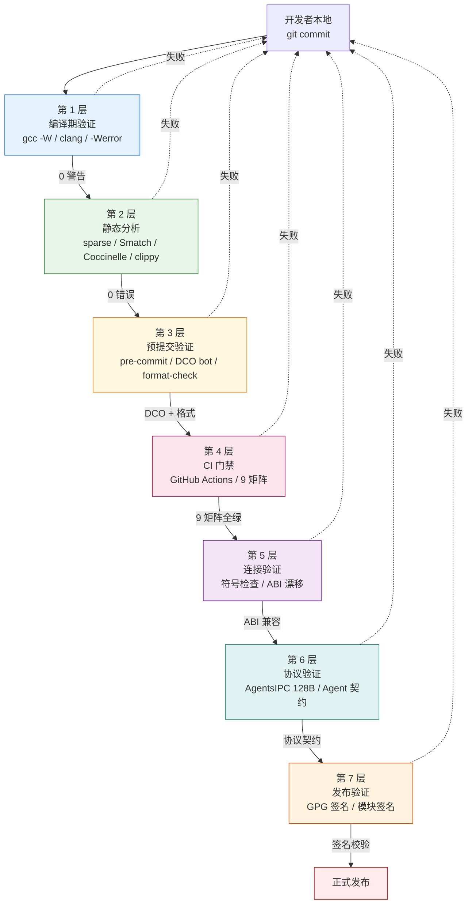
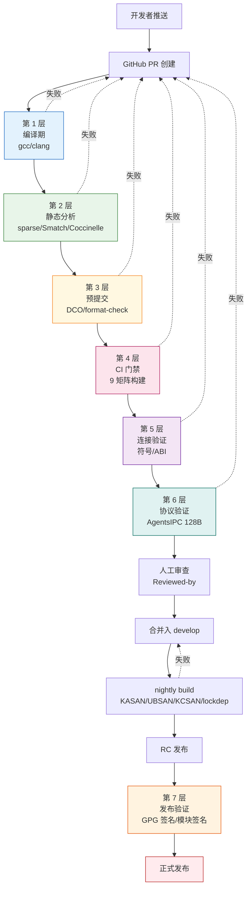

Copyright (c) 2025-2026 SPHARX Ltd. All Rights Reserved.

# agentrt-liunx（AirymaxOS）工具链与自动化标准

> **文档定位**: agentrt-liunx（AirymaxOS，极境智能体操作系统）工程标准规范第 6 卷——工具链与自动化。本卷规定 7 层自动化验证体系、编译期/静态/动态分析工具链、格式化与风格检查、测试框架、覆盖率门槛、CI/CD 流水线与 24 项提交检查清单。
> **版本**: 1.0.1（开发）
> **最后更新**: 2026-07-06
> **同源映射**: `docs/ARCHITECTURAL_PRINCIPLES.md`（五维正交 24 原则）+ Linux 6.6 内核基线 `Documentation/dev-tools/testing-overview.rst`
> **理论根基**: Linux 6.6 内核基线工程思想 + Airymax 体系并行论（Multibody Cybernetic Intelligent System）

---

## 0. 章节定位

本卷是 agentrt-liunx 工程标准 7 主题文档中的第 6 卷，回答"规范怎么被执行"这一问题。它在 05 开发流程（补丁生命周期、审查响应）与 07 维护者制度（治理、DCO、成熟度模型）之间形成自动化执行层：

- **上游依赖**：05 开发流程定义"规范在哪个阶段被执行"——每个生命周期阶段的强制工具链关卡；本卷定义"规范怎么被执行"——7 层验证流水线、CI/CD 矩阵、覆盖率门槛。
- **下游依赖**：07 维护者制度定义"谁来执行规范"——CODEOWNERS、审查者、DCO bot；本卷定义"机器怎么协助人执行规范"——GitHub Actions、DCO bot、format-check。

本卷所有强制规则均赋予 **OS-STD** / **OS-TEST** / **OS-BUILD** 编号，与 07 维护者制度与治理的"规则编号注册表"对齐。

### 0.1 关键术语

| 术语 | 定义 |
|------|------|
| 7 层验证 | agentrt-liunx 的核心自动化验证体系，从编译期到发布期共 7 层 |
| checkpatch | Linux 内核风格检查脚本（`scripts/checkpatch.pl`），agentrt-liunx 沿用并扩展 |
| KUnit | Linux 内核白盒单元测试框架，毫秒级运行 |
| kselftest | Linux 内核用户态系统级测试框架 |
| KASAN / KFENCE / UBSAN / KCSAN | Linux 内核动态分析工具（地址/内存/未定义行为/并发消毒器） |
| MicroCoreRT | Airymax 微核心运行时基座（Minimal Core Runtime），其协议层验证属第 6 层 |
| AgentsIPC 128B | Airymax 智能体 IPC 协议定长消息头，第 6 层验证对象 |
| 五维正交 24 原则 | Airymax 架构设计原则体系（S/K/C/E/A 五维） |

---

## 1. 7 层自动化验证体系（Airymax 核心机制）

agentrt-liunx 在 Linux 6.6 内核基线工程工具链之上，构建了 7 层自动化验证体系。这是 agentrt-liunx 区别于普通 Linux 发行版的核心机制——每一层都是一个独立的反馈闭环，任何一层失败都阻断后续流程。

### 1.1 第 1 层：编译期验证

- **工具**：`gcc -W` / `-Wall` / `-Werror` / `clang`
- **命令**：`make KCFLAGS=-W`（开启所有警告）
- **OS-STD-001**：编译期必须 0 警告 0 错误；任何警告都必须修复或显式标注 `#pragma` 抑制并附说明。
- **OS-STD-002**：所有 C 代码必须同时通过 gcc 与 clang 编译（双编译器交叉验证）。
- **OS-STD-003**：所有 Rust 代码必须通过 `cargo build` 与 `cargo clippy`。

### 1.2 第 2 层：静态分析

- **工具**：sparse / Smatch / Coccinelle / clang-analyzer / rust-clippy
- **命令**：`make C=2`（sparse）/ `make CHECK=smatch`（Smatch）/ `make coccicheck`（Coccinelle）
- **OS-STD-011**：静态分析必须 0 错误；warnings 必须逐条评估并记录到 `static-analysis-baseline.md`。
- **OS-STD-012**：新增代码引入新的 sparse/Smatch 警告禁止合并。

### 1.3 第 3 层：预提交验证

- **工具**：pre-commit hooks / DCO bot / format-check
- **触发**：`git commit` 时本地 hook + GitHub PR 创建时服务端检查
- **OS-STD-021**：所有仓库必须配置 `.pre-commit-config.yaml`，本地 hook 在 commit 前自动运行 checkpatch + format-check。
- **OS-STD-022**：DCO bot 自动验证每个 commit 的 `Signed-off-by:` 链；无 DCO 签名的 commit 禁止推送到远端。
- **OS-STD-023**：`make format-check` 必须通过；不通过的 commit 禁止推送。

### 1.4 第 4 层：CI 门禁

- **工具**：GitHub Actions / 多配置构建
- **触发**：每次 PR 创建与更新
- **OS-STD-031**：PR 必须通过所有 GitHub Actions 检查才能合并；任一失败禁止合并（与 OS-STD-233 对齐）。
- **OS-STD-032**：CI 矩阵必须覆盖 x86_64 / aarch64 / riscv64 × allmodconfig / allnoconfig / defconfig 共 9 种组合。
- **OS-STD-033**：CI 总时长不得超过 60 分钟；超时的 job 必须拆分或缓存优化。

### 1.5 第 5 层：连接验证

- **工具**：链接检查 / 跨模块符号检查
- **检查项**：未定义符号、重复符号、ABI 漂移、模块签名兼容性
- **OS-STD-041**：所有 EXPORT_SYMBOL 必须在 `Module.symvers` 中有对应条目。
- **OS-STD-042**：跨子仓符号引用必须通过 `scripts/check_abisym.sh` 验证 ABI 兼容性。

### 1.6 第 6 层：协议验证

- **工具**：AgentsIPC 128B 消息头校验器 / Agent 行为契约测试
- **检查项**：AgentsIPC 128B 消息头字段对齐、版本号、校验和、Agent 行为契约（输入 → 输出映射）
- **OS-STD-051**：任何修改 AgentsIPC 128B 消息头布局的 PR 必须通过 `airymax-ipc-check` 工具验证向后兼容性。
- **OS-STD-052**：Agent SDK 接口必须有对应的行为契约测试，覆盖正常路径与异常路径。

### 1.7 第 7 层：发布验证

- **工具**：签名 / 校验和 / 模块签名
- **检查项**：GPG 签名、SHA-256 校验和、内核模块签名（CONFIG_MODULE_SIG_FORCE）
- **OS-STD-061**：正式发布版本必须由 agentrt-liunx 发布密钥 GPG 签名。
- **OS-STD-062**：所有可加载内核模块必须签名；未签名模块禁止加载（生产配置）。

### 1.8 7 层验证流水线图

---

## 2. 编译期工具链

### 2.1 gcc -W（开启所有警告）

- 编译期是 7 层验证的第一道关，必须在此拦截尽可能多的低级错误。
- `make KCFLAGS=-W` 开启所有 gcc 警告，会输出大量噪音，但能发现"signed/unsigned 比较"等隐蔽 bug。
- **OS-STD-071**：所有新增 C 文件必须用 `gcc -W` 编译通过。

### 2.2 make KCFLAGS=-W

- 全局编译时通过 `KCFLAGS` 注入额外警告标志。
- 推荐组合：`KCFLAGS="-W -Wextra -Wno-unused-parameter"`

### 2.3 多配置构建

| 配置 | 命令 | 用途 |
|------|------|------|
| `allnoconfig` | `make allnoconfig` | 最小配置，验证依赖关系 |
| `allmodconfig` | `make allmodconfig` | 最大配置，验证所有模块编译 |
| `defconfig` | `make defconfig` | 默认配置，验证常用路径 |
| `O=builddir` | `make O=build defconfig` | 外部构建目录，验证路径无关性 |

**OS-STD-072**：所有 PR 必须在 `allnoconfig` / `allmodconfig` / `defconfig` 三种配置下编译通过。

### 2.4 跨架构构建

- **x86_64**：主力开发架构
- **aarch64**：嵌入式与服务器 ARM 架构
- **riscv64**：新兴 RISC-V 架构

**OS-STD-073**：所有 PR 必须在 x86_64 / aarch64 / riscv64 三种架构下交叉编译通过。
**OS-STD-074**：ppc64 推荐用于交叉编译检查（其使用 `unsigned long` 表示 64 位量，能发现隐式类型转换 bug）。

### 2.5 Rust 编译

- agentrt-liunx 在安全敏感且非热路径的子系统（如安全策略、文件系统解析）使用 Rust 内核模块。
- **OS-STD-075**：Rust 代码必须通过 `cargo build --target x86_64-unknown-none` 编译。
- **OS-STD-076**：Rust 代码必须通过 `cargo clippy -- -D warnings`（clippy 警告视为错误）。
- **OS-STD-077**：Rust 代码必须通过 `cargo fmt --check`（rustfmt 格式化）。

---

## 3. 静态分析工具

### 3.1 sparse（类型检查）

- Sparse 做**类型检查**：验证 `__user` 指针注解、`__bitwise` 类型、字节序注解、RCU 锁注解。
- 命令：`make C=2`（C=1 仅检查修改的文件，C=2 检查全部）
- **OS-STD-081**：新增代码必须通过 `make C=2` 检查；新增的 sparse 警告禁止合并。

### 3.2 Smatch（模式匹配）

- Smatch 做**流分析**：跨函数分析、缓冲区大小推断、用户可控索引检查、整数溢出、空指针解引用、内存泄漏。
- 命令：`make CHECK=smatch C=2`
- Smatch 比稀疏更易写自定义检查，但与 sparse 有部分重叠。
- **OS-STD-082**：Smatch 警告必须逐条评估，假阳性记录到 `smatch-baseline.md`。

### 3.3 Coccinelle（语义补丁）

- Coccinelle 做**模式转换**：在预处理前分析，能检查宏内 bug；可自动生成修复补丁。
- 命令：`make coccicheck`
- 典型用途：批量将 `kmalloc(x * size, GFP_KERNEL)` 转换为 `kmalloc_array(x, size, GFP_KERNEL)`。
- **OS-STD-083**：Coccinelle 报告的所有 API 误用必须修复或显式抑制。

### 3.4 clang-analyzer

- clang 静态分析器，与 sparse / Smatch 形成互补。
- 命令：`scan-build make`
- **OS-STD-084**：clang-analyzer 报告的 high severity 问题必须修复。

### 3.5 rust-clippy

- Rust 的 lint 工具，捕获惯用法反模式。
- 命令：`cargo clippy -- -D warnings`
- **OS-STD-085**：所有 Rust 代码必须 clippy 0 警告（与 OS-STD-076 对齐）。

### 3.6 agentrt-liunx 专属：AgentsIPC 协议静态校验器

- `airymax-ipc-check` 工具：静态校验 AgentsIPC 128B 消息头布局、字段对齐、版本号一致性。
- 检查项：
  - 消息头总长度是否为 128 字节
  - 字段偏移是否符合协议定义（详见 30-interfaces）
  - 版本号字段是否单调递增
  - 校验和字段位置是否正确
- **OS-STD-086**：任何修改 AgentsIPC 协议定义的 PR 必须通过 `airymax-ipc-check`。

---

## 4. 动态分析工具

动态分析工具在内核运行时检测 bug 类。它们不像 KUnit/kselftest 那样"通过/失败"，而是与测试结合使用，确保测试运行期间无错误发生。

### 4.1 KASAN（地址消毒器）

- 检测无效内存访问：越界、use-after-free。
- 配置：`CONFIG_KASAN=y`
- 性能开销大，仅用于测试环境。
- **OS-STD-091**：所有 kselftest 必须在 KASAN 启用的内核上运行。

### 4.2 KFENCE（轻量级内存错误检测）

- KFENCE 是 KASAN 的轻量级替代，性能开销极小，可用于生产环境。
- 配置：`CONFIG_KFENCE=y`
- **OS-STD-092**：生产环境推荐启用 KFENCE（采样模式）。

### 4.3 UBSAN（未定义行为消毒器）

- 检测 C 标准未定义行为：整数溢出、移位越界、对齐违规。
- 配置：`CONFIG_UBSAN=y`
- **OS-STD-093**：所有 kselftest 必须在 UBSAN 启用的内核上运行。

### 4.4 KCSAN（并发消毒器）

- 检测数据竞争（data race）。
- 配置：`CONFIG_KCSAN=y`
- **OS-STD-094**：所有并发测试必须在 KCSAN 启用的内核上运行。

### 4.5 lockdep（锁依赖检查）

- 锁正确性验证器，检测死锁、锁顺序违规。
- 配置：`CONFIG_LOCKDEP=y` / `CONFIG_PROVE_LOCKING=y`
- **OS-STD-095**：所有代码路径必须在 lockdep 全功能启用下验证。

### 4.6 kmemleak（内存泄漏检测）

- 检测可能的内存泄漏。
- 配置：`CONFIG_DEBUG_KMEMLEAK=y`
- **OS-STD-096**：kselftest 运行后必须检查 kmemleak 报告，新增泄漏禁止合并。

### 4.7 KCOV（代码覆盖率）

- 内置覆盖率收集，按任务记录，适用于模糊测试。
- 配置：`CONFIG_KCOV=y`
- **OS-STD-097**：模糊测试必须启用 KCOV 收集覆盖率。

### 4.8 gcov（GCC 覆盖率）

- GCC 覆盖率工具，全局或按模块覆盖率。
- 配置：`CONFIG_GCOV_KERNEL=y`
- 覆盖率数据从 debugfs 读取，用 gcov 工具解读。

---

## 5. 格式化与风格检查

### 5.1 checkpatch.pl（Linux 内核风格检查）

- `scripts/checkpatch.pl` 是 Linux 内核风格检查脚本，agentrt-liunx 完全沿用并扩展。
- 三级报告：
  - **ERROR**：极可能错误的项
  - **WARNING**：需仔细审查的项
  - **CHECK**：需思考的项
- **OS-STD-101**：所有 commit 的 diff 必须通过 `scripts/checkpatch.pl --strict` 检查，ERROR 禁止存在。
- **OS-STD-102**：剩余的 WARNING/CHECK 必须可被作者辩护（justified）。

### 5.2 .clang-format（C/C++ 格式化）

- `.clang-format` 文件定义 C/C++ 格式化规则（689 行 + 560 个 ForEachMacros）。
- 命令：`clang-format -i <file>`
- **OS-STD-103**：所有 C/C++ 文件必须通过 `clang-format` 格式化。

### 5.3 .rustfmt.toml（Rust 格式化）

- `.rustfmt.toml` 定义 Rust 格式化规则（edition 2021）。
- 命令：`cargo fmt`
- **OS-STD-104**：所有 Rust 文件必须通过 `cargo fmt --check`。

### 5.4 Black + isort（Python 格式化）

- Black：Python 代码格式化（无配置选项，统一风格）。
- isort：import 排序。
- 配置文件：`pyproject.toml`
- **OS-STD-105**：所有 Python 文件必须通过 `black --check` + `isort --check`。

### 5.5 Prettier（TypeScript 格式化）

- Prettier：TypeScript/JavaScript 代码格式化。
- 配置文件：`.prettierrc`
- **OS-STD-106**：所有 TypeScript/JavaScript 文件必须通过 `prettier --check`。

### 5.6 CI 强制 make format-check

- **OS-STD-107**：CI 流水线必须包含 `make format-check` 步骤；失败即 PR 阻断。
- `make format-check` 聚合上述所有格式化检查，统一报告。

---

## 6. 测试框架

### 6.1 KUnit（白盒单元测试，毫秒级）

- KUnit 是内核内建的**白盒测试**框架：测试代码是内核的一部分，可访问未暴露给用户空间的内部结构与函数。
- 适合测试**小型、自包含的内核部分**，可在隔离环境中测试。
- 构建与运行极快，可在开发过程中频繁运行。
- 典型用途：测试单个内核函数，甚至单条代码路径（如错误处理分支）。
- **OS-STD-111**：所有新增内核工具函数必须有对应 KUnit 测试。

### 6.2 kselftest（用户态系统级测试）

- kselftest 主要在用户态实现，测试是普通用户态脚本或程序。
- 适合测试**完整特性**：通过系统调用、设备、文件系统等用户可见接口测试。
- 无法直接调用内核函数，但可包含配套内核模块暴露更多信息。
- 典型用途：所有新增系统调用必须伴随 kselftest。
- **OS-STD-112**：所有新增系统调用必须有对应 kselftest。

### 6.3 lib/test_*（内核自检）

- 内核 `lib/test_*.c` 文件是内核启动时自检模块。
- 适合启动期即可确定的特性验证（如 BPF、内存管理子系统）。
- **OS-STD-113**：关键子系统建议添加 `lib/test_<subsystem>.c` 自检。

### 6.4 fault injection（错误注入）

- 故障注入框架：模拟 slab/page 分配失败、磁盘 IO 错误等。
- 配置：`CONFIG_FAULT_INJECTION=y` / `CONFIG_FAILSLAB=y` / `CONFIG_FAIL_PAGE_ALLOC=y`
- **OS-STD-114**：所有新增代码路径必须经过至少 slab/page 分配失败注入测试。

### 6.5 agentrt-liunx 专属：Agent 行为契约测试 + 模糊测试

- **Agent 行为契约测试**：每个 Agent SDK 接口定义输入 → 输出契约，测试覆盖正常路径与异常路径。
- **模糊测试**：使用 libFuzzer / syzkaller 对 AgentsIPC 128B 消息头、系统调用接口进行模糊测试。
- **OS-STD-115**：Agent SDK 接口必须有行为契约测试，覆盖率 ≥80%。
- **OS-STD-116**：AgentsIPC 128B 消息头必须有 syzkaller 描述符，纳入持续模糊测试。

---

## 7. 覆盖率门槛

### 7.1 KCOV（代码覆盖率）

- KCOV 是内核内建的覆盖率收集工具，按任务记录，适用于模糊测试与单次系统调用覆盖率分析。
- 配置：`CONFIG_KCOV=y`

### 7.2 gcov（GCC 覆盖率）

- gcov 是 GCC 的覆盖率工具，提供全局或按模块覆盖率。
- 与 KCOV 不同，gcov 不按任务记录覆盖率。
- 配置：`CONFIG_GCOV_KERNEL=y`
- 覆盖率数据从 debugfs 读取，用 gcov 工具解读。

### 7.3 最低覆盖率门槛

- **OS-STD-121**：内核子系统代码的行覆盖率必须 ≥80%（KUnit + kselftest 合计）。
- **OS-STD-122**：Agent SDK 代码的行覆盖率必须 ≥80%。
- **OS-STD-123**：覆盖率报告由 CI 自动生成，发布到 GitHub Pages 供审查者查看。

### 7.4 关键路径必须 100% 覆盖

- **热路径**：调度器、内存分配、IPC 派发——必须 100% 行覆盖。
- **安全路径**：Cupolas 权限裁决、Sanitizer 输入净化、Audit 审计——必须 100% 行覆盖。
- **OS-STD-124**：关键路径代码的行覆盖率必须 100%；新增未覆盖行禁止合并。

---

## 8. CI/CD 流水线

### 8.1 GitHub Actions workflow

- agentrt-liunx 的 CI/CD 流水线基于 GitHub Actions。
- 每个子仓一个 `.github/workflows/` 目录，包含多个 workflow 文件。
- **OS-STD-131**：所有子仓必须维护 `ci.yml`（PR 触发）、`nightly.yml`（定时触发）、`release.yml`（标签触发）三个核心 workflow。

### 8.2 多矩阵构建（OS × arch × config）

- 矩阵维度：
  - 操作系统：Ubuntu 22.04 / Ubuntu 24.04
  - 架构：x86_64 / aarch64 / riscv64
  - 配置：allmodconfig / allnoconfig / defconfig
- **OS-STD-132**：CI 矩阵必须覆盖 9 种组合（3 架构 × 3 配置）。

### 8.3 PR 必须通过所有检查才能合并

- **OS-STD-133**：PR 必须通过所有 GitHub Actions 检查才能合并；任一失败禁止合并（与 OS-STD-031 / OS-STD-233 对齐）。
- 分支保护规则：`main` / `develop` / `release/*` 必须启用 "Require status checks to pass before merging"。

### 8.4 nightly build（全配置构建）

- 每天凌晨 UTC+8 03:00 触发，对 `develop` 分支进行全配置构建。
- **OS-STD-134**：nightly build 必须覆盖 9 矩阵 + KASAN/UBSAN/KCSAN/lockdep 全动态分析工具。
- **OS-STD-135**：nightly build 失败必须在 24 小时内修复或回滚（与 OS-STD-132 对齐）。

### 8.5 release pipeline（签名 + 发布）

- 标签触发（如 `v1.0.1`）自动启动 release pipeline。
- 流程：构建 → 7 层验证 → GPG 签名 → 生成校验和 → 上传 GitHub Release → 通知发行版团队。
- **OS-STD-136**：release pipeline 必须在 7 层验证全通过后才执行签名步骤。

### 8.6 CI/CD 流水线图

---

## 9. 提交检查清单（24 项）

本节是 Linux `Documentation/process/submit-checklist.rst` 的 agentrt-liunx 等价物，扩展为 24 项强制检查。

### 9.1 Linux submit-checklist.rst 等价物

agentrt-liunx 继承 Linux 内核的 24 项提交检查清单，并新增 agentrt-liunx 专属检查项。

### 9.2 24 项检查清单

| # | 检查项 | OS-STD |
|---|--------|--------|
| 1 | 使用的设施必须 `#include` 其定义头文件，不依赖间接包含 | OS-STD-141 |
| 2a | 在 `=y` / `=m` / `=n` 配置下编译无 gcc/linker 警告错误 | OS-STD-001 |
| 2b | 通过 `allnoconfig` / `allmodconfig` | OS-STD-072 |
| 2c | 使用 `O=builddir` 构建成功 | OS-STD-072 |
| 2d | Documentation/ 改动通过 `make htmldocs` 构建 | OS-STD-142 |
| 3 | 在多 CPU 架构上交叉编译通过 | OS-STD-073 |
| 4 | ppc64 推荐用于交叉编译检查 | OS-STD-074 |
| 5 | 通过 `scripts/checkpatch.pl` 风格检查 | OS-STD-101 |
| 6 | 新增/修改的 CONFIG 选项不破坏配置菜单，默认 off | OS-STD-143 |
| 7 | 所有新 Kconfig 选项有帮助文本 | OS-STD-144 |
| 8 | 相关 Kconfig 组合已仔细审查 | OS-STD-145 |
| 9 | 通过 sparse 检查 | OS-STD-081 |
| 10 | `make checkstack` 检查，超 512 字节栈的函数需修改 | OS-STD-146 |
| 11 | 全局内核 API 包含 kernel-doc 文档 | OS-STD-147 |
| 12 | 在 PREEMPT/DEBUG_PREEMPT/DEBUG_SLAB/PROVE_RCU 等同时启用下测试 | OS-STD-148 |
| 13 | 在 SMP/PREEMPT 开关下构建与运行测试 | OS-STD-149 |
| 14 | 所有代码路径在 lockdep 全功能启用下验证 | OS-STD-095 |
| 15 | 新增 `/proc` 条目在 `Documentation/` 下文档化 | OS-STD-150 |
| 16 | 新增内核启动参数在 kernel-parameters.rst 文档化 | OS-STD-151 |
| 17 | 新增模块参数用 `MODULE_PARM_DESC()` 文档化 | OS-STD-152 |
| 18 | 新增用户空间接口在 `Documentation/ABI/` 文档化 | OS-STD-153 |
| 19 | 至少 slab/page 分配失败注入测试 | OS-STD-114 |
| 20 | 新增代码用 `gcc -W`（`make KCFLAGS=-W`）编译 | OS-STD-071 |
| 21 | 合并入 develop 后通过跨子系统联调测试 | OS-STD-154 |
| 22 | 所有内存屏障（barrier/rmb/wmb）有注释说明逻辑 | OS-STD-155 |
| 23 | 新增 ioctl 更新 ioctl-number.rst | OS-STD-156 |
| 24 | 相关 Kconfig 符号禁用/`=m` 组合下多次构建测试 | OS-STD-157 |

### 9.3 agentrt-liunx 专属新增检查项

在 24 项基础检查之上，agentrt-liunx 新增以下专属检查：

| # | 检查项 | OS-STD |
|---|--------|--------|
| A1 | Agent SDK 接口有对应行为契约测试 | OS-STD-115 |
| A2 | AgentsIPC 128B 消息头改动通过 `airymax-ipc-check` | OS-STD-086 |
| A3 | 多语言文档同步（C/Rust/Python/TS） | OS-STD-158 |
| A4 | 五维原则映射小节存在于设计文档 | OS-STD-102（05 卷） |
| A5 | 关键路径覆盖率 100% | OS-STD-124 |
| A6 | 模糊测试覆盖系统调用与 IPC 接口 | OS-STD-116 |

---

## 10. 7 层验证与 Airymax 五维原则映射

本卷 7 层验证体系与 Airymax 五维正交 24 原则的映射如下：

| 原则 | 含义 | 在本卷的体现 |
|------|------|------------|
| **S-1 反馈闭环** | 系统每一层必须有完整"感知-决策-执行-反馈"闭环 | 7 层验证的每一层都是独立反馈闭环；CI 失败即反馈，阻断后续流程 |
| **S-2 层次分解** | 复杂系统按层次分解 | 7 层验证按"编译期 → 静态 → 预提交 → CI → 连接 → 协议 → 发布"层次分解，每层职责单一 |
| **E-1 安全内生** | 安全是设计内生的，不是附加的 | 模块签名（OS-STD-062）、KFENCE 生产部署（OS-STD-092）、安全路径 100% 覆盖（OS-STD-124） |
| **E-2 可观测性** | 系统行为可观测 | 覆盖率报告发布到 GitHub Pages（OS-STD-123）、CI 全流程可追溯 |
| **E-6 错误可追溯** | 错误可溯源、可追踪 | 静态分析基线（OS-STD-011）、Smatch 基线（OS-STD-082）、checkpatch ERROR 禁止（OS-STD-101） |
| **E-7 文档即代码** | 文档与代码同源同审 | `make htmldocs` 构建（OS-STD-142）、kernel-doc 强制（OS-STD-147）、ABI 文档化（OS-STD-153） |
| **E-8 可测试性** | 系统可测试 | KUnit + kselftest + fault injection + 模糊测试构成完整测试矩阵 |
| **A-1 极简主义** | 反过度抽象 | checkpatch 严格模式（OS-STD-101）、clippy 0 警告（OS-STD-085） |
| **A-2 细节关注** | 行尾禁止空白、函数原型元素顺序 | format-check 强制（OS-STD-107）、checkpatch CHECK 级检查 |
| **A-4 完美主义** | 7 层验证确保完美 | 7 层验证全通过才允许发布（OS-STD-136）、关键路径 100% 覆盖（OS-STD-124） |

---

## 11. OS-STD 规则编号汇总

本卷定义的 OS-STD 规则编号汇总如下，与 07 卷"规则编号注册表"对齐：

| 编号 | 规则 | 强制级别 |
|------|------|---------|
| OS-STD-001 | 编译期 0 警告 0 错误 | MUST |
| OS-STD-002 | gcc + clang 双编译器验证 | MUST |
| OS-STD-003 | Rust 通过 cargo build + clippy | MUST |
| OS-STD-011 | 静态分析 0 错误 | MUST |
| OS-STD-012 | 新增代码禁止引入 sparse/Smatch 警告 | MUST |
| OS-STD-021 | 仓库配置 .pre-commit-config.yaml | MUST |
| OS-STD-022 | DCO bot 验证 Signed-off-by 链 | MUST |
| OS-STD-023 | make format-check 必须通过 | MUST |
| OS-STD-031 | PR 必须过全部 GitHub Actions | MUST |
| OS-STD-032 | CI 矩阵覆盖 9 种组合 | MUST |
| OS-STD-033 | CI 总时长 ≤60 分钟 | MUST |
| OS-STD-041 | EXPORT_SYMBOL 在 Module.symvers 中 | MUST |
| OS-STD-042 | 跨子仓符号通过 check_abisym.sh | MUST |
| OS-STD-051 | AgentsIPC 128B 改动通过 airymax-ipc-check | MUST |
| OS-STD-052 | Agent SDK 接口有行为契约测试 | MUST |
| OS-STD-061 | 正式版本 GPG 签名 | MUST |
| OS-STD-062 | 内核模块签名强制 | MUST |
| OS-STD-071 | 新增 C 文件用 gcc -W 编译通过 | MUST |
| OS-STD-072 | 三种配置编译通过 | MUST |
| OS-STD-073 | 三架构交叉编译通过 | MUST |
| OS-STD-074 | ppc64 推荐交叉编译检查 | SHOULD |
| OS-STD-075 | Rust 通过 cargo build --target | MUST |
| OS-STD-076 | Rust clippy 0 警告 | MUST |
| OS-STD-077 | Rust 通过 cargo fmt --check | MUST |
| OS-STD-081 | 新增代码通过 make C=2 | MUST |
| OS-STD-082 | Smatch 警告逐条评估 | MUST |
| OS-STD-083 | Coccinelle API 误用修复 | MUST |
| OS-STD-084 | clang-analyzer high severity 修复 | MUST |
| OS-STD-085 | Rust clippy 0 警告（同 076） | MUST |
| OS-STD-086 | AgentsIPC 协议改动通过 airymax-ipc-check | MUST |
| OS-STD-091 | kselftest 在 KASAN 内核上运行 | MUST |
| OS-STD-092 | 生产环境推荐 KFENCE | SHOULD |
| OS-STD-093 | kselftest 在 UBSAN 内核上运行 | MUST |
| OS-STD-094 | 并发测试在 KCSAN 内核上运行 | MUST |
| OS-STD-095 | 代码路径在 lockdep 全功能下验证 | MUST |
| OS-STD-096 | kselftest 后检查 kmemleak | MUST |
| OS-STD-097 | 模糊测试启用 KCOV | MUST |
| OS-STD-101 | checkpatch --strict 无 ERROR | MUST |
| OS-STD-102 | WARNING/CHECK 可被辩护 | MUST |
| OS-STD-103 | C/C++ 通过 clang-format | MUST |
| OS-STD-104 | Rust 通过 cargo fmt --check | MUST |
| OS-STD-105 | Python 通过 black + isort | MUST |
| OS-STD-106 | TS/JS 通过 prettier | MUST |
| OS-STD-107 | CI 含 make format-check 步骤 | MUST |
| OS-STD-111 | 工具函数有 KUnit 测试 | MUST |
| OS-STD-112 | 新增系统调用有 kselftest | MUST |
| OS-STD-113 | 关键子系统集成 lib/test_* | SHOULD |
| OS-STD-114 | 错误注入测试 | MUST |
| OS-STD-115 | Agent SDK 行为契约测试覆盖率 ≥80% | MUST |
| OS-STD-116 | AgentsIPC 有 syzkaller 描述符 | MUST |
| OS-STD-121 | 内核子系统覆盖率 ≥80% | MUST |
| OS-STD-122 | Agent SDK 覆盖率 ≥80% | MUST |
| OS-STD-123 | 覆盖率报告发布 GitHub Pages | MUST |
| OS-STD-124 | 关键路径覆盖率 100% | MUST |
| OS-STD-131 | 子仓维护 ci/nightly/release workflow | MUST |
| OS-STD-132 | CI 矩阵覆盖 9 组合 | MUST |
| OS-STD-133 | PR 必须过全部检查（同 031/233） | MUST |
| OS-STD-134 | nightly 覆盖 9 矩阵 + 全动态分析 | MUST |
| OS-STD-135 | nightly 失败 24 小时修复 | MUST |
| OS-STD-136 | release pipeline 在 7 层验证后签名 | MUST |
| OS-STD-141 | 设施 #include 其定义头文件 | MUST |
| OS-STD-142 | Documentation 通过 make htmldocs | MUST |
| OS-STD-143 | 新 CONFIG 选项默认 off | MUST |
| OS-STD-144 | 新 Kconfig 有帮助文本 | MUST |
| OS-STD-145 | Kconfig 组合审查 | MUST |
| OS-STD-146 | 栈 >512 字节函数需修改 | SHOULD |
| OS-STD-147 | 全局 API 含 kernel-doc | MUST |
| OS-STD-148 | DEBUG 选项同时启用测试 | MUST |
| OS-STD-149 | SMP/PREEMPT 开关测试 | MUST |
| OS-STD-150 | /proc 条目文档化 | MUST |
| OS-STD-151 | 内核启动参数文档化 | MUST |
| OS-STD-152 | 模块参数 MODULE_PARM_DESC | MUST |
| OS-STD-153 | 用户空间接口 Documentation/ABI 文档化 | MUST |
| OS-STD-154 | 合并 develop 后跨子系统联调 | MUST |
| OS-STD-155 | 内存屏障有逻辑注释 | MUST |
| OS-STD-156 | 新增 ioctl 更新 ioctl-number.rst | MUST |
| OS-STD-157 | Kconfig 禁用/`=m` 组合构建测试 | MUST |
| OS-STD-158 | 多语言文档同步 | MUST |

---

## 12. 工具链配置即代码

agentrt-liunx 的工具链配置以代码形式存放在仓库中，确保所有开发者与 CI 使用一致配置。

### 12.1 配置文件清单

| 文件 | 用途 | 路径 |
|------|------|------|
| `.clang-format` | C/C++ 格式化（689 行 + ForEachMacros） | 仓库根 |
| `.rustfmt.toml` | Rust 格式化（edition 2021） | 仓库根 |
| `pyproject.toml` | Python 格式化（Black + isort） | 仓库根 |
| `.prettierrc` | TypeScript/JavaScript 格式化 | 仓库根 |
| `.pre-commit-config.yaml` | 预提交 hook 配置 | 仓库根 |
| `.github/workflows/ci.yml` | PR 触发 CI | `.github/workflows/` |
| `.github/workflows/nightly.yml` | 定时 nightly build | `.github/workflows/` |
| `.github/workflows/release.yml` | 标签触发 release | `.github/workflows/` |
| `CODEOWNERS` | 自动识别审查者 | 仓库根 |
| `MAINTAINERS.md` | 维护者列表（详见 07 卷） | 仓库根 |

### 12.2 工具链版本固定

- **OS-STD-161**：所有工具链版本（gcc / clang / rustc / sparse / Smatch）必须在 `toolchain-versions.txt` 中固定，CI 与本地开发使用同一版本。
- **OS-STD-162**：工具链版本升级必须经过专门 PR 评审，验证不引入新警告或破坏现有检查。

---

## 13. 相关文档

### 13.1 同卷文档

- `04-engineering-philosophy.md`（工程思想：双层稳定性 / 策略机制分离 / 可测试性）
- `05-development-process.md`（开发流程：补丁生命周期 / 7 层验证关卡映射）
- `07-maintainers-and-governance.md`（维护者制度：CODEOWNERS / DCO bot / 治理）

### 13.2 上游设计文档

- `70-build-system/`（构建系统设计：MicroCoreRT 构建链 / 多语言构建）
- `80-testing/`（测试体系设计：KUnit / kselftest / Agent 行为契约）
- `90-observability/`（可观测性设计：覆盖率报告 / CI 全流程可追溯）
- `110-security/`（安全加固设计：模块签名 / KFENCE 生产部署）

### 13.3 参考材料

- Linux 6.6 内核源码 `Documentation/dev-tools/testing-overview.rst`
- Linux 6.6 内核源码 `Documentation/dev-tools/kunit/index.rst`
- Linux 6.6 内核源码 `Documentation/dev-tools/kselftest.rst`
- Linux 6.6 内核源码 `Documentation/process/submit-checklist.rst`

---

## 14. 文档版本与维护

- **当前版本**: v1.0.1（2026-07-06）
- **维护者**: agentrt-liunx 工程标准委员会（待成立，详见 07 卷）
- **变更流程**: 任何本卷变更必须经过 RFC → 评审 → ACC 验收流程
- **回顾周期**: 季度回顾 + 年度大版本

---

> **文档结束** | agentrt-liunx 工程标准第 6 卷 | 共 13 章节 + 规则编号汇总
