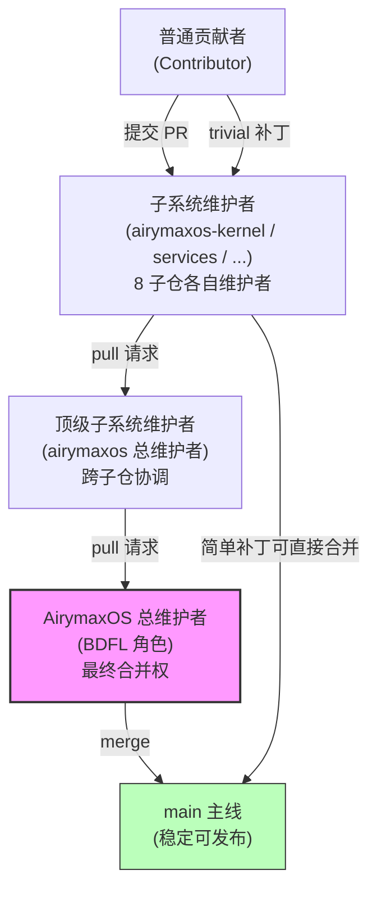

Copyright (c) 2025-2026 SPHARX Ltd. All Rights Reserved.

# AirymaxOS 维护者制度与治理

> **文档定位**: AirymaxOS（agentrt-linux，极境智能体操作系统）工程标准规范第 7 篇——治理层规范
> **版本**: 0.1.1（占位）/ 1.0.1（开发）
> **最后更新**: 2026-07-06
> **同源映射**: agentrt `docs/ARCHITECTURAL_PRINCIPLES.md`（五维正交 24 原则）+ Linux 6.6 内核基线 `MAINTAINERS`（734KB）维护者制度范本
> **理论根基**: Linux 内核 30+ 年沉淀的 Lieutenant System（副官系统）+ Airymax 体系并行论
> **替代关系**: 本文档替代 Linux `Documentation/process/management-style.rst`、`submitting-patches.rst`（DCO 章节）、`contribution-maturity-model.rst`、`6.Followthrough.rst` 在 AirymaxOS 场景下的适用

---

## 目录

1. 维护者制度概述
2. MAINTAINERS 文件结构
3. 维护者层级制度（Lieutenant System）
4. 8 子仓维护者分配
5. DCO（Developer's Certificate of Origin）
6. Reviewer's Statement of Oversight
7. 6 级贡献者成熟度模型
8. 审查礼仪（A-3 人文关怀）
9. 管理哲学（BDFL 角色）
10. OS 工程规则编号注册表
11. 五维原则映射

---

## 第 1 章 维护者制度概述

### 1.1 为什么需要维护者制度

AirymaxOS 是一个跨内核态与用户态、跨 8 个子仓、跨多语言栈（C/Rust/Python/TypeScript）的智能体操作系统发行版。当一个项目的代码量、贡献者数量、子系统边界同时增长时，"谁有权接受补丁""谁对某段代码的稳定性负责""补丁如何从作者流到主线"这三个问题若没有明确答案，项目会迅速退化为"无人负责的代码海洋"。

维护者制度就是为回答这三个问题而存在的治理机制。它不是官僚层级，而是一条**信任链**——每一级维护者为下一级背书，每一份补丁的传播路径可被追溯，每一行代码的责任人可在 `MAINTAINERS` 文件中查到。

### 1.2 Linux 内核 30+ 年沉淀的 Lieutenant System

Linux 内核自 1991 年起，用 30 余年沉淀出一套被验证有效的副官系统（Lieutenant System）：Linus Torvalds 并不直接审查每一份补丁，而是把子系统信任授权给维护者（如网络栈的 David Miller、内存管理的 Andrew Morton），维护者再把子模块信任授权给下一级维护者。补丁沿信任链向上流动，每一级维护者只审查"自己不信任的下层送上来的东西"。

这套机制的关键数据：Linus 直接处理的补丁长期维持在约 1.3% 的比例——这不是因为 Linus 偷懒，而是因为信任链已经把 98.7% 的补丁在到达他之前过滤、审查、稳定过一遍。AirymaxOS 直接继承这套经过验证的治理模型。

### 1.3 AirymaxOS 维护者制度的三大支柱

AirymaxOS 维护者制度建立在三个不可拆分的支柱之上：

| 支柱 | 作用 | 落地章节 |
|------|------|---------|
| **信任链** | 定义补丁从作者到主线的传播路径与责任背书 | 第 3 章 |
| **MAINTAINERS 文件** | 子系统归属的单一事实源，代码路径 → 维护者的可机器解析映射 | 第 2、4 章 |
| **6 级成熟度模型** | 组织层面的人才梯队建设标准，定义"工程师被允许/期望/鼓励做多少上游工作" | 第 7 章 |

三大支柱缺一不可：没有信任链，MAINTAINERS 文件只是一份通讯录；没有 MAINTAINERS 文件，信任链无法被工具（如 `get_maintainer.pl`、CODEOWNERS bot）自动消费；没有成熟度模型，组织不会分配工作时间给上游贡献，信任链就会因维护者无暇审查而断裂。

### 1.4 IRON-9 同源但独立：与 agentrt 治理的关系

AirymaxOS 工程标准与 agentrt 工程标准是 **IRON-9 同源但独立** 的关系：

- **同源**：两端共享五维正交 24 原则作为顶层设计哲学；共享 17 类规则编号体系骨架（IRON/BAN/STD/ACC）；共享 MicroCoreRT 微核心运行时理念（AirymaxOS 在内核态实现 MicroCoreRT，agentrt 在用户态实现同源语义）。
- **独立**：AirymaxOS 承担内核态严肃性责任——内核 ABI 稳定性、内核内部 API 不稳定性、补丁生命周期、维护者层级制度是 agentrt 不涉及的领域；AirymaxOS 的治理规则（OS-IRON-5~10、OS-STD-GOV-*）独立于 agentrt 的 IRON 规则。
- **互操作**：agentrt 在 AirymaxOS 上运行时，两端的治理边界清晰——agentrt 遵循用户态运行时治理（其自身的 IRON-1~10），AirymaxOS 遵循内核发行版治理（本文档的 OS-IRON-5~10）。两端通过同源语义（AgentsIPC 128B 消息头）实现无适配层互操作，但治理上互不越权。

> **OS-IRON-9**：AirymaxOS 治理与 agentrt 治理 IRON-9 同源但独立——共享原则骨架，独立行使内核态/用户态各自的治理权责，互不否决对方的工程决策。

---

## 第 2 章 MAINTAINERS 文件结构

### 2.1 字段定义（Linux 内核 14 字段）

AirymaxOS 沿用 Linux 6.6 内核基线 `MAINTAINERS` 文件的 14 字段，并按现代 SCM（git + GitHub）场景做适配：

| 字段 | 含义 | AirymaxOS 适配 |
|------|------|----------------|
| M: | Mail patches to（主维护者邮箱） | M: GitHub handle + email |
| R: | Designated Reviewer | R: Reviewers GitHub handle |
| L: | Mailing list | L: GitHub Discussions 板块 |
| S: | Status | S: 同 Linux（Supported/Maintained/Odd Fixes/Orphan/Obsolete）+ 新增 Experimental/Pilot/Stable/Deprecated |
| W: | Web-page | W: 文档站点 URL |
| Q: | Patchwork | Q: GitHub Projects URL |
| B: | Bug tracker URI | B: GitHub Issues URL |
| C: | Chat protocol/server/channel | C: Slack/Discord channel |
| P: | Subsystem Profile 文档 | P: 同 Linux（子系统提交指南） |
| T: | SCM tree 类型与位置 | T: GitHub repo URL + 分支 |
| F: | Files and directories wildcard patterns | F: 同 Linux |
| X: | Excluded files | X: 同 Linux |
| N: | Files Regex patterns | N: 同 Linux |
| K: | Content regex pattern | K: 同 Linux |

字段匹配优先级遵循 Linux 规则：`X:` 排除先于 `F:` 匹配；`N:` 正则匹配会触发 git log 历史回溯以通知历史签名者；`K:` 内容正则匹配补丁或文件内容。`F:` 模式尾随斜杠包含子目录，`F: drivers/net/*` 不含子目录下文件。

### 2.2 AirymaxOS 新增字段

在 14 字段之外，AirymaxOS 新增 3 个字段以承载同源治理与代码所有权信息：

| 字段 | 含义 | 示例 |
|------|------|------|
| **O:** | Owners file（与 CODEOWNERS 格式兼容，供 GitHub CODEOWNERS bot 消费） | O: @airymaxos/kernel-team |
| **H:** | 同源 agentrt 模块（标注 IRON-9 同源但独立的对应关系） | H: atoms/corekern |
| **V:** | 版本兼容性声明（标注该子系统对 AirymaxOS 主版本/内核基线的要求） | V: AirymaxOS 1.x / Linux 6.6 |

`O:` 字段是 `M:`/`R:` 的 CODEOWNERS 投影——`M:`/`R:` 给人看，`O:` 给机器看。两者必须保持一致，CI 会校验。`H:` 字段是 IRON-9 同源但独立原则的落地：每个 AirymaxOS 子系统须声明其 agentrt 同源模块，以便在两端的语义漂移检测中自动对齐。

### 2.3 Status 状态定义

AirymaxOS 在 Linux 原有 5 种状态基础上，新增 4 种面向发行版生命周期的状态：

| 状态 | 含义 | 适用场景 |
|------|------|---------|
| Supported | 有人被付费照看 | 商业支持的核心子系统 |
| Maintained | 有人实际照看 | 社区维护的稳定子系统 |
| Odd Fixes | 有维护者但仅偶发修复 | 历史遗留子系统 |
| Orphan | 当前无维护者（欢迎认领） | 待认领的孤儿模块 |
| Obsolete | 已被更好系统替代的旧代码 | 即将移除的遗留代码 |
| **Experimental** | 实验性，API/ABI 可能剧烈变动 | AirymaxOS 0.1.x 阶段全部子仓 |
| **Pilot** | 试点阶段，在有限场景验证 | 新引入的子系统（如 sched_ext 调度器试点） |
| **Stable** | 稳定阶段，遵循版本化演进 | 1.0.x 发布后的核心子系统 |
| **Deprecated** | 弃用中，已发布弃用声明与宽限期 | 进入弃用流程的接口/子系统 |

> 0.1.1 版本下，8 个子仓全部标注为 `Experimental`；进入 1.0.1 版本时，核心子仓升级为 `Pilot`；经一个 LTS 周期验证后升为 `Stable`。

---

## 第 3 章 维护者层级制度（Lieutenant System）

### 3.1 信任链结构

AirymaxOS 的补丁传播遵循严格的信任链分层：

### 3.2 信任链原则

信任链的运作遵循四条不可妥协的原则：

1. **逐层背书**：每一层维护者信任下层维护者的选择，只审查"下层送上来的、自己未参与过的"补丁。上级不绕过下级直接审查底层补丁——绕过即破坏信任链。
2. **链可任意长但实务不超过 2-3 级**：理论上信任链可无限延伸，但超过 3 级会显著增加补丁延迟与合并冲突风险。AirymaxOS 实务上限为 3 级（贡献者 → 子系统维护者 → 总维护者）。
3. **总维护者信任子系统维护者不送坏补丁上来**：这是信任链的根基。若子系统维护者反复送上未充分审查的补丁，总维护者会逐步降低对该子系统的信任权重，乃至收回合并授权。
4. **直接处理比例可作为信任链健康度指标**：参考 Linus 约 1.3% 直接处理率，AirymaxOS 总维护者的直接处理比例应维持在 5% 以下（项目规模较小时上限可放宽）。若该比例持续升高，意味着信任链在某一层断裂——下层维护者要么缺位、要么不作为。

### 3.3 子系统维护者职责

子系统维护者是信任链的承重墙，其职责不可下放：

- **审查并接受/拒绝补丁**：对进入子系统的每一份补丁做出明确决定（接受 / 请求修改 / 拒绝），不得"挂起不处理"。
- **维护子系统稳定性**：对子系统的 regression 负首要责任；regression 发生时须在 72 小时内响应（修复或回退）。
- **协调跨子系统冲突**：当补丁涉及多个子系统时，主动与相关子系统维护者协商合并顺序。
- **培养下一级维护者**：识别活跃贡献者并逐步授权（从 Reviewed-by 到 Acked-by 到合授权），避免子系统"单点故障"。
- **维护 MAINTAINERS 文件**：子系统内代码路径归属变更时，及时更新本子系统的 `MAINTAINERS` 条目。

---

## 第 4 章 8 子仓维护者分配

AirymaxOS 由 8 个子仓构成，每个子仓对应一个 agentrt 同源模块域。0.1.1 版本下维护者席位待定（TBD），但归属关系与同源映射须先行固定：

| 子仓 | 中文 | 主维护者 | 审查者 | 状态 | 同源 agentrt 模块 |
|------|------|---------|--------|------|------------------|
| airymaxos-kernel | 极境内核 | TBD | TBD | Experimental | atoms/corekern |
| airymaxos-services | 极境服务 | TBD | TBD | Experimental | daemons |
| airymaxos-security | 极境安全 | TBD | TBD | Experimental | cupolas |
| airymaxos-memory | 极境记忆 | TBD | TBD | Experimental | heapstore + memoryrovol |
| airymaxos-cognition | 极境认知 | TBD | TBD | Experimental | coreloopthree + frameworks |
| airymaxos-clouds | 极境云原生 | TBD | TBD | Experimental | gateway + sdk |
| airymaxos-system | 极境系统 | TBD | TBD | Experimental | commons |
| airymaxos-tests | 极境测试 | TBD | TBD | Experimental | 全模块测试 |

### 4.1 子仓归属说明

- **airymaxos-kernel**：对应 agentrt `atoms/corekern`，承载 MicroCoreRT 微核心运行时在内核态的实现（IPC、内存、任务、时间四大子系统）。这是整个 AirymaxOS 的内核基座，主维护者须具备 Linux 6.6 内核基线的深度经验。
- **airymaxos-services**：对应 agentrt `daemons`，承载用户态后台服务（LLM daemon、监控 daemon、工具 daemon 等）。
- **airymaxos-security**：对应 agentrt `cupolas`，承载安全穹顶（守卫、权限、净化、审计、工作台、金库、网络安全）。
- **airymaxos-memory**：对应 agentrt `heapstore + memoryrovol`，承载堆存储与四层记忆卷载（原始卷→特征层→结构层→模式层）。
- **airymaxos-cognition**：对应 agentrt `coreloopthree + frameworks`，承载三层认知循环与认知框架。
- **airymaxos-clouds**：对应 agentrt `gateway + sdk`，承载网关层与 SDK。
- **airymaxos-system**：对应 agentrt `commons`，承载跨模块统一基础库（错误、日志、指标、追踪、成本）。
- **airymaxos-tests**：对应 agentrt 全模块测试，承载 KUnit、kselftest、fault injection 等测试基础设施。

### 4.2 维护者任命流程

TBD 席位的任命须遵循以下流程：

1. **提名**：由总维护者或顶级子系统维护者提名，提名须附被提名人的贡献记录（提交数、审查数、regression 处理记录）。
2. **公示**：提名在 GitHub Discussions 公示 14 天，接受社区异议。
3. **试任期**：通过公示后进入 90 天试任期，期间拥有 Reviewed-by 权但无合并权。
4. **正式任命**：试任期结束后，由总维护者根据试任表现正式授予合并授权，并写入 `MAINTAINERS` 文件。

---

## 第 5 章 DCO（Developer's Certificate of Origin）

### 5.1 DCO 1.1 内容

AirymaxOS 沿用 Linux 内核的 Developer's Certificate of Origin 1.1。每一份贡献在提交时，作者须能自我认证以下声明：

> By making a contribution to this project, I certify that:
>
> (a) The contribution was created in whole or in part by me and I have the right to submit it under the open source license indicated in the file; or
>
> (b) The contribution is based upon previous work that, to the best of my knowledge, is covered under an appropriate open source license and I have the right under that license to submit that work with modifications, whether created in whole or in part by me, under the same open source license (unless I am permitted to submit under a different license), as indicated in the file; or
>
> (c) The contribution was provided directly to me by some other person who certified (a), (b) or (c) and I have not modified it.
>
> (d) I understand and agree that this project and the contribution are public and that a record of the contribution (including all personal information I submit with it, including my sign-off) is maintained indefinitely and may be redistributed consistent with this project or the open source license(s) involved.

DCO 解决三个问题：作者权声明、开源权限声明、追溯链建立。

### 5.2 Signed-off-by 链条

DCO 通过 `Signed-off-by:`（SoB）标签落地。SoB 链条反映补丁从作者到主线的**真实传播路径**：

- **首个 SoB 是主作者**：标识补丁的原始作者。
- **后续 SoB 是传播者**：每一个经手补丁的维护者添加自己的 SoB，表示"我收到了这份补丁并有权继续传播"。
- **最后一个 SoB 是提交者**：最终把补丁合并进主线的人。
- **自动添加**：`git commit -s` 自动添加作者 SoB；`git revert -s` 自动添加回退者 SoB。
- **链必须真实**：SoB 链不得伪造传播路径。若补丁实际经过了 A → B → C，链必须是 `A → B → C`，不得是 `A → C`（跳过 B）或 `C → A`（颠倒顺序）。

AirymaxOS 使用 DCO bot 在 PR 层自动验证 SoB 链完整性：缺少 SoB 的 PR 无法合并。

### 5.3 审查标签体系

AirymaxOS 保留 Linux 内核的全部审查标签，语义不变：

| 标签 | 含义 | 何时使用 |
|------|------|---------|
| `Signed-off-by:` | 参与开发或在传播路径上 | DCO 强制，每个 PR 必有 |
| `Acked-by:` | 审查并接受（不必参与开发） | 受影响代码维护者表示认可 |
| `Reviewed-by:` | 完整审查并签发 Reviewer's Statement | 完成完整技术审查（见第 6 章） |
| `Tested-by:` | 已成功测试 | 测试者验证补丁可用 |
| `Reported-by:` | 报告 bug（应配 `Closes:`） | bug 报告者署名 |
| `Suggested-by:` | 提出想法 | 想法提出者署名（须获许可） |
| `Co-developed-by:` | 共同作者 | 必须紧跟对应 `Signed-off-by:` |
| `Cc:` | 被抄送 | 标识潜在相关方 |
| `Fixes:` | 修复的 commit | 标注被修复的 commit（12+ 字符 SHA） |
| `Closes:` | 关闭的 bug 链接 | 关联 bug tracker 链接 |
| `Link:` | 相关讨论链接 | 关联邮件列表/Discussions 链接 |

> **OS-IRON-5**：DCO Signed-off-by 链强制——每份补丁必须包含反映真实传播路径的完整 SoB 链，DCO bot 验证失败即拒绝合并。

> **OS-STD-GOV-4**：`Co-developed-by:` 必须紧跟对应共同作者的 `Signed-off-by:`，否则视为格式错误。

---

## 第 6 章 Reviewer's Statement of Oversight

`Reviewed-by:` 标签不是礼貌性点赞，而是审查者签署的一份正式声明。AirymaxOS 沿用 Linux 内核的 Reviewer's Statement of Oversight 语义：

### 6.1 审查者声明该补丁值得加入

通过提供 `Reviewed-by:` 标签，审查者声明：已对补丁进行技术审查，评估其是否适合进入主线。

### 6.2 已无已知严重问题

审查过程中发现的问题、疑虑、质询已反馈给提交者，且审查者对提交者的回应感到满意。审查者相信该补丁在当前时点是一项有价值的修改，且不存在反对其纳入的已知严重问题。

### 6.3 不保证功能正确

这是 Reviewer's Statement 的关键边界——审查者审查了补丁并认为其健全，但**不提供任何明示或暗示的保证**：不保证补丁能实现其声明的目的，不保证在所有场景下功能正常。`Reviewed-by:` 是一种"值得纳入"的意见表达，不是"无 bug"的担保。

### 6.4 AirymaxOS 等价物

AirymaxOS 的 `Reviewed-by:` 标签语义与 Linux 完全一致。在 PR 场景下：

- `Reviewed-by:` 通过 GitHub PR review 的 "Approve" 动作 + 评论 `Reviewed-by: Name <email>` 形式签发。
- 任何完成审查工作的审查者（不必是维护者）均可提供 `Reviewed-by:`。
- 来自已知理解该领域、执行彻底审查的审查者的 `Reviewed-by:` 会显著提高补丁被合并的概率。
- 补丁在后续版本中若发生实质性变更，原 `Reviewed-by:` 标签须移除（在 `---` 分隔符后的 changelog 中说明）。

> **OS-IRON-7**：`Reviewed-by:` 不可替代 `Signed-off-by:`——前者是审查声明，后者是 DCO 声明，二者语义不同，不可互替。

---

## 第 7 章 6 级贡献者成熟度模型

AirymaxOS 采纳 Linux Foundation TAB 提出的贡献者成熟度模型，作为组织层面人才梯队建设的标准。该模型定义"组织允许/期望/鼓励工程师投入多少上游工作"的六级阶梯：

| Level | 标准 | AirymaxOS 期望 |
|-------|------|----------------|
| 0 | 工程师不允许贡献内核 | 不适用（AirymaxOS 拒绝与此类组织合作） |
| 1 | 允许贡献（业余或工作时间内） | 起步阶段——新加入的贡献者 |
| 2 | 期望贡献作为工作职责；支持参加 Linux 会议；贡献计入晋升评审 | **目标 Level**——所有 AirymaxOS 工程师底线 |
| 3 | 期望审查他人补丁；提交论文计入工作；社区贡献计入晋升；定期报告贡献度量 | 进阶 Level——子系统维护者候选 |
| 4 | 鼓励分配工作时间做 Upstream Work；社区反馈计入绩效 | 高级 Level——子系统维护者 |
| 5 | Upstream 内核开发是正式岗位（≥1/3 时间）；主动寻求社区反馈；定期报告 Upstream Work 比例 | 终极目标——顶级子系统维护者 |

### 7.1 Level 度量指标

Level 3+ 的组织须定期报告以下度量（内部或公开）：

- 团队/组织的上游贡献数量
- 上游贡献者占内核开发者总数的比例
- 组织使用的 AirymaxOS 版本与上游基线的时间间隔（落后天数）
- 内核中的 out-of-tree commit 数量

### 7.2 AirymaxOS 适配

AirymaxOS 在 Linux 模型基础上增加两条适配：

1. **"上游"在 AirymaxOS 语境下双指**：既指 AirymaxOS 自身的 main 主线，也指 Linux 6.6 内核基线上游。工程师投入 Linux 上游的贡献（如 sched_ext、MGLRU 改进）同样计入 AirymaxOS 成熟度评估。
2. **Level 2 为组织合作底线**：与 AirymaxOS 建立商业合作或深度技术合作的组织，其工程团队须达到 Level 2。这是 IRON-9 同源但独立原则在组织治理上的延伸——AirymaxOS 不与压榨工程师上游贡献时间的组织深度合作。

> **OS-IRON-10**：组织 6 级成熟度 Level 2 为底线目标——与 AirymaxOS 深度合作的组织工程团队须达到 Level 2（期望贡献作为工作职责）。

---

## 第 8 章 审查礼仪（A-3 人文关怀）

### 8.1 审查是 thankless 工作

代码审查是艰苦且缺乏持久名誉的工作——人们记住谁写了内核代码，却很少有人记住谁审查了它。审查者会 grumpy（脾气暴躁），尤其在反复看到同样的错误时。这是 thankless 工作的自然产物，理解这一点是审查礼仪的起点。

### 8.2 看似愤怒的审查不是针对个人

> "Code review is about the code, not about the people."

如果收到一份看似愤怒、冒犯的审查，克制以牙还牙的冲动。代码审查针对的是代码，不是审查者针对你个人。审查者不是在攻击你，而是在追问"五年、十年后维护这份代码会是什么样"。

### 8.3 不允许以雇主利益为由打压他人

审查者不应以促进自己雇主的议程、打压竞争对手雇主为目的进行审查。内核/系统开发者预期未来多年仍在这个领域工作，但雇主会换——他们真正追求的是创造最好的系统，而不是让竞争对手不舒服。

### 8.4 不响应审查是致命错误

> One fatal mistake is to ignore review comments in the hope that they will go away. They will not go away.

忽略审查意见、不回应就重新提交——审查意见不会消失。未回应前轮意见就重发的补丁，几乎必然哪里也去不了。

### 8.5 必须响应每条审查意见

收到审查意见时：

- **理解审查者在说什么**——先理解，再回应。
- **能修则修**——按审查者要求修复。
- **回应审查者**——感谢并说明如何回答其问题。

### 8.6 不同意需解释技术理由

不必同意每一条建议。若认为审查者误解了代码，解释实际情况。若对某项修改有技术异议，描述异议并论证你的方案。若论证有理，审查者会接受。若论证未能说服——尤其当其他人开始附和审查者时——重新思考：人很容易被自己的方案蒙蔽，以至于没意识到根本性的错误，甚至没意识到在解决错误的问题。

### 8.7 Andrew Morton 规则

Andrew Morton 建议：**每一条未导致代码改动的审查意见，都应转化为一条代码注释**。这样可以帮助未来的审查者避免第一次出现时被问到的同样问题。

> **OS-STD-GOV-5**：审查意见必须逐条响应——同意则改代码，不同意则给技术理由，未导致代码改动则转化为代码注释。

> **OS-STD-GOV-6**：不响应审查是致命错误——未逐条响应前轮审查意见就重发的补丁，维护者应直接拒绝。

> **OS-STD-GOV-7**：Andrew Morton 规则——未导致代码改动的审查意见应转化为代码注释，沉淀为代码自文档。

---

## 第 9 章 管理哲学（BDFL 角色）

AirymaxOS 总维护者承担 BDFL（Benevolent Dictator For Life）角色。该角色的管理哲学直接继承 Linux 内核 `management-style.rst`，并提炼为四条可操作原则。

### 9.1 避免大决策

决策大小不取决于其影响力，而取决于**是否可撤销**：

- 能 undo 的决策就是小决策——错了就回退，回退本身看起来也像"领导力"。
- 不能 undo 的决策才是大决策——必须竭力避免。
- **永远不要让自己进入无法回退的角落**——被逼入角落的管理者是可悲的。

实务上：把大而痛苦的决策拆解为小而可逆的决策。若有人要求你"在 A 和 B 之间二选一，必须现在决定"，你已经处于危险中——你管理的人理应比你更懂细节，他们来问你技术决策意味着你已被架空。

### 9.2 承认无能前置

提前声明你的决策是初步的、可能是错的：

- 在做决策**之前**就承认自己不确定，比在做错**之后**承认容易得多。
- 永远保留改变主意的权利，并让所有人**清楚**这一点。
- 这种预先的无能声明还能让真正做工作的人三思——如果连他们自己都不确定值不值得做，你更不应该鼓励他们。

### 9.3 不烧桥

技术错误容易撤销，人际关系裂痕难以修复：

- alienating people（疏远人）是不可逆的——一旦发生就落入"无法回退"的禁区。
- "不可逆"正是第 9.1 节要避免的东西，因此不烧桥是避免大决策原则的人际延伸。
- **善待智者**：找到比自己聪明的人，让他们替你做决策。你的管理工作将退化为"听起来是个好主意，放手做"或"听起来不错，但 xxx 怎么办"——后者还能让你显得格外有管理感。

### 9.4 两条规则

人际关系的全部规则可压缩为两条：

1. **别骂人是 d\*ckhead**（至少别公开）。
2. **忘了第一条时，学会道歉**。

第 1 条难以遵守，因为有无数种方式表达"你是个 d\*ckhead"，有时自己都没意识到，且几乎总是带着灼热的自信认为自己是对的。越确信自己是对的，事后道歉越难。解决方案只有两条：要么练好道歉，要么把"爱"均匀撒开到没人觉得被针对。

> 注：永远礼貌并不存在可行选项——没人会信任一个明显藏起真性格的人。直率与尊重可以并存，虚伪与礼貌不能。

---

## 第 10 章 OS 工程规则编号注册表

本章汇总 AirymaxOS 工程标准体系中所有规则编号，作为规则编号的单一事实源。新规则须按 10.6 流程申请注册。

### 10.1 OS-IRON 编号汇总（工程铁律，不可妥协）

| 编号 | 规则 | 来源文档 |
|------|------|---------|
| OS-IRON-1 | 不破坏用户空间 ABI | 04 工程思想 |
| OS-IRON-2 | 内核内部 API 不保证稳定，"you broke it, you fix it" | 04 工程思想 |
| OS-IRON-3 | 补丁序列中点可编译可运行，git bisect 友好 | 05 开发流程 |
| OS-IRON-4 | 7 层自动化验证强制 | 06 工具链 |
| OS-IRON-5 | DCO Signed-off-by 链强制，反映真实传播路径 | 07 治理（本文） |
| OS-IRON-6 | 信任链分层不可越级提交 | 07 治理（本文） |
| OS-IRON-7 | Reviewed-by 不可替代 Signed-off-by | 07 治理（本文） |
| OS-IRON-8 | regression 不可接受，须立即修复或回退 | 04/05 |
| OS-IRON-9 | IRON-9 同源但独立：与 agentrt 治理并行 | 07 治理（本文） |
| OS-IRON-10 | 组织 6 级成熟度 Level 2 为底线目标 | 07 治理（本文） |

### 10.2 OS-STD 编号汇总（标准规则）

| 编号 | 规则 | 来源文档 |
|------|------|---------|
| OS-STD-CODE-1 | 全局函数/变量描述性命名 | 01 代码规范 |
| OS-STD-CODE-2 | goto 集中出口，分级标签按分配逆序释放 | 01 代码规范 |
| OS-STD-CODE-3 | 禁止 `strcpy`/`strncpy`/`strlcpy`，强制 `strscpy` | 01 代码规范 |
| OS-STD-FMT-1 | Tab 8 字符宽（C），行尾禁止空白 | 02 代码格式 |
| OS-STD-FMT-2 | 指针声明 `*` 贴名字不贴类型 | 02 代码格式 |
| OS-STD-STY-1 | 反过度抽象，不预先抽象 | 03 代码风格 |
| OS-STD-STY-2 | 引用计数强制，锁不替代引用计数 | 03 代码风格 |
| OS-STD-GOV-1 | MAINTAINERS 文件为子系统归属单一事实源 | 07 治理（本文） |
| OS-STD-GOV-2 | 每子仓须有主维护者与至少 1 名审查者 | 07 治理（本文） |
| OS-STD-GOV-3 | 状态字段须如实标注 Experimental/Pilot/Stable/Deprecated | 07 治理（本文） |
| OS-STD-GOV-4 | Co-developed-by 必须紧跟对应 Signed-off-by | 07 治理（本文） |
| OS-STD-GOV-5 | 审查意见必须逐条响应 | 07 治理（本文） |
| OS-STD-GOV-6 | 不响应审查是致命错误，重发应直接拒绝 | 07 治理（本文） |
| OS-STD-GOV-7 | Andrew Morton 规则：未导致改动的审查意见转化为代码注释 | 07 治理（本文） |

### 10.3 OS-KER 编号汇总（内核工程规则）

| 编号 | 规则 | 来源文档 |
|------|------|---------|
| OS-KER-1 | Linux 6.6 内核基线，不擅自提升基线版本 | 04 工程思想 |
| OS-KER-2 | 内核内部 u8/u16/u32/u64，UAPI 用 __u32 等 | 01 代码规范 |
| OS-KER-3 | typedef 严格限制（仅 5 种例外） | 01 代码规范 |
| OS-KER-4 | 禁止 BUG()/BUG_ON()，改用 WARN() 并提供恢复 | 01 代码规范 |

### 10.4 OS-BAN 编号汇总（禁止规则）

| 编号 | 规则 | 来源文档 |
|------|------|---------|
| OS-BAN-1 | 禁止匈牙利命名法 | 01 代码规范 |
| OS-BAN-2 | 禁止敏感术语 master/slave、blacklist/whitelist | 01 代码规范 |
| OS-BAN-3 | 禁止 `%p` 默认输出（须哈希化） | 01 代码规范 |
| OS-BAN-4 | 禁止越级提交补丁绕过信任链 | 07 治理（本文） |
| OS-BAN-5 | 禁止伪造 SoB 传播路径 | 07 治理（本文） |
| OS-BAN-6 | 禁止以雇主利益为由打压他人审查 | 07 治理（本文） |

### 10.5 OS-ACC 编号汇总（验收标准）

| 编号 | 验收项 | 来源文档 |
|------|--------|---------|
| OS-ACC-1 | PR 通过 DCO bot 验证 | 07 治理（本文） |
| OS-ACC-2 | PR 通过 7 层自动化验证全部 | 06 工具链 |
| OS-ACC-3 | 补丁序列每个中点可编译运行 | 05 开发流程 |
| OS-ACC-4 | regression 须在 72 小时内响应 | 07 治理（本文） |
| OS-ACC-5 | 子系统状态字段须与实际生命周期一致 | 07 治理（本文） |

### 10.6 编号申请流程

新规则编号须经过以下流程注册：

1. **RFC**：在 GitHub Discussions 发起 RFC，说明规则编号、规则文本、来源文档、适用范围。
2. **评审**：经至少一名顶级子系统维护者审查，公示 14 天接受异议。
3. **注册**：通过评审后，由总维护者将规则写入对应文档的编号汇总表，并更新本章注册表。

编号命名约定：`OS-<前缀>-<子域>-<序号>`，如 `OS-STD-GOV-8`。前缀取第 10.1~10.5 节所列之一，子域为可选层级（如 GOV/CODE/FMT/STY/KER）。

---

## 第 11 章 五维原则映射

本章将维护者制度与治理规范映射回 Airymax 五维正交 24 原则，确保治理层与顶层设计哲学一致。

| 五维原则 | 原则内涵 | 在本文档的落地 |
|---------|---------|---------------|
| **S-3 总体设计部** | 统筹系统整体设计，协调各子系统接口与演进方向的顶层设计机构 | 维护者层级制度（Lieutenant System）——总维护者 + 顶级子系统维护者构成总体设计部，协调 8 子仓接口与演进（第 3 章） |
| **A-3 人文关怀** | 敏感术语禁用 + 审查礼仪 + 不烧桥管理哲学 | 审查礼仪七条（第 8 章）+ 管理哲学四原则（第 9 章），OS-BAN-6 禁止以雇主利益打压他人 |
| **A-4 完美主义** | 7 层验证 + 24 项提交检查清单 + Reviewed-by Statement | 6 级成熟度模型（第 7 章），OS-IRON-10 设 Level 2 为底线，逐级提升至 Level 5 终极目标 |
| **E-6 错误可追溯** | Fixes/Closes/Link 标签 + Signed-off-by DCO 链 + 12 字符 SHA | DCO + Signed-off-by 链条（第 5 章），OS-IRON-5 强制 SoB 链真实，OS-IRON-7 区分 Reviewed-by 与 SoB |
| **IRON-9 同源但独立** | 与 agentrt 治理并行——共享原则骨架，独立行使各自治理权责 | 第 1.4 节 + MAINTAINERS `H:` 字段（第 2.2 节）+ 8 子仓同源映射（第 4 章），OS-IRON-9 元规则 |

### 11.1 治理层原则的独立性

五维原则在治理层的映射具有正交性：S-3 关注"谁有权决策"（层级结构），A-3 关注"决策如何传达"（人际礼仪），A-4 关注"决策者如何培养"（成熟度梯队），E-6 关注"决策如何追溯"（DCO 链），IRON-9 关注"决策边界在哪"（同源独立）。五者互不重叠，共同构成 AirymaxOS 治理的完备规则集。

### 11.2 治理与工程标准的闭环

本文档定义的治理规则通过 OS-IRON/OS-STD/OS-BAN/OS-ACC 编号与前 6 篇工程标准文档形成闭环：

- 工程标准（01~06）定义"代码该怎么写、流程怎么走、工具怎么用"。
- 治理规范（07，本文）定义"谁有权决定代码能否进入、谁对进入后的代码负责、组织如何培养决策者"。
- 两者通过统一的规则编号体系（第 10 章）相互引用、相互约束——任何工程规则的变更须经治理流程（RFC → 评审 → 注册），任何治理决策须可追溯至具体的工程标准条款。

---

## 12. 相关文档

### 12.1 同源 Airymax 文档

- `docs/ARCHITECTURAL_PRINCIPLES.md`（五维正交 24 原则）
- `docs-closed/0.1.1工程标准规范手册.md`（17 类规则编号体系，v28.0）

### 12.2 AirymaxOS 工程标准

- `50-engineering-standards/README.md`（工程标准主索引与总纲）
- `50-engineering-standards/01-coding-standards.md` ~ `06-toolchain-and-automation.md`（前 6 篇主题文档）

### 12.3 参考材料

- `/home/spharx/SpharxWorks/01Reference/kernel-OLK-6.6/MAINTAINERS`（734KB，维护者制度范本）
- `01Reference/kernel-OLK-6.6/Documentation/process/submitting-patches.rst`（DCO 章节）
- `01Reference/kernel-OLK-6.6/Documentation/process/management-style.rst`（管理哲学）
- `01Reference/kernel-OLK-6.6/Documentation/process/contribution-maturity-model.rst`（6 级成熟度模型）
- `01Reference/kernel-OLK-6.6/Documentation/process/6.Followthrough.rst`（审查礼仪）

---

## 13. 文档版本与维护

- **当前版本**: v1.0（2026-07-06）
- **维护者**: AirymaxOS 工程标准委员会（待成立，本文档定义其任命流程）
- **变更流程**: 任何治理规则变更必须经过 RFC → 评审（14 天公示）→ 注册流程（第 10.6 节）
- **回顾周期**: 季度回顾 + 年度大版本

---

> **文档结束** | AirymaxOS 工程标准第 7 篇 | 治理层规范 | 0.1.1 版本 P0 优先完成
