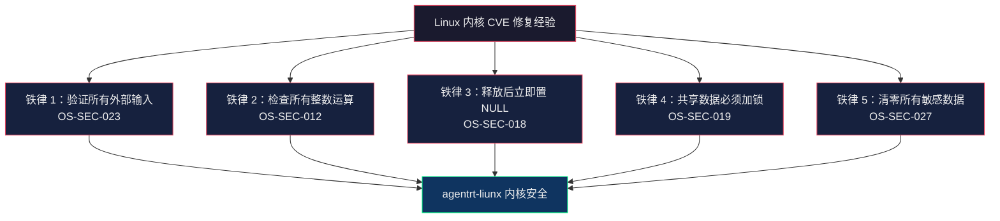

Copyright (c) 2025-2026 SPHARX Ltd. All Rights Reserved.

# agentrt-liunx（AirymaxOS）C 安全编码规范

> **文档定位**: agentrt-liunx（AirymaxOS）内核态 C 语言安全编码规范
> **版本**: 0.1.1（文档体系完成）/ 1.0.1（开发）
> **最后更新**: 2026-07-07
> **父文档**: [编码规范总览](README.md)
> **同源参考**: CERT C Coding Standard + Linux 内核安全实践
> **理论根基**: Airymax 五维正交 24 原则 E-1 安全内生 + Linux 内核 CVE 修复经验

---

## 1. 缓冲区溢出防护

### 1.1 边界检查原则（OS-SEC-010）

> **OS-SEC-010**：所有涉及用户可控长度参数的缓冲区操作必须进行边界检查。内核态代码处理来自用户态的数据时，不能信任任何长度参数——用户态程序可以传递任意值（包括恶意构造的值）。

```c
/* 好：边界检查在缓冲区操作之前 */
if (user_len > AGENTRT_IPC_MSG_BODY_MAX)
        return -EMSGSIZE;
if (copy_from_user(kernel_buf, user_buf, user_len))
        return -EFAULT;

/* 坏：无边界检查，缓冲区溢出风险 */
copy_from_user(kernel_buf, user_buf, user_len);  /* user_len 可能 > sizeof(kernel_buf) */
```

### 1.2 安全字符串函数（OS-BAN-006 复用）

> **OS-BAN-006**：禁止 `strcpy` / `strncpy` / `strlcpy`。强制 `strscpy`（需 NUL 终止）或 `strscpy_pad`（需 NUL 填充）。`strcpy` 无边界检查；`strncpy` 不保证终止；`strlcpy` 读全源串可能越界。

```c
/* 好 */
strscpy(dst->name, src->name, sizeof(dst->name));

/* 坏 */
strcpy(dst->name, src->name);       /* 无边界检查 */
strncpy(dst->name, src->name, 32);  /* 不保证 NUL 终止 */
```

### 1.3 安全内存复制函数（OS-SEC-011）

> **OS-SEC-011**：内核态与用户态之间的数据复制必须使用 `copy_from_user()` / `copy_to_user()`，并检查返回值。禁止直接解引用用户态指针。内核态内部复制使用 `memcpy`，但必须确保目标缓冲区足够大。

```c
/* 用户态 → 内核态 */
if (copy_from_user(kernel_buf, user_ptr, user_len))
        return -EFAULT;

/* 内核态 → 用户态 */
if (copy_to_user(user_ptr, kernel_buf, len))
        return -EFAULT;

/* 内核态内部：确保目标缓冲区大小 */
if (len > sizeof(dst))
        return -EINVAL;
memcpy(dst, src, len);
```

### 1.4 柔性数组成员（OS-KER-033 复用）

变长尾随数据使用 C99 灵活数组成员（`[]`），禁止"长度 1 数组"（`field[1]`）的旧 hack。配合 `struct_size()` 自动做溢出检查。

---

## 2. 整数安全

### 2.1 整数溢出检测（OS-SEC-012）

> **OS-SEC-012**：所有涉及用户可控整数的算术运算（特别是乘法）必须使用内核提供的溢出安全函数：`check_add_overflow()`、`check_sub_overflow()`、`check_mul_overflow()`、`struct_size()`、`array_size()`。

```c
size_t total_bytes;

/* 好：使用溢出检查 */
if (check_mul_overflow(n, sizeof(*p), &total_bytes))
        return -EOVERFLOW;
p = kmalloc(total_bytes, GFP_KERNEL);

/* 好：struct_size 自动检查溢出 */
p = kmalloc(struct_size(p, items, n), GFP_KERNEL);

/* 坏：无溢出检查 */
p = kmalloc(n * sizeof(*p), GFP_KERNEL);  /* n 为 0x40000000 时溢出为 0 */
```

### 2.2 类型转换安全（OS-SEC-013）

> **OS-SEC-013**：避免隐式类型转换导致的数据截断。从大类型向小类型转换时，必须显式检查范围。`size_t` 向 `int` 转换时需要检查 `INT_MAX` 边界。

```c
/* 好：显式范围检查 */
if (len > INT_MAX)
        return -EOVERFLOW;
int ret = (int)len;

/* 坏：隐式截断，可能产生负值 */
int ret = len;  /* 如果 len > INT_MAX，ret 变为未定义行为 */
```

### 2.3 符号问题（OS-SEC-014）

> **OS-SEC-014**：避免有符号/无符号混用。长度、大小、索引使用 `size_t` 或 `u32`；错误码使用 `int`（可负值）。禁止将有符号数与无符号数直接比较。

```c
/* 好 */
size_t len = user_len;
if (len > AGENTRT_IPC_MSG_BODY_MAX)
        return -EMSGSIZE;

/* 坏：有符号/无符号比较 */
int len = user_len;  /* user_len 为 size_t 时可能溢出为负 */
if (len < 0)         /* 永远不会为真，因为比较时 len 被提升为无符号 */
        return -EINVAL;
```

---

## 3. 格式化字符串安全

### 3.1 禁止用户可控格式化字符串（OS-SEC-015）

> **OS-SEC-015**：禁止将用户可控的字符串作为格式化字符串传递给 `printk` / `pr_info` / `sprintf` 等函数。格式化字符串必须总是编译时常量字符串字面量。

```c
/* 好：格式化字符串是字面量常量 */
pr_info("agentrt: task %u state %s\n", task->id, state_name);

/* 坏：用户可控的格式化字符串 */
pr_info(user_msg);  /* 用户可注入 %n 或 %s 导致信息泄露/崩溃 */
```

### 3.2 格式化字符串的 __printf 注解（OS-SEC-016）

> **OS-SEC-016**：自定义的格式化函数必须使用 `__printf(fmt_idx, arg_idx)` 属性注解，让编译器检查格式化字符串与参数类型是否匹配。

```c
__printf(2, 3)
void agentrt_log(struct agentrt_log_ctx *ctx, const char *fmt, ...);

/* 调用时编译器会检查 fmt 和参数是否匹配 */
agentrt_log(ctx, "task %u created\n", task->id);
```

---

## 4. 指针安全

### 4.1 NULL 检查（OS-SEC-017）

> **OS-SEC-017**：所有来自外部（函数参数、返回值、全局变量）的指针在解引用前必须进行 NULL 检查。内核内部函数可假设参数非 NULL（通过 `__must_check` 和调用者契约保证），但边界 API 必须防御。

```c
/* 边界 API：必须检查 NULL */
int agentrt_task_submit(struct agentrt_task *task)
{
        if (!task)
                return -EINVAL;
        /* ... */
}

/* 内部 helper：可假设参数非 NULL（调用者已检查） */
static void __agentrt_task_enqueue(struct agentrt_task *task)
{
        /* 直接使用 task，无需检查 NULL */
        list_add_tail(&task->link, &ready_queue);
}
```

### 4.2 悬挂指针防护（OS-SEC-018）

> **OS-SEC-018**：释放内存后立即将指针置为 NULL。使用 `kfree_sensitive()` 清除敏感数据后再释放。禁止在释放后继续使用指针（UAF）。

```c
/* 好 */
kfree(ptr);
ptr = NULL;

/* 敏感数据：先清零再释放 */
kfree_sensitive(secret_key);
secret_key = NULL;

/* 坏：UAF 风险 */
kfree(task);
task->id = 0;  /* 释放后使用！ */
```

### 4.3 禁止 %p 默认输出（OS-BAN-007 复用）

禁止新增 `%p` 默认输出——所有 `%p` 自动哈希化。需要真实指针须在注释与 commit log 充分论证后用 `%px` 并确保权限控制。

---

## 5. 并发安全

### 5.1 数据竞争防护（OS-SEC-019）

> **OS-SEC-019**：所有被多个线程访问的共享数据必须通过同步原语保护。数据竞争（data race）是未定义行为，可能导致内核崩溃或安全漏洞。KCSAN 在 CI 中检测数据竞争。

```c
struct agentrt_task_table {
        spinlock_t lock;
        struct list_head tasks;  /* 被 lock 保护 */
};

/* 好：加锁后访问 */
void agentrt_task_table_add(struct agentrt_task_table *t,
                             struct agentrt_task *task)
{
        spin_lock(&t->lock);
        list_add_tail(&task->link, &t->tasks);
        spin_unlock(&t->lock);
}

/* 坏：无锁访问，数据竞争 */
void agentrt_task_table_add_bad(struct agentrt_task_table *t,
                                 struct agentrt_task *task)
{
        list_add_tail(&task->link, &t->tasks);  /* 数据竞争！ */
}
```

### 5.2 死锁预防（OS-SEC-020）

> **OS-SEC-020**：多锁获取必须遵循固定的锁顺序。锁顺序必须在代码注释中明确记录。禁止在持有自旋锁时调用可能睡眠的函数（如 `kmalloc(GFP_KERNEL)`、`mutex_lock()`、`schedule()`）。

```c
/*
 * 锁顺序：agentrt 子系统的锁获取顺序
 * 1. task_table->lock
 * 2. channel->lock
 * 3. session->lock
 *
 * 任何代码在获取多个锁时必须遵循此顺序，违反将触发 lockdep 警告。
 */

/* 正确：遵循锁顺序 */
spin_lock(&task_table->lock);
spin_lock(&channel->lock);
/* ... */
spin_unlock(&channel->lock);
spin_unlock(&task_table->lock);
```

### 5.3 引用计数与锁分离（OS-KER-032 复用）

锁保证数据结构一致性，引用计数保证数据结构生命周期。两者职责不同，不可混淆。

---

## 6. 权限与能力检查（Cupolas Capability）

### 6.1 capability 检查（OS-SEC-021）

> **OS-SEC-021**：所有安全敏感操作（资源访问、权限变更、配置修改）必须通过 Cupolas capability 系统检查。capability 是不可伪造的令牌，无 capability 即无访问权限。Cupolas capability 结构体定义位于 [SC] 共享契约层（`include/airymax/capability.h`），遵循 IRON-9 v2 同源且部分代码共享原则。

```c
/* 好：操作前检查 capability */
int agentrt_resource_access(struct agentrt_session *s, u32 resource_id)
{
        if (!agentrt_capability_check(s->caps, resource_id, AGENTRT_CAP_ACCESS))
                return -EACCES;
        /* ... 执行访问 ... */
}

/* 坏：无 capability 检查 */
int agentrt_resource_access_bad(struct agentrt_session *s, u32 resource_id)
{
        /* 直接访问资源，无权限检查 */
        return do_access(resource_id);
}
```

### 6.2 capability 令牌管理（OS-SEC-022）

> **OS-SEC-022**：capability 令牌必须通过安全通道传递，禁止在日志中打印 capability 的原始值。capability 令牌的创建和销毁必须记录审计日志。

```c
/* 好：capability 通过安全通道传递，不打印原始值 */
int agentrt_capability_grant(struct agentrt_session *from,
                              struct agentrt_session *to,
                              u32 cap_id)
{
        /* cap_id 是 capability 索引，非原始值 */
        agentrt_audit_record(AUDIT_CAP_GRANT, from->id, to->id, cap_id);
        return __agentrt_capability_transfer(from, to, cap_id);
}
```

---

## 7. 输入验证（从用户态接收的数据）

### 7.1 所有用户态输入必须验证（OS-SEC-023）

> **OS-SEC-023**：从用户态接收的任何数据（系统调用参数、ioctl 参数、procfs/sysfs 写入、netlink 消息）必须经过完整验证后才能使用。验证包括：长度检查、范围检查、类型检查、格式检查。

```c
/* 完整的输入验证流程 */
int agentrt_syscall_task_create(struct agentrt_task_create_args __user *uargs)
{
        struct agentrt_task_create_args args;
        struct agentrt_task *task;

        /* 步骤 1：复制用户态数据 */
        if (copy_from_user(&args, uargs, sizeof(args)))
                return -EFAULT;

        /* 步骤 2：长度检查 */
        if (args.name_len > AGENTRT_TASK_NAME_MAX)
                return -EINVAL;
        if (args.name_len == 0)
                return -EINVAL;

        /* 步骤 3：范围检查 */
        if (args.priority > AGENTRT_MAX_PRIORITY)
                return -EINVAL;

        /* 步骤 4：类型检查 */
        if (args.flags & ~AGENTRT_TASK_FLAG_MASK)
                return -EINVAL;

        /* 步骤 5：使用验证后的数据 */
        task = agentrt_task_alloc(&args);
        return agentrt_task_submit(task);
}
```

### 7.2 系统调用参数验证模板（OS-SEC-024）

> **OS-SEC-024**：所有系统调用必须遵循以下验证模板——UAPI 结构体字段的验证不能遗漏任何一个。

```c
/*
 * 系统调用参数验证检查清单（每个 syscall 必须通过）：
 * 1. [ ] 所有指针参数 -> copy_from_user() + 返回值检查
 * 2. [ ] 所有长度参数 -> 上限检查 + 下限检查
 * 3. [ ] 所有枚举参数 -> 范围检查（不超过已知最大值）
 * 4. [ ] 所有 flags 参数 -> 位掩码检查（无未知位被设置）
 * 5. [ ] 所有 size 参数 -> 溢出检查（乘法前）
 * 6. [ ] 所有字符串参数 -> 长度检查 + NUL 终止检查
 * 7. [ ] 所有 fd 参数 -> fget() + 类型检查（S_ISREG / S_ISDIR 等）
 */
```

---

## 8. 信息泄露防护

### 8.1 copy_to_user 敏感数据（OS-SEC-025）

> **OS-SEC-025**：向用户态复制数据前，必须确保复制的数据不包含内核地址、未初始化内存、或其他敏感信息。结构体在复制前必须清零或填充到安全值。

```c
/* 好：清零结构体后再填充 */
struct agentrt_task_info info = {0};  /* 全部清零 */
info.id = task->id;
info.priority = task->priority;
info.deadline_ns = task->deadline_ns;
/* 未显式赋值的字段保持为 0，不会泄露内核数据 */
if (copy_to_user(uinfo, &info, sizeof(info)))
        return -EFAULT;

/* 坏：未初始化字段可能泄露内核栈数据 */
struct agentrt_task_info info;
info.id = task->id;
/* info.reserved 字段未初始化，可能包含内核栈数据 */
copy_to_user(uinfo, &info, sizeof(info));
```

### 8.2 内核地址保护（OS-SEC-026）

> **OS-SEC-026**：禁止向用户态泄露内核地址。`%p` 默认输出已哈希化，但任何尝试输出真实内核地址的代码必须经过安全审查。导出到用户态的日志中不得包含内核指针值。

```c
/* 好：日志中不输出内核地址 */
pr_info("task %u created\n", task->id);

/* 坏：日志中输出内核地址 */
pr_info("task %u at %px\n", task->id, task);  /* %px 泄露内核地址 */
```

### 8.3 敏感数据清零（OS-SEC-027）

> **OS-SEC-027**：密钥、密码、token 等敏感数据在使用完毕后必须使用 `memzero_explicit()` 清零，防止被后续的堆栈检查或内存转储泄露。使用 `kfree_sensitive()` 释放包含敏感数据的内存。

```c
/* 好：敏感数据使用后清零 */
char key[AGENTRT_KEY_MAX];
agentrt_key_derive(key, sizeof(key), seed);
/* ... 使用 key ... */
memzero_explicit(key, sizeof(key));  /* 清零，编译器不会优化掉 */
```

---

## 9. CVE 案例分析

### 9.1 案例 1：CVE-2019-8912（af_key.c UAF）

**漏洞类型**：释放后使用（Use-After-Free）

**根因**：`af_key.c` 中 `pfkey_broadcast()` 函数在释放 `sk` 后仍通过 `sock_net(sk)` 访问 `sk`，导致 UAF。

**agentrt-liunx 教训**：
- 释放结构体后立即将指针置 NULL（OS-SEC-018）
- 使用引用计数管理生命周期（OS-KER-031）
- KASAN 在 CI 中检测 UAF（每次 PR）

### 9.2 案例 2：CVE-2016-0758（ASN.1 解码器整数溢出）

**漏洞类型**：整数溢出导致堆缓冲区溢出

**根因**：ASN.1 解码器在计算 `len = 1 << len` 时未检查溢出，攻击者可通过构造极端 `len` 值触发堆溢出。

**agentrt-liunx 教训**：
- 所有移位操作必须检查溢出（OS-SEC-012）
- 使用 `check_shl_overflow()` 替代裸移位
- 乘法/移位前使用 `struct_size()` / `array_size()`

### 9.3 案例 3：CVE-2017-1000112（UDP 校验和计算漏洞）

**漏洞类型**：缓冲区溢出

**根因**：UDP `ufo_append_data()` 函数在计算片段大小时未检查 `length` 是否溢出，导致 `skb` 数据区被越界覆盖。

**agentrt-liunx 教训**：
- 网络数据包处理是缓冲区溢出高发区（OS-SEC-010）
- 所有来自网络的数据长度必须经过多重验证
- 使用 `check_add_overflow()` 进行累积长度计算

### 9.4 CVE 教训总结：agentrt-liunx 安全编码五大铁律



---

## 10. 静态分析工具

### 10.1 Coverity Scan

Coverity 是 agentrt-liunx（AirymaxOS）内核代码的深度静态分析工具，检测以下缺陷类别：
- 缓冲区溢出（BUFFER_SIZE）
- 资源泄漏（RESOURCE_LEAK）
- 空指针解引用（FORWARD_NULL）
- 释放后使用（USE_AFTER_FREE）
- 整数溢出（INTEGER_OVERFLOW）
- 并发缺陷（LOCK_INVERSION）

**频率**：每周扫描，HIGH 及以上级别缺陷阻断发布。

### 10.2 Sparse

Sparse 是 Linux 内核的语义分析工具，检测：
- `__user` / `__kernel` / `__iomem` address space 注解违反
- 字节序（endianness）错误
- 锁注解不一致
- 上下文（context）跟踪错误

**频率**：每次 PR（`make C=1`），ERROR 阻断。

### 10.3 Coccinelle

Coccinelle 是语义模式匹配引擎，可以检测：
- API 误用模式（如 `kmalloc` 后未检查返回值）
- 常见内存泄漏模式
- 推荐 API 替换（如 `strcpy` → `strscpy`）

**频率**：每日自动扫描，WARNING 阻断。

### 10.4 静态分析工具链概览

| 工具 | 检测层级 | 频率 | 阻断级别 |
|------|---------|------|----------|
| checkpatch.pl | 风格/格式 | 每次 PR | ERROR/WARNING |
| Sparse | 语义注解 | 每次 PR | ERROR |
| Coccinelle | 语义模式 | 每日 | WARNING |
| Clang-Tidy | 代码质量 | 每日 | WARNING |
| Coverity | 深度分析 | 每周 | HIGH |
| KASAN | 运行时内存 | 每次 PR (CI) | 运行时错误 |
| KCSAN | 运行时并发 | 每次 PR (CI) | 运行时错误 |
| lockdep | 运行时锁 | 每次 PR (CI) | 运行时错误 |

---

## 11. 五维正交原则映射

| 章节 | 核心原则 | 映射 |
|------|---------|------|
| §1 缓冲区溢出 | E-1 安全内生、A-2 细节关注 | 边界检查、安全函数 |
| §2 整数安全 | E-1 安全内生、A-2 细节关注 | 溢出检测、类型安全 |
| §3 格式化字符串 | E-1 安全内生 | 编译时常量格式 |
| §4 指针安全 | E-3 资源确定性、E-1 安全内生 | NULL 检查、悬挂指针防护 |
| §5 并发安全 | E-1 安全内生、E-3 资源确定性 | 数据竞争、死锁预防 |
| §6 权限检查 | E-1 安全内生、K-2 接口契约化 | Cupolas capability |
| §7 输入验证 | E-1 安全内生、K-2 接口契约化 | 用户态输入信任边界 |
| §8 信息泄露 | E-1 安全内生 | 内核地址保护、敏感数据清零 |
| §9 CVE 案例 | A-4 完美主义 | 从错误中学习 |
| §10 静态分析 | E-8 可测试性、A-4 完美主义 | 自动化工具链 |

---

## 12. 相关文档

- [编码规范总览](README.md)：规范体系总索引
- [C 编码风格规范](C_coding_style_standard.md)：内核态 C 编程风格
- [Rust 安全编码规范](Rust_secure_coding_standard.md)：内核模块安全编码
- [工程标准规范 01-代码规范](../../50-engineering-standards/01-coding-standards.md)：语义层代码规则
- [安全模块（110-security）](../../110-security/README.md)：agentrt-liunx（AirymaxOS）安全体系
- [五维正交 24 原则](../../10-architecture/02-five-dimensional-principles.md)
- CERT C Coding Standard
- Linux 内核 CVE 数据库

---

## 13. 版本历史

| 版本 | 日期 | 变更 |
|------|------|------|
| 0.1.1 | 2026-07-07 | 初始版本：覆盖 10 个安全维度，包含 3 个 CVE 案例分析 |
| 1.0.1 | TBD | 首个开发版本：与代码实现同步验证，CVE 案例扩展至 10+ |

---

© 2025-2026 SPHARX Ltd. All Rights Reserved.