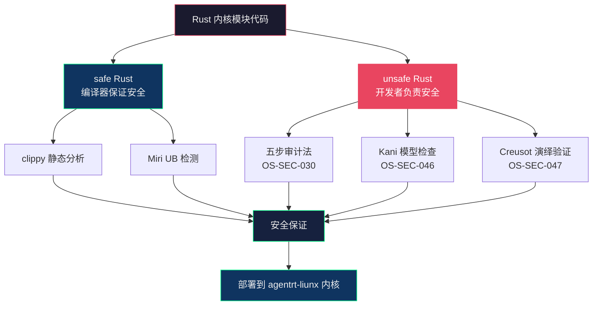

Copyright (c) 2025-2026 SPHARX Ltd. All Rights Reserved.

# agentrt-liunx（AirymaxOS）Rust 安全编码规范

> **文档定位**: agentrt-liunx（AirymaxOS）内核模块 Rust 语言安全编码规范
> **版本**: 0.1.1（文档体系完成）/ 1.0.1（开发）
> **最后更新**: 2026-07-07
> **父文档**: [编码规范总览](README.md)
> **同源参考**: Rust Secure Code Guidelines + seL4 形式化验证方法论
> **理论根基**: Airymax 五维正交 24 原则 E-1 安全内生 + Rust 类型系统安全保证

---

## 1. unsafe 代码审计规范

### 1.1 unsafe 是 Rust 安全模型的"信任边界"

Rust 的安全保证（无数据竞争、无 UAF、无悬垂指针）在 safe Rust 中由编译器强制执行，但在 unsafe Rust 中由开发者负责。每个 unsafe 块都是 Rust 安全模型的"信任边界"——边界内的代码必须手动维护所有安全不变量，否则整个系统的安全保证就会崩溃。

agentrt-liunx（AirymaxOS）内核模块中的 unsafe 代码主要用于以下场景，每个场景都需要专门的审计标准：

| unsafe 场景 | 典型用途 | 审计重点 |
|-------------|---------|---------|
| 裸指针解引用 | DMA 缓冲区、MMIO 寄存器 | 指针有效性、对齐、生命周期 |
| FFI 调用 | 调用 C 内核函数 | 参数类型匹配、所有权语义、ABI 兼容 |
| 内联汇编 | 架构特定操作 | 寄存器保护、内存屏障、调用约定 |
| 全局可变状态 | 内核全局变量 | 并发访问、初始化顺序 |
| unsafe trait 实现 | Send/Sync 手动实现 | 线程安全性证明 |

### 1.2 unsafe 审计五步法（OS-SEC-030）

> **OS-SEC-030**：每个 unsafe 块必须通过以下五步审计：

```
1. 识别：标注所有 unsafe 操作及其依赖的安全条件
2. 证明：对每个安全条件，给出"为什么被满足"的证明
3. 封装：将 unsafe 代码封装在最小的 safe API 后面
4. 测试：提供测试用例证明安全条件在所有条件下被满足
5. 审查：至少两名资深维护者签字确认
```

```rust
/// 从 MMIO 寄存器读取 32 位值。
///
/// # Safety 条件
/// 1. `base` 必须是 ioremap 返回的合法 MMIO 地址
/// 2. `offset` 必须在设备寄存器映射范围内
/// 3. 读取操作必须是 32 位对齐的
///
/// # 证明
/// 1. `base` 在 `Device::probe()` 中通过 `ioremap()` 获取，probe 失败时 Device 不会被创建
/// 2. `offset` 通过 `Device::read_reg()` 调用，该函数已验证 offset < MMIO_SIZE
/// 3. `offset` 始终是 4 的倍数（由枚举 `RegOffset` 保证）
pub fn read_mmio32(&self, offset: RegOffset) -> u32 {
    // SAFETY: 安全条件由调用链保证：
    // - base 来自 ioremap（probe 时已验证）
    // - offset 是 RegOffset 枚举值，保证在范围内且 4 字节对齐
    unsafe {
        readl(self.base.add(offset as usize) as *const u32)
    }
}
```

### 1.3 unsafe 代码审查清单（OS-SEC-031）

> **OS-SEC-031**：审查 unsafe 代码时，审查者必须逐项确认以下清单：

```markdown
## Unsafe 代码审查清单

### 裸指针操作
- [ ] 指针是否在解引用前已验证非 NULL？
- [ ] 指针指向的内存是否在解引用时有效（未被释放、未被移动）？
- [ ] 指针是否满足对齐要求？
- [ ] 是否存在并发修改（需要 volatile 或原子操作）？

### FFI 调用
- [ ] C 函数签名与 Rust 声明是否完全一致？
- [ ] 参数类型是否 FFI 兼容（core::ffi / kernel::ffi）？
- [ ] 所有权语义是否明确（谁分配、谁释放）？
- [ ] C 函数的文档是否包含了所有安全前置条件？

### 内联汇编
- [ ] 是否保存和恢复了所有被修改的寄存器？
- [ ] 是否使用了正确的内存屏障？
- [ ] 是否遵循了目标架构的调用约定？

### unsafe trait 实现
- [ ] Send/Sync 实现是否有书面论证？
- [ ] 是否考虑了所有可能的并发访问路径？
- [ ] 是否通过了 Miri 检查？
```

---

## 2. 内存安全保证

### 2.1 所有权系统是 Rust 的核心安全机制

Rust 的所有权系统在编译时消除了以下内存安全漏洞类别：
- 释放后使用（UAF）：所有权在生命周期结束时自动释放，无悬垂指针
- 双重释放（Double Free）：所有权唯一，不会重复释放
- 缓冲区溢出：切片（`&[T]`、`Vec<T>`）有边界检查
- 空指针解引用：`Option<T>` 强制处理 `None` 情况
- 未初始化内存：必须初始化后方可使用

agentrt-liunx（AirymaxOS）内核模块 Rust 代码应充分利用这些安全保证，将 unsafe 代码限制在最小范围内。

### 2.2 借用检查器的利用（OS-SEC-032）

> **OS-SEC-032**：利用 Rust 的借用检查器来静态验证并发安全性。共享数据通过 `&T`（不可变引用）访问，修改数据通过 `&mut T`（可变引用）访问。编译器保证同一时间只能有一个可变引用或多个不可变引用，这是数据竞争的最强静态防护。

```rust
// 借用检查器在编译时防止数据竞争
fn update_task(table: &mut TaskTable, id: u32, new_prio: u8) -> Result<()> {
    let task = table.lookup_mut(id)?;  // &mut Task
    task.priority = new_prio;
    // task 的可变引用在此处结束
    // 此时可以安全地获取另一个可变引用
    let task2 = table.lookup_mut(id + 1)?;
    Ok(())
}
```

### 2.3 智能指针与 RAII（OS-SEC-033）

> **OS-SEC-033**：使用智能指针（`Box<T>`、`Arc<T>`、`KBox<T>`）和 RAII 模式管理资源生命周期。资源在创建时分配，在离开作用域时自动释放。这消除了 goto 集中出口模式中的人为错误（忘记释放、释放顺序错误）。

```rust
// RAII：资源自动释放，无需手动 goto
fn agentrt_session_create(name: &str) -> Result<Arc<Session>> {
    // 如果以下任何一步失败，之前分配的资源自动释放
    let session = Arc::new(Session::new()?);     // 失败 → Arc 自动释放
    let buf = KBox::new_uninit_slice(4096)?;      // 失败 → Arc + buf 自动释放
    let chan = agentrt_channel_create(name)?;      // 失败 → 全部自动释放
    // 成功：所有资源的所有权转移给调用者
    Ok(session)
}
```

---

## 3. 并发安全

### 3.1 Send 与 Sync trait（OS-SEC-034）

> **OS-SEC-034**：跨线程传递的类型必须实现 `Send`；跨线程共享的类型必须实现 `Sync`。禁止 `unsafe impl Send` 或 `unsafe impl Sync`，除非有书面论证并通过 unsafe 审计。编译器自动推导的 Send/Sync 是安全的，手动实现的必须经过审查。

```rust
// 好：编译器自动推导 Send/Sync
pub struct AgentrtChannel {
    inner: Mutex<ChannelInner>,  // Mutex<T> 提供 Sync
    id: u32,                     // u32 是 Send + Sync
}
// AgentrtChannel 自动实现 Send + Sync

// 坏：手动 unsafe impl Send——需要书面论证
unsafe impl Send for RawPointerWrapper {}  // 必须经过审计
```

### 3.2 Mutex 与 RwLock（OS-SEC-035）

> **OS-SEC-035**：使用 `kernel::sync::Mutex<T>` 和 `kernel::sync::SpinLock<T>` 保护共享数据。通过 `lock()` 方法获取守卫（guard），守卫离开作用域时自动释放锁。这比 C 的 `spin_lock()`/`spin_unlock()` 配对更安全——编译器保证锁一定被释放。

```rust
// 好：Mutex guard 离开作用域自动释放锁
fn agentrt_channel_send(&self, msg: AgentrtIpcMsg) -> Result<()> {
    let mut guard = self.inner.lock();  // 获取锁
    if guard.pending.len() >= guard.max_msgs {
        return Err(EAGAIN);  // 提前返回，guard 自动释放锁
    }
    guard.pending.push_back(msg);
    Ok(())
    // guard 离开作用域，自动释放锁
}

// 对比 C 代码：必须手动 spin_unlock，容易遗漏
// spin_lock(&chan->lock);
// if (chan->pending_count >= chan->max_msgs) {
//     spin_unlock(&chan->lock);  // 容易忘记
//     return -EAGAIN;
// }
// spin_unlock(&chan->lock);
```

### 3.3 原子操作（OS-SEC-036）

> **OS-SEC-036**：对于简单的共享计数器或标志，使用 `AtomicU32`、`AtomicBool` 等原子类型，而非锁。原子操作比锁开销低，但仅适用于单个变量的操作。

```rust
use core::sync::atomic::{AtomicU32, Ordering};

pub struct AgentrtStats {
    tx_packets: AtomicU32,
    rx_packets: AtomicU32,
    dropped: AtomicU32,
}

impl AgentrtStats {
    pub fn inc_tx(&self) {
        self.tx_packets.fetch_add(1, Ordering::Relaxed);
    }

    pub fn snapshot(&self) -> StatsSnapshot {
        StatsSnapshot {
            tx: self.tx_packets.load(Ordering::Relaxed),
            rx: self.rx_packets.load(Ordering::Relaxed),
            dropped: self.dropped.load(Ordering::Relaxed),
        }
    }
}
```

---

## 4. 内核 unsafe 场景分析

### 4.1 DMA 缓冲区（OS-SEC-037）

> **OS-SEC-037**：DMA 缓冲区是内核中最常见的 unsafe 场景之一。DMA 缓冲区由硬件设备直接访问，不受 MMU 保护。Rust 代码必须：
> 1. 使用 `kernel::dma::DmaAlloc` 分配 DMA 安全的内存
> 2. 在 DMA 进行期间，禁止 CPU 修改缓冲区（或使用正确的同步原语）
> 3. DMA 结束后，使用 `dma_sync_single_for_cpu()` 等函数同步

```rust
// DMA 缓冲区操作的安全封装
pub struct DmaBuffer {
    dma_handle: DmaHandle,
    buf: KBox<[u8]>,
    direction: DmaDirection,
}

impl DmaBuffer {
    /// 在 DMA 传输期间获取缓冲区的可变引用。
    ///
    /// # Safety
    /// 调用者必须确保 DMA 传输已完成且缓冲区已同步。
    pub unsafe fn as_mut_slice(&mut self) -> &mut [u8] {
        &mut self.buf[..]
    }
}
```

### 4.2 MMIO 寄存器访问（OS-SEC-038）

> **OS-SEC-038**：MMIO 寄存器访问必须通过内核的 accessor 函数（`readl`/`writel`/`ioread32`/`iowrite32`），禁止裸指针解引用。accessor 封装了平台差异、编译器屏障和 volatile 语义。

```rust
/// MMIO 寄存器访问的安全封装。
pub struct MmioRegs {
    base: *mut u8,  // ioremap 返回的 MMIO 基地址
    size: usize,
}

impl MmioRegs {
    /// 读取 32 位寄存器。
    ///
    /// # Safety
    /// 调用者必须确保 `offset` 在映射范围内且 4 字节对齐。
    pub unsafe fn read32(&self, offset: usize) -> u32 {
        // SAFETY: 调用者已验证 offset 边界和对齐
        unsafe { readl(self.base.add(offset) as *const u32) }
    }

    /// 写入 32 位寄存器。
    ///
    /// # Safety
    /// 调用者必须确保 `offset` 在映射范围内且 4 字节对齐。
    pub unsafe fn write32(&self, offset: usize, value: u32) {
        // SAFETY: 调用者已验证 offset 边界和对齐
        unsafe { writel(value, self.base.add(offset) as *mut u32) }
    }
}
```

### 4.3 裸指针与内核链表（OS-SEC-039）

> **OS-SEC-039**：当 Rust 代码需要与 C 内核链表（`struct list_head`）交互时，使用 `kernel::list` 模块提供的安全封装。禁止直接操作 `list_head` 的 `next`/`prev` 指针。

```rust
use kernel::list::{List, ListArc, ListArcSafe};

// 使用 kernel::list 的安全封装
pub struct AgentrtTask {
    list_link: ListArc<Self>,  // 链表链接
    id: u32,
    priority: u8,
}

impl ListArcSafe for AgentrtTask {
    // Safe: 通过 ListArc 管理生命周期
}
```

---

## 5. FFI 安全

### 5.1 C 调用约定与 ABI 稳定性（OS-SEC-040）

> **OS-SEC-040**：所有跨 C/Rust 边界的函数必须使用 `extern "C"` 声明。C ABI 是稳定的，Rust ABI 不稳定——使用 `extern "Rust"` 的跨语言调用在编译器版本变更时可能崩溃。

```rust
// 好：显式 extern "C"
#[no_mangle]
pub extern "C" fn agentrt_ipc_send_rs(
    channel: u32,
    msg: *const u8,
    len: usize,
) -> i32 {
    // ...
}

// 坏：Rust ABI 不稳定，跨语言调用危险
pub fn agentrt_ipc_send_rs(channel: u32, msg: &[u8]) -> i32 {
    // 签名不兼容 C 调用约定
}
```

### 5.2 类型布局兼容性（OS-SEC-041）

> **OS-SEC-041**：FFI 边界上的结构体必须使用 `#[repr(C)]` 确保与 C 的布局兼容。Rust 默认布局（`repr(Rust)`）不保证字段顺序和填充，不能用于 FFI。IRON-9 v2 [SC] 共享契约层的结构体（如 `AgentrtIpcMsgHdr`）在 agentrt 和 agentrt-liunx（AirymaxOS）两端必须位级兼容，`#[repr(C)]` 是保证这一兼容性的前提。

```rust
/// [SC] 共享契约层：IP 消息头，与 C 结构体 agentrt_ipc_msg_hdr 完全一致。
#[repr(C)]
pub struct AgentrtIpcMsgHdr {
    pub magic: u32,
    pub msg_type: u32,
    pub channel: u32,
    pub seq: u32,
    pub timestamp: u64,
    pub body_len: u32,
    pub flags: u32,
    pub reserved: [u8; 96],
}
```

### 5.3 所有权穿越 FFI 边界（OS-SEC-042）

> **OS-SEC-042**：FFI 边界上的所有权转移必须明确约定。常见的模式：
> - **Rust 分配，C 释放**：C 侧调用 `kfree()`，Rust 侧使用 `KBox::into_raw()` 传递
> - **C 分配，Rust 释放**：Rust 侧使用 `KBox::from_raw()` 接管，或提供 C 释放回调
> - **借用**：Rust 侧提供 `&T` 或 `&mut T`，C 侧不获取所有权

```rust
/// Rust 分配，C 释放——通过 into_raw 传递所有权。
#[no_mangle]
pub extern "C" fn agentrt_task_create_rs(
    id: u32,
    priority: u8,
) -> *mut AgentrtTask {
    let task = KBox::new(AgentrtTask::new(id, priority));
    // 将 KBox 的所有权转移给 C 调用者
    KBox::into_raw(task)
}

/// C 侧释放——通过 kfree 回调。
#[no_mangle]
pub unsafe extern "C" fn agentrt_task_free_rs(task: *mut AgentrtTask) {
    if !task.is_null() {
        // SAFETY: 调用者保证 task 是 agentrt_task_create_rs 返回的指针
        // 且仅被释放一次
        unsafe { KBox::from_raw(task) };
        // KBox 离开作用域，自动调用 Drop
    }
}
```

---

## 6. 供应链安全

### 6.1 cargo audit（OS-SEC-043）

> **OS-SEC-043**：每次 PR 必须通过 `cargo audit` 检查，CRITICAL 级别漏洞阻断合并。依赖的 crate 必须来自可信源（crates.io 或内部镜像），禁止使用未发布的 git 依赖。

```bash
# CI 中运行的 cargo audit 检查
cargo audit --deny warnings
```

### 6.2 依赖审查（OS-SEC-044）

> **OS-SEC-044**：新增依赖必须经过审查。审查内容包括：
> 1. 依赖是否必要（能否用标准库或 kernel crate 替代）
> 2. 依赖的维护状态（最近更新时间、issue 响应速度）
> 3. 依赖的 unsafe 代码量（高 unsafe 比例的 crate 需额外审查）
> 4. 依赖的依赖树（传递依赖的审查义务）

```toml
# Cargo.toml 示例
[dependencies]
# kernel crate：由 Rust for Linux 维护，可信
kernel = { path = "../../../rust/kernel" }

# 外部依赖：需要审查
sha2 = { version = "0.10", default-features = false }
# 审查记录：SHA2 是广泛使用的哈希库，无 unsafe 代码，
# 仅用于审计哈希链的非安全关键路径。
```

### 6.3 最小依赖原则（OS-SEC-045）

> **OS-SEC-045**：遵守最小依赖原则——能用标准库（`core`/`alloc`）实现的功能，不引入外部 crate。内核模块运行在受限环境中，依赖越多，攻击面越大。

---

## 7. 形式化验证

### 7.1 Kani 验证器（OS-SEC-046）

> **OS-SEC-046**：对于安全关键模块（如 capability 验证、LSM hook 决策），推荐使用 Kani 进行形式化验证。Kani 是 Rust 的模型检查器，可以证明 unsafe 代码满足指定的安全属性。

```rust
#[kani::proof]
fn verify_capability_check() {
    // 证明：任意输入下，capability_check 返回 false 时不会执行操作
    let cap: u32 = kani::any();
    let requested: u32 = kani::any();

    let result = agentrt_capability_check(cap, requested);

    if !result {
        // 验证：capability 检查失败时，操作不可执行
        assert!(!agentrt_can_perform_operation(cap, requested));
    }
}
```

### 7.2 Creusot 验证器（OS-SEC-047）

> **OS-SEC-047**：对于需要证明更复杂属性（如不变量、终止性）的模块，可使用 Creusot 进行演绎验证。Creusot 将 Rust 代码翻译为 Why3 中间语言，然后用 SMT 求解器证明。

### 7.3 与 seL4 形式化验证的关系

seL4 微内核是形式化验证的标杆——它的 C 代码被完全形式化验证，证明其满足功能正确性、完整性和安全性属性。agentrt-liunx（AirymaxOS）的内核形式化验证策略借鉴了 seL4 的方法论，但采取了更务实的路径：

| 维度 | seL4 | agentrt-liunx（AirymaxOS） |
|------|------|---------------------------|
| 验证对象 | 整个微内核（~10K LOC C） | 安全关键模块（capability、LSM hook、IPC 协议） |
| 验证方法 | Isabelle/HOL 演绎证明 | Kani 模型检查 + Creusot 演绎验证 |
| 验证语言 | C（经翻译为 Isabelle） | Rust（原生支持形式化验证工具） |
| 验证范围 | 功能正确性（精化证明） | 安全属性（无 UB、无 panic、无死锁） |
| 验证覆盖 | 100% 内核代码 | 安全关键模块 ≥ 95% |

> **五维正交映射**：E-8 可测试性——形式化验证是测试的最高形式；A-4 完美主义——追求数学证明的极致确定性。

### 7.4 形式化验证与代码审查的关系



---

## 8. 五维正交原则映射

| 章节 | 核心原则 | 映射 |
|------|---------|------|
| §1 unsafe 审计 | E-1 安全内生、A-2 细节关注 | 五步审计法，安全边界信任 |
| §2 内存安全 | E-1 安全内生、E-3 资源确定性 | 所有权系统、RAII |
| §3 并发安全 | E-1 安全内生、E-3 资源确定性 | Send/Sync、Mutex、原子操作 |
| §4 内核 unsafe 场景 | E-1 安全内生、K-2 接口契约化 | DMA、MMIO、裸指针 |
| §5 FFI 安全 | E-1 安全内生、K-2 接口契约化 | ABI 兼容、类型布局、所有权 |
| §6 供应链安全 | E-1 安全内生 | cargo audit、依赖审查 |
| §7 形式化验证 | E-8 可测试性、A-4 完美主义 | Kani、Creusot、seL4 方法论 |

---

## 9. 相关文档

- [编码规范总览](README.md)：规范体系总索引
- [Rust 编码风格规范](Rust_coding_style_standard.md)：内核模块编程风格
- [C 安全编码规范](C_Cpp_secure_coding_standard.md)：内核态安全编码
- [C 编码风格规范](C_coding_style_standard.md)：内核态 C 编程风格
- [安全模块（110-security）](../../110-security/README.md)：agentrt-liunx（AirymaxOS）安全体系
- [五维正交 24 原则](../../10-architecture/02-five-dimensional-principles.md)
- Rust Secure Code Guidelines
- seL4 形式化验证方法论
- Kani Rust Verifier 文档
- Creusot 演绎验证器文档

---

## 10. 版本历史

| 版本 | 日期 | 变更 |
|------|------|------|
| 0.1.1 | 2026-07-07 | 初始版本：覆盖 unsafe 审计、内存安全、并发安全、FFI、供应链、形式化验证 |
| 1.0.1 | TBD | 首个开发版本：与代码实现同步验证，形式化验证覆盖全部安全关键模块 |

---

© 2025-2026 SPHARX Ltd. All Rights Reserved.