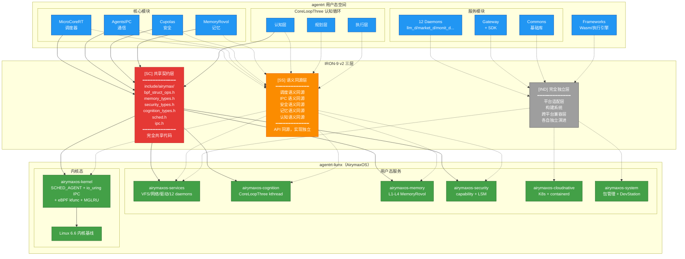
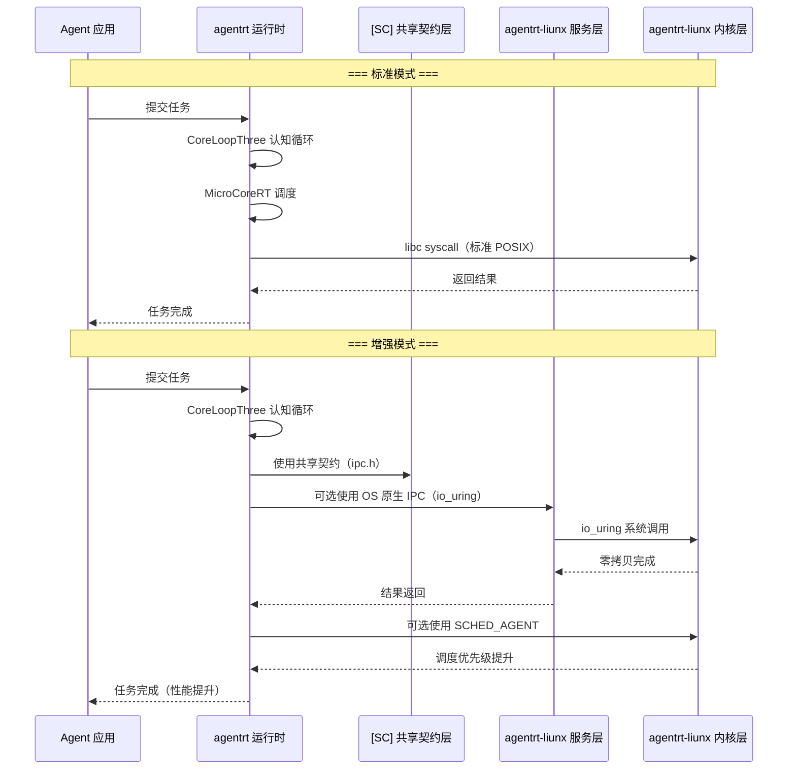
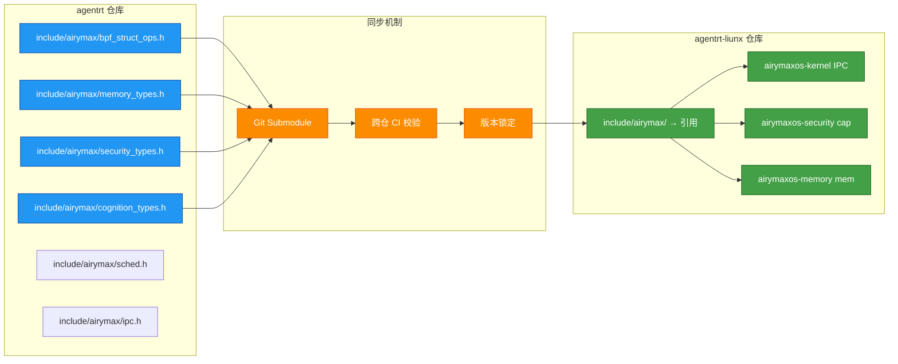

Copyright (c) 2025-2026 SPHARX Ltd. All Rights Reserved.

# agentrt-liunx 与 agentrt 的集成规范

> **文档定位**: agentrt-liunx（AirymaxOS）与 agentrt（AirymaxAgentRT）的详细集成规范，定义集成架构、IRON-9 v2 三层集成点、ABI 兼容性、版本对齐、集成测试与性能基准
> **版本**: 0.1.1（文档体系完成）/ 1.0.1（开发）
> **最后更新**: 2026-07-07
> **父文档**: [集成标准总览](README.md)
> **关联规范**: IRON-9 v2 工程铁律（内部工程标准规范） / [架构设计](../../10-architecture/01-system-architecture.md) / [五维正交 24 原则](../../10-architecture/02-five-dimensional-principles.md) / [工程基线](../../10-architecture/04-engineering-baseline.md)

---

## 1. 集成架构总览

### 1.1 核心集成原则

agentrt（AirymaxAgentRT）与 agentrt-liunx（AirymaxOS）的集成基于 **IRON-9 v2 工程铁律**，核心原则如下：

| 原则 | 说明 |
|------|------|
| **无适配层** | agentrt 在 agentrt-liunx 上原生运行，无需任何适配层或转换层 |
| **同源天然契合** | 两者共享 Airymax 设计理念（MicroCoreRT / AgentsIPC / Cupolas / MemoryRovol / CoreLoopThree），设计假设和实现假设一致 |
| **契约共享** | [SC] 共享契约层代码完全共享，通过 `include/airymax/` 头文件库同步 |
| **语义同源** | [SS] 语义同源层 API 签名同源，实现各自独立 |
| **完全独立** | [IND] 完全独立层各自独立演进，不互相依赖 |
| **可选使用** | agentrt 在 agentrt-liunx 上运行时，可选使用 OS 原生能力（同源红利），非强制 |

### 1.2 集成架构总览图



### 1.3 agentrt 在 agentrt-liunx 上的运行模式

agentrt 在 agentrt-liunx 上有两种运行模式：

| 模式 | 说明 | 同源红利 |
|------|------|----------|
| **标准模式** | 作为普通用户态应用运行，使用标准 libc/POSIX 接口 | 天然更稳健（设计假设一致） |
| **增强模式** | 可选使用 agentrt-liunx 原生能力（SCHED_AGENT、io_uring IPC 等） | 获得 OS 级性能优化 + 同源语义 |

```
agentrt 在 agentrt-liunx 上的运行示意：

  标准模式: agentrt → libc → syscall → agentrt-liunx 内核
  增强模式: agentrt → agentrt SDK → SCHED_AGENT/io_uring → agentrt-liunx 内核
```

---

## 2. [SC] 共享契约层集成点

### 2.1 共享契约层定义

[SC] 共享契约层是 IRON-9 v2 的核心，包含 agentrt 和 agentrt-liunx 完全共享的代码。该层代码存放于 `include/airymax/` 头文件库，由 agentrt 维护，agentrt-liunx 引用。

### 2.2 六个共享头文件

#### 2.2.1 bpf_struct_ops.h — sched_ext BPF 调度器结构体操作头文件

| 字段 | 说明 |
|------|------|
| 文件名 | `include/airymax/bpf_struct_ops.h` |
| 维护方 | agentrt |
| 共享内容 | sched_ext BPF 调度器 struct_ops 状态机定义、common_value 共享结构、调度器注册接口 |
| agentrt-liunx 使用方式 | 内核态 `#include` 使用，sched_ext 子系统通过 bpf_struct_ops 注册调度策略 |

```c
/* bpf_struct_ops.h — 共享契约（简化示意） */
#define AIRYMAX_SCHED_BPF_NAME_MAX  16
#define SCHED_AGENT_NAME            "sched_agent"

/* sched_ext 策略通过 bpf_struct_ops 注册，禁止定义 SCHED_AGENT 调度类编号宏 */
struct airymax_sched_ops {
    struct bpf_struct_ops_common_val common;
    s32 (*select_cpu)(struct task_struct *p, s32 prev_cpu, u64 enq_flags);
    void (*enqueue)(struct task_struct *p, u64 enq_flags);
    void (*dispatch)(s32 cpu, struct task_struct *prev);
    void (*runnable)(struct task_struct *p);
    void (*running)(struct task_struct *p);
    void (*stopping)(struct task_struct *p, bool runnable);
};
```

**agentrt-liunx 落地**：

| 落地位置 | 集成方式 | 说明 |
|----------|----------|------|
| airymaxos-kernel sched_ext 子系统 | 内核原生支持 struct_ops 注册 | SCHED_AGENT 策略通过 bpf_struct_ops 注册 |
| airymaxos-kernel eBPF kfunc | 内核态调度策略实现 | 调度器逻辑在 eBPF 程序中实现 |

#### 2.2.2 memory_types.h — MemoryRovol 记忆数据结构头文件

| 字段 | 说明 |
|------|------|
| 文件名 | `include/airymax/memory_types.h` |
| 维护方 | agentrt |
| 共享内容 | MemoryRovol L1-L4 数据结构、GFP 掩码语义、PMEM 持久化接口 |
| agentrt-liunx 使用方式 | 内核态 MemoryRovol 使用相同的数据结构 |

```c
/* memory_types.h — 共享契约（简化示意） */
#define AIRYMAX_MEM_LAYER_L1     1   /* 原始卷（不可变） */
#define AIRYMAX_MEM_LAYER_L2     2   /* 特征层 */
#define AIRYMAX_MEM_LAYER_L3     3   /* 结构层 */
#define AIRYMAX_MEM_LAYER_L4     4   /* 模式层 */

typedef struct {
    uint64_t mem_id;           /* 全局唯一记忆 ID */
    uint64_t timestamp;        /* 创建时间戳 */
    uint32_t layer;            /* 记忆层级 L1-L4 */
    uint32_t data_size;        /* 数据大小 */
    uint8_t  checksum[32];     /* SHA-256 校验和 */
    uint8_t  reserved[32];
} airymax_mem_entry_t;

/* GFP 掩码语义（内核态使用） */
#define AIRYMAX_GFP_ROVOL_L1     (__GFP_HIGH | __GFP_MOVABLE)
#define AIRYMAX_GFP_ROVOL_L2     (__GFP_MOVABLE)
#define AIRYMAX_GFP_ROVOL_L3     (__GFP_RECLAIMABLE)
#define AIRYMAX_GFP_ROVOL_L4     (__GFP_RECLAIMABLE)
```

**agentrt-liunx 落地**：

| 落地位置 | 集成方式 | 说明 |
|----------|----------|------|
| airymaxos-memory L1-L4 实现 | 内核态使用相同数据结构 | 记忆数据结构同源 |
| airymaxos-cognition CoreLoopThree | 认知循环通过相同结构查询记忆 | 记忆查询接口同源 |

#### 2.2.3 security_types.h — Cupolas 安全类型头文件

| 字段 | 说明 |
|------|------|
| 文件名 | `include/airymax/security_types.h` |
| 维护方 | agentrt |
| 共享内容 | POSIX capability 38 ID 枚举、LSM 钩子 254 ID 枚举、Cupolas blob 布局（cred/inode/file/task）、capability 派生模型（mint/mintcopy/derive/revoke）、Vault backend 抽象、策略裁决结果 4 值枚举 |
| agentrt-liunx 使用方式 | 内核态 capability 系统使用相同的令牌格式与安全类型 |

```c
/* security_types.h — 共享契约（简化示意） */
typedef struct __attribute__((aligned(64))) {
    uint64_t cap_id;           /* 全局唯一 capability ID */
    uint32_t cap_type;        /* capability 类型 */
    uint32_t cap_flags;       /* 标志位 */
    uint64_t owner_id;        /* 所有者 ID */
    uint64_t resource_id;     /* 关联资源 ID */
    uint32_t permissions;     /* 权限位掩码 */
    uint32_t reserved;
    uint8_t  signature[32];  /* 内核签名（HMAC-SHA256） */
} airymax_cap_token_t;

typedef enum {
    AIRYMAX_CAP_OP_MINT       = 0x01,
    AIRYMAX_CAP_OP_MINTCOPY   = 0x02,
    AIRYMAX_CAP_OP_DERIVE     = 0x03,
    AIRYMAX_CAP_OP_REVOKE     = 0x04,
} airymax_cap_op_t;

typedef enum {
    AIRYMAX_LSM_ALLOW         = 0,
    AIRYMAX_LSM_DENY          = 1,
    AIRYMAX_LSM_AUDIT         = 2,
    AIRYMAX_LSM_ENFORCE       = 3,
} airymax_lsm_verdict_t;
```

**agentrt-liunx 落地**：

| 落地位置 | 集成方式 | 说明 |
|----------|----------|------|
| airymaxos-security capability 系统 | 内核态使用相同令牌格式 | capability 令牌格式同源 |
| airymaxos-kernel eBPF kfunc | 内核态 capability 检查使用相同结构 | capability 检查逻辑同源 |
| airymaxos-security LSM 钩子 | 内核态 LSM 使用相同钩子编号 | 安全策略裁决同源 |

#### 2.2.4 cognition_types.h — CoreLoopThree 认知循环类型头文件

| 字段 | 说明 |
|------|------|
| 文件名 | `include/airymax/cognition_types.h` |
| 维护方 | agentrt |
| 共享内容 | CoreLoopThree 阶段枚举（PERCEPTION/THINKING/ACTION）、Thinkdual 模式枚举（SYSTEM1_FAST/SYSTEM2_SLOW）、LLM 推理阶段枚举（PREFILL/DECODE/SPECULATIVE）、CoreLoopThree 上下文结构、Token 能效指标结构、GPU/NPU 能力描述符 |
| agentrt-liunx 使用方式 | 内核态 CoreLoopThree kthread 使用相同的阶段枚举与上下文结构 |

```c
/* cognition_types.h — 共享契约（简化示意） */
typedef enum {
    AIRYMAX_CLT_PERCEPTION    = 0,   /* 感知阶段 */
    AIRYMAX_CLT_THINKING      = 1,   /* 思考阶段 */
    AIRYMAX_CLT_ACTION        = 2,   /* 行动阶段 */
} airymax_clt_phase_t;

typedef enum {
    AIRYMAX_THINK_SYSTEM1_FAST = 0,  /* System 1 快速直觉 */
    AIRYMAX_THINK_SYSTEM2_SLOW = 1,  /* System 2 慢速深思 */
} airymax_thinkdual_mode_t;

typedef enum {
    AIRYMAX_LLM_PREFILL        = 0,  /* 预填充阶段 */
    AIRYMAX_LLM_DECODE         = 1,  /* 解码阶段 */
    AIRYMAX_LLM_SPECULATIVE    = 2,  /* 推测解码 */
} airymax_llm_phase_t;
```

**agentrt-liunx 落地**：

| 落地位置 | 集成方式 | 说明 |
|----------|----------|------|
| airymaxos-cognition CoreLoopThree kthread | 内核态使用相同阶段枚举 | 认知循环状态机同源 |
| airymaxos-cognition Thinkdual 调度 | 内核态使用相同模式枚举 | 双系统模型同源 |

#### 2.2.5 sched.h — 调度类型头文件

| 字段 | 说明 |
|------|------|
| 文件名 | `include/airymax/sched.h` |
| 维护方 | agentrt |
| 共享内容 | SCHED_EXT 调度类编号约束（复用内核 SCHED_EXT=7，禁止 SCHED_AGENT 宏）、任务描述符（magic 0x41475453 'AGTS'）、vtime 类型与衰减公式、优先级范围 0-139、AIRYMAX_SLICE_DFL（20ms） |
| agentrt-liunx 使用方式 | 内核态 sched_ext 子系统使用相同的任务描述符与 vtime 语义 |

```c
/* sched.h — 共享契约（简化示意） */
#define AIRYMAX_TASK_MAGIC        0x41475453  /* "AGTS" */
#define AIRYMAX_SCHED_SLICE_DFL   20          /* ms */
#define AIRYMAX_PRIO_MIN          0
#define AIRYMAX_PRIO_MAX          139
#define MAC_MAX_AGENTS            1024

/* 禁止定义 SCHED_AGENT 调度类编号宏，复用内核 SCHED_EXT=7 */

typedef struct __attribute__((aligned(64))) {
    uint32_t magic;           /* AIRYMAX_TASK_MAGIC (0x41475453) */
    uint16_t version;
    uint16_t prio;            /* 优先级 0-139 */
    uint64_t vtime;           /* 虚拟时间（Q16.16 定点数） */
    uint64_t deadline_ns;
    uint8_t  reserved[88];    /* 填充至 128 字节 */
} airymax_task_desc_t;
```

**agentrt-liunx 落地**：

| 落地位置 | 集成方式 | 说明 |
|----------|----------|------|
| airymaxos-kernel sched_ext 子系统 | 内核态使用相同任务描述符 | 调度任务结构同源 |
| airymaxos-kernel EEVDF | 内核态 vtime 使用相同衰减公式 | vtime 语义同源 |

#### 2.2.6 ipc.h — IPC 协议头文件

| 字段 | 说明 |
|------|------|
| 文件名 | `include/airymax/ipc.h` |
| 维护方 | agentrt |
| 共享内容 | IPC magic（0x41524531 'ARE1'）、128B 消息头结构（agentrt_ipc_msg_hdr_t）、SQE/CQE 操作码与标志位 |
| agentrt-liunx 使用方式 | 内核态 IPC 子系统原生支持 128B 消息头 |

```c
/* ipc.h — 共享契约（简化示意） */
#define AIRYMAX_IPC_MAGIC        0x41524531  /* "ARE1" */
#define AIRYMAX_IPC_MSG_HDR_SIZE 128
#define AIRYMAX_IPC_VERSION      0x0100

typedef enum {
    AIRYMAX_IPC_PAYLOAD_JSON_RPC = 0x01,
    AIRYMAX_IPC_PAYLOAD_MCP      = 0x02,
    AIRYMAX_IPC_PAYLOAD_A2A      = 0x03,
    AIRYMAX_IPC_PAYLOAD_OPENAI   = 0x04,
    AIRYMAX_IPC_PAYLOAD_CUSTOM   = 0xFF,
} airymax_ipc_payload_type_t;

typedef struct __attribute__((aligned(64))) {
    uint32_t magic;           /* AIRYMAX_IPC_MAGIC (0x41524531) */
    uint16_t version;         /* 0x0100 */
    uint16_t header_size;     /* 128 */
    uint32_t payload_size;
    uint8_t  payload_type;    /* airymax_ipc_payload_type_t */
    uint8_t  priority;
    uint16_t flags;
    uint64_t trace_id;
    uint64_t timestamp;
    uint8_t  reserved[92];    /* 填充至 128 字节 */
} airymax_ipc_msg_hdr_t;
```

**agentrt-liunx 落地**：

| 落地位置 | 集成方式 | 说明 |
|----------|----------|------|
| airymaxos-kernel IPC 子系统 | 内核原生支持 128B 消息头 | io_uring IPC 直接使用该结构体 |
| airymaxos-services 12 daemons | 用户态 `#include` | 用户态守护进程使用相同定义 |
| 30-interfaces/02-ipc-protocol.md | 接口文档 | 接口契约文档使用相同定义 |

### 2.3 [SC] 层同步机制

| 同步维度 | 机制 | 频率 |
|----------|------|------|
| 头文件变更 | agentrt 维护，agentrt-liunx 通过 git submodule 或定期同步 | 按需 |
| 版本对齐 | 头文件版本号与 agentrt 版本号对齐 | 每次 agentrt 发布 |
| 变更通知 | agentrt 发布变更公告，agentrt-liunx 评估影响 | 每次变更 |
| 双向校验 | 跨仓 CI 校验头文件兼容性 | 每次 PR |

---

## 3. [SS] 语义同源层集成点

### 3.1 语义同源层定义

[SS] 语义同源层是 IRON-9 v2 的第二层，包含 agentrt 和 agentrt-liunx 语义一致但实现独立的模块。API 签名同源，但具体实现各自独立。

### 3.2 调度语义集成

| 维度 | agentrt（MicroCoreRT） | agentrt-liunx（SCHED_AGENT） | 同源语义 |
|------|------------------------|------------------------------|----------|
| **调度模型** | 用户态优先级调度 | 内核态 SCHED_AGENT 调度类 | 优先级调度语义一致 |
| **任务描述** | `agentrt_task_desc_t` | 内核态 `task_struct` 扩展 | 任务结构语义一致 |
| **调度策略** | 可插拔策略（FIFO/RR/CFS） | EEVDF + SCHED_AGENT | 策略可插拔语义一致 |
| **优先级范围** | 0-139 | 0-139 | 优先级范围一致 |
| **抢占语义** | 支持抢占 | 支持抢占 | 抢占语义一致 |
| **CPU 亲和性** | 支持设置 | 支持设置 | 亲和性语义一致 |

**集成方式**：

```
agentrt MicroCoreRT 在 agentrt-liunx 上运行时：
  标准模式: agentrt 使用 pthread 调度（优先级映射到 Linux nice 值）
  增强模式: agentrt 可选调用 SCHED_AGENT 调度类
            → 因为 SCHED_AGENT 的语义和 MicroCoreRT 一致
            → 所以调用是自然的，无需适配层
```

### 3.3 IPC 语义集成

| 维度 | agentrt（AgentsIPC） | agentrt-liunx（io_uring IPC） | 同源语义 |
|------|----------------------|-------------------------------|----------|
| **消息头格式** | 128B 定长 | 128B 定长 | 同源（[SC] 层共享） |
| **通信模型** | 异步消息传递 | io_uring 异步消息传递 | 异步语义一致 |
| **零拷贝** | 支持零拷贝 | io_uring 零拷贝 | 零拷贝语义一致 |
| **优先级** | 支持消息优先级 | 支持消息优先级 | 优先级语义一致 |
| **链路追踪** | trace_id 字段 | trace_id 字段 | 追踪语义一致 |
| **payload 协议** | 5 种协议 | 5 种协议 | 协议类型一致 |

**集成方式**：

```
agentrt AgentsIPC 在 agentrt-liunx 上运行时：
  标准模式: agentrt 使用标准 Unix Domain Socket
  增强模式: agentrt 可选使用 io_uring IPC（通过 liburing）
            → 因为 io_uring IPC 的 128B 消息头与 AgentsIPC 同源
            → 所以消息格式无需转换，直接透传
```

### 3.4 安全语义集成

| 维度 | agentrt（Cupolas） | agentrt-liunx（capability + LSM） | 同源语义 |
|------|--------------------|-----------------------------------|----------|
| **安全模型** | capability-based | capability-based + SELinux | capability 模型一致 |
| **令牌格式** | 不可伪造令牌 | 不可伪造令牌（内核签名） | 令牌格式一致（[SC] 层共享） |
| **权限操作** | 委托/复制/限制/撤销 | 委托/复制/限制/撤销 | 操作语义一致 |
| **最小权限** | 默认无权限 | 默认无权限 | 最小权限原则一致 |
| **审计日志** | 审计日志 | 审计哈希链 | 审计语义一致 |

**集成方式**：

```
agentrt Cupolas 在 agentrt-liunx 上运行时：
  标准模式: agentrt 使用自身的 Cupolas 安全模型
  增强模式: agentrt 可选将 capability 检查委托给 agentrt-liunx 内核
            → 因为 capability 令牌格式和操作语义一致
            → 所以令牌可以在 agentrt 和 agentrt-liunx 之间传递
```

### 3.5 记忆语义集成

| 维度 | agentrt（MemoryRovol） | agentrt-liunx（MemoryRovol 内核态） | 同源语义 |
|------|------------------------|-------------------------------------|----------|
| **记忆模型** | L1-L4 四层递进 | L1-L4 四层递进 | 模型一致 |
| **存用分离** | L1 不可变 + L2-L4 索引 | L1 仅追加 + L2-L4 索引 | 存用分离语义一致 |
| **检索策略** | 精确匹配 + 语义检索 | 精确匹配 + 语义检索 | 检索策略一致 |
| **遗忘策略** | 艾宾浩斯/线性/热度 | 艾宾浩斯/线性/热度 | 遗忘策略一致 |
| **数据结构** | 共享（[SC] 层） | 共享（[SC] 层） | 数据结构一致 |

### 3.6 认知语义集成

| 维度 | agentrt（CoreLoopThree） | agentrt-liunx（CoreLoopThree kthread） | 同源语义 |
|------|--------------------------|----------------------------------------|----------|
| **认知循环** | 三层循环（认知→规划→执行） | 三层循环（认知→规划→执行） | 循环模型一致 |
| **双系统** | System 1 + System 2 | System 1 + System 2 | 双系统模型一致 |
| **增量规划** | DAG 增量扩展 + 智能回退 | DAG 增量扩展 + 智能回退 | 规划模型一致 |
| **反馈闭环** | 实时/轮次内/跨轮次反馈 | 实时/轮次内/跨轮次反馈 | 反馈模型一致 |
| **切换阈值** | 置信度/时间/资源/风险 | 置信度/时间/资源/风险 | 阈值模型一致 |

**集成方式**：

```
agentrt CoreLoopThree 在 agentrt-liunx 上运行时：
  标准模式: agentrt 使用自身的 CoreLoopThree 用户态认知循环
  增强模式: agentrt 可选将认知循环迁移到 agentrt-liunx 的 CoreLoopThree kthread
            → 因为认知循环模型完全一致
            → 所以迁移是语义无损的，获得内核态性能提升
```

---

## 4. ABI 兼容性保证

### 4.1 ABI 稳定性承诺

agentrt-liunx（AirymaxOS）对 agentrt 提供以下 ABI 兼容性保证：

| 保证维度 | 承诺 | 说明 |
|----------|------|------|
| **[SC] 层 ABI** | 永久稳定 | 共享契约层头文件中的结构体布局、枚举值、宏定义永不改变 |
| **系统调用 ABI** | 长期稳定 | Linux 6.6 基线的系统调用 ABI 在 LTS 周期内保持稳定 |
| **libc ABI** | 长期稳定 | glibc 2.38+ 的 ABI 在 LTS 周期内保持稳定 |
| **io_uring ABI** | 长期稳定 | io_uring 的 ABI 在 LTS 周期内保持稳定 |
| **[SS] 层 API** | 语义稳定 | API 签名保持稳定，实现可优化 |

### 4.2 ABI 破坏性变更处理

| 变更类型 | 处理方式 | 通知周期 |
|----------|----------|----------|
| 新增系统调用 | 向前兼容，不影响现有 ABI | 无需通知 |
| 废弃系统调用 | 标记 @deprecated，保留至少 2 个 LTS 版本 | 提前 2 个版本通知 |
| 结构体扩展 | 仅追加字段，不修改已有字段 | 提前 1 个版本通知 |
| 枚举值新增 | 仅追加，不修改已有值 | 无需通知 |
| [SC] 层结构体变更 | 禁止变更 | 永久禁止 |

### 4.3 ABI 验证工具

| 工具 | 用途 | 频率 |
|------|------|------|
| abi-compliance-checker | ABI 兼容性检查 | 每次发布 |
| abi-dumper | ABI 导出 | 每次构建 |
| libabigail | ABI 差异分析 | 每次 PR |
| scripts/check_abi.sh | 自动化 ABI 检查 | 每次 PR |

---

## 5. 版本对齐策略

### 5.1 版本对齐原则

| 原则 | 说明 |
|------|------|
| **独立版本号** | agentrt 和 agentrt-liunx 各自独立版本号，不强耦合 |
| **契约版本锁定** | [SC] 层头文件有独立版本号，agentrt 和 agentrt-liunx 锁定同一版本 |
| **语义版本号** | 两者遵循语义化版本规范（MAJOR.MINOR.PATCH） |
| **向前兼容** | agentrt 的新版本应能在 agentrt-liunx 的旧版本上运行（标准模式） |
| **增强模式兼容** | 增强模式需要 agentrt-liunx 版本 >= 增强特性引入版本 |

### 5.2 版本对齐矩阵

| agentrt 版本 | agentrt-liunx 版本 | 标准模式 | 增强模式 | [SC] 层版本 |
|--------------|-------------------|----------|----------|------------|
| 0.1.1 | 0.1.1 | ✅ 兼容 | N/A（文档阶段） | 0.1.1 |
| 1.0.1 | 1.0.1 | ✅ 兼容 | ✅ 全部特性 | 1.0.1 |
| 1.0.2 | 1.0.1 | ✅ 兼容 | ✅ 部分特性 | 1.0.1 |
| 1.0.1 | 1.0.2 | ✅ 兼容 | ✅ 全部特性 | 1.0.1 |
| 2.0.0 | 1.0.1 | ✅ 兼容 | ❌ 需 agentrt-liunx 2.0.0 | 2.0.0 |

### 5.3 版本对齐流程

```mermaid
graph TD
    A[agentrt 发布新版本] --> B{是否变更 [SC] 层?}
    B -->|是| C[通知 agentrt-liunx 团队]
    B -->|否| D[agentrt-liunx 无需强制升级]
    C --> E[agentrt-liunx 评估影响]
    E --> F{是否需要升级?}
    F -->|是| G[agentrt-liunx 升级 [SC] 层版本]
    F -->|否| H[保持当前 [SC] 层版本]
    G --> I[跨仓 CI 双向校验]
    I --> J[同步发布]
    D --> K[记录兼容性状态]
    H --> K

    classDef start fill:#43a047,stroke:#1b5e20,color:#ffffff
    classDef decision fill:#fb8c00,stroke:#e65100,color:#ffffff
    classDef action fill:#2196f3,stroke:#0d47a1,color:#ffffff
    classDef endNode fill:#9e9e9e,stroke:#424242,color:#ffffff

    class A start
    class B,F decision
    class C,E,G,I,J action
    class D,H,K endNode
```

---

## 6. 集成测试规范

### 6.1 集成测试分层

| 测试层 | 说明 | 覆盖范围 |
|--------|------|----------|
| **L1: [SC] 层契约测试** | 验证共享契约层头文件的一致性 | 6 个头文件的结构体布局、枚举值、宏定义 |
| **L2: [SS] 层语义测试** | 验证语义同源层的语义一致性 | 调度、IPC、安全、记忆、认知 |
| **L3: 端到端集成测试** | 验证 agentrt 在 agentrt-liunx 上的完整运行 | 标准模式 + 增强模式 |
| **L4: 性能基准测试** | 验证集成不降低性能 | 关键路径性能 |
| **L5: 兼容性回归测试** | 验证新版本不破坏兼容性 | ABI 兼容性 |

### 6.2 L1: [SC] 层契约测试

| 测试项 | 测试方法 | 预期结果 |
|--------|----------|----------|
| 头文件结构体布局一致性 | 编译时 `static_assert` 检查 sizeof 和 offsetof | agentrt 和 agentrt-liunx 的结构体大小和偏移完全一致 |
| 枚举值一致性 | 编译时预处理器断言 | 枚举值完全一致 |
| 宏定义一致性 | 编译时预处理器断言 | 宏定义值完全一致 |
| 头文件可独立编译 | 单独编译每个头文件 | 0 警告 0 错误 |
| 头文件包含顺序无关 | 不同顺序 `#include` | 编译结果一致 |

**测试示例**：

```c
// [SC] 层契约测试 — 结构体布局一致性
#include <airymax/ipc.h>

static_assert(sizeof(airymax_ipc_msg_hdr_t) == 128,
              "IPC message header must be 128 bytes");
static_assert(offsetof(airymax_ipc_msg_hdr_t, magic) == 0,
              "magic must be at offset 0");
static_assert(offsetof(airymax_ipc_msg_hdr_t, payload_size) == 8,
              "payload_size must be at offset 8");
static_assert(offsetof(airymax_ipc_msg_hdr_t, trace_id) == 24,
              "trace_id must be at offset 24");
```

### 6.3 L2: [SS] 层语义测试

| 测试项 | 测试方法 | 预期结果 |
|--------|----------|----------|
| 调度语义一致性 | agentrt 任务优先级 → agentrt-liunx SCHED_AGENT 优先级 | 优先级映射正确，调度行为一致 |
| IPC 语义一致性 | agentrt 发送消息 → agentrt-liunx io_uring 接收 | 消息格式无损，5 种 payload 全部正确 |
| 安全语义一致性 | agentrt capability 令牌 → agentrt-liunx capability 检查 | 令牌验证通过，权限操作正确 |
| 记忆语义一致性 | agentrt 记忆写入 → agentrt-liunx MemoryRovol 查询 | 数据格式正确，L1-L4 检索正确 |
| 认知语义一致性 | agentrt CoreLoopThree 循环 → agentrt-liunx kthread 循环 | 循环状态一致，切换阈值一致 |

### 6.4 L3: 端到端集成测试

| 测试场景 | 测试方法 | 预期结果 |
|----------|----------|----------|
| 标准模式运行 | agentrt 在 agentrt-liunx 上以标准模式运行 | 全部功能正常，无错误 |
| 增强模式运行 | agentrt 在 agentrt-liunx 上以增强模式运行 | 全部功能正常，性能提升 |
| 模式切换 | agentrt 在标准模式和增强模式之间切换 | 无缝切换，无数据丢失 |
| 降级运行 | agentrt-liunx 增强特性不可用时，agentrt 降级到标准模式 | 自动降级，功能正常 |
| 长时间运行 | agentrt 在 agentrt-liunx 上持续运行 72 小时 | 无内存泄漏，无性能衰减 |

### 6.5 集成测试环境

| 环境 | 用途 | 配置 |
|------|------|------|
| CI 环境 | 每次 PR 自动运行 L1-L3 测试 | 标准 agentrt-liunx 构建环境 |
| 性能测试环境 | 每次发布运行 L4 测试 | 专用硬件，无其他负载 |
| 兼容性测试环境 | 每次发布运行 L5 测试 | 多版本 agentrt + agentrt-liunx 组合 |

---

## 7. 性能基准

### 7.1 性能基准定义

agentrt 在 agentrt-liunx 上运行的性能基准，以 agentrt 在普通 Linux 上运行为基线：

| 基准指标 | 基线（普通 Linux） | agentrt-liunx 标准模式 | agentrt-liunx 增强模式 | 说明 |
|----------|-------------------|----------------------|----------------------|------|
| IPC 消息吞吐量 | 50K msg/s | 50K msg/s（等同） | > 100K msg/s（2x+） | 增强模式使用 io_uring 零拷贝 |
| IPC 消息延迟（P99） | 100us | 100us（等同） | < 50us（2x） | 增强模式使用 io_uring 零拷贝 |
| 调度延迟（P99） | 100us | 100us（等同） | < 50us（2x） | 增强模式使用 SCHED_AGENT |
| 认知循环延迟 | 100ms | 100ms（等同） | < 50ms（2x） | 增强模式使用 kthread |
| 记忆检索延迟（L2） | 10ms | 10ms（等同） | < 5ms（2x） | 增强模式使用 CXL + MGLRU |
| 安全令牌验证延迟 | 1us | 1us（等同） | < 0.5us（2x） | 增强模式使用内核态 capability |
| 内存占用增量 | 0 | 0 | < 5MB | 增强模式额外开销 |
| CPU 使用率增量 | 0 | 0 | < 2% | 增强模式额外开销 |

### 7.2 性能基准测试方法

| 测试项 | 工具 | 方法 |
|--------|------|------|
| IPC 吞吐量 | 自定义 benchmark | 持续发送 1M 条消息，测量吞吐量 |
| IPC 延迟 | 自定义 benchmark | Ping-pong 测试，测量 P50/P99/P999 |
| 调度延迟 | cyclictest | 测量调度延迟分布 |
| 认知循环延迟 | 自定义 benchmark | 测量完整认知循环的端到端延迟 |
| 记忆检索延迟 | 自定义 benchmark | 测量 L1-L4 各层检索延迟 |
| 安全令牌验证 | 自定义 benchmark | 测量 capability 令牌验证延迟 |

### 7.3 性能基准报告格式

每次发布必须附带性能基准报告：

```
=== agentrt-liunx 集成性能基准报告 ===
版本: agentrt 1.0.1 + agentrt-liunx 1.0.1
日期: 2027-XX-XX

| 测试项 | 基线 | 标准模式 | 增强模式 | 达标 |
|--------|------|----------|----------|------|
| IPC 吞吐量 | 50K/s | 50K/s | 105K/s | ✅ |
| IPC 延迟 P99 | 100us | 100us | 45us | ✅ |
| 调度延迟 P99 | 100us | 100us | 48us | ✅ |
| 认知循环延迟 | 100ms | 100ms | 48ms | ✅ |
| 记忆检索延迟 | 10ms | 10ms | 4.5ms | ✅ |
| 安全令牌验证 | 1us | 1us | 0.4us | ✅ |
```

---

## 8. 数据流集成图

### 8.1 agentrt 在 agentrt-liunx 上的完整数据流



### 8.2 [SC] 层同步数据流



---

## 9. 工程纪律

### 9.1 集成铁律

| 铁律 | 内容 | 关联规范 |
|------|------|----------|
| **无适配层** | agentrt 在 agentrt-liunx 上运行时不得引入任何适配层或转换层 | IRON-9 v2 |
| **[SC] 层不可变** | [SC] 层共享契约一旦发布，不得修改已有结构体布局和枚举值 | IRON-9 v2 |
| **双向校验** | [SC] 层变更须经 agentrt + agentrt-liunx 两端 CI 双向校验 | IRON-9 v2 |
| **ABI 稳定** | 系统调用 ABI 和 [SC] 层 ABI 在 LTS 周期内保持稳定 | K-2 接口契约化原则 |
| **性能不退化** | 集成后性能基准不得劣于基线 | E-8 可测试性原则 |
| **版本透明** | 版本对齐状态必须公开透明，记录在版本对齐矩阵中 | E-7 文档即代码原则 |

### 9.2 集成合规性检查

| 检查项 | 工具 | 频率 |
|--------|------|------|
| [SC] 层头文件一致性 | 跨仓 CI 静态检查 | 每次 PR |
| ABI 兼容性 | abi-compliance-checker | 每次发布 |
| 集成测试通过 | CI 集成测试流水线 | 每次 PR |
| 性能基准达标 | 性能基准测试 | 每次发布 |
| 版本对齐检查 | 版本对齐矩阵审查 | 每次发布 |
| 禁词扫描 | ACC-OS04 Grep 扫描 | 每次发布 |

---

## 10. 相关文档

- [集成标准总览](README.md)：集成标准顶层入口
- [项目管理规范总览](../project_erp/README.md)：项目管理规范
- [统一错误码参考](../project_erp/error_code_reference.md)：统一错误码体系
- [SBOM 规范](../project_erp/SBOM.md)：软件物料清单规范
- [架构设计](../../10-architecture/README.md)：系统架构总览
- [系统架构](../../10-architecture/01-system-architecture.md)：系统架构详情
- [五维正交原则](../../10-architecture/02-five-dimensional-principles.md)：五维正交 24 原则
- [工程基线](../../10-architecture/04-engineering-baseline.md)：工程基线定义
- [架构决策记录](../../10-architecture/05-adrs.md)：ADR-010 同源关系
- [接口设计](../../30-interfaces/README.md)：系统调用与 IPC 接口
- IRON-9 v2 工程铁律（闭源内部参考）

---

## 11. 版本历史

| 版本 | 日期 | 变更 |
|------|------|------|
| 0.1.1 | 2026-07-07 | 初始版本（集成架构总览 + 6 个 [SC] 共享头文件 + 5 个 [SS] 语义域 + ABI 兼容性 + 版本对齐 + 5 层集成测试 + 性能基准 + Mermaid 数据流图） |
| 1.0.1 | 2027-XX-XX | 首个开发版本（与代码实现同步验证） |