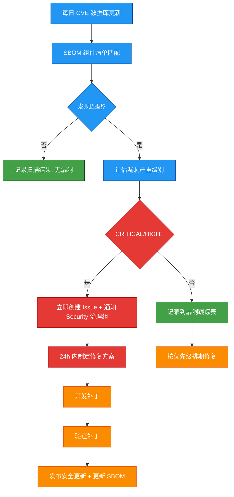
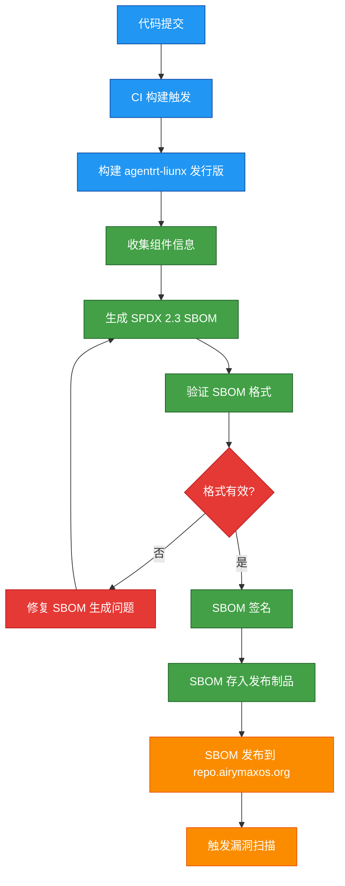

Copyright (c) 2025-2026 SPHARX Ltd. All Rights Reserved.

# agentrt-liunx 软件物料清单（SBOM）规范

> **文档定位**: agentrt-liunx（AirymaxOS）软件物料清单（SBOM）的完整规范，定义 SBOM 标准选择、组件清单、许可证合规矩阵、漏洞扫描策略与自动生成流程
> **版本**: 0.1.1（文档体系完成）/ 1.0.1（开发）
> **最后更新**: 2026-07-07
> **父文档**: [项目管理规范总览](README.md)
> **关联规范**: IRON-9 v2 工程铁律（内部工程标准规范） / [安全加固规范](../../110-security/README.md) / [工程基线](../../10-architecture/04-engineering-baseline.md)

---

## 1. 概述

### 1.1 SBOM 定义与价值

软件物料清单（Software Bill of Materials，SBOM）是 agentrt-liunx（AirymaxOS）供应链安全管理的核心工具。SBOM 以机器可读的格式记录软件产品的所有组件、依赖关系和元数据。

| 价值维度 | 说明 |
|----------|------|
| **供应链透明** | 明确记录从 Linux 内核基线到第三方库的全部组件及其版本、来源 |
| **许可证合规** | 确保所有组件的许可证兼容，避免法律风险 — 符合 E-1 安全内生原则 |
| **漏洞响应** | 当 CVE 发布时，可快速定位受影响组件并评估影响范围 — 符合 S-1 反馈闭环原则 |
| **安全审计** | 为第三方安全审计提供完整的组件清单 |
| **行业合规** | 满足 SPDX 2.3 标准，支持自动化工具链集成 |
| **同源协调** | 与 agentrt SBOM 协调，确保 [SC] 共享契约层组件一致 — 符合 IRON-9 v2 |

### 1.2 五维正交 24 原则在 SBOM 中的映射

| 原则编号 | 原则名称 | 在 SBOM 中的体现 |
|----------|----------|---------------------|
| E-1 | 安全内生原则 | SBOM 是供应链安全的基石，从源头保障系统安全 |
| E-7 | 文档即代码原则 | SBOM 作为代码的一部分进行版本控制，与构建产物同步 |
| S-1 | 反馈闭环原则 | 漏洞扫描 → SBOM 更新 → 补丁发布形成完整闭环 |
| K-2 | 接口契约化原则 | SBOM 声明组件的接口契约（版本、API、ABI） |
| A-2 | 极致细节原则 | SBOM 记录每个组件的完整元数据，不遗漏任何依赖 |

---

## 2. SBOM 标准选择

### 2.1 标准对比

| 标准 | 版本 | 支持度 | 优缺点 |
|------|------|--------|--------|
| **SPDX** | 2.3 | 最广泛 | 行业标准，Linux 基金会维护，支持许可证、安全、关系等完整字段 |
| CycloneDX | 1.5 | 广泛 | OWASP 维护，安全导向，但许可证字段不如 SPDX 丰富 |
| SWID | ISO/IEC 19770-2 | 中等 | 国际标准，但过于复杂，不适合开源项目 |

### 2.2 选择理由

agentrt-liunx（AirymaxOS）选择 **SPDX 2.3** 作为 SBOM 标准，理由如下：

1. **行业标准**：SPDX 是 Linux 基金会维护的 ISO/IEC 5962:2021 标准，企业级 Linux 生态广泛采用
2. **许可证覆盖**：SPDX License List 包含 500+ 许可证标识符，覆盖 agentrt-liunx 全部组件
3. **工具链成熟**：支持 SPDX 的生成、验证、比较工具丰富（spdx-sbom-generator、SPDX Tools、NTIA Conformance Checker）
4. **关系建模**：SPDX 2.3 支持 DESCRIBES、DEPENDS_ON、CONTAINS 等关系类型，适合描述 agentrt-liunx 复杂的组件依赖图
5. **与 agentrt 对齐**：agentrt 同样采用 SPDX 2.3，[SC] 层组件可共享 SBOM 片段
6. **安全字段**：SPDX 2.3 支持 ExternalRef 字段引用 CVE、GHSA 等安全公告

### 2.3 SPDX 2.3 文档结构

```
SPDX Document
├── Creation Info（创建信息）
│   ├── SPDX Version: SPDX-2.3
│   ├── Data License: CC0-1.0
│   ├── SPDX Identifier: SPDXRef-DOCUMENT
│   ├── Document Name: agentrt-liunx-1.0.1-sbom
│   ├── Creator: Organization: SPHARX Ltd.
│   └── Created: 2026-07-07T00:00:00Z
│
├── Package（软件包）
│   ├── Package Name: agentrt-liunx
│   ├── Package Version: 1.0.1
│   ├── Package Supplier: SPHARX Ltd.
│   ├── Package Download Location: https://repo.airymaxos.org
│   ├── Package License Concluded: GPL-2.0-only
│   ├── Package Copyright Text: Copyright (c) 2025-2026 SPHARX Ltd.
│   └── External References（外部引用）
│       ├── SECURITY: CVE-XXXX-XXXXX
│       └── PACKAGE_MANAGER: rpm
│
├── Relationships（关系）
│   ├── SPDXRef-DOCUMENT DESCRIBES SPDXRef-agentrt-liunx
│   ├── SPDXRef-agentrt-liunx CONTAINS SPDXRef-linux-kernel
│   ├── SPDXRef-agentrt-liunx CONTAINS SPDXRef-ebpf-subsystem
│   └── ...
│
└── Files（文件，可选）
    ├── File Name: kernel/vmlinuz
    ├── File Checksum: SHA256:...
    └── ...
```

---

## 3. 组件清单

### 3.1 组件分类总览

agentrt-liunx（AirymaxOS）SBOM 覆盖以下组件类别：

| 类别 | 优先级 | SBOM 深度 | 说明 |
|------|--------|-----------|------|
| **Linux 内核基线** | 最高 | 文件级 | 内核镜像、内核模块、内核头文件 |
| **eBPF 子系统** | 高 | 文件级 | eBPF 程序、BPF 映射定义、kfunc 注册 |
| **Rust 工具链** | 高 | 包级 | Rust 编译器、cargo、核心 crate |
| **C/C++ 工具链** | 高 | 包级 | GCC、Clang、binutils、glibc |
| **系统服务** | 高 | 包级 | systemd、journald、NetworkManager |
| **安全组件** | 高 | 包级 + 文件级 | SELinux、capability 库、国密库 |
| **云原生组件** | 中 | 包级 | containerd、K8s 组件、CNI 插件 |
| **第三方库** | 中 | 包级 | libcurl、OpenSSL、protobuf、grpc |
| **测试组件** | 中 | 包级 | CUnit、kselftest、pytest |
| **文档与工具** | 低 | 包级 | 文档生成工具、开发辅助工具 |

### 3.2 Linux 内核基线组件

| 组件 | 版本 | 来源 | 许可证 | SPDX ID |
|------|------|------|--------|---------|
| Linux Kernel | 6.6 LTS | kernel.org | GPL-2.0-only | SPDXRef-linux-kernel |
| EEVDF 调度器 | 6.6 原生 | 主线 | GPL-2.0-only | SPDXRef-eevdf |
| MGLRU（多代 LRU） | 6.6 原生 | 主线 | GPL-2.0-only | SPDXRef-mglru |
| io_uring | 6.6 原生 | 主线 | GPL-2.0-only | SPDXRef-iouring |
| eBPF kfunc | 6.6 原生 | 主线 | GPL-2.0-only | SPDXRef-ebpf-kfunc |
| sched_ext（SCHED_AGENT） | agentrt-liunx（AirymaxOS）增强 | 主线 6.12+ 向前移植 | GPL-2.0-only | SPDXRef-sched-ext |
| Rust 内核支持 | 6.6 实验性 | 主线 | GPL-2.0-only | SPDXRef-rust-kernel |
| XFS 在线 fsck | 6.6 原生 | 主线 | GPL-2.0-only | SPDXRef-xfs-fsck |

### 3.3 eBPF 子系统组件

| 组件 | 版本 | 来源 | 许可证 | SPDX ID |
|------|------|------|--------|---------|
| eBPF 核心运行时 | 6.6 原生 | 主线 | GPL-2.0-only | SPDXRef-ebpf-core |
| BPF CO-RE | 6.6 原生 | 主线 | GPL-2.0-only | SPDXRef-bpf-core |
| BPF Type Format (BTF) | 6.6 原生 | 主线 | GPL-2.0-only | SPDXRef-btf |
| libbpf | 1.x | kernel.org | LGPL-2.1-only | SPDXRef-libbpf |
| bpftool | 6.6 | kernel.org | GPL-2.0-only | SPDXRef-bpftool |
| SCHED_AGENT eBPF 调度器 | 1.0.1 | agentrt-liunx | GPL-2.0-only | SPDXRef-sched-agent-bpf |
| eBPF 安全探针 | 1.0.1 | agentrt-liunx | GPL-2.0-only | SPDXRef-ebpf-security |

### 3.4 Rust 工具链组件

| 组件 | 版本 | 来源 | 许可证 | SPDX ID |
|------|------|------|--------|---------|
| Rust 编译器 (rustc) | 1.75+ | rust-lang.org | MIT OR Apache-2.0 | SPDXRef-rustc |
| Cargo | 1.75+ | rust-lang.org | MIT OR Apache-2.0 | SPDXRef-cargo |
| Rust 标准库 (std) | 1.75+ | rust-lang.org | MIT OR Apache-2.0 | SPDXRef-rust-std |
| Rust 核心库 (core) | 1.75+ | rust-lang.org | MIT OR Apache-2.0 | SPDXRef-rust-core |
| Rust 分配库 (alloc) | 1.75+ | rust-lang.org | MIT OR Apache-2.0 | SPDXRef-rust-alloc |
| bindgen | 0.69+ | crates.io | BSD-3-Clause | SPDXRef-bindgen |
| serde | 1.x | crates.io | MIT OR Apache-2.0 | SPDXRef-serde |
| tokio | 1.x | crates.io | MIT | SPDXRef-tokio |

### 3.5 C/C++ 工具链组件

| 组件 | 版本 | 来源 | 许可证 | SPDX ID |
|------|------|------|--------|---------|
| GCC | 12+ | gcc.gnu.org | GPL-3.0-or-later | SPDXRef-gcc |
| Clang/LLVM | 17+ | llvm.org | Apache-2.0 WITH LLVM-exception | SPDXRef-clang |
| binutils | 2.40+ | gnu.org | GPL-3.0-or-later | SPDXRef-binutils |
| glibc | 2.38+ | gnu.org | LGPL-2.1-or-later | SPDXRef-glibc |
| GNU Make | 4.4+ | gnu.org | GPL-3.0-or-later | SPDXRef-make |
| CMake | 3.27+ | cmake.org | BSD-3-Clause | SPDXRef-cmake |
| pkg-config | 0.29+ | freedesktop.org | GPL-2.0-or-later | SPDXRef-pkg-config |

### 3.6 系统服务组件

| 组件 | 版本 | 来源 | 许可证 | SPDX ID |
|------|------|------|--------|---------|
| systemd | 254+ | systemd.io | LGPL-2.1-or-later | SPDXRef-systemd |
| journald | 254+ | systemd | LGPL-2.1-or-later | SPDXRef-journald |
| NetworkManager | 1.44+ | gnome.org | GPL-2.0-or-later | SPDXRef-networkmanager |
| udev | 254+ | systemd | LGPL-2.1-or-later | SPDXRef-udev |
| dbus | 1.14+ | freedesktop.org | AFL-2.1 OR GPL-2.0-or-later | SPDXRef-dbus |
| polkit | 123+ | freedesktop.org | LGPL-2.0-or-later | SPDXRef-polkit |

### 3.7 安全组件

| 组件 | 版本 | 来源 | 许可证 | SPDX ID |
|------|------|------|--------|---------|
| SELinux | 3.5+ | selinuxproject.org | GPL-2.0-only | SPDXRef-selinux |
| libseccomp | 2.5+ | github.com/seccomp | LGPL-2.1-only | SPDXRef-libseccomp |
| capability 库 | 1.0.1 | agentrt-liunx | Apache-2.0 | SPDXRef-capability-lib |
| SM2/SM3/SM4 国密库 | 1.0.1 | agentrt-liunx | Apache-2.0 | SPDXRef-gm-crypto |
| auditd | 3.1+ | linux-audit | GPL-2.0-or-later | SPDXRef-auditd |
| TEE/SGX 支持库 | 1.0.1 | agentrt-liunx | Apache-2.0 | SPDXRef-tee-lib |

### 3.8 云原生组件

| 组件 | 版本 | 来源 | 许可证 | SPDX ID |
|------|------|------|--------|---------|
| containerd | 1.7+ | containerd.io | Apache-2.0 | SPDXRef-containerd |
| Kubernetes 组件 | 1.28+ | kubernetes.io | Apache-2.0 | SPDXRef-k8s |
| OCI runtime-spec | 1.1+ | opencontainers.org | Apache-2.0 | SPDXRef-oci-spec |
| CNI 插件 | 1.3+ | github.com/containernetworking | Apache-2.0 | SPDXRef-cni |
| agentctl | 1.0.1 | agentrt-liunx | Apache-2.0 | SPDXRef-agentctl |
| 超节点 UMDK | 1.0.1 | agentrt-liunx | Apache-2.0 | SPDXRef-umdk |
| runc | 1.1+ | opencontainers.org | Apache-2.0 | SPDXRef-runc |

### 3.9 第三方核心库

| 组件 | 版本 | 来源 | 许可证 | SPDX ID |
|------|------|------|--------|---------|
| OpenSSL | 3.1+ | openssl.org | Apache-2.0 | SPDXRef-openssl |
| libcurl | 8.2+ | curl.se | curl | SPDXRef-libcurl |
| protobuf | 24+ | protobuf.dev | BSD-3-Clause | SPDXRef-protobuf |
| gRPC | 1.58+ | grpc.io | Apache-2.0 | SPDXRef-grpc |
| zlib | 1.2.13+ | zlib.net | Zlib | SPDXRef-zlib |
| libxml2 | 2.11+ | xmlsoft.org | MIT | SPDXRef-libxml2 |
| libjson-c | 0.17+ | github.com/json-c | MIT | SPDXRef-json-c |
| OpenTelemetry | 1.20+ | opentelemetry.io | Apache-2.0 | SPDXRef-opentelemetry |

---

## 4. 许可证合规矩阵

### 4.1 许可证分类

| 许可证类别 | 许可证 | 限制级别 | agentrt-liunx 使用 |
|------------|--------|----------|---------------------|
| **强 Copyleft** | GPL-2.0-only, GPL-3.0-or-later | 高 | 内核、GCC、binutils |
| **弱 Copyleft** | LGPL-2.1-only, LGPL-2.1-or-later, LGPL-2.0-or-later | 中 | glibc、systemd、libseccomp |
| **宽松许可** | Apache-2.0, MIT, BSD-3-Clause | 低 | 自研组件、LLVM、gRPC |
| **特殊许可** | curl, Zlib, AFL-2.1 | 低 | 特定第三方库 |

### 4.2 许可证兼容性矩阵

| 组件许可证 | 可与 GPL-2.0 链接 | 可与 Apache-2.0 链接 | 可与 MIT 链接 |
|------------|-------------------|----------------------|---------------|
| GPL-2.0-only | ✅ | ❌ | ❌ |
| GPL-3.0-or-later | ✅ (GPL-3.0 兼容) | ❌ | ❌ |
| LGPL-2.1-only | ✅ | ✅ | ✅ |
| Apache-2.0 | ❌ | ✅ | ✅ |
| MIT | ✅ | ✅ | ✅ |
| BSD-3-Clause | ✅ | ✅ | ✅ |
| curl | ✅ | ✅ | ✅ |
| Zlib | ✅ | ✅ | ✅ |

### 4.3 合规要求

| 要求 | 说明 | 验证方式 |
|------|------|----------|
| **内核模块许可证** | 所有内核模块必须使用 GPL-2.0 兼容许可证 | 内核构建时自动检查 MODULE_LICENSE |
| **发行版整体许可证** | agentrt-liunx 发行版整体许可证为 GPL-2.0-only（与内核一致） | SPDX 文档声明 |
| **自研组件许可证** | agentrt-liunx（AirymaxOS）自研组件使用 Apache-2.0 | 代码仓库 LICENSE 文件 |
| **第三方组件审核** | 新增第三方组件必须在引入前完成许可证审核 | 许可证合规审查流程 |
| **许可证冲突检测** | 自动化工具检测许可证冲突 | CI 流水线集成 |
| **禁止 GPL-3.0 仅内核代码** | 内核代码不能使用 GPL-3.0-only（与 GPL-2.0 不兼容） | 代码审查 |

---

## 5. 漏洞扫描策略

### 5.1 扫描策略总览

| 策略维度 | 说明 |
|----------|------|
| **扫描频率** | 每日自动扫描（CVE 数据库更新后）+ 每次发布前强制扫描 |
| **扫描范围** | SBOM 中列出的全部组件（从内核到第三方库） |
| **扫描工具** | Trivy + Grype + OSS-Fuzz（内核） |
| **严重级别** | CRITICAL / HIGH / MEDIUM / LOW / NONE |
| **响应时间** | CRITICAL: 24h / HIGH: 7d / MEDIUM: 30d / LOW: 90d |
| **通知机制** | agentrt-liunx-SA 安全公告 + Issue 自动创建 |

### 5.2 漏洞扫描流程



### 5.3 漏洞评级标准

| 严重级别 | CVSS 评分 | 响应时间 | 处理方式 |
|----------|-----------|----------|----------|
| CRITICAL | 9.0 - 10.0 | 24 小时 | 紧急安全更新，阻塞发布 |
| HIGH | 7.0 - 8.9 | 7 天 | 安全更新，纳入下一个 Update 版本 |
| MEDIUM | 4.0 - 6.9 | 30 天 | 纳入定期更新计划 |
| LOW | 0.1 - 3.9 | 90 天 | 按需修复，纳入下一个 LTS 版本 |
| NONE | 0.0 | 不适用 | 记录但无需处理 |

### 5.4 漏洞豁免流程

当漏洞无法修复或修复成本过高时，可申请漏洞豁免：

1. **提交豁免申请**：说明漏洞编号、影响范围、无法修复的原因
2. **风险评估**：Security 治理组评估风险
3. **架构委员会审批**：CRITICAL/HIGH 漏洞豁免需架构委员会投票
4. **记录豁免**：在 SBOM 中记录豁免，注明原因和有效期
5. **定期复审**：每季度复审豁免列表，确认豁免是否仍然有效

---

## 6. SBOM 自动生成流程

### 6.1 生成流水线

SBOM 的生成完全自动化，集成在 CI/CD 流水线中：



### 6.2 生成工具链

| 工具 | 用途 | 说明 |
|------|------|------|
| spdx-sbom-generator | 主要生成工具 | 支持多种包管理器，生成 SPDX 2.3 格式 |
| RPM SBOM 插件 | RPM 包信息提取 | 从 RPM 元数据提取组件信息 |
| Kernel SBOM 脚本 | 内核组件信息提取 | 解析内核 config + 模块列表 |
| Cargo SBOM 插件 | Rust 依赖提取 | 从 Cargo.lock 生成 SPDX |
| SBOM 签名工具 | 数字签名 | 使用 SM2 签名保护 SBOM 完整性 |
| SPDX Tools | 格式验证 | 验证 SPDX 文档格式合规性 |

### 6.3 生成配置

```yaml
# .github/workflows/sbom-generation.yml
sbom:
  standard: SPDX-2.3
  document_name: "agentrt-liunx-{version}-sbom"
  namespace: "https://repo.airymaxos.org/sbom/"
  creator: "Organization: SPHARX Ltd."
  
  packages:
    - type: rpm
      path: /build/rpms/
    - type: kernel
      config: /build/kernel/.config
      modules: /build/kernel/modules/
    - type: cargo
      lockfile: /build/Cargo.lock
    - type: manual
      components: /sbom/manual_components.yaml
  
  signing:
    algorithm: SM2
    key: /keys/sbom_signing.key
  
  output:
    format: [json, tag-value, yaml]
    path: /release/sbom/
```

### 6.4 SBOM 版本管理

| 场景 | SBOM 版本策略 | 说明 |
|------|--------------|------|
| 新版本发布 | 生成新的完整 SBOM | 替换旧版本 SBOM |
| Update 版本 | 生成增量 SBOM | 仅包含变更的组件 |
| 安全补丁 | 更新 SBOM 中受影响的组件版本 | 标记修复的 CVE |
| 组件回滚 | 生成新的 SBOM | 反映回滚后的组件版本 |

---

## 7. 与 agentrt SBOM 的关系

### 7.1 IRON-9 v2 三层 SBOM 关系

根据 IRON-9 v2 工程铁律，agentrt-liunx 与 agentrt 的 SBOM 关系遵循三层架构：

| 层级 | SBOM 关系 | 说明 |
|------|-----------|------|
| **[SC] 共享契约层** | 共享 SBOM 片段 | `include/airymax/` 头文件库的 SBOM 片段由 agentrt 维护，agentrt-liunx 引用 |
| **[SS] 语义同源层** | 各自独立 SBOM | 各自的实现使用独立组件，SBOM 各自维护 |
| **[IND] 完全独立层** | 完全独立 SBOM | 无交叉引用，SBOM 完全独立 |

### 7.2 [SC] 层共享 SBOM 片段

共享契约层的组件（`include/airymax/` 头文件库）在 agentrt 和 agentrt-liunx 的 SBOM 中共同标注：

```yaml
# agentrt-liunx SBOM 中引用 agentrt 共享 SBOM 片段
relationships:
  - spdxElementId: SPDXRef-agentrt-liunx
    relationshipType: DEPENDS_ON
    relatedSpdxElement: SPDXRef-airymax-contracts
    comment: "IRON-9 v2 [SC] 层 — 共享契约层代码，SBOM 片段由 agentrt 维护"
```

### 7.3 跨仓 SBOM 一致性检查

| 检查项 | 工具 | 频率 |
|--------|------|------|
| [SC] 层组件版本一致性 | 跨仓 CI 校验 | 每次 PR |
| [SC] 层许可证一致性 | SPDX diff 工具 | 每次 PR |
| [SC] 层 CVE 同步 | 跨仓安全扫描 | 每日 |
| SBOM 格式一致性 | SPDX 验证工具 | 每次发布 |

---

## 8. 工程纪律

### 8.1 SBOM 铁律

| 铁律 | 内容 | 关联规范 |
|------|------|----------|
| **SBOM 强制** | 每次发布必须附带 SPDX 2.3 格式的 SBOM，未附带 SBOM 的发布视为无效 | E-1 安全内生原则 |
| **SBOM 完整性** | SBOM 必须覆盖所有组件（包括传递依赖），不允许遗漏 | E-6 错误可追溯原则 |
| **SBOM 签名** | SBOM 必须经过 SM2 数字签名，确保完整性和不可否认性 | E-1 安全内生原则 |
| **SBOM 可验证** | SBOM 必须通过 SPDX 验证工具验证，格式不合规的 SBOM 不得发布 | E-8 可测试性原则 |
| **SBOM 版本同步** | SBOM 的版本号必须与 agentrt-liunx 发行版版本号一致 | E-7 文档即代码原则 |
| **许可证合规** | 新增组件必须在引入前通过许可证合规审查 | E-1 安全内生原则 |

### 8.2 SBOM 合规性检查清单

| 检查项 | 频率 | 责任人 |
|--------|------|--------|
| [ ] SBOM 格式通过 SPDX 验证 | 每次发布 | 发布工程师 |
| [ ] SBOM 包含所有组件清单 | 每次发布 | 构建系统 |
| [ ] 所有组件许可证已验证 | 每次引入新组件 | 合规团队 |
| [ ] 漏洞扫描已执行且无 CRITICAL | 每次发布 | Security 治理组 |
| [ ] SBOM 已 SM2 签名 | 每次发布 | 发布工程师 |
| [ ] [SC] 层组件与 agentrt 一致 | 每次 PR | 跨仓 CI |
| [ ] SBOM 已存入发布制品 | 每次发布 | 构建系统 |
| [ ] SBOM 已发布到 repo.airymaxos.org | 每次发布 | 发布工程师 |

---

## 9. 相关文档

- [项目管理规范总览](README.md)：项目管理规范顶层入口
- [统一错误码参考](error_code_reference.md)：统一错误码体系
- [集成标准总览](../integration_standards/README.md)：集成标准
- [安全加固规范](../../110-security/README.md)：安全加固体系
- [工程基线](../../10-architecture/04-engineering-baseline.md)：工程基线定义
- [五维正交原则](../../10-architecture/02-five-dimensional-principles.md)：五维正交 24 原则
- IRON-9 v2 工程铁律（闭源内部参考）

---

## 10. 版本历史

| 版本 | 日期 | 变更 |
|------|------|------|
| 0.1.1 | 2026-07-07 | 初始版本（SPDX 2.3 标准 + 9 类组件清单 + 许可证合规矩阵 + 漏洞扫描策略 + 自动生成流程 + agentrt SBOM 关系） |
| 1.0.1 | 2027-XX-XX | 首个开发版本（与代码实现同步验证） |