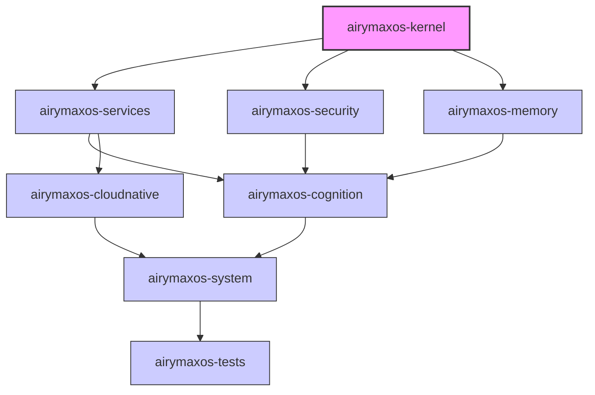

Copyright (c) 2025-2026 SPHARX Ltd. All Rights Reserved.

# agentrt-liunx（AirymaxOS）模块需求手册

| 元信息 | 说明 |
|--------|------|
| 版本 | 1.0.1（开发） |
| 最后更新 | 2026-07-07 |
| 父文档 | [项目管理规范总览](README.md) |

---

## 1. 引言

本文档定义了 **agentrt-liunx（AirymaxOS）** 项目中各个子模块的功能边界、接口约定、性能要求和安全规范。本设计遵循 **五维正交** 架构原则，确保模块间低耦合、高内聚，并满足 IRON-9 v2 硬件平台的适配要求。

agentrt-liunx（AirymaxOS）作为面向Agent计算的下一代操作系统，采用了 **五维正交** 分解方法，将系统划分为8个独立开发的子仓库，每个子仓库对应一个核心模块，通过清晰的接口契约保证整体系统的一致性。

---

## 2. 模块总体架构

agentrt-liunx（AirymaxOS）采用分层模块化设计，基于 **五维正交** 架构方法论实现功能解耦。以下为高层架构示意图：



IRON-9 v2 硬件平台提供了丰富的扩展接口，agentrt-liunx（AirymaxOS）各个模块需要针对该平台进行深度优化，充分发挥其异构计算能力。

---

## 3. 各子模块需求规格

### 3.1 airymaxos-kernel 模块

**功能边界**
- 基于 Linux 6.6 基线进行定制开发
- 集成 sched_ext 可扩展调度器框架，支持Agent任务动态调度
- 强化 eBPF 虚拟化和观测能力，支持全系统可观测性
- 引入 Rust 进行驱动和核心组件开发，提升内存安全性
- 负责基础中断、进程管理、时钟、中断子系统维护

**接口契约**
- 提供标准 Linux syscall 接口，保持对 Linux ABI 的兼容性
- 内部模块通过EXPORT_SYMBOL_GPL导出核心函数
- 提供eBPF程序加载和验证的标准化接口

**性能要求**
- 进程上下文切换延迟 < 10us (on IRON-9 v2)
- 调度器响应延迟 < 50us 对于优先级最高任务
- 内核启动时间 <= 3s (从固件到用户空间init)

**安全要求**
- 开启所有内核加固选项 (CONFIG_GCC_PLUGINS, CONFIG_STACKPROTECTOR)
- 强制启用内核地址空间布局随机化 (KASLR)
- 所有新增Rust代码必须经过内存安全检查
- 拒绝未验证的eBPF程序加载

**模块接口详情**
- 系统调用表位置：通过 `arch/arm64/kernel/syscall_table.S` 注册
- eBPF JIT 编译后端：分别支持 ARM64 和 x86_64 架构
- sched_ext BPF 调度器挂钩在 `kernel/sched/ext.c` 中实现
- Rust 内核组件通过 `kernel/rust/` 目录组织，使用 `bindgen` 生成 C 绑定

**模块初始化流程**
- 第一阶段：早期启动阶段，设置页表和内存映射
- 第二阶段：体系结构初始化，启用 SMP 和中断控制器
- 第三阶段：子系统初始化，加载 eBPF 和 sched_ext 模块
- 第四阶段：Rust 运行时初始化，加载 Rust 编写的驱动

---

### 3.2 airymaxos-services 模块

**功能边界**
- 提供12个核心系统守护进程，负责Agent运行时环境管理
- 基于 io_uring 实现高性能 IPC 通信框架
- 负责系统服务生命周期管理
- 提供设备抽象和访问代理服务
- 实现Agent上下文的快速保存/恢复机制

**接口契约**
- 通过 UNIX domain socket 向用户空间提供服务API
- 采用 JSON-RPC 2.0 作为服务调用协议
- io_uring IPC 通道用于低延迟数据传输
- 通过 systemd 进行服务启动管理

**性能要求**
- 服务调用平均延迟 < 100us (进程内IPC)
- 支持每秒 1M+ 次 IPC 调用
- io_uring 批量传输吞吐量 > 10GB/s

**安全要求**
- 所有服务采用最小权限原则运行
- IPC 通信必须经过身份验证和权限检查
- 禁止使用root权限运行不必要的服务
- 服务间通信必须启用消息完整性校验

**12个守护进程清单**
| 守护进程名 | 功能描述 |
|-----------|----------|
| agentlaunchd | Agent生命周期管理 |
| agentipcd | io_uring IPC 通信仲裁 |
| agentdevd | 设备抽象与访问代理 |
| agentctxd | Agent上下文保存与恢复 |
| agentmonitord | 系统健康监控与告警 |
| agentlogd | Agent日志采集与聚合 |
| agentresourced | 资源分配与配额管理 |
| agentnetd | 网络代理与流量管理 |
| agentstoraged | Agent存储后端抽象 |
| agentconfigd | 配置管理与分发 |
| agentlicensed | 许可证与服务注册 |
| agentupgraded | 在线升级与热补丁 |

---

### 3.3 airymaxos-security 模块

**功能边界**
- 实现 Cupolas 能力管理系统，替代传统POSIX capabilities
- 集成LSM框架，支持可插拔安全模块
- 借鉴 seL4 式的强制访问控制模型
- 提供可信执行环境支持
- 负责系统完整性测量和验证

**接口契约**
- 通过 netlink 向用户空间安全管理器提供接口
- 集成内核安全模块钩子，支持策略动态加载
- 提供能力查询和验证的syscall扩展

**性能要求**
- 能力检查开销 < 50ns 每次系统调用
- 策略加载时间 < 100ms 对于10k规则
- 内存占用 < 16MB for 策略存储

**安全要求**
- 强制所有进程进行能力检查
- 不允许绕过安全模块钩子
- 策略存储必须加密保护
- 完整性测量必须支持远程验证

**Cupolas 能力模型**
- 采用细粒度能力令牌，替代传统 CAP_SYS_ADMIN 粗粒度权限
- 能力分为三个层级：进程级、命名空间级、系统级
- 能力继承遵循最小权限，子进程默认获得父进程能力的子集
- 能力令牌支持时效性，超时自动失效
- 与 seL4 式能力空间隔离机制结合，防止权限提升

---

### 3.4 airymaxos-memory 模块

**功能边界**
- 实现 MemoryRovol L1-L4 分级内存管理架构
- 支持 CXL 互联扩展内存池管理
- 集成改进型 MGLRU 页面回收算法
- 提供智能页面预测和预分配机制
- 支持异构内存节点的动态负载均衡

**接口契约**
- 通过 /sys/kernel/memoryrovel 提供配置接口
- 标准内存分配器接口不变，兼容现有应用
- 提供用户空间NDCTL兼容接口管理CXL设备

**性能要求**
- 内存分配延迟降低 20% 对比主线内核
- CXL 内存访问延迟 overhead < 5%
- 页面回收吞吐量提升 30%
- 系统内存利用率提升 >= 15%

**安全要求**
- 跨节点内存访问必须进行地址验证
- 释放内存必须彻底清零防止信息泄露
- CXL 内存池隔离必须防止越权访问
- 支持内存加密引擎硬件加速

**MemoryRovol L1-L4 分级架构**
| 层级 | 名称 | 介质 | 延迟 | 容量 |
|------|------|------|------|------|
| L1 | 本地快速内存 | DDR5 DIMM | < 100ns | 256GB-1TB |
| L2 | CXL 近端内存 | CXL.mem Type-3 | < 300ns | 1TB-4TB |
| L3 | CXL 远端内存 | 跨机架 CXL Fabric | < 1us | 4TB-16TB |
| L4 | 压缩交换空间 | NVMe zoned storage | < 100us | 按需扩展 |

---

### 3.5 airymaxos-cognition 模块

**功能边界**
- 实现 CoreLoopThree kthread 认知任务调度框架
- 集成 Wasm 3.0 字节码虚拟机，支持Agent逻辑沙箱执行
- 提供 GPU/NPU 异构计算抽象接口
- 负责AI推理模型的内存管理和调度
- 支持大模型模型参数分段加载

**接口契约**
- 通过 char 设备提供 Wasm 程序加载接口
- 标准 ioctl 接口控制推理任务执行
- 通过共享内存传递推理输入输出数据

**性能要求**
- Wasm 冷启动时间 < 10ms
- NPU 推理任务调度 latency < 1ms
- 支持并发 64 路推理任务同时进行
- 在 IRON-9 v2 NPU 上推理性能达到硬件峰值 90%

**安全要求**
- Wasm 沙箱必须严格隔离，不允许逃逸
- 异构设备访问必须进行权限检查
- 模型数据必须支持完整性校验
- 禁止未授权模型在NPU上执行

---

### 3.6 airymaxos-cloudnative 模块

**功能边界**
- 集成 containerd 容器运行时管理
- 提供 Kubernetes 节点组件支持
- 兼容 OCI 镜像和运行时规范
- 实现 CNI 容器网络接口
- 支持容器资源限制和QoS保障

**接口契约**
- 标准 CRI 接口兼容 Kubernetes
- 提供 runc 兼容的容器运行时接口
- 网络配置通过标准CNI插件机制

**性能要求**
- 容器启动时间 < 500ms
- 容器网络带宽接近原生性能
- 容器创建销毁 overhead < 10%
- 支持 100+ 容器并发运行

**安全要求**
- 强制用户命名空间隔离
- 启用 seccomp-bpf 系统调用过滤
- 容器能力默认只保留最小集合
- 不允许特权容器默认运行

---

### 3.7 airymaxos-system 模块

**功能边界**
- 集成 systemd 系统和服务管理器
- journald 日志管理持久化
- udev 设备管理器热插拔支持
- initramfs 早期用户空间实现
- 系统状态快照和恢复机制

**接口契约**
- 标准 systemd D-Bus 接口
- journal 日志通过 syslog 接口兼容
- udev 通过 netlink 内核通信

**性能要求**
- 从固件到登录界面 <= 5s on NVMe SSD
- 服务并行启动，启动时间减少 40%
- 日志轮转不阻塞服务运行

**安全要求**
- systemd 服务配置必须严格权限检查
- journal 日志文件必须合适权限保护
- 不允许未签名单元文件运行
- initramfs 必须加密保护

---

### 3.8 airymaxos-tests 模块

**功能边界**
- 集成 KUnit 单元测试框架
- kselftest 用户空间测试集合维护
- 支持形式化验证关键安全代码
- 提供长时间 soak 测试框架
- 混沌工程测试基础设施支持

**接口契约**
- 标准 KTAP 输出格式兼容
- 提供 pytest 封装用户空间测试
- CI/CD 流水线可调用自动化接口

**性能要求**
- 所有单元测试必须在 30 分钟内完成
- 混沌测试不影响生产系统稳定性
- 形式化验证在合理时间内完成模型检查

**安全要求**
- 测试用例不得污染生产环境
- 混沌测试必须在隔离环境进行
- 测试数据必须清理干净
- 不允许测试代码留在生产内核

---

## 4. 模块依赖矩阵

以下为各模块间依赖关系示意图：

```mermaid
matrix
    |模块|kernel|services|security|memory|cognition|cloudnative|system|tests|
    |----|:----:|:----:|:----:|:----:|:----:|:----:|:----:|:----:|
    |kernel| - | D | D | D | I | I | I | T |
    |services| D | - | I | I | I | D | D | T |
    |security| D | I | - | I | I | I | I | T |
    |memory| D | I | I | - | I | I | I | T |
    |cognition| D | D | D | D | - | I | I | T |
    |cloudnative| D | I | I | I | I | - | D | T |
    |system| D | D | D | D | I | I | - | T |
    |tests| T | T | T | T | T | T | T | - |
    
    D: 直接依赖, I: 间接依赖, T: 测试依赖, -: 无依赖
```

**依赖说明**：
1. 所有模块都依赖于 kernel 提供的基础运行环境
2. system 模块依赖 services 提供系统服务能力
3. cognition 模块依赖 memory、security、services 多个模块
4. tests 模块对所有其他模块都是测试依赖关系，不参与运行时依赖

---

## 5. 模块接口规范

### 5.1 Syscall 接口规范

- agentrt-liunx（AirymaxOS）保持对 Linux ABI 的向后兼容
- 新增系统调用必须遵守 `agentrt_*` 命名前缀
- 每个 syscall 必须包含权限检查，集成 security 模块钩子
- 系统调用编号必须在 upstream 预留范围分配

### 5.2 IPC 接口规范

- 进程间通信优先使用 io_uring IPC 框架（services 模块提供）
- 传统 SysV IPC 保持兼容但不推荐新代码使用
- 服务间通信必须进行身份和权限验证
- 大型数据传输必须使用共享内存减少拷贝

### 5.3 共享内存规范

- 必须使用 memory 模块提供的统一分配接口
- 共享内存区域必须进行权限标记
- 支持基于 CUPolas 能力的访问控制
- 大型共享内存区域支持透明巨页

### 5.4 接口版本管理

- 每个模块的接口必须遵循语义化版本号 (SemVer)
- 不兼容的接口变更必须增加主版本号
- 新功能的添加必须增加次版本号
- 向后兼容的修复必须增加修订版本号
- 接口废弃必须有至少两个版本的过渡期
- agentrt-liunx（AirymaxOS）各模块接口版本号在 `VERSION` 文件中维护

### 5.5 接口文档要求

- 每个公开接口必须有与之对应的文档注释
- 使用 kernel-doc 格式描述内核接口
- 用户空间接口使用 Doxygen 格式
- 接口变更必须同步更新文档
- 接口示例代码必须可编译运行

---

## 6. 模块质量门禁

### 6.1 代码检查门禁

| 检查项 | 要求 |
|--------|------|
| 代码格式 | 必须符合 Linux 内核编码风格 |
| 代码评论 | 所有改动必须至少2个Reviewer批准 |
| 拼写检查 | 必须通过 codespell 检查 |
| 静态分析 | 必须通过 sparse 和 smatch 检查 |
| Rust 检查 | Rust 代码必须通过 clippy 检查 |

### 6.2 测试门禁

- 单元测试覆盖率：新增代码 >= 80%
- 所有现有测试必须通过
- 没有内存泄漏（由 KASAN 检查）
- 没有未定义行为（由 UBSAN 检查）
- 形式化验证必须通过对于安全关键组件

### 6.3 性能门禁

- 性能基准测试不能有超过 5% 的倒退
- 内存开销不能超过设计上限
- 启动时间不能劣化

### 6.4 安全门禁

- 必须通过安全模块静态分析（包括 Rust 代码的 unsafe 块审计）
- 新增系统调用必须通过安全审查
- 不允许引入新的高危漏洞模式
- 所有用户可控的输入必须有边界检查
- 加密操作必须使用经过审计的加密库，禁止自行实现加密算法

### 6.5 文档门禁

- 新增用户可见的功能必须有对应的文档
- 接口变更必须更新相应的接口文档
- 配置项变更必须更新默认配置说明
- 没有文档的功能视为未完成，禁止合入

---

## 7. 模块生命周期

### 7.1 开发阶段

- 在特性分支开发，遵循 Git Flow 工作流
- 每个提交必须编译通过
- 开发者本地运行基本测试
- 遵循 **五维正交** 模块设计原则，不越界功能

### 7.2 测试阶段

- 合入开发分支后，由 CI 运行全套测试
- airymaxos-tests 模块执行对应的测试用例
- 性能基准测试运行，生成性能报告
- 安全扫描运行，发现潜在漏洞

### 7.3 预发布阶段

- 合入 main 分支
- 在 staging 环境进行集成测试
- 进行 soak 测试至少24小时
- 混沌工程验证系统韧性

### 7.4 生产阶段

- 打标签发布版本
- 更新对应文档
- 维护LTS分支，只接受修复
- 定期安全更新

---

## 8. 模块集成要求

1. **编译集成**
   - 每个子模块必须支持独立编译
   - 提供统一 Kconfig 配置选项
   - 不允许符号名冲突
   - 使用 C 语言必须检查函数原型

2. **运行时集成**
   - 模块初始化必须遵循正确顺序
   - 支持热插拔和模块移除
   - 错误处理必须逐级传递，不允许吃掉错误
   - 清理逻辑必须完整，防止内存泄漏

3. **五维正交 集成原则**
   - 功能分解保持正交，一个模块只解决一类问题
   - 接口保持稳定，不频繁变更
   - 依赖方向明确，不允许循环依赖
   - 变更影响分析必须覆盖依赖模块

4. **IRON-9 v2 平台集成**
   - 所有模块必须适配 IRON-9 v2 内存布局
   - 充分利用硬件加速特性
   - 适配异构计算单元寻址
   - 电源管理符合平台要求

---

## 9. 合规性要求

1. **主流 Linux 发行版标准 兼容性**
   - 必须符合 主流 Linux 发行版标准 对操作系统内核的要求
   - 用户空间工具兼容 主流 Linux 发行版标准 包管理格式
   - 符合 主流 Linux 发行版标准 安全配置基线
   - 定期同步 主流 Linux 发行版标准 社区更新

2. **Linux ABI 稳定性**
   - 保持对现有 Linux ABI 的向后兼容
   - 不破坏用户空间应用二进制兼容性
   - syscall 接口不能随意删除或改变语义
   - 第三方驱动模块接口保持兼容

3. **许可证合规**
   - 内核模块代码必须 GPL v2 兼容
   - 用户空间代码可以选用 Apache 2.0 或 MIT
   - 不允许引入未授权代码
   - 所有贡献者必须签署 DCO

4. **安全合规**
   - 定期进行安全扫描
   - 高危漏洞必须 90 天内修复
   - 安全公告发布流程必须合规
   - 符合国家相关信息安全法规要求

5. **主流 Linux 发行版标准 兼容性矩阵**
   - 内核版本：与 主流 Linux 发行版标准 LTS 内核版本同步更新
   - 系统工具：兼容 主流 Linux 发行版标准 核心工具链
   - 安全基线：满足 主流 Linux 发行版标准 安全配置规范
   - 认证要求：通过 主流 Linux 发行版标准 兼容性认证测试套件

6. **IRON-9 v2 平台合规**
   - 固件接口：遵循 IRON-9 v2 平台固件规范
   - 设备树：所有外设必须有对应的设备树节点
   - ACPI：支持 ACPI 6.5+ 规范
   - 电源管理：符合 IRON-9 v2 功耗管理要求

---

## 10. 总结

本文档定义了 agentrt-liunx（AirymaxOS）8个子模块的详细需求。各模块开发必须严格遵守本文档定义的功能边界、接口约定和质量要求。遵循 **五维正交** 设计原则，保证模块化开发能够并行进行，同时保证最终系统集成的一致性。针对 IRON-9 v2 平台的优化需求必须在各个模块中充分考虑，发挥硬件最大性能。

所有模块必须满足 主流 Linux 发行版标准 兼容性和 Linux ABI 稳定性要求，确保生态兼容性。通过严格的质量门禁和生命周期管理，保证 agentrt-liunx（AirymaxOS）整体质量可控。
