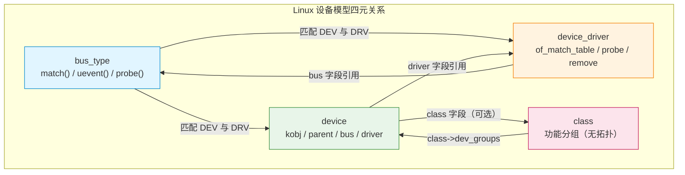
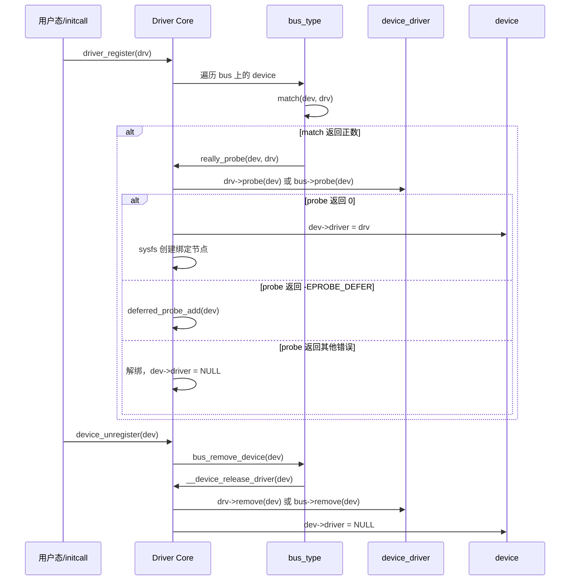
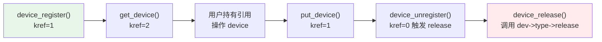

Copyright (c) 2025-2026 SPHARX Ltd. All Rights Reserved.

# AirymaxOS 驱动模型 — device/driver/bus 三元组详解

> **文档定位**: AirymaxOS（agentrt-linux）驱动子系统 60 模块首篇——device/driver/bus/class 四元关系核心抽象
> **版本**: 0.1.1（占位）/ 1.0.1（开发）
> **最后更新**: 2026-07-06
> **同源映射**: agentrt `daemons`（用户态服务）+ Linux 6.6 `drivers/base/`（device/driver/bus/class 实现）
> **理论根基**: Linux 6.6 内核基线 + Airymax 五维正交 24 原则
> **核心约束**: IRON-9 v2 同源且部分代码共享——继承 Linux 设备模型语义，不耦合上游发行版实现

---

## 1. 概述

Linux 设备模型核心可一句话概括："**device 描述有什么，driver 描述如何做，bus 负责把两者绑在一起**"。AirymaxOS 选择 Linux 6.6 内核基线作为驱动模型同源起点——这是经过最广泛硬件生态验证的解耦哲学。MicroCoreRT 在用户态重新实现智能体调度，AgentsIPC 在用户态承载进程间通信，而内核态硬件抽象层完整继承这套三元组。

本文档覆盖 device/driver/bus/class 四元关系、probe/remove 生命周期、name/OF/ACPI 三源匹配、sysfs 导出、kref/kobject 引用计数五大主题。IRON-9 v2 同源且部分代码共享体现为：内核态结构体与上游保持语义等价（确保可直接复用上游驱动代码）；用户态扩展（`agent_bus_type`、`devm_agentrt_*` 资源族）不进入上游内核，而是作为 AirymaxOS 专属扩展通过 `agentos/daemon/` 适配器接入。

| 层次 | 来源 | 演进策略 |
|------|------|---------|
| `struct device` / `struct device_driver` / `struct bus_type` | Linux 6.6 `include/linux/device.h` | 跟随上游，按需 backport |
| `struct kref` / `struct kobject` | Linux 6.6 `include/linux/kref.h` | 跟随上游 |
| `agent_bus_type` / `devm_agentrt_*` | AirymaxOS 自研 | 独立演进，不回传上游 |

> **OS-DRV-001**: 内核态设备模型结构体（`device`/`device_driver`/`bus_type`/`class`/`kref`/`kobject`）的字段、签名、生命周期语义必须与 Linux 6.6 内核基线保持二进制兼容。任何扩展通过 `KABI_RESERVE` 槽位或包装结构实现。

> **OS-DRV-002**: AirymaxOS 用户态扩展不得在内核态引入新的总线类型；它们必须作为用户态 daemon 实现，通过 `syscalls.h` 与 MicroCoreRT 通信。

---

## 2. device/driver/bus/class 四元关系

### 2.1 四元角色

| 角色 | 内核类型 | 头文件 | 职责 | AirymaxOS 类比 |
|------|---------|--------|------|----------------|
| **device** | `struct device` | `include/linux/device.h` | 描述硬件或虚拟设备实例（资源、属性、状态） | Agent 实例（含 SDK 句柄） |
| **driver** | `struct device_driver` | `include/linux/device/driver.h` | 描述如何操作设备（probe/remove/PM 回调） | Agent 实现模块 |
| **bus** | `struct bus_type` | `include/linux/device/bus.h` | 匹配 device 与 driver，承载总线级回调 | `agent_bus_type`（用户态） |
| **class** | `struct class` | `include/linux/class.h` | 按功能分组设备（无拓扑含义） | Agent 角色分组 |

### 2.2 关键结构体字段

`struct device`（节选自 Linux 6.6 `include/linux/device.h` 第 712 行）：

```c
struct device {
    struct kobject       kobj;          /* sysfs 节点 + 引用计数载体 */
    struct device       *parent;        /* 拓扑父设备 */
    struct device_private *p;           /* 驱动核心私有数据 */
    const char          *init_name;     /* 初始名称 */
    const struct device_type *type;     /* 设备类型回调 */
    const struct bus_type *bus;          /* 设备所在总线 */
    struct device_driver *driver;        /* 已绑定的 driver */
    void                *driver_data;   /* 驱动私有数据，dev_set_drvdata 访问 */
    struct mutex         mutex;          /* 同步访问该设备的调用 */
    struct dev_links_info links;         /* 设备链接（supplier/consumer） */
    struct dev_pm_info   power;         /* 电源管理信息 */
    struct dev_pm_domain *pm_domain;    /* 电源域 */
};
```

`struct device_driver`（节选自 Linux 6.6 `include/linux/device/driver.h` 第 96 行）核心字段：`name`、`bus`、`owner`、`probe_type`（同步/异步探测）、`of_match_table`、`acpi_match_table`，回调 `probe`/`remove`/`shutdown`/`suspend`/`resume`，以及 `groups`/`dev_groups`/`pm` 用于 sysfs 与电源管理。

`struct bus_type`（节选自 Linux 6.6 `include/linux/device/bus.h` 第 80 行）核心字段：`name`、`match`、`uevent`、`probe`、`remove`、`shutdown`、`suspend`/`resume`、`dma_configure`、`pm`。`match` 回调是绑定入口，返回正数表示匹配成功。

> **OS-STD-010**: 任何 AirymaxOS 内核态 driver 必须通过 `driver_register()` 注册，禁止绕过驱动核心直接调用 `probe`。

> **OS-DRV-003**: 自定义总线必须实现 `match` 回调；`probe`/`remove` 回调可委托给 driver 自身，但 `match` 不能为空。

### 2.3 四元关系图



### 2.4 解耦的三层含义

解耦有三层含义：**生命周期解耦**（device 先注册会等待 driver 的 deferred probe；driver 先注册会立即扫描已存在 device）、**多对多关系解耦**（同一 driver 可服务多个同类 device，如 4 个 UART 端口共享一个 8250 driver；同一 device 在不同时刻可被不同 driver 接管）、**失败隔离解耦**（单个 driver 的 probe 失败不会拖垮总线上的其他 driver——这是 K-3 服务隔离原则在内核态的体现）。

> **OS-DRV-004**: driver 的 `probe` 回调失败必须返回负数错误码。返回 `-EPROBE_DEFER` 触发延迟重试机制，其他错误立即解绑。

---

## 3. probe/remove 生命周期

### 3.1 完整生命周期时序



### 3.2 probe 回调契约与示例

`probe` 是 driver 与 device 第一次"握手"。前置条件：`dev->driver` 已指向当前 driver；`dev` 的资源（`resource`、`of_node`、`fwnode`）已就绪。后置条件：成功返回 0 时 driver 已完成所有初始化；失败返回 `-Exxx` 时必须回滚所有已分配资源。所有权：driver 通过 `dev_set_drvdata(dev, priv)` 持有 `priv` 指针。线程安全性：probe 与 remove 互斥，但与 sysfs show/store 并发——driver 内部仍需保护。

```c
struct my_priv { void __iomem *base; int irq; struct mutex lock; };

static int my_probe(struct platform_device *pdev)
{
    struct device *dev = &pdev->dev;
    struct my_priv *priv;
    int ret;

    /* 1. 分配私有数据 — devm_kzalloc 自动在 detach 时释放（E-3 资源确定性） */
    priv = devm_kzalloc(dev, sizeof(*priv), GFP_KERNEL);
    if (!priv) return -ENOMEM;

    /* 2. 映射寄存器 — devm_platform_ioremap_resource 同样托管 */
    priv->base = devm_platform_ioremap_resource(pdev, 0);
    if (IS_ERR(priv->base)) return PTR_ERR(priv->base);

    /* 3. 注册中断 — devm_request_irq 托管 */
    priv->irq = platform_get_irq(pdev, 0);
    if (priv->irq < 0) return priv->irq;
    ret = devm_request_irq(dev, priv->irq, my_irq_handler, 0, dev_name(dev), priv);
    if (ret) return ret;  /* devm 资源自动回滚 */

    mutex_init(&priv->lock);
    platform_set_drvdata(pdev, priv);
    return 0;
}
```

### 3.3 remove 回调对称性

`remove` 是 `probe` 的严格逆操作：顺序逆（`probe` 最后做的事 `remove` 最先撤销）、可重入（`remove` 期间设备可能仍在中断中，必须先 `disable_irq` 再释放）、不可失败（Linux 6.6 起 `platform_driver.remove_new()` 返回 `void`，驱动核心忽略返回值）。

```c
/* remove_new 返回 void — Linux 6.6 推荐签名 */
static void my_remove_new(struct platform_device *pdev)
{
    struct my_priv *priv = platform_get_drvdata(pdev);
    my_hw_disable_irq(priv);       /* 先禁用硬件中断源 */
    synchronize_irq(priv->irq);    /* 等待已触发中断完成 */
    mutex_destroy(&priv->lock);    /* devm 资源由驱动核心自动释放 */
}
```

> **OS-DRV-005**: 新增 driver 必须实现 `.remove_new()`（返回 `void`）而非 `.remove()`（返回 `int`）。后者在 Linux 6.6 已被标记为过渡期 API，返回值被忽略，易让维护者误以为可报错。

> **OS-DRV-006**: `remove` 实现必须保证 `probe` 中所有非 `devm_` 托管的资源都被显式释放。`remove` 不能访问即将被 `devm_` 释放的资源（如已映射的寄存器），需先复制出必要的硬件状态。

---

## 4. 匹配机制 name/OF/ACPI

### 4.1 三源匹配优先级

Linux 6.6 `platform_match()`（`drivers/base/platform.c` 第 1305 行）展示了五级匹配优先级链：

| 优先级 | 匹配方式 | 来源 | 适用平台 |
|--------|---------|------|---------|
| 1 | driver_override | sysfs 用户态强制 | 调试/特殊绑定 |
| 2 | OF（Device Tree） | `of_match_table` 中的 `compatible` | ARM/ARM64/RISC-V |
| 3 | ACPI | `acpi_match_table` 中的 ACPI HID | x86 服务器/笔记本 |
| 4 | id_table | `platform_device_id` 数组 | 旧式平台设备 |
| 5 | 名称回退 | `strcmp(pdev->name, drv->name)` | 最简回退 |

```c
static int platform_match(struct device *dev, struct device_driver *drv)
{
    struct platform_device *pdev = to_platform_device(dev);
    struct platform_driver *pdrv = to_platform_driver(drv);
    int ret;
    ret = device_match_driver_override(dev, drv);   /* 1. override 优先 */
    if (ret >= 0) return ret;
    if (of_driver_match_device(dev, drv)) return 1; /* 2. OF 匹配 */
    if (acpi_driver_match_device(dev, drv)) return 1; /* 3. ACPI 匹配 */
    if (pdrv->id_table)                             /* 4. id_table */
        return platform_match_id(pdrv->id_table, pdev) != NULL;
    return (strcmp(pdev->name, drv->name) == 0);    /* 5. 名称回退 */
}
```

### 4.2 OF 匹配详解

OF（Open Firmware）匹配通过 `compatible` 字符串匹配设备树节点与 driver 的 `of_match_table`：

```c
static const struct of_device_id my_match[] = {
    { .compatible = "spharx,my-device-v1", .data = &my_drvdata_v1 },
    { .compatible = "spharx,my-device-v2", .data = &my_drvdata_v2 },
    { /* sentinel — 必须以全零项结尾 */ }
};
MODULE_DEVICE_TABLE(of, my_match);

static struct platform_driver my_driver = {
    .probe  = my_probe,
    .remove_new = my_remove_new,
    .driver = { .name = "my-device", .of_match_table = my_match, .pm = &my_pm_ops },
};
module_platform_driver(my_driver);
```

对应设备树节点 `compatible = "spharx,my-device-v2"; reg = <0x100000 0x1000>;`，`of_node` 在 probe 时通过 `dev->of_node` 访问。

> **OS-DRV-007**: OF 匹配表最后一项必须是"全零 sentinel 项" `{ /* sentinel */ }`。`of_match_table` 的遍历循环依赖此项终止，缺失会导致越界读取。

> **OS-STD-011**: `compatible` 字符串必须遵循 `<vendor>,<device>-<version>` 格式（如 `spharx,my-device-v2`）。vendor 必须是已注册的厂商前缀，device 名称短小且无下划线。

### 4.3 ACPI 匹配与 DT/ACPI 双源回退

ACPI 匹配通过 `_HID`（Hardware ID）匹配 driver 的 `acpi_match_table`。同一 driver 可同时声明 OF 与 ACPI 匹配表，实现"一次编写，双源运行"。`platform_match` 会先尝试 OF，再尝试 ACPI，最后回退到名称匹配——这是 AirymaxOS 实现"同一 driver 服务异构硬件平台"的基石，也是 E-4 跨平台一致性原则在内核态的体现。

```c
static const struct acpi_device_id my_acpi_match[] = {
    { "SPMX0001", 0 }, { "SPMX0002", 0 }, { /* sentinel */ }
};
MODULE_DEVICE_TABLE(acpi, my_acpi_match);

static struct platform_driver my_driver = {
    .driver = {
        .name = "my-device",
        .of_match_table = my_match,         /* ARM/ARM64 路径 */
        .acpi_match_table = my_acpi_match,  /* x86 路径 */
    },
};
```

> **OS-DRV-008**: 同一 driver 若声明了 OF 表，则 ACPI 表中的设备标识必须与 OF `compatible` 在功能上等价。CI 验证两者 `data` 指针指向相同的驱动数据结构。

---

## 5. sysfs 导出

### 5.1 sysfs 拓扑

每个 `struct device` 注册时在 `/sys/devices/` 下创建目录，每个 `struct device_driver` 在 `/sys/bus/<bus>/drivers/` 下创建目录。AirymaxOS 的可观测性原则（E-2）要求所有 driver 暴露必要的属性用于诊断。

| 路径 | 来源 | 内容 |
|------|------|------|
| `/sys/devices/.../` | `struct device` | 设备属性（modalias、uevent、driver 软链接） |
| `/sys/bus/<bus>/devices/` | `bus_type.dev_groups` | 总线上所有 device 的符号链接 |
| `/sys/bus/<bus>/drivers/` | `bus_type.drv_groups` | 总线上所有 driver 的符号链接 |
| `/sys/class/<class>/` | `struct class` | 按功能分组（如 `/sys/class/net/`） |

### 5.2 设备属性定义

```c
static ssize_t counter_show(struct device *dev, struct device_attribute *attr, char *buf)
{
    struct my_priv *priv = dev_get_drvdata(dev);
    u32 count;
    mutex_lock(&priv->lock);
    count = ioread32(priv->base + REG_COUNTER);
    mutex_unlock(&priv->lock);
    return sysfs_emit(buf, "%u\n", count);  /* Linux 6.6 推荐用 sysfs_emit */
}

static ssize_t counter_store(struct device *dev, struct device_attribute *attr,
                             const char *buf, size_t count)
{
    struct my_priv *priv = dev_get_drvdata(dev);
    u32 val;
    int ret = kstrtou32(buf, 0, &val);
    if (ret) return ret;
    mutex_lock(&priv->lock);
    iowrite32(val, priv->base + REG_COUNTER);
    mutex_unlock(&priv->lock);
    return count;
}
static DEVICE_ATTR_RW(counter);

static struct attribute *my_dev_attrs[] = { &dev_attr_counter.attr, NULL };
ATTRIBUTE_GROUPS(my_dev);

static struct platform_driver my_driver = {
    .driver = { .name = "my-device", .dev_groups = my_dev_groups },
};
```

> **OS-STD-012**: sysfs `show` 回调必须使用 `sysfs_emit()` 而非 `sprintf()`/`snprintf()`。前者在 Linux 6.6 中已加固，能正确处理 PAGE_SIZE 边界与并发写入。

> **OS-STD-013**: `show` 回调返回值是写入的字节数（含换行符），不是 0/-1。错误的返回值会导致 sysfs 用户态读取失败或读到空内容。

> **OS-DRV-009**: driver 通过 `.dev_groups` 暴露的属性必须在 `remove` 之前保持可读。涉及硬件寄存器的属性 `show` 回调必须先检查设备电源状态（runtime PM），未启用电源时返回 `-EACCES` 或回退默认值，禁止直接 `ioread32` 已断电寄存器。

---

## 6. 引用计数 kref/kobject

### 6.1 kref 与 kobject

`struct kref`（`include/linux/kref.h`）封装 `refcount_t`，提供安全的引用计数原语：`kref_init` 初始化为 1，`kref_get_unless_zero` 获取引用，`kref_put` 释放引用（返回 1 表示此次释放使计数归零，需调用 release）。`struct kobject` 是 device 在 sysfs 中的"身份证"——`struct device` 第一个字段就是 `struct kobject kobj`，device 通过它获得 sysfs 目录与属性、引用计数、父子拓扑、类型回调（`kobj_type`）。

```c
/* device 引用计数 API — 实际是 kobject 引用计数的包装 */
struct device *get_device(struct device *dev);   /* kobject_get */
void put_device(struct device *dev);              /* kobject_put */
```

### 6.2 引用计数生命周期



### 6.3 release 回调的硬性规则

`release` 回调是引用计数归零时调用的"析构函数"，契约极其严格：

```c
struct device_type my_dev_type = {
    .name    = "my-device",
    .groups  = my_dev_groups,
    .release = my_dev_release,  /* 必填，缺失触发 WARN */
    .pm      = &my_pm_ops,
};

static void my_dev_release(struct device *dev)
{
    /* 此处释放 device 结构本身及其拥有的资源 */
    kfree(to_my_dev(dev));  /* 若 device 是动态分配的 */
}
```

> **OS-DRV-010**: `device_type.release` 回调不可缺失，不可为空。驱动核心在引用计数归零时调用 `release`，若为空会触发 `WARN_ON` 并泄漏内存。静态分配的 device 也需提供 release（通常为空函数 + 注释说明）。

> **OS-DRV-011**: 在持有可能释放 device 的代码路径中，禁止直接持有 `struct device *` 指针跨函数调用——必须通过 `get_device()`/`put_device()` 配对获取显式引用。

> **OS-STD-014**: 任何代码路径调用 `device_register()` 后，无论后续是否失败，都必须调用 `put_device()` 平衡引用计数：`int ret = device_register(&dev); if (ret) { put_device(&dev); return ret; }`。

---

## 7. 五维原则映射

device/driver/bus 四元抽象在 AirymaxOS 五维正交 24 原则上的映射：

| 原则 | 在本模块的体现 |
|------|---------------|
| **S-1 反馈闭环** | probe 失败返回 `-EPROBE_DEFER` 触发 deferred probe 重试；设备链接形成 supplier/consumer 反馈 |
| **S-2 层次分解** | device/driver/bus/class 四层抽象各司其职：bus 只做匹配，driver 只做操作，device 只持有状态，class 只做分组 |
| **S-3 总体设计部** | bus 是协调者——它不做执行（不调用 probe），只决定"谁应该和谁绑定" |
| **S-4 涌现性管理** | sysfs 自动拓扑（device/driver/class 软链接）是注册与绑定的涌现产物 |
| **K-1 内核极简** | device 模型只保留"匹配 + 引用计数 + sysfs"三大原子机制，业务逻辑由 driver 实现 |
| **K-2 接口契约化** | `probe`/`remove`/`match`/`release` 四回调的契约在头文件完整声明 |
| **K-3 服务隔离** | 单个 driver probe 失败不波及其他 driver；driver 与 device 解耦 |
| **K-4 可插拔策略** | 同一 device 可被不同 driver 接管（运行时绑定/解绑）；`pm`、`groups` 是可替换策略 |
| **C-1 双系统协同** | sysfs 同步访问（`show`/`store`）是慢路径；硬件中断是快路径；两者通过 mutex 协同 |
| **C-2 增量演化** | deferred probe 允许 device 在依赖未就绪时延后绑定，无需重启系统 |
| **C-3 记忆卷载** | device 的 `driver_data` 是"运行时记忆"，sysfs 属性是"持久记忆" |
| **C-4 遗忘机制** | device_unregister 后 sysfs 节点立即移除（"遗忘"），但引用计数归零前结构不释放（"记忆残留"） |
| **E-1 安全内生** | `driver_override` 经 sysfs 写入需 CAP_SYS_ADMIN；`store` 回调必须验证输入 |
| **E-2 可观测性** | sysfs 暴露 modalias、driver 软链接、uevent；`dev_dbg`/`dev_info` 自动附带 device 名前缀 |
| **E-3 资源确定性** | kref/kobject 强制引用计数与 device 生命周期绑定；devm_ 资源与 device detach 绑定 |
| **E-4 跨平台一致性** | OF/ACPI 双源匹配让同一 driver 服务异构平台；platform_bus 屏蔽总线差异 |
| **E-5 命名语义化** | `of_match_table`、`acpi_match_table`、`probe_type` 字段名精确表达语义 |
| **E-6 错误可追溯** | probe 失败通过 dev_err 记录具体原因；deferred probe 在 dmesg 留下重试轨迹 |
| **E-7 文档即代码** | 头文件 Doxygen 注释与 `Documentation/driver-api/` 同步更新 |
| **E-8 可测试性** | driver 可独立编译为模块（`module_platform_driver`），通过 sysfs bind/unbind 动态测试 |
| **A-1 极简主义** | `module_platform_driver` 宏消除 init/exit 样板；`devm_` 系列消除手动释放 |
| **A-2 极致细节** | sysfs_emit 加固、kref 原子操作、release 强制非空——每个细节都为安全设计 |
| **A-3 人文关怀** | sysfs 属性命名清晰（如 `modalias` 而非 `m`），dev_dbg 自动带设备名便于排查 |
| **A-4 完美主义** | `-Wall -Wextra -Werror` 下编译；release 缺失触发 WARN；引用计数不平衡触发 kref WARN |

> **OS-STD-015**: driver 必须在 `MODULE_AUTHOR`、`MODULE_DESCRIPTION`、`MODULE_LICENSE` 三处填充完整元数据。`MODULE_LICENSE` 必须是 GPL 兼容字符串（如 `"GPL v2"`），否则无法使用 `EXPORT_SYMBOL_GPL` 导出的 API。

---

## 8. 同源 agentrt 映射

device/driver/bus 三元组在 AirymaxOS 用户态（agentrt）中的同源映射：

| 内核态抽象 | 用户态 agentrt 同源 | 映射说明 |
|-----------|---------------------|---------|
| `struct device` | `agentrt_agent_instance` | Agent 实例对应一个 device，含 SDK 句柄、运行时状态 |
| `struct device_driver` | `agentrt_agent_module` | Agent 实现模块（含 probe=加载、remove=卸载） |
| `struct bus_type` | `agent_bus_type` | 匹配 Agent SDK 接口与运行时实现，由 `agentrt-bus` daemon 维护 |
| `struct class` | `agentrt_role_class` | Agent 角色分组（"llm_agent"、"tool_agent"、"plan_agent"） |
| `kobject` / `kref` | `agentrt_handle` + refcount | 用户态引用计数，daemon 退出时自动释放 |
| `devm_*` | `devm_agentrt_*` | Token 预算、记忆卷载、IPC 通道的托管资源 |
| `sysfs` | `agentrt-fs`（procfs 风格） | 用户态可枚举的 Agent 拓扑与属性 |
| `module_platform_driver` | `agentrt_module_agent_driver` | 消除 daemon 注册样板 |

### 8.1 映射原则：语义等价而非字节等价

同源映射追求"语义等价"——内核态的 `probe` 契约（前置条件、后置条件、所有权）在用户态 `agentrt_agent_module.probe` 中保持一致，但实现语言、内存模型（slab vs glibc/Rust `Box`）、并发模型（tasklet/workqueue vs pthread/async）、错误返回（`-Exxx` vs `agentrt_error_t`）、注册接口（`driver_register()` vs `agentrt_agent_module_register()`）、资源托管（`devm_kzalloc` vs `devm_agentrt_*`）可以不同。

### 8.2 IRON-9 v2 同源且部分代码共享的实践

- **同源**：MicroCoreRT 的 IPC 机制与内核态 `kobject_uevent` 在语义上一致——都是"事件广播给关注者"，这使内核 driver 通过 uevent 触发用户态 daemon 成为可能
- **独立**：AgentsIPC 不进入内核，而是作为用户态服务实现；内核态不依赖任何 agentrt daemon（daemon 崩溃时内核继续运行）
- **解耦验证**：删除 `agentos/daemon/` 全部 daemon 内核仍可启动到 init；删除 `drivers/base/` 全部 driver agentrt daemon 仍可运行（但失去硬件访问能力）——这种双向独立是 IRON-9 的可验证标准

> **OS-DRV-012**: 任何在内核态引入 agentrt daemon 依赖的代码（如等待 daemon 响应的 uevent 处理）必须实现超时回退：daemon 在 5 秒内未响应时，内核回退到默认行为，不阻塞 init。

> **OS-DRV-013**: 用户态 `devm_agentrt_*` 资源族的释放顺序必须与内核态 `devm_` 一致——LIFO（后进先出）。这保证跨内核/用户态的"绑定链"按一致的顺序解构。

> **OS-KER-030**: 内核态 device/driver/bus 模型不得引入任何对用户态 daemon 的强依赖——`probe` 回调不得阻塞等待 daemon 响应。需要 daemon 配合的场景必须通过 uevent 异步通知，daemon 缺失时内核回退到默认行为。这是 K-1 内核极简原则在驱动模型边界的硬性约束。

---

## 9. 最佳实践与反模式

### 9.1 最佳实践

最佳实践：优先 `devm_` 系列；`probe` 中先 `devm_kzalloc`、再 `devm_*` 映射、最后启用硬件；新代码用 `.remove_new` 返回 `void`；OF 表必填 sentinel；sysfs `show` 用 `sysfs_emit`；`release` 必填非空；`device_register` 失败后必须 `put_device` 平衡引用计数。

### 9.2 反模式

| 反模式 | 后果 | 正确做法 |
|--------|------|---------|
| `probe` 中 `kmalloc` 后忘记 `kfree` | 内存泄漏 | 用 `devm_kzalloc` |
| `probe` 中 `ioremap` 后忘记 `iounmap` | 内存泄漏 + 地址空间耗尽 | 用 `devm_ioremap_resource` |
| `release` 为空函数 | 引用计数归零后结构不释放 | 实现 `release` 释放 device 结构 |
| `remove` 中访问即将被 `devm_` 释放的资源 | UAF（Use After Free） | `remove` 中只读 `priv`，不访问 `priv->base` |
| OF 表无 sentinel | 越界读取，未定义行为 | 必填 `{ /* sentinel */ }` |
| `show` 用 `sprintf` | 缓冲区溢出风险 | 用 `sysfs_emit` |
| `probe` 中启用硬件后才注册中断 | 中断在状态未就绪时触发 | 先 `devm_request_irq`，最后启用硬件 |
| `remove` 返回非 0 期望回滚 | 返回值被忽略，资源已释放无法回滚 | `remove` 必须成功，做不了就报警告 |

> **OS-DRV-014**: `probe` 中禁止在硬件尚未就绪时调用 `enable_irq`——中断会在状态未初始化时触发，导致空指针或未定义行为。正确顺序：分配 → 映射 → 注册中断（disabled）→ 初始化硬件 → `enable_irq`。

> **OS-DRV-015**: driver 的 `pm` 回调必须与 `probe` 的资源初始化对称。`runtime_suspend` 关闭的硬件状态必须在 `runtime_resume` 中恢复——若 `probe` 启用了时钟，`runtime_suspend` 必须禁用时钟，`runtime_resume` 必须重新启用。

---

## 10. 相关文档

- `60-driver-model/README.md`（模块主索引）
- `60-driver-model/02-platform-driver.md`（platform 总线实例）
- `60-driver-model/03-devm-resource.md`（devm_ 资源生命周期）
- `60-driver-model/05-agent-driver.md`（Agent 虚拟设备驱动扩展）
- `50-engineering-standards/01-coding-standards.md`（驱动代码规范）
- `20-modules/01-kernel.md`（kernel 子仓设计——MicroCoreRT 与内核态边界）
- `20-modules/02-services.md`（services 子仓设计——agentrt daemon 与 AgentsIPC）
- Linux 6.6 `Documentation/driver-api/driver-model/`、`include/linux/device.h`、`include/linux/device/driver.h`、`include/linux/device/bus.h`

---

## 11. 文档版本与维护

| 版本 | 日期 | 维护者 | 变更摘要 |
|------|------|--------|---------|
| 0.1.1 | 2026-07-06 | AirymaxOS 驱动子系统组 | 占位版本，建立文档骨架与规则编号体系 |
| 1.0.1 | 2026-07-06 | AirymaxOS 驱动子系统组 | 开发版本，完成四元关系、生命周期、匹配、sysfs、kref 五章正文 |

### 11.1 维护规则

- **同步性**：与 Linux 6.6 内核基线 `drivers/base/` 同步——上游 driver model API 变更时本文档需在下一个版本周期内更新
- **规则编号稳定性**：`OS-DRV-XXX`/`OS-STD-XXX`/`OS-KER-XXX` 编号一旦分配不再变更，废弃规则标记 `DEPRECATED` 但保留编号
- **同源验证**：每次发布前通过 `scripts/check-driver-model-sync.sh` 验证文档中 API 签名与 Linux 6.6 头文件一致
- **原则映射完整性**：五维原则映射章节必须覆盖 24 条原则

### 11.2 一致性检查清单

发布前验证：结构体字段、回调签名与 Linux 6.6 一致；OF/ACPI 示例可编译；sysfs 用 `sysfs_emit`；kref/kobject 符合推荐实践；五维映射覆盖全部 24 条原则；同源映射与 `20-modules/02-services.md` 一致。

> **文档结束** | AirymaxOS 驱动模型 60 模块首篇 | IRON-9 v2 同源且部分代码共享 | Linux 6.6 内核基线
