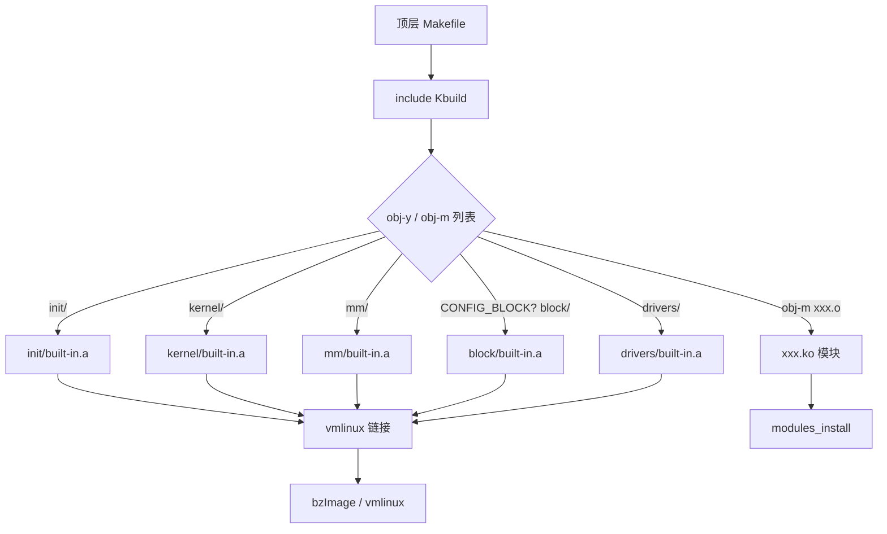
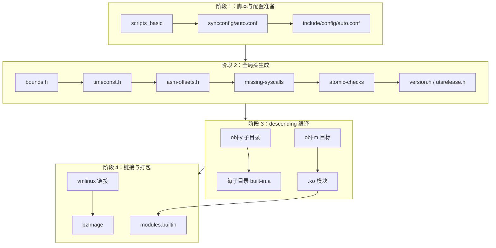

Copyright (c) 2025-2026 SPHARX Ltd. All Rights Reserved.

# AirymaxOS Kbuild 递归构建系统详解

> **文档定位**: AirymaxOS（agentrt-linux）构建系统第 1 卷——Kbuild 递归构建机制详解。本卷剖析顶层 `Kbuild` descending 机制、`obj-y`/`obj-m`/`obj-n` 三态门控、子系统 Makefile 编写规范、`if_changed` 增量构建原理、`filechk` 版本注入与 `Makefile.airymaxos` 供应商扩展，并给出 AirymaxOS 构建依赖图。
> **版本**: 0.1.1（占位）/ 1.0.1（开发）
> **最后更新**: 2026-07-06
> **同源映射**: agentrt `cmake/`（伞仓直属 5 模块）+ Linux 6.6 Kbuild 系统（`Kbuild`、`Makefile`、`scripts/Kbuild.include`、`scripts/Makefile.build`、`scripts/Makefile.lib`）
> **理论根基**: Linux 6.6 内核基线 + Airymax 五维正交 24 原则（S/K/C/E/A 五维）
> **核心约束**: IRON-9 v2 同源且部分代码共享——AirymaxOS 内核态构建沿用 Kbuild 思想但与上游保持独立演进节奏

---

## 0. 章节定位

本卷是 AirymaxOS 构建系统 8 卷文档中的第 1 卷，回答"内核态代码如何被编译成 vmlinux 与模块"这一问题。它在 README（模块主索引）与 02-kconfig-system.md（配置系统）之间形成构建执行层：

- **上游依赖**：README 定义构建系统的机制总览与设计原则；本卷定义"递归构建如何被驱动"——顶层 descending、三态门控、增量构建。
- **下游依赖**：02 定义"配置如何驱动构建门控"；03-makefile-patterns.md 定义"子系统 Makefile 的具体惯用法"；04-module-building.md 定义"可加载模块的构建链"。

本卷所有强制规则均赋予 **OS-KER** / **OS-BUILD** 编号，与 50-engineering-standards/07 维护者制度的"规则编号注册表"对齐。AirymaxOS 构建系统以 **Linux 6.6 内核基线** 为工程思想来源，融合 Airymax **五维正交 24 原则** 后重新表述为工程契约。

### 0.1 关键术语

| 术语 | 定义 |
|------|------|
| Kbuild | Linux 内核递归构建系统，顶层 `Kbuild` 文件定义 descending 顺序 |
| descending | 顶层 Makefile 递归进入子目录构建的机制 |
| obj-y / obj-m / obj-n | 三态门控：内建 / 模块 / 不构建 |
| if_changed | 仅当依赖或命令行变化时才重建目标的 Kbuild 宏 |
| filechk | 比较生成文件新旧内容、仅在变化时更新的 Kbuild 宏 |
| built-in.a | 子目录内建目标归档，由 `ar` 合并 `.o` 生成 |
| FORCE | 伪目标，强制规则每次求值（配合 if_changed 使用） |
| 五维正交 24 原则 | Airymax 架构设计原则体系（S/K/C/E/A 五维） |

---

## 1. Kbuild 递归构建总览

AirymaxOS 内核态构建继承 **Linux 6.6 内核基线** 沉淀的 Kbuild 工程思想：顶层 `Kbuild` 文件声明子系统编译入口顺序，`make` 据此递归 descending 到每个子目录，每个子目录通过自身的 `Kbuild`/`Makefile` 声明本目录的 `obj-y`/`obj-m`，最终把所有 `.o` 归并为 `built-in.a`，再链接为 `vmlinux`。

### 1.1 构建流水线全景



AirymaxOS 在此之上扩展了多语言、多仓的协调层（见 06-airymaxos-build.md），但内核态构建内核仍是 Kbuild 递归 descending。

- **OS-BUILD-001**：AirymaxOS 内核态构建必须以顶层 `Kbuild` 为 descending 入口，禁止在子系统 Makefile 中跨层引用顶层目标；违反者禁止合并（对齐 S-2 层次分解）。
- **OS-KER-001**：顶层 `Kbuild` 的 descending 顺序必须与 Linux 6.6 基线一致（init → usr → arch → kernel → certs → mm → fs → ... → virt），任何顺序调整必须经构建系统评审。

### 1.2 顶层 Kbuild 文件结构

Linux 6.6 顶层 `Kbuild` 文件分为两段：先做全局头文件准备与健全性检查（`bounds.h`、`timeconst.h`、`asm-offsets.h`、missing-syscalls、atomic-checks），再进入"普通目录 descending"段：

```makefile
# Kbuild（顶层）——普通目录 descending 段
obj-y            += init/
obj-y            += usr/
obj-y            += arch/$(SRCARCH)/
obj-y            += $(ARCH_CORE)
obj-y            += kernel/
obj-y            += certs/
obj-y            += mm/
obj-y            += fs/
obj-y            += ipc/
obj-y            += security/
obj-y            += crypto/
obj-$(CONFIG_BLOCK)    += block/
obj-$(CONFIG_IO_URING) += io_uring/
obj-$(CONFIG_RUST)     += rust/
obj-y            += drivers/
obj-y            += sound/
obj-$(CONFIG_SAMPLES)  += samples/
obj-$(CONFIG_NET)      += net/
obj-y            += virt/
```

`obj-y += init/` 表示 `init/` 目录无条件内建；`obj-$(CONFIG_BLOCK) += block/` 表示仅当 `CONFIG_BLOCK=y` 时才 descending 进入 `block/`。`$(SRCARCH)` 与 `$(ARCH_CORE)`/`$(ARCH_LIB)`/`$(ARCH_DRIVERS)` 来自架构层扩展，允许不同架构注入自身的核心/库/驱动目录。

- **OS-BUILD-002**：新增子目录必须在顶层 `Kbuild` 中声明 `obj-y`/`obj-$(CONFIG_*)`，未声明的目录不参与构建；目录命名使用小写连字符风格。
- **OS-KER-002**：`prepare` 阶段（bounds/asm-offsets/missing-syscalls/atomic-checks）必须在 descending 之前完成，子系统 Makefile 不得在 `prepare` 阶段之前依赖 `include/generated/` 下的产物。

---

## 2. obj-y / obj-m / obj-n 三态门控

Kbuild 的核心设计是"配置即构建"：每个目标只能是三态之一——内建（`y`）、模块（`m`）、不构建（`n`）。这一映射由 `scripts/Makefile.lib` 在读取子目录 `Kbuild`/`Makefile` 后规范化。

### 2.1 三态语义

| 状态 | 变量 | 产物 | 链接关系 |
|------|------|------|---------|
| 内建 | `obj-y += foo.o` | `foo.o` → `built-in.a` → `vmlinux` | 静态链接进内核镜像 |
| 模块 | `obj-m += foo.o` | `foo.ko` | 独立可加载模块 |
| 不构建 | `obj-n += foo.o`（或省略） | 无 | 不参与编译 |

`scripts/Makefile.lib` 对列表做规范化处理：先从 `obj-y` 中移除已在 `obj-y` 的 `obj-m`（避免重复），再把形如 `foo/` 的目录条目替换为 `foo/built-in.a`（内建）或 `foo/modules.order`（模块），最后给所有条目加上 `$(obj)/` 前缀：

```makefile
# scripts/Makefile.lib（节选）
obj-m := $(filter-out $(obj-y),$(obj-m))
subdir-ym := $(sort $(subdir-y) $(subdir-m) \
            $(patsubst %/,%, $(filter %/, $(obj-y) $(obj-m))))
# foo/ in obj-y  =>  foo/built-in.a
# foo/ in obj-m  =>  foo/modules.order
obj-m := $(patsubst %/,%/modules.order, $(filter %/, $(obj-y)) $(obj-m))
obj-y := $(patsubst %/, %/built-in.a, $(obj-y))
obj-y := $(filter-out %/, $(obj-y))
```

- **OS-KER-003**：子系统 `obj-*` 列表必须使用 `obj-$(CONFIG_*)` 形式引用配置，禁止硬编码 `obj-y`/`obj-m` 作为特性开关（架构无条件内建目录除外）。
- **OS-BUILD-003**：同一目标不得同时出现在 `obj-y` 与 `obj-m`；`scripts/Makefile.lib` 会静默移除重复项，但子系统作者应主动避免以保持清单可读（对齐 A-4 完美主义）。

### 2.2 多部分目标（multi-part objects）

当一个内核模块/内建由多个 `.c` 组合而成，使用 `<name>-objs` 或 `<name>-y` 列出组成部分：

```makefile
# drivers/airymax/Makefile
obj-$(CONFIG_AIRYMAX_IPC) += airymax-ipc.o
airymax-ipc-y := ipc_core.o ipc_dispatch.o ipc_ringbuf.o
airymax-ipc-$(CONFIG_AIRYMAX_IPC_DEBUG) += ipc_debug.o
```

`scripts/Makefile.lib` 的 `real-search` 把 `airymax-ipc-y` 展开为真实的 `ipc_core.o` 等目标，再由 `if_changed_rule` 的 `ld_multi_m` 规则链接为 `airymax-ipc.o`，最终打包为 `airymax-ipc.ko`（模块）或并入 `built-in.a`（内建）。

- **OS-BUILD-004**：多部分目标的 `-objs`/`-y` 后缀列表必须与目标名严格匹配；新增组成部分必须同时更新列表，遗漏会导致链接缺失符号。

---

## 3. 子系统 Makefile 编写规范

AirymaxOS 子系统 Makefile 遵循 Linux 6.6 内核基线的 `Kbuild`/`Makefile` 双文件约定：若目录同时存在 `Kbuild` 与 `Makefile`，`scripts/Kbuild.include` 的 `kbuild-file` 宏优先选 `Kbuild`。AirymaxOS 推荐新子系统统一使用 `Kbuild` 命名以避免歧义。

### 3.1 标准子系统 Makefile 骨架

```makefile
# SPDX-License-Identifier: GPL-2.0
# drivers/airymax/ipc/Kbuild
#
# AirymaxOS AgentsIPC 内核态通道构建规则

obj-$(CONFIG_AIRYMAX_IPC) += airymax-ipc.o

airymax-ipc-y := ipc_core.o \
                 ipc_dispatch.o \
                 ipc_ringbuf.o \
                 ipc.o

airymax-ipc-$(CONFIG_AIRYMAX_IPC_BENCH) += ipc_bench.o

ccflags-y += -I$(srctree)/drivers/airymax/include
subdir-ccflags-y += -DAIRYMAX_IPC_PBUF=128
```

要点：`obj-$(CONFIG_*)` 门控特性；`<name>-y` 列出组成部分；`ccflags-y` 仅作用于本目录，`subdir-ccflags-y` 传播到子目录；`-I` 用 `$(srctree)` 而非相对路径以兼容 out-of-tree 构建。

- **OS-KER-004**：子系统 Makefile 必须以 `SPDX-License-Identifier` 开头，缺失许可证标识的文件禁止合并（对齐 50-engineering-standards/01-coding-standards）。
- **OS-BUILD-005**：`ccflags-y`/`subdir-ccflags-y` 用于本目录及子目录的编译开关；跨子系统的全局开关必须在顶层 `Makefile` 或 `arch/$(SRCARCH)/Makefile` 中设置，禁止在叶子子系统扩散。

### 3.2 递归 descending 的驱动规则

`scripts/Makefile.build` 在读取子目录 `Kbuild` 后，把 `obj-y`/`obj-m` 中的 `foo/` 目录替换为 `foo/built-in.a`（或 `foo/modules.order`），并为这些归档目标建立依赖规则：

```makefile
# scripts/Makefile.build（descending 规则）
$(subdir-builtin): $(obj)/%/built-in.a: $(obj)/% ;
$(subdir-modorder): $(obj)/%/modules.order: $(obj)/% ;

# 子目录归档合并规则
quiet_cmd_ar_builtin = AR      $@
      cmd_ar_builtin = rm -f $@; \
        $(if $(real-prereqs), printf "$(obj)/%s " ...) $(AR) cDPrST $@
$(obj)/built-in.a: $(real-obj-y) FORCE
	$(call if_changed,ar_builtin)
```

`$(subdir-ym)` 被声明为 PHONY，`make` 通过 `$(Q)$(MAKE) $(build)=$@` 二次进入子目录，把构建上下文（`obj`、`need-builtin`、`need-modorder`）通过命令行变量传递下去。这就是"递归 make"——每个子目录是一个独立的 make 调用，但通过 `Kbuild.include` 共享宏定义。

- **OS-KER-005**：子系统 `built-in.a` 由 `ar cDPrST`（无符号表、确定顺序）生成，禁止使用带符号表的 `ar`；确定顺序是可重现构建（E-3 资源确定性）的前提。
- **OS-BUILD-006**：`need-builtin`/`need-modorder` 由父目录在 descending 时按需传递，子系统不得自行假设这两个变量的值，必须以传入值为准。

---

## 4. if_changed 增量构建原理

`if_changed` 是 Kbuild 增量构建的核心宏，AirymaxOS 沿用并要求所有生成物规则通过它保护。其设计哲学与 Airymax **五维正交 24 原则** 中的 A-4（完美主义：仅重建真正需要的）与 E-3（资源确定性：可重现）高度契合。

### 4.1 if_changed 的判定逻辑

`if_changed` 仅在三种情况重建目标：(1) 任一真实先决条件比目标新（`newer-prereqs`）；(2) 命令行本身变化（`cmd-check`，比较 `savedcmd_$@`）；(3) 缺失 `FORCE` 先决条件（`check-FORCE`，警告）。判定通过 `if-changed-cond` 聚合：

```makefile
# scripts/Kbuild.include（核心宏）
newer-prereqs = $(filter-out $(PHONY),$?)
check-FORCE = $(if $(filter FORCE, $^),,$(warning FORCE prerequisite is missing))
if-changed-cond = $(newer-prereqs)$(cmd-check)$(check-FORCE)

if_changed = $(if $(if-changed-cond),$(cmd_and_savecmd),@:)
cmd_and_savecmd = \
    $(cmd); \
    printf '%s\n' 'savedcmd_$@ := $(make-cmd)' > $(dot-target).cmd

if_changed_dep = $(if $(if-changed-cond),$(cmd_and_fixdep),@:)
cmd_and_fixdep = \
    $(cmd); \
    scripts/basic/fixdep $(depfile) $@ '$(make-cmd)' > $(dot-target).cmd; \
    rm -f $(depfile)
```

关键点：`FORCE` 是伪目标，每次都被视为"已更新"，从而让 `if_changed` 的判定逻辑接管（而非 Make 的时间戳判定）。`savedcmd_$@` 写入 `.<target>.cmd` 文件，下次构建时回读比较。`if_changed_dep` 额外调用 `fixdep` 把编译器生成的 `.d` 依赖中的 `CONFIG_*` 符号展开为对 `include/config/*.h` 的依赖，实现"配置变化触发重编"。

### 4.2 .cmd 文件与配置依赖

```mermaid
flowchart LR
    SRC[foo.c] -->|gcc -MMD| DEP[.foo.o.d]
    DEP -->|fixdep| CMD[.foo.o.cmd]
    CONF[auto.conf] --> CMD
    CMD -->|savedcmd 回读| JUDGE{if_changed 判定}
    FORCE[FORCE 伪目标] --> JUDGE
    JUDGE -->|需要重建| BUILD[gcc -c foo.c]
    JUDGE |>|无变化| SKIP[跳过]
```

`fixdep` 把 `#include <linux/foo.h>` 中的配置宏（如 `CONFIG_FOO`）翻译为对 `include/config/FOO`（空文件，由 syncconfig 创建作为时间戳标记）的依赖。这样当用户改了 `CONFIG_FOO`，对应的时间戳文件被 touch，所有引用它的 `.o` 都被标记为需要重编。

- **OS-KER-006**：所有生成物规则（`.o`/`.a`/`.ko`/版本头）必须使用 `if_changed`/`if_changed_dep`/`if_changed_rule` 之一，禁止裸命令；裸命令会绕过增量判定导致全量重建。
- **OS-BUILD-007**：禁止手动删除 `.<target>.cmd` 文件作为"强制重建"手段；正确做法是 `make clean` 或在规则中显式声明 `FORCE`。`.cmd` 文件是构建可重现性的证据链。
- **OS-BUILD-008**：调试 `if_changed` 误重建时使用 `make V=2` 查看原因（PHONY / target missing / newer prereqs / command line change / missing .cmd / not in targets）。

---

## 5. filechk 版本注入与 Makefile.airymaxos

版本号的注入是 Kbuild 中 `filechk` 宏的典型应用场景。AirymaxOS 把上游的供应商版本文件改写为 `Makefile.airymaxos`，定义自身的 LTS/主/次/发布四元版本，并通过 `filechk_version.h` 注入到 `include/generated/uapi/linux/version.h`。

### 5.1 filechk 宏机制

`filechk` 的作用是比较生成文件的新旧内容，仅在内容变化时才覆盖目标（避免无意义的时间戳更新触发下游全量重编）：

```makefile
# scripts/Kbuild.include（filechk 定义）
define filechk
	$(check-FORCE)
	$(Q)set -e; \
	mkdir -p $(dir $@); \
	trap "rm -f $(tmp-target)" EXIT; \
	{ $(filechk_$(1)); } > $(tmp-target); \
	if [ ! -r $@ ] || ! cmp -s $@ $(tmp-target); then \
		$(kecho) '  UPD     $@'; \
		mv -f $(tmp-target) $@; \
	fi
endef
```

工作流：先写到临时文件 `$(tmp-target)`，若目标不存在或内容不同（`cmp -s`）则 `mv` 覆盖，否则保持原文件与时间戳不变。这正是 E-3（资源确定性：最小变更面）的工程体现——版本号没变就不触发下游重编。

### 5.2 Makefile.airymaxos 供应商版本注入

AirymaxOS 用 `Makefile.airymaxos` 取代上游供应商版本文件，定义四元版本号：

```makefile
# SPDX-License-Identifier: GPL-2.0
# Makefile.airymaxos —— AirymaxOS 供应商版本定义
AIRYMAXOS_LTS = 0
AIRYMAXOS_MAJOR = 9999
AIRYMAXOS_MINOR = 0
AIRYMAXOS_RELEASE = ""
```

顶层 `Makefile` 通过 `include $(srctree)/Makefile.airymaxos` 引入，再在 `filechk_version.h` 中注入为 C 宏：

```makefile
# Makefile（节选）
include $(srctree)/Makefile.airymaxos

define filechk_version.h
	if [ $(SUBLEVEL) -gt 255 ]; then
		echo \#define LINUX_VERSION_CODE ...;
	else
		echo \#define LINUX_VERSION_CODE ...;
	fi;
	echo '#define KERNEL_VERSION(a,b,c) (((a) << 16) + ((b) << 8) + ((c) > 255 ? 255 : (c)))';
	echo \#define LINUX_VERSION_MAJOR $(VERSION);
	echo \#define LINUX_VERSION_PATCHLEVEL $(PATCHLEVEL);
	echo \#define LINUX_VERSION_SUBLEVEL $(SUBLEVEL);
	echo \#define AIRYMAXOS_LTS $(AIRYMAXOS_LTS);
	echo \#define AIRYMAXOS_MAJOR $(AIRYMAXOS_MAJOR);
	echo \#define AIRYMAXOS_MINOR $(AIRYMAXOS_MINOR);
	echo '#define AIRYMAXOS_VERSION(a,b) (((a) << 8) + (b))';
	echo \#define AIRYMAXOS_VERSION_CODE $(shell expr $(AIRYMAXOS_MAJOR) \* 256 + $(AIRYMAXOS_MINOR));
	echo \#define AIRYMAXOS_RELEASE \"$(AIRYMAXOS_RELEASE)\"
endef

$(version_h): PATCHLEVEL := $(or $(PATCHLEVEL), 0)
$(version_h): SUBLEVEL := $(or $(SUBLEVEL), 0)
$(version_h): FORCE
	$(call filechk,version.h)
```

**特性开关与版本号解耦**：`CONFIG_*` 控制特性是否编译，`AIRYMAXOS_*` 仅注入版本字符串；二者正交，符合 K-4（可插拔策略）与 A-1（极简主义：单一职责）。

- **OS-BUILD-009**：`Makefile.airymaxos` 的版本四元组（LTS/MAJOR/MINOR/RELEASE）变更必须经发布管理评审，且必须同步更新 `airymaxos-kernel` 子仓的发行说明；版本号变更触发 `version.h` 重生进而全量重编属预期行为。
- **OS-KER-007**：禁止在 `Makefile.airymaxos` 中放置除版本四元组以外的任何变量；特性开关必须走 `Kconfig`，禁止把特性塞进版本文件（对齐 S-1 单一职责）。
- **OS-BUILD-010**：`version.h` 的生成必须经 `filechk`，禁止用裸 `echo >` 覆盖；裸覆盖会破坏增量构建并导致每次 `make` 都全量重编。

---

## 6. 构建依赖图与阶段划分

AirymaxOS 把内核构建分为若干阶段，每个阶段有明确的先决与产物。理解阶段划分是编写正确子系统 Makefile 的前提。



`prepare` 阶段（P2）必须先于 descending（P3），因为子系统 `.c` 会 `#include <generated/bounds.h>` 等。`auto.conf`（P1 的 syncconfig 产物）被 `scripts/Makefile.build` 在每个子目录 `-include`，提供 `CONFIG_*` 宏的 make 侧值。

- **OS-KER-008**：`scripts_basic` 与 `syncconfig` 必须先于任何 descending；子系统 Makefile 不得在 `scripts_basic` 完成前被 include（否则 `fixdep` 等工具缺失会导致依赖链断裂）。
- **OS-BUILD-011**：`vmlinux` 链接前所有 `built-in.a` 必须就绪；若发现链接时缺符号，先检查对应子系统是否被 `obj-y` 正确声明，而非直接补 `.o`。
- **OS-BUILD-012**：CI 必须在 `allmodconfig`/`allnoconfig`/`defconfig` 三种配置下验证 descending 完整性，确保 `obj-$(CONFIG_*)` 门控在任意配置下都能闭合（对齐 OS-STD-032 CI 矩阵）。

---

## 7. 五维原则映射

本卷 Kbuild 递归构建机制与 Airymax **五维正交 24 原则** 的映射如下：

| 原则 | 在本卷的体现 |
|------|-------------|
| **S-1 单一职责** | `Makefile.airymaxos` 仅放版本四元组，特性开关走 Kconfig；`built-in.a` 仅做归并不链接 |
| **S-2 层次分解** | 顶层 `Kbuild` 定义 descending 顺序，子系统 Makefile 仅管本目录；递归 make 按目录层次组织 |
| **K-4 可插拔策略** | `obj-$(CONFIG_*)` 使特性可插拔；`obj-y`/`obj-m`/`obj-n` 三态门控实现策略与机制分离 |
| **E-3 资源确定性** | `filechk` 内容比较避免无谓时间戳更新；`ar cDPrST` 确定顺序；可重现构建基线 |
| **E-6 错误可追溯** | `.<target>.cmd` 记录命令行证据链；`make V=2` 给出重建原因 |
| **A-1 极简主义** | `if_changed` 仅重建真正需要的；`FORCE` + 判定宏避免裸命令全量重建 |
| **A-4 完美主义** | 增量构建精确到命令行参数变化；`cmd-check` 捕获编译选项漂移 |

AirymaxOS 构建系统以 **Linux 6.6 内核基线** 为工程思想来源，但每一项机制都经过 **五维正交 24 原则** 的映射校验，确保工程决策有原则可循而非照搬上游。

---

## 8. 同源 agentrt 映射

AirymaxOS 构建系统与 agentrt 构建系统遵循 **IRON-9 v2 同源且部分代码共享** 原则。agentrt 是 Airymax 智能体运行时（应用层），其 `cmake/` 目录提供 5 模块的跨模块共享 CMake 工具链；AirymaxOS 是智能体操作系统（OS 层），内核态使用 Kbuild。二者在分层与工具链上独立，在工程思想与原则上映射同源。

| 维度 | agentrt | AirymaxOS 内核态 | 关系 |
|------|---------|------------------|------|
| 构建系统 | CMake（用户态） | Kbuild（内核态） | 同源思想（递归/增量/配置门控），独立工具链 |
| 配置门控 | CMake `-D<option>=ON` | `obj-$(CONFIG_*)` | 语义同源（配置驱动构建），机制独立 |
| 增量构建 | CMake Ninja deps | `if_changed` + `.cmd` | 同源思想，独立实现 |
| 版本注入 | CMake `project(VERSION ...)` | `Makefile.airymaxos` + `filechk` | 同源语义，独立注入路径 |
| 多语言协调 | cargo/poetry/tsc 各自 CMake 集成 | Kbuild（C）+ 外部多语言协调层 | 同源多语言目标，独立集成层 |

**同源红利**：agentrt 在 AirymaxOS 上运行时，构建产物的版本号语义对齐（`AIRYMAXOS_*` 与 agentrt `project(VERSION)` 的 MAJOR/MINOR 同源），便于联调时定位版本漂移；增量构建思想一致，开发者心智模型可复用。

**独立性**：AirymaxOS 内核态构建为 OS 层 Kbuild，agentrt 用户态构建为应用层 CMake，二者通过产物契约（`.ko`/`vmlinux` 与可执行文件）解耦。当 agentrt 构建工具链演进时，AirymaxOS 通过构建评审决定是否同步，避免被动跟随。这一独立性正是 **IRON-9 v2 同源且部分代码共享** 在构建系统层的体现——同源思想，独立演进。

AirymaxOS 构建系统在 **Linux 6.6 内核基线** 上构建，其递归 descending、三态门控、`if_changed`、`filechk` 等机制均直接源自上游沉淀；AirymaxOS 的扩展（`Makefile.airymaxos`、多语言协调层、多仓集成）以 **五维正交 24 原则** 为设计准绳，确保扩展不破坏上游机制的可预测性。这种"上游思想 + 自身原则"的双层结构，是 **IRON-9 v2 同源且部分代码共享** 在工程实现层的落实。

---

## 9. OS-KER / OS-BUILD 规则编号汇总

本卷定义的规则编号汇总如下，与 07 卷"规则编号注册表"对齐：

| 编号 | 规则 | 强制级别 |
|------|------|---------|
| OS-KER-001 | 顶层 Kbuild descending 顺序与基线一致 | MUST |
| OS-KER-002 | prepare 阶段先于 descending | MUST |
| OS-KER-003 | obj-* 用 obj-$(CONFIG_*) 门控 | MUST |
| OS-KER-004 | 子系统 Makefile 含 SPDX 标识 | MUST |
| OS-KER-005 | built-in.a 用 ar cDPrST 确定顺序 | MUST |
| OS-KER-006 | 生成物规则用 if_changed 系列 | MUST |
| OS-KER-007 | Makefile.airymaxos 仅放版本四元组 | MUST |
| OS-KER-008 | scripts_basic/syncconfig 先于 descending | MUST |
| OS-BUILD-001 | 顶层 Kbuild 为 descending 唯一入口 | MUST |
| OS-BUILD-002 | 新增子目录在 Kbuild 声明 obj-* | MUST |
| OS-BUILD-003 | 目标不同时在 obj-y 与 obj-m | MUST |
| OS-BUILD-004 | 多部分目标 -y 列表与目标名匹配 | MUST |
| OS-BUILD-005 | 跨子系统开关在顶层/arch Makefile | MUST |
| OS-BUILD-006 | need-builtin/need-modorder 以传入值为准 | MUST |
| OS-BUILD-007 | 禁止手动删 .cmd 强制重建 | MUST |
| OS-BUILD-008 | 用 make V=2 调试误重建 | SHOULD |
| OS-BUILD-009 | Makefile.airymaxos 版本变更经评审 | MUST |
| OS-BUILD-010 | version.h 经 filechk 生成 | MUST |
| OS-BUILD-011 | 链接前 built-in.a 就绪 | MUST |
| OS-BUILD-012 | CI 三配置验证 descending 闭合 | MUST |

---

## 10. 相关文档

### 10.1 同卷文档

- `README.md`（构建系统模块主索引）
- `02-kconfig-system.md`（Kconfig 配置系统——CONFIG_* 宏的来源）
- `03-makefile-patterns.md`（Makefile 模式与惯用法）
- `04-module-building.md`（可加载模块构建链）
- `06-airymaxos-build.md`（AirymaxOS 多仓多语言构建）

### 10.2 上游与跨卷文档

- `50-engineering-standards/06-toolchain-and-automation.md`（CI/CD 与多矩阵构建，OS-STD-032/OS-STD-072）
- `50-engineering-standards/04-engineering-philosophy.md`（IRON-9 v2 同源且部分代码共享原则定义）
- `10-architecture/02-five-dimensional-principles.md`（五维正交 24 原则定义）
- `60-driver-model/README.md`（驱动子系统构建约定）

### 10.3 参考材料

- `/home/spharx/SpharxWorks/01Reference/kernel-OLK-6.6/Kbuild`（顶层 descending 入口）
- `/home/spharx/SpharxWorks/01Reference/kernel-OLK-6.6/Makefile`（顶层构建系统、版本注入段）
- `/home/spharx/SpharxWorks/01Reference/kernel-OLK-6.6/scripts/Kbuild.include`（if_changed / filechk / build 宏定义）
- `/home/spharx/SpharxWorks/01Reference/kernel-OLK-6.6/scripts/Makefile.build`（descending 与 built-in.a 规则）
- `/home/spharx/SpharxWorks/01Reference/kernel-OLK-6.6/scripts/Makefile.lib`（obj-y/m 规范化）

---

## 11. 文档版本与维护

- **当前版本**: v0.1.1（占位，2026-07-06）/ v1.0.1（开发中）
- **维护者**: AirymaxOS 构建系统 SIG（待成立，详见 07 卷维护者制度）
- **变更流程**: 本卷变更必须经过 RFC → 评审 → ACC 验收流程；Kbuild 机制层变更需同步评估对 8 子仓构建链的影响。
- **回顾周期**: 随 Linux 6.6 内核基线 LTS 更新季度回顾 + AirymaxOS 大版本年度回顾。
- **0.1.1 范围**: README + 01 + 02（3 文档）。
- **1.0.1 范围**: 完成全部 8 文档并实施构建系统工程标准。

---

> **文档结束** | AirymaxOS 构建系统第 1 卷 | Kbuild 递归构建详解 | 共 11 章节 + 规则编号汇总
