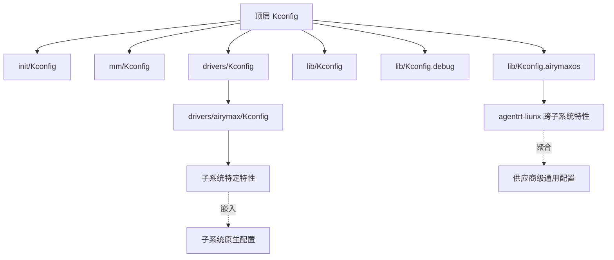

Copyright (c) 2025-2026 SPHARX Ltd. All Rights Reserved.

# agentrt-liunx（AirymaxOS）Kconfig 配置系统详解

> **文档定位**: agentrt-liunx（AirymaxOS）构建系统第 2 卷——Kconfig 配置系统详解。本卷剖析 Kconfig 语法（`config`/`menuconfig`/`choice`/`depends on`/`select`）、`CONFIG_*` 宏与 `obj-$(CONFIG_*)` 门控、Kconfig 子目录组织、`Kconfig.airymaxos` 供应商扩展、配置工具（`menuconfig`/`nconfig`/`gconfig`）与 `KCONFIG_ALLCONFIG` 全配置覆盖机制。
> **版本**: 0.1.1（文档体系完成）/ 1.0.1（开发）
> **最后更新**: 2026-07-06
> **同源映射**: agentrt `cmake/`（用户态选项缓存）+ Linux 6.6 Kconfig 系统（`Kconfig`、`lib/Kconfig`、`lib/Kconfig.debug`、`Kconfig.airymaxos`、`scripts/kconfig/`）
> **理论根基**: Linux 6.6 内核基线 Kconfig 工程 + Airymax 五维正交 24 原则（S/K/C/E/A 五维）
> **核心约束**: IRON-9 同源且部分代码共享（IRON-9 v2）——agentrt-liunx 配置门控沿用 Kconfig 语义但供应商扩展独立维护

---

## 0. 章节定位

本卷是 agentrt-liunx 构建系统 8 卷文档中的第 2 卷，回答"配置如何驱动构建"这一问题。它在 01-kbuild-system.md（递归构建）与 03-makefile-patterns.md（Makefile 惯用法）之间形成配置门控层：

- **上游依赖**：01 定义"构建如何被驱动"；本卷定义"构建目标的三态从何而来"——`CONFIG_*` 宏由 Kconfig 求解，再被 `obj-$(CONFIG_*)` 引用决定 `obj-y`/`obj-m`/`obj-n`。
- **下游依赖**：03 定义 Makefile 如何引用 `CONFIG_*`；04 定义模块构建如何被 `CONFIG_*=m` 驱动；06 定义 agentrt-liunx 多仓配置如何与内核 Kconfig 协调。

本卷所有强制规则均赋予 **OS-KER** / **OS-STD** / **OS-BUILD** 编号，与 50-engineering-standards/07 维护者制度的"规则编号注册表"对齐。agentrt-liunx 配置系统以 **Linux 6.6 内核基线** Kconfig 工程思想为来源，融合 Airymax **五维正交 24 原则** 后重新表述为工程契约。

### 0.1 关键术语

| 术语 | 定义 |
|------|------|
| Kconfig | 配置描述语言与解析器，求解 `CONFIG_*` 宏的三态值（y/m/n） |
| CONFIG_* | 由 Kconfig 求解并写入 `auto.conf`/`.config` 的配置宏 |
| config | Kconfig 语法：声明一个配置选项 |
| menuconfig | Kconfig 语法：声明一个可展开子菜单的配置选项 |
| choice | Kconfig 语法：互斥选项组（如调度策略二选一） |
| depends on | Kconfig 属性：声明选项的前置依赖 |
| select | Kconfig 属性：强制选中另一选项（反向依赖） |
| syncconfig | 把 `.config` 同步为 `auto.conf`/`autoconf.h` 的子命令（旧称 silentoldconfig） |
| KCONFIG_ALLCONFIG | 覆盖构建中"全部启用/禁用"基线的环境变量 |
| 五维正交 24 原则 | Airymax 架构设计原则体系（S/K/C/E/A 五维） |

---

## 1. Kconfig 配置系统总览

agentrt-liunx 配置系统继承 **Linux 6.6 内核基线** 的 Kconfig 工程：用一种声明式语言描述配置选项及其依赖，由配置工具（`menuconfig` 等）求解为 `CONFIG_*=y/m/n` 三态宏，写入 `.config` 与 `include/config/auto.conf`，再被 Kbuild 的 `obj-$(CONFIG_*)` 引用驱动构建。

### 1.1 配置求解流水线

```mermaid
flowchart LR
    A[Kconfig 源文件树] -->|解析| B[配置工具 menuconfig]
    C[.config 用户选择] --> B
    B -->|求解依赖闭包| D[.config 最终值]
    D -->|syncconfig| E[auto.conf]
    D -->|syncconfig| F[autoconf.h]
    D -->|syncconfig| G[include/config/*.h 时间戳]
    E -->|Make 引用| H[obj-$(CONFIG_*) 门控]
    F -->|C 源码引用| I[#ifdef CONFIG_XXX]
    G -->|fixdep 依赖| J[配置变化触发重编]
```

关键点：Kconfig 不仅求解宏值，还求解**依赖闭包**——当 `select` 强制选中某选项时，其依赖必须同时满足；当 `depends on` 不满足时选项不可见。`syncconfig` 把 `.config` 转化为 make 侧（`auto.conf`）、C 侧（`autoconf.h`）与依赖时间戳（`include/config/*.h`）三套产物，使配置变化能被 `if_changed_dep`/`fixdep` 捕获。

- **OS-STD-201**：agentrt-liunx 内核态配置必须以 Kconfig 为唯一描述手段，禁止用 `Makefile` 的 `ifeq`/环境变量绕过 Kconfig 做特性开关（对齐 K-4 可插拔策略）。
- **OS-BUILD-021**：所有 `CONFIG_*` 宏必须由 Kconfig 求解并写入 `auto.conf`，禁止在 `Makefile` 中手动 `CONFIG_XXX := y`；手动赋值会绕过依赖求解导致配置不一致。

---

## 2. Kconfig 语法

Kconfig 语法在 **Linux 6.6 内核基线** 的 `Documentation/kbuild/kconfig-language.rst` 中定义。本节给出 agentrt-liunx 子系统最常用的语法形态。

### 2.1 config：声明配置选项

```
# drivers/airymax/ipc/Kconfig
config AIRYMAX_IPC
	bool "agentrt-liunx AgentsIPC kernel channel"
	depends on IO_URING
	default y
	help
	  Enable the agentrt-liunx AgentsIPC 128B fixed-length message
	  channel built on io_uring. This is the OS-level transport
	  for agent runtime messages. Say Y unless you have a
	  specific reason to disable it.
```

字段含义：`config <NAME>` 声明选项（名字大写下划线）；`bool`/`tristate`/`int`/`hex`/`string` 声明类型；`prompt`（紧跟类型的字符串）是菜单显示文本；`depends on` 声明前置依赖；`default` 声明默认值；`help` 是帮助文本（即文档，对齐 E-7 文档即代码）。

- **OS-STD-143**（沿用 50 卷）：新增 `CONFIG_*` 选项默认 `off`（`default n` 或省略），仅安全核心可 `default y`；默认开启需经安全评审。
- **OS-STD-144**（沿用 50 卷）：新增 `CONFIG_*` 选项必须有 `help` 文本，说明用途、依赖与风险。
- **OS-KER-021**：`config` 名字必须以 `AIRYMAX_` 或所属子系统前缀开头（如 `AIRYMAX_IPC_`），禁止与上游 `CONFIG_*` 名字冲突（对齐 IRON-9 独立性）。

### 2.2 menuconfig：可展开子菜单

```
menuconfig AIRYMAX_IPC_ADVANCED
	bool "agentrt-liunx IPC advanced options"
	depends on AIRYMAX_IPC
	help
	  Advanced tuning for the agentrt-liunx AgentsIPC channel.

if AIRYMAX_IPC_ADVANCED

config AIRYMAX_IPC_BENCH
	bool "IPC benchmarking hooks"
	help
	  Insert benchmarking counters into the IPC hot path.

config AIRYMAX_IPC_RINGBUF_ORDER
	int "Ring buffer page order"
	range 0 8
	default 2
	help
	  Page order of the per-CPU ring buffer.

endif # AIRYMAX_IPC_ADVANCED
```

`menuconfig` 与 `config` 的区别在于前者在菜单界面可折叠展开子选项；`if <EXPR> ... endif` 包裹的选项仅在表达式为真时可见。`range` 约束 `int`/`hex` 的取值范围。

- **OS-STD-145**（沿用 50 卷）：相关选项必须用 `menuconfig` + `if` 分组，禁止散落在顶层菜单；分组提升可读性（A-2 细节关注）。

### 2.3 choice：互斥选项组

```
choice
	prompt "agentrt-liunx agent scheduler policy"
	default AIRYMAX_SCHED_AGENT
	depends on SCHED_CLASS_EXT

config AIRYMAX_SCHED_AGENT
	bool "SCHED_AGENT (sched_ext + eBPF)"
	help
	  Use the sched_ext extensible scheduler with eBPF policy
	  programs for agent task scheduling.

config AIRYMAX_SCHED_FIFO
	bool "SCHED_FIFO legacy"
	help
	  Use legacy SCHED_FIFO for agent scheduling. Only for
	  debugging fallback.

endchoice
```

`choice` 内的选项互斥，只有一个可为 `y`；`default` 指定默认选中项。agentrt-liunx 用 `choice` 表达"二选一/多选一"的调度策略、内存模型等决策。

- **OS-KER-022**：互斥决策（如调度策略、IPC 传输后端）必须用 `choice`，禁止用多个独立 `bool` 模拟互斥；`choice` 在求解时自动保证唯一性（对齐 S-1 单一职责）。

### 2.4 depends on 与 select

`depends on` 是正向依赖：选项可见/可选的前提；`select` 是反向依赖：选中本项则强制选中目标项（即使目标的 `depends on` 未满足也会被强制，需谨慎）。

```
config AIRYMAX_IPC
	tristate
	depends on IO_URING
	select CRC32
	help
	  The IPC channel requires io_uring and CRC32 for header
	  integrity.

config AIRYMAX_IPC_ZERO_COPY
	bool
	depends on AIRYMAX_IPC
	select IO_URING_TASK_WORK
	help
	  Zero-copy fast path requires io_uring task work.
```

`select` 的风险：若被 `select` 的目标有 `depends on` 未满足，会产生"不满足依赖但被强制选中"的不一致配置，Kconfig 会警告（`select` 被视为强约束）。

- **OS-STD-146**（沿用 50 卷）：`select` 仅用于"本选项在功能上隐含另一选项"的强约束场景（如选 IPC 必选 CRC32）；弱关联用 `depends on`；滥用 `select` 制造配置悖论禁止合并。
- **OS-KER-023**：`select` 的目标若有 `depends on`，本选项必须同时 `select` 其全部依赖，或在 `depends on` 中显式声明，避免配置不一致（对齐 A-4 完美主义）。

### 2.5 类型与默认值

| 类型 | 取值 | 典型用途 |
|------|------|---------|
| `bool` | y/n | 二态开关（最常见） |
| `tristate` | y/m/n | 三态（内建/模块/关闭） |
| `int` | 整数 | 数值参数（缓冲区大小、超时） |
| `hex` | 十六进制 | 地址、掩码 |
| `string` | 字符串 | 路径、名称 |

`tristate` 是 Kconfig 区别于普通配置系统的关键：它允许同一选项在 `y`（内建进 vmlinux）与 `m`（可加载模块）间切换，直接映射到 Kbuild 的 `obj-y`/`obj-m`。

- **OS-KER-024**：可能作为可加载模块的子系统必须用 `tristate` 而非 `bool`；用 `bool` 会丧失模块化能力（对齐 K-4 可插拔策略）。

---

## 3. CONFIG_* 宏与 obj-$(CONFIG_*) 门控

Kconfig 求解的 `CONFIG_*` 宏有两套消费者：Make 侧（`obj-$(CONFIG_*)`）与 C 侧（`#ifdef CONFIG_*`）。

### 3.1 Make 侧门控

`obj-$(CONFIG_*)` 是 Kbuild 的配置门控惯用法。当 `CONFIG_FOO=y` 时展开为 `obj-y += foo.o`（内建）；`CONFIG_FOO=m` 时展开为 `obj-m += foo.o`（模块）；`CONFIG_FOO=n`（或未定义）时展开为 `obj- += foo.o`，被 Make 视为空（不构建）：

```makefile
# drivers/airymax/Makefile
obj-$(CONFIG_AIRYMAX_IPC)        += airymax-ipc.o
obj-$(CONFIG_AIRYMAX_CUPOLAS)    += cupolas/
obj-$(CONFIG_AIRYMAX_MEMPOOL)    += airymax-mempool.o
airymax-mempool-y := mempool_core.o mempool_region.o
```

`auto.conf`（由 syncconfig 生成）被 `scripts/Makefile.build` 在每个子目录 `-include`，提供 `CONFIG_*` 的 make 侧值。这就是"配置即构建"的闭合回路：Kconfig 求解 → `auto.conf` → `obj-$(CONFIG_*)` → 三态门控。

- **OS-BUILD-022**：子系统 `obj-*` 必须用 `obj-$(CONFIG_*)` 引用，`CONFIG_*` 名字与 Kconfig 中 `config` 名字严格一致；拼写错误会导致选项永远不构建且无警告。
- **OS-KER-025**：`obj-$(CONFIG_*)` 的 `CONFIG_*` 必须在 Kconfig 中有 `config` 声明；引用未声明宏视为配置缺失，CI 必须报错。

### 3.2 C 侧门控

```c
/* drivers/airymax/ipc/ipc.c */
#include <linux/config.h>  /* 实际由 autoconf.h 提供 */

#ifdef CONFIG_AIRYMAX_IPC_BENCH
static atomic_t ipc_rx_counter;
#endif

#if CONFIG_AIRYMAX_IPC_RINGBUF_ORDER > 4
/* large ring buffer path */
#endif
```

`autoconf.h`（由 syncconfig 生成）把每个 `CONFIG_*=y` 定义为 `#define CONFIG_XXX 1`，`CONFIG_*=m` 同样定义为 `1`（C 侧不区分 y/m，只关心是否启用），`CONFIG_*=n` 不定义。`int`/`hex` 类型则定义为字面值。

- **OS-STD-147**（沿用 50 卷）：C 源码引用 `CONFIG_*` 必须经 `#ifdef`/`#if`，禁止直接 `#include <generated/autoconf.h>` 后裸用宏值；`config.h` 已统一包装。

---

## 4. Kconfig 子目录组织

Linux 6.6 用顶层 `Kconfig` 文件 `source` 各子系统的 `Kconfig`，形成一棵 Kconfig 源文件树：

```
# Kconfig（顶层）
mainmenu "Linux/$(ARCH) $(KERNELVERSION) Kernel Configuration"
source "scripts/Kconfig.include"
source "init/Kconfig"
source "kernel/Kconfig.freezer"
source "fs/Kconfig.binfmt"
source "mm/Kconfig"
source "net/Kconfig"
source "drivers/Kconfig"
source "fs/Kconfig"
source "security/Kconfig"
source "crypto/Kconfig"
source "lib/Kconfig"
source "lib/Kconfig.debug"
source "lib/Kconfig.airymaxos"
source "Documentation/Kconfig"
```

每个子系统目录有自己的 `Kconfig`，被父目录的 `Kconfig` 用 `source "path/Kconfig"` 引入。`drivers/Kconfig` 再 `source` 各 `drivers/*/Kconfig`，形成递归结构。

- **OS-KER-026**：agentrt-liunx 新增子系统的 `Kconfig` 必须被父目录 `Kconfig` `source` 引入，未 `source` 的 `Kconfig` 不参与求解（对齐 S-2 层次分解）。
- **OS-BUILD-023**：`source` 路径使用相对源码树根的相对路径（如 `"drivers/airymax/Kconfig"`），禁止绝对路径，以保证 out-of-tree 构建正确。

---

## 5. Kconfig.airymaxos 供应商扩展

agentrt-liunx 用 `lib/Kconfig.airymaxos` 取代上游供应商配置聚合文件，作为 agentrt-liunx 自身特性的通用配置聚合点。子系统特定配置仍嵌入各原生 `Kconfig`（如 `drivers/airymax/Kconfig`），`Kconfig.airymaxos` 仅聚合跨子系统的供应商级特性。

### 5.1 Kconfig.airymaxos 结构

```
# SPDX-License-Identifier: GPL-2.0
# lib/Kconfig.airymaxos —— agentrt-liunx 供应商配置聚合

menu "agentrt-liunx vendor extensions"

config AIRYMAXOS_LTS
	int
	default 0
	help
	  agentrt-liunx LTS track number. Used by the build to tag
	  release artifacts.

config AIRYMAXOS_KWORKER_NUMA_AFFINITY
	bool "kworker NUMA affinity"
	default n
	depends on NUMA
	help
	  This feature implements adaptive mechanisms so that the
	  workqueue can automatically identify the CPU of the soft
	  interrupt and schedule the workqueue to the corresponding
	  NUMA node.

config AIRYMAXOS_GMEM
	bool "agentrt-liunx group memory (GMEM)"
	depends on MMU
	select SHMEM
	help
	  Enable group memory accounting for agent workloads.

endmenu # agentrt-liunx vendor extensions
```

### 5.2 与原生 Kconfig 的边界



**边界原则**：`Kconfig.airymaxos` 只放跨子系统的供应商级特性（如 `AIRYMAXOS_LTS`、通用 NUMA 亲和、GMEM 等会影响多子系统的开关）；子系统特定特性（如 IPC 环形缓冲大小、Cupolas 策略细节）放在子系统的 `Kconfig`。这符合 S-1（单一职责）与 S-2（层次分解）。

- **OS-KER-027**：`lib/Kconfig.airymaxos` 仅承载 agentrt-liunx 跨子系统的供应商级特性；子系统特定配置嵌入该子系统的 `Kconfig`，禁止把子系统细节塞入聚合文件。
- **OS-BUILD-024**：`Kconfig.airymaxos` 的 `config` 名字必须以 `AIRYMAXOS_` 前缀开头，与子系统前缀（如 `AIRYMAX_IPC_`）区分，便于在 `.config` 中快速定位归属。
- **OS-STD-148**（沿用 50 卷）：`Kconfig.airymaxos` 中的 `DEBUG` 类选项必须同时声明对应的测试钩子，确保调试开关与测试同步（对齐 OS-STD-148）。

---

## 6. 配置工具 menuconfig / nconfig / gconfig

Kconfig 提供多种配置工具，agentrt-liunx 沿用 **Linux 6.6 内核基线** 的工具集：

| 工具 | 界面 | 依赖 | 适用场景 |
|------|------|------|---------|
| `menuconfig` | ncurses 终端 | libncurses | 最常用，SSH/无图形环境 |
| `nconfig` | ncurses 终端（现代） | libncurses | menuconfig 的现代替代 |
| `gconfig` | GTK 图形 | libglade/libgtk | 桌面图形环境 |
| `xconfig` | Qt 图形 | libqt | 桌面图形环境 |
| `oldconfig` | 命令行交互 | 无 | 增量更新 `.config` |
| `defconfig` | 无（读默认） | 无 | 从 arch defconfig 生成 |
| `allmodconfig` | 无 | 无 | 全部设为 `m`（最大覆盖） |
| `allnoconfig` | 无 | 无 | 全部设为 `n`（最小内核） |

```bash
make menuconfig       # 交互式终端菜单
make nconfig          # 现代 ncurses 菜单
make gconfig          # GTK 图形界面
make olddefconfig     # 静默应用默认值，解决新增选项
make defconfig        # 生成架构默认配置
make allmodconfig     # 全模块配置（CI 用）
make allnoconfig      # 全关闭配置（CI 用）
```

- **OS-BUILD-025**：开发者修改 `Kconfig` 后必须本地运行 `make olddefconfig` 验证新增选项能被正确求解，禁止直接提交未求解的 `.config` 片段。
- **OS-STD-132**（沿用 50 卷）：CI 矩阵必须覆盖 `allmodconfig`/`allnoconfig`/`defconfig` 三种配置，确保 Kconfig 在极端配置下也能闭合求解（对齐 OS-STD-032 CI 矩阵）。
- **OS-KER-028**：新增 `choice` 或 `menuconfig` 后必须用 `menuconfig`/`nconfig` 实际打开验证菜单结构正确，禁止仅靠 `make olddefconfig` 推断结构（对齐 A-2 细节关注）。

---

## 7. KCONFIG_ALLCONFIG 全配置覆盖

`KCONFIG_ALLCONFIG` 是 Kconfig 的"全配置基线"机制：当运行 `allmodconfig`/`allnoconfig`/`defconfig` 时，Kconfig 先读取 `KCONFIG_ALLCONFIG` 指定的文件作为基线，再应用"全部设为 m/n"策略。这让 CI 能在固定一组"必须启用"的选项之上做最大覆盖测试。

```bash
# 使用 agentrt-liunx 全配置基线
make allmodconfig KCONFIG_ALLCONFIG=airymaxos-base.config
make allnoconfig KCONFIG_ALLCONFIG=airymaxos-base.config
```

`airymaxos-base.config` 是一个 `.config` 片段，列出 agentrt-liunx 必须启用的选项（如 `CONFIG_AIRYMAX_IPC=y`、`CONFIG_IO_URING=y`）。这样 `allnoconfig` 也会保留这些必选项，避免"最小内核"把 agentrt-liunx 核心特性关掉。

- **OS-BUILD-026**：agentrt-liunx 必须维护 `airymaxos-base.config` 全配置基线文件，列出 OS 核心必须启用的 `CONFIG_*`；CI 的 `allmodconfig`/`allnoconfig` 必须带 `KCONFIG_ALLCONFIG` 引用此文件。
- **OS-KER-029**：`airymaxos-base.config` 的变更必须经构建系统评审，新增/移除项需说明理由；该文件是"agentrt-liunx 最小可用配置"的契约（对齐 S-2 层次分解与 K-4 可插拔策略）。
- **OS-BUILD-027**：CI 必须验证 `make allmodconfig KCONFIG_ALLCONFIG=airymaxos-base.config` 与 `make allnoconfig KCONFIG_ALLCONFIG=airymaxos-base.config` 都能成功求解（无 unsatisfied dependence 警告）。

### 7.1 defconfig 与 allconfig 的关系

`arch/$(SRCARCH)/configs/airymaxos_defconfig` 是架构默认配置，`make defconfig` 读取它生成 `.config`。`KCONFIG_ALLCONFIG` 与 `defconfig` 的区别：`defconfig` 是"用户起点配置"，`KCONFIG_ALLCONFIG` 是"全配置策略的保底基线"。二者配合：CI 用 `KCONFIG_ALLCONFIG` 保证极端配置下核心特性不丢，开发者用 `defconfig` 作为日常起点。

- **OS-BUILD-028**：每个支持架构（x86_64/aarch64/riscv64）必须有 `airymaxos_defconfig`；`defconfig` 与 `airymaxos-base.config` 必须一致——`defconfig` 中 `=y` 的项必须出现在 `airymaxos-base.config`，反之亦然。

---

## 8. 五维原则映射

本卷 Kconfig 配置系统与 Airymax **五维正交 24 原则** 的映射如下：

| 原则 | 在本卷的体现 |
|------|-------------|
| **S-1 单一职责** | `Kconfig.airymaxos` 仅聚合跨子系统特性；子系统细节嵌入子系统 `Kconfig`；配置与构建职责分离 |
| **S-2 层次分解** | 顶层 `Kconfig` `source` 子系统 `Kconfig`，按目录层次组织；`menuconfig`/`if` 分组相关选项 |
| **K-2 契约一致** | `CONFIG_*` 是配置与构建的契约；`obj-$(CONFIG_*)` 与 C 侧 `#ifdef` 双消费者共享同一宏定义 |
| **K-4 可插拔策略** | `tristate`/`bool` 使特性可插拔；`obj-y`/`obj-m`/`obj-n` 三态门控实现策略与机制分离 |
| **E-7 文档即代码** | Kconfig `help` 文本即文档；`menuconfig` 菜单结构即配置文档；`make help` 列出可用目标 |
| **A-1 极简主义** | `select` 仅用于强约束；弱关联用 `depends on`；`choice` 保证互斥唯一性 |
| **A-2 细节关注** | `config` 名字前缀规范；`obj-$(CONFIG_*)` 拼写必须严格一致；`defconfig` 与 `base.config` 一致性 |

agentrt-liunx 配置系统以 **Linux 6.6 内核基线** Kconfig 工程为来源，但每一项机制都经过 **五维正交 24 原则** 的映射校验。例如 `tristate` 三态门控同时映射 K-4（可插拔策略）与 S-1（单一职责：一个选项一种状态），`select` 的强约束同时映射 A-1（极简主义：避免配置悖论）与 A-4（完美主义：依赖闭包完备）。这种正交映射确保配置决策有原则可循。

---

## 9. 同源 agentrt 映射

agentrt-liunx 配置系统与 agentrt 配置系统遵循 **IRON-9 同源且部分代码共享（IRON-9 v2）** 原则。agentrt 是 Airymax 智能体运行时（应用层），其配置通过 CMake 缓存（`CMakeCache.txt`）与 `-D<option>=ON/OFF` 选项描述；agentrt-liunx 是智能体操作系统（OS 层），内核态配置通过 Kconfig 描述。二者在配置语义上同源（配置驱动构建），在描述手段上独立（Kconfig vs CMake）。

| 维度 | agentrt | agentrt-liunx 内核态 | 关系 |
|------|---------|------------------|------|
| 配置语言 | CMake `-D` 选项 | Kconfig `config` 语法 | 同源语义（配置开关），独立语言 |
| 三态模型 | ON/OFF（二态） | y/m/n（三态：内建/模块/关闭） | agentrt-liunx 扩展（模块化能力） |
| 依赖求解 | CMake `find_dependency` | Kconfig `depends on`/`select` | 同源思想（依赖闭包），独立机制 |
| 配置基线 | CMake preset 文件 | `airymaxos-base.config` + `defconfig` | 同源语义（保底基线），独立格式 |
| 配置工具 | `ccmake`（终端）/`cmake-gui` | `menuconfig`/`nconfig`/`gconfig` | 同源交互形态，独立实现 |
| 供应商扩展 | CMake `option()` 聚合 | `lib/Kconfig.airymaxos` 聚合 | 同源聚合点，独立文件 |

**同源红利**：agentrt 在 agentrt-liunx 上运行时，配置语义对齐——agentrt 的 `AIRYMAX_*` 选项与 agentrt-liunx 的 `CONFIG_AIRYMAX_*` 在概念上一一对应，便于联调时确认特性开关状态；`ccmake` 与 `menuconfig` 的交互形态相似，开发者心智模型可复用。

**独立性**：agentrt-liunx 内核态配置为 OS 层 Kconfig（求解 `CONFIG_*` 三态宏），agentrt 用户态配置为应用层 CMake（求解 CMake 变量），二者通过产物契约解耦。当 agentrt 配置工具演进时，agentrt-liunx 通过配置评审决定是否同步，避免被动跟随。这种"同源思想 + 独立实现"的双层结构，正是 **IRON-9 同源且部分代码共享（IRON-9 v2）** 在配置系统层的落实——同源语义，独立工具链。

agentrt-liunx 配置系统在 **Linux 6.6 内核基线** 上构建，其 `config`/`menuconfig`/`choice`/`depends on`/`select` 语法、`obj-$(CONFIG_*)` 门控、`syncconfig` 产物链均直接源自上游沉淀；agentrt-liunx 的扩展（`lib/Kconfig.airymaxos`、`airymaxos-base.config`、`AIRYMAXOS_`/`AIRYMAX_` 命名前缀）以 **五维正交 24 原则** 为设计准绳，确保扩展不破坏上游 Kconfig 的依赖求解可预测性。这一双层结构与构建系统卷（01）的"上游 Kbuild 思想 + agentrt-liunx 供应商扩展"形成对称，共同构成 agentrt-liunx 内核态构建的配置与执行双轮。

---

## 10. OS-KER / OS-STD / OS-BUILD 规则编号汇总

本卷定义的规则编号汇总如下，与 07 卷"规则编号注册表"对齐：

| 编号 | 规则 | 强制级别 |
|------|------|---------|
| OS-KER-021 | config 名字用 AIRYMAX_/子系统前缀 | MUST |
| OS-KER-022 | 互斥决策用 choice | MUST |
| OS-KER-023 | select 目标的依赖须同时满足 | MUST |
| OS-KER-024 | 可模块化子系统用 tristate | MUST |
| OS-KER-025 | obj-$(CONFIG_*) 的宏须有 config 声明 | MUST |
| OS-KER-026 | 新增 Kconfig 须被父 Kconfig source | MUST |
| OS-KER-027 | Kconfig.airymaxos 仅聚合跨子系统特性 | MUST |
| OS-KER-028 | 新 choice/menuconfig 须用工具实际验证 | MUST |
| OS-KER-029 | airymaxos-base.config 变更经评审 | MUST |
| OS-STD-201 | 内核态配置以 Kconfig 为唯一手段 | MUST |
| OS-STD-143 | 新 CONFIG 选项默认 off（沿用） | MUST |
| OS-STD-144 | 新 CONFIG 选项有 help 文本（沿用） | MUST |
| OS-STD-145 | 相关选项 menuconfig+if 分组（沿用） | MUST |
| OS-STD-146 | select 仅用于强约束（沿用） | MUST |
| OS-STD-147 | C 侧经 #ifdef 引用 CONFIG（沿用） | MUST |
| OS-STD-148 | DEBUG 选项同时声明测试（沿用） | MUST |
| OS-BUILD-021 | CONFIG_* 须由 Kconfig 求解入 auto.conf | MUST |
| OS-BUILD-022 | obj-$(CONFIG_*) 名字严格一致 | MUST |
| OS-BUILD-023 | source 用相对源码树路径 | MUST |
| OS-BUILD-024 | Kconfig.airymaxos 用 AIRYMAXOS_ 前缀 | MUST |
| OS-BUILD-025 | 改 Kconfig 后本地 olddefconfig 验证 | MUST |
| OS-BUILD-026 | 维护 airymaxos-base.config 基线 | MUST |
| OS-BUILD-027 | CI 验证 allmod/allno+ALLCONFIG 求解 | MUST |
| OS-BUILD-028 | 每架构有 defconfig 且与 base.config 一致 | MUST |

---

## 11. 相关文档

### 11.1 同卷文档

- `README.md`（构建系统模块主索引）
- `01-kbuild-system.md`（Kbuild 递归构建——obj-$(CONFIG_*) 的消费者）
- `03-makefile-patterns.md`（Makefile 引用 CONFIG_* 的惯用法）
- `04-module-building.md`（CONFIG_*=m 驱动的模块构建）
- `06-airymaxos-build.md`（agentrt-liunx 多仓配置协调）

### 11.2 上游与跨卷文档

- `50-engineering-standards/06-toolchain-and-automation.md`（OS-STD-032 CI 矩阵、OS-STD-143/144/145/146/147/148 Kconfig 规则来源）
- `50-engineering-standards/04-engineering-philosophy.md`（IRON-9 同源且部分代码共享（IRON-9 v2）原则定义）
- `10-architecture/02-five-dimensional-principles.md`（五维正交 24 原则定义）
- `20-modules/01-kernel.md`（airymaxos-kernel 子仓配置）

### 11.3 参考材料

- `Linux 6.6 内核源码 Kconfig`（顶层 Kconfig 源文件树）
- `Linux 6.6 内核源码 init/Kconfig`（config/menuconfig/choice 语法范例）
- `Linux 6.6 内核源码 lib/Kconfig`（lib 聚合 Kconfig）
- `Linux 6.6 内核源码 lib/Kconfig.debug`（调试选项聚合范例）
- `Linux 6.6 内核源码 scripts/kconfig/`（Kconfig 解析器源码）

---

## 12. 文档版本与维护

- **当前版本**: v0.1.1（文档体系完成）/ v1.0.1（开发中）
- **维护者**: agentrt-liunx 构建系统 SIG（待成立，详见 07 卷维护者制度）
- **变更流程**: 本卷变更必须经过 RFC → 评审 → ACC 验收流程；Kconfig 语法层变更需同步评估对 `airymaxos-base.config` 与各架构 `defconfig` 的影响。
- **回顾周期**: 随 Linux 6.6 内核基线 LTS 更新季度回顾 + agentrt-liunx 大版本年度回顾。
- **0.1.1 范围**: README + 01 + 02（3 文档）。
- **1.0.1 范围**: 完成全部 8 文档并实施构建系统工程标准。

---

> **文档结束** | agentrt-liunx 构建系统第 2 卷 | Kconfig 配置系统详解 | 共 12 章节 + 规则编号汇总
