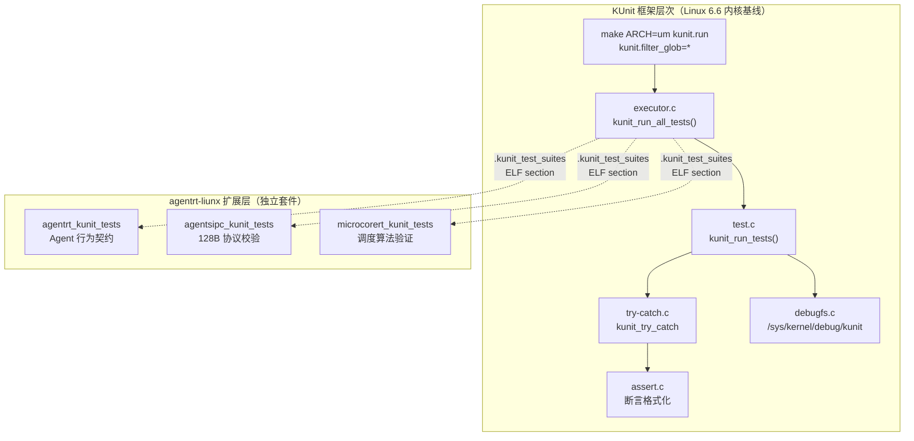
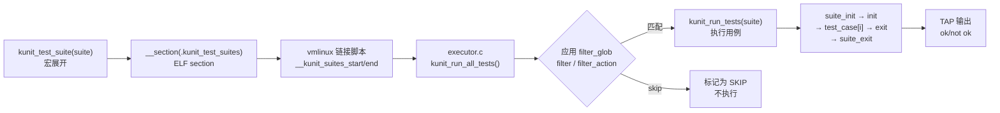

Copyright (c) 2025-2026 SPHARX Ltd. All Rights Reserved.

# agentrt-liunx（AirymaxOS）KUnit 单元测试框架详解

> **文档定位**: agentrt-liunx（AirymaxOS）测试工程体系第 1 卷——KUnit 白盒单元测试框架详解。本卷规定 KUnit 架构、`kunit_suite`/`kunit_case` 结构、`KUNIT_EXPECT_*`/`KUNIT_ASSERT_*` 宏、参数化测试、套件注册、KUnit 运行器、Kconfig 集成（`CONFIG_KUNIT`）、TAP 输出格式与 in-tree 测试组织。
> **版本**: 0.1.1（文档体系完成）/ 1.0.1（开发）
> **最后更新**: 2026-07-06
> **同源映射**: agentrt 7 层验证 L1（白盒单元测试）+ Linux 6.6 内核基线 `lib/kunit/`、`include/kunit/test.h`
> **理论根基**: Linux 6.6 内核基线测试思想 + Airymax 五维正交 24 原则（E-8 可测试性 / A-4 完美主义）
> **核心约束**: IRON-9 v2 同源且部分代码共享——KUnit 框架与 Linux 6.6 上游保持源码同源，agentrt-liunx 扩展必须以独立套件形式注入，禁止改写上游 KUnit 核心代码。

---

## 0. 章节定位

本卷是 agentrt-liunx 测试工程 10 主题文档中的第 1 卷，回答"内核白盒单元测试怎么写"。它在 README（测试体系主索引）与 02-kselftest（系统级测试）之间形成单元测试执行层：

- **上游依赖**：README 定义 L1 白盒单元测试由本卷展开；50-engineering-standards/06-toolchain-and-automation 定义 7 层验证，本卷属第 7 层（单元测试层）。
- **下游依赖**：02-kselftest 定义"系统级测试怎么跑"；03-kernel-selftests 定义"内核自检怎么启用"——本卷定义"模块内 KUnit 怎么注册"。

本卷所有强制规则均赋予 **OS-TEST** / **OS-KER** / **OS-STD** 编号，与 07 维护者制度的"规则编号注册表"对齐。

### 0.1 关键术语

| 术语 | 定义 |
|------|------|
| KUnit | Linux 内核官方白盒单元测试框架，毫秒级运行，无需真实硬件 |
| `kunit_suite` | KUnit 测试套件结构体，含 `init`/`exit`/`test_cases` |
| `kunit_case` | KUnit 测试用例结构体，封装测试函数与参数生成器 |
| TAP | Test Anything Protocol，KUnit 默认输出格式 |
| `CONFIG_KUNIT` | KUnit 框架 Kconfig 开关，tristate（y/m/n） |
| UML | User-Mode Linux，KUnit 在开发者工作站上的首选运行载体 |
| `.kunit_test_suites` | ELF section，存放所有注册的 `kunit_suite *` 指针 |

---

## 1. KUnit 框架总览

KUnit 是 Linux 6.6 内核基线中的官方单元测试框架，由 Brendan Higgins（Google）于 2019 年合入主线。其设计目标有三：白盒可测（直接调内核内部函数）、毫秒级反馈（UML 编译即跑）、TAP 输出（CI 可解析）。

agentrt-liunx 完整继承 Linux 6.6 内核基线的 KUnit 框架（`lib/kunit/`、`include/kunit/`），不修改任何上游源文件。agentrt-liunx 专属测试以独立 `*_airymax_test.c` 文件形式驻留于 `airymaxos/` 子仓内，遵循 IRON-9 v2 同源且部分代码共享原则。



### 1.1 运行载体

| 载体 | 命令 | 适用场景 |
|------|------|---------|
| UML | `make ARCH=um kunit.run` | 开发者本地快速反馈（首选） |
| QEMU | `kunit.enable=1` 启动参数 | 架构相关测试 |
| 真实硬件 | `kunit.enable=1` 启动参数 | 硬件依赖测试 |
| 模块加载 | `modprobe my_kunit_test` | 运行时按需测试 |

**OS-TEST-001**：所有 agentrt-liunx 内核模块必须提供至少一个 KUnit 测试套件；无 KUnit 测试的模块禁止合入 `airymaxos-kernel` 主分支。

**OS-TEST-002**：KUnit 测试默认在 UML 上运行；若测试依赖硬件特性，必须通过 `kunit_mark_skipped()` 在非 UML 平台显式跳过并标注原因。

---

## 2. `kunit_suite` / `kunit_case` 数据结构

`include/kunit/test.h` 定义核心结构体，关键字段如下：

- `kunit_case.run_case`：测试函数指针，签名固定为 `void (*)(struct kunit *)`。
- `kunit_case.name`：由 `KUNIT_CASE()` 宏自动字符串化（`#test_name`）。
- `kunit_case.generate_params`：参数化测试的生成器，非参数化测试为 `NULL`。
- `kunit_case.attr`：测试属性（如 `speed`），用于过滤与分类。
- `kunit_suite.suite_init`/`suite_exit`：跨用例共享资源初始化/释放。
- `kunit_suite.init`/`exit`：每用例资源初始化/释放。
- `kunit_suite.test_cases`：以 `{}` 终止的 `kunit_case` 数组。

执行顺序：`suite_init` →（每用例：`init` → `test_case[i]` → `exit`）→ `suite_exit`。

**OS-TEST-003**：`init`/`exit` 用于每用例的资源分配/释放；`suite_init`/`suite_exit` 用于跨用例共享资源。若资源由 KUnit 托管（`kunit_kmalloc` 等），无需手写 `exit`，违反此规则需在评审中说明理由。

**OS-KER-001**：测试函数禁止直接访问 `struct kunit` 的私有字段（`log`/`try_catch`/`status` 等）；只能通过 `kunit_info()`/`kunit_warn()`/`kunit_err()`/`kunit_skip()`/`test->priv` 等公共 API 访问。

---

## 3. `KUNIT_EXPECT_*` / `KUNIT_ASSERT_*` 断言宏

| 族 | 失败行为 | 典型用途 |
|----|---------|---------|
| `KUNIT_EXPECT_*` | 记录失败，继续执行 | 一般性断言 |
| `KUNIT_ASSERT_*` | 记录失败，立即终止当前用例 | 资源分配失败等前置条件 |

### 3.1 断言宏族清单（Linux 6.6 内核基线）

每个 `EXPECT_*` 都有对应 `ASSERT_*` 与 `*_MSG` 变体，共 4 个变体：

| 类别 | 宏族 |
|------|------|
| 布尔 | `EXPECT_TRUE` / `EXPECT_FALSE` |
| 整数比较 | `EXPECT_EQ` / `EXPECT_NE` / `EXPECT_GT` / `EXPECT_LT` / `EXPECT_GE` / `EXPECT_LE` |
| 指针 | `EXPECT_NULL` / `EXPECT_NOT_NULL` / `EXPECT_PTR_EQ` / `EXPECT_PTR_NE` / `EXPECT_NOT_ERR_OR_NULL` |
| 字符串 | `EXPECT_STREQ` / `EXPECT_STRNEQ` |
| 内存块 | `EXPECT_MEMEQ` / `EXPECT_MEMNEQ` |
| 主动失败 | `KUNIT_FAIL(test, fmt, ...)` |

### 3.2 AgentsIPC 头部断言示例

```c
static void airymax_agentsipc_header_test(struct kunit *test)
{
    struct agentsipc_header hdr;
    int ret = agentsipc_header_init(&hdr, AGENTSIPC_TYPE_REQUEST, 0);
    /* ASSERT 失败立即终止：后续依赖 hdr 字段 */
    KUNIT_ASSERT_EQ(test, 0, ret);
    KUNIT_ASSERT_NOT_NULL(test, hdr.payload);
    /* EXPECT 失败继续：单条断言失败不影响其他断言 */
    KUNIT_EXPECT_EQ(test, AGENTSIPC_TYPE_REQUEST, hdr.type);
    KUNIT_EXPECT_EQ(test, 128U, sizeof(hdr));
    KUNIT_EXPECT_EQ(test, 0, hdr.reserved);
}
```

**OS-TEST-004**：所有依赖前置资源（内存分配、句柄获取）的断言必须用 `ASSERT_*`；断言失败会导致后续代码 NULL 解引用时必须用 `ASSERT_*`。普通业务断言用 `EXPECT_*` 以收集尽可能多的失败信息。

**OS-STD-001**：禁止使用裸 `BUG_ON`/`WARN_ON` 替代 KUnit 断言；测试代码不得通过 `printk` 自行报告结果，必须经 TAP 通道输出。

---

## 4. 参数化测试

生成器签名 `const void *gen_params(const void *prev, char *desc)`：`prev` 为上一次返回值（初值 `NULL`），`desc` 为参数描述（长度上限 `KUNIT_PARAM_DESC_SIZE`=128），返回 `NULL` 表示序列结束。`KUNIT_ARRAY_PARAM(name, array, get_desc)` 自动生成 `name_gen_params` 函数，从 `array` 顺序产出参数。

### 4.1 MicroCoreRT 调度策略参数化示例

```c
struct microcorert_sched_param {
    int policy, priority, expected_slice_us;
};
static const struct microcorert_sched_param sched_params[] = {
    { .policy = MICROCORERT_SCHED_FIFO,     .priority = 50, .expected_slice_us = 1000 },
    { .policy = MICROCORERT_SCHED_RR,       .priority = 50, .expected_slice_us = 1000 },
    { .policy = MICROCORERT_SCHED_DEADLINE, .priority = 0,  .expected_slice_us = 500  },
};
KUNIT_ARRAY_PARAM(microcorert_sched, sched_params,
                  microcorert_sched_param_get_desc);

static void microcorert_sched_slice_test(struct kunit *test)
{
    const struct microcorert_sched_param *p = test->param_value;
    KUNIT_ASSERT_NOT_NULL(test, p);
    if (p->priority < 0) kunit_skip(test, "negative priority unsupported");
    KUNIT_EXPECT_EQ(test, p->expected_slice_us,
                   microcorert_compute_slice(p->policy, p->priority));
}
```

**OS-TEST-005**：所有接受枚举/标志位/数值区间入参的内核接口必须有参数化测试覆盖；参数集必须包含边界值（0、最小、最大、非法值各一例）。

**OS-TEST-006**：参数生成器不得返回栈上地址；必须返回静态数组元素或堆分配（后者需在 `exit` 中释放）。

---

## 5. 测试套件注册

`kunit_test_suites(...)` 宏将套件指针数组放入 `.kunit_test_suites` ELF section，executor 启动时遍历此 section。`kunit_test_suite(suite)` 是单套件简写。

### 5.1 套件注册流程



### 5.2 单套件注册示例

```c
static struct kunit_suite airymax_agentsipc_suite = {
    .name = "airymax_agentsipc",
    .init = airymax_agentsipc_init,
    .exit = airymax_agentsipc_exit,
    .test_cases = airymax_agentsipc_cases,
};
kunit_test_suite(airymax_agentsipc_suite);
MODULE_LICENSE("GPL v2");
```

### 5.3 测试托管资源 API

`kunit_kmalloc`/`kunit_kzalloc`/`kunit_kcalloc` 在用例上下文中分配内存，`kunit_kfree` 释放单块，`kunit_cleanup` 在用例结束时自动释放所有托管资源。托管资源无需在 `exit` 中手写释放代码。

**OS-KER-002**：agentrt-liunx 扩展套件必须以 `airymax_*` 前缀命名，与上游套件区分；上游套件禁止改名（保持 IRON-9 v2 同源且部分代码共享）。

**OS-TEST-007**：每个 `kunit_suite` 的 `name` 字段在编译单元内必须唯一；跨子仓的命名冲突由 CI 第 7 层（单元测试层）静态检查报告。

**OS-TEST-008**：测试中所有堆分配必须经 `kunit_kmalloc`/`kunit_kzalloc` 托管；禁止裸 `kmalloc` 后忘记 `kfree`，导致内存泄漏被 kmemleak 误报为产品缺陷。

---

## 6. KUnit 运行器

`lib/kunit/executor.c` 的 `kunit_run_all_tests()` 是入口：从 `__kunit_suites_start`/`__kunit_suites_end`（由 vmlinux 链接脚本从 `.kunit_test_suites` section 提取）取得套件集合，应用过滤后调用 `kunit_exec_run_tests`。

### 6.1 模块参数（过滤）

| 参数 | 作用 | 示例 |
|------|------|------|
| `kunit.enable` | 总开关（0/1） | `kunit.enable=0` 全部跳过 |
| `kunit.filter_glob` | 套件/用例名 glob | `kunit.filter_glob=list*` |
| `kunit.filter` | 属性过滤 | `kunit.filter="speed>slow"` |
| `kunit.filter_action` | 过滤行为 | `skip`（标记为 SKIP 而非不运行） |
| `kunit.action` | 运行模式 | `list`（仅列出）、`list_attr` |

KUnit 用 `setjmp`/`longjmp` 在 `lib/kunit/try-catch.c` 中隔离断言失败：`KUNIT_ASSERT_*` 失败时调用 `__kunit_abort()`，跳回用例入口，避免内核 panic。

**OS-TEST-009**：测试禁止调用 `BUG()`/`panic()`；致命错误必须经 `KUNIT_ASSERT_*` 经 try-catch 退出。`KUNIT_FAIL()` 之后禁止再有副作用代码。

---

## 7. KUnit 与 Kconfig 集成

`lib/kunit/Kconfig` 中 `menuconfig KUNIT` 是 tristate 框架本体，`select GLOB`。相关配置：

| 配置 | 作用 |
|------|------|
| `CONFIG_KUNIT` | KUnit 框架本体 |
| `CONFIG_KUNIT_DEBUGFS` | `/sys/kernel/debug/kunit/<suite>/results` |
| `CONFIG_KUNIT_TEST` | KUnit 框架自测试 |
| `CONFIG_KUNIT_EXAMPLE_TEST` | 示例测试（仅文档作用） |
| `CONFIG_KUNIT_ALL_TESTS` | 一次性启用所有可启用测试 |
| `CONFIG_KUNIT_DEFAULT_ENABLED` | `kunit.enable` 默认值 |

### 7.1 子仓 Kconfig 模板

```kconfig
# airymaxos-kernel/airymaxos/agentsipc/Kconfig
config AGENTSIPC_KUNIT_TEST
    tristate "AgentsIPC KUnit tests" if !KUNIT_ALL_TESTS
    default KUNIT_ALL_TESTS
    depends on AGENTSIPC && KUNIT
    help
      KUnit tests for AgentsIPC 128B header & payload protocol.
      Required by agentrt-liunx 7-layer verification L7.
```

**OS-STD-002**：所有 agentrt-liunx 子仓的 KUnit 测试必须 `default KUNIT_ALL_TESTS`，与上游约定一致；CI 默认开 `CONFIG_KUNIT_ALL_TESTS=y`，开发者按需关闭。

**OS-KER-003**：禁止在 `defconfig` 中默认开启 `CONFIG_KUNIT_EXAMPLE_TEST`（仅示例，无产品价值）；该开关仅供新开发者学习使用。

---

## 8. TAP 输出格式

KUnit 遵循 Test Anything Protocol（http://testanything.org/）。每行形如 `<ok|not ok> <test_number> [-] <test_name> [# SKIP <reason>]`，缩进 4 空格表示套件下用例，缩进 8 空格表示参数化测试。`# SKIP` 表示跳过；`# speed=normal` 表示属性。

`CONFIG_KUNIT_DEBUGFS=y` 时 KUnit 会将上次运行结果写入 `/sys/kernel/debug/kunit/<suite>/results`，便于事后查看。

**OS-TEST-010**：CI 必须解析 TAP 输出并上传至测试报告系统；`not ok` 与 `# SKIP` 必须分别计数，禁止用单一 pass/fail 掩盖跳过。

**OS-STD-003**：禁止在测试代码中 `printk` 自定义格式结果（破坏 TAP 解析）；所有诊断信息必须经 `kunit_info`/`kunit_warn`/`kunit_err` 输出，自动写入 per-test log。

---

## 9. in-tree 测试组织

上游 KUnit 框架本体位于 `lib/kunit/`（`test.c`/`assert.c`/`executor.c`/`try-catch.c`/`kunit-example-test.c`/`kunit-test.c`）；公共头位于 `include/kunit/`（`test.h`/`assert.h`/`resource.h`/`static_stub.h`）。各子系统测试与被测源码同目录：`drivers/foo/foo.c` 配套 `drivers/foo/foo_test.c`。

### 9.1 agentrt-liunx 子仓组织与 Makefile

agentrt-liunx 子仓遵循同目录原则：`airymaxos-kernel/airymaxos/agentsipc/agentsipc.c` 配套 `agentsipc_test.c`；`microcorert_sched.c` 配套 `microcorert_sched_test.c`（MicroCoreRT 调度算法）；`memoryrovol_l2.c` 配套 `memoryrovol_l2_test.c`（记忆演化 L1→L2）。

```makefile
# airymaxos-kernel/airymaxos/agentsipc/Makefile
obj-$(CONFIG_AGENTSIPC) += agentsipc.o
obj-$(CONFIG_AGENTSIPC_KUNIT_TEST) += agentsipc_test.o
agentsipc_test-y := agentsipc_test.o agentsipc_header_test.o
```

**OS-KER-004**：agentrt-liunx KUnit 测试文件必须与被测源码同目录同名加 `_test` 后缀；禁止集中放于 `tests/` 目录（违反 in-tree 原则，导致测试与产品代码漂移）。

**OS-STD-004**：测试目标 `obj-$(CONFIG_*_KUNIT_TEST)` 必须 `depends on` 对应产品模块 `CONFIG_*`，避免在模块未编译时测试独立报错。

---

## 10. agentrt-liunx 专属扩展：Agent 契约测试

agentrt-liunx 在 Linux 6.6 内核基线 KUnit 之上扩展 Agent 契约测试（README 第 1.2 节 L8 层），但严格遵循 IRON-9 v2 同源且部分代码共享：所有扩展作为独立套件注入，不修改上游 KUnit 框架。

```c
/* airymaxos-cognition/cognition_test.c */
#include <kunit/test.h>
#include <airymaxos/cognition_client.h>

static void cognition_contract_test(struct kunit *test)
{
    struct agent_handle *agent = agentrt_cognition_client_create();
    struct cognition_response *resp;
    KUNIT_ASSERT_NOT_ERR_OR_NULL(test, agent);
    resp = agentrt_cognition_process(agent, "hello");
    KUNIT_EXPECT_EQ(test, AGENTRT_OK, resp->status);
    KUNIT_EXPECT_NOT_NULL(test, resp->output);
    KUNIT_EXPECT_GT(test, resp->tokens_used, 0);
    agentrt_cognition_client_destroy(agent);
}

static struct kunit_case cognition_cases[] = {
    KUNIT_CASE(cognition_contract_test),
    {}
};
static struct kunit_suite airymax_cognition_suite = {
    .name = "airymax_cognition_contract",
    .test_cases = cognition_cases,
};
kunit_test_suite(airymax_cognition_suite);
MODULE_LICENSE("GPL v2");
```

**OS-TEST-011**：所有 agentrt-liunx Agent SDK 接口必须有 KUnit 契约测试；契约测试覆盖正常路径 + 至少 1 个异常路径 + 至少 1 个边界路径。

### 10.1 五维原则映射

本节落实 Airymax 五维正交 24 原则在 KUnit 卷的具体映射——每个原则至少对应 1 条强制规则，规则之间两两正交无重叠，从而保证评审清单可独立执行：

| 原则 | 在 KUnit 卷的体现 |
|------|------------------|
| **E-8 可测试性** | KUnit 框架本身体现"白盒可测"；每模块必有套件（OS-TEST-001） |
| **A-4 完美主义** | 参数化必须覆盖边界（OS-TEST-005）；托管资源强制（OS-TEST-008） |
| **S-1 反馈闭环** | UML 毫秒级反馈 + TAP CI 解析（OS-TEST-010） |
| **K-1 内核优先** | KUnit 直接调内核函数，不经 syscall 边界 |
| **K-3 协议优先** | AgentsIPC 128B 协议通过 KUnit 契约测试固化 |
| **IRON-9 v2 同源且部分代码共享** | agentrt-liunx 扩展套件独立注入，不改上游（OS-KER-002/004） |

> Airymax 五维正交 24 原则要求各维度的强制规则两两正交，避免一条规则同时承担多个原则的检查职责，从而保证评审清单可独立执行。

---

## 11. 同源 agentrt 映射

agentrt 7 层验证与本卷的对应关系：

| agentrt 层 | 验证目标 | 本卷对应 |
|-----------|---------|---------|
| L1 白盒单元 | 单函数行为 | KUnit `KUNIT_CASE` |
| L2 模块集成 | 模块内多函数协作 | KUnit `kunit_suite` + `init`/`exit` |
| L3 子系统 | 跨模块接口 | KUnit 参数化 + 多套件 |
| L4 系统级 | 内核整体 | 02-kselftest（非本卷） |
| L5 协议 | 协议契约 | KUnit Agent 契约测试（第 10 节） |
| L6 形式化 | 关键路径证明 | 10-formal-verification（非本卷） |
| L7 模糊 | 输入边界 | 09-fuzz-testing（非本卷） |

**OS-KER-005**：agentrt L1（白盒单元）的所有用例必须用 KUnit 实现；与上游 KUnit 共享同一 `.kunit_test_suites` ELF section，禁止 agentrt-liunx 自建独立运行器。

**OS-KER-006**：agentrt 与 agentrt-liunx 之间的 KUnit 套件命名空间必须正交（`airymax_*` vs `agentrt_*` 前缀），由 CI 静态检查器（第 7 层）执行命名冲突检测。

### 11.1 CI 集成

CI 矩阵覆盖 `arch: [um, x86_64, arm64, riscv64] × config: [defconfig, allmodconfig]`，使用 `tools/testing/kunit/kunit.py` 运行器：

```bash
./tools/testing/kunit/kunit.py run                          # 运行所有套件
./tools/testing/kunit/kunit.py run --filter_glob=airymax_*  # 仅运行 airymax_* 套件
./tools/testing/kunit/kunit.py run --kernel_args=kunit.action=list  # 列出所有套件
./tools/testing/kunit/kunit.py parse < results.tap          # 解析 TAP 结果
```

**OS-STD-005**：CI 第 7 层（单元测试层）必须运行 `make ARCH=um kunit.run` 全量套件，且 `kunit.filter_glob=airymax_*` 单独运行 agentrt-liunx 套件以隔离命名空间。

**OS-TEST-012**：PR 引入新 KUnit 套件时，CI 必须对比 PR 前后的 TAP 用例数；新增套件必须使 agentrt-liunx 总用例数单调递增（不可因重构而静默删除套件）。

---

## 12. 相关文档

- `80-testing/README.md`（测试体系主索引，定义 L1-L10 分层）
- `80-testing/02-kselftest.md`（kselftest 系统级测试，与本卷互补）
- `80-testing/03-kernel-selftests.md`（`lib/test_*` 内核自检）
- `50-engineering-standards/06-toolchain-and-automation.md`（7 层验证体系，本卷属第 7 层）
- `50-engineering-standards/01-coding-standards.md`（错误处理强制，KUnit 断言与之对齐）
- `20-modules/08-tests.md`（tests 子仓设计，agentrt-liunx 测试代码组织）
- `110-security/README.md`（安全测试，复用 KUnit 框架）

### 12.1 上游参考

- Linux 6.6 `lib/kunit/`（KUnit 框架源码）
- Linux 6.6 `include/kunit/test.h`（KUnit 公共 API）
- Linux 6.6 `Documentation/dev-tools/kunit/`（KUnit 文档）
- Linux 6.6 `tools/testing/kunit/`（kunit.py 运行器）

---

## 13. 文档版本与维护

| 版本 | 日期 | 维护者 | 变更 |
|------|------|--------|------|
| 0.1.1 | 2026-07-06 | agentrt-liunx 工程组 | 初始占位版（仅 README + 01 + 02） |
| 1.0.1 | 2026-07-06 | agentrt-liunx 工程组 | 开发版：补全 agentrt-liunx 扩展章节、CI 集成、五维原则映射 |

### 13.1 维护规则

- 本卷与 Linux 6.6 内核基线 KUnit 框架保持源码同源（IRON-9 v2 同源且部分代码共享）。
- 上游 KUnit API 变更时，本卷必须在 1 个上游 LTS 周期内同步更新。
- agentrt-liunx 扩展套件的新增/删除必须同步更新本卷第 10 节与 `80-testing/README.md` 的 L8 章节。
- 本卷所有规则编号（OS-KER-XXX/OS-STD-XXX/OS-TEST-XXX）注册于 07 维护者制度的"规则编号注册表"。

### 13.2 待办（1.0.1 版本）

- [ ] 补充 KUnit 静态桩（`kunit_activate_static_stub`）与 agentrt-liunx Agent 调用桩的集成示例
- [ ] 补充 KUnit 与 KCOV 覆盖度联用（与 06-coverage-metrics 联动）
- [ ] 补充 KUnit 套件速度属性（`KUNIT_SPEED_SLOW`/`KUNIT_SPEED_VERY_SLOW`）的 CI 调度策略

---

> **文档结束** | agentrt-liunx 测试工程第 1 卷（KUnit 框架详解）| 0.1.1 P0 优先完成 | 同源 Linux 6.6 内核基线 KUnit
