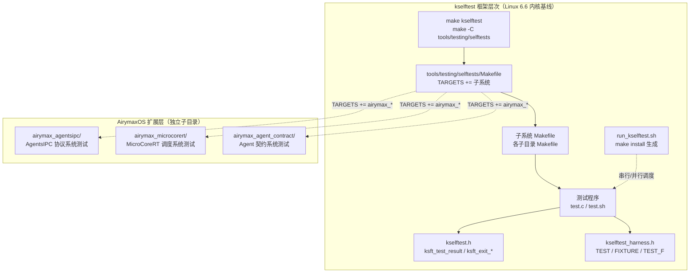
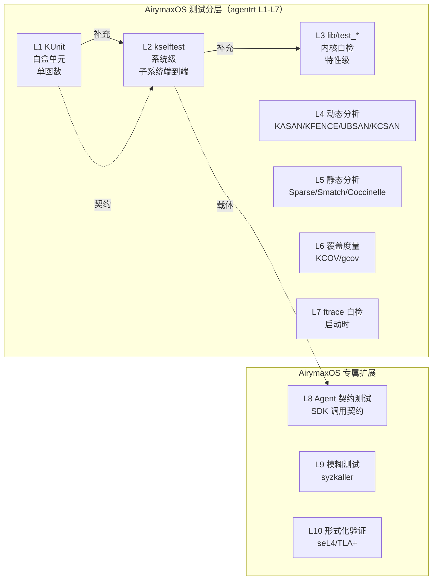

Copyright (c) 2025-2026 SPHARX Ltd. All Rights Reserved.

# AirymaxOS kselftest 系统级测试

> **文档定位**: AirymaxOS（agentrt-linux）测试工程体系第 2 卷——kselftest 用户态系统级测试。本卷规定 kselftest 框架结构、`tools/testing/selftests/` 目录组织、`make kselftest` 入口、各子系统测试集（sched/mm/fs/net/...）、kselftest 与 KUnit 区别、运行环境要求，以及 AirymaxOS Agent 契约测试的系统级扩展。
> **版本**: 0.1.1（占位）/ 1.0.1（开发）
> **最后更新**: 2026-07-06
> **同源映射**: agentrt 7 层验证 L2（系统级测试）+ Linux 6.6 内核基线 `tools/testing/selftests/`
> **理论根基**: Linux 6.6 内核基线测试思想 + Airymax 五维正交 24 原则（E-8 可测试性 / S-1 反馈闭环 / IRON-9 同源但独立）
> **核心约束**: IRON-9 同源但独立——kselftest 框架与 Linux 6.6 上游保持源码同源，AirymaxOS 扩展必须以独立子目录形式注入，禁止改写上游 kselftest 框架代码。

---

## 0. 章节定位

本卷是 AirymaxOS 测试工程 10 主题文档中的第 2 卷，回答"内核系统级测试怎么跑"。它在 01-kunit-framework（白盒单元测试）与 03-kernel-selftests（内核自检）之间形成系统级测试执行层：

- **上游依赖**：README 定义"测试体系分层"——L2 系统级测试由本卷展开；50-engineering-standards/06-toolchain-and-automation 定义"7 层验证"——本卷对应第 8 层。
- **下游依赖**：03-kernel-selftests 定义"启动时内核自检怎么启用"；08-agent-contract-testing 定义"Agent 行为契约"——本卷提供 Agent 契约的系统级载体。

本卷所有强制规则均赋予 **OS-TEST** / **OS-KER** / **OS-STD** 编号，与 07 维护者制度的"规则编号注册表"对齐。

### 0.1 关键术语

| 术语 | 定义 |
|------|------|
| kselftest | Linux 内核用户态系统级测试框架，从用户态测试内核特性 |
| `tools/testing/selftests/` | kselftest 源码主目录，含 100+ 子系统测试集 |
| `make kselftest` | kselftest 主入口，编译并运行所有 TARGETS |
| `kselftest.h` | 低层 API（`ksft_test_result` / `ksft_exit_*`） |
| `kselftest_harness.h` | 高层 API（`TEST`/`FIXTURE`/`TEST_F`，类 googletest 风格） |
| `run_kselftest.sh` | kselftest 主运行脚本，由 `make install` 生成 |
| KSFT_PASS/FAIL/SKIP/XFAIL | kselftest 退出码（0/1/4/2） |

---

## 1. kselftest 框架总览

### 1.1 起源与定位

kselftest 是 Linux 6.6 内核基线中的官方用户态系统级测试框架，由 Shuah Khan（Samsung）于 2014 年首次合入主线。其设计目标有三：系统级覆盖（系统调用、`/proc`、`/sys`、ioctl 等用户态接口测试内核特性，覆盖 KUnit 难以触及的端到端路径）、真实环境（QEMU 或真实硬件反映用户实际工作负载）、零依赖（仅依赖 glibc 或 NOLIBC，无需额外测试运行时）。

AirymaxOS 完整继承 Linux 6.6 内核基线的 kselftest 框架（`tools/testing/selftests/`），不修改任何上游源文件。AirymaxOS 专属测试以独立 `airymax_*` 子目录形式驻留于 `tools/testing/selftests/`，遵循 IRON-9 同源但独立原则。

### 1.2 kselftest 架构层次



### 1.3 kselftest 运行载体

| 载体 | 命令 | 适用场景 |
|------|------|---------|
| 本机原生 | `make kselftest` | 开发者本机（x86_64/aarch64） |
| QEMU | `make -C tools/testing/selftests install && qemu-system ...` | 跨架构测试 |
| 真实硬件 | `tar -xf kselftest.tar.gz && ./run_kselftest.sh` | 部署后回测 |
| CI 容器 | `make -C tools/testing/selftests TARGETS=sched` | 选择性运行 |

**OS-TEST-013**：所有 AirymaxOS 内核特性必须有对应的 kselftest 子系统测试；特性无 kselftest 覆盖时，PR 评审必须显式标注"kselftest 豁免理由"。

**OS-TEST-014**：kselftest 默认在 QEMU 上运行（CI 容器无法访问真实硬件）；测试若依赖真实硬件特性，必须用 `ksft_test_result_skip()` 在虚拟环境显式跳过并标注原因。

---

## 2. `tools/testing/selftests/` 组织

### 2.1 顶层 Makefile 与子目录

`tools/testing/selftests/Makefile` 通过 `TARGETS +=` 列出所有测试集（alsa/bpf/breakpoints/cgroup/cpu-hotplug/damon/ftrace/futex/ipc/kvm/landlock/livepatch/membarrier/memfd/mqueue/net/nsfs/perf_events/pidfd/prctl/resctrl/rseq/sched_ext/seccomp/sigaltstack/sync/tc-testing/timers/tpm2/tty/user_events/vDSO 等）。

每个子目录典型结构：`Makefile`（编译规则）+ `config`（所需 CONFIG_* 选项）+ `*.c`/`*.sh`（测试程序）+ `README`/`settings`（文档与运行配置）。`config` 文件列出测试所需的内核配置（如 `tools/testing/selftests/sched_ext/config` 包含 `CONFIG_SCHED_CLASS_EXT=y`/`CONFIG_BPF_SYSCALL=y`/`CONFIG_BPF_JIT=y`/`CONFIG_DEBUG_INFO_BPF=y`）。

**OS-STD-006**：所有 AirymaxOS 扩展子目录必须有 `config` 文件列出依赖 CONFIG_*；缺失 `config` 导致测试在 CI 上无法启用的，禁止合入。

**OS-STD-007**：子目录命名必须与被测子系统对齐（如 `airymax_agentsipc` 测 `airymaxos-kernel/airymaxos/agentsipc/`）；禁止用模糊命名如 `airymax_misc`。

---

## 3. `make kselftest` 入口

### 3.1 主入口命令

```bash
make -C tools/testing/selftests                                          # 编译并运行所有 TARGETS
make -C tools/testing/selftests all                                      # 仅编译
make -C tools/testing/selftests run_tests                                # 仅运行（已编译）
make -C tools/testing/selftests TARGETS="sched_ext net"                  # 仅运行特定 TARGETS
make -C tools/testing/selftests INSTALL_PATH=/tmp/kselftest install     # 安装到目录
make -C tools/testing/selftests gen_kselftest_tar.sh                     # 生成 tar 包
```

### 3.2 `run_kselftest.sh` 与退出码

`make install` 后生成 `run_kselftest.sh`，其调用 `kselftest-list.sh` 列出所有可执行测试并串行/并行调度。退出码：`KSFT_PASS=0`/`KSFT_FAIL=1`/`KSFT_XFAIL=2`/`KSFT_XPASS=3`/`KSFT_SKIP=4`。

**OS-TEST-015**：测试退出码必须严格使用 `ksft_exit_pass()`/`ksft_exit_fail()`/`ksft_exit_skip()`；禁止用裸 `exit(0)`/`exit(1)`，破坏 CI 解析。

**OS-KER-007**：AirymaxOS 子目录禁止修改上游 `Makefile`（顶层）；新增子目录通过 `TARGETS += airymax_xxx` 单行追加，并经 CI 静态检查（第 7 层）验证追加合规。

---

## 4. 子系统测试集

Linux 6.6 内核基线在 `tools/testing/selftests/` 下提供 100+ 子系统测试集，覆盖 sched_ext、mm、filesystems、net、bpf、cgroup、livepatch、resctrl、rseq、seccomp、tpm2 等。本节仅以 sched_ext（与 MicroCoreRT 共享调度器扩展机制）为例说明 AirymaxOS 系统级测试范式。

### 4.1 sched_ext 与 MicroCoreRT 调度系统测试

`tools/testing/selftests/sched_ext/` 测试 sched_class_ext（AirymaxOS 与 MicroCoreRT 共享的调度器扩展机制），包含 `create_dsq`、`ddsp_bogus_dsq_fail`、`enq_last_no_enq_fails`、`exit`、`hotplug` 等 BPF + 用户态主程序对。MicroCoreRT 调度算法的系统级验证通过 `airymax_microcorert/` 测试集承载：

```c
/* tools/testing/selftests/airymax_microcorert/microcorert_sched.c */
#include "../kselftest_harness.h"
#include <sched.h>

FIXTURE(microcorert_sched) {
    int pid;
    struct sched_param param;
};

FIXTURE_SETUP(microcorert_sched) {
    self->pid = getpid();
    self->param.sched_priority = 50;
}

FIXTURE_TEARDOWN(microcorert_sched) {
    sched_setscheduler(self->pid, SCHED_NORMAL, &self->param);
}

TEST_F(microcorert_sched, fifo_priority_slice) {
    int ret = sched_setscheduler(self->pid, MICROCORERT_SCHED_FIFO, &self->param);
    ASSERT_EQ(0, ret) TH_LOG("sched_setscheduler failed: %s", strerror(errno));
    struct timespec ts;
    ret = measure_sched_slice(self->pid, &ts);
    ASSERT_EQ(0, ret);
    EXPECT_GE(ts.tv_nsec, 950000) TH_LOG("slice too short: %ld ns", ts.tv_nsec);
    EXPECT_LE(ts.tv_nsec, 1050000);
}

TEST_HARNESS_MAIN
```

**OS-TEST-016**：MicroCoreRT 调度算法的每个策略（FIFO/RR/DEADLINE）必须有 sched_ext 风格系统测试；时间片测量允许 ±5% 容差（QEMU 时钟精度限制）。

### 4.2 完整 TARGETS 列表

AirymaxOS 维护 `tools/testing/selftests/airymax_enabled_targets.list`，列出 CI 默认启用的 TARGETS；该列表与 README 第 1.1 节的 L2 系统级测试集对齐。

**OS-STD-008**：CI 默认启用 TARGETS 列表与 README 第 1.1 节的 L2 系统级测试集必须对齐；列表变更需同步更新两者。

---

## 5. kselftest 与 KUnit 的区别

| 维度 | KUnit | kselftest |
|------|-------|-----------|
| 测试视角 | 白盒（直接调内核函数） | 黑盒（经系统调用/ioctl） |
| 运行环境 | UML（首选）/ QEMU / 真实硬件 | QEMU / 真实硬件 |
| 时间尺度 | 毫秒级 | 秒级 |
| 覆盖范围 | 单函数 | 子系统端到端 |
| 依赖 | 内核内（`<kunit/test.h>`） | 用户态（`<kselftest.h>`） |
| 输出格式 | TAP | TAP（兼容） |
| 失败影响 | 用例终止（try-catch） | 进程退出 |
| 硬件依赖 | 弱（UML 无硬件） | 强（必须真实内核） |
| 启用方式 | `CONFIG_KUNIT_*_TEST=y` | `make kselftest` |



**OS-TEST-017**：KUnit 测试与 kselftest 测试不可相互替代；每个 AirymaxOS 子系统必须同时有 KUnit 白盒测试（覆盖函数）与 kselftest 系统级测试（覆盖系统调用接口）。

**OS-KER-008**：禁止将 KUnit 与 kselftest 混编于同一文件；KUnit 是 `.c` 内核内文件（`*_test.c`），kselftest 是用户态文件（`tools/testing/selftests/`），二者编译目标不同。

---

## 6. kselftest 运行环境要求

### 6.1 编译与运行时依赖

```bash
sudo apt install build-essential python3 iproute2 tcpdump jq bpftool ethtool
cd /path/to/airymaxos-kernel && make defconfig && make
make -C tools/testing/selftests
# 部分测试需要 root（CPU 热插拔、cgroup、namespace）：
sudo make -C tools/testing/selftests run_tests          # 在 root 下运行全部
sudo -u nobody ./run_kselftest.sh --filter=non_root     # 非特权测试
```

### 6.2 QEMU 镜像构建

AirymaxOS CI 推荐 virtme 跑 kselftest：

```bash
virtme-run --kdir=$PWD --script='cd /tmp && \
  tar -xf /host/kselftest.tar.gz && \
  ./run_kselftest.sh --summary' 2>&1 | tee kselftest.tap
```

### 6.3 settings 文件

每个子目录可放 `settings` 文件声明运行配置：

```
# tools/testing/selftests/airymax_agentsipc/settings
timeout=30
```

可识别字段：`timeout`（单测试超时秒数，CI 默认 60）、`fragment`（测试子集分组）。

**OS-TEST-018**：AirymaxOS CI 必须提供 root 与非 root 两套 kselftest 运行矩阵；非 root 测试集标记在 `airymax_enabled_targets.list` 第 2 列。

**OS-STD-009**：所有 AirymaxOS 扩展测试在 `settings` 文件中必须声明 `timeout` 字段；CI 默认超时 60 秒，超时测试由 CI 标记为 `KSFT_FAIL`。

---

## 7. kselftest API

### 7.1 低层 API（`kselftest.h`）

```c
#include "../kselftest.h"
int main(void)
{
    ksft_print_header();
    ksft_set_plan(3);
    ksft_test_result(access("/proc/agentsipc/version", F_OK) == 0,
                     "agentsipc_version_exists\n");
    ksft_test_result_skip("agentsipc_dram_test\n");
    ksft_test_result_fail("agentsipc_overflow_test\n");
    ksft_finished();
}
```

主要 API：`ksft_print_header()`/`ksft_set_plan(n)`/`ksft_print_msg(fmt, ...)`/`ksft_test_result(cond, fmt, ...)`/`ksft_test_result_pass|fail|skip|xfail|error(fmt, ...)`/`ksft_finished()`/`ksft_exit_pass|fail|skip()`。

### 7.2 高层 API（`kselftest_harness.h`）

```c
#include "../kselftest_harness.h"
TEST(agentsipc_version) {
    EXPECT_EQ(0, access("/proc/agentsipc/version", F_OK));
}
TEST(agentsipc_header_size) {
    EXPECT_EQ(128, sizeof(struct agentsipc_header));
}
FIXTURE(agentsipc_channel) { int fd; };
FIXTURE_SETUP(agentsipc_channel) {
    self->fd = open("/dev/agentsipc0", O_RDWR);
    ASSERT_GE(self->fd, 0);
}
FIXTURE_TEARDOWN(agentsipc_channel) {
    if (self->fd >= 0) close(self->fd);
}
TEST_F(agentsipc_channel, roundtrip_request) {
    struct agentsipc_header req = { .type = AGENTSIPC_TYPE_REQUEST };
    struct agentsipc_header rsp;
    ASSERT_EQ(sizeof(req), write(self->fd, &req, sizeof(req)));
    ASSERT_EQ(sizeof(rsp), read(self->fd, &rsp, sizeof(rsp)));
    EXPECT_EQ(AGENTSIPC_TYPE_RESPONSE, rsp.type);
}
TEST_HARNESS_MAIN
```

宏清单：`TEST(name)`/`FIXTURE(name)`/`FIXTURE_SETUP(name)`/`FIXTURE_TEARDOWN(name)`/`TEST_F(fixture, name)`/`EXPECT_EQ/NE/GT/LT/...`（非致命）/`ASSERT_EQ/NE/GT/LT/...`（致命）/`TH_LOG(fmt, ...)`/`TEST_HARNESS_MAIN`。

**OS-TEST-019**：AirymaxOS 扩展测试优先使用 `kselftest_harness.h`（高层 API）；仅在需要精细控制 TAP 输出格式时使用 `kselftest.h`（低层 API）。

**OS-STD-010**：每个 `TEST_F` 必须有对应 `FIXTURE_SETUP` 与 `FIXTURE_TEARDOWN`；资源在 setup 中获取，在 teardown 中释放，禁止在 `TEST_F` 体中分配而不释放。

---

## 8. AirymaxOS Agent 契约测试的系统级扩展

本卷与 KUnit 卷（01）形成对照：KUnit 测 Agent SDK 的白盒契约，kselftest 测 Agent 经系统调用、`/proc`、`/dev` 的端到端契约。

```c
/* tools/testing/selftests/airymax_agent_contract/agent_sdk_contract.c */
#include "../kselftest_harness.h"
#include <fcntl.h>
#include <sys/ioctl.h>
#include <sys/mman.h>
#include "../../../include/uapi/airymaxos/agent_ioctl.h"

FIXTURE(agent_sdk) {
    int agent_fd;
    void *shared_ring;
};

FIXTURE_SETUP(agent_sdk) {
    self->agent_fd = open("/dev/airymax_agent0", O_RDWR);
    ASSERT_GE(self->agent_fd, 0) TH_LOG("open failed: %s", strerror(errno));
    self->shared_ring = mmap(NULL, AGENT_RING_SIZE, PROT_READ | PROT_WRITE,
                             MAP_SHARED, self->agent_fd, 0);
    ASSERT_NE(MAP_FAILED, self->shared_ring);
}

FIXTURE_TEARDOWN(agent_sdk) {
    if (self->shared_ring != MAP_FAILED) munmap(self->shared_ring, AGENT_RING_SIZE);
    if (self->agent_fd >= 0) close(self->agent_fd);
}

TEST_F(agent_sdk, cognition_roundtrip_via_ioctl) {
    struct airymax_cognition_request req = {
        .input_offset = offsetof(struct agent_ring, in_buf),
        .input_len = strlen("hello"),
    };
    struct airymax_cognition_response rsp;
    strcpy((char *)self->shared_ring + req.input_offset, "hello");
    ASSERT_EQ(0, ioctl(self->agent_fd, AIRYMAX_IOCTL_COGNITION, &req))
        TH_LOG("ioctl failed: %s", strerror(errno));
    rsp = *(struct airymax_cognition_response *)
          (self->shared_ring + req.output_offset);
    EXPECT_EQ(AGENTRT_OK, rsp.status);
    EXPECT_GT(rsp.tokens_used, 0);
}

TEST_F(agent_sdk, ipc_128b_header_protocol) {
    struct agentsipc_header hdr = { .type = AGENTSIPC_TYPE_REQUEST, .payload_len = 64 };
    ASSERT_EQ(0, ioctl(self->agent_fd, AIRYMAX_IOCTL_AGENTSIPC_SEND, &hdr));
    EXPECT_EQ(128, (int)sizeof(hdr));
}
TEST_HARNESS_MAIN
```

配套文件：`settings` 声明 `timeout=45`；`Makefile` 用 `CFLAGS += -I../../../../include/uapi/airymaxos` + `TEST_GEN_PROGS := agent_sdk_contract` + `include ../lib.mk`；`config` 列出 `CONFIG_AIRYMAX_AGENT=y`/`CONFIG_AGENTSIPC=y`/`CONFIG_AIRYMAX_COGNITION=y`。

**OS-TEST-020**：AirymaxOS Agent SDK 的每个公共 ioctl 必须有 kselftest 系统级测试；契约覆盖正常路径 + `EINVAL`/`ENOMEM`/`EBUSY` 各一例异常路径。

**OS-KER-009**：AirymaxOS Agent 契约的系统级测试与 KUnit 契约测试必须共享同一份契约规范文档（`docs/agents/contract.md`），二者实现由 CI 第 7 层检查契约一致性。

---

## 9. 五维原则映射

本节落实 Airymax 五维正交 24 原则在 kselftest 卷的具体映射——每个原则至少对应 1 条强制规则，规则之间两两正交无重叠，从而保证评审清单可独立执行：

| 原则 | 在 kselftest 卷的体现 |
|------|---------------------|
| **E-8 可测试性** | kselftest 框架本身体现"系统级可测"；每特性必有套件（OS-TEST-013） |
| **S-1 反馈闭环** | QEMU CI 自动运行 + TAP 解析 + PR 阻断（OS-STD-008） |
| **A-4 完美主义** | root/非 root 双矩阵 + 退出码严格（OS-TEST-015/018） |
| **K-3 协议优先** | AgentsIPC 128B 协议系统级契约（OS-KER-009） |
| **K-6 调度优先** | MicroCoreRT 调度策略系统级时间片测量（OS-TEST-016） |
| **IRON-9 同源但独立** | AirymaxOS 扩展子目录独立注入，不改上游（OS-KER-007/008） |

> Airymax 五维正交 24 原则要求各维度强制规则两两正交无重叠，kselftest 卷规则（OS-TEST-013 至 OS-TEST-022）按原则维度分组，避免一条规则同时承担多个原则检查。

### 9.1 IRON-9 同源但独立在本卷的具体落地

- **同源**：AirymaxOS 不修改上游 `tools/testing/selftests/Makefile` 顶层结构；上游测试集与 Linux 6.6 内核基线一一对应。
- **独立**：AirymaxOS 扩展子目录以 `airymax_*` 前缀命名，独立 `config`/`settings`/`Makefile`，独立 Kconfig 依赖。
- **互操作**：AirymaxOS 套件与上游套件共享同一 `run_kselftest.sh` 调度器，CI 通过 `--filter` 选择性运行。

**OS-KER-010**：AirymaxOS 子目录禁止引入对上游测试集源码的依赖（`#include "../sched_ext/..."` 等）；扩展测试自包含，避免上游重构时被破坏。

---

## 10. 同源 agentrt 映射

agentrt 7 层验证与本卷的对应关系：

| agentrt 层 | 验证目标 | 本卷对应 |
|-----------|---------|---------|
| L1 白盒单元 | 单函数行为 | 01-kunit-framework（非本卷） |
| L2 系统级 | 子系统端到端 | kselftest 各子系统测试集（本卷第 4 节） |
| L3 子系统 | 跨模块接口 | kselftest 多 TEST_F 联合（本卷第 7 节） |
| L4 系统级 | 内核整体 | kselftest 全 TARGETS（本卷第 3 节） |
| L5 协议 | 协议契约 | AgentsIPC 系统级契约（本卷第 8 节） |
| L6 形式化 | 关键路径证明 | 10-formal-verification（非本卷） |
| L7 模糊 | 输入边界 | 09-fuzz-testing（非本卷） |

**OS-KER-011**：agentrt L2（系统级）的所有用例必须用 kselftest 实现；与上游 kselftest 共享同一 `tools/testing/selftests/` 目录与 `run_kselftest.sh` 调度器，禁止 AirymaxOS 自建独立调度器。

**OS-KER-012**：agentrt 与 AirymaxOS 之间的 kselftest 子目录命名空间必须正交（`airymax_*` vs `agentrt_*` 前缀）；命名冲突由 CI 第 7 层（静态检查）在 PR 阶段检测。

---

## 11. CI 集成

### 11.1 CI 矩阵

CI 矩阵覆盖 `arch: [x86_64, arm64, riscv64] × role: [root, non_root]`，简化的命令序列：

```bash
make defconfig && make -j$(nproc)
make -C tools/testing/selftests \
     TARGETS="sched_ext net airymax_agentsipc airymax_microcorert airymax_agent_contract"
virtme-run --kdir=$PWD \
  --script='./run_kselftest.sh --summary --role=${ROLE}' \
  2>&1 | tee kselftest-${ARCH}-${ROLE}.tap
airymax-tap-action parse kselftest-${ARCH}-${ROLE}.tap
```

### 11.2 结果解析

kselftest 输出 TAP（version 13），形如 `ok <num> <suite>:<case>` / `not ok <num> <suite>:<case> # <reason>`；CI 解析后上传至测试报告系统。

**OS-TEST-021**：CI 必须解析 kselftest TAP 输出并上传至测试报告系统；新增/删除测试集必须使总用例数单调变化，PR 评审需显式确认。

**OS-STD-011**：CI 总时长不得超过 60 分钟（与 06-toolchain-and-automation 的 OS-STD-033 对齐）；超时的子集必须拆分或缓存优化。

### 11.3 失败重试

```bash
./run_kselftest.sh --summary --retry=2
```

失败测试默认重试 2 次；连续 3 次失败才标记为真实失败（避免 flaky 测试误报）。

**OS-TEST-022**：flaky 测试（同一 PR 重复运行结果不一致）必须在 `airymax_flaky_baseline.md` 登记并限期修复；未修复的 flaky 测试由 CI 标记为 `KSFT_XFAIL`。

---

## 12. 相关文档

- `80-testing/README.md`（测试体系主索引，定义 L1-L10 分层）
- `80-testing/01-kunit-framework.md`（KUnit 白盒单元测试，与本卷互补）
- `80-testing/03-kernel-selftests.md`（`lib/test_*` 内核自检）
- `80-testing/08-agent-contract-testing.md`（AirymaxOS 专属：Agent 行为契约测试）
- `50-engineering-standards/06-toolchain-and-automation.md`（7 层验证体系，本卷属第 8 层）
- `50-engineering-standards/01-coding-standards.md`（错误处理强制，与 kselftest 退出码对齐）
- `20-modules/08-tests.md`（tests 子仓设计）
- `110-security/README.md`（安全测试，复用 kselftest 框架）

### 12.1 上游参考

- Linux 6.6 `tools/testing/selftests/Makefile`（TARGETS 列表）
- Linux 6.6 `tools/testing/selftests/kselftest.h`（低层 API）
- Linux 6.6 `tools/testing/selftests/kselftest_harness.h`（高层 API）
- Linux 6.6 `Documentation/dev-tools/kselftest.rst`（kselftest 文档）
- Linux 6.6 `tools/testing/selftests/sched_ext/`（sched_ext 测试参考）

---

## 13. 文档版本与维护

| 版本 | 日期 | 维护者 | 变更 |
|------|------|--------|------|
| 0.1.1 | 2026-07-06 | AirymaxOS 工程组 | 初始占位版（仅 README + 01 + 02） |
| 1.0.1 | 2026-07-06 | AirymaxOS 工程组 | 开发版：补全 AirymaxOS 扩展章节、CI 集成、五维原则映射 |

### 13.1 维护规则

- 本卷与 Linux 6.6 内核基线 kselftest 框架保持源码同源（IRON-9 同源但独立）。
- 上游 kselftest API 变更时，本卷必须在 1 个上游 LTS 周期内同步更新。
- AirymaxOS 扩展子目录的新增/删除必须同步更新本卷第 8 节与 `80-testing/README.md` 的 L2 章节。
- 本卷所有规则编号（OS-KER-XXX/OS-STD-XXX/OS-TEST-XXX）注册于 07 维护者制度的"规则编号注册表"。

### 13.2 待办（1.0.1 版本）

- [ ] 补充 NOLIBC 模式下 AirymaxOS 测试的编译模板
- [ ] 补充 kselftest 与 KCOV 覆盖度联用（与 06-coverage-metrics 联动）
- [ ] 补充 kselftest 与动态分析（KASAN/UBSAN）联用的运行模板
- [ ] 补充 MicroCoreRT 调度策略在 RT 抢占模式下的系统级时间片测量

---

> **文档结束** | AirymaxOS 测试工程第 2 卷（kselftest 系统级测试）| 0.1.1 P0 优先完成 | 同源 Linux 6.6 内核基线 kselftest
