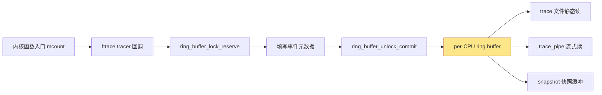
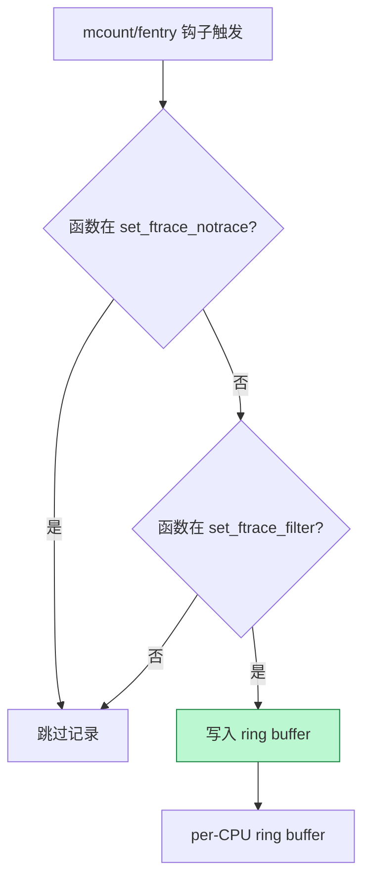
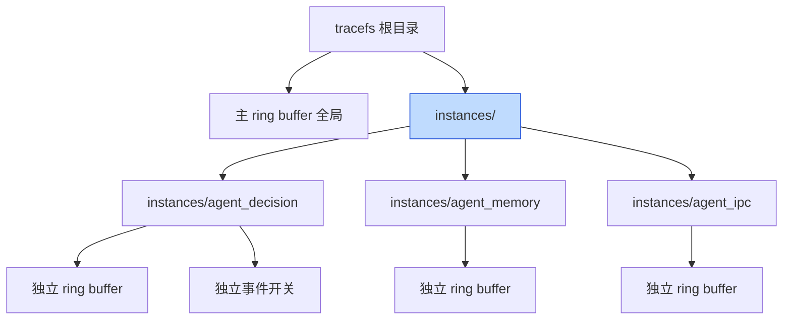
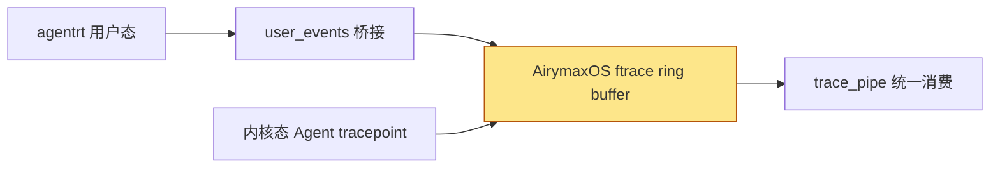

Copyright (c) 2025-2026 SPHARX Ltd. All Rights Reserved.

# AirymaxOS ftrace 框架详解

> **文档定位**: AirymaxOS（agentrt-linux）可观测性体系 L1 层——内核函数级跟踪框架 ftrace 的工程规范
> **版本**: 0.1.1（占位）/ 1.0.1（开发）
> **最后更新**: 2026-07-06
> **同源映射**: agentrt E-2 可观测性 + Linux 6.6 ftrace/tracefs/ring buffer
> **理论根基**: Linux 6.6 内核基线 + Airymax 五维正交 24 原则 + E-2 可观测性
> **核心约束**: IRON-9 同源但独立——与 agentrt 用户态可观测性同源，但内核态实现独立

---

## 目录

- [第 1 章 ftrace 框架概述](#第-1-章-ftrace-框架概述)
- [第 2 章 tracefs 挂载与目录布局](#第-2-章-tracefs-挂载与目录布局)
- [第 3 章 ring buffer 机制](#第-3-章-ring-buffer-机制)
- [第 4 章 tracer 类型与 current_tracer 控制](#第-4-章-tracer-类型与-current_tracer-控制)
- [第 5 章 trace 文件格式](#第-5-章-trace-文件格式)
- [第 6 章 ftrace 过滤器](#第-6-章-ftrace-过滤器)
- [第 7 章 ftrace 多缓冲 trace_instances](#第-7-章-ftrace-多缓冲-trace_instances)
- [第 8 章 ftrace 触发器](#第-8-章-ftrace-触发器)
- [第 9 章 ftrace 与 kallsyms 关联](#第-9-章-ftrace-与-kallsyms-关联)
- [第 10 章 AirymaxOS Agent 行为追踪扩展](#第-10-章-airymaxos-agent-行为追踪扩展)
- [第 11 章 五维原则映射](#第-11-章-五维原则映射)
- [第 12 章 同源 agentrt 映射](#第-12-章-同源-agentrt-映射)
- [第 13 章 相关文档与版本维护](#第-13-章-相关文档与版本维护)

---

## 第 1 章 ftrace 框架概述

### 1.1 定位

ftrace（function tracer）是 Linux 6.6 内核基线提供的官方跟踪框架。它不是单纯的函数跟踪器，而是围绕 tracefs 文件系统、ring buffer 数据通路、多种 tracer 类型、过滤器与触发器构建的可观测性工程框架。AirymaxOS 选择 ftrace 作为可观测性 L1 层，原因有三：

1. **零依赖、内核内建**：由 `CONFIG_FUNCTION_TRACER`、`CONFIG_FUNCTION_GRAPH_TRACER`、`CONFIG_DYNAMIC_FTRACE` 等 Kconfig 控制，不依赖任何用户态运行时，与 MicroCoreRT 极简内核契约天然契合。
2. **机制-策略分离**：ftrace 只提供机制（tracefs 接口、ring buffer、tracer 注册），策略由用户通过 `current_tracer` 与过滤器组合决定。
3. **可叠加**：ftrace 与 eBPF、perf 共享 ring buffer 基础设施，可在同一系统上协同工作。

**OS-OBS-001: ftrace 是 AirymaxOS 可观测性 L1 层的强制基线，不得移除或替换为第三方商业跟踪方案。**

**OS-KER-001: airymaxos-kernel 的 defconfig 必须开启 CONFIG_FUNCTION_TRACER、CONFIG_FUNCTION_GRAPH_TRACER、CONFIG_TRACER_MAX_TRACE、CONFIG_DYNAMIC_FTRACE。**

### 1.2 框架组成

| 组件 | 实现位置 | 职责 |
|------|----------|------|
| tracefs | `fs/tracefs/inode.c` | 文件系统接口 |
| ring buffer | `kernel/trace/ring_buffer.c` | 数据通路 |
| tracer | `kernel/trace/trace_functions.c` 等 | 跟踪策略 |
| filter | `kernel/trace/ftrace.c` | 函数过滤 |
| instances | `kernel/trace/trace.c` | 多缓冲管理 |
| trigger | `kernel/trace/trace_events_trigger.c` | 事件触发器 |

**OS-STD-001: 任何对 `kernel/trace/` 子目录的修改必须经过 ftrace 维护者审查，不得自行扩展 tracer 类型。**

---

## 第 2 章 tracefs 挂载与目录布局

### 2.1 挂载点

Linux 6.6 内核基线规定 tracefs 的标准挂载点是 `/sys/kernel/tracing`。出于向后兼容，当 debugfs 挂载时 tracefs 也会自动挂在 `/sys/kernel/debug/tracing`。AirymaxOS 遵循上游约定：

```bash
# 标准挂载（fstab 永久化）
tracefs /sys/kernel/tracing tracefs defaults 0 0
# 运行时挂载
mount -t tracefs nodev /sys/kernel/tracing
ln -s /sys/kernel/tracing /tracing
```

**OS-KER-002: airymaxos-kernel 必须在 init 阶段完成 tracefs 挂载，挂载失败视为致命错误并 panic。**

### 2.2 关键控制文件

| 文件 | 权限 | 用途 |
|------|------|------|
| `current_tracer` | rw | 设置或显示当前 tracer |
| `available_tracers` | r | 列出编译进内核的 tracer |
| `tracing_on` | rw | 启停 ring buffer 写入 |
| `trace` | rw | 人类可读的跟踪输出 |
| `trace_pipe` | rw | 流式跟踪输出（消费型） |
| `set_ftrace_filter` | rw | 函数过滤白名单 |
| `set_ftrace_notrace` | rw | 函数过滤黑名单 |
| `set_ftrace_pid` | rw | PID 过滤 |
| `buffer_size_kb` | rw | 每 CPU 缓冲大小 |
| `tracing_cpumask` | rw | CPU 掩码过滤 |
| `trace_clock` | rw | 时间戳时钟源 |

**OS-OBS-002: 所有 tracefs 控制文件必须以 root 权限访问；非 root 用户访问必须通过 user_events 桥接，不得直接开放 tracefs 写权限。**

---

## 第 3 章 ring buffer 机制

### 3.1 设计原理

ftrace 的核心数据通路是 ring buffer（环形缓冲区），由 `kernel/trace/ring_buffer.c` 实现。它是无锁的 per-CPU 缓冲区，每 CPU 一个独立缓冲，避免跨 CPU 锁竞争。关键设计包括：per-CPU 隔离；可变长事件（`struct ring_buffer_event`）；时间扩展条目（`TIME_EXTEND`）保证时间戳单调性；满缓冲时可覆盖最旧事件或丢弃新事件。

```c
/* kernel/trace/ring_buffer.c 中的事件头（节选） */
struct ring_buffer_event {
    u32             type_len:5, time_delta:27;
    u32             array[];
};
#define RB_EVNT_HDR_SIZE (offsetof(struct ring_buffer_event, array))
```

### 3.2 ring buffer 数据流



**OS-KER-003: ring buffer 默认大小 1408 KB/CPU（与上游一致），可通过 `buffer_size_kb` 调整；调整后必须验证无事件丢失（`cat per_cpu/cpu0/stats` 检查 `overrun`）。**

**OS-STD-002: 在 Agent 高负载场景下，ring buffer 必须扩容到至少 8192 KB/CPU，避免 Agent 决策事件被覆盖。**

### 3.3 trace_clock 选择

ring buffer 时间戳由 `trace_clock` 控制，默认 `local`（per-CPU 快速但可能跨 CPU 不同步）。AirymaxOS 在 Agent 调度分析场景推荐 `global`：

```bash
cat trace_clock     # [local] global counter x86-tsc
echo global > trace_clock
```

---

## 第 4 章 tracer 类型与 current_tracer 控制

### 4.1 五大基础 tracer

`available_tracers` 列出编译进内核的 tracer。AirymaxOS defconfig 至少启用以下五种：

| tracer | 用途 | 何时使用 |
|--------|------|----------|
| `function` | 函数调用跟踪 | 内核控制流分析 |
| `function_graph` | 函数调用图（含返回） | 调用层次与耗时分析 |
| `event`（事件子系统） | 静态 tracepoint 事件 | 子系统行为审计 |
| `hw_branches` | 硬件分支跟踪（BTB/PT） | 微架构级分支分析 |
| `nop` | 空 tracer | 占位、配置准备 |

**OS-OBS-003: `available_tracers` 必须至少包含 `function function_graph event hw_branches nop`；缺一则视为 defconfig 不合格。**

`function` tracer 依赖 `mcount`/`fentry` 钩子，配合 `CONFIG_DYNAMIC_FTRACE` 在启动时将未跟踪函数的钩子替换为 `nop`，跟踪时再恢复，实现零运行时开销。`function_graph` 在 `function` 基础上记录函数返回，可输出调用层次与耗时（如 `1) ! 2920.000 us | agentrt_cognition_process();`），通过 `max_graph_depth` 限制递归深度。`event` 是 tracepoint 静态埋点的集合，每个事件位于 `events/<子系统>/<事件名>/`，可独立 enable/disable。`hw_branches` 依赖架构特性（x86 BTS/LBR、ARM BRBE），仅性能调优阶段使用。`nop` 是空 tracer，不记录函数事件但仍可记录事件子系统事件，常用于配置准备。

**OS-KER-004: airymaxos-kernel 必须为 Agent 核心路径打 tracepoint：`agentrt:cognition_enter`、`agentrt:planner_dag_update`、`agentrt:scheduler_dispatch`、`agentrt:execution_unit_run`。**

### 4.2 current_tracer 切换语义

写入 `current_tracer` 即切换 tracer，切换会清空 ring buffer 与 snapshot 缓冲。`function` 与 `function_graph` 受 `set_ftrace_filter`/`set_ftrace_notrace` 影响；`event` 受事件级 enable 与 `set_event` 影响；`hw_branches` 与 `nop` 不受函数过滤器影响。

**OS-OBS-004: 在生产环境切换 tracer 前必须先 `echo 0 > tracing_on` 暂停写入，再切换，最后 `echo 1 > tracing_on` 恢复，避免切换瞬间丢失事件。**

**OS-STD-003: 一次只启用一个 function 系列 tracer；`function` 与 `function_graph` 不得同时启用，否则 ring buffer 会重复记录。**

```bash
# 安全切换流程
echo 0 > tracing_on
echo function_graph > current_tracer
echo 1 > tracing_on
```

---

## 第 5 章 trace 文件格式

### 5.1 头部说明

`cat trace` 输出由头部与事件行组成。头部说明列含义：

```
# tracer: function_graph
#
# entries-in-buffer/entries-written: 12345/12345   #P:4
#
#                              _-----=> irqs-off
#                             / _----=> need-resched
#                            | / _---=> hardirq/softirq
#                            || / _--=> preempt-depth
#                            ||| /     delay
#           TASK-PID   CPU#  ||||    TIMESTAMP  FUNCTION
#              | |       |   ||||       |         |
```

每条事件行字段依次为：任务名、PID、CPU 号、4 位标志（中断/抢占/软中断/抢占深度）、时间戳、函数名或事件 payload。

**OS-OBS-005: AirymaxOS Agent 行为追踪输出必须包含 4 位标志位，用于区分 Agent 决策发生在硬中断、软中断还是进程上下文。**

**OS-KER-005: Agent tracepoint 的 `print fmt` 必须以 `agent_id=0x%04x decision=%s` 起始，便于 `trace` 文件 grep 过滤。**

### 5.2 trace 与 trace_pipe 区别

| 文件 | 行为 | 适用场景 |
|------|------|----------|
| `trace` | 静态读，不消费 | 事后分析、快照 |
| `trace_pipe` | 流式读，消费型 | 实时监控、长期采集 |

`trace_pipe` 是消费型——读出后即从缓冲移除，适合长期运行的 Agent 行为审计守护进程。

---

## 第 6 章 ftrace 过滤器

### 6.1 set_ftrace_filter / set_ftrace_notrace

`set_ftrace_filter` 是函数跟踪白名单，`set_ftrace_notrace` 是黑名单。两者协同缩小跟踪范围，避免 ring buffer 淹没。当一个函数同时出现在两文件中时，`set_ftrace_notrace` 优先（即不跟踪）：

```bash
# 仅跟踪 AirymaxOS Agent 核心路径
echo 'agentrt_*' > set_ftrace_filter
echo '*lock*' >> set_ftrace_notrace
echo '*rcu*' >> set_ftrace_notrace
```

### 6.2 过滤器工作流



**OS-OBS-006: 生产环境启用 function tracer 时，必须配置 `set_ftrace_notrace` 排除 `*lock*`、`*rcu*`、`*tick*`、`*timer*`，避免高频内核噪声淹没 Agent 事件。**

### 6.3 模块与 PID 过滤

ftrace 支持按模块过滤：`echo ':mod:agentrt' > set_ftrace_filter` 仅跟踪 agentrt 模块；`echo '*:mod:!*' > set_ftrace_filter` 排除所有模块仅跟踪内核核心。`set_ftrace_pid` 限制只跟踪指定 PID 的线程；`set_ftrace_notrace_pid` 反之。配合 `function-fork` 选项可自动跟踪子进程：

```bash
echo 2049 > set_ftrace_pid
echo function-fork > trace_options
```

**OS-KER-006: airymaxos-kernel 必须导出 Agent 路径函数符号至 kallsyms，确保 `available_filter_functions` 包含 `agentrt_*` 前缀函数。**

---

## 第 7 章 ftrace 多缓冲 trace_instances

### 7.1 instances 机制

tracefs 根目录下的 `instances/` 子目录允许创建独立的多缓冲实例。每个实例有自己的 ring buffer、事件开关，与主缓冲及彼此隔离：

```bash
mkdir instances/agent_decision
mkdir instances/agent_memory
echo 1 > instances/agent_decision/events/agentrt/agent_decision/enable
echo 1 > instances/agent_memory/events/agentrt/memory_evict/enable
```

### 7.2 多缓冲架构



**OS-OBS-007: AirymaxOS 必须为 Token 能效、Agent 决策、记忆卷载三类观测创建独立 instances，避免相互覆盖。**

**OS-STD-004: instances 创建数量不得超过 8 个；每个 instance 的 buffer_size_kb 不得超过系统内存的 1%。**

### 7.3 内核 API

内核模块可通过 `trace_array_create()` 创建 instance，通过 `trace_array_printk()` 写入指定 instance：

```c
#include <linux/trace.h>

struct trace_array *agent_tr;

int init_agent_trace_instance(void)
{
    agent_tr = trace_array_create("agent_decision");
    if (IS_ERR(agent_tr))
        return PTR_ERR(agent_tr);
    trace_array_init_printk(agent_tr);
    return 0;
}

void log_agent_decision(u16 agent_id, const char *decision)
{
    trace_array_printk(agent_tr, _THIS_IP_,
                       "agent_id=0x%04x decision=%s\n",
                       agent_id, decision);
}
```

**OS-KER-007: airymaxos-kernel 的 Agent 跟踪模块必须使用 `trace_array_create()` 创建独立 instance，不得污染全局主缓冲。**

---

## 第 8 章 ftrace 触发器

### 8.1 触发器语义

ftrace 触发器允许在函数命中或事件发生时执行预定义动作，无需用户态轮询。触发器通过写入 `set_ftrace_filter`（函数级）或 `events/<...>/trigger`（事件级）注册，格式为 `<function>:<command>[:count]`。

| 命令 | 作用 | 示例 |
|------|------|------|
| `traceon`/`traceoff` | 命中时启停跟踪 | `agentrt_panic:traceoff` |
| `snapshot` | 命中时抓快照 | `native_flush_tlb_others:snapshot:1` |
| `enable_event`/`disable_event` | 命中时启用/禁用事件 | `try_to_wake_up:enable_event:sched:sched_switch:2` |
| `dump`/`cpudump` | 命中时全量/单 CPU dump 缓冲 | `__schedule_bug:dump` |
| `stacktrace` | 命中时记录栈回溯 | `agentrt_anomaly:stacktrace` |

### 8.2 Agent 异常触发器配置

**OS-OBS-008: AirymaxOS 必须为 Agent 异常路径配置触发器：`agentrt_panic:traceoff`、`agentrt_anomaly:stacktrace`、`agentrt_overflow:snapshot:1`。**

```bash
# Agent 异常时立即停止跟踪并抓快照
echo 'agentrt_panic:traceoff' > set_ftrace_filter
echo 'agentrt_overflow:snapshot:1' > set_ftrace_filter
echo 'agentrt_anomaly:stacktrace' > set_ftrace_filter
```

触发器作用于写入它的 instance。在 `instances/agent_decision/` 下注册的触发器仅作用于该 instance 的缓冲，不影响主缓冲。

**OS-STD-005: 触发器注册前必须验证函数存在于 `available_filter_functions`；不存在则记录 warning 日志但不阻塞启动。**

---

## 第 9 章 ftrace 与 kallsyms 关联

### 9.1 符号解析依赖

ftrace 输出中的函数名依赖 `/proc/kallsyms` 与内核内建符号表。当 `CONFIG_KALLSYMS=y` 时 ftrace 可将地址反解为函数名，否则只输出十六进制地址。`available_filter_functions` 列出 ftrace 可跟踪的函数，源自 `__start_mcount_loc`/`__stop_mcount_loc` 段，由 `ftrace_process_locs()` 在启动时扫描填充。两者关系：kallsyms 提供地址→名称映射；available_filter_functions 提供"已被 ftrace 改造为可跟踪"的函数集合；两者交集即为可按名过滤的函数集。

**OS-KER-008: airymaxos-kernel defconfig 必须开启 CONFIG_KALLSYMS、CONFIG_KALLSYMS_ALL、CONFIG_KALLSYMS_BASE_RELATIVE，确保 ftrace 输出可读。**

### 9.2 内核内 API

ftrace 提供 `register_ftrace_function()`、`ftrace_set_filter()` 等内核 API，供模块注册自定义回调：

```c
#include <linux/ftrace.h>

static void agent_hook(unsigned long ip, unsigned long parent_ip,
                       struct ftrace_ops *op, struct ftrace_regs *fregs)
{
    /* 仅记录 Agent 决策路径 */
    trace_printk("agent path: %ps <- %ps\n",
                 (void *)ip, (void *)parent_ip);
}

static struct ftrace_ops agent_ops = {
    .func   = agent_hook,
    .flags  = FTRACE_OPS_FL_SAVE_REGS_IF_SUPPORTED,
};

int register_agent_hook(void)
{
    return register_ftrace_function(&agent_ops);
}
```

**OS-KER-009: airymaxos-kernel 模块使用 `register_ftrace_function()` 时必须设置 `FTRACE_OPS_FL_SAVE_REGS_IF_SUPPORTED`，并为退出路径配对 `unregister_ftrace_function()`。**

---

## 第 10 章 AirymaxOS Agent 行为追踪扩展

### 10.1 设计目标

AirymaxOS 在 Linux 6.6 ftrace 基础上扩展 Agent 行为追踪能力，覆盖 Agent 决策的四个核心阶段：认知（cognition）→ 规划（planner）→ 调度（scheduler）→ 执行（execution）。这些 tracepoint 通过 AgentsIPC 128B 消息头与用户态审计守护进程对接。

### 10.2 tracepoint 注册

```c
#include <linux/tracepoint.h>

DECLARE_TRACE(agent_decision,
    TP_PROTO(u16 agent_id, const char *stage, u32 token_delta),
    TP_ARGS(agent_id, stage, token_delta));

DEFINE_TRACE(agent_decision);

void agentrt_cognition_process(u16 agent_id, u32 token_in)
{
    /* ... 认知处理 ... */
    trace_agent_decision(agent_id, "cognition", token_in);
}
```

### 10.3 用户态消费

```bash
# 在独立 instance 中启用 Agent 决策事件
mkdir instances/agent_decision
echo 1 > instances/agent_decision/events/agentrt/agent_decision/enable
cat instances/agent_decision/trace_pipe
```

**OS-OBS-009: Agent 行为追踪 instance 的缓冲大小必须 ≥ 16 MB/CPU，确保高并发 Agent 决策不丢失。**

**OS-OBS-010: ftrace 输出中的 Agent 决策事件必须通过 AgentsIPC 上报到 agentrt 用户态审计守护进程，不得仅落本地文件。**

### 10.4 与 MicroCoreRT 协同

MicroCoreRT 是 agentrt 的极简内核契约。AirymaxOS 的 ftrace 扩展遵循 MicroCoreRT 的"最小特权态代码"原则：所有 Agent 跟踪代码在 `kernel/trace/agentrt_trace.c` 单文件内，不污染核心调度路径。该设计体现 IRON-9 同源但独立原则——与 agentrt `commons/trace` 同源（语义层共享 trace_event 头布局），但实现独立（内核态 tracepoint vs 用户态 user_events）。

**OS-KER-010: Agent 跟踪代码体积必须 < 8 KB（编译后 .text 段），超出则视为违反 MicroCoreRT 极简契约。**

---

## 第 11 章 五维原则映射

| 原则 | 在 ftrace 框架的体现 |
|------|---------------------|
| **E-2 可观测性** | ftrace 是 L1 层基线，提供函数级全栈可见性 |
| **S-1 反馈闭环** | ftrace 触发器实现"事件→动作"闭环：异常即快照 |
| **K-2 接口契约化** | tracefs 接口是 Linux 6.6 内核基线 ABI，永不破坏 |
| **K-4 可插拔策略** | tracer 类型、过滤器、instances 均可动态切换 |
| **A-4 完美主义** | 4 位标志位、time_extend、per-CPU 隔离保证数据完整 |
| **C-3 记忆卷载** | instances/agent_memory 单独监控 L1→L4 记忆演化 |
| **M-1 极境内核** | ftrace 零运行时开销（dynamic ftrace nop 化） |

AirymaxOS 在 Linux 6.6 内核基线上严格遵循五维正交 24 原则——每条 OS-OBS 规则都可追溯至至少一条五维原则。IRON-9 同源但独立原则要求 ftrace 的内核态实现与 agentrt 用户态可观测性保持语义同源、二进制独立。两端通过 MicroCoreRT 极简内核契约与 AgentsIPC 消息协议实现无适配层互操作。

---

## 第 12 章 同源 agentrt 映射

| 维度 | agentrt 用户态 | AirymaxOS 内核态 |
|------|----------------|------------------|
| 跟踪入口 | `agentrt_log_write()` | `trace_printk()` / `trace_array_printk()` |
| 缓冲机制 | 用户态 ring buffer | kernel ring buffer |
| 过滤策略 | log level + tag | set_ftrace_filter / set_ftrace_notrace |
| 多通道 | agentrt logger channels | trace_instances |
| 桥接 | user_events | user_events（同协议） |

**OS-STD-006: AirymaxOS ftrace 与 agentrt logger 共享 AgentsIPC 128B 消息头协议，两端事件格式必须一致，便于跨态聚合分析。**

agentrt 的 `commons/logger` 模块定义了 `agentrt_log_write(level, tag, fmt, ...)`，与内核 `trace_printk(fmt, ...)` 同源——两者写入的 ring buffer 格式遵循相同的 trace_event 头布局。IRON-9 同源但独立原则在此体现为：语义同源（都是结构化事件写入），实现独立（用户态用 `user_events`，内核态用 `trace_printk`）。



MicroCoreRT 极简内核契约要求：内核态不解析用户态写入的事件 payload，仅按 trace_event 头透传；用户态守护进程负责跨态聚合。

---

## 第 13 章 相关文档与版本维护

### 13.1 相关文档与参考材料

**同模块文档**：`90-observability/README.md`（体系主索引）、`02-ebpf-probes.md`（eBPF 探针 L2 层）、`03-perf-analysis.md`（perf L3 层）、`05-debugfs-tracefs.md`（接口详解）、`06-user-events.md`（用户态桥接）、`08-agent-tracing.md`（Agent 行为追踪）。
**跨模块文档**：`20-modules/01-kernel.md`（airymaxos-kernel 子仓）、`50-engineering-standards/04-engineering-philosophy.md`（工程思想）。
**内核源码**：Linux 6.6 `kernel/trace/trace.c`（主框架）、`ring_buffer.c`（ring buffer）、`ftrace.c`（dynamic ftrace）、`trace_functions_graph.c`（function_graph）、`trace_events_trigger.c`（触发器）；`Documentation/trace/ftrace.rst`、`ring-buffer-design.rst`。

### 13.2 版本与维护

| 版本 | 日期 | 变更说明 |
|------|------|----------|
| 0.1.1 | 2026-07-06 | 初稿占位，覆盖 ftrace 框架核心机制 |
| 1.0.1 | 2026-07-06 | 开发版：补充 Agent 行为追踪实例、生产环境触发器配置 |

**OS-STD-007: 文档中引用的 tracefs 文件名、tracer 名、触发器命令必须与 `/home/spharx/SpharxWorks/01Reference/kernel-OLK-6.6/Documentation/trace/ftrace.rst` 保持一致；上游变更时本文档必须同步更新。**

**OS-STD-008: OS-KER / OS-STD / OS-OBS 规则编号一经分配不得复用；废弃规则标记 `DEPRECATED` 但保留编号。**

**维护责任**：文档负责人为 AirymaxOS 可观测性工程组；代码负责人为 airymaxos-kernel 维护者；每个 LTS 小版本发布前重新核对 ftrace 接口与规则编号有效性。

---

> **文档结束** | AirymaxOS ftrace 框架详解 v0.1.1 / 1.0.1
