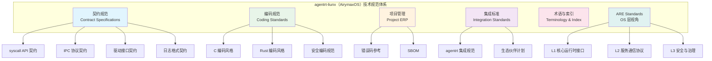
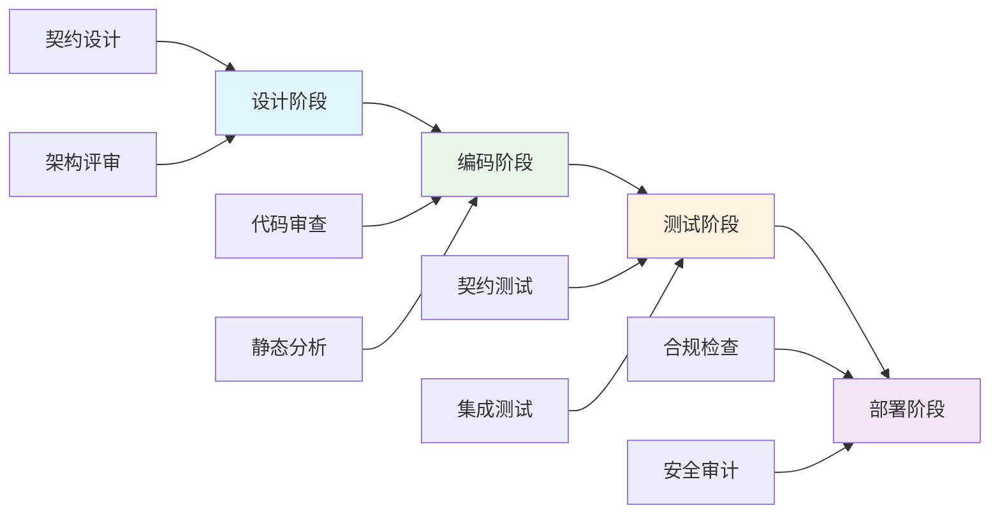

Copyright (c) 2025-2026 SPHARX Ltd. All Rights Reserved.
"From data intelligence emerges."

---
copyright: "Copyright (c) 2025-2026 SPHARX Ltd. All Rights Reserved."
slogan: "From data intelligence emerges."
title: "agentrt-liunx 技术规范体系"
version: "Doc V0.1.1"
last_updated: "2026-07-07"
status: "draft"
review_due: "2026-08-31"
theoretical_basis: "体系并行论、五维正交24原则、Thinkdual 双思考系统、IRON-9 v2 同源且部分代码共享、ARE Standards 开放标准体系"
target_audience: "OS 内核开发者/架构师/安全专家/驱动开发者"
prerequisites: "了解 Linux 内核开发流程，熟悉 agentrt-liunx（AirymaxOS）架构概览"
estimated_reading_time: "1.5小时"
core_concepts: "契约规范, 编码标准, 项目管理, 集成标准, 开放标准, 术语统一, 安全合规, OS 内核工程"
---

# agentrt-liunx 技术规范体系

**最新**: 2026-07-07
**状态**: 草案（文档体系完成）
**路径**: OpenAirymax/docs/AirymaxAgentOS/Capital_Specifications/README.md

## 文档信息卡
- **目标读者**: OS 内核开发者/架构师/安全专家/驱动开发者
- **前置知识**: 了解 Linux 内核开发流程，熟悉 agentrt-liunx（AirymaxOS）架构概览
- **预计阅读时间**: 1.5小时
- **核心概念**: 契约规范, 编码标准, 项目管理, 集成标准, 术语统一, 安全合规, OS 内核工程
- **文档状态**: 草案（v0.1.1 文档体系完成）
- **复杂度标识**: 高级

## 概述

agentrt-liunx（AirymaxOS）技术规范体系是 agentrt-liunx OS 发行版开发、测试、部署和维护的权威标准。本规范体系基于体系并行论（Multibody Cybernetic Intelligent System）、系统工程论和 Thinkdual 双思考系统，针对 OS 层（内核态 + 用户态服务）的特殊工程场景，确保系统的稳定性、安全性和可演进性。

agentrt-liunx（AirymaxOS）与 agentrt（AirymaxAgentRT）遵循 **IRON-9 v2"同源且部分代码共享"** 原则：[SC] 共享契约层完全共享代码（`include/airymax/` 头文件库），[SS] 语义同源层 API 签名相同但实现独立，[IND] 完全独立层各自独立。本规范体系为 [SS] 和 [IND] 层提供 OS 专属的工程规范，同时与 [SC] 层契约代码保持双向兼容。

### 规范体系结构



---

## 契约规范 (Contract Specifications)

契约规范定义了 agentrt-liunx（AirymaxOS）各组件间的交互协议，确保系统的可组合性和可替换性。与 agentrt 的契约规范相比，agentrt-liunx 的契约规范额外覆盖 OS 层特有的内核接口、驱动模型和 IPC 传输层。

### 1. syscall API 契约

| 文档 | 版本 | 状态 | 描述 |
|------|------|------|------|
| [syscall_api_contract.md](agentrt_contract/syscall_api_contract.md) | v0.1.1 | 草案 | agentrt-liunx 系统调用接口定义、参数、返回值、所有权语义 |

**核心要求**:
- 所有系统调用必须文档化，参数方向必须标注 `[in]`/`[out]`/`[in,out]`
- 参数验证必须严格，错误码对齐 `agentrt_errno.h`（IRON-9 v2 [SC] 共享契约层）
- 错误码统一使用 `AGENTRT_E*` 前缀，负值返回
- 系统调用编号必须唯一且不可重用

**syscall 七大功能域**:
agentrt-liunx（AirymaxOS）系统调用覆盖七大功能域，遵循五维正交24原则中 K-2（接口契约化）和 K-1（内核极简）：
- Agent 管理域
- Task 调度域
- Skill 执行域
- Session 会话域
- Sandbox 沙箱域
- Memory 记忆域
- Telemetry 遥测域

### 2. IPC 协议契约

| 文档 | 版本 | 状态 | 描述 |
|------|------|------|------|
| [ipc_protocol_contract.md](agentrt_contract/ipc_protocol_contract.md) | v0.1.1 | 草案 | 基于 io_uring 的 IPC 消息传递协议、128B 消息头格式 |

**核心要求**:
- 统一消息头 128 字节（magic/version/trace_id/correlation_id/source/target）
- magic=0x41524531 ("ARE1") 校验，与 agentrt 同源（IRON-9 v2 [SS] 语义同源层）
- 5 种 payload 协议：JSON-RPC/MCP/A2A/OpenAI/Custom
- 消息必须包含 TraceID 贯穿全链路

**与 agentrt 的 IPC 关系**:
agentrt 的 AgentsIPC 为应用级实现（用户态消息队列），agentrt-liunx（AirymaxOS）IPC 为 OS 级实现（基于 io_uring + 内核固定 OP），二者在分层上独立，遵循 IRON-9 v2 [SS] 语义同源层——API 签名相同，实现独立。

### 3. 驱动接口契约

| 文档 | 版本 | 状态 | 描述 |
|------|------|------|------|
| [driver_interface_contract.md](agentrt_contract/driver_interface_contract.md) | v0.1.1 | 草案 | agentrt-liunx 驱动模型接口规范、设备模型、平台驱动 |

**核心要求**:
- 驱动接口遵循 Linux 6.6 内核基线设备模型
- 用户态驱动（VFIO/libvfio）与内核态驱动接口分离
- platform 总线语义与上游一致，SoC 设备适配扩展在用户态
- 遵循 IRON-9 v2 [IND] 完全独立层——agentrt-liunx 专属，agentrt 无对应

### 4. 日志格式契约

| 文档 | 版本 | 状态 | 描述 |
|------|------|------|------|
| [logging_contract.md](agentrt_contract/logging_contract.md) | v0.1.1 | 草案 | 结构化日志格式、字段定义、级别控制、内核态与用户态日志统一 |

**核心要求**:
- 日志必须结构化 (JSON)
- 必须包含 TraceID 贯穿
- 日志级别必须可配置
- 内核态日志（`printk`）与用户态日志（journald）统一格式
- 敏感信息必须脱敏

---

## 编码规范 (Coding Standards)

编码规范确保 agentrt-liunx（AirymaxOS）代码质量、可维护性和安全性。OS 层编码规范遵循五维正交24原则中 E-5（命名语义化）、E-1（安全内生）和 E-7（文档即代码）。

### 1. C 编码风格

| 文档 | 版本 | 状态 | 描述 |
|------|------|------|------|
| [C_coding_style_standard.md](coding_standard/C_coding_style_standard.md) | v0.1.1 | 草案 | C 语言编码风格——继承 Linux 内核编码风格，适配 agentrt-liunx 命名空间 |

**核心要求**:
- 遵循 Linux 内核编码风格（`Documentation/process/coding-style.rst`）
- agentrt-liunx 专属代码使用 `agentrt_` 前缀命名空间
- 内核态代码使用 `agentrt_core_*` 前缀，用户态守护进程使用 `*_d` 后缀
- goto 集中错误处理（继承 Linux 内核工程思想）
- 8 字符缩进，80 列行宽限制

### 2. Rust 编码风格

| 文档 | 版本 | 状态 | 描述 |
|------|------|------|------|
| [Rust_coding_style_standard.md](coding_standard/Rust_coding_style_standard.md) | v0.1.1 | 草案 | Rust 编码风格——agentrt-liunx 内核安全模块 Rust 编码规范 |

**核心要求**:
- 遵循 Rust 官方编码风格（`rustfmt`）
- 内核 Rust 模块仅用于安全关键路径（capability 系统、LSM 钩子）
- 所有权和生命周期必须清晰标注
- 禁止 `unsafe` 块绕过 capability 检查

### 3. 安全编码规范

| 文档 | 版本 | 状态 | 描述 |
|------|------|------|------|
| [Security_design_standard.md](coding_standard/Security_design_standard.md) | v0.1.1 | 草案 | agentrt-liunx OS 层安全设计原则、威胁建模、内核安全编码 |
| [C_Cpp_secure_coding_standard.md](coding_standard/C_Cpp_secure_coding_standard.md) | v0.1.1 | 草案 | C 安全编码规范——内核态与用户态安全编码要求 |
| [Rust_secure_coding_standard.md](coding_standard/Rust_secure_coding_standard.md) | v0.1.1 | 草案 | Rust 安全编码规范——内核安全模块内存安全要求 |

**核心原则**:
- 安全内生（Security by Design）：五维正交24原则 E-1——安全不是附加层，而是内嵌于系统设计的每一个环节
- 输入验证：所有内核接口必须验证用户态传入参数
- 内存安全：禁止使用不安全函数（`malloc`/`free`/`strcpy`/`sprintf`/`gets` 等），使用安全宏体系
- 访问控制：capability 令牌不可伪造，最小权限原则

---

## 项目管理 (Project ERP)

项目管理规范确保 agentrt-liunx（AirymaxOS）项目的可维护性和可追溯性。

### 1. 错误码参考

| 文档 | 版本 | 状态 | 描述 |
|------|------|------|------|
| [error_code_reference.md](project_erp/error_code_reference.md) | v0.1.1 | 草案 | agentrt-liunx 统一错误码体系、分类、含义 |

**核心要求**:
- 错误码对齐 `agentrt_errno.h`，与 agentrt 同源且部分代码共享（IRON-9 v2 [SC] 共享契约层）
- 错误码必须唯一
- 错误描述必须清晰
- 错误传播必须可追溯

**双错误码体系**:
agentrt-liunx（AirymaxOS）采用双错误码体系：
- **C 负整数体系（首要）**: 定义于 `include/airymax/error.h`（[SC] 共享契约层），C 内核和 daemon 层必须使用（如 `AGENTRT_EINVAL=-2`）
- **SDK 十六进制体系（次要）**: 定义于 `error_code_reference.md`，SDK 和外部接口使用（如 `0x0000-0x7FFF` 分段）

### 2. SBOM

| 文档 | 版本 | 状态 | 描述 |
|------|------|------|------|
| [SBOM.md](project_erp/SBOM.md) | v0.1.1 | 草案 | agentrt-liunx 软件组成分析、安全漏洞扫描、许可证合规 |

**核心要求**:
- SBOM 必须自动生成
- 漏洞必须定期扫描
- 许可证必须合规（AGPL v3 + Apache 2.0 双许可证）
- 内核组件与用户态组件分别列出

---

## 集成标准 (Integration Standards)

集成标准定义了 agentrt-liunx（AirymaxOS）与 agentrt 及外部生态的交互规范。

### 1. agentrt 集成规范

| 文档 | 版本 | 状态 | 描述 |
|------|------|------|------|
| [agentrt_integration.md](integration_standards/agentrt_integration.md) | v0.1.1 | 草案 | agentrt 在 agentrt-liunx（AirymaxOS）上的运行规范、同源适配、能力映射 |

**核心要求**:
- agentrt 在 agentrt-liunx（AirymaxOS）上作为普通用户态应用运行（标准 libc/POSIX）
- 可选使用 agentrt-liunx OS 原生能力（SCHED_AGENT 调度类、io_uring IPC 加速）
- 遵循 IRON-9 v2 [SC] 共享契约层，通过 `include/airymax/` 头文件库实现互操作
- 无需适配层——同源设计保证天然契合

### 2. 生态伙伴计划

| 文档 | 版本 | 状态 | 描述 |
|------|------|------|------|
| [ecosystem_partnership.md](integration_standards/ecosystem_partnership.md) | v0.1.1 | 草案 | agentrt-liunx 生态伙伴计划、合作模式、硬件兼容性认证 |

---

## 开放标准 (ARE Standards — OS 层视角)

开放标准定义 agentrt-liunx（AirymaxOS）遵循的 ARE Standards（Agent Runtime Environment Standards）三层标准接口。agentrt-liunx 作为 OS 发行版实现，为 ARE Standards 提供内核级性能优化和硬件加速支持。**版权归属人：SPHARX Ltd.** | 许可证：AGPL v3 + Apache 2.0 双许可证（SPDX: `AGPL-3.0-or-later OR Apache-2.0`）。

### 标准分层架构

```
┌─────────────────────────────────────────────────┐
│     ARE Standards 三层标准（agentrt-liunx OS 视角）  │
├─────────────────────────────────────────────────┤
│  L3 安全与治理                                    │
│  • capability 系统（seL4 风格，内核原生）             │
│  • LSM 钩子（254 ID，SELinux 集成）                │
│  • 审计哈希链（SHA-256 不可篡改）                    │
│  • 双许可证体系 + SBOM                            │
├─────────────────────────────────────────────────┤
│  L2 服务通信协议                                  │
│  • IPC 消息头（128 字节，内核原生支持）               │
│  • io_uring 零拷贝消息传递                         │
│  • JSON-RPC 命名空间 + trace_id 贯穿              │
├─────────────────────────────────────────────────┤
│  L1 核心运行时接口                                │
│  • SCHED_AGENT eBPF 用户态调度器                   │
│  • io_uring 异步 I/O（IPC/Mem/Task/Time/Sync）     │
│  • 微核心原语（内核态 + 用户态服务）                  │
└─────────────────────────────────────────────────┘
```

### 1. ARE Standards 总览

| 文档 | 版本 | 状态 | 描述 |
|------|------|------|------|
| [are_standards/README.md](are_standards/README.md) | v0.1.1 | 草案 | ARE Standards 三层标准总览、agentrt-liunx OS 层实现路径 |
| [are_standards/L1_runtime_interface.md](are_standards/L1_runtime_interface.md) | v0.1.1 | 草案 | L1 核心运行时接口规范——agentrt-liunx 内核级实现 |
| [are_standards/L2_service_protocol.md](are_standards/L2_service_protocol.md) | v0.1.1 | 草案 | L2 服务通信协议规范——agentrt-liunx io_uring IPC 实现 |
| [are_standards/L3_security_governance.md](are_standards/L3_security_governance.md) | v0.1.1 | 草案 | L3 安全与治理规范——agentrt-liunx capability + LSM 实现 |

**核心要求**:
- 三层标准接口使第三方可独立实现兼容 Agent 运行时
- agentrt-liunx（AirymaxOS）作为 OS 发行版提供参考实现
- 标准化路线：草案（v0.1.1）→ 试用（v0.2.0）→ 候选（v0.3.0）→ 正式（v1.0.0）

### 2. SDK 标准规范

| 文档 | 版本 | 状态 | 描述 |
|------|------|------|------|
| [sdk_standard/README.md](sdk_standard/README.md) | v0.1.1 | 草案 | agentrt-liunx SDK 双层 API（Manager + 嵌套资源）+ 四语言 SDK |

**核心要求**:
- 双层 API：Manager 层（向后兼容）+ 嵌套资源 API 层
- 四语言 SDK（Rust/Python/Go/TypeScript）同步实现
- 显式覆盖 CognitionClient/SafetyClient/ToolClient/ChatClient

### 3. IPC Bus 消息头规范

| 文档 | 版本 | 状态 | 描述 |
|------|------|------|------|
| [ipc_standard/README.md](ipc_standard/README.md) | v0.1.1 | 草案 | `are_ipc_message_header_t` 128 字节统一消息头 + agentrt-liunx io_uring 内核原生支持 |

**核心要求**:
- 统一消息头 128 字节（magic/version/trace_id/correlation_id/source/target）
- magic=0x41524531 ("ARE1") 校验
- agentrt-liunx（AirymaxOS）内核原生支持 128 字节消息头，与 agentrt 同源（IRON-9 v2 [SS] 语义同源层）

### 4. 服务发现规范

| 文档 | 版本 | 状态 | 描述 |
|------|------|------|------|
| [service_discovery_standard/README.md](service_discovery_standard/README.md) | v0.1.1 | 草案 | 多后端适配器架构（shm/dns-sd/consul/etcd/k8s）+ agentrt-liunx systemd 集成 |

### 5. JSON-RPC API 规范

| 文档 | 版本 | 状态 | 描述 |
|------|------|------|------|
| [rpc_api_standard/README.md](rpc_api_standard/README.md) | v0.1.1 | 草案 | 强制 `<daemon>.<method>` 命名空间 + 12 daemon 方法清单 |

**核心要求**:
- 强制命名空间格式 `<daemon>.<method>`
- 12 个 daemon 命名空间：`llm.`/`tool.`/`sched.`/`mem.`/`agent.`/`a2a.`/`mcp.`/`hook.`/`plugin.`/`cupolas.`/`monit.`/`market.`

### 6. 错误码规范

| 文档 | 版本 | 状态 | 描述 |
|------|------|------|------|
| [error_code_standard/README.md](error_code_standard/README.md) | v0.1.1 | 草案 | 统一错误码分段 + 权威源唯一性（`include/airymax/error.h`） |

**核心要求**:
- 权威源唯一：`include/airymax/error.h`（[SC] 共享契约层）为唯一定义源
- 分段规范：通用 -1~-99 / 系统 -100~-199 / 内核 -200~-299 / 服务 -300~-399 / LLM -400~-499 / 执行 -500~-599 / 记忆 -600~-699 / 安全 -700~-799 / 协议 -800~-899

---

## 术语与索引 (Terminology & Index)

### 1. 统一术语表

| 文档 | 版本 | 状态 | 描述 |
|------|------|------|------|
| [TERMINOLOGY.md](TERMINOLOGY.md) | v0.1.1 | 草案 | agentrt-liunx 统一术语定义、交叉引用、标准化名称映射总表 |

**核心要求**:
- 术语定义必须准确，核心表述使用 "agentrt-liunx（AirymaxOS）" 形式
- 交叉引用必须完整
- 版本必须同步更新
- 当不同文档间存在术语冲突时，以本表为准

### 2. 术语索引

| 文档 | 版本 | 状态 | 描述 |
|------|------|------|------|
| [glossary_index.md](agentrt_contract/glossary_index.md) | v0.1.1 | 草案 | agentrt-liunx 契约术语索引、快速查找 |

---

## 规范实施与验证

### 1. 规范实施流程



### 2. 验证工具

```bash
# 契约验证
python scripts/validate_contract.py --contract syscall_contract.json

# 代码规范检查
python scripts/lint_code.py --lang c --path airymaxos-kernel/
python scripts/lint_code.py --lang rust --path airymaxos-kernel/

# 安全扫描
python scripts/security_scan.py --sbom sbom.json

# 文档验证
python scripts/validate_docs.py --check-links

# IRON-9 v2 契约层一致性检查
python scripts/check_iron9_consistency.py --include-airymax
```

### 3. 合规检查清单

**契约合规**:
- [ ] 所有 syscall 接口是否实现契约定义？
- [ ] 错误处理是否遵循 agentrt_errno.h 规范？
- [ ] IPC 消息头是否包含 magic=0x41524531 校验？
- [ ] 五维正交24原则 K-2（接口契约化）是否满足？

**编码合规**:
- [ ] 代码是否通过静态分析（Clang-Tidy + Coverity）？
- [ ] 安全漏洞是否修复？
- [ ] 许可证是否合规（AGPL v3 + Apache 2.0）？
- [ ] 五维正交24原则 E-1（安全内生）是否满足？

**IRON-9 v2 合规**:
- [ ] [SC] 共享契约层代码是否与 agentrt 同步？
- [ ] [SS] 语义同源层 API 签名是否一致？
- [ ] [IND] 完全独立层是否清晰边界？

**文档合规**:
- [ ] 术语使用是否一致（核心表述使用 "agentrt-liunx（AirymaxOS）"）？
- [ ] 交叉引用是否有效？
- [ ] 版本信息是否准确？

---

## 规范演进机制

### 1. 版本管理

规范版本与 agentrt-liunx（AirymaxOS）主版本同步：

- **MAJOR 版本**: 不兼容的规范变更（如内核基线升级）
- **MINOR 版本**: 向后兼容的功能新增（如新 syscall 编号）
- **PATCH 版本**: 问题修复和澄清

### 2. 变更流程

1. **变更提案**: 提交规范变更请求（RFC）
2. **影响评估**: 评估变更对 agentrt 和 agentrt-liunx（AirymaxOS）的影响
3. **IRON-9 v2 兼容性检查**: 检查 [SC]/[SS]/[IND] 三层兼容性
4. **架构评审**: 架构委员会评审变更
5. **试点实施**: 在小范围试点新规范
6. **全面推广**: 试点成功后全面推广

### 3. 兼容性保证

| 变更类型 | 兼容性保证 | 通知要求 | IRON-9 v2 影响 |
|---------|-----------|---------|----------------|
| **新增 syscall** | 完全兼容 | 提前 1 个月通知 | [SC] 层需同步新增编号 |
| **IPC 消息头扩展** | 完全兼容 | 提前 2 周通知 | [SS] 层需双向兼容 |
| **内核行为变更** | 可能不兼容 | 提前 3 个月通知 | [IND] 层独立评估 |
| **syscall 废弃** | 不兼容 | 提前 6 个月通知 | [SC] 层需标记 `@deprecated` |

---

## 安全与合规

### 1. 安全要求

- **输入验证**: 所有内核接口必须验证用户态传入参数
- **输出编码**: 所有输出必须适当编码
- **错误处理**: 错误信息不得泄露内核敏感数据
- **访问控制**: 必须实现最小权限原则（capability + LSM 双重保护）
- **安全内生**: 遵循五维正交24原则 E-1——安全机制内嵌于系统设计的每一个环节

### 2. 合规要求

- **许可证合规**: 所有组件许可证必须兼容（AGPL v3 + Apache 2.0 双许可证）
- **数据保护**: 必须遵守数据保护法规
- **审计追踪**: 所有操作必须可审计（SHA-256 哈希链不可篡改）
- **安全更新**: 必须定期应用安全更新
- **内核基线合规**: 所有文档禁用未来内核特性误引（IRON-10 / BAN-361）

### 3. 安全审查

```bash
# 定期安全审查
python scripts/security_review.py --full

# 依赖漏洞扫描
python scripts/dependency_scan.py --update

# 许可证合规检查
python scripts/license_compliance.py --report

# 内核安全模块审计
python scripts/kernel_security_audit.py --lsm --capability
```

---

## 贡献规范

### 1. 贡献流程

1. **发现问题**: 识别规范不完善或错误之处
2. **提交提案**: 提交规范变更提案（RFC）
3. **讨论评审**: 参与社区讨论和架构评审
4. **IRON-9 v2 验证**: 验证 [SC]/[SS]/[IND] 三层兼容性
5. **实现验证**: 实现变更并通过 CI 双向校验
6. **文档更新**: 更新相关文档

### 2. 提案模板

```markdown
# 规范变更提案

## 问题描述
[描述需要解决的问题]

## 变更内容
[描述具体的规范变更]

## IRON-9 v2 影响分析
- [SC] 共享契约层影响：[描述]
- [SS] 语义同源层影响：[描述]
- [IND] 完全独立层影响：[描述]

## 兼容性考虑
- 对现有系统的影响
- 迁移路径
- agentrt 互操作性影响

## 实施计划
- 时间安排
- 资源需求
- 测试方案

## 参考资料
- 相关规范文档
- 技术背景
- 类似案例
```

### 3. 评审标准

- **技术正确性**: 变更是否技术正确？
- **实用性**: 变更是否解决实际问题？
- **兼容性**: 变更是否保持向后兼容？
- **IRON-9 v2 合规**: 变更是否符合 [SC]/[SS]/[IND] 三层约束？
- **可维护性**: 变更是否易于维护？

---

## 支持与反馈

### 1. 问题报告

- **GitHub Issues**: [agentrt-liunx 规范问题报告](https://github.com/SpharxTeam/AgentRT/issues)
- **邮件列表**: specifications@agentos.io
- **Discord**: #agentrt-liunx-specifications 频道

### 2. 技术支持

- **规范解释**: standards@agentos.io
- **合规咨询**: compliance@agentos.io
- **安全报告**: security@agentos.io

### 3. 培训资源

- **规范培训**: 每月一次的 agentrt-liunx 规范培训会议
- **在线课程**: agentrt-liunx（AirymaxOS）规范体系在线课程
- **认证考试**: agentrt-liunx 规范认证考试

---

## 相关文档

- [agentrt-liunx 架构设计原则](../10-architecture/README.md)
- [五维正交24原则与 agentrt-liunx（AirymaxOS）落地映射](../10-architecture/02-five-dimensional-principles.md)
- [agentrt-liunx 工程标准规范](../50-engineering-standards/README.md)
- [术语表](TERMINOLOGY.md)
- [agentrt 技术规范](../../AirymaxAgentRT/Capital_Specifications/README.md)
- [ARE Standards 开放标准体系](../../AirymaxAgentRT/Capital_Specifications/are_standards/README.md)

---

## 版本历史

| 版本 | 日期 | 作者 | 变更说明 |
|------|------|------|----------|
| Doc V0.1.1 | 2026-07-07 | SPHARX Ltd. | 初始版本，建立 agentrt-liunx（AirymaxOS）技术规范体系框架；覆盖契约规范/编码规范/项目管理/集成标准/ARE Standards/术语与索引六大章节；引入 IRON-9 v2 [SC]/[SS]/[IND] 三层标注；引用五维正交24原则 |

---

**最后更新**: 2026-07-07
**维护者**: SPHARX Ltd.

---

(C) 2025-2026 SPHARX Ltd. All Rights Reserved.
*"From data intelligence emerges."*