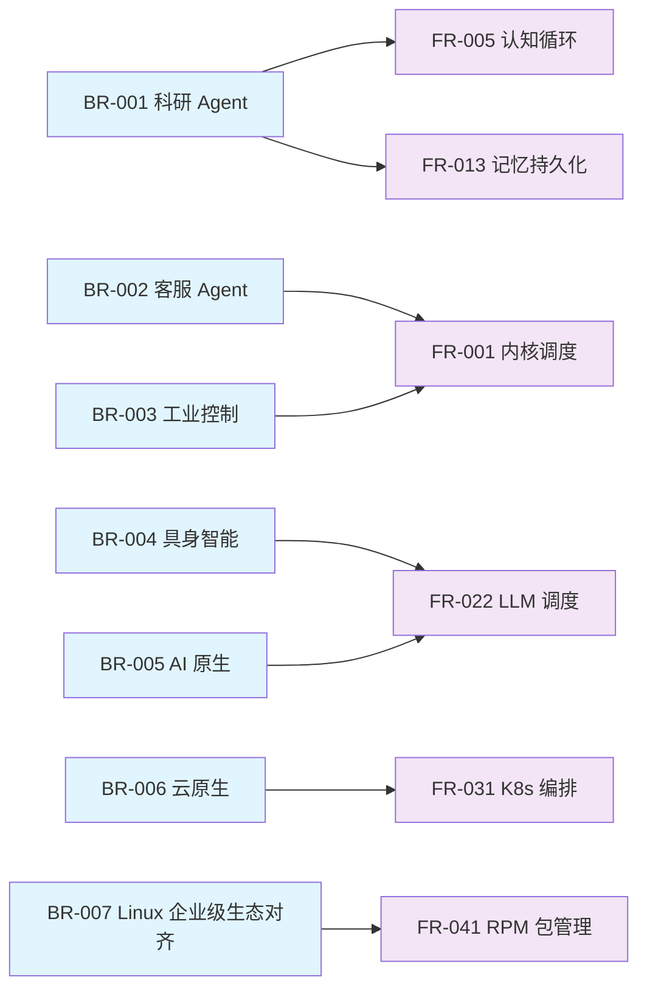

Copyright (c) 2025-2026 SPHARX Ltd. All Rights Reserved.

# 业务需求分析
> **文档定位**：agentrt-linux（AirymaxOS） 业务需求（Business Requirements）的详细分析，回答"agentrt-linux 为谁解决什么问题、带来什么价值"。\
> **文档版本**：0.1.1\
> **最后更新**： 2026-07-21\
> **上级文档**：[agentrt-linux 设计文档](README.md)

---

## 1. 概述

本文档定义 agentrt-linux 的业务需求（BR，Business Requirements），覆盖四大业务来源：

1. **Agent 工作负载需求**：面向各行各业的各类 Agent 应用——科研教育、金融服务、医疗健康、工业制造、零售电商、物流交通、能源电力、智慧城市、农业科技、媒体内容、法律合规、软件开发、政务服务、具身智能等领域 Agent 的真实场景需求。agentrt-linux 并非仅支撑某一两类 Agent，而是作为通用 AI Agent 运行底座，覆盖全行业 Agent 应用场景。
2. **AI 原生需求**：参考 Linux 6.6 内核基线（SP3 增强）/ Linux 7.1（2.x.x 基线，ADR-013）的 AI 原生特性
3. **云原生需求**：K8s、containerd、OCI、CNI 等云原生生态对齐
4. **Linux 企业级生态对齐**：RPM、dnf、systemd、SELinux、国密、多架构支持

业务需求是功能需求（FR）与非功能需求（NFR）的源头，每条 BR 都应能向下追溯到具体的 FR 与 NFR。

---

## 2. Agent 工作负载需求

agentrt-linux 作为通用 AI Agent 运行底座，面向各行各业的 Agent 应用。不同行业的 Agent 工作负载可归纳为**四类核心工作负载模式**（按技术特征分类，而非按行业分类），每类模式对应独特的工作负载特性与系统能力需求。同一个行业可能同时涉及多类工作负载模式（例如金融行业既有高并发交互型客服 Agent，也有长序列知识密集型合规分析 Agent）。

### 2.0 行业应用范围总览

agentrt-linux 支持的 Agent 应用覆盖以下行业领域（持续扩展，不设上限）：

| 行业领域 | 典型 Agent 应用 | 主要工作负载模式 | 对应 BR |
|---------|---------------|----------------|---------|
| 科研教育 | 论文分析、知识图谱、教学辅助、学术翻译 | 模式一（长序列知识密集） | BR-001 |
| 金融服务 | 智能客服、风控分析、合规审查、量化交易辅助 | 模式一 + 模式二 | BR-001/002 |
| 医疗健康 | 辅助诊断、病历分析、药物研发、健康咨询 | 模式一 + 模式二 | BR-001/002 |
| 工业制造 | 智能制造、工业控制、故障诊断、供应链优化 | 模式三（实时控制） | BR-003 |
| 零售电商 | 智能客服、商品推荐、运营分析、内容生成 | 模式二（高并发交互） | BR-002 |
| 物流交通 | 仓储调度、配送规划、交通管理、车队调度 | 模式二 + 模式三 | BR-002/003 |
| 能源电力 | 电网调度、油气勘探、新能源管理、设备监测 | 模式三 + 模式四 | BR-003/004 |
| 智慧城市 | 交通优化、安防监控、市政管理、应急响应 | 模式二 + 模式四 | BR-002/004 |
| 农业科技 | 精准农业、农机控制、病虫害识别、产量预测 | 模式三 + 模式四 | BR-003/004 |
| 媒体内容 | 内容生成、智能推荐、版权审核、视频分析 | 模式一 + 模式二 | BR-001/002 |
| 法律合规 | 合同审查、法规检索、合规检查、风险评估 | 模式一（长序列知识密集） | BR-001 |
| 软件开发 | 代码生成、自动化测试、DevOps 运维、架构分析 | 模式一 + 模式二 | BR-001/002 |
| 政务服务 | 政务咨询、审批辅助、政策解读、舆情分析 | 模式二 + 模式一 | BR-002/001 |
| 具身智能 | 机器人、自动驾驶、无人机、人形机器人 | 模式四（多模态感知） | BR-004 |

> **设计原则**：agentrt-linux 不为某一特定行业定制，而是提供通用的 Agent 运行底座能力（调度、IPC、记忆、认知、安全、云原生），各行业 Agent 通过 agentrt SDK 在用户态构建领域逻辑。底座层行业无关，应用层行业相关。

### 2.1 模式一：长序列知识密集型 Agent（BR-001）

**典型行业场景**：科研教育（论文分析、知识图谱）、法律合规（合同审查、法规检索）、医疗健康（病历分析、药物研发）、媒体内容（内容生成、版权审核）、软件开发（代码生成、架构分析）等。

**场景描述**：此类 Agent 承担长序列、知识密集型任务，包括论文分析、知识图谱构建、跨文献综合推理、合同条款审查、法规一致性检查、病历综合诊断、代码库跨文件理解等。

| 需求维度 | 详细描述 | 性能要求 |
|---|---|---|
| 长序列任务 | 任务 DAG 深度可达 20+ 层，单任务执行时间数小时 | 任务规划延迟 < 100ms，错误回退 < 5s |
| 知识图谱构建 | 实体抽取、关系建模、图存储与查询 | 图节点支持 10M+，查询延迟 < 50ms |
| 论文分析 | PDF 解析、语义向量化、跨论文引用分析 | 文档处理吞吐 > 10 篇/分钟 |
| 跨文献综合 | 多源知识融合、矛盾检测、置信度评估 | 检索召回率 > 95%，准确率 > 90% |

**关键能力需求**：

- 长序列任务的增量规划与回退（对应设计原则 C-2 增量演化）
- 四层记忆卷载以沉淀科研知识（对应设计原则 C-3 记忆卷载）
- 双系统协同处理快慢任务（对应设计原则 C-1 双思考功能）
- 任务 DAG 的持久化与恢复（防止数小时任务因故障丢失）

**驱动需求**：FR-005 认知循环、FR-013 记忆持久化、NFR-R-001 Soak Test、NFR-R-005 故障恢复

### 2.2 模式二：高并发交互型 Agent（BR-002）

**典型行业场景**：零售电商（智能客服、商品推荐）、政务服务（政务咨询、审批辅助）、金融服务（智能客服、风控分析）、物流交通（配送规划、车队调度）、智慧城市（交通优化、应急响应）等。

**场景描述**：此类 Agent 承担高并发对话、情感分析、多轮交互任务，需在大量并发会话中保持低延迟响应。

| 需求维度 | 详细描述 | 性能要求 |
|---|---|---|
| 高并发对话 | 同时处理 10K+ 并发会话，单会话多轮交互 | 单节点并发 > 10K，会话延迟 < 200ms |
| 情感分析 | 实时情感识别，敏感词过滤，意图分类 | 情感分析延迟 < 50ms，准确率 > 92% |
| 多轮交互 | 上下文保持、对话状态机、槽位填充 | 上下文窗口 32K tokens，状态切换 < 10ms |
| 知识库检索 | FAQ 检索、产品文档检索、历史会话检索 | 检索延迟 < 100ms，Top-K 准确率 > 88% |

**关键能力需求**：

- 高并发会话管理（对应 FR-031 K8s 弹性伸缩）
- Token 能效优化以降低推理成本（对应 BR-005 AI 原生）
- 安全的内容过滤与权限控制（对应 NFR-S-003 输入净化）
- 实时情感反馈与策略调整（对应设计原则 S-1 反馈闭环）

**驱动需求**：FR-001 内核调度、FR-031 K8s 编排、NFR-P-002 吞吐、NFR-S-003 净化

### 2.3 模式三：实时控制型 Agent（BR-003）

**典型行业场景**：工业制造（智能制造、PLC 集成）、能源电力（电网调度、设备监测）、物流交通（仓储调度）、农业科技（农机控制、精准农业）等。

**场景描述**：此类 Agent 承担实时控制、故障诊断、设备集成任务，对硬实时性和可靠性有严格要求。

| 需求维度 | 详细描述 | 性能要求 |
|---|---|---|
| 实时控制 | 闭环控制周期毫秒级，硬实时保证 | 控制周期 < 10ms，抖动 < 1ms |
| 故障诊断 | 设备状态监测、异常检测、根因分析 | 异常检测延迟 < 100ms，诊断准确率 > 95% |
| PLC 集成 | Modbus、OPC-UA、EtherCAT 协议支持 | 协议响应 < 5ms，连接数 > 100 |
| 边缘部署 | 资源受限设备部署，离线运行能力 | 内存占用 < 256MB，启动时间 < 10s |

**关键能力需求**：

- 硬实时调度（对应 FR-001 sched_tac + stc_agent）
- 形式化验证保证控制逻辑正确性（对应 NFR-R-003 形式化验证）
- 边缘轻量化部署（对应 FR-043 系统裁剪）
- 故障隔离与快速恢复（对应 NFR-R-004 MTTR < 5min）

**驱动需求**：FR-001 内核调度、FR-008 实时扩展、NFR-P-001 延迟、NFR-R-003 形式化验证

### 2.4 模式四：多模态感知型 Agent（BR-004）

**典型行业场景**：具身智能（人形机器人、协作机器人）、自动驾驶（车辆、无人机）、智慧城市（安防监控、环境感知）、农业科技（病虫害识别、产量预测）、能源电力（设备巡检、故障定位）等。

**场景描述**：此类 Agent 承担传感器融合、运动控制、环境感知任务，参考 Linux 7.1（2.x.x 基线，ADR-013）的 Claw 特性，需处理多模态输入并作出实时响应。

| 需求维度 | 详细描述 | 性能要求 |
|---|---|---|
| 传感器融合 | 视觉、激光雷达、IMU、触觉多源融合 | 融合延迟 < 20ms，数据率 > 1GB/s |
| 运动控制 | 关节级控制、轨迹规划、力反馈 | 控制频率 > 1kHz，精度 < 0.1mm |
| 环境感知 | SLAM、物体识别、场景理解 | 感知延迟 < 50ms，地图更新 < 100ms |
| 实时学习 | 在线强化学习、技能迁移 | 学习收敛 < 10min，迁移成功率 > 80% |

**关键能力需求**：

- 超低延迟感知-决策-控制闭环（对应 NFR-P-001 延迟 < 100ms）
- 异构计算资源调度（GPU/NPU/FPGA，对应 FR-022 LLM 调度）
- 具身智能 Claw 沙箱（对应 BR-005 AI 原生超节点 OS）
- 实时记忆与快速遗忘（对应设计原则 C-4 遗忘机制）

**驱动需求**：FR-001 内核调度、FR-022 LLM 调度、NFR-P-001 延迟、NFR-P-004 Token 能效

---

## 3. AI 原生需求（BR-005）

agentrt-linux 全面参考 Linux 6.6 内核基线（SP3 增强）与 Linux 7.1（2.x.x 基线，ADR-013）的 AI 原生特性，构建 AI 原生操作系统。

### 3.1 认知循环系统（BR-005-01）

**参考来源**：Linux 6.6 内核基线（SP3 增强）认知循环系统

| 需求项 | 详细描述 | 对应子仓 |
|---|---|---|
| AI 循环调度 | 统一管理多模型、多任务的调度循环 | cognition |
| 模型即服务 | 模型自动发现、加载、卸载、版本管理 | cognition |
| 推理加速 | 推理图优化、算子融合、KV-cache 复用 | cognition |
| 模型路由 | 基于任务类型、成本、延迟的智能路由 | cognition |

**核心能力**：

- 统一的模型注册与发现机制
- 基于任务特征的自动模型选择
- 模型热加载与版本切换
- 推理结果的缓存与复用

**驱动需求**：FR-021 模型管理、FR-022 LLM 调度、NFR-P-004 Token 能效

### 3.2 超节点 OS（BR-005-02）

**参考来源**：agentrt-linux 超节点 OS

| 需求项 | 详细描述 | 对应子仓 |
|---|---|---|
| 超节点架构 | 多节点协同的分布式 Agent 运行环境 | cloudnative |
| 节点间通信 | 高速互联（RDMA / NVLink / CXL） | kernel + memory |
| 资源池化 | CPU、GPU、内存、存储的跨节点池化 | memory |
| 任务迁移 | 运行时任务在节点间无缝迁移 | cognition |

**核心能力**：

- 跨节点的统一资源视图
- 低延迟节点间通信（< 10μs）
- 运行时任务迁移（迁移延迟 < 100ms）
- 资源的弹性伸缩与故障转移

**驱动需求**：FR-023 超节点 OS、FR-014 CXL 池化、NFR-P-003 节点通信

### 3.3 Token 能效优化（BR-005-03）

**参考来源**：agentrt-linux Token 能效框架（Kernel-Aware Dynamic Computing）

| 需求项 | 详细描述 | 性能目标 |
|---|---|---|
| Token 吞吐 | 单卡 Token 生成吞吐优化 | 相比基线提升 > 30% |
| Token 能效 | 单位能耗的 Token 产出 | 相比基线提升 > 25% |
| KV-cache 管理 | 智能缓存淘汰与预取 | 缓存命中率 > 90% |
| 批处理优化 | 动态批处理大小调整 | 批处理效率 > 85% |

**核心能力**：

- 内核感知的推理调度（Token 能效框架）
- 动态批处理与连续批处理
- KV-cache 的智能管理
- 能耗感知的任务调度

**驱动需求**：FR-022 LLM 调度、NFR-P-004 Token 能效

### 3.4 具身智能 Claw（BR-005-04）

**参考来源**：Linux 7.1（2.x.x 基线，ADR-013）具身智能 Claw

| 需求项 | 详细描述 | 对应子仓 |
|---|---|---|
| Claw 沙箱 | 具身智能 Agent 的隔离运行环境 | cognition |
| 传感器接入 | 标准化的传感器数据接入接口 | cognition |
| 运动控制 | 标准化的运动控制接口 | cognition |
| 仿真集成 | 与仿真器（Isaac Sim / Gazebo）的集成 | cognition |

**核心能力**：

- 具身智能 Agent 的安全沙箱
- 标准化的传感-决策-控制接口
- 仿真-现实迁移（Sim2Real）支持
- 实时安全监控与紧急停止

**驱动需求**：FR-024 Claw 沙箱、FR-025 传感器接入、NFR-S-004 沙箱隔离

---

## 4. 云原生需求（BR-006）

agentrt-linux 全面支持云原生生态，对齐 Kubernetes、containerd、OCI 等标准。

### 4.1 K8s 容器编排（BR-006-01）

| 需求项 | 详细描述 | 对应子仓 |
|---|---|---|
| K8s 兼容 | 完整兼容上游 Kubernetes API | cloudnative |
| CRD 扩展 | Agent 自定义资源定义（AgentTask、AgentMemory） | cloudnative |
| 调度器扩展 | 自定义调度器（基于 Agent 负载特征） | cloudnative |
| Operator 模式 | Agent 生命周期管理的 Operator | cloudnative |

**核心能力**：

- 完整的 K8s API 兼容性（v1.30+）
- Agent 专用的 CRD 扩展
- 基于sched_tac 的 K8s 调度器集成
- Agent 工作负载的自动伸缩

**驱动需求**：FR-031 K8s CRD、FR-032 调度器扩展

### 4.2 containerd 容器运行时（BR-006-02）

| 需求项 | 详细描述 | 对应子仓 |
|---|---|---|
| containerd 兼容 | 完整兼容上游 containerd | cloudnative |
| Agent shim | Agent 专用的容器运行时 shim | cloudnative |
| 镜像管理 | 镜像拉取、缓存、分发 | cloudnative |
| 快照管理 | 增量快照、快照回滚 | cloudnative |

**核心能力**：

- containerd 1.7+ 完整兼容
- Agent 专用 shim（支持 Wasm 3.0 运行时）
- 镜像的分层缓存与 P2P 分发
- 快照的增量管理与快速回滚

**驱动需求**：FR-033 containerd shim、FR-034 镜像管理

### 4.3 OCI 镜像规范（BR-006-03）

| 需求项 | 详细描述 | 对应子仓 |
|---|---|---|
| OCI 镜像 | 完整兼容 OCI Image Spec | cloudnative |
| OCI 运行时 | 完整兼容 OCI Runtime Spec | cloudnative |
| OCI 分发 | 完整兼容 OCI Distribution Spec | cloudnative |
| 镜像签名 | 镜像的数字签名与验证 | security + cloudnative |

**核心能力**：

- OCI v1.1 规范完整兼容
- 镜像的 cosign 签名与验证
- 镜像漏洞扫描
- 镜像的跨架构支持

**驱动需求**：FR-035 OCI 兼容、NFR-S-005 镜像签名

### 4.4 CNI 网络插件（BR-006-04）

| 需求项 | 详细描述 | 对应子仓 |
|---|---|---|
| CNI 兼容 | 完整兼容 CNI 1.1 规范 | cloudnative |
| 网络模型 | 支持 Calico、Cilium、Flannel | cloudnative |
| Service Mesh | 支持 Istio、Linkerd | cloudnative |
| 网络策略 | 网络隔离与流量控制 | security + cloudnative |

**核心能力**：

- CNI 1.1 规范完整兼容
- 基于 eBPF 的高性能网络（Cilium）
- Service Mesh 集成
- 网络安全策略

**驱动需求**：FR-036 CNI 网络、NFR-S-006 网络安全

### 4.5 微服务架构（BR-006-05）

| 需求项 | 详细描述 | 对应子仓 |
|---|---|---|
| 服务发现 | 服务注册、发现、健康检查 | cloudnative |
| 配置管理 | 集中化配置管理与热更新 | cloudnative |
| 熔断降级 | 服务熔断、降级、限流 | cloudnative |
| 链路追踪 | 分布式链路追踪与依赖分析 | cloudnative |

**核心能力**：

- 服务注册与发现（etcd / Consul）
- 配置中心与热更新
- 熔断降级与限流
- 全链路追踪（OpenTelemetry）

**驱动需求**：FR-037 微服务、NFR-O-003 链路追踪

---

## 5. 与 Linux 企业级生态对齐（BR-007）

agentrt-linux 全面参考 Linux 企业级生态标准，确保与企业级 Linux 生态的兼容性。

### 5.1 RPM 包格式兼容（BR-007-01）

| 需求项 | 详细描述 | 对应子仓 |
|---|---|---|
| RPM 格式 | 完整兼容 RPM 4.x 包格式 | system |
| SPEC 文件 | 兼容企业级 Linux 生态的 SPEC 文件规范 | system |
| 软件源 | 兼容企业级 Linux 生态软件源格式 | system |
| 包签名 | RPM 包的 GPG 签名与验证 | security + system |

**核心能力**：

- RPM 4.x 包格式完整兼容
- 企业级 Linux 生态 SPEC 文件可直接构建
- 软件源的兼容与镜像
- GPG 签名验证

**驱动需求**：FR-041 RPM 兼容、NFR-C-001 RPM 兼容

### 5.2 dnf 包管理器（BR-007-02）

| 需求项 | 详细描述 | 对应子仓 |
|---|---|---|
| dnf 兼容 | 完整兼容 dnf 4.x | system |
| 仓库管理 | 仓库的添加、删除、优先级 | system |
| 依赖解析 | RPM 依赖关系的自动解析 | system |
| 事务管理 | 安装、升级、回滚的事务管理 | system |

**核心能力**：

- dnf 4.x 完整兼容
- 多仓库优先级管理
- 依赖关系的自动解析与冲突解决
- 事务的原子性与回滚能力

**驱动需求**：FR-042 dnf 兼容、NFR-C-002 dnf 兼容

### 5.3 systemd 服务管理（BR-007-03）

| 需求项 | 详细描述 | 对应子仓 |
|---|---|---|
| systemd 兼容 | 完整兼容 systemd 255+ | services |
| unit 文件 | 兼容 systemd unit 文件格式 | services |
| 服务编排 | 服务的依赖、顺序、并行启动 | services |
| 日志管理 | journald 结构化日志 | services |

**核心能力**：

- systemd 255+ 完整兼容
- unit 文件的完整支持
- 服务编排与依赖管理
- journald 结构化日志

**驱动需求**：FR-002 systemd 集成、NFR-C-003 systemd 兼容

### 5.4 SELinux 安全模块（BR-007-04）

| 需求项 | 详细描述 | 对应子仓 |
|---|---|---|
| SELinux 兼容 | 完整兼容 SELinux 策略 | security |
| 策略管理 | SELinux 策略的加载与切换 | security |
| 上下文管理 | 文件、进程的安全上下文 | security |
| 审计日志 | SELinux 拒绝事件的审计 | security |

**核心能力**：

- SELinux 策略完整兼容
- enforcing / permissive / disabled 三种模式
- 安全上下文的自动管理
- AVC 审计日志

**驱动需求**：FR-015 SELinux 集成、NFR-C-004 SELinux 兼容

### 5.5 国密算法支持（BR-007-05）

| 算法 | 用途 | 对应子仓 |
|---|---|---|
| SM2 | 非对称加密（数字签名、密钥交换） | security |
| SM3 | 哈希算法（完整性校验、数字签名） | security |
| SM4 | 对称加密（数据加密、通信加密） | security |
| SM9 | 标识加密（身份认证） | security |

**核心能力**：

- 国密算法的内核态加速
- TLS 1.3 国密套件支持
- 国密签名的 RPM 包验证
- 国密的证书体系

**驱动需求**：FR-016 国密算法、NFR-S-002 国密支持

### 5.6 架构支持（BR-007-06）

| 架构 | 状态 | 优先级 | 典型硬件 |
|---|---|---|---|
| x86_64 | 主力支持 | P0 | Intel / AMD |
| ARM64 | 主力支持 | P0 | 鲲鹏 920 / 飞腾 2000+ |
| RISC-V | 实验性支持 | P2 | SiFive U740 |
| LoongArch | 规划支持 | P3 | 龙芯 3A6000 |

**核心能力**：

- x86_64 与 ARM64 的双主力支持
- 鲲鹏与飞腾的深度优化
- RISC-V 的实验性支持
- 跨架构的统一构建

**驱动需求**：FR-044 多架构支持、NFR-C-005 架构兼容

---

## 6. Agent 应用场景矩阵

下表展示 agentrt-linux 的 Agent 应用场景矩阵，将场景、能力需求、性能要求与子仓支持进行交叉映射：

| 场景 | 能力需求 | 性能要求 | 主要子仓支持 | 业务需求 |
|---|---|---|---|---|
| 科研论文分析 | 长序列任务、知识图谱、跨文献综合 | 任务延迟 < 100ms，图谱 10M+ 节点 | cognition + memory + kernel | BR-001 |
| 科研知识图谱 | 实体抽取、关系建模、图查询 | 查询延迟 < 50ms，节点 10M+ | cognition + memory | BR-001 |
| 客服高并发对话 | 10K+ 并发会话、多轮交互 | 会话延迟 < 200ms，并发 10K+ | cloudnative + cognition + kernel | BR-002 |
| 客服情感分析 | 实时情感识别、敏感词过滤 | 分析延迟 < 50ms，准确率 > 92% | cognition + security | BR-002 |
| 工业实时控制 | 硬实时调度、闭环控制 | 控制周期 < 10ms，抖动 < 1ms | kernel + cognition | BR-003 |
| 工业故障诊断 | 设备监测、异常检测、根因分析 | 检测延迟 < 100ms，准确率 > 95% | cognition + memory + security | BR-003 |
| 工业边缘部署 | 资源受限、离线运行 | 内存 < 256MB，启动 < 10s | system + kernel | BR-003 |
| 具身智能感知 | 传感器融合、SLAM、环境理解 | 融合延迟 < 20ms，数据率 > 1GB/s | cognition + kernel | BR-004 |
| 具身智能运动 | 关节控制、轨迹规划、力反馈 | 控制频率 > 1kHz，精度 < 0.1mm | cognition + kernel | BR-004 |
| 具身智能学习 | 在线强化学习、技能迁移 | 收敛 < 10min，迁移成功率 > 80% | cognition + memory | BR-004 |
| AI 认知循环 | 多模型调度、模型即服务 | 模型切换 < 1s，推理加速 > 30% | cognition + memory | BR-005 |
| 超节点协同 | 跨节点协同、资源池化 | 节点通信 < 10μs，迁移 < 100ms | cloudnative + memory + kernel | BR-005 |
| Token 能效优化 | KV-cache 管理、动态批处理 | Token 吞吐 +30%，能效 +25% | cognition + kernel | BR-005 |
| K8s 容器编排 | Agent CRD、自定义调度器 | API 兼容 v1.30+，调度延迟 < 1s | cloudnative | BR-006 |
| containerd 运行时 | Agent shim、镜像管理 | containerd 1.7+，镜像拉取 < 10s | cloudnative | BR-006 |
| OCI 镜像规范 | OCI 兼容、镜像签名 | OCI v1.1，签名验证 < 1s | cloudnative + security | BR-006 |
| 微服务架构 | 服务发现、熔断降级、链路追踪 | 服务发现 < 10ms，追踪开销 < 5% | cloudnative | BR-006 |
| RPM 包管理 | RPM 兼容、dnf 兼容 | RPM 4.x，dnf 4.x | system | BR-007 |
| systemd 服务管理 | systemd 兼容、unit 兼容 | systemd 255+ | services | BR-007 |
| SELinux 安全 | SELinux 兼容、策略管理 | enforcing 模式 | security | BR-007 |
| 国密算法 | SM2/SM3/SM4/SM9 | 内核态加速，TLS 1.3 套件 | security | BR-007 |
| 多架构支持 | x86_64 / ARM64 / RISC-V | 双主力 + 实验性 | kernel + system | BR-007 |

---

## 7. 业务需求优先级

| 优先级 | 业务需求 | 说明 |
|---|---|---|
| P0 | BR-001 科研 Agent | agentrt-linux 的核心场景，验证长序列任务能力 |
| P0 | BR-005 AI 原生 | 区别于通用 OS 的核心差异化能力 |
| P0 | BR-007 Linux 企业级生态对齐 | 生态兼容的基础，确保可用性 |
| P1 | BR-002 客服 Agent | 高并发场景，验证云原生能力 |
| P1 | BR-006 云原生 | 云原生生态对齐，扩展部署场景 |
| P1 | BR-003 工业控制 Agent | 实时性场景，验证硬实时能力 |
| P2 | BR-004 具身智能 Agent | 前沿场景，依赖超节点 OS 与 Claw |

---

## 8. 业务需求验收标准

每条业务需求必须有明确的验收标准，对应设计原则「E-8 可测试性原则」：

| 业务需求 | 验收标准 | 验收方法 |
|---|---|---|
| BR-001 科研 Agent | 20 层 DAG 任务成功执行，知识图谱 10M+ 节点查询 < 50ms | 端到端 UAT 测试 |
| BR-002 客服 Agent | 10K 并发会话延迟 < 200ms，情感分析准确率 > 92% | 负载测试 + 准确率评估 |
| BR-003 工业控制 | 控制周期 < 10ms，抖动 < 1ms，故障诊断准确率 > 95% | 实时性基准测试 |
| BR-004 具身智能 | 感知延迟 < 20ms，控制频率 > 1kHz，迁移成功率 > 80% | Sim2Real 测试 |
| BR-005 AI 原生 | Token 吞吐 +30%，能效 +25%，节点通信 < 10μs | 性能基准测试 |
| BR-006 云原生 | K8s v1.30+ 兼容，containerd 1.7+，OCI v1.1 | 兼容性测试矩阵 |
| BR-007 Linux 企业级生态对齐 | RPM 4.x，dnf 4.x，systemd 255+，SELinux，国密 | agentrt-linux 集成测试框架 |

---

## 9. 业务需求追溯关系

业务需求向下追溯到功能需求（FR）与非功能需求（NFR）：

---

## 10. 相关文档

- [需求分析概览](README.md)：需求分层模型与追溯框架
- [功能需求分析](02-functional-requirements.md)：8 子仓功能矩阵与能力清单
- [非功能需求分析](03-non-functional-requirements.md)：性能、安全、可靠性需求
- [agentrt-linux 总览](../README.md)：agentrt-linux 整体设计
- [Airymax 架构设计原则](../../AirymaxRT/10-architecture/00-architectural-principles.md)：五维正交 24 原则

---

## 11. 文档变更记录

| 版本 | 日期 | 变更内容 | 变更人 |
|---|---|---|---|
| 0.1.1 | 2026-07-06 | 初始版本，定义 7 大业务需求与场景矩阵 | 工程规范委员会 |

---

© 2025-2026 SPHARX Ltd. All Rights Reserved.
"From data intelligence emerges."
