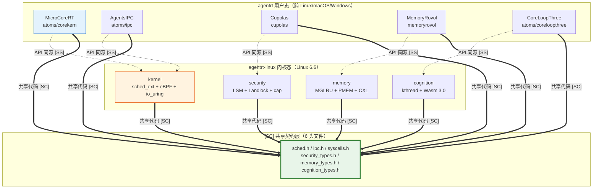

Copyright (c) 2025-2026 SPHARX Ltd. All Rights Reserved.

# agentrt-linux 架构设计
> **文档定位**：agentrt-linux（AirymaxOS）架构设计\
> **文档版本**：0.1.1\
> **最后更新**：2026-07-06\
> **上级文档**：[agentrt-linux 设计文档](README.md)\
> **设计原则**：微内核设计思想 + agentrt-linux 工程基线 + Airymax 同源性

---

## 1. 设计哲学

agentrt-linux 采用三大设计支柱:

### 1.1 微内核设计思想（参考 seL4，ADR-014）

**核心原则**: 最小化特权态代码（Liedtke minimality principle）

> **ADR-014 约束**： 微内核设计思想唯一来源为 seL4，不引入 Zircon / Minix3 / 其他微内核架构，以避免工程思想在哲学和逻辑学层面的多元化冲突。

| 原则 | 含义 | agentrt-linux 落地 |
|---|---|---|
| 最小化内核 | 只保留调度、IPC、地址空间、内存管理 | kernel 仅保留必要内核服务 |
| 服务用户态化 | 文件系统、网络、驱动移到用户态 | services 承载用户态系统服务 |
| 消息传递通信 | 服务之间通过 IPC 通信 | 基于 io_uring 的高性能消息传递 |
| capability 安全 | 不可伪造令牌控制资源访问 | security 实现 capability 系统 |
| 隔离与模块化 | 每个服务独立运行，故障隔离 | 每个 Agent 独立地址空间 |

**参考来源**:
- seL4: 形式化验证的微内核，~10-12 kSLOC，capability-based + MCS（Mixed Criticality System）+ 消息传递 IPC（Endpoint/Notification）

### 1.2 agentrt-linux 工程基线（Linux 6.6 内核基线（1.x.x）/ Linux 7.1（2.x.x，ADR-013））

**核心原则**: 采用 agentrt-linux 自身的模块设计、技术规格、标准和规范

| 维度 | agentrt-linux 工程基线 | agentrt-linux 落地 |
|---|---|---|
| 内核 | Linux 6.6 内核基线 | kernel 基于 Linux 6.6 内核基线 |
| 包管理 | RPM + dnf | system 采用 RPM + dnf |
| 系统服务 | systemd | services 集成 systemd |
| 安全 | SELinux + 国密算法 | security 实现国密支持 |
| 测试 | agentrt-linux 系统级测试套件 | tests-linux 实现集成测试框架 |
| AI 原生 | 认知循环系统、超节点 OS | cognition + cloudnative |
| 架构支持 | x86, ARM, RISC-V, 鲲鹏, 飞腾 | kernel 多架构支持 |
| 社区治理 | SIG（Special Interest Group）| agentrt-linux 按子仓划分 SIG |

### 1.3 Airymax 同源性（与 agentrt 同源）

**核心原则**: agentrt 和 agentrt-linux 共享 Airymax 设计理念

| agentrt 模块 | agentrt-linux 同源模块 | 同源语义 |
|---|---|---|
| atoms/corekern (MicroCoreRT) | kernel (SCHED_AGENT) | 调度语义一致 |
| atoms/ipc + protocols (AgentsIPC) | services (消息传递) | IPC 协议语义一致 |
| cupolas (Cupolas) | security (capability) | 安全模型一致 |
| heapstore + memoryrovol (MemoryRovol) | memory (记忆持久化) | 记忆模型一致 |
| coreloopthree + frameworks (CoreLoopThree) | cognition (kthread) | 认知模型一致 |
| daemons (12 daemons) | services (systemd 集成) | 服务模型一致 |
| gateway + sdk | cloudnative (K8s+OCI) | 网关语义一致 |
| commons | system (基础库) | 工具语义一致 |

## 2. 整体架构

### 2.1 架构分层图

```
┌─────────────────────────────────────────────────────────────────┐
│                    Agent 应用层                                  │
│  ┌─────────────┬─────────────┬─────────────┬─────────────┐     │
│  │ 科研 Agent   │ 客服 Agent   │ 工业控制     │ 具身智能     │     │
│  └──────┬──────┴──────┬──────┴──────┬──────┴──────┬──────┘     │
│         │             │             │             │             │
│  ┌──────▼─────────────▼─────────────▼─────────────▼──────┐    │
│  │ agentrt SDK (Python/Go/Rust/TypeScript)                │    │
│  │ CognitionClient / SafetyClient / ToolClient / ChatClient│   │
│  └──────────────────────┬──────────────────────────────────┘    │
└─────────────────────────┼───────────────────────────────────────┘
                          │ 同源天然适配
┌─────────────────────────▼───────────────────────────────────────┐
│                 agentrt-linux 用户态服务层 (services)     │
│  ┌─────────┬──────────┬──────────┬──────────┬─────────────┐   │
│  │ VFS     │ 网络栈   │ 驱动框架  │ 12 daemons│ systemd     │   │
│  │ 用户态  │ 用户态   │ 用户态    │ OS 级守护  │ 集成        │   │
│  └─────────┴──────────┴──────────┴──────────┴─────────────┘   │
│  ┌───────────────────────────────────────────────────────────┐ │
│  │ cognition (认知运行时)                          │ │
│  │ CoreLoopThree kthread + Wasm runtime + LLM 调度           │ │
│  └───────────────────────────────────────────────────────────┘ │
│  ┌───────────────────────────────────────────────────────────┐ │
│  │ cloudnative (云原生)                             │ │
│  │ K8s + containerd + OCI + CNI + agentctl                   │ │
│  └───────────────────────────────────────────────────────────┘ │
└─────────────────────────┬───────────────────────────────────────┘
                          │ 系统调用 (syscall)
┌─────────────────────────▼───────────────────────────────────────┐
│              agentrt-linux 微内核核心 (kernel)             │
│  ┌──────────┬──────────┬──────────┬──────────┬────────────┐   │
│  │ sched_ext│ io_uring │ 内存管理  │ IPC      │ Rust 模块   │   │
│  │ SCHED_   │ 零拷贝   │ 基本能力  │ agent_ipc│ 安全驱动    │   │
│  │ AGENT    │          │          │ syscall  │             │   │
│  └──────────┴──────────┴──────────┴──────────┴────────────┘   │
└─────────────────────────┬───────────────────────────────────────┘
                          │
┌─────────────────────────▼───────────────────────────────────────┐
│                 Linux 内核 (Linux 6.6 内核基线)                  │
│  EEVDF 调度器 + XFS 在线 fsck + Btrfs + 网络协议栈 + 驱动          │
└─────────────────────────────────────────────────────────────────┘
```

> **概念图澄清**： 上图为 agentrt-linux 整体栈的概念性展示（4 层），用于呈现 agentrt 与 agentrt-linux 的运行关系。
> agentrt-linux 内部 8 子仓的依赖关系采用 **7 层架构模型**（L1-L7），权威定义见 [README.md §3](README.md#3-架构层次模型)。
> 7 层架构模型**不包含** agentrt（agentrt 是外部组件，运行于 agentrt-linux 之上，见 [ADR-011](05-adrs.md#adr-011-7-层架构模型范围界定与-agentrt-用户态关系论证)）。
> 完整技术论证见 C-2.3 架构模型论证报告（VP-4 决策确认）。

### 2.2 微内核化改造策略

agentrt-linux 不是从零开发微内核，而是基于 Linux 内核进行**微内核化改造**:

| 传统 Linux（宏内核） | agentrt-linux（微内核化） |
|---|---|
| VFS 框架内核态（路径解析）| FS 实现可用户态化（services/FUSE 模型） |
| 网络栈在内核态 | 网络栈部分用户态化（DPDK/AF_XDP） |
| 驱动在内核态 | 部分驱动用户态化（VFIO/libvfio） |
| 安全模块在内核态 | capability + LSM 用户态化 |
| 调度器在内核态 | sched_ext 允许 eBPF 用户态调度 |

**关键改造**: 利用 agentrt-linux 内核增强的 sched_ext + eBPF + io_uring 实现微内核化，而不抛弃 Linux 内核的稳定性和硬件支持。

## 3. 与 agentrt 的同源关系

### 3.1 同源性定义

**同源** = agentrt 和 agentrt-linux 共享 Airymax 设计理念，并共享契约层代码（IRON-9 v2，`include/airymax/` 头文件库），实现层各自独立。

| 维度 | 同源体现 |
|---|---|
| 设计理念 | MicroCoreRT/AgentsIPC/Cupolas/MemoryRovol/CoreLoopThree 的语义一致 |
| 接口语义 | 128B 消息头、capability 模型、记忆卷载语义一致 |
| 能力体系 | agentrt 用户态提供的能力，agentrt-linux 在 OS 层提供相同语义的能力 |
| 架构契合 | agentrt 的设计假设和 agentrt-linux 的实现假设一致 |

### 3.2 agentrt 在 agentrt-linux 上的运行模式

```
agentrt（跨平台用户态运行时，代码不变）
   │
   ├── 在普通 Linux 上: 标准 libc/POSIX，和其他 Linux 应用一样
   ├── 在 macOS 上: 标准 libc/POSIX
   ├── 在 Windows 上: Win32 API
   │
   └── 在 agentrt-linux 上:
       ├── 作为普通用户态应用运行（标准 libc/POSIX）
       │   └── 天然更稳健 ← 因为同源，设计假设和实现假设一致
       │
       └── 可选使用 OS 原生能力（同源红利）
           例：agentrt 可选调用 SCHED_AGENT 策略
               因为 SCHED_AGENT 的语义和 MicroCoreRT 一致（同源）
               所以调用是自然的，无适配层
```

### 3.3 同源红利示例

以 IPC 为例:

```
agentrt 的 AgentsIPC 定义 (are_ipc.h):
  - 128 字节定长消息头
  - magic: 0x41524531 ("ARE1")
  - 5 种 payload 协议 (JSON-RPC/MCP/A2A/OpenAI/Custom)

agentrt-linux 的 IPC 子系统 (kernel + services):
  - 内核原生支持 128 字节消息头（同源）
  - magic 0x41524531 作为内核识别码（同源）
  - 5 种 payload 协议作为内核原生协议（同源）

→ agentrt 在 agentrt-linux 上运行时，IPC 无需任何转换层，天然契合
```

## 4. 前沿理论应用

### 4.1 微内核理论（seL4，ADR-014）

> **ADR-014 约束**： 微内核设计思想唯一来源为 seL4。

| 理论 | 来源 | 应用 |
|---|---|---|
| Liedtke minimality principle | seL4 | kernel 最小化 |
| capability-based security | seL4 | security |
| 形式化验证 | seL4 | tests-linux |
| 消息传递 IPC | seL4（Endpoint/Notification） | services |
| 对象导向资源管理 | seL4（capability 对象模型） | kernel |

### 4.2 Linux 2026 最新特性

| 特性 | 来源 | 应用 |
|---|---|---|
| EEVDF 调度器 | Linux 6.6 内核基线 | kernel |
| Rust 实验性支持 | Linux 6.6 内核基线 | kernel（安全驱动）|
| sched_ext | agentrt-linux 内核增强（主线 6.12+） | kernel（SCHED_AGENT）|
| io_uring 异步 I/O 改进 | Linux 6.6 | kernel + services |
| eBPF kfunc + dynamic pointer | Linux 6.6 原生 | security |
| MGLRU（多代 LRU） | Linux 6.6 | memory |
| XFS 在线 fsck | Linux 6.6 内核基线 | services |
| BPF + io_uring 集成 | Linux 6.6 | security |

### 4.3 agentrt-linux 2026 AI 原生

| 特性 | 来源 | 应用 |
|---|---|---|
| 认知循环系统 | Linux 6.6 内核基线（SP3 增强） | cognition |
| 超节点 OS | Linux 6.6 内核基线（SP3 增强） | cloudnative |
| 超节点沙箱 | Linux 7.1（2.x.x 基线，ADR-013） | cognition |
| Token 能效优化 | agentrt-linux Token 能效框架 2026 | cognition |
| 具身智能 Claw | Linux 7.1（2.x.x 基线，ADR-013） | cognition |
| DevStation | agentrt-linux 工程基线 | system |

## 5. 架构决策记录

> 以下为 14 个核心 ADR 的摘要，权威定义见 [05-adrs.md](05-adrs.md)。

| 决策 | 内容 | 日期 |
|---|---|---|
| ADR-001 | 采用 Linux 6.6 内核基线（同步 SP3 增强） | 2026-07-06 |
| ADR-002 | 微内核化改造策略（基于 Linux + sched_ext + eBPF kfunc + io_uring） | 2026-07-06 |
| ADR-003 | 8 子仓划分（基于微内核设计思想 + agentrt-linux 工程基线 + Airymax 同源） | 2026-07-06 |
| ADR-004 | capability 安全模型（seL4 风格，security） | 2026-07-06 |
| ADR-005 | io_uring IPC 子系统（同源 AgentsIPC 128B 消息头） | 2026-07-06 |
| ADR-006 | CoreLoopThree kthread 认知循环（cognition） | 2026-07-06 |
| ADR-007 | MemoryRovol 内核态实现（memory，L1-L4 四层递进） | 2026-07-06 |
| ADR-008 | Wasm 3.0 沙箱运行时（cognition frameworks） | 2026-07-06 |
| ADR-009 | K8s CRD + containerd shim 云原生（cloudnative） | 2026-07-06 |
| ADR-010 | 与 agentrt 同源且部分代码共享（IRON-9 v2，无适配层天然契合） | 2026-07-06 |
| ADR-011 | 7 层架构模型范围界定与 agentrt 用户态关系论证 | 2026-07-09 |
| ADR-012 | 微内核化改造技术路线确认（基于 Linux 改造 + seL4 思想，非从零开发） | 2026-07-09 |
| ADR-013 | 版本基线锁定战略决策（1.x.x 锁定 Linux 6.6，2.x.x 升级 Linux 7.1） | 2026-07-09 |
| ADR-014 | 微内核设计思想来源单一化（仅 seL4，不引入 Zircon/Minix3） | 2026-07-09 |

---

## 6. IRON-9 v2 三层共享模型

> **OS-ARCH-001**： agentrt-linux 与 agentrt 的同源关系遵循 IRON-9 v2 三层共享模型——[SC] 共享契约层完全共享代码（10 个头文件）、[SS] 语义同源层高层 API 语义同源（概念操作一致），签名因抽象层级不同而独立演进、[IND] 完全独立层各自独立演进。禁止在 agentrt-linux 内核态与 agentrt 用户态之间引入适配层或兼容别名层。

### 6.1 三层模型概览

| 层次 | 共享程度 | 本文档涉及内容 |
|------|---------|---------------|
| **[SC] 共享契约层** | 完全共享代码 | 10 个头文件 `kernel/include/airymax/{syscalls,ipc,sched,security_types,memory_types,cognition_types}.h`，物理宿主在 kernel 子仓 `kernel/include/airymax/`（OS-IRON-014 落地），其他子仓通过 `-I../kernel/include` 引用，禁止物理副本。`bpf_struct_ops.h` 为补充共享文件，非 [SC] 核心头文件 |
| **[SS] 语义同源层** | 高层 API 语义同源（概念操作一致），签名因抽象层级不同而独立演进 | agentrt 7 大模块（MicroCoreRT/AgentsIPC/Cupolas/MemoryRovol/CoreLoopThree/Frameworks/Daemons）↔ agentrt-linux 8 子仓（kernel/services/security/memory/cognition/cloudnative/system/tests-linux）的同源映射 |
| **[IND] 完全独立层** | 完全独立 | agentrt 跨平台用户态实现（libc/POSIX，Linux/macOS/Windows）↔ agentrt-linux Linux 6.6 内核态实现（Kbuild/Kconfig/sched_ext/io_uring/eBPF） |

### 6.2 [SC] 共享契约层——10 个头文件在本架构层的角色

| 头文件 | 在系统架构中的角色 | 消费方 |
|--------|-------------------|--------|
| `sched.h` | 任务描述符 magic（0x41475453 'AGTS'）+ SCHED_EXT=7 调度类编号 + vtime 衰减公式 + 优先级范围 0-139 | kernel / cognition |
| `ipc.h` | IPC magic（0x41524531 'ARE1'）+ 128B 消息头结构（`struct airy_ipc_msg_hdr`）+ SQE/CQE 操作码 | kernel / services |
| `syscalls.h` | 12 核心 syscall 编号 + 12 预留槽位| kernel / cognition |
| `security_types.h` | POSIX capability 41 ID 枚举 + LSM 钩子 252 ID 枚举 + Cupolas blob 布局 + capability 派生模型 | kernel / security |
| `memory_types.h` | MemoryRovol L1-L4 数据结构 + GFP 掩码语义 + PMEM 持久化接口 | kernel / memory |
| `cognition_types.h` | CoreLoopThree 阶段枚举（PERCEPTION/THINKING/ACTION）+ Thinkdual 模式 + Token 能效指标 | kernel / cognition |

### 6.3 [SS] 语义同源层——agentrt 7 大模块 ↔ agentrt-linux 8 子仓映射

| agentrt 模块（用户态） | agentrt-linux 子仓（内核态） | 同源 API | 实现差异 |
|----------------------|---------------------------|---------|---------|
| MicroCoreRT（atoms/corekern） | kernel | sched_ext 17 项 + eBPF 11 项同源 API | 用户态链表 vs 内核 BPF 回调 |
| AgentsIPC（atoms/ipc） | kernel + services | io_uring 8 项同源 API | 用户态 mmap vs 内核 io_uring_setup() |
| Cupolas（cupolas） | security | capability 4 项同源 API（mint/revoke/derive/copy） | 用户态 Cupolas vs 内核 CNode（ES-SEL4） |
| MemoryRovol（memoryrovol） | memory | MemoryRovol L1-L4 4 层接口同源 | 用户态 mmap+msync vs 内核 PMEM+CXL |
| CoreLoopThree（atoms/coreloopthree） | cognition | 三阶段枚举 + Thinkdual 模式同源 | 用户态协程 vs 内核 kthread |
| Frameworks（atoms/frameworks） | cognition + cloudnative | DAG 工作流编排同源 | 用户态线程池 vs 内核 kthread_pool |
| Daemons（daemons） | services | 12 daemons systemd 单元同源 | 用户态进程 vs 内核 kthread/daemon |

### 6.4 [IND] 完全独立层

| 独立项 | agentrt 实现 | agentrt-linux 实现 | 独立原因 |
|--------|-------------|-------------------|---------|
| 调度器核心 | 用户态 priority queue + 协程 | 内核 BPF struct_ops + sched_ext | 跨平台约束（macOS/Windows 无 sched_ext） |
| IPC 传输层 | 用户态 POSIX MQ + mmap | 内核 io_uring + SQPOLL | 内核态性能优势 |
| 安全执行 | 用户态 Landlock + seccomp | 内核 LSM + Landlock + capability | 内核态安全纵深 |
| 内存后端 | 用户态 malloc/mmap | 内核 slab/buddy/MGLRU | 内核态内存管理 |
| 认知调度 | 用户态 event loop | 内核 kthread + EEVDF | 内核态调度优先级 |
| 构建系统 | CMake | Kbuild + Kconfig | 工具链差异 |
| 平台适配 | libc/POSIX 跨三平台 | Linux 6.6 内核 API | IRON-1 二进制兼容约束 |

### 6.5 跨态协作流



> **OS-ARCH-002**： 跨态协作遵循"零适配层天然契合"原则——agentrt 与 agentrt-linux 通过 [SC] 共享契约层 10 个头文件直接对接，不生成 `airy_compat_aliases.h` 或任何兼容层。在 Linux 平台上，agentrt 可选启用 agentrt-linux 内核加速路径（通过 ops 注入机制，非强制）；在 macOS/Windows 上仅走用户态路径。

---

© 2025-2026 SPHARX Ltd. All Rights Reserved.
