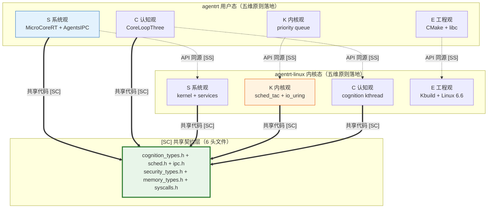

Copyright (c) 2025-2026 SPHARX Ltd. All Rights Reserved.

# agentrt-linux 五维正交24原则与落地映射
> **文档定位**：agentrt-linux（AirymaxOS）架构设计原则的完整定义与落地映射\
> **文档版本**：0.1.1\
> **最后更新**：2026-07-06\
> **上级文档**：[agentrt-linux 设计文档](README.md)\
> **原则来源**：[00-architectural-principles.md](../../AirymaxRT/10-architecture/00-architectural-principles.md)

---

## 1. 五维正交 24 原则概览

agentrt-linux 架构设计基于体系并行论（Multibody Cybernetic Intelligent System），具体实例化为五维正交系统。每个维度对应一类核心设计原则，共 24 条原则覆盖 agentrt-linux 设计的所有关键方面。

### 1.1 五维正交 24 原则概览表

| 维度 | 核心问题 | 原则数量 | 核心思想 |
|------|----------|----------|----------|
| 系统观 (System) | agentrt-linux 作为复杂自适应系统，如何维持动态平衡？ | 4 项 (S-1~S-4) | 反馈闭环、层次分解、总体设计部、涌现性管理 |
| 内核观 (Kernel) | 内核应该做什么，不应该做什么？ | 4 项 (K-1~K-4) | 内核极简、接口契约化、服务隔离、可插拔策略 |
| 认知观 (Cognition) | 智能体如何高效、可靠地进行认知决策？ | 4 项 (C-1~C-4) | 认知层双思考功能、增量演化、记忆卷载、遗忘机制 |
| 工程观 (Engineering) | 如何构建可维护、可测试、可演进的工程系统？ | 8 项 (E-1~E-8) | 安全内生、可观测性、资源确定性、跨平台一致性、命名语义化、错误可追溯、文档即代码、可测试性 |
| 设计美学 (Aesthetics) | 如何让系统不仅正确，而且优雅？ | 4 项 (A-1~A-4) | 极简主义、细节关注、人文关怀、完美主义 |

### 1.2 五维正交性说明

五维之间相互独立且正交：

- **正交性**：任一维度的原则不依赖于其他维度，可以独立演进
- **交织性**：在具体设计决策中，五个维度同时发挥作用
- **完备性**：五维覆盖了架构设计的所有关键方面，从思想到实践，从功能到美学
- **最小完备集**：五维是当前阶段的最佳实例，可演进而非封闭

### 1.3 原则编号规则

| 编号前缀 | 维度 | 数量 |
|----------|------|------|
| S-X | 系统观原则（System View） | 4 项 |
| K-X | 内核观原则（Kernel View） | 4 项 |
| C-X | 认知观原则（Cognitive View） | 4 项 |
| E-X | 工程观原则（Engineering View） | 8 项 |
| A-X | 设计美学原则（Aesthetic View） | 4 项 |

---

## 2. 系统观 S-1~S-4 + agentrt-linux 落地映射

> 维度一回答：agentrt-linux 作为复杂自适应系统，如何维持动态平衡？

### 2.1 S-1 反馈闭环原则

**核心要点**：系统的每一层必须设计完整的"感知-决策-执行-反馈"闭环。没有反馈的组件是无效的，没有反馈的系统是有缺陷的。

**反馈类型**：
- 实时反馈（τ < 100ms）：执行结果 → 认知层修正
- 轮次内反馈（τ = 任务周期）：完成节点 → 增量规划器 DAG 更新
- 跨轮次反馈（τ = 会话周期）：历史模式 → 策略参数热更新
- 安全反馈：审计日志 → 权限规则动态更新
- 健康反馈：指标采集 → 自动伸缩

**agentrt-linux 落地映射**：

| 落地子仓/模块 | 反馈类型 | 实现机制 |
|---------------|----------|----------|
| cognition CoreLoopThree kthread | 实时反馈 | 执行结果通过 io_uring 异步返回认知层 kthread，修正后续规划 |
| cognition 增量规划器 | 轮次内反馈 | 任务节点完成后通过 callback 触发 DAG 增量扩展 |
| memory L4 模式层 | 跨轮次反馈 | L4 持久同调挖掘历史模式 → 认知策略配置热更新 |
| security 审计哈希链 | 安全反馈 | 审计日志 → 权限规则运行时 reload |
| services audit_d | 健康反馈 | telemetry metrics → audit_d 告警 + 自动伸缩 |

### 2.2 S-2 层次分解原则

**核心要点**：复杂系统必须按层次分解，每层只依赖其直接下层的抽象接口，从不越级访问。

**agentrt-linux 落地映射**：

| 落地子仓/模块 | 层次 | 依赖关系 |
|---------------|------|----------|
| kernel | L2 内核层 | 仅依赖 L1 硬件抽象层 |
| services / security / memory | L3 服务层 | 仅依赖 L2 内核系统调用 |
| cognition | L4 认知层 | 仅依赖 L3 服务层接口 |
| cloudnative | L5 云原生层 | 仅依赖 L4 认知层 + L3 服务层 |
| system | L6 系统层 | 仅依赖 L5 + L3 |
| tests-linux | L7 测试层 | 覆盖 L2-L6 全部 |

**实施规则**：
1. 新模块的头文件只能 `#include` 同层或下层的接口
2. 禁止从 services 直接调用 kernel 内部函数（必须通过 syscall）
3. 任何新增跨层依赖必须通过 ADR 评审（见 [05-adrs.md](05-adrs.md)）

### 2.3 S-3 总体设计部原则

**核心要点**：存在一个只做协调、不做执行的全局决策层。它分解任务但不执行任务，选择策略但不实现策略。

**agentrt-linux 落地映射**：

| 落地子仓/模块 | 角色 | 职责边界 |
|---------------|------|----------|
| kernel 调度核心 | 系统级总体设计部 | 只做 CPU/IPC/内存等资源的调度决策，不执行业务逻辑 |
| system 系统编排 | 发行版级总体设计部 | 只做包/配置/服务的编排决策，不实现具体服务 |
| cognition 调度官（Dispatcher） | 认知级总体设计部 | 只做意图理解 → 计划生成 → Agent 调度，不执行具体任务 |

**评分函数示例**（cognition Dispatcher）：
```
Score(agent) = w1 * (1/cost) + w2 * success_rate + w3 * trust_score
```

### 2.4 S-4 涌现性管理原则

**核心要点**：通过良好的模块交互设计，使系统整体产生超越部分之和的涌现行为，同时抑制负面涌现（如级联故障、资源饥饿）。

**agentrt-linux 落地映射**：

| 落地子仓/模块 | 涌现类型 | 管理机制 |
|---------------|----------|----------|
| memory L1-L4 卷载 | 正面涌现 | 单条记忆经四层抽象后涌现可复用行为模式 |
| cognition 双系统协同 | 正面涌现 | 主辅模型交叉验证涌现更高推理可靠性 |
| security 补偿事务 | 负面涌现抑制 | 防止任务链单点失败演变为级联崩溃 |
| security 权限缓存热更新 | 负面涌现抑制 | 防止安全规则变更时短暂不可用 |
| tests-linux Soak 长时测试 | 负面涌现检测 | 长时间运行检测内存泄漏、资源饥饿等涌现问题 |
| tests-linux 混沌工程 | 负面涌现检测 | 故障注入验证级联故障隔离机制 |

---

## 3. 内核观 K-1~K-4 + agentrt-linux 落地映射

> 维度二回答：内核应该做什么，不应该做什么？

### 3.1 K-1 内核极简原则

**核心要点**：内核只保留不可再分的原子机制。一切可以在用户态实现的功能，都必须在用户态实现。遵循 Liedtke minimality principle。

**agentrt-linux 落地映射**：

| 落地子仓/模块 | 极简边界 | 不负责 |
|---------------|----------|--------|
| kernel 调度子系统 | EEVDF 调度器 + sched_tac（SCHED_DEADLINE/SCHED_FIFO） | 业务逻辑调度、任务编排 |
| kernel IPC 子系统 | io_uring 零拷贝消息传递 | 消息内容解析、路由决策 |
| kernel 内存管理 | MGLRU（多代 LRU）+ 基本内存分配 | 数据结构管理、对象生命周期 |
| kernel 时间服务 | 时钟、定时器、事件 | 超时策略、重试逻辑 |

**实施规则**：
1. kernel 新增接口必须通过工程规范委员会审批
2. 新功能优先考虑作为 services 用户态守护进程实现
3. 内核接口必须是泛化的，不包含任何业务语义
4. 严格遵循 Liedtke minimality：可移到用户态的功能必须移到用户态

### 3.2 K-2 接口契约化原则

**核心要点**：所有跨模块交互必须通过明确定义的接口进行。接口是模块间的法律契约：签名、语义、所有权、线程安全性、错误处理，缺一不可。

**agentrt-linux 落地映射**：

| 落地子仓/模块 | 契约载体 | 契约内容 |
|---------------|----------|----------|
| kernel syscall 接口 | `30-interfaces/01-syscalls.md` | 系统调用编号、签名、参数方向、所有权、线程安全性 |
| kernel 30-interfaces/ | `30-interfaces/` 全部 5 文档 | syscall + IPC + SDK + 编码规范 |
| services IPC 协议 | `30-interfaces/02-ipc-protocol.md` | 128B 消息头 + 5 种 payload 协议 |
| cloudnative SDK API | `30-interfaces/03-sdk-api.md` | Python/Rust/Go/TS 四语言 SDK |

**契约七维度**：
- 参数方向：`[in]` 输入、`[out]` 输出、`[in,out]` 双向
- 所有权语义：谁分配谁释放，引用计数规则
- 线程安全性：是否线程安全，需要外部同步的范围
- 可重入性：是否支持重入调用
- 前置/后置条件：参数约束和返回值保证
- 跨引用：关联的创建/销毁/查询函数
- 版本管理：`@since` 标记引入版本，`@deprecated` 标记弃用版本

### 3.3 K-3 服务隔离原则

**核心要点**：所有用户态服务作为独立守护进程运行，通过系统调用与内核交互。服务之间不直接通信，必须经过内核路由。

**agentrt-linux 落地映射**：

| 落地子仓/模块 | 守护进程 | 隔离机制 |
|---------------|----------|----------|
| services 12 daemons | cogn_d / gateway_d / audit_d / dev_d / sched_d / macro_superv 等 | 独立地址空间 + systemd 单元 + capability 限制 |
| services VFS 用户态化 | vfs_d | 用户态文件系统（参考 seL4 服务用户态化，ADR-014） |
| services 网络栈用户态化 | net_d | DPDK / AF_XDP 用户态网络 |
| services 驱动框架用户态化 | drv_d | VFIO / libvfio 用户态驱动 |

**实施规则**：
1. 新增守护进程必须通过 `syscalls.h` 与内核交互
2. 禁止守护进程之间建立直接通信通道
3. 服务崩溃必须不影响内核和其他服务的运行
4. 守护进程命名遵循 `<service_name>_d` 约定

### 3.4 K-4 可插拔策略原则

**核心要点**：所有算法选择（规划、协同、调度、遗忘、检索、净化）都设计为可运行时替换的策略接口。策略是系统的"可调参数"。

**agentrt-linux 落地映射**：

| 落地子仓/模块 | 策略维度 | 可选实现 |
|---------------|----------|----------|
| kernel sched_tac | 调度策略 | stc_* 策略（用户态调度器）+ EEVDF 默认调度 |
| kernel eBPF kfunc | 内核扩展策略 | dynamic pointer + kfunc 注册的运行时策略 |
| cognition 规划策略 | 任务规划 | 分层规划、反应式规划、反思式规划、ML 规划 |
| cognition 协同策略 | 模型协同 | 双模型协同、多数投票、加权融合、外部仲裁 |
| memory 遗忘策略 | 记忆衰减 | 艾宾浩斯曲线、线性衰减、基于访问次数 |
| memory 检索策略 | 记忆检索 | 精确匹配（System 1）、语义检索（System 2） |
| security 净化策略 | 输入净化 | 正则过滤、类型检查、长度限制、语义验证 |

---

## 4. 认知观 C-1~C-4 + agentrt-linux 落地映射

> 维度三回答：如何让智能体既高效又可靠？

### 4.1 C-1 认知层双思考功能原则（双系统协同）

**核心要点**：系统的每个认知环节都设计快慢两条路径。System 1 处理高频低复杂度任务，System 2 处理低频高复杂度任务。两者协同而非互斥。

**agentrt-linux 落地映射**：

| 落地子仓/模块 | System 1（快） | System 2（慢） |
|---------------|-----------------|-----------------|
| cognition 认知层 | 辅模型快速分类与交叉验证 | 主模型深度规划与反思调整 |
| cognition 执行层 | 预设执行单元快速响应 | 动态代码生成与验证 |
| memory 记忆层 | 吸引子网络快速模式匹配（O(1)） | L4 持久同调深度模式挖掘（O(n²)） |
| security 安全层 | 净化规则快速过滤 | 权限引擎深度策略裁决 |

**双系统切换阈值模型**：
```
切换阈值 = f(置信度, 时间预算, 资源约束, 风险等级)
```
- 置信度 < θ_c（默认 0.85）→ 触发 System 2
- 剩余时间 < θ_t（默认任务超时的 20%）→ 强制切换到 System 1
- CPU/内存使用率 > θ_r（默认 80%）→ 降级到 System 1
- 操作风险等级 > θ_risk（默认 3/5）→ 强制启用 System 2

### 4.2 C-2 增量演化原则

**核心要点**：智能体不应一次性规划全部步骤，而应分阶段规划、根据执行反馈动态调整。这避免了长序列任务中的错误累积。

**agentrt-linux 落地映射**：

| 落地子仓/模块 | 增量演化机制 | 实现要点 |
|---------------|--------------|----------|
| cognition 增量规划器 | 任务 DAG 增量扩展 | 只生成当前阶段任务，根据反馈逐步扩展 |
| cognition 智能回退 | 失败节点重规划 | 保留已成功节点结果，仅重规划失败节点及其下游 |
| cognition 规划深度限制 | 防止无限递归 | 默认 10 层（可配置） |
| cognition 回退统计 | 不可恢复检测 | 回退次数超过 3 次终止任务并报告 |

### 4.3 C-3 记忆卷载原则

**核心要点**：记忆不是简单的存储与检索，而是从原始经验中逐层提炼出可复用的知识模式。这一过程类比 CNN 的层级特征提取。

**agentrt-linux 落地映射**：

| 落地子仓/模块 | 层级 | 输入 | 输出 | 神经科学对应 |
|---------------|------|------|------|--------------|
| memory L1 原始卷 | L1 | 对话/事件/文件 | 带元数据的原始记录 | 海马体 CA3 |
| memory L2 特征层 | L2 | L1 原始记录 | 语义向量 + 混合索引 | 内嗅皮层 |
| memory L3 结构层 | L3 | L2 特征向量 | 关系图 + 绑定算子 | 海马-新皮层通路 |
| memory L4 模式层 | L4 | L3 结构图 | 持久同调 + 可复用规则 | 前额叶皮层 |

**存用分离**：L1 永久保存原始数据（仅追加，永不修改），L2-L4 仅存储索引和特征。检索时通过特征定位，再从 L1 挂载原始数据。

**CXL 内存池化支持**：memory 利用 Linux 6.6 的 CXL 支持实现 L1-L4 跨节点内存池化，配合 MGLRU（多代 LRU）实现冷热数据分层。

### 4.4 C-4 遗忘机制原则

**核心要点**：遗忘不是缺陷，而是记忆系统的核心功能。它裁剪冗余、抑制噪声、保留精华。好的遗忘机制使系统保持高效和可维护。

**agentrt-linux 落地映射**：

| 落地子仓/模块 | 遗忘策略 | 公式 | 适用场景 |
|---------------|----------|------|----------|
| memory 艾宾浩斯曲线 | 时间衰减 | R(t) = e^(-t/τ)（τ 默认 7 天） | 通用场景 |
| memory 线性衰减 | 固定生命周期 | R(t) = 1 - t/T | 固定生命周期数据 |
| memory 基于访问次数 | 热点数据 | R(n) = 1 - 1/(n+1) | 热点数据 |
| memory 归档复活 | 唤醒机制 | 检索重新激活归档数据 | 长期未访问数据 |

**实施规则**：
1. 遗忘策略必须是可配置的（用户可选择策略）
2. 遗忘阈值必须可调（默认 0.3，低于此值归档）
3. 归档数据必须可复活（通过检索重新激活）
4. 遗忘决策必须记录审计日志

---

## 5. 工程观 E-1~E-8 + agentrt-linux 落地映射

> 维度四回答：如何构建可维护、可测试、可演进的工程系统？

### 5.1 E-1 安全内生原则

**核心要点**：安全不是附加层，而是内嵌于系统设计的每一个环节。从内核到服务层，从编译时到运行时，安全机制无处不在。

**agentrt-linux 落地映射**：

| 落地子仓/模块 | 安全机制 | 实现要点 |
|---------------|----------|----------|
| security capability（seL4 风格） | 不可伪造令牌 | capability 系统控制资源访问，无 capability 即无访问 |
| security LSM | Linux Security Module | SELinux + capability 双重保护 |
| security 国密算法 | SM2/SM3/SM4 | 兼容 agentrt-linux 国密规范 |
| security 机密计算 | TEE / SGX | 敏感计算在可信执行环境 |
| security 审计哈希链 | SHA-256 哈希链 | 不可篡改审计日志 |
| security Seccomp + CFI | 运行时保护 | 系统调用过滤 + 控制流完整性 |
| kernel Rust 实验性支持 | 内存安全驱动 | Rust 编写内核安全模块 |

### 5.2 E-2 可观测性原则

**核心要点**：系统必须提供完整的可观测性：指标（Metrics）、追踪（Traces）、日志（Logs）、健康检查（Health）。

**agentrt-linux 落地映射**：

| 落地子仓/模块 | 可观测性类型 | 实现机制 |
|---------------|--------------|----------|
| services journald | 日志 | 结构化日志 + trace_id + 完整上下文 |
| services audit_d | 指标 | 性能监控、资源使用、业务指标 |
| services OpenTelemetry | 追踪 | 分布式追踪、调用链分析 |
| kernel eBPF kfunc | 内核可观测性 | dynamic pointer + kfunc 注册的探针 |
| cloudnative Prometheus + Grafana | 云原生监控 | K8s 原生监控栈 |
| system 健康检查 | 健康检查 | systemd unit + 依赖项状态检查 |

### 5.3 E-3 资源确定性原则

**核心要点**：每块内存的分配者必须明确其释放者。每个文件句柄的打开者必须明确其关闭者。每个线程的创建者必须明确其销毁者。资源的生命周期必须是确定性的。

**agentrt-linux 落地映射**：

| 落地子仓/模块 | 资源类型 | 确定性机制 |
|---------------|----------|------------|
| kernel MGLRU（多代 LRU） | 物理内存 | 多代 LRU 分代回收，冷热数据分离 |
| memory CXL 内存池化 | 异构内存 | CXL 跨节点内存池 + PMEM 持久化 |
| kernel 内存分配器 | 内核内存 | 分配位置记录（文件:行号）+ 泄漏检测 |
| kernel 异步资源 | io_uring 资源 | 显式所有者关联，所有者销毁时自动释放 |
| services 资源池化 | 用户态资源 | 预分配内存池、连接池，避免动态分配开销 |

### 5.4 E-4 跨平台一致性原则

**核心要点**：核心业务逻辑与平台无关。平台差异通过抽象层屏蔽，业务代码永远不直接调用平台 API。

**agentrt-linux 落地映射**：

| 维度 | agentrt | agentrt-linux |
|------|---------|-----------|
| 平台支持 | Linux / macOS / Windows 跨平台 | 仅 Linux 6.6 内核基线 |
| 一致性方向 | 跨平台用户态运行时 | Linux 专属优化 |
| 关系 | agentrt-linux 是 agentrt 的最佳载体 | 同源天然适配，无适配层 |

**说明**：agentrt 是跨平台用户态运行时，承担跨平台一致性责任；agentrt-linux 是 Linux 专属优化发行版，专注于 Linux 6.6 内核基线的极致性能。两者同源，agentrt 在 agentrt-linux 上运行天然契合。

### 5.5 E-5 命名语义化原则

**核心要点**：名称即文档。函数名、类型名、变量名必须精确表达其语义。好的命名让代码自解释，减少对注释的依赖。

**agentrt-linux 落地映射**：

| 命名空间 | 用途 | 示例 |
|----------|------|------|
| `airy_` 前缀 | agentrt 命名空间（同源） | airy_sys_task_submit / airy_ipc_send |
| `<service_name>_d` 后缀 | 守护进程命名 | cogn_d / gateway_d / audit_d / dev_d / sched_d |
| `module_action_object()` | 函数命名 | cognition_submit_task / memory_search_vector |
| 大写_下划线 | 常量命名 | AIRY_EOK / AIRY_IPC_HDR_SIZE |
| 名词结构 | 类型命名 | struct airy_task_desc / struct airy_ipc_msg_hdr |

### 5.6 E-6 错误可追溯原则

**核心要点**：每个错误必须可追溯到其根源。错误码、错误消息、调用栈、上下文信息，缺一不可。

**agentrt-linux 落地映射**：

| 落地子仓/模块 | 错误追溯机制 | 实现要点 |
|---------------|--------------|----------|
| security 审计哈希链 | 安全错误追溯 | SHA-256 哈希链不可篡改日志 |
| services 结构化错误码 | 错误码体系 | error.h SSoT 对齐 errno |
| services 错误链 | 错误上下文传递 | airy_err_wrap 添加模块名/函数名/行号 |
| services OpenTelemetry | 调用栈追溯 | 分布式追踪 + 完整调用链 |
| tests-linux 错误注入测试 | 错误恢复验证 | 故障注入 + 错误恢复测试 |

### 5.7 E-7 文档即代码原则

**核心要点**：文档与代码同步更新。过时的文档比没有文档更糟糕。文档必须作为代码的一部分进行版本控制和审查。

**agentrt-linux 落地映射**：

| 文档体系 | 位置 | 内容 |
|----------|------|------|
| docs/AirymaxOS/ | agentrt-linux 设计文档 | 19 模块三层体系（核心设计层 + 工程标准与实施层 + 延伸层，~85 文档） |
| docs/AirymaxRT/10-architecture/00-architectural-principles.md | 架构原则 | 五维正交 24 原则 |
| 50-engineering-standards/10-coding-style/ | 编码规范 | C / Rust / 安全编码规范文件 |
| Doxygen 注释 | 代码内文档 | 每个公共 API 的契约注释 |
| ADR | 架构决策记录 | [05-adrs.md](05-adrs.md)（14 个 ADR） |

### 5.8 E-8 可测试性原则

**核心要点**：测试不是事后补充，而是设计的首要考量。每个组件在设计时就必须考虑其可测试性，通过测试驱动设计确保代码的正确性和可维护性。

**agentrt-linux 落地映射**：

| 落地子仓/模块 | 测试类型 | 工具 | 覆盖率目标 |
|---------------|----------|------|------------|
| tests-linux 单元测试 | 函数/模块级别 | CUnit + CMock | ≥90% 行覆盖率 |
| tests-linux 集成测试 | 模块间交互 | 自定义测试框架 | ≥80% 接口覆盖率 |
| tests-linux 系统测试 | 端到端流程 | Python + pytest | 核心流程 100% |
| tests-linux 性能测试 | 负载与压力 | Locust + k6 | 关键路径 SLA |
| tests-linux 形式化验证 | 数学证明 | seL4 风格验证 | 关键模块 100% |
| tests-linux Soak 长时测试 | 长时运行 | 持续运行 7 天+ | 内存泄漏检测 |
| tests-linux 混沌工程 | 故障注入 | Chaos Mesh | 故障隔离验证 |

---

## 6. 设计美学 A-1~A-4 + agentrt-linux 落地映射

> 维度五回答：如何让工程本身成为艺术？

### 6.1 A-1 简约至上原则

**核心要点**：用最少的接口提供最大的价值。复杂性不是能力的证明，而是设计的失败。

#### 6.1.1 设计哲学根基：简约是对复杂事物精髓的深度挖掘

Airymax 将乔布斯与艾夫的设计哲学确立为 A-1 简约至上原则的哲学根基：

> "为什么我们认为简单就是美？因为就产品实体而言，我们必须获得掌控感。只要在复杂中建立秩序，就可以找到方法使产品听令于你。简约不仅仅是一种视觉风格或形式上的极简主义，也不仅仅是摒弃杂乱、去繁就简后的状态。简约是对复杂事物的精髓进行深度挖掘和精准提炼的结果。要做到真正的简约，就必须做到真正的深入。例如，如果为了达到看不到一颗螺丝的目标，结果却做出一个极为烦琐的产品，反倒违背了初心。更好的方法是深入'简约'的核心，了解与之有关的一切，了解简约的产品是如何生产出来的。只有深入了解一个产品的本质和精髓，才能真正去芜存菁。"——史蒂夫·乔布斯

**与 Airymax 工程思想的契合**：

| 乔布斯哲学要素 | Airymax 工程落地 |
|---------------|-----------------|
| "在复杂中建立秩序" | 微内核设计思想——在 Linux 30 年复杂性中建立 seL4 minimality 秩序 |
| "对复杂事物的精髓进行深度挖掘和精准提炼" | IRON-9 v3 [SC] 共享契约层——从全量代码中提炼 10 个头文件作为精髓 |
| "必须做到真正的深入" | 机制与策略分离——深入理解机制后才能正确分离策略 |
| "了解简约的产品是如何生产出来的" | SSoT 单一权威源——每个技术点只有一个权威定义，深入了解后才能提炼 |
| "去芜存菁" | sched_tac 替代 sched_ext——深入理解调度本质后，用原生调度类组合替代 BPF 调度器 |
| "看不到一颗螺丝"的反面教训 | IRON-1 禁止新特性——不为表面简洁而引入隐藏复杂性 |

**核心约束**：简约不是"少做"，而是"深入后做对"。Airymax 的每一个设计决策都必须经过深度挖掘——理解本质后去除非必要，保留精髓。这与 seL4 的 Liedtke minimality principle 形成"东西方简约哲学"的双重根基：Liedtke 从形式化验证角度论证最小化，乔布斯从人文体验角度论证简约美。

**agentrt-linux 落地映射**：

| 落地子仓/模块 | 简约维度 | 体现 |
|---------------|----------|------|
| kernel 微内核化改造 | 接口最小化 | Liedtke minimality 原则：可移到用户态的功能必须移到用户态 |
| kernel 调度核心 | 内核职责最小化 | 仅保留 EEVDF + sched_tac（SCHED_DEADLINE/SCHED_FIFO）+ io_uring + 基本内存管理 |
| 全部 8 子仓 | 子仓数量精简 | 8 子仓按能力域清晰划分，无功能重叠 |
| cognition 增量规划器 | 默认配置满足 80% 场景 | 智能默认值，高级配置可选 |
| 全部 8 子仓 | 函数参数 ≤ 5 | 超过 3 个参数使用结构体封装 |

### 6.2 A-2 极致细节原则

**核心要点**：细节决定成败。错误消息、日志格式、API 命名，每个细节都反映工程品质。

**agentrt-linux 落地映射**：

| 落地子仓/模块 | 细节维度 | 体现 |
|---------------|----------|------|
| coding_standard 15 个规范文件 | 编码规范 | C/Rust/Python/Go/TypeScript 完整规范 |
| services 错误消息 | 错误消息模板 | `[ERROR] <error_code>: <human_readable> (context: <key=value>). Suggestion: <action>` |
| services 日志格式 | 结构化日志 | JSON 格式 + trace_id + 完整上下文 |
| services journald | 日志颜色 | ANSI 颜色：INFO=蓝/WARN=黄/ERROR=红/FATAL=品红/DEBUG=灰 |
| system Doxygen | 代码注释 | 每个公共 API 的完整契约注释 |
| tests-linux 测试用例 | 测试命名 | test_<module>_<scenario>_<expected_result> |

### 6.3 A-3 人文关怀原则

**核心要点**：技术服务于人。开发者体验与用户体验同等重要。

**agentrt-linux 落地映射**：

| 落地子仓/模块 | 人文维度 | 体现 |
|---------------|----------|------|
| system DevStation | 开发环境 | 一键部署的开发环境，含调试/分析/测试工具链 |
| system 渐进式文档 | 开发者体验 | 从 5 分钟快速开始到高级主题的渐进式文档 |
| cognition 智能默认值 | 用户（智能体）体验 | 80% 场景无需配置 |
| system 错误恢复指导 | 错误指导 | 错误不仅告知问题，更指导解决 |
| cloudnative agentctl | 命令行体验 | 与 kubectl 兼容的命令行工具 |

### 6.4 A-4 完美主义原则

**核心要点**：不接受"足够好"。代码质量、测试覆盖、文档完整性，每个方面都追求完美。

**agentrt-linux 落地映射**：

| 落地子仓/模块 | 完美维度 | 体现 |
|---------------|----------|------|
| IRON-1~10 工程铁律 | 工程纪律 | 10 条不可违反的工程铁律（详见工程标准规范手册） |
| tests-linux 零警告编译 | 编译质量 | -Wall -Wextra -Werror 下无警告 |
| tests-linux 静态分析 | 代码质量 | Clang-Tidy + Coverity 定期扫描 |
| tests-linux 动态检查 | 运行时质量 | ASan + TSan + UBSan 在 CI 中运行 |
| tests-linux 测试覆盖 | 测试完美 | 单元测试 ≥90%，关键模块 ≥95% |
| tests-linux 形式化验证 | 数学证明 | seL4 风格的关键模块形式化验证 |

---

## 7. 原则验证方法

### 7.1 原则符合性检查清单

每个新功能或变更必须通过以下检查清单：

**系统观检查**：
- [ ] 是否设计了完整的反馈闭环（S-1）？
- [ ] 是否遵守了层次分解原则（S-2）？
- [ ] 决策层与执行层是否分离（S-3）？
- [ ] 是否考虑了涌现性管理（S-4）？

**内核观检查**：
- [ ] 内核职责是否最小化（K-1）？
- [ ] 接口契约是否完整（K-2）？
- [ ] 公共 API 是否包含 @since 和 @deprecated 版本标记（K-2）？
- [ ] 服务是否隔离运行（K-3）？
- [ ] 策略是否可插拔（K-4）？

**认知观检查**：
- [ ] 是否设计了双系统协同（C-1）？
- [ ] 规划是否支持增量演化（C-2）？
- [ ] 记忆是否分层卷载（C-3）？
- [ ] 遗忘机制是否合理（C-4）？

**工程观检查**：
- [ ] 安全是否内生（E-1）？
- [ ] 可观测性是否完整（E-2）？
- [ ] 资源生命周期是否确定（E-3）？
- [ ] 跨平台一致性是否保证（E-4）？
- [ ] 命名是否语义化（E-5）？
- [ ] 错误是否可追溯（E-6）？
- [ ] 文档是否同步更新（E-7）？
- [ ] 测试是否完整（E-8）？

**设计美学检查**：
- [ ] 是否遵循简约至上原则（A-1）？
- [ ] 是否体现极致细节（A-2）？
- [ ] 是否包含人文关怀（A-3）？
- [ ] 是否达到完美主义标准（A-4）？

### 7.2 自动化合规性检查

| 检查项 | 工具 | 频率 |
|--------|------|------|
| 接口契约完整性 | scripts/check_api_complexity.sh | 每次 PR |
| 反馈路径检查 | scripts/check_feedback_paths.sh | 每次 PR |
| 层次依赖检查 | scripts/check_layer_deps.py | 每次 PR |
| Linux 6.6 兼容性 | ACC-OS04（Grep 扫描未来内核误引残留） | 每次发布 |
| 测试覆盖率 | CI 流水线 lcov | 每次 PR |
| 静态分析 | Clang-Tidy + Coverity | 每日 |
| 动态检查 | ASan + TSan + UBSan | 每次 PR |

### 7.3 原则违反处理流程

当发现原则违反时，按以下流程处理：

1. **记录违规**：在代码审查中标注违反的原则
2. **评估影响**：分析违规对系统的影响程度
3. **制定方案**：提出符合原则的替代方案
4. **实施整改**：修改代码以符合原则
5. **验证合规**：重新检查原则符合性
6. **ADR 记录**：严重违规需创建 ADR 记录决策

### 7.4 原则演进机制

原则本身也需要演进：

1. **提案**：社区或团队成员提出新原则或修改建议
2. **讨论**：工程规范委员会组织讨论，评估影响
3. **投票**：工程规范委员会投票决定是否采纳
4. **文档化**：更新 00-architectural-principles.md 和本文档
5. **公告**：向社区公告原则变更
6. **实施**：在代码库中实施新原则

---

## 8. 相关文档

- [架构设计 README](README.md)：架构设计层总览
- [系统架构](01-system-architecture.md)：agentrt-linux 系统架构总览
- [微内核策略](03-microkernel-strategy.md)：微内核化改造策略
- [工程基线](04-engineering-baseline.md)：agentrt-linux 工程基线
- [架构决策记录](05-adrs.md)：14 个核心 ADR
- [架构原则](../../AirymaxRT/10-architecture/00-architectural-principles.md)：五维正交 24 原则的完整定义

---

## 9. 版本历史

| 版本 | 日期 | 变更 |
|------|------|------|
| 0.1.1 | 2026-07-06 | 初始版本（含 24 原则 + agentrt-linux 落地映射） |
| 1.0.1 | 2027-XX-XX | 首个开发版本（与代码实现同步验证） |

## 10. IRON-9 v3 四层共享模型

> **OS-ARCH-003**： 五维正交 24 原则在 agentrt（用户态）与 agentrt-linux（内核态）间遵循 IRON-9 v3 四层共享模型——S 系统观 / K 内核观 / C 认知观 / E 工程观 / A 设计美学跨态同源，认知观契约经 [SC] 共享，内核观实现经 [IND] 各自独立，禁止为五维原则引入双端适配别名层。

### 10.1 三层模型概览

| 层次 | 共享程度 | 五维原则映射 |
|------|---------|-------------|
| **[SC] 共享契约层** | 完全共享代码 | C 认知观（`cognition_types.h` 三阶段）+ E 工程观编码契约经 6 头文件共享，物理宿主 `kernel/include/uapi/linux/airymax/`，子仓经 `-I` 引用 |
| **[SS] 语义同源层** | 高层 API 语义同源（概念操作一致），签名因抽象层级不同而独立演进 | S 系统观 + A 设计美学在 agentrt 5 维模块 ↔ agentrt-linux 8 子仓的同源映射 |
| **[IND] 完全独立层** | 完全独立 | K 内核观（agentrt-linux sched_tac 独有）+ E 工程观实现（CMake vs Kbuild） |

### 10.2 [SC] 共享契约层——10 个头文件在五维原则中的角色

| 头文件 | 对应维度 | 在五维原则中的角色 | 消费方 |
|--------|---------|-------------------|--------|
| `sched.h` | S 系统观 | magic 0x41475453 'AGTS' + 复用 Linux 6.6 原生 SCHED_DEADLINE/SCHED_FIFO/EEVDF（禁用 SCHED_AGENT 宏）+ MAC_MAX_AGENTS=1024 | kernel / cognition |
| `ipc.h` | S 系统观 | magic 0x41524531 'ARE1' + 128B 消息头（`struct airy_ipc_msg_hdr`）契约 | kernel / services |
| `syscalls.h` | K 接口契约 | 4 核心 + 20 预留 = 24 槽位（1 Capability Invocation + 3 控制原语，v1.1 Capability Folding 后） | kernel / cognition |
| `security_types.h` | E 工程观 | 41 capability + 252 LSM 钩子 + Cupolas blob 布局 | kernel / security |
| `memory_types.h` | E 工程观 | MemoryRovol L1-L4 + GFP 掩码语义 + PMEM 接口 | kernel / memory |
| `cognition_types.h` | C 认知观 | 三阶段枚举（PERCEPTION/THINKING/ACTION）+ Thinkdual 模式 | kernel / cognition |

### 10.3 [SS] 语义同源层——五维原则 agentrt ↔ agentrt-linux 映射

| 维度 | agentrt 实现（用户态） | agentrt-linux 实现（内核态） | 同源 API |
|------|----------------------|---------------------------|---------|
| S 系统观 | MicroCoreRT atoms + AgentsIPC | kernel + services | sched_tac 17 项 + io_uring 8 项 |
| K 内核观 | 用户态 priority queue | sched_tac 用户态函数表 | 复用 Linux 6.6 原生调度类 |
| C 认知观 | CoreLoopThree 协程 | cognition kthread + EEVDF | 三阶段枚举 + Thinkdual |
| E 工程观 | CMake + libc/POSIX | Kbuild + Kconfig + Linux 6.6 | Linux 6.6 内核基线 编码契约 |
| A 设计美学 | 五维正交命名 | 五维正交命名 | 24 原则命名同源 |

### 10.4 [IND] 完全独立层

| 独立项 | agentrt 实现 | agentrt-linux 实现 | 独立原因 |
|--------|-------------|-------------------|---------|
| 调度原语 | 用户态协程 + event loop | sched_tac 用户态调度策略 | 跨平台约束（macOS/Windows 无 sched_ext） |
| IPC 传输 | POSIX MQ + mmap | io_uring + SQPOLL（用户态-内核态）；kfifo + wait_event_interruptible（kthread 间） | 内核态性能与 kthread 通信约束 |
| 构建工具链 | CMake | Kbuild + Kconfig | 工具链差异 |
| 平台适配 | libc/POSIX 跨三平台 | Linux 6.6 内核 API | IRON-1 二进制兼容约束 |

### 10.5 跨态协作流



> **OS-ARCH-004**： 五维原则跨态同源遵循"零适配层天然契合"——A 设计美学与 C 认知观经 [SC] 6 头文件直接对接，不生成 `five_dim_compat.h` 或任何兼容别名层；K 内核观因平台差异落入 [IND]，两端各自演进。

---

© 2025-2026 SPHARX Ltd. All Rights Reserved.
