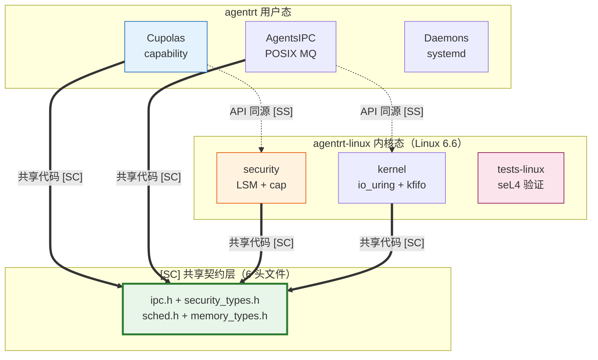

Copyright (c) 2025-2026 SPHARX Ltd. All Rights Reserved.

# agentrt-linux 微内核设计思想详解

> **文档定位**：agentrt-linux（AirymaxOS）微内核设计思想的深度解析，阐述基于 seL4 工程思想的 Linux 6.6 微内核化改造策略\
> **文档版本**：0.1.1\
> **最后更新**：2026-07-09\
> **上级文档**：[agentrt-linux 设计文档](README.md)\
> **理论基础**：seL4（唯一来源，ADR-014）\
> **技术路线**：基于 Linux 内核微内核化改造，非从零开发微内核（ADR-012）\
> **版本基线**：1.x.x 锁定 Linux 6.6 LTS / 2.x.x 锁定 Linux 7.1（ADR-013）\
> **研读依据**：seL4 源代码深度研读

***

## 目录

- [1. 设计哲学基石](#1-设计哲学基石)
- [2. 内核态职责边界](#2-内核态职责边界)
- [3. Capability 安全模型](#3-capability-安全模型)
- [4. IPC 消息传递](#4-ipc-消息传递)
- [5. 接口契约与代码生成](#5-接口契约与代码生成)
- [6. 构建系统](#6-构建系统)
- [7. 形式化验证策略](#7-形式化验证策略)
- [8. 编码规范](#8-编码规范)
- [9. 迁移路径](#9-迁移路径)
- [10. 微内核设计思想在 8 子仓的体现](#10-微内核设计思想在-8-子仓的体现)
- [11. 相关文档](#11-相关文档)
- [12. 参考文献](#12-参考文献)

***

## 1. 设计哲学基石

### 1.1 Liedtke 极简原则的 agentrt-linux 诠释

**Jochen Liedtke**（L4 微内核创始人）提出微内核设计的核心原则（ES-SEL4-01）：

> "A concept is tolerated inside the microkernel only if moving it outside the kernel, i.e., permitting competing implementations, would prevent the implementation of the system's required functionality."

**翻译**：只有当某个概念移出微内核会导致系统无法实现所需功能时，才容忍它留在微内核内。

**seL4 的工程验证**：seL4 严格遵循此原则，真正的"微内核必需代码"约 **1.44 万行 C**（不含 arch/plat/drivers），其中五大内核对象（TCB + CNode + Endpoint + Notification + Untyped）合计仅约 **4,353 行**。这与 Linux 单体内核约 3,000 万行形成鲜明对比——差距约 2,000 倍，这正是"微内核"一词的量化诠释。

| 代码区域                                                           | seL4 行数    | 性质                                 |
| -------------------------------------------------------------- | ---------- | ---------------------------------- |
| 内核核心（api + kernel + object + fastpath + machine + model + smp） | \~14,400 行 | 真正的"微内核"必需                         |
| 架构相关（arm / riscv / x86）                                        | 35,518 行   | 多架构支持                              |
| 平台相关（40+ 板级）                                                   | 2,234 行    | 板级支持                               |
| 驱动（仅 timer / serial / smmu）                                    | 1,659 行    | 最小驱动集                              |
| 头文件（含 25 个 .bf bitfield）                                       | 29,231 行   | 接口定义                               |
| 用户态库（libsel4）                                                  | 18,037 行   | 与内核完全解耦的 ABI                       |
| 工具链（codegen）                                                   | 7,316 行    | bitfield / syscall / invocation 生成 |

**agentrt-linux 的诠释**：agentrt-linux 不是从零开发微内核（ADR-012），而是基于 Linux 6.6 内核进行微内核化改造。因此"极简"不意味着将 Linux 缩减到 1.44 万行，而是遵循以下体量控制策略：

| 维度          | seL4 基线   | agentrt-linux 预算      | 控制策略                  |
| ----------- | --------- | --------------------- | --------------------- |
| 内核核心代码      | \~1.44 万行 | 5-10 万行（含 agent 调度原语） | 每新增子系统需论证"无法在用户态安全实现" |
| 微内核化改造补丁    | —         | 控制在 2 万行以内            | VFS / 网络栈 / 驱动用户态化补丁  |
| \[SC] 共享契约层 | —         | 6 个头文件（IRON-9 v2）     | 单一物理宿主，禁止重复定义         |

### 1.2 Capability-First 设计

seL4 的核心设计决策是 **capability 单一安全模型**（ES-SEL4-05 至 09）：内核中所有资源访问都通过不可伪造的 capability 令牌控制，不存在 DAC / MAC / capability 三套并存的复杂模型。

**seL4 capability 模型精髓**：

| 维度      | seL4 实现                                                      | 代码证据                                            |
| ------- | ------------------------------------------------------------ | ----------------------------------------------- |
| cap 类型  | 12 种定长 cap 类型                                                | `src/object/objecttype.c`（1,024 行）              |
| cap 存储  | CTE（Capability Table Entry）= cap + mdb\_node                 | `include/object/structures.h`                   |
| cap 寻址  | CNode 树形寻址（guard + radix）                                    | `src/kernel/cspace.c:resolveAddressBits`（193 行） |
| cap 派生  | MDB（Memory Disclosure Base）双向链表派生树                           | `src/object/cnode.c:410-443`（934 行）             |
| cap 操作  | 7 种原语：Insert / Move / Copy / Mint / Mutate / Revoke / Delete | `src/object/cnode.c`                            |
| cap 身份  | 64 bit Badge 标识来源                                            | `src/object/cnode.c:798-819`                    |
| cap 即内存 | CTE 直接内嵌在 TCB 中，cap 本身就是内存                                   | `include/object/structures.h`                   |

**agentrt-linux 落地**：security 子仓实现 capability 系统（ADR-004），与 agentrt Cupolas 同源。通过 \[SC] 共享契约层 `include/airymax/security_types.h` 定义 POSIX capability 41 ID 枚举 + LSM 钩子 252 ID 枚举 + capability 派生模型（mint / mintcopy / derive / revoke）。

### 1.3 形式化可验证性预留

seL4 是首个通过完整形式化验证的微内核（ES-SEL4-16 至 20）。其验证体系分四层：

```
抽象规范（Abstract Spec）→ 具体规范（Design Spec）→ 实现（C 代码）→ 二进制（机器码）
     ↓ 精化证明              ↓ C 代码验证            ↓ 编译器验证
```

**seL4 验证范围声明**（CAVEATS.md 显式声明）：

| 架构                  | 验证范围                          |
| ------------------- | ----------------------------- |
| AArch32（32-bit ARM） | 全属性验证（functional correctness） |
| AArch64（64-bit ARM） | 仅完整性验证（integrity，非全属性）        |
| RISC-V 64           | 部分验证                          |
| x86\_64             | 未验证                           |

**agentrt-linux 落地**：agentrt-linux 不追求全量形式化验证（基于 Linux 改造的复杂度不允许），但预留验证接口（ES-SEL4-19）：

| 预留机制                       | seL4 实现        | agentrt-linux 适配   |
| -------------------------- | -------------- | ------------------ |
| `/** MODIFIES */` 注解       | 标注函数副作用范围      | 1.0.1 阶段引入（决策项）    |
| `/** FNSPEC */` 注解         | 标注函数契约规范       | 1.0.1 阶段引入（决策项）    |
| `/** GHOSTUPD */` 注解       | 幽灵状态更新         | 2.x.x 评估           |
| `/** DONT_TRANSLATE */` 注解 | 标注汇编边界         | 用于 arch 层汇编        |
| 验证 artifacts 独立 repo       | l4v 仓库独立于 seL4 | tests-linux 子仓独立存放 |

### 1.4 机制与策略分离

seL4 严格遵循"机制而非策略"原则（ES-SEL4-04）：内核只提供机制（capability / IPC / 调度原语），不包含策略（具体调度算法 / 具体安全策略 / 具体资源分配策略）。

**agentrt-linux 的机制-策略分离**：

| 机制（内核态）           | 策略（用户态）           | 落地方式              |
| ----------------- | ----------------- | ----------------- |
| sched\_ext 框架     | SCHED\_AGENT 调度策略 | eBPF 程序运行在用户态定义   |
| io\_uring ring 机制 | IPC 路由策略          | 12 daemons 在用户态路由 |
| capability 令牌验证   | capability 授权策略   | security 守护进程     |
| eBPF kfunc 扩展     | 安全观测策略            | eBPF 程序在用户态编写     |

***

## 2. 内核态职责边界

### 2.1 保留在内核态的 6 类职责

seL4 明确内核只保留 6 类职责（ES-SEL4-29）：

| 职责            | seL4 实现                            | agentrt-linux 实现                   | 代码预估      |
| ------------- | ---------------------------------- | ---------------------------------- | --------- |
| Capability 管理 | CNode + MDB 派生树                    | eBPF kfunc + capability 验证         | \~3,000 行 |
| IPC（消息传递）     | Endpoint + Notification + Fastpath | io\_uring 零拷贝 + MSG\_RING          | \~5,000 行 |
| 调度原语          | priority + round-robin + domain    | sched\_ext BPF 框架 + EEVDF fallback | \~4,000 行 |
| 地址空间管理        | VSpace + Page Table                | Linux mm/（保留）                      | Linux 原生  |
| 中断/异常处理       | Interrupt 对象 + fault handler       | Linux IRQ + fault handler（保留）      | Linux 原生  |
| 内存 Retype     | Untyped → Typed 转换                 | buddy allocator + Retype 层（新增）     | \~2,000 行 |

### 2.2 下沉到用户态的 Linux 子系统

agentrt-linux 将以下 Linux 子系统逐步下沉到用户态（ES-SEL4-30），参考 seL4 的 root task 模型：

| Linux 子系统   | 下沉策略                    | 用户态服务                               | 迁移阶段   |
| ----------- | ----------------------- | ----------------------------------- | ------ |
| VFS（具体文件系统） | 保留 VFS 框架在内核，具体 FS 下沉   | services VFS server                 | 1.x.x+ |
| 网络栈（TCP/IP） | 保留 socket 层在内核，协议栈下沉    | services net server（DPDK / AF\_XDP） | 1.x.x+ |
| 设备驱动        | 通过 VFIO / libvfio 下沉    | services driver server              | 1.x.x+ |
| POSIX 接口    | 通过用户态 POSIX server 兼容   | services POSIX server               | 2.x.x  |
| 信号管道        | eventfd / signalfd 等效替代 | services signal server              | 2.x.x  |

> **版本范围说明**：迁移阶段与 [§9.1 迁移路径](#91-从-linux-66-单体到微内核化改造)保持一致（1.x.x / 1.x.x+ / 2.x.x），遵循 ADR-013 版本基线锁定战略。

**下沉原则**（遵循 Liedtke minimality）：

1. 每个下沉子系统必须论证"可以在用户态安全实现"
2. 下沉后内核仅保留机制骨架（如 VFS 框架保留，具体 FS 下沉）
3. 用户态服务通过 capability 授权访问内核资源
4. 服务崩溃不影响内核（故障隔离）

### 2.3 内核-用户态边界契约

seL4 采用 bootinfo 机制（ES-SEL4-31）：内核启动后将初始 capability 集合通过 bootinfo 结构传递给 root task，此后内核不再主动创建资源。

**seL4 boot 流程**：

```
内核 boot → create_untypeds（空闲物理内存转为 untyped caps）
         → 传递 bootinfo 给 root task
         → root task 从 bootinfo 获取初始 caps
         → root task 初始化用户态服务
```

**agentrt-linux 适配**：agentrt-linux 保留 Linux 的 initramfs / systemd 启动模型，但在 capability 层引入等效机制：

| 边界契约         | seL4                  | agentrt-linux                     |
| ------------ | --------------------- | --------------------------------- |
| 初始资源传递       | bootinfo 结构           | systemd unit + capability 初始化守护进程 |
| ABI 稳定性      | syscall.xml + codegen | \[SC] 共享契约层 6 头文件                 |
| root task 职责 | 初始化用户态服务              | systemd + 12 daemons              |
| 内核启动后行为      | 不再主动创建资源              | 内核仅提供机制，资源由用户态管理                  |

***

## 3. Capability 安全模型

> **设计决策**（ADR-004）：agentrt-linux 在 security 子仓实现 capability-based security 模型（seL4 风格），与 SELinux 共存形成纵深防御。capability 优先于 SELinux 检查。

### 3.1 CTE 与 CSpace 设计

seL4 的 capability 存储采用 CTE（Capability Table Entry）结构（ES-SEL4-05, 06）：

```
CTE = { cap, mdb_node }
  cap     = capability 定长结构（含类型 + 权限 + 对象指针）
  mdb_node = MDB 派生树节点（parent + child + next 指针）
```

**CNode 树形寻址**（`src/kernel/cspace.c:resolveAddressBits`）：

```
CSpace = CNode 树
  CNode = 定长 radix 树节点（radix bits + guard bits）
  寻址 = guard 匹配 + radix 逐级查找
```

**agentrt-linux 落地**：通过 eBPF kfunc + dynamic pointer 实现 capability 检查。CTE 结构定义在 \[SC] `include/airymax/security_types.h` 中，与 agentrt Cupolas 同源。

### 3.2 Capability 派生树

seL4 的 capability 派生通过 MDB（Memory Disclosure Base）双向链表实现（ES-SEL4-07, 08）：

| 概念   | 说明                                      | 代码证据                   |
| ---- | --------------------------------------- | ---------------------- |
| 派生关系 | 子 cap 由父 cap 派生（Copy / Mint / MintCopy） | `cnode.c:cteInsert`    |
| 撤销   | Revoke 递归撤销所有子 cap                      | `cnode.c:cteRevoke`    |
| 父子判定 | isMDBParentOf 检查派生关系                    | `cnode.c:775-819`      |
| 最终判定 | isFinalCapability 检查是否最后一个 cap          | `cnode.c`              |
| 删除   | Delete 删除单个 cap（不影响子 cap）               | `cnode.c:cteDeleteOne` |

**7 种 CNode 操作原语**：

| 操作     | 语义                    | 可撤销性     |
| ------ | --------------------- | -------- |
| Insert | 插入空槽位                 | 可 Delete |
| Move   | 移动 cap（源→目标）          | 不可逆      |
| Copy   | 复制 cap（父子派生）          | 可 Revoke |
| Mint   | 派生 cap（可限制权限 + badge） | 可 Revoke |
| Mutate | 修改 cap（权限 + badge）    | 不可逆      |
| Revoke | 递归撤销子 cap             | 不可逆      |
| Delete | 删除单个 cap              | 不可逆      |

**agentrt-linux 的 Agent 沙箱应用**：当一个 Agent 被终止时，通过 Revoke 一键撤销该 Agent 持有的所有 capability 派生，确保资源不泄漏。

### 3.3 Badge 机制与 Agent 身份

seL4 的 Badge 机制（ES-SEL4-09）：64 bit badge 标识 capability 的来源 Agent，使多个 Agent 可以共享同一个 Endpoint（server 模式）。

| Badge 语义            | seL4 实现                           | agentrt-linux 适配       | <br />               |
| ------------------- | --------------------------------- | ---------------------- | :------------------- |
| 身份标识                | 64 bit badge 字段                   | agent\_id 映射           | <br />               |
| 多 Agent 共享 Endpoint | server 模式（多 client 共享一个 endpoint） | 12 daemons 的多 Agent 并发 | <br />               |
| Badge 派生            | Mint 时设置 badge                    | capability 授权时设置       | <br />               |
| CancelBadgedSends   | 撤销特定 badge 的未处理消息                 | Agent 终止时清理            | `endpoint.c:489-539` |

***

## 4. IPC 消息传递

> **设计决策**（ADR-005）：agentrt-linux 在 kernel + services 实现基于 io\_uring 的 IPC 子系统，采用与 agentrt AgentsIPC 同源的 128B 定长消息头。

### 4.1 Endpoint 状态机

seL4 的 IPC 基于 Endpoint 对象（ES-SEL4-10），三态状态机：

| 状态   | 说明          | 代码证据              |
| ---- | ----------- | ----------------- |
| Idle | 无发送方、无接收方   | `endpoint.c` 默认状态 |
| Send | 有发送方阻塞等待接收方 | `sendIPC` 设置      |
| Recv | 有接收方阻塞等待发送方 | `receiveIPC` 设置   |

**sendIPC / receiveIPC 状态转换**：

```
sendIPC:
  if (endpoint Idle): endpoint → Recv, 发送方阻塞
  if (endpoint Recv): 匹配发送方与接收方, 执行 IPC transfer, endpoint → Idle
  if (endpoint Send): 发送方加入发送队列

receiveIPC:
  if (endpoint Idle): endpoint → Recv, 接收方阻塞
  if (endpoint Send): 匹配接收方与发送方, 执行 IPC transfer, endpoint → Idle/Recv
  if (endpoint Recv): 接收方加入接收队列
```

**agentrt-linux 适配**：io\_uring 的 SQ / CQ ring 提供等效的异步消息传递语义。IPC magic `0x41524531`（'ARE1'）通过 \[SC] `include/airymax/ipc.h` 与 agentrt 共享。

### 4.2 Message Register + IPC Buffer

seL4 的消息传递采用寄存器优先策略（ES-SEL4-11, 12）：

| 概念                   | seL4 实现                                          | agentrt-linux 适配               |
| -------------------- | ------------------------------------------------ | ------------------------------ |
| MessageInfo          | 紧凑编码（length + extraCaps + capsUnwrapped + label） | 128B 消息头中的 type + payload\_len |
| Message Register（MR） | 物理寄存器（数量因架构不同：ARM 4-8 个，x86 1-6 个）               | io\_uring SQE 字段               |
| IPC Buffer           | 用户态内存区域，存放超出 MR 数量的消息                            | io\_uring registered buffer    |
| copyMRs              | 跨架构的消息复制实现                                       | io\_uring 零拷贝（page flipping）   |

### 4.3 Fastpath 设计

seL4 的 IPC Fastpath 是性能关键路径（ES-SEL4-13），核心哲学是 **POINT OF NO RETURN**：

```
Fastpath 流程:
  1. 前置 12 项检查（cap 有效性 / 权限 / 对齐 / 类型匹配...）
  2. 所有检查通过后 → 原子提交（POINT OF NO RETURN）
  3. 提交后不再回退，直接执行 IPC transfer
```

**4 类 Fastpath**（`src/fastpath/fastpath.c`，899 行）：

| Fastpath 类型 | 场景             | 说明                    |
| ----------- | -------------- | --------------------- |
| call        | Agent 调用服务     | 发送 + 接收 reply         |
| reply\_recv | 服务回复 + 等待下一个请求 | 发送 reply + 接收新请求      |
| signal      | 异步信号发送         | Notification 发送       |
| vm\_fault   | 页异常处理          | Fault IPC 传递给 handler |

**agentrt-linux 适配**：在 Airymax IPC magic `0x41524531`（'ARE1'）的 128B 消息头之上，实现 fastpath 短路。当消息类型为 call / reply\_recv 时，跳过完整的 io\_uring 提交流程，直接在 SQ ring 中完成消息传递。

### 4.4 Notification 异步信号

seL4 的 Notification 对象（ES-SEL4-14）替代 Linux 的 eventfd / signalfd：

| 特性      | seL4 Notification                            | Linux eventfd / signalfd |
| ------- | -------------------------------------------- | ------------------------ |
| 多事件聚合   | badge 位 OR 聚合                                | 需 epoll                  |
| 三态      | Idle / Waiting / Active                      | 两态                       |
| word 传递 | 64 bit word                                  | 64 bit counter           |
| TCB 绑定  | Bound notification（一个 TCB 绑定一个 notification） | 无绑定                      |

**agentrt-linux 适配**：io\_uring 的 MSG\_RING 操作码提供等效的跨 ring 异步消息语义。通过 \[SC] `include/airymax/ipc.h` 定义 `AIRY_IPC_OP_MSG_RING` 操作码与 agentrt 共享。

### 4.5 Reply Cap 自动管理

seL4 MCS（Mixed-Criticality Systems）模式引入 SchedContext 捐赠机制（ES-SEL4-15）：

| 模式    | Reply 管理                                 | 公平性   |
| ----- | ---------------------------------------- | ----- |
| 非 MCS | Reply cap 自动生成（call 时）                   | 无带宽保证 |
| MCS   | SchedContext 捐赠（server 用 client 的调度预算执行） | 带宽保证  |

**agentrt-linux 适配**：通过 sched\_ext 的 SCHED\_AGENT 策略实现等效的调度优先级传递。当 Agent A 调用 Agent B 的服务时，Agent B 获得 Agent A 的调度优先级提升（优先级继承）。

***

## 5. 接口契约与代码生成

> **增强建议**（R-01 / R-02，纳入 1.0.1 M1 阶段）：引入 syscall.xml 式接口契约定义 + structures.bf 式 bitfield codegen，消除手写 stub 的人为错误。

### 5.1 syscall.xml 单一来源

seL4 的所有系统调用通过 `syscall.xml` 单一定义（ES-SEL4-21），生成 C 代码 + Isabelle 证明 + 多语言绑定：

| 层次         | XML 文件                                                          | 内容         |
| ---------- | --------------------------------------------------------------- | ---------- |
| api-master | `libsel4/include/interfaces/sel4.xml` → `object-api-master.xml` | 非 MCS 系统调用 |
| api-mcs    | `object-api-mcs.xml`                                            | MCS 扩展系统调用 |
| debug      | `object-api-debug.xml`                                          | 调试用系统调用    |

**seL4 syscall 数量**：非 MCS 模式 7 个，MCS 模式 11 个（ES-SEL4-02）。

**agentrt-linux 目标**：≤ 20 个系统调用。新增 syscall 需 TSC（Technical Steering Committee）评审。

### 5.2 三层 API 契约

seL4 的 API 契约分三层（ES-SEL4-22, 43）：

| 层次        | 范围                         | 示例                          |
| --------- | -------------------------- | --------------------------- |
| common    | 架构无关的通用接口                  | TCB / CNode / Endpoint 通用操作 |
| arch      | 架构相关接口（ARM / RISC-V / x86） | Page Table / VCPU 操作        |
| sel4-arch | 子架构相关接口（AArch32 / AArch64） | 特定寄存器操作                     |

**invocation\_header\_gen.py 模式**（ES-SEL4-23）：每个 method 的完整契约包含 brief / description / param / error 四字段。

### 5.3 Bitfield DSL

seL4 使用 `.bf`（BitField）文件声明位域结构体（ES-SEL4-25, 26），双输出：C 代码 + Isabelle 证明。

| 文件                   | 声明内容                                  |
| -------------------- | ------------------------------------- |
| 25 个 `.bf` 文件        | cap 结构 / TCB 字段 / MessageInfo / 各对象位域 |
| `bitfield_gen.py`    | 生成 C 代码 + Isabelle 证明                 |
| Prune 机制（ES-SEL4-27） | 生成时自动剪除未使用字段，减小代码体积                   |
| 单文件编译（ES-SEL4-28）    | 每个 `.bf` 生成独立 `.c` 文件，支持单文件编译         |

**agentrt-linux 适配**（R-02）：为 \[SC] 共享契约层 6 个头文件引入 structures.bf 式 bitfield codegen，自动生成位域结构体与访问函数。

### 5.4 多语言绑定

seL4 的 libsel4 独立于内核（ES-SEL4-44 至 47），提供 C / Rust / Python 绑定：

| 特性         | seL4 libsel4                     | agentrt-linux SDK                       |
| ---------- | -------------------------------- | --------------------------------------- |
| 独立性        | 独立仓库，与内核解耦                       | 独立于内核，提供 C / Rust / Python / Go / TS 绑定 |
| codegen 稳定 | syscall\_stub\_gen.py 生成用户态 stub | R-01 codegen 生成                         |
| 多配置        | inline / default / public 三种配置   | 多语言多配置                                  |
| ABI 稳定性    | syscall.xml 保证 ABI 稳定            | \[SC] 共享契约层保证 ABI 稳定                    |

***

## 6. 构建系统

### 6.1 Kconfig 风格配置

seL4 采用 Kconfig 风格的配置系统（ES-SEL4-32），使用 DEPENDS 依赖声明：

```
config KernelVerificationBuild
    bool "Verification build"
    depends on !KernelBenchmarks
    default n
```

**agentrt-linux 适配**：完全采纳 Linux 6.6 内核基线的 Kconfig + Kbuild 体系（ES-LNX-1 至 6），这是 seL4 与 Linux 的共同点。

### 6.2 多架构支持

seL4 采用 arch / machine / plat 三层正交架构（ES-SEL4-33, 42）：

```
src/
├── arch/           # 架构层（ARM / RISC-V / x86）
│   ├── arm/        # 32-bit ARM
│   ├── arm/64/     # 64-bit ARM（AArch64）
│   ├── riscv/      # RISC-V
│   └── x86/        # x86_64
├── machine/        # 机器层（SoC 级别）
│   ├── arm/        # ARM SoC
│   └── riscv/      # RISC-V SoC
├── plat/           # 平台层（板级，40+ 平台）
│   ├── tk1/        # NVIDIA Tegra K1
│   ├── zynqmp/     # Xilinx Zynq UltraScale+
│   └── ...
└── mode/           # 32/64 bit 模式分离
    ├── 32/         # 32-bit 模式
    └── 64/          # 64-bit 模式
```

**agentrt-linux 适配**：kernel 子仓采 arch / machine / plat 三层架构（借鉴 seL4 而非 Linux 6.6 内核基线的单 arch/ 目录），已在 v0.2.1 目录结构设计中确定。

### 6.3 Freestanding 编译

seL4 采用 Freestanding 编译模式（ES-SEL4-34）：不依赖标准库，严格警告（`-Werror -Wstrict-prototypes`），可复现构建（`--build-id=none`）。

**agentrt-linux 适配**：内核态代码遵循 Freestanding 模式，用户态代码可使用标准库。

### 6.4 代码生成工具链集成

seL4 的代码生成通过 RequireTool 注册机制集成（ES-SEL4-35）：

```
三阶段生成:
  1. invocation_header_gen.py → 生成 invocation 标签头文件
  2. syscall_stub_gen.py → 生成用户态 syscall stub
  3. bitfield_gen.py → 生成位域结构体
```

每阶段使用 xmllint 校验 XML 格式正确性。

***

## 7. 形式化验证策略

### 7.1 验证范围声明

seL4 在 CAVEATS.md 中显式声明验证范围（ES-SEL4-17, 20）：

| 验证项           | 状态  | 诚实标注          |
| ------------- | --- | ------------- |
| AArch32 全属性验证 | 已验证 | —             |
| AArch64 完整性验证 | 已验证 | 非"全属性"验证      |
| 汇编代码边界        | 未验证 | CAVEATS.md 声明 |
| Boot 代码       | 未验证 | CAVEATS.md 声明 |
| Cache 一致性     | 未验证 | CAVEATS.md 声明 |
| 多核排序（SMP）     | 未验证 | CAVEATS.md 声明 |

**agentrt-linux 适配**：基于 Linux 改造的复杂度不允许全量形式化验证，但采用以下策略：

1. **部分验证**：对 capability 模块、IPC fastpath 等关键路径引入验证注解
2. **诚实声明**：在文档中明确标注哪些模块验证、哪些未验证
3. **独立 artifacts**：验证 artifacts 存放在 tests-linux 子仓，独立于内核源码

### 7.2 验证 artifacts 独立 repo

seL4 的验证 artifacts 在独立的 l4v 仓库（ES-SEL4-16），seL4 内核源码通过注解预留验证 hook：

| 注解                      | 语义           | seL4 示例           |
| ----------------------- | ------------ | ----------------- |
| `/** MODIFIES */`       | 标注函数副作用范围    | `util.h:189-196`  |
| `/** FNSPEC */`         | 标注函数契约规范     | —                 |
| `/** GHOSTUPD */`       | 幽灵状态更新       | `cnode.c:733-734` |
| `/** DONT_TRANSLATE */` | 标注汇编边界，验证器跳过 | arch 层汇编          |

### 7.3 Verification Build 配置

seL4 提供 `KernelVerificationBuild` / `KernelBinaryVerificationBuild` 配置开关（ES-SEL4-18）：

| 配置                  | 说明                         |
| ------------------- | -------------------------- |
| Verification Build  | 禁用破坏验证的优化，启用验证友好的 fastpath |
| Binary Verification | 编译器验证（C → 二进制）             |

***

## 8. 编码规范

### 8.1 风格选择决策

> **双源融合裁决**（基于"Linux 6.6 为基、seL4 为鉴"工程取向）：编码风格层完全采纳 Linux 6.6 内核基线，seL4 编码约定因与 Linux 6.6 基线冲突被整体拒绝。seL4 影响仅在架构层被选择性借鉴。

| 维度      | seL4 风格             | Linux 6.6 内核基线 风格 | agentrt-linux 决策                    |
| ------- | ------------------- | ----------------- | ----------------------------------- |
| 缩进      | 4 空格                | Tab（8 列宽）         | **采纳 Linux 6.6 内核基线**（Tab 8）        |
| 命名      | camelCase           | snake\_case       | **采纳 Linux 6.6 内核基线**（snake\_case）  |
| typedef | 重度 typedef（`_t` 后缀） | 最小 typedef        | **采纳 Linux 6.6 内核基线**（最小 typedef）   |
| 大括号     | K\&R                | K\&R              | 一致                                  |
| 行宽      | 无严格限制               | 80 列              | **采纳 Linux 6.6 内核基线**（80 列）         |
| 错误处理    | exception\_t 枚举     | errno + goto      | **采纳 Linux 6.6 内核基线**（errno + goto） |
| 文档注释    | —                   | kernel-doc        | **采纳 Linux 6.6 内核基线**（kernel-doc）   |

### 8.2 编译期断言

seL4 广泛使用 `compile_assert` 进行编译期不变量检查（ES-SEL4-39），等效于 Linux 的 `BUILD_BUG_ON`。agentrt-linux 采纳 `BUILD_BUG_ON`（Linux 6.6 内核基线 原生）。

### 8.3 性能注解

seL4 使用 `likely` / `unlikely` + `FORCE_INLINE` + `NORETURN` / `PURE` / `CONST` 等属性标注 fastpath 热路径（ES-SEL4-40）。这些与 Linux 的 `likely` / `unlikely` 一致，agentrt-linux 直接采纳。

### 8.4 Haskell error 注释传统

seL4 的代码注释关联到 Haskell 形式规范（ES-SEL4-38），实现规范-代码双向追溯：

```c
/* Haskell error: "Attempt to move cap to occupied slot" */
```

**agentrt-linux 适配**：不引入 Haskell 形式规范，但保留"注释关联设计文档"的传统（kernel-doc 即等效机制）。

***

## 9. 迁移路径

### 9.1 从 Linux 6.6 单体到微内核化改造

agentrt-linux 不从零开发微内核（ADR-012），而是基于 Linux 6.6 进行渐进式微内核化改造：

| 阶段   | 版本     | 改造内容                                                             | seL4 借鉴                         |
| ---- | ------ | ---------------------------------------------------------------- | ------------------------------- |
| 阶段 1 | 1.x.x  | sched\_ext + io\_uring IPC + eBPF kfunc + capability 层引入         | capability 单一模型（ES-SEL4-05\~09） |
| 阶段 2 | 1.x.x+ | VFS 部分用户态化 + 网络栈部分用户态化（DPDK / AF\_XDP）+ 驱动框架用户态化（VFIO / libvfio） | 服务用户态化（ES-SEL4-29\~31）          |
| 阶段 3 | 2.x.x  | 大部分系统服务用户态化 + 完整 capability 安全模型 + 形式化验证（部分核心模块）+ Linux 7.1 基线升级 | 形式化验证预留（ES-SEL4-16\~20）         |

### 9.2 与 Linux 兼容性

| 维度       | 策略               | 说明                              |
| -------- | ---------------- | ------------------------------- |
| POSIX 兼容 | 用户态 POSIX server | 现有 Linux 应用通过 POSIX server 兼容运行 |
| ABI 稳定性  | \[SC] 共享契约层      | 6 个头文件保证内核-用户态 ABI 稳定           |
| 硬件支持     | 保留 Linux 驱动生态    | Linux 6.6 / 7.1 的 30 年硬件积累      |
| 包管理      | RPM + dnf        | 兼容企业级 Linux 生态                  |
| 性能权衡     | io\_uring 零拷贝    | 微内核 IPC 接近原生 syscall 性能         |

### 9.3 治理模式

seL4 采用 TSC（Technical Steering Committee）集中治理模式（ES-SEL4-36），不使用 MAINTAINERS 文件：

| 治理维度        | seL4                         | agentrt-linux                       |
| ----------- | ---------------------------- | ----------------------------------- |
| 治理主体        | Technical Steering Committee | 工程规范委员会                             |
| 贡献协议        | DCO sign-off（与 Linux 一致）     | DCO sign-off                        |
| 安全披露        | SECURITY.md 负责任披露            | agentrt-linux-SA                    |
| 贡献指南        | CONTRIBUTING.md              | CONTRIBUTING.md                     |
| MAINTAINERS | 无（TSC 集中治理）                  | 有（ES-LNX-8，8 子仓各含 MAINTAINERS，R-03） |

> **差异说明**：seL4 无 MAINTAINERS 文件因其仓库规模小、TSC 可集中管理。agentrt-linux 8 子仓规模较大，采纳 Linux 6.6 内核基线的 MAINTAINERS 文件模式（ES-LNX-8，R-03 增强建议），同时保留 TSC 架构决策权。

***

## 10. 微内核设计思想在 8 子仓的体现

| 子仓          | 微内核思想体现                        | seL4 借鉴（ES-SEL4 编号） | ADR     |
| ----------- | ------------------------------ | ------------------- | ------- |
| kernel      | 最小化特权态代码，Liedtke minimality    | ES-SEL4-01,04,29    | ADR-002 |
| services    | 服务用户态化，消息传递通信                  | ES-SEL4-29,30,31    | ADR-002 |
| security    | capability-based security 单一模型 | ES-SEL4-05\~09      | ADR-004 |
| memory      | Untyped-Retype 内存模型 + 记忆卷载     | ES-SEL4-03          | ADR-007 |
| cognition   | CoreLoopThree kthread 认知循环     | Airymax 原创          | ADR-006 |
| cloudnative | K8s + containerd 云原生           | 现代 OS 趋势            | ADR-009 |
| system      | 包管理 + 配置 + DevStation          | 发行版规范               | —       |
| tests-linux | 形式化验证框架（seL4 风格）               | ES-SEL4-16\~20      | —       |

***

## 10.1 IRON-9 v2 三层共享模型

> **OS-ARCH-005**： seL4 微内核设计思想在 agentrt-linux 三层模型中分布落地——capability 模型经 \[SC] `security_types.h` 共享契约，IPC 消息传递经 \[SC] `ipc.h` + \[SS] 同源 API 双层落地，形式化验证经 \[IND] 各自独立实现，禁止将 seL4 验证代码混入共享契约层。

### 三层模型概览

| 层次               | 共享程度                                   | seL4 思想分布                                                                                            |
| ---------------- | -------------------------------------- | ---------------------------------------------------------------------------------------------------- |
| **\[SC] 共享契约层**  | 完全共享代码                                 | capability 模型（`security_types.h` 41 cap + 252 LSM）+ IPC 契约（`ipc.h` magic 0x41524531 'ARE1' + 128B 头） |
| **\[SS] 语义同源层**  | 操作模式同源（注册/匹配/生命周期等概念一致），函数签名因抽象层级不同而独立 | IPC 消息传递 API（agentrt POSIX MQ ↔ agentrt-linux io\_uring）+ capability 4 项 API 同源                      |
| **\[IND] 完全独立层** | 完全独立                                   | 形式化验证框架（tests-linux seL4 风格）+ 内核态调度（sched\_ext / eBPF）                                               |

### \[SC] 共享契约层——6 个头文件在微内核策略中的角色

| 头文件                 | seL4 对应概念            | 在微内核策略中的角色                                                                       | 消费方                |
| ------------------- | -------------------- | -------------------------------------------------------------------------------- | ------------------ |
| `sched.h`           | TCB 调度               | magic 0x41475453 'AGTS' + SCHED\_EXT=7（禁用 SCHED\_AGENT 宏）+ MAC\_MAX\_AGENTS=1024 | kernel / cognition |
| `ipc.h`             | Endpoint / Message   | magic 0x41524531 'ARE1' + 128B 消息头（`struct airy_ipc_msg_hdr`）                    | kernel / services  |
| `syscalls.h`        | seL4 7-11 syscall 模型 | 12 核心 + 12 预留 = 24 槽位（8 IPC 原语 + 3 控制原语 + 1 通知原语）                                | kernel / cognition |
| `security_types.h`  | CNode / Capability   | 41 cap + 252 LSM + Cupolas blob 布局 + capability 派生                               | kernel / security  |
| `memory_types.h`    | Untyped / Frame      | MemoryRovol L1-L4 + GFP 掩码 + PMEM 接口                                             | kernel / memory    |
| `cognition_types.h` | —                    | 三阶段枚举（PERCEPTION/THINKING/ACTION）+ Thinkdual 模式                                  | kernel / cognition |

### \[SS] 语义同源层——seL4 概念 agentrt ↔ agentrt-linux 映射

| seL4 概念      | agentrt 实现（用户态）    | agentrt-linux 实现（内核态）                                                     | 同源 API                  |
| ------------ | ------------------ | ------------------------------------------------------------------------- | ----------------------- |
| Capability   | Cupolas 用户态 CNode  | LSM + Landlock + capability                                               | mint/revoke/derive/copy |
| IPC Endpoint | POSIX MQ + mmap    | io\_uring + SQPOLL（用户态-内核态）；kfifo + wait\_event\_interruptible（kthread 间） | 8 项 io\_uring 同源        |
| 服务用户态化       | Daemons systemd 单元 | kthread / daemon（12 daemons）                                              | systemd 单元同源            |
| 最小内核         | 用户态库 + 守护进程        | sched\_ext + eBPF（5-10 万行预算）                                              | Liedtke 极简原则            |

### \[IND] 完全独立层

| 独立项    | agentrt 实现      | agentrt-linux 实现             | 独立原因     |
| ------ | --------------- | ---------------------------- | -------- |
| 形式化验证  | 无（用户态运行时）       | tests-linux seL4 风格框架        | 验证目标为内核态 |
| 调度原语   | 用户态协程           | BPF struct\_ops + sched\_ext | 跨平台约束    |
| IPC 传输 | POSIX MQ + mmap | io\_uring + kfifo            | 内核态性能约束  |

### 跨态协作流



> **OS-ARCH-006**： 微内核化改造遵循"seL4 思想分布落地"原则——capability / IPC 契约经 \[SC] 共享保证双端一致，形式化验证落入 \[IND] 由 tests-linux 独立维护，io\_uring 仅用于用户态-内核态通信、kthread 间改用 kfifo + wait\_event\_interruptible。

***

## 11. 相关文档

- [系统架构](01-system-architecture.md)：agentrt-linux 架构设计总览
- [工程基线](04-engineering-baseline.md)：Linux 6.6 / 7.1 双基线锁定（ADR-013）+ Linux 7.1 前瞻性预留设计（§8.4）
- [架构决策记录](05-adrs.md)：14 个核心 ADR（含 ADR-011\~014 新增决策）
- [内核模块设计](../20-modules/01-kernel.md)：kernel 子仓详细设计
- [安全模块设计](../20-modules/03-security.md)：security capability 子系统
- [测试模块设计](../20-modules/08-tests-linux.md)：tests-linux 形式化验证框架
- seL4 源代码深度研读报告：54 条 ES-SEL4 工程思想（2,187 行）
- Linux 7.1 内核技术检索报告：2.x.x 前瞻性设计输入（338 行）

***

## 12. 参考文献

### 12.1 seL4 参考文献

- seL4 FAQ: <https://sel4.org/About/FAQ.html>
- seL4 白皮书: <https://sel4.org/About/whitepaper.html>
- seL4: Operating Systems With the Reliability of Mathematics (IEEE 2026)
- Liedtke, J. "On μ-Kernel Construction" (1995)
- Heiser, G. "seL4: Operating Systems With the Reliability of Mathematics"
- seL4 CAVEATS.md：验证范围声明
- seL4 CONTRIBUTING.md：TSC 治理 + DCO

### 12.2 Linux 内核参考文献

- Linux 6.6 release notes（Linux 6.6 内核基线）
- Linux 7.1 release notes（2.x.x 基线，ADR-013）
- Documentation/scheduler/sched-ext.rst：sched\_ext 设计文档
- Documentation/io\_uring/：io\_uring 设计文档
- Documentation/bpf/：eBPF 设计文档
- Documentation/core-api/wrappers/parallelism.rst：percpu\_ref

### 12.3 agentrt-linux 内部参考文献

- IRON-9 v2 三层共享模型：`50-engineering-standards/README.md`
- \[SC] 共享契约层 6 头文件：`include/airymax/{sched,ipc,bpf_struct_ops,memory_types,security_types,cognition_types}.h`
- 合规检查清单：`50-engineering-standards/08-compliance-checklist.md`

***

> **文档结束** | agentrt-linux（AirymaxOS）微内核设计思想详解 v2.0 | 2026-07-09
> 微内核思想来源：seL4（唯一来源，ADR-014）| 技术路线：基于 Linux 改造（ADR-012）

Copyright (c) 2025-2026 SPHARX Ltd. All Rights Reserved.
