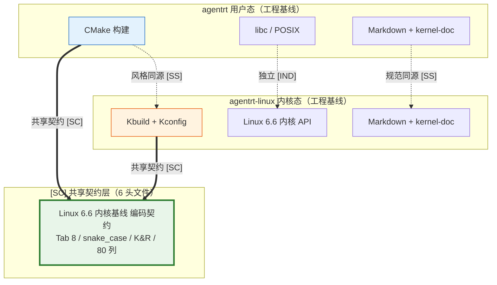

Copyright (c) 2025-2026 SPHARX Ltd. All Rights Reserved.

# agentrt-linux（AirymaxOS）工程基线

> **文档定位**：agentrt-linux（AirymaxOS）工程基线（Engineering Baseline）的完整定义与落地规范\
> **版本**：0.1.1\
> **最后更新**：2026-07-09\
> **父文档**：[架构设计](README.md)

---

## 1. 工程基线概述

### 1.1 什么是工程基线

**工程基线**（Engineering Baseline）是 agentrt-linux 在工程实践层面统一遵循的最小完备规范集合。它锁定内核版本、架构支持、包管理、安全模型、系统服务、AI 原生能力、治理模式与版本节奏等关键工程维度，为 8 子仓的协同开发、跨团队协作与跨版本演进提供不可动摇的参考基准。

工程基线存在的核心价值：

| 价值 | 说明 |
|------|------|
| **统一表述** | 所有文档、代码注释、对外材料统一使用基线术语，杜绝表述漂移 |
| **统一节奏** | 内核、用户态、测试、文档按同一版本节奏推进，避免错位 |
| **统一边界** | 明确哪些特性属于 1.0.1 基线、哪些属于下一代基线，防止误引（见 IRON-10 / BAN-361） |
| **统一兼容性** | 对外声明一致的兼容性边界，便于上层应用与硬件生态对接 |

### 1.2 工程基线的四条铁律

| 铁律 | 内容 | 关联工程纪律 |
|------|------|--------------|
| **基线锁定** | 1.x.x 长期锁定 Linux 6.6 LTS，2.x.x 长期锁定 Linux 7.1（ADR-013）。禁止引用未来内核专属特性作为当前基线原生能力 | IRON-10 / BAN-361 / ADR-013 |
| **表述纯净** | 所有文档使用 agentrt-linux 自身工程语言表述，不引入任何外部参考来源措辞 | ACC-OS04 |
| **同源约束** | 与 agentrt 同源且部分代码共享（IRON-9 v2），基线落地遵循 IRON-9 v2 | IRON-9 v2 |
| **演进可控** | 基线演进必须通过 ADR 评审，禁止未经评审的基线漂移 | ADR 流程 |

### 1.3 工程基线与三大支柱的关系

agentrt-linux 架构设计建立在三大支柱之上：微内核设计思想、agentrt-linux 工程基线、Airymax 同源性。工程基线作为其中之一，提供"如何对接生态与工程实践"的标准：

- **微内核设计思想** 提供"如何设计内核"的方法论
- **agentrt-linux 工程基线** 提供"如何对接生态、如何表述工程"的基线（本文档）
- **Airymax 同源性** 提供"如何与 agentrt 协同"的语义约束

---

## 2. 内核基线

### 2.1 内核版本锁定

agentrt-linux 采用**双基线锁定策略**（ADR-013）：1.x.x 全系列长期锁定 Linux 6.6 LTS，2.x.x 全系列升级至 Linux 7.1。内核版本选择直接影响硬件兼容性、生态兼容性、新特性支持与长期支持周期。

| 基线版本 | Linux 内核 | agentrt-linux 定位 |
|----------|------------|-----------------|
| 当前基线（1.x.x） | **Linux 6.6 LTS**（维护至 2027-12） | 1.x.x 全系列长期锁定，基础内核 + 微内核化改造 |
| 增强基线（1.x.x） | Linux 6.6 LTS + sched_ext forward-port（主线 6.12+） | AI 原生能力增强（sched_ext 向前移植） |
| 下一代基线（2.x.x） | **Linux 7.1**（2026-06-14 发布，非 LTS） | 具身智能 / 超节点沙箱 / sched_ext cgroup 子调度器 / BPF-powered io_uring |

### 2.2 基线内核特性映射

Linux 6.6 内核基线提供以下原生特性，全部纳入 agentrt-linux 工程基线：

| 特性 | 内核版本 | 来源 | agentrt-linux 落地 |
|------|----------|------|----------------|
| EEVDF 调度器 | Linux 6.6 原生 | 主线 | kernel 调度核心 |
| Rust 实验性支持 | Linux 6.6 | 主线 | kernel 安全驱动 |
| MGLRU（多代 LRU） | Linux 6.6 | 主线 | memory 冷热分层 |
| XFS 在线 fsck | Linux 6.6 | 主线 | services 文件系统 |
| eBPF kfunc + dynamic pointer | Linux 6.6 原生 | 主线 | security 可观测性 |
| io_uring 异步 I/O 改进 | Linux 6.6 | 主线 | kernel + services IPC |
| BPF + io_uring 集成 | Linux 6.6 | 主线 | security 策略可插拔 |
| sched_ext（SCHED_AGENT） | agentrt-linux 内核增强 | 主线 6.12+ | kernel 用户态调度 |

### 2.3 内核增强策略

对于主线 6.12+ 才稳定但 agentrt-linux 1.0.1 必需的特性（如 sched_ext），采用 **agentrt-linux 内核增强** 策略引入，而非等待主线 6.6 原生支持：

```
Linux 6.6 原生特性（EEVDF / Rust / MGLRU / XFS fsck / eBPF kfunc / io_uring）
    +
agentrt-linux 内核增强（sched_ext 等，主线 6.12+ 特性向前移植）
    =
agentrt-linux 1.0.1 完整内核基线
```

**增强边界**：仅增强 agentrt-linux 微内核化改造与 AI 原生能力所必需的特性，不引入与基线目标无关的主线特性。

### 2.4 内核基线的工程纪律

| 纪律 | 内容 |
|------|------|
| 禁止误引 | 禁止引用 6.7+ 主线特性作为 6.6 原生能力（IRON-10 / BAN-361 / ACC-OS04） |
| 统一表述 | 所有文档统一使用"Linux 6.6 内核基线"表述 |
| 增强透明 | 所有 agentrt-linux 内核增强必须标注"主线 X.Y+ 特性增强"，禁止伪称为原生 |
| 演进评审 | 基线升级（如 6.6 → 6.15+）必须通过 ADR 评审 |

---

## 3. 架构支持基线

### 3.1 多架构支持

agentrt-linux 工程基线支持以下 CPU 架构：

| 架构 | 厂商 / 实现 | 优先级 |
|------|-------------|--------|
| x86 | Intel / AMD | 1.0.1 优先支持 |
| ARM | 鲲鹏 / 飞腾 / Ampere | 1.0.1 优先支持 |
| RISC-V | 通用 RISC-V | 后续扩展 |
| LoongArch | 龙芯 | 后续扩展 |

### 3.2 异构内存支持

| 内存类型 | 内核特性 | agentrt-linux 落地 |
|----------|----------|----------------|
| CXL 内存池化 | Linux 6.6 CXL 支持 | memory L1 跨节点池化 |
| PMEM 持久化内存 | Linux PMEM 支持 | memory 持久化层 |
| MGLRU 多代 LRU | Linux 6.6 MGLRU | memory 冷热数据分代回收 |

---

## 4. 子仓治理组基线

### 4.1 治理组对应表

agentrt-linux 采用 **子仓治理组**（Sub-repository Governance Group）模式组织工程协作。每个子仓对应一个治理组，负责技术决策与代码审查：

| agentrt-linux 治理组 | 对应子仓 | 核心职责 |
|------------------|----------|----------|
| Kernel 治理组 | kernel | 内核 + 微内核化改造 |
| Base Systems 治理组 | services + system | 用户态服务 + 系统工具 |
| Security 治理组 | security | 安全子系统 + 国密 |
| Memory 治理组 | memory | 记忆持久化 + 异构内存 |
| Cognition 治理组 | cognition | 认知运行时 + 超节点沙箱 |
| Cloud Native 治理组 | cloudnative | K8s + containerd + 超节点 OS |
| QA 治理组 | tests-linux | 集成测试框架 + 形式化验证 |
| Embedded 治理组 | cognition（部分） | 具身智能支持 |

### 4.2 治理模式

agentrt-linux 子仓治理模式遵循以下原则：

1. **每个子仓对应一个治理组**：治理组负责技术决策和代码审查
2. **社区开放**：欢迎外部贡献，治理组负责审查与合入
3. **能力域清晰**：8 子仓严格按微内核能力域划分，无功能重叠
4. **层次纪律**：治理组之间的依赖遵循 S-2 层次分解原则（kernel → services/security/memory/cognition → cloudnative → system → tests-linux）
5. **独立演进**：每个子仓可独立测试和演进，通过接口契约协同

---

## 5. AI 原生能力基线

agentrt-linux 作为 Agentic OS，AI 原生能力是工程基线的核心组成。以下能力构成 agentrt-linux 1.0.1 ~ 2.0+ 的 AI 原生演进路线。

### 5.1 认知循环系统

**agentrt-linux 认知循环**（CoreLoopThree）是 cognition 子仓的核心能力，与 agentrt 同源：

| 维度 | 规格 |
|------|------|
| 实现语言 | Rust |
| 内存占用 | 仅 25M |
| 启动时间 | 0.1 秒极速启动 |
| Token 成本管控 | 可精细管控 Token 成本 |
| 回滚能力 | 支持毫秒级回滚 |
| 内核集成 | CoreLoopThree kthread（内核线程） |

**agentrt-linux 落地**：cognition 实现 agentrt-linux 认知循环，与 agentrt 的 CoreLoopThree 同源，作为内核态认知运行时。

### 5.2 超节点 OS

**agentrt-linux 超节点 OS** 是 cloudnative 子仓的核心能力，支持大规模 Agent 容器化部署：

| 维度 | 规格 |
|------|------|
| AI 故障定位 | AI 实现开箱即用和故障定位 |
| RPC 时延 | RPC 时延下降 20% |
| 异构互联 | 通过超节点异构统一互联底座 UMDK |
| 容器通信 | 实现大规模容器低时延通信 |

**agentrt-linux 落地**：cloudnative 实现超节点 OS，支持大规模 Agent 容器化部署与跨节点低时延协同。

### 5.3 超节点沙箱

**agentrt-linux 超节点沙箱** 是 cognition 子仓的 Agent 快速冷启动能力：

| 维度 | 规格 |
|------|------|
| 镜像快照 | 软硬协同优化镜像快照 |
| 懒加载 | 远端懒加载、分层按需加载 |
| 冷启动 | 大幅缩短冷启动耗时 |
| 基线版本 | Linux 7.1（2.x.x 基线，ADR-013） |

**agentrt-linux 落地**：cognition 实现超节点沙箱，支持 Agent 快速冷启动，与 Wasm 3.0 沙箱运行时集成（ADR-008）。

### 5.4 Token 能效框架

**agentrt-linux Token 能效框架**（Token Energy Efficiency Framework）实现 Token 消耗的边际递减：

| 层级 | 组件 | 职责 |
|------|------|------|
| 网关层 | KVC-Gateway | 精准调度 Token 请求 |
| 缓存层 | LMCache | 多级内存池化复用 |
| 响应层 | Bifrost | 弹性响应与负载自适应 |

**agentrt-linux 落地**：cognition 实现 Token 能效优化，让 Token 消耗走向边际递减，支撑 Agentic OS 的成本可控性。

### 5.5 具身智能 Claw

**agentrt-linux 具身智能** 支持 Agent 与物理世界的交互：

| 维度 | 规格 |
|------|------|
| 开箱即用 | 行业首个开箱即用的具身智能解决方案 |
| 系统融合 | 融合 AI 与 ROS 系统 |
| 场景切换 | 支持真实/仿真场景无缝切换 |
| 基线版本 | Linux 7.1（2.x.x 基线，ADR-013） |

**agentrt-linux 落地**：cognition 实现具身智能支持，由 Embedded 治理组协同推进。

### 5.6 Agentic AI 架构演进

agentrt-linux 对标 Agentic OS 三阶段演进路线：

| 阶段 | 名称 | 特征 | agentrt-linux 定位 |
|------|------|------|-----------------|
| 阶段 1 | 资源抽象 | 传统 OS | 不在此阶段 |
| 阶段 2 | 异构融合 | AI 原生 OS | 1.0.1 部分覆盖 |
| 阶段 3 | 意图协同 | Agentic OS | agentrt-linux 直接对标此阶段 |

**agentrt-linux 落地**：agentrt-linux 直接对标第三阶段"意图协同"，作为 Agentic OS，认知循环 + 超节点 OS + Token 能效框架共同构成意图协同的工程基座。

---

## 6. 技术规格基线

### 6.1 包管理基线

| 维度 | agentrt-linux 基线 |
|------|----------------|
| 包格式 | RPM |
| 包管理器 | dnf |
| 软件源 | repo.airymaxos.org |
| 构建工具 | agentrt-linux 构建工具链 |

### 6.2 安全基线

| 维度 | agentrt-linux 基线 |
|------|----------------|
| 强制访问控制 | SELinux + capability（seL4 风格） |
| 国密算法 | SM2 / SM3 / SM4 |
| 漏洞响应 | agentrt-linux-SA |
| 审计 | auditd + eBPF 可观测性 |
| 机密计算 | TEE / SGX |
| 审计哈希链 | SHA-256 哈希链不可篡改日志 |
| 运行时保护 | Seccomp + CFI（控制流完整性） |

### 6.3 系统服务基线

| 维度 | agentrt-linux 基线 |
|------|----------------|
| 初始化系统 | systemd |
| 服务管理 | agentctl（兼容 systemctl） |
| 日志 | journald + Airymax 日志系统（结构化 + trace_id） |
| 网络 | NetworkManager + eBPF 网络 |
| 命令行 | agentctl（兼容 kubectl 语法） |

---

## 7. 工程规范基线

### 7.1 编码规范

agentrt-linux 工程基线要求所有代码遵循 `50-engineering-standards/10-coding-style/` 中的编码规范文件，覆盖 C / Rust / Python / Go / TypeScript 等语言。

### 7.2 接口契约规范

所有跨模块交互必须通过明确定义的接口进行，接口契约通过 `30-interfaces/` 文档定义：

| 契约载体 | 位置 | 内容 |
|----------|------|------|
| syscall 接口 | `30-interfaces/01-syscalls.md` | 系统调用编号、签名、参数方向、所有权 |
| IPC 协议 | `30-interfaces/02-ipc-protocol.md` | 128B 消息头 + 5 种 payload 协议 |
| SDK API | `30-interfaces/03-sdk-api.md` | Python/Rust/Go/TS 四语言 SDK |
| 编码规范 | `30-interfaces/` 全部 5 文档 | syscall + IPC + SDK + 编码规范 |

### 7.3 工程铁律

agentrt-linux 工程基线受以下工程铁律约束：

| 铁律 | 内容 |
|------|------|
| IRON-9 | agentrt 和 agentrt-linux 同源且部分代码共享（IRON-9 v2：共享契约层代码完全共享 + 语义同源层高层 API 语义同源（签名因抽象层级独立演进） + 完全独立层各自独立） |
| IRON-10 | 内核基线锁定，禁止引用未来内核专属特性作为 6.6 原生能力 |
| BAN-361 | 禁止未来内核特性误引 |
| ACC-OS04 | Grep 扫描未来内核误引残留（每次发布执行） |

---

## 8. 版本管理基线

### 8.1 版本节奏

agentrt-linux 采用两类版本节奏：

| 版本类型 | 发布周期 | 支持周期 |
|----------|----------|----------|
| LTS 版本 | 2 年发布周期 | 4 年支持 |
| 创新版本 | 6 个月发布周期 | 滚动更新 |
| Update 版本 | 每周发布 | 持续 |

### 8.2 agentrt-linux 版本规划

| 版本 | 日期 | 内核基线 | 定位 |
|------|------|----------|------|
| 0.1.1 | 2026 | Linux 6.6 | 文档体系完成（设计草案 + 工程标准） |
| 1.x.x | 2027+ | **Linux 6.6 LTS 长期锁定**（维护至 2027-12） | 首个开发版本，全系列长期锁定 Linux 6.6（ADR-013） |
| 2.x.x | 规划中 | **Linux 7.x 系列（从 7.1 起步，跟踪至 7.x LTS）** | 下一代基线，以 7.x 系列为内核基线（ADR-013）。7.1 非 LTS，2.x.x 初期以 7.1 为开发基线，跟踪 7.x stable 更新，7.x LTS 发布后（推测 7.4/7.5，2026 末确认）切换至 LTS。前瞻性预留见 §8.4 |

### 8.3 内核基线演进

| agentrt-linux 版本 | 内核基线 | 关键能力 |
|----------------|----------|----------|
| 1.x.x | **Linux 6.6 LTS 长期锁定** | sched_ext + eBPF kfunc + io_uring + 微内核化改造阶段 1-2（VFS / 网络栈 / 驱动用户态化） |
| 2.x.x | **Linux 7.x 系列（从 7.1 起步，跟踪至 7.x LTS）** | 完整微内核化 + 超节点沙箱 + 具身智能 + sched_ext cgroup 子调度器 + BPF-powered io_uring + ublk zero-copy + clone3 新 flag |

> **版本基线锁定战略决策**（ADR-013）：1.x.x 全系列长期锁定 Linux 6.6 LTS（维护至 2027-12），2.x.x 全系列以 Linux 7.x 系列为内核基线（从 7.1 起步，跟踪至 7.x LTS）。7.1 非 LTS，风险通过"跟踪 stable 更新 + 自维护补丁 + 7.x LTS 发布后切换"缓解。迁移遵循「兼容性评估 → 兼容层先行 → 渐进式基线切换 → 功能验证 → 性能测试 → 旧基线 EOL」五阶段路径。详见 §8.4 Linux 7.1 前瞻性预留设计。

### 8.4 Linux 7.1 前瞻性预留设计（2.x.x）

> **设计原则**（IRON 铁律约束）：所有前瞻性预留必须以「运行时能力探测 + 条件降级」实现，而非「假设未来内核一定有」。禁止 `#ifdef` 污染内核源码，禁止引入未实现功能，禁止桩函数。
>
> **参考来源**：基于 kernel.org 官方发布表 + kernelnewbies.org + LWN + Phoronix 多方交叉验证。

#### 8.4.1 Linux 7.1 发布状态与 LTS 判定

| 维度 | 状态 |
|------|------|
| 发布日期 | 2026-06-14（Linus Torvalds 发布） |
| 当前版本 | 7.1.3（截至 2026-07-04） |
| LTS 状态 | **非 LTS**（不符合年末假期季发布惯例） |
| 6.x → 7.x 编号原因 | 纯美学（Linus"指与趾计数"惯例），无架构性断裂 |
| 当前 6.6 LTS EOL | 2027-12（剩余约 17 个月） |
| 下一个 7.x LTS 推测 | 7.4 或 7.5（2026 末确认，非官方） |

#### 8.4.2 对 agentrt-linux 2.x.x 最有价值的 Linux 7.1 能力

| 优先级 | 7.1 能力 | 对应 agentrt-linux 模块 | 简化点 |
|--------|---------|----------------------|--------|
| 1 | sched_ext cgroup 子调度器 | kernel（调度）+ security（安全分级） | per-cgroup 调度策略无需自定义 SCHED_AGENT |
| 2 | BPF-powered io_uring + ublk zero-copy | kernel（I/O 路径） | 用户态块设备性能追平内核驱动 |
| 3 | clone3: CLONE_AUTOREAP / CLONE_NNP / CLONE_PIDFD_AUTOKILL | services（进程/容器管理） | Agent 生命周期与 pidfd 绑定、自动 reap |
| 4 | FSMOUNT_NAMESPACE + CLONE_EMPTY_MNTNS + MOVE_MOUNT_BENEATH | services（容器） | 单步构造容器 mount 树，免 pivot_root |
| 5 | Landlock UNIX socket hook + user.* xattr on socket | security（沙箱）+ kernel（IPC） | IPC 端点可标注协议，eBPF 选择性抓包 |
| 6 | swap table phase III（移除 swap_map，1TB swap 省 256MB） | kernel（内存） | 大规模 swap 场景元数据内存节省 |
| 7 | hrtimer 重写 | kernel（实时性） | 调度器可无损耗用高精度定时器 |
| 8 | PREEMPT_LAZY 默认启用 + PREEMPT_RT 主线化 | kernel（实时） | 无需单独 RT 补丁树 |
| 9 | fserror API + XFS 自愈 | services（FS） | 标准化 I/O 错误上报，XFS 挂载态自愈 |
| 10 | KHO（kexec handover）+ liveupdate | services（无停机升级） | kexec 保留状态，契合无停机升级诉求 |

#### 8.4.3 可能与 agentrt-linux 设计冲突的 Linux 7.1 变化

| 冲突点 | 风险 | 缓解策略 |
|--------|------|---------|
| IPv6 不可再编译为模块 | 嵌入式 defconfig `CONFIG_IPV6=m` 失效 | 迁移前做 defconfig 审计，强制 `CONFIG_IPV6=y` |
| UDP-Lite 协议移除 | 低开销传输栈受影响 | 改用标准 UDP 或 io_uring zero-copy recv |
| 486/ISDN/AX.25/CAIF/hamradio 整体移除（140k+ 行） | 旧硬件/旧协议支持丢失 | 评估目标硬件清单 |
| buffer_head → folio 迁移 | out-of-tree 驱动需重写 | 提前迁移自定义块驱动 |
| inode->i_ino 类型 unsigned long → u64 | 自定义 FS 驱动需适配 | 编译期静态检查 |
| Rust 工具链最低要求 1.85 + bindgen 0.71.1 | 构建 Rust 内核代码工具链升级 | 锁定工具链版本，CI 门禁 |
| 7.2 预期 Clang 17 最低要求 | 构建 LLVM 工具链升级 | 提前规划工具链基线 |
| 7.0 EEVDF proxy execution | 锁持有者行为变化可能影响实时性基准 | 重测实时性指标 |

#### 8.4.4 十条前瞻性预留设计具体建议

> 遵循 IRON 规则——所有预留必须以「运行时能力探测 + 条件降级」实现，而非「假设未来内核一定有」。预留入口统一为 `airy_kernel_cap_query(cap_id)` 框架（建议 10），避免散落各模块的 `#ifdef` 污染。

**建议 1：调度类复用 sched_ext，禁用 SCHED_AGENT 自定义类**

在调度接口契约中，将「调度策略」抽象为 BPF struct_ops 接口。当 7.1 cgroup 子调度器可用时启用 per-cgroup 策略，否则降级为单 sched_ext 实例。预留 `airy_sched_ext_ops` 结构体，但 2.x.x 不默认启用 cgroup 子调度器（避免依赖未稳定 ABI）。

**建议 2：进程生命周期 API 全面 pidfd 化**

进程/容器管理统一使用 pidfd + clone3。接口层预留 `CLONE_AUTOREAP | CLONE_NNP | CLONE_PIDFD_AUTOKILL` 三个 flag 的运行时探测（通过 `syscall(__NR_clone3, ...)` 返回 `EINVAL` 判定）。2.x.x 在 6.6 上降级为现有 pidfd 语义。

**建议 3：容器 mount 树构造抽象为 `airy_mount_ns_create()` 接口**

内部按内核能力分级：7.1 用 `FSMOUNT_NAMESPACE | CLONE_EMPTY_MNTNS` 单步完成；6.6 降级为 `open_tree(OPEN_TREE_NAMESPACE)` + `pivot_root`。容器 C 契约需预留「mount namespace 构造策略」枚举。

**建议 4：io_uring + ublk 作为 I/O 一等公民**

在块 I/O 接口中，预留 `AIRY_IO_URING_BPF` 与 `AIRY_IO_UBLK_ZC` 两个能力位。策略裁决可通过 BPF struct_ops 注入 io_uring 主循环（7.1）。2.x.x 在 6.6 上降级为标准 io_uring（无 BPF 主循环）。zero-copy recv 在 6.15+ 可用，6.6 降级为标准 recv。

**建议 5：Landlock 沙箱覆盖 UNIX socket**

沙箱策略层预留 `AIRY_LANDLOCK_SOCKET` 能力位。当 7.1 socket hook 可用时启用 pathname UNIX socket 访问控制，否则仅覆盖文件系统。同时利用 7.1 的 `user.* xattr on socket` 实现 IPC 协议标注，协议注册表应预留 socket xattr 查询接口。

**建议 6：后量子密码预留**

模块签名链预留 ML-DSA（FIPS 204）算法支持。7.0 已集成 ML-DSA 到内核模块签名，2.x.x 在 6.6 上降级为传统 RSA/ECDSA，但证书与签名格式应预留 PQ 混合签名扩展位。

**建议 7：PREEMPT 模型运行时选择**

Kconfig 默认 `CONFIG_PREEMPT_LAZY=y`（对齐 7.0 默认），同时保留 `CONFIG_PREEMPT_FULL` 与 `CONFIG_PREEMPT_RT` 选项给工控/车载场景。在文档中明确三档抢占模型与 < 10ms 实时响应目标的对应关系。

**建议 8：NPU/GPU 调度基于 accel 子系统，不期待内核 AI 调度类**

agentrt-linux 的 NPU 调度能力应通过 `drivers/accel/` + DRM-RAS（7.1）构建用户态策略层，内核仅暴露 accel 设备的 sysfs/debugfs 接口。明确文档化「主线无 AI 调度类」，避免社区误导。

**建议 9：构建工具链基线锁定与渐进升级**

工程标准应明确：2.x.x 锁定 Rust 1.85 + bindgen 0.71.1（7.1 基线）、Clang/LLVM 15（6.6/6.18 基线）；3.x.x 预留 Clang 17（7.2 基线）。checkpatch 规则映射需对齐 7.1 的 kernel-doc C tokenizer 重写带来的注释规范变化。

**建议 10：版本能力探测框架（前瞻性预留总入口）**

在公共库层实现 `airy_kernel_cap_query(cap_id)` 框架，集中管理所有 7.1/7.0/6.18/6.12/6.6 的能力探测（clone3 flags、FSMOUNT_NAMESPACE、Landlock socket hook、io_uring struct_ops、ublk zero-copy、ML-DSA、FRED、sched_ext cgroup sub-sched、PREEMPT_LAZY、KHO/liveupdate 等）。每个能力点配 `since` 标签与运行时探测函数 + 降级路径。这是 2.x.x 前瞻性预留的**总入口**，避免散落各模块的 `#ifdef` 污染。

#### 8.4.5 迁移路径规划

| 阶段 | 时间 | 策略 |
|------|------|------|
| 兼容性评估（1.x.x 后期） | 2027+ | defconfig 审计（6.6→7.1 配置差异）+ breaking changes 评估（8 项）+ 工具链基线评估（Rust 1.85 / Clang）+ 硬件支持清单评估 |
| 兼容层先行（1.x.x→2.x.x 过渡） | 2027+ | 实现 `airy_kernel_cap_query()` 框架 + 10 项能力探测 + 降级路径 + 接口契约前瞻性预留 + 在 6.6 上验证降级路径正确性 |
| 渐进式基线切换（2.x.x 初期） | 2.x.x | 内核源码基线从 6.6 切换至 7.1 + defconfig 适配（CONFIG_IPV6=y 等）+ 自定义驱动迁移（buffer_head→folio）+ 编译验证 + 单元测试 |
| 功能验证（2.x.x 中期） | 2.x.x | 全量回归测试套件（KUnit + Kselftest + LTP，P0 100% 通过）+ 7.1 新能力功能验证（10 项）+ breaking changes 影响验证 + 兼容性测试套件 |
| 性能测试（2.x.x 中后期） | 2.x.x | 8 维度性能基准（见 §8.4.6）+ 性能回归分析 + 性能调优 + 性能 SLO 验证 |
| LTS 切换 + 旧基线 EOL（2.x.x 后期） | 2.x.x | 7.x LTS 发布后切换至 LTS + 6.6 基线支持终止 + 安全公告迁移 + 用户迁移通知 |

#### 8.4.5.1 迁移验证检查点

| 阶段 | 验证检查点 | 通过标准 |
|------|-----------|----------|
| 兼容性评估 | defconfig 差异报告 + breaking changes 评估报告 | 8 项 breaking changes 全部有处理策略 |
| 兼容层先行 | `airy_kernel_cap_query()` 框架就绪 | 10 项能力探测全部实现 + 降级路径验证通过 |
| 渐进式基线切换 | 6.6→7.1 基线切换 | 编译通过 + 现有测试 0 回归 |
| 功能验证 | 全量回归测试套件 | P0 测试 100% 通过 + 7.1 新能力验证通过 |
| 性能测试 | 8 维度性能基准 | 全部达标（见 §8.4.6） |
| 旧基线 EOL | 6.6 支持终止 | 安全公告迁移完成 + 用户通知发布 |

#### 8.4.6 性能测试规划（2.x.x 迁移）

2.x.x 从 6.6 LTS 迁移至 7.x 系列后，必须验证性能不退化（或提升）。性能测试分 8 个维度：

| 测试维度 | 测试项 | 基准（6.6 LTS） | 目标（7.x） | 工具 |
|----------|--------|-----------------|-------------|------|
| 调度性能 | SCHED_AGENT 调度延迟 P99 | 6.6 基线值 | ≤ 基准 110% | perf + sched_stat |
| IPC 性能 | AgentsIPC 小消息延迟 | 6.6 基线值 | ≤ 200 cycles | 微基准测试 |
| 内存性能 | MGLRU 回收效率 | 6.6 基线值 | ≥ 基准 100% | stress-ng + /proc/vmstat |
| I/O 性能 | io_uring 吞吐量 | 6.6 基线值 | ≥ 基准 105% | fio + io_uring |
| 实时性 | PREEMPT_RT 调度延迟 | 6.6 基线值 | ≤ 10ms | cyclictest |
| Agent 性能 | Token 能效（Token/Watt） | 6.6 基线值 | ≥ 基准 100% | RAPL + Token 计数 |
| 启动性能 | 系统启动时间 | 6.6 基线值 | ≤ 基准 120% | systemd-analyze |
| 稳定性 | 7×24h 压力测试 | 无崩溃 | 0 crash | stress-ng + LTP |

**性能基准建立流程**：
1. 在 6.6 LTS 基线上运行 8 维度性能基准，记录基线值
2. 在 7.x 基线上运行相同基准，记录对比值
3. 计算性能变化比（对比值 / 基线值）
4. 生成性能回归报告
5. 性能退化项（变化比 > 110%）触发性能调优

**性能 SLO 验证**：

| SLO 指标 | 6.6 基线 | 7.x 目标 | 验证方法 |
|----------|----------|----------|----------|
| Agent 调度延迟 P99 | < 50us | ≤ 50us | perf sched stat |
| AgentsIPC 延迟 | < 200 cycles | ≤ 200 cycles | 微基准 |
| Token 能效 | 基线值 | ≥ 100% | RAPL |
| 系统启动时间 | 基线值 | ≤ 120% | systemd-analyze |
| 实时响应 | < 10ms | ≤ 10ms | cyclictest |

> **重要澄清**：主线 Linux 7.0/7.1 **没有**「AI Subsystem Framework」「内核级 AI 预测引擎」「NPU 调度类」等（CSDN 不实信息已排除）。AI 在 7.0/7.1 中的体现是**间接**的：accel 子系统（drivers/accel/）+ AMD NPU 驱动（amdxdna）+ DRM-RAS（7.1）。agentrt-linux 若需 NPU/GPU 调度能力，应基于 accel 子系统构建用户态策略层。

---

## 9. 文档体系基线

### 9.1 文档类型

| 文档类型 | agentrt-linux 基线 |
|----------|----------------|
| 技术白皮书 | agentrt-linux 技术白皮书 |
| 安装指南 | agentrt-linux 安装指南 |
| 管理员指南 | agentrt-linux 管理员指南 |
| 开发者指南 | agentrt-linux 开发者指南 |
| API 参考 | docs.airymaxos.org |
| 安全公告 | agentrt-linux SA |

### 9.2 文档层级

agentrt-linux 设计文档采用 19 模块三层体系，与根 [README.md](../README.md) 导航保持一致：

| 层级 | 目录范围 | 模块数 | 0.1.1 状态 | 内容 |
|------|---------|--------|-----------|------|
| **核心设计层** | `00-requirements/` ~ `40-dataflows/` | 5 模块 | 28 文档 完成 | 需求 + 架构 + 模块 + 接口 + 数据流 |
| **工程标准与实施层** | `50-engineering-standards/` ~ `130-roadmap/` | 9 模块 | 51 文档 完成 | 工程标准 + 驱动 + 构建 + 测试 + 可观测 + 运维 + 安全 + 流程 + 路线图 |
| **延伸层** | `140-application-development/` ~ `190-distribution/` | 5 模块 | 6 README 占位 | 应用开发 + 云原生 + 兼容性 + 性能 + 国际化 + 发行版 |

**0.1.1 合计 ~85 文档**（核心 28 + 实施层 51 + 延伸层 6 README 占位 + 根 README 等），**1.0.1 扩展到 ~140 文档**。

详细模块导航见根 [README.md](../README.md) §4 文档体系结构。

### 9.3 文档即代码

文档与代码同步更新（E-7 文档即代码原则）：

1. 文档作为代码的一部分进行版本控制
2. 文档变更与代码变更同 PR 提交
3. 过时文档比没有文档更糟糕，必须及时更新
4. 所有公共 API 必须有 Doxygen 契约注释

---

## 10. 兼容性声明

agentrt-linux 工程基线声明以下兼容性：

- 兼容企业级 Linux 生态的 RPM 包格式
- 兼容企业级 Linux 生态的 dnf 包管理器
- 兼容企业级 Linux 生态的 systemd 服务管理
- 兼容企业级 Linux 生态的安全模块（SELinux）
- 兼容企业级 Linux 生态的国密算法（SM2/SM3/SM4）
- 兼容企业级 Linux 生态的架构支持（x86 / ARM / RISC-V / LoongArch）
- 基于 Linux 6.6 内核基线，与企业级 Linux 内核同源
- 兼容 agentrt-linux 超节点 OS 设计（大规模容器低时延通信）

### 10.1 openEuler Euler API 兼容性策略

agentrt-linux 全面参考 openEuler 24.03 LTS / 26.03 的 Euler API 用户态接口规范，在工程实践层面保持与 Euler 标准的强对齐。兼容性策略遵循 IRON-9 v2 三层共享模型：

| 层次 | Euler API 兼容策略 | 落地方式 |
|------|-------------------|---------|
| **[SC] 共享契约层** | 共享类型定义与 IPC 契约与 Euler API 语义对齐（如 capability 模型、IPC 消息头布局参考 Euler IPC 规范演进） | 6 个 [SC] 头文件（memory_types.h / security_types.h / cognition_types.h / sched.h / ipc.h / syscalls.h）在 agentrt 与 agentrt-linux 间共享，语义与 Euler API 对齐 |
| **[SS] 语义同源层** | 高层 API 语义与 Euler API 保持同源（如 12 daemons 语义对应 Euler 系统服务、io_uring IPC 原语对应 Euler IO 接口） | API 签名独立演进，语义操作一致，详见 `20-modules/02-services.md` §6.2 [SS] 语义同源层 20 项 API 映射 |
| **[IND] 独立层** | agentrt-linux syscall 编号体系独立（AIRY_SYS_ 前缀，12 核心 + 12 预留 = 24 槽位），不复用 Euler API 编号 | capability invocation 统一入口 `airy_sys_call` 消除独立 syscall 需求，编号体系详见 `30-interfaces/01-syscalls.md` |

**关键声明**：

1. **Euler API 语义对齐**——agentrt-linux 在 [SC] 和 [SS] 层面与 Euler API 保持语义同源，确保应用层在 agentrt-linux 与 openEuler 之间的可移植性。
2. **syscall 编号独立**——agentrt-linux 拥有独立的 syscall 编号体系（AIRY_SYS_0~11 核心 + AIRY_SYS_12~23 预留），不直接复用 Euler API 的 syscall 编号。这是 IRON-9 v2 "同源且独立"原则的体现：语义同源，编号独立。
3. **包格式兼容**——agentrt-linux 兼容 Euler API 的 RPM 包格式和 dnf 包管理器，支持直接安装 openEuler 生态的 RPM 包。
4. **安全模型对齐**——agentrt-linux 的 capability 安全模型与 Euler API 的安全模块（SELinux）在语义层对齐，但实现路径独立（agentrt-linux 用 Cupolas capability 模型 + LSM 钩子）。
5. **演进策略**——agentrt-linux 跟踪 openEuler 24.03 LTS / 26.03 的 Euler API 演进，通过 ADR 评审决定是否同步新特性，禁止未经评审的基线漂移（IRON-10 / BAN-361）。

---

## 11. 基线验证

### 11.1 基线符合性检查

| 检查项 | 工具 | 频率 |
|--------|------|------|
| 内核基线表述 | ACC-OS04（Grep 扫描禁词与误引残留） | 每次发布 |
| 接口契约完整性 | scripts/check_api_complexity.sh | 每次 PR |
| 层次依赖检查 | scripts/check_layer_deps.py | 每次 PR |
| 文档同步检查 | CI 流水线文档校验 | 每次 PR |
| 测试覆盖率 | CI 流水线 lcov | 每次 PR |

### 11.2 基线违反处理

当发现基线违反时，按以下流程处理：

1. **记录违规**：在代码审查中标注违反的基线项
2. **评估影响**：分析违规对系统的影响程度
3. **制定方案**：提出符合基线的替代方案
4. **实施整改**：修改代码以符合基线
5. **验证合规**：重新检查基线符合性
6. **ADR 记录**：严重违规需创建 ADR 记录决策

---

## 12. 相关文档

- [架构设计 README](README.md)：架构设计层总览
- [系统架构](01-system-architecture.md)：agentrt-linux 系统架构总览
- [五维正交原则](02-five-dimensional-principles.md)：五维正交 24 原则落地映射
- [微内核策略](03-microkernel-strategy.md)：微内核化改造策略
- [架构决策记录](05-adrs.md)：14 个核心 ADR（含 ADR-011~014：架构模型论证 / 微内核路线 / 版本基线锁定 / 微内核来源单一化）
- [架构原则](../../AirymaxRT/00-architectural-principles.md)：五维正交 24 原则的完整定义

---

## 12.1 IRON-9 v2 三层共享模型

> **OS-ARCH-007**： 工程基线在 agentrt（CMake / libc / POSIX）与 agentrt-linux（Kbuild / Kconfig / Linux 6.6）间遵循 IRON-9 v2 三层共享模型——编码契约经 [SC] 共享，构建系统与平台适配落入 [IND] 各自独立，禁止在双端工程基线间引入构建兼容垫片。

### 三层模型概览

| 层次 | 共享程度 | 工程基线映射 |
|------|---------|-------------|
| **[SC] 共享契约层** | 完全共享代码 | 6 头文件编码契约（Linux 6.6 内核基线：Tab 8 / snake_case / 最小 typedef / K&R / 80 列 / errno+goto / kernel-doc），物理宿主 `kernel/include/airymax/`，`-I` 引用 |
| **[SS] 语义同源层** | 高层 API 语义同源（概念操作一致），签名因抽象层级不同而独立演进 | agentrt CMake 模块 ↔ agentrt-linux 8 子仓 Kbuild 的工程规范同源 |
| **[IND] 完全独立层** | 完全独立 | 构建系统（CMake vs Kbuild + Kconfig）+ 平台适配（libc / POSIX vs Linux 6.6 内核 API） |

### [SC] 共享契约层——6 个头文件在工程基线中的角色

| 头文件 | 工程基线角色 | 编码契约 | 消费方 |
|--------|-------------|---------|--------|
| `sched.h` | magic 0x41475453 'AGTS' + SCHED_EXT=7 + MAC_MAX_AGENTS=1024 | kernel-doc + snake_case | kernel / cognition |
| `ipc.h` | magic 0x41524531 'ARE1' + 128B 消息头 | kernel-doc + errno | kernel / services |
| `syscalls.h` | 12 核心 syscall 编号 + 12 预留槽位| kernel-doc + K&R | kernel / cognition |
| `security_types.h` | 41 cap + 252 LSM + Cupolas blob | kernel-doc + minimal typedef | kernel / security |
| `memory_types.h` | MemoryRovol L1-L4 + GFP 掩码 | kernel-doc + 80 列 | kernel / memory |
| `cognition_types.h` | 三阶段枚举 + Thinkdual 模式 | kernel-doc + snake_case | kernel / cognition |

### [SS] 语义同源层——工程基线 agentrt ↔ agentrt-linux 映射

| 工程维度 | agentrt 实现（用户态） | agentrt-linux 实现（内核态） | 同源点 |
|---------|----------------------|---------------------------|--------|
| 构建规范 | CMake + libc / POSIX | Kbuild + Kconfig + Linux 6.6 | Linux 6.6 内核基线 编码风格 |
| 子仓治理 | 7 大模块（CMake target） | 8 子仓（Kconfig menu） | 模块边界同源 |
| 版本基线 | 跨平台独立演进 | 1.x.x 锁定 Linux 6.6 / 2.x.x 升级 7.1 | ADR-013 双基线 |
| 文档体系 | Markdown + kernel-doc | Markdown + kernel-doc | 文档规范同源 |
| AI 原生 | 用户态 Wasm 3.0 | 内核态 Wasm 3.0 + eBPF | Wasm 同源 |

### [IND] 完全独立层

| 独立项 | agentrt 实现 | agentrt-linux 实现 | 独立原因 |
|--------|-------------|-------------------|---------|
| 构建系统 | CMake | Kbuild + Kconfig | 工具链差异 |
| 平台适配 | libc / POSIX 跨三平台 | Linux 6.6 内核 API | IRON-1 二进制兼容约束 |
| 内核基线 | 无（用户态运行时） | Linux 6.6 LTS 锁定 | 内核态独有 |
| 调度原语 | 用户态协程 | sched_ext + eBPF | 跨平台约束 |

### 跨态协作流



> **OS-ARCH-008**： 工程基线跨态协作遵循"契约共享、构建独立"原则——6 头文件编码契约经 [SC] 直接共享，CMake 与 Kbuild 经 [SS] 风格同源但工具链独立落入 [IND]，禁止生成 `build_compat shim` 或构建兼容垫片。

---

## 13. 版本历史

| 版本 | 日期 | 变更 |
|------|------|------|
| 0.1.1 | 2026-07-06 | 初始版本（含工程基线完整定义） |
| 0.1.1 | 2026-07-09 | 增补：双基线锁定策略（ADR-013）+ Linux 7.1 前瞻性预留设计（§8.4，10 条建议 + 迁移路径）+ 版本规划表更新 |
| 1.x.x | 2027+ | 首个开发版本，长期锁定 Linux 6.6 LTS（与代码实现同步验证） |
| 2.x.x | 规划中 | 下一代基线，升级至 Linux 7.1 |

---

Copyright (c) 2025-2026 SPHARX Ltd. All Rights Reserved.
