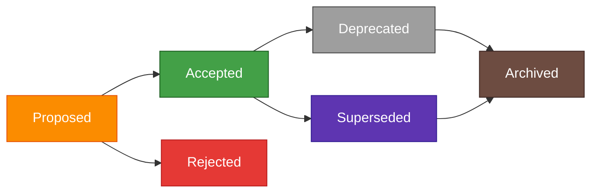

Copyright (c) 2025-2026 SPHARX Ltd. All Rights Reserved.

# agentrt-linux（AirymaxOS）架构决策记录（ADR）

> **文档定位**: agentrt-linux（AirymaxOS）架构决策记录（Architecture Decision Records）
> **版本**: 0.1.1（文档体系完成）/ 1.0.1（开发）
> **最后更新**: 2026-07-06
> **父文档**: [架构设计](README.md)
> **决策者**: Airymax 架构委员会

---

## 文档说明

### ADR 格式

每条 ADR 遵循以下结构：

| 字段 | 说明 |
|------|------|
| 状态 | Proposed / Accepted / Deprecated / Superseded |
| 日期 | 决策日期 |
| 决策者 | 决策主体 |
| 背景 | 决策的背景与触发原因 |
| 决策 | 具体的决策内容 |
| 理由 | 决策的论证依据 |
| 影响 | 决策的影响范围 |
| 替代方案 | 考虑过但未采纳的方案 |
| 后果 | 决策带来的正面与负面后果 |

### ADR 索引

| ADR 编号 | 标题 | 状态 |
|----------|------|------|
| ADR-001 | 采用 Linux 6.6 内核基线（同步 SP3 增强） | Accepted |
| ADR-002 | 微内核化改造策略（基于 Linux + sched_ext + eBPF kfunc + io_uring） | Accepted |
| ADR-003 | 8 子仓划分（基于微内核设计思想 + agentrt-linux 工程基线 + Airymax 同源） | Accepted |
| ADR-004 | capability 安全模型（seL4 风格，airymaxos-security） | Accepted |
| ADR-005 | io_uring IPC 子系统（同源 AgentsIPC 128B 消息头） | Accepted |
| ADR-006 | CoreLoopThree kthread 认知循环（airymaxos-cognition） | Accepted |
| ADR-007 | MemoryRovol 内核态实现（airymaxos-memory，L1-L4 四层递进） | Accepted |
| ADR-008 | Wasm 3.0 沙箱运行时（airymaxos-cognition frameworks） | Accepted |
| ADR-009 | K8s CRD + containerd shim 云原生（airymaxos-cloudnative） | Accepted |
| ADR-010 | 与 agentrt 同源且部分代码共享（IRON-9 v2，无适配层天然契合） | Accepted |
| ADR-011 | 7 层架构模型范围界定与 agentrt 用户态关系论证 | Accepted |
| ADR-012 | 微内核化改造技术路线确认（基于 Linux 改造 + seL4 思想，非从零开发） | Accepted |
| ADR-013 | 版本基线锁定战略决策（1.x.x 锁定 Linux 6.6，2.x.x 升级 Linux 7.1） | Accepted |
| ADR-014 | 微内核设计思想来源单一化（仅 seL4，不引入 Zircon/Minix3） | Accepted |

---

## ADR-001: 采用 Linux 6.6 内核基线（同步 SP3 增强）

- **状态**: Accepted
- **日期**: 2026-07-06
- **决策者**: Airymax 架构委员会

### 背景

agentrt-linux 需要选择一个稳定的 Linux 内核基线作为系统基础。内核基线的选择直接影响：

1. 硬件兼容性（CPU 架构、设备驱动）
2. 生态兼容性（包管理、发行版兼容）
3. 新特性支持（调度器、IPC、内存管理）
4. 长期支持周期（LTS）
5. 社区活跃度与维护成本

候选内核版本包括：Linux 6.6 内核基线、Linux 6.12（主线 sched_ext）、Linux 7.1（2.x.x 基线，ADR-013）。

### 决策

agentrt-linux 1.0.1 采用 **Linux 6.6 内核基线** 作为内核基线。

具体技术特性映射：

| 特性 | 内核版本 | 来源 |
|------|----------|------|
| EEVDF 调度器 | Linux 6.6 原生 | 主线 |
| Rust 实验性支持 | Linux 6.6 | 主线 |
| MGLRU（多代 LRU） | Linux 6.6 | 主线 |
| XFS 在线 fsck | Linux 6.6 | 主线 |
| eBPF kfunc + dynamic pointer | Linux 6.6 原生 | 主线 |
| io_uring 异步 I/O 改进 | Linux 6.6 | 主线 |
| sched_ext（SCHED_AGENT） | agentrt-linux 内核增强 | 主线 6.12+ |

### 理由

1. **生态兼容性**：Linux 6.6 内核基线继承企业级 Linux 生态（包管理、systemd、SELinux、国密等），具备广泛的企业级落地基础
2. **长期支持**：Linux 6.6 内核基线提供 4+ 年长期支持，符合 agentrt-linux 1.0.1 的稳定运行需求
3. **新特性完备**：Linux 6.6 原生提供 EEVDF 调度器、Rust 实验性支持、MGLRU、XFS 在线 fsck、eBPF kfunc + dynamic pointer，配合 agentrt-linux 内核增强的 sched_ext（主线 6.12+），覆盖 agentrt-linux 全部技术需求
4. **多架构支持**：Linux 6.6 内核基线支持 x86 / ARM（鲲鹏/飞腾）/ RISC-V / LoongArch，符合 agentrt-linux 多架构目标
5. **避免误引风险**：明确锁定 6.6 基线，避免引用未来内核专属特性作为 6.6 原生能力（见 IRON-10 / BAN-361）

### 影响

| 影响范围 | 描述 |
|----------|------|
| airymaxos-kernel | 内核开发严格基于 Linux 6.6 内核基线，禁止引入 6.7+ 主线特性作为原生能力 |
| airymaxos-services | 用户态服务开发基于 Linux 6.6 内核基线用户态库 |
| airymaxos-tests-linux | 测试需覆盖 Linux 6.6 的全部原生特性 |
| 文档规范 | 所有文档统一使用"Linux 6.6 内核基线"表述 |
| 工程规范 | 新增 IRON-10 / BAN-361 / ACC-OS04 禁止未来内核特性误引 |

### 替代方案

| 方案 | 优势 | 劣势 | 未采纳原因 |
|------|------|------|------------|
| Linux 6.12 主线 | sched_ext 原生支持 | 缺乏 LTS 支持、生态兼容性差 | 失去企业级 Linux 生态红利 |
| Linux 7.1 主线 | 更多新特性 | 1.x.x 阶段稳定性不足 | 1.x.x 不采用；2.x.x 升级至 Linux 7.1（ADR-013） |
| 未来内核版本（假设） | 假设的未来版本 | 尚未发布 | 不存在的产品不可作为基线 |
| 从零开发微内核 | 完全自主可控 | 失去 30 年 Linux 积累 | 见 ADR-002 |

### 后果

**正面后果**：
- 获得 Linux 6.6 内核基线完整生态兼容性
- 获得 4+ 年长期支持
- 获得 Linux 6.6 全部原生新特性（EEVDF / Rust 实验性 / MGLRU / XFS 在线 fsck / eBPF kfunc）
- 通过 agentrt-linux 内核增强获得 sched_ext（主线 6.12+）支持

**负面后果**：
- 部分主线新特性（6.7+）需等待 agentrt-linux 内核增强
- sched_ext 依赖 agentrt-linux 内核增强而非主线原生

---

## ADR-002: 微内核化改造策略（基于 Linux + sched_ext + eBPF kfunc + io_uring）

- **状态**: Accepted
- **日期**: 2026-07-06
- **决策者**: Airymax 架构委员会

### 背景

agentrt-linux 的设计支柱之一是"微内核设计思想"（参考 seL4，ADR-014）。但直接从零开发微内核会失去 Linux 30 年积累的硬件支持、驱动生态和稳定性。

需要在"从零开发微内核"和"完全基于 Linux 宏内核"之间找到平衡点。

### 决策

agentrt-linux 采用**微内核化改造策略**：基于 Linux 6.6 内核基线，利用 sched_ext + eBPF kfunc + dynamic pointer + io_uring 实现微内核化改造，而非从零开发微内核。

具体改造路径：

| 阶段 | 版本 | 改造内容 |
|------|------|----------|
| 阶段 1 | 1.0.1 | 基于 Linux 6.6 + sched_ext（SCHED_AGENT）+ io_uring IPC + eBPF kfunc |
| 阶段 2 | 1.0.2+ | VFS 部分用户态化、网络栈部分用户态化（DPDK/AF_XDP）、驱动框架用户态化（VFIO/libvfio） |
| 阶段 3 | 2.0+ | 大部分系统服务用户态化、完整 capability 安全模型、形式化验证（部分核心模块） |

### 理由

1. **Liedtke minimality**：微内核思想的核心是"最小化特权态代码"，sched_ext + eBPF + io_uring 本身就是 Linux 内核微内核化方向（调度策略移到用户态、可编程内核扩展、零拷贝 IPC）
2. **保留 Linux 优势**：Linux 6.6 提供 30 年积累的硬件支持、驱动生态和稳定性，从零开发微内核无法获得这些优势
3. **渐进式改造**：分阶段将服务移到用户态，降低改造风险，每阶段都可验证
4. **同源红利**：sched_ext 的 SCHED_AGENT 策略语义与 agentrt 的 MicroCoreRT 同源，agentrt 可选调用获得原生调度优先级
5. **能力足够**：sched_ext（agentrt-linux 内核增强，主线 6.12+）+ eBPF kfunc（6.6 原生）+ io_uring（6.6 原生）已足够实现微内核化目标

### 影响

| 影响范围 | 描述 |
|----------|------|
| airymaxos-kernel | 基于 sched_ext 实现 SCHED_AGENT 策略，基于 eBPF kfunc + dynamic pointer 实现可编程内核扩展 |
| airymaxos-services | 基于 io_uring 实现高性能 IPC，逐步将 VFS / 网络栈 / 驱动框架用户态化 |
| airymaxos-security | 基于 eBPF kfunc 实现安全观测与策略可插拔 |
| airymaxos-memory | 基于 io_uring + userfaultfd 实现记忆管理用户态扩展 |

### 替代方案

| 方案 | 优势 | 劣势 | 未采纳原因 |
|------|------|------|------------|
| 从零开发微内核（seL4 风格） | 完全自主可控、可形式化验证 | 失去 Linux 30 年积累、硬件支持差、开发周期长（5+ 年） | 风险过高，不符合 1.0.1 时间窗口 |
| 完全基于 Linux 宏内核 | 最稳定、生态最完整 | 无法实现微内核思想，违反三大支柱 | 退化为普通 Linux 发行版 |
| 基于 Fuchsia Zircon | Google 背书、对象导向 | 生态不成熟、硬件支持有限 | 与企业级 Linux 生态不兼容；ADR-014 确立仅参考 seL4 |
| 基于 seL4 + Linux 混合 | 形式化验证 + Linux 生态 | 复杂度过高、维护成本高 | 不符合渐进式改造原则 |

### 后果

**正面后果**：
- 获得 Linux 6.6 的全部硬件支持和驱动生态
- 通过 sched_ext + eBPF kfunc + io_uring 实现微内核化目标
- 渐进式改造降低风险
- 与 agentrt 同源天然契合

**负面后果**：
- 内核仍包含 Linux 宏内核的复杂性（无法完全形式化验证）
- 部分服务仍需在内核态运行（CPU 调度核心、基本内存管理、中断处理）
- 改造路径较长（需多版本演进）

---

## ADR-003: 8 子仓划分（基于微内核设计思想 + agentrt-linux 工程基线 + Airymax 同源）

- **状态**: Accepted
- **日期**: 2026-07-06
- **决策者**: Airymax 架构委员会

### 背景

agentrt-linux 需要划分子仓结构以支持模块化开发。子仓划分需要满足：

1. 微内核设计思想（按能力域划分）
2. agentrt-linux 治理组标准（采用 agentrt-linux 子仓治理模式）
3. Airymax 同源性（与 agentrt 模块对应）
4. 清晰的依赖关系（层次分解原则 S-2）
5. 独立的可测试性（E-8）

候选方案包括：6 子仓（kernel/system/tools/builder/security/tests）、8 子仓、12 子仓（按 agentrt 模块完全对应）。

### 决策

agentrt-linux 采用 **8 子仓划分**：

| # | 子仓 | 中文 | 核心职责 | 同源 agentrt |
|---|------|------|----------|--------------|
| 1 | airymaxos-kernel | 极境内核 | Linux 6.6 + 微内核化改造 | atoms/corekern (MicroCoreRT) |
| 2 | airymaxos-services | 极境服务 | VFS + 网络 + 驱动 + 12 daemons | daemons |
| 3 | airymaxos-security | 极境安全 | capability + LSM + 国密 | cupolas |
| 4 | airymaxos-memory | 极境记忆 | MemoryRovol + CXL + MGLRU | heapstore + memoryrovol |
| 5 | airymaxos-cognition | 极境认知 | CoreLoopThree kthread + Wasm | coreloopthree + frameworks |
| 6 | airymaxos-cloudnative | 极境云原生 | K8s + containerd + 超节点 OS | gateway + sdk |
| 7 | airymaxos-system | 极境系统 | 包管理 + 配置 + DevStation | commons |
| 8 | airymaxos-tests-linux | 极境测试 | 单元 + 集成 + 形式化验证 + Soak | 全模块测试 |

### 理由

1. **微内核能力域**：8 子仓严格按微内核能力域划分（内核 / 服务 / 安全 / 内存 / 认知 / 云原生 / 系统 / 测试），无功能重叠
2. **agentrt-linux 治理组对应**：8 子仓与 agentrt-linux 子仓治理组（Kernel / Base Systems / Security / Cloud Native / QA 等）一一对应
3. **Airymax 同源**：8 子仓与 agentrt 核心模块（atoms/corekern、daemons、cupolas、heapstore+memoryrovol、coreloopthree+frameworks、gateway+sdk、commons）一一对应
4. **清晰依赖**：层次分解明确（kernel → services/security/memory/cognition → cloudnative → system → tests），符合 S-2 层次分解原则
5. **独立测试**：每个子仓可独立测试，符合 E-8 可测试性原则
6. **避免过细**：12 子仓过细增加治理成本，6 子仓过粗导致功能耦合

### 影响

| 影响范围 | 描述 |
|----------|------|
| 仓库管理 | 1 伞仓 + 5 管理仓 + 29 叶子仓 + 3 顶层仓 = 38 总仓库（agentrt-linux 为管理仓之一） |
| SIG 治理 | 每个子仓对应一个治理组，采用 agentrt-linux 子仓治理模式 |
| 开发流程 | 每个子仓独立 CI/CD，统一版本管理 |
| 文档体系 | 每个子仓对应 `20-modules/01-08.md` 设计文档 |

### 替代方案

| 方案 | 优势 | 劣势 | 未采纳原因 |
|------|------|------|------------|
| 6 子仓（kernel/system/tools/builder/security/tests） | 治理简单 | 功能耦合、与 agentrt 同源性差 | 已被 v2.2 详细任务清单废弃 |
| 12 子仓（按 agentrt 完全对应） | 同源性最强 | 过细增加治理成本、部分 agentrt 模块在 OS 层无对应 | 治理成本过高 |
| 单一仓库 | 最简单 | 违反模块化原则、无法独立演进 | 违反 S-2 层次分解 |

### 后果

**正面后果**：
- 子仓按能力域清晰划分，无功能重叠
- 与 agentrt 同源对应，天然适配
- 与 agentrt-linux 治理组一一对应，便于社区协作
- 每个子仓可独立测试和演进

**负面后果**：
- 8 子仓的跨仓协调成本高于单仓库
- 需要建立清晰的接口契约（见 ADR-005）

---

## ADR-004: capability 安全模型（seL4 风格，airymaxos-security）

- **状态**: Accepted
- **日期**: 2026-07-06
- **决策者**: Airymax 架构委员会

### 背景

agentrt-linux 需要一个安全模型来控制资源访问。候选方案包括：

1. 传统 Linux DAC（自主访问控制）
2. SELinux MAC（强制访问控制）
3. capability-based security（seL4 风格）
4. RBAC（基于角色的访问控制）

### 决策

agentrt-linux 在 airymaxos-security 子仓实现 **capability-based security 模型**（seL4 风格），与 SELinux 共存形成纵深防御。

具体设计：

| 维度 | 实现 |
|------|------|
| 模型来源 | seL4 capability（ADR-014） |
| capability 定义 | 不可伪造的令牌，代表对资源的访问权限 |
| capability 操作 | 委托、复制、限制、撤销 |
| 内核支持 | eBPF kfunc + dynamic pointer 实现 capability 检查 |
| 用户态服务 | airymaxos-security 提供 capability 管理守护进程 |
| 兼容性 | 与 SELinux 共存，capability 优先于 SELinux 检查 |
| 同源 | 与 agentrt Cupolas 安全模型同源 |

### 理由

1. **微内核对齐**：capability-based security 是 seL4 微内核的标准安全模型（ADR-014），符合微内核设计思想支柱
2. **细粒度控制**：capability 提供比 DAC/MAC 更细粒度的资源访问控制
3. **不可伪造**：capability 由内核管理，用户态无法伪造，安全性高于传统权限位
4. **可委托**：capability 支持委托和限制，适合 Agent 间的权限传递场景
5. **同源红利**：与 agentrt Cupolas 安全模型同源，agentrt 在 agentrt-linux 上运行时权限检查天然兼容
6. **eBPF 支持**：Linux 6.6 原生的 eBPF kfunc + dynamic pointer 为 capability 检查提供内核扩展能力

### 影响

| 影响范围 | 描述 |
|----------|------|
| airymaxos-security | 实现 capability 系统 + capability 管理守护进程 |
| airymaxos-kernel | 通过 eBPF kfunc 在内核态执行 capability 检查 |
| airymaxos-services | 12 daemons 默认无权限，必须通过 capability 显式授权 |
| airymaxos-cognition | Agent 执行需通过 capability 检查才能访问资源 |
| airymaxos-tests-linux | 需测试 capability 委托、复制、限制、撤销等场景 |

### 替代方案

| 方案 | 优势 | 劣势 | 未采纳原因 |
|------|------|------|------------|
| 仅 DAC | 简单、POSIX 兼容 | 粒度粗、易提权 | 安全性不足 |
| 仅 SELinux MAC | 企业级、Linux 发行版默认 | 策略复杂、运行时开销大 | 缺乏同源性 |
| RBAC | 易理解、企业熟悉 | 不适合细粒度资源控制 | 与微内核思想不匹配 |
| ACL | 灵活 | 管理复杂、性能差 | 不符合 K-1 内核极简 |

### 后果

**正面后果**：
- 获得细粒度、不可伪造的安全模型
- 与 agentrt Cupolas 同源天然兼容
- 支持复杂的 Agent 间权限委托场景

**负面后果**：
- 增加内核态检查开销
- 需维护 capability 与 SELinux 的共存策略
- 学习曲线陡于传统 DAC/MAC

---

## ADR-005: io_uring IPC 子系统（同源 AgentsIPC 128B 消息头）

- **状态**: Accepted
- **日期**: 2026-07-06
- **决策者**: Airymax 架构委员会

### 背景

agentrt-linux 需要一个高性能 IPC 子系统支持服务间通信。需求包括：

1. 高性能（> 100K msg/s，NFR-P-002）
2. 零拷贝
3. 与 agentrt AgentsIPC 协议同源
4. 支持异步通信
5. 支持 5 种 payload 协议（JSON-RPC / MCP / A2A / OpenAI / Custom）

### 决策

agentrt-linux 在 airymaxos-kernel + airymaxos-services 实现 **基于 io_uring 的 IPC 子系统**，采用与 agentrt AgentsIPC 同源的 128B 定长消息头。

具体设计：

| 维度 | 实现 |
|------|------|
| 传输层 | io_uring 零拷贝（Linux 6.6 原生） |
| 消息头 | 128 字节定长（同源 AgentsIPC） |
| magic | 0x41524531（"ARE1"，同源） |
| 版本 | 0x0100（同源） |
| payload 协议 | 5 种（JSON-RPC / MCP / A2A / OpenAI / Custom，同源） |
| 字段对齐 | 64 字节对齐（cache line） |
| 链路追踪 | trace_id（OpenTelemetry 兼容，同源） |

### 理由

1. **同源红利**：128B 消息头与 agentrt AgentsIPC 完全同源，agentrt 在 agentrt-linux 上运行时 IPC 无需任何转换层
2. **高性能**：io_uring 零拷贝实现 > 100K msg/s（满足 NFR-P-002）
3. **异步通信**：io_uring 原生支持异步，适合 Agent 长任务场景
4. **Linux 6.6 原生**：io_uring 在 Linux 6.6 已成熟，无需额外依赖
5. **标准协议**：5 种 payload 协议覆盖主流 Agent 通信标准
6. **可观测性**：trace_id 字段支持 OpenTelemetry 分布式追踪

### 影响

| 影响范围 | 描述 |
|----------|------|
| airymaxos-kernel | 提供 io_uring IPC 系统调用 |
| airymaxos-services | 12 daemons 通过 io_uring IPC 通信 |
| airymaxos-cognition | CoreLoopThree kthread 通过 io_uring 与用户态通信 |
| airymaxos-tests-linux | IPC 性能测试（> 100K msg/s） |
| 接口契约 | `30-interfaces/02-ipc-protocol.md` 定义 128B 消息头结构 |

### 替代方案

| 方案 | 优势 | 劣势 | 未采纳原因 |
|------|------|------|------------|
| D-Bus | 标准化、广泛使用 | 性能差（~10K msg/s） | 不满足 NFR-P-002 |
| 共享内存 + 信号量 | 极高性能 | 复杂、无异步支持 | 不符合异步需求 |
| Unix Domain Socket | 简单 | 需拷贝、性能有限 | 不满足零拷贝需求 |
| gRPC | 跨语言 | 性能差、依赖重 | 不符合 K-1 内核极简 |

### 后果

**正面后果**：
- 获得高性能零拷贝 IPC（> 100K msg/s）
- 与 agentrt AgentsIPC 完全同源，无适配层
- 支持 OpenTelemetry 分布式追踪

**负面后果**：
- io_uring API 较新，开发者学习曲线陡
- 128B 定长消息头对小型消息有空间浪费

---

## ADR-006: CoreLoopThree kthread 认知循环（airymaxos-cognition）

- **状态**: Accepted
- **日期**: 2026-07-06
- **决策者**: Airymax 架构委员会

### 背景

agentrt-linux 需要在内核态实现认知循环以支持 Agent 的高性能认知决策。需求包括：

1. 与 agentrt CoreLoopThree 三层认知循环同源
2. 内核态高性能执行
3. 支持双系统协同（System 1 + System 2）
4. 支持增量规划
5. 支持反馈闭环（S-1）

### 决策

agentrt-linux 在 airymaxos-cognition 子仓实现 **CoreLoopThree kthread 认知循环**，作为内核态认知运行时。

具体设计：

| 维度 | 实现 |
|------|------|
| 运行方式 | Linux kthread（内核线程） |
| 三层循环 | 认知层 → 规划层 → 执行层（同源 CoreLoopThree） |
| System 1 | 辅模型快速分类与交叉验证 |
| System 2 | 主模型深度规划与反思调整 |
| 增量规划 | DAG 增量扩展，支持智能回退 |
| 反馈闭环 | 实时反馈 + 轮次内反馈 + 跨轮次反馈 |
| 调度集成 | 通过 sched_ext 的 SCHED_AGENT 策略获得原生优先级 |
| 同源 | 与 agentrt coreloopthree + frameworks 同源 |

### 理由

1. **同源红利**：CoreLoopThree 三层循环与 agentrt 同源，agentrt 在 agentrt-linux 上运行时认知调度天然契合
2. **内核态性能**：kthread 提供内核态高性能执行，避免用户态上下文切换开销
3. **SCHED_AGENT 集成**：通过 sched_ext 的 SCHED_AGENT 策略，认知循环获得原生调度优先级
4. **双系统协同**：内核态实现 System 1 + System 2 双路径，符合 C-1 双思考功能原则
5. **增量演化**：支持 DAG 增量扩展和智能回退，符合 C-2 增量演化原则
6. **反馈闭环**：三层循环天然支持实时、轮次内、跨轮次反馈，符合 S-1 反馈闭环原则

### 影响

| 影响范围 | 描述 |
|----------|------|
| airymaxos-cognition | 实现 CoreLoopThree kthread 模块 |
| airymaxos-kernel | 提供 SCHED_AGENT 策略支持 |
| airymaxos-memory | 通过 io_uring + userfaultfd 支持记忆卷载 |
| airymaxos-tests-linux | 认知循环功能测试 + 性能测试（调度延迟 < 100ms，NFR-P-001） |

### 替代方案

| 方案 | 优势 | 劣势 | 未采纳原因 |
|------|------|------|------------|
| 用户态认知循环 | 开发简单 | 性能差、上下文切换开销大 | 不满足 NFR-P-001 |
| 用户态 + 内核混合 | 平衡性能与开发复杂度 | 接口复杂、维护成本高 | 不如同源 kthread 直接 |
| eBPF 程序 | 内核原生、安全 | 复杂度有限、不适合认知循环 | eBPF 不适合复杂控制流 |

### 后果

**正面后果**：
- 获得内核态高性能认知循环
- 与 agentrt CoreLoopThree 完全同源
- 通过 SCHED_AGENT 获得原生调度优先级

**负面后果**：
- kthread 开发复杂度高于用户态
- 内核态故障可能影响系统稳定性
- 调试相对困难

---

## ADR-007: MemoryRovol 内核态实现（airymaxos-memory，L1-L4 四层递进）

- **状态**: Accepted
- **日期**: 2026-07-06
- **决策者**: Airymax 架构委员会

### 背景

agentrt-linux 需要一个记忆系统支持 Agent 的长期记忆与知识提炼。需求包括：

1. 与 agentrt MemoryRovol 四层递进同源
2. 高性能记忆持久化
3. 支持异构内存（CXL / PMEM）
4. 支持冷热数据分层（MGLRU）
5. 支持遗忘机制

### 决策

agentrt-linux 在 airymaxos-memory 子仓实现 **MemoryRovol 内核态实现**，采用 L1-L4 四层递进架构。

具体设计：

| 层级 | 名称 | 输入 | 输出 | 神经科学对应 | 实现 |
|------|------|------|------|--------------|------|
| L1 | 原始卷 | 对话/事件/文件 | 带元数据的原始记录 | 海马体 CA3 | 仅追加，永不修改 |
| L2 | 特征层 | L1 原始记录 | 语义向量 + 混合索引 | 内嗅皮层 | 向量索引 |
| L3 | 结构层 | L2 特征向量 | 关系图 + 绑定算子 | 海马-新皮层通路 | 图数据库 |
| L4 | 模式层 | L3 结构图 | 持久同调 + 可复用规则 | 前额叶皮层 | 持久同调计算 |

存用分离：L1 永久保存原始数据（仅追加），L2-L4 仅存储索引和特征。

### 理由

1. **同源红利**：L1-L4 四层卷载与 agentrt MemoryRovol 完全同源，agentrt 在 agentrt-linux 上运行时记忆持久化无语义损失
2. **CNN 类比**：四层递进类比 CNN 的层级特征提取（像素 → 边缘 → 对象 → 场景），符合认知科学原理
3. **存用分离**：L1 不可变 + L2-L4 索引可重建，保证数据安全性和可恢复性
4. **CXL 支持**：Linux 6.6 的 CXL 支持实现跨节点内存池化，适合 L1 大容量原始数据存储
5. **MGLRU 分层**：Linux 6.6 的 MGLRU（多代 LRU）实现冷热数据分层，L1-L4 自动分代回收
6. **遗忘机制**：支持艾宾浩斯曲线等遗忘策略，符合 C-4 遗忘机制原则

### 影响

| 影响范围 | 描述 |
|----------|------|
| airymaxos-memory | 实现 MemoryRovol 内核态模块（L1-L4） |
| airymaxos-kernel | 提供 CXL / PMEM / MGLRU / userfaultfd 支持 |
| airymaxos-cognition | 通过 io_uring 与 MemoryRovol 交互 |
| airymaxos-tests-linux | 记忆卷载功能测试 + 性能测试 + 数据持久化测试 |

### 替代方案

| 方案 | 优势 | 劣势 | 未采纳原因 |
|------|------|------|------------|
| 用户态记忆系统 | 开发简单 | 性能差、无法利用 CXL/MGLRU | 不满足性能需求 |
| 仅 L1 平坦存储 | 简单 | 无法提炼知识模式 | 违反 C-3 记忆卷载原则 |
| 数据库（PostgreSQL/Neo4j） | 成熟 | 性能差、非内核原生 | 不符合 K-1 内核极简 |
| 向量数据库（Milvus） | 高性能向量检索 | 仅 L2、缺乏 L1/L3/L4 | 不满足四层递进 |

### 后果

**正面后果**：
- 获得内核态高性能记忆系统
- 与 agentrt MemoryRovol 完全同源
- 充分利用 CXL / PMEM / MGLRU 异构内存能力

**负面后果**：
- 内核态实现复杂度高
- L4 持久同调计算开销大
- 跨节点内存池化需 CXL 硬件支持

---

## ADR-008: Wasm 3.0 沙箱运行时（airymaxos-cognition frameworks）

- **状态**: Accepted
- **日期**: 2026-07-06
- **决策者**: Airymax 架构委员会

### 背景

agentrt-linux 需要一个沙箱运行时支持 Agent 的安全执行。需求包括：

1. 内存安全（防止缓冲区溢出等内存错误）
2. 沙箱隔离（Agent 之间互不影响）
3. 跨平台兼容（与 agentrt frameworks 同源）
4. 高性能（接近原生性能）
5. 支持多种语言（Rust / C / C++ / Go / AssemblyScript）

### 决策

agentrt-linux 在 airymaxos-cognition 子仓的 frameworks 模块实现 **Wasm 3.0 沙箱运行时**。

具体设计：

| 维度 | 实现 |
|------|------|
| 运行时 | Wasm 3.0（2026 成熟版本） |
| 隔离机制 | Wasm 沙箱（内存安全 + 沙箱隔离） |
| 性能 | 接近原生（JIT 编译） |
| 语言支持 | Rust / C / C++ / Go / AssemblyScript |
| 同源 | 与 agentrt frameworks 同源 |
| 集成 | 通过 io_uring 与 CoreLoopThree kthread 交互 |
| 超节点沙箱 | 集成 agentrt-linux 超节点沙箱（软硬协同） |

### 理由

1. **内存安全**：Wasm 提供内存安全保证，防止缓冲区溢出等内存错误，符合 E-1 安全内生原则
2. **沙箱隔离**：Wasm 沙箱天然支持 Agent 间隔离，符合 K-3 服务隔离原则
3. **跨平台兼容**：Wasm 是跨平台标准，与 agentrt frameworks 同源
4. **高性能**：Wasm 3.0 的 JIT 编译提供接近原生的性能
5. **多语言支持**：Wasm 支持 Rust / C / C++ / Go / AssemblyScript 等多种语言
6. **agentrt-linux 集成**：agentrt-linux 超节点沙箱提供软硬协同优化

### 影响

| 影响范围 | 描述 |
|----------|------|
| airymaxos-cognition | 实现 Wasm 3.0 沙箱运行时 |
| airymaxos-security | Wasm 沙箱与 capability 系统集成 |
| airymaxos-cloudnative | Wasm 模块作为 K8s workload 支持 |
| airymaxos-tests-linux | Wasm 沙箱安全测试 + 性能测试 |

### 替代方案

| 方案 | 优势 | 劣势 | 未采纳原因 |
|------|------|------|------------|
| 容器（Docker/containerd） | 成熟、生态完整 | 启动慢、内存开销大 | 不适合 Agent 轻量级执行 |
| 进程隔离 | 简单 | 内存不安全、隔离弱 | 不符合 E-1 安全内生 |
| Lua/JS 解释器 | 轻量 | 性能差、生态弱 | 不满足性能和多语言需求 |
| eBPF 程序 | 内核原生、安全 | 复杂度有限、不适合通用计算 | 不适合 Agent 通用执行 |

### 后果

**正面后果**：
- 获得内存安全、沙箱隔离的 Agent 执行环境
- 与 agentrt frameworks 同源
- 支持多种语言，生态丰富
- 性能接近原生

**负面后果**：
- Wasm 3.0 仍在演进，部分高级特性可能不稳定
- Wasm 模块调试工具不如原生调试成熟
- 超节点沙箱需 Linux 7.1（2.x.x 基线，ADR-013）支持

---

## ADR-009: K8s CRD + containerd shim 云原生（airymaxos-cloudnative）

- **状态**: Accepted
- **日期**: 2026-07-06
- **决策者**: Airymax 架构委员会

### 背景

agentrt-linux 需要云原生支持以实现大规模 Agent 部署。需求包括：

1. 容器化部署（Agent 容器化）
2. 集群编排（多节点 Agent 协同）
3. 与 agentrt-linux 超节点 OS 对齐
4. 与 agentrt gateway + sdk 同源
5. 兼容主流云原生生态（K8s / OCI / CNI）

### 决策

agentrt-linux 在 airymaxos-cloudnative 子仓实现 **K8s CRD + containerd shim 云原生方案**。

具体设计：

| 维度 | 实现 |
|------|------|
| 编排 | K8s + CRD（Custom Resource Definition） |
| 容器运行时 | containerd + 自定义 shim（支持 Wasm） |
| 镜像格式 | OCI（Open Container Initiative） |
| 网络 | CNI（Container Network Interface） |
| 命令行 | agentctl（兼容 kubectl） |
| 超节点 OS | 集成 agentrt-linux 超节点 OS |
| 同源 | 与 agentrt gateway + sdk 同源 |
| Agent CRD | 自定义 Agent CRD，原生支持 Agent 工作负载 |

### 理由

1. **行业标准**：K8s + containerd + OCI + CNI 是云原生事实标准，生态最完整
2. **超节点对齐**：agentrt-linux 超节点 OS 提供大规模容器低时延通信，RPC 时延下降 20%
3. **同源红利**：与 agentrt gateway + sdk 同源，agentrt 应用可原生部署到 agentrt-linux 集群
4. **CRD 扩展**：通过自定义 Agent CRD，K8s 原生支持 Agent 工作负载调度
5. **Wasm 支持**：containerd shim 支持 Wasm 容器（与 ADR-008 集成）
6. **agentctl 兼容**：agentctl 兼容 kubectl 语法，降低学习成本

### 影响

| 影响范围 | 描述 |
|----------|------|
| airymaxos-cloudnative | 实现 K8s CRD + containerd shim + OCI + CNI |
| airymaxos-cognition | Wasm 沙箱作为 containerd workload |
| airymaxos-system | agentctl 命令行工具 |
| airymaxos-tests-linux | 云原生部署测试 + 大规模 Agent 集群测试 |

### 替代方案

| 方案 | 优势 | 劣势 | 未采纳原因 |
|------|------|------|------------|
| Docker Swarm | 简单 | 生态弱、功能有限 | 不满足大规模需求 |
| Nomad | 轻量 | 生态弱、非主流 | 不符合行业标准 |
| 自研编排 | 完全可控 | 开发成本高、生态弱 | 不符合 E-4 跨平台一致性 |
| 仅 containerd（无 K8s） | 轻量 | 缺乏集群编排 | 不满足多节点需求 |

### 后果

**正面后果**：
- 获得行业标准云原生能力
- 与 agentrt-linux 超节点 OS 对齐
- 与 agentrt gateway + sdk 同源
- 支持 Wasm 容器（与 ADR-008 集成）

**负面后果**：
- K8s 复杂度高，部署运维成本大
- containerd shim 自定义开发需维护
- 超节点 OS 依赖 Linux 6.6 内核基线（SP3 增强）+

---

## ADR-010: 与 agentrt 同源且部分代码共享（IRON-9 v2，无适配层天然契合）

- **状态**: Accepted
- **日期**: 2026-07-06
- **决策者**: Airymax 架构委员会

### 背景

agentrt-linux 与 agentrt 的关系是架构设计的核心问题。需要明确：

1. agentrt-linux 是否共享 agentrt 代码？
2. agentrt 在 agentrt-linux 上运行是否需要适配层？
3. 两者的演进如何协同？
4. 两者的边界在哪里？

### 决策

agentrt-linux 与 agentrt 是 **同源且部分代码共享** 的关系（IRON-9 v2 工程铁律）：

| 维度 | agentrt | agentrt-linux |
|------|---------|-----------|
| 性质 | 跨平台用户态运行时（Linux/macOS/Windows） | Linux 发行版（仅 Linux 6.6） |
| 代码 | 共享契约层（`include/airymax/`）+ 实现独立 | 共享契约层（`include/airymax/`）+ 实现独立 |
| 设计理念 | 共享 Airymax 设计理念 | 共享 Airymax 设计理念 |
| 同源体现 | MicroCoreRT/AgentsIPC/Cupolas/MemoryRovol/CoreLoopThree 语义 | SCHED_AGENT/128B IPC/capability/L1-L4/kthread 语义 |
| 关系 | 可独立运行于任何平台 | agentrt-linux 是 agentrt 的最佳载体 |
| 适配层 | 无需适配层 | 无需适配层（天然契合） |

### 理由

1. **同源定义**：同源 = 共享设计理念 + 共享契约层代码（IRON-9 v2）。agentrt 和 agentrt-linux 共享 MicroCoreRT/AgentsIPC/Cupolas/MemoryRovol/CoreLoopThree 的语义，并共享契约层代码（IPC 消息头结构、syscall 编号、capability 令牌格式、MemoryRovol L1-L4 数据结构、CoreLoopThree 接口定义、错误码、规则编号体系，统一存放于 `include/airymax/` 头文件库），实现层各自独立
2. **天然契合**：因为设计假设和实现假设一致，agentrt 在 agentrt-linux 上运行**无适配层**，天然更稳健
3. **独立性**：agentrt 是跨平台用户态运行时，必须独立于任何特定 OS；agentrt-linux 是 Linux 发行版，专注于 Linux 6.6 优化
4. **演进协同**：两者通过共享设计理念（00-architectural-principles.md）与共享契约层代码（`include/airymax/`）协同演进，契约层变更须经 agentrt + agentrt-linux 两端 CI 双向校验
5. **IRON-9 v2 约束**：工程标准规范手册 IRON-9 v2（2026-07-07 决策变更）明确规定"agentrt 和 agentrt-linux 同源且部分代码共享"——共享契约层代码完全共享（`include/airymax/`），语义同源层 API 签名同源实现独立，完全独立层各自独立
6. **边界清晰**：agentrt 是用户态库 + 守护进程，agentrt-linux 是 Linux 内核 + 用户态服务，边界清晰

### 影响

| 影响范围 | 描述 |
|----------|------|
| 工程规范 | IRON-9 工程铁律约束同源且部分代码共享关系 |
| 演进协同 | 通过 00-architectural-principles.md 共享设计理念 |
| 测试验证 | airymaxos-tests-linux 需验证 agentrt 在 agentrt-linux 上的天然契合性 |
| 文档规范 | 所有文档明确标注"同源 agentrt"对应关系 |
| 部署模式 | agentrt 可独立运行，但在 agentrt-linux 上运行获得同源红利 |

### 替代方案

| 方案 | 优势 | 劣势 | 未采纳原因 |
|------|------|------|------------|
| 共享代码（monorepo） | 代码复用、统一演进 | 耦合、违反独立性 | 违反 IRON-9 |
| agentrt 完全依赖 agentrt-linux | 紧密集成 | 失去跨平台能力 | 违反 agentrt 跨平台定位 |
| 完全独立（无同源） | 完全解耦 | 失去同源红利 | 违反三大支柱 |
| 适配层模式 | 解耦 | 性能损失、复杂度高 | 违反"无适配层天然契合"目标 |

### 后果

**正面后果**：
- agentrt 在 agentrt-linux 上运行天然契合，无适配层
- 两者独立演进，互不制约
- 通过共享设计理念保证协同
- agentrt 保持跨平台能力

**负面后果**：
- 设计理念变更需双向同步
- 部分代码可能重复实现（如命名空间、错误码）
- 需严格的 ADR 流程管理同源关系

---

## ADR-011: 7 层架构模型范围界定与 agentrt 用户态关系论证

- **状态**: Accepted
- **日期**: 2026-07-09
- **决策者**: Airymax 架构委员会

### 背景

agentrt-linux 的 7 层架构模型（L1-L7）用于组织 8 个子仓的依赖关系。需要明确回答两个核心架构问题：

1. **7 层架构模型是否包含 agentrt 组件？**——agentrt 是否作为某一层纳入 agentrt-linux 的内部架构？
2. **agentrt 是否可以直接作为 agentrt-linux 的用户态？**——而非仅保持 IRON-9 v2 同源映射关系？

### 决策

**决策一：7 层架构模型不包含 agentrt 组件。**

agentrt-linux 的 7 层架构（L1-L7）是 agentrt-linux **内部**的组织架构，仅涵盖 agentrt-linux 自身的 8 个子仓，agentrt 作为独立跨平台项目**不属于**此 7 层架构的任何一层：

| 层次 | 子仓 | 性质 |
|------|------|------|
| L1 | Linux 6.6 基线（模型 A 自包含于 kernel 子仓） | agentrt-linux 内部 |
| L2 | kernel | agentrt-linux 内部 |
| L3 | security / memory | agentrt-linux 内部 |
| L4 | cognition | agentrt-linux 内部 |
| L5 | services | agentrt-linux 内部 |
| L6 | system | agentrt-linux 内部 |
| L7 | cloudnative / tests-linux | agentrt-linux 内部 |
| — | **agentrt（跨平台用户态运行时）** | **外部组件，运行于 agentrt-linux 之上** |

**决策二：agentrt 是 agentrt-linux 的推荐用户态运行时，但非唯一用户态。agentrt 不直接"成为"agentrt-linux 的用户态，而是以 IRON-9 v2 同源关系运行于其上。**

agentrt 与 agentrt-linux 的关系是"平台—应用"关系，而非"内核—用户态"关系：

```
┌─────────────────────────────────────────────────┐
│  agentrt（跨平台用户态运行时，Linux/macOS/Windows） │  ← 外部组件
│  ├── 在 agentrt-linux 上：同源红利，零适配层        │
│  ├── 在普通 Linux 上：标准 libc/POSIX              │
│  ├── 在 macOS 上：标准 libc/POSIX                │
│  └── 在 Windows 上：Win32 API                   │
└──────────────────────┬──────────────────────────┘
                       │ 同源天然适配（IRON-9 v2 [SC] 共享契约层）
┌──────────────────────▼──────────────────────────┐
│  agentrt-linux（AirymaxOS，Linux 发行版）           │  ← 7 层架构内部
│  L7: cloudnative / tests-linux                   │
│  L6: system                                       │
│  L5: services                                     │
│  L4: cognition                                    │
│  L3: security / memory                           │
│  L2: kernel（含 L1 Linux 6.6 基线）                │
└─────────────────────────────────────────────────┘
```

### 理由

1. **硬约束：agentrt 必须保持跨平台**（用户决策 2026-07-04）：atoms 核心路径保持用户态跨 Linux/macOS/Windows 三平台。若 agentrt 成为 agentrt-linux 的专属用户态，将丧失跨平台能力，违反此硬约束。

2. **架构正交性**：7 层架构是 agentrt-linux 的内部依赖管理工具。agentrt 是外部独立项目，将其纳入 agentrt-linux 内部架构会破坏架构正交性——agentrt 的演进不应受 agentrt-linux 内部层次变化制约。

3. **IRON-9 v2 已是最优实现**：IRON-9 v2 的三层共享模型（[SC] 共享契约层 + [SS] 语义同源层 + [IND] 完全独立层）已实现"天然契合零适配层"的目标，无需将 agentrt 纳入 agentrt-linux 内部架构即可获得同源红利。

4. **seL4 root task 模型验证**：seL4 微内核架构中，root task（用户态初始进程）是独立于内核的外部组件，通过 capability 与内核交互。agentrt 与 agentrt-linux 的关系类比于此——agentrt 是 agentrt-linux 上的"root task 级"用户态运行时，但并非内核的一部分。

5. **"微核心"与"微内核"的区分**（用户决策 2026-07-09）：agentrt 是"微核心"（MicroCoreRT，用户态微核心运行时），agentrt-linux 是"微内核"（基于 Linux 改造的微内核化 OS）。两者是不同层级的概念，不应混为一谈。

### 替代方案

| 方案 | 优势 | 劣势 | 未采纳原因 |
|------|------|------|------------|
| agentrt 纳入 7 层架构（作为 L8） | 紧密集成 | 破坏跨平台、破坏架构正交 | 违反跨平台硬约束 |
| agentrt 直接成为 agentrt-linux 专属用户态 | 零适配 | 丧失 macOS/Windows 支持 | 违反跨平台硬约束 |
| **IRON-9 v2 同源关系（采纳）** | 跨平台 + 同源红利 + 零适配层 | 需双向同步 | **最优平衡** |

### 后果

**正面后果**：
- agentrt 保持跨平台独立性
- 7 层架构边界清晰，仅管理 agentrt-linux 内部 8 子仓
- IRON-9 v2 提供零适配层天然契合
- agentrt 可在任何 OS 上运行，在 agentrt-linux 上获得最佳同源体验

**负面后果**：
- agentrt 与 agentrt-linux 需通过 ADR 流程协同演进
- [SC] 共享契约层变更需双向 CI 校验

---

## ADR-012: 微内核化改造技术路线确认（基于 Linux 改造 + seL4 思想，非从零开发）

- **状态**: Accepted
- **日期**: 2026-07-09
- **决策者**: Airymax 架构委员会

### 背景

agentrt-linux 的微内核化技术路线需要在"从零开发微内核"与"基于 Linux 改造"之间做出明确选择。此决策影响整个项目的工程方向、开发成本、硬件兼容性和长期维护策略。

### 决策

agentrt-linux **不采用从零开发微内核**的模式，而是**基于 Linux 内核进行微内核化改造**：

1. **基座**：Linux 6.6 内核（LTS，30 年积累，广泛硬件支持）
2. **思想来源**：seL4 微内核工程思想（Liedtke minimality principle、capability、消息传递 IPC、服务用户态化、形式化验证）——见 ADR-014
3. **改造手段**：利用 Linux 原生新特性（sched_ext、io_uring、eBPF、userfaultfd、Landlock）实现微内核化目标
4. **保留优势**：Linux 内核的稳定性、硬件支持、生态兼容性

### 理由

1. **硬件兼容性**：从零开发微内核（如 seL4）仅支持有限硬件平台。基于 Linux 改造可继承 Linux 30 年积累的硬件驱动支持，覆盖 x86_64 / ARM64 / RISC-V / LoongArch 等全部目标架构。

2. **生态兼容性**：从零开发微内核需要重建全部系统生态（文件系统、网络栈、包管理等）。基于 Linux 改造可直接复用 RPM/dnf/systemd/SELinux 等企业级生态，确保生产可用性。

3. **工程成本**：从零开发生产级微内核需要数万人年（seL4 花费 20+ 人年仅完成 1 万行内核）。基于 Linux 改造可聚焦于微内核化改造，工程成本降低 10 倍以上。

4. **Linux 新特性天然支持微内核化**：sched_ext（调度策略用户态化）、io_uring（高性能 IPC）、eBPF（可编程内核扩展）、userfaultfd（用户态缺页处理）、Landlock（用户态沙箱）——这些 Linux 原生特性本身就是微内核化方向，agentrt-linux 仅需系统性整合。

5. **seL4 思想吸收而非代码复制**：seL4 的工程思想（极简原则、capability、消息传递、形式化验证）可通过改造注入 Linux 内核，无需从零实现。这正是"Linux 6.6 为基、seL4 为鉴"工程取向的体现。

6. **生产级定位**：agentrt-linux 定位为"生产级 Linux 发行版"（非研究型项目），必须基于成熟基座。从零开发微内核在可预见未来无法达到生产级稳定性。

### 替代方案

| 方案 | 优势 | 劣势 | 未采纳原因 |
|------|------|------|------------|
| 从零开发微内核（seL4 模式） | 极简、形式化验证 | 硬件有限、生态空白、成本极高 | 无法达到生产级 |
| 基于 BSD 改造 | BSD 许可证宽松 | 硬件支持不如 Linux、生态较小 | 生态不如 Linux |
| 基于 Linux 改造 + seL4 思想（采纳） | 硬件广泛、生态成熟、成本可控 | 非"纯"微内核 | **最优平衡** |

### 后果

**正面后果**：
- 继承 Linux 全部硬件支持与生态兼容性
- 工程成本可控，聚焦于微内核化改造
- seL4 工程思想系统性注入
- 生产级稳定性有保障

**负面后果**：
- 内核体积仍大于纯微内核（中间态）
- 部分子系统用户态化改造需渐进推进
- 无法做到 seL4 级别的完整形式化验证

---

## ADR-013: 版本基线锁定战略决策（1.x.x 锁定 Linux 6.6，2.x.x 升级 Linux 7.1）

- **状态**: Accepted
- **日期**: 2026-07-09
- **决策者**: Airymax 架构委员会

### 背景

agentrt-linux 需要明确的版本基线战略，确保：(1) 生产环境 ABI 稳定性 (2) 长期技术演进路径清晰 (3) 内核基线升级有规划、不频繁变动。

### 决策

agentrt-linux 实施版本基线锁定战略：

| 版本系列 | 内核基线 | 锁定状态 | 预期周期 |
|---------|---------|---------|---------|
| **1.x.x** | Linux 6.6（OLK-6.6） | 长期锁定 | 1.x.x 全系列版本 |
| **2.x.x** | Linux 7.1 | 长期锁定（2.x.x 启动时） | 2.x.x 全系列版本 |

**迁移路径**：1.x.x → 2.x.x 遵循「兼容层先行 → 渐进式迁移 → 旧基线 EOL」三阶段：
1. **兼容层先行**：1.x.x 最后一个版本提供 Linux 7.1 前瞻性兼容层
2. **渐进式迁移**：2.x.x 首个版本提供双基线支持过渡期
3. **旧基线 EOL**：2.x.x 稳定后宣布 Linux 6.6 基线 EOL

### 理由

1. **ABI 稳定性**：生产环境要求二进制兼容性。1.x.x 全系列锁定 Linux 6.6 确保用户态二进制在 1.x.x 全系列版本上可直接运行，无需重新编译。

2. **Linux 6.6 LTS 成熟度**：Linux 6.6 是 LTS 内核，已验证 sched_ext / io_uring / eBPF / EEVDF / MGLRU 等关键特性，满足 agentrt-linux 1.x.x 全部技术需求。

3. **Linux 7.1 前瞻性**：Linux 7.1 作为下一代 LTS 候选，预计带来调度器演进、内存管理增强、安全模型升级、AI 原生特性等。2.x.x 升级至 Linux 7.1 可获得下一代内核能力。

4. **避免频繁基线变动**：版本基线锁定战略避免每个小版本都跟随上游内核变动，降低维护成本与回归测试负担。

5. **迁移可控**：三阶段迁移路径确保生产环境平滑过渡，避免"大爆炸"式升级风险。

### 影响

| 影响范围 | 描述 |
|----------|------|
| airymaxos-kernel | 1.x.x 严格基于 Linux 6.6；2.x.x 规划 Linux 7.1 适配 |
| 文档规范 | 所有文档标注适用版本基线 |
| 工程规范 | 新增 IRON-VERSION-001 版本基线锁定规则 |
| 测试验证 | 每个版本基线需完整回归测试 |

### 后果

**正面后果**：
- 生产环境 ABI 稳定性有保障
- 内核升级路径清晰可控
- 回归测试范围明确

**负面后果**：
- 1.x.x 无法使用 Linux 6.7+ 新特性
- 2.x.x 迁移需投入兼容层开发成本

---

## ADR-014: 微内核设计思想来源单一化（仅 seL4，不引入 Zircon/Minix3）

- **状态**: Accepted
- **日期**: 2026-07-09
- **决策者**: Airymax 架构委员会

### 背景

agentrt-linux 的微内核设计思想来源需要在"多元化借鉴"与"单一化聚焦"之间做出选择。此前的文档引用了 seL4 / Zircon / Minix3 三个微内核架构作为思想来源。

### 决策

agentrt-linux 的微内核设计思想**唯一来源：seL4**。不引入 Zircon / Minix3 / 其他微内核架构。

### 理由

1. **哲学一致性**：seL4 的工程思想已形成完整自洽的体系——Liedtke minimality principle（极简原则）、capability 单一安全模型、消息传递 IPC、服务用户态化（root task 模型）、形式化验证、接口契约 XML（syscall.xml）、bitfield codegen（structures.bf）。引入其他微内核架构会导致设计哲学冲突。

2. **seL4 vs Zircon 哲学冲突**：seL4 坚持"机制而非策略"（policy-free）原则，内核仅提供机制；Zircon 采用"内核对象导向"模型，内核包含对象管理逻辑。两者在内核职责界定上存在根本性分歧。

3. **seL4 vs Minix3 哲学冲突**：seL4 通过形式化验证保证安全性；Minix3 通过自愈能力（服务崩溃重启）保证可用性。两者的安全哲学不同——前者是"预防"，后者是"恢复"。

4. **工程思想可验证性**：单一来源便于验证 agentrt-linux 是否忠实吸收了 seL4 的工程思想。多来源会导致"选择性采纳"的随意性。

5. **避免"微内核原语"混淆**：此前文档中出现"微内核原语/microkernel primitives"表述，源于多来源引用造成的概念混淆。单一来源可彻底消除此类概念混淆。

### 影响

| 影响范围 | 描述 |
|----------|------|
| 03-microkernel-strategy.md | 移除 Zircon / Minix3 章节，完全基于 seL4 重写 |
| 01-system-architecture.md | 移除 Zircon / Minix3 引用 |
| 20-modules/01-kernel.md | 微内核化改造仅参考 seL4 |
| 00-requirements/README.md | 微内核来源表更新为仅 seL4 |
| 工程规范 | 新增 IRON-MK-001 微内核来源单一化规则 |

### 后果

**正面后果**：
- 工程思想一致性、自洽性、可验证性
- 消除哲学冲突与概念混淆
- 聚焦 seL4 深度研究（而非浅层多源借鉴）

**负面后果**：
- 放弃 Zircon 的对象导向资源管理思路（可通过 seL4 capability 模型等价实现）
- 放弃 Minix3 的自愈能力思路（可通过 systemd 服务重启机制等价实现）

---

## ADR 演进机制

### 新增 ADR 流程

1. **提案**：任何架构变更都需创建新 ADR，状态为 Proposed
2. **讨论**：架构委员会组织讨论，评估影响
3. **投票**：架构委员会投票决定是否采纳
4. **采纳**：采纳后状态变为 Accepted，更新本文档
5. **实施**：在代码库中实施决策
6. **回顾**：定期回顾已采纳的 ADR，必要时标记为 Deprecated 或 Superseded

### ADR 状态转换



---

## 相关文档

- [架构设计 README](README.md)：架构设计层总览
- [系统架构](01-system-architecture.md)：agentrt-linux 系统架构总览
- [五维正交原则](02-five-dimensional-principles.md)：五维正交 24 原则落地映射
- [微内核策略](03-microkernel-strategy.md)：微内核化改造策略
- [工程基线](04-engineering-baseline.md)：agentrt-linux 工程基线
- [架构原则](../../AirymaxRT/00-architectural-principles.md)：五维正交 24 原则的完整定义
- 工程标准规范手册（闭源内部参考）：IRON-9 / IRON-10 / BAN-361 等工程铁律

---

## 版本历史

| 版本 | 日期 | 变更 |
|------|------|------|
| 0.1.1 | 2026-07-06 | 初始版本（含 ADR-001~010 共 10 个架构决策记录） |
| 0.2.5 | 2026-07-09 | 新增 ADR-011~014（共 14 个架构决策记录）：7 层架构模型范围界定、微内核化改造技术路线、版本基线锁定战略、微内核设计思想来源单一化 |
| 1.0.1 | 2027-XX-XX | 首个开发版本（与代码实现同步验证） |

---

© 2025-2026 SPHARX Ltd. All Rights Reserved.
