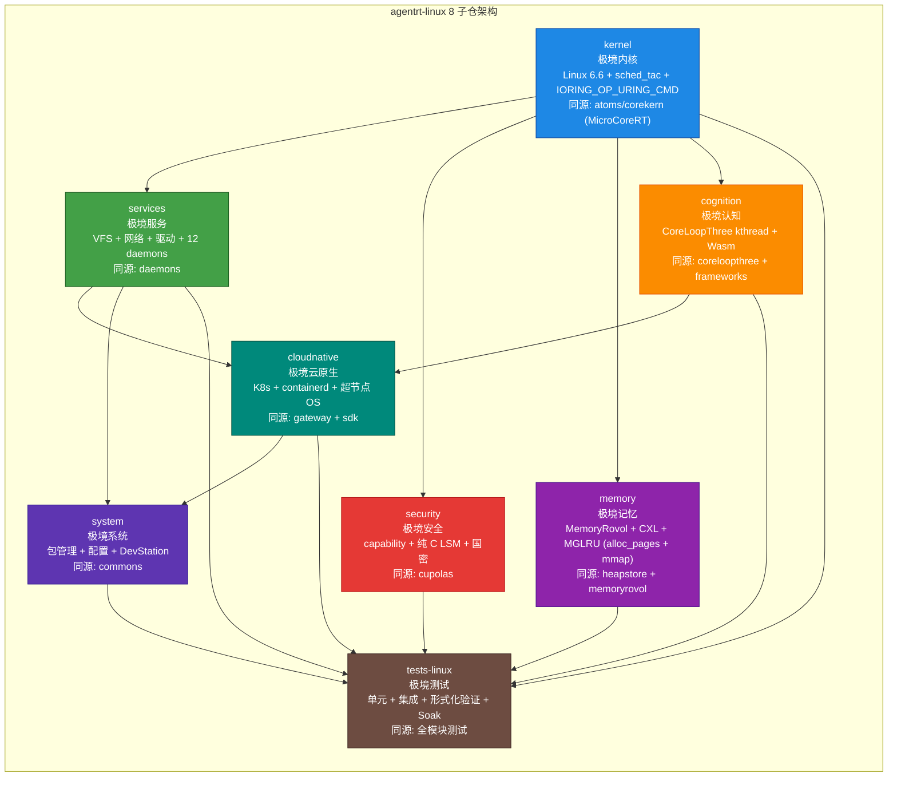

Copyright (c) 2025-2026 SPHARX Ltd. All Rights Reserved.

# agentrt-linux（AirymaxOS）架构设计
> **文档定位**：agentrt-linux（AirymaxOS）架构设计层的总览与索引，包含系统架构、Airymax Unify Design 总纲、IRON-9 v3 共享模型、[DSL] 降级生存层、五维原则、微内核策略、工程基线、ADR、目录结构等\
> **文档版本**：v1.1（Capability Folding 集成版）\
> **最后更新**：2026-07-19\
> **上级文档**：[agentrt-linux 总览](../README.md)

---

## 1. 模块概述

本文档是 `10-architecture/` 目录的总览与索引，承担四项核心职责：

1. **系统架构总览**：定义 agentrt-linux 的三大支柱（微内核设计思想 + agentrt-linux 工程基线 + Airymax 同源性）、7 层架构模型与 8 子仓架构图。
2. **Unify Design 总纲**：`10-unify-design.md` 作为 Airymax Unify Design 五模块（A-UEF/A-ULP/A-UCS/A-ULS/A-IPC）的统一设计总纲，定义五模块的接口契约与跨模块协作关系。
3. **IRON-9 v3 共享模型**：`06-iron9-shared-model.md` 定义 IRON-9 v3 四层模型（[SC]/[SS]/[IND]/[DSL]），作为 agentrt ↔ agentrt-linux 同源代码共享的工程基线。
4. **[DSL] 降级生存层**：`11-degraded-survival-layer.md` 定义系统在故障、资源不足、Panic 等场景下的降级生存策略，确保 A-ULP Panic 生存路径与 A-ULS 故障监管的架构支撑。

---

## 2. 技术选型声明

本目录的架构设计以 agentrt-linux v1.0 五大技术选型为基线：

| # | 技术维度 | 选定方案 | 明确不采用的方案 | 架构影响 |
|---|---------|---------|----------------|---------|
| 1 | **内核调度** | **sched_tac**：复用 Linux 6.6 原生 `SCHED_DEADLINE` / `SCHED_FIFO` / `EEVDF` 调度类，通过 `nice` / `sched_setattr` / `sched_setattr` 注入 Agent 感知策略 | **不使用 sched_ext**（不引入 eBPF 调度器、不依赖 `SCHED_EXT=7` 调度类、不使用 SCHED_AGENT 宏） | L2 内核层调度子系统基于sched_tac，不再依赖 sched_ext BPF 调度器 |
| 2 | **IPC 零拷贝** | **IORING_OP_URING_CMD**：io_uring 命令操作码零拷贝传输 | **不使用 page flipping** | L2 内核层 IPC 子系统基于 IORING_OP_URING_CMD，A-IPC 框架以此为传输基线 |
| 3 | **安全钩子** | **纯 C LSM**：纯 C 实现 `airy_lsm`，通过 `security_hook_list` 注册 | **不使用 BPF LSM** | L3 服务层 security 子系统基于纯 C LSM，不依赖 BPF LSM 框架 |
| 4 | **内存分配** | **alloc_pages + mmap**：物理页分配后映射到用户态 | **不使用 DMA 一致性内存** | L2 内核层 memory 子系统基于 alloc_pages + mmap，跨架构一致 |
| 5 | **同源代码共享** | **IRON-9 v3 四层模型**：[SC] + [SS] + [IND] + [DSL] | （v2 三层模型升级，新增 [DSL] 降级生存层） | `06-iron9-shared-model.md` 定义 v3 四层模型，`10-unify-design.md` 总纲映射五模块 |

### 2.1 修正声明（sched_ext / SCHED_AGENT 旧表述）

agentrt-linux v1.0 **全面修正**早期文档中关于 sched_ext 与 SCHED_AGENT 的旧表述：

- ~~`sched_ext + eBPF + io_uring + Rust 微内核化改造`~~ → **sched_tac（SCHED_DEADLINE/SCHED_FIFO/EEVDF）+ io_uring（IORING_OP_URING_CMD）+ 纯 C LSM + Rust 实验性支持**
- ~~`SCHED_AGENT 策略（sched_ext）`~~ → **sched_tac 调度策略（SCHED_DEADLINE/SCHED_FIFO/EEVDF 原生调度类组合）**
- ~~`sched_ext BPF 调度器`~~ → **sched_tac 通过既有调度类组合实现 Agent 感知，不引入 eBPF 调度器**
- ~~`SCHED_EXT=7 调度类`~~ → **不使用 SCHED_EXT 调度类，不定义 SCHED_AGENT 宏**

---

## 3. 三大支柱

| 支柱 | 核心思想 | 参考来源 | 落地子仓 |
|------|----------|----------|----------|
| **微内核设计思想** | 最小化特权态代码（Liedtke minimality）、服务用户态化、消息传递通信、capability 安全 | seL4（ADR-014，唯一来源） | kernel / services / security |
| **agentrt-linux 工程基线** | 采用 agentrt-linux 自身的模块设计、技术规格、标准和规范，兼容企业级 Linux 生态 | Linux 6.6 内核基线（1.x.x）/ Linux 7.1（2.x.x，ADR-016） | system / tests-linux / cloudnative |
| **Airymax 同源性** | 与 agentrt 共享 MicroCoreRT / AgentsIPC / Cupolas / MemoryRovol / CoreLoopThree 设计理念，天然适配无适配层 | agentrt atoms/cupolas/coreloopthree | 全部 8 子仓 |

---

## 4. 8 子仓架构图

---

## 5. 架构层次模型（7 层）

| 层次 | 子仓 | 核心机制 | 依赖下层 |
|------|------|----------|----------|
| L1 硬件层 | （硬件） | CPU / 内存 / CXL / PMEM / NIC / NVMe | - |
| L2 内核层 | kernel | EEVDF 调度器 + sched_tac（SCHED_DEADLINE/SCHED_FIFO/EEVDF）+ io_uring（IORING_OP_URING_CMD）+ MGLRU 多代 LRU（alloc_pages + mmap）+ 纯 C LSM + Rust 实验性支持 | L1 |
| L3 服务层 | services / security / memory | VFS 用户态化 + 网络栈 + 驱动框架 + 12 daemons + capability（seL4 风格）+ 纯 C LSM + 国密 + MemoryRovol 内核态 + CXL 内存池化 | L2 |
| L4 认知层 | cognition | CoreLoopThree kthread + Wasm 3.0 沙箱 + LLM 调度 + 双系统协同（System 1 + System 2）+ 增量规划器 | L3 |
| L5 云原生层 | cloudnative | K8s CRD + containerd shim + OCI + CNI + 超节点 OS + agentctl | L4 |
| L6 系统层 | system | RPM + dnf + systemd + 配置 + shell + 基础库 + DevStation | L5 |
| L7 测试层 | tests-linux | 单元测试 + 集成测试 + 形式化验证 + Soak 长时测试 + 混沌工程 | L2-L6 全部 |

---

## 6. 文档索引

本目录包含 11 个核心文档，覆盖系统架构、五维原则、微内核策略、工程基线、ADR、IRON-9 v3 共享模型、目录结构、威胁模型、已知问题、Unify Design 总纲与降级生存层：

| # | 文档 | 核心内容 | 版本 | 状态 |
|---|------|---------|------|------|
| 1 | [01-system-architecture.md](01-system-architecture.md) | 系统架构总览（三大支柱 + 整体架构 + 同源关系 + 前沿理论） | v1.0 | 维护中 |
| 2 | [02-five-dimensional-principles.md](02-five-dimensional-principles.md) | 五维正交 24 原则与 agentrt-linux 落地映射（S/K/C/E/A 全维度） | v1.0 | 维护中 |
| 3 | [03-microkernel-strategy.md](03-microkernel-strategy.md) | 微内核化改造策略（seL4 思想 + 改造路径，ADR-014） | v1.0 | 维护中 |
| 4 | [04-engineering-baseline.md](04-engineering-baseline.md) | agentrt-linux 工程基线（治理组对应 + AI 原生 + 技术规格） | v1.0 | 维护中 |
| 5 | [05-adrs.md](05-adrs.md) | 架构决策记录 ADR-001~016（16 个核心决策，含 ADR-015 已撤销 + ADR-016 版本基线锁定） | v1.0 | 维护中 |
| 6 | [06-iron9-shared-model.md](06-iron9-shared-model.md) | **IRON-9 v3 四层模型**（[SC] 共享契约 + [SS] 语义同源 + [IND] 独立实现 + [DSL] 降级生存） | v1.0 | 维护中 |
| 7 | [07-directory-structure.md](07-directory-structure.md) | 源码目录结构设计（8 子仓 submodule + [SC] 物理隔离 + 模型 A 完整 fork） | v1.0 | 维护中 |
| 8 | [08-threat-model.md](08-threat-model.md) | 威胁模型（capability 攻击面 + LSM 钩子 + 纯 C LSM 安全分析） | v1.0 | 维护中 |
| 9 | [09-known-caveats.md](09-known-caveats.md) | 已知问题与注意事项（sched_tac 限制 + io_uring 边界 + 跨架构注意） | v1.0 | 维护中 |
| 10 | [10-unify-design.md](10-unify-design.md) | **Airymax Unify Design 总纲**（A-UEF/A-ULP/A-UCS/A-ULS/A-IPC 五模块统一设计） | v1.0 | 维护中 |
| 11 | [11-degraded-survival-layer.md](11-degraded-survival-layer.md) | **[DSL] 降级生存层**（故障降级 + 资源不足降级 + Panic 生存策略） | v1.0 | 维护中 |

### 6.1 文档阅读顺序建议

| 角色 | 推荐阅读顺序 |
|------|--------------|
| 架构师 | README → 01 → 02 → 10（Unify Design）→ 06（IRON-9 v3）→ 03 → 04 → 05 → 11（[DSL]） |
| 内核开发者 | README → 03 → 07 → 01 → 06 → 05 → 09 |
| 应用开发者 | README → 01 → 02 → 10（Unify Design）→ 04 |
| 安全工程师 | README → 02（E-1）→ 08（威胁模型）→ 05（ADR-004）→ 01 |

---

## 7. Airymax Unify Design 映射

`10-unify-design.md` 是 Airymax Unify Design 五模块的**总纲文档**，定义五模块在架构层的统一接口契约与跨模块协作关系：

| Unify 模块 | 架构层定位 | 核心架构文档 |
|-----------|-----------|------------|
| **A-UEF**（统一错误码与故障定义体系） | L4 认知层 + L2 内核层调度子系统 | `01-system-architecture.md`（L4 认知层）+ `10-unify-design.md`（A-UEF 总纲） |
| **A-ULP**（统一日志与打印系统） | L3 服务层日志子系统 + L2 内核层 Ring Buffer | `10-unify-design.md`（A-ULP 总纲）+ `11-degraded-survival-layer.md`（Panic 生存） |
| **A-UCS**（统一配置管理体系） | L6 系统层配置管理 + L2 内核层 sysctl | `10-unify-design.md`（A-UCS 总纲）+ `04-engineering-baseline.md`（配置规格） |
| **A-ULS**（统一生命周期管理） | L2 内核层 Agent 监管 + L3 服务层守护进程监管 | `10-unify-design.md`（A-ULS 总纲）+ `11-degraded-survival-layer.md`（故障降级） |
| **A-IPC**（统一进程间通信体系） | L2 内核层 io_uring 子系统 | `10-unify-design.md`（A-IPC 总纲）+ `07-directory-structure.md`（[SC] ipc.h 物理宿主） |

### 7.1 IRON-9 v3 四层模型与 Unify Design 的关系

`06-iron9-shared-model.md` 定义的 IRON-9 v3 四层模型为 Unify Design 五模块提供同源代码共享基线：

| IRON-9 v3 层次 | Unify Design 五模块映射 |
|---------------|----------------------|
| [SC] 共享契约层 | `include/uapi/linux/airymax/sched.h`（A-UEF）、`include/uapi/linux/airymax/log_types.h`（A-ULP）、`include/uapi/linux/airymax/syscalls.h`（A-UCS）、`include/uapi/linux/airymax/ipc.h`（A-IPC）、`include/uapi/linux/airymax/security_types.h`（A-ULS） |
| [SS] 语义同源层 | 五模块的 API 签名在 agentrt ↔ agentrt-linux 之间保持一致 |
| [IND] 独立实现层 | 五模块在 agentrt-linux 内核态实现与 agentrt 用户态实现各自独立 |
| [DSL] 降级生存层 | 五模块的 `#ifdef AIRY_SC_FALLBACK` 降级生存块，提供 [SC] 损坏时最小可运行子集 |

---

## 8. [DSL] 降级生存层

`11-degraded-survival-layer.md` 定义系统在异常场景下的降级生存策略，是 A-ULP Panic 生存路径与 A-ULS 故障监管的架构支撑：

| 降级场景 | 触发条件 | 降级策略 | 关联 Unify 模块 |
|---------|---------|---------|---------------|
| **故障降级** | 子系统崩溃、守护进程异常 | A-ULS 监管器重启故障组件，A-UEF 切换到 System 1 快思考模式 | A-ULS + A-UEF |
| **资源不足降级** | 内存不足、Token 预算耗尽 | A-UCS 调整资源配置，A-ULP 降级日志级别，MemoryRovol 启动遗忘机制 | A-UCS + A-ULP |
| **Panic 生存** | 内核 Panic | A-ULP Panic 生存路径：printk-bridge 落盘日志 → Logger Daemon 持久化 → 重启恢复 | A-ULP + A-ULS |

---

## 9. 与 agentrt 的架构对应关系

agentrt-linux 与 agentrt 同源且部分代码共享（IRON-9 v3）。两者在多个核心模块上存在同源映射关系，共享契约层代码（`include/uapi/linux/airymax/` 头文件库），实现层各自独立。

| agentrt 模块 | agentrt-linux 同源子仓 | 同源语义 | IRON-9 v3 层次 |
|--------------|---------------------|----------|----------|
| atoms/corekern (MicroCoreRT) | kernel（sched_tac） | 调度语义一致 | [SC] sched.h + [SS] 调度语义 + [IND] 内核态实现 |
| atoms/ipc + protocols (AgentsIPC) | services (A-IPC) | IPC 协议语义一致 | [SC] ipc.h + [SS] 128B 消息头 + [IND] io_uring 实现 |
| cupolas (Cupolas) | security (纯 C LSM) | 安全模型一致 | [SC] security_types.h + [SS] capability 模型 + [IND] 纯 C LSM 实现 |
| heapstore + memoryrovol (MemoryRovol) | memory (alloc_pages + mmap) | 记忆模型一致 | [SC] memory_types.h + [SS] L1-L4 四层卷载 + [IND] 内核态实现 |
| coreloopthree + frameworks (CoreLoopThree) | cognition (A-UEF) | 认知模型一致 | [SC] cognition_types.h + [SS] 三层认知循环 + [IND] kthread 实现 |

---

## 10. 相关文档

- [agentrt-linux 总览](../README.md)：v1.0 设计文档体系总览与技术选型声明
- [需求分析层](../00-requirements/README.md)：业务需求 + 功能需求 + 非功能需求
- [模块设计层](../20-modules/README.md)：8 子仓 + A-ULS/A-ULP/A-UCS 详细设计
- [接口设计层](../30-interfaces/README.md)：syscall + IPC + SDK + 编码规范
- [数据流程设计层](../40-dataflows/README.md)：A-UEF/A-IPC/A-ULS/A-ULP 数据流路径
- [工程标准规范](../50-engineering-standards/README.md)：SSoT v2 + [SC] 类型桥接
- [Airymax 架构设计原则](../../AirymaxRT/10-architecture/00-architectural-principles.md)：五维正交 24 原则

---

## 11. 版本历史

| 版本 | 日期 | 变更 |
|------|------|------|
| 0.1.1 | 2026-07-06 | 初始占位版本（含架构层 5 文档索引） |
| 0.1.1 | 2026-07-13 | 新增 `07-directory-structure.md`，架构层文档数 5 → 6；[SC] 头文件 Tab 8 缩进验证通过 |
| v1.0 | 2026-07-17 | 升级为 v1.0：修正所有 sched_ext/SCHED_AGENT 旧表述为sched_tac（SCHED_DEADLINE/SCHED_FIFO/EEVDF）；新增 `06-iron9-shared-model.md`（IRON-9 v3 四层模型，含 [DSL] 降级生存层）；新增 `08-threat-model.md`、`09-known-caveats.md`、`10-unify-design.md`（Airymax Unify Design 总纲）、`11-degraded-survival-layer.md`（[DSL] 降级生存层）；架构层文档数 6 → 11；新增 Unify Design 五模块架构映射 |

---

© 2025-2026 SPHARX Ltd. All Rights Reserved. | "From data intelligence emerges."
