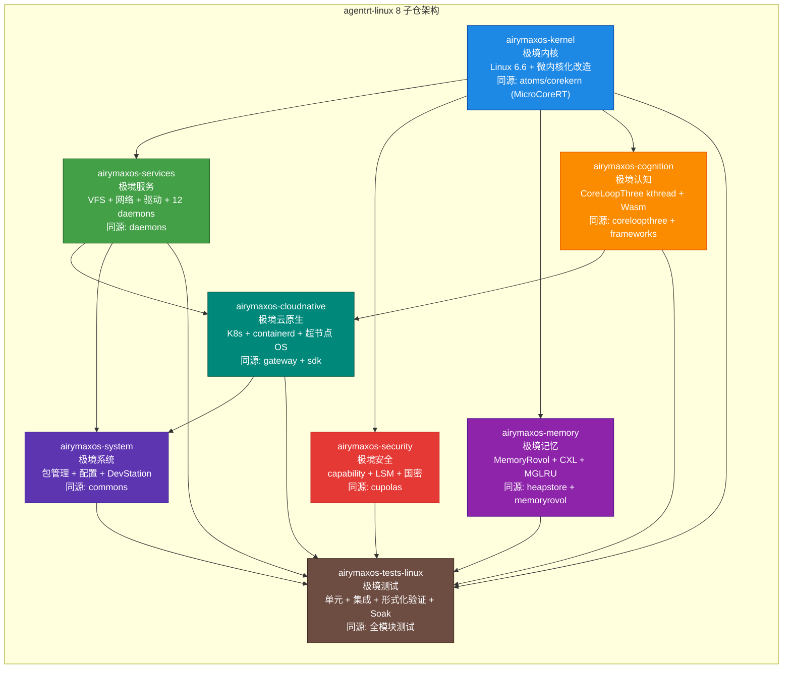
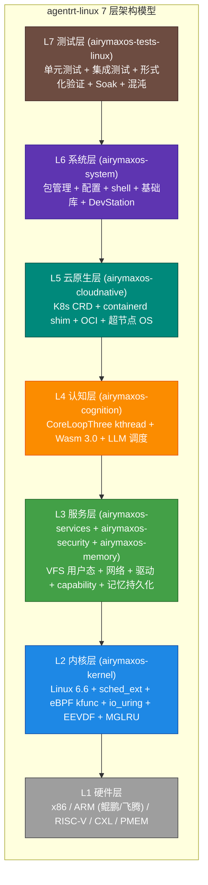

Copyright (c) 2025-2026 SPHARX Ltd. All Rights Reserved.

# agentrt-linux（AirymaxOS）架构设计

> **文档定位**：agentrt-linux（AirymaxOS）架构设计层的总览与索引\
> **版本**：0.1.1（文档体系完成）/ 1.0.1（开发）\
> **最后更新**：2026-07-06\
> **父文档**：[agentrt-linux 总览](../README.md)

---

## 1. 架构设计概览

agentrt-linux 架构设计建立在三大支柱之上，三大支柱相辅相成，共同支撑 agentrt-linux 作为 Agentic OS 的设计哲学。

### 1.1 三大支柱总览

| 支柱 | 核心思想 | 参考来源 | 落地子仓 |
|------|----------|----------|----------|
| **微内核设计思想** | 最小化特权态代码（Liedtke minimality）、服务用户态化、消息传递通信、capability 安全 | seL4（ADR-014，唯一来源） | airymaxos-kernel / airymaxos-services / airymaxos-security |
| **agentrt-linux 工程基线** | 采用 agentrt-linux 自身的模块设计、技术规格、标准和规范，兼容企业级 Linux 生态 | Linux 6.6 内核基线（1.x.x）/ Linux 7.1（2.x.x，ADR-013） | airymaxos-system / airymaxos-tests-linux / airymaxos-cloudnative |
| **Airymax 同源性** | 与 agentrt 共享 MicroCoreRT / AgentsIPC / Cupolas / MemoryRovol / CoreLoopThree 设计理念，天然适配无适配层 | agentrt atoms/cupolas/coreloopthree | 全部 8 子仓 |

### 1.2 支柱之间的关系

三大支柱并非并列叠加，而是构成正交支撑：

- **微内核设计思想** 提供"如何设计内核"的方法论
- **agentrt-linux 工程基线** 提供"如何对接生态"的工程标准
- **Airymax 同源性** 提供"如何与 agentrt 协同"的语义约束

三者缺一不可：缺少微内核思想则 agentrt-linux 退化为普通 Linux 发行版；缺少工程基线则失去生态兼容性；缺少同源性则 agentrt 失去 OS 级天然适配红利。

### 1.3 架构设计的核心约束

| 约束 | 来源 | 影响 |
|------|------|------|
| 内核基线锁定 Linux 6.6 内核基线 | agentrt-linux 工程基线 | 禁止引用未来内核专属特性作为 6.6 原生能力（见 IRON-10） |
| 微内核化而非从零开发微内核 | 微内核设计思想 | 基于 sched_ext + eBPF kfunc + io_uring 实现微内核化改造 |
| 与 agentrt 同源且部分代码共享 | Airymax 同源性 | agentrt 是跨平台用户态运行时，agentrt-linux 是 Linux 专属优化 |

---

## 2. 8 子仓架构图

agentrt-linux 由 8 个子仓构成，按"内核 → 服务 → 认知 → 云原生 → 系统 → 测试"的层次关系组织。

### 2.1 Mermaid 层次关系图

### 2.2 子仓职责矩阵

| # | 子仓 | 中文 | 核心职责 | 同源 agentrt |
|---|------|------|----------|--------------|
| 1 | airymaxos-kernel | 极境内核 | Linux 6.6 内核基线 + sched_ext + eBPF kfunc + io_uring + Rust 实验性支持 | atoms/corekern (MicroCoreRT) |
| 2 | airymaxos-services | 极境服务 | VFS 用户态化 + 网络栈 + 驱动框架 + 12 daemons + systemd 集成 | daemons |
| 3 | airymaxos-security | 极境安全 | capability（seL4 风格）+ LSM + 机密计算 + 国密 SM2/SM3/SM4 + 审计哈希链 | cupolas |
| 4 | airymaxos-memory | 极境记忆 | MemoryRovol 内核态实现 + CXL 内存池化 + PMEM + MGLRU（多代 LRU）+ 遗忘曲线 | heapstore + memoryrovol |
| 5 | airymaxos-cognition | 极境认知 | CoreLoopThree kthread + Wasm 3.0 沙箱 + LLM 调度 + 超节点沙箱 + 双系统协同 | coreloopthree + frameworks |
| 6 | airymaxos-cloudnative | 极境云原生 | K8s + containerd shim + OCI + CNI + agentctl + 超节点 OS | gateway + sdk |
| 7 | airymaxos-system | 极境系统 | RPM + dnf + 配置 + shell + 基础库 + DevStation 开发环境 | commons |
| 8 | airymaxos-tests-linux | 极境测试 | 单元测试 + 集成测试 + 形式化验证 + Soak 长时测试 + 混沌工程 | 全模块测试 |

---

## 3. 架构层次模型

agentrt-linux 采用 7 层架构模型，自底向上分别为硬件层、内核层、服务层、认知层、云原生层、系统层和测试层。每一层只依赖其直接下层提供的抽象接口，从不越级访问。

### 3.1 层次模型 Mermaid 图

### 3.2 各层职责详述

| 层次 | 子仓 | 核心机制 | 依赖下层 |
|------|------|----------|----------|
| L1 硬件层 | （硬件） | CPU / 内存 / CXL / PMEM / NIC / NVMe | - |
| L2 内核层 | airymaxos-kernel | EEVDF 调度器 + sched_ext（SCHED_AGENT）+ eBPF kfunc + dynamic pointer + io_uring 零拷贝 + MGLRU 多代 LRU + Rust 实验性支持 | L1 |
| L3 服务层 | airymaxos-services / airymaxos-security / airymaxos-memory | VFS 用户态化 + 网络栈 + 驱动框架 + 12 daemons + capability（seL4 风格）+ LSM + 国密 + MemoryRovol 内核态 + CXL 内存池化 | L2 |
| L4 认知层 | airymaxos-cognition | CoreLoopThree kthread + Wasm 3.0 沙箱 + LLM 调度 + 双系统协同（System 1 + System 2）+ 增量规划器 | L3 |
| L5 云原生层 | airymaxos-cloudnative | K8s CRD + containerd shim + OCI + CNI + 超节点 OS + agentctl | L4 |
| L6 系统层 | airymaxos-system | RPM + dnf + systemd + 配置 + shell + 基础库 + DevStation | L5 |
| L7 测试层 | airymaxos-tests-linux | 单元测试 + 集成测试 + 形式化验证 + Soak 长时测试 + 混沌工程 | L2-L6 全部 |

### 3.3 层次纪律

agentrt-linux 严格遵守层次分解原则（S-2）：

1. 每层只依赖其直接下层的抽象接口，禁止越级访问
2. 同层之间通过 IPC 通信，禁止直接函数调用
3. 层次之间的接口契约通过 `30-interfaces/` 文档定义
4. 任何新增跨层依赖必须通过 ADR 评审

---

## 4. 与 agentrt 的架构对应关系

agentrt-linux 与 agentrt 同源且部分代码共享（IRON-9 v2）。两者在多个核心模块上存在同源映射关系，共享契约层代码（`include/airymax/` 头文件库），实现层各自独立。

### 4.1 同源映射表

| agentrt 模块 | agentrt 性质 | agentrt-linux 同源子仓 | 同源语义 | 同源契约 |
|--------------|--------------|---------------------|----------|----------|
| atoms/corekern (MicroCoreRT) | 跨平台用户态微核心 | airymaxos-kernel (SCHED_AGENT) | 调度语义一致 | SCHED_AGENT 策略语义同源 |
| atoms/ipc + protocols (AgentsIPC) | 跨平台 IPC 协议 | airymaxos-services (消息传递) | IPC 协议语义一致 | 128B 消息头 + magic 0x41524531 ('ARE1') 同源 |
| cupolas (Cupolas) | 跨平台安全穹顶 | airymaxos-security (capability) | 安全模型一致 | capability 模型同源 |
| heapstore + memoryrovol (MemoryRovol) | 跨平台记忆系统 | airymaxos-memory (记忆持久化) | 记忆模型一致 | L1-L4 四层卷载语义同源 |
| coreloopthree + frameworks (CoreLoopThree) | 跨平台认知循环 | airymaxos-cognition (kthread) | 认知模型一致 | 三层认知循环语义同源 |
| daemons (12 daemons) | 跨平台守护进程 | airymaxos-services (systemd 集成) | 服务模型一致 | 守护进程命名 *_d 同源 |
| gateway + sdk | 跨平台网关 | airymaxos-cloudnative (K8s+OCI) | 网关语义一致 | agentctl 与 sdk 同源 |
| commons | 跨平台基础库 | airymaxos-system (基础库) | 工具语义一致 | 命名空间 agentrt_ 同源 |

### 4.2 同源红利

agentrt 在 agentrt-linux 上运行时享有"无适配层天然契合"的同源红利：

- **调度同源**：agentrt 的 MicroCoreRT 调度语义与 agentrt-linux 的 SCHED_AGENT 策略一致，agentrt 可选调用 SCHED_AGENT 获得原生调度优先级
- **IPC 同源**：agentrt 的 AgentsIPC 128B 消息头与 agentrt-linux 内核原生 IPC 协议一致，IPC 无需任何转换层
- **安全同源**：agentrt 的 Cupolas capability 模型与 agentrt-linux 的 capability 系统一致，权限检查天然兼容
- **记忆同源**：agentrt 的 MemoryRovol L1-L4 与 agentrt-linux 内核态 MemoryRovol 一致，记忆持久化无语义损失
- **认知同源**：agentrt 的 CoreLoopThree 三层循环与 agentrt-linux 的 kthread 实现一致，认知调度天然契合

### 4.3 同源且部分代码共享的边界

| 维度 | agentrt | agentrt-linux |
|------|---------|-----------|
| 性质 | 跨平台用户态运行时 | Linux 发行版 |
| 平台 | Linux / macOS / Windows | 仅 Linux 6.6 内核基线 |
| 代码 | 用户态库 + 守护进程 | Linux 内核 + 用户态服务 |
| 共享 | 设计理念同源 + 契约层代码共享（`include/airymax/`）+ 实现独立 | 设计理念同源 + 契约层代码共享（`include/airymax/`）+ 实现独立 |
| 关系 | 可独立运行 | agentrt-linux 是 agentrt 的最佳载体 |

---

## 5. 本目录文档索引

agentrt-linux 架构设计层包含 5 个核心文档，覆盖系统架构、五维原则、微内核策略、工程基线和架构决策记录。

| # | 文档 | 内容 | 状态 |
|---|------|------|------|
| 1 | [01-system-architecture.md](01-system-architecture.md) | 系统架构总览（三大支柱 + 整体架构 + 同源关系 + 前沿理论） | 已存在 |
| 2 | [02-five-dimensional-principles.md](02-five-dimensional-principles.md) | 五维正交 24 原则与 agentrt-linux 落地映射（S/K/C/E/A 全维度） | 新增 |
| 3 | [03-microkernel-strategy.md](03-microkernel-strategy.md) | 微内核化改造策略（seL4 思想 + 改造路径，ADR-014） | 已存在 |
| 4 | [04-engineering-baseline.md](04-engineering-baseline.md) | agentrt-linux 工程基线（治理组对应 + AI 原生 + 技术规格） | 已存在 |
| 5 | [05-adrs.md](05-adrs.md) | 架构决策记录 ADR-001~014（14 个核心决策） | 新增 |

### 5.1 文档阅读顺序建议

| 角色 | 推荐阅读顺序 |
|------|--------------|
| 架构师 | README → 01 → 02 → 03 → 04 → 05 |
| 内核开发者 | README → 03 → 01 → 05 → 02 |
| 应用开发者 | README → 01 → 02 → 04 |
| 安全工程师 | README → 02（E-1）→ 05（ADR-004）→ 01 |

---

## 6. 设计原则引用

agentrt-linux 架构设计严格遵循 `docs/AirymaxRT/00-architectural-principles.md` 中的五维正交 24 原则，详细落地映射请参见 [02-five-dimensional-principles.md](02-five-dimensional-principles.md)。

### 6.1 五维原则概览

| 维度 | 核心问题 | 原则数量 | agentrt-linux 落地文档 |
|------|----------|----------|---------------------|
| 系统观 (System) | agentrt-linux 作为复杂自适应系统如何维持动态平衡 | 4 项 (S-1~S-4) | [02-five-dimensional-principles.md §2](02-five-dimensional-principles.md) |
| 内核观 (Kernel) | 内核应该做什么，不应该做什么 | 4 项 (K-1~K-4) | [02-five-dimensional-principles.md §3](02-five-dimensional-principles.md) |
| 认知观 (Cognition) | 智能体如何高效可靠地进行认知决策 | 4 项 (C-1~C-4) | [02-five-dimensional-principles.md §4](02-five-dimensional-principles.md) |
| 工程观 (Engineering) | 如何构建可维护可测试可演进的工程系统 | 8 项 (E-1~E-8) | [02-five-dimensional-principles.md §5](02-five-dimensional-principles.md) |
| 设计美学 (Aesthetics) | 如何让系统不仅正确而且优雅 | 4 项 (A-1~A-4) | [02-five-dimensional-principles.md §6](02-five-dimensional-principles.md) |

### 6.2 架构设计中的关键原则

| 原则 | 在本目录的体现 |
|------|----------------|
| S-2 层次分解 | §3 架构层次模型（7 层架构） |
| K-1 内核极简 | [03-microkernel-strategy.md](03-microkernel-strategy.md)（Liedtke minimality） |
| K-2 接口契约化 | [01-system-architecture.md](01-system-architecture.md) + [30-interfaces/](../30-interfaces/) |
| E-7 文档即代码 | 本目录文档体系（架构层 5 文档） |
| A-1 简约至上 | 三大支柱精简表述 + 8 子仓清晰划分 |

---

## 7. 相关文档

- [agentrt-linux 总览](../README.md)：agentrt-linux 设计文档总览
- [需求分析层](../00-requirements/README.md)：业务需求 + 功能需求 + 非功能需求
- [模块设计层](../20-modules/)：8 子仓详细设计
- [接口设计层](../30-interfaces/)：syscall + IPC + SDK + 编码规范
- [数据流程设计层](../40-dataflows/)：认知 + 记忆 + IPC + 调度数据流
- [架构原则](../../AirymaxRT/00-architectural-principles.md)：五维正交 24 原则的完整定义

---

## 8. 版本历史

| 版本 | 日期 | 变更 |
|------|------|------|
| 0.1.1 | 2026-07-06 | 初始占位版本（含架构层 5 文档索引） |
| 1.0.1 | 2027-XX-XX | 首个开发版本（与代码实现同步） |

---

© 2025-2026 SPHARX Ltd. All Rights Reserved.
