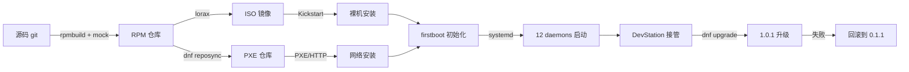
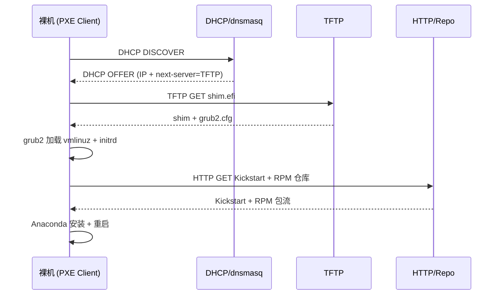
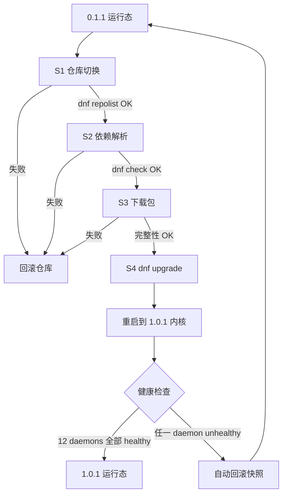
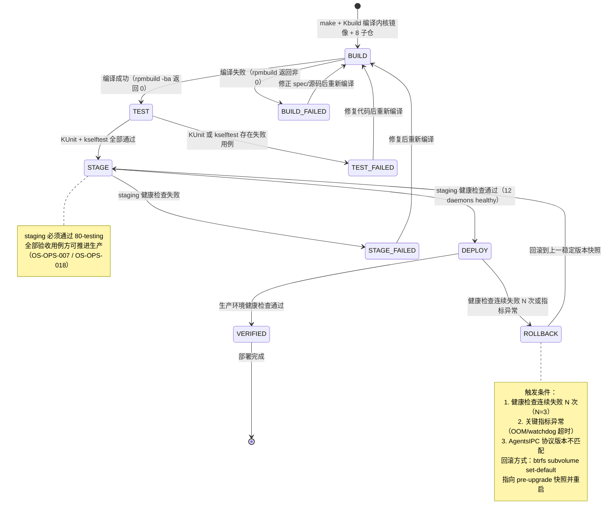
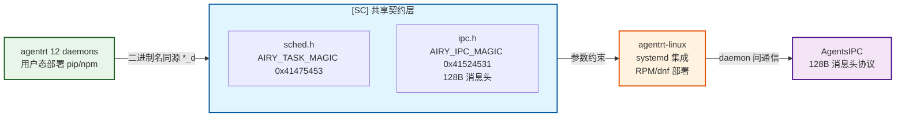
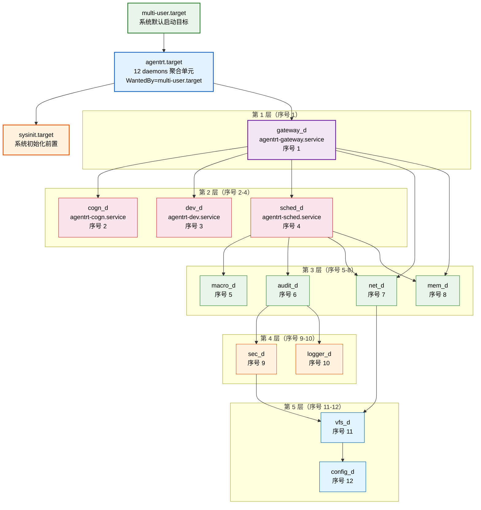

Copyright (c) 2025-2026 SPHARX Ltd. All Rights Reserved.

# agentrt-linux（AirymaxOS）部署体系
> **文档定位**：agentrt-linux（AirymaxOS，极境智能体操作系统）运维体系第 1 卷——部署工程。本文档规定从裸机到可用 Agent 工作负载的完整交付链路：RPM 包格式、dnf 包管理器、ISO 镜像制作、Kickstart 自动化安装、PXE 网络安装、系统初始化、12 daemons 部署、DevStation 部署、版本升级路径与回滚机制。\
> **文档版本**：0.1.1\
> **最后更新**： 2026-07-21\
> **上级文档**：[agentrt-linux 设计文档](README.md)\
> **同源映射**：agentrt daemons（12 个用户态服务）+ Linux 6.6 systemd 集成 + MicroCoreRT 极简内核契约\
> **理论根基**：Linux 6.6 内核基线工程思想 + Airymax 五维正交 24 原则 + S-1 反馈闭环\
> **核心约束**：IRON-9 v3 同源且部分代码共享——与 agentrt 同源语义，agentrt-linux 独立承担发行版部署责任

---

## 第 1 章 部署体系概述

### 1.1 部署链路总览

agentrt-linux 部署体系继承 Linux 6.6 内核基线沉淀的发行版交付哲学，并在其上扩展智能体操作系统的专属部署需求。完整链路覆盖五个阶段：**构建阶段**（源码 → RPM 包，rpmbuild + mock 隔离构建）→ **组装阶段**（RPM 仓库 → ISO 镜像，lorax + livemedia-creator）→ **交付阶段**（ISO / PXE / Kickstart → 裸机或虚拟机安装）→ **初始化阶段**（firstboot → sysctl 应用 → 12 daemons 启动）→ **运维阶段**（dnf 升级 + 回滚 + DevStation 接管）。

**OS-OPS-001**：所有部署产物（RPM、ISO、initramfs、Kickstart 文件、PXE 镜像）必须经 GPG 签名且签名校验为部署的前置条件，未签名产物禁止进入生产环境。

**OS-OPS-002**：部署过程必须可重放——同一份 Kickstart + 同一份仓库快照在任意时刻重放，必须产出字节级一致的已安装系统（除时间戳与机器 ID 外）。

### 1.2 部署体系与 MicroCoreRT 的关系

MicroCoreRT 是 Airymax 微核心运行时基座，在 agentrt-linux 内核态对其保持同源语义。部署体系必须保证 MicroCoreRT 契约在内核包（`airymaxos-kernel`）与服务包（`airymaxos-services-*`）两端同时落地：内核包提供 MicroCoreRT 内核态实现，服务包提供 MicroCoreRT 用户态适配层。任何一端缺失即视为部署不完整。

**OS-OPS-003**：`airymaxos-kernel` 与 `airymaxos-services-core` 的版本号必须在安装时强一致，dnf 版本锁禁止解耦两者。这是 IRON-9 v3 同源且部分代码共享原则在部署层的硬约束——同源语义必须由同源版本承载。

### 1.3 部署流程图



---

## 第 2 章 RPM 包格式

### 2.1 包命名与分层

agentrt-linux 采用 RPM 包格式作为唯一二进制交付单元。包命名遵循 `name-version-release.arch.rpm` 规范，并在 `name` 上分层：

| 层 | 包名前缀 | 内容 |
|----|---------|------|
| 内核层 | `airymaxos-kernel` | Linux 6.6 内核 + MicroCoreRT 内核态 |
| 服务层 | `airymaxos-services` | 12 daemons 用户态二进制 |
| SDK 层 | `airymaxos-sdk` | Agent 开发 SDK |
| 系统层 | `airymaxos-system` | 包管理 + 配置工具 + shell |
| 安全层 | `airymaxos-security` | LSM + capability |

**OS-OPS-029**：每个 RPM 包的 `%changelog` 段必须引用对应的 `Fixes:` / `Closes:` 提交哈希，与 05 开发流程的可追溯性约束对齐（E-6 错误可追溯）。

**OS-OPS-030**：RPM `Requires` 段必须显式声明版本依赖，禁止裸 `Requires: foo` 而不写版本；内核包与服务包的版本耦合通过 `Requires(pre)` / `Requires(post)` 强制。

### 2.2 spec 文件骨架

以下为 `airymaxos-services-core` 的 spec 骨架（节选）：

```specfile
Name:           airymaxos-services-core
Version:        0.1.1
Release:        1%{?dist}
Summary:        agentrt-linux 12 daemons userspace core
License:        SPDX-License-Identifier-Apache-2.0
Requires(pre):  airymaxos-kernel%{?_isa} == %{version}
Requires(post): systemd
Requires:       airymaxos-services-common%{?_isa} == %{version}

%description
agentrt-linux 12 daemons userspace core, IRON-9 v3 同源且部分代码共享于 agentrt daemons.

%install
install -D -m 0755 build/gateway_d %{buildroot}%{_libdir}/agentrt/gateway_d
install -D -m 0644 systemd/agentrt-gateway.service %{buildroot}%{_unitdir}/

%files
%{_libdir}/agentrt/gateway_d
%{_unitdir}/agentrt-gateway.service
%config(noreplace) %{_sysconfdir}/agentrt/gateway.conf
```

**OS-OPS-031**：`%config(noreplace)` 必须用于所有 `/etc/agentrt/` 下的配置文件，保证 dnf 升级时本地配置不被覆盖（C-2 增量演化）。

**OS-OPS-032**：所有二进制文件安装权限必须为 `0755`，配置文件 `0644`，密钥文件 `0600`，禁止 `0777` 与 world-writable。

**OS-OPS-004**：所有 RPM 包必须经 agentrt-linux 构建密钥 GPG 签名，`rpm --checksig` 必须在安装前由 dnf 自动执行；未签名或签名不匹配的包禁止安装（E-1 安全内生）。

---

## 第 3 章 dnf 包管理器

### 3.1 仓库组织

agentrt-linux 使用 dnf 作为唯一包管理器。仓库分为四类：

| 仓库 | 用途 | 启用条件 |
|------|------|---------|
| `airymaxos-base` | 稳定版包 | 默认启用 |
| `airymaxos-updates` | 安全与 bug 修复更新 | 默认启用 |
| `airymaxos-develop` | 预览集成分支包（等价 linux-next） | 仅测试环境 |
| `airymaxos-extras` | 可选组件（DevStation、额外 SDK） | 按需启用 |

**OS-OPS-005**：`airymaxos-develop` 仓库禁止在生产环境启用；生产环境仅允许 `base` + `updates`，违反此规则视为部署事故。

### 3.2 仓库配置文件

```ini
# /etc/yum.repos.d/airymaxos-base.repo
[airymaxos-base]
name=agentrt-linux $releasever - Base
baseurl=https://repo.airymaxos.dev/$releasever/base/$basearch/
enabled=1
gpgcheck=1
repo_gpgcheck=1
gpgkey=file:///etc/pki/rpm-gpg/RPM-GPG-KEY-airymaxos
skip_if_unavailable=0
countme=1
```

**OS-OPS-033**：`gpgcheck=1` 与 `repo_gpgcheck=1` 必须同时启用；`gpgkey` 必须由 `airymaxos-keyring` 包安装，禁止从网络裸获取。

### 3.3 版本锁与一致性

**OS-OPS-006**：生产环境必须启用 dnf versionlock 插件，锁定的版本集合必须包含 `airymaxos-kernel` + `airymaxos-services-core` + `airymaxos-security-lsm` 三者，且三者版本号必须一致。这是 MicroCoreRT 契约一致性在包管理层的强制。

**OS-OPS-007**：`dnf upgrade` 必须先在 staging 环境完成并通过 80-testing 定义的验收用例后，方可推进至生产环境；禁止 `dnf upgrade --skip-broken` 跳过依赖错误（S-1 反馈闭环）。

---

## 第 4 章 ISO 镜像制作

### 4.1 ISO 制作流程

ISO 镜像由 `lorax` + `livemedia-creator` 制作，产出可引导安装介质：从 `airymaxos-base` 仓库拉取 RPM 集合，lorax 生成 `boot.iso`（含内核 + initramfs + Anaconda 安装器），`livemedia-creator` 根据 Kickstart 模板组装完整 ISO，最后经 GPG 签名 + SHA-256 校验和发布。

**OS-OPS-034**：ISO 制作必须基于固定版本仓库快照，禁止 `dnf install` 拉取最新包；每次构建必须记录仓库快照哈希到 ISO 元数据 `.discinfo`。

**OS-OPS-035**：ISO 必须包含 `images/pxeboot/` 目录（vmlinuz + initrd.img）与 `images/efiboot.img`，同时支持 BIOS 与 UEFI 引导。

### 4.2 initramfs 与 MicroCoreRT

initramfs 承载早期用户态（内核启动后、根文件系统挂载前运行），必须包含 MicroCoreRT 早期探测模块，用于在 pivot_root 之前确认内核态 MicroCoreRT 契约可用。

**OS-OPS-040**：initramfs 中 `airymaxos-early-init` 必须在挂载根文件系统前执行 `microcorert_probe()`，若探测失败则立即 panic 并输出诊断码，禁止继续启动（K-1 内核极简，fail fast）。
**OS-OPS-008**：ISO 安装前必须执行 SHA-256 + GPG 双重校验，任一失败禁止进入安装流程。

---

## 第 5 章 Kickstart 自动化安装

### 5.1 Kickstart 文件结构

Kickstart 是 agentrt-linux 自动化安装的核心机制，文件由命令段、包段、脚本段构成：

```kickstart
# agentrt-linux-0.1.1-aarch64.ks
text
lang en_US.UTF-8
timezone Asia/Shanghai --isUtc
network --bootproto=dhcp --device=link --activate
rootpw --iscrypted $6$...  # SHA-512 哈希
selinux --enforcing
bootloader --location=mbr --append="console=tty0 microcorert.probe=on"

# --- 分区段 ---
clearpart --all --initlabel
part /boot/efi --fstype=efi --size=512
part / --fstype=ext4 --size=20480 --label=root
part /var/lib/agentrt --fstype=ext4 --size=40960 --label=agentrt

# --- 包段 ---
%packages
@^airymaxos-server-environment
airymaxos-kernel
airymaxos-services-core
airymaxos-system
airymaxos-security-lsm
%end

# --- 安装后脚本 ---
%post --log=/var/log/airymaxos-ks-post.log
systemctl enable agentrt.target
sysctl --system
%end
```

**OS-OPS-009**：Kickstart `rootpw` 必须使用 `--iscrypted` SHA-512 哈希，禁止明文；生产 Kickstart 模板禁止包含任何明文密钥。

**OS-OPS-010**：Kickstart 必须显式 `systemctl enable agentrt.target`，该 target 是 12 daemons 的聚合启动单元；缺失该启用项视为部署不完整。

### 5.2 分区约定

agentrt-linux 推荐分区方案将 Agent 记忆卷（L1 原始卷）独立挂载到 `/var/lib/agentrt`，与系统根分区隔离。这与 C-3 记忆卷载原则对齐——记忆数据独立于系统升级路径，便于回滚时不丢记忆。

**OS-OPS-036**：`/var/lib/agentrt` 必须独立分区或独立逻辑卷，禁止与 `/` 共享；该分区在 dnf 升级与系统回滚期间必须保持不格式化。

---

## 第 6 章 PXE 网络安装

### 6.1 PXE 架构

PXE 网络安装用于批量裸机部署，由四组件构成：

| 组件 | 服务 | 端口 | 职责 |
|------|------|------|------|
| DHCP | dnsmasq | 67/UDP | 分配 IP + 指向 next-server |
| TFTP | tftp-server | 69/UDP | 传输 bootloader（grub2/shim） |
| HTTP | nginx | 80/TCP | 传输 vmlinuz + initrd + Kickstart |
| Repo | dnf reposync | 80/TCP | 提供 RPM 仓库 |

### 6.2 PXE 启动流程图



**OS-OPS-011**：PXE 链路必须全程启用签名校验——shim 必须验证 grub2 签名，grub2 必须验证 vmlinuz 签名，dnf 必须验证 RPM 签名；任一环节签名缺失即中止启动（E-1 安全内生）。

**OS-OPS-012**：PXE 仓库必须与 ISO 仓库快照一致，禁止 PXE 拉取 `airymaxos-updates` 之外的浮动版本；批量部署的版本一致性由仓库快照哈希保证。

---

## 第 7 章 系统初始化

### 7.1 firstboot 阶段

系统首次启动时，`airymaxos-firstboot.service` 执行以下初始化：生成唯一 `machine-id`（若 Kickstart 未固化）→ 应用 `/etc/sysctl.d/` 全部 sysctl 参数（详见 02-configuration）→ 加载 LSM 策略与 capability 令牌 → 触发 `agentrt.target` 拉起 12 daemons → 注册到 DevStation 注册中心（若配置）。

**OS-OPS-013**：firstboot 必须在 systemd `default.target` 之前完成 sysctl 应用与 LSM 加载；任何 daemon 在 firstboot 完成前启动视为初始化失败（S-1 反馈闭环，初始化是不可绕过的关卡）。

### 7.2 systemd target 依赖

```ini
# /etc/systemd/system/agentrt.target
[Unit]
Description=agentrt-linux 12 daemons aggregated target
Requires=sysinit.target
After=sysinit.target network-online.target
Wants=agentrt-macro-superv.service agentrt-logger.service agentrt-config.service
Wants=agentrt-gateway.service agentrt-sched.service agentrt-vfs.service
Wants=agentrt-net.service agentrt-mem.service agentrt-cogn.service
Wants=agentrt-sec.service agentrt-audit.service agentrt-dev.service

[Install]
WantedBy=multi-user.target
```

**OS-OPS-037**：`agentrt.target` 必须声明对 `sysinit.target` 的强依赖，禁止在 sysinit 完成前启动任何 daemon；daemon 之间的依赖通过 `After=` 表达，禁止循环依赖（K-1 内核极简的延伸：依赖图必须无环）。

---

## 第 8 章 12 daemons 部署

### 8.1 daemon 到 systemd unit 映射

agentrt 的 12 个 daemons 在 agentrt-linux 中以 systemd 服务运行，遵循 IRON-9 v3 同源且部分代码共享原则——二进制名与 agentrt 同源（`macro_d`/`logger_d`/`config_d` 及 `*_d` 后缀守护进程），systemd 服务名采用 `agentrt-*.service` 格式（独立）。

| 二进制 | systemd unit | 职责 | 启动顺序 |
|--------|--------------|------|---------|
| `macro_d` | `agentrt-macro-superv.service` | 主监管守护进程 | 1 |
| `logger_d` | `agentrt-logger.service` | 日志消费守护进程 | 2 |
| `config_d` | `agentrt-config.service` | 配置管理守护进程 | 3 |
| `gateway_d` | `agentrt-gateway.service` | 网关，对外入口（含 Agent 注册） | 1 |
| `sched_d` | `agentrt-sched.service` | 调度守护进程 | 1 |
| `vfs_d` | `agentrt-vfs.service` | VFS 用户态服务守护进程 | 2 |
| `net_d` | `agentrt-net.service` | 网络策略守护进程 | 2 |
| `mem_d` | `agentrt-mem.service` | 记忆管理守护进程 | 4 |
| `cogn_d` | `agentrt-cogn.service` | 认知调度守护进程 | 2 |
| `sec_d` | `agentrt-sec.service` | 安全策略守护进程 | 5 |
| `audit_d` | `agentrt-audit.service` | 审计守护进程 | 4 |
| `dev_d` | `agentrt-dev.service` | 设备驱动守护进程 | 3 |

### 8.2 daemon systemd unit 模板

```ini
# /etc/systemd/system/agentrt-gateway.service
[Unit]
Description=agentrt-linux Gateway Daemon (agentrt gateway_d)
Requires=agentrt-sched.service
After=network-online.target agentrt-sched.service
ConditionPathExists=/etc/agentrt/gateway.conf

[Service]
Type=simple
ExecStart=/usr/lib/agentrt/gateway_d --config=/etc/agentrt/gateway.conf
ExecReload=/bin/kill -HUP $MAINPID
Restart=on-failure
RestartSec=3
WatchdogSec=30
TimeoutStopSec=15
AmbientCapabilities=CAP_NET_BIND_SERVICE
MemoryMax=2G
TasksMax=512
StandardOutput=journal

[Install]
WantedBy=agentrt.target
```

**OS-OPS-014**：所有 12 daemons 的 systemd unit 必须设置 `WatchdogSec`，且 daemon 二进制必须实现 sd_notify watchdog 心跳；30 秒无心跳 systemd 自动重启（S-1 反馈闭环 + E-2 可观测性）。

**OS-OPS-015**：daemon 之间的通信必须通过 AgentsIPC 128B 定长消息头协议，禁止共享内存绕过 IPC；这是 AgentsIPC 契约在部署层的强制（K-2 接口契约化）。

**OS-OPS-038**：每个 daemon 的 `MemoryMax` 与 `TasksMax` 必须在 unit 中显式声明，禁止依赖默认值；超限触发 OOM kill 后由 systemd 自动重启。

### 8.3 AgentsIPC 在部署层的约束

AgentsIPC 是 Airymax 智能体进程间通信协议，128B 定长消息头是其核心契约。部署时必须保证：12 daemons 共享同一份 AgentsIPC 协议库版本；协议库由 `airymaxos-services-common` 包提供，12 daemons 共同 `Requires`；升级时协议库与所有 daemons 必须同版本升级，禁止混合版本。

**OS-OPS-016**：`dnf upgrade` 涉及 `airymaxos-services-common` 时，必须一次性升级全部 12 daemons 包，禁止部分升级；部分升级导致 AgentsIPC 版本不一致视为部署故障。

---

## 第 9 章 DevStation 部署

### 9.1 DevStation 定位

DevStation 是 agentrt-linux 提供的 AI 辅助开发运维环境，提升开发者体验（A-3 人文关怀）。它由 `devstation-core`（自然语言交互入口）、`devstation-tools`（开发工具集成）、`devstation-ops`（运维工具集成）三个组件构成。

### 9.2 DevStation 部署模式

DevStation 支持两种部署模式：**侧车模式**（与生产 agentrt-linux 实例同机部署，仅监听 localhost）与**独立模式**（独立 agentrt-linux 实例，作为开发集群的统一入口）。

**OS-OPS-017**：DevStation 侧车模式禁止监听非 loopback 地址；生产环境的 DevStation 必须部署在独立实例或通过 SSH 隧道访问（E-1 安全内生）。

**OS-OPS-039**：DevStation 与 12 daemons 的通信必须经 AgentsIPC，禁止直接访问 daemon 私有内存或绕过 IPC 的调试后门（K-2 接口契约化）。

### 9.3 DevStation systemd unit

```ini
# /etc/systemd/system/airymaxos-devstation.service
[Unit]
Description=agentrt-linux DevStation (AI dev/ops assistant)
After=agentrt.target network-online.target
Requires=agentrt-gateway.service

[Service]
Type=simple
ExecStart=/usr/lib/airymaxos/devstation-core --listen=127.0.0.1:8443
Restart=on-failure
MemoryMax=4G
IPAddressDeny=any
IPAddressAllow=127.0.0.1 ::1

[Install]
WantedBy=multi-user.target
```

---

## 第 10 章 升级路径 0.1.1 → 1.0.1

### 10.1 升级阶段划分

从 0.1.1 到 1.0.1 的升级分四个阶段，每个阶段都是独立可回滚的检查点：

| 阶段 | 操作 | 检查点 | 失败处理 |
|------|------|--------|---------|
| S1 | 仓库切换到 1.0.1 | dnf repolist | 回滚仓库配置 |
| S2 | 下载包 + 依赖解析 | dnf check | 中止，保持 0.1.1 |
| S3 | dnf upgrade --downloadonly | 包完整性 | 中止，清理缓存 |
| S4 | dnf upgrade + 重启 | 健康检查 | 自动回滚到 0.1.1 快照 |

### 10.2 升级流程图



**OS-OPS-018**：升级必须先在 staging 通过 80-testing 全部验收用例，方可推进生产；生产升级必须维护 7 天回滚窗口（S-1 反馈闭环 + E-6 错误可追溯）。

**OS-OPS-019**：升级前必须执行 `dnf system-upgrade download`，下载完整后才允许 `reboot` 触发原子切换；禁止在线边下载边升级。

### 10.3 MicroCoreRT 与 AgentsIPC 版本兼容

**OS-OPS-041**：跨大版本升级（0.x → 1.x）必须验证 MicroCoreRT 内核态契约与 AgentsIPC 协议版本的兼容矩阵；兼容矩阵由 30-interfaces 维护，部署脚本必须读取该矩阵并拒绝不兼容组合（K-2 接口契约化）。

**OS-OPS-020**：升级若涉及 AgentsIPC 128B 消息头布局变更，必须遵循 L2 接口稳定性流程——保留旧协议至少 2 个版本周期，新旧协议通过版本号字段共存（E-7 文档即代码，协议变更必须同步文档）。

### 10.4 部署生命周期状态机

agentrt-linux 部署从源码编译到生产环境验证的完整状态转换，覆盖构建、测试、staging、生产部署与回滚全链路：



**状态转换条件**：

| 从状态 | 到状态 | 触发条件 | 系统行为 |
|--------|--------|---------|---------|
| — | BUILD | `make` + Kbuild 编译内核镜像 + 8 子仓 | `rpmbuild -ba` 在 mock 隔离环境执行，产出 src.rpm + binary.rpm |
| BUILD | TEST | `rpmbuild -ba` 返回 0，编译成功 | 进入 KUnit + kselftest 验证流水线，GPG 签名 RPM（OS-OPS-004） |
| BUILD | BUILD_FAILED | `rpmbuild -ba` 返回非 0，编译失败 | 记录 `RPM_E_SPEC_INVALID` / `RPM_E_DEPS_UNRESOLVED` 等错误码，中止流水线 |
| BUILD_FAILED | BUILD | 修正 spec 文件或源码后重新触发编译 | 清理 mock 构建根，重新执行 `rpmbuild -ba` |
| TEST | STAGE | KUnit + kselftest 全部用例通过 | 推入 staging 环境，执行 `dnf upgrade --downloadonly`（OS-OPS-019） |
| TEST | TEST_FAILED | KUnit 或 kselftest 存在失败用例 | 记录失败用例 ID，告警路由到 audit_d，中止推进 |
| TEST_FAILED | BUILD | 修复代码后重新编译 | 回到 BUILD 状态重新走编译→测试流程 |
| STAGE | DEPLOY | staging 环境 12 daemons 全部 healthy + 80-testing 验收通过 | 执行 `dnf system-upgrade reboot` 原子切换到新版本（OS-OPS-019） |
| STAGE | STAGE_FAILED | staging 健康检查失败（daemon unhealthy 或 watchdog 超时） | 记录失败 daemon 诊断码（DAEMON_E_*），中止生产部署 |
| STAGE_FAILED | BUILD | 排查 staging 失败根因后修复代码 | 回到 BUILD 状态重新走完整流程 |
| DEPLOY | VERIFIED | 生产环境健康检查通过（12 daemons healthy + 记忆卷一致性校验） | 标记部署完成，清理 pre-upgrade 快照保留窗口（7 天，OS-OPS-021） |
| DEPLOY | ROLLBACK | 健康检查连续失败 N=3 次，或 OOM/watchdog 超时/AgentsIPC 版本不匹配 | 执行 `btrfs subvolume set-default` 指向 pre-upgrade 快照并重启（OS-OPS-022） |
| ROLLBACK | STAGE | 回滚到上一稳定版本快照后重新进入 staging 验证 | 验证回滚后 12 daemons healthy + 记忆卷未破坏，准备下一轮部署 |
| VERIFIED | —（终态） | 部署完成，系统稳定运行 | 部署流水线结束，进入运维监控阶段 |

---

## 第 11 章 回滚机制

### 11.1 回滚层次

agentrt-linux 回滚机制分三层，由浅入深：

| 层 | 机制 | 范围 | 耗时 |
|----|------|------|------|
| L1 | dnf history rollback | 单个包/事务 | 秒级 |
| L2 | systemd snapshot | unit 状态 | 秒级 |
| L3 | 根分区快照（btrfs/LVM） | 整个系统根 | 分钟级 |

### 11.2 根分区快照回滚

agentrt-linux 推荐使用 btrfs 子卷或 LVM thin snapshot 实现根分区快照。升级前由 `airymaxos-upgrade-pre` 服务自动创建快照（`btrfs subvolume snapshot / /snapshots/pre-upgrade-<ts>`）；回滚时执行 `btrfs subvolume set-default` 指向旧快照并重启。

**OS-OPS-021**：生产环境必须启用根分区快照机制（btrfs 或 LVM 二选一），升级前自动快照，快照保留 7 天；7 天后自动清理（C-4 遗忘机制在运维层的体现）。

**OS-OPS-022**：回滚后必须验证 12 daemons 全部 healthy 且 Agent 记忆卷（`/var/lib/agentrt`）一致性未破坏；记忆卷不参与根分区回滚，保证记忆数据在回滚后仍可用（C-3 记忆卷载）。

**OS-OPS-023**：`dnf history rollback` 仅回滚包层，不回滚配置文件（因 `%config(noreplace)`）；配置回滚必须通过配置版本控制（详见 02-configuration §9）。

---

## 第 12 章 五维原则映射

agentrt-linux 部署体系是 Airymax 五维正交 24 原则在交付链路的具体落地：

| 原则 | 在部署体系的体现 | 落地规则 |
|------|----------------|---------|
| **S-1 反馈闭环** | 升级健康检查失败即自动回滚；dnf 依赖错误即中止 | OS-OPS-007 / OS-OPS-018 |
| **S-2 层次分解 / S-4 涌现性管理** | 部署链路五阶段分层；升级四阶段检查点每阶段独立可回滚 | §1.1 / §10.1 |
| **K-1 内核极简** | MicroCoreRT 早期探测 fail fast；依赖图无环 | OS-OPS-040 / OS-OPS-037 |
| **K-2 接口契约化** | AgentsIPC 128B 消息头协议在部署层强制 | OS-OPS-015 / OS-OPS-016 / OS-OPS-041 |
| **C-2 增量演化 / C-3 记忆卷载 / C-4 遗忘机制** | `%config(noreplace)` 保护配置；记忆卷独立分区回滚不丢；快照 7 天自动清理 | OS-OPS-031 / OS-OPS-036 / OS-OPS-021 / OS-OPS-022 |
| **E-1 安全内生 / E-2 可观测性** | GPG 签名贯穿 RPM/ISO/PXE 全链路；systemd watchdog + journald | OS-OPS-001 / OS-OPS-004 / OS-OPS-011 / OS-OPS-014 |
| **E-6 错误可追溯 / E-7 文档即代码** | RPM changelog 引用提交哈希；协议变更同步文档 | OS-OPS-029 / OS-OPS-018 / OS-OPS-020 |
| **A-3 人文关怀** | DevStation 提升开发者体验 | §9 |
| **IRON-9 v3 同源且部分代码共享** | 12 daemons 同源二进制 + 独立 systemd unit | §8.1 |

---

## 第 13 章 同源 agentrt 映射

### 13.1 同源关系

agentrt-linux 部署体系与 agentrt 遵循 IRON-9 v3 同源且部分代码共享原则：**同源**——12 daemons 二进制名（`*_d`）与 agentrt 完全一致，AgentsIPC 128B 消息头协议两端共享，MicroCoreRT 极简内核契约两端共享，配置目录 `/etc/agentrt/` 两端共享语义；**独立**——agentrt-linux 独立承担发行版部署责任（RPM 打包、dnf 仓库、ISO 制作、Kickstart、PXE、systemd 集成、根分区快照回滚），这些都是 agentrt 用户态运行时不涉及的领域；**互操作**——agentrt 遵循其用户态部署（pip/npm 安装），agentrt-linux 遵循其发行版部署（RPM/dnf），两端通过同源二进制名与 AgentsIPC 协议实现无适配层互操作。

### 13.2 同源映射表

| 维度 | agentrt（用户态运行时） | agentrt-linux（发行版部署） |
|------|------------------------|------------------------|
| 二进制交付 / 服务管理 | pip wheel / npm tarball；自研 supervisor | RPM 包；systemd unit |
| 配置目录 | `~/.agentrt/` 或环境变量 | `/etc/agentrt/`（系统级） |
| IPC 协议 / 微核心契约 | AgentsIPC 128B 消息头；MicroCoreRT 用户态适配 | 同源，由 `airymaxos-services-common` 提供；MicroCoreRT 内核态实现（`airymaxos-kernel`） |
| 升级 / 回滚 | pip/npm upgrade；版本号回退 | dnf system-upgrade + 快照回滚；根分区快照 + dnf history |

**OS-OPS-024**：agentrt-linux 部署的 12 daemons 必须与同版本 agentrt 用户态 SDK 的 AgentsIPC 协议版本一致；版本不一致时 daemon 拒绝接受 SDK 连接并输出诊断码（IRON-9 v3 同源且部分代码共享在协议层的强制）。

### 13.3 IRON-9 v3 四层共享模型

IRON-9 v3 四层共享模型将 agentrt（用户态运行时）与 agentrt-linux（发行版部署）之间的同源关系细分为三个正交层次：[SC] 共享契约层（头文件级代码共享）、[SS] 语义同源层（语义两端一致但实现独立）、[IND] 完全独立层（发行版固有责任）。本节聚焦部署体系的三层映射。

#### 13.3.1 三层模型概览

| 层次 | 共享程度 | 部署体系内容 |
|------|---------|-------------|
| **[SC] 共享契约层** | 头文件级代码共享 | `include/uapi/linux/airymax/sched.h`（任务描述符 magic 0x41475453 'AGTS'）、`include/uapi/linux/airymax/ipc.h`（IPC magic 0x41524531 + 128B 消息头） |
| **[SS] 语义同源层** | 语义两端一致，实现独立 | systemd unit 文件模式、daemon 生命周期管理、依赖排序、环境变量传递 |
| **[IND] 完全独立层** | agentrt-linux 独有 | systemd 内核集成、RPM 打包、initramfs 构建、dracut 模块、镜像构建（ISO/qcow2） |

#### 13.3.2 [SC] 共享契约层

部署体系的 [SC] 层由两个头文件构成：`sched.h` 定义 Agent 任务注册时使用的任务描述符结构，`ipc.h` 定义 12 daemons 间通信的 128B 消息头协议。两端共享同一头文件，确保部署时 daemon 注册与通信协议的字节级一致。

> **[SC] 共享契约层定义引用（P2-16 修复）**：任务描述符与 IPC 消息头的权威定义位于 SSoT
> `50-engineering-standards/120-cross-project-code-sharing.md` §2.6（`struct airy_task_desc`）
> 与 §2.7（`struct airy_ipc_msg_hdr`）。本节不就地重定义 [SC] 层结构体，仅引用其部署语义：
>
> - **任务描述符** `airy_task_desc`（4 字段）：`magic = AIRY_TASK_MAGIC = 0x41475453`（'AGTS'）、
>   `prio`（`__u16`，0-139）、`_pad`、`vtime`（`airy_vtime_t`，Q16.16 定点）。
>   部署层 [IND] 扩展字段（`time_slice_us` / `cpu_affinity` / `daemon_name`）由 systemd unit
>   与 `airymaxos-services-core` 包独立维护，不属于 [SC] 层。
> - **IPC 消息头** `airy_ipc_msg_hdr`（128 字节定长）：`magic = AIRY_IPC_MAGIC = 0x41524531`（'ARE1'）、
>   `opcode` / `flags` / `trace_id` / `timestamp_ns` / `src_task` / `dst_task` / `payload_len` /
>   `reserved[84]`，`_Static_assert(sizeof == 128)` 编译期强校验。

**约束**：`AIRY_TASK_MAGIC` 与 `AIRY_IPC_MAGIC` 的任何变更必须经工程规范委员会签字（OS-OPS-024），且两端必须同步升级到同一头文件版本；部署时 systemd unit 不得绕过 [SC] 层直接操作任务描述符或 IPC 消息头。

#### 13.3.3 [SS] 语义同源层

[SS] 层的语义两端一致，但实现独立：agentrt 用户态使用自研 supervisor 管理守护进程，agentrt-linux 使用 systemd 管理发行版服务单元。两端语义映射如下：

| 语义维度 | agentrt（用户态运行时） | agentrt-linux（发行版部署） |
|------|------------------------|------------------------|
| 服务单元定义 | supervisor 配置文件（daemon 进程组） | systemd unit 文件（[Unit]/[Service]/[Install] 三段式） |
| 生命周期管理 | supervisor start/stop/restart | systemctl start/stop/restart |
| 依赖排序 | 启动脚本中的顺序控制 | systemd After=/Requires=/Wants= |
| 环境变量传递 | 环境变量或 config 文件注入 | systemd Environment=/EnvironmentFile= |
| 故障恢复 | supervisor 自动重启 | systemd Restart=on-failure + WatchdogSec= |
| 日志收集 | 应用层日志文件 | journald（结构化日志） |

两端在语义上完全同源——daemon 启动顺序、环境变量注入、故障恢复策略的概念模型一致——但 agentrt-linux 将这些语义落地为 systemd 原生能力（cgroup v2 集成、socket activation、journald 日志），而 agentrt 用户态运行时保持 supervisor 的轻量实现。这种语义同源使得 Agent 从 agentrt 迁移到 agentrt-linux 时，部署配置无需语义转换，仅实现载体从 supervisor 配置变为 systemd unit。

#### 13.3.4 [IND] 完全独立层

[IND] 层是 agentrt-linux 发行版的固有责任，agentrt 用户态运行时不涉及：

| 独立实现项 | 说明 | agentrt 是否涉及 |
|------|------|------|
| systemd 内核集成 | cgroup v2 资源限制、进程 coredump、OOM killer 集成 | 否 |
| RPM 打包 | %post/%preun 脚本、文件清单、依赖声明 | 否 |
| initramfs 构建 | dracut 模块、早期启动 daemon 加载 | 否 |
| 镜像构建 | ISO（安装介质）、qcow2（虚拟机镜像） | 否 |
| dnf 仓库管理 | 仓库元数据、GPG 签名、版本锁定 | 否 |
| Kickstart/PXE | 无人值守安装、网络启动 | 否 |

#### 13.3.5 跨态协作流



部署协作流：agentrt 12 daemons 以 `*_d` 二进制名同源交付，部署到 agentrt-linux 时通过 [SC] 层的 `sched.h` 完成任务注册（`AIRY_TASK_MAGIC` 校验任务描述符完整性），通过 `ipc.h` 的 128B 消息头实现 daemon 间通信。agentrt-linux 独立承担 systemd 单元编排（[SS] 语义同源——unit 文件三段式对应 supervisor 配置语义）与 RPM/initramfs/镜像构建（[IND] 完全独立），两端在部署阶段通过同源二进制名与共享 IPC 协议实现无适配层互操作。

### 13.4 12 daemons systemd 生命周期管理

本节定义 agentrt 12 daemons 在 systemd 下的完整生命周期管理——通过依赖排序、崩溃恢复策略与 `agentrt.target` 聚合单元，实现启动有序、崩溃自愈、依赖无环的运维目标。该节是 §8 12 daemons 部署的深化，遵循 IRON-9 v3 同源且部分代码共享原则：daemon 二进制名 `*_d` 同源，systemd unit 文件独立编排。

#### 13.4.1 12 daemons 依赖排序表

12 daemons 按分层依赖启动，依赖图必须无环（OS-OPS-037），`After=` 表达顺序、`Requires=` 表达强依赖、`Wants=` 表达弱依赖：

| 启动序号 | daemon | systemd unit | 依赖的 daemon | After= | Requires= | Wants= |
|---------|--------|--------------|---------------|--------|-----------|--------|
| 1 | `gateway_d` | `agentrt-gateway.service` | 无 | `network-online.target` | — | — |
| 2 | `cogn_d` | `agentrt-cogn.service` | `gateway_d` | `agentrt-gateway.service` | `agentrt-gateway.service` | — |
| 3 | `dev_d` | `agentrt-dev.service` | `gateway_d` | `agentrt-gateway.service` | `agentrt-gateway.service` | — |
| 4 | `sched_d` | `agentrt-sched.service` | `gateway_d` | `agentrt-gateway.service` | `agentrt-gateway.service` | — |
| 5 | `macro_d` | `agentrt-macro-superv.service` | `sched_d` | `agentrt-sched.service` | `agentrt-sched.service` | `agentrt-gateway.service` |
| 6 | `audit_d` | `agentrt-audit.service` | `sched_d` | `agentrt-sched.service` | `agentrt-sched.service` | `agentrt-gateway.service` |
| 7 | `net_d` | `agentrt-net.service` | `gateway_d` + `sched_d` | `agentrt-gateway.service agentrt-sched.service` | `agentrt-gateway.service` | `agentrt-sched.service` |
| 8 | `mem_d` | `agentrt-mem.service` | `gateway_d` + `sched_d` | `agentrt-gateway.service agentrt-sched.service` | `agentrt-gateway.service` | `agentrt-sched.service` |
| 9 | `sec_d` | `agentrt-sec.service` | `audit_d` | `agentrt-audit.service` | `agentrt-audit.service` | — |
| 10 | `logger_d` | `agentrt-logger.service` | `audit_d` | `agentrt-audit.service` | `agentrt-audit.service` | — |
| 11 | `vfs_d` | `agentrt-vfs.service` | `net_d` + `sec_d` | `agentrt-net.service agentrt-sec.service` | — | `agentrt-net.service agentrt-sec.service` |
| 12 | `config_d` | `agentrt-config.service` | `vfs_d` | `agentrt-vfs.service` | — | `agentrt-vfs.service` |

#### 13.4.2 systemd 崩溃恢复策略表

| 崩溃场景 | Restart 策略 | RestartSec | WatchdogSec | 健康检查 | 回退行为 |
|---------|-------------|------------|-------------|---------|---------|
| daemon 进程退出码非 0 | `on-failure` | `5s` | `30s` | `sd_notify(WATCHDOG)` + AgentsIPC probe | 重启 daemon，最多 5 次/10 分钟 |
| daemon 无心跳（watchdog 超时） | `on-failure` | `5s` | `30s` | `sd_notify` 30s 无心跳 | systemd 强制重启，触发 `DAEMON_E_WATCHDOG` |
| daemon OOM kill | `on-failure` | `10s` | `30s` | `MemoryMax` 触发 + cgroup OOM | 重启并降低 `MemoryMax`，告警 `audit_d` |
| AgentsIPC 协议版本不匹配 | `on-failure` | `5s` | `30s` | IPC handshake 失败 | 拒绝启动，输出 `DAEMON_E_IPC`，触发版本锁校验 |
| 依赖 daemon 未就绪 | — | — | `30s` | `Requires=` 依赖检查 | systemd 自动等待依赖，超时则标记失败 |
| daemon 段错误（SIGSEGV） | `on-failure` | `5s` | `30s` | coredump 捕获 + journal 记录 | 重启，coredump 上报 `logger_d`，3 次连续崩溃触发告警 |

#### 13.4.3 systemd target 依赖 Mermaid 图



#### 13.4.4 agentrt-linux 扩展深化规则

**OS-OPS-025**：所有 12 daemons 的 systemd unit 必须设置 `RestartSec=5s`（OOM kill 场景 `RestartSec=10s`），避免崩溃后立即重启导致抖动；连续重启次数上限 5 次/10 分钟，超限触发 `audit_d` 告警并停止自动重启。

**OS-OPS-026**：所有 12 daemons 的 `WatchdogSec` 必须为 `30s`，daemon 二进制必须通过 `sd_notify(WATCHDOG=1, "READY=1")` 每 15 秒上报心跳；30 秒无心跳 systemd 自动重启并输出 `DAEMON_E_WATCHDOG` 诊断码。

**OS-OPS-027**：12 daemons 依赖图必须无环——`systemd-analyze verify` 在 RPM 构建阶段（`%check` 段）执行循环依赖检测，检测到环则构建失败（`DAEMON_E_DEPENDENCY_CYCLE`）；`Requires=` 仅用于强依赖（前序 daemon 不可达则本 daemon 不启动），`Wants=` 用于弱依赖（前序失败不影响本 daemon 启动）。

**OS-OPS-028**：`agentrt.target` 必须声明 `After=sysinit.target network-online.target`，且 12 daemons 的 `WantedBy=agentrt.target`；禁止 daemon 直接 `WantedBy=multi-user.target` 绕过聚合单元，违反则 `systemd-analyze verify` 报错。

---

## 第 14 章 相关文档

**本模块内**：`100-operations/README.md`（运维主索引）、`02-configuration.md`（配置管理）、`07-systemd-integration.md`（systemd 集成，1.0.1）、`10-devstation.md`（DevStation，1.0.1）。

**跨模块**：`20-modules/02-services.md`（12 daemons 设计）、`20-modules/07-system.md`（包管理 + 配置工具）、`50-engineering-standards/04-engineering-philosophy.md`（双层稳定性哲学）、`50-engineering-standards/05-development-process.md`（补丁生命周期）、`30-interfaces/02-ipc-protocol.md`（AgentsIPC 协议）、`90-observability/README.md`（可观测性）、`110-security/README.md`（安全运维）。

**参考材料**：`Linux 6.6 内核源码 Documentation/admin-guide/initrd.rst`（initrd 机制）、`.../kernel-parameters.rst`（内核启动参数）、Linux 6.6 内核基线 systemd 集成实践。

---

## 第 15 章 文档版本与维护

- **当前版本**: 0.1.1
- **最后更新**: 2026-07-06
- **维护者**: 工程规范委员会（待成立，详见 50-engineering-standards/07-maintainers-and-governance.md）
- **变更流程**: 任何部署规则变更必须经 RFC → 评审 → ACC 验收流程，涉及 AgentsIPC 协议或 MicroCoreRT 契约的变更需额外经工程规范委员会签字
- **回顾周期与不变性**: 季度回顾 + 每次大版本升级后回顾；本文档所依据的 Linux 6.6 内核基线工程思想与 Airymax 五维正交 24 原则不随版本变更，具体规则编号（OS-OPS / OS-STD / OS-KER）可随版本演进并通过规则编号注册表追溯

---

## 附录 A: 接口定义

> **附录定位**： 本附录汇集部署体系所需的完整接口契约，供直接参照实现。所有数据结构与函数签名对齐 Linux 6.6 内核基线 RPM/systemd 工程实践、主流 Linux 发行版工具链（rpmbuild/dnf/lorax/dractu），以及 agentrt-linux 12 daemons 部署专属契约（`include/airymax/deploy_types.h`）。

### A.1 核心数据结构

#### A.1.1 rpm_spec — RPM 包规格

```c
/**
 * struct rpm_spec - RPM 包规格定义
 *
 * 对应 spec 文件解析后的内存表示，由 rpmbuild 工具消费。
 * 每个字段映射 spec 文件的一个段（Name/Version/Release/...）。
 *
 * 对齐 Linux 6.6 内核基线 rpmbuild + 主流 Linux 发行版打包规范
 * 对齐 agentrt-linux OS-OPS-029 ~ OS-OPS-032
 */
struct rpm_spec {
    const char *name;            /* @field: 包名（如 "airymaxos-services-core"） */
    const char *version;         /* @field: 上游版本号（如 "0.1.1"） */
    const char *release;         /* @field: 发行版本号（如 "1%{?dist}"） */
    const char *summary;         /* @field: 一行摘要 */
    const char *license;         /* @field: SPDX 许可标识（如 "Apache-2.0"） */
    const char *url;             /* @field: 项目主页 URL */
    const char **requires;       /* @field: 运行时依赖列表（含版本约束） */
    int          requires_count; /* @field: 运行时依赖数量 */
    const char **requires_pre;   /* @field: 安装前依赖（Requires(pre)） */
    int          requires_pre_count; /* @field: 安装前依赖数量 */
    const char **provides;       /* @field: 提供的虚拟包 capability */
    int          provides_count; /* @field: provides 数量 */
    const char **changelog_refs; /* @field: %changelog 引用的 Fixes:/Closes: 提交哈希（OS-OPS-029） */
    int          changelog_count;/* @field: changelog 条目数 */
    uint32_t     file_mode_bin;  /* @field: 二进制文件权限（必须 0755，OS-OPS-032） */
    uint32_t     file_mode_conf; /* @field: 配置文件权限（必须 0644，OS-OPS-032） */
    uint32_t     file_mode_key;  /* @field: 密钥文件权限（必须 0600，OS-OPS-032） */
    bool         config_noreplace; /* @field: 是否使用 %config(noreplace)（OS-OPS-031） */
    bool         gpg_signed;     /* @field: 是否经 GPG 签名（OS-OPS-004） */
};
```

#### A.1.2 systemd_unit — systemd 单元配置

```c
/**
 * struct systemd_unit - systemd 单元配置
 *
 * 描述 [Unit]/[Service]/[Install] 三段式配置的内存表示。
 * 用于 systemd_install() 安装单元、daemon 依赖图校验。
 *
 * 对齐 Linux 6.6 systemd（v254+）unit 配置规范
 * 对齐 agentrt-linux OS-OPS-037 / OS-OPS-014
 */
struct systemd_unit {
    const char *unit_name;       /* @field: 单元名（如 "agentrt-gateway.service"） */
    const char *description;     /* @field: [Unit] Description */
    const char **requires;        /* @field: [Unit] Requires= 强依赖列表 */
    int          requires_count;  /* @field: Requires 数量 */
    const char **after;           /* @field: [Unit] After= 启动顺序列表 */
    int          after_count;     /* @field: After 数量 */
    const char **wants;           /* @field: [Unit] Wants= 弱依赖列表 */
    int          wants_count;      /* @field: Wants 数量 */
    int          unit_type;       /* @field: SYSTEMD_UNIT_TYPE_* 枚举（service/socket/timer/mount/path） */
    const char *exec_start;       /* @field: [Service] ExecStart= 命令行 */
    const char *exec_reload;      /* @field: [Service] ExecReload= 命令行 */
    const char *condition_path;   /* @field: [Service] ConditionPathExists= 条件路径 */
    uint64_t    memory_max;       /* @field: [Service] MemoryMax= 字节（OS-OPS-038） */
    uint64_t    tasks_max;        /* @field: [Service] TasksMax= 任务上限（OS-OPS-038） */
    uint32_t    watchdog_sec;     /* @field: [Service] WatchdogSec= 心跳秒数（OS-OPS-014） */
    uint32_t    restart_sec;      /* @field: [Service] RestartSec= 重启间隔 */
    int          restart_policy;  /* @field: 重启策略（on-failure/always/no） */
    const char **ambient_caps;    /* @field: [Service] AmbientCapabilities= 列表 */
    int          ambient_caps_count; /* @field: AmbientCapabilities 数量 */
    const char *wanted_by;        /* @field: [Install] WantedBy= 目标 target */
    const char *install_path;     /* @field: 安装路径（/usr/lib/systemd/system/ 或 /etc/systemd/system/） */
};
```

#### A.1.3 daemon_config — daemon 进程配置

```c
/**
 * struct daemon_config - daemon 进程配置（agentrt-linux 专属）
 *
 * 对齐 agentrt 12 daemons 用户态服务配置语义。
 * 每个 daemon 启动时从 /etc/agentrt/<daemon>.conf 加载本结构。
 *
 * agentrt-linux 专属（IRON-9 v3 同源，对齐 12 daemons）
 */
struct daemon_config {
    uint32_t    daemon_id;         /* @field: daemon ID（1-12，对应启动顺序） */
    const char *daemon_name;       /* @field: 二进制名（如 "gateway_d"） */
    const char *unit_name;         /* @field: systemd unit 名（如 "agentrt-gateway.service"） */
    const char *config_path;       /* @field: 配置文件路径（/etc/agentrt/<daemon>.conf） */
    const char *binary_path;       /* @field: 二进制路径（/usr/lib/agentrt/<daemon>_d） */
    uint16_t    start_order;       /* @field: 启动顺序（1-5，见表 8.1） */
    uint32_t    ipc_port;          /* @field: AgentsIPC 端口（AIRY_IPC_BASE_PORT + offset） */
    uint16_t    ipc_queue_depth;   /* @field: IPC ring 队列深度（默认 1024） */
    uint16_t    header_size;       /* @field: AgentsIPC 消息头大小（固定 128，OS-OPS-131） */
    uint64_t    memory_max;        /* @field: MemoryMax（字节） */
    uint64_t    tasks_max;         /* @field: TasksMax */
    uint32_t    watchdog_sec;       /* @field: watchdog 心跳秒数（OS-OPS-014） */
    uint8_t     log_level;         /* @field: 日志等级（0=trace ~ 5=fatal） */
    bool        require_cap;       /* @field: 是否需要 capability 授权 */
    const char *capability;        /* @field: 所需 capability（如 "CAP_NET_BIND_SERVICE"） */
    bool        tls_required;      /* @field: 是否强制 TLS */
    const char *tls_key_file;      /* @field: TLS 密钥文件路径（引用形式，OS-OPS-122） */
};

/**
 * agentrt 12 daemons 名称常量（agentrt-linux 专属）
 * 对齐表 8.1 daemon 到 systemd unit 映射
 */
#define AIRY_DAEMON_COUNT          12
#define AIRY_DAEMON_MACRO_SUPERV   "macro_d"
#define AIRY_DAEMON_LOGGER         "logger_d"
#define AIRY_DAEMON_CONFIG         "config_d"
#define AIRY_DAEMON_GATEWAY        "gateway_d"
#define AIRY_DAEMON_SCHED          "sched_d"
#define AIRY_DAEMON_VFS            "vfs_d"
#define AIRY_DAEMON_NET            "net_d"
#define AIRY_DAEMON_MEM            "mem_d"
#define AIRY_DAEMON_COGN           "cogn_d"
#define AIRY_DAEMON_SEC            "sec_d"
#define AIRY_DAEMON_AUDIT          "audit_d"
#define AIRY_DAEMON_DEV            "dev_d"
```

#### A.1.4 iso_image_spec — ISO 镜像规格

```c
/**
 * struct iso_image_spec - ISO 镜像规格
 *
 * 由 lorax + livemedia-creator 消费，描述 ISO 构建参数。
 * 产物必须含 images/pxeboot/ 与 images/efiboot.img（OS-OPS-035）。
 *
 * 对齐 Linux 6.6 内核基线 lorax + 主流 Linux 发行版镜像构建规范
 */
struct iso_image_spec {
    const char *name;              /* @field: ISO 名称（如 "airymaxos-0.1.1-aarch64"） */
    const char *version;           /* @field: 版本号（如 "0.1.1"） */
    const char *arch;              /* @field: 架构（x86_64/aarch64/riscv64） */
    const char *repo_baseurl;      /* @field: 仓库 base URL（固定快照，OS-OPS-034） */
    const char *repo_snapshot_hash;/* @field: 仓库快照哈希（记录到 .discinfo） */
    const char *kickstart_path;    /* @field: Kickstart 模板路径 */
    const char *gpg_key_id;        /* @field: GPG 签名密钥 ID（OS-OPS-001） */
    const char *lorax_template;    /* @field: lorax 模板路径 */
    bool        bios_support;      /* @field: 是否支持 BIOS 引导 */
    bool        uefi_support;      /* @field: 是否支持 UEFI 引导（OS-OPS-035） */
    bool        include_pxeboot;   /* @field: 是否包含 images/pxeboot/（OS-OPS-035） */
    bool        include_efiboot;   /* @field: 是否包含 images/efiboot.img（OS-OPS-035） */
    const char *microcorert_probe; /* @field: MicroCoreRT 早期探测模块路径（OS-OPS-040） */
    uint64_t    estimated_size;    /* @field: 预估 ISO 大小（字节） */
    const char *output_path;       /* @field: 输出 ISO 文件路径 */
};
```

#### A.1.5 kickstart_config — Kickstart 自动化安装配置

```c
/**
 * struct kickstart_config - Kickstart 自动化安装配置
 *
 * 描述 Kickstart 文件的命令段、包段、脚本段。
 * rootpw 必须为 SHA-512 哈希（OS-OPS-009）。
 *
 * 对齐 Linux 6.6 内核基线 Anaconda + 主流 Linux 发行版自动化安装规范
 */
struct kickstart_config {
    const char *lang;              /* @field: 语言（如 "en_US.UTF-8"） */
    const char *timezone;          /* @field: 时区（如 "Asia/Shanghai"） */
    const char *network_config;    /* @field: 网络配置（如 "bootproto=dhcp"） */
    const char *rootpw_hash;       /* @field: root 密码 SHA-512 哈希（--iscrypted，OS-OPS-009） */
    bool        selinux_enforcing;  /* @field: 是否启用 SELinux enforcing */
    const char *bootloader_append; /* @field: 内核命令行追加参数（如 "microcorert.probe=on"） */

    /* 分区段 */
    struct {
        const char *mountpoint;    /* @field: 挂载点（如 "/"、"/var/lib/agentrt"） */
        const char *fstype;        /* @field: 文件系统类型（如 "ext4"） */
        uint64_t    size_mb;       /* @field: 分区大小（MB） */
        const char *label;         /* @field: 分区标签 */
        bool        independent;   /* @field: 是否独立分区（/var/lib/agentrt 必须独立，OS-OPS-036） */
    } *partitions;
    int          partition_count;  /* @field: 分区数量 */

    /* 包段 */
    const char **packages;        /* @field: 安装包列表 */
    int          package_count;    /* @field: 包数量 */
    const char *package_group;     /* @field: 包组（如 "@^airymaxos-server-environment"） */

    /* 脚本段 */
    const char *post_script;      /* @field: %post 脚本内容 */
    const char *post_log_path;    /* @field: %post 日志路径（如 "/var/log/airymaxos-ks-post.log"） */
    bool        enable_airy_target; /* @field: 是否 enable agentrt.target（OS-OPS-010） */
    bool        sysctl_system;     /* @field: 是否执行 sysctl --system */

    /* 校验字段 */
    const char *iso_gpg_key;       /* @field: ISO GPG 校验密钥路径 */
    const char *iso_sha256;       /* @field: 预期 ISO SHA-256（OS-OPS-008） */
};
```

#### A.1.6 pxe_config — PXE 网络安装配置

```c
/**
 * struct pxe_config - PXE 网络安装配置
 *
 * 描述 DHCP/TFTP/HTTP/Repo 四组件配置。
 * 链路必须全程签名校验（OS-OPS-011）。
 *
 * 对齐 Linux 6.6 内核基线 PXE + 主流 Linux 发行版网络部署规范
 */
struct pxe_config {
    /* DHCP 组件 */
    const char *dhcp_range_start;  /* @field: DHCP 地址池起始 */
    const char *dhcp_range_end;   /* @field: DHCP 地址池结束 */
    const char *next_server;      /* @field: TFTP 服务器地址（next-server） */
    const char *dhcp_filename;     /* @field: 引导文件名（如 "shim.efi"） */

    /* TFTP 组件 */
    const char *tftp_root;         /* @field: TFTP 根目录 */
    const char *bootloader_path;   /* @field: 引导加载器路径（shim + grub2） */
    const char *grub_cfg_path;    /* @field: grub2.cfg 路径 */

    /* HTTP 组件 */
    const char *http_root;         /* @field: HTTP 文件根目录 */
    uint16_t    http_port;         /* @field: HTTP 端口（默认 80） */
    const char *vmlinuz_path;     /* @field: vmlinuz 路径 */
    const char *initrd_path;      /* @field: initrd.img 路径 */
    const char *kickstart_url;    /* @field: Kickstart 文件 URL */

    /* 仓库组件 */
    const char *repo_baseurl;     /* @field: RPM 仓库 base URL（与 ISO 快照一致，OS-OPS-012） */
    const char *repo_snapshot_hash; /* @field: 仓库快照哈希 */

    /* 签名校验 */
    bool        shim_verify_grub; /* @field: shim 验证 grub2 签名（OS-OPS-011） */
    bool        grub_verify_kernel;/* @field: grub2 验证 vmlinuz 签名（OS-OPS-011） */
    bool        dnf_verify_rpm;   /* @field: dnf 验证 RPM 签名（OS-OPS-011） */
    bool        allow_updates_repo;/* @field: 是否允许 airymaxos-updates（禁止浮动，OS-OPS-012） */
};
```

### A.2 核心函数签名

#### A.2.1 rpm_build — 构建 RPM 包

```c
/**
 * rpm_build - 构建 RPM 包
 * @spec:      RPM 规格结构指针（含 Name/Version/Requires 等）
 * @buildroot: 构建根目录（mock 隔离环境）
 * @gpg_key:   GPG 签名密钥路径（OS-OPS-004）
 *
 * 在 mock 隔离环境中执行 rpmbuild -ba，产出 src.rpm + binary.rpm。
 * 构建完成后自动 GPG 签名（OS-OPS-004），未签名产物禁止发布。
 *
 * @return: 0 成功，<0 失败（见 RPM_* 错误码）
 * @since 0.1.1
 *
 * 对齐 Linux 6.6 内核基线 rpmbuild + mock 工程实践
 */
int rpm_build(const struct rpm_spec *spec,
              const char *buildroot,
              const char *gpg_key);
```

#### A.2.2 systemd_install — 安装 systemd 单元

```c
/**
 * systemd_install - 安装 systemd 单元到目标路径
 * @unit:       单元配置结构指针
 * @path_prefix: 安装前缀（"/usr/lib/systemd/system/" 或 "/etc/systemd/system/"）
 * @reload:     是否执行 systemctl daemon-reload
 *
 * 将单元文件写入 path_prefix，按 OS-OPS-032 设置文件权限（0644）。
 * 若 reload=true，写入后执行 daemon-reload 使配置生效（OS-OPS-108）。
 * 依赖图校验：检测循环依赖（OS-OPS-037），有环则拒绝安装。
 *
 * @return: 0 成功，<0 失败（见 DAEMON_* 错误码）
 * @since 0.1.1
 *
 * 对齐 Linux 6.6 systemd（v254+）单元安装规范
 */
int systemd_install(const struct systemd_unit *unit,
                    const char *path_prefix,
                    bool reload);
```

#### A.2.3 daemon_start / daemon_stop / daemon_restart — daemon 生命周期管理

```c
/**
 * daemon_start - 启动指定 daemon
 * @config: daemon 配置结构指针（从 /etc/agentrt/<daemon>.conf 加载）
 *
 * 前置检查：(1) 配置文件存在且权限 0640（OS-OPS-107）；
 *           (2) AgentsIPC header_size==128（OS-OPS-131）；
 *           (3) sysinit.target 已完成（OS-OPS-037）。
 * 检查通过后执行 systemctl start <unit>，并启动 watchdog 心跳监控。
 *
 * @return: 0 成功，<0 失败（见 DAEMON_* 错误码）
 * @since 0.1.1
 *
 * agentrt-linux 专属（对齐 12 daemons 生命周期管理）
 */
int daemon_start(const struct daemon_config *config);

/**
 * daemon_stop - 停止指定 daemon
 * @config:    daemon 配置结构指针
 * @graceful:  是否优雅停止（true=等待 TimeoutStopSec，false=立即 SIGKILL）
 *
 * 发送 SIGTERM 信号，等待 TimeoutStopSec（默认 15s）后发 SIGKILL。
 * 停止后注销 AgentsIPC 队列，释放 IPC 资源。
 *
 * @return: 0 成功，<0 失败
 * @since 0.1.1
 */
int daemon_stop(const struct daemon_config *config, bool graceful);

/**
 * daemon_restart - 重启指定 daemon
 * @config: daemon 配置结构指针
 *
 * 等价于 daemon_stop(config, true) + daemon_start(config)。
 * 重启后必须执行健康检查（OS-OPS-014 watchdog）。
 *
 * @return: 0 成功，<0 失败
 * @since 0.1.1
 */
int daemon_restart(const struct daemon_config *config);
```

#### A.2.4 iso_create — 创建 ISO 镜像

```c
/**
 * iso_create - 创建可引导 ISO 镜像
 * @spec:     ISO 镜像规格结构指针
 * @progress: 进度回调（0-100），可为 NULL
 *
 * 执行流程：(1) lorax 生成 boot.iso（内核 + initramfs + Anaconda）；
 *           (2) livemedia-creator 按 Kickstart 组装完整 ISO；
 *           (3) 写入 .discinfo（含仓库快照哈希，OS-OPS-034）；
 *           (4) 确保 images/pxeboot/ + images/efiboot.img（OS-OPS-035）；
 *           (5) GPG 签名 + SHA-256 校验和（OS-OPS-001/OS-OPS-008）。
 *
 * @return: 0 成功，<0 失败
 * @since 0.1.1
 *
 * 对齐 Linux 6.6 内核基线 lorax + livemedia-creator 工程实践
 */
int iso_create(const struct iso_image_spec *spec,
               void (*progress)(int percent));
```

#### A.2.5 kickstart_validate — 校验 Kickstart 配置

```c
/**
 * kickstart_validate - 校验 Kickstart 配置完整性
 * @ks: Kickstart 配置结构指针
 *
 * 校验项：(1) rootpw 为 SHA-512 哈希（--iscrypted），禁止明文（OS-OPS-009）；
 *         (2) /var/lib/agentrt 独立分区（OS-OPS-036）；
 *         (3) enable_airy_target==true（OS-OPS-010）；
 *         (4) 无明文密钥（OS-OPS-009）；
 *         (5) 包段含 airymaxos-kernel + airymaxos-services-core。
 *
 * @return: 0 校验通过，<0 校验失败（见 KS_* 错误码）
 * @since 0.1.1
 *
 * 对齐 Linux 6.6 内核基线 Anaconda ksvalidator 规范
 */
int kickstart_validate(const struct kickstart_config *ks);
```

#### A.2.6 pxe_setup — 配置 PXE 启动

```c
/**
 * pxe_setup - 配置 PXE 网络安装环境
 * @pxe:       PXE 配置结构指针
 * @repo_sync: 是否执行 dnf reposync 同步仓库到本地
 *
 * 配置 dnsmasq（DHCP+TFTP）+ nginx（HTTP）+ 仓库。
 * 前置校验：(1) 仓库快照与 ISO 一致（OS-OPS-012）；
 *           (2) 签名校验链完整（OS-OPS-011）；
 *           (3) GPG 密钥已安装到 /etc/pki/rpm-gpg/。
 *
 * @return: 0 成功，<0 失败
 * @since 0.1.1
 *
 * 对齐 Linux 6.6 内核基线 PXE + 主流 Linux 发行版网络部署规范
 */
int pxe_setup(const struct pxe_config *pxe, bool repo_sync);
```

### A.3 错误码与宏定义

#### A.3.1 systemd 单元类型枚举

```c
/**
 * SYSTEMD_UNIT_TYPE_* - systemd 单元类型枚举
 *
 * 对齐 Linux 6.6 systemd（v254+）单元类型
 * 对齐 agentrt-linux OS-OPS-037
 */
#define SYSTEMD_UNIT_TYPE_SERVICE   1  /* service 单元（12 daemons 使用） */
#define SYSTEMD_UNIT_TYPE_SOCKET    2  /* socket 单元（socket activation） */
#define SYSTEMD_UNIT_TYPE_TIMER     3  /* timer 单元（定时任务） */
#define SYSTEMD_UNIT_TYPE_MOUNT     4  /* mount 单元（文件系统挂载） */
#define SYSTEMD_UNIT_TYPE_PATH     5  /* path 单元（路径触发） */
#define SYSTEMD_UNIT_TYPE_TARGET   6  /* target 单元（聚合启动，如 agentrt.target） */
```

#### A.3.2 daemon 错误码

```c
/**
 * DAEMON_* - daemon 生命周期管理错误码
 *
 * agentrt-linux 专属，对齐 12 daemons 部署错误场景
 * 对齐 errno 语义（负值表示失败）
 */
#define DAEMON_OK                  0    /* 操作成功 */
#define DAEMON_E_CONFIG         (-1)    /* 配置文件缺失或非法（OS-OPS-110） */
#define DAEMON_E_DEPS           (-2)    /* 依赖未满足（如 sysinit.target 未完成，OS-OPS-037） */
#define DAEMON_E_PERM           (-3)    /* 权限不足（配置文件权限 != 0640，OS-OPS-107） */
#define DAEMON_E_IPC            (-4)    /* AgentsIPC 契约违反（header_size != 128，OS-OPS-131） */
#define DAEMON_E_GPG            (-5)    /* GPG 签名验证失败（OS-OPS-004） */
#define DAEMON_E_WATCHDOG      (-6)    /* watchdog 心跳超时（30s 无心跳，OS-OPS-014） */
#define DAEMON_E_OOM           (-7)    /* OOM kill 触发（超出 MemoryMax，OS-OPS-038） */
#define DAEMON_E_DEPENDENCY_CYCLE (-8) /* 循环依赖检测到（OS-OPS-037） */
#define DAEMON_E_VERSION_LOCK  (-9)    /* 版本锁冲突（kernel 与 services 版本不一致，OS-OPS-006） */
#define DAEMON_E_SNAPSHOT      (-10)   /* 根分区快照创建失败（OS-OPS-021） */
```

#### A.3.3 RPM 构建错误码

```c
/**
 * RPM_* - RPM 构建与签名错误码
 *
 * 对齐 rpmbuild + 主流 Linux 发行版打包错误语义
 */
#define RPM_BUILD_OK               0     /* 构建成功 */
#define RPM_E_SPEC_INVALID      (-101)   /* spec 文件语法错误 */
#define RPM_E_DEPS_UNRESOLVED   (-102)   /* 依赖解析失败 */
#define RPM_E_GPG_SIGN          (-103)   /* GPG 签名失败（OS-OPS-004） */
#define RPM_E_BUILDROOT         (-104)   /* 构建根环境错误（mock 隔离失败） */
#define RPM_E_FILE_MODE         (-105)   /* 文件权限不符（非 0755/0644/0600，OS-OPS-032） */
#define RPM_E_CHANGELOG         (-106)   /* %changelog 缺少 Fixes:/Closes: 引用（OS-OPS-029） */
#define RPM_E_CONFIG_NOREPLACE  (-107)   /* /etc/agentrt/ 未使用 %config(noreplace)（OS-OPS-031） */
```

#### A.3.4 Kickstart 错误码

```c
/**
 * KS_* - Kickstart 校验错误码
 *
 * 对齐 Anaconda ksvalidator + 主流 Linux 发行版自动化安装规范
 */
#define KS_OK                      0     /* 校验通过 */
#define KS_E_ROOTPW_PLAINTEXT   (-201)   /* rootpw 为明文，必须 --iscrypted（OS-OPS-009） */
#define KS_E_NO_AIRY_TARGET  (-202)   /* 未 enable agentrt.target（OS-OPS-010） */
#define KS_E_AIRY_PARTITION  (-203)   /* /var/lib/agentrt 未独立分区（OS-OPS-036） */
#define KS_E_PLAINTEXT_KEY      (-204)   /* Kickstart 含明文密钥（OS-OPS-009） */
#define KS_E_MISSING_KERNEL     (-205)   /* 包段缺少 airymaxos-kernel */
#define KS_E_MISSING_SERVICES   (-206)   /* 包段缺少 airymaxos-services-core */
```

#### A.3.5 部署路径常量

```c
/**
 * 部署路径常量（agentrt-linux 专属）
 *
 * 对齐 /etc/agentrt/ 与 systemd 标准路径规范
 */
#define AIRY_CONFIG_DIR        "/etc/agentrt"
#define AIRY_DATA_DIR          "/var/lib/agentrt"
#define AIRY_CACHE_DIR         "/var/cache/agentrt"
#define AIRY_BIN_DIR           "/usr/lib/agentrt"
#define AIRY_KEY_DIR           "/etc/agentrt/keys"
#define SYSTEMD_UNIT_DIR          "/usr/lib/systemd/system"
#define SYSTEMD_OVERRIDE_DIR      "/etc/systemd/system"
#define AIRY_TARGET            "agentrt.target"
#define AIRY_GPG_KEY_PATH      "/etc/pki/rpm-gpg/RPM-GPG-KEY-airymaxos"

/**
 * 仓库类型常量
 *
 * 对齐 agentrt-linux 仓库组织（OS-OPS-005）
 */
#define REPO_NAME_BASE            "airymaxos-base"
#define REPO_NAME_UPDATES         "airymaxos-updates"
#define REPO_NAME_DEVELOP         "airymaxos-develop"
#define REPO_NAME_EXTRAS          "airymaxos-extras"
```

---

> **文档结束** | 100-operations 第 1 卷 | 
