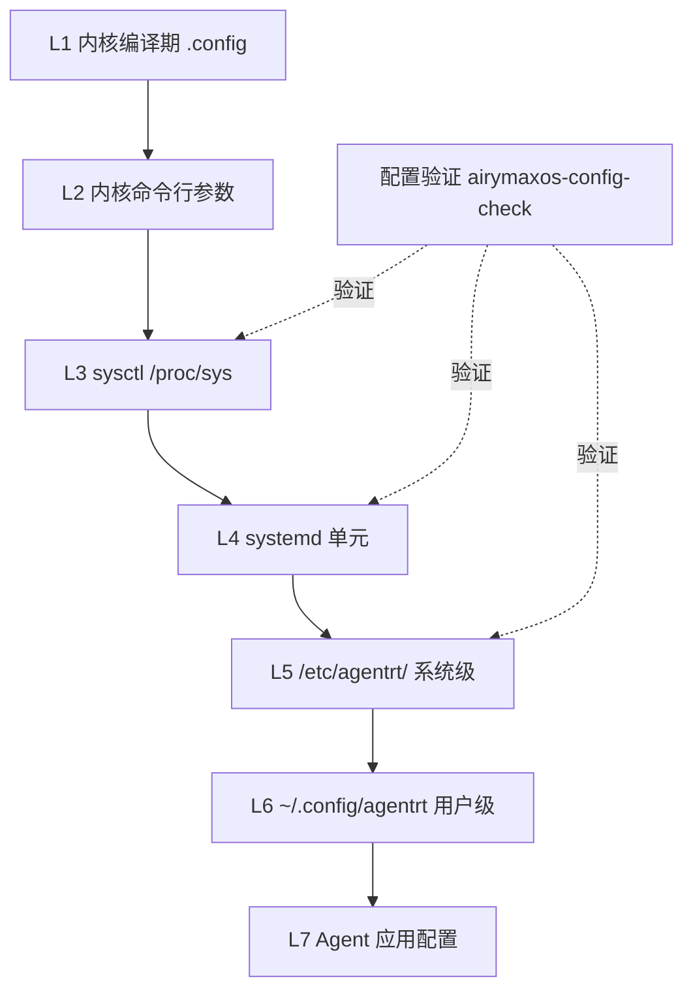
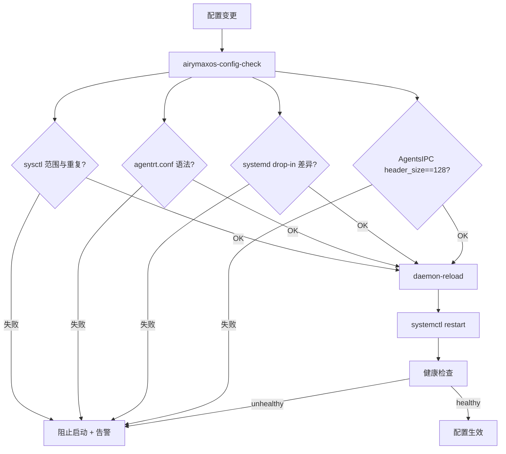
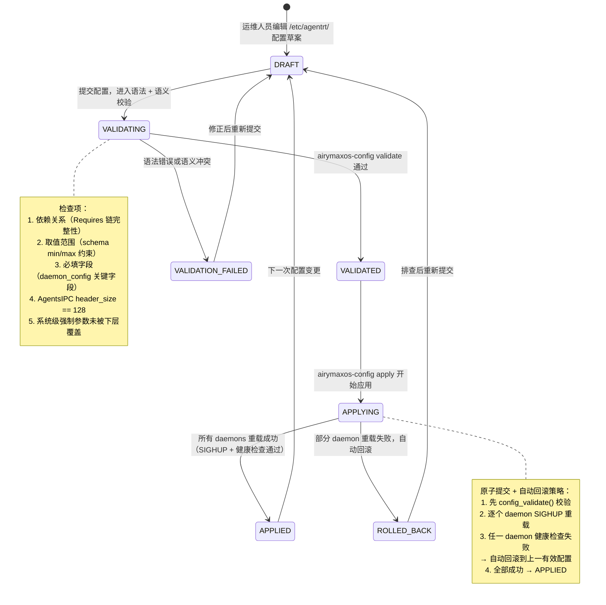
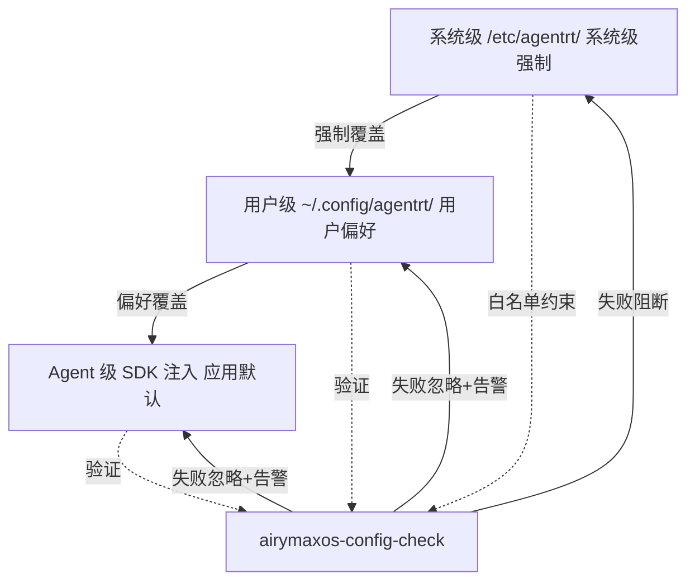
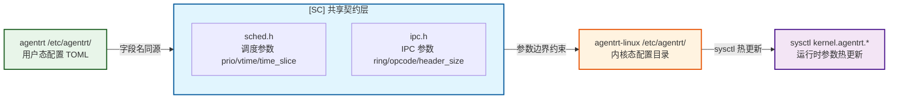

Copyright (c) 2025-2026 SPHARX Ltd. All Rights Reserved.

# agentrt-linux（AirymaxOS）配置管理
> **文档定位**：agentrt-linux（AirymaxOS，极境智能体操作系统）运维体系第 2 卷——配置工程。本文档规定从内核运行时参数到 Agent 级配置的完整配置栈：sysctl 内核运行时参数、`/etc/sysctl.d/` 组织、`/etc/agentrt/` 配置目录、systemd 单元配置、12 daemons 配置文件、环境变量、配置验证、配置版本控制、agentrt-linux 三级配置分层（系统级 / 用户级 / Agent 级）。\
> **文档版本**：0.1.1\
> **最后更新**：2026-07-06\
> **上级文档**：[agentrt-linux 设计文档](README.md)\
> **同源映射**：agentrt daemons（12 个用户态服务配置）+ Linux 6.6 sysctl + systemd 单元配置\
> **理论根基**：Linux 6.6 内核基线工程思想 + Airymax 五维正交 24 原则 + S-1 反馈闭环\
> **核心约束**：IRON-9 v2 同源且部分代码共享——与 agentrt 同源配置语义，agentrt-linux 独立承担内核与系统级配置责任

---

## 第 1 章 配置管理概述

### 1.1 配置栈总览

agentrt-linux 配置管理继承 Linux 6.6 内核基线沉淀的配置哲学——内核运行时参数（sysctl）+ 持久化配置目录（`/etc/`）+ 服务单元配置（systemd drop-in）——并在其上扩展智能体操作系统的专属配置层：`/etc/agentrt/`（12 daemons 配置）与 Agent 级配置（`~/.agentrt/`）。配置栈自底向上分七层：**L1** 内核编译期（`.config`，构建时固化）→ **L2** 内核启动期（内核命令行参数）→ **L3** 内核运行时（sysctl，`/proc/sys/` + `/etc/sysctl.d/`）→ **L4** 系统服务（systemd 单元）→ **L5** agentrt-linux 系统级（`/etc/agentrt/`，12 daemons）→ **L6** 用户级（`~/.config/agentrt/`）→ **L7** Agent 级（Agent 应用自带，SDK 注入）。

**OS-OPS-101**：所有可运行时调整的配置必须落在 L3-L7，禁止依赖重新编译内核来调整运行时行为；L1/L2 仅用于不可运行时变更的硬约束（K-1 内核极简）。

**OS-OPS-102**：配置变更必须可验证、可回滚、可审计——这三者是 S-1 反馈闭环在配置层的硬约束，缺一不可。

### 1.2 配置管理与 MicroCoreRT 的关系

MicroCoreRT 是 Airymax 微核心运行时基座，其内核态行为受 sysctl 与内核命令行参数共同约束。配置管理必须保证 MicroCoreRT 契约相关的 sysctl 参数（如调度类、内存回收策略）在 `/etc/sysctl.d/` 中显式声明，禁止依赖默认值——默认值可能随内核版本漂移而破坏 MicroCoreRT 语义。

**OS-OPS-138**：所有影响 MicroCoreRT 内核态行为的 sysctl 参数必须集中在 `/etc/sysctl.d/99-airymaxos-microcorert.conf`，并加注释说明每个参数与 MicroCoreRT 契约的对应关系（E-7 文档即代码）。

### 1.3 配置分层流程图



---

## 第 2 章 sysctl 内核运行时参数

### 2.1 sysctl 机制

sysctl 是 Linux 6.6 内核基线提供的运行时内核参数调整机制，通过 `/proc/sys/` 目录暴露可读可写的内核参数。agentrt-linux 将 sysctl 作为内核运行时配置的唯一入口，覆盖调度、内存、网络、文件系统、IPC 五大子系统。

`/proc/sys/` 的子目录与子系统对应：`kernel/`（全局内核参数）、`vm/`（内存管理）、`net/`（网络）、`fs/`（文件系统）、`kernel/`（IPC 与调度）、`user/`（用户级限制）。

**OS-OPS-139**：任何 agentrt-linux 自定义内核参数（`kernel.airy_*`）必须在 `Documentation/admin-guide/sysctl/kernel.rst` 等价文档中登记，并遵循 Linux sysctl 文档规范（E-7 文档即代码）。

**OS-OPS-123**：sysctl 参数的读取与写入必须通过 `sysctl` 命令或 `/proc/sys/` 文件接口，禁止直接操作内核内部数据结构；这是 K-2 接口契约化在内核配置层的体现。

### 2.2 关键 sysctl 参数清单

agentrt-linux 关心的 sysctl 参数按子系统分组：

| 子系统 | 参数 | 默认值 | 说明 |
|--------|------|--------|------|
| 调度 | `kernel.sched_latency_ns` | 6000000 | 调度延迟，影响 MicroCoreRT 调度类 |
| 调度 | `kernel.sched_rt_runtime_us` | 950000 | RT 调度运行时配额 |
| 内存 | `vm.swappiness` | 10 | 交换倾向（Agent 工作负载偏低） |
| 内存 | `vm.overcommit_memory` | 1 | 内存超分策略 |
| 内存 | `vm.max_map_count` | 262144 | 最大映射数（LLM 模型加载需要） |
| 内存 | `vm.watermark_scale_factor` | 150 | 多代 LRU 水位因子 |
| IPC | `kernel.msgmax` | 8192 | 消息最大长度（AgentsIPC 128B 头 + payload） |
| IPC | `kernel.msgmni` | 32768 | 消息队列最大数 |
| 网络 | `net.core.somaxconn` | 4096 | socket 最大连接数 |
| 网络 | `net.ipv4.tcp_max_syn_backlog` | 8192 | SYN backlog |
| 文件 | `fs.file-max` | 1048576 | 系统最大文件句柄 |
| 文件 | `fs.inotify.max_user_watches` | 524288 | inotify 监视数 |

**OS-OPS-103**：`vm.max_map_count` 必须 ≥ 262144，因 LLM 模型加载（`cogn_d`）需要大量内存映射；低于此值将导致 LLM 加载失败（C-3 记忆卷载在内存层的体现）。

**OS-OPS-104**：`kernel.msgmni` 必须 ≥ 32768，因 AgentsIPC 消息队列依赖内核 IPC 机制；低于此值将导致 daemon 间通信队列创建失败。

---

## 第 3 章 /etc/sysctl.d/ 组织

### 3.1 目录组织规则

`/etc/sysctl.d/` 是 sysctl 持久化配置的标准目录，文件按数字前缀排序加载。agentrt-linux 采用以下命名约定：

| 文件 | 范围 | 优先级 |
|------|------|--------|
| `00-system-default.conf` | 系统默认（airymaxos-system 包提供） | 最低 |
| `50-kernel-tuning.conf` | 内核调优（airymaxos-kernel 包提供） | 中 |
| `99-airymaxos-microcorert.conf` | MicroCoreRT 专属（OS-OPS-138） | 高 |
| `99-local.conf` | 本地覆盖（管理员手动） | 最高 |

**OS-OPS-124**：sysctl 文件命名必须遵循 `NN-name.conf` 格式（NN 为两位数字），数字越小优先级越低；同参数后加载覆盖先加载，`99-local.conf` 拥有最高覆盖权。

**OS-OPS-125**：禁止在多个文件中重复声明同一 sysctl 参数；重复声明视为配置漂移，由 `airymaxos-config-check` 检测并告警（E-2 可观测性）。

### 3.2 sysctl 配置文件示例

```conf
# /etc/sysctl.d/99-airymaxos-microcorert.conf
# agentrt-linux（AirymaxOS）MicroCoreRT 内核运行时参数
# 理论根基: Linux 6.6 内核基线 + MicroCoreRT 契约
# 维护: airymaxos-kernel 包，禁止手动覆盖

# --- 调度类（MicroCoreRT 调度器约束）---
kernel.sched_latency_ns = 6000000
kernel.sched_min_granularity_ns = 750000
kernel.sched_rt_runtime_us = 950000

# --- 内存管理（多代 LRU + Agent 工作负载）---
vm.swappiness = 10
vm.max_map_count = 262144
vm.watermark_scale_factor = 150
vm.overcommit_memory = 1

# --- IPC（AgentsIPC 128B 消息头依赖）---
kernel.msgmax = 8192
kernel.msgmni = 32768
kernel.shmmax = 68719476736

# --- 网络（gateway_d 高并发）---
net.core.somaxconn = 4096
net.ipv4.tcp_max_syn_backlog = 8192

# --- 文件系统（logger_daemon 日志 + 记忆卷）---
fs.file-max = 1048576
fs.inotify.max_user_watches = 524288
```

**OS-OPS-105**：`/etc/sysctl.d/99-airymaxos-microcorert.conf` 由 `airymaxos-kernel` 包以 `%config(noreplace)` 安装，dnf 升级时本地修改保留，但 `airymaxos-config-check` 会检测本地与包默认值的差异并告警（C-2 增量演化）。

### 3.3 sysctl 应用时机

**OS-OPS-106**：sysctl 必须在三个时机应用：(1) 安装时（Kickstart `%post` 执行 `sysctl --system`）；(2) 启动时（`systemd-sysctl.service` 在 `sysinit.target` 阶段）；(3) 升级后（dnf `%post` 触发 `systemctl restart systemd-sysctl`）。三时机缺一不可（S-1 反馈闭环）。

---

## 第 4 章 /etc/agentrt/ 配置目录

### 4.1 目录结构

`/etc/agentrt/` 是 agentrt-linux 12 daemons 的系统级配置根目录，与 agentrt 用户态运行时同源（IRON-9 v2 同源且部分代码共享）。目录包含：`agentrt.conf`（全局配置，日志等级/IPC 端口/运行模式）、12 个 daemon 配置（`macro-superv.conf`/`logger.conf`/`config.conf`/`gateway.conf`/`sched.conf`/`vfs.conf`/`net.conf`/`mem.conf`/`cogn.conf`/`sec.conf`/`audit.conf`/`dev.conf`）、`airy_ipc.conf`（AgentsIPC 协议参数）、`microcorert.conf`（MicroCoreRT 用户态适配参数）、`keys/`（密钥目录，`0600`）与 `conf.d/`（drop-in 覆盖目录）。

**OS-OPS-126**：每个 daemon 必须有独立的 `<daemon>.conf`，禁止共用配置文件；配置文件名与二进制名一一对应（`*_d` 守护进程取基础名，`macro_superv`/`logger_daemon`/`config_daemon` 取去 `_daemon` 后缀的短名，K-1 内核极简的延伸：配置职责单一）。

**OS-OPS-127**：`/etc/agentrt/agentrt.conf` 是全局配置，仅包含所有 daemon 共享的参数（日志等级、IPC 基础端口、运行模式）；daemon 专属参数必须放在各自的 `<daemon>.conf` 中。

### 4.2 配置文件格式

配置文件采用 INI 格式（键值对 + 分组），与 systemd unit 风格一致：

```conf
# /etc/agentrt/gateway.conf
# agentrt-linux（AirymaxOS）gateway_d 配置（IRON-9 v2 同源且部分代码共享于 agentrt 用户态）
# 维护: airymaxos-services-core 包

[main]
listen = 0.0.0.0
port = 7400
workers = 4
log_level = info

[ipc]
protocol = airy_ipc
header_size = 128
queue_size = 1024
timeout_ms = 5000

[sched]
upstream = agentrt-sched.service
retry = 3

[security]
capability = CAP_NET_BIND_SERVICE
tls_required = true
```

**OS-OPS-107**：所有 `/etc/agentrt/*.conf` 必须设置权限 `0640`，属主 `root:agentrt`，禁止 world-readable（E-1 安全内生；配置可能含密钥引用）。

**OS-OPS-122**：配置文件中的密钥必须以引用形式（`tls_key_file = /etc/agentrt/keys/gateway.key`），禁止在配置文件中直接存储明文密钥；密钥文件独立管理且权限 `0600`。

### 4.3 conf.d drop-in 覆盖

`/etc/agentrt/conf.d/` 提供 drop-in 覆盖机制，允许在不修改包提供的配置文件前提下覆盖单个参数。加载顺序：`agentrt.conf` → `<daemon>.conf` → `conf.d/*.conf`（按文件名字典序）。

**OS-OPS-128**：`conf.d/` 下的覆盖文件必须以 `NN-` 数字前缀命名（如 `99-local.conf`），禁止无前缀文件；覆盖文件优先级高于主配置（C-2 增量演化，本地覆盖不破坏包默认）。

---

## 第 5 章 systemd 单元配置

### 5.1 单元配置层级

systemd 单元配置分三层，优先级从低到高：**包提供单元**（`/usr/lib/systemd/system/agentrt-*.service`，RPM 安装只读）→ **系统级覆盖**（`/etc/systemd/system/agentrt-*.service.d/*.conf`，drop-in）→ **运行时覆盖**（`/run/systemd/system/agentrt-*.service.d/*.conf`，临时重启丢失）。

**OS-OPS-129**：禁止直接修改 `/usr/lib/systemd/system/` 下的包提供单元；所有定制必须通过 `/etc/systemd/system/<unit>.d/*.conf` drop-in 实现，保证 dnf 升级不覆盖定制（C-2 增量演化）。

### 5.2 drop-in 配置示例

```ini
# /etc/systemd/system/agentrt-cogn.service.d/override.conf
# agentrt-linux（AirymaxOS）cogn_d 资源限制覆盖（本地定制）
[Service]
MemoryMax=8G
TasksMax=2048
# LLM 推理需要更大的 fd 上限
LimitNOFILE=1048576
Environment=AIRY_COGN_CACHE_SIZE=8192
```

**OS-OPS-108**：任何对 12 daemons 的 systemd drop-in 修改必须执行 `systemctl daemon-reload && systemctl restart <unit>` 生效；未执行 daemon-reload 视为配置未应用（S-1 反馈闭环，配置生效必须可验证）。

**OS-OPS-109**：`MemoryMax` 与 `TasksMax` 的 drop-in 覆盖值不得低于包提供单元的默认值（防止误降导致 OOM）；`airymaxos-config-check` 检测并告警（E-2 可观测性）。

### 5.3 单元配置验证

单元配置验证使用 systemd 原生工具：`systemd-analyze verify /etc/systemd/system/agentrt-*.service` 校验语法，`systemctl cat agentrt-gateway.service` 查看 drop-in 生效后的最终单元，`systemd-analyze plot > boot.svg` 生成启动顺序依赖图。

**OS-OPS-130**：所有自定义 drop-in 提交前必须通过 `systemd-analyze verify` 语法校验；CI 中 `make verify-units` 强制执行（E-8 可测试性）。

---

## 第 6 章 12 daemons 配置文件

### 6.1 daemon 配置矩阵

12 daemons 的配置文件统一在 `/etc/agentrt/` 下，每个 daemon 对应一个 `<daemon>.conf`。配置矩阵：

| daemon | 配置文件 | 关键参数 | 关联契约 |
|--------|---------|---------|---------|
| `macro_superv` | `macro-superv.conf` | registry, ttl, max_agents | USV |
| `logger_daemon` | `logger.conf` | trace_buffer, sample_rate | ULPS |
| `config_daemon` | `config.conf` | plugin_dirs, sandbox | UCF |
| `gateway_d` | `gateway.conf` | listen, port, workers | AgentsIPC |
| `sched_d` | `sched.conf` | policy, quantum, preempt | MicroCoreRT（调度类） |
| `vfs_d` | `vfs.conf` | hook_dirs, exec_policy | capability |
| `net_d` | `net.conf` | buffer_size, backlog | AgentsIPC |
| `mem_d` | `mem.conf` | aggregation_window, retention | C-3 记忆卷载 |
| `cogn_d` | `cogn.conf` | model_path, cache_size, batch | MicroCoreRT（内存映射） |
| `sec_d` | `sec.conf` | channels, rate_limit | — |
| `audit_d` | `audit.conf` | metrics_interval, alert_rules | E-2 可观测性 |
| `dev_d` | `dev.conf` | sandbox, timeout, allowed_tools | capability |

**OS-OPS-110**：每个 daemon 启动时必须校验自身 `<daemon>.conf` 的关键字段，缺失或非法值时拒绝启动并输出诊断码（fail fast，S-1 反馈闭环）；禁止以默认值静默运行。

**OS-OPS-131**：`airy_ipc.conf` 中的 `header_size` 必须 == 128，与 AgentsIPC 128B 定长消息头契约严格一致；任何偏离视为协议破坏（K-2 接口契约化，IRON-9 同源约束）。

### 6.2 AgentsIPC 配置示例

```conf
# /etc/agentrt/airy_ipc.conf
# agentrt-linux（AirymaxOS）AgentsIPC 协议参数（与 agentrt 同源）
# 维护: airymaxos-services-common 包

[protocol]
version = 1
header_size = 128          # 固定 128B，禁止修改（OS-OPS-131）
max_payload = 1048576      # 1 MiB
checksum = crc32c

[transport]
backend = io_uring         # 零拷贝传输
queue_depth = 1024
buffer_pool = 256

[security]
auth_required = true
token_file = /etc/agentrt/keys/airy_ipc.token
```

**OS-OPS-111**：`airy_ipc.conf` 的 `header_size` 与 `version` 字段由 `airymaxos-services-common` 包以 `%config(noreplace)` 管理；升级时若 `version` 变更，必须遵循 L2 接口稳定性流程（保留旧版本 2 个周期，详见 01-deployment §10.3）。

---

## 第 7 章 环境变量

### 7.1 环境变量分层

agentrt-linux 环境变量分三层，优先级从低到高：**包默认环境变量**（systemd unit 中的 `Environment=`，`/usr/lib/systemd/system/`）→ **系统级环境变量**（`/etc/agentrt/agentrt.env`，由 `airymaxos-services-common` 提供）→ **单元级环境变量**（systemd drop-in 中的 `Environment=` 或 `EnvironmentFile=`）。

**OS-OPS-132**：环境变量仅用于传递非敏感的运行时参数（日志级别、端口、缓存大小）；禁止通过环境变量传递密钥、令牌、密码——这些必须通过配置文件引用（OS-OPS-122）。

### 7.2 环境变量文件示例

```bash
# /etc/agentrt/agentrt.env
# agentrt-linux（AirymaxOS）12 daemons 全局环境变量（非敏感参数）
# 维护: airymaxos-services-common 包

AIRY_LOG_LEVEL=info
AIRY_IPC_BASE_PORT=7400
AIRY_RUNTIME_MODE=production
AIRY_CONFIG_DIR=/etc/agentrt
AIRY_DATA_DIR=/var/lib/agentrt
AIRY_COGN_CACHE_DIR=/var/cache/agentrt/cogn
# 敏感参数走配置文件引用，不在此声明
```

**OS-OPS-112**：`AIRY_DATA_DIR` 必须指向 `/var/lib/agentrt`（独立分区，详见 01-deployment §5.2）；偏离此值将导致记忆卷与系统根混区，破坏回滚不丢记忆的保证（C-3 记忆卷载）。

**OS-OPS-133**：systemd unit 通过 `EnvironmentFile=-/etc/agentrt/agentrt.env` 加载（前导 `-` 表示文件可选）；禁止在 unit 中硬编码环境变量值，所有环境变量必须集中在 `agentrt.env`（E-7 文档即代码，单一事实来源）。

### 7.3 环境变量与 AgentsIPC

**OS-OPS-113**：影响 AgentsIPC 行为的环境变量（如 `AIRY_IPC_BASE_PORT`）必须在 `agentrt.env` 中声明默认值，并通过 drop-in 覆盖；daemon 启动时读取并校验，与 `airy_ipc.conf` 的 `transport` 段保持一致（K-2 接口契约化）。

---

## 第 8 章 配置验证

### 8.1 验证工具链

agentrt-linux 提供 `airymaxos-config-check` 工具，对全栈配置执行静态验证。支持 `--all`（全栈）、`--sysctl`（仅 sysctl）、`--agentrt`（仅 agentrt 配置）、`--units`（仅 systemd 单元）四种模式。

验证内容覆盖：(1) sysctl 参数范围与重复声明检测（OS-OPS-125）；(2) `/etc/agentrt/*.conf` 语法与必填字段；(3) systemd drop-in 与包默认值的差异检测（OS-OPS-109）；(4) AgentsIPC `header_size` 契约校验（OS-OPS-131）。

**OS-OPS-114**：`airymaxos-config-check` 必须在以下时机执行：(1) 系统启动后（firstboot 阶段）；(2) dnf 升级 `%post` 之后；(3) 管理员手动修改配置后。任一验证失败必须阻止 daemon 启动并告警（S-1 反馈闭环）。

### 8.2 验证流程图



**OS-OPS-115**：配置验证失败的告警必须路由到 `audit_d` + Alertmanager，且告警消息中包含失败的具体规则编号（如 `OS-OPS-131 violated: header_size=256`），便于追溯（E-6 错误可追溯）。

**OS-OPS-134**：`airymaxos-config-check` 自身必须有单元测试覆盖，测试用例位于 `80-testing/` 下，覆盖率门槛 ≥ 90%（E-8 可测试性）。

### 8.3 配置变更生命周期状态机

配置从草案编辑到应用生效的完整状态转换，涵盖校验、原子应用与自动回滚全流程：



**状态转换条件**：

| 从状态 | 到状态 | 触发条件 | 系统行为 |
|--------|--------|---------|---------|
| — | DRAFT | 运维人员编辑 `/etc/agentrt/` 配置草案 | 创建配置变更工作副本，记录变更意图（commit message 引用 issue） |
| DRAFT | VALIDATING | 提交配置，触发 `airymaxos-config-check` | 进入语法 + 语义校验，执行 schema 匹配、取值范围检查、依赖关系验证 |
| VALIDATING | VALIDATED | `config_validate()` 返回 CONFIG_OK，所有检查项通过 | 标记配置为已校验，准备应用（OS-OPS-117） |
| VALIDATING | VALIDATION_FAILED | 校验返回 `CONFIG_E_PARSE` / `CONFIG_E_RANGE` / `CONFIG_E_HEADER_SIZE` 等错误码 | 记录失败规则编号（如 `OS-OPS-131 violated`），告警路由到 audit_d（OS-OPS-115） |
| VALIDATION_FAILED | DRAFT | 运维人员修正配置错误后重新提交 | 回到草案状态，重新编辑配置文件 |
| VALIDATED | APPLYING | 执行 `airymaxos-config apply`，开始应用配置 | 向 12 daemons 逐个发送 SIGHUP（`config_reload()`），触发 daemon 重载 |
| APPLYING | APPLIED | 所有 12 daemons 重载成功 + 健康检查通过 | 标记配置生效，记录审计日志（who/when/what/from/to，OS-OPS-118） |
| APPLYING | ROLLED_BACK | 部分 daemon 重载失败或健康检查未通过 | 自动回滚到上一有效配置（`git checkout <rev>` + 重新应用，OS-OPS-118） |
| APPLIED | DRAFT | 下一次配置变更周期开始 | 当前配置成为新的基线，进入下一轮变更流程 |
| ROLLED_BACK | DRAFT | 排查回滚根因后重新提交配置 | 回到草案状态，修正导致回滚的配置项 |

---

## 第 9 章 配置版本控制

### 9.1 配置即代码

agentrt-linux 推崇"配置即代码"（E-7 文档即代码的延伸）：`/etc/agentrt/`、`/etc/sysctl.d/`、`/etc/systemd/system/*.d/` 的全部配置必须纳入 git 仓库管理。仓库结构按配置类型分目录：`sysctl/`（sysctl 配置）、`agentrt/`（`agentrt.conf` + 12 daemons 配置）、`systemd/`（unit drop-in 覆盖）、`env/`（`agentrt.env`）。

**OS-OPS-116**：生产环境 `/etc/agentrt/`、`/etc/sysctl.d/99-*.conf`、`/etc/systemd/system/agentrt-*.service.d/` 必须纳入 git 管理，仓库托管在内网 GitLab；任何手工修改未提交 git 视为配置漂移（E-6 错误可追溯）。

**OS-OPS-135**：配置仓库的每次提交必须包含变更原因（commit message 引用 issue 或 Fixes:），与 05 开发流程的可追溯性约束对齐。

### 9.2 配置部署与回滚

配置变更通过配置管理工具（Ansible/Puppet）从仓库部署到主机。部署命令 `ansible-playbook -i inventory playbooks/config-deploy.yml`；回滚命令追加 `--extra-vars "rev=HEAD~1"` 指定回退版本。

**OS-OPS-117**：配置部署必须先执行 `airymaxos-config-check --dry-run`，验证通过后方可执行实际部署；部署后必须执行 `systemctl restart agentrt.target` + 健康检查（S-1 反馈闭环）。

**OS-OPS-118**：配置回滚必须支持版本级回滚（`git checkout <rev>` + 重新部署）；回滚操作必须记录审计日志（who/when/what/from/to），审计日志保留 90 天（E-6 错误可追溯）。

### 9.3 配置与 MicroCoreRT 契约一致性

**OS-OPS-140**：配置仓库中 `sysctl/99-airymaxos-microcorert.conf` 的任何变更必须经工程规范委员会签字（与 01-deployment §15 的变更流程一致），因 MicroCoreRT 契约变更影响内核态行为，不可随意调整（K-1 内核极简 + IRON-9 同源约束）。

---

## 第 10 章 agentrt-linux 配置分层

### 10.1 三级配置分层

agentrt-linux 配置自顶向下分三级，每级有明确的所有者与作用域：

| 级别 | 作用域 | 路径 | 所有者 | 优先级 |
|------|--------|------|--------|--------|
| **系统级** | 全系统 | `/etc/agentrt/`、`/etc/sysctl.d/` | root（运维团队） | 最高 |
| **用户级** | 单用户 | `~/.config/agentrt/` | 用户本人 | 中 |
| **Agent 级** | 单 Agent 应用 | Agent 应用自带 | Agent 开发者 | 最低 |

加载顺序：Agent 级 → 用户级 → 系统级（系统级覆盖用户级覆盖 Agent 级）。这与 systemd drop-in 的优先级方向一致——越靠近系统核心，优先级越高。

**OS-OPS-136**：三级配置必须遵循"系统级强制、用户级偏好、Agent 级默认"的语义：系统级参数不可被用户级或 Agent 级覆盖（如 AgentsIPC `header_size`）；用户级参数可覆盖 Agent 级默认（如日志等级）；Agent 级仅提供默认值（如缓存大小）。

### 10.2 系统级强制参数

系统级强制参数是安全与契约的硬约束，禁止下层覆盖：

| 参数 | 强制原因 | 关联原则 |
|------|---------|---------|
| `airy_ipc.header_size = 128` | AgentsIPC 协议契约 | K-2 / IRON-9 |
| `microcorert.probe = on` | MicroCoreRT 契约 | K-1 |
| `selinux = enforcing` | 强制访问控制 | E-1 |
| `gpgcheck = 1` | 包签名校验 | E-1 |
| `vm.max_map_count ≥ 262144` | LLM 加载保证 | C-3 |

**OS-OPS-119**：系统级强制参数清单由 `airymaxos-config-check` 维护为白名单；用户级或 Agent 级配置试图覆盖强制参数时，加载器拒绝加载并告警（K-2 接口契约化 + E-1 安全内生）。

### 10.3 用户级与 Agent 级配置

用户级配置（`~/.config/agentrt/`）允许用户自定义偏好，如默认 LLM 模型、日志等级、Token 预算阈值。Agent 级配置由 Agent 应用通过 SDK 注入，提供应用默认值。

```conf
# ~/.config/agentrt/user.conf
# 用户级偏好（覆盖 Agent 级默认，被系统级强制约束）
[cogn]
default_model = airymax-large
max_tokens_per_turn = 8192

[logging]
level = debug
```

**OS-OPS-137**：用户级与 Agent 级配置文件必须通过 `airymaxos-config-check --user` 验证；验证失败时用户级配置被忽略（不阻断系统启动），但告警通知用户（A-3 人文关怀，不让用户配置错误阻塞系统）。

**OS-OPS-120**：Agent 级配置通过 SDK 的 `airy_config_load()` API 注入，注入时必须声明配置来源（agent name + version）；系统级加载器记录注入日志便于审计（E-6 错误可追溯）。

### 10.4 配置分层关系图



---

## 第 11 章 五维原则映射

agentrt-linux 配置管理是 Airymax 五维正交 24 原则在配置栈的具体落地：

| 原则 | 在配置管理的体现 | 落地规则 |
|------|----------------|---------|
| **S-1 反馈闭环 / S-2 层次分解** | 配置变更验证+重启+健康检查；配置栈七层+三级分层 | OS-OPS-106 / OS-OPS-114 / OS-OPS-117 / §1.1 / §10.1 |
| **K-1 内核极简 / K-2 接口契约化** | sysctl 集中管理 MicroCoreRT；AgentsIPC header_size=128 强制 | OS-OPS-138 / OS-OPS-140 / OS-OPS-131 / OS-OPS-119 |
| **C-2 增量演化 / C-3 记忆卷载** | `%config(noreplace)`+drop-in；`vm.max_map_count` 保证 LLM 加载 + 独立分区 | OS-OPS-128 / OS-OPS-129 / OS-OPS-103 / OS-OPS-112 |
| **E-1 安全内生 / E-2 可观测性** | 配置 0640+密钥引用+强制白名单；配置漂移检测+告警路由 | OS-OPS-107 / OS-OPS-122 / OS-OPS-119 / OS-OPS-125 / OS-OPS-109 / OS-OPS-115 |
| **E-6 错误可追溯 / E-7 文档即代码 / E-8 可测试性** | git 版本控制+审计日志 90 天；sysctl 文档登记+配置即代码；config-check 覆盖率≥90% | OS-OPS-116 / OS-OPS-118 / OS-OPS-139 / OS-OPS-134 |
| **A-3 人文关怀** | 用户级配置错误不阻塞系统 | OS-OPS-137 |
| **IRON-9 v2 同源且部分代码共享** | `/etc/agentrt/` 同源 + 系统级独立 | §4.1 / §12 |

---

## 第 12 章 同源 agentrt 映射

### 12.1 同源关系

agentrt-linux 配置管理与 agentrt 遵循 IRON-9 v2 同源且部分代码共享原则：**同源**——`/etc/agentrt/` 配置目录与 agentrt 用户态 `~/.agentrt/` 共享配置文件名与语义（`gateway.conf`、`cogn.conf` 等），AgentsIPC 128B 消息头协议参数两端共享，MicroCoreRT 用户态适配参数两端共享；**独立**——agentrt-linux 独立承担内核 sysctl 配置（agentrt 无权调整内核参数）、systemd 单元配置、系统级强制白名单，这些是发行版的固有责任；**互操作**——agentrt SDK 通过 `airy_config_load()` 注入 Agent 级配置，agentrt-linux 系统级加载器校验并记录，两端通过同源配置语义实现无适配层互操作。

### 12.2 同源映射表

| 维度 | agentrt（用户态运行时） | agentrt-linux（发行版配置） |
|------|------------------------|------------------------|
| 配置根目录 | `~/.agentrt/` 或环境变量 | `/etc/agentrt/`（系统级） |
| 配置文件名 | `<daemon>.conf`（同源） | `<daemon>.conf`（同源，IRON-9） |
| IPC 协议参数 | `airy_ipc.conf`（同源） | 同源 + 系统级强制 `header_size=128` |
| 微核心契约 | MicroCoreRT 用户态参数 | MicroCoreRT 内核态 sysctl（OS-OPS-138） |
| 内核参数 | 无权调整 | sysctl 全权管理（OS-OPS-123） |
| 配置验证 | 应用层校验 | `airymaxos-config-check` 全栈校验 |
| 版本控制 | 应用 git | 配置即代码仓库（OS-OPS-116） |

**OS-OPS-121**：agentrt-linux 系统级配置的 `airy_ipc.header_size` 必须与同版本 agentrt 用户态 SDK 的协议版本一致；版本不一致时 `airymaxos-config-check` 报错并阻止 daemon 启动（IRON-9 v2 同源且部分代码共享在配置层的强制）。

### 12.3 IRON-9 v2 三层共享模型

IRON-9 v2 三层共享模型将 agentrt（用户态运行时）与 agentrt-linux（发行版配置）之间的同源关系细分为三个正交层次：[SC] 共享契约层（头文件级代码共享）、[SS] 语义同源层（语义两端一致但实现独立）、[IND] 完全独立层（发行版固有责任）。本节聚焦配置管理的三层映射。

#### 12.3.1 三层模型概览

| 层次 | 共享程度 | 配置管理内容 |
|------|---------|-------------|
| **[SC] 共享契约层** | 头文件级代码共享 | `include/airymax/sched.h`（调度参数：优先级、vtime、时间片）、`include/airymax/ipc.h`（IPC 配置：ring 大小、操作码） |
| **[SS] 语义同源层** | 语义两端一致，实现独立 | 配置文件格式（TOML key=value）、配置层级覆盖、运行时热更新、配置校验 |
| **[IND] 完全独立层** | agentrt-linux 独有 | `/etc/agentrt/` 内核态配置目录、sysctl 内核参数接口、procfs 状态导出、配置变更审计日志 |

#### 12.3.2 [SC] 共享契约层

配置管理的 [SC] 层由两个头文件构成：`sched.h` 定义调度参数的合法取值范围与结构，`ipc.h` 定义 IPC 配置参数（ring 大小、操作码枚举）。两端共享同一头文件，确保配置项的字段名、取值范围、默认值在两端字节级一致。

> **[SC] 共享契约层定义引用（P2-16 修复）**：调度参数与 IPC 配置参数的权威常量定义位于 SSoT
> `50-engineering-standards/120-cross-project-code-sharing.md` §2.6（`sched.h`）与 §2.7（`ipc.h`）。
> 本节不就地重定义 [SC] 层结构体，仅引用 [SC] 层定义的常量范围作为配置校验边界：
>
> - **调度参数**（引用 §2.6 `sched.h`）：`AIRY_PRIO_MIN = 0` / `AIRY_PRIO_MAX = 139`（优先级范围）、
>   `AIRY_WEIGHT_MIN = 1` / `AIRY_WEIGHT_MAX = 10000`（权重范围）、
>   `AIRY_SLICE_DFL_MS = 20`（默认时间片）、`MAC_MAX_AGENTS = 1024`（并发上限）、
>   `airy_vtime_t`（Q16.16 定点，非浮点）。配置文件中 `<daemon>.conf [sched]` 段的字段名
>   与取值范围必须与上述 [SC] 常量一致。
> - **IPC 配置参数**（引用 §2.7 `ipc.h`）：`AIRY_IPC_HDR_SZ = 128`（消息头定长）、
>   `AIRY_IPC_RING_DEF_ENTRIES = 256` / `AIRY_IPC_RING_MAX_ENTRIES = 32768`（ring 容量范围）、
>   `enum airy_ipc_op`（4 操作码：SEND/RECV/SEND_BATCH/CANCEL）。
>   配置文件中 `airy_ipc.conf [transport]` 段的 `queue_depth` 必须落在上述 ring 容量范围内。

**约束**：`<daemon>.conf [sched].prio` 必须在 `[AIRY_PRIO_MIN, AIRY_PRIO_MAX]` 范围内，`airy_ipc.conf [protocol].header_size` 必须等于 `AIRY_IPC_HDR_SZ`（128）；任何 [SC] 参数边界的变更必须经工程规范委员会签字，且两端同步升级头文件版本。

#### 12.3.3 [SS] 语义同源层

[SS] 层的配置语义两端一致，但实现载体不同：agentrt 用户态使用 TOML/JSON 配置文件 + 应用层校验，agentrt-linux 使用 TOML 配置文件 + `airymaxos-config-check` 全栈校验。两端语义映射如下：

| 语义维度 | agentrt（用户态运行时） | agentrt-linux（发行版配置） |
|------|------------------------|------------------------|
| 配置文件格式 | TOML key=value（`<daemon>.conf`） | TOML key=value（同源文件名） |
| 配置层级覆盖 | 全局→用户→Agent→实例（4 级） | 系统级→用户级→Agent 级→实例（4 级，同源语义） |
| 运行时热更新 | 应用层 SIGHUP 重载 | sysctl 内核参数热更新 + systemd reload |
| 配置校验 | 应用层 schema validation | `airymaxos-config-check` 全栈 schema 校验 |
| 配置版本控制 | 应用 git 仓库 | 配置即代码仓库（OS-OPS-116） |
| 配置漂移检测 | 应用层对比 | 配置漂移检测 + 告警路由（OS-OPS-109） |

两端在配置语义上完全同源——文件名（`gateway.conf`、`cogn.conf` 等）、字段名、层级覆盖优先级、热更新触发的概念模型一致——但 agentrt-linux 将配置语义落地为系统级强制（`/etc/agentrt/` 系统目录、sysctl 内核接口、白名单校验），而 agentrt 用户态运行时保持 `~/.agentrt/` 用户目录的轻量实现。这种语义同源使得 Agent 配置在两端迁移时无需字段级转换，仅路径前缀从 `~/.agentrt/` 变为 `/etc/agentrt/`。

#### 12.3.4 [IND] 完全独立层

[IND] 层是 agentrt-linux 发行版配置管理的固有责任，agentrt 用户态运行时不涉及：

| 独立实现项 | 说明 | agentrt 是否涉及 |
|------|------|------|
| `/etc/agentrt/kernel/` 内核态配置 | 内核模块参数配置目录 | 否 |
| `/etc/agentrt/security/` 安全配置 | Cupolas LSM 策略、capability 映射 | 否 |
| sysctl 内核参数接口 | `kernel.agentrt.*`、`vm.agentrt.*` sysctl 树 | 否 |
| procfs 状态导出 | `/proc/agentrt/` 运行时状态只读导出 | 否 |
| 配置变更审计日志 | 90 天审计日志（OS-OPS-118） | 否 |
| 系统级强制白名单 | `airymaxos-config-check` 白名单阻断 | 否 |

#### 12.3.5 跨态协作流



配置协作流：agentrt 用户态使用 TOML 格式配置 daemons（`gateway.conf`、`cogn.conf` 等），配置参数的字段名与取值范围由 [SC] 层的 `sched.h`（调度参数）和 `ipc.h`（IPC 参数）头文件约束。agentrt-linux 在 `/etc/agentrt/` 系统级目录加载同源配置文件（[SS] 语义同源——文件名与字段名两端一致），通过 `airymaxos-config-check` 校验 [SC] 参数边界后，将内核态参数映射到 sysctl 接口（`kernel.agentrt.*`）实现运行时热更新（[IND] 完全独立——sysctl/procfs/审计日志为发行版固有责任）。两端通过同源配置语义实现无适配层互操作。

---

## 第 13 章 相关文档

**本模块内**：`100-operations/README.md`（运维主索引）、`01-deployment.md`（部署体系，含 sysctl 应用时机）、`07-systemd-integration.md`（systemd 集成，1.0.1）、`08-agent-operations.md`（Agent 运维，1.0.1）。

**跨模块**：`20-modules/02-services.md`（12 daemons 设计）、`20-modules/07-system.md`（配置工具子仓）、`30-interfaces/02-ipc-protocol.md`（AgentsIPC 协议）、`50-engineering-standards/04-engineering-philosophy.md`（双层稳定性 + K-2 接口契约化）、`90-observability/README.md`（配置漂移检测可观测性）、`110-security/README.md`（配置文件权限安全）。

**参考材料**：`Linux 6.6 内核源码 Documentation/admin-guide/sysctl/kernel.rst`（kernel sysctl）、`.../sysctl/vm.rst`（vm sysctl）、`.../sysctl/index.rst`（sysctl 总索引）、`Linux 6.6 内核源码 Documentation/admin-guide/kernel-parameters.rst`（内核启动参数）、Linux 6.6 内核基线 sysctl 与 systemd 配置实践。

---

## 第 14 章 文档版本与维护

- **当前版本**: 0.1.1
- **最后更新**: 2026-07-06
- **维护者**: 工程规范委员会（待成立，详见 50-engineering-standards/07-maintainers-and-governance.md）
- **变更流程**: 任何配置规则变更必须经 RFC → 评审 → ACC 验收流程，涉及 AgentsIPC 协议参数或 MicroCoreRT 契约的 sysctl 变更需额外经工程规范委员会签字
- **回顾周期与不变性**: 季度回顾 + 每次大版本升级后回顾；本文档所依据的 Linux 6.6 内核基线工程思想与 Airymax 五维正交 24 原则不随版本变更，具体规则编号（OS-OPS / OS-STD / OS-KER）可随版本演进并通过规则编号注册表追溯

---

## 附录 A: 接口定义

> **附录定位**： 本附录汇集配置管理所需的完整接口契约，供直接参照实现。所有数据结构与函数签名对齐 Linux 6.6 内核基线 sysctl 接口、systemd（v254+）单元配置、主流 Linux 发行版配置管理工程实践，以及 agentrt-linux 三级配置分层专属契约（`include/airymax/config_types.h`）。

### A.1 核心数据结构

#### A.1.1 config_schema — 配置 schema 定义

```c
/**
 * struct config_schema - 配置项 schema 定义
 *
 * 描述单个配置项的合法取值范围，由 airymaxos-config-check 消费。
 * 每个配置项必须有对应的 schema 条目（OS-OPS-130）。
 *
 * 对齐 Linux 6.6 内核基线 sysctl 模式 + 主流 Linux 发行版配置校验规范
 * 对齐 agentrt-linux OS-OPS-123 / OS-OPS-134
 */
struct config_schema {
    const char *key;              /* @field: 配置项键名（如 "vm.max_map_count"） */
    const char *section;          /* @field: 所属段（如 "main"/"ipc"/"security"） */
    int          type;            /* @field: 值类型（CONFIG_TYPE_INT/STRING/BOOL/FLOAT） */
    const char *default_value;    /* @field: 默认值（字符串形式） */
    int64_t     min_value;        /* @field: 最小值（INT 类型有效） */
    int64_t     max_value;        /* @field: 最大值（INT 类型有效） */
    const char **enum_values;     /* @field: 枚举合法值列表（ENUM 类型有效） */
    int          enum_count;      /* @field: 枚举值数量 */
    bool        forced;           /* @field: 是否系统级强制参数（不可被下层覆盖，OS-OPS-119） */
    bool        deprecated;       /* @field: 是否已废弃（触发 CONFIG_E_DEPRECATED） */
    const char *replaced_by;      /* @field: 替代配置项键名（deprecated 时有效） */
    const char *description;      /* @field: 配置项说明（E-7 文档即代码） */
    const char *related_rule;     /* @field: 关联规则编号（如 "OS-OPS-131"） */
};
```

#### A.1.2 sysctl_entry — sysctl 参数条目

```c
/**
 * struct sysctl_entry - 单个 sysctl 参数条目
 *
 * 描述 sysctl 参数的元信息，包括键名、默认值、合法范围、关联子系统。
 * 由 /etc/sysctl.d/ 加载器解析后填充。
 *
 * 对齐 Linux 6.6 内核 Documentation/admin-guide/sysctl/ 规范
 * 对齐 agentrt-linux OS-OPS-138 / OS-OPS-124
 */
struct sysctl_entry {
    const char *key;              /* @field: sysctl 键名（如 "kernel.sched_latency_ns"） */
    const char *value;            /* @field: 当前值（字符串形式） */
    const char *default_value;    /* @field: 包默认值（来自 airymaxos-kernel 包） */
    int64_t     min_value;        /* @field: 合法最小值 */
    int64_t     max_value;        /* @field: 合法最大值 */
    const char *source_file;      /* @field: 来源文件（如 "/etc/sysctl.d/99-airymaxos-microcorert.conf"） */
    int          source_priority; /* @field: 来源优先级（文件名数字前缀，越小优先级越低） */
    bool        affects_microcorert; /* @field: 是否影响 MicroCoreRT 内核态行为（OS-OPS-138） */
    bool        affects_airy_ipc; /* @field: 是否影响 AgentsIPC 协议行为（OS-OPS-131） */
    const char *subsystem;        /* @field: 所属子系统（"sched"/"vm"/"net"/"fs"/"ipc"） */
    const char *description;      /* @field: 参数说明 */
};

/**
 * sysctl 子系统枚举
 *
 * 对齐 /proc/sys/ 目录结构
 */
#define SYSCTL_SUBSYS_KERNEL    "kernel"
#define SYSCTL_SUBSYS_VM        "vm"
#define SYSCTL_SUBSYS_NET       "net"
#define SYSCTL_SUBSYS_FS        "fs"
#define SYSCTL_SUBSYS_USER      "user"
```

#### A.1.3 config_layer — 配置层（三层覆盖）

```c
/**
 * struct config_layer - 配置层定义（agentrt-linux 专属）
 *
 * 描述 agentrt-linux 三级配置分层（系统级/用户级/Agent 级）。
 * 系统级强制 > 用户级偏好 > Agent 级默认（OS-OPS-136）。
 *
 * agentrt-linux 专属（对齐 §10 三级配置分层）
 */
struct config_layer {
    int          layer_id;       /* @field: CONFIG_LAYER_SYSTEM/USER/RUNTIME 枚举 */
    const char *layer_name;       /* @field: 层名称（"system"/"user"/"agent"） */
    const char *path_prefix;      /* @field: 配置文件路径前缀（如 "/etc/agentrt/"） */
    int          priority;        /* @field: 优先级（数值越大优先级越高） */
    bool        forced;           /* @field: 是否为强制层（系统级=true，可覆盖下层） */
    const char *owner;           /* @field: 所有者（"root"/"user"/"agent-developer"） */
    struct config_schema **schemas; /* @field: 该层包含的 schema 列表 */
    int          schema_count;   /* @field: schema 数量 */
};

/**
 * CONFIG_LAYER_* - 配置层级枚举
 *
 * 对齐 §10.1 三级配置分层
 * 加载顺序: Agent 级 → 用户级 → 系统级（系统级覆盖优先级最高）
 */
#define CONFIG_LAYER_SYSTEM     3  /* 系统级 /etc/agentrt/ — 最高优先级，强制参数 */
#define CONFIG_LAYER_USER       2  /* 用户级 ~/.config/agentrt/ — 偏好覆盖 */
#define CONFIG_LAYER_AGENT      1  /* Agent 级 SDK 注入 — 应用默认值 */
```

#### A.1.4 airy_config — /etc/agentrt/ 主配置

```c
/**
 * struct airy_config - /etc/agentrt/ 主配置（agentrt-linux 专属）
 *
 * 描述 agentrt 全局配置 + 12 daemons 配置的聚合结构。
 * 由配置加载器从 agentrt.conf + <daemon>.conf + conf.d/ 合并填充。
 *
 * agentrt-linux 专属（IRON-9 v2 同源，对齐 §4 配置目录）
 */
struct airy_config {
    /* 全局配置（agentrt.conf） */
    uint8_t     log_level;         /* @field: 全局日志等级（0=trace ~ 5=fatal） */
    uint16_t    ipc_base_port;    /* @field: AgentsIPC 基础端口（默认 7400） */
    const char *runtime_mode;     /* @field: 运行模式（"production"/"development"） */
    const char *config_dir;       /* @field: 配置目录（固定 "/etc/agentrt"） */
    const char *data_dir;         /* @field: 数据目录（固定 "/var/lib/agentrt"，OS-OPS-112） */

    /* AgentsIPC 协议配置（airy_ipc.conf） */
    struct {
        uint16_t    version;      /* @field: 协议版本（默认 1） */
        uint16_t    header_size;  /* @field: 消息头大小（固定 128，OS-OPS-131） */
        uint32_t    max_payload;  /* @field: 最大负载（字节，默认 1048576） */
        const char *checksum;     /* @field: 校验算法（如 "crc32c"） */
        const char *backend;      /* @field: 传输后端（如 "io_uring"） */
        uint16_t    queue_depth;   /* @field: ring 队列深度（默认 1024） */
        uint16_t    buffer_pool;  /* @field: 缓冲池大小 */
        bool        auth_required; /* @field: 是否要求认证 */
        const char *token_file;   /* @field: 认证令牌文件路径 */
    } airy_ipc;

    /* 12 daemons 配置（<daemon>.conf 数组） */
    struct daemon_config *daemons; /* @field: 12 daemons 配置数组 */
    int          daemon_count;     /* @field: daemon 数量（固定 12） */

    /* 加载来源追踪 */
    int          active_layer;    /* @field: 当前生效的配置层级（CONFIG_LAYER_*） */
    const char **override_files;   /* @field: 生效的 conf.d/ 覆盖文件列表 */
    int          override_count;  /* @field: 覆盖文件数量 */
};
```

#### A.1.5 config_validation_result — 校验结果

```c
/**
 * struct config_validation_result - 配置校验结果
 *
 * 由 airymaxos-config-check 产出，描述每项校验的通过/失败状态。
 * 失败时包含具体规则编号与诊断信息（OS-OPS-115）。
 *
 * 对齐 agentrt-linux OS-OPS-114 / OS-OPS-134
 */
struct config_validation_result {
    int          overall_status;   /* @field: 总体状态（CONFIG_OK/CONFIG_WARN/CONFIG_FAIL） */
    const char *checked_path;     /* @field: 被校验的配置文件路径 */
    int          checked_layer;    /* @field: 被校验的配置层级（CONFIG_LAYER_*） */

    /* 校验条目列表 */
    struct {
        const char *rule_id;       /* @field: 关联规则编号（如 "OS-OPS-131"） */
        const char *config_key;    /* @field: 被校验的配置项键名 */
        int          status;       /* @field: 单项状态（CONFIG_OK/CONFIG_WARN/CONFIG_FAIL） */
        const char *actual_value;  /* @field: 实际值 */
        const char *expected_value;/* @field: 期望值 */
        const char *diagnostic;    /* @field: 诊断信息（如 "header_size=256, expected=128"） */
    } *entries;
    int          entry_count;      /* @field: 校验条目数量 */
    int          fail_count;       /* @field: 失败条目数 */
    int          warn_count;       /* @field: 警告条目数 */

    /* 系统级强制白名单覆盖检测 */
    bool        forced_override_attempted; /* @field: 是否检测到下层试图覆盖强制参数（OS-OPS-119） */
    const char *forced_override_key;      /* @field: 被试图覆盖的强制参数键名 */
};
```

### A.2 核心函数签名

#### A.2.1 config_validate — 配置校验

```c
/**
 * config_validate - 对配置执行静态校验
 * @config:  agentrt 配置结构指针（已加载的配置）
 * @schema:  配置 schema 数组
 * @schema_count: schema 条目数
 * @layer:   校验的配置层级（CONFIG_LAYER_SYSTEM/USER/AGENT）
 *
 * 校验项：(1) 配置项值在合法范围内（CONFIG_E_RANGE）；
 *         (2) 配置项类型匹配 schema（CONFIG_E_TYPE）；
 *         (3) 废弃配置项检测（CONFIG_E_DEPRECATED）；
 *         (4) AgentsIPC header_size==128（OS-OPS-131）；
 *         (5) 系统级强制参数未被下层覆盖（OS-OPS-119）。
 *
 * @return: 校验结果结构指针（调用方负责释放），NULL 表示内存不足
 * @since 0.1.1
 *
 * 对齐 agentrt-linux OS-OPS-114 / OS-OPS-134
 */
struct config_validation_result *
config_validate(const struct airy_config *config,
                const struct config_schema *schema,
                int schema_count,
                int layer);
```

#### A.2.2 config_apply — 应用配置变更

```c
/**
 * config_apply - 应用配置变更到运行时
 * @config:    agentrt 配置结构指针（变更后）
 * @dry_run:   是否仅模拟（true=不实际应用，仅校验）
 * @restart:   是否触发 daemon 重启（OS-OPS-108）
 *
 * 应用流程：(1) 执行 config_validate() 校验（OS-OPS-117）；
 *           (2) 若 dry_run=true 则返回校验结果不应用；
 *           (3) 写入配置文件（保留 %config(noreplace) 语义）；
 *           (4) 若 restart=true 执行 systemctl daemon-reload + restart agentrt.target；
 *           (5) 执行健康检查（OS-OPS-117）。
 *
 * @return: 0 成功，<0 失败（见 CONFIG_* 错误码）
 * @since 0.1.1
 *
 * 对齐 agentrt-linux OS-OPS-117 / S-1 反馈闭环
 */
int config_apply(const struct airy_config *config,
                 bool dry_run,
                 bool restart);
```

#### A.2.3 config_reload — 热重载

```c
/**
 * config_reload - 热重载配置（不重启 daemon）
 * @config: agentrt 配置结构指针
 *
 * 向所有 12 daemons 发送 SIGHUP（ExecReload），daemons 重新加载
 * /etc/agentrt/<daemon>.conf 但不退出进程。
 * 前置：必须先通过 config_validate() 校验。
 * 适用场景：日志等级调整、IPC 超时调整等非破坏性参数。
 *
 * @return: 0 成功，<0 失败（见 CONFIG_* 错误码）
 * @since 0.1.1
 *
 * 对齐 systemd ExecReload= 机制 + agentrt-linux OS-OPS-108
 */
int config_reload(const struct airy_config *config);
```

#### A.2.4 sysctl_set / sysctl_get — sysctl 参数读写

```c
/**
 * sysctl_set - 设置 sysctl 参数
 * @key:   sysctl 键名（如 "vm.max_map_count"）
 * @value: 要设置的值（字符串形式）
 * @persist: 是否持久化到 /etc/sysctl.d/（true=写入文件）
 *
 * 通过 /proc/sys/ 文件接口写入（OS-OPS-123），禁止直接操作内核数据结构。
 * 若 persist=true，同时写入 /etc/sysctl.d/99-local.conf（OS-OPS-124）。
 * 影响 MicroCoreRT 的参数需额外校验（OS-OPS-138）。
 *
 * @return: 0 成功，<0 失败（见 SYSCTL_* 错误码）
 * @since 0.1.1
 *
 * 对齐 Linux 6.6 内核 sysctl 接口（/proc/sys/）
 */
int sysctl_set(const char *key, const char *value, bool persist);

/**
 * sysctl_get - 读取 sysctl 参数当前值
 * @key:       sysctl 键名
 * @buf:       输出缓冲区
 * @buf_size:  缓冲区大小
 *
 * 通过 /proc/sys/ 文件接口读取（OS-OPS-123）。
 *
 * @return: 0 成功（buf 填充值），<0 失败
 * @since 0.1.1
 */
int sysctl_get(const char *key, char *buf, int buf_size);
```

#### A.2.5 config_layer_merge — 三层配置合并

```c
/**
 * config_layer_merge - 合并三级配置层
 * @layers:    配置层数组（CONFIG_LAYER_AGENT → USER → SYSTEM 顺序）
 * @count:     层数（固定 3）
 * @out:       输出合并后的 airy_config 结构
 *
 * 合并规则：系统级 > 用户级 > Agent 级（OS-OPS-136）。
 *   - 系统级强制参数：直接覆盖下层，下层值被丢弃；
 *   - 用户级偏好：覆盖 Agent 级默认值；
 *   - Agent 级默认：仅当上层未声明时生效。
 * 合并后自动触发 config_validate() 校验合并结果。
 *
 * @return: 0 成功，<0 失败（见 CONFIG_* 错误码）
 * @since 0.1.1
 *
 * agentrt-linux 专属（对齐 §10 三级配置分层）
 */
int config_layer_merge(const struct config_layer *layers,
                       int count,
                       struct airy_config *out);
```

### A.3 错误码与宏定义

#### A.3.1 配置校验错误码

```c
/**
 * CONFIG_* - 配置校验错误码
 *
 * agentrt-linux 专属，对齐 airymaxos-config-check 校验场景
 * 对齐 errno 语义（负值表示失败）
 */
#define CONFIG_OK                  0     /* 校验通过 */
#define CONFIG_WARN                1     /* 警告（不阻断，但告警） */
#define CONFIG_E_SCHEMA         (-301)   /* 配置项不在 schema 中（CONFIG_E_SCHEMA） */
#define CONFIG_E_TYPE           (-302)   /* 值类型不匹配（如期望 int 实际 string，CONFIG_E_TYPE） */
#define CONFIG_E_RANGE          (-303)   /* 值超出合法范围（如 vm.max_map_count < 262144，CONFIG_E_RANGE） */
#define CONFIG_E_DEPRECATED    (-304)   /* 使用了已废弃的配置项（CONFIG_E_DEPRECATED） */
#define CONFIG_E_FORCED_OVERRIDE (-305)  /* 下层试图覆盖系统级强制参数（OS-OPS-119，CONFIG_E_FORCED） */
#define CONFIG_E_DUPLICATE     (-306)   /* sysctl 参数在多个文件中重复声明（OS-OPS-125） */
#define CONFIG_E_HEADER_SIZE   (-307)   /* AgentsIPC header_size != 128（OS-OPS-131） */
#define CONFIG_E_FILE_PERM     (-308)   /* 配置文件权限 != 0640（OS-OPS-107） */
#define CONFIG_E_DROPIN_DIFF   (-309)   /* systemd drop-in 与包默认值差异低于阈值（OS-OPS-109） */
#define CONFIG_E_PARSE         (-310)   /* 配置文件语法解析错误 */
```

#### A.3.2 sysctl 参数清单

```c
/**
 * SYSCTL_* - agentrt-linux 关键 sysctl 参数常量
 *
 * 对齐 Linux 6.6 内核 Documentation/admin-guide/sysctl/ 规范
 * 对齐 §2.2 关键 sysctl 参数清单
 */

/* --- 调度子系统（MicroCoreRT 调度类约束）--- */
#define SYSCTL_SCHED_LATENCY_NS      "kernel.sched_latency_ns"
#define SYSCTL_SCHED_MIN_GRAN_NS     "kernel.sched_min_granularity_ns"
#define SYSCTL_SCHED_RT_RUNTIME_US  "kernel.sched_rt_runtime_us"

/* --- 内存子系统（多代 LRU + Agent 工作负载）--- */
#define SYSCTL_VM_SWAPPINESS         "vm.swappiness"
#define SYSCTL_VM_OVERCOMMIT         "vm.overcommit_memory"
#define SYSCTL_VM_MAX_MAP_COUNT      "vm.max_map_count"
#define SYSCTL_VM_WATERMARK_SCALE    "vm.watermark_scale_factor"

/* --- IPC 子系统（AgentsIPC 128B 消息头依赖）--- */
#define SYSCTL_KERNEL_MSGMAX         "kernel.msgmax"
#define SYSCTL_KERNEL_MSGMNI         "kernel.msgmni"
#define SYSCTL_KERNEL_SHMMAX         "kernel.shmmax"

/* --- 网络子系统（gateway_d 高并发）--- */
#define SYSCTL_NET_SOMAXCONN         "net.core.somaxconn"
#define SYSCTL_NET_TCP_SYN_BACKLOG   "net.ipv4.tcp_max_syn_backlog"

/* --- 文件系统子系统（logger_daemon 日志 + 记忆卷）--- */
#define SYSCTL_FS_FILE_MAX           "fs.file-max"
#define SYSCTL_FS_INOTIFY_WATCHES    "fs.inotify.max_user_watches"

/* --- 用户子系统 --- */
#define SYSCTL_USER_MAX_PID          "user.max_pid_namespaces"

/* --- sysctl 合法值约束 --- */
#define SYSCTL_VM_MAX_MAP_COUNT_MIN  262144   /* vm.max_map_count 最小值（OS-OPS-103） */
#define SYSCTL_KERNEL_MSGMNI_MIN     32768    /* kernel.msgmni 最小值（OS-OPS-104） */
#define SYSCTL_AIRY_IPC_HEADER_SIZE 128      /* AgentsIPC 消息头固定大小（OS-OPS-131） */
```

#### A.3.3 配置类型与层级枚举

```c
/**
 * CONFIG_TYPE_* - 配置值类型枚举
 *
 * 对齐 schema 定义中的 type 字段
 */
#define CONFIG_TYPE_INT       1  /* 整数类型 */
#define CONFIG_TYPE_STRING    2  /* 字符串类型 */
#define CONFIG_TYPE_BOOL      3  /* 布尔类型（true/false） */
#define CONFIG_TYPE_FLOAT     4  /* 浮点类型 */
#define CONFIG_TYPE_ENUM      5  /* 枚举类型（取值在 enum_values 中） */
#define CONFIG_TYPE_PATH      6  /* 文件路径类型（需校验存在性） */

/**
 * CONFIG_LAYER_* - 配置层级枚举
 *
 * 对齐 §10.1 三级配置分层
 * 加载顺序: Agent 级 → 用户级 → 系统级（系统级优先级最高）
 */
#define CONFIG_LAYER_SYSTEM     3  /* 系统级 /etc/agentrt/ — 最高优先级，强制参数 */
#define CONFIG_LAYER_USER       2  /* 用户级 ~/.config/agentrt/ — 偏好覆盖 */
#define CONFIG_LAYER_AGENT      1  /* Agent 级 SDK 注入 — 应用默认值 */
```

#### A.3.4 配置文件路径常量

```c
/**
 * 配置文件路径常量（agentrt-linux 专属）
 *
 * 对齐 §4 配置目录组织 + /etc/sysctl.d/ 规范
 */

/* /etc/agentrt/ 配置目录 */
#define AIRY_CONF_DIR             "/etc/agentrt"
#define AIRY_CONF_MAIN            "/etc/agentrt/agentrt.conf"
#define AIRY_CONF_AIRY_IPC       "/etc/agentrt/airy_ipc.conf"
#define AIRY_CONF_MICROCORERT     "/etc/agentrt/microcorert.conf"
#define AIRY_CONF_DROPIN_DIR      "/etc/agentrt/conf.d"
#define AIRY_ENV_FILE             "/etc/agentrt/agentrt.env"
#define AIRY_KEYS_DIR             "/etc/agentrt/keys"

/* /etc/sysctl.d/ 目录 */
#define SYSCTL_DIR                    "/etc/sysctl.d"
#define SYSCTL_FILE_SYSTEM_DEFAULT   "/etc/sysctl.d/00-system-default.conf"
#define SYSCTL_FILE_KERNEL_TUNING     "/etc/sysctl.d/50-kernel-tuning.conf"
#define SYSCTL_FILE_MICROCORERT       "/etc/sysctl.d/99-airymaxos-microcorert.conf"
#define SYSCTL_FILE_LOCAL             "/etc/sysctl.d/99-local.conf"

/* systemd drop-in 目录 */
#define SYSTEMD_DROPIN_DIR            "/etc/systemd/system"

/* 用户级配置目录 */
#define AIRY_USER_CONF_DIR        "~/.config/agentrt"
#define AIRY_USER_CONF_MAIN       "~/.config/agentrt/user.conf"

/* 配置文件权限 */
#define CONFIG_FILE_MODE             0640  /* /etc/agentrt/*.conf 权限（OS-OPS-107） */
#define CONFIG_KEY_FILE_MODE         0600  /* 密钥文件权限（OS-OPS-122） */
#define CONFIG_ENV_FILE_MODE         0640  /* agentrt.env 权限 */

/* 配置仓库目录结构（配置即代码，OS-OPS-116） */
#define CONFIG_REPO_SYSCTL_DIR       "sysctl/"
#define CONFIG_REPO_AIRY_DIR      "agentrt/"
#define CONFIG_REPO_SYSTEMD_DIR      "systemd/"
#define CONFIG_REPO_ENV_DIR          "env/"
```

---

> **文档结束** | 100-operations 第 2 卷 | 
