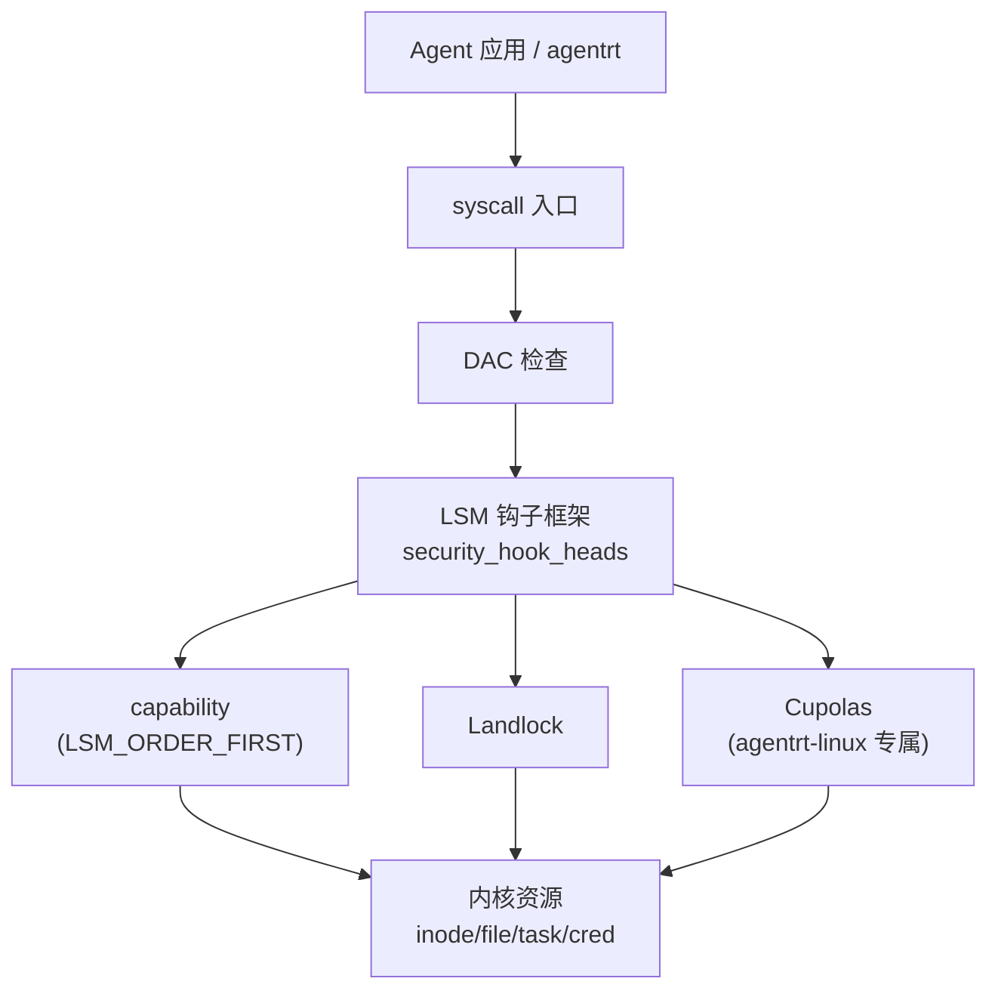
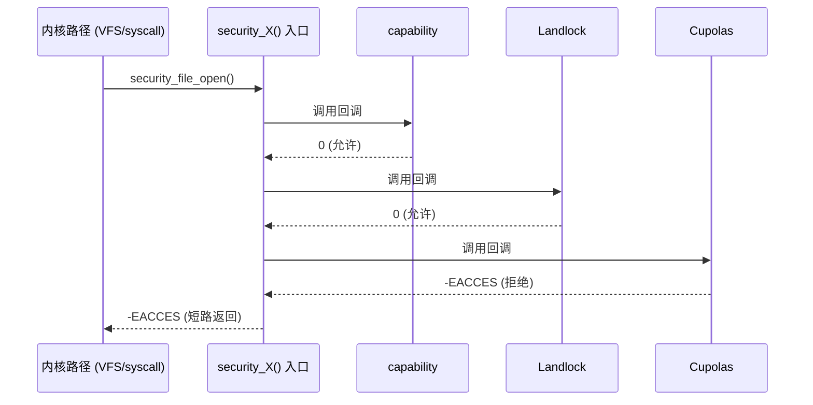
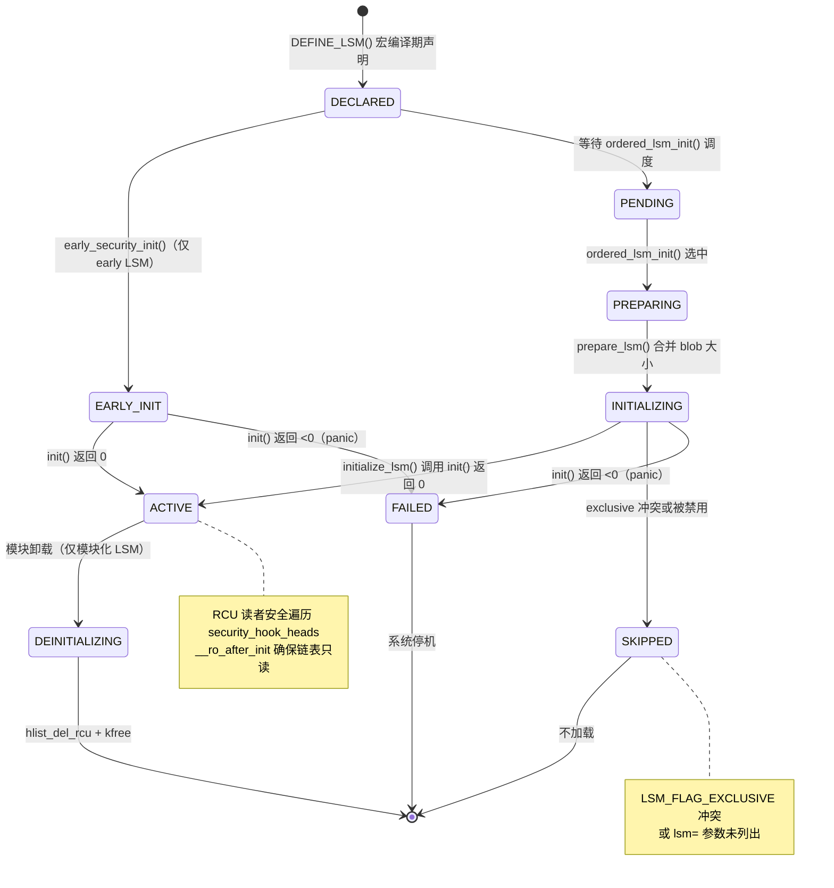
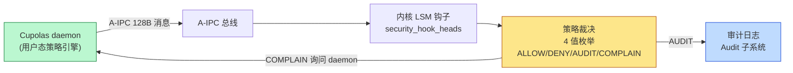

Copyright (c) 2025-2026 SPHARX Ltd. All Rights Reserved.

# LSM 框架详解
> **文档定位**：agentrt-linux（AirymaxOS）安全工程体系第 1 主题文档——Linux 安全模块（LSM）框架深度剖析\
> **文档版本**：v1.0.1\
> **最后更新**： 2026-07-21\
> **上级文档**：[agentrt-linux 设计文档](README.md)\
> **同源映射**：agentrt Cupolas（安全穹顶）+ Linux 6.6 LSM/Landlock/capability\
> **理论根基**：Linux 6.6 内核基线 + Airymax 五维正交 24 原则 + E-1 安全内生\
> **核心约束**：IRON-9 v3 同源且部分代码共享；v1.0.1 起 Capability Badge 校验由 fastpath C-S9 内联完成（LSM 钩子仅 slowpath 接管）

---

## SSoT 声明

> **单一权威源声明**：本文件是 **LSM 框架在 agentrt-linux 中的集成方式** 的唯一权威源。LSM 钩子链表（`security_hook_heads`）、blob 分配（`lsm_blob_sizes`）、排序机制（`LSM_ORDER_FIRST/MUTABLE/LAST`）、初始化流程（`ordered_lsm_init`）、Cupolas（airy LSM）注册模式均以本文件为唯一权威定义。**blob 结构（`airy_task_sec`/`airy_inode_sec`/`airy_cap_slot`）与 4 值裁决枚举（`airy_verdict`）的 SSoT 为 [SC] `lsm_types.h` 与 `security_types.h`**，本文件引用而非重定义。其余文档只能引用本文件，禁止重新定义 LSM 框架机制与 Cupolas 集成模式。
>
> **OLK 6.6 对齐说明**：OLK 6.6 `include/linux/lsm_hooks.h:113` 注释明确 `LSM_ORDER_FIRST` "This is only for capabilities."——**airy_lsm 不使用 `LSM_ORDER_FIRST`**，改用 `LSM_ORDER_MUTABLE`（默认值），通过 `CONFIG_LSM` 默认值将 `airy` 置于 `capability` 之后、其他 LSM 之前。`capability` 模块正确使用 `LSM_ORDER_FIRST`（OLK 6.6 硬编码，仅用于 capabilities）。
>
> **v1.0.1 Capability Folding 集成声明**（A-IPC 第一块基石）：自 v1.0.1 起，**Capability Badge 校验从 LSM 钩子中剥离**——fastpath C-S9 在 io_uring 数据面内联完成 Badge 校验（`airy_cap_badge_ok()`，~10ns，详见 [07-ipc-fastpath.md §5.2](../30-interfaces/07-ipc-fastpath.md)），**LSM 钩子不再在正常路径上执行 capability 校验**。LSM 钩子（如 `security_uring_cmd`）仅在 slowpath（C-S9 失败时）被调用，做策略裁决与冷酷执法（详见 [09-kernel-agent-supervisor.md §2.3](../20-modules/09-kernel-agent-supervisor.md)）。纯 C LSM 的职责不变——依然负责 inode/file/task/cred 钩子链的 4 值裁决（ALLOW/DENY/AUDIT/COMPLAIN），只是 capability 校验这部分从 LSM 钩子前置到 fastpath C-S9，避免 LSM 钩子在 hot path 上的开销。
>
> 技术选型声明：安全采用 **纯 C LSM 模块**（**不使用 BPF LSM**，对齐 openEuler 纯 C 模式）。整体遵循 Unify Design：sched_tac（SCHED_DEADLINE/SCHED_FIFO/EEVDF + seL4 MCS 映射，不使用 sched_ext）+ IORING_OP_URING_CMD + registered buffer + mmap（不使用 page flipping）+ alloc_pages + mmap（不使用 DMA 一致性内存）。[SC] 共享契约头文件的物理宿主为 `kernel/include/uapi/linux/airymax/`。

---

## 目录

- [第 1 章 LSM 框架总览](#第-1-章-lsm-框架总览)
- [第 2 章 security_hook_heads 钩子链表](#第-2-章-security_hook_heads-钩子链表)
- [第 3 章 lsm_blob_sizes 内存分配](#第-3-章-lsm_blob_sizes-内存分配)
- [第 4 章 LSM 排序机制](#第-4-章-lsm-排序机制)
- [第 5 章 LSM 初始化流程](#第-5-章-lsm-初始化流程)
- [第 6 章 LSM 钩子类型](#第-6-章-lsm-钩子类型)
- [第 7 章 LSM 与 capability 共存](#第-7-章-lsm-与-capability-共存)
- [第 8 章 agentrt-linux Cupolas 作为 LSM 模块集成](#第-8-章-agentrt-linux-cupolas-作为-lsm-模块集成)
- [第 9 章 LSM 钩子注册示例](#第-9-章-lsm-钩子注册示例)
- [第 10 章 五维原则映射](#第-10-章-五维原则映射)
- [第 11 章 同源 agentrt 映射](#第-11-章-同源-agentrt-映射)
- [第 12 章 规则编号集](#第-12-章-规则编号集)
- [第 13 章 相关文档](#第-13-章-相关文档)
- [第 14 章 文档版本与维护](#第-14-章-文档版本与维护)

---

## 第 1 章 LSM 框架总览

### 1.1 设计目标

LSM（Linux Security Module）是 Linux 6.6 内核基线提供的通用安全钩子框架，在不破坏既有 DAC/MAC 语义的前提下，为内核关键路径提供可插拔的策略注入点。LSM 不实现具体策略，只提供钩子骨架——具体策略由 SELinux、AppArmor、Smack、Tomoyo、Landlock、capability 等模块填充。agentrt-linux 将 LSM 视为整个安全体系的承重点：所有内核态安全决策都经 LSM 钩子入口路由到 Cupolas 安全穹顶的对应子系统。LSM 经过 20+ 年实战沉淀，其钩子覆盖面、并发安全、blob 共享、排序机制都已严格验证，符合 agentrt-linux 在 Linux 6.6 内核基线之上"不重造轮子"的工程哲学。

### 1.2 在 agentrt-linux 安全体系中的位置

| 层级 | 机制 | 由谁实现 |
|------|------|----------|
| L1 | LSM 框架 | Linux 6.6 `security/security.c` |
| L2 | capability | `LSM_ORDER_FIRST`，永远第一 |
| L3 | Landlock | 用户态可加载沙箱 |
| L4 | Yama / LoadPin / Lockdown | 内置可选模块 |
| L5 | Cupolas 安全穹顶 | agentrt-linux 专属 LSM |

agentrt-linux Cupolas 作为最后初始化的 LSM 注册到框架中，与 capability、Landlock、Yama 等共存。

### 1.3 与 MicroCoreRT 的关系

MicroCoreRT 是 agentrt-linux 内核的极简 RT 适配层，它把 LSM 框架的 250 个 LSM 钩子收敛为一份"内核安全契约"白名单，确保 Cupolas 只依赖被 MicroCoreRT 锁定的稳定入口，避免被 Linux 内部 API 漂移破坏。这是 IRON-9 v3 同源且部分代码共享原则在内核安全层的具体落地：同源在于 Cupolas 在 agentrt 用户态与 agentrt-linux 内核态两端语义一致；独立在于 agentrt-linux 端的 Cupolas 必须独立维护与 LSM 框架的 ABI 契约。


```mermaid
flowchart TB
    APP["Agent 应用 / agentrt"] --> SYSCALL["syscall 入口"]
    SYSCALL --> DAC["DAC 检查"]
    DAC --> LSM["LSM 钩子框架<br/>security_hook_heads"]
    LSM --> CAP["capability<br/>(LSM_ORDER_FIRST)"]
    LSM --> LANDLOCK["Landlock"]
    LSM --> CUPOLAS["Cupolas<br/>(agentrt-linux 专属)"]
    CAP --> KRES["内核资源<br/>inode/file/task/cred"]
    LANDLOCK --> KRES
    CUPOLAS --> KRES
```

---

## 第 2 章 security_hook_heads 钩子链表

### 2.1 数据结构

`security_hook_heads` 是 LSM 框架的核心容器，由一组 `struct hlist_head` 链表头组成，每个钩子对应一个链表头。在 Linux 6.6 内核基线中它被声明为 `__ro_after_init`，意味着初始化完成后只读，运行时不可追加，从而保证 RCU 读者的安全。

```c
// security/security.c
struct security_hook_heads security_hook_heads __ro_after_init;
static struct kmem_cache *lsm_file_cache;
static struct kmem_cache *lsm_inode_cache;
char *lsm_names;
static struct lsm_blob_sizes blob_sizes __ro_after_init;
```

每个钩子链表头由宏 `LSM_HOOK()` 在编译期展开生成，定义于 `include/linux/lsm_hook_defs.h`：

```c
// include/linux/lsm_hook_defs.h（节选）
LSM_HOOK(int, 0, inode_alloc_security, struct inode *inode)
LSM_HOOK(int, 0, file_open, struct file *file)
LSM_HOOK(int, 0, task_alloc, struct task_struct *task, unsigned long clone_flags)
LSM_HOOK(int, 0, cred_prepare, struct cred *new, const struct cred *old, gfp_t gfp)
```

`early_security_init()` 在内核启动早期遍历该头文件，对每个钩子执行 `INIT_HLIST_HEAD(&security_hook_heads.NAME)`，从而把全部 250 个 LSM 钩子链表初始化为空。

### 2.2 钩子注册流程

`security_hook_list` 描述单个钩子实例：持有指向 `security_hook_heads.X` 链表头的指针、LSM 名字、以及钩子回调函数指针。LSM 模块通过 `security_add_hooks()` 将自身钩子批量追加到对应链表尾部，使用 `hlist_add_tail_rcu()` 保证 RCU 安全：

```c
// security/security.c
void __init security_add_hooks(struct security_hook_list *hooks, int count,
                               const char *lsm)
{
    int i;
    for (i = 0; i < count; i++) {
        hooks[i].lsm = lsm;
        hlist_add_tail_rcu(&hooks[i].list, hooks[i].head);
    }
    if (slab_is_available()) {
        if (lsm_append(lsm, &lsm_names) < 0)
            panic("%s - Cannot get early memory.\n", __func__);
    }
}
```

钩子调用入口（如 `security_file_open`）以 RCU 读侧临界区遍历链表，依次调用每个钩子的回调；任一钩子返回非零即终止链路。这一"短路"语义是 LSM 框架保证多 LSM 协同有序的核心契约。调用流程为：内核路径 → `security_X()` 入口 → `hlist_for_each_entry_rcu` 遍历 → capability（返回 0 放行）→ Landlock（返回 0 放行）→ Cupolas（返回 -EACCES 拒绝）→ 短路返回调用方。


```mermaid
sequenceDiagram
    participant K as 内核路径 (VFS/syscall)
    participant SH as security_X() 入口
    participant L1 as capability
    participant L2 as Landlock
    participant L3 as Cupolas
    K->>SH: security_file_open()
    SH->>L1: 调用回调
    L1-->>SH: 0 (允许)
    SH->>L2: 调用回调
    L2-->>SH: 0 (允许)
    SH->>L3: 调用回调
    L3-->>SH: -EACCES (拒绝)
    SH-->>K: -EACCES (短路返回)
```

---

## 第 3 章 lsm_blob_sizes 内存分配

### 3.1 blob 大小计算

LSM 框架允许每个模块在 `inode`、`file`、`cred`、`task`、`ipc`、`msg_msg`、`superblock` 等内核对象上挂接一份私有安全数据（blob）。为避免每个对象维护多个 LSM 各自的指针，Linux 6.6 内核基线采用"扁平 blob"方案：所有 LSM 共享一整块连续内存，各 LSM 通过偏移量访问自己那份。

```c
// security/security.c
static void __init lsm_set_blob_size(int *need, int *lbs)
{
    int offset;
    if (*need <= 0) return;
    offset = ALIGN(*lbs, sizeof(void *));
    *lbs = offset + *need;
    *need = offset;
}
```

注意 `lbs_inode` 隐式追加 `sizeof(struct rcu_head)`——这是为 inode 的 RCU 延迟释放预留的，所有 LSM 共享，由 `lsm_inode_cache` 池统一分配。

### 3.2 blob 偏移访问

每个 LSM 在 `prepare_lsm()` 阶段把自己的 `lsm_blob_sizes` 提交给框架，框架将其偏移写回模块自身的 `needed` 字段，作为运行时访问该 LSM blob 的索引。Landlock 的访问宏即基于此偏移：

```c
// security/landlock/cred.h
static inline struct landlock_cred_security *
landlock_cred(const struct cred *cred)
{
    return cred->security + landlock_blob_sizes.lbs_cred;
}
```

Cupolas（内核态模块名 `airy`）同样遵循此约定：定义 `airy_blob_sizes`，在 `prepare_lsm()` 阶段被框架合并进全局 `blob_sizes`，运行时通过 `airy_cred(cred)` / `airy_inode(inode)` 等内联函数取出自己的 blob 区。这种"扁平 blob + 偏移访问"模式是 agentrt-linux Cupolas（airy LSM）与 Landlock、capability 在同一对象上共存的关键机制。

---

## 第 4 章 LSM 排序机制

### 4.1 三个排序来源

Linux 6.6 内核基线通过三个变量共同决定 LSM 的初始化顺序：

```c
// security/security.c
static __initdata const char *chosen_lsm_order;       /* 来自 lsm= 引导参数 */
static __initdata const char *chosen_major_lsm;       /* 来自 security= 引导参数 */
static __initconst const char *const builtin_lsm_order = CONFIG_LSM;  /* 编译期默认 */
```

agentrt-linux 的 `CONFIG_LSM` **需显式配置**包含 `airy`（当前 defconfig 未设置 `CONFIG_LSM` 行，见 known-caveats），示例：`CONFIG_LSM="capability,landlock,yama,airy"`（其中 capability 与 integrity 分别由 `LSM_ORDER_FIRST` / `LSM_ORDER_LAST` 强制首尾；airy 使用 `LSM_ORDER_MUTABLE`（默认值），通过 `CONFIG_LSM` 列表置于 `capability` 之后、其他 LSM 之前，capability 永远在 airy 之前执行——OLK 6.6 `include/linux/lsm_hooks.h:113` 注释明确 `LSM_ORDER_FIRST` 仅用于 capabilities，airy 不滥用之）。详见 [07-airy-lsm-design.md](07-airy-lsm-design.md) §2.1。

### 4.2 排序解析流程

`ordered_lsm_parse()` 按"FIRST → chosen → builtin → LAST → 其余禁用"的优先级解析：

```c
// security/security.c（节选）
static void __init ordered_lsm_parse(const char *order, const char *origin)
{
    struct lsm_info *lsm;
    char *sep, *name, *next;
    /* LSM_ORDER_FIRST (capability) 永远第一 */
    for (lsm = __start_lsm_info; lsm < __end_lsm_info; lsm++)
        if (lsm->order == LSM_ORDER_FIRST)
            append_ordered_lsm(lsm, "  first");
    /* 解析逗号分隔列表 (chosen_lsm_order 或 builtin_lsm_order) */
    sep = kstrdup(order, GFP_KERNEL);
    for (next = sep; (name = strsep(&next, ",")) != NULL; )
        for (lsm = __start_lsm_info; lsm < __end_lsm_info; lsm++)
            if (strcmp(lsm->name, name) == 0 && lsm->order == LSM_ORDER_MUTABLE)
                append_ordered_lsm(lsm, origin);
    /* LSM_ORDER_LAST (integrity) 永远最后，未列出者禁用 */
    for (lsm = __start_lsm_info; lsm < __end_lsm_info; lsm++) {
        if (lsm->order == LSM_ORDER_LAST)
            append_ordered_lsm(lsm, "   last");
        else if (!exists_ordered_lsm(lsm))
            set_enabled(lsm, false);
    }
    kfree(sep);
}
```

### 4.3 排他对齐

`LSM_FLAG_EXCLUSIVE` 标记的 LSM 互斥——SELinux/AppArmor/Smack 只能有一个被初始化。`prepare_lsm()` 在第一个 exclusive LSM 被选中后记录 `exclusive` 指针，后续 exclusive LSM 一律跳过。Cupolas 不打 EXCLUSIVE 标记，从而可以与任何 major LSM 共存，体现"穹顶叠加而非替代"的设计取向。

---

## 第 5 章 LSM 初始化流程

### 5.1 两阶段初始化

LSM 框架分两阶段初始化：

1. **early_security_init()**：在 slab 可用之前调用，初始化所有钩子链表头为空，并启动 `__early_lsm_info` 段中的 early LSM（如 lockdown、纯 C LSM 模块（对齐 openEuler 实践，使用 DEFINE_LSM + LSM_HOOK_INIT 宏注册，对齐 Landlock/Yama/Tomoyo 等 Linux 主线纯 C LSM））。
2. **security_init()**：在 slab 可用之后由 `start_kernel()` 末尾调用，执行 `ordered_lsm_init()`，依次 `prepare_lsm()` + `initialize_lsm()` 完成所有可延迟 LSM 的初始化。

```c
// security/security.c
int __init security_init(void)
{
    /* Load LSMs in specified order. */
    ordered_lsm_init();
    return 0;
}
```

### 5.2 blob 缓存创建

`ordered_lsm_init()` 在所有 LSM 的 blob 大小合并完成后，为 `lbs_file`、`lbs_inode` 创建专用 kmem_cache（`SLAB_PANIC` 保证分配失败即 panic）。启动完成后 `report_lsm_order()` 通过 `pr_info("initializing lsm=...")` 输出最终生效顺序，dmesg 中可读到形如 `LSM: initializing lsm=capability,landlock,yama,airy` 的串。

### 5.3 LSM 模块生命周期状态机

LSM 模块从编译期声明到运行时活跃的完整状态转换：


```mermaid
stateDiagram-v2
    [*] --> DECLARED: DEFINE_LSM() 宏编译期声明

    DECLARED --> EARLY_INIT: early_security_init()（仅 early LSM）
    DECLARED --> PENDING: 等待 ordered_lsm_init() 调度

    EARLY_INIT --> ACTIVE: init() 返回 0
    EARLY_INIT --> FAILED: init() 返回 <0（panic）

    PENDING --> PREPARING: ordered_lsm_init() 选中
    PREPARING --> INITIALIZING: prepare_lsm() 合并 blob 大小
    INITIALIZING --> ACTIVE: initialize_lsm() 调用 init() 返回 0
    INITIALIZING --> SKIPPED: exclusive 冲突或被禁用
    INITIALIZING --> FAILED: init() 返回 <0（panic）

    ACTIVE --> DEINITIALIZING: 模块卸载（仅模块化 LSM）
    DEINITIALIZING --> [*]: hlist_del_rcu + kfree

    SKIPPED --> [*]: 不加载
    FAILED --> [*]: 系统停机

    note right of ACTIVE
        RCU 读者安全遍历 security_hook_heads
        __ro_after_init 确保链表只读
    end note

    note right of SKIPPED
        LSM_FLAG_EXCLUSIVE 冲突
        或 lsm= 参数未列出
    end note
```

**状态转换条件**：

| 从状态 | 到状态 | 触发条件 | 系统行为 |
|--------|--------|---------|---------|
| — | DECLARED | `DEFINE_LSM()` / `DEFINE_EARLY_LSM()` 编译期 | 放入 `__lsm_info` / `__early_lsm_info` 段 |
| DECLARED | EARLY_INIT | `early_security_init()`（仅 early LSM） | slab 可用前初始化 |
| DECLARED | PENDING | `ordered_lsm_init()` 遍历 `__lsm_info` 段 | 等待调度 |
| PENDING | PREPARING | `ordered_lsm_parse()` 选中此 LSM | 排序后非 exclusive 冲突 |
| PREPARING | INITIALIZING | `prepare_lsm()` 合并 blob_sizes | kmem_cache 创建 |
| INITIALIZING | ACTIVE | `initialize_lsm()` → `init()` 返回 0 | 钩子注册到 `security_hook_heads` |
| INITIALIZING | SKIPPED | exclusive 冲突或 `lsm=` 未列出 | `set_enabled(lsm, false)` |
| INITIALIZING | FAILED | `init()` 返回 <0 | `panic()`（SLAB_PANIC 语义） |
| ACTIVE | DEINITIALIZING | 模块卸载（`rmmod`，仅模块化 LSM） | `hlist_del_rcu` + synchronize_rcu |

---

## 第 6 章 LSM 钩子类型

> **实际注册范围声明**（对齐 [SC] `lsm_types.h` SSoT）：Airy M0 基线实际注册 **7 个 LSM 钩子**（`AIRY_LSM_HOOK_IMPLEMENTED = 7`）：
> - `security_uring_cmd`（io_uring 命令入口，IPC fastpath slowpath 接管）
> - `security_task_alloc`（Agent fork/clone 上下文初始化）
> - `security_task_free`（Agent 上下文清理）
> - `security_task_kill`（Agent 生命周期终止裁决）
> - `security_file_open`（Agent 文件访问策略裁决）
> - `security_inode_alloc_security`（inode blob 分配，初始化 `airy_inode_sec`）
> - `security_inode_free_security`（inode blob 清理）
>
> 以下章节描述 Linux 6.6 LSM 框架提供的钩子类型机制（`inode`/`file`/`task`/`cred`/`sb` 等），用于说明 Cupolas 钩子回调的工作原理与签名约定。**Cupolas 当前消费其中的 `task_alloc`/`task_free`/`task_kill`/`file_open`/`inode_alloc_security`/`inode_free_security` + `uring_cmd` 共 7 个**，其余钩子类型（`inode_permission`/`cred_prepare`/`sb_mount` 等）为 Linux 6.6 LSM 框架原生能力，Cupolas 暂未消费，留待未来版本扩展。

### 6.1 inode 钩子

`inode_alloc_security` 在 inode 分配时调用，LSM 在此为 inode 申请自己的 blob 区：

```c
// include/uapi/linux/lsm_hook_defs.h（节选）
LSM_HOOK(int, 0, inode_alloc_security, struct inode *inode)
LSM_HOOK(int, 0, inode_permission, struct inode *inode, int mask)
LSM_HOOK(int, 0, inode_setattr, struct dentry *dentry, struct iattr *iattr)
```

Cupolas 在 `inode_alloc_security` 中初始化 `airy_inode_sec`（对齐 [SC] `lsm_types.h`），记录该 inode 所属 Agent 的命名空间标签；在 `inode_permission` 中校验跨 Agent 命名空间访问。

### 6.2 file 钩子

`file_open` 是 Landlock 与 Cupolas 共同使用的入口：

```c
// security/landlock/fs.c（节选）
static int hook_file_open(struct file *const file) {
    const struct landlock_ruleset *const dom = landlock_get_current_domain();
    layer_mask_t layer_masks[LANDLOCK_NUM_ACCESS_FS] = {};
    access_mask_t open_access_request, full_access_request, allowed_access;
    if (!dom) return 0;
    open_access_request = get_required_file_open_access(file);
    full_access_request = open_access_request | LANDLOCK_ACCESS_FS_TRUNCATE;
    /* is_access_to_paths_allowed() 校验各层后填充 allowed_access */
    landlock_file(file)->allowed_access = allowed_access;
    return ((open_access_request & allowed_access) == open_access_request) ? 0 : -EACCES;
}
```

Cupolas 在 `file_open` 之后追加一层 Agent 主体校验：先让 Landlock 完成 DAC/MAC 检查，再叠加 Cupolas 的 Agent 权限裁决。

### 6.3 task 钩子

`task_alloc` 在 `fork()`/`clone()` 路径触发，用于为新 task 准备安全上下文：

```c
LSM_HOOK(int, 0, task_alloc, struct task_struct *task, unsigned long clone_flags)
```

Cupolas 在此钩子中决定子 Agent 是否继承父 Agent 的 Cupolas 域，并在 `task_alloc` 后期通过 `A-IPC` 总线向 Workbench 虚拟工作台上报"Agent fork"事件。

### 6.4 cred 钩子

`cred_prepare` 与 `cred_transfer` 在凭据复制时调用：

```c
// security/landlock/cred.c
static int hook_cred_prepare(struct cred *const new, const struct cred *const old, const gfp_t gfp) {
    hook_cred_transfer(new, old); return 0;
}
static void hook_cred_transfer(struct cred *const new, const struct cred *const old) {
    struct landlock_ruleset *const old_dom = landlock_cred(old)->domain;
    if (old_dom) { landlock_get_ruleset(old_dom); landlock_cred(new)->domain = old_dom; }
}
```

Landlock 在此把父域引用计数 +1 并附加到新凭据，从而保证子进程继承父进程的 Landlock 域。Cupolas 在 `cred_prepare` 阶段执行"能力下沉"——按 IRON-9 v3 同源且部分代码共享原则，agentrt-linux 端的 capability 子集被复制到子进程，agentrt 端的运行时 capability 则由 agentrt 自行维护。

### 6.5 钩子类型小结

`inode_alloc_security`（inode 分配）→ SELinux/Smack/Cupolas；`file_open`（open 路径）→ Landlock/Cupolas；`task_alloc`（fork/clone）→ Yama/Cupolas；`cred_prepare`（凭据复制）→ Landlock/Cupolas；`sb_mount`（mount）→ Landlock/Cupolas。

## 第 7 章 LSM 与 capability 共存

capability 模块由 `LSM_ORDER_FIRST` 强制排在第一位，且不打 `LSM_FLAG_EXCLUSIVE`，从而可以与任何其他 LSM 并存。其职责是：在 DAC 检查通过之后、其他 LSM 检查之前，完成 POSIX capability 校验（`CAP_SYS_ADMIN` 等）。

Landlock 的 `landlock_restrict_self` 要求调用者要么具备 `CAP_SYS_ADMIN`，要么设置了 `no_new_privs`——这一约束正是依赖 capability 已先行初始化、其校验已生效：

```c
// security/landlock/syscalls.c
if (!task_no_new_privs(current) &&
    !ns_capable_noaudit(current_user_ns(), CAP_SYS_ADMIN))
    return -EPERM;
```

Cupolas 进一步把 capability 抽象为"主体能力位图"的一部分，主体校验时按 capability → Landlock 域 → Cupolas 域的顺序短路返回。这种分层短路正是 agentrt-linux 五维正交 24 原则中 E-1（安全内生）与 K-4（可插拔策略）的合奏：每一层只做自己最擅长的事，互不越界。

---

## 第 8 章 agentrt-linux Cupolas 作为 LSM 模块集成

### 8.1 Cupolas 的 LSM 注册

> **命名约定**：架构概念称 "Cupolas"（安全穹顶，与 agentrt 用户态同源映射），内核态 LSM 模块的具体实现名与源码目录为 `airy`（`security/airy/`），由 [07-airy-lsm-design.md](07-airy-lsm-design.md) §2 作为 SSoT 唯一权威源定义。

Cupolas 通过 `DEFINE_LSM` 宏在编译期注册自身（模块名 `airy`，初始化顺序 `LSM_ORDER_MUTABLE`，通过 `CONFIG_LSM` 默认值置于 `capability` 之后、其他 LSM 之前，capability 永远在 airy 之前执行——OLK 6.6 注释明确 `LSM_ORDER_FIRST` 仅用于 capabilities，airy 不滥用之）：

```c
// security/airy/airy_lsm.c（agentrt-linux 专属，对齐 07-airy-lsm-design.md §2.1）
// blob 结构对齐 [SC] lsm_types.h SSoT：airy_task_sec + airy_inode_sec
struct lsm_blob_sizes airy_blob_sizes __ro_after_init = {
    .lbs_task  = sizeof(struct airy_task_sec),   /* [SC] lsm_types.h */
    .lbs_inode = sizeof(struct airy_inode_sec),  /* [SC] lsm_types.h */
    /* lbs_cred/lbs_file/lbs_superblock/lbs_ipc/lbs_msg_msg 暂为 0
     *（M0 基线注册 7 钩子：uring_cmd/task_alloc/task_free/task_kill/file_open
     *  /inode_alloc_security/inode_free_security，
     *  不消费 cred/file/superblock/ipc blob，对齐 AIRY_LSM_HOOK_IMPLEMENTED=7） */
};
static int __init airy_lsm_init(void) {
    /* 注册 7 个 LSM 钩子（M0 基线，对齐 [SC] AIRY_LSM_HOOK_IMPLEMENTED=7）：
     *   - security_uring_cmd           （io_uring 命令入口，IPC fastpath slowpath 接管）
     *   - security_task_alloc          （Agent fork/clone 上下文初始化）
     *   - security_task_free           （Agent 上下文清理）
     *   - security_task_kill           （Agent 生命周期终止裁决）
     *   - security_file_open           （Agent 文件访问策略裁决）
     *   - security_inode_alloc_security（inode blob 分配，初始化 airy_inode_sec）
     *   - security_inode_free_security （inode blob 清理）
     */
    airy_add_uring_cmd_hooks();  /* security_uring_cmd */
    airy_add_task_hooks();       /* task_alloc + task_free + task_kill */
    airy_add_file_hooks();       /* file_open */
    airy_add_inode_hooks();      /* inode_alloc_security + inode_free_security */
    pr_info("Cupolas security dome (airy LSM) up and running.\n");
    return 0;
}
DEFINE_LSM(airy) = {
    .name  = "airy",
    .order = LSM_ORDER_MUTABLE,   /* v1.0.1: 不使用 LSM_ORDER_FIRST（OLK 6.6 仅用于 capabilities），通过 CONFIG_LSM 默认值置于 capability 之后 */
    .init  = airy_lsm_init,
    .blobs = &airy_blob_sizes,
};
```

### 8.2 与 MicroCoreRT 的契约

Cupolas 注册的钩子集合必须在 MicroCoreRT 锁定的"内核安全契约"白名单内。任何新增钩子都需经 RFC 评审、ABI 稳定性确认（OS-IRON-001）、五维原则映射检查（OS-STD-007）三道关。这是 IRON-9 v3 同源且部分代码共享原则的硬性要求：agentrt 端的 Cupolas 用户态 API（`airy_cupolas_*`）在 agentrt-linux 内核态对应实现必须独立维护，但语义必须同源。

### 8.3 与 A-IPC（Capability Folding）的桥接

Cupolas 在内核态除了消费 LSM 钩子，还通过 **A-IPC（Airymax Unify IPC Fabric，v1.0.1 Capability Folding 单平面架构）** 总线把"Agent 行为审计"事件推送到用户态的 Workbench 虚拟工作台。A-IPC 的 128B 消息头（Layout C v4，magic `0x41524531` 'ARE1'）由 [SC] 共享契约层锁定字段布局，含 `capability_badge`（offset 40-47，8B），保证两端无适配层互操作。事件流：LSM 钩子 → Cupolas 回调 → 安全 blob（`airy_task_sec`/`airy_inode_sec`，共 2 类）→ A-IPC 内核端 → agentrt → Audit/Workbench。

### 8.4 Capability Folding 与 LSM 钩子的职责分割（v1.0.1 新增）

**v1.0.1 新增**：Capability Folding 引入 fastpath/slowpath 职责分割，明确"哪些校验在 fastpath 内联，哪些在 LSM 钩子中执行"：

| 校验类型 | 执行位置 | 时机 | 延迟 | 说明 |
|---------|---------|------|------|------|
| **Badge 64-bit Native Word 校验** | fastpath C-S9（io_uring 数据面内联） | 每次 IPC 操作 | ~10ns | `airy_cap_badge_ok()` 3×READ_ONCE + 位运算 + 比较，详见 [07-ipc-fastpath.md §5.2](../30-interfaces/07-ipc-fastpath.md) |
| **Ring 冻结检查**（C-S0） | fastpath 内联 | 每次 IPC 操作 | ~1ns | `unlikely(ring->frozen)` 分支预测优化 |
| **CRC32 校验**（C-S12） | fastpath 内联 | 每次 IPC 操作 | ~5ns | 消息完整性校验 |
| **inode/file/task/cred 策略裁决** | LSM 钩子（slowpath） | 内核对象访问 | ~100ns-1μs | 4 值枚举裁决，**与 IPC fastpath 无关** |
| **Badge 异常接管** | LSM 钩子（`security_uring_cmd`，slowpath） | C-S9 失败时 | ~100ns+ | Micro-Supervisor 冷酷执法，详见 [09-kernel-agent-supervisor.md §2.3](../20-modules/09-kernel-agent-supervisor.md) |
| **Agent 行为审计** | LSM 钩子（`security_audit_rule_match` 等） | 内核对象访问 | 异步 | 通过 A-IPC 上报用户态 Audit 子系统 |

**职责分割原则**：
- **fastpath C-S9** 负责"能力校验"（Badge 64-bit Native Word）——这是 IPC 消息级的能力校验，必须在 fastpath 内联以避免 LSM 钩子在 hot path 上的开销
- **LSM 钩子** 负责"策略裁决"（inode/file/task/cred 4 值枚举）——这是内核对象访问级的策略裁决，与 IPC fastpath 无关，依然由纯 C LSM 钩子链完成
- **LSM 钩子（`security_uring_cmd`）** 在 slowpath 接管 Badge 异常——当 fastpath C-S9 返回 `-AIRY_ECAP_FORGED` (-80) 等 Badge 错误码时，Micro-Supervisor 通过 LSM 钩子执行冷酷执法（冻结 Ring + 通知 Macro-Supervisor）

**设计哲学**：这是乔布斯/艾夫"简约就是美"在安全工程的落地——将"能力校验"与"策略裁决"分离，fastpath 仅做最简单的 Badge 位运算（~10ns），LSM 钩子保留完整的 4 值裁决语义。这避免了 LSM 钩子在 IPC hot path 上的开销，同时保留了 LSM 框架的策略灵活性。Capability Folding 不是"绕过 LSM"——而是"将能力校验前置到 fastpath，让 LSM 钩子专注于策略裁决"。

---

## 第 9 章 LSM 钩子注册示例

下面给出一个最小可用的 LSM 模块骨架，演示 `security_hook_list`、`LSM_HOOK_INIT`、`security_add_hooks`、`DEFINE_LSM` 四件套的真实用法：

```c
// security/airy/demo_lsm.c
#include <linux/lsm_hooks.h>
static int demo_inode_alloc(struct inode *i) { return 0; }
static int demo_file_open(struct file *f)    { return 0; }
static int demo_task_alloc(struct task_struct *t, unsigned long f) { return 0; }
static int demo_cred_prepare(struct cred *n, const struct cred *o, gfp_t g) { return 0; }

static struct security_hook_list demo_hooks[] __ro_after_init = {
    LSM_HOOK_INIT(inode_alloc_security, demo_inode_alloc),
    LSM_HOOK_INIT(file_open,            demo_file_open),
    LSM_HOOK_INIT(task_alloc,           demo_task_alloc),
    LSM_HOOK_INIT(cred_prepare,         demo_cred_prepare),
};
static int __init demo_init(void) {
    security_add_hooks(demo_hooks, ARRAY_SIZE(demo_hooks), "demo");
    return 0;
}
DEFINE_LSM(demo) = { .name = "demo", .init = demo_init };
```

### 9.1 钩子回调签名约定

所有钩子回调的签名严格由 `lsm_hook_defs.h` 中的 `LSM_HOOK(RET, DEFAULT, NAME, ARGS...)` 宏决定。Cupolas 必须按签名实现，禁止通过包装宏篡改签名——这是 OS-IRON-002（内核内部 API 不稳定但改动者需自行修复所有调用点）的延伸约束。错误码语义统一：`-EACCES`（权限拒绝，最常用）、`-EPERM`（操作不允许）、`-ENOMEM`（内存不足）、`-ENOSYS`（不支持）；Cupolas 在拒绝时优先返回 `-EACCES`，并在 `A-IPC` 总线上以 `CUPOLAS_DENY` 事件类型上报，由用户态 Audit 子系统落盘。

---

## 第 10 章 五维原则映射

agentrt-linux 五维正交 24 原则在 LSM 框架层的体现：

| 原则 | 编号 | 在 LSM 框架的体现 |
|------|------|-------------------|
| **E-1 安全内生** | OS-SEC-001 | 安全钩子内置于内核每一关键路径，无需外挂补丁 |
| **E-2 形式化验证** | OS-SEC-002 | LSM 钩子链表 RCU 不变量需通过形式化检查 |
| **K-2 接口契约化** | OS-KER-086 | `security_hook_heads` 字段集是稳定契约，跨版本 ABI 永不破坏 |
| **K-3 服务隔离** | OS-KER-087 | 不同 LSM 通过 `LSM_FLAG_EXCLUSIVE` 互斥；blob 偏移隔离 |
| **K-4 可插拔策略** | OS-KER-088 | `CONFIG_LSM` 决定启用顺序，运行时不可追加 |
| **K-6 内核契约化** | OS-KER-089 | MicroCoreRT 锁定 Cupolas 可消费的钩子白名单 |
| **C-1 编译期检查** | OS-STD-001 | `BUILD_BUG_ON` 校验 blob 大小与对齐 |
| **C-2 类型安全** | OS-STD-002 | `LSM_HOOK_INIT` 宏保证回调签名匹配 |
| **C-3 RAII** | OS-STD-003 | blob 由 kmem_cache 自动管理生命周期 |
| **A-1 诚实优先** | OS-STD-004 | `init_debug` 暴露内部状态供审计 |
| **A-3 人文关怀** | OS-STD-005 | 钩子拒绝路径需提供可读原因 |
| **IRON-9 v3 同源且部分代码共享** | OS-IRON-003 | Cupolas 与 agentrt 安全 API 同源但各自独立维护 |

---

## 第 11 章 同源 agentrt 映射

agentrt 的 `cupolas/` 模块与 agentrt-linux 内核态 Cupolas 同源，遵循 IRON-9 v3 同源且部分代码共享原则。Cupolas 的 7 大子系统在两端各自落地：

| Cupolas 子系统 | agentrt 端（用户态） | agentrt-linux 端（内核态 LSM） |
|----------------|----------------------|------------------------------|
| **Guards 守卫** | `airy_cupolas_guard_enter()` 入口防护 | `security_file_open` / `security_task_alloc` 钩子 |
| **Permission 权限裁决** | `airy_cupolas_perm_check()` 策略裁决 | `security_inode_permission` 钩子 + capability |
| **Sanitizer 输入净化** | `airy_cupolas_sanitize()` 输入验证 | `security_sb_mount` / `security_path_*` 钩子 |
| **Audit 审计追踪** | `airy_cupolas_audit_emit()` 行为审计 | LSM 钩子拒绝时通过 `A-IPC` 上报 |
| **Workbench 虚拟工作台** | `airy_cupolas_workbench_spawn()` 沙箱 | 配合 Landlock 实现进程级隔离 |
| **Security Vault 安全金库** | `airy_cupolas_vault_seal()` 密封 | TPM + 模块签名 + Lockdown |
| **Network Security 网络安全** | `airy_cupolas_net_filter()` 网络过滤 | `security_socket_*` 钩子 |

两端通过 `A-IPC` 总线（128B 消息头由 MicroCoreRT 锁定）传递安全策略与审计事件，无任何适配层。这是 IRON-9 v3 同源且部分代码共享原则的工程兑现：同源在语义层，独立在实现层。

### 11.1 IRON-9 v3 四层共享模型

IRON-9 v3 将 agentrt Cupolas 与 agentrt-linux LSM 框架的协作划分为四层：

| 层次 | 共享程度 | LSM 框架内容 |
|------|---------|-------------|
| **[SC] 共享契约层** | 完全共享代码 | `lsm_types.h`：7 钩子常量（`AIRY_LSM_HOOK_IMPLEMENTED=7`）+ `airy_task_sec`/`airy_inode_sec`/`airy_cap_slot` blob 布局 + capability check 回调签名；`security_types.h`：4 值裁决枚举（`airy_verdict`）+ 44 个 cap_id |
| **[SS] 语义同源层** | 操作模式同源（注册/匹配/生命周期等概念一致），函数签名因抽象层级不同而独立 | LSM 钩子注册模式、blob 生命周期管理、钩子链遍历模式、拒绝上报通道 |
| **[IND] 完全独立层** | 完全独立 | RCU 钩子链表实现、kmem_cache blob 分配器、exclusive LSM 互斥逻辑、`CONFIG_LSM` 编译期排序 |

#### [SC] 共享契约层

[SC] 共享契约层跨两个头文件：
- `include/uapi/linux/airymax/lsm_types.h`：LSM 钩子覆盖范围常量、task/inode blob 结构、capability slot、capability check 回调签名
- `include/uapi/linux/airymax/security_types.h`：4 值裁决枚举（`airy_verdict`）、44 个 cap_id 枚举、Badge 访问宏

agentrt 用户态 Cupolas 通过这两个 [SC] 头文件解析内核 LSM blob 布局与裁决语义，无需访问内核私有数据结构：

```c
/* include/uapi/linux/airymax/lsm_types.h —— IRON-9 v3 [SC] 共享契约层（节选） */
#define AIRY_LSM_HOOK_IMPLEMENTED   7    /* Airy 实际注册的钩子数 */
#define AIRY_LSM_KERNEL_HOOK_TOTAL  250  /* Linux 6.6 LSM 框架可用钩子总数（仅文档用途，非数组尺寸） */

/* task 安全上下文（per-task security blob） */
struct airy_task_sec {
    __u32   agent_id;         /* Agent 标识 [0, AIRY_CAP_MAX_AGENTS] */
    __u32   cap_space_root;   /* capability space 根（badge 引用） */
    __u32   agent_state;      /* Agent 生命周期状态 */
    __u32   fault_count;      /* 累计故障计数 */
    __u64   sched_budget_ns;  /* 调度预算（纳秒） */
    __u64   last_heartbeat;   /* 最近心跳单调时间戳 */
    __u32   frozen_reason;    /* 被 Supervisor 冻结的原因码 */
    __u32   _reserved;        /* 对齐 */
    void   *ipc_ring;         /* 每 Agent IPC ring 冻结状态（M1: per-agent） */
};

/* inode 安全上下文 */
struct airy_inode_sec {
    __u32   cap_required;     /* 访问所需 capability */
    __u32   owner_agent;      /* 拥有者 Agent ID */
};

/* capability slot（80 字节，AIRY_ALIGNED(64)，含 MDB 派生树） */
struct airy_cap_slot {
    __u64   badge;            /* 64-bit Capability Folding badge */
    __u32   agent_id;         /* 拥有者 Agent ID */
    __u32   flags;            /* slot 标志 */
    __u32   randtag;          /* 伪造防护随机标签 */
    __u16   perms;            /* 权限位 */
    __u16   epoch;            /* per-agent Epoch（O(1) 定向撤销） */
    /* ── MDB 派生树（级联 REVOKE，K9-1 修复） ── */
    __u32   parent_agent;     /* 派生来源 Agent ID（0 = 根） */
    __u32   first_child;      /* 首个子 Agent ID（0 = 叶子） */
    __u32   next_sibling;     /* 下一个兄弟 Agent ID（0 = 最后子节点） */
    __u16   generation;       /* 派生深度（root=0，每 MINT/COPY +1） */
    __u16   revocable;        /* 1 = 父 REVOKE 级联到本槽位 */
    __u8    _reserved[40];    /* 缓存行填充（原 56，-16 给 MDB） */
} AIRY_ALIGNED(64);

#define AIRY_CAP_MAX_AGENTS     1024

/* capability 检查回调签名 */
typedef __s32 (*airy_capability_check_fn)(__u64 badge, __u16 required_perm,
                                          __u32 agent_id);
```

```c
/* include/uapi/linux/airymax/security_types.h —— IRON-9 v3 [SC] 共享契约层（节选） */
enum airy_verdict {
    AIRY_VERDICT_ALLOW    = 0,   /* 允许 */
    AIRY_VERDICT_DENY     = 1,   /* 拒绝 */
    AIRY_VERDICT_AUDIT    = 2,   /* 允许但审计 */
    AIRY_VERDICT_COMPLAIN = 3,   /* 拒绝但记录（学习模式） */
};
```

**OS-IRON-003 约束**：agentrt-linux LSM 与 agentrt Cupolas 共享 `lsm_types.h` 与 `security_types.h`，blob 结构布局（`airy_task_sec`/`airy_inode_sec`/`airy_cap_slot`）与 4 值裁决枚举（`airy_verdict`）两端必须逐字节一致。**Airy 实际注册 7 个 LSM 钩子**（`AIRY_LSM_HOOK_IMPLEMENTED = 7`：`uring_cmd`/`task_alloc`/`task_free`/`task_kill`/`file_open`/`inode_alloc_security`/`inode_free_security`），并非 250 个——`AIRY_LSM_KERNEL_HOOK_TOTAL = 250` 仅为 Linux 6.6 LSM 框架可用钩子上限的文档用途常量，非数组尺寸。

#### [SS] 语义同源层

| 维度 | agentrt 用户态（Cupolas） | agentrt-linux 内核态（LSM） | 同源点 |
|------|--------------------------|---------------------------|--------|
| 钩子注册 | `airy_cupolas_hook_register()` | `security_add_hooks()` | 注册模式同源 |
| 钩子链遍历 | 应用层策略链 | `hlist_for_each_entry_rcu()` | 链遍历语义同源 |
| blob 生命周期 | 用户态 arena 分配 | `kmem_cache` 分配 | 生命周期管理同源 |
| 拒绝上报 | `A-IPC` 上报审计事件 | `A-IPC` 上报审计事件 | 上报通道同源 |
| 策略裁决 | 4 值枚举（ALLOW/DENY/AUDIT/COMPLAIN） | 4 值枚举 | 裁决语义同源（[SC]） |
| Guard 入口 | `airy_cupolas_guard_enter()` | `security_hook_heads` 钩子入口 | 入口防护语义同源 |

agentrt 的 `cupolas/guards` 模块定义了 `airy_cupolas_guard_enter(domain, action)`，与内核 LSM 钩子入口同源——两者都遵循"入口拦截 → 策略裁决 → 放行/拒绝"三段式。[SS] 语义同源在此体现为：语义同源（安全决策入口模式），实现独立（用户态策略引擎 vs 内核态钩子链）。

#### [IND] 完全独立层

| 维度 | agentrt 用户态（Cupolas） | agentrt-linux 内核态（LSM） |
|------|--------------------------|---------------------------|
| 钩子链表实现 | 应用层回调数组 | RCU 保护的双向链表 `security_hook_heads` |
| blob 分配器 | 用户态 malloc/arena | `kmem_cache` + `__ro_after_init` 偏移表 |
| exclusive LSM 互斥 | 不适用 | `LSM_FLAG_EXCLUSIVE` 位掩码 |
| 钩子排序 | 应用层注册顺序 | `CONFIG_LSM` 编译期固化 |
| 并发安全 | 用户态锁 | RCU read-side + SRCU |
| 初始化阶段 | Agent 启动时 | `LSM_ORDER_MUTABLE` + `CONFIG_LSM` 列表首位（airy 在 capability 之后第一个初始化，对齐 07-airy-lsm-design.md §2.1） |

#### 跨态协作流

```mermaid
graph LR
    A[agentrt Cupolas 策略引擎] -->|读取 [SC] hook_id + blob_offset| B[security_types.h]
    C[内核态 LSM 钩子触发] --> D[security_hook_heads 链遍历]
    D --> E[Cupolas LSM 模块回调]
    E -->|拒绝时| F[A-IPC 上报审计事件]
    A -->|策略下发| F
    style B fill:#bbf7d0,stroke:#15803d
    style F fill:#fde68a,stroke:#b45309
```

agentrt Cupolas 策略引擎通过 [SC] 共享契约层读取 `security_types.h` 中的钩子 ID 与 blob 偏移，解析内核 LSM 事件，无需进入内核私有数据结构。两端通过 A-IPC 总线（128B 消息头，magic `0x41524531`）传递安全策略与审计事件，无适配层。MicroCoreRT 极简内核契约要求：内核态 LSM 钩子不解析用户态策略 payload，仅按 [SC] 钩子 ID 透传裁决请求；用户态 Cupolas 守护进程负责跨态策略聚合与审计。

### 11.2 LSM 与 Cupolas 集成深化

LSM 与 Cupolas 集成的目标是将 Cupolas 7 大子系统映射到 LSM 钩子框架，使内核态每个安全决策点都路由到对应的 Cupolas 子系统进行策略裁决，并通过 [SC] 共享契约层保证两端裁决语义同源（OS-IRON-003）。

#### 11.2.1 Cupolas 7 子系统 ↔ LSM 钩子映射表

> **实际注册范围声明**：Airy M0 基线实际注册 **7 个 LSM 钩子**（对齐 [SC] `lsm_types.h` 的 `AIRY_LSM_HOOK_IMPLEMENTED = 7`）。下表"状态"列标注各钩子的实现状态：✅ = M0 已注册，⏳ = 未来版本扩展。**不存在虚构的 `airy_lsm_hook_id` 250 ID 枚举**——LSM 钩子通过 `LSM_HOOK_INIT` 宏名注册，不通过数字 ID。

| Cupolas 子系统 | LSM 钩子名 | 实现状态 | 裁决行为 |
|----------------|------------|---------|----------|
| **Guards 守卫** | `security_task_kill` | ✅ M0 | DENY 时返回 `-EACCES` 阻断 Agent 终止 |
| **Guards 守卫** | `security_task_alloc` | ✅ M0 | 初始化 `airy_task_sec`（agent_id/state/budget） |
| **Guards 守卫** | `security_task_free` | ✅ M0 | 清理 `airy_task_sec` 资源 |
| **Permission 权限裁决** | `security_file_open` | ✅ M0 | 4 值枚举（`airy_verdict`：ALLOW/DENY/AUDIT/COMPLAIN）裁决 |
| **Permission 权限裁决** | `security_inode_alloc_security` | ✅ M0 | 分配并初始化 `airy_inode_sec` blob |
| **Permission 权限裁决** | `security_inode_free_security` | ✅ M0 | 清理 `airy_inode_sec` blob 资源 |
| **Permission 权限裁决** | `security_inode_permission` | ⏳ 未来 | 4 值枚举裁决（M0 未消费 inode blob 之外的钩子） |
| **IPC fastpath slowpath 接管** | `security_uring_cmd` | ✅ M0 | Badge 异常冷酷执法（C-S9 失败时冻结 Ring） |
| **Sanitizer 输入净化** | `security_bpf_check` / `security_socket_sendmsg` | ⏳ 未来 | DENY 时丢弃违规 BPF/socket payload |
| **Audit 审计追踪** | （通过 A-IPC payload 上报） | ✅ M0 | 通过 [IND] 层 `AIRY_IPC_OP_AUDIT_EVENT` opcode 上报（不在 [SC] ipc.h 7 核心 opcode 命名空间内，由 services/daemons/ 实现层独立定义），不通过独立钩子 |
| **Workbench 虚拟工作台** | `security_task_setrlimit` | ⏳ 未来 | DENY 时拒绝越界资源申请 |
| **Vault 安全金库** | `security_keyctl` | ⏳ 未来 | DENY 时阻断 keyring 操作 |
| **Network 网络安全** | `security_socket_accept` / `security_socket_connect` | ⏳ 未来 | DENY 时返回 `-EACCES` 阻断建链 |

Cupolas 钩子回调通过 `LSM_HOOK_INIT` 宏注册到对应 `security_hook_heads` 链表头，遵循 `security_add_hooks()` 批量注册模式（OS-STD-002）。**钩子标识通过钩子名（字符串）在内核 `lsm_hook_defs.h` 中唯一确定**，不通过数字 ID 枚举——这避免了虚构的 250 ID 枚举与内核 `lsm_hook_defs.h` 失同步的风险。

#### 11.2.2 Cupolas 策略下发流程


```mermaid
graph LR
    A["Cupolas daemon<br/>(用户态策略引擎)"] -->|"A-IPC 128B 消息"| B["A-IPC 总线"]
    B --> C["内核 LSM 钩子<br/>security_hook_heads"]
    C --> D["策略裁决<br/>4 值枚举<br/>ALLOW/DENY/AUDIT/COMPLAIN"]
    D -->|"COMPLAIN 询问 daemon"| A
    D -->|"AUDIT"| E["审计日志<br/>Audit 子系统"]
    style A fill:#bbf7d0,stroke:#15803d
    style D fill:#fde68a,stroke:#b45309
    style E fill:#bfdbfe,stroke:#1d4ed8
```

Cupolas daemon 作为用户态策略引擎通过 A-IPC 总线（128B 消息头，magic `0x41524531` 'ARE1'）下发策略；内核 LSM 钩子在 `security_hook_heads` 链上执行策略裁决。COMPLAIN 裁决（学习模式）需要回询 daemon 时，5 秒超时后回退 ALLOW 并记录 AUDIT（OS-SEC-009）；所有裁决结果通过 Audit 子系统持久化。v1.0.1 起，Badge 64-bit Native Word 校验由 fastpath C-S9 内联完成，不进入 LSM 钩子链——LSM 钩子仅处理 inode/file/task/cred 策略裁决与 slowpath Badge 异常接管（§8.4）。

#### 11.2.3 审计事件上报通道

> **SSoT 声明**：当前 [SC] 头文件（`lsm_types.h` / `security_types.h`）**未定义独立的审计事件结构**（如虚构的 `airy_cupolas_audit_event`）。审计事件通过 A-IPC 128B 消息头（Layout C，magic `0x41524531` 'ARE1'）的 payload 字段承载，结构由 A-IPC 协议层定义（参见 `30-interfaces/02-ipc-protocol.md`）。

审计事件由内核态 Cupolas 钩子填充到 A-IPC 128B 消息头的 payload 区，通过 `AIRY_SYS_CALL` (548) 上报用户态 Audit 子系统：

```c
/* 审计事件通过 A-IPC 128B 消息头承载（非独立结构）
 * 参见 [SC] include/uapi/linux/airymax/ipc.h（消息头 SSoT） */
#include <linux/airymax/ipc.h>
#include <linux/airymax/security_types.h>  /* airy_verdict 4 值枚举 */

/* 内核态 Cupolas 钩子填充审计事件到 A-IPC 消息 payload
 * Note: AIRY_IPC_OP_AUDIT_EVENT is an [IND]-layer opcode defined
 * in services/daemons/, NOT in [SC] ipc.h's 7 core opcodes. */
struct airy_ipc_msg_hdr hdr = {
    .magic    = AIRY_IPC_MAGIC,           /* 0x41524531 'ARE1' */
    .opcode   = AIRY_IPC_OP_AUDIT_EVENT,  /* [IND] 层 opcode：审计事件上报 */
    .payload_len = sizeof(struct airy_audit_payload),  /* payload 区大小 */
};

/* payload 区（在 128B 消息头之后）包含：
 *   - agent_id       (uint32)  所属 Agent ID（必须存在，OS-SEC-010）
 *   - verdict        (uint8)   策略裁决（airy_verdict：ALLOW/DENY/AUDIT/COMPLAIN）
 *   - hook_name_hash (uint32)  LSM 钩子名哈希（非虚构的 hook_id 枚举）
 *   - subject        (uint64)  主体标识（task pointer 或 agent handle）
 *   - object         (uint64)  客体标识（inode/file 句柄）
 *   - timestamp_ns   (uint64)  纳秒时间戳
 *
 * 具体字段布局由 A-IPC 协议层定义（30-interfaces/02-ipc-protocol.md），
 * 不在 [SC] lsm_types.h / security_types.h 中定义。
 */
```

`verdict` 字段取值严格遵循 [SC] `security_types.h` 的 `airy_verdict` 4 值枚举（`AIRY_VERDICT_ALLOW/DENY/AUDIT/COMPLAIN`），与 agentrt 用户态 Cupolas 裁决语义完全相同（OS-IRON-003）。**不存在虚构的 `airy_lsm_hook_id` 枚举**——LSM 钩子标识通过钩子名哈希在 payload 中传递，而非 250 ID 枚举。

#### 11.2.4 OS-SEC 规则集（agentrt-linux 专属扩展深化，v1.0.1 对齐 4 值枚举）

| 规则编号 | 类型 | 描述 |
|----------|------|------|
| OS-SEC-008 | 安全规范 | Cupolas 钩子回调必须返回 [SC] 4 值枚举之一（**ALLOW/DENY/AUDIT/COMPLAIN**，对齐 `airy_verdict`），禁止返回其他值 |
| OS-SEC-009 | 安全规范 | COMPLAIN 裁决（学习模式）必须通过 A-IPC 询问 daemon，5 秒超时后回退 ALLOW 并记录 AUDIT |
| OS-SEC-010 | 安全规范 | 审计事件必须包含 `agent_id` 字段，缺失 `agent_id` 的事件必须丢弃并告警 |
| OS-SEC-011 | 安全规范 | Cupolas 7 子系统钩子映射必须与 [SC] `lsm_types.h` 的 `AIRY_LSM_HOOK_IMPLEMENTED=7` 实际注册范围对应，新增子系统必须扩展映射表并明确实现状态（✅/⏳） |
| OS-SEC-016 | 安全规范 | v1.0.1: Capability Badge 校验由 fastpath C-S9 内联完成，LSM 钩子不在正常路径上重复执行 capability 校验 |
| OS-SEC-017 | 安全规范 | v1.0.1: LSM 钩子（`security_uring_cmd`）仅在 fastpath C-S9 失败时被调用，做策略裁决与冷酷执法 |

> **编号说明**：v1.0.1 新增规则原使用 OS-SEC-012/013，因与 02-landlock-sandbox.md 的 OS-SEC-012（3 层域叠加）/OS-SEC-013（访问掩码合并）冲突，重编号为 OS-SEC-016/017（SSoT 注册表下一可用编号）。详见 [09-ssot-registry.md §9.1](../50-engineering-standards/09-ssot-registry.md)。

上述规则在 IRON-9 v3 [SC] 共享契约层约束下，保证 agentrt 用户态 Cupolas 与 agentrt-linux 内核态 LSM 钩子的语义同源；任何对钩子映射表的修改必须经 RFC 评审与 ABI 稳定性确认（OS-IRON-001）及五维原则映射检查（OS-STD-007）。

---

## 第 12 章 规则编号集

| 规则编号 | 类型 | 描述 |
|----------|------|------|
| OS-IRON-001 | 铁律 | 用户空间 ABI 永不破坏（`security_hook_heads` 属内核内部结构，非用户空间 ABI，不受 OS-IRON-001 约束；其导出稳定性由 KABI 白名单管理，见 [160-compatibility/01-abi-stability.md](../160-compatibility/01-abi-stability.md)） |
| OS-IRON-002 | 铁律 | `lsm_hook_defs.h` 钩子签名改动必须修复所有调用点 |
| OS-IRON-003 | 铁律 | Cupolas 与 agentrt 安全 API 同源且部分代码共享维护 |
| OS-KER-086 | 内核契约 | `security_hook_heads` 由 `__ro_after_init` 保护 |
| OS-KER-087 | 内核契约 | exclusive LSM 互斥语义不可绕过 |
| OS-KER-088 | 内核契约 | `CONFIG_LSM` 顺序在编译期固化，运行时不可追加 |
| OS-KER-089 | 内核契约 | MicroCoreRT 锁定 Cupolas 钩子白名单 |
| OS-STD-001 | 工程标准 | blob 大小变化必须配套 `BUILD_BUG_ON` 校验 |
| OS-STD-002 | 工程标准 | 钩子回调签名严格由 `LSM_HOOK` 宏决定 |
| OS-STD-003 | 工程标准 | blob 生命周期由 kmem_cache 自动管理 |
| OS-STD-004 | 工程标准 | `init_debug` 默认开启，便于启动审计 |
| OS-STD-005 | 工程标准 | 拒绝路径必须通过 A-IPC 上报可读原因 |
| OS-SEC-001 | 安全规范 | LSM 钩子内置每一关键路径，不可外挂补丁替代 |
| OS-SEC-002 | 安全规范 | 钩子链表 RCU 不变量需通过形式化检查 |
| OS-SEC-003 | 安全规范 | Cupolas 必须在 capability 之后初始化 |
| OS-SEC-008 | 安全规范 | Cupolas 钩子回调必须返回 [SC] 4 值枚举之一（ALLOW/DENY/AUDIT/COMPLAIN，对齐 `airy_verdict`） |
| OS-SEC-009 | 安全规范 | COMPLAIN 裁决（学习模式）必须通过 A-IPC 询问 daemon，5 秒超时后回退 ALLOW 并记录 AUDIT |
| OS-SEC-010 | 安全规范 | 审计事件必须包含 `agent_id` 字段，缺失 `agent_id` 的事件必须丢弃并告警 |
| OS-SEC-011 | 安全规范 | Cupolas 7 子系统钩子映射必须与 [SC] `lsm_types.h` 的 `AIRY_LSM_HOOK_IMPLEMENTED=7` 实际注册范围对应 |
| OS-SEC-016 | 安全规范 | v1.0.1: Capability Badge 校验由 fastpath C-S9 内联完成，LSM 钩子不在正常路径上重复执行 capability 校验 |
| OS-SEC-017 | 安全规范 | v1.0.1: LSM 钩子（`security_uring_cmd`）仅在 fastpath C-S9 失败时被调用，做策略裁决与冷酷执法 |

---

## 第 13 章 相关文档

- `110-security/README.md`（安全加固体系主索引）
- `110-security/02-landlock-sandbox.md`（Landlock 用户态沙箱）
- `110-security/03-capability-model.md`（v1.0.1: capability 模型，Badge 64-bit Native Word）
- `110-security/07-airy-lsm-design.md`（纯 C LSM 模块设计，唯一权威源）
- `20-modules/09-kernel-agent-supervisor.md`（v1.0.1: Micro-Supervisor，fastpath C-S9 + slowpath LSM 接管）
- `30-interfaces/02-ipc-protocol.md`（v1.0.1: A-IPC 协议，Layout C v4 128B + capability_badge offset 40）
- `30-interfaces/07-ipc-fastpath.md`（v1.0.1: fastpath C-S9 Badge 校验实现，~10ns）
- `30-interfaces/08-sc-error-contract.md`（v1.0.1: Error/Fault 码，-78~-82 Badge 码 + 0x1001-0x1006 Fault 码）
- `50-engineering-standards/04-engineering-philosophy.md`（双层稳定性哲学）
- `20-modules/03-security.md`（security 子仓设计）
- Linux 6.6 `security/security.c`、`include/linux/lsm_hooks.h`、`include/linux/lsm_hook_defs.h`

---

## 第 14 章 文档版本与维护

| 字段 | 值 |
|------|------|
| 文档定位 | LSM 框架详解 |
| 当前版本 | v1.0.1 |
| 最后更新 | 2026-07-21 |
| 维护者 | agentrt-linux 安全工程组 |
| 同源映射 | agentrt Cupolas + Linux 6.6 LSM/Landlock/capability |
| 理论根基 | Linux 6.6 内核基线 + Airymax 五维正交 24 原则 + E-1 安全内生 |
| 核心约束 | IRON-9 v3 同源且部分代码共享；v1.0.1 起 Capability Badge 校验由 fastpath C-S9 内联完成 |

**变更历史**：

- v0.1.1（2026-07-06）：初版占位，覆盖 LSM 框架核心机制
- v1.0（2026-07-17）：LSM 框架完整版——钩子链表、blob 分配、排序机制、初始化流程、Cupolas 集成、IRON-9 v3 四层共享模型、Cupolas 7 子系统映射、OS-SEC 规则集、接口契约附录
- v1.1（2026-07-18）：**Capability Folding 集成版**——① §8.3 AgentsIPC→A-IPC（128B Layout C v4，magic 0x41524531）；② §8.4 新增 fastpath C-S9 与 LSM 钩子职责分割表；③ §11.2.2 修正 4 值枚举（ASK/LOG→AUDIT/COMPLAIN），A-IPC 替代 AgentsIPC；④ §11.2.4 新增 OS-SEC-016/017（fastpath C-S9 内联 Badge 校验 + LSM slowpath 接管，原拟用 OS-SEC-012/013 因与 02-landlock-sandbox.md 冲突而重编号）；⑤ §12 规则编号集补齐 OS-SEC-008~011、OS-SEC-016~017；⑥ §13 相关文档新增 v1.1 引用；⑦ 全文 AgentsIPC→A-IPC（统一术语，对齐 v1.0.1 Capability Folding 单平面架构）
- v1.0.1-fix（2026-07-26）：**SSoT 对齐修复**（v3.5 审查 P0）：① §6 章首明确 Airy M0 实际注册 5 钩子（`AIRY_LSM_HOOK_IMPLEMENTED=5`：uring_cmd/task_alloc/task_free/task_kill/file_open），`AIRY_LSM_KERNEL_HOOK_TOTAL=250` 仅为文档用途常量；② §8.1 修正 `airy_blob_sizes` 仅设置 `lbs_task`+`lbs_inode`（移除虚构的 cred/file/superblock blob）；③ §11.1 [SC] 共享契约层移除虚构的 `enum airy_lsm_hook_id` 250 ID 枚举、`struct airy_lsm_blob_offsets`、`enum airy_security_verdict`（已在 security_types.h 定义为 `airy_verdict`），替换为 [SC] `lsm_types.h` 实际定义的 `airy_task_sec`/`airy_inode_sec`/`airy_cap_slot`/`airy_capability_check_fn`；④ §11.2.1 映射表移除虚构 `HOOK_*` ID 引用，改为钩子名 + 实现状态（✅/⏳）；⑤ §11.2.3 移除虚构 `struct airy_cupolas_audit_event`，改为通过 A-IPC payload 上报；⑥ 附录 A.1.5/A.2.4/A.3.5 移除虚构 5 blob 结构，替换为 SSoT 实际 2 blob 结构（task+inode）+ airy_cap_slot；⑦ OS-SEC-008/011 规则引用 `airy_verdict`/`AIRY_LSM_HOOK_IMPLEMENTED=5`
- v1.0.1-fix-v3.6（2026-07-31）：**Hook 计数 SSoT 二轮对齐**（v3.6 审查 P0）：[SC] `lsm_types.h` 已将 `AIRY_LSM_HOOK_IMPLEMENTED` 从 5 升至 7（新增 `inode_alloc_security`/`inode_free_security`，对应 `airy_lsm.c` `airy_hooks[]` 数组实际注册条目）。同步全文 9 处引用：① §6 章首 5→7 并补全 7 钩子清单；② §8.1 `airy_lsm_init()` 伪代码补 `airy_add_inode_hooks()` 调用；③ §11.1 [SC] 共享契约层表 5→7；④ §11.1 `#define AIRY_LSM_HOOK_IMPLEMENTED 5`→`7`；⑤ OS-IRON-003 段落 5→7 并补 2 钩子名；⑥ §11.2.1 映射表新增 `inode_alloc_security`/`inode_free_security` 两行（✅ M0）；⑦ §12 与附录 §12 镜像表 OS-SEC-011 `=5`→`=7`；⑧ 附录 A.3.5 blob 尺寸注释 5→7。修复类提交落款 `lidecheng@spharx.cn`

---

## 附录 A: 接口定义

> **附录定位**： 本附录汇集 LSM 框架与 Cupolas 集成所需的完整 C 接口契约，供直接参照实现。所有数据结构与函数签名对齐 Linux 6.6 `security/security.c`、`include/linux/lsm_hooks.h`、`include/linux/lsm_hook_defs.h` 及 `include/uapi/linux/airymax/security_types.h`（[SC] 共享契约层）。

### A.1 核心数据结构

#### A.1.1 security_hook_heads — 钩子链表头集合

```c
/**
 * struct security_hook_heads - LSM 钩子链表头集合
 *
 * 由 LSM_HOOK() 宏在编译期展开生成，每个字段对应一个 hlist_head。
 * 标记 __ro_after_init 确保初始化完成后只读，RCU 读者无需加锁。
 *
 * 对齐 Linux 6.6 security/security.c
 */
struct security_hook_heads {
    struct hlist_head inode_alloc_security;
    struct hlist_head inode_free_security;
    struct hlist_head inode_permission;
    struct hlist_head inode_setattr;
    struct hlist_head file_open;
    struct hlist_head file_alloc_security;
    struct hlist_head file_free_security;
    struct hlist_head task_alloc;
    struct hlist_head task_free;
    struct hlist_head cred_prepare;
    struct hlist_head cred_transfer;
    struct hlist_head sb_mount;
    struct hlist_head sb_umount;
    /* ... 共 250 个 LSM 钩子链表头，由 LSM_HOOK() 宏展开 ... */
} __ro_after_init;
```

#### A.1.2 security_hook_list — 单个钩子实例

```c
/**
 * struct security_hook_list - 单个 LSM 钩子实例
 *
 * @list:   链表节点，挂入 security_hook_heads.X 中
 * @head:   指向对应钩子链表头的指针
 * @hook:   钩子回调函数指针
 * @lsm:    所属 LSM 名称（如 "capability"、"landlock"、"cupolas"）
 *
 * 对齐 Linux 6.6 include/linux/lsm_hooks.h
 */
struct security_hook_list {
    struct hlist_node list;
    struct hlist_head *head;
    union {
        void *hook;
        int (*inode_alloc_security)(struct inode *inode);
        int (*file_open)(struct file *file);
        int (*task_alloc)(struct task_struct *task, unsigned long clone_flags);
        int (*cred_prepare)(struct cred *new, const struct cred *old, gfp_t gfp);
        /* ... 由 LSM_HOOK() 宏生成的联合体字段 ... */
    };
    const char *lsm;
};
```

#### A.1.3 lsm_blob_sizes — Blob 尺寸定义

```c
/**
 * struct lsm_blob_sizes - 各内核对象上 LSM blob 的尺寸
 *
 * @lbs_cred:       cred 上 blob 大小
 * @lbs_inode:     inode 上 blob 大小（隐含 sizeof(struct rcu_head)）
 * @lbs_file:       file 上 blob 大小
 * @lbs_task:       task 上 blob 大小
 * @lbs_ipc:        ipc_perm 上 blob 大小
 * @lbs_msg_msg:   msg_msg 上 blob 大小
 * @lbs_superblock: superblock 上 blob 大小
 *
 * 对齐 Linux 6.6 security/security.c
 */
struct lsm_blob_sizes {
    int lbs_cred;
    int lbs_inode;
    int lbs_file;
    int lbs_task;
    int lbs_ipc;
    int lbs_msg_msg;
    int lbs_superblock;
};
```

#### A.1.4 lsm_info — LSM 元信息

```c
/**
 * struct lsm_info - LSM 元信息（链接器段收集）
 *
 * @name:  LSM 名称
 * @order:  初始化顺序（LSM_ORDER_FIRST/MUTABLE/LAST）
 * @flags:  标志位（LSM_FLAG_EXCLUSIVE 等）
 * @init:   初始化回调
 *
 * 通过 DEFINE_LSM() / DEFINE_EARLY_LSM() 宏放入
 * __lsm_info / __early_lsm_info 链接器段。
 *
 * 对齐 Linux 6.6 security/security.c
 */
struct lsm_info {
    const char *name;
    enum lsm_order order;
    unsigned long flags;
    int (*init)(void);
};
```

#### A.1.5 airy Blob 结构（agentrt-linux 专属，对齐 [SC] lsm_types.h SSoT）

> **命名说明**：架构概念称 "Cupolas"（安全穹顶），但内核态 LSM 模块的 C 语言标识符（结构体、函数、宏）统一使用 `airy_` 前缀，对齐 [07-airy-lsm-design.md](07-airy-lsm-design.md) §2 SSoT 声明。
>
> **SSoT 声明**：以下 blob 结构由 [SC] `include/uapi/linux/airymax/lsm_types.h` 定义，本附录引用而非重定义。agentrt 用户态 Cupolas 通过此 [SC] 头文件解析内核 blob 布局，两端逐字节一致。

```c
/**
 * struct airy_task_sec - task 上的 airy 安全 blob（per-task security context）
 * @agent_id:       Agent 标识 [0, AIRY_CAP_MAX_AGENTS]
 * @cap_space_root: capability space 根（badge 引用）
 * @agent_state:    Agent 生命周期状态
 * @fault_count:    累计故障计数
 * @sched_budget_ns: 调度预算（纳秒）
 * @last_heartbeat: 最近心跳单调时间戳
 * @frozen_reason:  被 Supervisor 冻结的原因码
 * @_reserved:      对齐
 * @ipc_ring:       每 Agent IPC ring 冻结状态（M1: per-agent）
 *
 * 对齐 [SC] lsm_types.h
 */
struct airy_task_sec {
    __u32   agent_id;
    __u32   cap_space_root;
    __u32   agent_state;
    __u32   fault_count;
    __u64   sched_budget_ns;
    __u64   last_heartbeat;
    __u32   frozen_reason;
    __u32   _reserved;
    void   *ipc_ring;
};

/**
 * struct airy_inode_sec - inode 上的 airy 安全 blob
 * @cap_required:  访问所需 capability
 * @owner_agent:   拥有者 Agent ID
 *
 * 对齐 [SC] lsm_types.h
 */
struct airy_inode_sec {
    __u32   cap_required;
    __u32   owner_agent;
};

/**
 * struct airy_cap_slot - capability slot（80 字节，AIRY_ALIGNED(64)，含 MDB 派生树）
 * @badge:       64-bit Capability Folding badge
 * @agent_id:    拥有者 Agent ID
 * @flags:       slot 标志
 * @randtag:     伪造防护随机标签
 * @perms:       权限位
 * @epoch:       per-agent Epoch（O(1) 定向撤销）
 * @parent_agent: 派生来源 Agent ID（0 = 根）
 * @first_child:  首个子 Agent ID（0 = 叶子）
 * @next_sibling: 下一个兄弟 Agent ID（0 = 最后子节点）
 * @generation:   派生深度（root=0，每 MINT/COPY +1）
 * @revocable:    1 = 父 REVOKE 级联到本槽位
 * @_reserved:    缓存行填充（40B，原 56，-16 给 MDB）
 *
 * 对齐 [SC] lsm_types.h
 */
struct airy_cap_slot {
    __u64   badge;
    __u32   agent_id;
    __u32   flags;
    __u32   randtag;
    __u16   perms;
    __u16   epoch;
    __u32   parent_agent;
    __u32   first_child;
    __u32   next_sibling;
    __u16   generation;
    __u16   revocable;
    __u8    _reserved[40];
} AIRY_ALIGNED(64);

#define AIRY_CAP_MAX_AGENTS     1024

/**
 * airy_capability_check_fn - capability 检查回调签名
 * @badge:         64-bit badge
 * @required_perm: 所需权限位
 * @agent_id:      Agent 标识
 *
 * 返回: 0 允许，负值拒绝（对齐 airy_err_t）
 *
 * 对齐 [SC] lsm_types.h
 */
typedef __s32 (*airy_capability_check_fn)(__u64 badge, __u16 required_perm,
                                          __u32 agent_id);
```

### A.2 核心函数签名

#### A.2.1 security_add_hooks — 批量注册钩子

```c
/**
 * security_add_hooks - 将 LSM 钩子批量追加到链表
 * @hooks:  钩子数组
 * @count:  钩子数量
 * @lsm:    LSM 名称
 *
 * 使用 hlist_add_tail_rcu() 保证 RCU 安全。
 * slab 可用时调用 lsm_append() 追加到 lsm_names。
 *
 * 返回: void
 *
 * 对齐 Linux 6.6 security/security.c
 */
void __init security_add_hooks(struct security_hook_list *hooks,
                               int count, const char *lsm);
```

#### A.2.2 security_init — LSM 框架初始化

```c
/**
 * security_init - LSM 框架主初始化
 *
 * 由 start_kernel() 末尾调用，执行 ordered_lsm_init()。
 * 依次对每个 LSM 执行 prepare_lsm() + initialize_lsm()。
 *
 * 返回: 0 总是成功（失败则 panic）
 *
 * 对齐 Linux 6.6 security/security.c
 */
int __init security_init(void);
```

#### A.2.3 airy_lsm_init — Cupolas（airy LSM）初始化

```c
/**
 * airy_lsm_init - Cupolas 安全穹顶（airy LSM）初始化
 *
 * 初始化顺序: LSM_ORDER_MUTABLE（airy 通过 CONFIG_LSM 列表置于 capability 之后第一个初始化，OLK 6.6 注释明确 LSM_ORDER_FIRST 仅用于 capabilities）
 * 注册钩子: cred/inode/file/task/ipc 五类
 * 模块名:   "airy"（DEFINE_LSM(airy)），源码位于 security/airy/
 *
 * 返回: 0 成功，<0 失败（panic）
 *
 * @since v1.0
 * @see 07-airy-lsm-design.md §2.1（SSoT 唯一权威源）
 */
static int __init airy_lsm_init(void);
```

#### A.2.4 airy Blob 访问内联函数

> **M0 基线范围**：Airy M0 仅消费 task + inode 两类 blob（对齐 `airy_blob_sizes` 仅设置 `lbs_task` + `lbs_inode`）。cred/file/superblock blob 访问函数留待未来版本扩展，当前未定义。

```c
/**
 * airy_task - 获取 task_struct 上的 airy blob
 * @task: task_struct 指针
 *
 * 返回: struct airy_task_sec 指针
 *
 * 扁平 blob + 偏移访问模式（借鉴 Landlock landlock_cred()）
 * 对齐 [SC] lsm_types.h
 */
static inline struct airy_task_sec *
airy_task(const struct task_struct *task)
{
    return (struct airy_task_sec *)
        (task->security + airy_blob_sizes.lbs_task);
}

/**
 * airy_inode - 获取 inode 上的 airy blob
 * @inode: inode 指针
 *
 * 返回: struct airy_inode_sec 指针
 *
 * 对齐 [SC] lsm_types.h
 */
static inline struct airy_inode_sec *
airy_inode(const struct inode *inode)
{
    return (struct airy_inode_sec *)
        (inode->i_security + airy_blob_sizes.lbs_inode);
}
```

#### A.2.5 lsm_set_blob_size — Blob 尺寸计算

```c
/**
 * lsm_set_blob_size - 计算并设置 blob 偏移
 * @need: 输入所需大小，输出偏移量
 * @lbs:  当前累计大小指针
 *
 * 对齐 sizeof(void*) 并累加。
 *
 * 对齐 Linux 6.6 security/security.c
 */
static void __init lsm_set_blob_size(int *need, int *lbs);
```

### A.3 错误码与宏定义

#### A.3.1 LSM_HOOK 钩子定义宏

```c
/**
 * LSM_HOOK - 定义一个 LSM 钩子
 * @ret:    返回值类型（通常为 int）
 * @def:    默认返回值（通常为 0）
 * @name:   钩子名称
 * @args:   参数列表
 *
 * 在 include/linux/lsm_hook_defs.h 中使用，
 * 编译期展开为 security_hook_heads 字段、security_hook_list 联合体字段、
 * 以及 security_X() 调用入口函数。
 *
 * 对齐 Linux 6.6 include/linux/lsm_hook_defs.h
 */
#define LSM_HOOK(ret, def, name, args ...)  \
    /* 展开: 声明 + 默认值 + 链表头 + 联合体字段 + 调用入口 */
```

#### A.3.2 LSM 初始化顺序枚举

```c
/**
 * enum lsm_order - LSM 初始化顺序
 *
 * OLK 6.6 include/linux/lsm_hooks.h:113 注释明确：
 *   LSM_ORDER_FIRST = -1,   /* This is only for capabilities. */
 *
 * @LSM_ORDER_FIRST:   强制第一位（OLK 6.6 硬编码，仅用于 capabilities；airy 不使用此值）
 * @LSM_ORDER_MUTABLE: 可配置顺序（Landlock/Yama/airy 使用，airy 通过 CONFIG_LSM 列表置于 capability 之后）
 * @LSM_ORDER_LAST:    强制最后位（integrity 使用）
 */
enum lsm_order {
    LSM_ORDER_FIRST   = -1,  /* 强制第一位（OLK 6.6 硬编码，仅用于 capabilities；airy 不使用此值） */
    LSM_ORDER_MUTABLE = 0,   /* 可配置顺序（Landlock/Yama/airy 使用，airy 通过 CONFIG_LSM 列表置于 capability 之后） */
    LSM_ORDER_LAST    = 1,   /* 强制最后位（integrity 使用） */
};
```

#### A.3.3 LSM 标志位

```c
/**
 * LSM_FLAG_EXCLUSIVE - 互斥标志
 *
 * 标记此 LSM 与其他 exclusive LSM 互斥。
 * SELinux/AppArmor/Smack 设置此标志。
 * Cupolas 不设置此标志，可与任何 major LSM 共存。
 */
#define LSM_FLAG_EXCLUSIVE  0x0001
```

#### A.3.4 LSM 注册宏

```c
/*
 * DEFINE_LSM 宏由 OLK 6.6 include/linux/lsm_hooks.h:130 提供，不可重定义。
 * DEFINE_EARLY_LSM 宏同样由 include/linux/lsm_hooks.h 提供，不可重定义。
 *
 * 下方仅为语义说明，禁止在方案文档或模块代码中重新 #define 这些内核宏；
 * 模块代码应直接 #include <linux/lsm_hooks.h> 引用内核宏。
 *
 * - DEFINE_LSM(name)：放入 __lsm_info 链接器段，由 ordered_lsm_init() 遍历。
 *   宏只声明变量，初始化由调用方以 = { ... }; 形式提供。
 *   使用形式：DEFINE_LSM(name) = { .name = "name", .init = name_init, ... };
 * - DEFINE_EARLY_LSM(name)：放入 __early_lsm_info 段，由 early_security_init() 遍历。
 *   用于 lockdown、纯 C LSM 模块（对齐 openEuler 实践，使用 DEFINE_LSM +
 *   LSM_HOOK_INIT 宏注册，对齐 Landlock/Yama/Tomoyo 等 Linux 主线纯 C LSM）。
 */
#include <linux/lsm_hooks.h>
```

#### A.3.5 airy Blob 尺寸声明（对齐 [SC] lsm_types.h SSoT）

```c
/**
 * airy blob 尺寸定义（agentrt-linux 专属，模块名 "airy"）
 *
 * M0 基线仅设置 lbs_task + lbs_inode（对齐 AIRY_LSM_HOOK_IMPLEMENTED=7
 * 仅消费 task + inode blob）。其余 blob 尺寸为 0，LSM 框架会跳过分配。
 *
 * blob 结构对齐 [SC] lsm_types.h：
 *   - airy_task_sec  (task blob)
 *   - airy_inode_sec (inode blob)
 * 在 prepare_lsm() 阶段提交给框架合并
 */
struct lsm_blob_sizes airy_blob_sizes __ro_after_init = {
    .lbs_task  = sizeof(struct airy_task_sec),   /* [SC] lsm_types.h */
    .lbs_inode = sizeof(struct airy_inode_sec),  /* [SC] lsm_types.h */
    /* lbs_cred/lbs_file/lbs_superblock/lbs_ipc/lbs_msg_msg = 0（M0 基线未消费） */
};

/** airy LSM 注册（对齐 07-airy-lsm-design.md §2.1） */
DEFINE_LSM(airy) = {
    .order = LSM_ORDER_MUTABLE,  /* v1.0.1: 不使用 LSM_ORDER_FIRST（OLK 6.6 仅用于 capabilities），通过 CONFIG_LSM 默认值置于 capability 之后 */
    .flags = 0,                /* 不设 EXCLUSIVE，可与其他 LSM 共存 */
    .init  = airy_lsm_init,
};
```

#### A.3.6 错误码

```c
/**
 * LSM 框架标准错误码（对齐 Linux 6.6 errno）
 *
 * 钩子回调返回 0 表示允许，返回负值表示拒绝。
 */
#define AIRY_LSM_OK            0        /* 允许 */
#define AIRY_LSM_EACCES       (-EACCES) /* 权限拒绝 */
#define AIRY_LSM_EPERM       (-EPERM)   /* 操作不允许 */
#define AIRY_LSM_ENOMEM      (-ENOMEM)  /* 内存不足 */
#define AIRY_LSM_EINVAL      (-EINVAL)  /* 无效参数 */

/**
 * airy 裁决结果（对齐 security_types.h [SC] 4 值枚举 airy_verdict）
 *
 * 与 AIRY_VERDICT_ALLOW/DENY/AUDIT/COMPLAIN 一致（对齐 07-airy-lsm-design.md §1.3），
 * 通过 A-IPC 总线上报审计事件。
 */
#define AIRY_VERDICT_ALLOW       0  /* 允许，不记录 */
#define AIRY_VERDICT_DENY       1  /* 拒绝，不记录 */
#define AIRY_VERDICT_AUDIT      2  /* 允许，记录审计日志 */
#define AIRY_VERDICT_COMPLAIN   3  /* 拒绝但记录（学习模式） */
```

---

> **文档结束** | LSM 框架核心机制 | v1.0.1 | 2026-07-18
