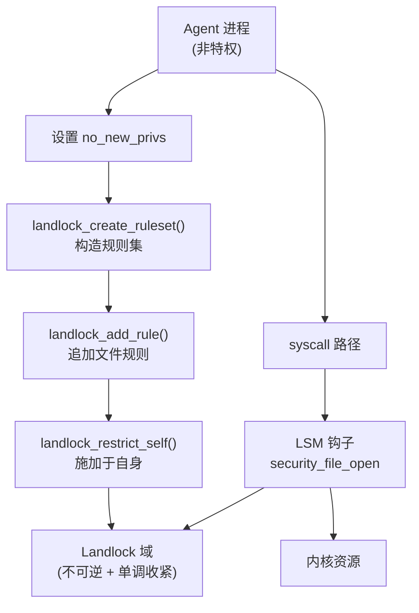
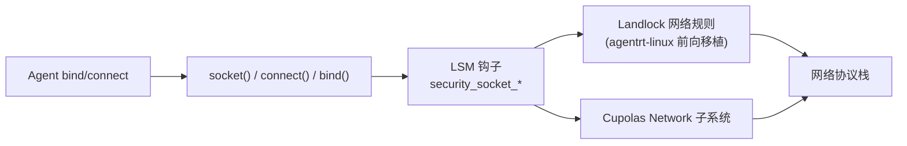
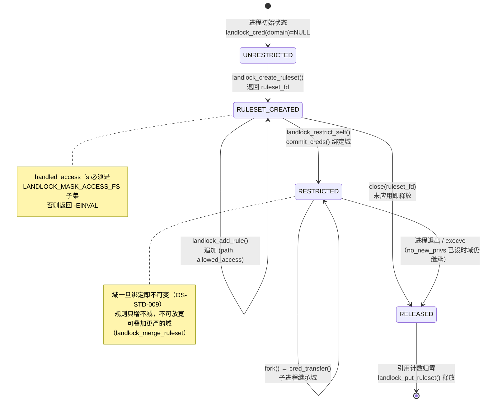
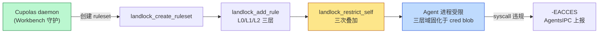

Copyright (c) 2025-2026 SPHARX Ltd. All Rights Reserved.

# Landlock 用户态沙箱
> **文档定位**：agentrt-linux（AirymaxOS）安全工程体系第 2 主题文档——Landlock 用户态安全沙箱深度剖析\
> **文档版本**：0.1.1\
> **最后更新**： 2026-07-21\
> **上级文档**：[agentrt-linux 设计文档](README.md)\
> **同源映射**：agentrt Cupolas（安全穹顶）+ Linux 6.6 LSM/Landlock/capability\
> **理论根基**：Linux 6.6 内核基线 + Airymax 五维正交 24 原则 + E-1 安全内生\
> **核心约束**：IRON-9 v3 同源且部分代码共享

---

## 目录

- [第 1 章 Landlock 设计哲学](#第-1-章-landlock-设计哲学)
- [第 2 章 Landlock 在 agentrt-linux 中的定位](#第-2-章-landlock-在-agentrt-linux-中的定位)
- [第 3 章 landlock_ruleset 数据结构](#第-3-章-landlock_ruleset-数据结构)
- [第 4 章 Landlock 安全 blob](#第-4-章-landlock-安全-blob)
- [第 5 章 Landlock 文件系统访问控制](#第-5-章-landlock-文件系统访问控制)
- [第 6 章 Landlock 网络访问控制](#第-6-章-landlock-网络访问控制)
- [第 7 章 Landlock 系统调用 API](#第-7-章-landlock-系统调用-api)
- [第 8 章 agentrt-linux Agent 沙箱实现](#第-8-章-agentrt-linux-agent-沙箱实现)
- [第 9 章 Workbench 虚拟工作台与 Landlock 集成](#第-9-章-workbench-虚拟工作台与-landlock-集成)
- [第 10 章 五维原则映射](#第-10-章-五维原则映射)
- [第 11 章 同源 agentrt 映射](#第-11-章-同源-agentrt-映射)
- [第 12 章 规则编号集](#第-12-章-规则编号集)
- [第 13 章 相关文档](#第-13-章-相关文档)
- [第 14 章 文档版本与维护](#第-14-章-文档版本与维护)

---

## 第 1 章 Landlock 设计哲学

### 1.1 非特权进程自限制

Landlock 是 Linux 6.6 内核基线中唯一允许**非特权进程**自定义安全策略并施加于自身的安全模块。这一设计哲学颠覆了 SELinux/AppArmor 由管理员集中配置的范式：策略制定权下沉到每个进程，但被严格约束在"只能限制自己"的范围内——进程无法通过 Landlock 提权，也无法影响其他进程的访问权限。这一特性正是 agentrt-linux 选择 Landlock 作为 Agent 沙箱底座的根本原因：每个 Agent 都以非特权身份运行，但其工作负载需要的隔离能力可以通过 Landlock 自主声明，无需系统管理员介入。这契合 agentrt-linux 五维正交 24 原则中的 E-1（安全内生）与 K-3（服务隔离）——安全能力内置、隔离粒度下沉到进程级。

### 1.2 域的不可逆叠加

Landlock 域（domain）一旦施加于进程，其效果**不可逆**且**单调收紧**：进程可以通过 `landlock_restrict_self` 进一步叠加更严的域，但永远无法放宽当前域。这与 `no_new_privs` 的语义吻合：施加 Landlock 域后，子进程通过 `execve` 也无法摆脱该域。agentrt-linux Cupolas 的 Workbench 子系统正是利用这一不可逆性来保证 Agent 即便被攻陷也无法越界。

### 1.3 多层叠加与短路

Landlock 通过 `layer_masks` 机制支持多个域叠加：每一层独立裁决，任一层否决即整体否决。这是"最严格优先"策略的工程实现，与 LSM 框架自身的多 LSM 短路语义保持一致。

### 1.4 与 MicroCoreRT 的契约

Landlock 的用户态 API（三个系统调用）被 MicroCoreRT 列为"用户空间稳定 ABI"白名单成员，遵循 OS-IRON-001（用户空间 ABI 永不破坏）。agentrt-linux 在 Linux 6.6 内核基线之上对此 ABI 提供永久支持承诺，任何对 Landlock syscall 编号、参数布局、返回值语义的改动都必须经过 RFC 评审。

---

## 第 2 章 Landlock 在 agentrt-linux 中的定位

### 2.1 在安全体系分层中的位置

| 层级 | 机制 | 角色 |
|------|------|------|
| L1 | LSM 框架 | 框架承重 |
| L2 | capability | 主体能力位图 |
| L3 | **Landlock** | **进程自限制沙箱** |
| L4 | Cupolas | Agent 行为约束 |

Landlock 与 Cupolas 的分工：Landlock 提供机制（进程自施加不可逆域），Cupolas 提供策略（哪些 Agent 应施加何种域）。Cupolas 的 Workbench 子系统在 Agent 启动时通过 `landlock_restrict_self` 把 Cupolas 决策的策略施加到 Agent 进程自身，从而把 Cupolas 的高层策略翻译为 Landlock 的内核态强制。

### 2.2 与 capability 的协同

Landlock 的 `landlock_restrict_self` 要求调用者满足以下任一条件：

```c
// security/landlock/syscalls.c
if (!task_no_new_privs(current) &&
    !ns_capable_noaudit(current_user_ns(), CAP_SYS_ADMIN))
    return -EPERM;
```

非特权 Agent 通过设置 `no_new_privs` 即可施加 Landlock 域——这是非特权沙箱可行性的关键。Cupolas 在 Agent 启动时统一设置 `no_new_privs`，再施加 Landlock 域，从而无需授予 Agent 任何特权。



---

## 第 3 章 landlock_ruleset 数据结构

### 3.1 ruleset 与规则

`struct landlock_ruleset` 是 Landlock 的核心数据结构，承载一组以红黑树组织的规则：

```c
// security/landlock/ruleset.h
struct landlock_ruleset {
    struct rb_root root;                  /* 规则红黑树根 */
    struct landlock_hierarchy *hierarchy; /* 域层级链 */
    union {
        struct work_struct work_free;
        struct { struct mutex lock; refcount_t usage;
                 u32 num_rules; u32 num_layers;
                 access_mask_t fs_access_masks[]; };
    };
};

struct landlock_rule {
    struct rb_node node;                  /* 红黑树节点 */
    struct landlock_object *object;       /* 内核对象指针 (inode key) */
    u32 num_layers;                       /* 层栈深度 */
    struct landlock_layer layers[] __counted_by(num_layers);
};

struct landlock_layer { u16 level; access_mask_t access; };
```

`landlock_layer` 的 `level` 标识在层栈中的位置，`access` 是该层允许的访问位图。

### 3.2 层栈语义

`layers[]` 是一个层栈，从最旧到最新：每一层记录该层施加时的访问位图。运行时校验时按层栈遍历，任一层未授予对应访问位即整体否决。这种层栈设计直接对应"多次 `landlock_restrict_self` 叠加多个域"的语义——每次叠加新增一层，规则集合并到新层中。

### 3.3 层级链与不可变性

`struct landlock_hierarchy` 是域层级链节点，用于 ptrace 跨域校验：只有当 tracer 的域层级是 tracee 域层级的祖先时，ptrace 才被允许。一旦 ruleset 通过 `landlock_restrict_self` 绑定到进程凭据成为"域"，其红黑树即冻结为不可变；后续 `landlock_restrict_self` 创建新域，原域保留引用计数。这一不可变性是 Landlock 在 RCU 下被并发读取的前提，也是 agentrt-linux Cupolas 选择 Landlock 而非自研沙箱的重要原因——其并发安全已形式化沉淀。

---

## 第 4 章 Landlock 安全 blob

### 4.1 blob 布局

Landlock 通过 `lsm_blob_sizes` 在四类内核对象上挂接私有数据：

```c
// security/landlock/setup.c
struct lsm_blob_sizes landlock_blob_sizes __ro_after_init = {
    .lbs_cred       = sizeof(struct landlock_cred_security),
    .lbs_file       = sizeof(struct landlock_file_security),
    .lbs_inode      = sizeof(struct landlock_inode_security),
    .lbs_superblock = sizeof(struct landlock_superblock_security),
};
```

### 4.2 cred blob：域指针

`landlock_cred_security` 只有一个字段——指向当前进程绑定的 ruleset（域）。`cred_prepare` / `cred_transfer` 钩子负责在凭据复制时把父域引用计数 +1 并附加到新凭据，从而让子进程继承父进程的 Landlock 域：

```c
// security/landlock/cred.c
static void hook_cred_transfer(struct cred *const new, const struct cred *const old) {
    struct landlock_ruleset *const old_dom = landlock_cred(old)->domain;
    if (old_dom) { landlock_get_ruleset(old_dom); landlock_cred(new)->domain = old_dom; }
}
```

### 4.3 file / inode / superblock blob

`landlock_file_security` 记录文件被打开时该域允许的访问位图（`access_mask_t allowed_access`），避免后续 `ftruncate()` 等操作重新走完整路径校验；`hook_file_alloc_security` 在分配时初始化为 `LANDLOCK_MASK_ACCESS_FS` 全开。`landlock_inode_security` 持有指向 `landlock_object` 的 RCU 弱引用（`struct landlock_object __rcu *object`），把内核 inode 与 Landlock 抽象对象解耦。`landlock_superblock_security` 持有 `inode_refs` 计数（`atomic_long_t`），用于文件系统卸载时与并发 `release_inode()` 同步。

---

## 第 5 章 Landlock 文件系统访问控制

### 5.1 访问位图

Landlock 把文件系统访问细分为 15 个正交位（Linux 6.6 内核基线）：

```c
// include/uapi/linux/landlock.h
#define LANDLOCK_ACCESS_FS_EXECUTE      (1ULL << 0)
#define LANDLOCK_ACCESS_FS_WRITE_FILE   (1ULL << 1)
#define LANDLOCK_ACCESS_FS_READ_FILE    (1ULL << 2)
#define LANDLOCK_ACCESS_FS_READ_DIR     (1ULL << 3)
#define LANDLOCK_ACCESS_FS_REMOVE_DIR   (1ULL << 4)
#define LANDLOCK_ACCESS_FS_REMOVE_FILE (1ULL << 5)
#define LANDLOCK_ACCESS_FS_MAKE_CHAR    (1ULL << 6)
#define LANDLOCK_ACCESS_FS_MAKE_DIR    (1ULL << 7)
#define LANDLOCK_ACCESS_FS_MAKE_REG    (1ULL << 8)
#define LANDLOCK_ACCESS_FS_MAKE_SOCK   (1ULL << 9)
#define LANDLOCK_ACCESS_FS_MAKE_FIFO   (1ULL << 10)
#define LANDLOCK_ACCESS_FS_MAKE_BLOCK  (1ULL << 11)
#define LANDLOCK_ACCESS_FS_MAKE_SYM    (1ULL << 12)
#define LANDLOCK_ACCESS_FS_REFER       (1ULL << 13)
#define LANDLOCK_ACCESS_FS_TRUNCATE    (1ULL << 14)
```

每条规则以 `(path, allowed_access)` 二元组表达：该路径下允许上述位中标记的访问，未标记的访问被否决。

### 5.2 file_open 钩子

`hook_file_open` 是 Landlock 的主入口，对每次文件打开执行路径校验：

```c
// security/landlock/fs.c（节选）
static int hook_file_open(struct file *const file) {
    const struct landlock_ruleset *const dom = landlock_get_current_domain();
    layer_mask_t layer_masks[LANDLOCK_NUM_ACCESS_FS] = {};
    access_mask_t open_access_request, full_access_request, allowed_access;
    if (!dom) return 0;
    open_access_request = get_required_file_open_access(file);
    full_access_request = open_access_request | LANDLOCK_ACCESS_FS_TRUNCATE;
    /* is_access_to_paths_allowed() 校验各层后填充 allowed_access */
    landlock_file(file)->allowed_access = allowed_access;
    return ((open_access_request & allowed_access) == open_access_request) ? 0 : -EACCES;
}
```

### 5.3 path 类钩子覆盖面

Landlock 注册了完整的 path 类钩子，覆盖 `mkdir`/`mknod`/`symlink`/`unlink`/`rmdir`/`rename`/`link`/`truncate`，以及 `sb_mount`/`move_mount`/`sb_umount`/`sb_remount`/`sb_pivotroot` 等挂载操作，还有 `file_alloc_security`/`file_open`/`file_truncate` 文件操作。这一覆盖面让 agentrt-linux Cupolas 可以把"Agent 可写目录"完整收敛到 Landlock 域内，无需另起一套文件系统过滤机制。

---

## 第 6 章 Landlock 网络访问控制

### 6.1 网络规则的前瞻性

Linux 6.6 内核基线中的 Landlock 仅覆盖文件系统访问；网络访问控制在主线 6.7+ 才稳定落地。agentrt-linux 在 Linux 6.6 内核基线之上对 Landlock 进行前向移植，把网络规则作为可选扩展集成进 Cupolas Workbench 沙箱，沿用相同的"层栈 + 不可逆叠加"语义。

### 6.2 网络规则类型

agentrt-linux Cupolas 沙箱使用的网络规则类型遵循上游 UAPI 设计：

- `LANDLOCK_RULE_NET_PORT`：按 TCP/UDP 端口范围约束 bind/connect
- `LANDLOCK_RULE_NET_SERVICE`：按服务类型约束（前瞻规范）

每条网络规则形如 `(port, allowed_access)`，与文件规则共享同一 ruleset 与层栈机制：

```c
/* agentrt-linux Cupolas 网络规则示例（前向移植） */
struct landlock_net_port_attr {
    __u64 allowed_access;   /* LANDLOCK_ACCESS_NET_* */
    __u64 port;             /* 端口号 */
};
#define LANDLOCK_ACCESS_NET_BIND_TCP     (1ULL << 0)
#define LANDLOCK_ACCESS_NET_CONNECT_TCP (1ULL << 1)
#define LANDLOCK_ACCESS_NET_BIND_UDP    (1ULL << 2)
#define LANDLOCK_ACCESS_NET_CONNECT_UDP (1ULL << 3)
```

### 6.3 与 Cupolas Network 子系统的协同

Cupolas Network 子系统在 agentrt 端通过 `airy_cupolas_net_filter()` 实施用户态过滤；agentrt-linux 内核态则通过 Landlock 网络规则在 `bind()` / `connect()` syscall 路径上施加内核级强制。两端通过 `AgentsIPC` 总线同步规则，遵循 IRON-9 v3 同源且部分代码共享原则——同源在规则语义，独立在执行路径。网络规则端口范围最大 65535，端口号之外的协议字段（如 ICMP type）暂不支持；agentrt-linux Cupolas 在沙箱策略中明确"网络规则为可选增强"，策略缺失时回退默认拒绝。



---

## 第 7 章 Landlock 系统调用 API

### 7.1 landlock_create_ruleset

创建匿名 ruleset 文件描述符，声明该 ruleset 将处理的文件系统访问类别。`handled_access_fs` 是"该 ruleset 将要约束的访问位掩码"——只有在此掩码中标记的访问才会被该 ruleset 裁决，其余访问对该 ruleset 而言放行：

```c
// security/landlock/syscalls.c（节选）
SYSCALL_DEFINE3(landlock_create_ruleset, const struct landlock_ruleset_attr __user *,
               const attr_ptr, const size_t, size, const __u32, flags)
{
    struct landlock_ruleset_attr ruleset_attr;
    struct landlock_ruleset *ruleset;
    int ruleset_fd;
    if (!is_initialized()) return -EOPNOTSUPP;
    if (flags) return -EINVAL;
    if (size < sizeof(ruleset_attr)) return -EINVAL;
    if (size > PAGE_SIZE) return -E2BIG;
    err = copy_min_struct_from_user(&ruleset_attr, sizeof(ruleset_attr),
                                    offsetofend(typeof(ruleset_attr), handled_access_fs),
                                    attr, size);
    if (err) return err;
    if ((ruleset_attr.handled_access_fs | LANDLOCK_MASK_ACCESS_FS) != LANDLOCK_MASK_ACCESS_FS)
        return -EINVAL;
    ruleset = landlock_create_ruleset(ruleset_attr.handled_access_fs);
    if (IS_ERR(ruleset)) return PTR_ERR(ruleset);
    ruleset_fd = anon_inode_getfd("[landlock-ruleset]", &ruleset_fops, ruleset, O_RDWR | O_CLOEXEC);
    if (ruleset_fd < 0) landlock_put_ruleset(ruleset);
    return ruleset_fd;
}
```

### 7.2 landlock_add_rule

向 ruleset 追加一条 `(parent_fd, allowed_access)` 文件规则。核心校验：`allowed_access` 必须是 `ruleset->fs_access_masks[0]` 的子集，否则 `-EINVAL`；空访问位返回 `-ENOMSG`；`parent_fd` 必须指向真实文件系统路径（不接受 ruleset FD、`MNT_INTERNAL`、`SB_NOUSER`、private inode），否则 `-EBADFD`。

### 7.3 landlock_restrict_self

把 ruleset 绑定到当前线程凭据成为不可逆域。关键步骤：`prepare_creds()` 复制当前凭据 → `landlock_merge_ruleset()` 把新 ruleset 合并到旧域得到新域 → `commit_creds()` 原子提交。整个过程在当前线程独占的凭据副本上操作，无并发竞争。这是 Landlock 在 agentrt-linux 安全体系中受推崇的核心原因——其原子性与不可逆性已形式化沉淀。

```c
// security/landlock/syscalls.c（节选）
SYSCALL_DEFINE2(landlock_restrict_self, const int, ruleset_fd, const __u32, flags)
{
    struct landlock_ruleset *new_dom, *ruleset;
    struct cred *new_cred;
    struct landlock_cred_security *new_llcred;
    int err;
    if (!is_initialized()) return -EOPNOTSUPP;
    /* 类似 seccomp(2)：要求 no_new_privs 或 CAP_SYS_ADMIN */
    if (!task_no_new_privs(current) && !ns_capable_noaudit(current_user_ns(), CAP_SYS_ADMIN))
        return -EPERM;
    if (flags) return -EINVAL;
    ruleset = get_ruleset_from_fd(ruleset_fd, FMODE_CAN_READ);
    if (IS_ERR(ruleset)) return PTR_ERR(ruleset);
    new_cred = prepare_creds();
    if (!new_cred) { err = -ENOMEM; goto out_put_ruleset; }
    new_llcred = landlock_cred(new_cred);
    new_dom = landlock_merge_ruleset(new_llcred->domain, ruleset);
    if (IS_ERR(new_dom)) { err = PTR_ERR(new_dom); goto out_put_creds; }
    landlock_put_ruleset(new_llcred->domain);
    new_llcred->domain = new_dom;
    landlock_put_ruleset(ruleset);
    return commit_creds(new_cred);
out_put_creds:
    abort_creds(new_cred);
out_put_ruleset:
    landlock_put_ruleset(ruleset);
    return err;
}
```

### 7.4 Landlock 沙箱生命周期状态机

Landlock 沙箱从进程初始无域到规则集创建、施加、释放的完整状态转换，体现"单调收紧、不可放宽"的不可逆语义：



**状态转换条件**：

| 从状态 | 到状态 | 触发条件 | 系统行为 |
|--------|--------|---------|---------|
| — | UNRESTRICTED | 进程启动，`landlock_cred(domain)=NULL` | 无 Landlock 钩子拦截，所有 syscall 放行 |
| UNRESTRICTED | RULESET_CREATED | `landlock_create_ruleset(attr, size, flags)` 返回 fd | `anon_inode_getfd` 创建匿名 ruleset FD |
| RULESET_CREATED | RULESET_CREATED | `landlock_add_rule(fd, type, attr)` 追加路径规则 | 红黑树插入 `(inode, allowed_access)` 节点 |
| RULESET_CREATED | RESTRICTED | `landlock_restrict_self(fd, 0)`（需 `no_new_privs` 或 `CAP_SYS_ADMIN`） | `prepare_creds` → `landlock_merge_ruleset` → `commit_creds` 原子绑定 |
| RULESET_CREATED | RELEASED | `close(ruleset_fd)` 未应用即关闭 | `fput` 触发 `ruleset_release`，红黑树销毁 |
| RESTRICTED | RESTRICTED | `fork()` 触发 `hook_cred_transfer` | 子进程 `landlock_get_ruleset` 父域，引用计数 +1 |
| RESTRICTED | RELEASED | 进程退出或 `execve`（`no_new_privs` 未设时域解除） | `put_cred` 触发 `landlock_put_ruleset`，引用计数 -1 |
| RELEASED | — | 引用计数归零 | `task_work` 延迟释放红黑树与 `landlock_object` |

---

## 第 8 章 agentrt-linux Agent 沙箱实现

### 8.1 沙箱施加流程

Cupolas Workbench 子系统在每个 Agent 启动时按下列流程施加 Landlock 沙箱：

```c
/* agentrt-linux Cupolas Agent 沙箱示例（用户态） */
#include <linux/landlock.h>
#include <sys/prctl.h>
int cupolas_sandbox_agent(const char *ro_root, const char *rw_work) {
    struct landlock_ruleset_attr attr = {
        .handled_access_fs = LANDLOCK_ACCESS_FS_WRITE_FILE | LANDLOCK_ACCESS_FS_TRUNCATE |
                              LANDLOCK_ACCESS_FS_REMOVE_FILE | LANDLOCK_ACCESS_FS_REMOVE_DIR |
                              LANDLOCK_ACCESS_FS_MAKE_REG | LANDLOCK_ACCESS_FS_MAKE_DIR,
    };
    int fd, err;
    /* (1) 设置 no_new_privs； (2) 创建 ruleset */
    if (prctl(PR_SET_NO_NEW_PRIVS, 1, 0, 0, 0) < 0) return -errno;
    fd = syscall(SYS_landlock_create_ruleset, &attr, sizeof(attr), 0);
    if (fd < 0) return -errno;
    /* (3) 只读根：仅允许读 */
    struct landlock_path_beneath_attr ro = {
        .allowed_access = LANDLOCK_ACCESS_FS_READ_FILE | LANDLOCK_ACCESS_FS_READ_DIR,
        .parent_fd = open(ro_root, O_PATH | O_CLOEXEC),
    };
    syscall(SYS_landlock_add_rule, fd, LANDLOCK_RULE_PATH_BENEATH, &ro, 0);
    /* (4) 可写工作目录：允许读写创建 */
    struct landlock_path_beneath_attr rw = {
        .allowed_access = LANDLOCK_ACCESS_FS_WRITE_FILE | LANDLOCK_ACCESS_FS_TRUNCATE |
                          LANDLOCK_ACCESS_FS_REMOVE_FILE | LANDLOCK_ACCESS_FS_REMOVE_DIR |
                          LANDLOCK_ACCESS_FS_MAKE_REG | LANDLOCK_ACCESS_FS_MAKE_DIR |
                          LANDLOCK_ACCESS_FS_READ_FILE | LANDLOCK_ACCESS_FS_READ_DIR,
        .parent_fd = open(rw_work, O_PATH | O_CLOEXEC),
    };
    syscall(SYS_landlock_add_rule, fd, LANDLOCK_RULE_PATH_BENEATH, &rw, 0);
    /* (5) 施加于自身 */
    err = syscall(SYS_landlock_restrict_self, fd, 0);
    close(fd);
    return err;
}
```

### 8.2 与 Cupolas Vault 的协同

Agent 在沙箱内运行的敏感数据由 Cupolas Vault 子系统通过 TPM + 机密计算保护，与 Landlock 沙箱形成"数据-代码"双层隔离：Landlock 限制代码可访问的文件范围，Vault 保护数据本身的机密性。施加失败时 Cupolas 通过 `AgentsIPC` 总线上报 `CUPOLAS_SANDBOX_FAIL` 事件，Agent 拒绝启动而非降级运行。这遵循 agentrt-linux 五维正交 24 原则中的 E-1（安全内生）——失败必须可见、可拒绝，不可静默退化。

---

## 第 9 章 Workbench 虚拟工作台与 Landlock 集成

### 9.1 Workbench 定位

Workbench 是 Cupolas 的"虚拟工作台"子系统，为 Agent 提供完整的隔离运行环境：独立的根文件系统、独立的网络命名空间、独立的 Landlock 域、独立的 capability 集。宿主系统侧由 Cupolas Network 守护、Cupolas Workbench 守护、Cupolas Vault 三者协同；Agent 命名空间侧由 mount ns（独立根 FS）+ network ns + Landlock 域（不可逆）+ capability 子集 + Agent 进程构成。Workbench 守护负责施加 mount/network/Landlock/capability 四元组到 Agent 命名空间；Network 守护通过 `AgentsIPC` 同步网络规则；Vault 通过密钥协商保护 Agent 敏感数据。

### 9.2 与 MicroCoreRT 的契约

Workbench 施加 Landlock 域所用的三个 syscall 在 MicroCoreRT 锁定的"用户空间稳定 ABI"白名单内。Cupolas Workbench 守护进程作为唯一可调用 `landlock_restrict_self` 的特权进程，承担策略施加的入口职责；Agent 进程自身只继承施加好的域，不能进一步施加更宽的规则——这是"单调收紧"语义的硬保证。

### 9.3 与 AgentsIPC 的协同

Workbench 与 Cupolas Audit 子系统通过 `AgentsIPC` 总线传递沙箱事件：`CUPOLAS_SANDBOX_BEGIN`（施加开始）、`CUPOLAS_SANDBOX_END`（完成）、`CUPOLAS_SANDBOX_DENY`（syscall 被拒绝）、`CUPOLAS_SANDBOX_FAIL`（施加失败，启动中止）。所有事件携带 Agent ID、时间戳、规则集版本号，由 Audit 子系统持久化到 Workbench 日志卷。

---

## 第 10 章 五维原则映射

agentrt-linux 五维正交 24 原则在 Landlock 沙箱层的体现：

| 原则 | 编号 | 在 Landlock 的体现 |
|------|------|---------------------|
| **E-1 安全内生** | OS-SEC-004 | 沙箱能力内置内核，无需外部依赖 |
| **E-2 形式化验证** | OS-SEC-005 | 域的不可逆性、单调收紧性需形式化检查 |
| **K-2 接口契约化** | OS-KER-079 | 三个 syscall 是稳定 ABI，永久支持 |
| **K-3 服务隔离** | OS-KER-080 | 每个 Agent 独立 Landlock 域，进程级隔离 |
| **K-4 可插拔策略** | OS-KER-054 | ruleset 是策略载体，运行时可组合 |
| **K-6 内核契约化** | OS-KER-079 | MicroCoreRT 锁定 Landlock syscall ABI（三 syscall 永久 ABI，同 K-2） |
| **C-1 编译期检查** | OS-STD-006 | `BUILD_BUG_ON` 校验 ABI 结构体大小 |
| **C-2 类型安全** | OS-STD-007 | `copy_min_struct_from_user` 校验用户缓冲区 |
| **C-3 RAII** | OS-STD-008 | ruleset 通过 FD 引用计数管理生命周期 |
| **C-5 不变量守护** | OS-STD-009 | 域一旦绑定即不可变，RCU 读侧安全 |
| **A-1 诚实优先** | OS-STD-SEC-010 | `is_initialized()` 失败时清晰告知用户态 |
| **A-4 完美主义** | OS-STD-SEC-011 | 沙箱施加失败必须中止而非降级 |
| **IRON-9 v3 同源且部分代码共享** | OS-IRON-004 | Cupolas Workbench 与 agentrt 端沙箱同源且部分代码共享 |

---

## 第 11 章 同源 agentrt 映射

agentrt 的 `cupolas/workbench/` 模块与 agentrt-linux 内核态 Landlock 沙箱同源，遵循 IRON-9 v3 同源且部分代码共享原则。Landlock 沙箱在 Cupolas 7 大子系统中的角色：

| Cupolas 子系统 | agentrt 端（用户态） | agentrt-linux 端（内核态 Landlock） |
|----------------|----------------------|----------------------------------|
| **Guards 守卫** | `airy_cupolas_guard_check()` 沙箱入口校验 | `landlock_restrict_self` 后 syscall 被钩子拦截 |
| **Permission 权限裁决** | `airy_cupolas_perm_decide()` 策略裁决 | ruleset 中 `(path, allowed_access)` 二元组 |
| **Sanitizer 输入净化** | `airy_cupolas_sanitize()` 输入校验 | Landlock 限制可读路径范围 |
| **Audit 审计追踪** | `airy_cupolas_audit_log()` 拒绝事件落盘 | `-EACCES` 返回通过 `AgentsIPC` 上报 |
| **Workbench 虚拟工作台** | `airy_cupolas_workbench_apply()` 策略施加 | 调用 `landlock_create_ruleset` + `add_rule` + `restrict_self` |
| **Security Vault 安全金库** | `airy_cupolas_vault_seal()` 数据密封 | 沙箱限制可写路径，密钥仅存 Vault |
| **Network Security 网络安全** | `airy_cupolas_net_filter()` 网络过滤 | Landlock 网络规则（agentrt-linux 前向移植） |

两端通过 `AgentsIPC` 总线同步沙箱策略与审计事件，遵循 IRON-9 v3 同源且部分代码共享原则——同源在策略语义，独立在执行路径（用户态 API vs 内核态 syscall）。MicroCoreRT 锁定的 128B 消息头保证两端无适配层互操作。

### 11.1 IRON-9 v3 四层共享模型

IRON-9 v3 将 agentrt Cupolas Workbench 与 agentrt-linux Landlock 沙箱的协作划分为四层：

| 层次 | 共享程度 | Landlock 沙箱内容 |
|------|---------|-----------------|
| **[SC] 共享契约层** | 完全共享代码 | `include/uapi/linux/airymax/security_types.h`：Cupolas blob 布局（task 偏移用于沙箱域指针）+ 策略裁决 4 值枚举（ALLOW/DENY/AUDIT/COMPLAIN） |
| **[SS] 语义同源层** | 操作模式同源（注册/匹配/生命周期等概念一致），函数签名因抽象层级不同而独立 | Landlock 规则创建三 syscall 语义、访问掩码语义、路径匹配语义、scope 限制语义 |
| **[IND] 完全独立层** | 完全独立 | Landlock 文件系统实现（`fs/landlock/`）、eBPF 强制执行、内核对象生命周期（`landlock_object`）、规则集内核态管理 |

#### [SC] 共享契约层

`include/uapi/linux/airymax/security_types.h` 定义 Cupolas blob 布局与策略裁决 4 值枚举，agentrt 用户态 Workbench 通过此头读取 task blob 偏移以定位沙箱域指针，无需访问内核私有结构：

```c
/* include/uapi/linux/airymax/security_types.h —— IRON-9 v3 [SC] 共享契约层（节选，Landlock 相关） */
struct airy_lsm_blob_offsets {
    uint16_t cred_offset;    /* Cupolas blob 在 cred 中的偏移（Landlock 域指针） */
    uint16_t inode_offset;   /* Cupolas blob 在 inode 中的偏移（inode 访问规则） */
    uint16_t file_offset;    /* Cupolas blob 在 file 中的偏移（file 访问规则） */
    uint16_t task_offset;    /* Cupolas blob 在 task_struct 中的偏移（Workbench 沙箱域） */
};

enum airy_security_verdict {
    AIRY_VERDICT_ALLOW    = 0,   /* 允许操作（沙箱放行） */
    AIRY_VERDICT_DENY     = 1,   /* 拒绝操作（沙箱阻断，返回 -EACCES） */
    AIRY_VERDICT_AUDIT    = 2,   /* 允许但审计（沙箱放行并记录） */
    AIRY_VERDICT_COMPLAIN = 3,   /* 拒绝但记录（学习模式，Landlock COMPLAIN 语义） */
};
```

**OS-IRON-005 约束**: agentrt-linux Landlock 与 agentrt Cupolas Workbench 共享 `include/uapi/linux/airymax/security_types.h`，task blob 偏移语义两端必须一致（沙箱域指针挂载点）；策略裁决 4 值枚举在两端语义完全相同，COMPLAIN 学习模式两端行为一致。

#### [SS] 语义同源层

| 维度 | agentrt 用户态（Cupolas Workbench） | agentrt-linux 内核态（Landlock） | 同源点 |
|------|------------------------------------|--------------------------------|--------|
| 规则集创建 | `airy_cupolas_workbench_spawn()` 创建沙箱域 | `landlock_create_ruleset()` 创建 ruleset | 创建语义同源 |
| 规则添加 | `airy_cupolas_workbench_add_path()` 添加路径规则 | `landlock_add_rule()` 添加路径规则 | 路径绑定语义同源 |
| 策略施加 | `airy_cupolas_workbench_apply()` 施加沙箱 | `landlock_restrict_self()` 限制自身 | 自限制语义同源 |
| 访问掩码 | 用户态 access_mask 位图 | `LANDLOCK_ACCESS_FS_*` 位图 | 掩码语义同源 |
| 路径匹配 | 用户态路径前缀匹配 | 内核态 `landlock_init_layer_names` 层级匹配 | 匹配语义同源 |
| scope 限制 | 用户态 scope 配置 | `LANDLOCK_SCOPE_*` 限制（agentrt-linux 前向移植） | 作用域语义同源 |
| 拒绝上报 | `AgentsIPC` 上报 `-EACCES` 事件 | `AgentsIPC` 上报 `-EACCES` 事件 | 上报通道同源 |

agentrt 的 `cupolas/workbench` 模块定义了 `airy_cupolas_workbench_spawn(domain, mask)`，与内核 Landlock 的 `landlock_create_ruleset(attr, size, flags)` 同源——两者都遵循"创建规则集 → 绑定路径 → 施加于自身"三段式。[SS] 语义同源在此体现为：操作模式同源（创建/添加/施加三 syscall 模式概念一致），函数签名因抽象层级不同而独立（用户态策略引擎 vs 内核态 ruleset）。

#### [IND] 完全独立层

| 维度 | agentrt 用户态（Cupolas Workbench） | agentrt-linux 内核态（Landlock） |
|------|------------------------------------|--------------------------------|
| 文件系统实现 | 不适用（用户态无 fs 实现） | `fs/landlock/` 完整子系统（ruleset.c、fs.c、object.c） |
| 强制执行 | 用户态策略拦截（syscall 包装） | eBPF 钩子强制执行（`security_file_open` 等 LSM 钩子） |
| 内核对象生命周期 | 不适用 | `landlock_object` 引用计数管理（release 时清理规则） |
| 规则集内核态管理 | 不适用（仅持有 fd） | ruleset 内核态分配、cred blob 挂载、layer stack 叠加 |
| 域叠加语义 | 用户态策略聚合 | 内核态 layer 栈不可逆叠加（commit_creds 时固化） |
| 内存分配 | 用户态 malloc | `kmem_cache` + slab 分配器 |
| 并发安全 | 用户态锁 | RCU + SRCU 保护规则集 |

#### 跨态协作流

```mermaid
graph LR
    A[agentrt Workbench 策略引擎] -->|读取 [SC] task_offset| B[security_types.h]
    A -->|spawn 沙箱域| C[landlock_create_ruleset]
    C --> D[agentrt-linux Landlock 规则集]
    D -->|restrict_self| E[内核 eBPF 钩子强制]
    E -->|沙箱违规 -EACCES| F[AgentsIPC 上报审计事件]
    A -->|策略下发| F
    style B fill:#bbf7d0,stroke:#15803d
    style F fill:#fde68a,stroke:#b45309
```

agentrt Cupolas Workbench 策略引擎通过 [SC] 共享契约层读取 `security_types.h` 中的 task blob 偏移，定位沙箱域指针在 task_struct 中的挂载点，随后通过三 syscall（create_ruleset / add_rule / restrict_self）在 agentrt-linux 内核态建立 Landlock 规则集。两端通过 AgentsIPC 总线（128B 消息头，magic `0x41524531`）同步沙箱违规事件，无适配层。MicroCoreRT 极简内核契约要求：内核态 Landlock 不解析用户态策略 payload，仅按 [SC] 裁决枚举透传 `-EACCES` 事件；用户态 Workbench 守护进程负责跨态策略聚合与审计。沙箱域叠加遵循 Landlock 不可逆原则——一旦 `landlock_restrict_self` 提交，规则集 layer 栈固化于 cred blob，运行时不可撤销。

### 11.2 Landlock 与 Cupolas 集成深化

Landlock 与 Cupolas 集成的目标是为每个 Agent 创建分层沙箱，通过 L0/L1/L2 三层 Landlock 域叠加把 Cupolas Guards/Permission/Workbench 三个子系统的策略翻译为内核态不可逆的访问控制，遵循 IRON-9 v3 [SC] 共享契约层约束（OS-IRON-005）。

#### 11.2.1 Landlock 域叠加顺序表

| 层级 | 域名 | 访问掩码 | 来源 |
|------|------|----------|------|
| **L0** | 全局 Landlock 域 | 限制所有 Agent 的文件系统访问（如禁 `/etc/shadow` 写、禁 `/proc/kcore` 读） | Cupolas **Guards** 子系统设定 |
| **L1** | Agent 角色域 | 按角色限制：LLM Agent 只读 `/opt/models`；TOOL Agent 读写 `/opt/tools` | Cupolas **Permission** 子系统设定 |
| **L2** | Agent 实例域 | 限制特定 Agent 实例的 IPC/网络访问（如仅允许 bind `127.0.0.1:8080`） | Cupolas **Workbench** 子系统设定 |

三层域在 Agent 进程 `fork()` 后由 Cupolas Workbench 守护按 L0→L1→L2 顺序连续三次调用 `landlock_restrict_self()` 叠加。每次叠加新增一层 layer 到 `landlock_ruleset` 的层栈（`num_layers+1`），遵循 Landlock 不可逆原则（OS-STD-009）。

#### 11.2.2 访问掩码合并算法

Landlock 域叠加遵循"交集"语义——最严格的限制生效。合并公式：

```
final_mask = domain_L0 & domain_L1 & domain_L2
```

某层未授予的访问位，在最终掩码中必为 0；任一层否决即整体否决。这与 Landlock `layer_masks` 多层短路语义一致（§3.2），保证 Agent 沙箱的最严策略优先。

```c
/* security/cupolas/landlock_merge.c —— agentrt-linux 专属 */
#include <linux/landlock.h>
#include <linux/build_bug.h>

/**
 * landlock_merge_access_masks - 合并三层 Landlock 域的访问掩码
 * @mask_l0: L0 全局域掩码（Guards）
 * @mask_l1: L1 角色域掩码（Permission）
 * @mask_l2: L2 实例域掩码（Workbench）
 *
 * 交集语义：final_mask = mask_l0 & mask_l1 & mask_l2
 * 任一层未授予的访问位在最终掩码中必为 0。
 *
 * 返回: 合并后的访问掩码（access_mask_t）
 */
access_mask_t landlock_merge_access_masks(access_mask_t mask_l0,
                                          access_mask_t mask_l1,
                                          access_mask_t mask_l2)
{
    access_mask_t final_mask = mask_l0 & mask_l1 & mask_l2;
    /* BUILD_BUG_ON 保证 access_mask_t 宽度与 [SC] 一致（OS-STD-006） */
    BUILD_BUG_ON(sizeof(access_mask_t) != sizeof(uint16_t));
    return final_mask;
}
```

#### 11.2.3 Cupolas → Landlock 策略下发流程



Cupolas daemon 创建 ruleset 后按 L0→L1→L2 顺序追加规则并三次调用 `landlock_restrict_self`，每次 `commit_creds()` 后规则集 layer 栈固化于 cred blob，运行时不可撤销（OS-STD-009）；syscall 违规时通过 `AgentsIPC` 上报 `CUPOLAS_SANDBOX_DENY` 事件（OS-SEC-006）。

#### 11.2.4 OS-SEC 规则集（agentrt-linux 专属扩展深化）

| 规则编号 | 类型 | 描述 |
|----------|------|------|
| OS-SEC-012 | 安全规范 | Agent 沙箱必须至少 3 层域叠加（L0 全局 + L1 角色 + L2 实例），禁止少于 3 层 |
| OS-SEC-013 | 安全规范 | 访问掩码合并必须用交集语义（`final_mask = L0 & L1 & L2`），禁止并集或最宽优先 |
| OS-SEC-014 | 安全规范 | `landlock_restrict_self` 必须在 Agent 进程 `fork()` 后立即调用，禁止延迟施加 |
| OS-SEC-015 | 安全规范 | 沙箱创建失败必须终止 Agent 启动，禁止降级运行（与 OS-STD-SEC-011 一致） |

上述规则在 IRON-9 v3 [SC] 共享契约层约束下，保证 agentrt 用户态 Cupolas Workbench 与 agentrt-linux 内核态 Landlock 沙箱的分层语义同源；任何对域叠加层数或合并算法的修改必须经 RFC 评审与五维原则映射检查（OS-STD-007）。

---

## 第 12 章 规则编号集

| 规则编号 | 类型 | 描述 |
|----------|------|------|
| OS-IRON-004 | 铁律 | Landlock 三个 syscall 是永久 ABI，永不破坏 |
| OS-IRON-005 | 铁律 | Cupolas Workbench 与 agentrt 端沙箱同源且部分代码共享维护 |
| OS-KER-079 | 内核契约 | `landlock_create_ruleset` / `landlock_add_rule` / `landlock_restrict_self` 三 syscall 由 MicroCoreRT 锁定 |
| OS-KER-080 | 内核契约 | 每个 Agent 必须施加独立 Landlock 域 |
| OS-KER-054 | 内核契约 | ruleset 是策略载体，运行时不可变 |
| OS-KER-081 | 内核契约 | `no_new_privs` 是 Agent 启动前必设标志 |
| OS-KER-072 | 内核契约 | 网络规则为可选增强，缺失时回退默认拒绝 |
| OS-STD-006 | 工程标准 | ABI 结构体大小变化必须配套 `BUILD_BUG_ON` 校验 |
| OS-STD-007 | 工程标准 | 用户缓冲区必须通过 `copy_min_struct_from_user` 校验 |
| OS-STD-008 | 工程标准 | ruleset FD 通过引用计数管理生命周期，关闭即释放 |
| OS-STD-009 | 工程标准 | 域绑定后红黑树冻结为不可变 |
| OS-STD-SEC-010 | 工程标准 | `is_initialized()` 失败时必须返回 `-EOPNOTSUPP` |
| OS-STD-SEC-011 | 工程标准 | 沙箱施加失败必须中止 Agent 启动 |
| OS-SEC-004 | 安全规范 | 沙箱能力内置内核，Agent 无需特权即可施加 |
| OS-SEC-005 | 安全规范 | 域的不可逆性需通过形式化检查 |
| OS-SEC-006 | 安全规范 | 沙箱施加前后必须通过 `AgentsIPC` 上报事件 |
| OS-SEC-007 | 安全规范 | Landlock 域不可替代 capability，必须与之共存 |

---

## 第 13 章 相关文档

- `110-security/README.md`（安全加固体系主索引）
- `110-security/01-lsm-framework.md`（LSM 框架详解）
- `110-security/03-capability-model.md`（capability 模型）
- `110-security/07-cupolas-dome.md`（Cupolas 安全穹顶）
- `50-engineering-standards/04-engineering-philosophy.md`（双层稳定性哲学）
- `20-modules/03-security.md`（security 子仓设计）
- Linux 6.6 `security/landlock/setup.c`、`security/landlock/syscalls.c`、`security/landlock/fs.c`、`security/landlock/cred.c`、`security/landlock/ruleset.h`、`include/uapi/linux/landlock.h`

---

## 第 14 章 文档版本与维护

| 字段 | 值 |
|------|------|
| 文档定位 | Landlock 用户态沙箱 |
| 当前版本 | 0.1.1 |
| 最后更新 | 2026-07-06 |
| 维护者 | agentrt-linux 安全工程组 |
| 同源映射 | agentrt Cupolas + Linux 6.6 LSM/Landlock/capability |
| 理论根基 | Linux 6.6 内核基线 + Airymax 五维正交 24 原则 + E-1 安全内生 |
| 核心约束 | IRON-9 v3 同源且部分代码共享 |

**变更历史**：v0.1.1（2026-07-06）初版占位，覆盖 Landlock 核心机制、Agent 沙箱实现、Workbench 集成；v1.0.1（开发中）补充网络规则前向移植、Workbench 与 Vault 协同、benchmark。

**待办**：补充网络规则前向移植 patch 集与上游差异；补充 Workbench 与 Vault 密钥协商协议；补充 Landlock 域叠加深度对 syscall 延迟影响；补充沙箱施加失败回滚策略。

---

## 附录 A: 接口定义

> **附录定位**： 本附录汇集 Landlock 用户态沙箱所需的完整 C 接口契约，供直接参照实现。所有数据结构与函数签名对齐 Linux 6.6 `security/landlock/ruleset.h`、`security/landlock/object.h`、`security/landlock/syscalls.c`、`security/landlock/cred.c`、`security/landlock/fs.c`、`include/uapi/linux/landlock.h` 及 `include/uapi/linux/airymax/security_types.h`（[SC] 共享契约层）。

### A.1 核心数据结构

#### A.1.1 landlock_ruleset — 规则集（绑定到 cred 后即"域"）

```c
/**
 * struct landlock_ruleset - Landlock 规则集
 *
 * 红黑树组织规则；绑定到 cred 后红黑树冻结为不可变，RCU 读侧安全。
 * usage 引用计数由 landlock_get/put_ruleset 维护；work_usage 由
 * landlock_get/put_ruleset_work 维护。union 区分"运行中"与"释放中"
 * 两种状态：work_free 用于 task_work 延迟释放。
 *
 * 对齐 Linux 6.6 security/landlock/ruleset.h
 *
 * @field usage:              规则集引用计数（cred/file 持有）
 * @field work_usage:         工作引用计数（task_work 释放路径）
 * @field root:               规则红黑树根
 * @field hierarchy:          域层级链（用于 ptrace 跨域校验）
 * @field work_free:          释放路径的 task_work（union 互斥）
 * @field lock:               规则集互斥锁（仅未绑定域时持锁追加规则）
 * @field num_rules:          当前规则数
 * @field num_layers:         层栈深度（含历史叠加层）
 * @field layers[]:           层栈数组（__counted_by num_layers）
 * @field fs_access_masks[]:  每层的文件系统访问掩码（柔性数组）
 */
struct landlock_ruleset {
    refcount_t usage;
    refcount_t work_usage;
    struct rb_root root;
    struct landlock_hierarchy *hierarchy;
    union {
        struct work_struct work_free;
        struct {
            struct mutex lock;
            u32 num_rules;
            u32 num_layers;
            struct landlock_layer layers[] __counted_by(num_layers);
            access_mask_t fs_access_masks[];
        };
    };
};
```

#### A.1.2 landlock_rule — 单条规则与层栈

```c
/**
 * struct landlock_rule - 红黑树中的单条规则
 *
 * 一条规则绑定一个内核对象（inode/net port），并持有该对象在各层
 * 的访问位图栈。layers[] 从最旧到最新，运行时按层栈遍历裁决：
 * 任一层未授予对应访问位即整体否决（最严格优先）。
 *
 * 对齐 Linux 6.6 security/landlock/ruleset.h
 *
 * @field node:        红黑树节点
 * @field object:      指向受保护内核对象（inode key）
 * @field num_layers:  本规则涉及的层数
 * @field layers[]:    各层访问位图栈（__counted_by num_layers）
 */
struct landlock_rule {
    struct rb_node node;
    struct landlock_object *object;
    u32 num_layers;
    struct landlock_layer layers[] __counted_by(num_layers);
};

/**
 * struct landlock_layer - 层栈单层
 *
 * @field level:   层级编号（域叠加序号，从 1 递增）
 * @field access:   本层允许的访问位图（access_mask_t）
 *
 * 对齐 Linux 6.6 security/landlock/ruleset.h
 */
struct landlock_layer {
    u16 level;
    access_mask_t access;
};
```

#### A.1.3 landlock_object — 受保护内核对象

```c
/**
 * struct landlock_object - Landlock 抽象的受保护内核对象
 *
 * 把内核 inode（或 net port）与 Landlock 规则解耦：inode 持有
 * RCU 弱引用指向此对象，对象通过 rb_node 挂入 ruleset 红黑树。
 * inode 释放时调用 landlock_put_object 触发对象回收与规则清理。
 *
 * 对齐 Linux 6.6 security/landlock/object.h
 *
 * @field usage:     对象引用计数
 * @field node:      挂入 ruleset->root 的红黑树节点
 * @field underobj:  底层内核对象句柄（inode 或 net port）
 * @field lock:      保护 rule 字段的自旋锁（与 ruleset->lock 区分）
 * @field rule:      指向引用本对象的规则
 */
struct landlock_object {
    refcount_t usage;
    struct rb_node node;
    struct landlock_under_object *underobj;
    spinlock_t lock;
    struct landlock_rule *rule;
};
```

#### A.1.4 Landlock 安全 Blob

```c
/**
 * struct landlock_cred_security - cred 上的 Landlock blob
 *
 * 仅持有当前进程绑定的域指针。cred_prepare/cred_transfer 钩子
 * 在凭据复制时把父域引用计数 +1 并附加到新凭据，使子进程继承域。
 *
 * 对齐 Linux 6.6 security/landlock/setup.h
 *
 * @field domain: 当前进程绑定的规则集（域），NULL 表示未施加 Landlock
 */
struct landlock_cred_security {
    struct landlock_ruleset *domain;
};

/**
 * struct landlock_file_security - file 上的 Landlock blob
 *
 * 记录文件打开时该域允许的访问位图，避免后续 ftruncate 等操作
 * 重新走完整路径校验。hook_file_alloc_security 初始化为全开。
 *
 * 对齐 Linux 6.6 security/landlock/fs.h
 *
 * @field allowed_access: 打开时授予的访问位图
 */
struct landlock_file_security {
    access_mask_t allowed_access;
};

/**
 * struct landlock_inode_security - inode 上的 Landlock blob
 *
 * 持有指向 landlock_object 的 RCU 弱引用，把内核 inode 与
 * Landlock 抽象对象解耦。RCU 读侧通过 rcu_dereference 访问。
 *
 * 对齐 Linux 6.6 security/landlock/fs.h
 *
 * @field object: 指向 landlock_object 的 RCU 指针，可能为 NULL
 */
struct landlock_inode_security {
    struct landlock_object __rcu *object;
};

/**
 * struct landlock_superblock_security - superblock 上的 Landlock blob
 *
 * 持有 inode 引用计数，用于文件系统卸载时与并发 release_inode() 同步。
 *
 * 对齐 Linux 6.6 security/landlock/fs.h
 *
 * @field inode_refs: 引用此 superblock 的 Landlock inode 数
 */
struct landlock_superblock_security {
    atomic_long_t inode_refs;
};
```

#### A.1.5 UAPI 属性结构

```c
/**
 * struct landlock_ruleset_attr - 用户态规则集属性（UAPI）
 *
 * 对齐 Linux 6.6 include/uapi/linux/landlock.h
 *
 * @field handled_access_fs: 该 ruleset 将约束的文件系统访问位掩码
 */
struct landlock_ruleset_attr {
    __u64 handled_access_fs;
    /* v2（agentrt-linux 前向移植）: __u64 handled_access_net; */
};

/**
 * struct landlock_path_beneath_attr - 路径规则属性（UAPI）
 *
 * 对齐 Linux 6.6 include/uapi/linux/landlock.h
 *
 * @field allowed_access: 此路径下允许的访问位掩码
 * @field parent_fd:      指向父目录的 O_PATH 文件描述符
 */
struct landlock_path_beneath_attr {
    __u64 allowed_access;
    __s32 parent_fd;
};

/**
 * struct landlock_net_port_attr - 网络端口规则属性（agentrt-linux 前向移植）
 *
 * 对齐 Linux 6.7+ include/uapi/linux/landlock.h（agentrt-linux 6.6 基线前向移植）
 *
 * @field allowed_access: 允许的网络访问位掩码（LANDLOCK_ACCESS_NET_*）
 * @field port:            TCP/UDP 端口号（0-65535）
 */
struct landlock_net_port_attr {
    __u64 allowed_access;
    __u64 port;
};
```

### A.2 核心函数签名

#### A.2.1 landlock_create_ruleset — 创建规则集（内核态）

```c
/**
 * landlock_create_ruleset - 创建匿名 ruleset
 * @handled_access_fs: 该 ruleset 将约束的文件系统访问位掩码
 *
 * 分配并初始化一个 struct landlock_ruleset，初始 num_layers=1，
 * fs_access_masks[0]=handled_access_fs。返回的指针需通过
 * anon_inode_getfd 包装为文件描述符返回给用户态。
 *
 * 返回: 指向新 ruleset 的指针；失败返回 ERR_PTR(-ENOMEM)
 *
 * @since 0.1.1
 *
 * 对齐 Linux 6.6 security/landlock/ruleset.c
 */
struct landlock_ruleset *
landlock_create_ruleset(const access_mask_t fs_access_mask);
```

#### A.2.2 landlock_add_rule — 添加规则（内核态入口）

```c
/**
 * landlock_add_rule - 向 ruleset 追加一条规则
 * @ruleset:    目标规则集（尚未绑定到 cred）
 * @rule_type:  规则类型（LANDLOCK_RULE_PATH_BENEATH / LANDLOCK_RULE_NET_PORT）
 * @rule_attr:  用户态属性指针（landlock_path_beneath_attr / landlock_net_port_attr）
 *
 * 校验：allowed_access 必须是 ruleset->fs_access_masks[0] 的子集，
 * 否则 -EINVAL；空访问位返回 -ENOMSG；parent_fd 必须指向真实文件
 * 系统（拒绝 ruleset FD、MNT_INTERNAL、SB_NOUSER、private inode），
 * 否则 -EBADFD。
 *
 * 返回: 0 成功，<0 失败（-EINVAL/-ENOMSG/-EBADFD/-ENOMEM）
 *
 * @since 0.1.1
 *
 * 对齐 Linux 6.6 security/landlock/syscalls.c
 */
int landlock_add_rule(struct landlock_ruleset *const ruleset,
                      const u16 rule_type,
                      const void __user *const rule_attr);
```

#### A.2.3 landlock_restrict_self — 应用规则集（绑定域）

```c
/**
 * landlock_restrict_self - 把 ruleset 绑定到当前线程凭据
 * @ruleset:    已就绪的规则集（无需再追加规则）
 *
 * 前置条件：调用者满足 no_new_privs 或持 CAP_SYS_ADMIN。
 * 流程：prepare_creds() 复制凭据 → landlock_merge_ruleset() 把
 * 新 ruleset 合并到旧域得到新域 → commit_creds() 原子提交。
 * 整个过程在当前线程独占的凭据副本上操作，无并发竞争。
 *
 * 返回: 0 成功；<0 失败（-EOPNOTSUPP/-EPERM/-EINVAL/-ENOMEM）
 *
 * @since 0.1.1
 *
 * 对齐 Linux 6.6 security/landlock/syscalls.c
 */
int landlock_restrict_self(struct landlock_ruleset *const ruleset);
```

#### A.2.4 landlock_get_current_domain — 获取当前域

```c
/**
 * landlock_get_current_domain - 读取当前进程的 Landlock 域
 *
 * 从 current_cred() 取出 landlock_cred 偏移处的 domain 指针。
 * hook_file_open 等钩子入口首先调用此函数，域为 NULL 时直接放行。
 *
 * 返回: 指向当前域的指针（不增加引用计数）；NULL 表示未施加 Landlock
 *
 * 对齐 Linux 6.6 security/landlock/cred.c
 */
struct landlock_ruleset *
landlock_get_current_domain(void);
```

#### A.2.5 landlock_merge_ruleset — 合并新旧域

```c
/**
 * landlock_merge_ruleset - 把新 ruleset 合并到父域
 * @parent:   父域（当前 cred 上的域，可能为 NULL）
 * @ruleset:  新 ruleset（restrict_self 传入）
 *
 * 创建新 ruleset，复制父域层栈并追加新层（num_layers+1），
 * 遍历父域与新 ruleset 的红黑树合并规则。新域引用计数初始为 1。
 *
 * 返回: 指向新合并域的指针；失败返回 ERR_PTR(-ENOMEM)
 *
 * 对齐 Linux 6.6 security/landlock/ruleset.c
 */
struct landlock_ruleset *
landlock_merge_ruleset(struct landlock_ruleset *const parent,
                       struct landlock_ruleset *const ruleset);
```

#### A.2.6 Blob 访问内联函数

```c
/**
 * landlock_cred - 获取 cred 上的 Landlock blob
 * @cred: 凭据指针
 *
 * 扁平 blob + 偏移访问模式：cred->security + landlock_blob_sizes.lbs_cred
 *
 * 返回: struct landlock_cred_security 指针
 *
 * 对齐 Linux 6.6 security/landlock/cred.h
 */
static inline struct landlock_cred_security *
landlock_cred(const struct cred *cred)
{
    return (struct landlock_cred_security *)
        (cred->security + landlock_blob_sizes.lbs_cred);
}

/**
 * landlock_file - 获取 file 上的 Landlock blob
 * @file: 文件指针
 *
 * 返回: struct landlock_file_security 指针
 *
 * 对齐 Linux 6.6 security/landlock/fs.h
 */
static inline struct landlock_file_security *
landlock_file(const struct file *file)
{
    return (struct landlock_file_security *)
        (file->f_security + landlock_blob_sizes.lbs_file);
}

/**
 * landlock_inode - 获取 inode 上的 Landlock blob
 * @inode: inode 指针
 *
 * 返回: struct landlock_inode_security 指针
 *
 * 对齐 Linux 6.6 security/landlock/fs.h
 */
static inline struct landlock_inode_security *
landlock_inode(const struct inode *inode)
{
    return (struct landlock_inode_security *)
        (inode->i_security + landlock_blob_sizes.lbs_inode);
}

/**
 * landlock_superblock - 获取 superblock 上的 Landlock blob
 * @sb: superblock 指针
 *
 * 返回: struct landlock_superblock_security 指针
 *
 * 对齐 Linux 6.6 security/landlock/fs.h
 */
static inline struct landlock_superblock_security *
landlock_superblock(const struct super_block *sb)
{
    return (struct landlock_superblock_security *)
        (sb->s_security + landlock_blob_sizes.lbs_superblock);
}
```

#### A.2.7 landlock_get/put_ruleset — 引用计数

```c
/**
 * landlock_get_ruleset - 规则集引用计数 +1
 * @ruleset: 规则集指针（NULL 安全）
 *
 * 对齐 Linux 6.6 security/landlock/ruleset.c
 */
void landlock_get_ruleset(struct landlock_ruleset *const ruleset);

/**
 * landlock_put_ruleset - 规则集引用计数 -1，归零时释放
 * @ruleset: 规则集指针
 *
 * 若 hierarchy 链非空，递归 put 父域。释放路径通过
 * task_work 延迟执行（work_free），避免在 RCU 临界区释放。
 *
 * 对齐 Linux 6.6 security/landlock/ruleset.c
 */
void landlock_put_ruleset(struct landlock_ruleset *const ruleset);
```

### A.3 错误码与宏定义

#### A.3.1 文件系统访问权限位

```c
/**
 * LANDLOCK_ACCESS_FS_* - 文件系统访问权限位（15 个，正交）
 *
 * 对齐 Linux 6.6 include/uapi/linux/landlock.h
 * 每位独立，可任意组合为 allowed_access 掩码
 */
#define LANDLOCK_ACCESS_FS_EXECUTE      (1ULL << 0)   /* 执行 */
#define LANDLOCK_ACCESS_FS_WRITE_FILE   (1ULL << 1)   /* 写文件 */
#define LANDLOCK_ACCESS_FS_READ_FILE    (1ULL << 2)   /* 读文件 */
#define LANDLOCK_ACCESS_FS_READ_DIR     (1ULL << 3)   /* 读目录 */
#define LANDLOCK_ACCESS_FS_REMOVE_DIR   (1ULL << 4)   /* 删除目录 */
#define LANDLOCK_ACCESS_FS_REMOVE_FILE (1ULL << 5)    /* 删除文件 */
#define LANDLOCK_ACCESS_FS_MAKE_CHAR    (1ULL << 6)   /* 创建字符设备 */
#define LANDLOCK_ACCESS_FS_MAKE_DIR    (1ULL << 7)    /* 创建目录 */
#define LANDLOCK_ACCESS_FS_MAKE_REG    (1ULL << 8)    /* 创建普通文件 */
#define LANDLOCK_ACCESS_FS_MAKE_SOCK   (1ULL << 9)    /* 创建套接字 */
#define LANDLOCK_ACCESS_FS_MAKE_FIFO   (1ULL << 10)   /* 创建 FIFO */
#define LANDLOCK_ACCESS_FS_MAKE_BLOCK  (1ULL << 11)   /* 创建块设备 */
#define LANDLOCK_ACCESS_FS_MAKE_SYM    (1ULL << 12)   /* 创建符号链接 */
#define LANDLOCK_ACCESS_FS_REFER       (1ULL << 13)   /* 跨目录引用 */
#define LANDLOCK_ACCESS_FS_TRUNCATE    (1ULL << 14)   /* 截断 */

/** 全部文件系统访问位掩码（用于初始化 file blob 与校验 handled_access_fs） */
#define LANDLOCK_MASK_ACCESS_FS \
    (LANDLOCK_ACCESS_FS_EXECUTE | LANDLOCK_ACCESS_FS_WRITE_FILE | \
     LANDLOCK_ACCESS_FS_READ_FILE | LANDLOCK_ACCESS_FS_READ_DIR | \
     LANDLOCK_ACCESS_FS_REMOVE_DIR | LANDLOCK_ACCESS_FS_REMOVE_FILE | \
     LANDLOCK_ACCESS_FS_MAKE_CHAR | LANDLOCK_ACCESS_FS_MAKE_DIR | \
     LANDLOCK_ACCESS_FS_MAKE_REG | LANDLOCK_ACCESS_FS_MAKE_SOCK | \
     LANDLOCK_ACCESS_FS_MAKE_FIFO | LANDLOCK_ACCESS_FS_MAKE_BLOCK | \
     LANDLOCK_ACCESS_FS_MAKE_SYM | LANDLOCK_ACCESS_FS_REFER | \
     LANDLOCK_ACCESS_FS_TRUNCATE)

/** 文件系统访问位数 */
#define LANDLOCK_NUM_ACCESS_FS  15
```

#### A.3.2 网络访问权限位（agentrt-linux 前向移植）

```c
/**
 * LANDLOCK_ACCESS_NET_* - 网络访问权限位（agentrt-linux 6.6 前向移植）
 *
 * 对齐 Linux 6.7+ include/uapi/linux/landlock.h
 * agentrt-linux 在 6.6 基线上前向移植网络规则，沿用相同层栈语义
 */
#define LANDLOCK_ACCESS_NET_BIND_TCP     (1ULL << 0)  /* bind TCP */
#define LANDLOCK_ACCESS_NET_CONNECT_TCP (1ULL << 1)   /* connect TCP */
#define LANDLOCK_ACCESS_NET_BIND_UDP    (1ULL << 2)   /* bind UDP */
#define LANDLOCK_ACCESS_NET_CONNECT_UDP (1ULL << 3)   /* connect UDP */

/** 全部网络访问位掩码 */
#define LANDLOCK_MASK_ACCESS_NET \
    (LANDLOCK_ACCESS_NET_BIND_TCP  | LANDLOCK_ACCESS_NET_CONNECT_TCP | \
     LANDLOCK_ACCESS_NET_BIND_UDP  | LANDLOCK_ACCESS_NET_CONNECT_UDP)

/** 网络访问位数 */
#define LANDLOCK_NUM_ACCESS_NET  4
```

#### A.3.3 规则类型与创建标志

```c
/**
 * LANDLOCK_RULE_* - 规则类型枚举
 *
 * 对齐 Linux 6.6 include/uapi/linux/landlock.h
 */
#define LANDLOCK_RULE_PATH_BENEATH  (1U << 0)  /* 路径规则（文件系统） */
#define LANDLOCK_RULE_NET_PORT      (1U << 1)  /* 网络端口规则（agentrt-linux 前向移植） */

/**
 * LANDLOCK_CREATE_RULESET_VERSION - ruleset 属性结构版本
 *
 * 用户态通过 sys_landlock_create_ruleset(NULL, 0, 0) 查询支持的 ABI 版本。
 * 返回值用于判断内核是否支持网络规则等扩展。
 *
 * 对齐 Linux 6.6 include/uapi/linux/landlock.h
 */
#define LANDLOCK_CREATE_RULESET_VERSION  (1U << 0)
```

#### A.3.4 Landlock 系统调用错误码

```c
/**
 * Landlock 系统调用标准错误码（对齐 Linux 6.6 errno）
 *
 * 钩子回调返回 0 表示允许，返回负值表示拒绝。
 *
 * @field -EOPNOTSUPP: Landlock 未初始化或被 CONFIG 关闭
 * @field -EINVAL:     参数无效（flags 非 0、掩码超集、size 越界）
 * @field -E2BIG:      属性结构 size > PAGE_SIZE
 * @field -ENOMSG:     allowed_access 为 0
 * @field -EBADFD:     parent_fd 不是合法文件系统路径
 * @field -EACCES:     访问被域拒绝（syscall 路径）
 * @field -EPERM:      未满足 no_new_privs 或 CAP_SYS_ADMIN
 * @field -ENOMEM:      内存不足
 */
#define LANDLOCK_E_OPNOTSUPP   (-EOPNOTSUPP)
#define LANDLOCK_E_INVAL       (-EINVAL)
#define LANDLOCK_E_2BIG        (-E2BIG)
#define LANDLOCK_E_NOMSG       (-ENOMSG)
#define LANDLOCK_E_BADFD       (-EBADFD)
#define LANDLOCK_E_ACCES        (-EACCES)
#define LANDLOCK_E_PERM        (-EPERM)
#define LANDLOCK_E_NOMEM       (-ENOMEM)
```

#### A.3.5 Landlock 系统调用号

```c
/**
 * Landlock 系统调用号（对齐 Linux 6.6 arch/x86/entry/syscalls/syscall_64.tbl）
 *
 * agentrt-linux 在所有支持的架构上保留这三个 syscall 编号，
 * 由 MicroCoreRT 锁定为"用户空间稳定 ABI"（OS-IRON-004 / OS-KER-079）
 */
#define __NR_landlock_create_ruleset  444
#define __NR_landlock_add_rule         445
#define __NR_landlock_restrict_self    446
```

#### A.3.6 Landlock Blob 尺寸声明与注册

```c
/**
 * Landlock blob 尺寸定义（对齐 Linux 6.6 security/landlock/setup.c）
 *
 * 在 prepare_lsm() 阶段提交给 LSM 框架合并，框架据此分配
 * cred/file/inode/superblock 上的扁平 blob 空间
 */
struct lsm_blob_sizes landlock_blob_sizes __ro_after_init = {
    .lbs_cred       = sizeof(struct landlock_cred_security),
    .lbs_file       = sizeof(struct landlock_file_security),
    .lbs_inode      = sizeof(struct landlock_inode_security),
    .lbs_superblock = sizeof(struct landlock_superblock_security),
};

/**
 * Landlock LSM 注册（对齐 Linux 6.6 security/landlock/setup.c）
 *
 * 初始化顺序 LSM_ORDER_MUTABLE，与 Cupolas 共存不互斥
 */
DEFINE_LSM(landlock, {
    .order = LSM_ORDER_MUTABLE,
    .flags = 0,
    .init  = landlock_init,
});
```

#### A.3.7 Cupolas 沙箱事件类型（agentrt-linux 专属）

```c
/**
 * Cupolas 沙箱事件类型（agentrt-linux 专属，对齐 security_types.h [SC]）
 *
 * 通过 AgentsIPC 总线上报（128B 消息头，magic 0x41524531）
 * 由 Cupolas Audit 子系统持久化到 Workbench 日志卷
 */
#define CUPOLAS_SANDBOX_BEGIN   0x10  /* 沙箱施加开始 */
#define CUPOLAS_SANDBOX_END     0x11  /* 沙箱施加完成 */
#define CUPOLAS_SANDBOX_DENY    0x12  /* syscall 被域拒绝（-EACCES） */
#define CUPOLAS_SANDBOX_FAIL    0x13  /* 施加失败，Agent 启动中止 */

/**
 * CONFIG_LANDLOCK - Landlock 编译开关
 *
 * 对齐 Linux 6.6 security/landlock/Kconfig
 * agentrt-linux 默认开启（CONFIG_LANDLOCK=y），作为 Agent 沙箱底座
 */
#define CONFIG_LANDLOCK  1
```

---

> **文档结束** |  Landlock 沙箱核心机制
