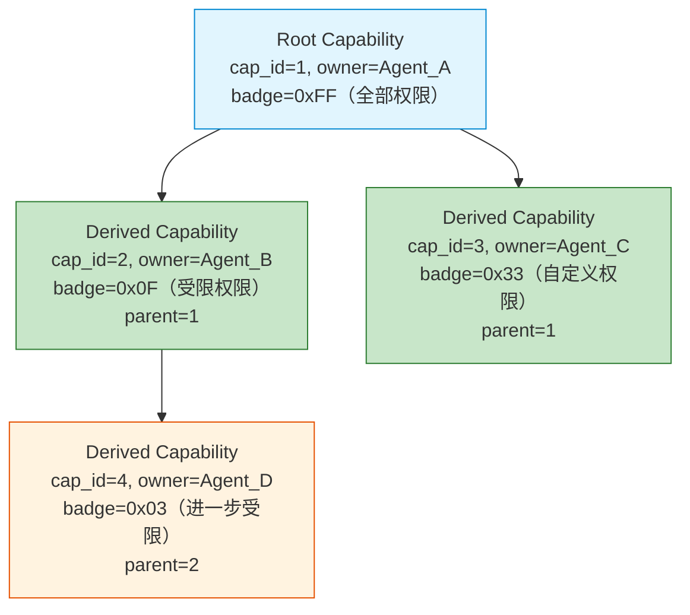
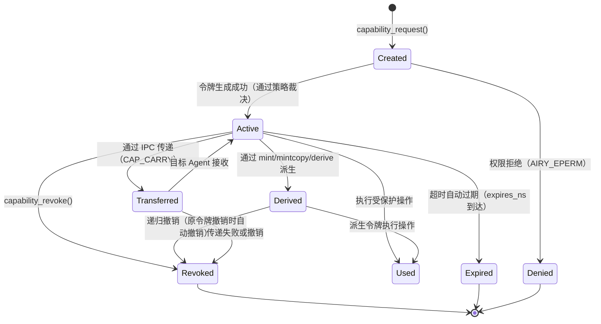
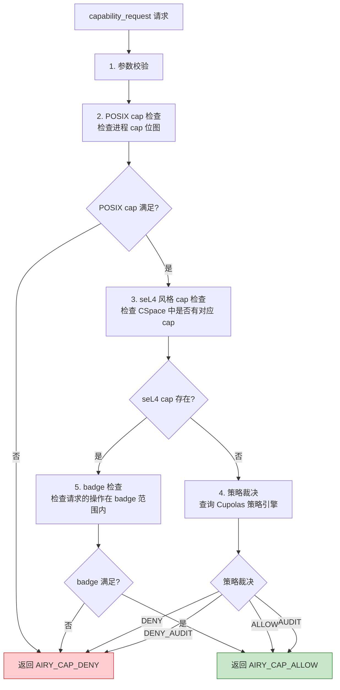
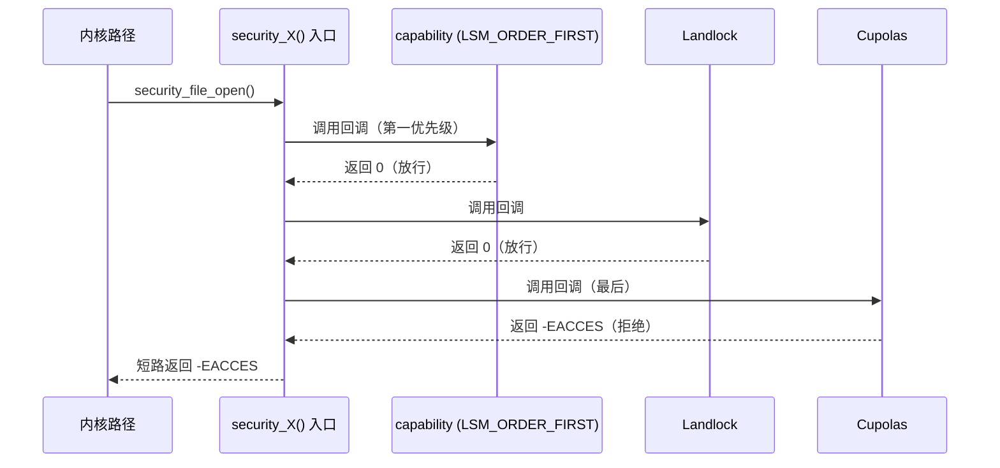

Copyright (c) 2025-2026 SPHARX Ltd. All Rights Reserved.

# seL4 风格 Capability 安全模型
> **文档定位**：agentrt-linux（AirymaxOS）Capability 安全模型的完整工程契约，定义 CNode/MDB 数据模型、派生算法、POSIX capability 集成、令牌生命周期、Cupolas blob 布局、策略裁决与 Vault backend 抽象\
> **文档版本**：0.1.1\
> **最后更新**：2026-07-09\
> **上级文档**：[agentrt-linux 设计文档](README.md)\
> **同源映射**：seL4 `src/object/cnode.c`（CNode 操作）+ `src/object/cnode.c:cteRevoke`（递归撤销）+ Linux 6.6 `security/commoncap.c`（POSIX capability）+ agentrt Cupolas 权限模型\
> **文档性质**：实现方案文档（非设计文档）。本契约在 [01-lsm-framework.md](01-lsm-framework.md) 第 7 章 LSM 与 capability 共存的基础上，补充完整的 capability 数据模型、派生算法、生命周期与接口定义\
> **设计参考**：seL4 `src/object/cnode.c`（CNode mint/mintcopy/move/copy/revoke/delete）+ seL4 `src/kernel/mdb.c`（MDB 派生链）+ 主流 Linux 发行版 Linux 6.6 内核基线 `security/commoncap.c`（POSIX cap 检查）+ `include/linux/cred.h`（credential 结构）

---

## 1. 概述

### 1.1 为什么选择 seL4 风格

agentrt-linux 选择 seL4 风格的 capability 安全模型，而非传统 ACL（访问控制列表）或纯 POSIX capability，原因在于：

| 维度 | ACL | POSIX capability | seL4 capability | agentrt-linux 选择 |
|------|-----|-----------------|-----------------|-------------------|
| 权限传递 | 通过组/用户 | 进程位图 | 不可伪造令牌传递 | seL4（Agent 间传递） |
| 权限撤销 | 困难（需遍历 ACL） | 不支持运行时撤销 | 递归级联撤销 | seL4（Agent 终止时） |
| 权限粒度 | 对象级 | 41 个粗粒度 cap | 对象 + 权限掩码 | seL4 + POSIX 混合 |
| 最小权限 | 难以实现 | 进程级 | 令牌级 | seL4（每个操作独立令牌） |
| 形式化验证 | 无 | 无 | 有（seL4 已验证） | seL4（参考验证方法） |

### 1.2 混合模型设计

agentrt-linux 采用 **seL4 风格 + POSIX 混合** capability 模型：

- **seL4 风格**：用于 Agent 间的细粒度权限传递与撤销（令牌级、不可伪造、递归撤销）
- **POSIX capability**：用于传统 Linux 兼容性（41 个标准 cap，进程级位图）
- **LSM 桥接**：capability 作为 `LSM_ORDER_FIRST` 第一个 LSM，与 Landlock/Cupolas 共存

### 1.3 设计目标

1. **不可伪造**：capability 令牌由内核生成，用户态只持有 opaque handle，无法伪造
2. **最小权限**：每个安全敏感操作需独立申请 capability 令牌，而非进程级全权
3. **递归撤销**：Agent 终止时递归撤销所有派生 capability，无权限残留
4. **IPC 传递**：capability 可通过 IPC 消息跨进程传递（`AIRY_IPC_F_CAP_CARRY`）
5. **审计追踪**：所有 capability 操作（申请/派生/撤销/传递）可审计

### 1.4 在安全体系中的位置

对齐 [README.md](README.md) 第 1.1 节安全体系分层，capability 位于 L3 层：

| 层级 | 类型 | 机制 | 与 capability 的关系 |
|------|------|------|---------------------|
| L1 | LSM 框架 | `security_hook_heads` | capability 注册为 LSM |
| L2 | Landlock | 用户态沙箱 | capability 之后执行 |
| **L3** | **capability** | **seL4 风格 + POSIX** | **LSM_ORDER_FIRST，永远第一** |
| L4 | 模块签名 | eBPF 签名 | 独立于 capability |
| L7 | Cupolas | Agent 行为约束 | 基于 capability 构建 |

---

## 2. Capability 数据模型

### 2.1 CNode（Capability Node）结构

借鉴 seL4 `src/object/cnode.c` 的 CNode 设计，agentrt-linux 的 capability 存储在 CNode 表中：

```c
/**
 * struct airy_cnode - Capability Node（单个 capability 槽位）
 *
 * @cap_type:    capability 类型（AIRY_CAP_TYPE_*）
 * @cap_id:      capability 唯一 ID（内核分配，不可伪造）
 * @badge:       权限掩码（位图，标识具体权限）
 * @owner_agent:  持有此 capability 的 Agent ID
 * @parent:      父 capability ID（派生链，MDB）
 * @children:     子 capability 列表头（MDB 派生链）
 * @state:       capability 状态（ACTIVE/REVOKED/EXPIRED）
 * @refcount:    引用计数
 * @expires_ns:  过期时间戳（0 = 永不过期）
 *
 * 借鉴 seL4 cte_t（capability table entry）设计。
 * CNode 表是 Agent 的 capability 空间（CSpace），类似 seL4 CSpace。
 */
struct airy_cnode {
    uint8_t  cap_type;
    uint32_t cap_id;
    uint64_t badge;
    uint32_t owner_agent;
    uint32_t parent;
    struct list_head children;      /* MDB 派生链 */
    struct list_head sibling;      /* 兄弟节点 */
    uint8_t  state;
    atomic_t refcount;
    uint64_t expires_ns;
} __attribute__((aligned(64)));
```

### 2.2 Capability 类型枚举

```c
/**
 * enum airy_cap_type - capability 类型
 *
 * 对齐 security_types.h [SC] 共享头文件中的类型定义。
 */
enum airy_cap_type {
    AIRY_CAP_TYPE_ENDPOINT    = 0,   /* IPC 端点 capability */
    AIRY_CAP_TYPE_TASK        = 1,   /* Agent 任务 capability */
    AIRY_CAP_TYPE_MEMORY      = 2,   /* 内存访问 capability */
    AIRY_CAP_TYPE_ROVOL       = 3,   /* 记忆卷载 capability */
    AIRY_CAP_TYPE_SCHED       = 4,   /* 调度 capability */
    AIRY_CAP_TYPE_FILE        = 5,   /* 文件系统 capability */
    AIRY_CAP_TYPE_NETWORK     = 6,   /* 网络访问 capability */
    AIRY_CAP_TYPE_WASM        = 7,   /* Wasm 模块 capability */
    AIRY_CAP_TYPE_CAP_MGMT    = 8,   /* capability 管理 capability（元 capability） */
    AIRY_CAP_TYPE_MAX,
};
```

### 2.3 MDB（Mask Domain Database）派生链

借鉴 seL4 `src/kernel/mdb.c`，capability 的派生关系通过 MDB 维护：



**MDB 派生链规则**：
1. 每个派生 capability 记录 `parent` 指向源 capability
2. 父 capability 维护 `children` 链表，记录所有直接派生
3. 撤销父 capability 时，递归遍历 `children` 链表撤销所有派生
4. 派生 capability 的 `badge` 必须 ≤ 父 capability 的 `badge`（权限只减不增）

### 2.4 CSpace（Capability Space）

每个 Agent 拥有独立的 CSpace（capability 空间），是 CNode 的集合：

```c
/**
 * struct airy_cspace - Agent 的 Capability Space
 *
 * @agent_id:     所属 Agent ID
 * @slots:        CNode 槽位数组（radix tree）
 * @root_cap:     根 capability ID
 * @total_caps:   当前活跃 capability 数
 * @max_caps:     最大 capability 数（默认 1024）
 *
 * 借鉴 seL4 CSpace 的树状组织结构。
 */
struct airy_cspace {
    uint32_t agent_id;
    struct radix_tree_root slots;   /* cap_id → cnode 映射 */
    uint32_t root_cap;
    atomic_t total_caps;
    uint32_t max_caps;
};
```

---

## 3. Capability 派生模型

### 3.1 四种派生操作

对齐 `security_types.h`（[SC] 共享头文件）定义的 capability 派生模型：

| 操作 | 语义 | badge 变化 | 适用场景 |
|------|------|-----------|---------|
| **mint** | 缩减权限派生（不复制，原 cap 保留） | 子 badge = 父 badge & mask | 将全权 cap 缩减为只读 cap |
| **mintcopy** | 复制 + 缩减（生成新 cap，原 cap 保留） | 子 badge = 父 badge & mask | 传递受限 cap 给其他 Agent |
| **derive** | 派生（不缩减，全权继承） | 子 badge = 父 badge | 将 cap 委托给子任务 |
| **revoke** | 递归撤销（撤销所有派生） | 子 cap 全部失效 | Agent 终止时清理 |

### 3.2 Mint 操作（缩减权限派生）

```c
/**
 * airy_cap_mint - 缩减权限派生 capability
 * @src_cap:   源 capability ID
 * @mask:      权限掩码（缩减后 badge = src.badge & mask）
 * @new_cap_out: 新 capability ID 输出
 *
 * 返回: 0 成功，-AIRY_EINVAL 源 cap 无效，
 *       -AIRY_EPERM 调用者不拥有源 cap，-AIRY_ENOMEM 分配失败
 *
 * 借鉴 seL4 cnode.c 的 mint 操作。
 * 源 capability 保留不变，生成新的派生 capability。
 */
int airy_cap_mint(uint32_t src_cap, uint64_t mask, uint32_t *new_cap_out);
```

### 3.3 MintCopy 操作（复制 + 缩减）

```c
/**
 * airy_cap_mintcopy - 复制 + 缩减权限
 * @src_cap:    源 capability ID
 * @dest_agent: 目标 Agent ID
 * @mask:       权限掩码
 * @new_cap_out: 新 capability ID 输出
 *
 * 返回: 0 成功，<0 AIRY_E* 错误码
 *
 * 借鉴 seL4 cnode.c 的 mintcopy 操作。
 * 与 mint 的区别：mintcopy 将新 cap 分配到指定目标 Agent 的 CSpace。
 * 用于 Agent 间传递受限 capability。
 */
int airy_cap_mintcopy(uint32_t src_cap, uint32_t dest_agent,
                         uint64_t mask, uint32_t *new_cap_out);
```

### 3.4 Derive 操作（全权派生）

```c
/**
 * airy_cap_derive - 全权派生 capability
 * @src_cap:    源 capability ID
 * @dest_agent: 目标 Agent ID
 * @new_cap_out: 新 capability ID 输出
 *
 * 返回: 0 成功，<0 AIRY_E* 错误码
 *
 * 与 mintcopy 的区别：derive 不缩减权限（badge 全继承）。
 * 用于委托全权给受信任的子任务。
 */
int airy_cap_derive(uint32_t src_cap, uint32_t dest_agent,
                      uint32_t *new_cap_out);
```

### 3.5 Revoke 操作（递归级联撤销）

借鉴 seL4 `cteRevoke()` 的递归级联撤销算法，对齐 [01-agent-lifecycle.md](../140-application-development/01-agent-lifecycle.md) 第 5.2 节：

```c
/**
 * airy_cap_revoke - 递归撤销所有派生 capability
 * @src_cap: 源 capability ID
 *
 * 返回: 0 成功，-AIRY_EINVAL 源 cap 无效
 *
 * 借鉴 seL4 cnode.c:528-550 的 cteRevoke 算法。
 *
 * 递归撤销算法（MDB 链表遍历 + preemptionPoint）:
 *   while (还有派生 capability) {
 *       cap = 获取下一个派生 capability;
 *       if (cap 是 Endpoint 类型) {
 *           取消 badge 上所有待发消息;
 *       }
 *       cap_delete(cap);          // 标记 Zombie 或直接删除
 *       preemption_point();        // 允许调度器干预
 *       if (错误 != SUCCESS) return 错误;
 *   }
 *
 * @since 1.0.1
 */
int airy_cap_revoke(uint32_t src_cap);
```

**preemptionPoint 设计**：借鉴 seL4 的抢占点模式，长时间撤销操作分块可抢占。每撤销 N 个 capability（默认 N=64）插入一次抢占点，允许调度器响应更高优先级任务。

---

## 4. POSIX Capability 集成

### 4.1 41 ID 枚举

对齐 `security_types.h`（[SC] 共享头文件）定义的 POSIX capability 41 ID 枚举。agentrt-linux 在 Linux 6.6 标准 41 个 POSIX capability（编号 0-40，CAP_LAST_CAP=CAP_CHECKPOINT_RESTORE=40，无废弃）基础上，新增 Airymax 专属 capability（编号 41-43）：

```c
/**
 * POSIX capability ID 枚举（41 个 + 3 个 Airymax 专属 = 44）
 * 对齐 Linux 6.6 include/uapi/linux/capability.h
 * 无废弃项，CAP_LAST_CAP = CAP_CHECKPOINT_RESTORE = 40
 */
#define AIRY_CAP_CHOWN              0   /* 修改文件所有者 */
#define AIRY_CAP_DAC_OVERRIDE       1   /* 绕过 DAC 读/写/执行检查 */
#define AIRY_CAP_DAC_READ_SEARCH    2   /* 绕过 DAC 读/搜索 */
#define AIRY_CAP_FOWNER             3   /* 绕过文件权限检查 */
#define AIRY_CAP_FSETID            4   /* 设置 setuid/setgid */
#define AIRY_CAP_KILL               5   /* 绕过发送信号权限检查 */
#define AIRY_CAP_SETGID            6   /* 设置 GID */
#define AIRY_CAP_SETUID            7   /* 设置 UID */
#define AIRY_CAP_SETPCAP           8   /* 设置进程 capability */
#define AIRY_CAP_LINUX_IMMUTABLE    9   /* 设置不可变文件 */
#define AIRY_CAP_NET_BIND_SERVICE  10  /* 绑定 <1024 端口 */
#define AIRY_CAP_NET_BROADCAST     11  /* 广播/监听 */
#define AIRY_CAP_NET_ADMIN         12  /* 网络管理 */
#define AIRY_CAP_NET_RAW           13  /* 原始 socket */
/* ... 完整 41 个枚举对齐 security_types.h（含 CAP_PERFMON=38/CAP_BPF=39/CAP_CHECKPOINT_RESTORE=40）... */
#define AIRY_CAP_LAST_CAP          40  /* 最后一个 Linux 标准 cap（CAP_CHECKPOINT_RESTORE）*/
#define AIRY_CAP_AGENT_SPAWN       41  /* Agent 生成（Airymax 专属，从 41 开始避免与 Linux 0-40 冲突）*/
#define AIRY_CAP_GPU_SCHED         42  /* GPU 调度 */
#define AIRY_CAP_NPU_ACCESS        43  /* NPU 访问 */
#define AIRY_CAP_AGENT_MAX         44  /* agentrt-linux 专属上限（41 Linux + 3 Airymax）*/
```

### 4.2 与传统 POSIX cap 的映射

| 场景 | POSIX capability | seL4 风格 capability | 映射关系 |
|------|-----------------|---------------------|---------|
| 传统 Linux 程序 | `cap_setuid` 进程级位图 | 不适用（POSIX 路径） | 直接使用 POSIX |
| Agent 间传递 | 不适用 | `cap_id` 令牌级传递 | IPC + cap_mintcopy |
| Agent 终止 | 不适用 | `cap_revoke` 递归撤销 | 生命周期清理 |
| 文件访问 | `cap_dac_override` | `cap_id` + badge | 两者共存（LSM 链） |

### 4.3 混合检查流程

```c
/**
 * airy_cap_check - 混合 capability 检查
 * @agent_id: Agent ID
 * @cap_id:   seL4 风格 capability ID（0 = 仅检查 POSIX）
 * @posix_cap: POSIX capability 编号（0 = 仅检查 seL4 风格）
 * @resource: 资源路径（可选，用于审计）
 *
 * 返回: 0 允许，-AIRY_EPERM 拒绝
 *
 * 检查流程:
 *   1. 若 cap_id > 0，检查 seL4 风格 capability 令牌
 *   2. 若 posix_cap >= 0，检查 POSIX capability 位图
 *   3. 两者都通过才允许
 */
int airy_cap_check(uint32_t agent_id, uint32_t cap_id,
                     int posix_cap, const char *resource);
```

---

## 5. Capability 令牌生命周期

### 5.1 令牌状态机

对齐 [contracts.md](../50-engineering-standards/20-contracts/contracts.md) 第 6.2 节的 capability 令牌生命周期状态机：



### 5.2 状态枚举

```c
enum airy_cap_state {
    AIRY_CAP_STATE_CREATED     = 0,  /* 已创建，待激活 */
    AIRY_CAP_STATE_ACTIVE       = 1,  /* 活跃，可使用 */
    AIRY_CAP_STATE_DERIVED      = 2,  /* 已派生 */
    AIRY_CAP_STATE_USED         = 3,  /* 使用中 */
    AIRY_CAP_STATE_TRANSFERRED  = 4,  /* 传递中 */
    AIRY_CAP_STATE_REVOKED      = 5,  /* 已撤销 */
    AIRY_CAP_STATE_EXPIRED      = 6,  /* 已过期 */
    AIRY_CAP_STATE_DENIED       = 7,  /* 被拒绝 */
};
```

### 5.3 状态转换条件

| 从状态 | 到状态 | 触发条件 | 系统调用 |
|--------|--------|---------|---------|
| — | CREATED | `capability_request()` 成功 | 592 |
| CREATED | ACTIVE | 策略裁决 ALLOW | 内部 |
| CREATED | DENIED | 策略裁决 DENY | 内部 |
| ACTIVE | DERIVED | `cap_mint/mintcopy/derive` | 595/596/597 |
| ACTIVE | TRANSFERRED | IPC `CAP_CARRY` 标志 | 600 |
| ACTIVE/DERIVED | REVOKED | `capability_revoke()` | 593 |
| ACTIVE | EXPIRED | `expires_ns` 到达 | 内核定时器 |

---

## 6. Cupolas Blob 布局

### 6.1 扁平 Blob + 偏移访问模式

对齐 [01-lsm-framework.md](01-lsm-framework.md) 第 8 章的 Cupolas blob 设计，capability 在四类内核对象上附加 blob：

```c
/**
 * Cupolas blob 尺寸定义
 * 对齐 security_types.h [SC] 共享头文件
 */
struct lsm_blob_sizes cupolas_blob_sizes __ro_after_init = {
    .lbs_cred  = sizeof(struct cupolas_cred_blob),
    .lbs_inode = sizeof(struct cupolas_inode_blob),
    .lbs_file  = sizeof(struct cupolas_file_blob),
    .lbs_task  = sizeof(struct cupolas_task_blob),
};
```

### 6.2 四类 Blob 结构

```c
/**
 * struct cupolas_cred_blob - credential 上的 capability blob
 * @cap_set:   Agent 拥有的 capability 集合（位图）
 * @cspace:   指向 Agent CSpace 的指针
 * @audit_seq: 审计序列号
 */
struct cupolas_cred_blob {
    uint64_t cap_set[2];           /* 128 位位图，支持 128 个 cap */
    struct airy_cspace *cspace;
    uint64_t audit_seq;
};

/**
 * struct cupolas_inode_blob - inode 上的 capability blob
 * @required_cap: 访问此 inode 所需的 capability 类型
 * @policy_hash: 策略哈希（用于快速匹配）
 */
struct cupolas_inode_blob {
    uint8_t  required_cap;
    uint32_t policy_hash;
};

/**
 * struct cupolas_file_blob - file 上的 capability blob
 * @granted_cap: 打开文件时授予的 capability ID
 * @access_mask: 访问掩码（读/写/执行）
 */
struct cupolas_file_blob {
    uint32_t granted_cap;
    uint8_t  access_mask;
};

/**
 * struct cupolas_task_blob - task 上的 capability blob
 * @agent_id:    Agent ID
 * @budget_cap:  Token 预算 capability ID
 * @suspend_flags: 挂起标志
 */
struct cupolas_task_blob {
    uint32_t agent_id;
    uint32_t budget_cap;
    uint32_t suspend_flags;
};
```

### 6.3 Blob 访问内联函数

```c
/* 扁平 blob + 偏移访问内联函数（借鉴 Landlock 模式） */
static inline struct cupolas_cred_blob *cupolas_cred(const struct cred *cred)
{
    return (struct cupolas_cred_blob *)(cred->security + cupolas_blob_sizes.offsets.lbs_cred);
}

static inline struct cupolas_inode_blob *cupolas_inode(const struct inode *inode)
{
    return (struct cupolas_inode_blob *)(inode->i_security + cupolas_blob_sizes.offsets.lbs_inode);
}

static inline struct cupolas_file_blob *cupolas_file(const struct file *file)
{
    return (struct cupolas_file_blob *)(file->f_security + cupolas_blob_sizes.offsets.lbs_file);
}

static inline struct cupolas_task_blob *cupolas_task(const struct task_struct *task)
{
    return (struct cupolas_task_blob *)(task->security + cupolas_blob_sizes.offsets.lbs_task);
}
```

---

## 7. 策略裁决模型

### 7.1 四值裁决枚举

对齐 `security_types.h`（[SC] 共享头文件）定义的策略裁决结果 4 值枚举：

```c
/**
 * enum airy_cap_verdict - capability 策略裁决结果
 *
 * 4 值裁决模型对齐 SELinux 的 allow/deny/audit/deny_audit 语义。
 */
enum airy_cap_verdict {
    AIRY_CAP_ALLOW         = 0,  /* 允许，不记录 */
    AIRY_CAP_DENY          = 1,  /* 拒绝，不记录 */
    AIRY_CAP_AUDIT         = 2,  /* 允许，记录审计日志 */
    AIRY_CAP_DENY_AUDIT    = 3,  /* 拒绝，记录审计日志 */
};
```

### 7.2 裁决流程



### 7.3 裁决实现

```c
/**
 * airy_cap_adjudicate - 策略裁决
 * @agent_id:  Agent ID
 * @cap_type:  capability 类型
 * @resource:  资源路径
 * @operation: 请求的操作
 *
 * 返回: AIRY_CAP_* 裁决结果
 *
 * 裁决顺序:
 *   1. POSIX cap 检查（快速路径）
 *   2. seL4 风格 cap 检查（令牌检查）
 *   3. Cupolas 策略引擎（慢速路径）
 */
enum airy_cap_verdict airy_cap_adjudicate(
    uint32_t agent_id,
    enum airy_cap_type cap_type,
    const char *resource,
    uint32_t operation);
```

---

## 8. Vault Backend 抽象

### 8.1 后端存储抽象

对齐 `security_types.h`（[SC] 共享头文件）定义的 Vault backend 抽象，capability 的持久化存储通过后端抽象层访问：

```c
/**
 * struct airy_vault_backend - Vault 后端抽象
 *
 * @name:         后端名称
 * @store:        存储 capability
 * @retrieve:      检索 capability
 * @delete:        删除 capability
 * @list:          列出 capability
 * @seal:         封存（加密 + TPM 度量）
 * @unseal:       解封
 *
 * 借鉴 Linux keyring 的 key_type 抽象模式。
 * 支持多种后端：内存/TPM/机密计算。
 */
struct airy_vault_backend {
    const char *name;
    int  (*store)(uint32_t cap_id, const void *data, size_t len);
    int  (*retrieve)(uint32_t cap_id, void *buf, size_t *len);
    int  (*delete)(uint32_t cap_id);
    int  (*list)(uint32_t agent_id, uint32_t *cap_ids, uint32_t *count);
    int  (*seal)(uint32_t cap_id, const uint8_t *kek, size_t kek_len);
    int  (*unseal)(uint32_t cap_id, const uint8_t *kek, size_t kek_len);
};
```

### 8.2 后端实现

| 后端 | 用途 | 安全级别 | 实现状态 |
|------|------|---------|---------|
| `vault_memory` | 内存存储（默认） | 低 | 0.1.1 |
| `vault_tpm` | TPM 2.0 封存 | 高 | 1.0.1 |
| `vault_cvm` | 机密计算（VirtCCA） | 最高 | 2.0+ |

### 8.3 TPM 封存流程

```c
/**
 * airy_vault_seal_tpm - 使用 TPM 封存 capability
 * @cap_id:    capability ID
 * @tpm_handle: TPM 密钥句柄
 *
 * 封存流程:
 *   1. 生成对称密钥（AES-256）
 *   2. 加密 capability 数据
 *   3. 用 TPM 密钥加密对称密钥（封存）
 *   4. 度量 capability 哈希到 TPM PCR
 *   5. 存储加密数据
 *
 * @since 1.0.1
 */
int airy_vault_seal_tpm(uint32_t cap_id, uint32_t tpm_handle);
```

---

## 9. 系统调用集成

### 9.1 Capability 系统调用总览

对齐 [07-syscall-registry.md](../140-application-development/07-syscall-registry.md) 第 3.5 节，capability 相关系统调用编号 592-611：

| 编号 | 系统调用 | 功能 | 对应操作 |
|------|---------|------|---------|
| 592 | `airy_sys_capability_request` | 申请 capability 令牌 | 创建 → ACTIVE |
| 593 | `airy_sys_capability_revoke` | 撤销 capability | 递归撤销 |
| 594 | `airy_sys_lsm_load_policy` | 加载策略 | 策略引擎 |
| 595 | `airy_sys_capability_derive` | 全权派生 | derive |
| 596 | `airy_sys_capability_mint` | 缩减派生 | mint |
| 597 | `airy_sys_capability_mintcopy` | 复制+缩减 | mintcopy |
| 598 | `airy_sys_capability_inspect` | 检查权限 | 查询 |
| 599 | `airy_sys_lsm_audit_query` | 查询审计日志 | 审计 |
| 600 | `airy_sys_capability_transfer` | IPC 传递 | transfer |

### 9.2 核心 C 接口

```c
/**
 * airy_sys_capability_request - 申请 capability 令牌
 * @capability: 权限名称（如 "file.read"、"ipc.send"）
 * @resource:   资源路径（如 "/etc/agentrt/config.yaml"）
 *
 * 返回: >0 capability ID（成功），<0 AIRY_E* 错误码
 *       -AIRY_EPERM 权限拒绝
 *
 * capability 令牌由内核生成、不可伪造（seL4 风格）。
 * 通过 IPC 消息可跨进程传递（AIRY_IPC_F_CAP_CARRY 标志）。
 *
 * @since 1.0.1
 * @see 07-syscall-registry.md 第 3.5 节
 */
AIRY_API int airy_sys_capability_request(const char *capability,
                                              const char *resource);

/**
 * airy_sys_capability_revoke - 递归撤销 capability
 * @cap_slot: capability 句柄（ID）
 *
 * 返回: 0 成功，-AIRY_EINVAL 句柄无效
 *
 * 借鉴 seL4 cteRevoke 算法，递归撤销所有派生 capability。
 *
 * @since 1.0.1
 */
AIRY_API int airy_sys_capability_revoke(uint32_t cap_slot);

/**
 * airy_sys_capability_mintcopy - 复制 + 缩减权限
 * @src_cap:     源 capability ID
 * @dest_agent:  目标 Agent ID
 * @mask:        权限掩码
 * @new_cap_out: 新 capability ID 输出
 *
 * 返回: 0 成功，<0 AIRY_E* 错误码
 *
 * @since 1.0.1
 */
AIRY_API int airy_sys_capability_mintcopy(
    uint32_t src_cap, uint32_t dest_agent,
    uint64_t mask, uint32_t *new_cap_out);

/**
 * airy_sys_capability_transfer - 通过 IPC 传递 capability
 * @cap_id:     capability ID
 * @target_ep:  目标 IPC 端点
 * @flags:      传递标志（AIRY_CAP_TRANSFER_*）
 *
 * 返回: 0 成功，<0 AIRY_E* 错误码
 *
 * capability 通过 IPC 消息的 CAP_CARRY 标志传递。
 * 目标 Agent 接收后获得派生 capability。
 *
 * @since 1.0.1
 */
AIRY_API int airy_sys_capability_transfer(
    uint32_t cap_id, uint32_t target_ep, uint32_t flags);
```

---

## 10. LSM 集成

### 10.1 LSM_ORDER_FIRST 注册

对齐 [01-lsm-framework.md](01-lsm-framework.md) 第 7 章，capability 作为 `LSM_ORDER_FIRST` 永远第一个执行：

```c
/* security/commoncap.c（借鉴 Linux 6.6 实现）*/
static struct lsm_id capability_lsmid __lsm_ro_after_init = {
    .lsm  = "capability",
    .slot = LSMBLOB_NOT_NEEDED,
};

DEFINE_LSM(capability) = {
    .name       = "capability",
    .order      = LSM_ORDER_FIRST,  /* 永远第一 */
    .blobs      = &cupolas_blob_sizes,
    .init       = capability_init,
    .lsmid      = &capability_lsmid,
};
```

### 10.2 与 Landlock/Cupolas 共存



**短路评估**：任一 LSM 钩子返回非零即终止链路，对齐 [01-lsm-framework.md](01-lsm-framework.md) 第 4 章 `call_int_hook` 短路评估模式。capability 作为第一优先级，快速放行无 capability 需求的操作。

### 10.3 LSM 钩子注册

```c
/* capability LSM 钩子注册（借鉴 lsm_hook_defs.h X-Macro 模式）*/
static struct security_hook_list capability_hooks[] __lsm_ro_after_init = {
    LSM_HOOK_INIT(capable,           airy_cap_capable),
    LSM_HOOK_INIT(inode_permission,  airy_cap_inode_perm),
    LSM_HOOK_INIT(file_open,         airy_cap_file_open),
    LSM_HOOK_INIT(task_create,       airy_cap_task_create),
    LSM_HOOK_INIT(cred_prepare,      airy_cap_cred_prepare),
    LSM_HOOK_INIT(cred_free,         airy_cap_cred_free),
};
```

---

## 11. Capability 守卫流程

### 11.1 安全敏感系统调用守卫

所有安全敏感系统调用统一走 capability 守卫流程，对齐 [30-interfaces/01-syscalls.md](../30-interfaces/01-syscalls.md) 第 1.2 节：

```c
/**
 * capability 守卫宏
 * 用于安全敏感系统调用入口处
 */
#define AIRY_CAP_GUARD(cap_name, resource) ({            \
    int __cap = airy_sys_capability_request(             \
        (cap_name), (resource));                            \
    if (__cap < 0) {                                        \
        log_write(LOG_ERROR, "capability denied: %d", __cap); \
        return -AIRY_EPERM;                              \
    }                                                       \
    __cap;                                                  \
})

#define AIRY_CAP_GUARD_END(cap_slot)  \
    airy_sys_capability_revoke(cap_slot)
```

### 11.2 守卫使用示例

```c
/* 安全敏感系统调用：IPC 发送 */
int airy_sys_ipc_send(const struct airy_ipc_msg_hdr *hdr,
                         const void *payload)
{
    /* 1. capability 守卫 */
    int cap = AIRY_CAP_GUARD("ipc.send", NULL);

    /* 2. 执行受保护操作 */
    int ret = __do_ipc_send(hdr, payload);
    if (ret < 0)
        log_write(LOG_ERROR, "ipc_send failed: %d", ret);

    /* 3. 撤销令牌 */
    AIRY_CAP_GUARD_END(cap);
    return ret;
}
```

### 11.3 IPC 传递 capability

capability 可通过 IPC 消息的 `AIRY_IPC_F_CAP_CARRY` 标志跨进程传递：

```c
/* 发送方：携带 capability */
struct airy_ipc_msg_hdr hdr = {
    .magic   = AIRY_IPC_MAGIC,
    .flags   = AIRY_IPC_F_CAP_CARRY,
    .cap_id  = my_cap_id,  /* 携带的 capability */
    /* ... */
};
airy_sys_ipc_send(&hdr, payload);

/* 接收方：获取派生 capability */
struct airy_ipc_msg_hdr recv_hdr;
airy_sys_ipc_recv(&recv_hdr, buf, len);
if (recv_hdr.flags & AIRY_IPC_F_CAP_CARRY) {
    /* 获得派生 capability（自动 mintcopy） */
    uint32_t new_cap = recv_hdr.cap_id;
    /* 使用派生 capability 执行操作 */
}
```

---

## 12. IRON-9 v2 同源映射

### 12.1 [SC] 层共享

`security_types.h` 是 agentrt 与 agentrt-linux 的 [SC] 共享头文件，包含：

| 共享内容 | 影响 |
|---------|------|
| POSIX capability 41 ID 枚举 | 编号一致 |
| LSM 钩子 252 ID 枚举 | 钩子编号一致 |
| Cupolas blob 布局（cred/inode/file/task） | 结构体一致 |
| capability 派生模型（mint/mintcopy/derive/revoke） | 算法语义一致 |
| Vault backend 抽象 | 接口一致 |
| 策略裁决 4 值枚举 | 裁决语义一致 |

### 12.2 [SS] 层语义同源

| 维度 | agentrt 用户态 | agentrt-linux OS 层 | 同源语义 |
|------|---------------|-------------------|---------|
| 权限模型 | Cupolas 应用权限 | seL4 风格 + POSIX | 不可伪造、最小权限 |
| 令牌生成 | 用户态 opaque handle | 内核态 cap_id | 不可伪造语义一致 |
| 撤销算法 | 应用级递归清理 | `cteRevoke` 递归撤销 | 递归级联语义一致 |
| IPC 传递 | AgentsIPC CAP_CARRY | io_uring CAP_CARRY | 标志位语义一致 |

### 12.3 [IND] 层独立

agentrt-linux 独有：
- 内核态 CNode 表（radix tree 存储）
- LSM_ORDER_FIRST 注册
- TPM Vault 封存
- 内核审计日志（SHA-256 哈希链）

---

## 13. 使用示例

### 13.1 Agent 注册时获取初始 capability

```c
/* Agent 注册时自动获得初始 capability */
struct airy_task_config cfg = {
    .capability_flags = AIRY_CAP_COGNITION | AIRY_CAP_IPC | AIRY_CAP_ROVOL,
};
uint32_t agent_id;
airy_sys_task_register(&cfg, &agent_id);

/* Agent 的 CSpace 自动创建，包含初始 capability */
```

### 13.2 Agent 间传递受限 capability

```c
/* Agent A 将 file.read capability 受限传递给 Agent B */

/* 1. Agent A 申请 capability */
int cap = airy_sys_capability_request("file.read", "/data/shared.txt");

/* 2. Agent A 通过 mintcopy 传递受限 capability */
uint32_t new_cap;
airy_sys_capability_mintcopy(cap, agent_b_id, 0x01, &new_cap);
/* 0x01 = 仅读权限（badge 缩减） */

/* 3. Agent A 通过 IPC 传递 */
struct airy_ipc_msg_hdr hdr = {
    .flags  = AIRY_IPC_F_CAP_CARRY,
    .cap_id = new_cap,
};
airy_sys_ipc_send(&hdr, NULL);

/* 4. Agent A 撤销原 capability 时，Agent B 的派生 cap 自动撤销 */
airy_sys_capability_revoke(cap);
```

### 13.3 Agent 终止时递归撤销

```c
/* Agent 终止时清理所有 capability（对齐 01-agent-lifecycle.md 第 5.2 节）*/
void agent_terminate_cleanup(uint32_t agent_id)
{
    struct cupolas_cred_blob *blob;
    struct airy_cspace *cspace;

    /* 1. 获取 Agent 的 CSpace */
    blob = cupolas_cred(current_cred());
    cspace = blob->cspace;

    /* 2. 递归撤销根 capability */
    airy_cap_revoke(cspace->root_cap);

    /* 3. 清理 CSpace */
    airy_cspace_destroy(cspace);

    log_write(LOG_INFO, "agent %u capabilities revoked", agent_id);
}
```

---

## 14. 测试策略

### 14.1 单元测试（KUnit）

| 测试项 | 测试方法 | 通过标准 |
|--------|---------|---------|
| CNode 分配 | 创建 CNode 并检查 cap_id | cap_id 唯一且 > 0 |
| Mint 缩减 | mint 后子 badge ≤ 父 badge | badge = 父 & mask |
| MintCopy 跨 Agent | mintcopy 到目标 Agent | 目标 CSpace 包含新 cap |
| Revoke 递归 | revoke 后检查所有派生 cap | 全部 REVOKED |
| 过期检查 | 设置 expires_ns 并等待 | 自动 EXPIRED |
| badge 越权 | 子 cap 请求超出 badge 的操作 | 返回 -EPERM |

### 14.2 集成测试（kselftest）

| 测试场景 | 步骤 | 预期结果 |
|---------|------|---------|
| 完整生命周期 | request→use→revoke | 状态转换正确 |
| IPC 传递 | Agent A 派生→IPC 传递→Agent B 接收 | B 获得派生 cap |
| 递归撤销 | root→derive→derive→revoke root | 全部撤销 |
| LSM 共存 | capability + Landlock + Cupolas | 短路评估正确 |
| POSIX 混合 | seL4 cap + POSIX cap 同时检查 | 两者都通过才允许 |

### 14.3 KUnit 测试示例

```c
/* KUnit 测试：递归撤销 */
static void test_cap_revoke_recursive(struct kunit *test)
{
    uint32_t root_cap, child1, child2, grandchild;

    /* 1. 创建根 capability */
    KUNIT_EXPECT_EQ(test, 0,
        airy_cap_create(AGENT_TYPE_ENDPOINT, 0xFF, &root_cap));

    /* 2. 派生两个子 capability */
    KUNIT_EXPECT_EQ(test, 0,
        airy_cap_mintcopy(root_cap, agent_b, 0x0F, &child1));
    KUNIT_EXPECT_EQ(test, 0,
        airy_cap_mintcopy(root_cap, agent_c, 0x33, &child2));

    /* 3. child1 再派生孙 capability */
    KUNIT_EXPECT_EQ(test, 0,
        airy_cap_mintcopy(child1, agent_d, 0x03, &grandchild));

    /* 4. 撤销根 capability */
    KUNIT_EXPECT_EQ(test, 0, airy_cap_revoke(root_cap));

    /* 5. 验证所有派生 capability 已撤销 */
    KUNIT_EXPECT_EQ(test, get_cap_state(child1), AIRY_CAP_STATE_REVOKED);
    KUNIT_EXPECT_EQ(test, get_cap_state(child2), AIRY_CAP_STATE_REVOKED);
    KUNIT_EXPECT_EQ(test, get_cap_state(grandchild), AIRY_CAP_STATE_REVOKED);
}
```

---

## 15. 已知问题与修复指引

### 15.1 问题 P1-CAP-01: README 文档索引未更新

**问题描述**：[README.md](README.md) 第 3.1 节记录"仅完成 README + 01 + 02"，但 03-capability-model.md 本文档已创建。

**严重程度**：P1（文档同步）

**修复指引**：更新 README.md 第 3.1 节，追加 03-capability-model.md 完成状态。

---

## 16. 相关文档

### 16.1 上游设计文档（不修改）

- [01-lsm-framework.md](01-lsm-framework.md) — LSM 框架详解（第 7 章 LSM 与 capability 共存）
- [02-landlock-sandbox.md](02-landlock-sandbox.md) — Landlock 用户态沙箱
- [50-engineering-standards/20-contracts/contracts.md](../50-engineering-standards/20-contracts/contracts.md) — 系统调用 API 契约（第 6 章 Cupolas 安全）
- [140-application-development/01-agent-lifecycle.md](../140-application-development/01-agent-lifecycle.md) — Agent 生命周期（第 5.2 节 Capability 撤销）

### 16.2 实现方案文档（本系列）

- [140-application-development/07-syscall-registry.md](../140-application-development/07-syscall-registry.md) — 系统调用编号注册表（编号 592-600）

### 16.3 关联模块

- [20-modules/03-security.md](../20-modules/03-security.md) — security 子仓设计
- [90-observability/README.md](../90-observability/README.md) — 审计日志
- [160-compatibility/01-abi-stability.md](../160-compatibility/01-abi-stability.md) — capability ABI 稳定性

---

## 17. 参考材料

### 17.1 seL4 参考

- `src/object/cnode.c` — CNode 操作（mint/mintcopy/move/copy/revoke/delete）
- `src/kernel/mdb.c` — MDB 派生链遍历
- `src/object/cnode.c:528-550` — cteRevoke 递归撤销算法
- `libsel4/include/api/types.h` — capability 类型定义
- `src/object/endpoint.c` — Endpoint capability 与 IPC

### 17.2 主流 Linux 发行版 Linux 6.6 内核基线 参考

- `security/commoncap.c` — POSIX capability 检查
- `include/linux/capability.h` — capability 结构体定义
- `include/uapi/linux/capability.h` — POSIX capability 编号
- `security/lsm_hook_defs.h` — LSM 钩子 X-Macro 定义

### 17.3 Linux 6.6 参考

- `Documentation/security/credentials.rst` — credential 文档
- `include/linux/cred.h` — `struct cred` 定义
- `include/linux/lsm_hooks.h` — LSM 钩子声明
- `security/keys/key.c` — keyring 后端抽象模式

---

## 18. 版本历史

| 版本 | 日期 | 变更 |
|------|------|------|
| 0.1.1 | 2026-07-09 | 初始版本。定义 seL4 风格 + POSIX 混合 capability 模型：CNode/CSpace 数据结构、MDB 派生链、四种派生操作（mint/mintcopy/derive/revoke）、POSIX 41 ID 枚举、令牌 7 状态生命周期、Cupolas blob 四类布局（cred/inode/file/task）、4 值策略裁决（ALLOW/DENY/AUDIT/DENY_AUDIT）、Vault backend 抽象（memory/TPM/CVM）、系统调用集成（592-600）、LSM_ORDER_FIRST 集成、capability 守卫流程、IPC 传递、KUnit 测试 |
| 1.0.1 | 2027-XX-XX | 内核实现完成，TPM Vault 封存落地，形式化验证探索 |

---

Copyright (c) 2025-2026 SPHARX Ltd. All Rights Reserved.
