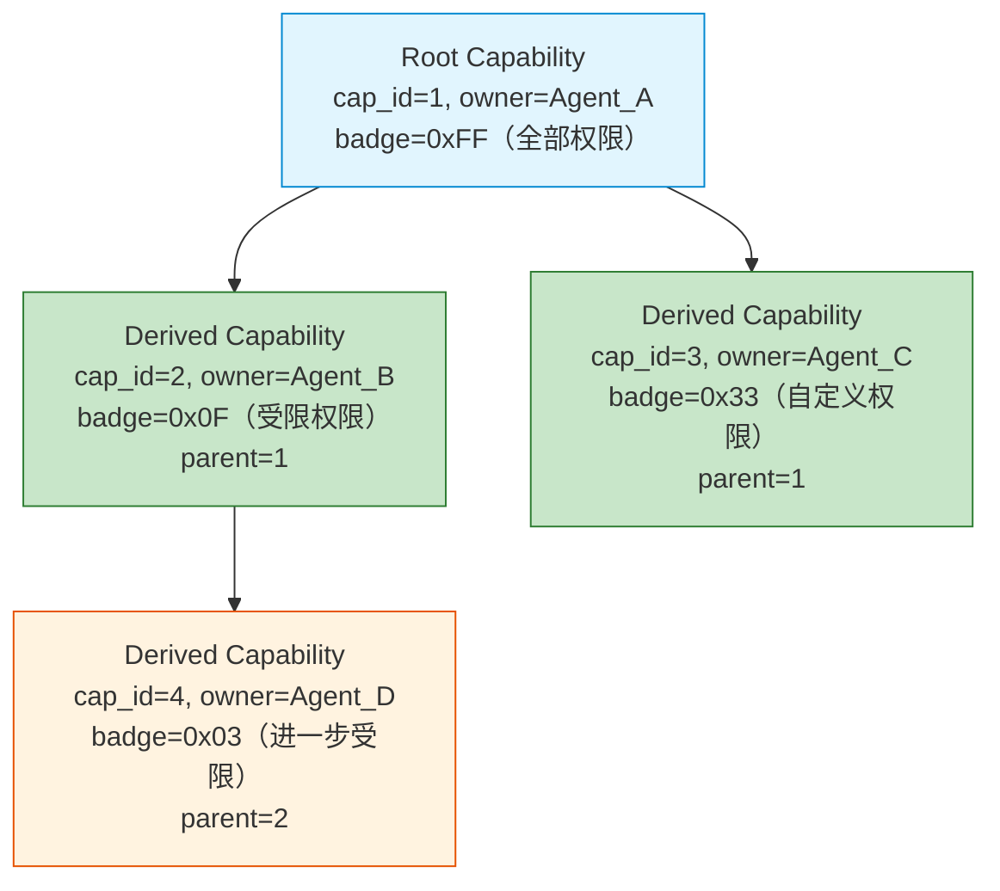
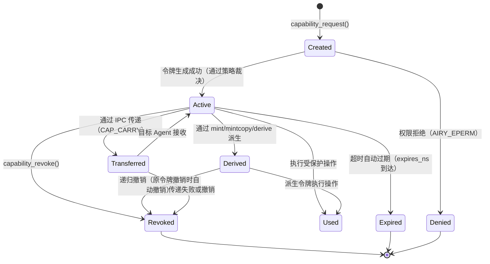
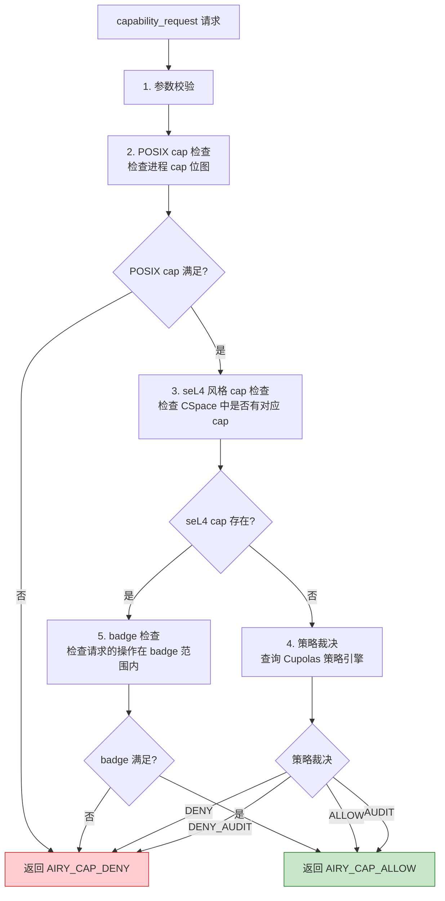
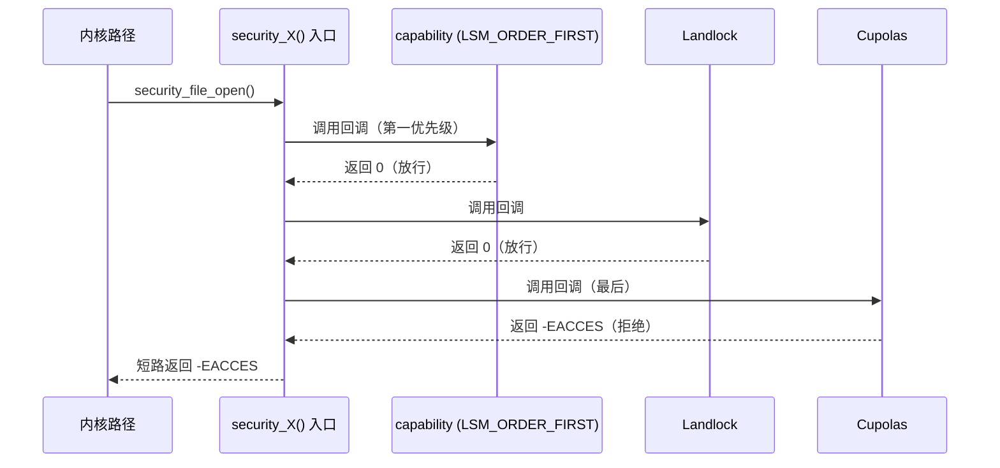

Copyright (c) 2025-2026 SPHARX Ltd. All Rights Reserved.

# seL4 风格 Capability 安全模型
> **文档定位**：agentrt-linux（AirymaxOS）Capability 安全模型的完整工程契约，定义 CNode/MDB 数据模型、派生算法、POSIX capability 集成、令牌生命周期、Cupolas blob 布局、策略裁决与 Vault backend 抽象；并落地 A-IPC Capability Folding 单平面架构下的 Badge 64-bit Native Word 模型与 fastpath C-S9 内联校验\
> **文档版本**：v1.1（Capability Folding 集成版）\
> **最后更新**：2026-07-18\
> **上级文档**：[agentrt-linux 设计文档](README.md)\
> **同源映射**：seL4 `src/object/cnode.c`（CNode 操作）+ `src/object/cnode.c:cteRevoke`（递归撤销）+ Linux 6.6 `security/commoncap.c`（POSIX capability）+ agentrt Cupolas 权限模型\
> **文档性质**：实现方案文档（非设计文档）。本契约在 [01-lsm-framework.md](01-lsm-framework.md) 第 7 章 LSM 与 capability 共存的基础上，补充完整的 capability 数据模型、派生算法、生命周期与接口定义\
> **设计参考**：seL4 `src/object/cnode.c`（CNode mint/mintcopy/move/copy/revoke/delete）+ seL4 `src/kernel/mdb.c`（MDB 派生链）+ 主流 Linux 发行版 Linux 6.6 内核基线 `security/commoncap.c`（POSIX cap 检查）+ `include/linux/cred.h`（credential 结构）

---

## SSoT 声明

> **单一权威源声明**：本文件是 **agentrt-linux Capability 安全模型** 的唯一权威源。CNode/CSpace 数据模型、MDB 派生链、POSIX 41 ID 枚举、令牌 7 状态生命周期、Cupolas blob 四类布局、4 值策略裁决、Vault backend 抽象、**Capability Folding Badge 64-bit Native Word 模型**、**fastpath C-S9 内联校验**、**`agent_caps[1024]` 静态数组** 均以本文件为唯一权威定义。其余文档只能引用本文件，禁止重新定义 capability 数据模型与 Badge 校验机制。
>
> **v1.1 Capability Folding 集成声明**（A-IPC 第一块基石）：自 v1.1 起，agentrt-linux 的 seL4 风格 capability 校验路径从"独立前置 `airy_cap_check()` + per-cpu 缓存"重构为 **fastpath C-S9 内联 Badge 校验**。物理载体是 [SC] `ipc.h` Layout C v4 消息头 offset 44-51 的 `capability_badge` 字段（64-bit Native Word：Epoch 16位 + Random Tag 32位 + Perms 16位）；执行点是 fastpath `airy_cap_badge_ok()`（~10ns，3 个 READ_ONCE + 位运算 + 比较）；存储是 `agent_caps[1024]` 内核静态数组（16KB，sec_d 唯一写者）。6 条硬约束 H1-H6 不可妥协。详见 §13 与 [10-unify-design.md §8](../10-architecture/10-unify-design.md)。

---

## 1. 概述

### 1.1 为什么选择 seL4 风格

agentrt-linux 选择 seL4 风格的 capability 安全模型，而非传统 ACL（访问控制列表）或纯 POSIX capability，原因在于：

| 维度 | ACL | POSIX capability | seL4 capability | agentrt-linux 选择 |
|------|-----|-----------------|-----------------|-------------------|
| 权限传递 | 通过组/用户 | 进程位图 | 不可伪造令牌传递 | seL4（Agent 间传递） |
| 权限撤销 | 困难（需遍历 ACL） | 不支持运行时撤销 | 递归级联撤销 | seL4（Agent 终止时） |
| 权限粒度 | 对象级 | 41 个粗粒度 cap | 对象 + 权限掩码 | seL4 + POSIX 混合 |
| 最小权限 | 难以实现 | 进程级 | 令牌级 | seL4（每个操作独立令牌） |
| 形式化验证 | 无 | 无 | 有（seL4 已验证） | seL4（参考验证方法） |

### 1.2 混合模型设计

agentrt-linux 采用 **seL4 风格 + POSIX 混合** capability 模型：

- **seL4 风格**：用于 Agent 间的细粒度权限传递与撤销（令牌级、不可伪造、递归撤销）
- **POSIX capability**：用于传统 Linux 兼容性（41 个标准 cap，进程级位图）
- **LSM 桥接**：capability 作为 `LSM_ORDER_FIRST` 第一个 LSM，与 Landlock/Cupolas 共存

### 1.3 设计目标

1. **不可伪造**：capability 令牌由内核生成，用户态只持有 opaque handle，无法伪造
2. **最小权限**：每个安全敏感操作需独立申请 capability 令牌，而非进程级全权
3. **递归撤销**：Agent 终止时递归撤销所有派生 capability，无权限残留
4. **IPC 传递**：capability 可通过 IPC 消息跨进程传递（`AIRY_IPC_F_CAP_CARRY`）
5. **审计追踪**：所有 capability 操作（申请/派生/撤销/传递）可审计

### 1.4 在安全体系中的位置

对齐 [README.md](README.md) 第 1.1 节安全体系分层，capability 位于 L3 层：

| 层级 | 类型 | 机制 | 与 capability 的关系 |
|------|------|------|---------------------|
| L1 | LSM 框架 | `security_hook_heads` | capability 注册为 LSM |
| L2 | Landlock | 用户态沙箱 | capability 之后执行 |
| **L3** | **capability** | **seL4 风格 + POSIX** | **LSM_ORDER_FIRST，永远第一** |
| L4 | 模块签名 | eBPF 签名 | 独立于 capability |
| L7 | Cupolas | Agent 行为约束 | 基于 capability 构建 |

---

## 2. Capability 数据模型

### 2.1 CNode（Capability Node）结构

借鉴 seL4 `src/object/cnode.c` 的 CNode 设计，agentrt-linux 的 capability 存储在 CNode 表中：

```c
/**
 * struct airy_cnode - Capability Node（单个 capability 槽位）
 *
 * @cap_type:    capability 类型（AIRY_CAP_TYPE_*）
 * @cap_id:      capability 唯一 ID（内核分配，不可伪造）
 * @badge:       权限掩码（位图，标识具体权限）—— v1.1 起为 64-bit Native Word
 *               （Epoch<<48 | RandomTag<<16 | Perms），详见 §2.5
 * @randtag:     per-Agent 随机标签（32 位，sec_d 编译时生成，防伪造）
 * @owner_agent:  持有此 capability 的 Agent ID
 * @parent:      父 capability ID（派生链，MDB）
 * @children:     子 capability 列表头（MDB 派生链）
 * @state:       capability 状态（ACTIVE/REVOKED/EXPIRED）
 * @refcount:    引用计数
 * @expires_ns:  过期时间戳（0 = 永不过期）
 *
 * 借鉴 seL4 cte_t（capability table entry）设计。
 * CNode 表是 Agent 的 capability 空间（CSpace），类似 seL4 CSpace。
 *
 * v1.1 变更：新增 @randtag 字段，作为 Capability Folding Badge 64-bit
 * Native Word 的防伪造组件。fastpath C-S9 校验时通过 READ_ONCE() 读取
 * 此字段与消息头 capability_badge 中的 Random Tag 比对。
 */
struct airy_cnode {
    uint8_t  cap_type;
    uint32_t cap_id;
    uint64_t badge;                /* v1.1: 64-bit Native Word（Epoch|RandTag|Perms）*/
    uint32_t randtag;              /* v1.1 新增：per-Agent 随机标签，sec_d 编译生成 */
    uint32_t owner_agent;
    uint32_t parent;
    struct list_head children;      /* MDB 派生链 */
    struct list_head sibling;      /* 兄弟节点 */
    uint8_t  state;
    atomic_t refcount;
    uint64_t expires_ns;
} __attribute__((aligned(64)));
```

### 2.2 Capability 类型枚举

```c
/**
 * enum airy_cap_type - capability 类型
 *
 * 对齐 security_types.h [SC] 共享头文件中的类型定义。
 */
enum airy_cap_type {
    AIRY_CAP_TYPE_ENDPOINT    = 0,   /* IPC 端点 capability */
    AIRY_CAP_TYPE_TASK        = 1,   /* Agent 任务 capability */
    AIRY_CAP_TYPE_MEMORY      = 2,   /* 内存访问 capability */
    AIRY_CAP_TYPE_ROVOL       = 3,   /* 记忆卷载 capability */
    AIRY_CAP_TYPE_SCHED       = 4,   /* 调度 capability */
    AIRY_CAP_TYPE_FILE        = 5,   /* 文件系统 capability */
    AIRY_CAP_TYPE_NETWORK     = 6,   /* 网络访问 capability */
    AIRY_CAP_TYPE_WASM        = 7,   /* Wasm 模块 capability */
    AIRY_CAP_TYPE_CAP_MGMT    = 8,   /* capability 管理 capability（元 capability） */
    AIRY_CAP_TYPE_MAX,
};
```

### 2.3 MDB（Mask Domain Database）派生链

借鉴 seL4 `src/kernel/mdb.c`，capability 的派生关系通过 MDB 维护：



**MDB 派生链规则**：
1. 每个派生 capability 记录 `parent` 指向源 capability
2. 父 capability 维护 `children` 链表，记录所有直接派生
3. 撤销父 capability 时，递归遍历 `children` 链表撤销所有派生
4. 派生 capability 的 `badge` 必须 ≤ 父 capability 的 `badge`（权限只减不增）

### 2.4 CSpace（Capability Space）

每个 Agent 拥有独立的 CSpace（capability 空间），是 CNode 的集合。**v1.1 起，CSpace 的物理存储从 radix tree 重构为 `agent_caps[1024]` 内核静态数组**——这是 Capability Folding 单平面架构的硬约束 H4 落地（详见 §13.2）：

```c
/**
 * struct airy_cspace - Agent 的 Capability Space
 *
 * @agent_id:     所属 Agent ID
 * @slots:        CNode 槽位数组（v1.1: 静态数组，索引 = agent_id）
 * @root_cap:     根 capability ID
 * @total_caps:   当前活跃 capability 数
 * @max_caps:     最大 capability 数（默认 1024）
 *
 * v1.1 变更（Capability Folding 集成）:
 *   - 物理存储从 `struct radix_tree_root slots` 重构为
 *     `agent_caps[1024]` 内核静态数组（16KB，per-Agent 索引）
 *   - 唯一写者: sec_d（security daemon）通过 airy_sys_call + COMPILE_BADGE
 *   - 唯一读者: A-IPC fastpath C-S9 Badge 校验（airy_cap_badge_ok）
 *   - 索引复杂度: O(1)（数组索引 vs radix tree O(log n)）
 *   - 内存占用: 16KB 静态分配（vs radix tree 动态分配）
 *   - 校验延迟: ~10ns（vs radix tree ~50-100ns）
 *
 * 设计依据: Capability Folding H4 硬约束——agentrt-linux 内核 Badge
 * 由 sec_d 编译、fastpath C-S9 校验。静态数组消除动态分配开销与
 * RCU 同步开销，是 fastpath 100 行代码 CBMC 全函数验证的前提。
 *
 * 借鉴 seL4 CSpace 的树状组织结构（逻辑视图），
 * 物理视图采用静态数组实现（工程优化）。
 */
struct airy_cspace {
    uint32_t agent_id;
    struct airy_cnode *slots;      /* v1.1: 指向 agent_caps[agent_id] 静态槽位 */
    uint32_t root_cap;
    atomic_t total_caps;
    uint32_t max_caps;
};

/* v1.1 新增: 内核静态数组——Capability Folding H4 物理载体
 * 物理宿主: kernel/security/airy/capability.c
 * 大小: 1024 × sizeof(struct airy_cap_slot) = 16KB
 * 写者: sec_d（通过 airy_sys_call + COMPILE_BADGE 子命令）
 * 读者: fastpath C-S9（airy_cap_badge_ok()）
 * 同步: WRITE_ONCE/READ_ONCE（无锁，sec_d 单写者 + fastpath 多读者）
 */
#define AIRY_CAP_MAX_AGENTS  1024

struct airy_cap_slot {
    uint32_t randtag;              /* per-Agent 随机标签，sec_d 编译时生成 */
    uint16_t perms;                /* 当前有效权限位图（与 Badge.Perms 同源）*/
    uint8_t  state;                /* AIRY_CAP_STATE_* */
    uint8_t  reserved[3];          /* 对齐到 12B */
} __attribute__((packed));

extern struct airy_cap_slot agent_caps[AIRY_CAP_MAX_AGENTS];

/* 全局 Epoch（1 个 atomic_t，撤销时 1 行 atomic_inc 立即失效所有 Badge）*/
extern atomic_t airy_cap_global_epoch;

static inline uint16_t airy_cap_epoch_get(void)
{
    return (uint16_t)atomic_read(&airy_cap_global_epoch);
}
```

### 2.5 Badge 64-bit Native Word 模型（v1.1 新增）

**这是 Capability Folding 的物理载体**——fastpath C-S9 校验的就是这 64 位。Badge 的内部结构遵循 Layout C v4（[SC] `ipc.h` 消息头 offset 44-51）：

```
63                    48 47                16 15            0
┌──────────────────────┬─────────────────────┬──────────────┐
│   Epoch (16 bits)    │  Random Tag (32 bits)│ Perms (16 bits)│
└──────────────────────┴─────────────────────┴──────────────┘

Epoch (16 bits):       全局代际快照，撤销时 atomic_inc 立即失效
                       所有已发出 Badge（1 行代码，无 drain、无 bitmap）
Random Tag (32 bits):  per-Agent 随机标签，sec_d 编译时生成，防伪造
                       （agent_caps[agent_id].randtag，READ_ONCE 读取）
Perms (16 bits):       权限位图，7 个 opcode 对应 7 个权限位
                       （SEND/RECV/CALL/GRANT/REVOKE/FREEZE/BATCH）
```

**访问宏定义**（[SC] `security_types.h` 共享）：

```c
/* Badge 字段提取宏——CPU 单条指令位运算，~1ns */
#define AIRY_BADGE_EPOCH(badge)    ((uint16_t)((badge) >> 48))
#define AIRY_BADGE_RANDTAG(badge)  ((uint32_t)((badge) >> 16 & 0xFFFFFFFF))
#define AIRY_BADGE_PERMS(badge)    ((uint16_t)((badge) & 0xFFFF))

/* Badge 编译宏——仅 sec_d 使用 */
#define AIRY_BADGE_COMPILE(epoch, randtag, perms) \
    ((((uint64_t)(epoch)) << 48) | \
     (((uint64_t)(randtag)) << 16) | \
     (((uint64_t)(perms)) & 0xFFFF))

/* Perms 权限位（与 §2.6 opcode 表对齐）*/
#define AIRY_CAP_PERM_SEND    0x0001
#define AIRY_CAP_PERM_RECV    0x0002
#define AIRY_CAP_PERM_CALL    0x0004
#define AIRY_CAP_PERM_GRANT   0x0008
#define AIRY_CAP_PERM_REVOKE  0x0010
#define AIRY_CAP_PERM_FREEZE  0x0020
#define AIRY_CAP_PERM_BATCH   0x0040

/* 权限检查宏——fastpath C-S9 内联使用 */
static inline bool airy_cap_has_perm(uint16_t perms, uint16_t opcode)
{
    return (perms & (1u << (opcode & 0x000F))) != 0;
}
```

**安全性分析**：

| 攻击向量 | 防御机制 | 校验点 |
|---------|---------|--------|
| 伪造 Badge | Random Tag 32 位（per-Agent，sec_d 编译时生成，攻击者不可预测） | C-S9 #2 READ_ONCE 比对 |
| 重放旧 Badge | Epoch 16 位（全局 atomic_inc，撤销立即失效） | C-S9 #1 atomic_read 比对 |
| 越权操作 | Perms 16 位（7 opcode 对应 7 位权限位） | C-S9 #3 位运算检查 |
| Badge 泄露 | sec_d 编译时绑定 Agent ID，跨 Agent 不可复用 | agent_caps[agent_id].randtag 比对 |
| 暴力枚举 | 2^48（Random Tag + Epoch）组合空间，单次校验 ~10ns | 不可行（10^15 ns ≈ 31 年）|

**Epoch 溢出处理**：16 位 Epoch 理论上 65535 次撤销后溢出。实际场景中，agentrt-linux 单节点 Agent 终止-重启频率 < 1 次/秒，溢出周期 > 18 小时。溢出时 sec_d 重新编译所有 Badge（全量刷新），不影响系统可用性。

---

## 3. Capability 派生模型

### 3.1 四种派生操作

对齐 `security_types.h`（[SC] 共享头文件）定义的 capability 派生模型：

| 操作 | 语义 | badge 变化 | 适用场景 |
|------|------|-----------|---------|
| **mint** | 缩减权限派生（不复制，原 cap 保留） | 子 badge = 父 badge & mask | 将全权 cap 缩减为只读 cap |
| **mintcopy** | 复制 + 缩减（生成新 cap，原 cap 保留） | 子 badge = 父 badge & mask | 传递受限 cap 给其他 Agent |
| **derive** | 派生（不缩减，全权继承） | 子 badge = 父 badge | 将 cap 委托给子任务 |
| **revoke** | 递归撤销（撤销所有派生） | 子 cap 全部失效 | Agent 终止时清理 |

### 3.2 Mint 操作（缩减权限派生）

```c
/**
 * airy_cap_mint - 缩减权限派生 capability
 * @src_cap:   源 capability ID
 * @mask:      权限掩码（缩减后 badge = src.badge & mask）
 * @new_cap_out: 新 capability ID 输出
 *
 * 返回: 0 成功，-AIRY_EINVAL 源 cap 无效，
 *       -AIRY_EPERM 调用者不拥有源 cap，-AIRY_ENOMEM 分配失败
 *
 * 借鉴 seL4 cnode.c 的 mint 操作。
 * 源 capability 保留不变，生成新的派生 capability。
 */
int airy_cap_mint(uint32_t src_cap, uint64_t mask, uint32_t *new_cap_out);
```

### 3.3 MintCopy 操作（复制 + 缩减）

```c
/**
 * airy_cap_mintcopy - 复制 + 缩减权限
 * @src_cap:    源 capability ID
 * @dest_agent: 目标 Agent ID
 * @mask:       权限掩码
 * @new_cap_out: 新 capability ID 输出
 *
 * 返回: 0 成功，<0 AIRY_E* 错误码
 *
 * 借鉴 seL4 cnode.c 的 mintcopy 操作。
 * 与 mint 的区别：mintcopy 将新 cap 分配到指定目标 Agent 的 CSpace。
 * 用于 Agent 间传递受限 capability。
 */
int airy_cap_mintcopy(uint32_t src_cap, uint32_t dest_agent,
                         uint64_t mask, uint32_t *new_cap_out);
```

### 3.4 Derive 操作（全权派生）

```c
/**
 * airy_cap_derive - 全权派生 capability
 * @src_cap:    源 capability ID
 * @dest_agent: 目标 Agent ID
 * @new_cap_out: 新 capability ID 输出
 *
 * 返回: 0 成功，<0 AIRY_E* 错误码
 *
 * 与 mintcopy 的区别：derive 不缩减权限（badge 全继承）。
 * 用于委托全权给受信任的子任务。
 */
int airy_cap_derive(uint32_t src_cap, uint32_t dest_agent,
                      uint32_t *new_cap_out);
```

### 3.5 Revoke 操作（递归级联撤销）

借鉴 seL4 `cteRevoke()` 的递归级联撤销算法，对齐 [01-agent-lifecycle.md](../140-application-development/01-agent-lifecycle.md) 第 5.2 节：

```c
/**
 * airy_cap_revoke - 递归撤销所有派生 capability
 * @src_cap: 源 capability ID
 *
 * 返回: 0 成功，-AIRY_EINVAL 源 cap 无效
 *
 * 借鉴 seL4 cnode.c:528-550 的 cteRevoke 算法。
 *
 * 递归撤销算法（MDB 链表遍历 + preemptionPoint）:
 *   while (还有派生 capability) {
 *       cap = 获取下一个派生 capability;
 *       if (cap 是 Endpoint 类型) {
 *           取消 badge 上所有待发消息;
 *       }
 *       cap_delete(cap);          // 标记 Zombie 或直接删除
 *       preemption_point();        // 允许调度器干预
 *       if (错误 != SUCCESS) return 错误;
 *   }
 *
 * @since 1.0.1
 */
int airy_cap_revoke(uint32_t src_cap);
```

**preemptionPoint 设计**：借鉴 seL4 的抢占点模式，长时间撤销操作分块可抢占。每撤销 N 个 capability（默认 N=64）插入一次抢占点，允许调度器响应更高优先级任务。

---

## 4. POSIX Capability 集成

### 4.1 41 ID 枚举

对齐 `security_types.h`（[SC] 共享头文件）定义的 POSIX capability 41 ID 枚举。agentrt-linux 在 Linux 6.6 标准 41 个 POSIX capability（编号 0-40，CAP_LAST_CAP=CAP_CHECKPOINT_RESTORE=40，无废弃）基础上，新增 Airymax 专属 capability（编号 41-43）：

```c
/**
 * POSIX capability ID 枚举（41 个 + 3 个 Airymax 专属 = 44）
 * 对齐 Linux 6.6 include/uapi/linux/capability.h
 * 无废弃项，CAP_LAST_CAP = CAP_CHECKPOINT_RESTORE = 40
 */
#define AIRY_CAP_CHOWN              0   /* 修改文件所有者 */
#define AIRY_CAP_DAC_OVERRIDE       1   /* 绕过 DAC 读/写/执行检查 */
#define AIRY_CAP_DAC_READ_SEARCH    2   /* 绕过 DAC 读/搜索 */
#define AIRY_CAP_FOWNER             3   /* 绕过文件权限检查 */
#define AIRY_CAP_FSETID            4   /* 设置 setuid/setgid */
#define AIRY_CAP_KILL               5   /* 绕过发送信号权限检查 */
#define AIRY_CAP_SETGID            6   /* 设置 GID */
#define AIRY_CAP_SETUID            7   /* 设置 UID */
#define AIRY_CAP_SETPCAP           8   /* 设置进程 capability */
#define AIRY_CAP_LINUX_IMMUTABLE    9   /* 设置不可变文件 */
#define AIRY_CAP_NET_BIND_SERVICE  10  /* 绑定 <1024 端口 */
#define AIRY_CAP_NET_BROADCAST     11  /* 广播/监听 */
#define AIRY_CAP_NET_ADMIN         12  /* 网络管理 */
#define AIRY_CAP_NET_RAW           13  /* 原始 socket */
/* ... 完整 41 个枚举对齐 security_types.h（含 CAP_PERFMON=38/CAP_BPF=39/CAP_CHECKPOINT_RESTORE=40）... */
#define AIRY_CAP_LAST_CAP          40  /* 最后一个 Linux 标准 cap（CAP_CHECKPOINT_RESTORE）*/
#define AIRY_CAP_AGENT_SPAWN       41  /* Agent 生成（Airymax 专属，从 41 开始避免与 Linux 0-40 冲突）*/
#define AIRY_CAP_GPU_SCHED         42  /* GPU 调度 */
#define AIRY_CAP_NPU_ACCESS        43  /* NPU 访问 */
#define AIRY_CAP_AGENT_MAX         44  /* agentrt-linux 专属上限（41 Linux + 3 Airymax）*/
```

### 4.2 与传统 POSIX cap 的映射

| 场景 | POSIX capability | seL4 风格 capability | 映射关系 |
|------|-----------------|---------------------|---------|
| 传统 Linux 程序 | `cap_setuid` 进程级位图 | 不适用（POSIX 路径） | 直接使用 POSIX |
| Agent 间传递 | 不适用 | `cap_id` 令牌级传递 | IPC + cap_mintcopy |
| Agent 终止 | 不适用 | `cap_revoke` 递归撤销 | 生命周期清理 |
| 文件访问 | `cap_dac_override` | `cap_id` + badge | 两者共存（LSM 链） |

### 4.3 混合检查流程

**v1.1 起，混合检查流程分为两条路径**：

| 路径 | 触发场景 | 执行点 | 延迟 |
|------|---------|--------|------|
| **fastpath C-S9 内联**（v1.1 新增） | A-IPC 消息投递（io_uring `IORING_OP_URING_CMD`） | `airy_cap_badge_ok()` | ~10ns |
| **slowpath `airy_cap_check()`**（保留） | 非 IPC 路径（文件访问、内存映射等 LSM 钩子） | `airy_cap_check()` | ~100-200ns |

#### 4.3.1 fastpath C-S9 内联校验（v1.1 新增——A-IPC 第一块基石）

fastpath C-S9 是 Capability Folding 的执行点，由 A-IPC fastpath `airy_ipc_validate()` 在消息投递前内联调用。**3 个 READ_ONCE + 位运算 + 比较，零锁、零 RCU、零 kmalloc**：

```c
/**
 * airy_cap_badge_ok - fastpath C-S9 Capability Folding Badge 校验
 * @src_task: 发送方 Agent ID（消息头 src_task 字段）
 * @badge:    消息头 capability_badge 字段（64-bit Native Word）
 * @opcode:   消息头 opcode 字段（用于权限位检查）
 *
 * 返回: 0 允许，<0 AIRY_ECAP_* 错误码
 *   -AIRY_ECAP_BADGE  (-78)  Badge 无效（CAP_REQUEST 路径错或 CAP_CARRY 冲突）
 *   -AIRY_ECAP_EPOCH  (-79)  Epoch 不匹配（Badge 已撤销）
 *   -AIRY_ECAP_FORGED (-80)  Random Tag 不匹配（伪造 Badge，触发 Fault）
 *   -AIRY_ECAP_PERM   (-81)  权限不足
 *
 * 性能: ~10ns（3 个 READ_ONCE + 位运算 + 比较）
 * 上下文: fastpath，持有 io_uring uring_lock，禁止 sleep/block
 * 验证: CBMC 全函数验证（fastpath 100 行代码）
 *
 * 设计依据: 6 条硬约束 H1-H6（详见 §13.2）
 *
 * @since v1.1
 */
static inline int airy_cap_badge_ok(u64 src_task, u64 badge, u16 opcode)
{
    u16 badge_epoch;
    u32 badge_randtag, agent_randtag;
    u16 badge_perms, global_epoch;

    /* CAP_REQUEST 自举: 首 Badge 申请走 sec_d，无 Badge 校验 */
    if (unlikely(opcode == AIRY_IPC_OP_CAP_REQUEST)) {
        if (unlikely(src_task != AIRY_SEC_D_TASK_ID))
            return -AIRY_ECAP_BADGE;  /* -78: CAP_REQUEST 仅允许发往 sec_d */
        goto cap_pass;
    }

    /* H3/H6: badge=0 路径（agentrt 用户态 或 [DSL] 降级模式）*/
    if (badge == 0) {
        /* CAP_CARRY 标志下不允许 badge=0（防绕过）*/
        if (unlikely(airy_ipc_hdr_flags_cap_carry()))  /* 内联读取消息头 flags */
            return -AIRY_ECAP_BADGE;  /* -78 */
        goto cap_pass;  /* H3: agentrt 用户态 badge=0 跳过；H6: [DSL] 降级跳过 */
    }

    /* #1: Epoch 校验（1 次 atomic_read，~1ns）*/
    badge_epoch = AIRY_BADGE_EPOCH(badge);
    global_epoch = airy_cap_epoch_get();
    if (unlikely(badge_epoch != global_epoch))
        return -AIRY_ECAP_EPOCH;  /* -79: Badge 已撤销 */

    /* #2: Random Tag 校验（1 次 READ_ONCE，~1ns）——防伪造核心*/
    badge_randtag = AIRY_BADGE_RANDTAG(badge);
    agent_randtag = READ_ONCE(agent_caps[src_task].randtag);
    if (unlikely(badge_randtag != agent_randtag)) {
        /* 伪造 Badge，触发 Fault（不可恢复故障）*/
        airy_security_fault(src_task, AIRY_FAULT_CAP_FORGED);  /* 0x1001 */
        return -AIRY_ECAP_FORGED;  /* -80 */
    }

    /* #3: 权限校验（1 次 READ_ONCE + 位运算，~1ns）*/
    badge_perms = AIRY_BADGE_PERMS(badge);
    if (unlikely(!airy_cap_has_perm(badge_perms, opcode)))
        return -AIRY_ECAP_PERM;  /* -81 */

cap_pass:
    return 0;  /* ~10ns 完成 */
}
```

#### 4.3.2 slowpath `airy_cap_check()`（保留——非 IPC 路径）

```c
/**
 * airy_cap_check - 混合 capability 检查（slowpath，非 IPC 路径）
 * @agent_id: Agent ID
 * @cap_id:   seL4 风格 capability ID（0 = 仅检查 POSIX）
 * @posix_cap: POSIX capability 编号（0 = 仅检查 seL4 风格）
 * @resource: 资源路径（可选，用于审计）
 *
 * 返回: 0 允许，-AIRY_EPERM 拒绝
 *
 * v1.1 起此函数仅用于非 IPC 路径（LSM 钩子：inode_permission /
 * file_open / task_create 等）。A-IPC 路径走 fastpath C-S9 内联。
 *
 * 检查流程:
 *   1. 若 cap_id > 0，检查 seL4 风格 capability 令牌
 *   2. 若 posix_cap >= 0，检查 POSIX capability 位图
 *   3. 两者都通过才允许
 */
int airy_cap_check(uint32_t agent_id, uint32_t cap_id,
                     int posix_cap, const char *resource);
```

---

## 5. Capability 令牌生命周期

### 5.1 令牌状态机

对齐 [contracts.md](../50-engineering-standards/20-contracts/contracts.md) 第 6.2 节的 capability 令牌生命周期状态机：



### 5.2 状态枚举

```c
enum airy_cap_state {
    AIRY_CAP_STATE_CREATED     = 0,  /* 已创建，待激活 */
    AIRY_CAP_STATE_ACTIVE       = 1,  /* 活跃，可使用 */
    AIRY_CAP_STATE_DERIVED      = 2,  /* 已派生 */
    AIRY_CAP_STATE_USED         = 3,  /* 使用中 */
    AIRY_CAP_STATE_TRANSFERRED  = 4,  /* 传递中 */
    AIRY_CAP_STATE_REVOKED      = 5,  /* 已撤销 */
    AIRY_CAP_STATE_EXPIRED      = 6,  /* 已过期 */
    AIRY_CAP_STATE_DENIED       = 7,  /* 被拒绝 */
};
```

### 5.3 状态转换条件

**v1.1 起，syscall 12→4 精确映射落地**——所有 capability 操作统一走 `airy_sys_call`（512）+ 子命令，原 592-600 编号全部废弃：

| 从状态 | 到状态 | 触发条件 | 系统调用（v1.1）| 旧编号（v1.0，已废弃） |
|--------|--------|---------|---------------|----------------------|
| — | CREATED | CAP_REQUEST opcode 自举 | A-IPC `AIRY_IPC_OP_CAP_REQUEST`（无 syscall） | 592 airy_sys_capability_request |
| CREATED | ACTIVE | sec_d 编译 Badge 成功 | `airy_sys_call`(512) + `COMPILE_BADGE` 子命令（sec_d 专属） | 内部 |
| CREATED | DENIED | 策略裁决 DENY | 内部 | 内部 |
| ACTIVE | DERIVED | sec_d 重编译 Badge（缩权限） | `airy_sys_call`(512) + `COMPILE_BADGE` 子命令 | 595/596/597 airy_sys_capability_derive/mint/mintcopy |
| ACTIVE | TRANSFERRED | IPC `AIRY_IPC_F_CAP_CARRY` 标志 | A-IPC io_uring `IORING_OP_URING_CMD`（无 syscall） | 600 airy_sys_capability_transfer |
| ACTIVE/DERIVED | REVOKED | `airy_sys_call` + `REVOKE_BADGE`（1 行 atomic_inc） | `airy_sys_call`(512) + `REVOKE_BADGE` 子命令 | 593 airy_sys_capability_revoke |
| ACTIVE | EXPIRED | `expires_ns` 到达 | 内核定时器 | 内核定时器 |

**v1.1 syscall 精简映射**：

| 旧 syscall（v1.0） | 旧编号 | v1.1 处理方式 | v1.1 落地 |
|-------------------|-------|--------------|----------|
| `airy_sys_capability_request` | 592 | 移除 → CAP_REQUEST opcode 自举 | A-IPC `AIRY_IPC_OP_CAP_REQUEST`（无 syscall，无特殊 Badge，无硬编码 dst_task） |
| `airy_sys_capability_revoke` | 593 | 移除 → `airy_sys_call` + `REVOKE_BADGE` | 1 行 `atomic_inc(&airy_cap_global_epoch)`（无 drain、无 bitmap）|
| `airy_sys_lsm_load_policy` | 594 | 移除 → `airy_sys_call` + `LSM_CTL` | sec_d 专属 |
| `airy_sys_capability_derive` | 595 | 移除 → `airy_sys_call` + `COMPILE_BADGE` | sec_d 专属 |
| `airy_sys_capability_mint` | 596 | 移除 → `airy_sys_call` + `COMPILE_BADGE` | sec_d 专属 |
| `airy_sys_capability_mintcopy` | 597 | 移除 → `airy_sys_call` + `COMPILE_BADGE` | sec_d 专属 |
| `airy_sys_capability_inspect` | 598 | 移除 → sysctl 查询 | `kernel.airy.cap_*` sysctl |
| `airy_sys_lsm_audit_query` | 599 | 移除 → sysctl 查询 | `kernel.airy.lsm_audit_*` sysctl |
| `airy_sys_capability_transfer` | 600 | 移除 → IPC + `AIRY_IPC_F_CAP_CARRY` | A-IPC io_uring fastpath |

详细 syscall 12→4 精确映射见 [30-interfaces/01-syscalls.md §2.2](../30-interfaces/01-syscalls.md)。

---

## 6. Cupolas Blob 布局

### 6.1 扁平 Blob + 偏移访问模式

对齐 [01-lsm-framework.md](01-lsm-framework.md) 第 8 章的 Cupolas blob 设计，capability 在四类内核对象上附加 blob：

```c
/**
 * Cupolas blob 尺寸定义
 * 对齐 security_types.h [SC] 共享头文件
 */
struct lsm_blob_sizes cupolas_blob_sizes __ro_after_init = {
    .lbs_cred  = sizeof(struct cupolas_cred_blob),
    .lbs_inode = sizeof(struct cupolas_inode_blob),
    .lbs_file  = sizeof(struct cupolas_file_blob),
    .lbs_task  = sizeof(struct cupolas_task_blob),
};
```

### 6.2 四类 Blob 结构

```c
/**
 * struct cupolas_cred_blob - credential 上的 capability blob
 * @cap_set:   Agent 拥有的 capability 集合（位图）
 * @cspace:   指向 Agent CSpace 的指针
 * @audit_seq: 审计序列号
 */
struct cupolas_cred_blob {
    uint64_t cap_set[2];           /* 128 位位图，支持 128 个 cap */
    struct airy_cspace *cspace;
    uint64_t audit_seq;
};

/**
 * struct cupolas_inode_blob - inode 上的 capability blob
 * @required_cap: 访问此 inode 所需的 capability 类型
 * @policy_hash: 策略哈希（用于快速匹配）
 */
struct cupolas_inode_blob {
    uint8_t  required_cap;
    uint32_t policy_hash;
};

/**
 * struct cupolas_file_blob - file 上的 capability blob
 * @granted_cap: 打开文件时授予的 capability ID
 * @access_mask: 访问掩码（读/写/执行）
 */
struct cupolas_file_blob {
    uint32_t granted_cap;
    uint8_t  access_mask;
};

/**
 * struct cupolas_task_blob - task 上的 capability blob
 * @agent_id:    Agent ID
 * @budget_cap:  Token 预算 capability ID
 * @suspend_flags: 挂起标志
 */
struct cupolas_task_blob {
    uint32_t agent_id;
    uint32_t budget_cap;
    uint32_t suspend_flags;
};
```

### 6.3 Blob 访问内联函数

```c
/* 扁平 blob + 偏移访问内联函数（借鉴 Landlock 模式） */
static inline struct cupolas_cred_blob *cupolas_cred(const struct cred *cred)
{
    return (struct cupolas_cred_blob *)(cred->security + cupolas_blob_sizes.offsets.lbs_cred);
}

static inline struct cupolas_inode_blob *cupolas_inode(const struct inode *inode)
{
    return (struct cupolas_inode_blob *)(inode->i_security + cupolas_blob_sizes.offsets.lbs_inode);
}

static inline struct cupolas_file_blob *cupolas_file(const struct file *file)
{
    return (struct cupolas_file_blob *)(file->f_security + cupolas_blob_sizes.offsets.lbs_file);
}

static inline struct cupolas_task_blob *cupolas_task(const struct task_struct *task)
{
    return (struct cupolas_task_blob *)(task->security + cupolas_blob_sizes.offsets.lbs_task);
}
```

---

## 7. 策略裁决模型

### 7.1 四值裁决枚举

对齐 `security_types.h`（[SC] 共享头文件）定义的策略裁决结果 4 值枚举：

```c
/**
 * enum airy_cap_verdict - capability 策略裁决结果
 *
 * 4 值裁决模型对齐 SELinux 的 allow/deny/audit/deny_audit 语义。
 */
enum airy_cap_verdict {
    AIRY_CAP_ALLOW         = 0,  /* 允许，不记录 */
    AIRY_CAP_DENY          = 1,  /* 拒绝，不记录 */
    AIRY_CAP_AUDIT         = 2,  /* 允许，记录审计日志 */
    AIRY_CAP_DENY_AUDIT    = 3,  /* 拒绝，记录审计日志 */
};
```

### 7.2 裁决流程



### 7.3 裁决实现

```c
/**
 * airy_cap_adjudicate - 策略裁决
 * @agent_id:  Agent ID
 * @cap_type:  capability 类型
 * @resource:  资源路径
 * @operation: 请求的操作
 *
 * 返回: AIRY_CAP_* 裁决结果
 *
 * 裁决顺序:
 *   1. POSIX cap 检查（快速路径）
 *   2. seL4 风格 cap 检查（令牌检查）
 *   3. Cupolas 策略引擎（慢速路径）
 */
enum airy_cap_verdict airy_cap_adjudicate(
    uint32_t agent_id,
    enum airy_cap_type cap_type,
    const char *resource,
    uint32_t operation);
```

---

## 8. Vault Backend 抽象

### 8.1 后端存储抽象

对齐 `security_types.h`（[SC] 共享头文件）定义的 Vault backend 抽象，capability 的持久化存储通过后端抽象层访问：

```c
/**
 * struct airy_vault_backend - Vault 后端抽象
 *
 * @name:         后端名称
 * @store:        存储 capability
 * @retrieve:      检索 capability
 * @delete:        删除 capability
 * @list:          列出 capability
 * @seal:         封存（加密 + TPM 度量）
 * @unseal:       解封
 *
 * 借鉴 Linux keyring 的 key_type 抽象模式。
 * 支持多种后端：内存/TPM/机密计算。
 */
struct airy_vault_backend {
    const char *name;
    int  (*store)(uint32_t cap_id, const void *data, size_t len);
    int  (*retrieve)(uint32_t cap_id, void *buf, size_t *len);
    int  (*delete)(uint32_t cap_id);
    int  (*list)(uint32_t agent_id, uint32_t *cap_ids, uint32_t *count);
    int  (*seal)(uint32_t cap_id, const uint8_t *kek, size_t kek_len);
    int  (*unseal)(uint32_t cap_id, const uint8_t *kek, size_t kek_len);
};
```

### 8.2 后端实现

| 后端 | 用途 | 安全级别 | 实现状态 |
|------|------|---------|---------|
| `vault_memory` | 内存存储（默认） | 低 | 0.1.1 |
| `vault_tpm` | TPM 2.0 封存 | 高 | 1.0.1 |
| `vault_cvm` | 机密计算（VirtCCA） | 最高 | 2.0+ |

### 8.3 TPM 封存流程

```c
/**
 * airy_vault_seal_tpm - 使用 TPM 封存 capability
 * @cap_id:    capability ID
 * @tpm_handle: TPM 密钥句柄
 *
 * 封存流程:
 *   1. 生成对称密钥（AES-256）
 *   2. 加密 capability 数据
 *   3. 用 TPM 密钥加密对称密钥（封存）
 *   4. 度量 capability 哈希到 TPM PCR
 *   5. 存储加密数据
 *
 * @since 1.0.1
 */
int airy_vault_seal_tpm(uint32_t cap_id, uint32_t tpm_handle);
```

---

## 9. 系统调用集成（v1.1：syscall 12→4 精确映射）

### 9.1 v1.1 Capability 系统调用总览

**v1.1 起，agentrt-linux 仅保留 4 个核心 syscall**，原 592-600 共 9 个 capability 相关 syscall 全部废弃，统一收敛到 `airy_sys_call`(512) + 子命令。详细映射见 [30-interfaces/01-syscalls.md §2.2](../30-interfaces/01-syscalls.md)。

| v1.1 syscall | 编号 | 子命令 | 功能 | 调用者 |
|--------------|------|--------|------|--------|
| `airy_sys_call` | 512 | `COMPILE_BADGE` | sec_d 编译 Badge（含 mint/mintcopy/derive 等价语义）| 仅 sec_d |
| `airy_sys_call` | 512 | `REVOKE_BADGE` | 撤销 Badge（1 行 `atomic_inc(&airy_cap_global_epoch)`）| 仅 sec_d |
| `airy_sys_call` | 512 | `LSM_CTL` | 加载 LSM 策略 | 仅 sec_d |
| `airy_sys_call` | 512 | `WASM_LOAD` | 加载 Wasm 模块 | 仅 sec_d |
| `airy_sys_rovol_ctl` | 513 | — | MemoryRovol 控制 | rovol_d |
| `airy_sys_sched_ctl` | 514 | — | sched_tac 调度控制 | sched_d |
| `airy_sys_clt_notify` | 515 | — | 客户端通知 | clt_d |

**Capability 申请路径**（CAP_REQUEST opcode 自举，无 syscall）：

```
Agent → io_uring SQE（opcode=CAP_REQUEST, capability_badge=0, dst_task=sec_d）
       → fastpath C-S9（CAP_REQUEST 特例，跳过 Badge 校验，仅允许 dst_task=sec_d）
       → sec_d 接收 → sec_d 调用 airy_sys_call + COMPILE_BADGE
       → 内核编译 Badge（Epoch + Random Tag + Perms）
       → sec_d 通过 IPC 响应返回 Badge 给 Agent
```

### 9.2 核心 C 接口（v1.1）

```c
/**
 * airy_sys_call - Capability Invocation 系统调用（v1.1 唯一保留的 capability syscall）
 * @cmd:     子命令（AIRY_SYS_CMD_COMPILE_BADGE / REVOKE_BADGE / LSM_CTL / WASM_LOAD）
 * @arg:     子命令参数（结构体指针，子命令特定）
 * @arg_len: 参数长度
 *
 * 返回: 0 成功，<0 AIRY_E* 错误码
 *   -AIRY_ECAP_BADGE   (-78)  调用者非 sec_d（H4 硬约束）
 *   -AIRY_ECAP_EPOCH   (-79)  Epoch 不匹配
 *   -AIRY_ECAP_FORGED  (-80)  伪造 Badge
 *   -AIRY_ECAP_PERM    (-81)  权限不足
 *   -AIRY_EINVAL       (-22)  参数无效
 *
 * v1.1 变更: 原 592-600 共 9 个 capability syscall 全部收敛到此入口。
 * 仅 sec_d（security daemon）允许调用，其他 Agent 调用返回 -AIRY_ECAP_BADGE。
 *
 * @since v1.1
 * @see 30-interfaces/01-syscalls.md §1.4
 */
AIRY_API int airy_sys_call(uint32_t cmd, void *arg, size_t arg_len);

/* 子命令枚举 */
enum airy_sys_cmd {
    AIRY_SYS_CMD_COMPILE_BADGE = 1,   /* sec_d 编译 Badge（含 mint/mintcopy/derive 等价）*/
    AIRY_SYS_CMD_REVOKE_BADGE  = 2,   /* sec_d 撤销 Badge（1 行 atomic_inc）*/
    AIRY_SYS_CMD_LSM_CTL       = 3,   /* sec_d 加载 LSM 策略 */
    AIRY_SYS_CMD_WASM_LOAD     = 4,   /* sec_d 加载 Wasm 模块 */
};

/* COMPILE_BADGE 子命令参数 */
struct airy_cmd_compile_badge {
    uint32_t agent_id;              /* 目标 Agent ID */
    uint16_t perms;                 /* 权限位图（AIRY_CAP_PERM_* 或运算）*/
    uint16_t reserved;
    uint64_t expires_ns;            /* 过期时间戳（0 = 永不过期）*/
    /* 输出: 编译后的 Badge（64-bit Native Word）*/
    uint64_t badge_out;
};

/* REVOKE_BADGE 子命令参数 */
struct airy_cmd_revoke_badge {
    uint32_t agent_id;              /* 目标 Agent ID（0 = 全局撤销，atomic_inc）*/
    uint32_t reserved;
    /* REVOKE_BADGE 执行: atomic_inc(&airy_cap_global_epoch)
     * 效果: 所有已发出 Badge 的 Epoch 立即过期，下次 fastpath C-S9 校验失败
     * 性能: 1 行代码，~1ns，无 drain、无 bitmap、无 IPI
     */
};
```

### 9.3 IPC 传递 capability（v1.1：通过 A-IPC fastpath，无 syscall）

v1.1 起，capability 传递不再走独立 syscall，而是通过 A-IPC 消息头 `AIRY_IPC_F_CAP_CARRY` 标志在 fastpath 内联完成：

```c
/* Agent A 通过 IPC 传递 capability 给 Agent B（v1.1: 无 syscall）*/

/* 1. Agent A 通过 CAP_REQUEST opcode 向 sec_d 申请 Badge */
struct airy_ipc_msg_hdr req_hdr = {
    .opcode = AIRY_IPC_OP_CAP_REQUEST,    /* 0x0010 */
    .capability_badge = 0,                /* 自举: 无 Badge */
    .dst_task = AIRY_SEC_D_TASK_ID,       /* 目标: sec_d */
    /* ... */
};
io_uring_submit(sq_cap_request);          /* A-IPC fastpath */

/* 2. sec_d 返回编译后的 Badge 给 Agent A */
/* Agent A 获得 Badge（含 perms=SEND|RECV|GRANT）*/

/* 3. Agent A 携带 Badge 发送 IPC 给 Agent B */
struct airy_ipc_msg_hdr carry_hdr = {
    .opcode = AIRY_IPC_OP_SEND,           /* 0x0001 */
    .flags  = AIRY_IPC_F_CAP_CARRY,       /* 携带 Badge 传递 */
    .capability_badge = my_badge,         /* Agent A 的 Badge */
    .src_task = agent_a_id,
    .dst_task = agent_b_id,
    /* ... */
};
io_uring_submit(sq_send);                 /* A-IPC fastpath C-S9 校验 Badge */

/* 4. Agent B 接收消息，从消息头提取 Badge（派生权限）*/
/* fastpath C-S9 校验 Agent A 的 Badge 通过后，Agent B 获得派生 Badge */
```

---

## 10. LSM 集成

### 10.1 LSM_ORDER_FIRST 注册

对齐 [01-lsm-framework.md](01-lsm-framework.md) 第 7 章，capability 作为 `LSM_ORDER_FIRST` 永远第一个执行：

```c
/* security/commoncap.c（借鉴 Linux 6.6 实现）*/
static struct lsm_id capability_lsmid __lsm_ro_after_init = {
    .lsm  = "capability",
    .slot = LSMBLOB_NOT_NEEDED,
};

DEFINE_LSM(capability) = {
    .name       = "capability",
    .order      = LSM_ORDER_FIRST,  /* 永远第一 */
    .blobs      = &cupolas_blob_sizes,
    .init       = capability_init,
    .lsmid      = &capability_lsmid,
};
```

### 10.2 与 Landlock/Cupolas 共存



**短路评估**：任一 LSM 钩子返回非零即终止链路，对齐 [01-lsm-framework.md](01-lsm-framework.md) 第 4 章 `call_int_hook` 短路评估模式。capability 作为第一优先级，快速放行无 capability 需求的操作。

### 10.3 LSM 钩子注册

```c
/* capability LSM 钩子注册（借鉴 lsm_hook_defs.h X-Macro 模式）*/
static struct security_hook_list capability_hooks[] __lsm_ro_after_init = {
    LSM_HOOK_INIT(capable,           airy_cap_capable),
    LSM_HOOK_INIT(inode_permission,  airy_cap_inode_perm),
    LSM_HOOK_INIT(file_open,         airy_cap_file_open),
    LSM_HOOK_INIT(task_create,       airy_cap_task_create),
    LSM_HOOK_INIT(cred_prepare,      airy_cap_cred_prepare),
    LSM_HOOK_INIT(cred_free,         airy_cap_cred_free),
};
```

---

## 11. Capability 守卫流程（v1.1：fastpath C-S9 内联，无独立守卫）

### 11.1 v1.1 守卫模式变更

**v1.1 起，A-IPC 路径不再使用独立 capability 守卫**——Badge 校验已"折叠"到 fastpath C-S9 内联。原 v1.0 的 `AIRY_CAP_GUARD` 宏（前置申请 + 操作 + 撤销）仅保留给非 IPC 路径（LSM 钩子）使用。

| 路径 | v1.0 守卫模式 | v1.1 守卫模式 |
|------|--------------|--------------|
| A-IPC 消息投递 | `AIRY_CAP_GUARD` 前置申请 → `airy_sys_ipc_send` → `AIRY_CAP_GUARD_END` 撤销（3 步） | fastpath C-S9 内联 Badge 校验（1 步，~10ns） |
| 文件访问（LSM 钩子） | `AIRY_CAP_GUARD` 前置申请 → 操作 → 撤销 | 保留 v1.0 模式（slowpath `airy_cap_check()`） |
| 内存映射（LSM 钩子） | `AIRY_CAP_GUARD` 前置申请 → 操作 → 撤销 | 保留 v1.0 模式（slowpath `airy_cap_check()`） |

### 11.2 A-IPC 路径的 fastpath C-S9 守卫（v1.1 新增）

A-IPC 路径完全消除了独立守卫调用。Badge 校验直接嵌入 fastpath：

```c
/* v1.1: A-IPC fastpath 内联 Badge 校验，无独立守卫 */

/* 发送方: 仅需填充消息头 capability_badge 字段 */
struct airy_ipc_msg_hdr hdr = {
    .magic             = AIRY_IPC_MAGIC,        /* 0x41524531 'ARE1' */
    .opcode            = AIRY_IPC_OP_SEND,      /* 0x0001 */
    .capability_badge  = my_badge,              /* 64-bit Native Word */
    .src_task          = my_agent_id,
    .dst_task          = target_agent_id,
    /* ... */
};

/* 提交到 io_uring——内核 fastpath 自动执行 C-S9 Badge 校验 */
io_uring_submit(ring);  /* fastpath: airy_ipc_validate() → airy_cap_badge_ok() */

/* 内核 fastpath C-S9 流程:
 *   1. C-S0~C-S8: magic/opcode/flags/trace_id/timestamp/src_task/dst_task/payload_len 校验
 *   2. C-S9: airy_cap_badge_ok(src_task, badge, opcode)  ← Capability Folding 执行点
 *      - Epoch 校验（atomic_read，~1ns）
 *      - Random Tag 校验（READ_ONCE，~1ns）
 *      - Perms 校验（位运算，~1ns）
 *   3. C-S10~C-S12: CRC32 完整性校验
 *   4. 投递消息（airy_ipc_deliver_fast）
 *
 * 总延迟: ~158ns（FAST_SEND），含 C-S9 Badge 校验 ~10ns
 */
```

### 11.3 非 IPC 路径的 slowpath 守卫（保留 v1.0 模式）

非 IPC 路径（文件访问、内存映射等 LSM 钩子）仍使用 `AIRY_CAP_GUARD` 宏：

```c
/**
 * capability 守卫宏（v1.1: 仅用于非 IPC 路径的 LSM 钩子）
 * A-IPC 路径走 fastpath C-S9 内联，不使用此宏。
 */
#define AIRY_CAP_GUARD(cap_name, resource) ({            \
    int __cap = airy_cap_check(current_agent_id(),       \
                                 0, (cap_name), (resource)); \
    if (__cap < 0) {                                        \
        log_write(LOG_ERROR, "capability denied: %d", __cap); \
        return -AIRY_EPERM;                              \
    }                                                       \
    __cap;                                                  \
})

#define AIRY_CAP_GUARD_END(cap_slot)  \
    /* v1.1: 非 IPC 路径无需撤销令牌（slowpath 不持有 Badge）*/
```

### 11.4 守卫使用示例（v1.1）

```c
/* A-IPC 路径: 无需守卫宏，fastpath C-S9 内联校验 */
int airy_ipc_send(const struct airy_ipc_msg_hdr *hdr,
                   const void *payload)
{
    /* 直接提交 io_uring，fastpath C-S9 自动校验 Badge */
    return io_uring_submit(ring);
}

/* 非 IPC 路径: 使用 AIRY_CAP_GUARD 宏 */
int airy_file_open(const char *path, int flags)
{
    int cap = AIRY_CAP_GUARD(AIRY_CAP_FILE_READ, path);
    int fd = __do_file_open(path, flags);
    AIRY_CAP_GUARD_END(cap);
    return fd;
}
```

### 11.5 IPC 传递 capability（v1.1：通过 A-IPC fastpath，无 syscall）

v1.1 起，capability 传递完全通过 A-IPC 消息头 `AIRY_IPC_F_CAP_CARRY` 标志，在 fastpath C-S9 校验通过后自动派生：

```c
/* 发送方: 携带 capability_badge */
struct airy_ipc_msg_hdr hdr = {
    .magic             = AIRY_IPC_MAGIC,
    .flags             = AIRY_IPC_F_CAP_CARRY,    /* 携带 Badge 传递 */
    .opcode            = AIRY_IPC_OP_SEND,
    .capability_badge = my_badge,                 /* Agent A 的 Badge */
    .src_task          = agent_a_id,
    .dst_task          = agent_b_id,
    /* ... */
};
io_uring_submit(ring);  /* fastpath C-S9 校验 my_badge */

/* 接收方: 从消息头提取派生 Badge（自动 mintcopy 等价）*/
struct airy_ipc_msg_hdr recv_hdr;
io_uring_wait_cqe(ring, &cqe);
/* recv_hdr.capability_badge 是 Agent A 的 Badge
 * Agent B 获得派生权限（受 Agent A 的 Perms 约束）
 * Agent B 后续使用此 Badge 发送 IPC 时，fastpath C-S9 校验
 * agent_caps[agent_b_id].randtag 与 Badge 中的 Random Tag 比对
 * （注: Agent B 需先通过 CAP_REQUEST 向 sec_d 申请自己的 Badge）
 */
```

---

## 12. IRON-9 v3 同源映射

### 12.1 [SC] 层共享

`security_types.h` 是 agentrt 与 agentrt-linux 的 [SC] 共享头文件，包含：

| 共享内容 | 影响 |
|---------|------|
| POSIX capability 41 ID 枚举 | 编号一致 |
| LSM 钩子 252 ID 枚举 | 钩子编号一致 |
| Cupolas blob 布局（cred/inode/file/task） | 结构体一致 |
| capability 派生模型（mint/mintcopy/derive/revoke） | 算法语义一致 |
| Vault backend 抽象 | 接口一致 |
| 策略裁决 4 值枚举 | 裁决语义一致 |

### 12.2 [SS] 层语义同源

| 维度 | agentrt 用户态 | agentrt-linux OS 层 | 同源语义 |
|------|---------------|-------------------|---------|
| 权限模型 | Cupolas 应用权限 | seL4 风格 + POSIX | 不可伪造、最小权限 |
| 令牌生成 | 用户态 opaque handle | 内核态 cap_id | 不可伪造语义一致 |
| 撤销算法 | 应用级递归清理 | `cteRevoke` 递归撤销 | 递归级联语义一致 |
| IPC 传递 | AgentsIPC CAP_CARRY | io_uring CAP_CARRY | 标志位语义一致 |

### 12.3 [IND] 层独立

agentrt-linux 独有：
- 内核态 CNode 表（**v1.1: `agent_caps[1024]` 静态数组存储**，sec_d 唯一写者）
- 内核态 Badge 64-bit Native Word 模型（v1.1 新增，agentrt 用户态 badge=0）
- fastpath C-S9 内联 Badge 校验（v1.1 新增，~10ns）
- 全局 Epoch atomic_t（v1.1 新增，撤销时 1 行 atomic_inc）
- LSM_ORDER_FIRST 注册
- TPM Vault 封存
- 内核审计日志（SHA-256 哈希链）

### 12.4 [DSL] 降级生存层（v1.1 新增）

[DSL] 降级模式下，capability 校验退化为 `capability_badge=0` 跳过 C-S9（H6 硬约束）：

| [DSL] 降级行为 | 说明 |
|---------------|------|
| `capability_badge=0` | 所有 IPC 消息头 Badge 字段置零 |
| 跳过 C-S9 | fastpath 不执行 `airy_cap_badge_ok()`，直接 `goto cap_pass` |
| 仅保留 POSIX capability | 41 个标准 cap 位图校验（slowpath `airy_cap_check()`） |
| sec_d 不可达 | Badge 编译/撤销暂停，恢复后批量处理 |
| Epoch 不更新 | `airy_cap_global_epoch` 冻结，避免误失效 |

详细 [DSL] 降级模式见 [11-degraded-survival-layer.md §4.4](../10-architecture/11-degraded-survival-layer.md)。

### 12.5 Capability Folding 集成总览（v1.1 新增——A-IPC 第一块基石）

#### 12.5.1 6 条硬约束 H1-H6

| 硬约束 | 内容 | 落地位置 |
|--------|------|---------|
| **H1** | Layout C v4 总长 128B / magic 0x41524531 / `capability_badge` offset 44-51 | [SC] `ipc.h`（§2.5）|
| **H2** | `capability_badge` 字段进 [SC] `ipc.h`，但 Badge 校验机制属 [SS] `airy_cap_badge_ok()` | 本文件 §4.3.1 + [02-ipc-protocol.md §2.6](../30-interfaces/02-ipc-protocol.md) |
| **H3** | agentrt 用户态 `capability_badge=0`（跳过 C-S9） | [06-iron9-shared-model.md](../10-architecture/06-iron9-shared-model.md) [IND] 层 |
| **H4** | agentrt-linux 内核 Badge 由 sec_d 编译、fastpath C-S9 校验 | 本文件 §2.4 + §9 |
| **H5** | 纯 C LSM 职责不变（不使用 BPF LSM） | [01-lsm-framework.md](01-lsm-framework.md) |
| **H6** | [DSL] 降级 `capability_badge=0` 跳过 C-S9 | 本文件 §12.4 + [11-degraded-survival-layer.md §4.4](../10-architecture/11-degraded-survival-layer.md) |

#### 12.5.2 数据结构隔离三原则

Capability Folding 的隔离基础是数据结构级隔离（vs seL4 架构级隔离），三个独立内存区域：

```
1. agent_caps[1024]   能力数据（内核静态数组，16KB）
   ├─ 唯一写者: sec_d（通过 airy_sys_call + COMPILE_BADGE）
   ├─ 读者: fastpath C-S9（READ_ONCE）
   └─ 同步: WRITE_ONCE/READ_ONCE（无锁，单写者多读者）

2. kfifo              数据投递缓冲区（per-cpu SPSC 无锁）
   ├─ 写者: fastpath kfifo_in
   └─ 读者: 接收方 CQE

3. io_uring ring      通信原语
   ├─ 写者: 发送方 SQE
   └─ 读者: 接收方 CQE
```

三者内存区域独立，更新路径独立，失败域独立——这是 31 号审查论证的"数据结构隔离"基础，使 fastpath 100 行代码 CBMC 全函数验证可行。

#### 12.5.3 fastpath C-S9 落地路径

```
Agent 发送 IPC 消息（携带 capability_badge）
  │
  ▼
io_uring SQE（IORING_OP_URING_CMD）
  │
  ▼
airy_uring_cmd() ──▶ airy_ipc_validate()
  │
  ▼
C-S0~C-S8: magic/opcode/flags/trace_id/timestamp/src_task/dst_task/payload_len 校验
  │
  ▼
C-S9: airy_cap_badge_ok(src_task, badge, opcode)  ← Capability Folding 执行点
  │  ├─ CAP_REQUEST 自举 → 跳过（仅允许 dst_task=sec_d）
  │  ├─ badge=0 → 跳过（H3 agentrt / H6 [DSL]）
  │  ├─ #1 Epoch 校验（atomic_read，~1ns）
  │  ├─ #2 Random Tag 校验（READ_ONCE，~1ns）
  │  └─ #3 Perms 校验（位运算，~1ns）
  │
  ▼
C-S10~C-S12: CRC32 完整性校验
  │
  ▼
airy_ipc_deliver_fast()（NONBLOCK，~158ns 总延迟）
```

#### 12.5.4 v1.0 → v1.1 对比

| 维度 | v1.0（radix tree + per-cpu cache） | v1.1（Capability Folding） |
|------|-----------------------------------|---------------------------|
| 物理存储 | `struct radix_tree_root slots`（动态分配） | `agent_caps[1024]` 静态数组（16KB） |
| 校验路径 | 独立前置 `airy_cap_check()` + per-cpu cache | fastpath C-S9 内联 `airy_cap_badge_ok()` |
| 校验延迟 | ~50-100ns（radix tree 遍历 + cache 查询） | ~10ns（3 个 READ_ONCE + 位运算） |
| 撤销机制 | 递归遍历 children 链表 + IPI 失效 per-cpu cache | 1 行 `atomic_inc(&airy_cap_global_epoch)` |
| 锁开销 | CSpace 读写锁 + per-cpu cache 锁 | 零锁（单写者 sec_d + 多读者 fastpath） |
| 同步开销 | RCU synchronize + IPI | 零 RCU、零 IPI |
| syscall 数量 | 9 个（592-600） | 1 个（`airy_sys_call` + 子命令） |
| 验证范围 | 全函数 + 数据结构 | fastpath 100 行代码 CBMC 全函数验证 |
| 防伪造 | cap_id 内核分配（不可伪造） | Random Tag 32 位（per-Agent，sec_d 编译） |

---

## 13. 使用示例

### 13.1 Agent 注册时获取初始 capability

```c
/* Agent 注册时自动获得初始 capability */
struct airy_task_config cfg = {
    .capability_flags = AIRY_CAP_COGNITION | AIRY_CAP_IPC | AIRY_CAP_ROVOL,
};
uint32_t agent_id;
airy_sys_task_register(&cfg, &agent_id);

/* Agent 的 CSpace 自动创建，包含初始 capability */
```

### 13.2 Agent 间传递受限 capability

```c
/* Agent A 将 file.read capability 受限传递给 Agent B */

/* 1. Agent A 申请 capability */
int cap = airy_sys_capability_request("file.read", "/data/shared.txt");

/* 2. Agent A 通过 mintcopy 传递受限 capability */
uint32_t new_cap;
airy_sys_capability_mintcopy(cap, agent_b_id, 0x01, &new_cap);
/* 0x01 = 仅读权限（badge 缩减） */

/* 3. Agent A 通过 IPC 传递 */
struct airy_ipc_msg_hdr hdr = {
    .flags  = AIRY_IPC_F_CAP_CARRY,
    .cap_id = new_cap,
};
airy_sys_ipc_send(&hdr, NULL);

/* 4. Agent A 撤销原 capability 时，Agent B 的派生 cap 自动撤销 */
airy_sys_capability_revoke(cap);
```

### 13.3 Agent 终止时递归撤销

```c
/* Agent 终止时清理所有 capability（对齐 01-agent-lifecycle.md 第 5.2 节）*/
void agent_terminate_cleanup(uint32_t agent_id)
{
    struct cupolas_cred_blob *blob;
    struct airy_cspace *cspace;

    /* 1. 获取 Agent 的 CSpace */
    blob = cupolas_cred(current_cred());
    cspace = blob->cspace;

    /* 2. 递归撤销根 capability */
    airy_cap_revoke(cspace->root_cap);

    /* 3. 清理 CSpace */
    airy_cspace_destroy(cspace);

    log_write(LOG_INFO, "agent %u capabilities revoked", agent_id);
}
```

---

## 14. 测试策略

### 14.1 单元测试（KUnit）

| 测试项 | 测试方法 | 通过标准 |
|--------|---------|---------|
| CNode 分配 | 创建 CNode 并检查 cap_id | cap_id 唯一且 > 0 |
| Mint 缩减 | mint 后子 badge ≤ 父 badge | badge = 父 & mask |
| MintCopy 跨 Agent | mintcopy 到目标 Agent | 目标 CSpace 包含新 cap |
| Revoke 递归 | revoke 后检查所有派生 cap | 全部 REVOKED |
| 过期检查 | 设置 expires_ns 并等待 | 自动 EXPIRED |
| badge 越权 | 子 cap 请求超出 badge 的操作 | 返回 -EPERM |

### 14.2 集成测试（kselftest）

| 测试场景 | 步骤 | 预期结果 |
|---------|------|---------|
| 完整生命周期 | request→use→revoke | 状态转换正确 |
| IPC 传递 | Agent A 派生→IPC 传递→Agent B 接收 | B 获得派生 cap |
| 递归撤销 | root→derive→derive→revoke root | 全部撤销 |
| LSM 共存 | capability + Landlock + Cupolas | 短路评估正确 |
| POSIX 混合 | seL4 cap + POSIX cap 同时检查 | 两者都通过才允许 |

### 14.3 KUnit 测试示例

```c
/* KUnit 测试：递归撤销 */
static void test_cap_revoke_recursive(struct kunit *test)
{
    uint32_t root_cap, child1, child2, grandchild;

    /* 1. 创建根 capability */
    KUNIT_EXPECT_EQ(test, 0,
        airy_cap_create(AGENT_TYPE_ENDPOINT, 0xFF, &root_cap));

    /* 2. 派生两个子 capability */
    KUNIT_EXPECT_EQ(test, 0,
        airy_cap_mintcopy(root_cap, agent_b, 0x0F, &child1));
    KUNIT_EXPECT_EQ(test, 0,
        airy_cap_mintcopy(root_cap, agent_c, 0x33, &child2));

    /* 3. child1 再派生孙 capability */
    KUNIT_EXPECT_EQ(test, 0,
        airy_cap_mintcopy(child1, agent_d, 0x03, &grandchild));

    /* 4. 撤销根 capability */
    KUNIT_EXPECT_EQ(test, 0, airy_cap_revoke(root_cap));

    /* 5. 验证所有派生 capability 已撤销 */
    KUNIT_EXPECT_EQ(test, get_cap_state(child1), AIRY_CAP_STATE_REVOKED);
    KUNIT_EXPECT_EQ(test, get_cap_state(child2), AIRY_CAP_STATE_REVOKED);
    KUNIT_EXPECT_EQ(test, get_cap_state(grandchild), AIRY_CAP_STATE_REVOKED);
}
```

---

## 15. 已知问题与修复指引

### 15.1 问题 P1-CAP-01: README 文档索引未更新

**问题描述**：[README.md](README.md) 第 3.1 节记录"仅完成 README + 01 + 02"，但 03-capability-model.md 本文档已创建。

**严重程度**：P1（文档同步）

**修复指引**：更新 README.md 第 3.1 节，追加 03-capability-model.md 完成状态。

---

## 16. 相关文档

### 16.1 上游设计文档（不修改）

- [01-lsm-framework.md](01-lsm-framework.md) — LSM 框架详解（第 7 章 LSM 与 capability 共存）
- [02-landlock-sandbox.md](02-landlock-sandbox.md) — Landlock 用户态沙箱
- [50-engineering-standards/20-contracts/contracts.md](../50-engineering-standards/20-contracts/contracts.md) — 系统调用 API 契约（第 6 章 Cupolas 安全）
- [140-application-development/01-agent-lifecycle.md](../140-application-development/01-agent-lifecycle.md) — Agent 生命周期（第 5.2 节 Capability 撤销）

### 16.2 实现方案文档（本系列）

- [30-interfaces/01-syscalls.md](../30-interfaces/01-syscalls.md) — 系统调用接口（v1.1 Capability Folding 集成版，syscall 12→4 精确映射）
- [30-interfaces/02-ipc-protocol.md](../30-interfaces/02-ipc-protocol.md) — IPC 协议（Layout C v4 + capability_badge 字段）
- [30-interfaces/07-ipc-fastpath.md](../30-interfaces/07-ipc-fastpath.md) — IPC fastpath（C-S9 Badge 校验执行点）
- [10-architecture/10-unify-design.md](../10-architecture/10-unify-design.md) — Airymax Unify Design 总纲（v1.1 §8 A-IPC Capability Folding）
- [10-architecture/11-degraded-survival-layer.md](../10-architecture/11-degraded-survival-layer.md) — [DSL] 降级生存层（H6 落地）

### 16.3 关联模块

- [20-modules/03-security.md](../20-modules/03-security.md) — security 子仓设计
- [90-observability/README.md](../90-observability/README.md) — 审计日志
- [160-compatibility/01-abi-stability.md](../160-compatibility/01-abi-stability.md) — capability ABI 稳定性

---

## 17. 参考材料

### 17.1 seL4 参考

- `src/object/cnode.c` — CNode 操作（mint/mintcopy/move/copy/revoke/delete）
- `src/kernel/mdb.c` — MDB 派生链遍历
- `src/object/cnode.c:528-550` — cteRevoke 递归撤销算法
- `libsel4/include/api/types.h` — capability 类型定义
- `src/object/endpoint.c` — Endpoint capability 与 IPC

### 17.2 主流 Linux 发行版 Linux 6.6 内核基线 参考

- `security/commoncap.c` — POSIX capability 检查
- `include/linux/capability.h` — capability 结构体定义
- `include/uapi/linux/capability.h` — POSIX capability 编号
- `security/lsm_hook_defs.h` — LSM 钩子 X-Macro 定义

### 17.3 Linux 6.6 参考

- `Documentation/security/credentials.rst` — credential 文档
- `include/linux/cred.h` — `struct cred` 定义
- `include/linux/lsm_hooks.h` — LSM 钩子声明
- `security/keys/key.c` — keyring 后端抽象模式

---

## 18. 版本历史

| 版本 | 日期 | 变更 |
|------|------|------|
| 0.1.1 | 2026-07-09 | 初始版本。定义 seL4 风格 + POSIX 混合 capability 模型：CNode/CSpace 数据结构、MDB 派生链、四种派生操作（mint/mintcopy/derive/revoke）、POSIX 41 ID 枚举、令牌 7 状态生命周期、Cupolas blob 四类布局（cred/inode/file/task）、4 值策略裁决（ALLOW/DENY/AUDIT/DENY_AUDIT）、Vault backend 抽象（memory/TPM/CVM）、系统调用集成（592-600）、LSM_ORDER_FIRST 集成、capability 守卫流程、IPC 传递、KUnit 测试 |
| v1.0 | 2026-07-17 | 离线缓存校验机制 + Reconciliation + MDB 完整性约束（附录 A.1-A.3） |
| **v1.1** | **2026-07-18** | **Capability Folding 集成版（A-IPC 第一块基石）**：(1) §2.4 CSpace 物理存储从 `radix_tree_root` 重构为 `agent_caps[1024]` 静态数组（H4 落地）；(2) §2.5 新增 Badge 64-bit Native Word 模型（Epoch 16位 + Random Tag 32位 + Perms 16位）；(3) §4.3 新增 fastpath C-S9 内联校验 `airy_cap_badge_ok()`（~10ns，3 个 READ_ONCE + 位运算）；(4) §5.3 状态转换表更新为 syscall 12→4 精确映射（原 592-600 全部废弃，统一走 `airy_sys_call` + 子命令）；(5) §9 系统调用集成重写为 v1.1 版本（4 个核心 syscall + 子命令）；(6) §11 守卫流程更新为 fastpath C-S9 内联（A-IPC 路径无独立守卫）；(7) §12.3 [IND] 层独立更新（radix tree → 静态数组）；(8) §12.4 新增 [DSL] 降级生存层（H6 落地）；(9) §12.5 新增 Capability Folding 集成总览（H1-H6 + 数据结构隔离三原则 + fastpath C-S9 落地路径 + v1.0/v1.1 对比）；(10) 清除所有内部审查路径引用 |
| 1.0.1 | 2027-XX-XX | 内核实现完成，TPM Vault 封存落地，形式化验证探索 |

---

## 附录：v1.0 升级说明

> **升级背景**：本次 v1.0 升级将本文档对齐 Airymax Unify Design（见 [10-unify-design.md](../10-architecture/10-unify-design.md)）5 模块设计与 IRON-9 v3 四层模型，补充 v0.1.1 缺失的离线缓存、Reconciliation 与 MDB 完整性约束设计。升级内容如下。

### A.1 v1.1 重构：离线缓存校验机制 → fastpath C-S9 内联 Badge 校验

**v1.1 起，v1.0 的"per-cpu capability 缓存 + HMAC 签名 + IPI 失效"机制全部废弃**，由 Capability Folding fastpath C-S9 内联 Badge 校验取代。原因如下：

| v1.0 离线缓存机制问题 | v1.1 Capability Folding 解决方案 |
|---------------------|--------------------------------|
| per-cpu cache 需 IPI 失效，跨 CPU 同步开销大 | `agent_caps[1024]` 静态数组，READ_ONCE 无锁读取，零 IPI |
| HMAC 签名增加 ~50ns 校验开销 | Badge 64-bit Native Word 校验仅 ~10ns（位运算） |
| 缓存条目与 daemon 持久化视图对账复杂 | sec_d 唯一写者，无对账需求（H4 硬约束） |
| [DSL] 降级时退化为 POSIX cap（功能受限） | [DSL] 降级时 `capability_badge=0` 跳过 C-S9（H6 硬约束，IPC 仍可用） |

**v1.1 离线场景（sec_d 不可达）行为**：

```
正常模式（sec_d 在线）:
  Agent → CAP_REQUEST → sec_d → airy_sys_call + COMPILE_BADGE
       → 内核编译 Badge → 返回 Agent
       → Agent 携带 Badge 发送 IPC → fastpath C-S9 校验（~10ns）

离线模式（sec_d 不可达）:
  Agent 已持有的 Badge 仍有效（直到 Epoch 溢出或显式撤销）
  Agent 使用已有 Badge 发送 IPC → fastpath C-S9 校验（~10ns）
  新 Badge 申请: CAP_REQUEST 进入 sec_d 队列等待恢复
  sec_d 恢复后: 批量处理 CAP_REQUEST 队列

[DSL] 降级模式（[SC] 头文件损坏）:
  capability_badge=0（H6 硬约束）
  fastpath C-S9 跳过 Badge 校验（goto cap_pass）
  仅保留 POSIX capability 位图校验（slowpath airy_cap_check）
```

### A.2 已新增 Reconciliation 设计

v0.1.1 §5 令牌生命周期未定义"capability 在 daemon 离线期间被撤销，恢复后如何对账"的 Reconciliation 流程。v1.0 新增 **Reconciliation 设计**：

- **对账触发**：capability daemon 重启或网络恢复后，发起 Reconciliation 扫描，比对内核 CSpace 与 daemon 持久化视图
- **三阶段对账**：
  1. **Diff 阶段**：枚举内核活跃 capability 集合，与 daemon 持久化记录 diff
  2. **Reconcile 阶段**：对 diff 中"内核有 daemon 无"的孤儿 capability 执行 revoke；对"daemon 有内核无"的失效记录执行清理
  3. **Verify 阶段**：对账后重新计算 MDB 派生链哈希，与 daemon 持久化哈希比对，不一致则告警
- **一致性保证**：Reconciliation 全程持 CSpace 读写锁，对账期间新 capability 操作降级至 slowpath
- 该设计对齐 Airymax Unify Design A-ULS 模块的"内核冷酷执法，用户温情裁决"哲学

### A.3 已新增 MDB（Memory Database）完整性约束

v0.1.1 §2.3 MDB 派生链仅描述 parent/children 指针关系，未定义完整性约束与不变式。v1.0 新增 **MDB 完整性约束**，对齐 seL4 `src/kernel/mdb.c` 的派生链不变式：

- **约束 I1（权限单调递减）**：子 capability 的 badge 必须 ≤ 父 capability 的 badge（权限只减不增），mint/mintcopy 时强制 `child.badge = parent.badge & mask`
- **约束 I2（派生链无环）**：MDB 派生链是树结构，禁止成环；cteInsert 时校验 parent 不在 child 的子树中
- **约束 I3（撤销原子性）**：revoke 递归撤销时，要么全部子 capability 撤销成功，要么回滚至撤销前状态（对齐 §3.5 preemptionPoint 分块撤销的原子语义）
- **约束 I4（refcount 一致性）**：capability 的 refcount 必须 = MDB 子树中引用此 cap 的节点数；revoke 后 refcount 归零方可物理删除
- **约束 I5（哈希链完整性）**：MDB 派生链维护 Merkle 哈希链，每个节点的哈希 = SHA-256(自身 cap_id + badge + 子节点哈希)；reconciliation 时整链哈希校验，检测任何篡改
- **CI 校验**：KUnit 测试覆盖 5 项约束（§14.1），违反任一约束的 revoke/mint 操作必须返回 `AIRY_EINVAL`

---

Copyright (c) 2025-2026 SPHARX Ltd. All Rights Reserved.
