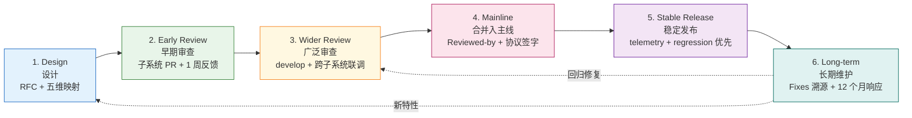
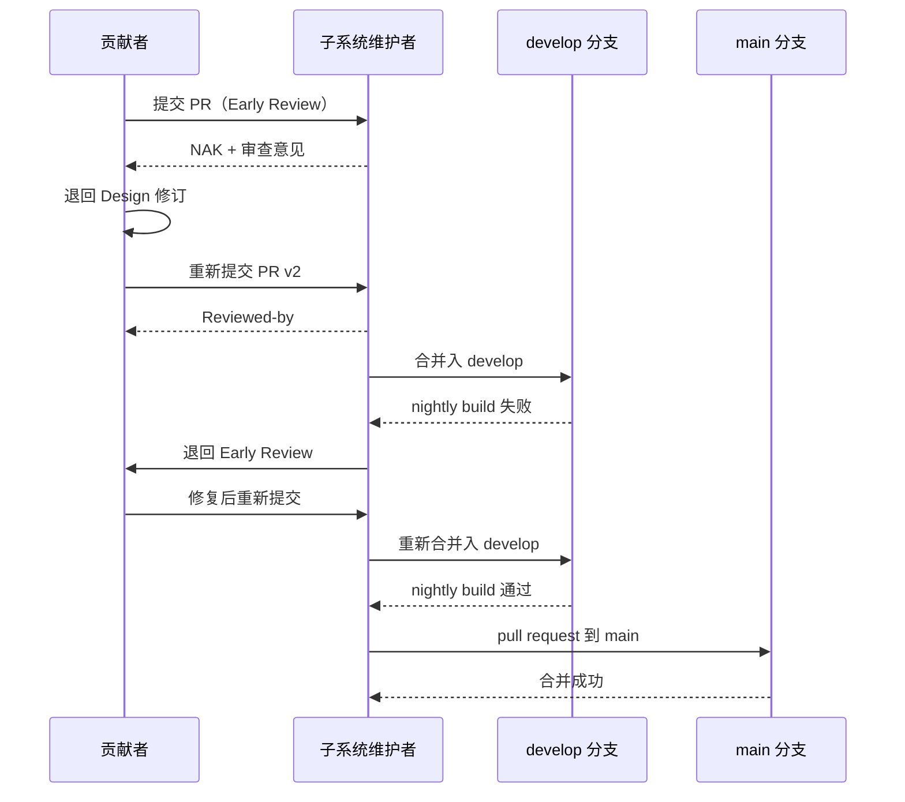
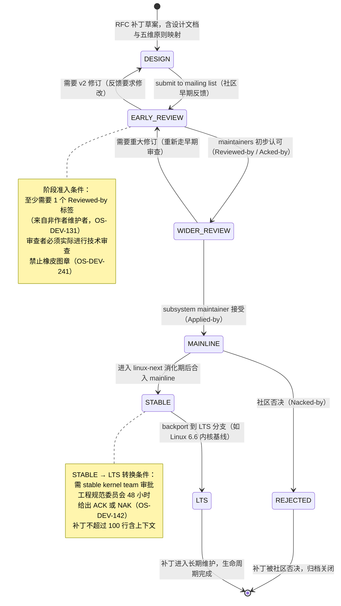
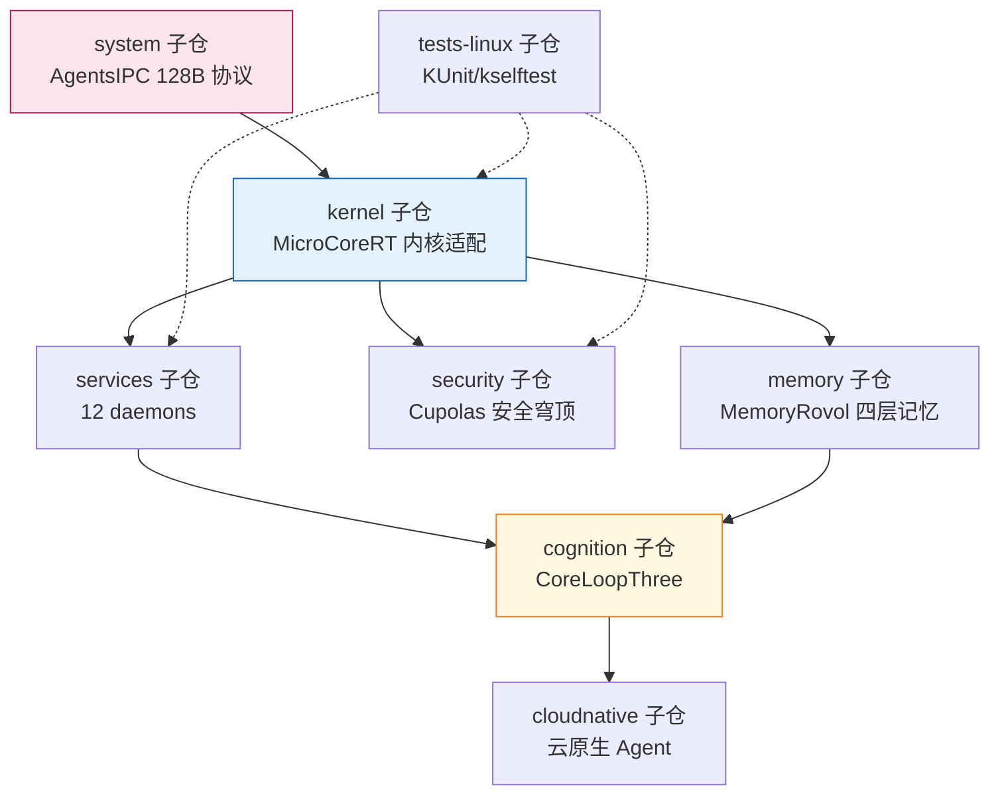
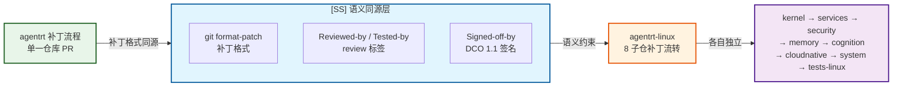
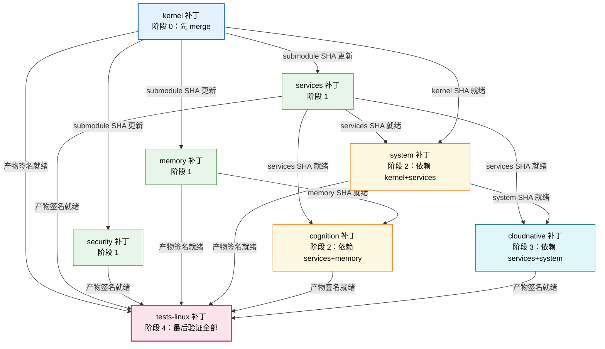

Copyright (c) 2025-2026 SPHARX Ltd. All Rights Reserved.

# agentrt-linux（AirymaxOS）补丁生命周期 6 阶段详解
> **文档定位**：agentrt-linux（AirymaxOS）120-development-process 模块第 1 卷——补丁生命周期。本文档详述代码从设计构想到主线、稳定版、长期维护的 6 阶段全生命周期，是工程标准层 `50-engineering-standards/05-development-process.md` 在模块设计层的展开。\
> **文档版本**：0.1.1\
> **最后更新**：2026-07-06\
> **上级文档**：[agentrt-linux 设计文档](README.md)\
> **同源映射**：agentrt 开发流程 + Linux 6.6 内核开发流程（`Documentation/process/development-process.rst` 8 章）\
> **理论根基**：Linux 6.6 内核基线 + Airymax 五维正交 24 原则 + S-4 涌现性管理 + C-2 增量演化\
> **核心约束**：IRON-9 v2 同源且部分代码共享（agentrt 用户态运行时规范与 agentrt-linux 内核发行版规范并行演进，通过同源 API 保持互操作）

---

## 1. 模块定位与范围

本文档是 120-development-process 模块的第 1 卷，回答"一个补丁从立项到归档的完整路径是什么"。它继承 Linux 6.6 内核基线的 6 阶段补丁生命周期模型，并将其适配到 agentrt-linux 的 GitHub PR 工作流。

### 1.1 与工程标准层的关系

工程标准层 `50-engineering-standards/05-development-process.md` 定义"规则与编号"（OS-STD-XXX），本文档定义"流程在模块设计层的展开"（OS-DEV-XXX）。两层关系：

- **工程标准层**：定义阶段切换的硬性规则（如 OS-STD-107 合并入 main 需至少 1 个 Reviewed-by）。
- **模块设计层**（本文档）：定义阶段内工作流、跨仓协同、阶段间转换条件、失败回退路径。

### 1.2 适用范围

本文档适用于 agentrt-linux 全部 8 子仓（kernel/services/security/memory/cognition/cloudnative/system/tests-linux）以及同源 agentrt 的协同变更流程。涉及 MicroCoreRT 与 AgentsIPC 同源 API 的改动遵循第 10 节的跨仓流程。

### 1.3 关键术语

| 术语 | 定义 |
|------|------|
| 补丁 | 一个 git commit，对应一个逻辑变更 |
| 补丁序列 | 一个 PR 内多个相互关联、按依赖顺序排列的补丁 |
| 子系统树 | 子系统维护者维护的分支，补丁进入主线的中间站 |
| `develop` 分支 | agentrt-linux 预览集成分支，等价 linux-next 树 |
| `release/*` 分支 | agentrt-linux 稳定版分支，等价 Linux -stable 树 |

---

## 2. 6 阶段生命周期总览

agentrt-linux 继承 Linux 6.6 内核基线的 6 阶段模型：Design → Early Review → Wider Review → Mainline → Stable Release → Long-term Maintenance。每个阶段有明确的输入、输出、责任人、SLA 与工具关卡。



### 2.1 阶段速查表

| 阶段 | 输入 | 输出 | 责任人 | SLA | 关卡工具 |
|------|------|------|--------|-----|---------|
| 1. Design | 需求/问题 | RFC issue | 贡献者 | 无强约束 | RFC 模板 |
| 2. Early Review | RFC + PR | 审查意见 | 子系统维护者 | 1 周 | CODEOWNERS + DCO bot |
| 3. Wider Review | 修订 PR | develop 集成 | 顶级子系统维护者 | 2 周 | nightly build + 7 层验证前 4 层 |
| 4. Mainline | PR + Reviewed-by | main 提交 | 总维护者 | Merge Window 内 | CI 全绿 + 工程规范委员会签字 |
| 5. Stable Release | main 提交 | release/* | 稳定版团队 | 48 小时 ACK | -rc 验证 |
| 6. Long-term | stable 反馈 | Fixes 补丁 | 原作者 + LTS 维护者 | 12 个月响应 | telemetry + bisect |

---

## 3. 阶段一：Design（设计 RFC）

设计阶段确定"做什么"和"为什么做"。本阶段可在社区内或社区外进行，但公开设计可节省后期返工——尤其是涉及 AgentsIPC 128B 协议、MicroCoreRT 内核适配、Agent SDK 接口的改动。

### 3.1 强制产出

- **RFC issue**：在对应子仓的 GitHub issue tracker 创建 RFC，使用 `rfc` 标签。
- **五维原则映射小节**：RFC 必须说明该设计涉及哪些五维正交 24 原则（如 S-4 涌现性管理、K-2 接口契约化）。
- **ABI 影响评估**：涉及 L1（Agent 应用 API）或 L2（AgentsIPC 协议）的设计必须遵循 4 层接口稳定性分级。

### 3.2 规则编号

- **OS-DEV-101**：任何影响 L1/L2 接口的设计，必须先创建 RFC issue 并至少获得 1 名顶级子系统维护者 ACK，方可进入早期审查。
- **OS-DEV-102**：RFC 必须包含"五维原则映射"小节，缺失此小节的 RFC 将被自动关闭。
- **OS-DEV-103**：RFC 必须量化预期影响（性能、内存、ABI 兼容性），禁止纯定性描述。

### 3.3 RFC 模板

```markdown
## RFC: <标题>

### 背景
<问题描述与用户可见影响>

### 设计方案
<技术方案，含数据流图>

### 五维原则映射
- S-4 涌现性管理: <如何体现>
- C-2 增量演化: <如何体现>

### ABI 影响
- L1/L2/L3/L4: <影响分级>
### 量化预期
- 性能: <数字> / 内存: <数字>
### Open Questions
- <待讨论问题>
```

---

## 4. 阶段二：Early Review（早期审查）

将补丁序列提交到相关子系统维护者的 GitHub PR。本阶段的目标是获得子系统维护者的初步反馈，而非最终 ACK。

### 4.1 目标审查者识别

由 `MAINTAINERS.md` 与 `CODEOWNERS` 自动识别。审查者识别失败（无人匹配）的 PR 将被路由到 `airymax-mm` 分支（详见第 11 节）。

### 4.2 SLA 与规则

- **SLA**：子系统维护者通常在 1 周内给出审查反馈；超过 1 周无反馈，贡献者可 ping 一次，再过 1 周仍无反馈应考虑发错地方。
- **OS-DEV-111**：早期审查 PR 必须包含完整的补丁描述（问题描述、用户可见影响、量化权衡），禁止"占位描述"。
- **OS-DEV-112**：早期审查阶段的所有审查意见必须在 PR 内联回复，禁止离线沟通。
- **OS-DEV-113**：不同意审查意见必须解释技术理由，沉默忽略视为致命错误。
- **OS-DEV-114**：每个 commit 必须包含 `Signed-off-by:` 行（使用 `git commit -s` 自动添加），表明贡献者签署 DCO 1.1（Developer Certificate of Origin），与 Linux 内核社区 `Documentation/process/submitting-patches.rst` §12 对齐。
- **OS-DEV-115**：`Signed-off-by:` 必须使用真实姓名与有效邮箱，禁止匿名或角色邮箱；DCO 签名链必须反映补丁真实审查路径（作者 → 审查者 → 合并者）。

### 4.3 PR 提交示例

```bash
# 创建特性分支
git checkout -b feature/cupolas-lsm-hook develop

# 编写 commit（含 DCO 签名）
git commit -s -m "security/cupolas: add agent capability hook for LSM

Add a new LSM hook that allows Cupolas to mediate agent capability
transitions. Logs transitions to the audit subsystem.
Performance impact: +0.3% syscall overhead (1M iterations, aarch64).

Signed-off-by: Author Name <author@example.com>"

# 推送并创建 PR
git push origin feature/cupolas-lsm-hook
gh pr create --base develop --title "security/cupolas: add agent capability hook for LSM"
```

---

## 5. 阶段三：Wider Review（广泛审查）

补丁通过子系统审查后，进入 `develop` 分支（等价 linux-next 树）进行跨子系统联调。本阶段暴露补丁在更大集成环境中的冲突与 regression。

### 5.1 可见性提升

进入 `develop` 后，补丁会暴露给更广泛的测试者与 CI 矩阵（x86_64 / aarch64 / riscv64 三架构 × allmodconfig / allnoconfig / defconfig 三配置）。

### 5.2 跨子系统冲突检测

`develop` 分支的 nightly build 检测：跨子系统符号冲突、ABI 漂移、AgentsIPC 协议契约违反、MicroCoreRT 同源语义偏离。

### 5.3 规则编号

- **OS-DEV-121**：补丁进入 `develop` 前必须通过 7 层自动化验证的前 4 层（编译期 / 静态分析 / 预提交 / CI 门禁）。
- **OS-DEV-122**：`develop` 分支禁止 force-push 历史，所有变更必须以 merge commit 或 rebase 后的提交形式进入。
- **OS-DEV-123**：`develop` 分支 nightly build 失败必须在 24 小时内修复或回滚；连续 3 天失败的子系统，其补丁将被冻结进入下一轮 Merge Window。
- **OS-DEV-124**：`develop` 分支每日至少运行 1 次 nightly build，覆盖三架构三配置。

### 5.4 develop 分支等价 linux-next

`develop` 分支是 agentrt-linux 对 Linux linux-next 树的等价物：

| Linux 概念 | agentrt-linux 等价物 | 同源语义 |
|-----------|-----------------|---------|
| linux-next 树 | `develop` 分支 | 下一 Merge Window 候选补丁汇聚 |
| -mm 树 | `airymax-mm` 分支 | 无明确子系统归属的补丁归宿 |
| staging 目录 | `staging/` 目录 | 质量未达主线标准的代码暂存 |
| -stable 树 | `release/*` 分支 | 稳定版维护 |

---

## 6. 阶段四：Mainline（合并入主线）

由顶级子系统维护者发起 pull request 到 `main` 分支。本阶段是补丁进入正式主线的关口。

### 6.1 Merge Window 与 RC 周期

agentrt-linux 采用 2 周 Merge Window + 6 周 RC 周期的发布节奏：Merge Window 接受新特性补丁；RC1 发布后仅接受修复补丁，新特性必须等待下一个 Merge Window。

### 6.2 规则编号

- **OS-DEV-131**：合并入 `main` 的补丁必须包含至少 1 个 `Reviewed-by:` 标签（来自非作者维护者）。
- **OS-DEV-132**：合并入 `main` 的补丁若修改 AgentsIPC 128B 消息头布局，必须由 agentrt-linux 工程规范委员会额外签字。
- **OS-DEV-133**：合并入 `main` 的补丁若修改 MicroCoreRT 同源语义，必须通过 agentrt 兼容性测试。
- **OS-DEV-134**：合并入 `main` 必须通过 GitHub Actions 全部检查；任一检查失败禁止合并。

### 6.3 pull request 模板

```markdown
## Pull Request: <子系统> merge for <版本>

### 包含的补丁序列
1. <commit sha> <subject>
2. <commit sha> <subject>

### 审查状态
- [x] 子系统维护者 Reviewed-by
- [x] develop nightly build 通过 + 7 层验证全绿
- [ ] 工程规范委员会签字（仅 ABI 改动需要）

### Conflict 解决说明
<如有冲突，说明解决方式>
### Regression 风险评估
<低/中/高，附理由>
```

---

## 7. 阶段五：Stable Release（稳定发布）

补丁随某个正式版本（如 1.0.1）发布。更多用户暴露更多 bug——regression 是本阶段最高优先级。

### 7.1 release/* 分支规则

`release/<version>` 分支等价 Linux -stable 树，遵循以下规则：补丁或其等价修复必须已存在于 `main` 分支；必须显然正确且已测试；不超过 100 行（含上下文）；必须修复真实 bug 或新增设备 ID——禁止理论性 race condition（除非附带可利用性说明）、禁止琐碎修复。

### 7.2 三种提交流径

| 选项 | 描述 | 适用场景 |
|------|------|---------|
| Option 1 | 主线 PR 添加 `Cc: release/1.0.x`，合并后自动 cherry-pick | 强烈推荐 |
| Option 2 | 主线合并后向稳定版维护者请求 | 主线合并时未考虑回溯 |
| Option 3 | 提交等价补丁到稳定版，标注 `[ Upstream commit <sha> ]` | API 变化需调整适配 |

### 7.3 规则编号

- **OS-DEV-141**：使用 Option 2/3 时必须确保修复已存在于所有更新的稳定版分支。
- **OS-DEV-142**：工程规范委员会有 48 小时给出 ACK 或 NAK。
- **OS-DEV-143**：regression 报告必须在 48 小时内响应，7 天内提供修复或回滚方案。
- **OS-DEV-144**：稳定版发布后 30 天内，相关补丁作者需主动监控 telemetry 指标。

### 7.4 安全补丁例外

安全补丁不走常规稳定版审查流程，由 agentrt-linux 安全团队直接处理。严重安全漏洞可能进入短期 embargo；embargo 期间补丁禁止进入任何公开分支或 PR。

---

## 8. 阶段六：Long-term Maintenance（长期维护）

补丁作者需持续负责其合并入主线的代码。"the development community remembers developers who lose interest in their code after it's merged"——这是 Linux 内核社区的明确警告，agentrt-linux 完全继承。

### 8.1 LTS 版本维护

每 2 年一个 LTS 版本（如 1.0 LTS、3.0 LTS、5.0 LTS）。LTS 维护周期 5 年（含 2 年积极维护 + 3 年仅安全补丁）。LTS 版本必须每季度发布一个维护版本。

### 8.2 规则编号

- **OS-DEV-151**：补丁作者在代码合并后 12 个月内，须响应与其补丁相关的所有 bug 报告与审查请求；若长期无响应，维护者可将其代码标记为 `Orphaned` 并寻找新维护者。
- **OS-DEV-152**：长期维护期间发现的修复需通过 `Fixes:` 标签溯源到引入 bug 的原始提交。
- **OS-DEV-153**：LTS 维护者离职需提前 6 个月通知，启动继任者培养流程。
- **OS-DEV-154**：LTS 版本只接受 bug 修复与安全补丁，不接受新特性。

### 8.3 Fixes 标签格式

```
Fixes: 54a4f0239f2e ("KVM: MMU: make kvm_mmu_zap_page() return the number of pages it actually freed")
```

溯源必须使用引入 bug 的原始 commit 的 12 字符 SHA + 单行摘要，不要跨行拆分标签。agentrt-linux 仓库对象众多，6-8 字符 SHA 有碰撞风险。

---

## 9. 阶段间转换条件与失败回退

### 9.1 转换条件矩阵

| 从 → 到 | 转换条件 | 失败回退 |
|---------|---------|---------|
| Design → Early | RFC 获顶级维护者 ACK（OS-DEV-101） | RFC 重新设计或放弃 |
| Early → Wider | 子系统维护者 Reviewed-by + 7 层前 4 层通过 | 退回 Design 修订 RFC |
| Wider → Mainline | develop nightly build 通过 + Reviewed-by | 退回 Early Review 修订 |
| Mainline → Stable | 已在 main + 通过 -rc 验证 | 退回 Mainline 修复 |
| Stable → Long-term | 进入 LTS 候选名单 | 退回 Stable 补丁队列 |

### 9.2 失败回退原则

- **OS-DEV-161**：任何阶段失败的补丁必须明确标注回退目标阶段，禁止"原地重试"。
- **OS-DEV-162**：回退超过 2 次的补丁需重新进入 Design 阶段，重新评估必要性。
- **OS-DEV-163**：回退期间产生的所有审查意见必须转化为代码注释或 changelog 条目（Morton 原则）。

### 9.3 回退时序图



### 9.4 补丁生命周期状态机

补丁从 RFC 设计草案到 LTS 长期维护的完整状态转换，覆盖 6 阶段推进、修订回退与社区否决全路径：



**状态转换条件**：

| 从状态 | 到状态 | 触发条件 | 系统行为 |
|--------|--------|---------|---------|
| — | DESIGN | 创建 RFC 补丁草案，含设计文档与五维原则映射小节（OS-DEV-102） | 在子仓 issue tracker 创建 RFC issue，标注 `rfc` 标签 |
| DESIGN | EARLY_REVIEW | 提交到 mailing list（GitHub PR），寻求社区早期反馈 | 子系统维护者在 1 周 SLA 内给出审查意见（OS-DEV-111） |
| EARLY_REVIEW | WIDER_REVIEW | maintainers 初步认可，获得至少 1 个 `Reviewed-by` 或 `Acked-by` 标签 | 补丁进入 `develop` 分支（等价 linux-next），暴露给跨子系统联调（OS-DEV-121） |
| EARLY_REVIEW | DESIGN | 反馈要求修改，需要 v2 修订 | 贡献者退回 Design 阶段修订 RFC 与补丁，重新提交时标注 `v2`（OS-DEV-184） |
| WIDER_REVIEW | MAINLINE | subsystem maintainer 接受（`Applied-by`），develop nightly build 通过 + 7 层验证全绿 | 顶级子系统维护者发起 pull request 到 `main` 分支，CI 全绿后合并（OS-DEV-134） |
| WIDER_REVIEW | EARLY_REVIEW | 需要重大修订，重新走早期审查 | 补丁退回 Early Review 阶段，保留 develop 集成经验，重新提交修订版 |
| MAINLINE | STABLE | 补丁进入 linux-next 消化期后合入 mainline，通过 `-rc` 验证 | 补丁随正式版本发布，进入 `release/*` 分支，开始 stable 维护（OS-DEV-141） |
| MAINLINE | REJECTED | 社区否决，收到 `Nacked-by` 标签（须附技术理由，OS-DEV-242） | 补丁被拒绝合并，PR 关闭，记录否决原因供后续参考 |
| STABLE | LTS | backport 到 LTS 分支（如 Linux 6.6 内核基线），stable kernel team 审批通过（48 小时 ACK，OS-DEV-142） | 补丁进入 LTS 候选名单，LTS 维护者负责季度维护版本发布（OS-DEV-154） |
| REJECTED | —（终态） | 补丁被社区否决，归档关闭 | 补丁生命周期终止，PR 标记为 closed，设计文档保留供参考 |
| LTS | —（终态） | 补丁进入长期维护，12 个月响应期结束（OS-DEV-151） | 补丁生命周期完成，作者持续负责或标记为 Orphaned 寻找新维护者 |

---

## 10. agentrt-linux 8 子仓跨仓 PR 流程

agentrt-linux 的 8 子仓（kernel/services/security/memory/cognition/cloudnative/system/tests-linux）之间存在依赖关系。跨仓变更需通过 submodule 更新触发上游仓 PR。

### 10.1 8 子仓依赖关系



### 10.2 跨仓 PR 流程

当一个变更同时影响 AgentsIPC 协议（system 子仓）与 kernel 子仓：

```bash
# 1. 先在 system 子仓提交协议变更 PR
cd system
git checkout -b feature/airy_ipc-new-field
git commit -s -m "system/airy_ipc: add agent_priority field to 128B header

Add a new u8 agent_priority field at offset 120 of the AgentsIPC
128B message header. ABI impact: L2 (backward compatible, padding
bytes consumed).

Signed-off-by: Author Name <author@example.com>"
gh pr create --base develop --title "system/airy_ipc: add agent_priority field"

# 2. system 子仓 PR 合并后，更新 kernel 子仓的 submodule 指针
cd ../kernel
git checkout -b feature/airy_ipc-priority-support
git submodule update --remote system
git commit -s -m "kernel: consume airy_ipc agent_priority field

Update MicroCoreRT IPC dispatch to read the new agent_priority
field and route high-priority messages to the fast path.

Signed-off-by: Author Name <author@example.com>"
gh pr create --base develop --title "kernel: consume airy_ipc agent_priority field"
```

### 10.3 跨仓审查规则

- **OS-DEV-171**：跨仓 PR 必须在描述中标注所有依赖的下游仓 PR。
- **OS-DEV-172**：跨仓 PR 的 CI 必须触发上下游仓的兼容性测试。
- **OS-DEV-173**：AgentsIPC 协议变更的跨仓 PR 必须由工程规范委员会同步签字所有相关仓的 PR。

---

## 11. GitHub PR 工作流适配邮件补丁

agentrt-linux 将 Linux 内核的邮件 + `git send-email` 流程适配为 GitHub PR 流程，但保留同源语义。

### 11.1 适配映射表

| Linux 内核概念 | agentrt-linux 等价物 | 同源语义 |
|---------------|-----------------|---------|
| 邮件列表 | GitHub PR + 子仓 issue tracker | 公开讨论存档 |
| `git send-email` | GitHub PR 内联提交 | 补丁可被引用、逐行评论 |
| `MAINTAINERS` 文件 | `MAINTAINERS.md` + `CODEOWNERS` | 自动识别审查者 |
| patchwork | GitHub Projects 看板 | 补丁状态追踪 |
| `Cc: stable@vger.kernel.org` | PR 评论 `Cc: release/1.0.x` | 标记需回溯到稳定版 |
| `Signed-off-by:` 邮件签名 | DCO bot 自动验证 | Developer Certificate of Origin |
| `[PATCH NNN/total]` 标题 | GitHub PR 标题 + commit 序列 | 补丁序列追踪 |

### 11.2 commit 格式（适配 GitHub）

```
[PATCH 001/003] subsystem: summary phrase

详细描述正文，行宽 75 列。描述必须解释问题、用户可见影响、量化权衡。

Fixes: 54a4f0239f2e ("original commit summary")
Closes: #123
Link: https://github.com/agentrt-linux/kernel/pull/456#discussion_r789

Signed-off-by: Author Name <author@example.com>
Reviewed-by: Reviewer Name <reviewer@example.com>
---
实际 diff（GitHub 中为 commit diff）
```

### 11.3 规则编号

- **OS-DEV-181**：所有 commit 必须用 `git commit -s` 添加 DCO 签名。
- **OS-DEV-182**：禁止 `git push --force` 到 `main`/`develop`/`release/*` 分支。
- **OS-DEV-183**：`Reviewed-by:`/`Acked-by:`/`Tested-by:` 标签必须由对应人员本人添加，作者不得代签。
- **OS-DEV-184**：重发未修改补丁加 `[RESEND]`；修改版本用 `v2`/`v3`。

---

## 12. 五维原则映射

本文档开发流程与 Airymax 五维正交 24 原则的映射如下：

| 原则 | 含义 | 在本文档的体现 |
|------|------|--------------|
| **S-1 反馈闭环** | 感知-决策-执行-反馈闭环 | 6 阶段生命周期构成完整反馈闭环，develop nightly build 是关键反馈点 |
| **S-4 涌现性管理** | 简单规则引导有益整体行为 | 渐进式开发模型 + Merge Window + RC 管理涌现性 |
| **K-2 接口契约化** | 双层稳定性哲学 | L1-L4 接口分级 + AgentsIPC 128B 改动需工程规范委员会签字（OS-DEV-132） |
| **C-2 增量演化** | 渐进式演进每步可验证 | 补丁序列中点可编译 + git bisect 友好 |
| **E-6 错误可追溯** | 错误可溯源可追踪 | Fixes/Closes/Link 标签 + 12 字符 SHA + Signed-off-by DCO 链 |
| **E-7 文档即代码** | 文档与代码同源同审 | RFC issue + 五维原则映射小节（OS-DEV-102） |
| **A-3 人文关怀** | 不烧桥管理哲学 | 审查礼仪 + 感谢审查者 + Morton 原则（OS-DEV-163） |
| **IRON-9 v2 同源且部分代码共享** | 同源 API 并行演进 | MicroCoreRT 与 AgentsIPC 同源 API 变更需两端兼容性测试（OS-DEV-133） |

---

## 13. 同源 agentrt 映射

本文档的开发流程与 agentrt 用户态运行时规范同源且部分代码共享（IRON-9 v2 同源且部分代码共享）：

| 维度 | agentrt（用户态） | agentrt-linux（内核发行版） |
|------|------------------|----------------------|
| SCM | GitHub PR | GitHub PR（同源） |
| 预览分支 | develop | develop（同源语义） |
| 稳定分支 | release/* | release/*（同源语义） |
| 同源 API | MicroCoreRT/AgentsIPC/Cupolas/MemoryRovol/CoreLoopThree | 同源 API 在内核态保持语义一致 |
| 兼容性测试 | 两端双向兼容性测试 | 同源 API 变更必须通过两端兼容性测试 |
| 季度评审 | 同源 API 漂移评审 | 同源 API 漂移评审（同源） |

### 13.1 同源 API 变更流程

MicroCoreRT 与 AgentsIPC 同源 API 的变更必须遵循双向同步：agentrt 端 RFC 必须同步到 agentrt-linux 端，反之亦然；变更必须通过两端兼容性测试；季度评审同源 API 漂移。

### 13.2 IRON-9 v2 三层共享模型

IRON-9 v2 三层共享模型将 agentrt（用户态运行时）与 agentrt-linux（内核发行版）之间的同源关系细分为三个正交层次：[SC] 共享契约层（头文件级代码共享）、[SS] 语义同源层（语义两端一致但实现独立）、[IND] 完全独立层（发行版固有责任）。本节聚焦补丁生命周期的三层映射。

#### 13.2.1 三层模型概览

| 层次 | 共享程度 | 补丁生命周期内容 |
|------|---------|-------------|
| **[SC] 共享契约层** | 无——开发流程为工程规范层，不涉及代码共享 | 无 [SC] 层头文件；补丁流程属工程规范层，两端无头文件级代码共享 |
| **[SS] 语义同源层** | 语义两端一致，实现独立 | 补丁格式（git format-patch）、review 流程（Reviewed-by/Tested-by）、LTS 维护策略（stable backport）、补丁签名（Signed-off-by DCO） |
| **[IND] 完全独立层** | agentrt-linux 独有 | 8 子仓补丁流转路径、子仓间依赖排序、submodule 更新流程、umbrella repo 发布 |

#### 13.2.2 [SC] 共享契约层

无直接 [SC] 头文件。补丁生命周期属于工程规范层，两端共享的是流程语义（补丁格式、review 标签、DCO 签名）而非代码头文件。同源 API 的代码契约共享（MicroCoreRT/AgentsIPC 头文件）由各自的代码仓库承载，补丁流程本身不引入额外的 [SC] 层头文件依赖。两端共享的代码契约由 `30-interfaces/` 模块的协议文档与头文件定义，补丁流程仅确保这些契约的变更遵循双向同步（§13.1）。

#### 13.2.3 [SS] 语义同源层

[SS] 层的补丁流程语义两端一致，但仓库结构与合入路径独立：agentrt 用户态使用单一 monorepo（或少量仓库），agentrt-linux 使用 8 子仓 + umbrella repo 架构。两端语义映射如下：

| 语义维度 | agentrt（用户态运行时） | agentrt-linux（内核发行版） |
|------|------------------------|------------------------|
| 补丁格式 | git format-patch（同源） | git format-patch（同源格式） |
| review 流程 | GitHub PR + Reviewed-by/Tested-by 标签 | GitHub PR + Reviewed-by/Tested-by 标签（同源） |
| LTS 维护策略 | stable backport 到 release/* 分支 | stable backport 到 release/* 分支（同源策略） |
| 补丁签名 | Signed-off-by（DCO 1.1） | Signed-off-by（DCO 1.1，同源） |
| 补丁序列 | git bisect 友好，序列中点可编译 | git bisect 友好（同源），8 子仓各自独立 bisect |
| 重发版本 | [RESEND] / v2 / v3 | [RESEND] / v2 / v3（同源） |

两端在补丁流程语义上完全同源——补丁格式、review 标签语义、DCO 签名链、LTS backport 策略的概念模型一致——但 agentrt-linux 将流程语义落地为 8 子仓的分布式补丁流转（每仓独立 PR/review/merge），而 agentrt 用户态运行时保持单一仓库的线性补丁流。这种语义同源使得开发者从 agentrt 贡献迁移到 agentrt-linux 贡献时，补丁格式与 review 礼仪无需重新学习，仅需适应多仓依赖排序。

#### 13.2.4 [IND] 完全独立层

[IND] 层是 agentrt-linux 8 子仓架构的固有责任，agentrt 用户态运行时不涉及：

| 独立实现项 | 说明 | agentrt 是否涉及 |
|------|------|------|
| 8 子仓补丁流转路径 | kernel→services→security→memory→cognition→cloudnative→system→tests-linux 依赖链合入顺序 | 否（单一仓库） |
| 子仓间依赖排序 | patch 须按依赖链合入（如 kernel 先于 services） | 否 |
| submodule 更新流程 | umbrella repo 通过 git submodule 引用各子仓 commit | 否 |
| umbrella repo 发布 | 统一版本标签发布（如 v1.0.1 指向 8 子仓的特定 commit） | 否 |
| 跨仓兼容性测试 | 同源 API 变更需触发 8 子仓联动 CI | 否（单仓内测试） |
| 子仓独立 release manager | 每仓有独立 release manager 签发 release | 否 |

#### 13.2.5 跨态协作流



补丁协作流：agentrt 用户态使用单一仓库的 GitHub PR 流程提交补丁，补丁格式（git format-patch）、review 标签（Reviewed-by/Tested-by）、DCO 签名（Signed-off-by）由 [SS] 语义同源层两端共享。agentrt-linux 将这些语义落地为 8 子仓的分布式补丁流转（[IND] 完全独立——kernel→services→security→memory→cognition→cloudnative→system→tests-linux 的依赖链合入顺序、submodule 更新、umbrella repo 统一发布），每仓独立 PR/review/merge 但遵循同源补丁格式。两端通过 [SS] 层的补丁格式同源实现开发者经验的平滑迁移，同源 API 变更（MicroCoreRT/AgentsIPC）通过 §13.1 的双向同步机制确保两端一致性。

### 13.3 8 子仓补丁流转路径与跨仓依赖排序

agentrt-linux 的 8 子仓补丁流转存在严格的跨仓依赖排序问题：下层子仓（如 kernel）的补丁必须先 merge 到 develop 分支，上层子仓（如 services/cognition）依赖下层 commit SHA 的 submodule 指针更新后方可提交 PR；违反排序将导致上层 PR 的 CI 拉取到旧版下层产物，触发虚假的符号缺失或 ABI 断裂失败。

#### 13.3.1 8 子仓补丁流转路径图



**流转路径说明**：kernel 补丁率先 merge 到 develop → 阶段 1 的 services/security/memory 检测到 kernel submodule 指针更新后并行 merge → 阶段 2 的 system 等待 services merge 完成、cognition 等待 services 与 memory 双双 merge 完成 → 阶段 3 的 cloudnative 等待 services 与 system 双双 merge 完成 → 阶段 4 的 tests-linux 最后 merge 并对全部 7 仓产物执行 KUnit/kselftest 验证。

#### 13.3.2 跨仓依赖排序算法表

| 子仓 | 依赖子仓 | 补丁必须先 merge 的子仓 | 可并行 merge 的子仓 | merge 阶段 |
|------|---------|---------------------|-------------------|-----------|
| kernel | （无） | （无） | 无（必须最先） | 阶段 0 |
| services | kernel | kernel | security / memory | 阶段 1 |
| security | kernel | kernel | services / memory | 阶段 1 |
| memory | kernel | kernel | services / security | 阶段 1 |
| system | kernel + services | kernel, services（双双就绪） | cognition | 阶段 2 |
| cognition | services + memory | services, memory（双双就绪） | system | 阶段 2 |
| cloudnative | services + system | services, system（双双就绪） | 无（须独占） | 阶段 3 |
| tests-linux | 全部 7 仓 | kernel/services/security/memory/system/cognition/cloudnative | 无（必须最后） | 阶段 4 |

**排序算法**：依赖排序采用拓扑排序（topological sort）——以子仓为节点、依赖关系为有向边，`make build-order` 目标输出合法 merge 序列。同阶段（如阶段 1）的子仓无相互依赖，可并行触发 PR merge；跨阶段必须严格串行，下一阶段子仓的 PR 在上一阶段全部 merge 前 develop 分支 CI 标记为 `blocked`。该排序与 §10.1 的 8 子仓依赖图同源，但聚焦补丁 merge 时序而非静态构建依赖。

#### 13.3.3 跨仓 PR 的 submodule 更新触发机制

agentrt-linux 的 umbrella repo 通过 `.gitmodules` 引用 8 子仓的 commit SHA。当某一子仓的 PR 合并到 `develop` 后，GitHub Actions 自动触发上游子仓的 submodule 更新 PR：

1. **下游仓 merge 触发**：`kernel` 仓 PR 合并后，CI 调用 `git submodule update --remote kernel` 更新 `services`/`security`/`memory` 仓的 `.gitmodules` 指针。
2. **自动 PR 创建**：CI 为每个上游子仓自动创建 `chore: bump kernel submodule to <sha>` 的 PR，目标分支为 `develop`，PR 描述必须引用下游仓的 commit SHA（12 字符）。
3. **上游仓 CI 验证**：上游子仓 PR 触发本地 CI，拉取新版下游产物后执行编译 + 7 层验证前 4 层（OS-DEV-121）；通过后方可 merge。
4. **阶段推进**：当某一阶段（如阶段 1）的全部子仓 submodule PR merge 完成，CI 自动解锁阶段 2 子仓（system/cognition）的 PR 队列。

该机制确保跨仓依赖始终以 commit SHA 显式锚定，而非依赖分支名或 tag——这与 §8.3 `Fixes:` 标签使用 12 字符 SHA 的溯源约束同源（E-6 错误可追溯）。

#### 13.3.4 规则编号

- **OS-DEV-191**：跨仓 PR 必须先 merge 下游仓再 merge 上游仓——下游仓（如 kernel）的 PR 合并并产出 commit SHA 后，上游仓（如 services）的 PR 方可提交；上游仓 PR 必须在描述中引用下游仓的 12 字符 commit SHA 作为依赖证据，禁止引用分支名或 tag（对齐 E-6 错误可追溯 + §10.3 OS-DEV-171）。
- **OS-DEV-192**：submodule 更新 PR 的 commit message 必须包含 `Bump: <下游仓名> to <12 字符 SHA>` 格式的锚定行，且 SHA 必须与下游仓 develop 分支的最新 merge commit 一致；CI 自动校验 SHA 一致性，不一致则 PR 标记为 `blocked` 禁止 merge（对齐 E-3 资源确定性）。
- **OS-DEV-193**：跨仓 CI 必须在全部依赖仓 merge 后方可触发——cognition 仓的 CI 必须等待 services 与 memory 仓的 submodule PR 双双 merge；tests-linux 仓的 CI 必须等待全部 7 仓 merge 完成后方可运行 KUnit/kselftest，禁止对未就绪依赖仓执行集成测试（对齐 §13.3.1 流转路径 + OS-DEV-121 7 层验证前 4 层）。
- **OS-DEV-194**：跨仓补丁回退必须按依赖逆序回滚——若 cognition 仓的补丁需回退，必须先回退 cognition 仓的 PR，再回退触发其 submodule 更新的 services/memory 仓 PR，最后回退 kernel 仓 PR；禁止只回退上层仓而保留下层仓的新 commit，否则 submodule 指针将指向悬空 SHA（对齐 §9.2 OS-DEV-161 回退原则 + IRON-9 v2 同源一致性）。

---

## 14. 相关文档与参考材料

- `120-development-process/README.md`（模块主索引）/ `02-maintainer-hierarchy.md`（维护者层级制度）
- `50-engineering-standards/05-development-process.md`（开发流程规范层，OS-STD-XXX）/ `07-maintainers-and-governance.md`（维护者制度）/ `06-toolchain-and-automation.md`（7 层验证、CI/CD）
- `130-roadmap/README.md`（路线图与 Merge Window 节奏）/ `30-interfaces/`（AgentsIPC 128B 协议、4 层接口分级）
- 参考材料：Linux 6.6 `Documentation/process/development-process.rst`（开发流程主入口）、`1.Intro.rst` 至 `8.Conclusion.rst`（8 章）、`submitting-patches.rst`（提交补丁规范）、`stable-kernel-rules.rst`（稳定版规则）

---

## 15. 文档版本与维护

| 版本 | 日期 | 变更 | 维护者 |
|------|------|------|--------|
| 0.1.1 | 2026-07-06 | 初始占位版本，完成 6 阶段框架 | 120-development-process 模块维护者 |
| 1.0.1 | 开发中 | 补充跨仓 PR 详细流程、回退路径案例 | 120-development-process 模块维护者 |

### 15.1 维护规则

- 本文档由 120-development-process 模块维护者负责。任何对 6 阶段模型的修改必须先在 `50-engineering-standards/05-development-process.md` 同步。OS-DEV-XXX 规则编号的变更需同步到 `50-engineering-standards/07-maintainers-and-governance.md` 的规则编号注册表。

---

## 附录 A: 接口定义

> **附录定位**： 本附录汇集补丁生命周期 6 阶段所需的完整接口契约，供直接参照实现。所有数据结构与函数签名对齐 Linux 6.6 内核开发流程（`Documentation/process/`）、git format-patch 补丁格式规范、DCO 1.1 标准，以及 agentrt-linux GitHub PR 工作流专属契约（`include/airymax/patch_types.h`，agentrt-linux 内核内部头文件，[IND] 独立层，agentrt 用户态不共享）。

### A.1 核心数据结构

#### A.1.1 patch_stage — 补丁阶段描述

```c
/**
 * struct patch_stage - 补丁生命周期阶段描述
 *
 * 描述 6 阶段模型中单个阶段的输入、输出、SLA 与转换条件。
 * 用于 stage_transition() 阶段转换决策。
 *
 * 对齐 Linux 6.6 内核 Documentation/process/development-process.rst
 * 对齐 agentrt-linux OS-DEV-101 ~ OS-DEV-163
 */
struct patch_stage {
    int          stage_id;        /* @field: PATCH_STAGE_* 枚举（DESIGN ~ LTS） */
    const char *stage_name;        /* @field: 阶段名称（如 "Design"） */
    const char *description;      /* @field: 阶段描述 */
    const char **inputs;          /* @field: 输入条件列表（如 "RFC issue"） */
    int          input_count;     /* @field: 输入条件数量 */
    const char **outputs;         /* @field: 输出产物列表（如 "Reviewed-by"） */
    int          output_count;     /* @field: 输出产物数量 */
    const char *responsible;      /* @field: 责任人角色（如 "贡献者"/"子系统维护者"） */
    uint32_t    sla_hours;        /* @field: SLA 响应时长（小时，0=无强约束） */
    const char **transition_rules;/* @field: 转换到下一阶段的规则编号列表 */
    int          transition_count;/* @field: 转换规则数量 */
    const char *failure_fallback; /* @field: 失败回退目标阶段（如 "退回 Design"） */
};
```

#### A.1.2 patch_metadata — 补丁元数据

```c
/**
 * struct patch_metadata - 补丁元数据
 *
 * 对应 git commit 解析后的元信息，包括 author/date/subject/body/signoff 链。
 * 由 patch_validate() 校验格式合规性。
 *
 * 对齐 Linux 6.6 内核 git format-patch + submitting-patches.rst 规范
 * 对齐 agentrt-linux OS-DEV-111 / OS-DEV-181
 */
struct patch_metadata {
    const char *commit_sha;       /* @field: commit SHA（12 字符，避免碰撞，§8.3） */
    const char *author_name;      /* @field: 作者姓名 */
    const char *author_email;     /* @field: 作者邮箱 */
    const char *author_date;      /* @field: 作者时间戳（ISO 8601） */
    const char *committer_name;   /* @field: 提交者姓名 */
    const char *committer_email;  /* @field: 提交者邮箱 */
    const char *committer_date;   /* @field: 提交时间戳 */
    const char *subject;          /* @field: commit subject（单行摘要） */
    const char *body;             /* @field: commit body（详细描述，行宽 75 列） */

    /* DCO 签名链 */
    struct {
        const char *signoff_name; /* @field: 签名者姓名 */
        const char *signoff_email;/* @field: 签名者邮箱 */
    } *signed_off_by;             /* @field: Signed-off-by 链条（逐层背书） */
    int          signoff_count;    /* @field: Signed-off-by 数量 */

    /* 审查标签 */
    const char **reviewed_by;      /* @field: Reviewed-by 标签列表（审查者邮箱） */
    int          reviewed_count;   /* @field: Reviewed-by 数量 */
    const char **acked_by;         /* @field: Acked-by 标签列表 */
    int          acked_count;      /* @field: Acked-by 数量 */
    const char **tested_by;        /* @field: Tested-by 标签列表 */
    int          tested_count;      /* @field: Tested-by 数量 */
    const char **suggested_by;     /* @field: Suggested-by 标签列表 */
    int          suggested_count;  /* @field: Suggested-by 数量 */

    /* 追溯标签 */
    const char *fixes_sha;        /* @field: Fixes: 引用的原始 commit SHA（12 字符，OS-DEV-152） */
    const char *fixes_summary;    /* @field: Fixes: 引用的原始 commit 单行摘要 */
    const char *closes_issue;     /* @field: Closes: issue 编号 */
    const char *link_url;         /* @field: Link: PR discussion URL */

    /* PR 关联 */
    int          pr_number;       /* @field: 关联的 GitHub PR 编号 */
    const char *pr_branch;        /* @field: PR 目标分支（develop/main/release/*） */
    int          patch_index;     /* @field: 补丁序列索引（[PATCH NNN/total]） */
    int          patch_total;     /* @field: 补丁序列总数 */
    int          resend_version;  /* @field: 重发版本号（0=首次，2=v2，3=v3） */

    /* 子仓归属 */
    const char *subrepo;         /* @field: 所属子仓（8 子仓之一） */
    const char *subsystem;       /* @field: 所属子系统（如 "security/cupolas"） */
};
```

#### A.1.3 pr_template — Pull Request 模板

```c
/**
 * struct pr_template - Pull Request 模板
 *
 * 对应 GitHub PR 描述的结构化表示。
 * 对齐 §6.3 pull request 模板 + §3.3 RFC 模板。
 *
 * 对齐 agentrt-linux OS-DEV-101 / OS-DEV-131
 */
struct pr_template {
    const char *title;            /* @field: PR 标题（含 [PATCH NNN/total] 前缀） */
    const char *subsystem;       /* @field: 子系统标识（如 "security/cupolas"） */
    const char *target_branch;   /* @field: 目标分支（develop/main/release/*） */

    /* 包含的补丁序列 */
    struct {
        const char *commit_sha;   /* @field: commit SHA */
        const char *subject;      /* @field: commit 单行摘要 */
    } *patches;                   /* @field: 补丁序列列表 */
    int          patch_count;    /* @field: 补丁数量 */

    /* 审查状态 */
    bool        subsystem_reviewed; /* @field: 子系统维护者 Reviewed-by（OS-DEV-131） */
    bool        develop_nightly_pass;/* @field: develop nightly build 通过（OS-DEV-121） */
    bool        ci_all_green;    /* @field: GitHub Actions 全绿（OS-DEV-134） */
    bool        protocol_signed; /* @field: 工程规范委员会签字（仅 ABI 改动需要，OS-DEV-132） */
    bool        airy_compat_test; /* @field: agentrt 兼容性测试通过（OS-DEV-133） */

    /* 跨仓依赖 */
    const char **dependent_prs;   /* @field: 依赖的下游仓 PR 列表（OS-DEV-171） */
    int          dependent_count; /* @field: 依赖 PR 数量 */

    /* 风险评估 */
    const char *conflict_resolution; /* @field: 冲突解决说明 */
    int          regression_risk; /* @field: Regression 风险（0=低/1=中/2=高） */
    const char *risk_reasoning;  /* @field: 风险评估理由 */

    /* RFC 关联（仅 Design 阶段 PR） */
    const char *rfc_issue_url;   /* @field: 关联的 RFC issue URL */
    bool        has_principle_mapping; /* @field: 是否包含五维原则映射小节（OS-DEV-102） */
    bool        has_quantified_impact;  /* @field: 是否量化预期影响（OS-DEV-103） */
};
```

#### A.1.4 review_checklist — 审查清单

```c
/**
 * struct review_checklist - 补丁审查清单
 *
 * 描述审查者在 Early Review / Wider Review 阶段的检查项。
 * 每项对应一个 OS-DEV 规则。
 *
 * 对齐 Linux 6.6 内核 reviewing 规范
 * 对齐 agentrt-linux OS-DEV-111 ~ OS-DEV-124
 */
struct review_checklist {
    const char *patch_sha;       /* @field: 被审查的补丁 SHA */
    const char *reviewer_name;   /* @field: 审查者姓名 */
    const char *reviewer_email;  /* @field: 审查者邮箱 */
    int          reviewer_level; /* @field: 审查者成熟度等级（LEVEL_0 ~ LEVEL_5） */
    uint64_t    review_date;     /* @field: 审查日期（Unix 时间戳） */

    struct {
        const char *item_id;     /* @field: 检查项 ID（如 "OS-DEV-111"） */
        const char *description; /* @field: 检查项描述 */
        bool        passed;      /* @field: 是否通过 */
        const char *comment;     /* @field: 审查意见（NAK 时必须附技术理由，OS-DEV-242） */
    } *items;                    /* @field: 检查项列表 */
    int          item_count;     /* @field: 检查项数量 */
    int          pass_count;     /* @field: 通过项数 */
    int          fail_count;     /* @field: 失败项数 */

    /* 审查结论 */
    int          verdict;        /* @field: 审查结论（REVIEW_VERDICT_ACK/NAK/COMMENT） */
    bool        rubber_stamp;    /* @field: 是否检测到橡皮图章审查（OS-DEV-241） */
    const char *withdraw_reason;/* @field: 撤销 Reviewed-by 的理由（OS-DEV-243） */
};
```

#### A.1.5 stage_transition — 阶段转换规则

```c
/**
 * struct stage_transition - 阶段转换规则
 *
 * 描述从一个阶段到下一阶段的转换条件与失败回退路径。
 * 由 stage_transition() 函数消费。
 *
 * 对齐 Linux 6.6 内核 development-process.rst 6 阶段模型
 * 对齐 agentrt-linux §9 转换条件矩阵
 */
struct stage_transition {
    int          from_stage;     /* @field: 源阶段（PATCH_STAGE_*） */
    int          to_stage;       /* @field: 目标阶段（PATCH_STAGE_*） */
    const char **conditions;     /* @field: 转换条件列表（如 "Reviewed-by"） */
    int          condition_count;/* @field: 转换条件数量 */
    const char **rule_ids;       /* @field: 关联规则编号列表（如 "OS-DEV-101"） */
    int          rule_count;     /* @field: 规则数量 */
    const char *failure_fallback;/* @field: 失败回退目标阶段 */
    uint32_t    max_retries;    /* @field: 最大重试次数（超过则回退到 Design，OS-DEV-162） */
    bool        requires_protocol_sign; /* @field: 是否需要工程规范委员会签字（ABI 改动） */
    bool        requires_airy_compat; /* @field: 是否需要 agentrt 兼容性测试 */
};
```

### A.2 核心函数签名

#### A.2.1 patch_validate — 补丁格式校验

```c
/**
 * patch_validate - 校验补丁格式合规性
 * @metadata: 补丁元数据结构指针
 *
 * 校验项：(1) commit 包含 Signed-off-by DCO 签名（OS-DEV-181）；
 *         (2) subject 符合 "subsystem: summary" 格式；
 *         (3) body 行宽 ≤ 75 列，含问题描述与量化权衡（OS-DEV-111）；
 *         (4) Fixes: 标签使用 12 字符 SHA + 单行摘要（OS-DEV-152）；
 *         (5) 补丁序列中点可编译（git bisect 友好）；
 *         (6) 无 force-push 到 main/develop/release/*（OS-DEV-182）。
 *
 * @return: 0 校验通过，<0 校验失败（见 PATCH_* 错误码）
 * @since 0.1.1
 *
 * 对齐 Linux 6.6 内核 submitting-patches.rst 规范
 */
int patch_validate(const struct patch_metadata *metadata);
```

#### A.2.2 pr_create — 创建 Pull Request

```c
/**
 * pr_create - 创建 GitHub Pull Request
 * @template: PR 模板结构指针
 * @metadata: 补丁元数据数组（补丁序列）
 * @patch_count: 补丁数量
 *
 * 创建流程：(1) 校验所有补丁通过 patch_validate()；
 *           (2) 基于 template 填充 PR 描述；
 *           (3) 若涉及 L1/L2 接口，校验 RFC 已获 ACK（OS-DEV-101）；
 *           (4) 若涉及 AgentsIPC/MicroCoreRT，标记需工程规范委员会签字（OS-DEV-132）；
 *           (5) 调用 gh pr create 创建 PR。
 *
 * @return: PR 编号（>0 成功），<0 失败
 * @since 0.1.1
 *
 * 对齐 agentrt-linux GitHub PR 工作流（§11）
 */
int pr_create(const struct pr_template *template,
              const struct patch_metadata *metadata,
              int patch_count);
```

#### A.2.3 stage_transition — 阶段转换（带条件检查）

```c
/**
 * stage_transition - 执行补丁阶段转换（带条件检查）
 * @patch_sha: 补丁 SHA
 * @transition: 阶段转换规则结构指针
 * @force: 是否跳过条件检查强制转换（仅总维护者可用）
 *
 * 执行流程：(1) 检查所有转换条件是否满足；
 *           (2) 若 requires_protocol_sign 且未签字，拒绝转换（OS-DEV-132）；
 *           (3) 若 requires_airy_compat 且测试未通过，拒绝转换（OS-DEV-133）；
 *           (4) 条件满足后更新补丁阶段标签；
 *           (5) 若失败且超过 max_retries，回退到 Design（OS-DEV-162）。
 *
 * @return: 0 转换成功，<0 转换失败（见 PATCH_* 错误码）
 * @since 0.1.1
 *
 * 对齐 agentrt-linux §9 转换条件矩阵
 */
int stage_transition(const char *patch_sha,
                     const struct stage_transition *transition,
                     bool force);
```

#### A.2.4 patch_apply — 应用补丁

```c
/**
 * patch_apply - 将补丁应用到指定分支
 * @patch_sha: 补丁 SHA
 * @target_branch: 目标分支（develop/main/release/*）
 * @dry_run: 是否仅模拟（true=不实际应用，仅检查冲突）
 *
 * 执行 git cherry-pick 或 git am 应用补丁。
 * 若 dry_run=true，仅检查是否冲突不实际应用。
 * 应用到 main 需先通过 CI 全绿（OS-DEV-134）。
 *
 * @return: 0 成功，<0 失败（见 PATCH_* 错误码）
 * @since 0.1.1
 *
 * 对齐 git cherry-pick / git am 工程实践
 */
int patch_apply(const char *patch_sha,
                const char *target_branch,
                bool dry_run);
```

#### A.2.5 review_add — 添加审查标签

```c
/**
 * review_add - 为补丁添加审查标签
 * @patch_sha: 补丁 SHA
 * @label_type: 标签类型（REVIEW_LABEL_REVIEWED/ACKED/TESTED/SUGGESTED）
 * @reviewer_name: 审查者姓名
 * @reviewer_email: 审查者邮箱
 * @comment: 审查意见（NAK 时必须附技术理由，OS-DEV-242）
 *
 * 约束：(1) 标签必须由对应人员本人添加，作者不得代签（OS-DEV-183）；
 *      (2) Reviewed-by 给予者必须实际进行技术审查（OS-DEV-241）；
 *      (3) 涉及 AgentsIPC/MicroCoreRT 的补丁，Reviewed-by 必须来自
 *          顶级子系统维护者（OS-KER-221）。
 *
 * @return: 0 成功，<0 失败
 * @since 0.1.1
 *
 * 对齐 Linux 6.6 内核 review 标签语义
 */
int review_add(const char *patch_sha,
               int label_type,
               const char *reviewer_name,
               const char *reviewer_email,
               const char *comment);
```

#### A.2.6 stable_backport — 稳定版回溯

```c
/**
 * stable_backport - 将补丁回溯到稳定版分支
 * @patch_sha: 主线补丁 SHA
 * @release_branch: 稳定版分支（如 "release/1.0.x"）
 * @option: 回溯路径（BACKPORT_OPTION_1/2/3，见 §7.2）
 * @upstream_sha: 上游 commit SHA（Option 3 时使用，标注 [ Upstream commit ]）
 *
 * 回溯规则（§7.1）：补丁必须已存在于 main；必须显然正确且已测试；
 * 不超过 100 行（含上下文）；必须修复真实 bug 或新增设备 ID。
 * 工程规范委员会有 48 小时给出 ACK 或 NAK（OS-DEV-142）。
 *
 * @return: 0 成功，<0 失败（见 PATCH_* 错误码）
 * @since 0.1.1
 *
 * 对齐 Linux 6.6 内核 stable-kernel-rules.rst 规范
 */
int stable_backport(const char *patch_sha,
                    const char *release_branch,
                    int option,
                    const char *upstream_sha);
```

### A.3 错误码与宏定义

#### A.3.1 补丁阶段枚举

```c
/**
 * PATCH_STAGE_* - 补丁生命周期 6 阶段枚举
 *
 * 对齐 Linux 6.6 内核 development-process.rst 6 阶段模型
 * 对齐 agentrt-linux §2 6 阶段生命周期
 */
#define PATCH_STAGE_DESIGN          1  /* 阶段 1: Design（设计 RFC） */
#define PATCH_STAGE_EARLY_REVIEW    2  /* 阶段 2: Early Review（早期审查） */
#define PATCH_STAGE_WIDER_REVIEW    3  /* 阶段 3: Wider Review（广泛审查） */
#define PATCH_STAGE_MAINLINE        4  /* 阶段 4: Mainline（合并入主线） */
#define PATCH_STAGE_STABLE          5  /* 阶段 5: Stable Release（稳定发布） */
#define PATCH_STAGE_LTS             6  /* 阶段 6: Long-term Maintenance（长期维护） */
```

#### A.3.2 PR 状态枚举

```c
/**
 * PR_STATUS_* - Pull Request 状态枚举
 *
 * 对齐 GitHub PR 状态 + agentrt-linux 工作流
 */
#define PR_STATUS_OPEN         1  /* PR 已创建，等待审查 */
#define PR_STATUS_REVIEW       2  /* 审查中（有审查意见但未完成） */
#define PR_STATUS_MERGEABLE    3  /* 审查通过，可合并（CI 全绿 + Reviewed-by） */
#define PR_STATUS_MERGED       4  /* 已合并到目标分支 */
#define PR_STATUS_CLOSED       5  /* 已关闭（未合并） */
#define PR_STATUS_DRAFT        6  /* 草稿（RFC 阶段，未正式提交） */
#define PR_STATUS_BLOCKED      7  /* 被 DCO bot 或 CI 阻塞 */
```

#### A.3.3 审查标签与结论枚举

```c
/**
 * REVIEW_LABEL_* - 审查标签类型枚举
 *
 * 对齐 Linux 6.6 内核 review 标签语义
 * 对齐 agentrt-linux §5.4 标签语义对照表
 */
#define REVIEW_LABEL_REVIEWED   1  /* Reviewed-by:（完整技术审查，§6 四项声明） */
#define REVIEW_LABEL_ACKED      2  /* Acked-by:（认可但未深入审查） */
#define REVIEW_LABEL_TESTED     3  /* Tested-by:（已测试验证，含环境说明） */
#define REVIEW_LABEL_SUGGESTED  4  /* Suggested-by:（提出原始思路） */
#define REVIEW_LABEL_REPORTED   5  /* Reported-by:（报告 bug） */

/**
 * REVIEW_VERDICT_* - 审查结论枚举
 */
#define REVIEW_VERDICT_ACK      1  /* 通过（给予 Reviewed-by） */
#define REVIEW_VERDICT_NAK      2  /* 拒绝（必须附技术理由，OS-DEV-242） */
#define REVIEW_VERDICT_COMMENT  3  /* 仅评论（未做出通过/拒绝决定） */

/**
 * BACKPORT_OPTION_* - 稳定版回溯路径枚举
 *
 * 对齐 §7.2 三种提交叉径
 */
#define BACKPORT_OPTION_1       1  /* Option 1: 主线 PR 添加 Cc: release/，自动 cherry-pick */
#define BACKPORT_OPTION_2       2  /* Option 2: 主线合并后向稳定版维护者请求 */
#define BACKPORT_OPTION_3       3  /* Option 3: 提交等价补丁，标注 [ Upstream commit ] */
```

#### A.3.4 DCO 签名验证常量与标签格式

```c
/**
 * DCO_* - DCO（Developer Certificate of Origin）签名验证常量
 *
 * 对齐 Linux 6.6 内核 DCO 1.1 标准
 * 对齐 agentrt-linux OS-DEV-181 / OS-DEV-231
 */

/**
 * DCO_VERSION - DCO 版本号
 *
 * agentrt-linux 继承 Linux 内核 DCO 1.1 标准。
 * 所有 commit 必须用 git commit -s 添加 Signed-off-by 签名。
 */
#define DCO_VERSION             "1.1"

/* DCO 验证结果码 */
#define DCO_OK                  0     /* DCO 签名验证通过 */
#define DCO_E_MISSING          (-401)  /* 缺少 Signed-off-by 签名（OS-DEV-181） */
#define DCO_E_IDENTITY_MISMATCH (-402) /* 签名者与 git author 身份不一致（OS-DEV-234） */
#define DCO_E_CHAIN_BROKEN     (-403) /* Signed-off-by 链条不连续（OS-DEV-232） */
#define DCO_E_FORGED           (-404) /* 作者代签他人标签（OS-DEV-183） */

/**
 * 审查标签格式常量
 *
 * 对齐 git commit message trailer 格式
 * 对齐 §5.4 标签语义对照表
 */
#define TAG_SIGNED_OFF_BY   "Signed-off-by:"  /* DCO 背书，证明来源合法 */
#define TAG_REVIEWED_BY     "Reviewed-by:"    /* 已进行完整技术审查（§6 四项声明） */
#define TAG_ACKED_BY        "Acked-by:"       /* 认可但未深入审查 */
#define TAG_TESTED_BY       "Tested-by:"      /* 已测试验证 */
#define TAG_SUGGESTED_BY    "Suggested-by:"   /* 提出原始思路 */
#define TAG_REPORTED_BY     "Reported-by:"    /* 报告 bug */
#define TAG_FIXES           "Fixes:"          /* 溯源引入 bug 的原始 commit（OS-DEV-152） */
#define TAG_CLOSES          "Closes:"          /* 关联 issue 编号 */
#define TAG_LINK            "Link:"            /* PR discussion URL */
#define TAG_CC_STABLE       "Cc: release/"     /* 标记需回溯到稳定版（§7.2 Option 1） */
#define TAG_UPSTREAM        "[ Upstream commit " /* 等价补丁标注上游 commit（§7.2 Option 3） */
#define TAG_RESEND          "[RESEND]"         /* 重发未修改补丁（OS-DEV-184） */

/**
 * 补丁序列与格式约束
 *
 * 对齐 git format-patch 输出规范
 */
#define PATCH_LINE_WIDTH_MAX     75     /* commit body 最大行宽（列） */
#define PATCH_SHA_LENGTH_MIN     12     /* Fixes: 标签最小 SHA 长度（§8.3） */
#define PATCH_STABLE_MAX_LINES   100    /* 稳定版补丁最大行数（含上下文，§7.1） */
#define PATCH_MAX_RETRIES         2     /* 最大回退次数（超过则回 Design，OS-DEV-162） */

/**
 * SLA 时长常量（小时）
 *
 * 对齐 §2.1 阶段速查表
 */
#define SLA_EARLY_REVIEW_HOURS    (7 * 24)   /* 早期审查 1 周反馈 */
#define SLA_WIDER_REVIEW_HOURS    (14 * 24)  /* 广泛审查 2 周集成 */
#define SLA_STABLE_ACK_HOURS      48          /* 工程规范委员会 48 小时 ACK（OS-DEV-142） */
#define SLA_REGRESSION_RESP_HOURS 48          /* regression 48 小时响应（OS-DEV-143） */
#define SLA_LTS_RESPONSE_MONTHS   12          /* LTS 12 个月响应（OS-DEV-151） */
#define SLA_MAINTAINER_NOTIFY_MONTHS 6        /* 维护者离职提前 6 个月通知（OS-DEV-261） */
```

---

> **文档结束** | 120-development-process/01-patch-lifecycle.md | 版本 0.1.1
