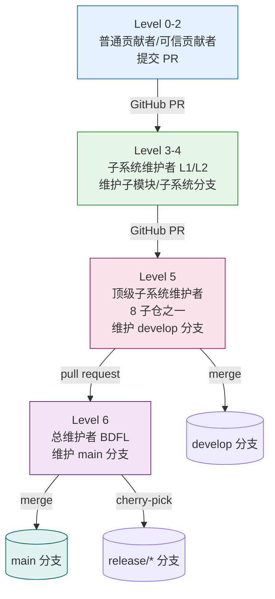
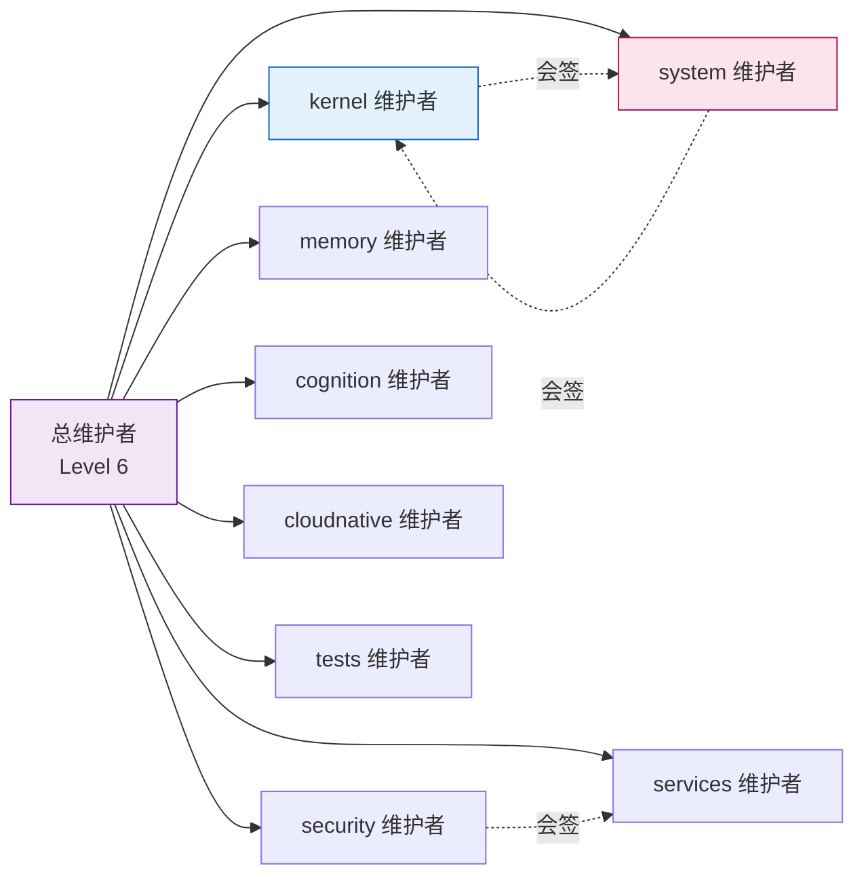
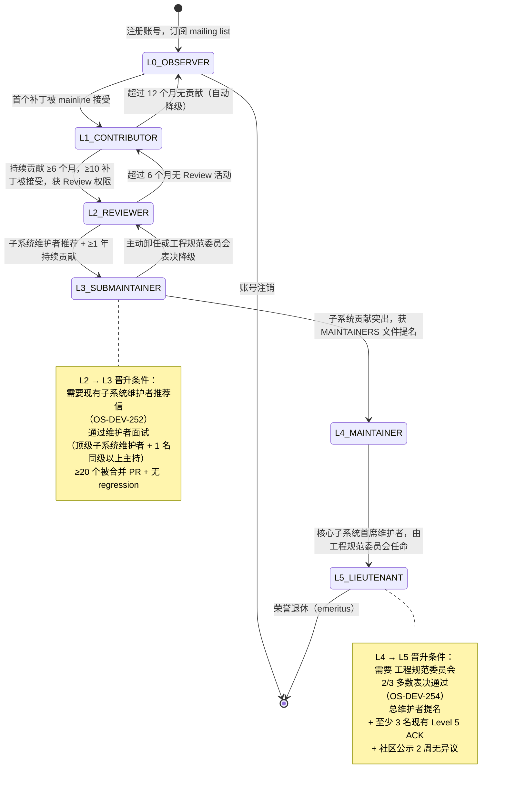
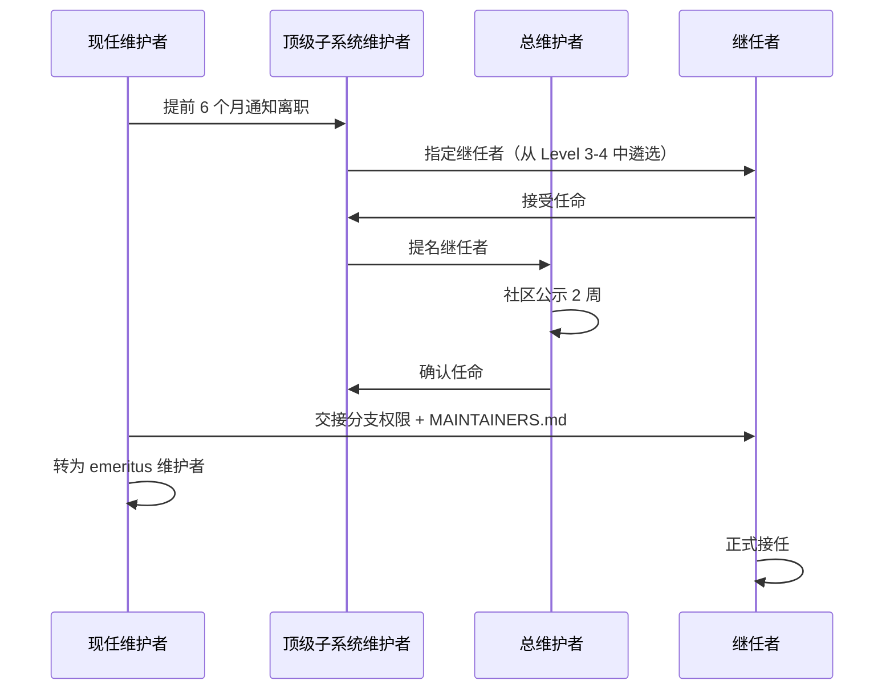
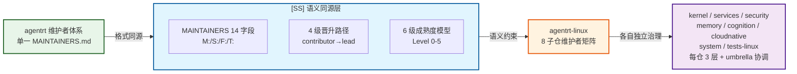

Copyright (c) 2025-2026 SPHARX Ltd. All Rights Reserved.

# agentrt-linux（AirymaxOS）维护者层级制度

> **文档定位**： agentrt-linux（AirymaxOS）120-development-process 模块第 2 卷——维护者层级制度（Lieutenant System）。本文档详述从普通贡献者到总维护者的信任链、MAINTAINERS 文件格式、8 子仓维护者分配、DCO 签名链条、6 级贡献者成熟度模型与维护者接班机制，是补丁生命周期（01 卷）在治理维度的展开。
> **版本**： 0.1.1（文档体系完成）/ 1.0.1（开发）
> **最后更新**： 2026-07-06
> **同源映射**： agentrt 维护者层级 + Linux 6.6 内核 MAINTAINERS 文件与 Lieutenant System
> **理论根基**： Linux 6.6 内核基线 + Airymax 五维正交 24 原则 + S-3 总体设计部 + A-3 人文关怀
> **核心约束**： IRON-9 v2 同源且部分代码共享（agentrt 用户态维护者层级与 agentrt-linux 内核发行版维护者层级并行，通过同源 API 变更评审保持协同）

---

## 1. 模块定位与 Lieutenant System 概述

本文档是 120-development-process 模块的第 2 卷，回答"谁有权合并什么、信任如何传递、维护者如何接班"。它继承 Linux 6.6 内核基线的 Lieutenant System（副手系统）——一条从普通贡献者到总维护者的信任链，并将其适配到 agentrt-linux 的 8 子仓 GitHub 治理结构。

### 1.1 与工程标准层的关系

工程标准层 `50-engineering-standards/07-maintainers-and-governance.md` 定义"治理规则与编号"（OS-STD-2XX），本文档定义"维护者层级在模块设计层的展开"（OS-DEV-2XX 与 OS-KER-2XX）。

### 1.2 Lieutenant System 核心理念

Linux 内核的 Lieutenant System 核心理念：每层 maintainer 信任下层 maintainer 的选择，但**信任不等于免责**。上层保留对下层补丁的最终否决权（NACK），且必须执行 CI 门禁验证。agentrt-linux 完全继承此理念。

### 1.3 关键术语

| 术语 | 定义 |
|------|------|
| Lieutenant System | 副手系统，从贡献者到总维护者的多级信任链 |
| MAINTAINERS.md | agentrt-linux 维护者清单文件，等价 Linux `MAINTAINERS` |
| DCO | Developer Certificate of Origin，开发者来源证明 v1.1 |
| Signed-off-by 链 | 补丁签名链，溯源补丁经过的每一层维护者 |
| emeritus | 荣誉维护者，已卸任但保留咨询身份 |
| MicroCoreRT | Airymax 微核心运行时基座，其维护者属 system/kernel 子仓交叉 |
| AgentsIPC | Airymax 智能体进程间通信协议，128B 定长消息头，协议改动需专门审查 |

---

## 2. 信任链层级（4 级 Chain of Trust）

agentrt-linux 信任链分为 4 级，对应 Linux 内核的 Contributor → Subsystem Maintainer → Top-level Maintainer → Chief Maintainer（Linus 角色等价物）。

### 2.1 信任链结构图



### 2.2 信任链长度约束

- **链可任意长，但很少超过 2-3 级**——超过 3 级通常意味着子系统拆分不合理。
- agentrt-linux 的 8 子仓各设 1 名顶级子系统维护者（Level 5），其下可有 2-3 层子系统维护者（Level 3-4）。

### 2.3 信任传递规则

- **OS-DEV-201**：上层 maintainer 拉取下层分支时，必须执行 7 层自动化验证的 CI 门禁层；CI 不通过的拉取请求禁止合并。
- **OS-DEV-202**：上层 maintainer 保留对下层补丁的最终否决权（NACK）；下层 maintainer 必须响应 NACK 并修改或撤回。
- **OS-DEV-203**：信任链中任意一层断裂（如某层 maintainer 失联超过 30 天），上层 maintainer 可越级接管其分支，并启动维护者补选流程（详见第 8 节）。
- **OS-KER-201**：涉及 MicroCoreRT 内核适配的补丁，必须额外经 system 子仓顶级维护者会签，因其影响同源 ABI。

---

## 3. MAINTAINERS 文件 14 字段格式

agentrt-linux 继承 Linux 6.6 内核 `MAINTAINERS` 文件的 14 字段格式，适配为 `MAINTAINERS.md`（每个子仓一份）。

### 3.1 14 字段定义

| 字段 | 含义 | agentrt-linux 适配 |
|------|------|---------------|
| `M:` | Mail patches to（维护者邮箱） | 子系统维护者 GitHub handle + 邮箱 |
| `R:` | Designated Reviewer（指定审查者） | 必须在 PR 中 CC 的审查者 |
| `L:` | Mailing list（邮件列表） | 子仓 GitHub issue tracker URL |
| `S:` | Status（状态） | Supported/Maintained/Odd Fixes/Orphan/Obsolete |
| `W:` | Web-page（状态网页） | 子系统 wiki 或文档路径 |
| `Q:` | Patchwork（补丁追踪） | GitHub Projects 看板 URL |
| `B:` | Bug tracker（缺陷追踪） | 子仓 issue tracker 的 bug 模板 URL |
| `C:` | Chat（即时通讯） | 子仓 Discord/Matrix 频道 |
| `P:` | Subsystem Profile（子系统手册） | 子系统提交手册的 in-tree 文件路径 |
| `T:` | SCM tree（源码树） | git 分支类型与位置（如 `git develop`） |
| `F:` | Files（文件匹配） | 通配符模式，尾斜杠含子目录 |
| `X:` | Excluded files（排除文件） | 与 `F:` 配合排除特定子目录 |
| `N:` | Files regex（正则匹配） | 路径正则，匹配时回溯 git log |
| `K:` | Content regex（内容正则） | 补丁/文件内容正则，匹配关键符号 |

### 3.2 MAINTAINERS.md 示例

```
AGENTSIPC PROTOCOL
M:	Alice Chen <alice@airymaxos.org>
R:	Bob Li <bob@airymaxos.org>
L:	https://github.com/agentrt-linux/airymaxos-system/issues
S:	Maintained
W:	docs/AirymaxOS/30-interfaces/
Q:	https://github.com/orgs/agentrt-linux/projects/agentsipc
B:	https://github.com/agentrt-linux/airymaxos-system/issues/new?template=bug.md
C:	matrix:#agentsipc
P:	120-development-process/01-patch-lifecycle.md
T:	git https://github.com/agentrt-linux/airymaxos-system.git develop
F:	include/uapi/agentsipc/
F:	kernel/ipc/agentsipc.c
X:	kernel/ipc/agentsipc/test/
N:	[^a-z]agentsipc
K:	\b(agentsipc_send|agentsipc_recv)\b

MICROCORERT KERNEL ADAPTATION
M:	Carol Wang <carol@airymaxos.org>
R:	Dave Zhang <dave@airymaxos.org>
L:	https://github.com/agentrt-linux/airymaxos-kernel/issues
S:	Supported
T:	git https://github.com/agentrt-linux/airymaxos-kernel.git develop
F:	kernel/microcorert/
K:	\b(microcorert_init|microcorert_dispatch)\b
```

### 3.3 字段规则

- **OS-DEV-211**：每个子仓必须维护一份 `MAINTAINERS.md`，列出该子仓的所有维护者、审查者、文件路径映射、PR SLA。
- **OS-DEV-212**：`F:` 与 `X:` 模式必须可被 `get_maintainer.pl` 等价脚本解析；每模式一行，多 `F:` 行允许。
- **OS-DEV-213**：`S:` 状态变更（如 Maintained → Orphan）必须由顶级子系统维护者签字，并在 commit message 说明原因。
- **OS-DEV-214**：`K:` 内容正则用于自动识别补丁涉及的子系统；缺失 `K:` 的条目将无法被 CI 自动路由审查者。

---

## 4. agentrt-linux 8 子仓维护者分配

8 子仓各设 1 名顶级子系统维护者（Level 5），负责该子仓的 `develop` 分支与跨仓协同。

### 4.1 8 子仓维护者矩阵

| 子仓 | 顶级维护者角色 | 核心职责 | 同源 API |
|------|--------------|---------|---------|
| kernel | 内核子系统维护者 | MicroCoreRT 内核适配、驱动模型、调度 | MicroCoreRT |
| services | 服务子系统维护者 | 12 daemons（`*_d`）、用户态服务 | - |
| security | 安全子系统维护者 | Cupolas 安全穹顶、LSM、capability | Cupolas |
| memory | 内存子系统维护者 | MemoryRovol 四层记忆、MGLRU 多代 LRU、CXL/PMEM | MemoryRovol |
| cognition | 认知子系统维护者 | CoreLoopThree 三层认知循环 | CoreLoopThree |
| cloudnative | 云子系统维护者 | 云原生 Agent 部署、容器化 | - |
| system | 系统接口子系统维护者 | 系统调用、ABI、AgentsIPC 128B 协议 | AgentsIPC |
| tests-linux | 测试子系统维护者 | KUnit/kselftest/Agent 行为契约测试 | - |

### 4.2 跨子仓会签规则

- **OS-DEV-221**：影响 AgentsIPC 128B 消息头的补丁，必须由 system 子仓顶级维护者会签，并经工程规范委员会额外签字。
- **OS-DEV-222**：影响 MicroCoreRT 同源语义的补丁，必须由 kernel 子仓顶级维护者会签，并通知 agentrt 端同步评审。
- **OS-DEV-223**：跨 3 个及以上子仓的变更，必须由总维护者指派协调人，协调人负责跨仓 PR 的依赖排序。
- **OS-KER-211**：kernel 子仓的 ABI 改动必须同步知会 system 子仓维护者，因 AgentsIPC 协议依赖内核 syscall 语义。

### 4.3 子仓维护者分配图



---

## 5. DCO 1.1 + Signed-off-by 链条

agentrt-linux 继承 Linux 内核的 Developer Certificate of Origin v1.1，并将其适配为 GitHub DCO bot 自动验证。

### 5.1 DCO 1.1 文本（摘要）

> Developer Certificate of Origin Version 1.1
> Copyright (C) 2004, 2006 The Linux Foundation.
> By making a contribution to this project, I certify that:
> (a) The contribution was created in whole or in part by me ...
> (b) The contribution is based upon previous work ...
> (c) The contribution was provided directly to me by some other person ...

### 5.2 Signed-off-by 链条语义

每个 `Signed-off-by:` 表示签名者参与并背书该补丁。链条溯源补丁经过的每一层维护者：

```
Signed-off-by: Author Name <author@example.com>          # 原作者
Signed-off-by: Subsystem Maintainer <sm@airymaxos.org>   # 子系统维护者背书
Signed-off-by: Top-level Maintainer <tsm@airymaxos.org>  # 顶级维护者背书
```

### 5.3 DCO 规则

- **OS-DEV-231**：所有 commit 必须用 `git commit -s` 添加 `Signed-off-by:` 签名；无签名的 PR 由 DCO bot 自动阻塞合并。
- **OS-DEV-232**：`Signed-off-by:` 链条必须连续——下层维护者签名后，上层维护者追加签名时不得移除下层签名。
- **OS-DEV-233**：`Reviewed-by:`/`Acked-by:`/`Tested-by:`/`Suggested-by:` 标签必须由对应人员本人添加（GitHub 评论形式），作者不得代签。
- **OS-DEV-234**：DCO 签名者必须与 git author/committer 身份一致；身份不一致的 commit 将被 DCO bot 拒绝。

### 5.4 标签语义对照

| 标签 | 语义 | 谁可添加 |
|------|------|---------|
| `Signed-off-by:` | DCO 背书，证明来源合法 | 作者 + 每层传递维护者 |
| `Reviewed-by:` | 已进行完整技术审查（见第 6 节） | 审查者本人 |
| `Acked-by:` | 认可但未深入审查（常用于跨子系统） | 相关维护者 |
| `Tested-by:` | 已测试验证（含环境说明） | 测试者本人 |
| `Suggested-by:` | 提出原始思路 | 思路提出者 |
| `Reported-by:` | 报告 bug（含 bug tracker 链接） | bug 报告者 |

---

## 6. Reviewer's Statement of Oversight（审查者声明）

agentrt-linux 沿用 Linux 内核的 `Reviewed-by:` 标签语义——给出 `Reviewed-by:` 即声明以下四项承诺：

### 6.1 四项声明

> (a) 我已对该补丁进行了技术审查，评估其是否适合进入主线。
> (b) 任何与补丁相关的问题、疑虑或提问已反馈给提交者，且我对提交者的回应满意。
> (c) 虽然本提交可能仍有改进空间，但我认为它目前是对内核的有价值修改，且不存在已知阻碍合并的问题。
> (d) 我已审查该补丁并认为其健全，但我（除非另行明确声明）不对其达成既定目的或在任何场景下正常运行作任何担保。

### 6.2 审查者规则

- **OS-DEV-241**：`Reviewed-by:` 标签的给予者必须实际进行技术审查；流于形式的"橡皮图章"审查一经发现，审查者的 Reviewed-by 权限将被暂停。
- **OS-DEV-242**：审查者 NAK 必须附带技术理由，禁止"感觉不对"式的无理由 NAK。
- **OS-DEV-243**：审查者给予 `Reviewed-by:` 后，若发现遗漏问题，可主动撤销该标签（GitHub 评论 `Reviewed-by: withdraw`）。
- **OS-KER-221**：涉及 AgentsIPC 协议或 MicroCoreRT 内核适配的补丁，`Reviewed-by:` 必须来自该子系统顶级维护者或其指定审查者，普通审查者的标签不足以合并。

### 6.3 审查礼仪（A-3 人文关怀）

- 禁止在 PR 评论中人身攻击、贬低、或质疑审查者动机；违反者将被暂时禁言。
- 回复审查意见时使用 interleaved（inline）回复，禁止 top-posting；保留所有 Cc 收件人。
- 即使不同意审查意见，回复仍须礼貌，并明确说明修改内容——审查是耗时耗力的过程。
- 每条未导致代码改动的审查意见都应转化为代码注释或 changelog 条目（Andrew Morton 原则）。

---

## 7. 6 级贡献者成熟度模型（Level 0-5）

agentrt-linux 采用与 agentrt 同源的 6 级贡献者成熟度模型，Level 0 起步至 Level 5 顶级子系统维护者，Level 6 为总维护者（BDFL，特殊场景）。

### 7.1 6 级成熟度矩阵

| 级别 | 角色 | 能力 | 晋升条件 |
|------|------|------|---------|
| Level 0 | Newcomer（新人） | 提交首个 PR，需 mentor 指导 | 完成首个被合并 PR |
| Level 1 | Contributor（贡献者） | 独立提交符合规范的 PR | 1 个被合并 PR + 通过 DCO |
| Level 2 | Trusted Contributor（可信贡献者） | PR 可免 Early Review 直入 Wider Review | 5 个被合并 PR + 无 regression |
| Level 3 | Subsystem Maintainer L1（子模块维护者） | 维护子模块分支 | 20 个被合并 PR + 维护者面试 |
| Level 4 | Subsystem Maintainer L2（子系统维护者） | 维护子系统分支 | 维护子模块 1 年 + 无重大事故 |
| Level 5 | Top-level Subsystem Maintainer（顶级子系统维护者） | 维护 8 子仓之一 + develop 分支 | 由总维护者任命 + 社区 ACK |
| Level 6 | Chief Maintainer（总维护者） | 维护 main 分支 + BDFL | 特殊场景（继承或选举） |

### 7.2 晋升规则

- **OS-DEV-251**：从 Level 1 晋升 Level 2 需至少 5 个被合并的 PR，且无 regression 记录。
- **OS-DEV-252**：从 Level 2 晋升 Level 3 需至少 20 个被合并的 PR，且通过维护者面试（由顶级子系统维护者 + 1 名同级以上维护者主持）。
- **OS-DEV-253**：从 Level 3 晋升 Level 4 需维护子模块分支至少 1 年，且无重大事故（regression 漏检、安全漏洞等）。
- **OS-DEV-254**：Level 5 任命需总维护者提名 + 至少 3 名现有 Level 5 维护者 ACK + 社区公示 2 周无异议。

### 7.3 新人起步建议

继承 Andrew Morton 的建议：**新人从修复真实 bug 起步**，而非从拼写错误或风格修正开始。原因：真实 bug 修复让新人熟悉完整流程（设计、审查、测试、合并、维护）；真实 bug 修复有真实用户受益，社区会认真审查；风格修正和拼写修复被视为噪音——它们占用审查者时间但不带来用户价值。

### 7.4 贡献者晋升状态机

贡献者从 L0 观察者到 L5 顶级子系统维护者的完整晋升与降级状态转换，覆盖持续贡献、推荐任命与自动降级全路径：



**状态转换条件**：

| 从状态 | 到状态 | 触发条件 | 系统行为 |
|--------|--------|---------|---------|
| — | L0_OBSERVER | 注册 GitHub 账号，订阅子仓 mailing list | 贡献者进入成熟度模型，获得 issue 评论与 PR 提交权限（需 mentor 指导） |
| L0_OBSERVER | L1_CONTRIBUTOR | 首个补丁被 mainline 接受（合并到 `main` 分支） | 独立提交符合规范的 PR，通过 DCO bot 验证（OS-DEV-231），获得独立提交权限 |
| L0_OBSERVER | —（终态） | 账号注销 | 贡献者退出成熟度模型，历史贡献记录保留供审计 |
| L1_CONTRIBUTOR | L2_REVIEWER | 持续贡献 ≥6 个月，≥10 个补丁被接受，无 regression 记录 | 获 Review 权限，PR 可免 Early Review 直入 Wider Review（OS-DEV-251） |
| L1_CONTRIBUTOR | L0_OBSERVER | 超过 12 个月无贡献（自动降级） | 撤销独立提交权限，降级为观察者，保留历史贡献记录 |
| L2_REVIEWER | L3_SUBMAINTAINER | 现有子系统维护者推荐 + ≥1 年持续贡献 + ≥20 个合并 PR + 通过维护者面试 | 获得子模块分支维护权限，负责子模块 PR 审查与合并（OS-DEV-252） |
| L2_REVIEWER | L1_CONTRIBUTOR | 超过 6 个月无 Review 活动（自动降级） | 撤销 Review 权限，降级为普通贡献者 |
| L3_SUBMAINTAINER | L4_MAINTAINER | 子系统贡献突出，获 MAINTAINERS 文件 `M:` 字段提名 + 维护子模块 ≥1 年 + 无重大事故 | 获得子系统分支维护权限，管理子系统 PR 审查与合并（OS-DEV-253） |
| L3_SUBMAINTAINER | L2_REVIEWER | 主动卸任或工程规范委员会表决降级 | 撤销子模块分支维护权限，降级为可信贡献者 |
| L4_MAINTAINER | L5_LIEUTENANT | 核心子系统首席维护者，工程规范委员会 2/3 多数表决通过 + 总维护者提名 + 3 名 Level 5 ACK + 社区公示 2 周 | 获得 8 子仓之一 develop 分支维护权限，成为顶级子系统维护者（OS-DEV-254） |
| L5_LIEUTENANT | —（终态） | 荣誉退休（emeritus），提前 6 个月通知离职 | 保留 GitHub read 权限与 issue/PR 评论权限，撤销合并权限，转为 emeritus 身份（OS-DEV-261） |

---

## 8. 维护者接班机制与 emeritus

### 8.1 接班触发条件

- **OS-DEV-261**：维护者离职需提前 6 个月通知，启动继任者培养流程。
- **OS-DEV-262**：维护者失联超过 30 天（含 PR 不响应、issue 不处理），上层 maintainer 可越级接管其分支。
- **OS-DEV-263**：LTS 维护者离职需提前 6 个月通知，并完成至少 1 个 LTS 维护版本的交接。
- **OS-DEV-264**：连续 3 个 LTS 季度维护版本延期的维护者，自动触发接班评估。

### 8.2 接班流程



### 8.3 emeritus 维护者

emeritus（荣誉维护者）是已卸任但仍保留咨询身份的维护者：

- 保留 GitHub 仓库 read 权限与 issue/PR 评论权限。
- 不再拥有分支合并权限（merge 权限移交继任者）。
- 在 `MAINTAINERS.md` 中以 `S: Orphan` 标记其原辖区域，直至继任者接手后改为新维护者。
- emeritus 维护者的历史 `Reviewed-by:` 标签仍然有效，但其后续审查意见需由现任维护者确认。
- **OS-DEV-271**：emeritus 维护者不得阻塞继任者的合并决策；若 emeritus 与继任者产生分歧，以继任者决定为准。
- **OS-DEV-272**：emeritus 维护者可参与 Level 5 维护者任命的社区公示讨论，但不计入 ACK 法定人数。

### 8.4 Orphan 区域处理

- 当维护者离职且无继任者时，其辖区域标记为 `S: Orphan`。
- **OS-DEV-281**：`Orphan` 区域的 PR 由顶级子系统维护者直接处理，直至新维护者接手。
- **OS-DEV-282**：`Orphan` 区域连续 2 个发布周期无新维护者接手，由总维护者决定是否移除或合并到相邻子系统。

---

## 9. 五维原则映射

本文档维护者层级与 Airymax 五维正交 24 原则的映射如下：

| 原则 | 含义 | 在本文档的体现 |
|------|------|--------------|
| **S-1 反馈闭环** | 感知-决策-执行-反馈闭环 | 维护者层级构成反馈闭环，下层 PR 反馈到上层 merge 决策 |
| **S-3 总体设计部** | 统筹系统整体设计 | 总维护者 + 8 子仓顶级子系统维护者构成总体设计部 |
| **S-4 涌现性管理** | 简单规则引导有益整体行为 | Lieutenant System 通过简单信任传递规则引导社区涌现 |
| **K-2 接口契约化** | 双层稳定性哲学 | AgentsIPC 128B 改动需工程规范委员会签字 + 会签（OS-DEV-221） |
| **C-2 增量演化** | 渐进式演进每步可验证 | 6 级成熟度模型增量晋升 + Signed-off-by 链条逐层背书 |
| **E-6 错误可追溯** | 错误可溯源可追踪 | Signed-off-by 链条 + DCO 1.1 溯源每层维护者 |
| **E-7 文档即代码** | 文档与代码同源同审 | MAINTAINERS.md 14 字段 + 子系统手册（P: 字段） |
| **A-3 人文关怀** | 不烧桥管理哲学 | 审查礼仪 + emeritus 荣誉身份 + 接班 6 个月缓冲 |
| **IRON-9 v2 同源且部分代码共享** | 同源 API 并行演进 | MicroCoreRT/AgentsIPC 同源 API 变更需两端维护者协同评审 |

---

## 10. 同源 agentrt 映射

本文档的维护者层级与 agentrt 用户态运行时维护者层级同源且部分代码共享（IRON-9 v2 同源且部分代码共享）：

| 维度 | agentrt（用户态） | agentrt-linux（内核发行版） |
|------|------------------|----------------------|
| 维护者文件 | `MAINTAINERS.md` | `MAINTAINERS.md`（同源格式） |
| 信任链层级 | 4 级 | 4 级（同源） |
| DCO | DCO 1.1 + DCO bot | DCO 1.1 + DCO bot（同源） |
| 成熟度模型 | 6 级（Level 0-5） | 6 级（Level 0-5，同源） |
| 同源 API 维护者 | MicroCoreRT/AgentsIPC/Cupolas/MemoryRovol/CoreLoopThree 维护者 | 同源 API 在内核态维护者需与 agentrt 端协同评审 |
| 接班机制 | 6 个月缓冲 + emeritus | 6 个月缓冲 + emeritus（同源） |
| 季度评审 | 同源 API 维护者对齐 | 同源 API 维护者对齐（同源） |

### 10.1 同源 API 维护者协同

MicroCoreRT 与 AgentsIPC 同源 API 的维护者变更必须双向通知：agentrt 端维护者离职需通知 agentrt-linux 端对应维护者，反之亦然；继任者任命需经两端共同 ACK，确保同源 API 的一致性不因单端维护者变更而漂移。

### 10.2 IRON-9 v2 三层共享模型

IRON-9 v2 三层共享模型将 agentrt（用户态运行时）与 agentrt-linux（内核发行版）之间的同源关系细分为三个正交层次：[SC] 共享契约层（头文件级代码共享）、[SS] 语义同源层（语义两端一致但实现独立）、[IND] 完全独立层（发行版固有责任）。本节聚焦维护者层级的三层映射。

#### 10.2.1 三层模型概览

| 层次 | 共享程度 | 维护者层级内容 |
|------|---------|-------------|
| **[SC] 共享契约层** | 无——维护者层级为治理规范层，不涉及代码共享 | 无 [SC] 层头文件；维护者体系属治理规范层，两端无头文件级代码共享 |
| **[SS] 语义同源层** | 语义两端一致，实现独立 | MAINTAINERS 文件格式（M:/S:/F:/T:）、子系统归属、维护者晋升路径、代码审查责任 |
| **[IND] 完全独立层** | agentrt-linux 独有 | 8 子仓维护者层级矩阵、umbrella repo 总协调、子仓独立 release manager、SIG 治理 |

#### 10.2.2 [SC] 共享契约层

无直接 [SC] 头文件。维护者层级属于治理规范层，两端共享的是治理语义（MAINTAINERS 文件格式、晋升路径、审查责任）而非代码头文件。同源 API 的代码契约共享（MicroCoreRT/AgentsIPC 头文件）由各自的代码仓库承载，维护者体系仅确保这些契约的维护者变更遵循双向通知（§10.1）。两端共享的代码契约由 `30-interfaces/` 模块的协议文档与头文件定义，维护者层级不引入额外的 [SC] 层头文件依赖。

#### 10.2.3 [SS] 语义同源层

[SS] 层的维护者治理语义两端一致，但仓库结构与治理范围独立：agentrt 用户态使用单一 MAINTAINERS.md 管理全部模块，agentrt-linux 使用 8 子仓各自独立的 MAINTAINERS.md + umbrella repo 总协调。两端语义映射如下：

| 语义维度 | agentrt（用户态运行时） | agentrt-linux（内核发行版） |
|------|------------------------|------------------------|
| MAINTAINERS 文件格式 | M:/S:/F:/T: 14 字段（同源） | M:/S:/F:/T: 14 字段（同源，字段级一致） |
| 子系统归属 | 模块级 ownership（如 MicroCoreRT 模块） | 子仓级 ownership（如 kernel 子仓含 MicroCoreRT） |
| 维护者晋升路径 | contributor→reviewer→maintainer→subsystem lead | contributor→reviewer→maintainer→subsystem lead（同源 4 级） |
| 代码审查责任 | PR 必须由所属模块 maintainer 审查 | PR 必须由所属子仓 maintainer 审查（同源语义） |
| DCO 签名链 | Signed-off-by 逐层背书 | Signed-off-by 逐层背书（同源） |
| 成熟度模型 | 6 级（Level 0-5） | 6 级（Level 0-5，同源） |
| 接班机制 | 6 个月缓冲 + emeritus | 6 个月缓冲 + emeritus（同源） |

两端在维护者治理语义上完全同源——MAINTAINERS 文件 14 字段格式、4 级晋升路径、6 级成熟度模型、接班缓冲机制的概念模型一致——但 agentrt-linux 将治理语义落地为 8 子仓的分布式维护者矩阵（每仓独立 MAINTAINERS.md + 总协调），而 agentrt 用户态运行时保持单一 MAINTAINERS.md 的集中式治理。这种语义同源使得维护者从 agentrt 迁移到 agentrt-linux 时，MAINTAINERS 文件格式与晋升路径无需重新学习，仅需适应多仓治理结构。

#### 10.2.4 [IND] 完全独立层

[IND] 层是 agentrt-linux 8 子仓治理架构的固有责任，agentrt 用户态运行时不涉及：

| 独立实现项 | 说明 | agentrt 是否涉及 |
|------|------|------|
| 8 子仓维护者层级矩阵 | kernel: 3 层 / services: 3 层 / security: 3 层 / memory: 3 层 / cognition: 3 层 / cloudnative: 3 层 / system: 3 层 / tests-linux: 3 层 | 否（单一 MAINTAINERS.md） |
| umbrella repo 总协调 | 总维护者协调 8 子仓维护者任命与跨仓争议 | 否 |
| 子仓独立 release manager | 每仓有独立 release manager 签发 release | 否 |
| SIG（Special Interest Group）治理 | 跨子仓特殊兴趣组（如安全 SIG、IPC SIG） | 否 |
| 跨仓会签 SOP | 涉及多仓的 PR 须多仓 maintainer 会签 | 否 |
| 子仓独立 emeritus 管理 | 每仓独立管理 emeritus 维护者名单 | 否 |

#### 10.2.5 跨态协作流



维护者协作流：agentrt 用户态使用单一 MAINTAINERS.md 管理全部模块的维护者层级，MAINTAINERS 文件格式（M:/S:/F:/T: 14 字段）、晋升路径（contributor→reviewer→maintainer→subsystem lead 4 级）、成熟度模型（Level 0-5 6 级）由 [SS] 语义同源层两端共享。agentrt-linux 将这些语义落地为 8 子仓的分布式维护者矩阵（[IND] 完全独立——kernel/services/security/memory/cognition/cloudnative/system/tests-linux 每仓 3 层维护者 + umbrella repo 总协调 + 子仓独立 release manager + SIG 治理），每仓独立 MAINTAINERS.md 但遵循同源格式。两端通过 [SS] 层的 MAINTAINERS 格式同源实现维护者经验的平滑迁移，同源 API 维护者变更（MicroCoreRT/AgentsIPC）通过 §10.1 的双向通知机制确保两端一致性。

---

## 11. 相关文档与参考材料

- `120-development-process/README.md`（模块主索引）/ `01-patch-lifecycle.md`（补丁生命周期 6 阶段）
- `50-engineering-standards/05-development-process.md`（开发流程规范层，OS-STD-XXX）/ `07-maintainers-and-governance.md`（维护者治理规则）
- `50-engineering-standards/06-toolchain-and-automation.md`（7 层验证、CI 门禁）/ `04-engineering-philosophy.md`（双层稳定性、S-3 总体设计部）
- `30-interfaces/`（AgentsIPC 128B 协议、4 层接口分级、工程规范委员会）
- 参考材料：Linux 6.6 `MAINTAINERS`（维护者文件 14 字段范本）、`Documentation/process/developing-process.rst`（Lieutenant System）、`Documentation/maintainer/maintainer-entry-profile.rst`（子系统手册）

---

## 12. 文档版本与维护

| 版本 | 日期 | 变更 | 维护者 |
|------|------|------|--------|
| 0.1.1 | 2026-07-06 | 初始占位版本，完成信任链 + MAINTAINERS + 成熟度模型 + 接班机制 | 120-development-process 模块维护者 |
| 1.0.1 | 开发中 | 补充 emeritus 案例库、维护者面试题库、跨子仓会签 SOP | 120-development-process 模块维护者 |

### 12.1 维护规则

- 本文档由 120-development-process 模块维护者负责。任何对维护者层级模型的修改必须先在 `50-engineering-standards/07-maintainers-and-governance.md` 同步。OS-DEV-2XX 与 OS-KER-2XX 规则编号的变更需同步到规则编号注册表。MAINTAINERS.md 的 14 字段格式与 Linux 6.6 内核基线 `MAINTAINERS` 保持字段级一致，新增字段需经总维护者审批。

---

## 附录 A: 接口定义

> **附录定位**： 本附录汇集维护者层级制度所需的完整接口契约，供 1.0.1 开发阶段直接参照实现。所有数据结构与函数签名对齐 Linux 6.6 内核 `MAINTAINERS` 文件格式（14 字段）、Lieutenant System 信任链模型、DCO 1.1 标准，以及 agentrt-linux 8 子仓维护者分配专属契约（`include/airymax/maintainer_types.h`）。

### A.1 核心数据结构

#### A.1.1 maintainer_entry — MAINTAINERS 文件条目

```c
/**
 * struct maintainer_entry - MAINTAINERS 文件单个条目
 *
 * 描述 MAINTAINERS.md 文件中的一个子系统条目（14 字段格式）。
 * 由 maintainers_parse() 解析填充，maintainers_lookup() 查询。
 *
 * 对齐 Linux 6.6 内核 MAINTAINERS 文件 14 字段格式
 * 对齐 agentrt-linux §3 MAINTAINERS 文件 + OS-DEV-211 ~ OS-DEV-214
 */
struct maintainer_entry {
    const char *subsystem_name;   /* @field: 子系统名（首行标题，如 "AGENTSIPC PROTOCOL"） */

    /* M: Mail patches to（维护者） */
    const char **maintainers;      /* @field: M: 维护者列表（"姓名 <邮箱>" 格式） */
    int          maintainer_count; /* @field: 维护者数量 */

    /* R: Designated Reviewer（指定审查者） */
    const char **reviewers;       /* @field: R: 审查者列表 */
    int          reviewer_count;  /* @field: 审查者数量 */

    /* L: Mailing list（邮件列表 → GitHub issue tracker） */
    const char *issue_tracker;    /* @field: L: 子仓 GitHub issue tracker URL */

    /* S: Status（状态） */
    int          status;          /* @field: S: 状态枚举（S_SUPPORTED/MAINTAINED/ODD_FIXES/ORPHAN/OBSOLETE） */

    /* W: Web-page（状态网页） */
    const char *web_page;         /* @field: W: 子系统 wiki 或文档路径 */

    /* Q: Patchwork（补丁追踪 → GitHub Projects） */
    const char *patchwork_url;    /* @field: Q: GitHub Projects 看板 URL */

    /* B: Bug tracker（缺陷追踪） */
    const char *bug_tracker;      /* @field: B: issue tracker bug 模板 URL */

    /* C: Chat（即时通讯） */
    const char *chat_channel;     /* @field: C: Discord/Matrix 频道 */

    /* P: Subsystem Profile（子系统手册） */
    const char *profile_path;     /* @field: P: 子系统手册 in-tree 文件路径 */

    /* T: SCM tree（源码树） */
    const char *scm_tree;         /* @field: T: git 分支类型与位置（如 "git <url> develop"） */

    /* F: Files（文件匹配） */
    const char **file_patterns;   /* @field: F: 通配符文件模式列表（尾斜杠含子目录） */
    int          file_pattern_count; /* @field: F: 模式数量 */

    /* X: Excluded files（排除文件） */
    const char **excluded_patterns; /* @field: X: 排除文件模式列表 */
    int          excluded_count;  /* @field: X: 排除模式数量 */

    /* N: Files regex（正则匹配） */
    const char *files_regex;      /* @field: N: 路径正则（匹配时回溯 git log） */

    /* K: Content regex（内容正则） */
    const char *content_regex;    /* @field: K: 补丁/文件内容正则（自动识别子系统，OS-DEV-214） */

    /* 子仓归属 */
    const char *subrepo;          /* @field: 所属子仓（8 子仓之一） */
};
```

#### A.1.2 contributor_level — 贡献者成熟度等级

```c
/**
 * struct contributor_level - 贡献者成熟度等级定义
 *
 * 描述 Level 0-5 六级成熟度模型中单个等级的能力与晋升条件。
 * 由 level_promote() 消费进行晋升评估。
 *
 * 对齐 agentrt-linux §7 6 级贡献者成熟度模型
 * 对齐 OS-DEV-251 ~ OS-DEV-254
 */
struct contributor_level {
    int          level_id;        /* @field: LEVEL_0 ~ LEVEL_5 枚举 */
    const char *level_name;       /* @field: 等级名称（如 "Newcomer"/"Contributor"） */
    const char *role;             /* @field: 角色描述（如 "子模块维护者"） */
    const char **capabilities;    /* @field: 该等级能力列表（如 "提交 PR"） */
    int          capability_count;/* @field: 能力数量 */

    /* 晋升条件 */
    uint32_t    min_merged_prs;   /* @field: 最少被合并 PR 数（Level 2 需 5 个，OS-DEV-251） */
    bool        requires_interview; /* @field: 是否需维护者面试（Level 3，OS-DEV-252） */
    uint32_t    min_maintain_months; /* @field: 最少维护时长（月，Level 4 需 12 月，OS-DEV-253） */
    bool        requires_chief_appoint; /* @field: 是否需总维护者任命（Level 5，OS-DEV-254） */
    uint32_t    min_ack_count;    /* @field: 任命需最少 ACK 数（Level 5 需 3 名，OS-DEV-254） */
    uint32_t    notice_days;     /* @field: 社区公示天数（Level 5 需 2 周 = 14 天，OS-DEV-254） */
    bool        requires_no_regression; /* @field: 是否要求无 regression 记录（Level 2，OS-DEV-251） */
    bool        requires_no_major_incident; /* @field: 是否要求无重大事故（Level 4，OS-DEV-253） */
};
```

#### A.1.3 dco_signoff — DCO 签名

```c
/**
 * struct dco_signoff - DCO 签名条目
 *
 * 描述一个 Signed-off-by 签名的完整信息。
 * 由 dco_validate() 校验签名合法性。
 *
 * 对齐 Linux 6.6 内核 DCO 1.1 标准
 * 对齐 agentrt-linux §5 DCO + OS-DEV-231 ~ OS-DEV-234
 */
struct dco_signoff {
    const char *signer_name;      /* @field: 签名者姓名 */
    const char *signer_email;     /* @field: 签名者邮箱 */
    const char *signer_github_handle; /* @field: 签名者 GitHub handle */
    uint64_t    signoff_timestamp; /* @field: 签名时间戳（Unix） */
    int          signer_level;    /* @field: 签名者成熟度等级（LEVEL_0 ~ LEVEL_6） */
    int          chain_position;  /* @field: 在签名链中的位置（0=原作者，1=第一层维护者...） */
    bool        identity_verified; /* @field: 身份是否已验证（与 git author 一致，OS-DEV-234） */
    bool        is_original_author; /* @field: 是否为补丁原作者 */
    const char *commit_sha;       /* @field: 关联的 commit SHA */
};
```

#### A.1.4 reviewer_statement — 审查者声明

```c
/**
 * struct reviewer_statement - 审查者声明（Reviewer's Statement of Oversight）
 *
 * 描述 Reviewed-by 标签背后的四项声明承诺。
 * 对应 §6.1 四项声明。
 *
 * 对齐 Linux 6.6 内核 Reviewed-by 语义
 * 对齐 agentrt-linux §6 Reviewer's Statement
 */
struct reviewer_statement {
    const char *reviewer_name;    /* @field: 审查者姓名 */
    const char *reviewer_email;   /* @field: 审查者邮箱 */
    int          reviewer_level;  /* @field: 审查者成熟度等级 */
    const char *patch_sha;        /* @field: 被审查的补丁 SHA */
    uint64_t    review_date;      /* @field: 审查日期（Unix 时间戳） */

    /* 四项声明（§6.1） */
    bool        stmt_technical_review; /* @field: (a) 已进行技术审查 */
    bool        stmt_concerns_resolved; /* @field: (b) 疑虑已反馈并满意回应 */
    bool        stmt_valuable_change; /* @field: (c) 认为是有价值修改 */
    bool        stmt_no_warranty;   /* @field: (d) 不作任何运行担保 */

    /* 审查结论 */
    int          verdict;          /* @field: 审查结论（REVIEW_VERDICT_ACK/NAK/COMMENT） */
    bool        rubber_stamp;      /* @field: 是否检测到橡皮图章（OS-DEV-241） */
    bool        withdrawn;         /* @field: 是否已撤销（OS-DEV-243） */
    const char *withdraw_reason;   /* @field: 撤销理由 */
    const char *nak_reason;       /* @field: NAK 技术理由（OS-DEV-242） */

    /* 特殊约束 */
    bool        requires_top_level; /* @field: 是否需顶级维护者审查（AgentsIPC/MicroCoreRT，OS-KER-221） */
    const char *required_subsystem; /* @field: 需哪个子系统顶级维护者审查 */
};
```

#### A.1.5 trust_chain — 信任链层级

```c
/**
 * struct trust_chain - 信任链层级定义（4 级 Chain of Trust）
 *
 * 描述 Lieutenant System 4 级信任链中单个层级的信息。
 * 对应 §2 信任链结构图。
 *
 * 对齐 Linux 6.6 内核 Lieutenant System
 * 对齐 agentrt-linux §2 + OS-DEV-201 ~ OS-DEV-203
 */
struct trust_chain {
    int          chain_level;     /* @field: 信任链层级（0-3，对应 Level 0-2/3-4/5/6） */
    const char *level_name;       /* @field: 层级名称（如 "Contributor"/"Subsystem Maintainer"） */
    const char *role;             /* @field: 角色描述 */
    const char *maintained_branch; /* @field: 维护的分支（如 "develop"/"main"） */
    int          contributor_level_min; /* @field: 对应贡献者等级下限 */
    int          contributor_level_max; /* @field: 对应贡献者等级上限 */

    /* 信任传递规则 */
    bool        can_nack;         /* @field: 是否有否决权（上层保留 NACK，OS-DEV-202） */
    bool        can_merge;        /* @field: 是否有合并权限 */
    bool        requires_ci_gate; /* @field: 上层拉取是否需 CI 门禁（OS-DEV-201） */
    uint32_t    max_silence_days; /* @field: 失联天数上限（30 天后可越级接管，OS-DEV-203） */

    /* 越级接管 */
    bool        can_takeover;     /* @field: 是否可越级接管下层分支（OS-DEV-203） */
    const char *takeover_reason;  /* @field: 越级接管理由 */
};
```

#### A.1.6 subrepo_maintainer — 8 子仓维护者分配

```c
/**
 * struct subrepo_maintainer - 8 子仓维护者分配
 *
 * 描述单个子仓的顶级维护者及其核心职责。
 * 由 reviewer_assign() 消费进行跨仓会签路由。
 *
 * 对齐 agentrt-linux §4 8 子仓维护者分配
 * 对齐 OS-DEV-221 ~ OS-DEV-223 / OS-KER-211
 */
struct subrepo_maintainer {
    int          subrepo_id;      /* @field: SUBREPO_* 枚举（kernel ~ tests-linux） */
    const char *subrepo_name;     /* @field: 子仓名称 */
    const char *maintainer_role; /* @field: 顶级维护者角色（如 "内核子系统维护者"） */
    const char *maintainer_name;  /* @field: 维护者姓名 */
    const char *maintainer_email; /* @field: 维护者邮箱 */
    const char *core_responsibility; /* @field: 核心职责描述 */
    const char *same_source_api; /* @field: 同源 API（如 "MicroCoreRT"/"AgentsIPC"/NULL） */

    /* 跨仓会签需求 */
    bool        requires_cross_sign; /* @field: 是否需要跨仓会签（OS-DEV-221/222） */
    const char **cosign_subrepos;  /* @field: 需会签的子仓列表 */
    int          cosign_count;    /* @field: 会签子仓数量 */
    bool        requires_protocol_committee; /* @field: 是否需工程规范委员会签字 */

    /* 分支信息 */
    const char *develop_branch;   /* @field: develop 分支 URL */
    const char *main_branch;     /* @field: main 分支 URL */
    int          maintainer_count; /* @field: 该子仓维护者总人数（含下层） */
    int          hierarchy_depth; /* @field: 维护者层级深度（通常 3 层） */
};
```

### A.2 核心函数签名

#### A.2.1 maintainers_parse — 解析 MAINTAINERS 文件

```c
/**
 * maintainers_parse - 解析 MAINTAINERS.md 文件
 * @file_path: MAINTAINERS.md 文件路径
 * @entries:   输出条目数组（调用方负责释放）
 * @count:     输出条目数量
 *
 * 解析 14 字段格式的 MAINTAINERS.md，返回 maintainer_entry 数组。
 * 解析规则：(1) 空行分隔不同子系统条目；
 *           (2) 首行非缩进为子系统名；
 *           (3) "X:" 行为字段（X 为 M/R/L/S/W/Q/B/C/P/T/F/X/N/K）。
 * F: 与 X: 模式必须可被 get_maintainer.pl 等价脚本解析（OS-DEV-212）。
 *
 * @return: 0 成功，<0 失败
 * @since 0.1.1（文档体系）/ 1.0.1（代码实施）
 *
 * 对齐 Linux 6.6 内核 MAINTAINERS 文件格式
 */
int maintainers_parse(const char *file_path,
                      struct maintainer_entry **entries,
                      int *count);
```

#### A.2.2 maintainers_lookup — 查找文件归属

```c
/**
 * maintainers_lookup - 查找文件归属的维护者
 * @entries:    MAINTAINERS 条目数组
 * @count:      条目数量
 * @file_path:  要查找的文件路径（如 "kernel/ipc/agentsipc.c"）
 * @out_entry:  输出匹配的条目指针
 *
 * 匹配规则（按优先级）：
 *   (1) F: 通配符模式匹配（尾斜杠含子目录）；
 *   (2) X: 排除模式过滤（与 F: 配合排除特定子目录）；
 *   (3) N: 路径正则匹配（匹配时回溯 git log）；
 *   (4) K: 内容正则匹配（匹配补丁/文件内容关键符号，OS-DEV-214）。
 * 无匹配时返回 NULL，调用方应路由到 airymax-mm 分支（§4.1）。
 *
 * @return: 0 找到匹配（out_entry 填充），1 无匹配，<0 错误
 * @since 0.1.1（文档体系）/ 1.0.1（代码实施）
 *
 * 对齐 Linux 6.6 内核 get_maintainer.pl 工具语义
 */
int maintainers_lookup(const struct maintainer_entry *entries,
                       int count,
                       const char *file_path,
                       const struct maintainer_entry **out_entry);
```

#### A.2.3 level_promote — 贡献者晋升

```c
/**
 * level_promote - 评估并执行贡献者等级晋升
 * @contributor_name:  贡献者姓名
 * @contributor_email: 贡献者邮箱
 * @current_level:     当前等级（LEVEL_0 ~ LEVEL_5）
 * @target_level:      目标等级
 * @merged_pr_count:   已合并 PR 数
 * @has_regression:    是否有 regression 记录
 * @interview_passed:  是否通过维护者面试（Level 3 需要）
 *
 * 晋升规则（§7.2）：
 *   - Level 1 → 2: 需 5 个合并 PR + 无 regression（OS-DEV-251）；
 *   - Level 2 → 3: 需 20 个合并 PR + 维护者面试（OS-DEV-252）；
 *   - Level 3 → 4: 需维护子模块 1 年 + 无重大事故（OS-DEV-253）；
 *   - Level 4 → 5: 需总维护者提名 + 3 名 Level 5 ACK + 社区公示 2 周（OS-DEV-254）。
 *
 * @return: 0 晋升成功，<0 晋升失败（见 MAINTAINERS_* 错误码）
 * @since 0.1.1（文档体系）/ 1.0.1（代码实施）
 *
 * agentrt-linux 专属（对齐 §7 6 级成熟度模型）
 */
int level_promote(const char *contributor_name,
                  const char *contributor_email,
                  int current_level,
                  int target_level,
                  int merged_pr_count,
                  bool has_regression,
                  bool interview_passed);
```

#### A.2.4 dco_validate — DCO 签名验证

```c
/**
 * dco_validate - 验证 commit 的 DCO 签名合法性
 * @commit_sha: commit SHA
 * @signoffs:   输出签名链数组（调用方负责释放）
 * @count:      输出签名数量
 *
 * 验证项（§5.3）：
 *   (1) commit 包含至少 1 个 Signed-off-by（OS-DEV-231）；
 *   (2) 签名者与 git author/committer 身份一致（OS-DEV-234）；
 *   (3) Signed-off-by 链条连续，无中间断裂（OS-DEV-232）；
 *   (4) Reviewed-by/Acked-by/Tested-by 标签由本人添加，非作者代签（OS-DEV-233）。
 * 验证失败由 DCO bot 自动阻塞 PR 合并。
 *
 * @return: 0 验证通过，<0 验证失败（见 DCO_* 错误码）
 * @since 0.1.1（文档体系）/ 1.0.1（代码实施）
 *
 * 对齐 Linux 6.6 内核 DCO 1.1 + GitHub DCO bot
 */
int dco_validate(const char *commit_sha,
                 struct dco_signoff **signoffs,
                 int *count);
```

#### A.2.5 reviewer_assign — 审查者分配

```c
/**
 * reviewer_assign - 为补丁自动分配审查者
 * @patch_sha:    补丁 SHA
 * @entries:      MAINTAINERS 条目数组
 * @count:        条目数量
 * @out_reviewers: 输出审查者列表（"姓名 <邮箱>" 格式）
 * @out_count:    输出审查者数量
 *
 * 分配流程：
 *   (1) 根据 F:/X:/N:/K: 匹配补丁涉及的子系统；
 *   (2) 从匹配条目提取 M:（维护者）与 R:（审查者）；
 *   (3) 若涉及 AgentsIPC 128B 消息头，追加 system 子仓顶级维护者（OS-DEV-221）；
 *   (4) 若涉及 MicroCoreRT，追加 kernel 子仓顶级维护者（OS-DEV-222）；
 *   (5) 若跨 3+ 子仓，请求总维护者指派协调人（OS-DEV-223）。
 * 无匹配时路由到 airymax-mm 分支（§4.1）。
 *
 * @return: 0 成功，<0 失败
 * @since 0.1.1（文档体系）/ 1.0.1（代码实施）
 *
 * 对齐 agentrt-linux CODEOWNERS + MAINTAINERS 自动路由
 */
int reviewer_assign(const char *patch_sha,
                    const struct maintainer_entry *entries,
                    int count,
                    const char ***out_reviewers,
                    int *out_count);
```

#### A.2.6 emeritus_mark — 标记荣誉退休

```c
/**
 * emeritus_mark - 将维护者标记为荣誉退休状态
 * @maintainer_name:  维护者姓名
 * @maintainer_email: 维护者邮箱
 * @subrepo:          所属子仓
 * @successor_name:   继任者姓名（可为 NULL，表示无继任者 → Orphan）
 * @reason:           退休原因
 *
 * 执行操作（§8.3）：
 *   (1) 撤销维护者分支合并权限（merge 权限移交继任者）；
 *   (2) 保留 GitHub read 权限 + issue/PR 评论权限；
 *   (3) 在 MAINTAINERS.md 中将原辖区域标记为 S: Orphan（无继任者时）
 *       或更新为新维护者（有继任者时）；
 *   (4) emeritus 维护者的历史 Reviewed-by 标签仍然有效；
 *   (5) emeritus 不得阻塞继任者合并决策（OS-DEV-271）。
 *
 * @return: 0 成功，<0 失败
 * @since 0.1.1（文档体系）/ 1.0.1（代码实施）
 *
 * 对齐 agentrt-linux §8 维护者接班机制
 */
int emeritus_mark(const char *maintainer_name,
                  const char *maintainer_email,
                  const char *subrepo,
                  const char *successor_name,
                  const char *reason);
```

### A.3 错误码与宏定义

#### A.3.1 MAINTAINERS 文件字段定义（14 字段）

```c
/**
 * MAINTAINERS_* - MAINTAINERS 文件 14 字段定义
 *
 * 对齐 Linux 6.6 内核 MAINTAINERS 文件格式
 * 对齐 agentrt-linux §3.1 14 字段定义
 */
#define MAINTAINERS_FIELD_M   "M:"  /* Mail patches to — 维护者邮箱 */
#define MAINTAINERS_FIELD_R   "R:"  /* Designated Reviewer — 指定审查者 */
#define MAINTAINERS_FIELD_L   "L:"  /* Mailing list — 邮件列表/issue tracker */
#define MAINTAINERS_FIELD_S   "S:"  /* Status — 状态（Supported/Maintained/Odd Fixes/Orphan/Obsolete） */
#define MAINTAINERS_FIELD_W   "W:"  /* Web-page — 状态网页 */
#define MAINTAINERS_FIELD_Q   "Q:"  /* Patchwork — 补丁追踪（GitHub Projects） */
#define MAINTAINERS_FIELD_B   "B:"  /* Bug tracker — 缺陷追踪 */
#define MAINTAINERS_FIELD_C   "C:"  /* Chat — 即时通讯频道 */
#define MAINTAINERS_FIELD_P   "P:"  /* Subsystem Profile — 子系统手册 */
#define MAINTAINERS_FIELD_T   "T:"  /* SCM tree — 源码树 */
#define MAINTAINERS_FIELD_F   "F:"  /* Files — 文件匹配（通配符） */
#define MAINTAINERS_FIELD_X   "X:"  /* Excluded files — 排除文件 */
#define MAINTAINERS_FIELD_N   "N:"  /* Files regex — 正则匹配 */
#define MAINTAINERS_FIELD_K   "K:"  /* Content regex — 内容正则 */
```

#### A.3.2 贡献者成熟度等级枚举

```c
/**
 * LEVEL_0 ~ LEVEL_5 - 贡献者成熟度等级枚举
 *
 * 对齐 agentrt-linux §7.1 6 级成熟度矩阵
 * Level 6 为总维护者（BDFL，特殊场景）
 */
#define LEVEL_0    0  /* Newcomer（新人）— 提交首个 PR，需 mentor 指导 */
#define LEVEL_1    1  /* Contributor（贡献者）— 独立提交符合规范的 PR */
#define LEVEL_2    2  /* Trusted Contributor（可信贡献者）— PR 可免 Early Review */
#define LEVEL_3    3  /* Subsystem Maintainer L1（子模块维护者）— 维护子模块分支 */
#define LEVEL_4    4  /* Subsystem Maintainer L2（子系统维护者）— 维护子系统分支 */
#define LEVEL_5    5  /* Top-level Subsystem Maintainer（顶级子系统维护者）— 维护 8 子仓之一 */
#define LEVEL_6    6  /* Chief Maintainer（总维护者）— 维护 main 分支 + BDFL */
```

#### A.3.3 维护者状态枚举

```c
/**
 * S_* - MAINTAINERS 文件 S: 字段状态枚举
 *
 * 对齐 Linux 6.6 内核 MAINTAINERS S: 字段取值
 * 对齐 agentrt-linux §3.1 + OS-DEV-213
 */
#define S_SUPPORTED    1  /* Supported — 有人支持，响应及时 */
#define S_MAINTAINED   2  /* Maintained — 有维护者，常规维护 */
#define S_ODD_FIXES    3  /* Odd Fixes — 偶尔修复 */
#define S_ORPHAN       4  /* Orphan — 无维护者（OS-DEV-281 处理） */
#define S_OBSOLETE     5  /* Obsolete — 已废弃，标记待移除 */
```

#### A.3.4 DCO 版本与 8 子仓名称常量

```c
/**
 * DCO_VERSION - DCO 版本号
 *
 * agentrt-linux 继承 Linux 内核 DCO 1.1 标准（§5.1）。
 * 所有 commit 必须用 git commit -s 添加 Signed-off-by 签名（OS-DEV-231）。
 */
#define DCO_VERSION             "1.1"

/**
 * SUBREPO_* - agentrt-linux 8 子仓名称常量
 *
 * 对齐 agentrt-linux §4.1 8 子仓维护者矩阵
 * 对齐 01-patch-lifecycle.md §10.1 8 子仓依赖关系
 */
#define SUBREPO_KERNEL          "kernel"          /* kernel 子仓 — MicroCoreRT 内核适配 */
#define SUBREPO_SERVICES        "services"        /* services 子仓 — 12 daemons */
#define SUBREPO_SECURITY        "security"        /* security 子仓 — Cupolas 安全穹顶 */
#define SUBREPO_MEMORY          "memory"          /* memory 子仓 — MemoryRovol 四层记忆 */
#define SUBREPO_COGNITION       "cognition"       /* cognition 子仓 — CoreLoopThree 三层认知 */
#define SUBREPO_CLOUDNATIVE     "cloudnative"     /* cloudnative 子仓 — 云原生 Agent 部署 */
#define SUBREPO_SYSTEM          "system"          /* system 子仓 — AgentsIPC 128B 协议 */
#define SUBREPO_TESTS_LINUX     "tests-linux"     /* tests-linux 子仓 — KUnit/kselftest */

#define SUBREPO_COUNT           8                 /* 子仓总数 */

/**
 * 同源 API 与子仓映射
 *
 * 对齐 §4.1 8 子仓同源 API 列
 */
#define SAME_SOURCE_API_MICROCORERT    "MicroCoreRT"
#define SAME_SOURCE_API_AGENTSIPC      "AgentsIPC"
#define SAME_SOURCE_API_CUPOLAS        "Cupolas"
#define SAME_SOURCE_API_MEMORYROVOL    "MemoryRovol"
#define SAME_SOURCE_API_CORELOOPTHREE  "CoreLoopThree"
```

#### A.3.5 维护者错误码

```c
/**
 * MAINTAINER_* - 维护者管理错误码
 *
 * agentrt-linux 专属，对齐维护者层级管理场景
 * 对齐 errno 语义（负值表示失败）
 */
#define MAINTAINER_OK                  0     /* 操作成功 */
#define MAINTAINER_E_NOT_FOUND      (-501)   /* 维护者未找到 */
#define MAINTAINER_E_NO_JURISDICTION (-502)  /* 无管辖权（文件不归属该维护者） */
#define MAINTAINER_E_LEVEL_TOO_LOW  (-503)   /* 等级不足（如 Level 2 试图审查需 Level 5 的补丁） */
#define MAINTAINER_E_PROMOTION_REQ  (-504)   /* 晋升条件不满足（PR 数/面试/年限不足） */
#define MAINTAINER_E_ACK_INSUFFICIENT (-505) /* ACK 数不足（Level 5 需 3 名，OS-DEV-254） */
#define MAINTAINER_E_NOTICE_PERIOD (-506)  /* 社区公示期未满（Level 5 需 2 周，OS-DEV-254） */
#define MAINTAINER_E_SILENCE       (-507)   /* 维护者失联超 30 天（OS-DEV-203 越级接管） */
#define MAINTAINER_E_EMERITUS_BLOCK (-508)  /* emeritus 试图阻塞继任者（OS-DEV-271） */
#define MAINTAINER_E_ORPHAN_NO_SUCCESSOR (-509) /* Orphan 区域无继任者（OS-DEV-282） */
#define MAINTAINER_E_DCO_MISSING   (-510)   /* 缺少 DCO 签名（OS-DEV-231） */
#define MAINTAINER_E_DCO_IDENTITY  (-511)   /* DCO 身份不一致（OS-DEV-234） */
#define MAINTAINER_E_COSIGN_MISSING (-512)  /* 跨仓会签缺失（OS-DEV-221/222） */
#define MAINTAINER_E_PROTOCOL_SIGN (-513)   /* 工程规范委员会签字缺失（OS-DEV-132/221） */
#define MAINTAINER_E_RUBBER_STAMP  (-514)   /* 橡皮图章审查（OS-DEV-241） */
#define MAINTAINER_E_NAK_NO_REASON (-515)   /* NAK 无技术理由（OS-DEV-242） */
```

---

> **文档结束** | 120-development-process/02-maintainer-hierarchy.md | 版本 0.1.1（文档体系完成）
