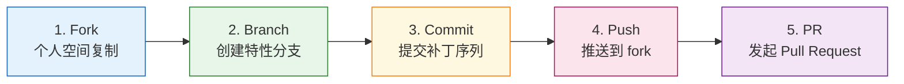

Copyright (c) 2025-2026 SPHARX Ltd. All Rights Reserved.

# agentrt-linux（AirymaxOS）Pull Request 流程规范
> **文档定位**：agentrt-linux（AirymaxOS）120-development-process 模块第 3 卷——Pull Request 流程规范。本文档详述从 fork 到 PR 合并的完整链路，是补丁生命周期（01 卷）在 GitHub PR 工作流维度的展开，规定 PR 创建、PR 模板、PR 审查、合并策略、自动关闭策略等具体操作。\
> **文档版本**：v1.0.1\
> **最后更新**： 2026-07-21\
> **上级文档**：[120-development-process README](README.md)\
> **同源映射**：agentrt PR 流程 + Linux 6.6 内核 `submitting-patches.rst`（GitHub PR 替代 git send-email）\
> **理论根基**：Linux 6.6 内核基线 + Airymax S-4 涌现性管理 + C-2 增量演化 + SSoT v2 单一权威源\
> **核心约束**：[SC] 头文件变更 PR 必须通过 `sc-dual-ci.yml` 逐字节校验；SSoT 变更 PR 必须通过 `ssot-validate.yml` 四层归属校验

---

## 1. 模块定位与范围

本文档是 120-development-process 模块的第 3 卷，回答"一个 Pull Request 如何从 fork 到合并的完整流程是什么"。它继承 Linux 6.6 内核 `submitting-patches.rst` 的补丁提交哲学，并将其适配到 agentrt-linux 的 GitHub PR 工作流。

### 1.1 与补丁生命周期的关系

补丁生命周期（01 卷）定义 6 阶段（Design → Early review → Wider review → Mainline → Stable release → LTS），本文档定义阶段 2-4（Early review → Wider review → Mainline）在 GitHub PR 工具上的具体操作规范。

### 1.2 适用范围

本文档适用于 agentrt-linux 全部 8 子仓（kernel / services / security / memory / cognition / cloudnative / system / tests-linux）以及管理仓库 `agentrt-linux-mgmt` 上的跨仓协调 PR。涉及 [SC] 头文件变更的 PR 必须额外满足第 5 节的强制要求。

### 1.3 关键术语

| 术语 | 定义 |
|------|------|
| PR | Pull Request，对应一个逻辑变更序列 |
| squash merge | 将 PR 内所有 commit 压缩为单个 commit 后合并 |
| rebase merge | 将 PR 内 commit 逐一 rebase 到目标分支后合并 |
| merge commit | 创建合并 commit 的合并方式（本项目默认不采用） |
| branch protection | 分支保护规则，禁止 force push 与直推 |
| CODEOWNERS | 文件路径到维护者的映射文件，自动请求审查 |
| DCO | Developer Certificate of Origin，开发者来源证明 |
| [SC] 头文件 | IRON-9 v3 四层模型中的 [SC] 共享契约层头文件（10 个） |

---

## 2. PR 创建流程总览

agentrt-linux 的 PR 创建遵循标准的 fork-based 工作流，禁止直接推送到主仓库。完整流程分为 5 步：fork → branch → commit → push → PR。



### 2.1 步骤 1：Fork

- **仓库选择**：在 AtomGit 上 fork `spharx/agentrt-linux`（或对应子仓）到个人命名空间。
- **同步策略**：fork 后必须执行 `git remote add upstream <官方仓库>` 并定期 `git fetch upstream` 保持同步。
- **私有 fork**：贡献者可使用私有 fork 进行早期实验，但 PR 必须从公开 fork 发起以保证 DCO 可验证。

### 2.2 步骤 2：Branch

- **分支命名**：`<type>/<scope>-<short-description>`，例如 `feat/sched-deadline-tuning`、`fix/ipc-uring-leak`、`docs/sc-header-bridge`。
- **type 取值**：`feat`（新功能）/ `fix`（缺陷修复）/ `docs`（文档）/ `refactor`（重构）/ `test`（测试）/ `chore`（构建/工具）/ `sc`（[SC] 头文件变更，必须配合 `sc-dual-ci.yml`）。
- **基线分支**：默认从 `main` 派生；若为稳定版回溯，从 `stable-vX.Y` 派生；若为 develop 集成测试，从 `develop` 派生。
- **OS-DEV-301**：分支名禁止使用 `master`、`HEAD`、纯数字、超过 80 字符的描述。

### 2.3 步骤 3：Commit

- **commit 粒度**：一个 commit 对应一个逻辑变更；一个 PR 内的多个 commit 必须按依赖顺序排列，且每个中间 commit 都能独立编译与运行（git bisect 友好）。
- **commit 数量上限**：单个 PR 最多 15 个 commit；超过必须拆分为多个 PR。
- **commit 消息格式**：见 2.4 节。
- **DCO 签名**：每个 commit 必须包含 `Signed-off-by: 真实姓名 <邮箱>`，由 `git commit -s` 自动添加。

### 2.4 Commit 消息格式

```
<subsystem>: <短摘要，不超过 70 字符>

<详细描述，每行不超过 72 字符，说明动机、方法、影响>

<空行>
Fixes: <commit-hash> ("<原始提交标题>")   # 缺陷修复必填
Closes: #<issue 编号>                       # 关联 issue
Link: <邮件列表 / RFC / 外部讨论 URL>       # 可选
Reviewed-by: <审查者> <邮箱>                # 由审查者通过时由本人添加
Tested-by: <测试者> <邮箱>                  # 可选
Signed-off-by: <作者> <邮箱>                # DCO 必填
```

- **OS-DEV-302**：commit 短摘要必须以 `子系统:` 前缀开头，例如 `sched:`、`ipc:`、`lsm:`、`mem:`、`sc:`。`sc:` 前缀触发 [SC] 专项审查流程。
- **OS-DEV-303**：涉及五大技术选型（sched_tac / IORING_OP_URING_CMD / 纯 C LSM / alloc_pages+mmap / IRON-9 v3）的 commit 必须在描述中明确说明"不影响五大选型"或"本变更为五大选型变更，已通过 SSot 评审"。

### 2.5 步骤 4：Push

- **推送目标**：推送到个人 fork，禁止直接推送 `upstream`。
- **force push 限制**：在审查期间允许 force push 以响应审查意见，但禁止 force push 已被审查者 `Reviewed-by` 标记的 commit。
- **OS-DEV-304**：force push 后必须在 PR 评论中说明变更点，并 `@` 通知已审查的维护者。

### 2.6 步骤 5：PR 创建

- **PR 目标分支**：默认 `main`；develop 集成测试 PR 目标为 `develop`；稳定版回溯 PR 目标为 `stable-vX.Y`。
- **PR 模板**：见第 3 节。
- **标签自动添加**：根据 PR 标题前缀与变更路径由 `.github/labeler.yml` 自动打标签（`sc` / `lsm` / `ipc` / `sched` / `docs`）。

---

## 3. PR 模板

所有 PR 必须使用以下模板（位于 `.github/PULL_REQUEST_TEMPLATE.md`）。模板分四节：变更摘要、影响分析、测试结果、SSoT 检查清单。

### 3.1 模板正文

```markdown
## 变更摘要
<!-- 一句话说明本 PR 做了什么 -->
本 PR <做了一件什么事>，以解决 <什么问题/动机>。

## 影响分析
- [ ] **影响范围**：本变更影响以下子系统/头文件/接口：
  - <!-- 列出受影响的子系统、[SC] 头文件、L1/L2 接口 -->
- [ ] **五大选型影响**：
  - sched_tac：☐ 不影响 / ☐ 影响（已通过 SSoT 评审）
  - IORING_OP_URING_CMD：☐ 不影响 / ☐ 影响（已通过 SSoT 评审）
  - 纯 C LSM：☐ 不影响 / ☐ 影响（已通过 SSoT 评审）
  - alloc_pages + mmap：☐ 不影响 / ☐ 影响（已通过 SSoT 评审）
  - IRON-9 v3 四层模型：☐ 不影响 / ☐ 影响（已通过 SSoT 评审）
- [ ] **ABI 影响**：☐ 无 ABI 变更 / ☐ L1 应用 API 变更 / ☐ L2 AgentsIPC 协议变更 / ☐ [SC] 头文件变更
- [ ] **向后兼容性**：☐ 完全兼容 / ☐ 兼容（含迁移路径） / ☐ 破坏性（已通过 RFC 评审）

## 测试结果
- [ ] **本地构建**：☐ 通过 / ☐ 失败（详见 <日志链接>）
- [ ] **KUnit**：☐ 通过 / ☐ 失败（覆盖的测试模块：______）
- [ ] **kselftest**：☐ 通过 / ☐ 失败（覆盖的测试套件：______）
- [ ] **性能基准**：☐ 未跑 / ☐ 通过（无回归） / ☐ 通过（有改进） / ☐ 回归（已说明）
- [ ] **新增测试**：☐ 不需要 / ☐ 已新增（测试文件：______）

## SSoT 检查清单
- [ ] **权威源引用**：本变更涉及的权威源已在以下文档登记：
  - <!-- 列出 SSoT 注册表中的条目，如 "10-architecture/10-unify-design.md §1.3" -->
- [ ] **四层归属**：本变更属于 IRON-9 v3 四层模型中的 ☐ [SC] / ☐ [SS] / ☐ [IND] / ☐ [DSL]
- [ ] **[SC] 双向评审**（仅 [SC] 变更必填）：
  - agentrt 端对应 PR：<链接>
  - 双端逐字节校验通过：☐ 是 / ☐ 否
- [ ] **DCO 签名**：所有 commit 均含 `Signed-off-by` 链
- [ ] **文档更新**：☐ 已更新对应设计文档 / ☐ 不需要
```

### 3.2 模板字段说明

| 字段 | 必填 | 说明 |
|------|------|------|
| 变更摘要 | 是 | 一句话动机，禁止"修复 bug"这类无信息描述 |
| 影响范围 | 是 | 必须列出所有受影响路径 |
| 五大选型影响 | 是 | 必须逐项勾选，"影响"项必须有 SSoT 评审记录 |
| ABI 影响 | 是 | 涉及 [SC] 头文件变更必须勾选对应项 |
| 向后兼容性 | 是 | 破坏性变更必须先有 RFC 评审通过的 issue |
| 本地构建 | 是 | 必须附本地构建日志链接 |
| KUnit / kselftest | 是 | 至少跑一项，覆盖范围必填 |
| 性能基准 | 否 | 涉及 sched / ipc / mem 路径必须跑 |
| 新增测试 | 是 | 修复类 PR 必须附回归测试 |
| 权威源引用 | 是 | SSoT 注册表对应条目编号 |
| 四层归属 | 是 | 必须勾选一层 |
| [SC] 双向评审 | 条件必填 | 仅 [SC] 变更必填，agentrt 端 PR 链接必填 |
| DCO 签名 | 是 | DCO bot 自动校验 |
| 文档更新 | 是 | 设计文档需同步更新 |

---

## 4. PR 审查要求

### 4.1 审查人数要求

| PR 类型 | 最低审查人数 | 必须包含的角色 | CI 要求 |
|---------|------------|--------------|--------|
| 普通 PR | 2 | 2 名 maintainer | CI 全绿 |
| 子系统 PR | 2 | 子系统维护者 + 顶级子系统维护者 | CI 全绿 |
| 跨仓 PR | 3 | 2 子仓维护者 + 总维护者 | CI 全绿 + 跨仓协调 |
| [SC] 头文件 PR | 3 | agentrt 端 + agentrt-linux 端 + 总维护者 | CI 全绿 + sc-dual-ci 全绿 |
| SSoT 变更 PR | 3 | SSoT 注册表维护者 + 子系统维护者 + 总维护者 | CI 全绿 + ssot-validate 全绿 |
| 五大选型变更 PR | 4 | 5 名顶级子系统维护者中至少 4 名 + 总维护者 | CI 全绿 + SSoT 委员会签字 |

### 4.2 审查 SLA

- **首次响应**：PR 创建后 48 小时内必须有 maintainer 首次响应（评论或审查）。
- **审查周期**：普通 PR 7 天内完成审查；[SC] PR 与 SSoT 变更 PR 14 天内完成审查。
- **超时升级**：超过 SLA 未响应的 PR 自动 `@` 顶级子系统维护者；再超 7 天 `@` 总维护者。
- **OS-DEV-305**：maintainer 休假期间必须在 CODEOWNERS 中标注 `@backup`，由备份维护者接管审查。

### 4.3 审查意见类型

| 标签 | 含义 | 阻断合并 |
|------|------|---------|
| `LGTM` | Looks Good To Me，认可 | 否 |
| `Reviewed-by` | 完整审查通过，记入 commit 消息 | 否 |
| `Acked-by` | 知悉并认可，但未做完整审查 | 否 |
| `NACK` | 否决，必须说明理由 | 是 |
| `Changes Requested` | 需要修改 | 是 |
| `Comment` | 一般评论 | 否 |

### 4.4 审查争议解决

- 多名审查者意见冲突时，由对应子系统的顶级维护者仲裁。
- 仲裁结果仍不服时，由总维护者最终裁决。
- 涉及五大选型的争议必须提交 SSoT 委员会审议，委员会决议为最终决议。

---

## 5. [SC] 头文件变更 PR 专项流程

[SC] 头文件是 IRON-9 v3 四层模型中的共享契约层，agentrt 与 agentrt-linux 双端必须逐字节一致。任何 [SC] 头文件变更 PR 必须额外满足以下要求。

### 5.1 双端同步要求

- **同时提交**：[SC] 变更必须在 agentrt 与 agentrt-linux 同时发起 PR，PR 描述中互相引用对方 PR 链接。
- **同时合并**：双端 PR 必须在同一合并窗口内合并，禁止单端合并（会导致双端逐字节不一致）。
- **OS-DEV-306**：任何单端合并 [SC] PR 的尝试会被 `sc-dual-ci.yml` 阻断。

### 5.2 sc-dual-ci.yml 强制校验

`sc-dual-ci.yml` 在 [SC] PR 上执行以下校验：

1. **拉取双端 PR 分支**：从 agentrt 与 agentrt-linux 分别拉取对应 PR 的分支。
2. **提取 10 个 [SC] 头文件**：从 `kernel/include/uapi/linux/airymax/*.h` 提取 10 个 [SC] 文件。
3. **逐字节比对**：使用 `diff -u` 比对双端文件，任何字节差异阻断合并。
4. **编译器无关性校验**：运行 `check-uapi-compiler-agnostic.sh`，验证头文件不含编译器扩展（GCC `__attribute__` / Clang `__builtin__` / MSVC `__declspec` 等）。
5. **UAPI 兼容性校验**：使用 `scripts/headers_compile_test.sh` 在 5 种编译器（GCC / Clang / MSVC / icx / armclang）下编译。

### 5.3 审查人数加严

- [SC] PR 审查人数加严至 3 人（见 4.1 节）。
- 必须包含 agentrt 端对应 PR 的审查者签字（通过跨仓评论 `Reviewed-by: <agentrt 端审查者>`）。
- 总维护者必须亲自审查或签字。

### 5.4 回滚特殊要求

- [SC] PR 合并后若发现严重问题需要回滚，必须双端同时回滚。
- 回滚 PR 也必须通过 `sc-dual-ci.yml` 校验。
- 单端回滚会被 `sc-dual-ci.yml` 阻断。

---

## 6. SSoT 变更 PR 专项流程

SSoT v2 单一权威源模型要求每个技术点只有一个权威源。任何 SSoT 变更 PR 必须额外满足以下要求。

### 6.1 ssot-validate.yml 强制校验

`ssot-validate.yml` 在 SSoT 变更 PR 上执行以下校验：

1. **四层归属校验**：检查变更文件是否正确归属到 [SC] / [SS] / [IND] / [DSL] 之一，归属错误的 PR 阻断。
2. **权威源唯一性**：检查变更是否引入了与已有权威源冲突的新权威源声明。
3. **[SC] 数量校验**：验证 `kernel/include/uapi/linux/airymax/` 下的 [SC] 头文件数量保持为 10 个（不可增减）。
4. **跨文档引用一致性**：验证 SSoT 注册表中的跨文档引用链接有效。
5. **五大选型守护**：验证变更未偏离五大技术选型声明。

### 6.2 SSoT 注册表更新

- 涉及权威源位置移动、重命名、新增的 PR 必须同步更新 SSoT 注册表（`50-engineering-standards/09-ssot-registry.md`）。
- 注册表更新必须由 SSoT 注册表维护者审查签字。

---

## 7. PR 合并策略

### 7.1 默认策略：Squash Merge

- **适用场景**：PR 内含多个 fixup commit 或审查迭代 commit。
- **效果**：将 PR 内所有 commit 压缩为单个 commit，commit 消息使用 PR 标题与描述。
- **优势**：保持 main 分支历史线性、简洁。
- **配置**：`main` 与 `develop` 分支默认开启 squash merge。

### 7.2 备选策略：Rebase Merge

- **适用场景**：PR 内 commit 已经过仔细拆分，每个 commit 都需要保留独立历史（如分阶段重构）。
- **效果**：将 PR 内 commit 逐一 rebase 到目标分支，保留每个 commit 的消息与签名链。
- **要求**：commit 必须按依赖顺序排列，且每个中间 commit 都能独立编译。
- **配置**：`main` 与 `develop` 分支允许 rebase merge，但需在 PR 描述中显式申请。

### 7.3 禁用策略：Merge Commit

- **适用场景**：无。
- **原因**：merge commit 会在 main 分支引入非线性的合并节点，破坏 git bisect 与 git log 的可读性。
- **配置**：`main`、`develop`、`release/*` 分支均禁用 merge commit。

### 7.4 合并权限

- **合并人**：PR 审查通过后，由对应子系统的顶级维护者或总维护者执行合并操作。
- **禁止自合并**：PR 作者禁止合并自己的 PR，即使满足审查人数要求。
- **OS-DEV-307**：CI 失败状态下禁止合并，分支保护规则强制阻断。

---

## 8. PR 关闭策略

### 8.1 自动关闭：30 天无活动

- **触发条件**：PR 在 30 天内无任何活动（评论、commit 推送、审查）。
- **预警机制**：第 21 天自动评论 `stale` 标签并 `@` 作者；第 28 天再次预警；第 30 天自动关闭。
- **重新激活**：作者可在关闭后 7 天内重新打开（仅需 push 新 commit 或评论说明），超过 7 天需创建新 PR。

### 8.2 手动关闭

- **作者主动关闭**：作者可在任何时间主动关闭自己的 PR。
- **维护者关闭**：维护者可关闭以下 PR：
  - 违反 OS-DEV-301 至 OS-DEV-307 任一规则的 PR。
  - NACK 后 14 天无响应的 PR。
  - 重复 PR（保留最早创建的）。
  - 与五大选型冲突且未通过 SSoT 评审的 PR。

### 8.3 关闭后处理

- **关闭原因**：关闭 PR 时必须评论关闭原因，便于作者后续改进。
- **关联 issue**：关闭关联 issue 的 PR 时，需在 issue 中说明后续计划。
- **OS-DEV-308**：被关闭的 PR 若要重新提交，必须创建新 PR，禁止 reopen 超过 7 天的已关闭 PR。

---

## 9. PR 标签体系

| 标签 | 含义 | 自动/手动 |
|------|------|----------|
| `sc` | [SC] 头文件变更 | 自动（按路径） |
| `lsm` | 纯 C LSM 相关 | 自动（按路径） |
| `ipc` | IORING_OP_URING_CMD 相关 | 自动（按路径） |
| `sched` | sched_tac 调度相关 | 自动（按路径） |
| `mem` | alloc_pages + mmap 相关 | 自动（按路径） |
| `ssot` | SSoT 变更 | 自动（按路径） |
| `breaking` | 破坏性变更 | 手动 |
| `needs-rfc` | 需先创建 RFC | 手动 |
| `needs-sc-dual` | 需要 [SC] 双端校验 | 自动（按路径） |
| `needs-ssot` | 需要 SSoT 校验 | 自动（按路径） |
| `needs-perf` | 需要性能基准 | 手动 |
| `good-first-pr` | 新贡献者首个 PR | 手动 |
| `stale` | 21 天无活动 | 自动 |
| `blocked` | 被外部依赖阻塞 | 手动 |

---

## 10. 跨仓 PR 协调

agentrt-linux 共有 8 子仓 + 1 管理仓库。涉及多个子仓的变更必须通过管理仓库 `agentrt-linux-mgmt` 协调。

### 10.1 跨仓 PR 类型

- **类型 A：多子仓同源变更**：同一逻辑变更需在多个子仓同时修改（如 [SC] 头文件 + kernel 实现）。
- **类型 B：依赖链变更**：子仓 A 的变更依赖子仓 B 的变更先合并。
- **类型 C：跨仓重构**：跨多个子仓的大型重构。

### 10.2 跨仓 PR 流程

1. 在 `agentrt-linux-mgmt` 创建协调 issue，列出所有涉及的子仓 PR。
2. 在每个子仓创建独立 PR，PR 描述引用协调 issue。
3. `mgmt-orchestrator.yml` 自动校验所有子仓 PR 状态，全部 ready 后才允许合并。
4. 合并顺序由协调 issue 中的依赖图决定。
5. 全部合并后，协调 issue 自动关闭。

### 10.3 跨仓 PR 合并窗口

- 跨仓 PR 必须在 72 小时合并窗口内全部合并，否则触发回滚。
- 合并窗口超时后，已合并的子仓 PR 必须回滚，避免半合并状态。

---

## 11. PR 反模式

以下行为被明确禁止，违反者会被 CI 阻断或维护者 NACK：

| 反模式 | 说明 | 后果 |
|--------|------|------|
| 巨型 PR | 单 PR 超过 15 commit 或超过 1000 行 diff | 强制拆分 |
| 混合关注点 | 单 PR 同时包含功能、重构、格式化 | 强制拆分 |
| 无 DCO 签名 | commit 缺少 `Signed-off-by` | DCO bot 阻断 |
| 无意义 commit | "fix typo"、"wip" 等无信息 commit | 强制 squash |
| 强推主仓库 | 直接 push 到 upstream main | 分支保护阻断 |
| 自合并 | 合并自己的 PR | 分支保护阻断 |
| [SC] 单端合并 | 仅 agentrt 或仅 agentrt-linux 端合并 | sc-dual-ci 阻断 |
| 绕过 SSoT | 未通过 SSoT 评审即修改权威源 | ssot-validate 阻断 |
| 隐藏破坏性变更 | 破坏性变更未在 PR 描述中声明 | NACK + 关闭 |
| 假审查 | 审查者未实际审查即 `Reviewed-by` | 撤销审查权限 |

---

## 12. 与 Airymax Unify Design 的关系

| Unify 模块 | PR 流程关系 |
|-----------|-----------|
| **A-UEF** | A-UEF [SC] `error.h` 变更 PR 必须通过 sc-dual-ci 双端校验 |
| **A-ULP** | A-ULP [SC] `log_types.h` 变更 PR 必须通过 sc-dual-ci 双端校验；128B 记录格式变更触发 SSoT 评审 |
| **A-UCS** | A-UCS 变更 PR 必须同步更新 `airy_defconfig`；选型偏离被 CI 阻断 |
| **A-ULS** | A-ULS 纯 C LSM 变更 PR 必须通过安全子系统维护者审查；引入 BPF LSM 被 CI 阻断 |
| **A-IPC** | A-IPC [SC] `ipc.h` 变更 PR 必须通过 sc-dual-ci 双端校验；引入 page flipping 被 CI 阻断 |

---

## 13. 相关文档

- [120-development-process README](README.md)：开发流程主索引
- [01-patch-lifecycle.md](01-patch-lifecycle.md)：补丁生命周期 6 阶段
- [02-maintainer-hierarchy.md](02-maintainer-hierarchy.md)：维护者层级制度
- [04-code-review.md](04-code-review.md)：代码审查标准
- [08-ci-cd-pipeline.md](08-ci-cd-pipeline.md)：CI/CD 流水线详细设计
- [../50-engineering-standards/05-development-process.md](../50-engineering-standards/05-development-process.md)：工程标准开发流程
- [../50-engineering-standards/09-ssot-registry.md](../50-engineering-standards/09-ssot-registry.md)：SSoT v2 单一权威源注册表
- [../50-engineering-standards/11-sc-header-type-bridging.md](../50-engineering-standards/11-sc-header-type-bridging.md)：[SC] 头文件类型桥接规则

---

## 14. 版本历史

| 版本 | 日期 | 变更 |
|------|------|------|
| v1.0.1 | 2026-07-18 | 初始版本：建立 PR 创建 5 步流程、PR 模板四节结构、PR 审查分级要求、[SC] 头文件专项流程、SSoT 变更专项流程、合并策略（squash 默认 / rebase 备选 / merge commit 禁用）、30 天自动关闭、跨仓 PR 协调、PR 反模式清单 |

---

> **文档结束** | agentrt-linux Pull Request 流程规范 v1.0.1 | 维护者：开源极境工程与规范委员会 | "From data intelligence emerges."
