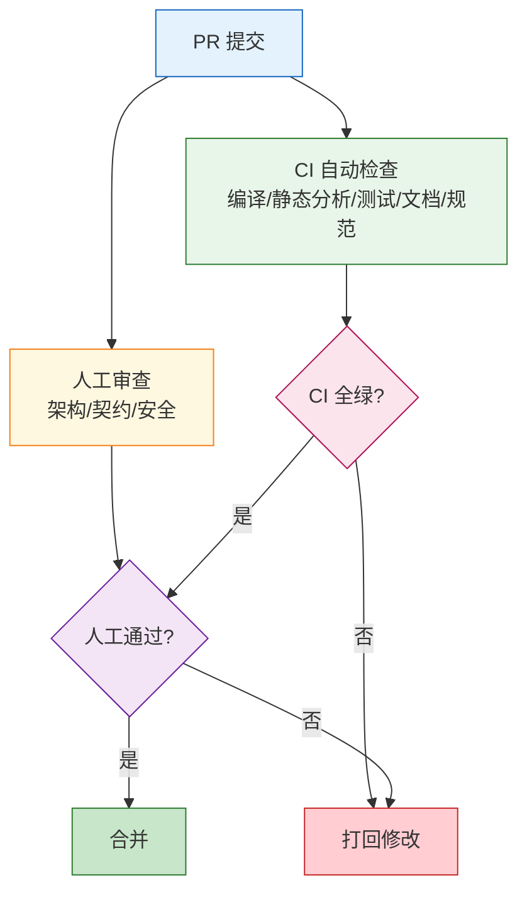
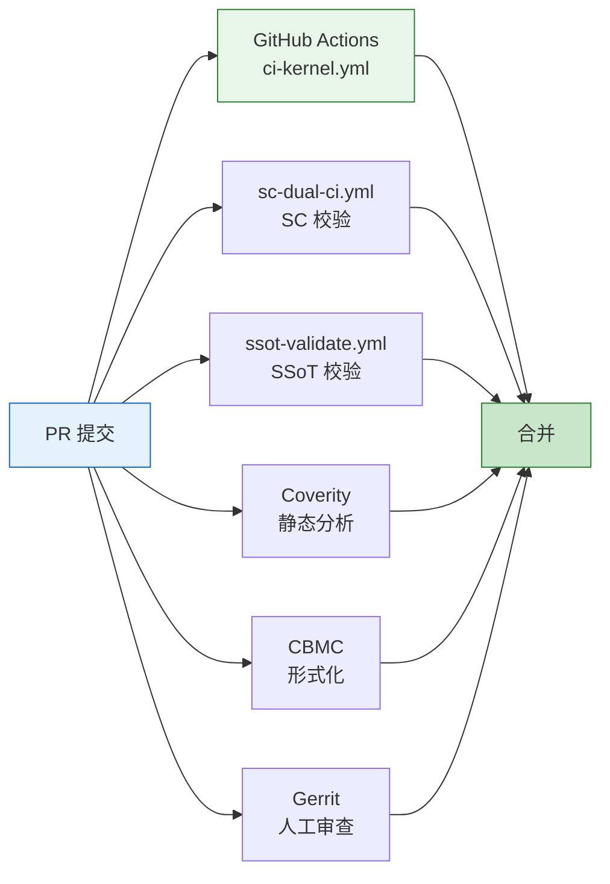

Copyright (c) 2025-2026 SPHARX Ltd. All Rights Reserved.

# agentrt-linux（AirymaxOS）代码审查标准
> **文档定位**：agentrt-linux（AirymaxOS）120-development-process 模块第 4 卷——代码审查标准。本文档详述代码审查清单、内核代码规范、[SC] 头文件审查、安全代码形式化审查、Agent 契约一致性校验、审查工具链与审查 SLA，是 Pull Request 流程（03 卷）在审查维度的展开。\
> **文档版本**：v1.0.1\
> **最后更新**： 2026-07-21\
> **上级文档**：[120-development-process README](README.md)\
> **同源映射**：agentrt 代码审查标准 + Linux 6.6 内核 `submitting-patches.rst` §4-6（审查清单与编码规范）\
> **理论根基**：Linux 6.6 内核基线 + Airymax S-4 涌现性管理 + K-2 接口契约化 + SSoT v2 单一权威源\
> **核心约束**：内核代码必须通过 `checkpatch.pl` 零 error/warning；[SC] 头文件必须通过 `check-uapi-compiler-agnostic.sh`；纯 C LSM 必须通过形式化审查

---

## 1. 模块定位与范围

本文档是 120-development-process 模块的第 4 卷，回答"代码审查查什么、用什么工具、达到什么标准、由谁审查、多久响应"。它继承 Linux 6.6 内核 `submitting-patches.rst` 第 4-6 节的审查规范，并将其适配到 agentrt-linux 的五大技术选型与 IRON-9 v3 四层模型。

### 1.1 与 Pull Request 流程的关系

Pull Request 流程（03 卷）定义 PR 的创建、合并、关闭流程，本文档定义 PR 审查阶段的具体标准、工具与 SLA。03 卷规定"PR 必须至少 2 名 maintainer 审查 + CI 全绿"，本文档规定"maintainer 审查时检查什么、CI 检查什么"。

### 1.2 适用范围

本文档适用于 agentrt-linux 全部 8 子仓以及 12 daemon（macro_d / logger_d / config_d / gateway_d / sched_d / vfs_d / net_d / mem_d / cogn_d / sec_d / audit_d / dev_d）。涉及 [SC] 头文件的审查必须额外满足第 4 节的强制要求。

### 1.3 关键术语

| 术语 | 定义 |
|------|------|
| checkpatch.pl | Linux 内核编码规范检查脚本 |
| check-uapi-compiler-agnostic.sh | [SC] 头文件编译器无关性检查脚本 |
| KUnit | Linux 内核单元测试框架 |
| kselftest | Linux 内核自测试套件 |
| Coverity | 静态分析工具（商业） |
| Sparse | Linux 内核静态分析工具（开源） |
| Smyte | 形式化验证工具（用于纯 C LSM） |
| Agent 契约 | Agent 与运行时之间的接口契约（声明式 + 运行时校验） |

---

## 2. 代码审查清单总览

所有 PR 在合并前必须通过以下 7 项审查清单。CI 自动检查 5 项，人工审查 2 项。

### 2.1 七项审查清单

| # | 审查项 | 类型 | 工具 | 通过标准 |
|---|--------|------|------|---------|
| 1 | 编译通过 | 自动 | `make` + 多架构矩阵 | 所有架构零 error |
| 2 | 静态分析通过 | 自动 | checkpatch.pl + Sparse + Coverity | 零 error/warning |
| 3 | 测试覆盖达标 | 自动 | KUnit + kselftest + 覆盖率 | 行覆盖 ≥ 80%，分支覆盖 ≥ 70% |
| 4 | 文档更新 | 自动 | 文档检查脚本 | 涉及接口/行为的变更必须更新文档 |
| 5 | 内核编码规范 | 自动 | checkpatch.pl | 零 error/warning |
| 6 | 架构与契约一致性 | 人工 | 设计文档对照 | 变更与设计文档一致，不破坏契约 |
| 7 | 安全审查 | 人工 | 形式化审查 + 安全清单 | 无高危漏洞，纯 C LSM 必须形式化审查 |

### 2.2 清单分级

- **阻断级（Blocker）**：第 1、2、5 项失败直接阻断合并。
- **强制级（Must）**：第 3、4、6、7 项失败需 maintainer 在 PR 中显式说明豁免理由。
- **建议级（Should）**：覆盖率提升、文档完善等非阻断建议。

---

## 3. 内核代码规范

### 3.1 checkpatch.pl 强制校验

- **执行命令**：`scripts/checkpatch.pl --no-tree -f <file>` 或 `--git <commit>` 模式。
- **通过标准**：**零 error、零 warning**。任何 error/warning 必须修复或显式豁免（豁免需 maintainer 签字）。
- **OS-DEV-401**：禁止使用 `// C99 风格注释`，必须使用 `/* */`。
- **OS-DEV-402**：行宽限制 80 列（与 Linux 6.6 内核一致），字符串与日志可放宽至 100 列。
- **OS-DEV-403**：缩进使用 Tab（8 字符宽），禁止空格缩进。

### 3.2 编码风格细则

| 维度 | 规则 |
|------|------|
| 命名 | 内核：snake_case；daemon：snake_case（C） / PascalCase（结构体） |
| 函数长度 | 单函数不超过 80 行（与 Linux 内核建议一致） |
| 文件长度 | 单文件不超过 2000 行，超过必须拆分 |
| 宏 | 禁止函数式宏替代函数；宏必须大写 |
| 内联 | 仅对 ≤ 3 行的热点函数使用 `static inline` |
| 错误处理 | 使用 A-UEF 统一错误码，禁止裸 errno |
| 日志 | 使用 A-ULP 统一日志，禁止 `printk` / `printf` 裸调用 |
| 内存 | 使用 `alloc_pages + mmap`（共享内存路径），禁止 `dma_alloc_coherent` |
| 锁 | 优先使用 `guard()` 与 `scoped_guard()`（Linux 6.6 引入） |

### 3.3 内核编码禁忌

| 禁忌 | 说明 | 替代方案 |
|------|------|---------|
| 引入 sched_ext | 禁止使用 `SCHED_EXT=7` 调度类 | 使用sched_tac（`SCHED_DEADLINE` / `SCHED_FIFO` / EEVDF） |
| 引入 page flipping | 禁止交换物理页实现零拷贝 | 使用 IORING_OP_URING_CMD |
| 引入 BPF LSM | 禁止通过 eBPF 程序挂载安全钩子 | 使用纯 C LSM（`airy_lsm`） |
| 引入 DMA 一致性内存 | 禁止 `dma_alloc_coherent` | 使用 `alloc_pages + mmap` |
| 引入非 [SC] 共享头 | 禁止在 `kernel/include/uapi/linux/airymax/` 之外创建共享头 | 通过 SSoT 评审后纳入 10 个 [SC] 头之一 |

### 3.4 多架构编译矩阵

内核代码必须在以下架构矩阵下编译通过：

| 架构 | 编译器 | defconfig |
|------|--------|-----------|
| x86_64 | GCC 13 / Clang 17 | `airy_defconfig` |
| aarch64 | GCC 13 / Clang 17 | `airy_defconfig` |
| riscv64 | GCC 13 | `airy_defconfig` |
| loongarch64 | GCC 13 | `airy_defconfig` |

- **OS-DEV-404**：任何架构编译失败即阻断合并。
- **OS-DEV-405**：编译器 warning 必须修复，禁止使用 `#pragma diagnostic ignored` 抑制。

---

## 4. [SC] 头文件审查

[SC] 头文件是 IRON-9 v3 四层模型中的共享契约层，agentrt 与 agentrt-linux 双端必须逐字节一致。[SC] 头文件审查标准比普通头文件更严格。

### 4.1 编译器无关性校验

- **执行脚本**：`scripts/check-uapi-compiler-agnostic.sh`。
- **校验内容**：
  - 禁止使用 GCC 扩展（`__attribute__`、`__builtin_`、`__asm__` 内联汇编等）。
  - 禁止使用 Clang 扩展（`_Clang`、`__has_feature` 等）。
  - 禁止使用 MSVC 扩展（`__declspec`、`__int64` 等）。
  - 禁止使用编译器特定的内联汇编。
  - 必须使用 C11 标准类型（`uint32_t` 而非 `unsigned long`）。
  - 必须使用固定宽度整数（`<stdint.h>`）。
- **OS-DEV-406**：[SC] 头文件违反编译器无关性即阻断合并。

### 4.2 五编译器编译测试

- **执行脚本**：`scripts/headers_compile_test.sh`。
- **测试矩阵**：

| 编译器 | 版本 | 平台 |
|--------|------|------|
| GCC | 13+ | x86_64 / aarch64 |
| Clang | 17+ | x86_64 / aarch64 |
| MSVC | 2022+ | x86_64（交叉编译） |
| icx | 2024+ | x86_64 |
| armclang | 6.20+ | aarch64 |

- **通过标准**：5 种编译器全部编译通过，零 warning。

### 4.3 ABI 稳定性校验

- **执行脚本**：`scripts/check-abi.sh`（基于 `libabigail`）。
- **校验内容**：与上一版本的 [SC] 头文件相比，不允许破坏性 ABI 变更。
- **允许的变更**：
  - 新增结构体字段（必须附加在末尾）。
  - 新增枚举值（必须附加在末尾）。
  - 新增函数声明。
- **禁止的变更**：
  - 删除或重命名已有结构体字段、枚举值、函数声明。
  - 修改字段类型、字段顺序。
  - 修改枚举值数值。

### 4.4 [SC] 头文件审查清单

| # | 检查项 | 工具 | 通过标准 |
|---|--------|------|---------|
| 1 | 编译器无关性 | `check-uapi-compiler-agnostic.sh` | 零违反 |
| 2 | 五编译器编译 | `headers_compile_test.sh` | 5/5 通过 |
| 3 | ABI 稳定性 | `check-abi.sh`（libabigail） | 无破坏性变更 |
| 4 | 双端逐字节一致 | `sc-dual-ci.yml` | diff 零字节差异 |
| 5 | 注释完整性 | 人工 | 每个结构体/字段/枚举有文档注释 |
| 6 | 类型桥接规则 | `check-sc-bridge.sh` | 符合 [SC] 类型桥接规则 |
| 7 | [SC] 数量守恒 | `ssot-validate.yml` | 保持 10 个 [SC] 头文件 |

---

## 5. 安全代码审查

### 5.1 纯 C LSM 形式化审查

纯 C LSM（`airy_lsm`）是 agentrt-linux 的安全核心，其代码必须通过形式化审查。

- **形式化工具**：使用 CBMC（C Bounded Model Checker）+ Frama-C 进行形式化验证。
- **验证范围**：
  - 安全钩子注册逻辑（`security_hook_list` 注册）。
  - 钩子回调函数的内存安全（无越界、无 use-after-free）。
  - 钩子回调函数的并发安全（无数据竞争）。
  - 钩子回调函数的控制流（无死锁、无活锁）。
- **OS-DEV-407**：纯 C LSM 代码必须附形式化验证报告，未通过验证即阻断合并。
- **OS-DEV-408**：纯 C LSM 代码禁止引入 BPF LSM 依赖，CI 强制扫描 `#include <linux/bpf_lsm.h>`。

### 5.2 安全审查清单

| # | 检查项 | 工具 | 通过标准 |
|---|--------|------|---------|
| 1 | 形式化验证 | CBMC + Frama-C | 验证通过 |
| 2 | 静态分析 | Coverity + Sparse | 零高危 |
| 3 | 内存安全 | ASan + KASan | 零错误 |
| 4 | 并发安全 | ThreadSanitizer + KernelThreadSanitizer | 零数据竞争 |
| 5 | 输入校验 | 人工 + fuzzing | 所有外部输入经过校验 |
| 6 | 权限检查 | 人工 | 所有特权操作前进行 capability 检查 |
| 7 | 信息泄露 | 人工 + 扫描脚本 | 无敏感信息写入日志 |
| 8 | 漏洞扫描 | Trivy + Snyk | 零高危 CVE |

### 5.3 安全审查人

- 纯 C LSM 代码必须由安全子系统维护者（`sec_d` 维护者）审查。
- 涉及 [SC] `lsm_types.h` 变更的 PR 必须由总维护者审查。
- 高危漏洞修复 PR 必须由 SSoT 安全委员会审议。

---

## 6. Agent 代码审查

### 6.1 Agent 契约一致性校验

Agent 代码（cognition 子仓）必须通过 Agent 契约一致性校验。

- **契约定义**：Agent 契约定义在 [SC] `agent_contract.h` 中，包括：
  - Agent 元数据（ID、版本、能力声明）。
  - Agent 接口（输入参数、输出参数、错误码）。
  - Agent 资源限制（CPU、内存、IPC 配额）。
  - Agent 生命周期（init / run / pause / resume / terminate）。
- **校验内容**：
  - Agent 实现与契约声明的接口签名一致。
  - Agent 实现遵守契约声明的资源限制。
  - Agent 实现遵守契约声明的生命周期。
- **OS-DEV-409**：Agent 代码必须通过 `check-agent-contract.sh` 校验，不一致即阻断合并。

### 6.2 Agent 代码审查清单

| # | 检查项 | 工具 | 通过标准 |
|---|--------|------|---------|
| 1 | 契约一致性 | `check-agent-contract.sh` | 一致 |
| 2 | 资源使用 | `agent-resource-tracer` | 不超契约限制 |
| 3 | IPC 协议 | `check-ipc-protocol.sh` | 符合 IORING_OP_URING_CMD 协议 |
| 4 | 错误码 | A-UEF 一致性检查 | 使用 A-UEF 错误码 |
| 5 | 日志 | A-ULP 一致性检查 | 使用 A-ULP 日志 |
| 6 | 安全沙箱 | 人工 + 沙箱测试 | 不突破沙箱限制 |
| 7 | 性能 | 性能基准 | 不超契约声明的延迟/吞吐 |

---

## 7. 12 daemon 代码审查

### 7.1 daemon 审查矩阵

| daemon | 审查重点 | 必审维护者 |
|--------|---------|-----------|
| macro_d | 监管逻辑、崩溃恢复 | system 子系统 + 总维护者 |
| logger_d | 128B 记录格式、ring buffer | memory 子系统 |
| config_d | 配置加载、A-UCS 一致性 | system 子系统 |
| gateway_d | 网络协议、认证 | net 子系统 + 安全子系统 |
| sched_d | sched_tac 实现 | kernel 子系统 + 总维护者 |
| vfs_d | 文件系统、权限 | kernel 子系统 |
| net_d | IORING_OP_URING_CMD 路径 | net 子系统 |
| mem_d | alloc_pages + mmap | memory 子系统 |
| cogn_d | Agent 调度、契约校验 | cognition 子系统 |
| sec_d | 纯 C LSM、安全钩子 | security 子系统 + 总维护者 |
| audit_d | 审计日志完整性 | security 子系统 |
| dev_d | 设备管理、热插拔 | kernel 子系统 |

### 7.2 daemon 通用审查清单

| # | 检查项 | 通过标准 |
|---|--------|---------|
| 1 | 编译 | C11 标准，零 warning |
| 2 | 静态分析 | Coverity 零高危 |
| 3 | 内存安全 | ASan 零错误 |
| 4 | 并发安全 | ThreadSanitizer 零数据竞争 |
| 5 | 错误处理 | 使用 A-UEF 错误码 |
| 6 | 日志 | 使用 A-ULP 统一日志 |
| 7 | 配置 | 使用 A-UCS 统一配置 |
| 8 | IPC | 使用 A-IPC（IORING_OP_URING_CMD） |
| 9 | 监管 | 接入 A-ULS（macro_d 监管） |
| 10 | 测试 | 行覆盖 ≥ 80%，分支覆盖 ≥ 70% |

---

## 8. 审查工具链

### 8.1 CI 自动化工具

| 工具 | 用途 | 触发 | workflow |
|------|------|------|---------|
| checkpatch.pl | 内核编码规范 | 每个 PR | `ci-kernel.yml` |
| Sparse | 内核静态分析 | 每个 PR | `ci-kernel.yml` |
| Coverity | 静态分析（商业） | nightly | `nightly.yml` |
| KUnit | 内核单元测试 | 每个 PR | `ci-kernel.yml` |
| kselftest | 内核自测试 | 每个 PR | `ci-kernel.yml` |
| ASan / KASan | 内存安全 | nightly + PR | `ci-kernel.yml` + `nightly.yml` |
| ThreadSanitizer | 并发安全 | nightly | `nightly.yml` |
| libabigail | ABI 稳定性 | 每个 PR（[SC] 变更） | `sc-dual-ci.yml` |
| CBMC / Frama-C | 形式化验证 | 每个 PR（纯 C LSM 变更） | `ci-kernel.yml` |
| Trivy / Snyk | 漏洞扫描 | nightly + release | `nightly.yml` + `release.yml` |
| `check-uapi-compiler-agnostic.sh` | [SC] 编译器无关性 | 每个 PR（[SC] 变更） | `sc-dual-ci.yml` |
| `check-abi.sh` | ABI 稳定性 | 每个 PR（[SC] 变更） | `sc-dual-ci.yml` |
| `check-agent-contract.sh` | Agent 契约一致性 | 每个 PR（cognition 变更） | `ci-kernel.yml` |
| `ssot-validate.yml` | SSoT 校验 | 每个 PR（SSoT 变更） | `ssot-validate.yml` |

### 8.2 人工审查工具

- **Gerrit**：用于代码增量审查，支持行级评论、按文件分组、审查状态机。
- **GitHub PR review**：用于 PR 级审查，支持 commit 序列审查、范围审查。
- **Patchwork**：用于补丁追踪（与 Linux 内核兼容），支持补丁状态机。

### 8.3 工具协同

---

## 9. 审查 SLA

### 9.1 首次响应 SLA

- **目标**：PR 创建后 48 小时内必须有 maintainer 首次响应（评论或审查）。
- **超时升级**：
  - 48 小时未响应：自动 `@` 顶级子系统维护者。
  - 96 小时未响应：自动 `@` 总维护者。
  - 7 天未响应：在开发周会上人工升级。

### 9.2 审查完成 SLA

| PR 类型 | 首次响应 | 审查完成 |
|---------|---------|---------|
| 普通 PR | 48 小时 | 7 天 |
| 子系统 PR | 48 小时 | 7 天 |
| 跨仓 PR | 24 小时 | 14 天 |
| [SC] PR | 24 小时 | 14 天 |
| SSoT 变更 PR | 24 小时 | 14 天 |
| 安全修复 PR | 12 小时 | 72 小时 |
| 五大选型变更 PR | 24 小时 | 21 天 |

### 9.3 SLA 监控

- **监控工具**：`stale-pr-bot`（自研），每日扫描 PR 状态。
- **报表**：每周生成本周 SLA 达成率报表，发布到开发周会。
- **OS-DEV-410**：连续 4 周 SLA 达成率低于 80% 的子系统，由总维护者介入审查维护者负载。

---

## 10. 审查决策与争议

### 10.1 审查决策类型

| 决策 | 标签 | 含义 | 后续 |
|------|------|------|------|
| 通过 | `Reviewed-by` | 完整审查通过 | 记入 commit 消息 |
| 知悉 | `Acked-by` | 知悉并认可，未完整审查 | 记入 commit 消息 |
| 认可 | `LGTM` | 认可 | 不记入 commit 消息 |
| 修改 | `Changes Requested` | 需要修改 | 阻断合并 |
| 否决 | `NACK` | 否决，必须说明理由 | 阻断合并 |
| 测试 | `Tested-by` | 测试通过 | 记入 commit 消息 |
| 报告 | `Reported-by` | 报告问题 | 记入 commit 消息（仅修复 commit） |
| 建议 | `Suggested-by` | 建议方案 | 记入 commit 消息 |

### 10.2 争议解决

- **同级争议**：两名同级审查者意见冲突，由对应子系统的顶级维护者仲裁。
- **跨级争议**：作者与审查者冲突，由上一级维护者仲裁。
- **顶级争议**：顶级维护者之间冲突，由总维护者最终裁决。
- **五大选型争议**：必须提交 SSoT 委员会审议，委员会决议为最终决议。
- **OS-DEV-411**：争议期间 PR 状态标记为 `blocked`，禁止合并。

---

## 11. 与 Airymax Unify Design 的关系

| Unify 模块 | 审查关系 |
|-----------|---------|
| **A-UEF** | A-UEF 错误码使用一致性是审查必检项；新增错误码必须通过 SSoT 评审 |
| **A-ULP** | A-ULP 日志使用一致性是审查必检项；128B 记录格式变更触发 [SC] 专项审查 |
| **A-UCS** | A-UCS 配置一致性是审查必检项；`airy_defconfig` 变更必须由总维护者审查 |
| **A-ULS** | A-ULS 纯 C LSM 变更必须通过形式化审查；引入 BPF LSM 被 CI 阻断 |
| **A-IPC** | A-IPC IORING_OP_URING_CMD 路径变更必须通过性能回归测试；引入 page flipping 被 CI 阻断 |

---

## 12. 相关文档

- [120-development-process README](README.md)：开发流程主索引
- [01-patch-lifecycle.md](01-patch-lifecycle.md)：补丁生命周期 6 阶段
- [02-maintainer-hierarchy.md](02-maintainer-hierarchy.md)：维护者层级制度
- [03-pull-requests.md](03-pull-requests.md)：Pull Request 流程规范
- [08-ci-cd-pipeline.md](08-ci-cd-pipeline.md)：CI/CD 流水线详细设计
- [../50-engineering-standards/05-development-process.md](../50-engineering-standards/05-development-process.md)：工程标准开发流程
- [../50-engineering-standards/09-ssot-registry.md](../50-engineering-standards/09-ssot-registry.md)：SSoT v2 单一权威源注册表
- [../50-engineering-standards/11-sc-header-type-bridging.md](../50-engineering-standards/11-sc-header-type-bridging.md)：[SC] 头文件类型桥接规则
- [../110-security/07-airy-lsm-design.md](../110-security/07-airy-lsm-design.md)：纯 C LSM 设计
- [../80-testing/README.md](../80-testing/README.md)：测试体系

---

## 13. 版本历史

| 版本 | 日期 | 变更 |
|------|------|------|
| v1.0.1 | 2026-07-18 | 初始版本：建立 7 项审查清单、内核代码规范（checkpatch 零 error/warning）、[SC] 头文件审查（编译器无关性 + 五编译器 + ABI 稳定性）、纯 C LSM 形式化审查、Agent 契约一致性校验、12 daemon 审查矩阵、审查工具链（CI 自动化 + 人工）、审查 SLA（48 小时首次响应） |

---

> **文档结束** | agentrt-linux 代码审查标准 v1.0.1 | 维护者：开源极境工程与规范委员会 | "From data intelligence emerges."
